# Front Matter

<!-- PDF source page: 1 -->

**AMD64 Technology**

# AMD64 Architecture Programmer’s Manual Volume 2: System Programming

**Volume 2: System Programming**

**Publication No. Revision Date**

24593 3.44 March 2026

<!-- PDF source page: 2 -->

The information contained herein is for informational purposes only, and is subject to change without notice. While every precaution has been taken in the preparation of this document, it may contain technical inaccuracies, omissions and typographical errors, and AMD is under no obligation to update or otherwise correct this information. Advanced Micro Devices, Inc. makes no representations or warranties with respect to the accuracy or completeness of the contents of this document, and assumes no liability of any kind, including the implied warranties of noninfringement, merchantability or fitness for particular purposes, with respect to the operation or use of AMD hardware, software or other products described herein. No license, including implied or arising by estoppel, to any intellectual property rights is granted by this document. Terms and limitations applicable to the purchase or use of AMD products are as set forth in a signed agreement between the parties or in AMD Standard Terms and Conditions of Sale. Any unauthorized copying, alteration, distribution, transmission, performance, display or other use of this material is prohibited.

**Trademarks**

AMD, the AMD arrow logo, and combinations thereof, AMD Virtualization and 3DNow! are trademarks of Advanced Micro Devices, Inc. Other product names used in this publication are for identification purposes only and may be trademarks of their respective companies.

MMX is a trademark and Pentium is a registered trademark of Intel Corporation.

HyperTransport is a licensed trademark of the HyperTransport Technology Consortium.

<!-- PDF source page: 36 | printed page: xxxvi -->

## Revision History

| Date | Revision | Description |
| --- | --- | --- |
| March 2026 | 3.44 | Corrected Figure 15-32 in Section 15.36.21.3, ”Secure AVIC Control MSR,” on page 619. |
| June 2025 | 3.43 | Added new features: • AVX512 in Section 11, ”SSE, MMX, and x87 Programming,” on page 342 and throughout the document. • Segmented RMP in Section 15.36.22 on page 621. • Guest Intercept Control in Section 15.36.23 on page 623. • Support for up to 4096 vCPUs in x2AVIC mode in Section 15.29, ”Advanced Virtual Interrupt Controller,” on page 563. • Selective Branch Prediction Barrier (SBPB) in Section 3.2.9, ”Speculation Control Registers,” on page 66. • Enhanced Return Address Predictor Security (ERAPS) in Section 3.2.9, ”Speculation Control Registers,” on page 66 and Section 15.37.2, ”ERAPS Virtualization,” on page 624. • PREC RET in PerfEvtSeln MSR in Section 13.2.1, ”Performance Counter MSRs,” on page 411. • 4 Kbyte coalesced IBS Fetch L1 TLB Page Size in Section 13.3.2, ”IBS Fetch Sampling Registers,” on page 425. Corrected: • #CP Error Codes in Section 8.4.3, ”Control-Protection Error Code,” on page 263. • CET U and CET S component identification in Section 18.13, _ _ ”XSAVE/XRSTOR,” on page 691. |
| March 2024 | 3.42 | Added new features: • Replaced MOESI with MOESDIF protocol in Section 7.3, ”Memory Coherency and Protocol,” on page 192. • Indirect Branch Prediction Barrier on Entry under in Section 15.36.17, ”Side- Channel Protection,” on page 615. • Idle HLT intercept in Section 15.9, ”Instruction Intercepts,” on page 513. • Allowed SEV Features in Section 15.36.20 on page 617. • Secure AVIC in Section 15.36.21 on page 618. • Performance Monitoring Counter Virtualization in Section 15.39 on page 626. |

Rendered source page 36 (figures/tables)

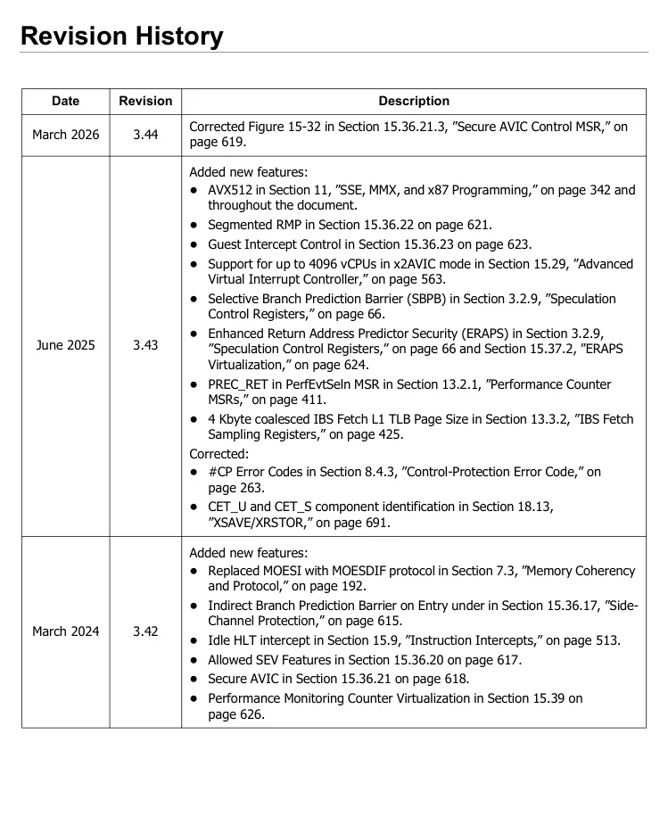

<!-- PDF source page: 37 | printed page: xxxvii -->

| Date | Revision | Description |
| --- | --- | --- |
| June 2023 | 3.41 | Added the following corrections/clarifications: Section 2.5.2, Added that an exception exists when Upper Address Ignore (UAI) is enabled. Section 15.30.4: Removed statement that "software must not attempt to read or write the host save-state area directly." Added AE Exitcode A5h, VMEXIT BUSLOCK, to Table 15-35 Section 15.36.13: Removed sentence: "Note that the DR6 and DR7 registers are always swapped as type ‘A’ state for any SEV guest." Added new MSRs to Table A-1. Added new features: Bus Lock: Section 7.3.3, section 8.2.2, Figure 13.2, Figure 13.4, section 13.1.3.6, section 15.14.5, Tables B-1 and C-1. Collaborative Processor Performance Control (CPPC): Section 17.6 and Section A.14. Platform Quality of Service: Chapter 19 and Section A.13. |
| January 2023 | 3.40 | Added the following corrections/clarifications: Replaced figure 5-17 with correct drawing Added paragraph at end of section 7.3.2 Corrected description for the “Valid” field in the LastBranchStackToIp MSR documentation in section 13.1.1.9 Corrected heading text for first and second columns of table 13-3 Corrected heading level of section 13.3.5, IBS Filtering Removed a duplicate paragraph from section 15.34.10 |

Rendered source page 37 (figures/tables)

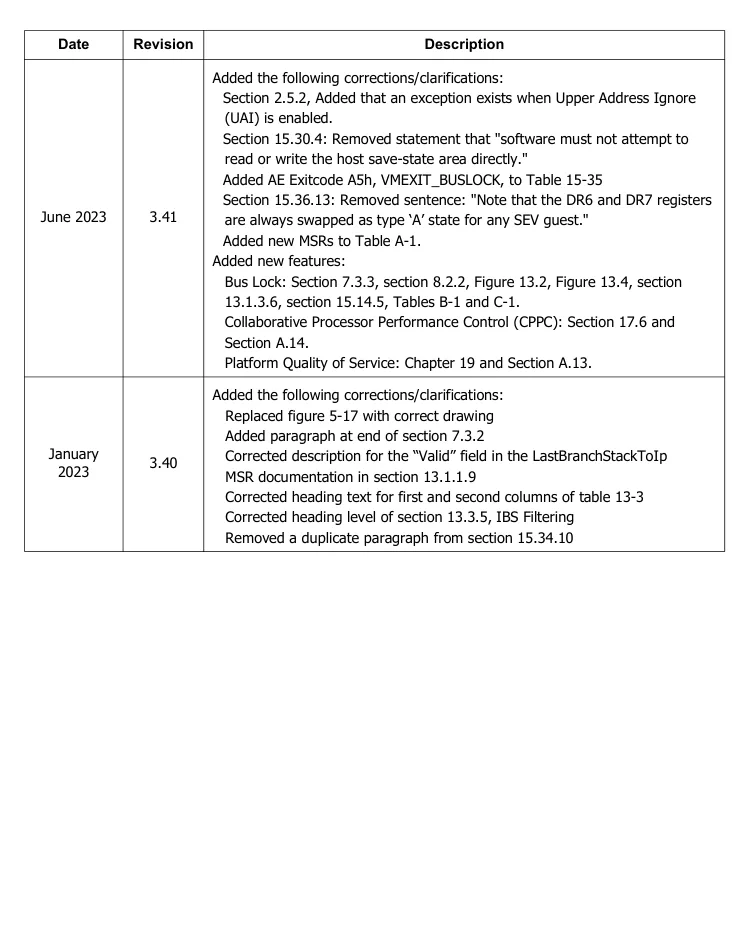

<!-- PDF source page: 38 | printed page: xxxviii -->

| Date | Revision | Description |
| --- | --- | --- |
| November 2022 | 3.39 | Added corrections/clarifications to: Write combining memory type in section 7.4 Added new features: 5-level paging in section 5.3 Automatic IBRS in section 3.1.7 Section 7.10.9 Secure Multi-Key Memory Encryption CPUID disable for non-privileged software in section 3.2.10 Section 7.6.6 L3 Cache Range Reservation Last Branch Record Stack in section 13.1.1.8 Core Performance Global Control Register in section 13.2.1 Core Performance Counter Status Registers in section 13.2.1 Section 13.3.4.1 IBS Filtering Section 15.21.10 NMI Virtualization Read Only Guest Page Tables in section 15.25.5 Section 15.29.10 x2AVIC VMGEXIT Parameter in section 15.35.6 VMPL Supervisor Shadow Stack in section 15.36.7 Virtual TOM MSR in section 15.36.8 SMT Protection for SEV-SNP VMs in section 15.36.17 Section 15.36.19 SEV-SNP Instruction Virtualization Section 15.38 Instruction-Based Sampling Virtualization |
| November 2021 | 3.38 | Added corrections/clarifications to: Address generation in Section 4.5.3. PCID behavior in Section 5.5. Machine Check Exception in Section 8.2.18. SEV Status MSR in Section 15.34.10. SEV SNP in Sections 15.36.7, .10, .17. VMCB and VMSA contents in Appendix B. SVM Intercepts in Appendix C. Added new features: Chapter 5: Upper Address Ignore. Chapter 9, Section 3.2.6 and Appendix A: Machine Check Architecture Extension. Section 15.36: VMSA Register Protection, SEV-SNP VMSA Register Protection and Secure TSC. |

Rendered source page 38 (figures/tables)

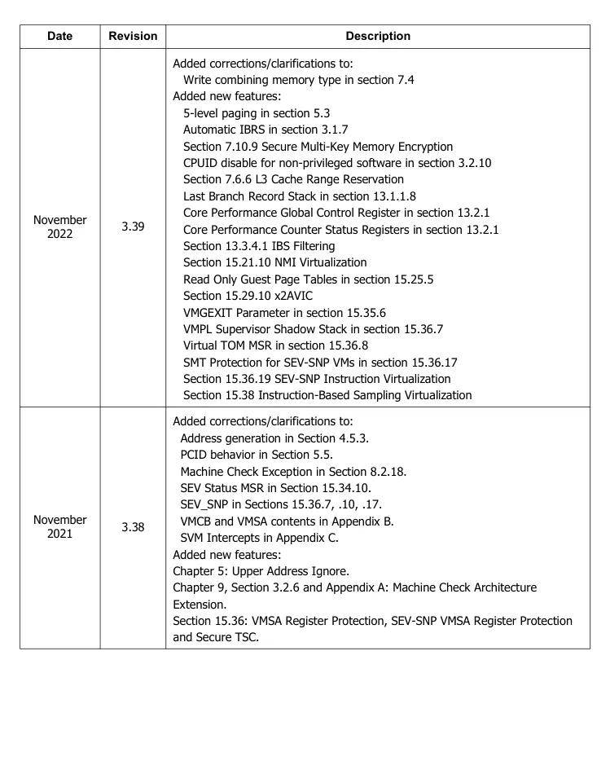

<!-- PDF source page: 39 | printed page: xxxix -->

| Date | Revision | Description |
| --- | --- | --- |
| March 2021 | 3.37 | Added SPEC CTRL and PRED CMD support. _ _ Added x2APIC support. Added SMM Page Configuration Lock. Corrected the AMD64 Architecture SMM State-Save Area table. Add new section: APERF Read-only (AperfReadOnly). Updated the MSRs of the AMD64 Architecture table. Updated the Machine-Check MSR Cross-Reference table. Updated the Performance-Monitoring MSR Cross-Reference table. Updated the Secure Virtual Machine MSR Cross-Reference table. Added new section: Speculation Control MSRs. |
| August 2020 | 3.36 | Added Shadow Stack support. Chapter 3: Section 3.1: Added content. Section 3.1.3: Added bit 23 and new content. Section 3.2.7: Added Shadow Stack Registers as new section 3.2.7. Chapter 5: Section 5.6: Updated content. Chapter 6: Added content to Table 6-1. Added section 6.7. Chapter 7: Table 7-3. Updated. Chapter 8: Table 8-1 and Table 8-2: Added content. Section 8.4: Updated content. Section 8.4.2: Added content. Added #CP as new section 8.2.20. Table 8-8: Added content. Added new Shadow Stack section 8.7.6. Section 8.9: Added bullet. Added new 8.9.4.1 section. Chapter 10: Updated Table 10-1. Section 10.4: Added bullet. Chapter 11: Section 11.5.2 and Figure 11-8: Updated table and figure. Section 11.5.8: Updated Table 11-3. Chapter 12: Section 12.2.2: Updated. Section 12.2.4: Updated Figure 12-6. Section 12.3.2: Updated content and added bullets. Chapter 15: Section 15.5.1: Updates. Section 15.15.3: Updated Figure 15-4. Section 15.25.6: Added bullet. Section 15.29.1. Updates. Section 15.29.4.1: Added content. Section 15.29.8.2: Added content. Added Chapter 18. Appendix A: Table A-1: Added content. Added new section A.10. Appendix B: Table B-1, Table B-2, and Table 4: Added content. |
| May 2020 | 3.35 | Sections 5.6.1 and 5.6.6: Minor updates. Figure 5-16: Updated figure. |

Rendered source page 39 (figures/tables)

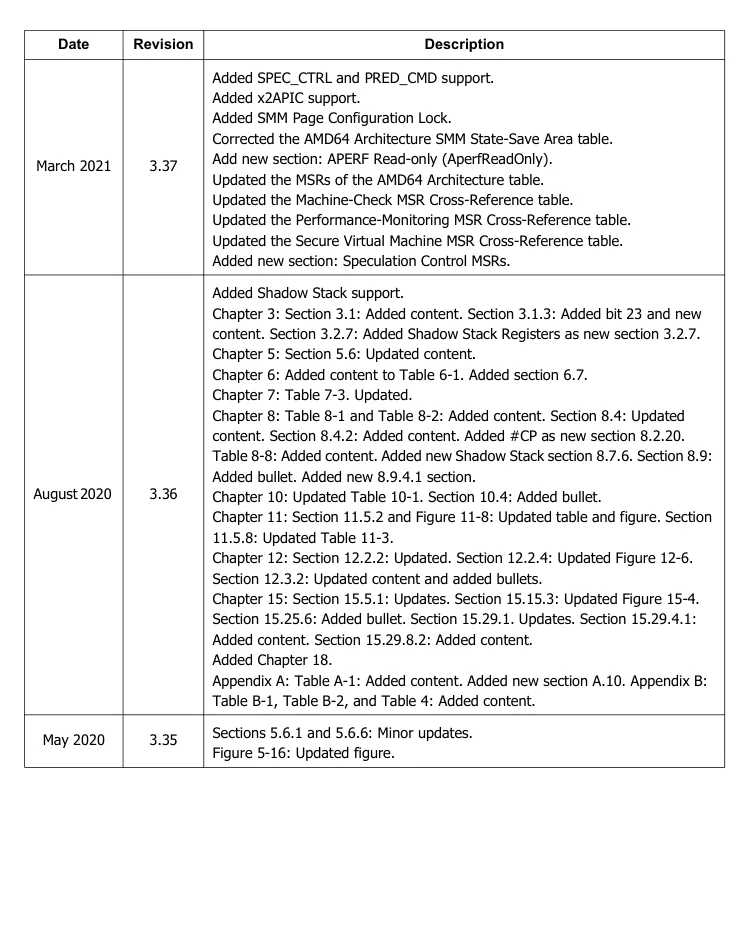

<!-- PDF source page: 40 | printed page: xl -->

| Date | Revision | Description |
| --- | --- | --- |
| April 2020 | 3.34 | Section 3.1.3: Updated register information. Added PCIDE and PKE registers. Updated (TCE) content. Section 5.3.2: Added Process Context Identifier register information and register figure. Section 5.3.3: Updated figure. Section 5.3.4: Updated figure. Section 5.3.5: Updated figure. Section 5.4.1: Added (MPK) register information. Section 5.5.1: Inserted Process Context Identifiers as Section 5.5.1. Section 5.5.3: Added bullets to Implicit Invalidations list. Section 5.6: Updated content. Section 8.2.15: Added bullet. Section 8.4.2: Updated register figure and added PK register information. Section 11.5.2: Updated register figure and table. Section 14.1.3: Updated table. Section 15.9: Updated table. Appendix B: Updated table. Appendix C: Updated table. |

Rendered source page 40 (figures/tables)

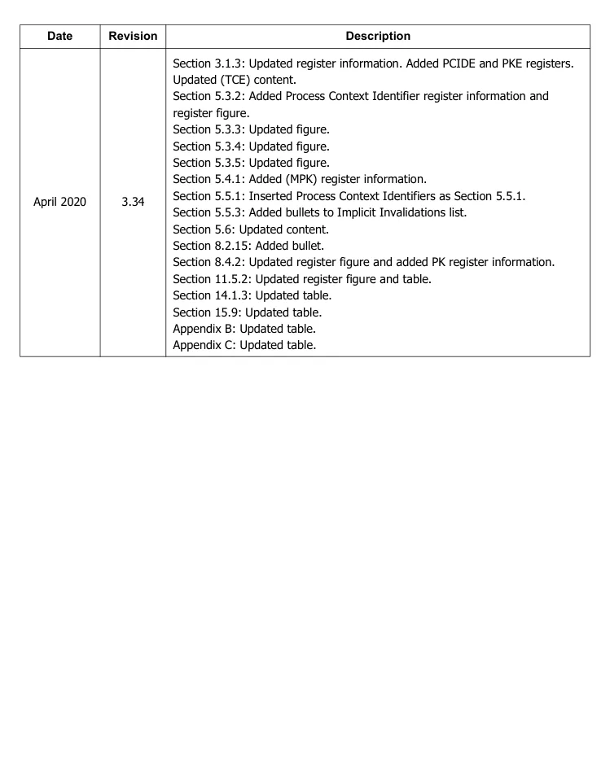

<!-- PDF source page: 41 | printed page: xli -->

| Date | Revision | Description |
| --- | --- | --- |
| April 2020 | 3.33 | Section 1.1.2: Clarification on address size support. Section 3.2.1: New feature enable bits in SYSCFG MSR. Section 7.6.5: Updated terminology. Section 7.10.6: Clarification to encrypted memory operation. Section 8.1.4: Clarification to IRET and NMI behavior. Tables 8-1 and 8-2: Added #HV exception. Inserted new 8.2.20 section for #HV exception. Section 8.4.2: Changes for SEV-SNP extension. Table 8-8: Added SEV-related exceptions. Figure 10-6: Updated I/O Restart DWORD. Section 15 and 15.1: General updates. Section 15.5.2: Relocated VMLOAD/VMSAVE documentation. Section 15.2.4 and 15.2.6: Updated content. Section 15.6: Added content. Table 15-7: Added content. Section 15.25.6: Clarification. Section 15.25.13: General clarifications. Section 15.33.1 and 15.33.2: General clarifications. Section 15.34.3, 15.34.7, and 15.34.10: Clarifications, and additions for SEV- SNP. Table 15-35: Added content. Section 15.35.8: Corrected terminology. Section 15.36: Added SEV-SNP extension documentation. Table A-1 and Table A-7: Added SEV-SNP related MSRs. Appendix B: Updates for SEV-SNP extension. Table C-1: Added exit code for SEV-SNP extension. |
| October 2019 | 3.32 | Added UMIP, XSS, GMET, VTE, MCOMMIT, and RDPRU. |
| July 2019 | 3.31 | Added CLWB and WBNOINVD details. Clarified FP error pointer save/restore behavior. Corrected description of APIC Software Enable functionality. Clarified canonical address checking behavior. Clarified fault generation. March 2026n for instructions that cross page or segment boundaries. |

Rendered source page 41 (figures/tables)

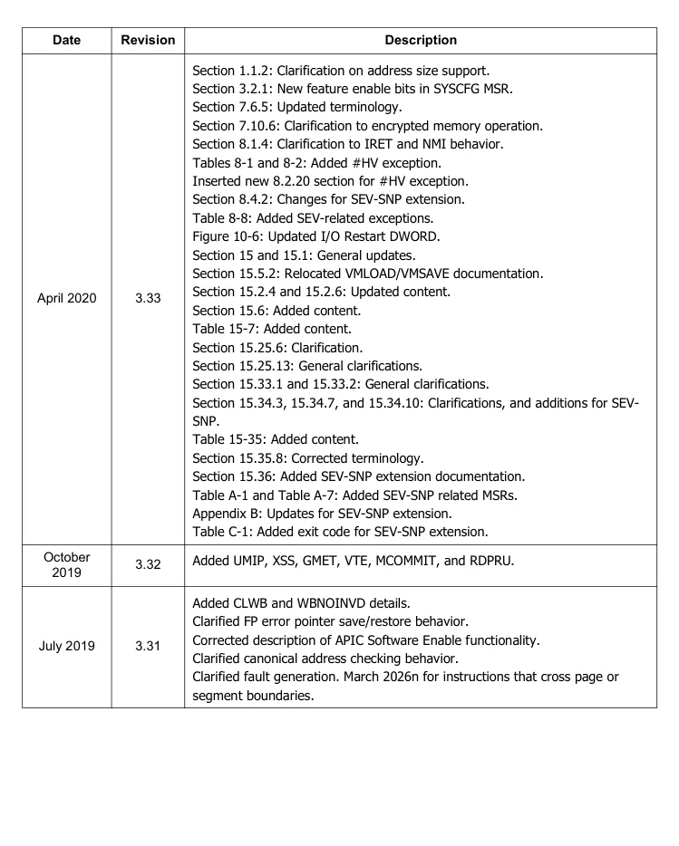

<!-- PDF source page: 42 | printed page: xlii -->

| Date | Revision | Description |
| --- | --- | --- |
| September 2018 | 3.30 | Modified Section 7.4 Modified Section 7.6.4 Modified Section 8.5.2 Modified Section 9.2 Corrected Figure 9-4 Corrected Table 9-1 Modified Section 9.3.2 Corrected Figure 9-6 Corrected Table 9-4 Modified Section 14.2.3 Modified Section 14.4 Modified Section 15.6 Modified Section 15.7 Modified Section 15.34.9 Modified Section 15.34.10 Modified Section 15.35.2 Corrected Table B-4 in Appendix B |
| December 2017 | 3.29 | Modified Sections 7.10.1 and 7.10.4. Modified Sections 15.34.1, 15.34.7. Added new Section 15.34.10. Modified Section 15.35.10. Modified Appendix A, Table A-7. |
| March 2017 | 3.28 | Modified CR4 Register, Section 3.1.3. Removed UD2 in Table 6-1. Added new bullet in Section 7.1.1. Modified Note in Table 7-1. Added new Section 7.4.1. Clarified Self Modifying Code in Section 7.6.1. Added UD0 and UD1 instructions in Section 8.2.7. Added Instructions Retired Performance counter in Section 13.1.1. Modified Table in Section 15.34.9. |

Rendered source page 42 (figures/tables)

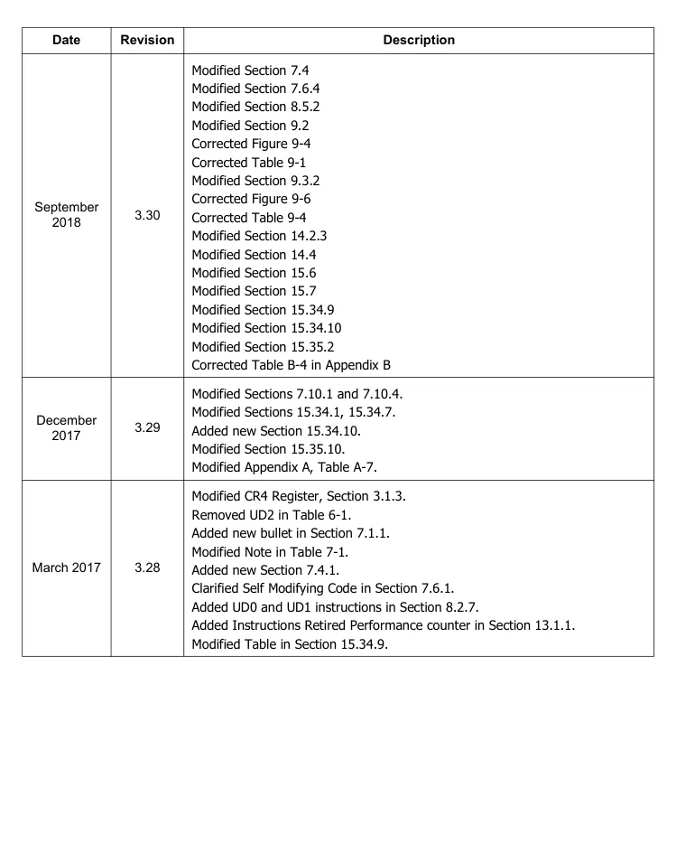

<!-- PDF source page: 43 | printed page: xliii -->

| Date | Revision | Description |
| --- | --- | --- |
| December 2016 | 3.27 | Added Resume Flag (RF) Bit in Section 3.1.6, ”RFLAGS Register,” on page 51. Added Tom2ForceMemTypeWB in Section 3.2.1, ”System Configuration Register (SYSCFG),” on page 60. Clarified SYSCALL and SYSRET in Section 6.1.1, ”SYSCALL and SYSRET,” on page 174. Added Section 7.3.2, ”Access Atomicity,” on page 195. Updated Note b in Table 7-12 on page 232. Modified Table 8-1, “Interrupt Vector Source and Cause,” on page 246. Modified Table 8-2, “Interrupt Vector Classification,” on page 247. Added Section 8.2.22, ”#VC—VMM Communication Exception (Vector 29),” on page 261. Added a Note in Chapter 10, "System-Management Mode," on page 324. Added Section 10.5, ”Multiprocessor Considerations,” on page 341. Updated CPUID 8000 001F[EAX] and added CPUID 8000 001F[EDX] _ _ in Section 15.34.1, ”Determining Support for SEV,” on page 589. Added new Section 15.35, ”Encrypted State (SEV-ES),” on page 595. Clarified TSC Ratio MSR in Section 15.30.5 ”TSC Ratio MSR (C000 0104h)” on page 585. Modified Appendix B, ”VMCB Layout” on page 737. Added Table B-3, “Swap Types,” on page 747. Added Codes 8Fh, 90h-9Fh, and 403h in Table C-1, “SVM Intercept Codes,” on page 756. |
| April 2016 | 3.26 | Clarification on loading a null selector into FS or GS added in Section 4.5.3, ”Segment Registers in 64-Bit Mode,” on page 80 Translation table diagrams corrected for definition of bit 8 in Section 5.5, ”Translation-Lookaside Buffer (TLB),” on page 157 CR0.CD implementation-dependent behavior noted in Section 7.6.2, ”Cache Control Mechanisms,” on page 207 Added clarification on IST usage in Section 8.9.4, ”Interrupt-Stack Table,” on page 285. Added new Section 7.10, ”Secure Memory Encryption,” on page 238. Added guideline for secure AP startup in Section 15.27.8, ”Secure Multiprocessor Initialization,” on page 561 Added TLB maintenance requirement for multiprocessor VM's in Section 15.29.4, ”VMCB Changes for AVIC,” on page 569. Added new Section 15.34, ”Secure Encrypted Virtualization,” on page 588 |
| June 2015 | 3.25 | Added new section 15.33 Nested Virtualization for coverage of VMSAVE and VMLOAD Virtualization and Virtual GIF. Various minor edits. |

Rendered source page 43 (figures/tables)

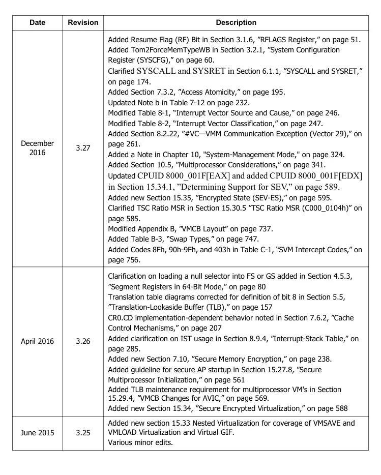

<!-- PDF source page: 44 | printed page: xliv -->

| Date | Revision | Description |
| --- | --- | --- |
| October 2013 | 3.24 | Added description of Supervisor-Mode Execution Prevention. See Section 5.6.5 ”Supervisor-Mode Execution Prevention (CR4.SMEP) Bit” on page 164. Indicated the deprecation of the Processor Feedback Interface. See Section 17.4, ”Processor Feedback Interface,” on page 669. Added Section 17.5, ”Processor Core Power Reporting,” on page 669. |
| May 2013 | 3.23 | Clarified guidelines for implementing cross-modifying code in the sub-section ”Cross-Modifying Code” on page 206. Added AVIC description. See Section 15.29, ”Advanced Virtual Interrupt Controller,” on page 563. Added L2I PMC architecture definition. See Section 13.2, ”Performance Monitoring Counters,” on page 411. |
| September 2012 | 3.22 | Clarified processor behavior on write of EFER[LMA] bit in Section 3.1.7 ”Extended Feature Enable Register (EFER)” on page 55. Clarified difference between cold reset and warm reset in Section 9.3, ”Machine Check Architecture MSRs,” on page 301. Added information on FFXSR feature bit to Table 11-5 on page 343. Clarified SMM code responsibility to manage VMCB clean bits. See Section 15.15.2, ”Guidelines for Clearing VMCB Clean Bits,” on page 526. Added a note to Table 15-9 on page 529 to indicate that all encodings of TLB CONTROL not defined are reserved. Corrected information concerning the assignment of logical APIC IDs in Section 16.6.1, ”Receiving System and IPI Interrupts,” on page 645. |
| March 2012 | 3.21 | Added definition of processor feedback interface—frequency sensitivity monitor (See Section 17.4, ”Processor Feedback Interface,” on page 669) Added Instruction-Based Sampling in a new section of Chapter 13 (See Section 13.3, ”Instruction-Based Sampling,” on page 424.) Reworked Introduction and first section of Chapter 9, "Machine Check Architecture," on page 296 and added deferred error handling. Added description of CR4[FSGSBASE] bit. (See Section 3.1.3, ”CR4 Register,” on page 46.) Added references to the RDFSBASE, RDGSBASE, WRFSBASE, and WRGSBASE instructions in discussion of FS and GS segment descriptors. (See ”FS and GS Registers in 64-Bit Mode” on page 80) Added Section 6.3.2, ”Accessing Segment Register Hidden State,” on page 179. |
| December 2011 | 3.20 | Clarified description of the Cache Disable (CD) memory type in Section 7.4 ”Memory Types” on page 198. Added caveat: an overflow of either APERF or MPERF can invalidate the effective frequency calculation. See Section 17.3, ”Determining Processor Effective Frequency,” on page 667. Other minor editorial changes. |

Rendered source page 44 (figures/tables)

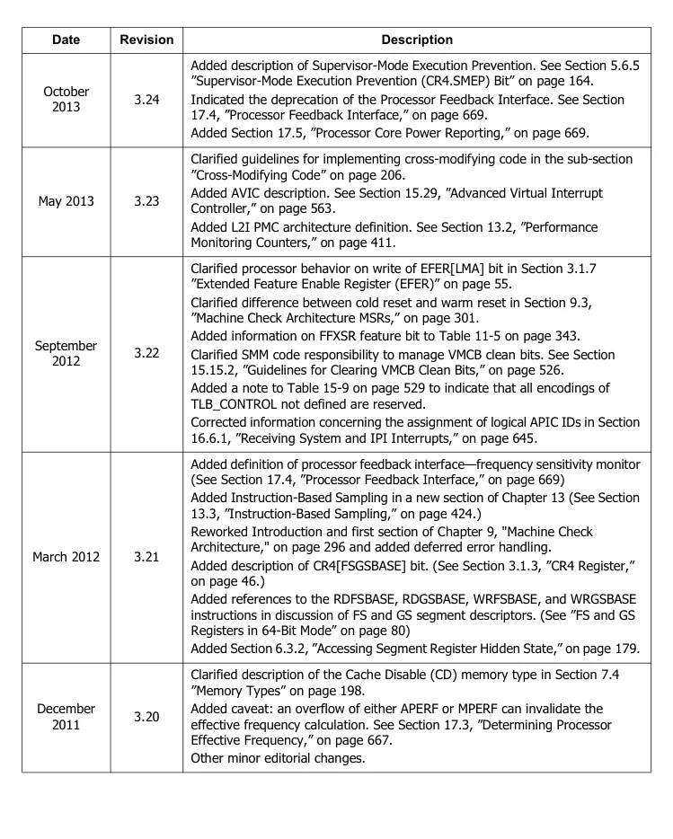

<!-- PDF source page: 45 | printed page: xlv -->

| Date | Revision | Description |
| --- | --- | --- |
| September 2011 | 3.19 | Added XSAVEOPT to discussions on XSAVE. Corrections to discussion on multiprocessor memory access ordering in Chapter 7. Added discussion of extended core and northbridge performance counters and feature indicators to Chapter 13. Added Lightweight Profiling (LWP) to Chapter 13. Added Global Timestamp Counter, Continuous Mode to LWP description Clarification: Function of pin A20M# is only defined in real mode. Statement added to Section 1.2.4, ”Real Addressing,” on page 10. Eliminated hardware P-state references |
| May 2011 | 3.18 | Added information for OSXSAVE and XSAVE features. Added Cache Topology, Pause Filter Threshold, and XSETBV information. Updated TSC ratio information. Corrected description of FXSAVE/FXRSTOR exception behavior when CR0.EM=1 |
| June 2010 | 3.17 | Replaced missing figures in Chapter 8, "Exceptions and Interrupts," on page 242. |
| June 2010 | 3.16 | Updated information on performance monitoring counters in ”Performance- Monitoring Counter Enable (PCE)” on page 49 and 6.2.5, ”Accessing Model- Specific Registers” on page 178. Revised Table 4-1, ”Segment Registers” on page 79. Add flush by ASID information to section 15.16, ”TLB Control” on page 528. Added information on VMCB clean field to Chapter15, ”Secure Virtual Machine” on page 498 and Appendix B, ”VMCB Layout” on page 737. Added section 15.10, ”IOIO Intercepts” on page 516. Added section 15.30.5, ”TSC Ratio MSR (C000 0104h)” on page 585. Added section 17.2, ”Core Performance Boost” on page 666. |

Rendered source page 45 (figures/tables)

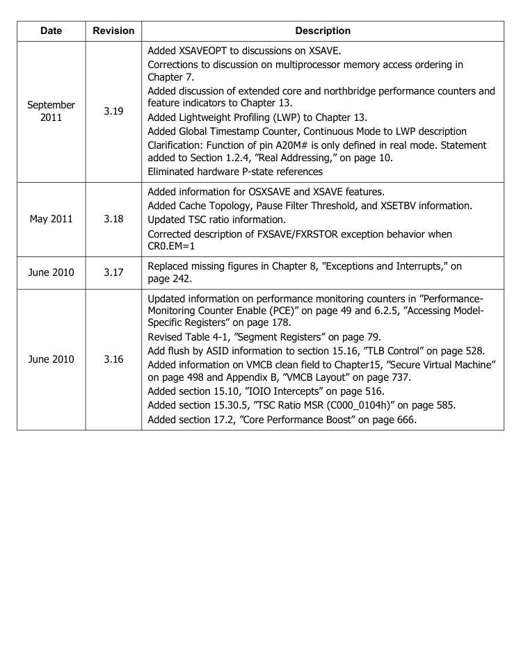

<!-- PDF source page: 46 | printed page: xlvi -->

| Date | Revision | Description |
| --- | --- | --- |
| November 2009 | 3.15 | Added section 7.5, ”Buffering and Combining Memory Writes” on page 202 Added MFENCE to list of ”Serializing Instructions” on page 211. Updated section 7.6.1, ”Cache Organization and Operation” on page 204. Updated Table 7-4, “Memory Access Ordering Rules,” on page 201 and notes. Updated 7.4, ”Memory Types” on page 198. Clarified 5.5.3, ”TLB Management” on page 159. Added ”Invalidation of Table Entry Upgrades.” on page 160. Updated ”Speculative Caching of Address Translations” on page 160. Update ”Handling of D-Bit Updates” on page 161. Revised and updated section 7.2, ”Multiprocessor Memory Access Ordering” on page 189 ff. Added information on long mode segment-limit checks in ”Extended Feature Enable Register (EFER)” on page 56table on page 56 and ”Long Mode Segment Limit Enable (LMSLE) Bit” on page 57 on page 57. Added discussion of ”Data Limit Checks in 64-bit Mode” on page 123on page 123. Updated Table 6-1, “System Management Instructions,” on page 170. Updated ”Canonicalization and Consistency Checks” on page 504on page 504. Added information about the next sequential instruction pointer (nRIP) in 15.7.1, ”State Saved on Exit” on page 508. Updated priority definition of PAUSE instruction intercept in Table 15-7, “Instruction Intercepts,” on page 513. Added nRIP field to Table B-1, “VMCB Layout, Control Area,” on page 737. Clarified information on ICEBP event injection, on page 531. Deleted erroneous statement concerning the operation of the General Local Vector Table register Mask bit in section 16.4. Clarified the description of the Interrupt Command Register Delivery Status bit in section ”Interprocessor Interrupts (IPI)” on page 641on page 641. |
| September 2007 | 3.14 | Added information on ”Speculative Caching of Address Translations,” ”Caching of Upper Level Translation Table Entries,” ”Use of Cached Entries When Reporting a Page Fault Exception,” ”Use of Cached Entries When Reporting a Page Fault Exception,” ”Handling of D-Bit Updates,” ”Invalidation of Cached Upper-level Entries by INVLPG” on page 161 and ”Handling of PDPT Entries in PAE Mode” on page 161to section 5.5.3, ”TLB Management” on page 159. Added 15.21.7, ”Interrupt Masking in Local APIC” on page 535. Added 16.3.6, ”Extended APIC Control Register” on page 633; clarified the use of the ICR DS bit in 16.5, ”Interprocessor Interrupts (IPI)” on page 641. Added minor clarifications and corrected typographical and formatting errors. |

Rendered source page 46 (figures/tables)

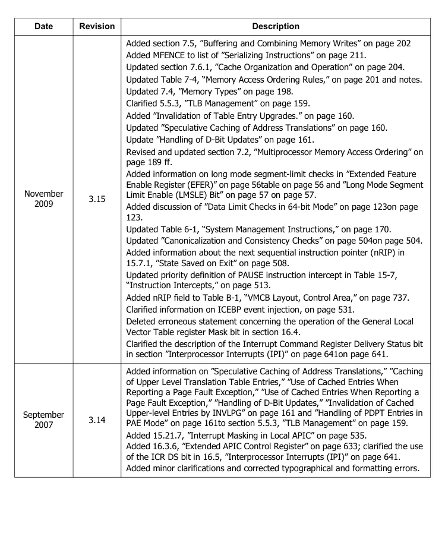

<!-- PDF source page: 47 | printed page: xlvii -->

| Date | Revision | Description |
| --- | --- | --- |
| July 2007 | 3.13 | Added 5.3.5, ”1-Gbyte Page Translation” on page 149. Added 7.2, ”Multiprocessor Memory Access Ordering” on page 189 Added divide-by-zero exception to Table 8-9, “Simultaneous Interrupt Priorities,” on page 264. Added information on ”CPU Watchdog Timer Register” on page 304and ”Machine-Check Miscellaneous-Error Information Register 0 (MCi MISC0)” on page 311to Chapter 9. Added SSE4A support to Chapter 11, ”SSE, MMX, and x87 Programming” on page 342. Added Monitor and MWAIT intercept information to section 15.9, ”Instruction Intercepts” on page 513 and reorganized intercept information; clarified 15.16.1, ”TLB Flush” on page 529. Added Monitor and MWAIT intercepts to tables B-1, ”VMCB Layout, Control Area” on page 737 and C-1, ”SVM Intercept Codes” on page 756. Added Chapter 16, ”Advanced Programmable Interrupt Controller (APIC)” on page 627, Chapter 17, ”OS-Visible Workaround Information” on page 515, Chapter 17, ”Hardware Performance Monitoring and Control” on page 664. Added Table A-7, “Secure Virtual Machine MSR Cross-Reference,” on page 733. Added minor clarifications and corrected typographical and formatting errors. |
| September 2006 | 3.12 | Added numerous minor clarifications. |
| December 2005 | 3.11 | Added Chapter 15, Secure Virtual Machine. Incorporated numerous factual corrections and updates. |
| February 2005 | 3.10 | Corrected Table 8-6, “General-Protection Exception Conditions,” on page 255. Added SSE3 information. Clarified and corrected information on the CPUID instruction and feature identification. Added information on the RDTSCP instruction. Clarified information about MTRRs and PATs in multiprocessing systems. |
| September 2003 | 3.09 | Corrected numerous minor typographical errors. |
| April 2003 | 3.08 | Clarified terms in section on FXSAVE/FXSTOR. Corrected several minor errors of omission. Documentation of CR0.NW bit has been corrected. Several register diagrams and figure labels have been corrected. Description of shared cache lines has been clarified in 7.3, ”Memory Coherency and Protocol” on page 192. |
| September 2002 | 3.07 | Made numerous small grammatical changes and factual clarifications. Added Revision History. |

Rendered source page 47 (figures/tables)

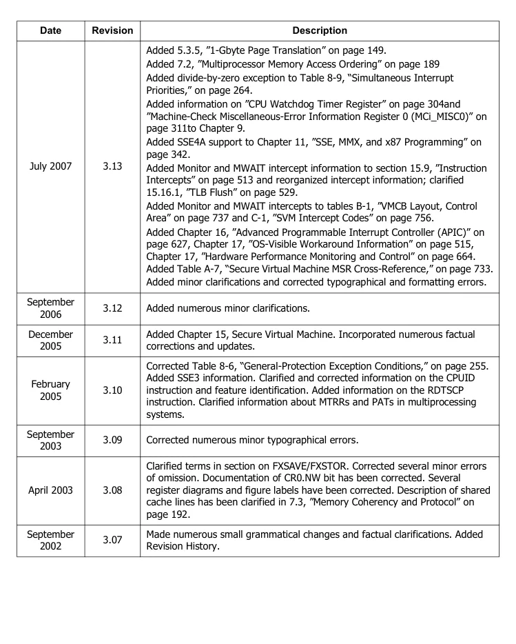

