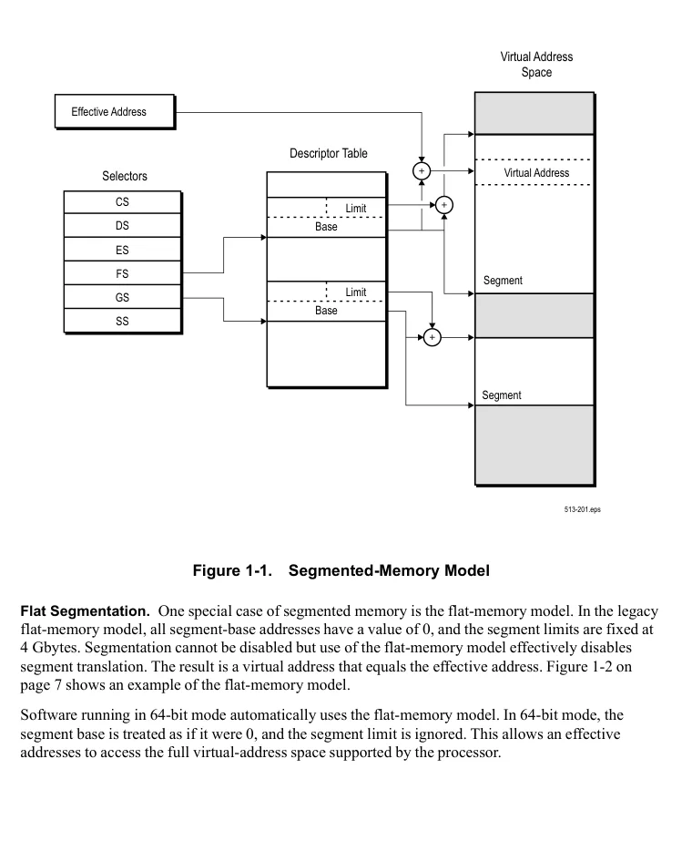
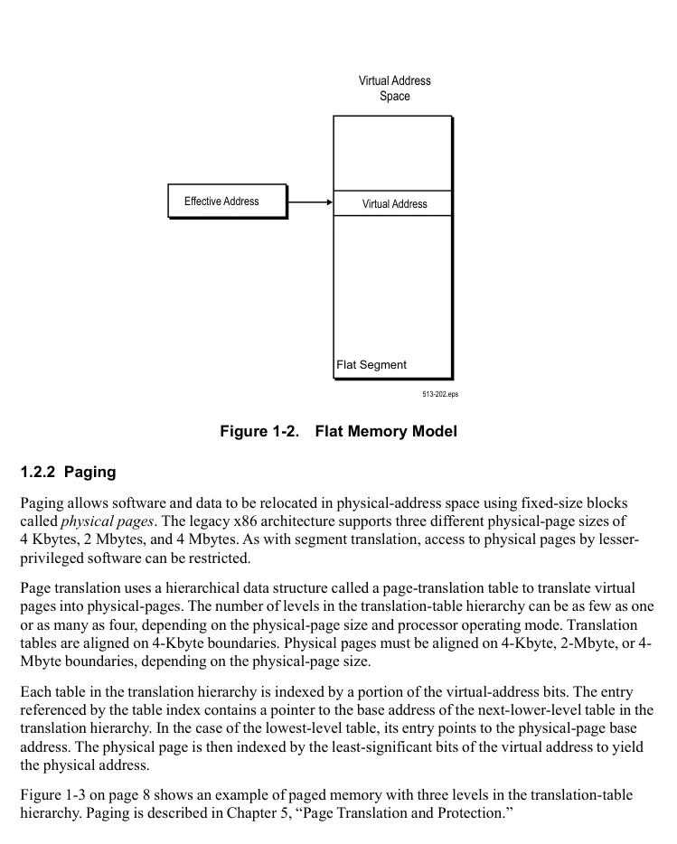
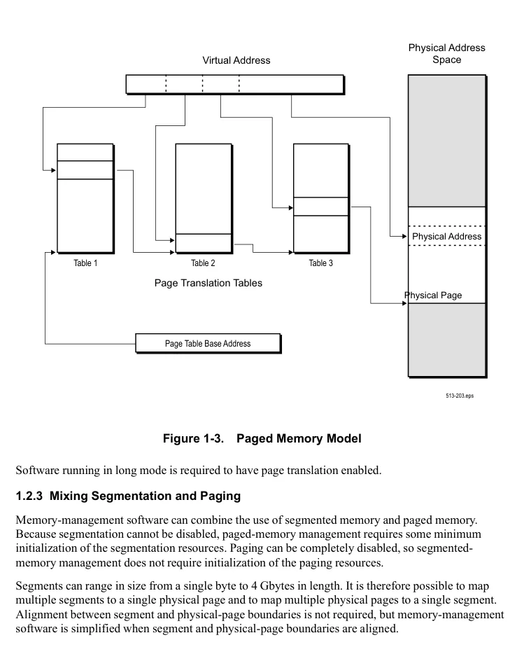
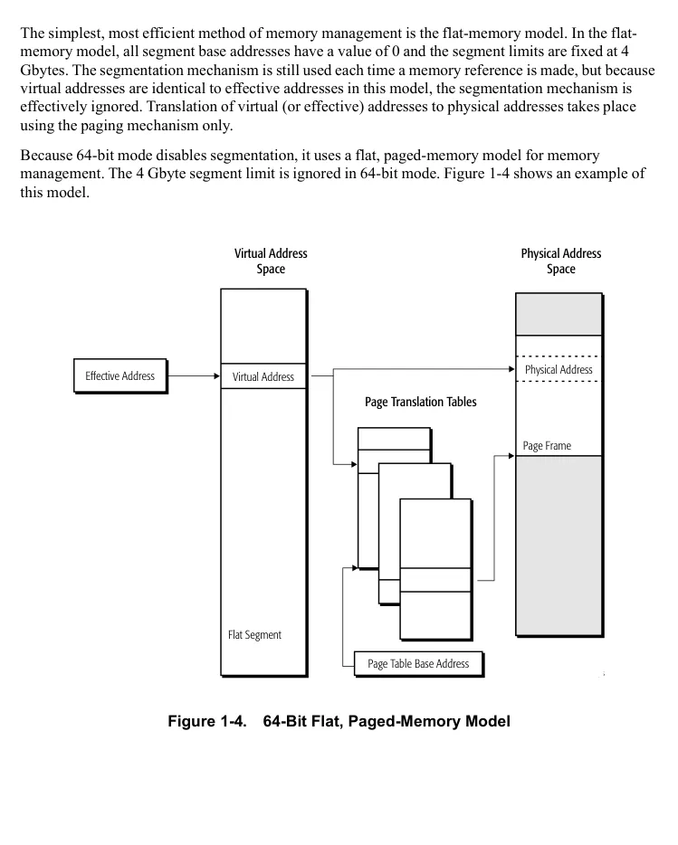
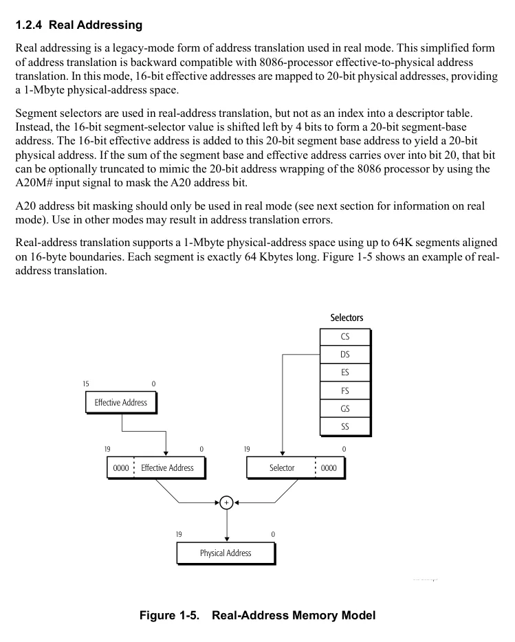
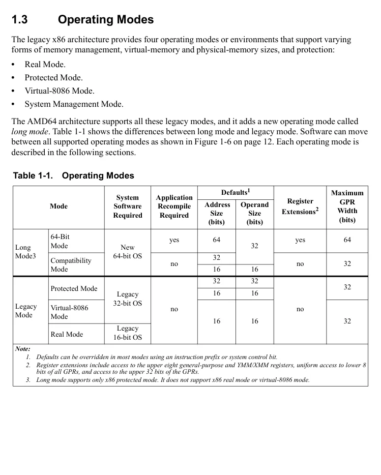
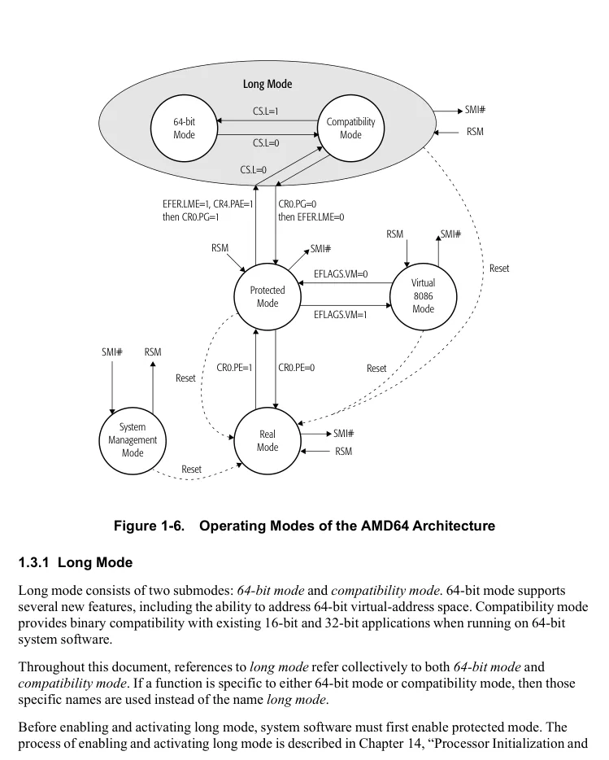
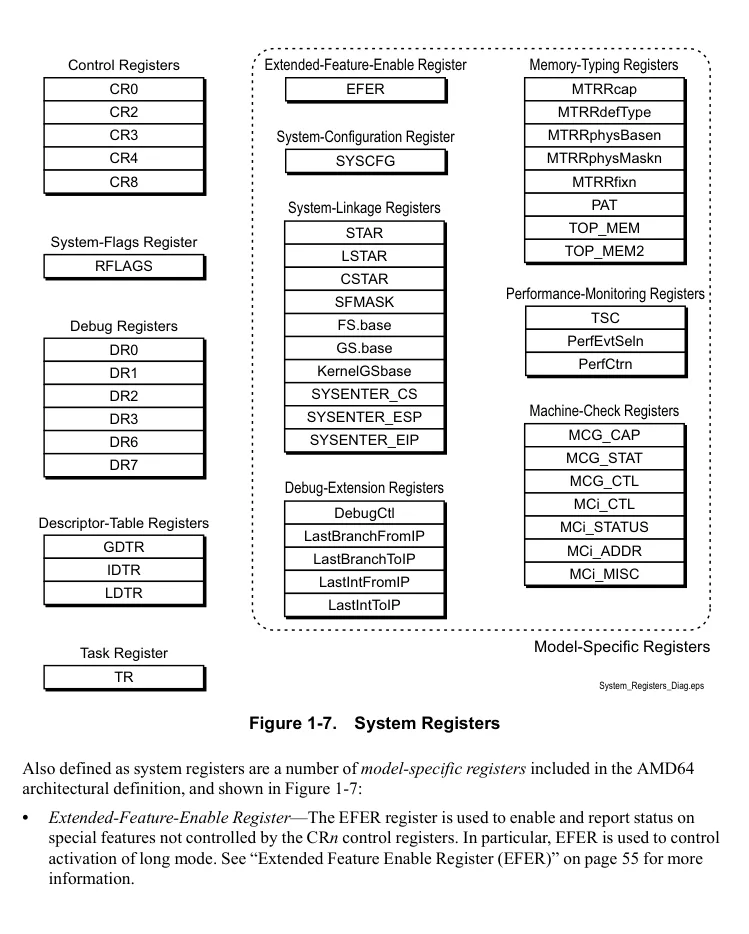
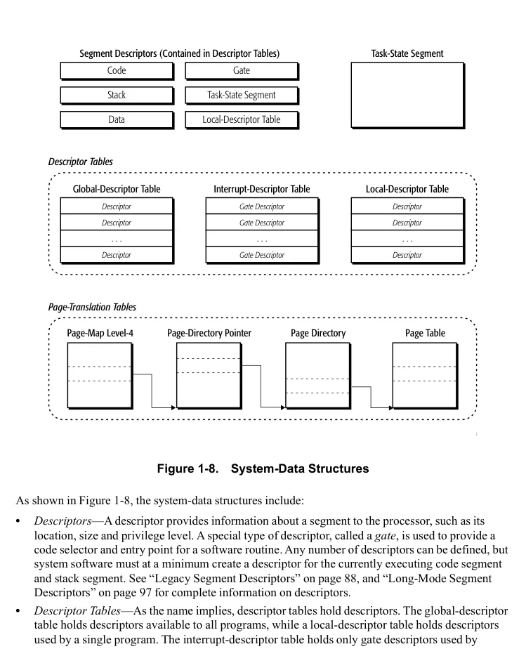
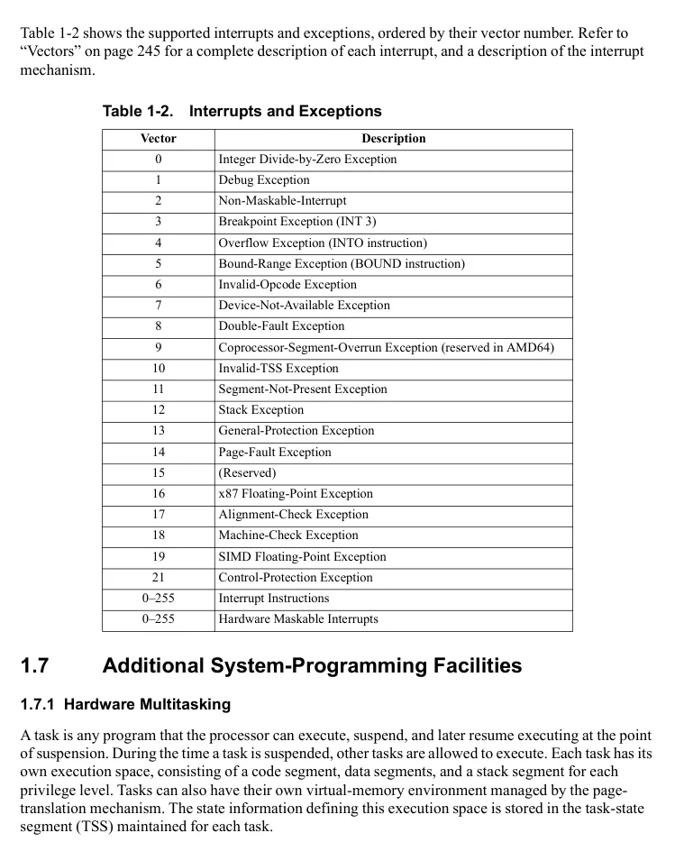

<!-- PDF source page: 63 | printed page: 1 -->

<a id="1-system-programming-overview"></a>

# 1 System-Programming Overview

This entire volume is intended for system-software developers—programmers writing operating systems, loaders, linkers, device drivers, or utilities that require access to system resources. These system resources are generally available only to software running at the highest-privilege level (CPL=0), also referred to as *privileged software*. Privilege levels and their interactions are fully described in “Segment-Protection Overview” on page 104.

This chapter introduces the basic features and capabilities of the AMD64 architecture that are available to system-software developers. The concepts include:

- The supported address forms and how memory is organized.
- How memory-management hardware makes use of the various address forms to access memory.
- The processor operating modes, and how the memory-management hardware supports each of those modes.
- The system-control registers used to manage system resources.
- The interrupt and exception mechanism, and how it is used to interrupt program execution and to report errors.
- Additional, miscellaneous features available to system software, including support for hardware multitasking, reporting machine-check exceptions, debugging software problems, and optimizing software performance.

Many of the legacy features and capabilities are enhanced by the AMD64 architecture to support 64-bit operating systems and applications, while providing backward-compatibility with existing software.

<a id="1-1-memory-model"></a>

## 1.1 Memory Model

The AMD64 architecture memory model is designed to allow system software to manage application software and associated data in a secure fashion. The memory model is backward-compatible with the legacy memory model. Hardware-translation mechanisms are provided to map addresses between virtual-memory space and physical-memory space. The translation mechanisms allow system software to relocate applications and data transparently, either anywhere in physical-memory space, or in areas on the system hard drive managed by the operating system.

In long mode, the AMD64 architecture implements a flat-memory model. In legacy mode, the architecture implements all legacy memory models.


<!-- PDF source page: 64 | printed page: 2 -->

<a id="1-1-1-memory-addressing"></a>

### 1.1.1 Memory Addressing

The AMD64 architecture supports address relocation. To do this, several types of addresses are needed to completely describe memory organization. Specifically, four types of addresses are defined by the AMD64 architecture:

- Logical addresses
- Effective addresses, or segment offsets, which are a portion of the logical address.
- Linear (virtual) addresses
- Physical addresses

**Logical Addresses.** A *logical address* is a reference into a segmented-address space. It is comprised of the segment selector and the effective address. Notationally, a logical address is represented as

```text
Logical Address = Segment Selector : Offset
```

The segment selector specifies an entry in either the global or local descriptor table. The specified descriptor-table entry describes the segment location in virtual-address space, its size, and other characteristics. The effective address is used as an offset into the segment specified by the selector.

Logical addresses are often referred to as *far pointers*. Far pointers are used in software addressing when the segment reference must be explicit (i.e., a reference to a segment outside the current segment).

**Effective Addresses.** The offset into a memory segment is referred to as an effective address (see “Segmentation” on page 5 for a description of segmented memory). Effective addresses are formed by adding together elements comprising a base value, a scaled-index value, and a displacement value. The effective-address computation is represented by the equation

```text
Effective Address = Base + (Scale x Index) + Displacement
```

The elements of an effective-address computation are defined as follows:

- *Base*—A value stored in any general-purpose register.
- *Scale*—A positive value of 1, 2, 4, or 8.
- *Index*—A two’s-complement value stored in any general-purpose register.
- *Displacement*—An 8-bit, 16-bit, or 32-bit two’s-complement value encoded as part of the instruction.

Effective addresses are often referred to as *near pointers*. A near pointer is used when the segment selector is known implicitly or when the flat-memory model is used.

Long mode defines a 64-bit effective-address length. If a processor implementation does not support the full 64-bit virtual-address space, the effective address must be in *canonical form* (see “Canonical Address Form” on page 4).


<!-- PDF source page: 65 | printed page: 3 -->

**Linear (Virtual) Addresses.** The segment-selector portion of a logical address specifies a segment-descriptor entry in either the global or local descriptor table. The specified segment-descriptor entry contains the segment-base address, which is the starting location of the segment in linear-address space. A *linear address* is formed by adding the segment-base address to the effective address (segment offset), which creates a reference to any byte location within the supported linear-address space. Linear addresses are often referred to as *virtual addresses*, and both terms are used interchangeably throughout this document.

```text
Linear Address = Segment Base Address + Effective Address
```

When the flat-memory model is used—as in 64-bit mode—a segment-base address is treated as 0. In this case, the linear address is identical to the effective address. In long mode, linear addresses must be in canonical address form, as described in “Canonical Address Form” on page 4.

**Physical Addresses.** A *physical address* is a reference into the physical-address space, typically main memory. Physical addresses are translated from virtual addresses using page-translation mechanisms. See “Paging” on page 7 for information on how the paging mechanism is used for virtual-address to physical-address translation. When the paging mechanism is not enabled, the virtual (linear) address is used as the physical address.

<a id="1-1-2-memory-organization"></a>

### 1.1.2 Memory Organization

The AMD64 architecture organizes memory into *virtual memory* and *physical memory*. Virtual-memory and physical-memory spaces can be (and usually are) different in size. Generally, the virtual-address space is much larger than physical-address memory. System software relocates applications and data between physical memory and the system hard disk to make it appear that much more memory is available than really exists. System software then uses the hardware memory-management mechanisms to map the larger virtual-address space into the smaller physical-address space.

**Virtual Memory.** Software uses virtual addresses to access locations within the virtual-memory space. System software is responsible for managing the relocation of applications and data in virtual-memory space using segment-memory management. System software is also responsible for mapping virtual memory to physical memory through the use of page translation. The AMD64 architecture supports different virtual-memory sizes using the following address-translation modes:

- *Protected Mode*—This mode supports 4 gigabytes of virtual-address space using 32-bit virtual addresses.
- *Long Mode*—This mode supports 16 exabytes of virtual-address space using 64-bit virtual addresses. A given implementation may however support less than this, as reported by the CPUID feature identification facility.


<!-- PDF source page: 66 | printed page: 4 -->

**Physical Memory.** Physical addresses are used to directly access main memory. For a particular computer system, the size of the *available* physical-address space is equal to the amount of main memory installed in the system. The maximum amount of physical memory accessible depends on the processor implementation and on the address-translation mode. The AMD64 architecture supports varying physical-memory sizes using the following address-translation modes:

- *Real-Address Mode*—This mode, also called *real mode*, supports 1 megabyte of physical-address space using 20-bit physical addresses. This address-translation mode is described in “Real Addressing” on page 10. Real mode is available only from legacy mode (see “Legacy Modes” on page 14).
- *Legacy Protected Mode*—This mode supports several different address-space sizes, depending on the translation mechanism used and whether extensions to those mechanisms are enabled. Legacy protected mode supports 4 gigabytes of physical-address space using 32-bit physical addresses. Both segment translation (see “Segmentation” on page 5) and page translation (see “Paging” on page 7) can be used to access the physical address space, when the processor is running in legacy protected mode. When the physical-address size extensions are enabled (see “Physical-Address Extensions (PAE) Bit” on page 129), the page-translation mechanism can be extended to support 52-bit physical addresses. 52-bit physical addresses allow up to 4 petabytes of physical-address space to be supported. (Currently, the AMD64 architecture supports 40-bit addresses in this mode, allowing up to 1 terabyte of physical-address space to be supported.
- *Long Mode*—This mode is unique to the AMD64 architecture. This mode supports up to 4 petabytes of physical-address space using 52-bit physical addresses. Long mode requires the use of page-translation and the physical-address size extensions (PAE).

<a id="1-1-3-canonical-address-form"></a>

### 1.1.3 Canonical Address Form

Long mode defines 64 bits of virtual-address space, but processor implementations can support less. Although some processor implementations do not use all 64 bits of the virtual address, they all check bits 63 through the most-significant implemented bit to see if those bits are all zeros or all ones. An address that complies with this property is in *canonical address form*. In most cases, a virtual-memory reference that is not in canonical form (in either the linear or effective form of the address) causes a general-protection exception (#GP) to occur. However, implied stack references where the stack address is not in canonical form causes a stack exception (#SS) to occur. Implied stack references include all push and pop instructions, and any instruction using RSP or RBP as a base register.

By checking canonical-address form, the AMD64 architecture prevents software from exploiting unused high bits of pointers for other purposes. Software complying with canonical-address form on a specific processor implementation can run unchanged on long-mode implementations supporting larger virtual-address spaces.


<!-- PDF source page: 67 | printed page: 5 -->

<a id="1-2-memory-management"></a>

## 1.2 Memory Management

Memory management consists of the methods by which addresses generated by software are translated by segmentation and/or paging into addresses in physical memory. Memory management is not visible to application software. It is handled by the system software and processor hardware.

<a id="1-2-1-segmentation"></a>

### 1.2.1 Segmentation

Segmentation was originally created as a method by which system software could isolate software processes (tasks), and the data used by those processes, from one another in an effort to increase the reliability of systems running multiple processes simultaneously.

The AMD64 architecture is designed to support all forms of legacy segmentation. However, most modern system software does not use the segmentation features available in the legacy x86 architecture. Instead, system software typically handles program and data isolation using page-level protection. For this reason, the AMD64 architecture dispenses with multiple segments in 64-bit mode and, instead, uses a flat-memory model. The elimination of segmentation allows new 64-bit system software to be coded more simply, and it supports more efficient management of multi-processing than is possible in the legacy x86 architecture.

Segmentation is, however, used in compatibility mode and legacy mode. Here, segmentation is a form of base memory-addressing that allows software and data to be relocated in virtual-address space off of an arbitrary base address. Software and data can be relocated in virtual-address space using one or more variable-sized *memory segments.* The legacy x86 architecture provides several methods of restricting access to segments from other segments so that software and data can be protected from interfering with each other.

In compatibility and legacy modes, up to 16,383 unique segments can be defined. The base-address value, segment size (called a *limit*), protection, and other attributes for each segment are contained in a data structure called a *segment descriptor*. Collections of segment descriptors are held in *descriptor tables*. Specific segment descriptors are referenced or selected from the descriptor table using a *segment selector register*. Six segment-selector registers are available, providing access to as many as six segments at a time.

Figure 1-1 on page 6 shows an example of segmented memory. Segmentation is described in Chapter 4, “Segmented Virtual Memory.”


<!-- PDF source page: 68 | printed page: 6 -->

**Figure 1-1. Segmented-Memory Model**

<details>
<summary>Extracted figure labels</summary>

```text
Virtual Address
Space
Effective Address
Descriptor Table
Virtual Address
Selectors
CS
Limit
DS
Base
ES
FS
Segment
Limit
GS
Base
SS
Segment
513-201.eps
```

</details>

**Flat Segmentation.** One special case of segmented memory is the flat-memory model. In the legacy flat-memory model, all segment-base addresses have a value of 0, and the segment limits are fixed at 4 Gbytes. Segmentation cannot be disabled but use of the flat-memory model effectively disables segment translation. The result is a virtual address that equals the effective address. Figure 1-2 on page 7 shows an example of the flat-memory model.

Software running in 64-bit mode automatically uses the flat-memory model. In 64-bit mode, the segment base is treated as if it were 0, and the segment limit is ignored. This allows an effective addresses to access the full virtual-address space supported by the processor.

<details>
<summary>Rendered source page 68 (figures/tables)</summary>



</details>


<!-- PDF source page: 69 | printed page: 7 -->

**Figure 1-2. Flat Memory Model**

<details>
<summary>Extracted figure labels</summary>

```text
Virtual Address
Space
Effective Address
Virtual Address
Flat Segment
513-202.eps
```

</details>

<a id="1-2-2-paging"></a>

### 1.2.2 Paging

Paging allows software and data to be relocated in physical-address space using fixed-size blocks called *physical pages*. The legacy x86 architecture supports three different physical-page sizes of 4 Kbytes, 2 Mbytes, and 4 Mbytes. As with segment translation, access to physical pages by lesser-privileged software can be restricted.

Page translation uses a hierarchical data structure called a page-translation table to translate virtual pages into physical-pages. The number of levels in the translation-table hierarchy can be as few as one or as many as four, depending on the physical-page size and processor operating mode. Translation tables are aligned on 4-Kbyte boundaries. Physical pages must be aligned on 4-Kbyte, 2-Mbyte, or 4-Mbyte boundaries, depending on the physical-page size.

Each table in the translation hierarchy is indexed by a portion of the virtual-address bits. The entry referenced by the table index contains a pointer to the base address of the next-lower-level table in the translation hierarchy. In the case of the lowest-level table, its entry points to the physical-page base address. The physical page is then indexed by the least-significant bits of the virtual address to yield the physical address.

Figure 1-3 on page 8 shows an example of paged memory with three levels in the translation-table hierarchy. Paging is described in Chapter 5, “Page Translation and Protection.”

<details>
<summary>Rendered source page 69 (figures/tables)</summary>



</details>


<!-- PDF source page: 70 | printed page: 8 -->

**Figure 1-3. Paged Memory Model**

<details>
<summary>Extracted figure labels</summary>

```text
Physical Address
Space
Virtual Address
Physical Address
Table 3
Table 2
Table 1
Page Translation Tables
Physical Page
Page Table Base Address
513-203.eps
```

</details>

Software running in long mode is required to have page translation enabled.

<a id="1-2-3-mixing-segmentation-and-paging"></a>

### 1.2.3 Mixing Segmentation and Paging

Memory-management software can combine the use of segmented memory and paged memory. Because segmentation cannot be disabled, paged-memory management requires some minimum initialization of the segmentation resources. Paging can be completely disabled, so segmented-memory management does not require initialization of the paging resources.

Segments can range in size from a single byte to 4 Gbytes in length. It is therefore possible to map multiple segments to a single physical page and to map multiple physical pages to a single segment. Alignment between segment and physical-page boundaries is not required, but memory-management software is simplified when segment and physical-page boundaries are aligned.

<details>
<summary>Rendered source page 70 (figures/tables)</summary>



</details>


<!-- PDF source page: 71 | printed page: 9 -->

The simplest, most efficient method of memory management is the flat-memory model. In the flat-memory model, all segment base addresses have a value of 0 and the segment limits are fixed at 4 Gbytes. The segmentation mechanism is still used each time a memory reference is made, but because virtual addresses are identical to effective addresses in this model, the segmentation mechanism is effectively ignored. Translation of virtual (or effective) addresses to physical addresses takes place using the paging mechanism only.

Because 64-bit mode disables segmentation, it uses a flat, paged-memory model for memory management. The 4 Gbyte segment limit is ignored in 64-bit mode. Figure 1-4 shows an example of this model.

**Figure 1-4. 64-Bit Flat, Paged-Memory Model**

<details>
<summary>Extracted figure labels</summary>

```text
Virtual Address
Space
Physical Address
Space
Physical Address
Effective Address
Virtual Address
Page Translation Tables
Page Frame
Flat Segment
Page Table Base Address
513-204.eps
```

</details>

<details>
<summary>Rendered source page 71 (figures/tables)</summary>



</details>


<!-- PDF source page: 72 | printed page: 10 -->

<a id="1-2-4-real-addressing"></a>

### 1.2.4 Real Addressing

Real addressing is a legacy-mode form of address translation used in real mode. This simplified form of address translation is backward compatible with 8086-processor effective-to-physical address translation. In this mode, 16-bit effective addresses are mapped to 20-bit physical addresses, providing a 1-Mbyte physical-address space.

Segment selectors are used in real-address translation, but not as an index into a descriptor table. Instead, the 16-bit segment-selector value is shifted left by 4 bits to form a 20-bit segment-base address. The 16-bit effective address is added to this 20-bit segment base address to yield a 20-bit physical address. If the sum of the segment base and effective address carries over into bit 20, that bit can be optionally truncated to mimic the 20-bit address wrapping of the 8086 processor by using the A20M# input signal to mask the A20 address bit.

A20 address bit masking should only be used in real mode (see next section for information on real mode). Use in other modes may result in address translation errors.

Real-address translation supports a 1-Mbyte physical-address space using up to 64K segments aligned on 16-byte boundaries. Each segment is exactly 64 Kbytes long. Figure 1-5 shows an example of real-address translation.

**Figure 1-5. Real-Address Memory Model**

<details>
<summary>Extracted figure labels</summary>

```text
Selectors
CS
DS
ES
0
15
FS
Effective Address
GS
SS
0
19
0
19
0000
Effective Address
0000
Selector
+
0
19
Physical Address
513-205.eps
```

</details>

<details>
<summary>Rendered source page 72 (figures/tables)</summary>



</details>


<!-- PDF source page: 73 | printed page: 11 -->

<a id="1-3-operating-modes"></a>

## 1.3 Operating Modes

The legacy x86 architecture provides four operating modes or environments that support varying forms of memory management, virtual-memory and physical-memory sizes, and protection:

- Real Mode.
- Protected Mode.
- Virtual-8086 Mode.
- System Management Mode.

The AMD64 architecture supports all these legacy modes, and it adds a new operating mode called *long mode*. Table 1-1 shows the differences between long mode and legacy mode. Software can move between all supported operating modes as shown in Figure 1-6 on page 12. Each operating mode is described in the following sections.

**Table 1-1. Operating Modes**

| Mode | Mode (2) | System<br>Software<br>Required | Application<br>Recompile<br>Required | Defaults1 / Address<br>Size<br>(bits) | Defaults1 / Operand<br>Size<br>(bits) | Register<br>Extensions2 | Maximum<br>GPR<br>Width<br>(bits) |
| --- | --- | --- | --- | --- | --- | --- | --- |
| Long<br>Mode3 | 64-Bit<br>Mode | New<br>64-bit OS | yes | 64 | 32 | yes | 64 |
| Long<br>Mode3 | Compatibility<br>Mode | New<br>64-bit OS | no | 32 |  | no | 32 |
| Long<br>Mode3 | Compatibility<br>Mode | New<br>64-bit OS |  | 16 | 16 |  |  |
| Legacy<br>Mode | Protected Mode | Legacy<br>32-bit OS | no | 32 | 32 | no | 32 |
| Legacy<br>Mode | Protected Mode | Legacy<br>32-bit OS |  | 16 | 16 |  |  |
| Legacy<br>Mode | Virtual-8086<br>Mode | Legacy<br>32-bit OS |  | 16 | 16 |  | 32 |
| Legacy<br>Mode | Real Mode | Legacy<br>16-bit OS |  |  |  |  |  |

> Note: 1. Defaults can be overridden in most modes using an instruction prefix or system control bit. 2. Register extensions include access to the upper eight general-purpose and YMM/XMM registers, uniform access to lower 8 bits of all GPRs, and access to the upper 32 bits of the GPRs. 3. Long mode supports only x86 protected mode. It does not support x86 real mode or virtual-8086 mode.

<details>
<summary>Rendered source page 73 (figures/tables)</summary>



</details>


<!-- PDF source page: 74 | printed page: 12 -->

**Figure 1-6. Operating Modes of the AMD64 Architecture**

<details>
<summary>Extracted figure labels</summary>

```text
Long Mode
SMI#
CS.L=1
64-bit
Mode
Compatibility
Mode
RSM
CS.L=0
CR0.PG=0
then EFER.LME=0
EFER.LME=1, CR4.PAE=1
then CR0.PG=1
RSM
SMI#
RSM
Reset
EFLAGS.VM=0
Virtual
8086
Mode
Protected
Mode
EFLAGS.VM=1
RSM
SMI#
CR0.PE=1
CR0.PE=0
Reset
System
Management
Mode
SMI#
Real
Mode
RSM
Reset
513-206.eps
```

</details>

<a id="1-3-1-long-mode"></a>

### 1.3.1 Long Mode

Long mode consists of two submodes: *64-bit mode* and *compatibility mode*. 64-bit mode supports several new features, including the ability to address 64-bit virtual-address space. Compatibility mode provides binary compatibility with existing 16-bit and 32-bit applications when running on 64-bit system software.

Throughout this document, references to *long mode* refer collectively to both *64-bit mode* and *compatibility mode*. If a function is specific to either 64-bit mode or compatibility mode, then those specific names are used instead of the name *long mode*.

Before enabling and activating long mode, system software must first enable protected mode. The process of enabling and activating long mode is described in Chapter 14, “Processor Initialization and

<details>
<summary>Rendered source page 74 (figures/tables)</summary>



</details>


<!-- PDF source page: 75 | printed page: 13 -->

Long Mode Activation.” Long mode features are described throughout this document, where applicable.

<a id="1-3-2-64-bit-mode"></a>

### 1.3.2 64-Bit Mode

64-bit mode, a submode of long mode, provides support for 64-bit system software and applications by adding the following features:

- 64-bit virtual addresses (processor implementations can have fewer).
- Access to General Purpose Register bits 63:32
- Access to additional registers through the REX, VEX, and XOP instruction prefixes:
- eight additional GPRs (R8–R15)
- eight additional Streaming SIMD Extension (SSE) registers (YMM/XMM8–15)
- 64-bit instruction pointer (RIP).
- New RIP-relative data-addressing mode.
- Flat-segment address space with single code, data, and stack space.

The mode is enabled by the system software on an individual code-segment basis. Although code segments are used to enable and disable 64-bit mode, the legacy segmentation mechanism is largely disabled. Page translation is required for memory management purposes. Because 64-bit mode supports a 64-bit virtual-address space, it requires 64-bit system software and development tools.

In 64-bit mode, the default address size is 64 bits, and the default operand size is 32 bits. The defaults can be overridden on an instruction-by-instruction basis using instruction prefixes. A new REX prefix is introduced for specifying a 64-bit operand size and the new registers.

<a id="1-3-3-compatibility-mode"></a>

### 1.3.3 Compatibility Mode

Compatibility mode, a submode of long mode, allows system software to implement binary compatibility with existing 16-bit and 32-bit x86 applications. It allows these applications to run, without recompilation, under 64-bit system software in long mode, as shown in Table 1-1 on page 11.

In compatibility mode, applications can only access the first 4 Gbytes of virtual-address space. Standard x86 instruction prefixes toggle between 16-bit and 32-bit address and operand sizes.

Compatibility mode, like 64-bit mode, is enabled by system software on an individual code-segment basis. Unlike 64-bit mode, however, segmentation functions the same as in the legacy-x86 architecture, using 16-bit or 32-bit protected-mode semantics. From an application viewpoint, compatibility mode looks like a legacy protected-mode environment. From a system-software viewpoint, the long-mode mechanisms are used for address translation, interrupt and exception handling, and system data-structures.


<!-- PDF source page: 76 | printed page: 14 -->

<a id="1-3-4-legacy-modes"></a>

### 1.3.4 Legacy Modes

L*egacy mode* consists of three submodes: real mode, protected mode, and virtual-8086 mode. Protected mode can be either paged or unpaged. L*egacy mode* preserves binary compatibility not only with existing x86 16-bit and 32-bit applications but also with existing x86 16-bit and 32-bit system software.

**Real Mode.** In this mode, also called real-address mode, the processor supports a physical-memory space of 1 Mbyte and operand sizes of 16 bits (default) or 32 bits (with instruction prefixes). Interrupt handling and address generation are nearly identical to the 80286 processor's real mode. Paging is not supported. All software runs at privilege level 0.

Real mode is entered after reset or processor power-up. The mode is not supported when the processor is operating in long mode because long mode requires that paged protected mode be enabled.

**Protected Mode.** In this mode, the processor supports virtual-memory and physical-memory spaces of 4 Gbytes and operand sizes of 16 or 32 bits. All segment translation, segment protection, and hardware multitasking functions are available. System software can use segmentation to relocate effective addresses in virtual-address space. If paging is not enabled, virtual addresses are equal to physical addresses. Paging can be optionally enabled to allow translation of virtual addresses to physical addresses and to use the page-based memory-protection mechanisms.

In protected mode, software runs at privilege levels 0, 1, 2, or 3. Typically, application software runs at privilege level 3, the system software runs at privilege levels 0 and 1, and privilege level 2 is available to system software for other uses. The 16-bit version of this mode was first introduced in the 80286 processor.

**Virtual-8086 Mode.** Virtual-8086 mode allows system software to run 16-bit real-mode software on a virtualized-8086 processor. In this mode, software written for the 8086, 8088, 80186, or 80188 processor can run as a privilege-level-3 task under protected mode. The processor supports a virtual-memory space of 1 Mbytes and operand sizes of 16 bits (default) or 32 bits (with instruction prefixes), and it uses real-mode address translation.

Virtual-8086 mode is enabled by setting the virtual-machine bit in the EFLAGS register (EFLAGS.VM). EFLAGS.VM can only be set or cleared when the EFLAGS register is loaded from the TSS as a result of a task switch, or by executing an IRET instruction from privileged software. The POPF instruction cannot be used to set or clear the EFLAGS.VM bit.

Virtual-8086 mode is not supported when the processor is operating in long mode. When long mode is enabled, any attempt to enable virtual-8086 mode is silently ignored.


<!-- PDF source page: 77 | printed page: 15 -->

<a id="1-3-5-system-management-mode-smm"></a>

### 1.3.5 System Management Mode (SMM)

System management mode (SMM) is an operating mode designed for system-control activities that are typically transparent to conventional system software. Power management is one popular use for system management mode. SMM is primarily targeted for use by platform firmware and specialized low-level device drivers. The code and data for SMM are stored in the SMM memory area, which is isolated from main memory by the SMM output signal.

SMM is entered by way of a system management interrupt (SMI). Upon recognizing an SMI, the processor enters SMM and switches to a separate address space where the SMM handler is located and executes. In SMM, the processor supports real-mode addressing with 4 Gbyte segment limits and default operand, address, and stack sizes of 16 bits (prefixes can be used to override these defaults).

<a id="1-4-system-registers"></a>

## 1.4 System Registers

Figure 1-7 on page 16 shows the system registers defined for the AMD64 architecture. System software uses these registers to, among other things, manage the processor operating environment, define system resource characteristics, and to monitor software execution. With the exception of the RFLAGS register, system registers can be read and written only from privileged software.

Except for the descriptor-table registers and task register, the AMD64 architecture defines all system registers to be 64 bits wide. The descriptor table and task registers are defined by the AMD64 architecture to include 64-bit base-address fields, in addition to their other fields.

As shown in Figure 1-7 on page 16, the system registers include:

- *Control Registers*—These registers are used to control system operation and some system features. See “System-Control Registers” on page 40 for details.
- *System-Flags Register*—The RFLAGS register contains system-status flags and masks. It is also used to enable virtual-8086 mode and to control application access to I/O devices and interrupts. See “RFLAGS Register” on page 51 for details.
- *Descriptor-Table Registers*—These registers contain the location and size of descriptor tables stored in memory. Descriptor tables hold segmentation data structures used in protected mode. See “Descriptor Tables” on page 82 for details.
- *Task Register*—The task register contains the location and size in memory of the task-state segment. The hardware-multitasking mechanism uses the task-state segment to hold state information for a given task. The TSS also holds other data, such as the inner-level stack pointers used when changing to a higher privilege level. See “Task Register” on page 370 for details.
- *Debug Registers*—Debug registers are used to control the software-debug mechanism, and to report information back to a debug utility or application. See “Debug Registers” on page 392 for details.


<!-- PDF source page: 78 | printed page: 16 -->

**Figure 1-7. System Registers**

<details>
<summary>Extracted figure labels</summary>

```text
Extended-Feature-Enable Register
Memory-Typing Registers
Control Registers
CR0
EFER
MTRRcap
CR2
MTRRdefType
MTRRphysBasen
CR3
System-Configuration Register
MTRRphysMaskn
CR4
SYSCFG
MTRRfixn
CR8
PAT
System-Linkage Registers
TOP_MEM
STAR
System-Flags Register
TOP_MEM2
LSTAR
RFLAGS
CSTAR
SFMASK
Performance-Monitoring Registers
TSC
FS.base
Debug Registers
PerfEvtSeln
GS.base
DR0
PerfCtrn
KernelGSbase
DR1
SYSENTER_CS
DR2
Machine-Check Registers
SYSENTER_ESP
DR3
MCG_CAP
SYSENTER_EIP
DR6
MCG_STAT
DR7
MCG_CTL
Debug-Extension Registers
MCi_CTL
DebugCtl
Descriptor-Table Registers
MCi_STATUS
LastBranchFromIP
GDTR
MCi_ADDR
LastBranchToIP
IDTR
MCi_MISC
LastIntFromIP
LDTR
LastIntToIP
Model-Specific Registers
Task Register
TR
System_Registers_Diag.eps
```

</details>

Also defined as system registers are a number of *model-specific registers* included in the AMD64 architectural definition, and shown in Figure 1-7:

- *Extended-Feature-Enable Register*—The EFER register is used to enable and report status on special features not controlled by the CR*n* control registers. In particular, EFER is used to control activation of long mode. See “Extended Feature Enable Register (EFER)” on page 55 for more information.

<details>
<summary>Rendered source page 78 (figures/tables)</summary>



</details>


<!-- PDF source page: 79 | printed page: 17 -->

- *System-Configuration Register*—The SYSCFG register is used to enable and configure system-bus features. See “System Configuration Register (SYSCFG)” on page 60 for more information.
- *System-Linkage Registers*—These registers are used by system-linkage instructions to specify operating-system entry points, stack locations, and pointers into system-data structures. See “Fast System Call and Return” on page 173 for details.
- *Memory-Typing Registers*—Memory-typing registers can be used to characterize (type) system memory. Typing memory gives system software control over how instructions and data are cached, and how memory reads and writes are ordered. See “MTRRs” on page 218 for details.
- *Debug-Extension Registers*—These registers control additional software-debug reporting features. See “Debug Registers” on page 392 for details.
- *Performance-Monitoring Registers*—Performance-monitoring registers are used to count processor and system events, or the duration of events. See “Performance Monitoring Counters” on page 411 for more information.
- *Machine-Check Registers*—The machine-check registers control the response of the processor to non-recoverable failures. They are also used to report information on such failures back to system utilities designed to respond to such failures. See “Machine Check Architecture MSRs” on page 301 for more information.

<a id="1-5-system-data-structures"></a>

## 1.5 System-Data Structures

Figure 1-8 on page 18 shows the system-data structures defined for the AMD64 architecture. System-data structures are created and maintained by system software for use by the processor when running in protected mode. A processor running in protected mode uses these data structures to manage memory and protection, and to store program-state information when an interrupt or task switch occurs.


<!-- PDF source page: 80 | printed page: 18 -->

**Figure 1-8. System-Data Structures**

<details>
<summary>Extracted figure labels</summary>

```text
Segment Descriptors (Contained in Descriptor Tables)
Task-State Segment
Code
Gate
Stack
Task-State Segment
Data
Local-Descriptor Table
Descriptor Tables
Global-Descriptor Table
Interrupt-Descriptor Table
Local-Descriptor Table
Descriptor
Gate Descriptor
Descriptor
Gate Descriptor
. . .
Descriptor
Gate Descriptor
Page-Translation Tables
Page-Map Level-4
Page Table
Page Directory
Page-Directory Pointer
513-261.eps
```

</details>

As shown in Figure 1-8, the system-data structures include:

- *Descriptors*—A descriptor provides information about a segment to the processor, such as its location, size and privilege level. A special type of descriptor, called a *gate*, is used to provide a code selector and entry point for a software routine. Any number of descriptors can be defined, but system software must at a minimum create a descriptor for the currently executing code segment and stack segment. See “Legacy Segment Descriptors” on page 88, and “Long-Mode Segment Descriptors” on page 97 for complete information on descriptors.
- *Descriptor Tables*—As the name implies, descriptor tables hold descriptors. The global-descriptor table holds descriptors available to all programs, while a local-descriptor table holds descriptors used by a single program. The interrupt-descriptor table holds only gate descriptors used by

<details>
<summary>Rendered source page 80 (figures/tables)</summary>



</details>


<!-- PDF source page: 81 | printed page: 19 -->

interrupt handlers. System software must initialize the global-descriptor and interrupt-descriptor tables, while use of the local-descriptor table is optional. See “Descriptor Tables” on page 82 for more information. **•* Task-State Segment*—The task-state segment is a special segment for holding processor-state information for a specific program, or task. It also contains the stack pointers used when switching to more-privileged programs. The hardware multitasking mechanism uses the state information in the segment when suspending and resuming a task. Calls and interrupts that switch stacks cause the stack pointers to be read from the task-state segment. System software must create at least one task-state segment, even if hardware multitasking is not used. See “Legacy Task-State Segment” on page 372, and “64-Bit Task State Segment” on page 376 for details. **•* Page-Translation Tables*—Use of page translation is optional in protected mode, but it is required in long mode. A four-level page-translation data structure is provided to allow long-mode operating systems to translate a 64-bit virtual-address space into a 52-bit physical-address space. Legacy protected mode can use two-or three-level page-translation data structures. See “Page Translation Overview” on page 127 for more information on page translation.

<a id="1-6-interrupts"></a>

## 1.6 Interrupts

The AMD64 architecture provides a mechanism for the processor to automatically suspend (interrupt) software execution and transfer control to an interrupt handler when an interrupt or exception occurs. An interrupt handler is privileged software designed to identify and respond to the cause of an interrupt or exception, and return control back to the interrupted software. *Interrupts* can be caused when system hardware signals an interrupt condition using one of the external-interrupt signals on the processor. Interrupts can also be caused by software that executes an interrupt instruction. *Exceptions* occur when the processor detects an abnormal condition as a result of executing an instruction. The term “interrupts” as used throughout this volume includes both interrupts and exceptions when the distinction is unnecessary.

System software not only sets up the interrupt handlers, but it must also create and initialize the data structures the processor uses to execute an interrupt handler when an interrupt occurs. The data structures include the code-segment descriptors for the interrupt-handler software and any data-segment descriptors for data and stack accesses. Interrupt-gate descriptors must also be supplied. Interrupt gates point to interrupt-handler code-segment descriptors, and the entry point in an interrupt handler. Interrupt gates are stored in the interrupt-descriptor table. The code-segment and data-segment descriptors are stored in the global-descriptor table and, optionally, the local-descriptor table.

When an interrupt occurs, the processor uses the interrupt vector to find the appropriate interrupt gate in the interrupt-descriptor table. The gate points to the interrupt-handler code segment and entry point, and the processor transfers control to that location. Before invoking the interrupt handler, the processor saves information required to return to the interrupted program. For details on how the processor transfers control to interrupt handlers, see “Legacy Protected-Mode Interrupt Control Transfers” on page 270, and “Long-Mode Interrupt Control Transfers” on page 281.


<!-- PDF source page: 82 | printed page: 20 -->

Table 1-2 shows the supported interrupts and exceptions, ordered by their vector number. Refer to “Vectors” on page 245 for a complete description of each interrupt, and a description of the interrupt mechanism.

**Table 1-2. Interrupts and Exceptions**

| Vecto | Description |
| --- | --- |
| 0 | Integer Divide-by-Zero Exception |
| 1 | Debug Exception |
| 2 | Non-Maskable-Interrupt |
| 3 | Breakpoint Exception (INT 3) |
| 4 | Overflow Exception (INTO instruction) |
| 5 | Bound-Range Exception (BOUND instruction) |
| 6 | Invalid-Opcode Exception |
| 7 | Device-Not-Available Exception |
| 8 | Double-Fault Exception |
| 9 | Coprocessor-Segment-Overrun Exception (reserved in AMD64) |
| 10 | Invalid-TSS Exception |
| 11 | Segment-Not-Present Exception |
| 12 | Stack Exception |
| 13 | General-Protection Exception |
| 14 | Page-Fault Exception |
| 15 | (Reserved) |
| 16 | x87 Floating-Point Exception |
| 17 | Alignment-Check Exception |
| 18 | Machine-Check Exception |
| 19 | SIMD Floating-Point Exception |
| 21 | Control-Protection Exception |
| 0–255 | Interrupt Instructions |
| 0–255 | Hardware Maskable Interrupts |

<a id="1-7-additional-system-programming-facilities"></a>

## 1.7 Additional System-Programming Facilities

<a id="1-7-1-hardware-multitasking"></a>

### 1.7.1 Hardware Multitasking

A task is any program that the processor can execute, suspend, and later resume executing at the point of suspension. During the time a task is suspended, other tasks are allowed to execute. Each task has its own execution space, consisting of a code segment, data segments, and a stack segment for each privilege level. Tasks can also have their own virtual-memory environment managed by the page-translation mechanism. The state information defining this execution space is stored in the task-state segment (TSS) maintained for each task.

<details>
<summary>Rendered source page 82 (figures/tables)</summary>



</details>


<!-- PDF source page: 83 | printed page: 21 -->

Support for hardware multitasking is provided by implementations of the AMD64 architecture when software is running in legacy mode. Hardware multitasking provides automated mechanisms for switching tasks, saving the execution state of the suspended task, and restoring the execution state of the resumed task. When hardware multitasking is used to switch tasks, the processor takes the following actions:

- The processor automatically suspends execution of the task, allowing any executing instructions to complete and save their results.
- The execution state of a task is saved in the task TSS.
- The execution state of a new task is loaded into the processor from its TSS.
- The processor begins executing the new task at the location specified in the new task TSS.

Use of hardware-multitasking features is optional in legacy mode. Generally, modern operating systems do not use the hardware-multitasking features, and instead perform task management entirely in software. Long mode does not support hardware multitasking at all.

Whether hardware multitasking is used or not, system software must create and initialize at least one task-state segment data-structure. This requirement holds for both long-mode and legacy-mode software. The single task-state segment holds critical pieces of the task execution environment and is referenced during certain control transfers.

Detailed information on hardware multitasking is available in Chapter 12, “Task Management,” along with a full description of the requirements that must be met in initializing a task-state segment when hardware multitasking is not used.

<a id="1-7-2-machine-check"></a>

### 1.7.2 Machine Check

Implementations of the AMD64 architecture support the machine-check exception. This exception is useful in system applications with stringent requirements for reliability, availability, and serviceability. The exception allows specialized system-software utilities to report hardware errors that are generally severe and non-recoverable. Providing the capability to report such errors can allow complex system problems to be pinpointed rapidly.

The machine-check exception is described in Chapter 9, “Machine Check Architecture.” Much of the error-reporting capabilities is implementation dependent. For more information, developers of machine-check error-reporting software should refer to the *BIOS and Kernel Developer’s Guide (BKDG)* or *Processor Programming Reference Manual (PPR)* or applicable to your product.

<a id="1-7-3-software-debugging"></a>

### 1.7.3 Software Debugging

A software-debugging mechanism is provided in hardware to help software developers quickly isolate programming errors. This capability can be used to debug system software and application software alike. Only privileged software can access the debugging facilities. Generally, software-debug support is provided by a privileged application program rather than by the operating system itself.

The facilities supported by the AMD64 architecture allow debugging software to perform the following:


<!-- PDF source page: 84 | printed page: 22 -->

- Set breakpoints on specific instructions within a program.
- Set breakpoints on an instruction-address match.
- Set breakpoints on a data-address match.
- Set breakpoints on specific I/O-port addresses.
- Set breakpoints to occur on task switches when hardware multitasking is used.
- Single step an application instruction-by-instruction.
- Single step only branches and interrupts.
- Record a history of branches and interrupts taken by a program.

The debugging facilities are fully described in “Software-Debug Resources” on page 391. Some processors provide additional, implementation-specific debug support. For more information, refer to the *BIOS and Kernel Developer’s Guide (BKDG)* or *Processor Programming Reference Manual (PPR)* applicable to your product.

<a id="1-7-4-performance-monitoring"></a>

### 1.7.4 Performance Monitoring

For many software developers, the ability to identify and eliminate performance bottlenecks from a program is nearly as important as quickly isolating programming errors. Implementations of the AMD64 architecture provide hardware performance-monitoring resources that can be used by special software applications to identify such bottlenecks. Non-privileged software can access the performance monitoring facilities, but only if privileged software grants that access.

The performance-monitoring facilities allow the counting of events, or the duration of events. Performance-analysis software can use the data to calculate the frequency of certain events, or the time spent performing specific activities. That information can be used to suggest areas for improvement and the types of optimizations that are helpful.

The performance-monitoring facilities are fully described in “Performance Monitoring Counters” on page 411. The specific events that can be monitored are generally implementation specific. For more information, refer to the *BIOS and Kernel Developer’s Guide (BKDG)* or *Processor Programming Reference Manual (PPR)* applicable to your product.
