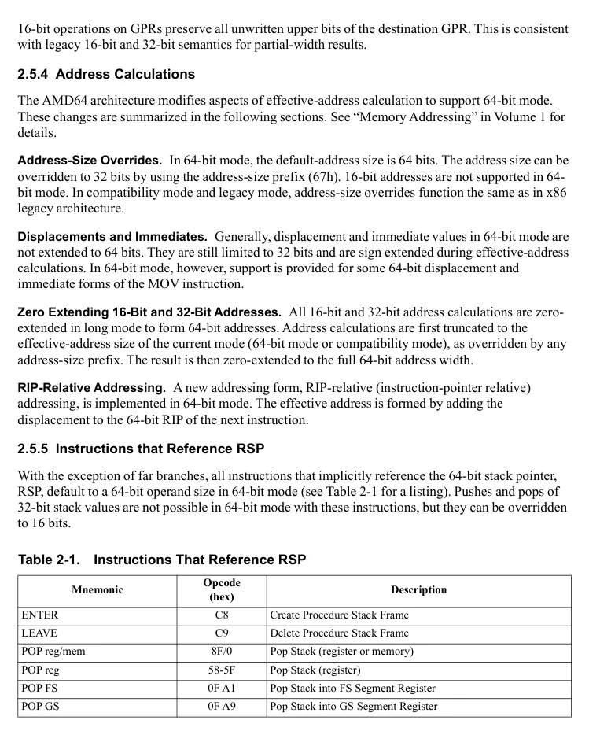
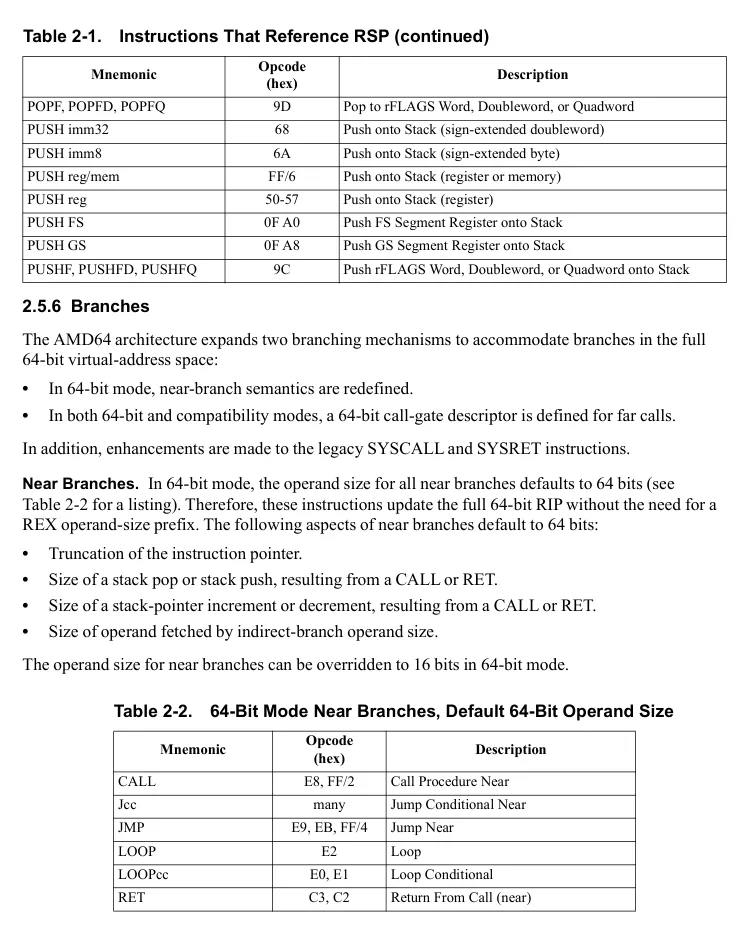
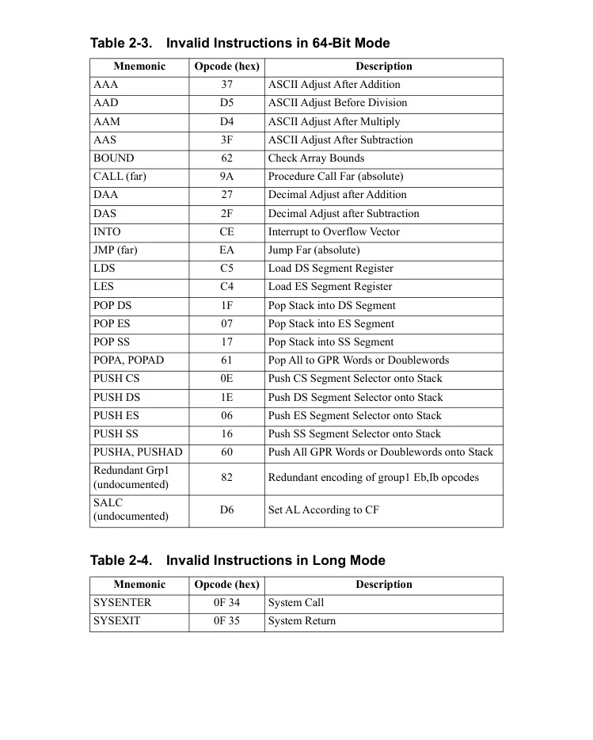
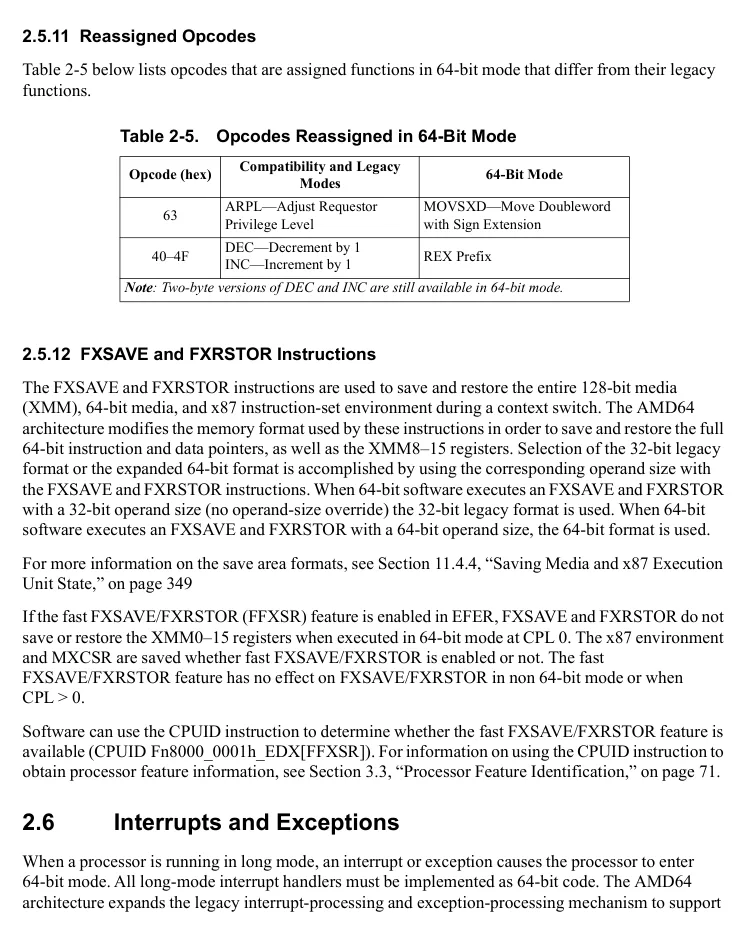
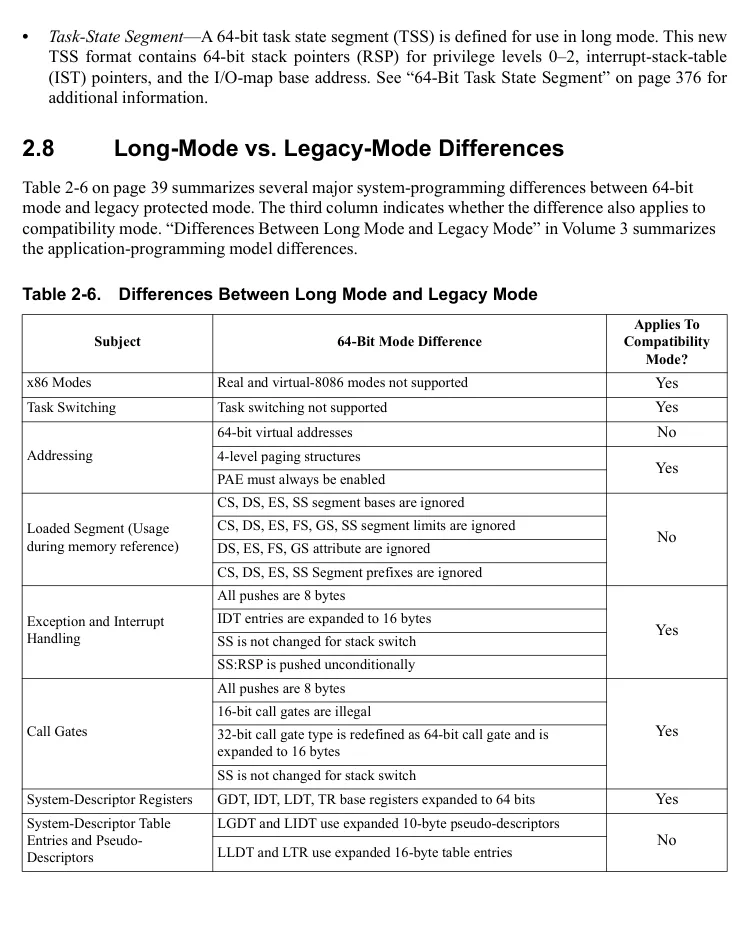

<!-- PDF source page: 85 | printed page: 23 -->

# 2 x86 and AMD64 Architecture Differences

The AMD64 architecture is designed to provide full binary compatibility with all previous AMD implementations of the x86 architecture. This chapter summarizes the new features and architectural enhancements introduced by the AMD64 architecture, and compares those features and enhancements with previous AMD x86 processors. Most of the new capabilities introduced by the AMD64 architecture are available only in long mode (64-bit mode, compatibility mode, or both). However, some of the new capabilities are also available in legacy mode, and are mentioned where appropriate.

The material throughout this chapter assumes the reader has a solid understanding of the x86 architecture. For those who are unfamiliar with the x86 architecture, please read the remainder of this volume before reading this chapter.

## 2.1 Operating Modes

See “Operating Modes” on page 11 for a complete description of the operating modes supported by the AMD64 architecture.

### 2.1.1 Long Mode

The AMD64 architecture introduces long mode and its two sub-modes: 64-bit mode and compatibility mode.

**64-Bit Mode.** 64-bit mode provides full support for 64-bit system software and applications. The new features introduced in support of 64-bit mode are summarized throughout this chapter. To use 64-bit mode, a 64-bit operating system and tool chain are required.

**Compatibility Mode.** Compatibility mode allows 64-bit operating systems to implement binary compatibility with existing 16-bit and 32-bit x86 applications. It allows these applications to run, without recompilation, under control of a 64-bit operating system in long mode. The architectural enhancements introduced by the AMD64 architecture that support compatibility mode are summarized throughout this chapter.

**Unsupported Modes.** Long mode does not support the following two operating modes:

- *Virtual-8086 Mode*—The virtual-8086 mode bit (EFLAGS.VM) is ignored when the processor is running in long mode. When long mode is enabled, any attempt to enable virtual-8086 mode is silently ignored. System software must leave long mode in order to use virtual-8086 mode.
- *Real Mode*—Real mode is not supported when the processor is operating in long mode because long mode requires that protected mode be enabled.

### 2.1.2 Legacy Mode

The AMD64 architecture supports a pure x86 legacy mode, which preserves binary compatibility not only with existing 16-bit and 32-bit applications but also with existing 16-bit and 32-bit operating

<!-- PDF source page: 86 | printed page: 24 -->

systems. L*egacy mode* supports real mode, protected mode, and virtual-8086 mode. A reset always places the processor in legacy mode (real mode), and the processor continues to run in legacy mode until system software activates long mode. New features added by the AMD64 architecture that are supported in legacy mode are summarized in this chapter.

### 2.1.3 System-Management Mode

The AMD64 architecture supports system-management mode (SMM). SMM can be entered from both long mode and legacy mode, and SMM can return directly to either mode. The following differences exist between the support of SMM in the AMD64 architecture and the SMM support found in previous processor generations:

- The SMRAM state-save area format is changed to hold the 64-bit processor state. This state-save area format is used regardless of whether SMM is entered from long mode or legacy mode.
- The auto-halt restart and I/O-instruction restart entries in the SMRAM state-save area are one byte instead of two bytes.
- The initial processor state upon entering SMM is expanded to reflect the 64-bit nature of the processor.
- New conditions exist that can cause a processor shutdown while exiting SMM.
- SMRAM caching considerations are modified because the legacy FLUSH# external signal (writeback, if modified, and invalidate) is not supported on implementations of the AMD64 architecture.

See Chapter 10, “System-Management Mode,” for more information on the SMM differences.

## 2.2 Memory Model

The AMD64 architecture provides enhancements to the legacy memory model to support very large physical-memory and virtual-memory spaces while in long mode. Some of this expanded support for physical memory is available in legacy mode.

### 2.2.1 Memory Addressing

**Virtual-Memory Addressing.** Virtual-memory support is expanded to 64 address bits in long mode. This allows up to 16 exabytes of virtual-address space to be accessed. The virtual-address space supported in legacy mode is unchanged.

**Physical-Memory Addressing.** Physical-memory support is expanded to 52 address bits in long mode and legacy mode. This allows up to 4 petabytes of physical memory to be accessed. The expanded physical-memory support is achieved by using paging and the page-size extensions.

Note that given processor may implement less than the architecturally-defined physical address size of 52 bits.

<!-- PDF source page: 87 | printed page: 25 -->

**Effective Addressing.** The effective-address length is expanded to 64 bits in long mode. An effective-address calculation uses 64-bit base and index registers, and sign-extends 8-bit and 32-bit displacements to 64 bits. In legacy mode, effective addresses remain 32 bits long.

### 2.2.2 Page Translation

The AMD64 architecture defines an expanded page-translation mechanism supporting translation of a 64-bit virtual address to a 52-bit physical address. See “Long-Mode Page Translation” on page 139 for detailed information on the enhancements to page translation in the AMD64 architecture. The enhancements are summarized below.

**Physical-Address Extensions (PAE).** The AMD64 architecture requires physical-address extensions to be enabled (CR4.PAE=1) before long mode is entered. When PAE is enabled, all paging data-structures are 64 bits, allowing references into the full 52-bit physical-address space supported by the architecture.

**Page-Size Extensions (PSE).** Page-size extensions (CR4.PSE) are ignored in long mode. Long mode does not support the 4-Mbyte page size enabled by page-size extensions. Long mode does, however, support 4-Kbyte and 2-Mbyte page sizes.

**Paging Data Structures.** The AMD64 architecture extends the page-translation data structures in support of long mode. The extensions are:

- *Page-map level-5 (PML5)*—Long mode with 5-Level paging support defines a new page translation data structure, the PML5 table. The PML5 table is at the top of the page translation hierarchy and references PML4 tables.
- *Page-map level-4 (PML4)*—Long mode defines a new page-translation data structure, the PML4 table. Without 5-Level paging, the PML4 table is at the top of the page-translation hierarchy and references PDP tables.
- *Page-directory pointer (PDP)*—The PDP tables in long mode are expanded from 4 entries to 512 entries each.
- *Page-directory pointer entry (PDPE)*—Previously undefined fields within the legacy-mode PDPE are defined by the AMD64 architecture.

**CR3 Register.** The CR3 register is expanded to 64 bits for use in long-mode page translation. When long mode is active, the CR3 register references the base address of either the PML5 or PML4 table. The PML5 table is referenced when 5-Level paging is active (CR4.LA57=1). Otherwise, the PML4 table is referenced. In legacy mode, the upper 32 bits of CR3 are masked by the processor to support legacy page translation. CR3 references the PDP base-address when physical-address extensions are enabled, or the page-directory table base-address when physical-address extensions are disabled.

**Legacy-Mode Enhancements.** Legacy-mode software can take advantage of the enhancements made to the physical-address extension (PAE) support and page-size extension (PSE) support. The four-level page translation mechanism introduced by long mode is not available to legacy-mode software.

<!-- PDF source page: 88 | printed page: 26 -->

- *PAE*—When physical-address extensions are enabled (CR4.PAE=1), the AMD64 architecture allows legacy-mode software to load up to 52-bit (maximum size) physical addresses into the PDE and PTE. Note that addresses are expanded to the maximum physical address size supported by the implementation.
- *PSE*—The use of page-size extensions allows legacy mode software to define 4-Mbyte pages using the 32-bit page-translation tables. When page-size extensions are enabled (CR4.PSE=1), the AMD64 architecture enhances the 4-Mbyte PDE to support 40 physical-address bits.

See “Legacy-Mode Page Translation” on page 131 for more information on these enhancements.

### 2.2.3 Segmentation

In long mode, the effects of segmentation depend on whether the processor is running in compatibility mode or 64-bit mode:

- In compatibility mode, segmentation functions just as it does in legacy mode, using legacy 16-bit or 32-bit protected mode semantics.
- 64-bit mode requires a flat-memory model for creating a flat 64-bit virtual-address space. Much of the segmentation capability present in legacy mode and compatibility mode is disabled when the processor is running in 64-bit mode.

The differences in the segmentation model as defined by the AMD64 architecture are summarized in the following sections. See Chapter 4, “Segmented Virtual Memory,” for a thorough description of these differences.

**Descriptor-Table Registers.** In long mode, the base-address portion of the descriptor-table registers (GDTR, IDTR, LDTR, and TR) are expanded to 64 bits. The full 64-bit base address can only be loaded by software when the processor is running in 64-bit mode (using the LGDT, LIDT, LLDT, and LTR instructions, respectively). However, the full 64-bit base address is *used* by a processor running in compatibility mode (in addition to 64-bit mode) when making a reference into a descriptor table.

A processor running in legacy mode can only load the low 32 bits of the base address, and the high 32 bits are ignored when references are made to the descriptor tables.

**Code-Segment Descriptors.** The AMD64 architecture defines a new code-segment descriptor attribute, L (long). In compatibility mode, the processor treats code-segment descriptors as it does in legacy mode, with the exception that the processor recognizes the L attribute. If a code descriptor with L=1 is loaded in compatibility mode, the processor leaves compatibility mode and enters 64-bit mode. In legacy mode, the L attribute is reserved.

The following differences exist for code-segment descriptors in 64-bit mode only:

- The CS base-address field is ignored by the processor.
- The CS limit field is ignored by the processor.
- Only the L (long), D (default size), and DPL (descriptor-privilege level) fields are used by the processor in 64-bit mode. All remaining attributes are ignored.

<!-- PDF source page: 89 | printed page: 27 -->

**Data-Segment Descriptors.** The following differences exist for data-segment descriptors in 64-bit mode only:

- The DS, ES, and SS descriptor base-address fields are ignored by the processor.
- The FS and GS descriptor base-address fields are expanded to 64 bits and used in effective-address calculations. The 64 bits of base address are mapped to model-specific registers (MSRs), and can only be loaded using the WRMSR instruction.
- The limit fields and attribute fields of all data-segment descriptors (DS, ES, FS, GS, and SS) are ignored by the processor.

In compatibility mode, the processor treats data-segment descriptors as it does in legacy mode. Compatibility mode ignores the high 32 bits of base address in the FS and GS segment descriptors when calculating an effective address.

**System-Segment Descriptors.** In 64-bit mode only, The LDT and TSS system-segment descriptor formats are expanded by 64 bits, allowing them to hold 64-bit base addresses. LLDT and LTR instructions can be used to load these descriptors into the LDTR and TR registers, respectively, from 64-bit mode.

In compatibility mode and legacy mode, the *formats* of the LDT and TSS system-segment descriptors are unchanged. Also, unlike code-segment and data-segment descriptors, system-segment descriptor limits *are checked* by the processor in long mode.

Some legacy mode LDT and TSS type-field encodings are illegal in long mode (both compatibility mode and 64-bit mode), and others are redefined to new types. See “System Descriptors” on page 99 for additional information.

**Gate Descriptors.** The following differences exist between gate descriptors in long mode (both compatibility mode and 64-bit mode) and in legacy mode:

- In long mode, all 32-bit gate descriptors are redefined as 64-bit gate descriptors, and are expanded to hold 64-bit offsets. The length of a gate descriptor in long mode is therefore 128 bits (16 bytes), versus the 64 bits (8 bytes) in legacy mode.
- Some type-field encodings are illegal in long mode, and others are redefined to new types. See “Gate Descriptors” on page 101 for additional information.
- The interrupt-gate and trap-gate descriptors define a new field, called the interrupt-stack table (IST) field.

## 2.3 Protection Checks

The AMD64 architecture makes the following changes to the protection mechanism in long mode:

- The page-protection-check mechanism is expanded in long mode to include the U/S and R/W protection bits stored in the PML5, PML4 and PDP entries.
- Several system-segment types and gate-descriptor types that are legal in legacy mode are illegal in long mode (compatibility mode and 64-bit mode) and fail type checks when used in long mode.

<!-- PDF source page: 90 | printed page: 28 -->

- Segment-limit checks are disabled in 64-bit mode for the CS, DS, ES, FS, GS, and SS segments. Segment-limit checks remain enabled for the LDT, GDT, IDT and TSS system segments. All segment-limit checks are performed in compatibility mode.
- Code and data segments used in 64-bit mode are treated as both readable and writable.

See “Page-Protection Checks” on page 161 and “Segment-Protection Overview” on page 104 for detailed information on the protection-check changes.

## 2.4 Registers

The AMD64 architecture adds additional registers to the architecture, and in many cases expands the size of existing registers to 64 bits. The 80-bit floating-point stack registers and their overlaid 64-bit MMX™ registers are not modified by the AMD64 architecture.

### 2.4.1 General-Purpose Registers

In 64-bit mode, the general-purpose registers (GPRs) are 64 bits wide, and eight additional GPRs are available. The GPRs are: RAX, RBX, RCX, RDX, RDI, RSI, RBP, RSP, and the new R8–R15 registers. To access the full 64-bit operand size, or the new R8–R15 registers, an instruction must include a new REX instruction-prefix byte (see “REX Prefixes” on page 30 for a summary of this prefix).

In compatibility and legacy modes, the GPRs consist only of the eight legacy 32-bit registers. All legacy rules apply for determining operand size.

### 2.4.2 YMM/XMM Registers

In 64-bit mode, eight additional YMM/XMM registers are available, YMM/XMM8–15. A REX instruction prefix is used to access these registers. In compatibility and legacy modes, only registers YMM/XMM0–7 are accessible.

### 2.4.3 Flags Register

The flags register is expanded to 64 bits, and is called RFLAGS. All 64 bits can be accessed in 64-bit mode, but the upper 32 bits are reserved and always read back as zeros. Compatibility mode and legacy mode can read and write only the lower-32 bits of RFLAGS (the legacy EFLAGS).

### 2.4.4 Instruction Pointer

In long mode, the instruction pointer is extended to 64 bits, to support 64-bit code offsets. This 64-bit instruction pointer is called RIP.

<!-- PDF source page: 91 | printed page: 29 -->

### 2.4.5 Stack Pointer

In 64-bit mode, the size of the stack pointer, RSP, is always 64 bits. The stack size is not controlled by a bit in the SS descriptor, as it is in compatibility or legacy mode, nor can it be overridden by an instruction prefix. Address-size overrides are ignored for implicit stack references.

### 2.4.6 Control Registers

The AMD64 architecture defines several enhancements to the control registers (CR*n*). In long mode, all control registers are expanded to 64 bits, although the entire 64 bits can be read and written only from 64-bit mode. A new control register, the task-priority register (CR8 or TPR) is added, and can be read and written from 64-bit mode. Last, the function of the page-enable bit (CR0.PG) is expanded. When long mode is enabled, the PG bit is used to activate and deactivate long mode.

### 2.4.7 Debug Registers

In long mode, all debug registers are expanded to 64 bits, although the entire 64 bits can be read and written only from 64-bit mode. Expanded register encodings for the decode registers allow up to eight new registers to be defined (DR8–DR15), although presently those registers are not supported by the AMD64 architecture.

### 2.4.8 Extended Feature Register (EFER)

The EFER is expanded by the AMD64 architecture to include a long-mode-enable bit (LME), and a long-mode-active bit (LMA). These new bits can be accessed from legacy mode and long mode.

### 2.4.9 Memory Type Range Registers (MTRRs)

The legacy MTRRs are architecturally defined as 64 bits, and can accommodate the maximum 52-bit physical address allowed by the AMD64 architecture. From both long mode and legacy mode, implementations of the AMD64 architecture reference the entire 52-bit physical-address value stored in the MTRRs. Long mode and legacy mode system software can update all 64 bits of the MTRRs to manage the expanded physical-address space.

### 2.4.10 Other Model-Specific Registers (MSRs)

Several other MSRs have fields holding physical addresses. Examples include the APIC-base register and top-of-memory register. Generally, any model-specific register that contains a physical address is defined architecturally to be 64 bits wide, and can accommodate the maximum physical-address size defined by the AMD64 architecture. When physical addresses are read from MSRs by the processor, the entire value is read regardless of the operating mode. In legacy implementations, the high-order MSR bits are reserved, and software must write those values with zeros. In legacy mode on AMD64 architecture implementations, software can read and write all supported high-order MSR bits.

<!-- PDF source page: 92 | printed page: 30 -->

## 2.5 Instruction Set

### 2.5.1 REX Prefixes

REX prefixes are used in 64-bit mode to:

- Specify the new GPRs and YMM/XMM registers.
- Specify a 64-bit operand size.
- Specify additional control registers. One additional control register, CR8, is defined in 64-bit mode.
- Specify additional debug registers (although none are currently defined).

Not all instructions require a REX prefix. The prefix is necessary only if an instruction references one of the extended registers or uses a 64-bit operand. If a REX prefix is used when it has no meaning, it is ignored.

**Default 64-Bit Operand Size.** In 64-bit mode, two groups of instructions have a default operand size of 64 bits and thus do not need a REX prefix for this operand size:

- Near branches.
- All instructions, except far branches, that implicitly reference the RSP. See “Instructions that Reference RSP” on page 31 for additional information.

### 2.5.2 Segment-Override Prefixes in 64-Bit Mode

In 64-bit mode, the DS, ES, SS, and CS segment-override prefixes have no effect. These four prefixes are no longer treated as segment-override prefixes in the context of multiple-prefix rules. Instead, they are treated as null prefixes. An exception exists when Upper Address Ignore (UAI) is enabled. When UAI is enabled, these prefixes may control if the canonical check for a memory pointer is modified by UAI.

The FS and GS segment-override prefixes are treated as segment-override prefixes in 64-bit mode. Use of the FS and GS prefixes cause their respective segment bases to be added to the effective address calculation. See “FS and GS Registers in 64-Bit Mode” on page 80 for additional information on using these segment registers.

### 2.5.3 Operands and Results

The AMD64 architecture provides support for using 64-bit operands and generating 64-bit results when operating in 64-bit mode.

**Operand-Size Overrides.** In 64-bit mode, the default operand size is 32 bits. A REX prefix can be used to specify a 64-bit operand size. Software uses a legacy operand-size (66h) prefix to toggle to 16-bit operand size. The REX prefix takes precedence over the legacy operand-size prefix.

**Zero Extension of Results.** In 64-bit mode, when performing 32-bit operations with a GPR destination, the processor zero-extends the 32-bit result into the full 64-bit destination. Both 8-bit and

<!-- PDF source page: 93 | printed page: 31 -->

16-bit operations on GPRs preserve all unwritten upper bits of the destination GPR. This is consistent with legacy 16-bit and 32-bit semantics for partial-width results.

### 2.5.4 Address Calculations

The AMD64 architecture modifies aspects of effective-address calculation to support 64-bit mode. These changes are summarized in the following sections. See “Memory Addressing” in Volume 1 for details.

**Address-Size Overrides.** In 64-bit mode, the default-address size is 64 bits. The address size can be overridden to 32 bits by using the address-size prefix (67h). 16-bit addresses are not supported in 64-bit mode. In compatibility mode and legacy mode, address-size overrides function the same as in x86 legacy architecture.

**Displacements and Immediates.** Generally, displacement and immediate values in 64-bit mode are not extended to 64 bits. They are still limited to 32 bits and are sign extended during effective-address calculations. In 64-bit mode, however, support is provided for some 64-bit displacement and immediate forms of the MOV instruction.

**Zero Extending 16-Bit and 32-Bit Addresses.** All 16-bit and 32-bit address calculations are zero-extended in long mode to form 64-bit addresses. Address calculations are first truncated to the effective-address size of the current mode (64-bit mode or compatibility mode), as overridden by any address-size prefix. The result is then zero-extended to the full 64-bit address width.

**RIP-Relative Addressing.** A new addressing form, RIP-relative (instruction-pointer relative) addressing, is implemented in 64-bit mode. The effective address is formed by adding the displacement to the 64-bit RIP of the next instruction.

### 2.5.5 Instructions that Reference RSP

With the exception of far branches, all instructions that implicitly reference the 64-bit stack pointer, RSP, default to a 64-bit operand size in 64-bit mode (see Table 2-1 for a listing). Pushes and pops of 32-bit stack values are not possible in 64-bit mode with these instructions, but they can be overridden to 16 bits.

**Table 2-1. Instructions That Reference RSP**

| Mnemonic | Opcode (hex) | Description |
| --- | --- | --- |
| ENTER | C8 | Create Procedure Stack Frame |
| LEAVE | C9 | Delete Procedure Stack Frame |
| POP reg/mem | 8F/0 | Pop Stack (register or memory) |
| POP reg | 58-5F | Pop Stack (register) |
| POP FS | 0F A1 | Pop Stack into FS Segment Registe |
| POP GS | 0F A9 | Pop Stack into GS Segment Registe |

Rendered source page 93 (figures/tables)

<!-- PDF source page: 94 | printed page: 32 -->

**Table 2-1. Instructions That Reference RSP (continued)**

| Mnemonic | Opcode (hex) | Description |
| --- | --- | --- |
| POPF, POPFD, POPFQ | 9D | Pop to rFLAGS Word, Doubleword, or Quadword |
| PUSH imm32 | 68 | Push onto Stack (sign-extended doubleword) |
| PUSH imm8 | 6A | Push onto Stack (sign-extended byte) |
| PUSH reg/mem | FF/6 | Push onto Stack (register or memory) |
| PUSH reg | 50-57 | Push onto Stack (register) |
| PUSH FS | 0F A0 | Push FS Segment Register onto Stack |
| PUSH GS | 0F A8 | Push GS Segment Register onto Stack |
| PUSHF, PUSHFD, PUSHFQ | 9C | Push rFLAGS Word, Doubleword, or Quadword onto Stack |

### 2.5.6 Branches

The AMD64 architecture expands two branching mechanisms to accommodate branches in the full 64-bit virtual-address space:

- In 64-bit mode, near-branch semantics are redefined.
- In both 64-bit and compatibility modes, a 64-bit call-gate descriptor is defined for far calls.

In addition, enhancements are made to the legacy SYSCALL and SYSRET instructions.

**Near Branches.** In 64-bit mode, the operand size for all near branches defaults to 64 bits (see Table 2-2 for a listing). Therefore, these instructions update the full 64-bit RIP without the need for a REX operand-size prefix. The following aspects of near branches default to 64 bits:

- Truncation of the instruction pointer.
- Size of a stack pop or stack push, resulting from a CALL or RET.
- Size of a stack-pointer increment or decrement, resulting from a CALL or RET.
- Size of operand fetched by indirect-branch operand size.

The operand size for near branches can be overridden to 16 bits in 64-bit mode.

**Table 2-2. 64-Bit Mode Near Branches, Default 64-Bit Operand Size**

| Mnemonic | Opcode (hex) | Description |
| --- | --- | --- |
| CALL | E8, FF/2 | Call Procedure Nea |
| Jcc | many | Jump Conditional Nea |
| JMP | E9, EB, FF/4 | Jump Nea |
| LOOP | E2 | Loop |
| LOOPcc | E0, E1 | Loop Conditional |
| RET | C3, C2 | Return From Call (near) |

Rendered source page 94 (figures/tables)

<!-- PDF source page: 95 | printed page: 33 -->

The address size of near branches is not forced in 64-bit mode. Such addresses are 64 bits by default, but they can be overridden to 32 bits by a prefix.

The size of the displacement field for relative branches is still limited to 32 bits.

**Far Branches Through Long-Mode Call Gates.** Long mode redefines the 32-bit call-gate descriptor type as a 64-bit call-gate descriptor and expands the call-gate descriptor size to hold a 64-bit offset. The long-mode call-gate descriptor allows far branches to reference any location in the supported virtual-address space. In long mode, the call-gate mechanism is changed as follows:

- In long mode, CALL and JMP instructions that reference call-gates must reference 64-bit call gates.
- A 64-bit call-gate descriptor must reference a 64-bit code-segment.
- When a control transfer is made through a 64-bit call gate, the 64-bit target address is read from the 64-bit call-gate descriptor. The base address in the target code-segment descriptor is ignored.

**Stack Switching.** Automatic stack switching is also modified when a control transfer occurs through a call gate in long mode:

- The target-stack pointer read from the TSS is a 64-bit RSP value.
- The SS register is loaded with a null selector. Setting the new SS selector to null allows nested control transfers in 64-bit mode to be handled properly. The SS.RPL value is updated to remain consistent with the newly loaded CPL value.
- The size of pushes onto the new stack is modified to accommodate the 64-bit RIP and RSP values.
- Automatic parameter copying is not supported in long mode.

**Far Returns.** In long mode, far returns can load a null SS selector from the stack under the following conditions:

- The target operating mode is 64-bit mode.
- The target CPL&lt;3.

Allowing RET to load SS with a null selector under these conditions makes it possible for the processor to unnest far CALLs (and interrupts) in long mode.

**Task Gates.** Control transfers through task gates are not supported in long mode.

**Branches to 64-Bit Offsets.** Because immediate values are generally limited to 32 bits, the only way a full 64-bit absolute RIP can be specified in 64-bit mode is with an indirect branch. For this reason, direct forms of far branches are eliminated from the instruction set in 64-bit mode.

**SYSCALL and SYSRET Instructions.** The AMD64 architecture expands the function of the legacy SYSCALL and SYSRET instructions in long mode. In addition, two new STAR registers, LSTAR and CSTAR, are provided to hold the 64-bit target RIP for the instructions when they are executed in long mode. The legacy STAR register is not expanded in long mode. See “SYSCALL and SYSRET” on page 174 for additional information.

<!-- PDF source page: 96 | printed page: 34 -->

**SWAPGS Instruction.** The AMD64 architecture provides the SWAPGS instruction as a fast method for system software to load a pointer to system data-structures. SWAPGS is valid only in 64-bit mode. An undefined-opcode exception (#UD) occurs if software attempts to execute SWAPGS in legacy mode or compatibility mode. See “SWAPGS Instruction” on page 176 for additional information.

**SYSENTER and SYSEXIT Instructions.** The SYSENTER and SYSEXIT instructions are invalid in long mode, and result in an invalid opcode exception (#UD) if software attempts to use them. Software should use the SYSCALL and SYSRET instructions when running in long mode. See “SYSENTER and SYSEXIT (Legacy Mode Only)” on page 176 for additional information.

### 2.5.7 NOP Instruction

The legacy x86 architecture commonly uses opcode 90h as a one-byte NOP. In 64-bit mode, the processor treats opcode 90h specially in order to preserve this NOP definition. This is necessary because opcode 90h is actually the XCHG EAX, EAX instruction in the legacy architecture. Without special handling in 64-bit mode, the instruction would not be a true no-operation. Therefore, in 64-bit mode the processor treats opcode 90h (the legacy XCHG EAX, EAX instruction) as a true NOP, regardless of a REX operand-size prefix.

This special handling does not apply to the two-byte ModRM form of the XCHG instruction. Unless a 64-bit operand size is specified using a REX prefix byte, using the two-byte form of XCHG to exchange a register with itself does not result in a no-operation, because the default operation size is 32 bits in 64-bit mode.

### 2.5.8 Single-Byte INC and DEC Instructions

In 64-bit mode, the legacy encodings for the 16 single-byte INC and DEC instructions (one for each of the eight GPRs) are used to encode the REX prefix values. The functionality of these INC and DEC instructions is still available, however, using the ModRM forms of those instructions (opcodes FF /0 and FF /1). See “Single-Byte INC and DEC Instructions in 64-Bit Mode” in Volume 3 for additional information.

### 2.5.9 MOVSXD Instruction

MOVSXD is a new instruction in 64-bit mode (the legacy ARPL instruction opcode, 63h, is reassigned as the MOVSXD opcode). It reads a fixed-size 32-bit source operand from a register or memory and (if a REX prefix is used with the instruction) sign-extends the value to 64 bits. MOVSXD is analogous to the MOVSX instruction, which sign-extends a byte to a word or a word to a doubleword, depending on the effective operand size. See the instruction reference page for the MOVSXD instruction in Volume 3 for additional information.

### 2.5.10 Invalid Instructions

Table 2-3 lists instructions that are illegal in 64-bit mode. Table 2-4 on page 35 lists instructions that are invalid in long mode (both compatibility mode and 64-bit mode). Attempted use of these instructions causes an invalid-opcode exception (#UD) to occur.

<!-- PDF source page: 97 | printed page: 35 -->

**Table 2-3. Invalid Instructions in 64-Bit Mode**

| Mnemonic | Opcode (hex) | Description |
| --- | --- | --- |
| AAA | 37 | ASCII Adjust After Addition |
| AAD | D5 | ASCII Adjust Before Division |
| AAM | D4 | ASCII Adjust After Multiply |
| AAS | 3F | ASCII Adjust After Subtraction |
| BOUND | 62 | Check Array Bounds |
| CALL (far) | 9A | Procedure Call Far (absolute) |
| DAA | 27 | Decimal Adjust after Addition |
| DAS | 2F | Decimal Adjust after Subtraction |
| INTO | CE | Interrupt to Overflow Vecto |
| JMP (far) | EA | Jump Far (absolute) |
| LDS | C5 | Load DS Segment Registe |
| LES | C4 | Load ES Segment Registe |
| POP DS | 1F | Pop Stack into DS Segment |
| POP ES | 07 | Pop Stack into ES Segment |
| POP SS | 17 | Pop Stack into SS Segment |
| POPA, POPAD | 61 | Pop All to GPR Words or Doublewords |
| PUSH CS | 0E | Push CS Segment Selector onto Stack |
| PUSH DS | 1E | Push DS Segment Selector onto Stack |
| PUSH ES | 06 | Push ES Segment Selector onto Stack |
| PUSH SS | 16 | Push SS Segment Selector onto Stack |
| PUSHA, PUSHAD | 60 | Push All GPR Words or Doublewords onto Stack |
| Redundant Grp1 (undocumented) | 82 | Redundant encoding of group1 Eb,Ib opcodes |
| SALC (undocumented) | D6 | Set AL According to CF |

**Table 2-4. Invalid Instructions in Long Mode**

| Mnemonic | Opcode (hex) | Description |
| --- | --- | --- |
| SYSENTER | 0F 34 | System Call |
| SYSEXIT | 0F 35 | System Return |

Rendered source page 97 (figures/tables)

<!-- PDF source page: 98 | printed page: 36 -->

### 2.5.11 Reassigned Opcodes

Table 2-5 below lists opcodes that are assigned functions in 64-bit mode that differ from their legacy functions.

**Table 2-5. Opcodes Reassigned in 64-Bit Mode**

| Opcode (hex) | Compatibility and Legacy Modes | 64-Bit Mode |
| --- | --- | --- |
| 63 | ARPL—Adjust Requestor Privilege Level | MOVSXD—Move Doubleword with Sign Extension |
| 40–4F | DEC—Decrement by 1 INC—Increment by 1 | REX Prefix |
| Note: Two-byte versions of DEC and INC are still available in 64-bit mode. | DEC—Decrement by 1 INC—Increment by 1 | REX Prefix |

### 2.5.12 FXSAVE and FXRSTOR Instructions

The FXSAVE and FXRSTOR instructions are used to save and restore the entire 128-bit media (XMM), 64-bit media, and x87 instruction-set environment during a context switch. The AMD64 architecture modifies the memory format used by these instructions in order to save and restore the full 64-bit instruction and data pointers, as well as the XMM8–15 registers. Selection of the 32-bit legacy format or the expanded 64-bit format is accomplished by using the corresponding operand size with the FXSAVE and FXRSTOR instructions. When 64-bit software executes an FXSAVE and FXRSTOR with a 32-bit operand size (no operand-size override) the 32-bit legacy format is used. When 64-bit software executes an FXSAVE and FXRSTOR with a 64-bit operand size, the 64-bit format is used.

For more information on the save area formats, see Section 11.4.4, “Saving Media and x87 Execution Unit State,” on page 349

If the fast FXSAVE/FXRSTOR (FFXSR) feature is enabled in EFER, FXSAVE and FXRSTOR do not save or restore the XMM0–15 registers when executed in 64-bit mode at CPL 0. The x87 environment and MXCSR are saved whether fast FXSAVE/FXRSTOR is enabled or not. The fast FXSAVE/FXRSTOR feature has no effect on FXSAVE/FXRSTOR in non 64-bit mode or when CPL &gt; 0.

Software can use the CPUID instruction to determine whether the fast FXSAVE/FXRSTOR feature is available (CPUID Fn8000_0001h_EDX[FFXSR]). For information on using the CPUID instruction to obtain processor feature information, see Section 3.3, “Processor Feature Identification,” on page 71.

## 2.6 Interrupts and Exceptions

When a processor is running in long mode, an interrupt or exception causes the processor to enter 64-bit mode. All long-mode interrupt handlers must be implemented as 64-bit code. The AMD64 architecture expands the legacy interrupt-processing and exception-processing mechanism to support

Rendered source page 98 (figures/tables)

<!-- PDF source page: 99 | printed page: 37 -->

handling of interrupts by 64-bit operating systems and applications. The changes are summarized in the following sections. See “Long-Mode Interrupt Control Transfers” on page 281 for detailed information on these changes.

### 2.6.1 Interrupt Descriptor Table

The long-mode interrupt-descriptor table (IDT) must contain 64-bit mode interrupt-gate or trap-gate descriptors for all interrupts or exceptions that can occur while the processor is running in long mode. Task gates cannot be used in the long-mode IDT, because control transfers through task gates are not supported in long mode. In long mode, the IDT index is formed by scaling the interrupt vector by 16. In legacy protected mode, the IDT is indexed by scaling the interrupt vector by eight.

### 2.6.2 Stack Frame Pushes

In legacy mode, the size of an IDT entry (16 bits or 32 bits) determines the size of interrupt-stack-frame pushes, and SS:eSP is pushed only on a CPL change. In long mode, the size of interrupt stack-frame pushes is fixed at eight bytes, because interrupts are handled in 64-bit mode. Long mode interrupts also cause SS:RSP to be pushed unconditionally, rather than pushing only on a CPL change.

### 2.6.3 Stack Switching

Legacy mode provides a mechanism to automatically switch stack frames in response to an interrupt. In long mode, a slightly modified version of the legacy stack-switching mechanism is implemented, and an alternative stack-switching mechanism—called the interrupt stack table (IST)—is supported.

**Long-Mode Stack Switches.** When stacks are switched as part of a long-mode privilege-level change resulting from an interrupt, the following occurs:

- The target-stack pointer read from the TSS is a 64-bit RSP value.
- The SS register is loaded with a null selector. Setting the new SS selector to null allows nested control transfers in 64-bit mode to be handled properly. The SS.RPL value is cleared to 0.
- The old SS and RSP are saved on the new stack.

**Interrupt Stack Table.** In long mode, a new interrupt stack table (IST) mechanism is available as an alternative to the modified legacy stack-switching mechanism. The IST mechanism unconditionally switches stacks when it is enabled. It can be enabled for individual interrupt vectors using a field in the IDT entry. This allows mixing interrupt vectors that use the modified legacy mechanism with vectors that use the IST mechanism. The IST pointers are stored in the long-mode TSS. The IST mechanism is only available when long mode is enabled.

### 2.6.4 IRET Instruction

In compatibility mode, IRET pops SS:eSP off the stack only if there is a CPL change. This allows legacy applications to run properly in compatibility mode when using the IRET instruction.

<!-- PDF source page: 100 | printed page: 38 -->

In 64-bit mode, IRET unconditionally pops SS:eSP off of the interrupt stack frame, even if the CPL does not change. This is done because the original interrupt always pushes SS:RSP. Because interrupt stack-frame pushes are always eight bytes in long mode, an IRET from a long-mode interrupt handler (64-bit code) must pop eight-byte items off the stack. This is accomplished by preceding the IRET with a 64-bit REX operand-size prefix.

In long mode, an IRET can load a null SS selector from the stack under the following conditions:

- The target operating mode is 64-bit mode.
- The target CPL&lt; 3.

Allowing IRET to load SS with a null selector under these conditions makes it possible for the processor to unnest interrupts (and far CALLs) in long mode.

### 2.6.5 Task-Priority Register (CR8)

The AMD64 architecture allows software to define up to 15 external interrupt-priority classes. Priority classes are numbered from 1 to 15, with priority-class 1 being the lowest and priority-class 15 the highest.

A new control register (CR8) is introduced by the AMD64 architecture for managing priority classes. This register, also called the *task-priority register* (TPR), uses the four low-order bits for specifying a task priority. How external interrupts are organized into these priority classes is implementation dependent. See “External Interrupt Priorities” on page 267 for information on this feature.

### 2.6.6 New Exception Conditions

The AMD64 architecture defines a number of new conditions that can cause an exception to occur when the processor is running in long mode. Many of the conditions occur when software attempts to use an address that is not in canonical form. See “Vectors” on page 245 for information on the new exception conditions that can occur in long mode.

## 2.7 Hardware Task Switching

The legacy hardware task-switch mechanism is disabled when the processor is running in long mode. However, long mode requires system software to create data structures for a single task—the long-mode task.

- *TSS Descriptors*—A new TSS-descriptor type, the 64-bit TSS type, is defined for use in long mode. It is the only valid TSS type that can be used in long mode, and it must be loaded into the TR by executing the LTR instruction in *64-bit mode*. See “TSS Descriptor” on page 369 for additional information.
- *Task Gates*—Because the legacy task-switch mechanism is not supported in long mode, *software cannot use task gates in long mode*. Any attempt to transfer control to another task through a task gate causes a general-protection exception (#GP) to occur.

<!-- PDF source page: 101 | printed page: 39 -->

- *Task-State Segment*—A 64-bit task state segment (TSS) is defined for use in long mode. This new TSS format contains 64-bit stack pointers (RSP) for privilege levels 0–2, interrupt-stack-table (IST) pointers, and the I/O-map base address. See “64-Bit Task State Segment” on page 376 for additional information.

## 2.8 Long-Mode vs. Legacy-Mode Differences

Table 2-6 on page 39 summarizes several major system-programming differences between 64-bit mode and legacy protected mode. The third column indicates whether the difference also applies to compatibility mode. “Differences Between Long Mode and Legacy Mode” in Volume 3 summarizes the application-programming model differences.

**Table 2-6. Differences Between Long Mode and Legacy Mode**

| Subject | 64-Bit Mode Difference | Applies To Compatibility Mode? |
| --- | --- | --- |
| x86 Modes | Real and virtual-8086 modes not supported | Yes |
| Task Switching | Task switching not supported | Yes |
| Addressing | 64-bit virtual addresses | No |
| Addressing | 4-level paging structures | Yes |
| Addressing | PAE must always be enabled | Yes |
| Loaded Segment (Usage during memory reference) | CS, DS, ES, SS segment bases are ignored | No |
| Loaded Segment (Usage during memory reference) | CS, DS, ES, FS, GS, SS segment limits are ignored | No |
| Loaded Segment (Usage during memory reference) | DS, ES, FS, GS attribute are ignored | No |
| Loaded Segment (Usage during memory reference) | CS, DS, ES, SS Segment prefixes are ignored | No |
| Exception and Interrupt Handling | All pushes are 8 bytes | Yes |
| Exception and Interrupt Handling | IDT entries are expanded to 16 bytes | Yes |
| Exception and Interrupt Handling | SS is not changed for stack switch | Yes |
| Exception and Interrupt Handling | SS:RSP is pushed unconditionally | Yes |
| Call Gates | All pushes are 8 bytes | Yes |
| Call Gates | 16-bit call gates are illegal | Yes |
| Call Gates | SS is not changed for stack switch | Yes |
| System-Descriptor Registers | GDT, IDT, LDT, TR base registers expanded to 64 bits | Yes |
| System-Descriptor Table Entries and Pseudo- Descriptors | LGDT and LIDT use expanded 10-byte pseudo-descriptors | No |
| System-Descriptor Table Entries and Pseudo- Descriptors | LLDT and LTR use expanded 16-byte table entries | No |

> 32-bit call gate type is redefined as 64-bit call gate and is expanded to 16 bytes

Rendered source page 101 (figures/tables)

