<!-- PDF source page: 102 | printed page: 40 -->

<a id="3-system-resources"></a>

# 3 System Resources

The operating system manages the software-execution environment and general system operation through the use of system resources. These resources consist of system registers (control registers and model-specific registers) and system-data structures (memory-management and protection tables). The system-control registers are described in detail in this chapter; many of the features they control are described elsewhere in this volume. The model-specific registers supported by the AMD64 architecture are introduced in this chapter.

Because of their complexity, system-data structures are described in separate chapters. Refer to the following chapters for detailed information on these data structures:

- Descriptors and descriptor tables are described in Section 4.4 “Segmentation Data Structures and Registers,” on page 75.
- Page-translation tables are described in Section 5.2 “Legacy-Mode Page Translation,” on page 131 and Section 5.3 “Long-Mode Page Translation,” on page 139.
- The task-state segment is described in Section 12.2.4 “Legacy Task-State Segment,” on page 372 and Section 12.2.5 “64-Bit Task State Segment,” on page 376.

Not all processor implementations are required to support all possible features. The last section in this chapter addresses processor-feature identification. System software uses the capabilities described in that section to determine which features are supported so that the appropriate service routines are loaded.

<a id="3-1-system-control-registers"></a>

## 3.1 System-Control Registers

The registers that control the AMD64 architecture operating environment include:

- *CR0*—Provides operating-mode controls and some processor-feature controls.
- *CR2*—This register is used by the page-translation mechanism. It is loaded by the processor with the page-fault virtual address when a page-fault exception occurs.
- *CR3*—This register is also used by the page-translation mechanism. It contains the base address of the highest-level page-translation table, and also contains cache controls for the specified table.
- *CR4*—This register contains additional controls for various operating-mode features.
- *CR8*—This new register, accessible in 64-bit mode using the REX prefix, is introduced by the AMD64 architecture. CR8 is used to prioritize external interrupts and is referred to as the *task-priority register* (TPR).
- *RFLAGS*—This register contains processor-status and processor-control fields. The status and control fields are used primarily in the management of virtual-8086 mode, hardware multitasking, and interrupts.


<!-- PDF source page: 103 | printed page: 41 -->

- *EFER*—This model-specific register contains status and controls for additional features not managed by the CR0 and CR4 registers. Included in this register are the long-mode enable and activation controls introduced by the AMD64 architecture.

Control registers CR1, CR5–CR7, and CR9–CR15 are reserved.

In legacy mode, all control registers and RFLAGS are 32 bits. The EFER register is 64 bits in all modes. The AMD64 architecture expands all 32-bit system-control registers to 64 bits. In 64-bit mode, the MOV CR*n* instructions read or write all 64 bits of these registers (operand-size prefixes are ignored). In compatibility and legacy modes, control-register writes fill the low 32 bits with data and the high 32 bits with zeros, and control-register reads return only the low 32 bits.

In 64-bit mode, the high 32 bits of CR0 and CR4 are reserved and must be written with zeros. Writing a 1 to any of the high 32 bits results in a general-protection exception, #GP(0). All 64 bits of CR2 are writable. However, the MOV CR*n* instructions *do not* check that addresses written to CR2 are within the virtual-address limitations of the processor implementation.

All CR3 bits are writable, except for unimplemented physical address bits, which must be cleared to 0.

The upper 32 bits of RFLAGS are always read as zero by the processor. Attempts to load the upper 32 bits of RFLAGS with anything other than zero are ignored by the processor.

<a id="3-1-1-cr0-register"></a>

### 3.1.1 CR0 Register

The CR0 register is shown in Figure 3-1 on page 42. The legacy CR0 register is identical to the low 32 bits of this register (CR0 bits 31:0).

63 32

Reserved

31 30 29 28 19 18 17 16 15 6 5 4 3 2 1 0

Reserved A M R W P Reserved

NW

EM

MP

CD

NE

PG

ET

TS

PE


<!-- PDF source page: 104 | printed page: 42 -->

**Bits Mnemonic Description Access type** 63:32 Reserved MBZ 31 PG Paging R/W 30 CD Cache Disable R/W 29 NW Not Writethrough R/W 28:19 Reserved do not change 18 AM Alignment Mask R/W 17 Reserved do not change

16 WP Write Protect R/W1

15:6 Reserved do not change 5 NE Numeric Error R/W 4 ET Extension Type R 3 TS Task Switched R/W 2 EM Emulation R/W 1 MP Monitor Coprocessor R/W 0 PE Protection Enabled R/W 1. Conditionally -- see description below.

**Figure 3-1. Control Register 0 (CR0)**

The functions of the CR0 control bits are (unless otherwise noted, all bits are read/write):

**Protected-Mode Enable (PE) Bit.** Bit 0. Software enables protected mode by setting PE to 1, and disables protected mode by clearing PE to 0. When the processor is running in protected mode, segment-protection mechanisms are enabled.

See Section 4.9 “Segment-Protection Overview,” on page 104 for information on the segment-protection mechanisms.

**Monitor Coprocessor (MP) Bit.** Bit 1. Software uses the MP bit with the task-switched control bit (CR0.TS) to control whether execution of the WAIT/FWAIT instruction causes a device-not-available exception (#NM) to occur, as follows:

- If both the monitor-coprocessor and task-switched bits are set (CR0.MP=1 *and* CR0.TS=1), then executing the WAIT/FWAIT instruction causes a device-not-available exception (#NM).
- If either the monitor-coprocessor or task-switched bits are clear (CR0.MP=0 *or* CR0.TS=0), then executing the WAIT/FWAIT instruction proceeds normally.

Software typically should set MP to 1 if the processor implementation supports x87 instructions. This allows the CR0.TS bit to completely control when the x87-instruction context is saved as a result of a task switch.

**Emulate Coprocessor (EM) Bit.** Bit 2. Software forces all x87 instructions to cause a device-not-available exception (#NM) by setting EM to 1. Likewise, setting EM to 1 forces an invalid-opcode exception (#UD) when an attempt is made to execute any of the 64-bit or 128-bit media instructions except the FXSAVE and FXRSTOR instructions. Attempting to execute these instructions when EM is

<details>
<summary>Rendered source page 104 (figures/tables)</summary>

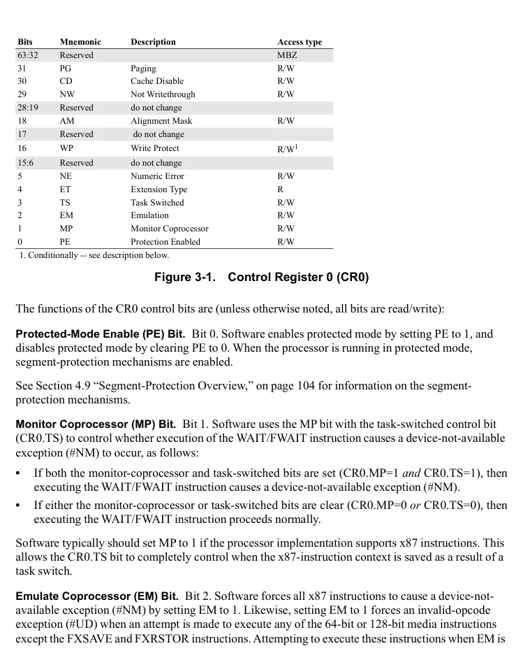

</details>


<!-- PDF source page: 105 | printed page: 43 -->

set results in an #NM exception instead. The exception handlers can emulate these instruction types if desired. Setting the EM bit to 1 does not cause an #NM exception when the WAIT/FWAIT instruction is executed.

**Task Switched (TS) Bit.** Bit 3. When an attempt is made to execute an x87 or media instruction while TS=1, a device-not-available exception (#NM) occurs. Software can use this mechanism— sometimes referred to as “lazy context-switching”—to save the unit contexts before executing the next instruction of those types. As a result, the x87 and media instruction-unit contexts are saved only when necessary as a result of a task switch.

When a hardware task switch occurs, TS is automatically set to 1. System software that implements software task-switching rather than using the hardware task-switch mechanism can still use the TS bit to control x87 and media instruction-unit context saves. In this case, the task-management software uses a MOV CR0 instruction to explicitly set the TS bit to 1 during a task switch. Software can clear the TS bit by either executing the CLTS instruction or by writing to the CR0 register directly. Long-mode system software can use this approach even though the hardware task-switch mechanism is not supported in long mode.

The CR0.MP bit controls whether the WAIT/FWAIT instruction causes an #NM exception when TS=1.

**Extension Type (ET) Bit.** Bit 4, read-only. In some early x86 processors, software set ET to 1 to indicate support of the 387DX math-coprocessor instruction set. This bit is now reserved and forced to 1 by the processor. Software cannot clear this bit to 0.

**Numeric Error (NE) Bit.** Bit 5. Clearing the NE bit to 0 disables internal control of x87 floating-point exceptions and enables external control. When NE is cleared to 0, the IGNNE# input signal controls whether x87 floating-point exceptions are ignored:

- When IGNNE# is 1, x87 floating-point exceptions are ignored.
- When IGNNE# is 0, x87 floating-point exceptions are reported by setting the FERR# input signal to 1. External logic can use the FERR# signal as an external interrupt.

When NE is set to 1, internal control over x87 floating-point exception reporting is enabled and the external reporting mechanism is disabled. It is recommended that software set NE to 1. This enables optimal performance in handling x87 floating-point exceptions.

**Write Protect (WP) Bit.** Bit 16. Read-only pages are protected from supervisor-level writes when the WP bit is set to 1. When WP is cleared to 0, supervisor software can write into read-only pages.

See Section 5.6 “Page-Protection Checks,” on page 161 for information on the page-protection mechanism. If the shadow stack feature has been enabled (CR4.CET=1), attempting to clear WP to 0 causes a general-protection exception (#GP).

**Alignment Mask (AM) Bit.** Bit 18. Software enables automatic alignment checking by setting the AM bit to 1 when RFLAGS.AC=1. Alignment checking can be disabled by clearing either AM or


<!-- PDF source page: 106 | printed page: 44 -->

RFLAGS.AC to 0. When automatic alignment checking is enabled and CPL=3, a memory reference to an unaligned operand causes an alignment-check exception (#AC).

**Not Writethrough (NW) Bit.** Bit 29. Ignored. This bit can be set to 1 or cleared to 0, but its value is ignored. The NW bit exists only for legacy purposes.

**Cache Disable (CD) Bit.** Bit 30. When CD is cleared to 0, the internal caches are enabled. When CD is set to 1, no new data or instructions are brought into the internal caches. However, the processor still accesses the internal caches when CD = 1 under the following situations:

- Reads that hit in an internal cache cause the data to be read from the internal cache that reported the hit.
- Writes that hit in an internal cache cause the cache line that reported the hit to be written back to memory and invalidated in the cache.

Cache misses do not affect the internal caches when CD = 1. Software can prevent cache access by setting CD to 1 and invalidating the caches.

Setting CD to 1 also causes the processor to ignore the page-level cache-control bits (PWT and PCD) when paging is enabled. These bits are located in the page-translation tables and CR3 register. See Section “Page-Level Writethrough (PWT) Bit,” on page 155 and Section “Page-Level Cache Disable (PCD) Bit,” on page 155 for information on page-level cache control.

See Section 7.6 “Memory Caches,” on page 204 for information on the internal caches.

**Paging Enable (PG) Bit.** Bit 31. Software enables page translation by setting PG to 1, and disables page translation by clearing PG to 0. Page translation cannot be enabled unless the processor is in protected mode (CR0.PE=1). If software attempts to set PG to 1 when PE is cleared to 0, the processor causes a general-protection exception (#GP).

See Section 5.1 “Page Translation Overview,” on page 127 for information on the page-translation mechanism.

**Reserved Bits.** Bits 28:19, 17, 15:6, and 63:32. When writing the CR0 register, software should set the values of reserved bits to the values found during the previous CR0 read. No attempt should be made to change reserved bits, and software should never rely on the values of reserved bits. In long mode, bits 63:32 are reserved and must be written with zero, otherwise a #GP occurs.

<a id="3-1-2-cr2-and-cr3-registers"></a>

### 3.1.2 CR2 and CR3 Registers

The CR2 (page-fault linear address) register, shown in Figure 3-2 on page 45 and Figure 3-3 on page 45, and the CR3 (page-translation-table base address) register, shown in Figure 3-4 and Figure 3-5 on page 45, and Figure 3-6 on page 46, are used only by the page-translation mechanism.


<!-- PDF source page: 107 | printed page: 45 -->

**Figure 3-2. Control Register 2 (CR2)—Legacy-Mode**

<details>
<summary>Extracted figure labels</summary>

```text
31
0
Page-Fault Virtual Address
```

</details>

**Figure 3-3. Control Register 2 (CR2)—Long Mode**

<details>
<summary>Extracted figure labels</summary>

```text
63
32
Page-Fault Virtual Address
31
0
Page-Fault Virtual Address
```

</details>

See Section “CR2 Register,” on page 256 for a description of the CR2 register.

The CR3 register is used to point to the base address of the highest-level page-translation table.

**Figure 3-4. Control Register 3 (CR3)—Legacy-Mode Non-PAE Paging**

<details>
<summary>Extracted figure labels</summary>

```text
31
12 11
5
4
3
2
0
PWT
PCD
Page-Directory-Table Base Address
Reserved
```

</details>

**Figure 3-5. Control Register 3 (CR3)—Legacy-Mode PAE Paging**

<details>
<summary>Extracted figure labels</summary>

```text
31
5
4
3
2
0
PWT
PCD
Page-Directory-Pointer-Table Base Address
Reserved
```

</details>

<details>
<summary>Rendered source page 107 (figures/tables)</summary>

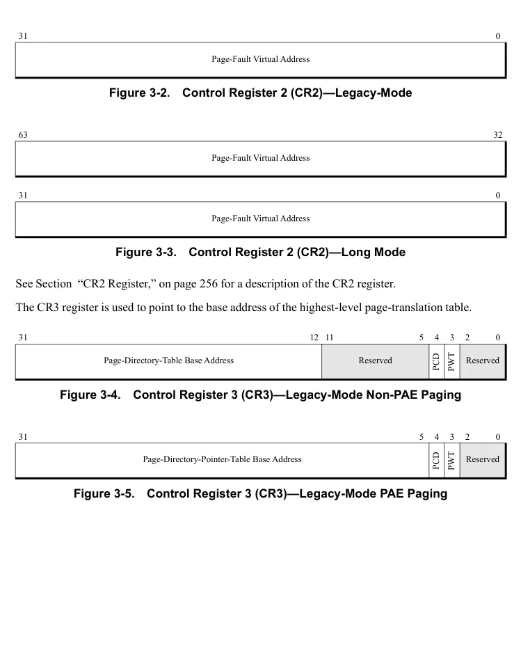

</details>


<!-- PDF source page: 108 | printed page: 46 -->

63 52 51 32

Reserved, MBZ Page-Map Level-4 Table Base Address (This is an architectural limit. A given implementation may support fewer bits.)

31 12 11 5 4 3 2 0

Page-Map Level-4 Table Base Address Usage depends on state of Processor Context ID enablement (CR4.PCIDE). See below.

11 5 4 3 2 0

PWT

PCD

CR4.PCIDE=0 Reserved

Reserved

CR4.PCIDE=1 Processor Context Identifier (See Section 5.5.1 “Process Context Identifier,” on page 158 for more information.)

**Figure 3-6. Control Register 3 (CR3)—Long Mode**

The legacy CR3 register is described in Section 5.2.1 “CR3 Register,” on page 131, and the long-mode CR3 register is described in Section 5.3.2 “CR3,” on page 140.

<a id="3-1-3-cr4-register"></a>

### 3.1.3 CR4 Register

The CR4 register is shown in Figure 3-7. In legacy mode, the CR4 register is identical to the low 32 bits of the register (CR4 bits 31:0). The features controlled by the bits in the CR4 register are model-specific extensions. Except for the performance-counter extensions (PCE) feature, software can use the CPUID instruction to verify that each feature is supported before using that feature. See Section 3.3 “Processor Feature Identification,” on page 71 for information on using the CPUID instruction.

<details>
<summary>Rendered source page 108 (figures/tables)</summary>

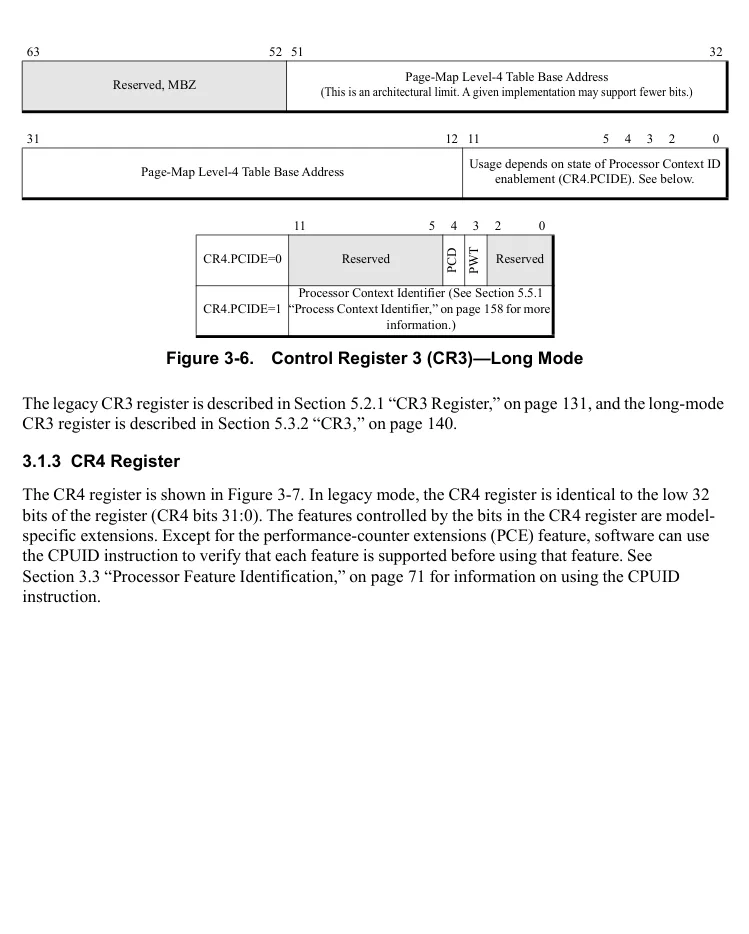

</details>


<!-- PDF source page: 109 | printed page: 47 -->

63 32

Reserved

31 24 23 22 21 20 19 18 17 16 15 13 12 11 10 9 8 7 6 5 4 3 2 1 0

OSXMMEXCPT

FSGSBASE

OSXSAVE

OSFXSR

Reserved

PCIDE

SMAP

SMEP

UMIP

PKE

CET

LA57

VME

MCE

TSD

PGE

PCE

PAE

Reserved

PSE

PVI

DE

**Bits Mnemonic Description Access Type** 63:24 Reserved MBZ 23 CET Control-flow Enforcement Technology R/W 22 PKE Protection Key Enable R/W 21 SMAP Supervisor Mode Access Protection R/W 20 SMEP Supervisor Mode Execution Prevention R/W 19 Reserved MBZ 18 OSXSAVE XSAVE and Processor Extended States Enable Bit R/W 17 PCIDE Process Context Identifier Enable R/W

16 FSGSBASE Enable RDFSBASE, RDGSBASE, WRFSBASE, and WRGSBASE instructions R/W

15:13 Reserved MBZ 12 LA57 5-Level Paging Enable R/W 11 UMIP User Mode Instruction Prevention R/W 10 OSXMMEXCPT Operating System Unmasked Exception Support R/W 9 OSFXSR Operating System FXSAVE/FXRSTOR Support R/W 8 PCE Performance-Monitoring Counter Enable R/W 7 PGE Page-Global Enable R/W 6 MCE Machine Check Enable R/W 5 PAE Physical-Address Extension R/W 4 PSE Page Size Extensions R/W 3 DE Debugging Extensions R/W 2 TSD Time Stamp Disable R/W 1 PVI Protected-Mode Virtual Interrupts R/W 0 VME Virtual-8086 Mode Extensions R/W

**Figure 3-7. CR4 Register**

The function of the CR4 control bits are (all bits are read/write):

**Virtual-8086 Mode Extensions (VME).** Bit 0. Setting VME to 1 enables hardware-supported performance enhancements for software running in virtual-8086 mode. Clearing VME to 0 disables this support. The enhancements enabled when VME=1 include:

<details>
<summary>Rendered source page 109 (figures/tables)</summary>

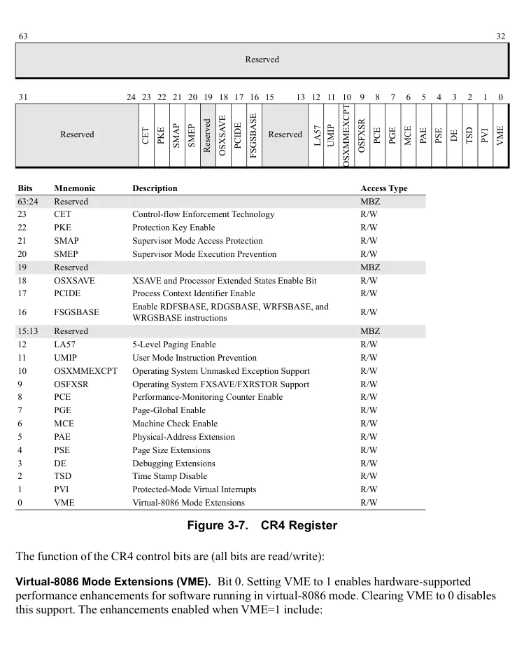

</details>


<!-- PDF source page: 110 | printed page: 48 -->

- Virtualized, maskable, external-interrupt control and notification using the VIF and VIP bits in the RFLAGS register. Virtualizing affects the operation of several instructions that manipulate the RFLAGS.IF bit.
- Selective intercept of software interrupts (INT*n* instructions) using the interrupt-redirection bitmap in the TSS.

**Protected-Mode Virtual Interrupts (PVI).** Bit 1. Setting PVI to 1 enables support for protected-mode virtual interrupts. Clearing PVI to 0 disables this support. When PVI=1, hardware support of two bits in the RFLAGS register, VIF and VIP, is enabled.

Only the STI and CLI instructions are affected by enabling PVI. Unlike the case when CR0.VME=1, the interrupt-redirection bitmap in the TSS cannot be used for selective INT*n* interception.

PVI enhancements are also supported in long mode. See Section 8.10 “Virtual Interrupts,” on page 288 for more information on using PVI.

**Time-Stamp Disable (TSD).** Bit 2. The TSD bit allows software to control the privilege level at which the time-stamp counter can be read. When TSD is cleared to 0, software running at any privilege level can read the time-stamp counter using the RDTSC or RDTSCP instructions. When TSD is set to 1, only software running at privilege-level 0 can execute the RDTSC or RDTSCP instructions.

**Debugging Extensions (DE).** Bit 3. Setting the DE bit to 1 enables the I/O breakpoint capability and enforces treatment of the DR4 and DR5 registers as reserved. Software that accesses DR4 or DR5 when DE=1 causes a invalid opcode exception (#UD).

When the DE bit is cleared to 0, I/O breakpoint capabilities are disabled. Software references to the DR4 and DR5 registers are aliased to the DR6 and DR7 registers, respectively.

**Page-Size Extensions (PSE).** Bit 4. Setting PSE to 1 enables the use of 4-Mbyte physical pages. With PSE=1, the physical-page size is selected between 4 Kbytes and 4 Mbytes using the page-directory entry page-size field (PS). Clearing PSE to 0 disables the use of 4-Mbyte physical pages and restricts all physical pages to 4 Kbytes.

The PSE bit has no effect when physical-address extensions are enabled (CR4.PAE=1). Because long mode requires CR4.PAE=1, the PSE bit is ignored when the processor is running in long mode.

See Section “4-Mbyte Page Translation,” on page 134 for more information on 4-Mbyte page translation.

**Physical-Address Extension (PAE).** Bit 5. Setting PAE to 1 enables the use of physical-address extensions and 2-Mbyte physical pages. Clearing PAE to 0 disables these features.

With PAE=1, the page-translation data structures are expanded from 32 bits to 64 bits, allowing the translation of up to 52-bit physical addresses. Also, the physical-page size is selectable between 4 Kbytes and 2 Mbytes using the page-directory-entry page-size field (PS). Long mode requires PAE to be enabled in order to use the 64-bit page-translation data structures to translate 64-bit virtual addresses to 52-bit physical addresses.


<!-- PDF source page: 111 | printed page: 49 -->

See Section 5.2.3 “PAE Paging,” on page 135 for more information on physical-address extensions.

**Machine-Check Enable (MCE).** Bit 6. Setting MCE to 1 enables the machine-check exception mechanism. Clearing this bit to 0 disables the mechanism. When enabled, a machine-check exception (#MC) occurs when an uncorrectable machine-check error is encountered.

Regardless of whether machine-check exceptions are enabled, the processor records enabled-errors when they occur. Error-reporting is performed by the machine-check error-reporting register banks. Each bank includes a control register for enabling error reporting and a status register for capturing errors. Correctable machine-check errors are also reported, but they do not cause a machine-check exception.

See Chapter 9, “Machine Check Architecture,” for a description of the machine-check mechanism, the registers used, and the types of errors captured by the mechanism.

**Page-Global Enable (PGE).** Bit 7. When page translation is enabled, system-software performance can often be improved by making some page translations *global* to all tasks and procedures. Setting PGE to 1 enables the global-page mechanism. Clearing this bit to 0 disables the mechanism.

When PGE is enabled, system software can set the global-page (G) bit in the lowest level of the page-translation hierarchy to 1, indicating that the page translation is global. Page translations marked as global are not invalidated in the TLB when the page-translation-table base address (CR3) is updated. When the G bit is cleared, the page translation is not global. All supported physical-page sizes also support the global-page mechanism. See Section 5.5.2 “Global Pages,” on page 158 for information on using the global-page mechanism.

**Performance-Monitoring Counter Enable (PCE).** Bit 8. Setting PCE to 1 allows software running at any privilege level to use the RDPMC instruction. Software uses the RDPMC instruction to read the performance-monitoring counter MSRs, *PerfCtr*n*. Clearing PCE to 0 allows only the most-privileged software (CPL=0) to use the RDPMC instruction.

**FXSAVE/FXRSTOR Support (OSFXSR).** Bit 9. System software must set the OSFXSR bit to 1 to enable use of the legacy SSE instructions. When this bit is set to 1, it also indicates that system software uses the FXSAVE and FXRSTOR instructions to save and restore the processor state for the x87, 64-bit media, and 128-bit media instructions.

Clearing the OSFXSR bit to 0 indicates that legacy SSE instructions cannot be used. Attempts to use those instructions while this bit is clear result in an invalid-opcode exception (#UD). Software can continue to use the FXSAVE/FXRSTOR instructions for saving and restoring the processor state for the x87 and 64-bit media instructions.

**Unmasked Exception Support (OSXMMEXCPT).** Bit 10. System software must set the OSXMMEXCPT bit to 1 when it supports the SIMD floating-point exception (#XF) for handling of unmasked 256-bit and 128-bit media floating-point errors. Clearing the OSXMMEXCPT bit to 0 indicates the #XF handler is not supported. When OSXMMEXCPT=0, unmasked 128-bit media floating-point exceptions cause an invalid-opcode exception (#UD). See “SIMD Floating-Point Exception Causes” in Volume 1 for more information on unmasked SSE floating-point exceptions.


<!-- PDF source page: 112 | printed page: 50 -->

**User Mode Instruction Prevention (UMIP).** Bit 11. Setting UMIP to 1 enables a security mode to restrict certain instructions executing at CPL&gt;0 so that they do not reveal information about structures that are controlled by the processor when it is at CPL=0. When UMIP is enabled, execution of SGDT, SIDT, SLDT, SMSW and STR instructions become available only at CPL=0 and any attempt to execute them with CPL&gt;0 results in a #GP fault with error code 0. See Section 6 “System Instructions,” on page 170 for more information about UMIP.

**5-Level Paging Enable (LA57) .** Bit 12. Setting this bit to 1 while EFER[LMA]=1 enables 5-Level paging. 5-Level paging allows for the translation of up to 57 virtual address bits. See Section Section 5.3 “Long-Mode Page Translation,” on page 139 for a description of 4-Level and 5-Level paging.

**FSGSBASE.** Bit 16. System software must set this bit to 1 to enable the execution of the RDFSBASE, RDGSBASE, WRFSBASE, and WRGSBASE instructions when supported. When enabled, these instructions allow software running in 64-bit mode at any privilege level to read and write the FS.base and GS.base hidden segment register state. See the discussion of segment registers in 64-bit mode in Section 4.5.3 “Segment Registers in 64-Bit Mode,” on page 80. Also see descriptions of the RDFSBASE, RDGSBASE, WRFSBASE, and WRGSBASE instructions in Volume 3.

**Processor Context Identifier Enable (PCIDE).** Bit 17. Enable support for Process Context Identifiers (PCIDs). System software must set this bit to 1 to enable execution of the INVPCID instruction when supported. Can only be set in long mode (EFER.LMA = 1). See Chapter 5.5.1, “Process Context Identifier,” for more information on Process Context Identifiers.

**XSAVE and Extended States (OSXSAVE).** Bit 18. After verifying hardware support for the extended processor state management instructions, operating system software sets this bit to indicate support for the XGETBV, XSAVE and XRSTOR instructions.

Setting this bit also:

- allows the execution of the XGETBV and XSETBV instructions, and
- enables the XSAVE and XRSTOR instructions to save and restore the x87 FPU state (including MMX registers), along with other processor extended states enabled in XCR0.

After initializing the XSAVE/XRSTOR save area, XSAVEOPT (if supported) may be used to save x87 FPU and other enabled extended processor state. For more information on XSAVEOPT, see individual instruction listing in Chapter 2 of Volume 4.

Note that legacy SSE instruction execution must be enabled prior to enabling extended processor state management.

**Supervisor Mode Execution Prevention (SMEP).** Bit 20. Setting this bit enables the supervisor mode execution prevention feature, if supported. This feature prevents the execution of instructions that reside in pages accessible by user-mode software when the processor is in supervisor-mode. See Section 5.6 “Page-Protection Checks,” on page 161 for more information.


<!-- PDF source page: 113 | printed page: 51 -->

**Supervisor Mode Access Prevention (SMAP).** Bit 21. Setting this bit enables the supervisor mode access prevention feature, if supported. This feature prevents certain data accesses to pages accessible by user-mode software when the processor is in supervisor mode. See Section 5.6.6 “Supervisor-Mode Access Prevention(CR4.SMAP) Bit,” on page 164 for more information.

**Protection Key Enable (PKE).** Bit 22. Enable support for memory Protection Keys. Also enables support for the RDPKRU and WRPKRU instructions. A MOV to CR4 that changes CR4.PKE from 0 to 1 causes all cached entries in the TLB for the logical processor to be invalidated. (See Section 5.6.7 “Memory Protection Keys (MPK) Bit,” on page 164 for more information on memory protection keys.)

**Control-flow Enforcement Technology (CET).** Bit 23. Setting this bit enables the shadow stack feature. This feature ensures that return addresses read from the stack by RET and IRET instructions originated from a CALL instruction or similar control transfer.

See Section 18 “Shadow Stacks,” on page 678 for more information. Before setting this bit, CR0.WP must be set to 1, otherwise a #GP fault is generated.

**CR1 and CR5–CR7 Registers.** Control registers CR1, CR5–CR7, and CR9–CR15 are reserved. Attempts by software to use these registers result in an undefined-opcode exception (#UD).

<a id="3-1-4-additional-control-registers-in-64-bit-mode"></a>

### 3.1.4 Additional Control Registers in 64-Bit-Mode

In 64-bit mode, additional encodings are available to address up to eight additional control registers. The REX.R bit, in a REX prefix, is used to modify the ModRM *reg* field when that field encodes a control register, as shown in “REX Prefixes” in Volume 3. These additional encodings enable the processor to address CR8–CR15.

One additional control register, CR8, is defined in 64-bit mode for all hardware implementations, as described in “CR8 (Task Priority Register, TPR),” below. Access to the CR9–CR15 registers is implementation-dependent. Any attempt to access an unimplemented register results in an invalid-opcode exception (#UD).

<a id="3-1-5-cr8-task-priority-register-tpr"></a>

### 3.1.5 CR8 (Task Priority Register, TPR)

The AMD64 architecture introduces a new control register, CR8, defined as the task priority register (TPR). The register is accessible in 64-bit mode using the REX prefix. See Section 8.5.2 “External Interrupt Priorities,” on page 267 for a description of the TPR and how system software can use the TPR for controlling external interrupts.

<a id="3-1-6-rflags-register"></a>

### 3.1.6 RFLAGS Register

The RFLAGS register contains two different types of information:

- *Control bits* provide system-software controls and directional information for string operations. Some of these bits can have privilege-level restrictions.


<!-- PDF source page: 114 | printed page: 52 -->

- *Status bits* provide information resulting from logical and arithmetic operations. These are written by the processor and can be read by software running at any privilege level.

Figure 3-8 on page 52 shows the format of the RFLAGS register. The legacy EFLAGS register is identical to the low 32 bits of the register shown in Figure 3-8 (RFLAGS bits 31:0). The term *rFLAGS* is used to refer to the 16-bit, 32-bit, or 64-bit flags register, depending on context.

63 32

Reserved

31 22 21 20 19 18 17 16 15 14 13 12 11 10 9 8 7 6 5 4 3 2 1 0

Reserved

IOPL

Reserved

VIP

VIF

VM

AC

NT

OF

DF

AF

RF

CF

TF

ZF

SF

PF

ID

IF

**Bits Mnemonic Description Access type** 63:22 Reserved RAZ 21 ID ID Flag R/W 20 VIP Virtual Interrupt Pending R/W 19 VIF Virtual Interrupt Flag R/W 18 AC Alignment Check R/W 17 VM Virtual-8086 Mode R/W 16 RF Resume Flag R/W 15 Reserved RAZ 14 NT Nested Task R/W 13:12 IOPL I/O Privilege Level R/W 11 OF Overflow Flag R/W 10 DF Direction Flag R/W 9 IF Interrupt Flag R/W 8 TF Trap Flag R/W 7 SF Sign Flag R/W 6 ZF Zero Flag R/W 5 Reserved RAZ 4 AF Auxiliary Flag R/W 3 Reserved RAZ 2 PF Parity Flag R/W 1 Reserved RA1 0 CF Carry Flag R/W

**Figure 3-8. RFLAGS Register**

The functions of the RFLAGS control and status bits used by application software are described in “Flags Register” in Volume 1. The functions of RFLAGS system bits are (unless otherwise noted, all bits are read/write):

<details>
<summary>Rendered source page 114 (figures/tables)</summary>

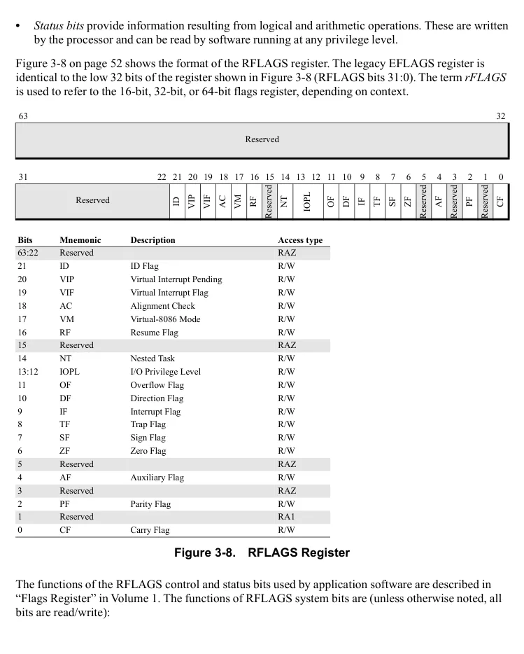

</details>


<!-- PDF source page: 115 | printed page: 53 -->

**Trap Flag (TF) Bit.** Bit 8. Software sets the TF bit to 1 to enable single-step mode during software debug. Clearing this bit to 0 disables single-step mode.

When single-step mode is enabled at the start of an instruction's execution, a debug exception (#DB) occurs immediately after the instruction completes execution. Single stepping is automatically disabled (TF is set to 0) when the #DB exception occurs or when any exception or interrupt occurs.

See Section 13.1.4 “Single Stepping,” on page 408 for information on using the single-step mode during debugging.

**Interrupt Flag (IF) Bit.** Bit 9. Software sets the IF bit to 1 to enable maskable interrupts. Clearing this bit to 0 causes the processor to ignore maskable interrupts. The state of the IF bit does not affect the response of a processor to non-maskable interrupts, software-interrupt instructions, or exceptions.

The ability to modify the IF bit depends on several factors:

- The current privilege-level (CPL)
- The I/O privilege level (RFLAGS.IOPL)
- Whether or not virtual-8086 mode extensions are enabled (CR4.VME=1)
- Whether or not protected-mode virtual interrupts are enabled (CR4.PVI=1)

See Section 8.1.4 “Masking External Interrupts,” on page 244 for information on interrupt masking. See Section 6.2.3 “Accessing the RFLAGS Register,” on page 178 for information on the specific instructions used to modify the IF bit.

**I/O Privilege Level Field (IOPL) Field.** Bits 13:12. The IOPL field specifies the privilege level required to execute I/O address-space instructions (i.e., instructions that address the I/O space rather than memory-mapped I/O, such as IN, OUT, INS, OUTS, etc.). For software to execute these instructions, the current privilege-level (CPL) must be equal to or higher than (lower numerical value than) the privilege specified by IOPL (CPL &lt;= IOPL). If the CPL is lower than (higher numerical value than) that specified by the IOPL (CPL &gt; IOPL), the processor causes a general-protection exception (#GP) when software attempts to execute an I/O instruction. See “Protected-Mode I/O” in Volume 1 for information on how IOPL controls access to address-space I/O.

Virtual-8086 mode uses IOPL to control virtual interrupts and the IF bit when virtual-8086 mode extensions are enabled (CR4.VME=1). The protected-mode virtual-interrupt mechanism (PVI) also uses IOPL to control virtual interrupts and the IF bit when PVI is enabled (CR4.PVI=1). See Section 8.10 “Virtual Interrupts,” on page 288 for information on how IOPL is used by the virtual interrupt mechanism.

**Nested Task (NT) Bit.** Bit 14, IRET reads the NT bit to determine whether the current task is nested within another task. When NT is set to 1, the current task is nested within another task. When NT is cleared to 0, the current task is at the top level (not nested).

The processor sets the NT bit during a task switch resulting from a CALL, interrupt, or exception through a task gate. When an IRET is executed from legacy mode while the NT bit is set, a task switch occurs. See Section 12.3.3 “Task Switches Using Task Gates,” on page 385 for information on


<!-- PDF source page: 116 | printed page: 54 -->

switching tasks using task gates, and Section 12.3.4 “Nesting Tasks,” on page 387 for information on task nesting.

**Resume Flag (RF) Bit.** Bit 16. The RF bit, when set to 1, temporarily disables instruction breakpoint reporting to prevent repeated debug exceptions (#DB) from occurring. This allows an instruction which had been inhibited by an instruction-breakpoint debug exception to be restarted by the debug exception handler.

The processor clears the RF bit after every instruction is successfully executed, except when the

instruction is:

- An IRET that sets the RF bit.
- JMP, CALL, or INT*n* through a task gate.

In both of the above cases, RF is not cleared to 0 until the *next* instruction successfully executes.

When an exception occurs (or when a string instruction is interrupted), the processor normally sets RF=1 in the RFLAGS image saved on the interrupt stack. However, when a #DB exception occurs as a result of an instruction breakpoint, the processor clears the RF bit to 0 in the interrupt-stack RFLAGS image.

For instruction restart to work properly following an instruction breakpoint, the #DB exception handler must set RF to 1 in the interrupt-stack RFLAGS image. When an IRET is later executed to return to the instruction that caused the instruction-breakpoint #DB exception, the set RF bit (RF=1) is loaded from the interrupt-stack RFLAGS image. RF is not cleared by the processor until the instruction causing the #DB exception successfully executes.

**Virtual-8086 Mode (VM) Bit.** Bit 17. Software sets the VM bit to 1 to enable virtual-8086 mode. Software clears the VM bit to 0 to disable virtual-8086 mode. System software can only change this bit using a task switch or an IRET. It cannot modify the bit using the POPFD instruction.

**Alignment Check (AC) Bit.** Bit 18. Software enables automatic alignment checking by setting the AC bit to 1 when CR0.AM=1. Alignment checking can be disabled by clearing either AC or CR0.AM to 0. When automatic alignment checking is enabled and the current privilege-level (CPL) is 3 (least privileged), a memory reference to an unaligned operand causes an alignment-check exception (#AC).

When the supervisor mode access prevention feature is enabled (CR4.SMAP=1), certain supervisor-mode data accesses to pages accessible by user mode are allowed only if RFLAGS.AC=1. See Section 5.6.6 “Supervisor-Mode Access Prevention(CR4.SMAP) Bit,” on page 164 for more information.

**Virtual Interrupt (VIF) Bit.** Bit 19. The VIF bit is a virtual image of the RFLAGS.IF bit. It is enabled when either virtual-8086 mode extensions are enabled (CR4.VME=1) or protected-mode virtual interrupts are enabled (CR4.PVI=1), and the RFLAGS.IOPL field is less than 3. When enabled, instructions that ordinarily would modify the IF bit actually modify the VIF bit with no effect on the RFLAGS.IF bit.


<!-- PDF source page: 117 | printed page: 55 -->

System software that supports virtual-8086 mode should enable the VIF bit using CR4.VME. This allows 8086 software to execute instructions that can set and clear the RFLAGS.IF bit without causing an exception. With VIF enabled in virtual-8086 mode, those instructions set and clear the VIF bit instead, giving the appearance to the 8086 software that it is modifying the RFLAGS.IF bit. System software reads the VIF bit to determine whether or not to take the action desired by the 8086 software (enabling or disabling interrupts by setting or clearing the RFLAGS.IF bit).

In long mode, the use of the VIF bit is supported when CR4.PVI=1. See Section 8.10 “Virtual Interrupts,” on page 288 for more information on virtual interrupts.

**Virtual Interrupt Pending (VIP) Bit.** Bit 20. The VIP bit is provided as an extension to both virtual-8086 mode and protected mode. It is used by system software to indicate that an external, maskable interrupt is pending (awaiting) execution by either a virtual-8086 mode or protected-mode interrupt-service routine. Software must enable virtual-8086 mode extensions (CR4.VME=1) or protected-mode virtual interrupts (CR4.PVI=1) before using VIP.

VIP is normally set to 1 by a protected-mode interrupt-service routine that was entered from virtual-8086 mode as a result of an external, maskable interrupt. Before returning to the virtual-8086 mode application, the service routine sets VIP to 1 if EFLAGS.VIF=1. When the virtual-8086 mode application attempts to enable interrupts by clearing EFLAGS.VIF to 0 while VIP=1, a general-protection exception (#GP) occurs. The #GP service routine can then decide whether to allow the virtual-8086 mode service routine to handle the pending external, maskable interrupt. (EFLAGS is specifically referred to in this case because virtual-8086 mode is supported only from legacy mode.)

In long mode, the use of the VIP bit is supported when CR4.PVI=1. See Section 8.10 “Virtual Interrupts,” on page 288 for more information on virtual-8086 mode interrupts and the VIP bit.

**Processor Feature Identification (ID) Bit.** Bit 21. The ability of software to modify this bit indicates that the processor implementation supports the CPUID instruction. See Section 3.3 “Processor Feature Identification,” on page 71 for more information on the CPUID instruction.

<a id="3-1-7-extended-feature-enable-register-efer"></a>

### 3.1.7 Extended Feature Enable Register (EFER)

The extended-feature-enable register (EFER) contains control bits that enable additional processor features not controlled by the legacy control registers. The EFER is a model-specific register (MSR) with an address of C000_0080h (see Section 3.2 “Model-Specific Registers (MSRs),” on page 59 for more information on MSRs). It can be read and written only by privileged software. Figure 3-9 on page 56 shows the format of the EFER register.

> ***Note:** Attempting to set an enable bit for a feature that is not supported by the processor will result in a #GP(0) exception.*


<!-- PDF source page: 118 | printed page: 56 -->

63 32

Reserved

31 22 21 20 19 18 17 16 15 14 13 12 11 10 9 8 7 1 0

MCOMMIT

Reserved

AIBRSE

INTWB

LMSLE

UAIE

SVME

FFXSR

LMA

MBZ

LME

NXE

TCE

SCE

Reserved

**Bits Mnemonic Description Access type** 63:22 Reserved MBZ 21 AIBRSE Automatic IBRS Enable R/W 20 UAIE Upper Address Ignore Enable R/W 19 Reserved MBZ 18 INTWB Interruptible WBINVD/WBNOINVD enable R/W 17 MCOMMIT Enable MCOMMIT instruction R/W 16 Reserved MBZ 15 TCE Translation Cache Extension R/W 14 FFXSR Fast FXSAVE/FXRSTOR R/W 13 LMSLE Long Mode Segment Limit Enable R/W 12 SVME Secure Virtual Machine Enable R/W 11 NXE No-Execute Enable R/W 10 LMA Long Mode Active R/W 9 Reserved MBZ 8 LME Long Mode Enable R/W 7:1 Reserved RAZ 0 SCE System Call Extensions R/W

**Figure 3-9. Extended Feature Enable Register (EFER)**

The defined EFER bits shown in Figure 3-9 above are described below:

**System-Call Extension (SCE) Bit.** Bit 0. Setting this bit to 1 enables the SYSCALL and SYSRET instructions. Application software can use these instructions for low-latency system calls and returns in a non-segmented (flat) address space. See Section 6.1 “Fast System Call and Return,” on page 173 for additional information.

**Long Mode Enable (LME) Bit.** Bit 8. Setting this bit to 1 enables the processor to activate long mode. Long mode is not activated until software enables paging some time later. When paging is enabled after LME is set to 1, the processor sets the EFER.LMA bit to 1, indicating that long mode is not only enabled but also active. See Chapter 14, “Processor Initialization and Long Mode Activation,” for more information on activating long mode.

**Long Mode Active (LMA) Bit.** Bit 10. This bit indicates that long mode is active. The processor sets LMA to 1 when both long mode and paging have been enabled by system software. See Chapter 14, “Processor Initialization and Long Mode Activation,” for more information on activating long mode.

<details>
<summary>Rendered source page 118 (figures/tables)</summary>

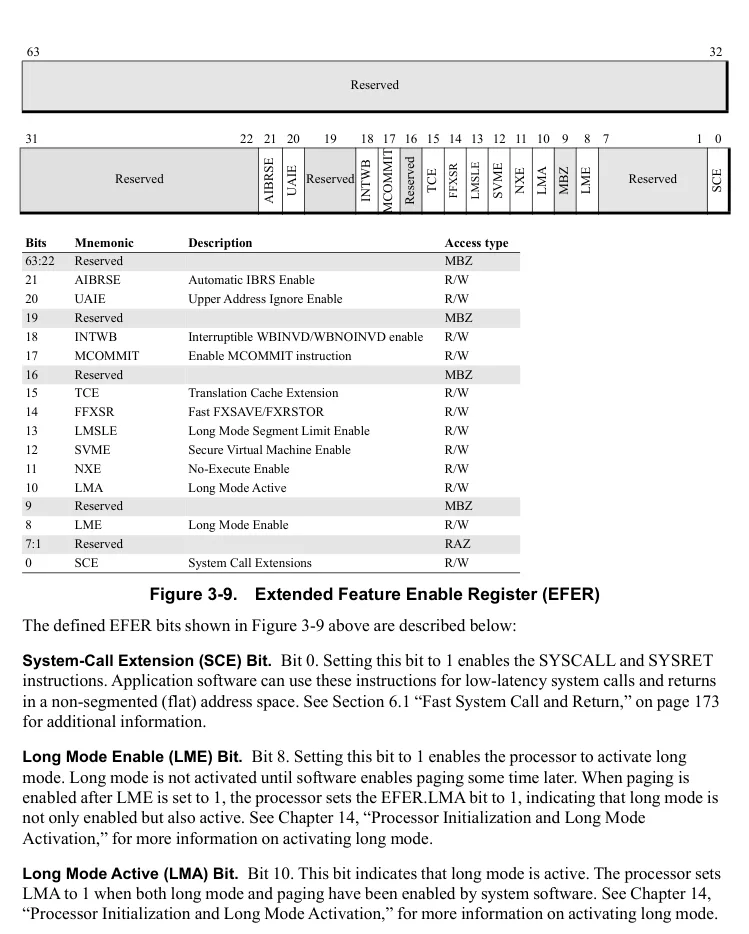

</details>


<!-- PDF source page: 119 | printed page: 57 -->

When LMA=1, the processor is running either in compatibility mode or 64-bit mode, depending on the value of the L bit in a code-segment descriptor, as shown in Figure 1-6 on page 12.

When LMA=0, the processor is running in legacy mode. In this mode, the processor behaves like a standard 32-bit x86 processor, with none of the new 64-bit features enabled. When writing the EFER register the value of this bit must be preserved. Software must read the EFER register to determine the value of LMA, change any other bits as required and then write the EFER register. An attempt to write a value that differs from the state determined by hardware results in a #GP fault.

**No-Execute Enable (NXE) Bit.** Bit 11. Setting this bit to 1 enables the no-execute page-protection feature. The feature is disabled when this bit is cleared to 0. See Section “No Execute (NX) Bit,” on page 156 for more information.

Before setting NXE, system software should verify the processor supports the feature by examining the feature flag CPUID Fn8000_0001_EDX[NX]. See Section 3.3 “Processor Feature Identification,” on page 71 for information on using the CPUID instruction.

**Secure Virtual Machine Enable (SVME) Bit.** Bit 12. Enables the SVM extensions. When this bit is zero, the SVM instructions cause #UD exceptions. EFER.SVME defaults to a reset value of zero. The effect of turning off EFER.SVME while a guest is running is undefined; therefore, the VMM should always prevent guests from writing EFER. SVM extensions can be disabled by setting VM_CR.SVME_DISABLE. For more information, see descriptions of LOCK and SMVE_DISABLE bits in Section 15.30.1 “VM_CR MSR (C001_0114h),” on page 583.

**Long Mode Segment Limit Enable (LMSLE) Bit.** Bit 13. Setting this bit to 1 enables certain limit checks in 64-bit mode. This feature has been deprecated and is not supported by all processor implementations. If CPUID Fn8000_0008_EBX[EferLmlseUnsupported](bit 20)=1, 64-bit mode segment limit checking is not supported and attempting to set EFER.LMSLE =1 causes a #GP exception. See Section 4.12.2 “Data Limit Checks in 64-bit Mode,” on page 123, for more information on these limit checks.

**Fast FXSAVE/FXRSTOR (FFXSR) Bit.** Bit 14. Setting this bit to 1 enables the FXSAVE and FXRSTOR instructions to execute faster in 64-bit mode at CPL 0. This is accomplished by not saving or restoring the XMM registers (XMM0-XMM15). The FFXSR bit has no effect when the FXSAVE/FXRSTOR instructions are executed in non 64-bit mode, or when CPL is &gt; 0. The FFXSR bit does not affect the save/restore of the legacy x87 floating-point state, or the save/restore of MXCSR.

Before setting FFXSR, system software should verify whether this feature is supported by examining the feature flag CPUID Fn8000_0001_EDX[FFXSR]. See Section 3.3 “Processor Feature Identification,” on page 71 for information on using the CPUID instruction.

**Translation Cache Extension (TCE) Bit.** Bit 15. Setting this bit to 1 changes how the INVLPG, INVLPGB, and INVPCID instructions operate on TLB entries. When this bit is 0, these instructions remove the target PTE from the TLB as well as *all* upper-level table entries that are cached in the TLB, whether or not they are associated with the target PTE. When this bit is set, these instructions will


<!-- PDF source page: 120 | printed page: 58 -->

remove the target PTE and only those upper-level entries that lead to the target PTE in the page table hierarchy, leaving unrelated upper-level entries intact. This may provide a performance benefit.

Page table management software must be written in a way that takes this behavior into account. Software that was written for a processor that does not cache upper-level table entries may result in stale entries being incorrectly used for translations when TCE is enabled. Software that is compatible with TCE mode will operate in either mode.

For software using INVLPGB to broadcast TLB invalidations, the invalidations are controlled by the EFER.TCE value on the processor executing the INVLPGB instruction.

Before setting TCE, system software should verify that this feature is supported by examining the feature flag CPUID Fn8000_0001_ECX[TCE]. See Section 3.3 “Processor Feature Identification,” on page 71 for information on using the CPUID instruction.

**Mcommit Enable (MCOMMIT) Bit.** Bit 17. Setting this bit to 1 enables the MCOMMIT instruction. When clear, attempting to execute MCOMMIT causes a #UD exception.

**Interruptible Wbinvd (INTWB) Bit.** Bit 18. Setting this bit to 1 allows the WBINVD and WBNOINVD instructions to be interruptible. See WBINVD and WBNOINVD in Volume 3.

**Upper Address Ignore Enable (UAIE) Bit.** Bit 20. Setting this bit to 1 excludes bits 63:57 of an address from the canonical check for some memory references. Section 5.10 “Upper Address Ignore,” on page 168.

**Automatic IBRS Enable (AIBRSE) Bit.** Bit 21. Setting this bit to 1 enables Automatic IBRS (Indirect Branch Restricted Speculation). When Automatic IBRS is enabled, the following processes have IBRS protection even when SPEC_CTRL[IBRS] is not set:

- Processes running at CPL=0
- Processes running as host when Secure Nested Paging (SEV-SNP) is enabled

When Automatic IBRS is enabled and Enhanced Return Address Predictor Security is not supported (CPUID Fn8000_0021_EAX[ERAPS] (bit 24) = 0), the return address predictor is cleared on VMEXIT. More information about IBRS protection can be found in Section 3.2.9 “Speculation Control Registers,” on page 66.

<a id="3-1-8-extended-control-registers-xcrn"></a>

### 3.1.8 Extended Control Registers (XCRn)

Extended control registers (XCR*n*) form a new register space that is available for managing processor architectural features and capabilities. Currently only XCR0 is defined. All other XCR registers are reserved. For more details on the Extended Control Registers, see “Extended Control Registers” in Volume 4, Chapter 1.


<!-- PDF source page: 121 | printed page: 59 -->

<a id="3-2-model-specific-registers-msrs"></a>

## 3.2 Model-Specific Registers (MSRs)

Processor implementations provide model-specific registers (MSRs) for software control over the unique features supported by that implementation. Software reads and writes MSRs using the privileged RDMSR and WRMSR instructions. Implementations of the AMD64 architecture can contain a mixture of two basic MSR types:

- *Legacy MSRs*. The AMD family of processors often share model-specific features with other x86 processor implementations. Where possible, AMD implementations use the same MSRs for the same functions. For example, the memory-typing and debug-extension MSRs are implemented on many AMD and non-AMD processors.
- *AMD model-specific MSRs*. There are many MSRs common to the AMD family of processors but not to legacy x86 processors. Where possible, AMD implementations use the same AMD-specific MSRs for the same functions.

Every model-specific register, as the name implies, is not necessarily implemented by all members of the AMD family of processors. Appendix A, “MSR Cross-Reference,” lists MSR-address ranges currently used by various AMD and other x86 processors.

The AMD64 architecture includes a number of features that are controlled using MSRs. Those MSRs are shown in Figure 3-10. The EFER register—described in Section 3.1.7 “Extended Feature Enable Register (EFER),” on page 55—is also an MSR.


<!-- PDF source page: 122 | printed page: 60 -->

**Figure 3-10. AMD64 Architecture Model-Specific Registers**

The following sections briefly describe the MSRs in the AMD64 architecture.

<a id="3-2-1-system-configuration-register-syscfg"></a>

### 3.2.1 System Configuration Register (SYSCFG)

The system-configuration register (SYSCFG) contains control bits for enabling and configuring system bus features. SYSCFG is a model-specific register (MSR) with an address of C001_0010h. Figure 3-11 on page 61 shows the format of the SYSCFG register. Some features are implementation specific, and are described in the *BIOS and Kernel Developer’s Guide (BKDG)* or *Processor Programming Reference Manual (PPR)* applicable to your product. Implementation-specific features are not shown in Figure 3-11.

<details>
<summary>Rendered source page 122 (figures/tables)</summary>

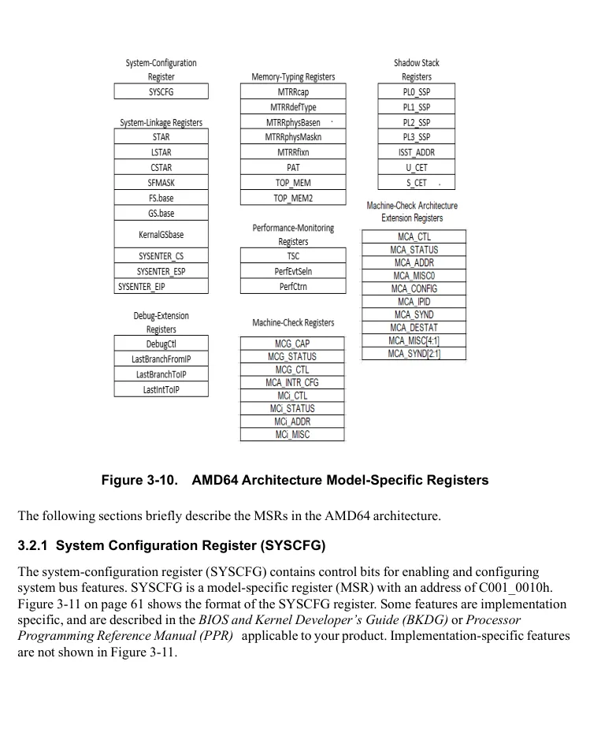

</details>


<!-- PDF source page: 123 | printed page: 61 -->

63 32

Reserved

31 27 26 25 24 23 22 21 20 19 18 17 0

VMPLE

MFDE

MVDM

MFDM

MEME

HMKE

TOM2

SNPE

FWB

Reserved

**Bits Mnemonic Description Access type** 63:27 Reserved MBZ 26 HMKE HostMultiKeyMemEncrModeEn R/W 25 VMPLE VMPLEn R/W 24 SNPE SecureNestedPagingEn R/W 23 MEME MemEncryptionModeEn R/W 22 FWB Tom2ForceMemTypeWB R/W 21 TOM2 MtrrTom2En R/W 20 MVDM MtrrVarDramEn R/W 19 MFDM MtrrFixDramModEn R/W 18 MFDE MtrrFixDramEn R/W 17:0 Reserved MBZ

**Figure 3-11. System-Configuration Register (SYSCFG)**

The function of the SYSCFG bits are (all bits are read/write unless otherwise noted):

**MtrrFixDramEn Bit.** Bit 18. Setting this bit to 1 enables use of the RdMem and WrMem attributes in the fixed-range MTRR registers. When cleared, these attributes are disabled. The RdMem and WrMem attributes allow system software to define fixed-range IORRs using the fixed-range MTRRs. See Section 7.9.1 “Extended Fixed-Range MTRR Type-Field Encodings,” on page 232 for information on using this feature.

**MtrrFixDramModEn Bit.** Bit 19. Setting this bit to 1 allows software to read and write the RdMem and WrMem bits. When cleared, writes do not modify the RdMem and WrMem bits, and reads return 0. See Section 7.9.1 “Extended Fixed-Range MTRR Type-Field Encodings,” on page 232 for information on using this feature.

**MtrrVarDramEn Bit.** Bit 20. Setting this bit to 1 enables the TOP_MEM register and the variable-range IORRs. These registers are disabled when the bit is cleared to 0. See Section 7.9.2 “IORRs,” on page 234 and Section 7.9.4 “Top of Memory,” on page 236 for information on using these features.

**MtrrTom2En Bit.** Bit 21. Setting this bit to 1 enables the TOP_MEM2 register. The register is disabled when this bit is cleared to 0. See Section 7.9.4 “Top of Memory,” on page 236 for information on using this feature.

<details>
<summary>Rendered source page 123 (figures/tables)</summary>

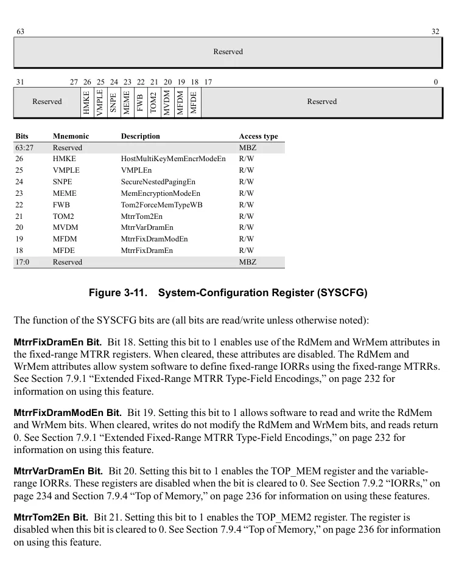

</details>


<!-- PDF source page: 124 | printed page: 62 -->

**Tom2ForceMemTypeWB.** Bit 22. Setting this bit to 1 forces the default memory type for memory between 4GB and the address specified by TOP_MEM2 to be write back instead of the memory type defined by MTRRdefType[Type]. For this bit to have any effect, MTRRdefType[E] must be 1. MTRR variable-range settings and PAT can be used to override this memory type.

**MemEncryptionModeEn.** Bit 23. Setting this bit to 1 enables the SME (Section 7.10 “Secure Memory Encryption,” on page 238) and SEV (Section 15.34 “Secure Encrypted Virtualization,” on page 588) memory encryption features. When cleared, these features are disabled. Once this bit or HostMultiKeyMemEncrModeEn is set to 1, it cannot be changed.

**SecureNestedPagingEn**. Bit 24. Setting this bit to 1 enables SEV-SNP (Section 15.36 “Secure Nested Paging (SEV-SNP),” on page 601). When cleared, this feature is disabled. Once this bit is set to 1, it cannot be changed. This bit can only be set if MemEncryptionModeEn is already set or is simultaneously also set to 1. After SecureNestedPagingEn is set to 1, certain MSRs may no longer be written. See Section 15.36.2 “Enabling SEV-SNP,” on page 602 for details.

**VMPLEn**. Bit 25. Setting this bit to 1 enables the VMPL feature (Section 15.36.7 “Virtual Machine Privilege Levels,” on page 606). Software should set this bit to 1 when SecureNestedPagingEn is being set to 1. Once SecureNestedPagingEn is set to 1, VMPLEn cannot be changed.

**HostMultiKeyMemEncrModeEn.** Bit 26. Setting this bit to 1 enables the SME-MK memory encryption feature (See Section 7.10 “Secure Memory Encryption,” on page 238). When cleared, this feature is disabled. Once this bit or MemEncryptionModeEn is set to 1, it cannot be changed.

<a id="3-2-2-system-linkage-registers"></a>

### 3.2.2 System-Linkage Registers

System-linkage MSRs are used by system software to allow fast control transfers between applications and the operating system. The functions of these registers are:

**STAR, LSTAR, CSTAR, and SFMASK Registers.** These registers are used to provide mode-dependent linkage information for the SYSCALL and SYSRET instructions. STAR is used in legacy modes, LSTAR in 64-bit mode, and CSTAR in compatibility mode. SFMASK is used by the SYSCALL instruction for RFLAGS in long mode.

**FS.base and GS.base Registers.** These registers allow 64-bit base-address values to be specified for the FS and GS segments, for use in 64-bit mode. See Section “FS and GS Registers in 64-Bit Mode,” on page 80 for a description of the special treatment the FS and GS segments receive.

**KernelGSbase Register.** This register is used by the SWAPGS instruction. This instruction exchanges the value located in KernelGSbase with the value located in GS.base.

**SYSENTER*****x* Registers.** The SYSENTER_CS, SYSENTER_ESP, and SYSENTER_EIP registers are used to provide linkage information for the SYSENTER and SYSEXIT instructions. These instructions are only used in legacy mode.

The system-linkage instructions and their use of MSRs are described in Section 6.1 “Fast System Call and Return,” on page 173.


<!-- PDF source page: 125 | printed page: 63 -->

<a id="3-2-3-memory-typing-registers"></a>

### 3.2.3 Memory-Typing Registers

Memory-typing MSRs are used to characterize, or type, memory. Memory typing allows software to control the cacheability of memory, and determine how accesses to memory are ordered. The memory-typing registers perform the following functions:

**MTRRcap Register.** This register contains information describing the level of MTRR support provided by the processor.

**MTRRdefType Register.** This register establishes the default memory type to be used for physical memory that is not specifically characterized using the fixed-range and variable-range MTRRs.

**MTRRphysBasen and MTRRphysMaskn Registers.** These registers form a register pair that can be used to characterize any address range within the physical-memory space, including all of physical memory. Up to eight address ranges of varying sizes can be characterized using these registers.

**MTRRfixn Registers.** These registers are used to characterize fixed-size memory ranges in the first 1 Mbytes of physical-memory space.

**PAT Register.** This register allows memory-type characterization based on the virtual (linear) address. It is an extension to the PCD and PWT memory types supported by the legacy paging mechanism. The PAT mechanism provides the same memory-typing capabilities as the MTRRs, but with the added flexibility provided by the paging mechanism.

**TOP_MEM and TOP_MEM2 Registers.** These top-of-memory registers allow system software to specify physical addresses ranges as memory-mapped I/O locations.

Refer to Section 7.7 “Memory-Type Range Registers,” on page 217 for more information on using these registers.

<a id="3-2-4-debug-extension-registers"></a>

### 3.2.4 Debug-Extension Registers

The debug-extension MSRs provide software-debug capability not available in the legacy debug registers (DR0–DR7). These MSRs allow single stepping and recording of control transfers to take place. The debug-extension registers perform the following functions:

**DebugCtl Register.** This MSR register provides control over control-transfer recording and single stepping, and external-breakpoint reporting and trace messages.

**LastBranch*****x* and LastInt*****x* Registers.** The four registers, LastBranchToIP, LastBranchFromIP, LastIntToIP, and LastIntFromIP, are all used to record the source and target of control transfers when branch recording is enabled.

Refer to Section 13.1.6 “Control-Transfer Breakpoint Features,” on page 409 for more information on using these debug registers.


<!-- PDF source page: 126 | printed page: 64 -->

<a id="3-2-5-performance-monitoring-registers"></a>

### 3.2.5 Performance-Monitoring Registers

The time-stamp counter and performance-monitoring registers are useful in identifying performance bottlenecks. The number of performance counters can vary based on the implementation. These registers perform the following functions:

**TSC Register.** This register is used to count processor-clock cycles. It can be read using the RDMSR instruction, or it can be read using the either of the *read time-stamp counter* instructions, RDTSC or RDTSCP. System software can make RDTSC or RDTSCP available for use by non-privileged software by clearing the time-stamp disable bit (CR4.TSD) to 0.

***PerfEvtSel*****n* Registers.** These registers are used to specify the events counted by the corresponding performance counter, and to control other aspects of its operation.

***PerfCtr*****n* Registers.** These registers are performance counters that hold a count of processor, northbridge, or L2 cache events or the duration of events, under the control of the corresponding *PerfEvtSel*n* register. Each *PerfCtr*n* register can be read using the RDMSR instruction, or they can be read using the *read performance-monitor counter* instruction, RDPMC. System software can make RDPMC available for use by non-privileged software by setting the performance-monitor counter enable bit (CR4.PCE) to 1.

Refer to Section 13.2.3 “Using Performance Counters,” on page 422 for more information on using these registers.

<a id="3-2-6-machine-check-registers"></a>

### 3.2.6 Machine-Check Registers

The machine-check registers control the detection and reporting of hardware machine-check errors. The types of errors that can be reported include cache-access errors, load-data and store-data errors, bus-parity errors, and ECC errors. Three types of machine-check MSRs are shown in Figure 3-10 on page 60.

The first type is global machine-check registers, which perform the following functions:

**MCG_CAP Register.** This register identifies the machine-check capabilities supported by the processor.

**MCG_CTL Register.** This register provides global control over machine-check-error reporting.

**MCG_STATUS Register.** This register reports global status on detected machine-check errors.

The second type is error-reporting register banks, which report on machine-check errors associated with a specific processor unit (or group of processor units). There can be different numbers of register banks for each processor implementation, and each bank is numbered from 0 to *i*. The registers in each bank perform the following functions:

**MC*****i*****_CTL Registers.** These registers control error-reporting.

**MC*****i*****_STATUS Registers.** These registers report machine-check errors.


<!-- PDF source page: 127 | printed page: 65 -->

**MC*****i*****_ADDR Registers.** These registers report the machine-check error address.

**MC*****i*****_MISC Registers.** These registers report miscellaneous-error information.

The third type is MCA Extension (MCAX) register banks, which report on machine-check errors associated with a specific processor unit (or group of processor units). There can be different numbers of register banks for each processor implementation, and each bank is numbered from 0 to i. Legacy MCA supports up to 32 banks. MCAX bank 0 will alias to Legacy bank 0 registers. Similarly, MCAX bank n will alias to Legacy bank n registers. The registers in each bank perform the following functions:

**MCA_CTL Register.** This register is an alias to MCi_CTL for banks 0 to 31. For banks 32 and above, this register controls error-reporting.

**MCA_STATUS Register.** This register is an alias to MCi_Status.

**MCA_ADDR Register.** This register is an alias to MCi_ADDR.

**MCA_MISC0 Register.** This register is an alias to MCi_MISC0.

**MCA_CONFIG Register.** This register holds configuration information for the MCA bank.

**MCA_IPID Register.** This register holds information which identifies the specific MCA bank.

**MCA_SYND Register.** This register stores information associated with the error in MCA_STATUS or MCA_DESTAT.

**MCA_DESTAT Register.** This register reports deferred machine check errors.

**MCA_DEADDR Register.** This register provides the address associated with the deferred machine check error.

**MCA_MISC[4:1] Registers.** Extended miscellaneous error-information registers.

**MCA_SYND[2:1] Registers.** This register contains information associated with the error in MCA_STATUS or MCA_DESTAT.

Refer to Section 9.5 “Using MCA Features,” on page 320 for more information on using these registers.

<a id="3-2-7-shadow-stack-registers"></a>

### 3.2.7 Shadow Stack Registers

These registers are defined if the shadow stack feature is supported as indicated by CPUID Fn0000_0007_0 ECX[CET_SS] (bit 7) = 1.

**PL0_SSP, PL1_SSP, PL2_SSP Registers.** These registers specify the linear address to be loaded into SSP on the next transition to CPLn, where n=0, 1, 2. The linear address must be in canonical format and aligned to 4 bytes.


<!-- PDF source page: 128 | printed page: 66 -->

**PL3_SSP Register.** The user mode SSP is saved to and restored from this register. The linear address must be in canonical format and aligned to 4 bytes.

**ISST_ADDR Register.** This register specifies the linear address of the Interrupt SSP Table (ISST). The linear address must be in canonical format.

**U_CET Register.** This register specifies the user mode shadow stack controls.

**S_CET Register.** This register specifies the supervisor mode shadow stack controls.

<a id="3-2-8-extended-state-save-registers"></a>

### 3.2.8 Extended State Save Registers

**XSS Register.** This register contains a bitmap of supervisor-level state components. System software sets bits in the XSS register bitmap to enable management of corresponding state component by the XSAVES/XRSTORS instructions. XSS register support is indicated by CPUID Fn0000_000D_EAX[XSAVES]_x1 = 1.

The XSS bitmap is defined as follows:

63 32

Reserved

31 13 12 11 10 0

CET_U

CET_S

Reserved

**Bits Mnemonic Description Access type** 63:13 Reserved MBZ 12 CET_S Enables the CET_U state component. R/W 11 CET_U Enables the CET_S state component. R/W 10:0 Reserved MBZ

**Figure 3-12. XSS Register**

<a id="3-2-9-speculation-control-registers"></a>

### 3.2.9 Speculation Control Registers

Modern processors implement hardware techniques such as branch prediction, speculative execution and out-of-order processing to significantly improve performance. If the processor incorrectly predicts or speculates on an outcome, this is detected and any speculative results are discarded. The processor then supplies the architecturally correct, in-order response to the program's instructions. Even though the speculative results are discarded, microarchitectural side effects may remain which can be detected by software, and which in some cases may lead to side-channel vulnerabilities.

The two speculation control MSRs, SPEC_CTRL (MSR 048h) and PRED_CMD (MSR 049h), enable hardware features that are designed to limit certain types of speculation.

<details>
<summary>Rendered source page 128 (figures/tables)</summary>

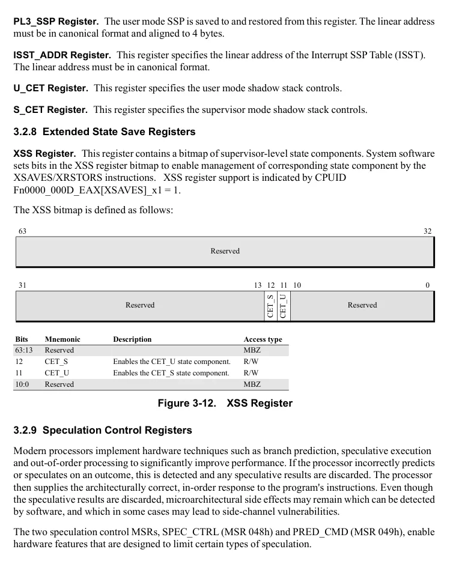

</details>


<!-- PDF source page: 129 | printed page: 67 -->

**SPEC_CTRL (MSR 048h)**

SPEC_CTRL is a read-write register. Attempts to write a 1 into any reserved bit cause a #GP(0) fault. Unlike most MSRs, a WRMSR to SPEC_CTRL does not serialize memory operations. However, a write to this register is dispatch serializing and prevents execution of younger instructions until the WRMSR has completed. The format of SPEC_CTRL is shown in Figure 3-12.

63 32

Reserved

31 8 7 6 3 2 1 0

STIBP

SSBD

PSFD

IBRS

Reserved

**Bits Mnemonic Description Access type** 63:8 Reserved MBZ 7 PSFD Predicted Store Forward Disable. R/W 6:3 Reserved MBZ 2 SSBD Speculative Store Bypass Disable. R/W 1 STIBP Single-Thread Indirect Branch Prediction Mode. R/W 0 IBRS Indirect Branch Restricted Speculation. R/W

**Figure 3-13. SPEC_CTRL Register**

The SPEC_CTRL bits defined in Figure 3-13 and are described below:

**Indirect Branch Restricted Speculation (IBRS).** Bit 0. Setting this bit to 1 prevents indirect branches that occurred in a less privileged prediction mode before this bit was set from influencing the predictions of future indirect branches in a more privileged prediction mode that occur after this bit is set. A lesser privileged prediction mode is defined as CPL 3 or Guest mode, and a more privileged prediction mode is defined as CPL 0-2 or Host mode. Support for IBRS is indicated by CPUID Fn8000_0008_EBX[IBRS] (bit 14) = 1.

After setting IBRS to 1, if software subsequently

- clears IBRS to 0: The processor may allow older indirect branches that occurred when IBRS was previously 0 to influence future indirect branch predictions.
- writes another 1 to IBRS: The processor starts a new window where older indirect branches do not influence future indirect branch predictions.

Only indirect branches that occurred prior to setting IBRS are prevented from influencing future indirect branches. Therefore, if IBRS were already set on a transition to a more privileged mode from a lesser privileged mode, software at the more privileged mode must write a 1 to IBRS if it requires indirect branch predictions in the new mode to not be influenced by those from the previous mode.

<details>
<summary>Rendered source page 129 (figures/tables)</summary>

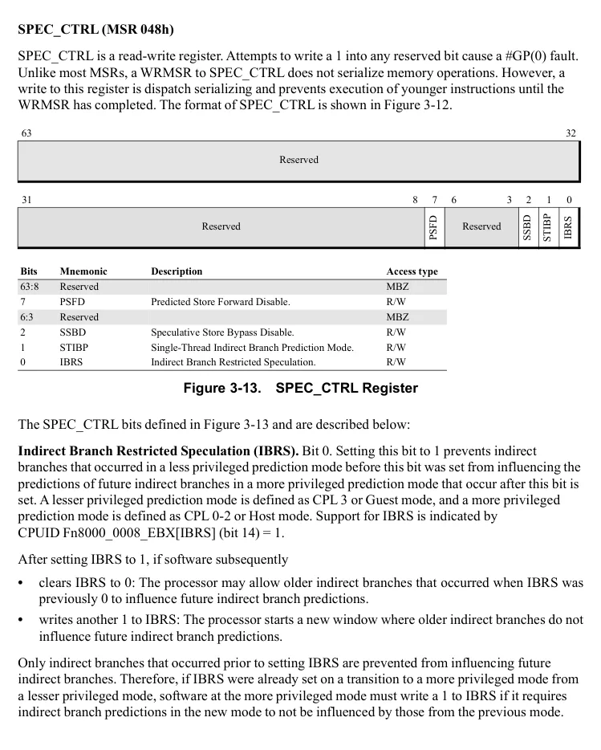

</details>


<!-- PDF source page: 130 | printed page: 68 -->

On processors with a shared indirect branch predictor, setting IBRS also prevents indirect branch predictions of one thread from influencing the predictions of its sibling threads, as if SPEC_CTRL[STIBP] was also set. For more information on STIBP, see Single Thread Indirect Branch Predictor below.

Some processors, identified by CPUID Fn8000_0008_EBX[IbrsSameMode] (bit 19) = 1, provide additional speculation limits. For these processors, when IBRS is set, indirect branch predictions are not influenced by any prior indirect branches, regardless of mode (CPL and guest/host) and regardless of whether the prior indirect branches occurred before or after the setting of IBRS. This is referred to as Same Mode IBRS.

Some processors, identified by CPUID Fn8000_0021_EAX[AutomaticIBRS] (bit 8) = 1, support Automatic IBRS. Refer to the description of EFER[AIBRSE] on page 58 for more details.

Although return instructions can be considered a type of indirect branch, IBRS does not affect them. See “Return Address Predictor” on page 70 for more information on IBRS-style indirect branch speculation limits.

**Single Thread Indirect Branch Prediction mode (STIBP).** Bit 1. Setting this bit to 1 prevents indirect branch predictions of one thread from influencing the predictions of any sibling threads, on processors where branch prediction resources are shared. RET (return) instructions are not influenced by sibling threads. Therefore, setting STIBP is not required to prevent one thread’s RET predictions from influencing the predictions of a sibling thread. Support for STIBP is indicated by CPUID Fn8000_0008_EBX[STIBP] (bit 15) = 1.

Note that STIBP mode is automatically enabled when SPEC_CTRL[IBRS] is set, regardless of value of SPEC_CTRL[STIBP].

**Speculative Store Bypass Disable (SSBD).** Bit 2. Setting this bit to 1 prevents load-type instructions from speculatively bypassing older store instructions whose final address have not yet been resolved. Support for SSBD is indicated by CPUID Fn8000_0008_EBX[SSBD] (bit 24) = 1.

As specified in Section 7.1.1 “Read Ordering,” on page 187, loads from memory marked with the proper memory type can read memory out-of-order, speculatively and before older stores have completed. This means it is possible for a load to read and pass forward, in a speculative manner, previous values of the memory location. The processor has logic to correct this occurrence and provide the proper in-order load response to the program. However, this mis-speculation may have resulted in microarchitectural side effects. When SSBD is set to 1, the processor can return speculative load data only if there are no older stores with unknown addresses.

Some legacy processors implement SSBD in a different MSR. On these processors, indicated by CPUID Fn8000_0008[SsbdVirtSpecCtrl] (bit 25) = 1, SSBD is enabled by setting VIRT_SPEC_CTRL (MSR C001_011F) bit 2. On processors that support both SPEC_CTRL and VIRT_SPEC_CTRL, if SSBD is enabled in either MSR, the processor prevents loads from speculating around older stores. However, it is preferred that software uses SPEC_CTRL[SSBD] in this case.


<!-- PDF source page: 131 | printed page: 69 -->

On some processor models, setting SSBD is not needed to prevent speculative loads from bypassing older stores. This is indicated by CPUID Fn8000_0008_EBX[SsbdNotRequired] (bit 26) = 1.

**Predicted Store Forward Disable (PSFD).** Bit 7. Setting this bit disables Predictive Store Forwarding (PSF). Support for PSFD is indicated by CPUID Fn8000_0008_EBX[PSFD] (bit 28) = 1.

As specified in Section 7.1.1 “Read Ordering,” on page 187, write data for cacheable memory types can be forwarded to read instructions before that data is actually written to memory, via a mechanism called store-to-load forwarding. PSF expands on store-to-load forwarding via a mechanism that predicts the relationship between loads and stores based on past behavior, without waiting for their address calculations to complete. Like other forms of speculative store bypass, an incorrect prediction may result in microarchitectural side effects. PSF speculation can be disabled by setting PSFD.

The PSF feature is also disabled when SPEC_CTRL[SSBD] is set. However, SSBD disables both PSF and speculative store bypass, while PSFD only disables PSF. PSFD may be desirable for software which is concerned with the speculative behavior of PSF but desires a smaller performance impact than setting SSBD.

**PRED_CMD (MSR 049h)**

PRED_CMD is a write-only register. Attempts to read this register or to write a 1 into any reserved bit cause a #GP(0) fault. Unlike most MSRs, a WRMSR to PRED_CMD does not serialize memory operations. However, a write to this register is dispatch serializing and prevents execution of younger instructions until the WRMSR has completed. The format of the PRED_CMD register is shown in the following figure below.

63 32

Reserved

31 8 7 6 1 0

SBPB

IBPB

Reserved

**Bits Mnemonic Description Access type** 63:8 Reserved MBZ 7 SBPB Selective Branch Prediction Barrier. W 6:1 Reserved MBZ 0 IBPB Indirect Branch Prediction Barrier. W

**Figure 3-14. PRED_CMD Register**

**Indirect Branch Prediction Barrier (IBPB).** Bit 0, write only. Setting this bit to 1 prevents the processor from using older indirect branch predictions to influence future indirect branches. This applies to JMP indirect and CALL indirect instructions. If CPUID Fn8000_0008_EBX[IBPB_RET] (bit 30) = 1, setting IBPB additionally clears the return address predictor. On processors that support

<details>
<summary>Rendered source page 131 (figures/tables)</summary>

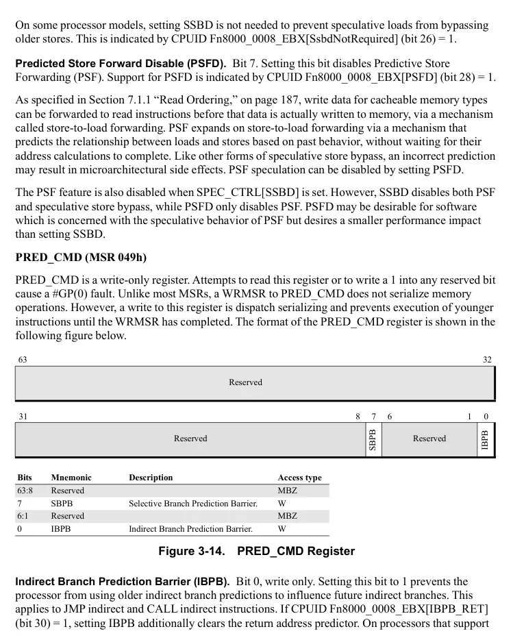

</details>


<!-- PDF source page: 132 | printed page: 70 -->

IBPB branch type clearing, indicated by CPUID Fn8000_0021_EAX[IBPB_BRTYPE] (bit 28) = 1, setting IBPB also clears all branch type predictions from the branch predictor. IBPB is intended to be used by software when switching between contexts that do not trust each other. Examples of such contexts include switching from one user context to another, or from one guest to another. CPUID Fn8000_0008_EBX[IBPB] (bit 12) = 1 indicates support for IBPB.

**Selective Branch Prediction Barrier (SBPB).** Bit 7, write only. Setting this bit to 1 prevents the processor from using older indirect branch predictions to influence future indirect branches. This applies to JMP indirect and CALL indirect instructions. If CPUID Fn8000_0008_EBX[IBPB_RET] (bit 30) = 1, setting SBPB additionally clears the return address predictor. Setting SBPB is not guaranteed to clear older branch type predictions from the CPU branch predictor. If PRED_CMD MSR is written with both IBPB and SBPB bits set to 1, the processor performs an IBPB operation. Support for SBPB is indicated by CPUID Fn8000_0021_EAX[SBPB] (bit 27) = 1.

**Return Address Predictor**

If IBRS-style indirect branch speculation limits for RET instructions are required and the processor does not support Enhanced Return Address Prediction Security (ERAPS), software should clear return address predictor by executing 32 CALL instructions with a non-zero displacement. If SMEP is enabled, the kernel and user virtual address spaces do not overlap, and at least one unmapped 4K page is separating them, there is no need to clear return address predictor.

The ERAPS feature eliminates the need to execute CALL instructions to clear the return address predictor in most cases. On processors that support ERAPS, return addresses from CALL instructions executed in host mode are not used in guest mode, and vice versa. Additionally, the return address predictor is cleared in all cases when the TLB is implicitly invalidated (see Section 5.5.3 “TLB Management,” on page 159) and in the following cases:

- MOV CR3 instruction
- INVPCID other than single address invalidation (operation type 0)

ERAPS support is indicated by CPUID Fn8000_0021_EAX[ERAPS] (bit 24) = 1. ERAPS virtualization behavior is described in Section 15.37.2 “ERAPS Virtualization,” on page 624.

**Additional CPUID Information**

The following CPUID functions provide more information on the speculation control features to aid system software in optimizing processor performance:

- CPUID Function 8000_0008_EBX[16] (IBRS always on). When set, indicates that it is recommended that IBRS is only set once during boot and not changed. If IBRS is set on a processor supporting IBRS always on mode, indirect branches executed in a less privileged prediction mode will not influence branch predictions for indirect branches in a more privileged prediction mode. This eliminates the need for WRMSR instructions to manage speculation effects at elevated-privilege entry and exit points.


<!-- PDF source page: 133 | printed page: 71 -->

- CPUID Function 8000_0008_EBX[17] (STIBP always on). When set, indicates that it is recommended that STIBP is only set once during boot and not changed. This eliminates the need for a WRMSR instruction at the necessary transition points.
- CPUID Function 8000_0008_EBX[18] (IBRS preferred). When set, indicates that it is recommended to use the IBRS feature instead of other software mitigations such as retpoline. This allows software to remove the software mitigation and utilize the more performant IBRS mechanism.

<a id="3-2-10-hardware-configuration-register-hwcr"></a>

### 3.2.10 Hardware Configuration Register (HWCR)

The HWCR register contains control bits that affect the functionality of other features. Some HWCR bits are implementation specific, and are described in the BIOS and Kernel Developer’s Guide (BKDG) or Processor Programming Reference Manual applicable to your product. Implementation specific HWCR bits are not listed below.

**SmmLock.** Bit 0. Enables SMM code lock. When set to 1, SMM code in the ASeg and TSeg memory ranges, and the SMM registers, become read-only and SMI interrupts are not intercepted in SVM. See Section 15.32 “SMM-Lock,” on page 587 for information on using this feature.

**CpbDis.** Bit 25. Core performance boost disable. When set to 1, core performance boost is disabled. See Section 17.2 “Core Performance Boost,” on page 666 for further details on this feature.

**IRPerfEn.** Bit 30. Setting this bit to 1 enables the instructions retired counter. See Section 13.2.1 “Performance Counter MSRs,” on page 411 for information on using this feature.

**SmmPgCfgLock.** Bit 33. Setting this bit to 1 locks the paging configuration while in SMM. See Section 10.3.9 “SMM Page Configuration Lock,” on page 339 for information on using this feature.

**CpuidUserDis.** Bit 35. Setting this bit to 1 causes #GP(0) when the CPUID instruction is executed by non-privileged software (CPL is &gt; 0) outside SMM. Support for the CPUID User Disable feature is indicated by CPUID Fn80000021_EAX[CpuidUserDis]=1.

<a id="3-3-processor-feature-identification"></a>

## 3.3 Processor Feature Identification

The CPUID instruction provides information about the processor implementation and its capabilities. Software operating at any privilege level can execute the CPUID instruction to collect this information. Software can utilize this information to optimize performance.

The CPUID instruction supports multiple functions, each providing specific information about the processor implementation, including the vendor, model number, revision (stepping), features, cache organization, and name. The multifunction approach allows the CPUID instruction to return a detailed picture of the processor implementation and its capabilities—more detailed information than could be returned by a single function. This flexibility also allows for the addition of new CPUID functions in future processor generations.


<!-- PDF source page: 134 | printed page: 72 -->

The desired function number is loaded into the EAX register before executing the CPUID instruction. CPUID functions are divided into two types:

- *Standard functions* return information about features common to all x86 implementations, including the earliest features offered in the x86 architecture, as well as information about the presence of features such as support for the AVX and FMA instruction subsets. Standard function numbers are in the range 0000_0000h–0000_FFFFh.
- *Extended functions* return information about AMD-specific features such as long mode and the presence of features such as support for the FMA4 and XOP instruction subsets. Extended function numbers are in the range 8000_0000h–8000_FFFFh.

Feature information is returned in the EAX, EBX, ECX, and EDX registers. Some functions accept a second input parameter passed to the instruction in the ECX register.

In this and the other three volumes of this *Programmer’s Manual*, the notation *CPUID FnXXXX_XXXX_RRR[FieldName]_*x*YY* is used to represent the input parameters and return value that corresponds to a particular processor capability or feature.

In this notation, *XXXX_XXXX* represents the 32-bit value to be placed in the EAX register prior to executing the CPUID instruction. This value is the function number. *RRR* is either EAX, EBX, ECX, or EDX and represents the register to be examined after the execution of the instruction. If the contents of the entire 32-bit register provides the capability information, the notation *[FieldName]* is omitted, otherwise this provides the name of the field within the return value that represents the capability or feature.

When the field is a single bit, this is called a feature flag. Normally, if a feature flag bit is set, the corresponding processor feature is supported and if it is cleared, the feature is not supported. The optional input parameter passed to the CPUID instruction in the ECX register is represented by the notation *_*x*YY* appended after the return value notation. If a CPUID function does not accept this optional input parameter, this notation is omitted.

For more specific information on the CPUID instruction, see the instruction reference page in Volume 3. For a description of all feature flags related to instruction subset support, see Volume 3, Appendix D, “Instruction Subsets and CPUID Feature Flags.” For a comprehensive list of all processor capabilities and feature flags, see Volume 3, Appendix E, “Obtaining Processor Information Via the CPUID Instruction.”
