<!-- PDF source page: 135 | printed page: 73 -->

<a id="4-segmented-virtual-memory"></a>

# 4 Segmented Virtual Memory

The legacy x86 architecture supports a segment-translation mechanism that allows system software to relocate and isolate instructions and data anywhere in the virtual-memory space. A segment is a contiguous block of memory within the linear address space. The size and location of a segment within the linear address space is arbitrary. Instructions and data can be assigned to one or more memory segments, each with its own protection characteristics. The processor hardware enforces the rules dictating whether one segment can access another segment.

The segmentation mechanism provides ten segment registers, each of which defines a single segment. Six of these registers (CS, DS, ES, FS, GS, and SS) define user segments. User segments hold software, data, and the stack and can be used by both application software and system software. The remaining four segment registers (GDT, LDT, IDT, and TR) define system segments. System segments contain data structures initialized and used only by system software. Segment registers contain a *base address* pointing to the starting location of a segment, a *limit* defining the segment size, and *attributes* defining the segment-protection characteristics.

Although segmentation provides a great deal of flexibility in relocating and protecting software and data, it is often more efficient to handle memory isolation and relocation with a combination of software and hardware paging support. For this reason, most modern system software bypasses the segmentation features. However, segmentation cannot be completely disabled, and an understanding of the segmentation mechanism is important to implementing long-mode system software.

In long mode, the effects of segmentation depend on whether the processor is running in compatibility mode or 64-bit mode:

- In compatibility mode, segmentation functions just as it does in legacy mode, using legacy 16-bit or 32-bit protected mode semantics.
- 64-bit mode, segmentation is disabled, creating a flat 64-bit virtual-address space. As will be seen, certain functions of some segment registers, particularly the system-segment registers, continue to be used in 64-bit mode.

<a id="4-1-real-mode-segmentation"></a>

## 4.1 Real Mode Segmentation

After reset or power-up, the processor always initially enters real mode. Protected modes are entered from real mode.

As noted in “Real Addressing” on page 10, real mode (real-address mode), provides a physical-memory space of 1 Mbyte. In this mode, a 20-bit physical address is determined by shifting a 16-bit segment selector to the left four bits and adding the 16-bit effective address.

Each 64K segment (CS, DS, ES, FS, GS, SS) is aligned on 16-byte boundaries. The *segment base* is the lowest address in a given segment, and is equal to the segment selector * 16. The POP and MOV instructions can be used to load a (possibly) new segment selector into one of the segment registers.


<!-- PDF source page: 136 | printed page: 74 -->

When this occurs, the selector is updated and the segment base is set to selector * 16. The segment limit and segment attributes are unchanged, but are normally 64K (the maximum allowable limit) and read/write data, respectively.

On FAR transfers, CS (code segment) selector is updated to the new value, and the CS segment base is set to selector * 16. The CS segment limit and attributes are unchanged, but are usually 64K and read/write, respectively.

If the interrupt descriptor table (IDT) is used to find the real mode IDT see “Real-Mode Interrupt Control Transfers” on page 268.

The GDT, LDT, and TSS (see below) are not used in real mode.

<a id="4-2-virtual-8086-mode-segmentation"></a>

## 4.2 Virtual-8086 Mode Segmentation

Virtual-8086 mode supports 16-bit real mode programs running under protected mode (see below). It uses a simple form of memory segmentation, optional paging, and limited protection checking. Programs running in virtual-8086 mode can access up to 1MB of memory space.

As with real mode segmentation, each 64K segment (CS, DS, ES, FS, GS, SS) is aligned on 16-byte boundaries. The *segment base* is the lowest address in a given segment, and is equal to the segment selector * 16. The POP and MOV instructions work exactly as in real mode and can be used to load a (possibly) new segment selector into one of the segment registers. When this occurs, the selector is updated and the segment base is set to selector * 16. The segment limit and segment attributes are unchanged, but are normally 64K (the maximum allowable limit) and read/write data, respectively.

FAR transfers, with the exception of interrupts and exceptions, operate as in real mode. On FAR transfers, the CS (code segment) selector is updated to the new value, and the CS segment base is set to selector * 16. The CS segment limit and attributes are unchanged, but are usually 64K and read/write, respectively. Interrupts and exceptions switch the processor to protected mode. (See Chapter 8, “Exceptions and Interrupts” for more information.)

<a id="4-3-protected-mode-segmented-memory-models"></a>

## 4.3 Protected Mode Segmented-Memory Models

System software can use the segmentation mechanism to support one of two basic segmented-memory models: a flat-memory model or a multi-segmented model. These segmentation models are supported in legacy mode and in compatibility mode. Each type of model is described in the following sections.

<a id="4-3-1-multi-segmented-model"></a>

### 4.3.1 Multi-Segmented Model

In the multi-segmented memory model, each segment register can reference a unique base address with a unique segment size. Segments can be as small as a single byte or as large as 4 Gbytes. When page translation is used, multiple segments can be mapped to a single page and multiple pages can be mapped to a single segment. Figure 1-1 on page 6 shows an example of the multi-segmented model.


<!-- PDF source page: 137 | printed page: 75 -->

The multi-segmented memory model provides the greatest level of flexibility for system software using the segmentation mechanism.

Compatibility mode allows the multi-segmented model to be used in support of legacy software. However, in compatibility mode, the multi-segmented memory model is restricted to the first 4 Gbytes of virtual-memory space. Access to virtual memory above 4 Gbytes requires the use of 64-bit mode, which does not support segmentation.

<a id="4-3-2-flat-memory-model"></a>

### 4.3.2 Flat-Memory Model

The flat-memory model is the simplest form of segmentation to implement. Although segmentation cannot be disabled, the flat-memory model allows system software to bypass most of the segmentation mechanism. In the flat-memory model, all segment-base addresses have a value of 0 and the segment limits are fixed at 4 Gbytes. Clearing the segment-base value to 0 effectively disables segment translation, resulting in a single segment spanning the entire virtual-address space. All segment descriptors reference this single, flat segment. Figure 1-2 on page 7 shows an example of the flat-memory model.

<a id="4-3-3-segmentation-in-64-bit-mode"></a>

### 4.3.3 Segmentation in 64-Bit Mode

In 64-bit mode, segmentation is disabled. The segment-base value is ignored and treated as 0 by the segmentation hardware. Likewise, segment limits and most attributes are ignored. There are a few exceptions. The CS-segment DPL, D, and L attributes are used (respectively) to establish the privilege level for a program, the default operand size, and whether the program is running in 64-bit mode or compatibility mode. The FS and GS segments can be used as additional base registers in address calculations, and those segments can have non-zero base-address values. This facilitates addressing thread-local data and certain system-software data structures. See “FS and GS Registers in 64-Bit Mode” on page 80 for details about the FS and GS segments in 64-bit mode. The system-segment registers are always used in 64-bit mode.

<a id="4-4-segmentation-data-structures-and-registers"></a>

## 4.4 Segmentation Data Structures and Registers

Figure 4-1 on page 76 shows the following data structures used by the segmentation mechanism:

- *Segment Descriptors*—As the name implies, a segment descriptor *describes* a segment, including its location in virtual-address space, its size, protection characteristics, and other attributes.
- *Descriptor Tables*—Segment descriptors are stored in memory in one of three tables. The global-descriptor table (GDT) holds segment descriptors that can be shared among all tasks. Multiple local-descriptor tables (LDT) can be defined to hold descriptors that are used by specific tasks and are not shared globally. The interrupt-descriptor table (IDT) holds gate descriptors that are used to access the segments where interrupt handlers are located.
- *Task-State Segment*—A task-state segment (TSS) is a special type of system segment that contains task-state information and data structures for each task. For example, a TSS holds a copy of the GPRs and EFLAGS register when a task is suspended. A TSS also holds the pointers to privileged-


<!-- PDF source page: 138 | printed page: 76 -->

software stacks. The TSS and task-switch mechanism are described in Chapter 12, “Task Management.” **•* Segment Selectors*—Descriptors are selected for use from the descriptor tables using a segment selector. A segment selector contains an index into either the GDT or LDT. The IDT is indexed using an interrupt vector, as described in “Legacy Protected-Mode Interrupt Control Transfers” on page 270, and in “Long-Mode Interrupt Control Transfers” on page 281.

**Figure 4-1. Segmentation Data Structures**

<details>
<summary>Extracted figure labels</summary>

```text
Global-Descriptor Table (GDT)
Descriptor
. . .
Segment Descriptors
Descriptor
Code
Segment Selectors
Local-Descriptor Table (LDT)
Stack
Selector 1
Descriptor
Data
Selector 2
Descriptor
. . .
Gate
. . .
Descriptor
Task-State Segment
Selector n
Interrupt-Descriptor Table (IDT)
Local-Descriptor Table
Gate Descriptor
. . .
Gate Descriptor
513-263.eps
```

</details>

Figure 4-2 on page 77 shows the registers used by the segmentation mechanism. The registers have the following relationship to the data structures:

- *Segment Registers*—The six segment registers (CS, DS, ES, FS, GS, and SS) are used to point to the user segments. A segment selector selects a descriptor when it is loaded into one of the segment registers. This causes the processor to automatically load the selected descriptor into a software-invisible portion of the segment register.
- *Descriptor-Table Registers*—The three descriptor-table registers (GDTR, LDTR, and IDTR) are used to point to the system segments. The descriptor-table registers identify the virtual-memory location and size of the descriptor tables.
- *Task Register (TR)*—Describes the location and limit of the current task state segment (TSS).

<details>
<summary>Rendered source page 138 (figures/tables)</summary>

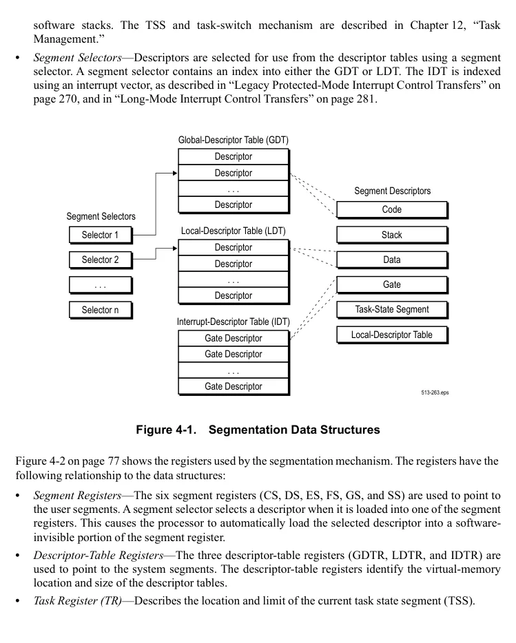

</details>


<!-- PDF source page: 139 | printed page: 77 -->

**Figure 4-2. Segment and Descriptor-Table Registers**

<details>
<summary>Extracted figure labels</summary>

```text
Code Segment Register
Global-Descriptor-Table Register
CS
GDTR
Data Segment Registers
Interrupt-Descriptor-Table Register
DS
IDTR
ES
Local-Descriptor-Table Register
FS
LDTR
GS
Task Register
Stack Segment Register
TR
SS
513-264.eps
```

</details>

A fourth system-segment register, the TR, points to the TSS. The data structures and registers associated with task-state segments are described in “Task-Management Resources” on page 367.

<a id="4-5-segment-selectors-and-registers"></a>

## 4.5 Segment Selectors and Registers

<a id="4-5-1-segment-selectors"></a>

### 4.5.1 Segment Selectors

Segment selectors are pointers to specific entries in the global and local descriptor tables. Figure 4-3 shows the segment selector format.

**Figure 4-3. Segment Selector**

<details>
<summary>Extracted figure labels</summary>

```text
15
3
2
1
0
SI
TI
RPL
Bits
Mnemonic
Description
15:3
SI
Selector Index
2
TI
Table Indicator
1:0
RPL
Requestor Privilege Level
```

</details>

<details>
<summary>Rendered source page 139 (figures/tables)</summary>

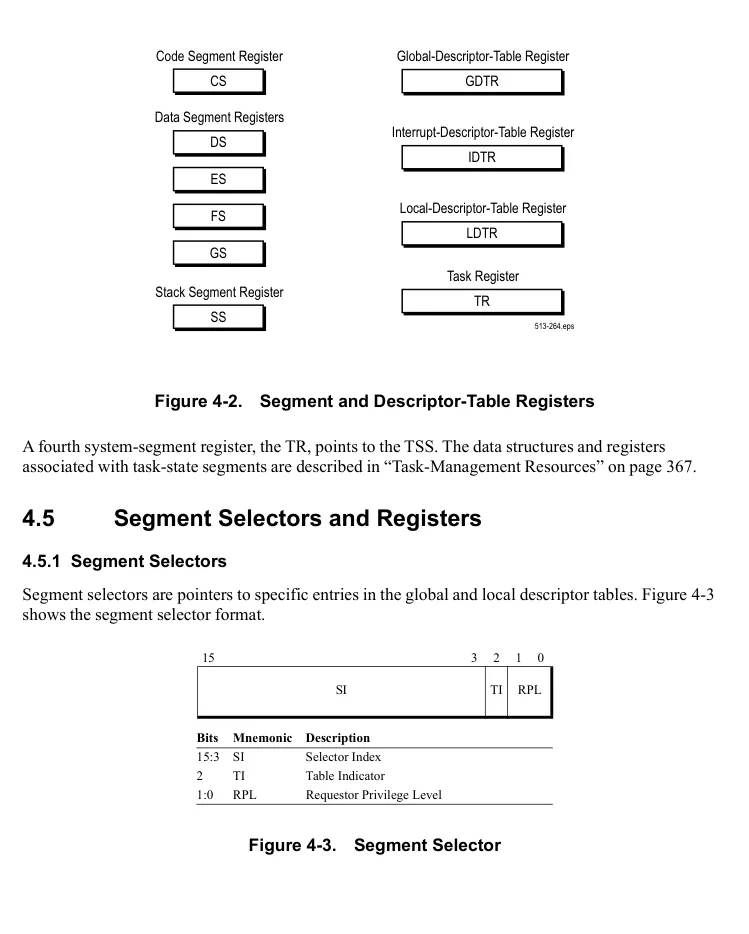

</details>


<!-- PDF source page: 140 | printed page: 78 -->

The selector format consists of the following fields:

**Selector Index Field.** Bits 15:3. The selector-index field specifies an entry in the descriptor table. Descriptor-table entries are eight bytes long, so the selector index is scaled by 8 to form a byte offset into the descriptor table. The offset is then added to either the global or local descriptor-table base address (as indicated by the table-index bit) to form the descriptor-entry address in virtual-address space.

Some descriptor entries in long mode are 16 bytes long rather than 8 bytes (see “Legacy Segment Descriptors” on page 88 for more information on long-mode descriptor-table entries). These expanded descriptors consume two entries in the descriptor table. Long mode, however, continues to scale the selector index by eight to form the descriptor-table offset. It is the responsibility of system software to assign selectors such that they correctly point to the start of an expanded entry.

**Table Indicator (TI) Bit.** Bit 2. The TI bit indicates which table holds the descriptor referenced by the selector index. When TI=0 the GDT is used and when TI=1 the LDT is used. The descriptor-table base address is read from the appropriate descriptor-table register and added to the scaled selector index as described above.

**Requestor Privilege-Level (RPL) Field.** Bits 1:0. The RPL represents the privilege level (CPL) the processor is operating under at the time the selector is created.

RPL is used in segment privilege-checks to prevent software running at lesser privilege levels from accessing privileged data. See “Data-Access Privilege Checks” on page 106 and “Control-Transfer Privilege Checks” on page 109 for more information on segment privilege-checks.

**Null Selector.** Null selectors have a selector index of 0 and TI=0, corresponding to the first entry in the GDT. However, null selectors do not reference the first GDT entry but are instead used to invalidate unused segment registers. A general-protection exception (#GP) occurs if a reference is made to use a segment register containing a null selector in non-64-bit mode. By initializing unused segment registers with null selectors software can trap references to unused segments.

Null selectors can only be loaded into the DS, ES, FS and GS data-segment registers, and into the LDTR descriptor-table register. A #GP occurs if software attempts to load the CS register with a null selector or if software attempts to load the SS register with a null selector in non 64-bit mode or at CPL 3.

If CPUID Fn8000_0021_EAX[NullSelectorClearsBase] (bit 6) = 1, loading a segment register with a null selector clears the base address and limit of the segment register in all cases except a load of DS, ES, FS, or GS by an IRET, IRETD, IRETQ, or RETF instruction that changes the current privilege level, in which case these fields are left untouched. If CPUID Fn8000_0021_EAX[NullSelectorClearsBase] (bit 6) = 0, loading a segment register with a null selector makes the base address and limit of the segment register undefined. Because references to segment registers containing a null selector cause a #GP exception, the segment base and limit values have no effect. However, OS management of segment state may be simplified for processors supporting this clearing functionality.


<!-- PDF source page: 141 | printed page: 79 -->

<a id="4-5-2-segment-registers"></a>

### 4.5.2 Segment Registers

Six 16-bit segment registers are provided for referencing up to six segments at one time. All software tasks require segment selectors to be loaded in the CS and SS registers. Use of the DS, ES, FS, and GS segments is optional, but nearly all software accesses data and therefore requires a selector in the DS register. Table 4-1 on page 79 lists the supported segment registers and their functions.

**Table 4-1. Segment Registers**

| Segment<br>Registe | Encoding | Segment Register Function |
| --- | --- | --- |
| ES | /0 | References optional data-segment descriptor entry |
| CS | /1 | References code-segment descriptor entry |
| SS | /2 | References stack segment descriptor entry |
| DS | /3 | References default data-segment descriptor entry |
| FS | /4 | References optional data-segment descriptor entry |
| GS | /5 | References optional data-segment descriptor entry |

The processor maintains a *hidden portion* of the segment register in addition to the selector value loaded by software. This hidden portion contains the values found in the descriptor-table entry referenced by the segment selector. The processor loads the descriptor-table entry into the hidden portion when the segment register is loaded. By keeping the corresponding descriptor-table entry in hardware, performance is optimized for the majority of memory references.

Figure 4-4 shows the format of the visible and hidden portions of the segment register. Except for the FS and GS segment base, software cannot directly read or write the hidden portion (shown as gray-shaded boxes in Figure 4-4).

**Figure 4-4. Segment-Register Format**

<details>
<summary>Extracted figure labels</summary>

```text
Selector
Segment Attributes
32-Bit Segment Limit
32-Bit Segment Base Address
Hidden From Software
513-221.eps
```

</details>

**CS Register.** The CS register contains the segment selector referencing the current code-segment descriptor entry. All instruction fetches reference the CS descriptor. When a new selector is loaded into the CS register, the current-privilege level (CPL) of the processor is set to that of the CS-segment descriptor-privilege level (DPL).

<details>
<summary>Rendered source page 141 (figures/tables)</summary>

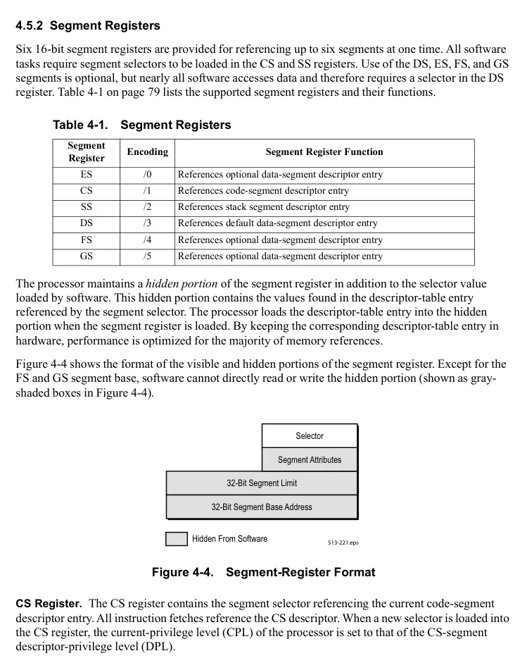

</details>


<!-- PDF source page: 142 | printed page: 80 -->

**Data-Segment Registers.** The DS register contains the segment selector referencing the default data-segment descriptor entry. The SS register contains the stack-segment selector. The ES, FS, and GS registers are optionally loaded with segment selectors referencing other data segments. Data accesses default to referencing the DS descriptor except in the following two cases:

- The ES descriptor is referenced for string-instruction destinations.
- The SS descriptor is referenced for stack operations.

<a id="4-5-3-segment-registers-in-64-bit-mode"></a>

### 4.5.3 Segment Registers in 64-Bit Mode

**CS Register in 64-Bit Mode.** In 64-bit mode, most of the hidden portion of the CS register is ignored. Only the L (long), D (default operation size), and DPL (descriptor privilege-level) attributes are recognized by 64-bit mode. Address calculations assume a CS.base value of 0. CS references do not check the CS.limit value, but instead check that the effective address is in canonical form.

**DS, ES, and SS Registers in 64-Bit Mode.** In 64-bit mode, the contents of the ES, DS, and SS segment registers are ignored. All fields (base, limit, and attribute) in the hidden portion of the segment registers are ignored.

Address calculations in 64-bit mode that reference the ES, DS, or SS segments are treated as if the segment base is 0. Instead of performing limit checks, the processor checks that all virtual-address references are in canonical form.

Neither enabling and activating long mode nor switching between 64-bit and compatibility modes changes the contents of the visible or hidden portions of the segment registers. These registers remain unchanged during 64-bit mode execution unless explicit segment loads are performed.

**FS and GS Registers in 64-Bit Mode.** Unlike the CS, DS, ES, and SS segments, the FS and GS segment overrides can be used in 64-bit mode. When FS and GS segment overrides are used in 64-bit mode, their respective base addresses are used in the effective-address (EA) calculation. The complete EA calculation then becomes (FS or GS).base  base  (scale  index)  displacement. The FS.base and GS.base values are also expanded to the full 64-bit virtual-address size, as shown in Figure 4-5. Any overflow in the 64-bit linear address calculation is ignored and the resulting address instead wraps around to the other end of the address space.


<!-- PDF source page: 143 | printed page: 81 -->

**Figure 4-5. FS and GS Segment-Register Format—64-Bit Mode**

<details>
<summary>Extracted figure labels</summary>

```text
Selector
Segment Attributes
32-Bit Segment Limit
64-Bit Segment Base Address
Hidden from Software and Unused in 64-bit Mode
513-267.eps
```

</details>

In 64-bit mode, FS-segment and GS-segment overrides are not checked for limit or attributes. Instead, the processor checks that all virtual-address references are in canonical form.

Segment register-load instructions (MOV to Sreg and POP Sreg) load only a 32-bit base-address value into the hidden portion of the FS and GS segment registers. The base-address bits above the low 32 bits are cleared to 0 as a result of a segment-register load. When a null selector is loaded into FS or GS, the contents of the corresponding hidden descriptor register are not altered.

There are two methods to update the contents of the FS.base and GS.base hidden descriptor fields. The first is available exclusively to privileged software (CPL = 0). The FS.base and GS.base hidden descriptor-register fields are mapped to MSRs. Privileged software can load a 64-bit base address in canonical form into FS.base or GS.base using a single WRMSR instruction. The FS.base MSR address is C000_0100h while the GS.base MSR address is C000_0101h.

The second method of updating the FS and GS base fields is available to software running at any privilege level (when supported by the implementation and enabled by setting CR4[FSGSBASE]). The WRFSBASE and WRGSBASE instructions copy the contents of a GPR to the FS.base and GS.base fields respectively. When the operand size is 32 bits, the upper doubleword of the base is cleared. WRFSBASE and WRGSBASE are only supported in 64-bit mode.

The addresses written into the expanded FS.base and GS.base registers must be in canonical form. Any instruction that attempts to write a non-canonical address to these registers causes a general-protection exception (#GP) to occur.

When in compatibility mode, the FS and GS overrides operate as defined by the legacy x86 architecture regardless of the value loaded into the high 32 bits of the hidden descriptor-register base-address field. Compatibility mode ignores the high 32 bits when calculating an effective address.

<details>
<summary>Rendered source page 143 (figures/tables)</summary>

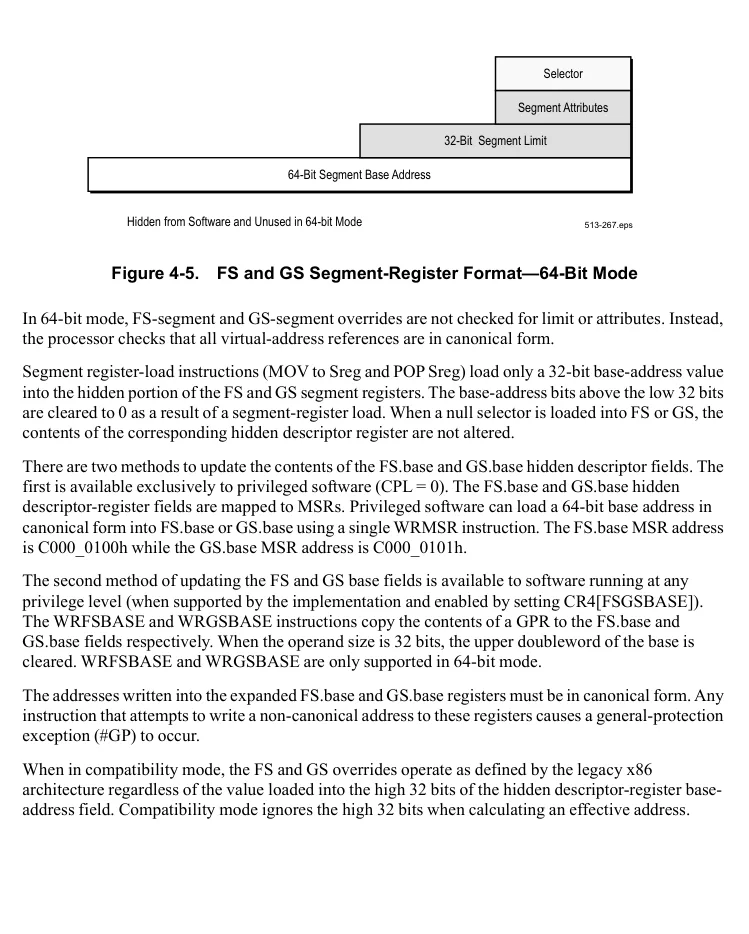

</details>


<!-- PDF source page: 144 | printed page: 82 -->

<a id="4-6-descriptor-tables"></a>

## 4.6 Descriptor Tables

Descriptor tables are used by the segmentation mechanism when protected mode is enabled (CR0.PE=1). These tables hold descriptor entries that describe the location, size, and privilege attributes of a segment. All memory references in protected mode access a descriptor-table entry.

As previously mentioned, there are three types of descriptor tables supported by the x86 segmentation mechanism:

- Global descriptor table (GDT)
- Local descriptor table (LDT)
- Interrupt descriptor table (IDT)

Software establishes the location of a descriptor table in memory by initializing its corresponding descriptor-table register. The descriptor-table registers and the descriptor tables are described in the following sections.

<a id="4-6-1-global-descriptor-table"></a>

### 4.6.1 Global Descriptor Table

Protected-mode system software must create a global descriptor table (GDT). The GDT contains code-segment and data-segment descriptor entries (user segments) for segments that can be shared by all tasks. In addition to the user segments, the GDT can also hold gate descriptors and other system-segment descriptors. System software can store the GDT anywhere in memory and should protect the segment containing the GDT from non-privileged software.

Segment selectors point to the GDT when the table-index (TI) bit in the selector is cleared to 0. The selector index portion of the segment selector references a specific entry in the GDT. Figure 4-6 on page 83 shows how the segment selector indexes into the GDT. One special form of a segment selector is the *null selector*. A null selector points to the first entry in the GDT (the selector index is 0 and TI=0). However, null selectors do not reference memory, so the first GDT entry cannot be used to describe a segment (see “Null Selector” on page 78 for information on using the null selector). The first usable GDT entry is referenced with a selector index of 1.


<!-- PDF source page: 145 | printed page: 83 -->

**Figure 4-6. Global and Local Descriptor-Table Access**

<details>
<summary>Extracted figure labels</summary>

```text
Selector IndexTI
Segment Selector
Global (TI=0)
Local (TI=1)
Descriptor Table
+
Selector Index 000
+
Unused in GDT
Descriptor Table Base Address
Descriptor Table Limit
Global or Local Descriptor-Table Register
513-209.eps
```

</details>

<a id="4-6-2-global-descriptor-table-register"></a>

### 4.6.2 Global Descriptor-Table Register

The global descriptor-table register (GDTR) points to the location of the GDT in memory and defines its size. This register is loaded from memory using the LGDT instruction (see “LGDT and LIDT Instructions” on page 179). Figure 4-7 shows the format of the GDTR in legacy mode and compatibility mode.

**Figure 4-7. GDTR and IDTR Format—Legacy Modes**

<details>
<summary>Extracted figure labels</summary>

```text
16-Bit Descriptor-Table Limit
32-Bit Descriptor-Table Base Address
513-220.eps
```

</details>

Figure 4-8 on page 84 shows the format of the GDTR in 64-bit mode.

<details>
<summary>Rendered source page 145 (figures/tables)</summary>

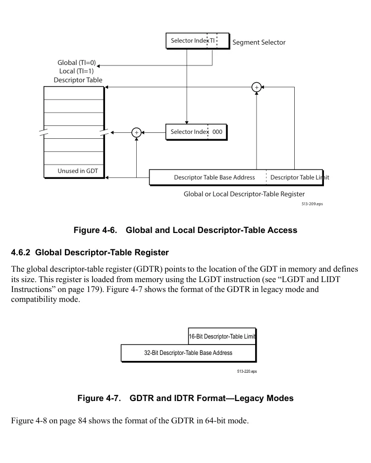

</details>


<!-- PDF source page: 146 | printed page: 84 -->

**Figure 4-8. GDTR and IDTR Format—Long Mode**

<details>
<summary>Extracted figure labels</summary>

```text
16-Bit Descriptor-Table Limit
64-Bit Descriptor-Table Base Address
513-266.eps
```

</details>

The GDTR contains two fields:

**Limit.** 2 bytes. These bits define the 16-bit limit, or size, of the GDT in bytes. The limit value is added to the base address to yield the ending byte address of the GDT. A general-protection exception (#GP) occurs if software attempts to access a descriptor beyond the GDT limit.

The offsets into the descriptor tables are not extended by the AMD64 architecture in support of long mode. Therefore, the GDTR and IDTR limit-field sizes are unchanged from the legacy sizes. The processor does check the limits in long mode during GDT and IDT accesses.

**Base Address.** 8 bytes. The base-address field holds the starting byte address of the GDT in virtual-memory space. The GDT can be located at any byte address in virtual memory, but system software should align the GDT on a quadword boundary to avoid the potential performance penalties associated with accessing unaligned data.

The AMD64 architecture increases the base-address field of the GDTR to 64 bits so that system software running in long mode can locate the GDT anywhere in the 64-bit virtual-address space. The processor ignores the high-order 4 bytes of base address when running in legacy mode.

<a id="4-6-3-local-descriptor-table"></a>

### 4.6.3 Local Descriptor Table

Protected-mode system software can optionally create a local descriptor table (LDT) to hold segment descriptors belonging to a single task or even multiple tasks. The LDT typically contains code-segment and data-segment descriptors as well as gate descriptors referenced by the specified task. Like the GDT, system software can store the LDT anywhere in memory and should protect the segment containing the LDT from non-privileged software.

Segment selectors point to the LDT when the table-index bit (TI) in the selector is set to 1. The selector index portion of the segment selector references a specific entry in the LDT (see Figure 4-6 on page 83). Unlike the GDT, however, a selector index of 0 references the first entry in the LDT (when TI=1, the selector is not a null selector).

LDTs are described by system-segment descriptor entries located in the GDT, and a GDT can contain multiple LDT descriptors. The LDT system-segment descriptor defines the location, size, and privilege rights for the LDT. Figure 4-9 on page 85 shows the relationship between the LDT and GDT data structures.

<details>
<summary>Rendered source page 146 (figures/tables)</summary>

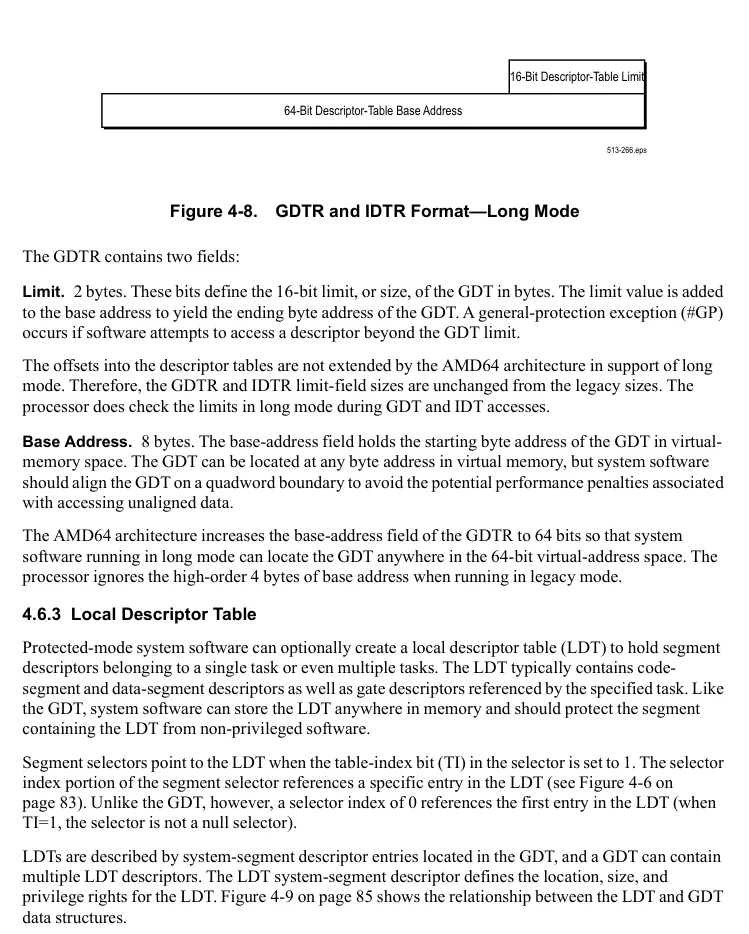

</details>


<!-- PDF source page: 147 | printed page: 85 -->

Loading a null selector into the LDTR is useful if software does not use an LDT. This causes a #GP if an erroneous reference is made to the LDT.

**Figure 4-9. Relationship between the LDT and GDT**

<details>
<summary>Extracted figure labels</summary>

```text
Global
Descriptor
Table
Local
Descriptor
Table
LDT Selector
LDT Attributes
GDT Limit
LDT Limit
GDT Base Address
LDT Base Address
Global Descriptor Table Register
Local Descriptor Table Register
513-208.eps
```

</details>

<a id="4-6-4-local-descriptor-table-register"></a>

### 4.6.4 Local Descriptor-Table Register

The local descriptor-table register (LDTR) points to the location of the LDT in memory, defines its size, and specifies its attributes. The LDTR has two portions. A *visible* portion holds the LDT selector, and a *hidden* portion holds the LDT descriptor. When the LDT selector is loaded into the LDTR, the processor automatically loads the LDT descriptor from the GDT into the hidden portion of the LDTR. The LDTR is loaded in one of two ways:

- Using the LLDT instruction (see “LLDT and LTR Instructions” on page 180).
- Performing a task switch (see “Switching Tasks” on page 380).

Figure 4-10 on page 86 shows the format of the LDTR in legacy mode.

<details>
<summary>Rendered source page 147 (figures/tables)</summary>

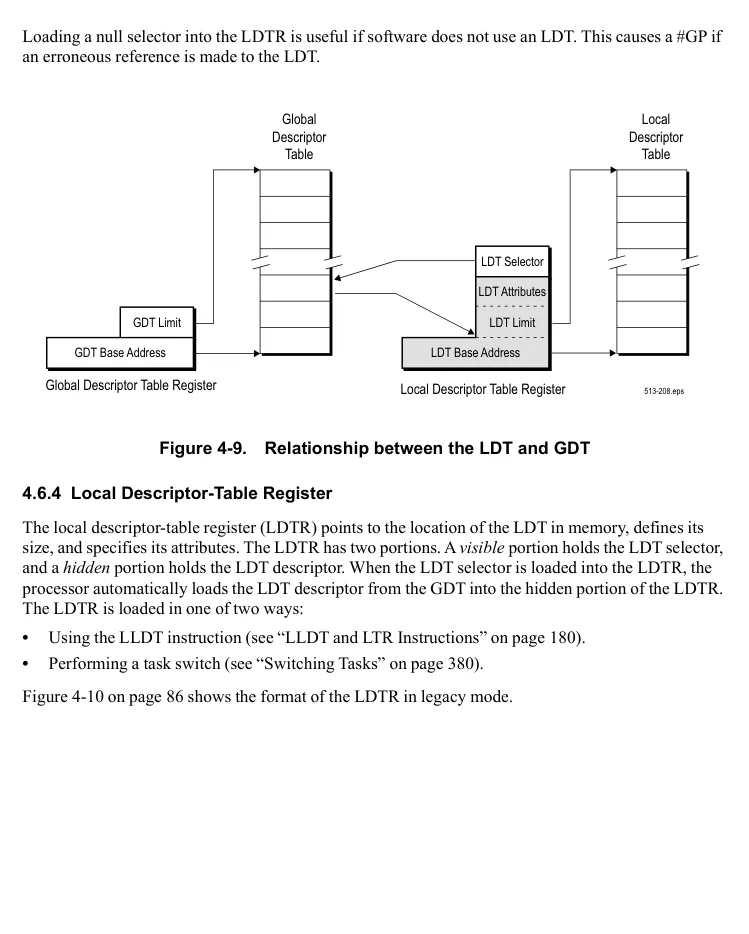

</details>


<!-- PDF source page: 148 | printed page: 86 -->

**Figure 4-10. LDTR Format—Legacy Mode**

<details>
<summary>Extracted figure labels</summary>

```text
Selector
Descriptor Attributes
32-Bit Descriptor-Table Limit
32-Bit Descriptor-Table Base Address
Hidden From Software
513-221.eps
```

</details>

Figure 4-11 shows the format of the LDTR in long mode (both compatibility mode and 64-bit mode).

**Figure 4-11. LDTR Format—Long Mode**

<details>
<summary>Extracted figure labels</summary>

```text
Selector
Descriptor Attributes
32-Bit Descriptor-Table Limit
64-Bit Descriptor-Table Base Address
Hidden From Software
513-267.eps
```

</details>

The LDTR contains four fields:

**LDT Selector.** 2 bytes. These bits are loaded explicitly from the TSS during a task switch, or by using the LLDT instruction. The LDT selector must point to an LDT system-segment descriptor entry in the GDT. If it does not, a general-protection exception (#GP) occurs.

The following three fields are loaded automatically from the LDT descriptor in the GDT as a result of loading the LDT selector. The register fields are shown as shaded boxes in Figure 4-10 and Figure 4-11.

**Base Address.** The base-address field holds the starting byte address of the LDT in virtual-memory space. Like the GDT, the LDT can be located anywhere in system memory, but software should align the LDT on a quadword boundary to avoid performance penalties associated with accessing unaligned data.

<details>
<summary>Rendered source page 148 (figures/tables)</summary>

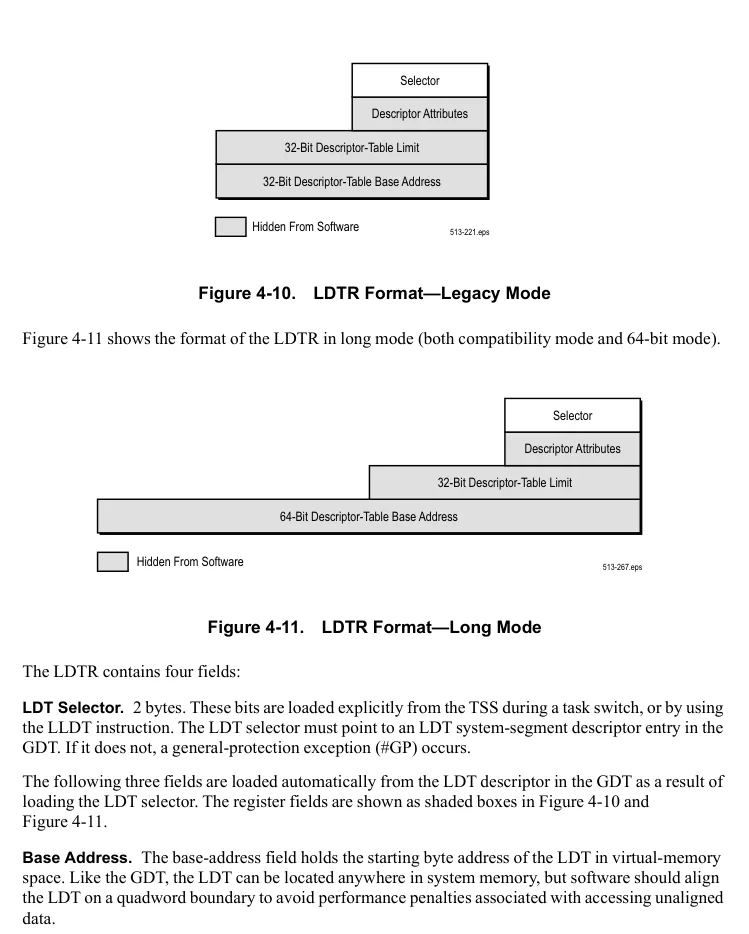

</details>


<!-- PDF source page: 149 | printed page: 87 -->

The AMD64 architecture expands the base-address field of the LDTR to 64 bits so that system software running in long mode can locate an LDT anywhere in the 64-bit virtual-address space. The processor ignores the high-order 32 base-address bits when running in legacy mode. Because the LDTR is loaded from the GDT, the system-segment descriptor format (LDTs are system segments) has been expanded by the AMD64 architecture in support of 64-bit mode. See “Long Mode Descriptor Summary” on page 103 for more information on this expanded format. The high-order base-address bits are only loaded from 64-bit mode using the LLDT instruction (see “LLDT and LTR Instructions” on page 180 for more information on this instruction).

**Limit.** This field defines the limit, or size, of the LDT in bytes. The LDT limit as stored in the LDTR is 32 bits. When the LDT limit is loaded from the GDT descriptor entry, the 20-bit limit field in the descriptor is expanded to 32 bits and scaled based on the value of the descriptor granularity (G) bit. For details on the limit biasing and granularity, see “Granularity (G) Bit” on page 90.

If an attempt is made to access a descriptor beyond the LDT limit, a general-protection exception (#GP) occurs.

The offsets into the descriptor tables are not extended by the AMD64 architecture in support of long mode. Therefore, the LDTR limit-field size is unchanged from the legacy size. The processor does check the LDT limit in long mode during LDT accesses.

**Attributes.** This field holds the descriptor attributes, such as privilege rights, segment presence and segment granularity.

<a id="4-6-5-interrupt-descriptor-table"></a>

### 4.6.5 Interrupt Descriptor Table

The final type of descriptor table is the interrupt descriptor table (IDT). Multiple IDTs can be maintained by system software. System software selects a specific IDT by loading the interrupt descriptor table register (IDTR) with a pointer to the IDT. As with the GDT and LDT, system software can store the IDT anywhere in memory and should protect the segment containing the IDT from non-privileged software.

The IDT can contain only the following types of gate descriptors:

- Interrupt gates
- Trap gates
- Task gates.

The use of gate descriptors by the interrupt mechanism is described in Chapter 8, “Exceptions and Interrupts.” A general-protection exception (#GP) occurs if the IDT descriptor referenced by an interrupt or exception is not one of the types listed above.

IDT entries are selected using the interrupt vector number rather than a selector value. The interrupt vector number is scaled by the interrupt-descriptor entry size to form an offset into the IDT. The interrupt-descriptor entry size depends on the processor operating mode as follows:

- In long mode, interrupt descriptor-table entries are 16 bytes.


<!-- PDF source page: 150 | printed page: 88 -->

- In legacy mode, interrupt descriptor-table entries are eight bytes.

Figure 4-12 shows how the interrupt vector number indexes the IDT.

**Figure 4-12. Indexing an IDT**

<details>
<summary>Extracted figure labels</summary>

```text
Interrupt
Descriptor Table
+
Interrupt Vector
+
*
Descriptor Entry
Size
IDT Base Address
IDT Limit
Interrupt Descriptor Table Register
513-207.eps
```

</details>

<a id="4-6-6-interrupt-descriptor-table-register"></a>

### 4.6.6 Interrupt Descriptor-Table Register

The interrupt descriptor-table register (IDTR) points to the IDT in memory and defines its size. This register is loaded from memory using the LIDT instruction (see “LGDT and LIDT Instructions” on page 179). The format of the IDTR is identical to that of the GDTR in all modes. Figure 4-7 on page 83 shows the format of the IDTR in legacy mode. Figure 4-8 on page 84 shows the format of the IDTR in long mode.

The offsets into the descriptor tables are not extended by the AMD64 architecture in support of long mode. Therefore, the IDTR limit-field size is unchanged from the legacy size. The processor does check the IDT limit in long mode during IDT accesses.

<a id="4-7-legacy-segment-descriptors"></a>

## 4.7 Legacy Segment Descriptors

<a id="4-7-1-descriptor-format"></a>

### 4.7.1 Descriptor Format

Segment descriptors define, protect, and isolate segments from each other. There are two basic types of descriptors, each of which are used to describe different segment (or gate) types:

- *User Segments*—These include code segments and data segments. Stack segments are a type of data segment.

<details>
<summary>Rendered source page 150 (figures/tables)</summary>

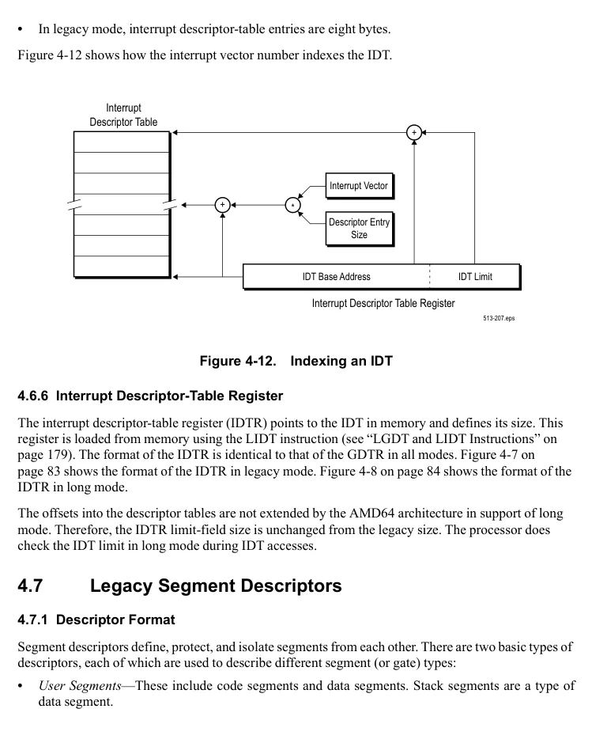

</details>


<!-- PDF source page: 151 | printed page: 89 -->

- *System Segments*—System segments consist of LDT segments and task-state segments (TSS). Gate descriptors are another type of system-segment descriptor. Rather than describing segments, gate descriptors point to program entry points.

Figure 4-13 shows the generic format for user-segment and system-segment descriptors. User and system segments are differentiated using the S bit. S=1 indicates a user segment, and S=0 indicates a system segment. Gray shading indicates the field or bit is reserved. The format for a gate descriptor differs from the generic segment descriptor, and is described separately in “Gate Descriptors” on page 95.

**Figure 4-13. Generic Segment Descriptor—Legacy Mode**

<details>
<summary>Extracted figure labels</summary>

```text
31
24 23 22 21 20 19
16 15 14 13 12 11
8
7
0
Segment Limit
[19:16]
AVL
DPL
Type
Base Address[23:16]
+4
Base Address[31:24]
D/B
G
P
S
Base Address[15:0]
Segment Limit[15:0]
+0
```

</details>

Figure 4-13 shows the fields in a generic, legacy-mode, 8-byte (two doubleword) segment descriptor. In this figure, the upper doubleword (located at byte offset +4) is shown on top and the lower doubleword (located at byte offset +0) is shown on the bottom. The fields are defined as follows:

**Segment Limit.** The 20-bit segment limit is formed by concatenating bits 19:16 of the upper doubleword with bits 15:0 of lower doubleword. The segment limit defines the segment size, in bytes. The granularity (G) bit controls how the segment-limit field is scaled (see “Granularity (G) Bit” on page 90). For data segments, the expand-down (E) bit determines whether the segment limit defines the lower or upper segment-boundary (see “Expand-Down (E) Bit” on page 93).

If software references a segment descriptor with an address beyond the segment limit, a general-protection exception (#GP) occurs. The #GP occurs if any part of the memory reference falls outside the segment limit. For example, a doubleword (4-byte) address reference causes a #GP if one or more bytes are located beyond the segment limit.

**Base Address.** The 32-bit base address is formed by concatenating bits 31:24 of the upper doubleword with bits 7:0 of the same doubleword and bits 15:0 of the lower doubleword. The segment-base address field locates the start of a segment in virtual-address space.

<details>
<summary>Rendered source page 151 (figures/tables)</summary>

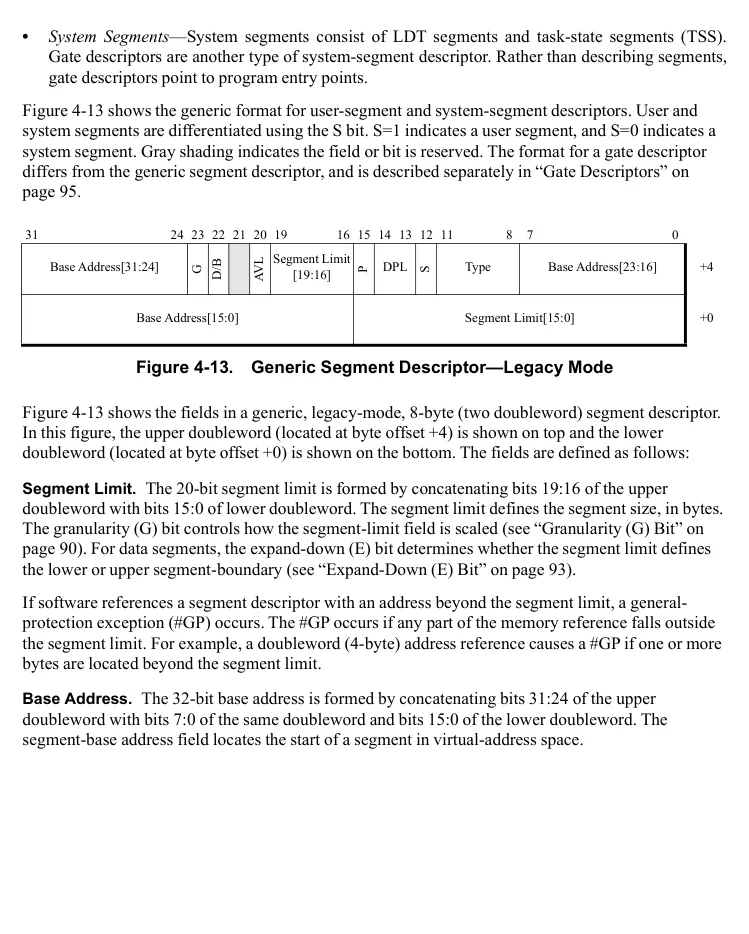

</details>


<!-- PDF source page: 152 | printed page: 90 -->

**S Bit and Type Field.** Bit 12 and bits 11:8 of the upper doubleword. The S and Type fields, together, specify the descriptor type and its access characteristics. Table 4-2 summarizes the descriptor types by S-field encoding and gives a cross reference to descriptions of the Type-field encodings.

**Table 4-2. Descriptor Types**

| S Field | Descriptor<br>Type | Type-Field Encoding |
| --- | --- | --- |
| 0 (System) | LDT | See Table 4-5 on page 94 |
| 0 (System) | TSS | See Table 4-5 on page 94 |
| 0 (System) | Gate | See Table 4-5 on page 94 |
| 1 (User) | Code | See Table 4-3 on page 92 |
| 1 (User) | Data | See Table 4-4 on page 93 |

**Descriptor Privilege-Level (DPL) Field.** Bits 14:13 of the upper doubleword. The DPL field indicates the descriptor-privilege level of the segment. DPL can be set to any value from 0 to 3, with 0 specifying the most privilege and 3 the least privilege. See “Data-Access Privilege Checks” on page 106 and “Control-Transfer Privilege Checks” on page 109 for more information on how the DPL is used during segment privilege-checks.

**Present (P) Bit.** Bit 15 of the upper doubleword. The segment-present bit indicates that the segment referenced by the descriptor is loaded in memory. If a reference is made to a descriptor entry when P = 0, a segment-not-present exception (#NP) occurs. This bit is set and cleared by system software and is never altered by the processor.

**Available To Software (AVL) Bit.** Bit 20 of the upper doubleword. This field is available to software, which can write any value to it. The processor does not set or clear this field.

**Default Operand Size (D/B) Bit.** Bit 22 of the upper doubleword. The default operand-size bit is found in code-segment and data-segment descriptors but not in system-segment descriptors. Setting this bit to 1 indicates a 32-bit default operand size, and clearing it to 0 indicates a 16-bit default size. The effect this bit has on a segment depends on the segment-descriptor type. See “Code-Segment Default-Operand Size (D) Bit” on page 92 for a description of the D bit in code-segment descriptors. “Data-Segment Default Operand Size (D/B) Bit” on page 94 describes the D bit in data-segment descriptors, including stack segments, where the bit is referred to as the “B” bit.

**Granularity (G) Bit.** Bit 23 of the upper doubleword. The granularity bit specifies how the segment-limit field is scaled. Clearing the G bit to 0 indicates that the limit field is not scaled. In this case, the limit equals the number of bytes available in the segment. Setting the G bit to 1 indicates that the limit field is scaled by 4 Kbytes (4096 bytes). Here, the limit field equals the number of 4-Kbyte *blocks* available in the segment.

Setting a limit of 0 indicates a 1-byte segment limit when G = 0. Setting the same limit of 0 when G = 1 indicates a segment limit of 4095.

<details>
<summary>Rendered source page 152 (figures/tables)</summary>

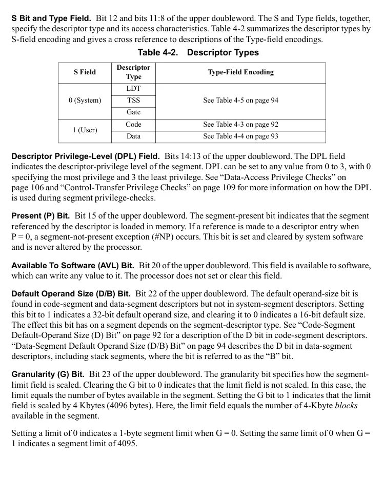

</details>


<!-- PDF source page: 153 | printed page: 91 -->

**Reserved Bits.** Generally, software should clear all reserved bits to 0, so they can be defined in future revisions to the AMD64 architecture.

<a id="4-7-2-code-segment-descriptors"></a>

### 4.7.2 Code-Segment Descriptors

Figure 4-14 shows the code-segment descriptor format (gray shading indicates the bit is reserved). All software tasks require that a segment selector, referencing a valid code-segment descriptor, is loaded into the CS register. Code segments establish the processor operating mode and execution privilege-level. The segments generally contain only instructions and are execute-only, or execute and read-only. Software cannot write into a segment whose selector references a code-segment descriptor.

**Figure 4-14. Code-Segment Descriptor—Legacy Mode**

<details>
<summary>Extracted figure labels</summary>

```text
31
24 23 22 21 20 19
16 15 14 13 12 11 10
9
8
7
0
Segment
Limit[19:16]
AVL
DPL
Base Address[23:16]
+4
Base Address[31:24]
A
G
D
C
R
P
1
Base Address[15:0]
Segment Limit[15:0]
+0
```

</details>

Code-segment descriptors have the S bit set to 1, identifying the segments as user segments. Type-field bit 11 differentiates code-segment descriptors (bit 11 set to 1) from data-segment descriptors (bit 11 cleared to 0). The remaining type-field bits (10:8) define the access characteristics for the code-segment, as follows:

**Conforming (C) Bit.** Bit 10 of the upper doubleword. Setting this bit to 1 identifies the code segment as *conforming*. When control is transferred to a higher-privilege conforming code-segment (C=1) from a lower-privilege code segment, the processor CPL does not change. Transfers to non-conforming code-segments (C = 0) with a higher privilege-level than the CPL can occur only through gate descriptors. See “Control-Transfer Privilege Checks” on page 109 for more information on conforming and non-conforming code-segments.

**Readable (R) Bit.** Bit 9 of the upper doubleword. Setting this bit to 1 indicates the code segment is both executable and readable as data. When this bit is cleared to 0, the code segment is executable, but attempts to read data from the code segment cause a general-protection exception (#GP) to occur.

**Accessed (A) Bit.** Bit 8 of the upper doubleword. The accessed bit is set to 1 by the processor when the descriptor is copied from the GDT or LDT into the CS register. This bit is only cleared by software.

Table 4-3 on page 92 summarizes the code-segment type-field encodings.

<details>
<summary>Rendered source page 153 (figures/tables)</summary>

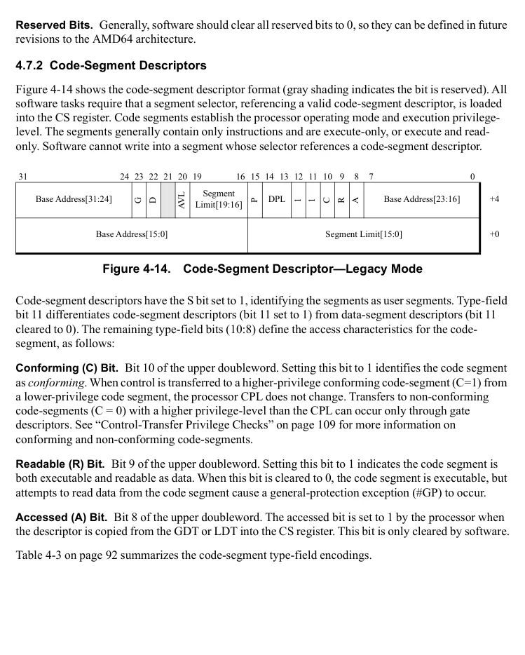

</details>


<!-- PDF source page: 154 | printed page: 92 -->

**Table 4-3. Code-Segment Descriptor Types**

| Hex<br>Value | Type Field / Bit 11<br>(Code/Data) | Type Field / Bit 10 | Type Field / Bit 9 | Type Field / Bit 8 | Description |
| --- | --- | --- | --- | --- | --- |
|  |  | Conforming<br>(C) | Readable<br>(R) | Accessed<br>(A) |  |
| 8 | 1 | 0 | 0 | 0 | Execute-Only |
| 9 | 1 | 0 | 0 | 1 | Execute-Only — Accessed |
| A | 1 | 0 | 1 | 0 | Execute/Readable |
| B | 1 | 0 | 1 | 1 | Execute/Readable — Accessed |
| C | 1 | 1 | 0 | 0 | Conforming, Execute-Only |
| D | 1 | 1 | 0 | 1 | Conforming, Execute-Only — Accessed |
| E | 1 | 1 | 1 | 0 | Conforming, Execute/Readable |
| F | 1 | 1 | 1 | 1 | Conforming, Execute/Readable —<br>Accessed |

**Code-Segment Default-Operand Size (D) Bit.** Bit 22 of byte +4. In code-segment descriptors, the D bit selects the default operand size and address sizes. In legacy mode, when D=0 the default operand size and address size is 16 bits and when D=1 the default operand size and address size is 32 bits. Instruction prefixes can be used to override the operand size or address size, or both.

<a id="4-7-3-data-segment-descriptors"></a>

### 4.7.3 Data-Segment Descriptors

Figure 4-15 shows the data-segment descriptor format. Data segments contain non-executable information and can be accessed as read-only or read/write. They are referenced using the DS, ES, FS, GS, or SS data-segment registers. The DS data-segment register holds the segment selector for the default data segment. The ES, FS and GS data-segment registers hold segment selectors for additional data segments usable by the current software task.

The stack segment is a special form of data-segment register. It is referenced using the SS segment register and must be read/write. When loading the SS register, the processor requires that the selector reference a valid, writable data-segment descriptor.

**Figure 4-15. Data-Segment Descriptor—Legacy Mode**

<details>
<summary>Extracted figure labels</summary>

```text
31
24 23 22 21 20 19
16 15 14 13 12 11 10
9
8
7
0
Segment Limit
[19:16]
AVL
Base Address[31:24]
DPL
Base Address[23:16]
+4
D/B
W
A
G
E
P
1
0
Base Address[15:0]
Segment Limit[15:0]
+0
```

</details>

<details>
<summary>Rendered source page 154 (figures/tables)</summary>

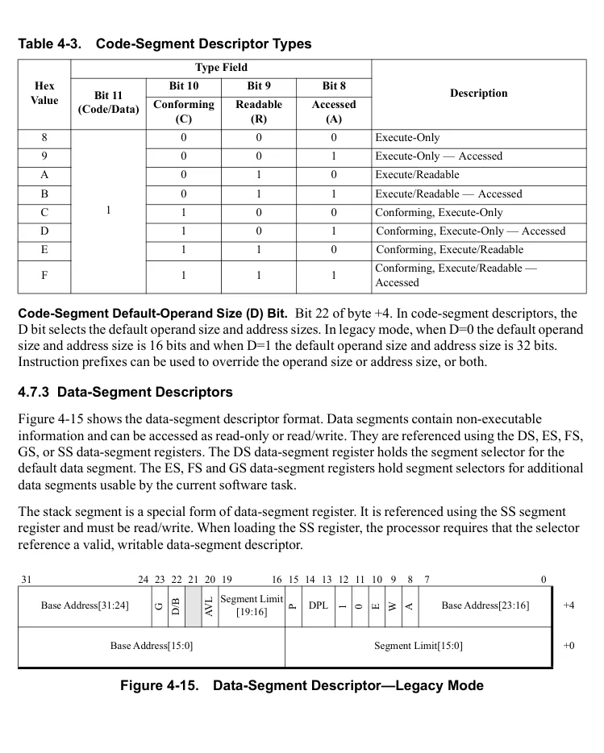

</details>


<!-- PDF source page: 155 | printed page: 93 -->

Data-segment descriptors have the S bit set to 1, identifying them as user segments. Type-field bit 11 differentiates data-segment descriptors (bit 11 cleared to 0) from code-segment descriptors (bit 11 set to 1). The remaining type-field bits (10:8) define the data-segment access characteristics, as follows:

**Expand-Down (E) Bit.** Bit 10 of the upper doubleword. Setting this bit to 1 identifies the data segment as *expand-down*. In expand-down segments, the segment limit defines the *lower* segment boundary while the base is the upper boundary. Valid segment offsets in expand-down segments lie in the byte range limit+1 to FFFFh or FFFF_FFFFh, depending on the value of the data segment default operand size (D/B) bit.

Expand-down segments are useful for stacks, which grow in the downward direction as elements are pushed onto the stack. The stack pointer, ESP, is *decremented* by an amount equal to the operand size as a result of executing a PUSH instruction.

Clearing the E bit to 0 identifies the data segment as expand-up. Valid segment offsets in expand-up segments lie in the byte range 0 to segment limit.

**Writable (W) Bit.** Bit 9 of the upper doubleword. Setting this bit to 1 identifies the data segment as read/write. When this bit is cleared to 0, the segment is read-only. A general-protection exception (#GP) occurs if software attempts to write into a data segment when W=0.

**Accessed (A) Bit.** Bit 8 of the upper doubleword. The accessed bit is set to 1 by the processor when the descriptor is copied from the GDT or LDT into one of the data-segment registers or the stack-segment register. This bit is only cleared by software.

Table 4-4 summarizes the data-segment type-field encodings.

**Table 4-4. Data-Segment Descriptor Types**

| Hex<br>Value | Type Field / Bit 11<br>(Code/Data) | Type Field / Bit 10 | Type Field / Bit 9 | Type Field / Bit 8 | Description |
| --- | --- | --- | --- | --- | --- |
|  |  | Expand-<br>Down<br>(E) | Writable<br>(W) | Accessed<br>(A) |  |
| 0 | 0 | 0 | 0 | 0 | Read-Only |
| 1 | 0 | 0 | 0 | 1 | Read-Only — Accessed |
| 2 | 0 | 0 | 1 | 0 | Read/Write |
| 3 | 0 | 0 | 1 | 1 | Read/Write — Accessed |
| 4 | 0 | 1 | 0 | 0 | Expand-down, Read-Only |
| 5 | 0 | 1 | 0 | 1 | Expand-down, Read-Only — Accessed |
| 6 | 0 | 1 | 1 | 0 | Expand-down, Read/Write |
| 7 | 0 | 1 | 1 | 1 | Expand-down, Read/Write — Accessed |

<details>
<summary>Rendered source page 155 (figures/tables)</summary>

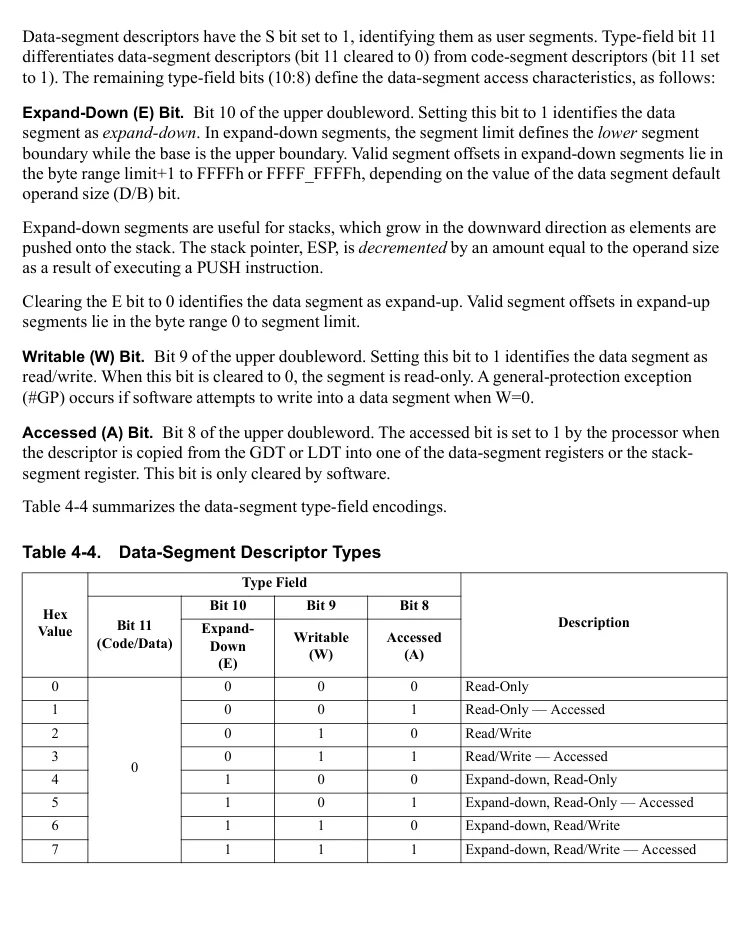

</details>


<!-- PDF source page: 156 | printed page: 94 -->

**Data-Segment Default Operand Size (D/B) Bit.** Bit 22 of the upper doubleword. For expand-down data segments (E=1), setting D=1 sets the upper bound of the segment at 0_FFFF_FFFFh. Clearing D=0 sets the upper bound of the segment at 0_FFFFh.

In the case where a data segment is referenced by the stack selector (SS), the D bit is referred to as the B bit. For stack segments, the B bit sets the default stack size. Setting B=1 establishes a 32-bit stack referenced by the 32-bit ESP register. Clearing B=0 establishes a 16-bit stack referenced by the 16-bit SP register.

<a id="4-7-4-system-descriptors"></a>

### 4.7.4 System Descriptors

There are two general types of system descriptors: system-segment descriptors and gate descriptors. System-segment descriptors are used to describe the LDT and TSS segments. Gate descriptors do not describe segments, but instead hold pointers to code-segment descriptors. Gate descriptors are used for protected-mode control transfers between less-privileged and more-privileged software.

System-segment descriptors have the S bit cleared to 0. The type field is used to differentiate the various LDT, TSS, and gate descriptors from one another. Table 4-5 summarizes the system-segment type-field encodings.

**Table 4-5. System-Segment Descriptor Types (S=0)—Legacy Mode**

| Hex<br>Value | Type Field<br>(Bits 11:8) | Description |
| --- | --- | --- |
| 0 | 0000 | Reserved (Illegal) |
| 1 | 0001 | Available 16-bit TSS |
| 2 | 0010 | LDT |
| 3 | 0011 | Busy 16-bit TSS |
| 4 | 0100 | 16-bit Call Gate |
| 5 | 0101 | Task Gate |
| 6 | 0110 | 16-bit Interrupt Gate |
| 7 | 0111 | 16-bit Trap Gate |
| 8 | 1000 | Reserved (Illegal) |
| 9 | 1001 | Available 32-bit TSS |
| A | 1010 | Reserved (Illegal) |
| B | 1011 | Busy 32-bit TSS |
| C | 1100 | 32-bit Call Gate |
| D | 1101 | Reserved (Illegal) |
| E | 1110 | 32-bit Interrupt Gate |
| F | 1111 | 32-bit Trap Gate |

<details>
<summary>Rendered source page 156 (figures/tables)</summary>

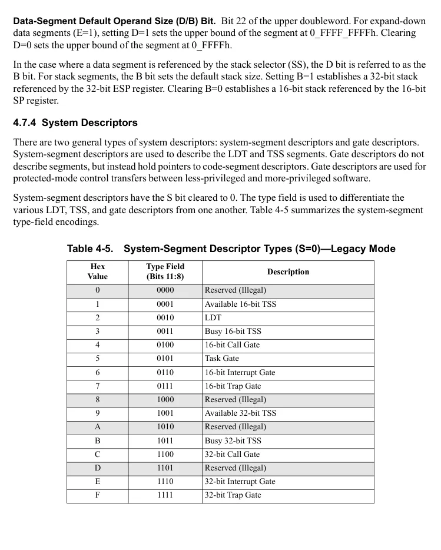

</details>


<!-- PDF source page: 157 | printed page: 95 -->

Figure 4-16 shows the legacy-mode system-segment descriptor format used for referencing LDT and TSS segments (gray shading indicates the bit is reserved). This format is also used in compatibility mode. The system-segments are used as follows:

- The LDT typically holds segment descriptors belonging to a single task (see “Local Descriptor Table” on page 84).
- The TSS is a data structure for holding processor-state information. Processor state is saved in a TSS when a task is suspended, and state is restored from the TSS when a task is restarted. System software must create at least one TSS referenced by the task register, TR. See “Legacy Task-State Segment” on page 372 for more information on the TSS.

**Figure 4-16. LDT and TSS Descriptor—Legacy/Compatibility Modes**

<details>
<summary>Extracted figure labels</summary>

```text
31
24 23 22 21 20 19
16 15 14 13 12 11
8
7
0
Segment
Limit[19:16]
AVL
IGN
DPL
Type
Base Address[23:16]
+4
Base Address[31:24]
G
P
0
Base Address[15:0]
Segment Limit[15:0]
+0
```

</details>

<a id="4-7-5-gate-descriptors"></a>

### 4.7.5 Gate Descriptors

Gate descriptors hold pointers to code segments and are used to control access between code segments with different privilege levels. There are four types of gate descriptors:

- *Call Gates*—These gates (Figure 4-17 on page 96) are located in the GDT or LDT and are used to control access between code segments in the same task or in different tasks. See “Control Transfers Through Call Gates” on page 113 for information on how call gates are used to control access between code segments operating in the same task. The format of a call-gate descriptor is shown in Figure 4-17 on page 96.
- *Interrupt Gates* and *Trap Gates*—These gates (Figure 4-18 on page 96) are located in the IDT and are used to control access to interrupt-service routines. “Legacy Protected-Mode Interrupt Control Transfers” on page 270 contains information on using these gates for interrupt-control transfers. The format of interrupt-gate and trap-gate descriptors is shown in Figure 4-17 on page 96.
- *Task Gates*—These gates (Figure 4-19 on page 96) are used to control access between different tasks. They are also used to transfer control to interrupt-service routines if those routines are themselves a separate task. See “Task-Management Resources” on page 367 for more information on task gates and their use.

<details>
<summary>Rendered source page 157 (figures/tables)</summary>

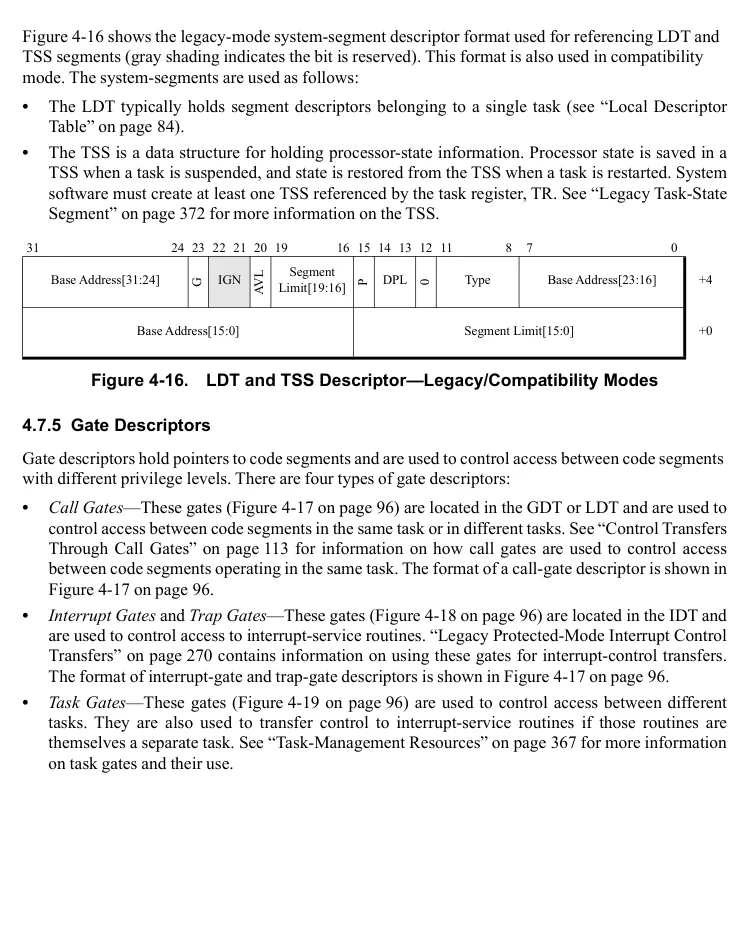

</details>


<!-- PDF source page: 158 | printed page: 96 -->

**Figure 4-17. Call-Gate Descriptor—Legacy Mode**

<details>
<summary>Extracted figure labels</summary>

```text
31
16 15 14 13 12 11
8
7
6
5
4
0
Type
Reserved
IGN
Parameter Count
+4
DPL
Target Code-Segment Offset[31:16]
P
0
Target Code-Segment Selector
Target Code-Segment Offset[15:0]
+0
```

</details>

**Figure 4-18. Interrupt-Gate and Trap-Gate Descriptors—Legacy Mode**

<details>
<summary>Extracted figure labels</summary>

```text
31
16 15 14 13 12 11
8
7
0
DPL
Type
Reserved, IGN
+4
Target Code-Segment Offset[31:16]
P
0
Target Code-Segment Selector
Target Code-Segment Offset[15:0]
+0
```

</details>

**Figure 4-19. Task-Gate Descriptor—Legacy Mode**

<details>
<summary>Extracted figure labels</summary>

```text
31
16 15 14 13 12 11
8
7
0
Reserved, IGN
DPL
Type
Reserved, IGN
+4
P
0
TSS Selector
Reserved, IGN
+0
```

</details>

There are several differences between the gate-descriptor format and the system-segment descriptor format. These differences are described as follows, from least-significant to most-significant bit positions:

**Target Code-Segment Offset.** The 32-bit segment offset is formed by concatenating bits 31:16 of byte +4 with bits 15:0 of byte +0. The segment-offset field specifies the target-procedure entry point (offset) into the segment. This field is loaded into the EIP register as a result of a control transfer using the gate descriptor.

**Target Code-Segment Selector.** Bits 31:16 of byte +0. The segment-selector field identifies the target-procedure segment descriptor, located in either the GDT or LDT. The segment selector is loaded into the CS segment register as a result of a control transfer using the gate descriptor.

**TSS Selector.** Bits 31:16 of byte +0 (task gates only). This field identifies the target-task TSS descriptor, located in any of the three descriptor tables (GDT, LDT, and IDT).

<details>
<summary>Rendered source page 158 (figures/tables)</summary>

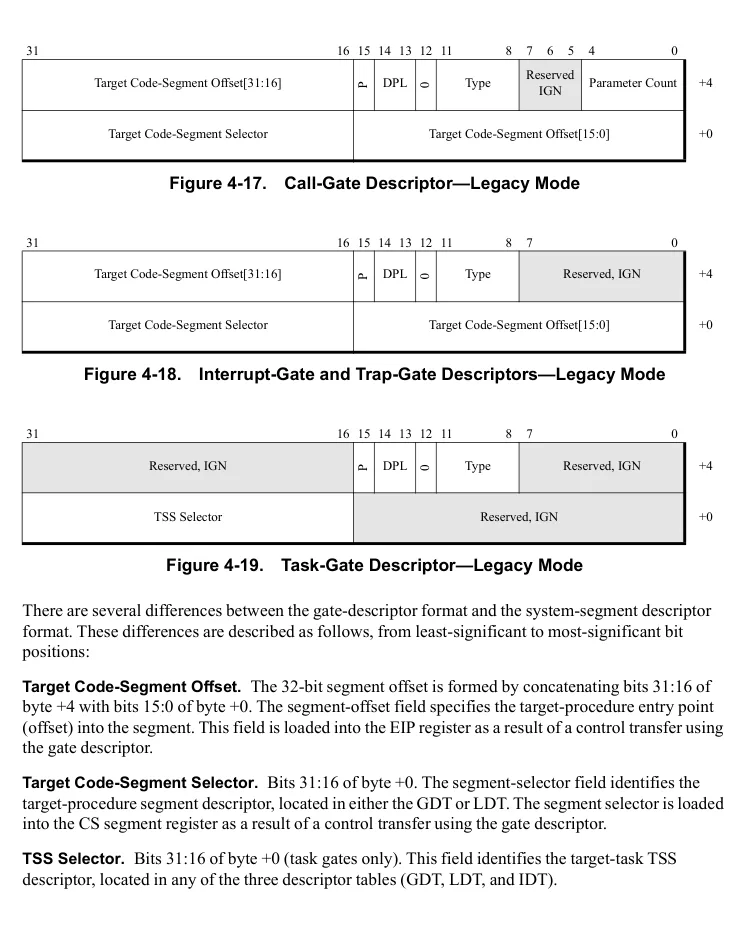

</details>


<!-- PDF source page: 159 | printed page: 97 -->

**Parameter Count (Call Gates Only).** Bits 4:0 of byte +4. Legacy-mode call-gate descriptors contain a 5-bit *parameter-count* field. This field specifies the number of parameters to be copied from the currently-executing program stack to the target program stack during an automatic stack switch. Automatic stack switches are performed by the processor during a control transfer through a call gate to a greater privilege-level. The parameter size depends on the call-gate size as specified in the type field. 32-bit call gates copy 4-byte parameters, and 16-bit call gates copy 2-byte parameters. See “Stack Switching” on page 117 for more information on call-gate parameter copying.

<a id="4-8-long-mode-segment-descriptors"></a>

## 4.8 Long-Mode Segment Descriptors

The interpretation of descriptor fields is changed in long mode, and in some cases the format is expanded. The changes depend on the operating mode (compatibility mode or 64-bit mode) and on the descriptor type. The following sections describe the changes.

<a id="4-8-1-code-segment-descriptors"></a>

### 4.8.1 Code-Segment Descriptors

Code segments continue to exist in long mode. Code segments and their associated descriptors and selectors are needed to establish the processor operating mode as well as execution privilege-level. The new L attribute specifies whether the processor is running in compatibility mode or 64-bit mode (see “Long (L) Attribute Bit” on page 98). Figure 4-20 shows the long-mode code-segment descriptor format. In compatibility mode, the code-segment descriptor is interpreted and behaves just as it does in legacy mode as described in “Code-Segment Descriptors” on page 91.

In Figure 4-20, gray shading indicates the code-segment descriptor fields that are *ignored in 64-bit mode* when the descriptor is used during a memory reference. However, the fields are loaded whenever the segment register is loaded in 64-bit mode.

**Figure 4-20. Code-Segment Descriptor—Long Mode**

<details>
<summary>Extracted figure labels</summary>

```text
31
24 23 22 21 20 19
16 15 14 13 12 11 10
9
8
7
0
Segment
Limit[19:16]
AVL
Base Address[31:24]
DPL
Base Address[23:16]
+4
G
D
A
C
R
L
P
1
Base Address[15:0]
Segment Limit[15:0]
+0
```

</details>

**Fields Ignored in 64-Bit Mode.** Segmentation is disabled in 64-bit mode, and code segments span all of virtual memory. In this mode, code-segment base addresses are ignored. For the purpose of virtual-address calculations, the base address is treated as if it has a value of zero.

Segment-limit checking is not performed, and both the segment-limit field and granularity (G) bit are ignored. Instead, the virtual address is checked to see if it is in canonical-address form.

The readable (R) and accessed (A) attributes in the type field are also ignored.

<details>
<summary>Rendered source page 159 (figures/tables)</summary>

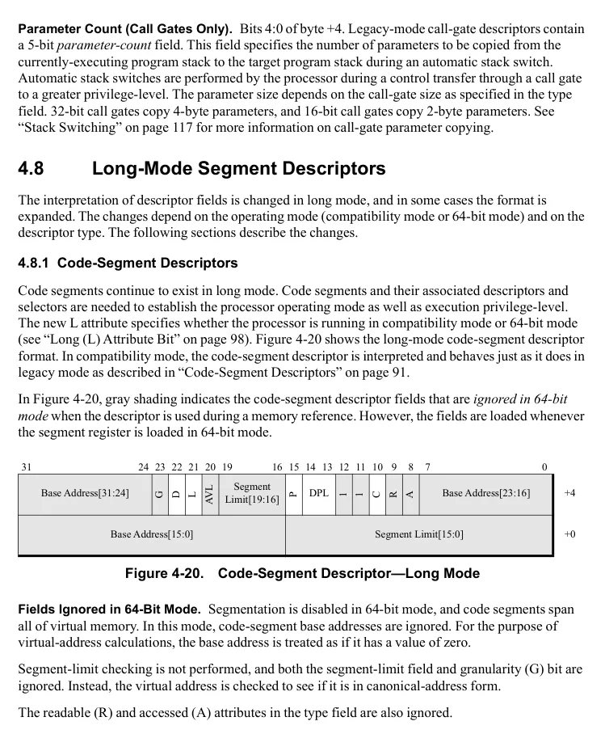

</details>


<!-- PDF source page: 160 | printed page: 98 -->

**Long (L) Attribute Bit.** Bit 21 of byte +4. Long mode introduces a new attribute, the *long* (L) bit, in code-segment descriptors. This bit specifies that the processor is running in 64-bit mode (L=1) or compatibility mode (L=0). When the processor is running in legacy mode, this bit is reserved.

Compatibility mode maintains binary compatibility with legacy 16-bit and 32-bit applications. Compatibility mode is selected on a code-segment basis, and it allows legacy applications to coexist under the same 64-bit system software along with 64-bit applications running in 64-bit mode. System software running in long mode can execute existing 16-bit and 32-bit applications by clearing the L bit of the code-segment descriptor to 0.

When L=0, the legacy meaning of the code-segment D bit (see “Code-Segment Default-Operand Size (D) Bit” on page 92)—and the address-size and operand-size prefixes—are observed. Segmentation is enabled when L=0. From an application viewpoint, the processor is in a legacy 16-bit or 32-bit operating environment (depending on the D bit), even though long mode is activated.

If the processor is running in 64-bit mode (L=1), the only valid setting of the D bit is 0. This setting produces a default operand size of 32 bits and a default address size of 64 bits. The combination L=1 and D=1 is reserved for future use.

“Instruction Prefixes” in Volume 3 describes the effect of the code-segment L and D bits on default operand and address sizes when long mode is activated. These default sizes can be overridden with operand size, address size, and REX prefixes.

<a id="4-8-2-data-segment-descriptors"></a>

### 4.8.2 Data-Segment Descriptors

Data segments continue to exist in long mode. Figure 4-21 shows the long-mode data-segment descriptor format. In compatibility mode, data-segment descriptors are interpreted and behave just as they do in legacy mode.

In Figure 4-21, gray shading indicates the fields that are *ignored in 64-bit mode* when the descriptor is used during a memory reference. However, the fields are loaded whenever the segment register is loaded in 64-bit mode.

**Figure 4-21. Data-Segment Descriptor—Long Mode**

<details>
<summary>Extracted figure labels</summary>

```text
31
24 23 22 21 20 19
16 15 14 13 12 11 10
9
8
7
0
Segment
Limit[19:16]
AVL
Base Address[31:24]
DPL
Base Address[23:16]
+4
D/B
W
G
A
E
P
1
0
Base Address[15:0]
Segment Limit[15:0]
+0
```

</details>

**Fields Ignored in 64-Bit Mode.** Segmentation is disabled in 64-bit mode. The interpretation of the segment-base address depends on the segment register used:

<details>
<summary>Rendered source page 160 (figures/tables)</summary>

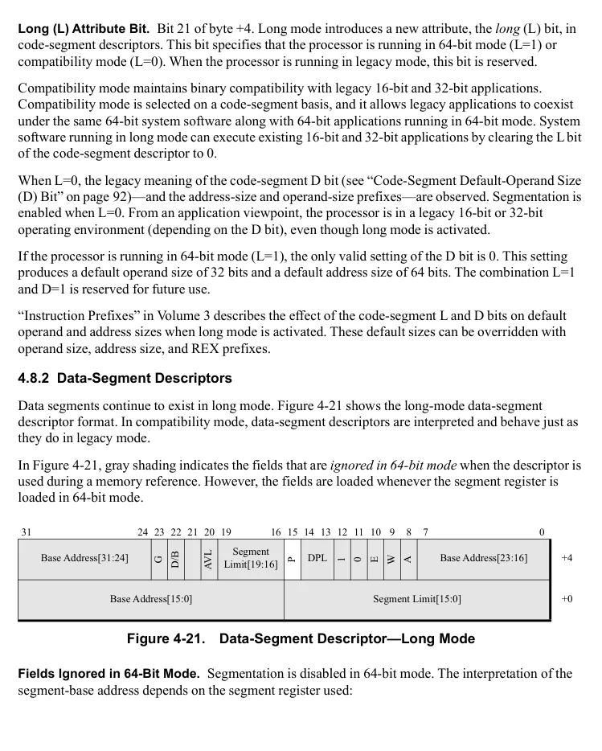

</details>


<!-- PDF source page: 161 | printed page: 99 -->

- In data-segment descriptors referenced by the DS, ES and SS segment registers, the base-address field is ignored. For the purpose of virtual-address calculations, the base address is treated as if it has a value of zero.
- Data segments referenced by the FS and GS segment registers receive special treatment in 64-bit mode. For these segments, the base address field is not ignored, and a non-zero value can be used in virtual-address calculations. A 64-bit segment-base address can be specified using model-specific registers. See “FS and GS Registers in 64-Bit Mode” on page 80 for more information.

Segment-limit checking is not performed on any data segments in 64-bit mode, and both the segment-limit field and granularity (G) bit are ignored. The D/B bit is unused in 64-bit mode.

The expand-down (E), writable (W), and accessed (A) type-field attributes are ignored.

A data-segment-descriptor DPL field is ignored in 64-bit mode, and segment-privilege checks are not performed on data segments. System software can use the page-protection mechanisms to isolate and protect data from unauthorized access.

<a id="4-8-3-system-descriptors"></a>

### 4.8.3 System Descriptors

In long mode, the allowable system-descriptor types encoded by the type field are changed. Some descriptor types are modified, and others are illegal. The changes are summarized in Table 4-6. An attempt to use an illegal descriptor type causes a general-protection exception (#GP).

**Table 4-6. System-Segment Descriptor Types—Long Mode**

| Hex<br>Value | Type Field / Bit 11 | Type Field / Bit 10 | Type Field / Bit 9 | Type Field / Bit 8 | Description |
| --- | --- | --- | --- | --- | --- |
| 0 | 0 | 0 | 0 | 0 | Reserved (Illegal) |
| 1 | 0 | 0 | 0 | 1 |  |
| 2 | 0 | 0 | 1 | 0 | 64-bit LDT1 |
| 3 | 0 | 0 | 1 | 1 | Reserved (Illegal) |
| 4 | 0 | 1 | 0 | 0 |  |
| 5 | 0 | 1 | 0 | 1 |  |
| 6 | 0 | 1 | 1 | 0 |  |
| 7 | 0 | 1 | 1 | 1 |  |
| 8 | 1 | 0 | 0 | 0 |  |
| 9 | 1 | 0 | 0 | 1 | Available 64-bit TSS |
| A | 1 | 0 | 1 | 0 | Reserved (Illegal) |
| B | 1 | 0 | 1 | 1 | Busy 64-bit TSS |
| C | 1 | 1 | 0 | 0 | 64-bit Call Gate |

> Note(s): 1. In 64-bit mode only. In compatibility mode, the type specifies a 32-bit LDT.

<details>
<summary>Rendered source page 161 (figures/tables)</summary>

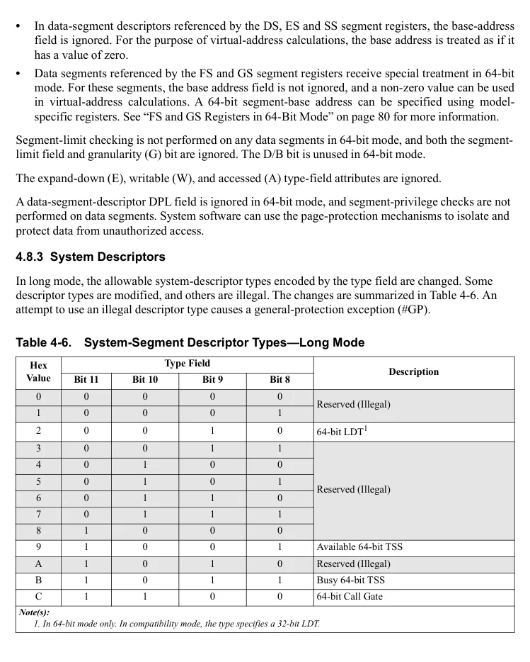

</details>


<!-- PDF source page: 162 | printed page: 100 -->

**Table 4-6. System-Segment Descriptor Types—Long Mode (continued)**

**Hex Value Type Field Description Bit 11 Bit 10 Bit 9 Bit 8**

D 1 1 0 1 Reserved (Illegal)

E 1 1 1 0 64-bit Interrupt Gate

F 1 1 1 1 64-bit Trap Gate

***Note(s):** 1. In 64-bit mode only. In compatibility mode, the type specifies a 32-bit LDT.*

In long mode, the modified system-segment descriptor types are:

- The 32-bit LDT (02h), which is redefined as the 64-bit LDT.
- The available 32-bit TSS (09h), which is redefined as the available 64-bit TSS.
- The busy 32-bit TSS (0Bh), which is redefined as the busy 64-bit TSS.

In 64-bit mode, the LDT and TSS system-segment descriptors are expanded by 64 bits, as shown in Figure 4-22. In this figure, gray shading indicates the fields that are *ignored in 64-bit mode*. Expanding the descriptors allows them to hold 64-bit base addresses, so their segments can be located anywhere in the virtual-address space. The expanded descriptor can be loaded into the corresponding descriptor-table register (LDTR or TR) only from 64-bit mode. In compatibility mode, the legacy system-segment descriptor format, shown in Figure 4-16 on page 95, is used. See “LLDT and LTR Instructions” on page 180 for more information.

| Reserved, IGN / Base Address[63:32] | Reserved, IGN | Reserved, IGN (2) | Reserved, IGN (3) | Reserved, IGN (4) | Reserved, IGN (5) | Reserved, IGN (6) | 0 | 0 (2) | 0 (3) | 0 (4) | 0 (5) | Reserved, IGN (7) |
| --- | --- | --- | --- | --- | --- | --- | --- | --- | --- | --- | --- | --- |
| Base Address[31:24] | G |  | AVL | Segment<br>Limit[19:16] | P | DPL | 0 | Type |  |  |  | Base Address[23:16] |
| Base Address[15:0] | G |  |  |  | Segment Limit[15:0] |  |  |  |  |  |  |  |

**Figure 4-22. System-Segment Descriptor—64-Bit Mode**

<details>
<summary>Extracted figure labels</summary>

```text
31
23
20 19
16 15 14 13 12 11 10
9
8
7
0
Reserved, IGN
+12
0
Base Address[63:32]
+8
Segment
Limit[19:16]
AVL
DPL
Type
Base Address[23:16]
+4
Base Address[31:24]
G
P
0
Base Address[15:0]
Segment Limit[15:0]
+0
```

</details>

The 64-bit system-segment base address must be in canonical form. Otherwise, a general-protection exception occurs with a selector error-code, #GP(selector), when the system segment is loaded. System-segment limit values are checked by the processor in both 64-bit and compatibility modes, under the control of the granularity (G) bit.

Figure 4-22 shows that bits 12:8 of doubleword +12 must be cleared to 0. These bits correspond to the S and Type fields in a legacy descriptor. Clearing these bits to 0 corresponds to an illegal type in legacy

<details>
<summary>Rendered source page 162 (figures/tables)</summary>

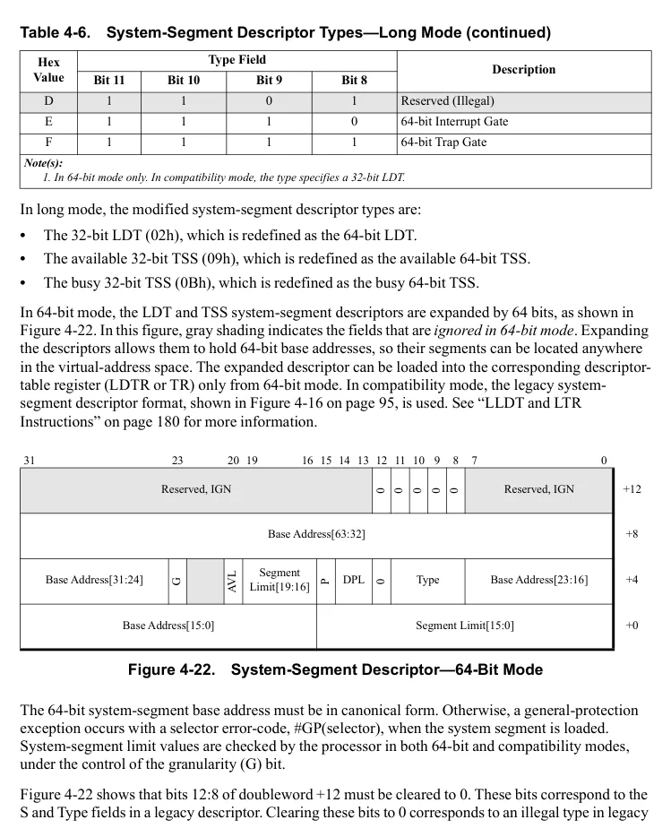

</details>


<!-- PDF source page: 163 | printed page: 101 -->

mode and causes a #GP if an attempt is made to access the upper half of a 64-bit mode system-segment descriptor as a legacy descriptor or as the lower half of a 64-bit mode system-segment descriptor.

<a id="4-8-4-gate-descriptors"></a>

### 4.8.4 Gate Descriptors

As shown in Table 4-6 on page 99, the allowable gate-descriptor types are changed in long mode. Some gate-descriptor types are modified and others are illegal. The modified gate-descriptor types in long mode are:

- The 32-bit call gate (0Ch), which is redefined as the 64-bit call gate.
- The 32-bit interrupt gate (0Eh), which is redefined as the 64-bit interrupt gate.
- The 32-bit trap gate (0Fh), which is redefined as the 64-bit trap gate.

In long mode, several gate-descriptor types are illegal. An attempt to use these gates causes a general-protection exception (#GP) to occur. The illegal gate types are:

- The 16-bit call gate (04h).
- The task gate (05h).
- The 16-bit interrupt gate (06h).
- The 16-bit trap gate (07h).

In long mode, gate descriptors are expanded by 64 bits, allowing them to hold 64-bit offsets. The 64-bit call-gate descriptor is shown in Figure 4-23 and the 64-bit interrupt gate and trap gate are shown in Figure 4-24 on page 102. In these figures, gray shading indicates the fields that are *ignored in long mode*. The interrupt and trap gates contain an additional field, the IST, that is not present in the call gate—see “IST Field (Interrupt and Trap Gates)” on page 102.

**Figure 4-23. Call-Gate Descriptor—Long Mode**

<details>
<summary>Extracted figure labels</summary>

```text
31
16 15 14 13 12 11 10
9
8
7
0
Reserved, IGN
+12
0
Target Offset[63:32]
+8
DPL
Type
Reserved, IGN
+4
Target Offset[31:16]
P
0
Target Selector
Target Offset[15:0]
+0
```

</details>

<details>
<summary>Rendered source page 163 (figures/tables)</summary>

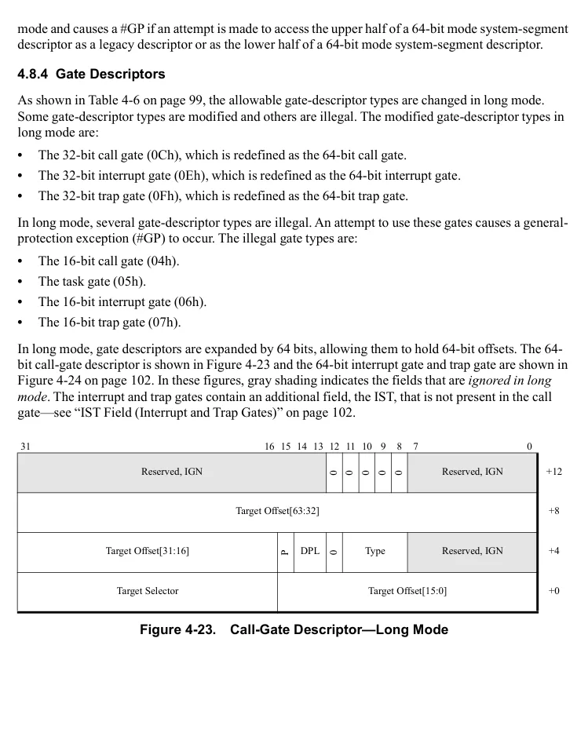

</details>


<!-- PDF source page: 164 | printed page: 102 -->

**Figure 4-24. Interrupt-Gate and Trap-Gate Descriptors—Long Mode**

<details>
<summary>Extracted figure labels</summary>

```text
31
16 15 14 13 12 11
8
7
3
2
0
Reserved, IGN
+12
Target Offset[63:32]
+8
DPL
Type
Reserved, IGN
IST
+4
Target Offset[31:16]
P
0
Target Selector
Target Offset[15:0]
+0
```

</details>

The target code segment referenced by a long-mode gate descriptor must be a 64-bit code segment (CS.L=1, CS.D=0). If the target is not a 64-bit code segment, a general-protection exception, #GP(error), occurs. The error code reported depends on the gate type:

- Call gates report the target code-segment selector as the error code.
- Interrupt and trap gates report the interrupt vector number as the error code.

A general-protection exception, #GP(0), occurs if software attempts to reference a long-mode gate descriptor with a target-segment offset that is not in canonical form.

It is possible for software to store legacy and long mode gate descriptors in the same descriptor table. Figure 4-23 on page 101 shows that bits 12:8 of byte +12 in a long-mode call gate must be cleared to 0. These bits correspond to the S and Type fields in a legacy call gate. Clearing these bits to 0 corresponds to an illegal type in legacy mode and causes a #GP if an attempt is made to access the upper half of a 64-bit mode call-gate descriptor as a legacy call-gate descriptor.

It is not necessary to clear these same bits in a long-mode interrupt gate or trap gate. In long mode, the interrupt-descriptor table (IDT) must contain 64-bit interrupt gates or trap gates. The processor automatically indexes the IDT by scaling the interrupt vector by 16. This makes it impossible to access the upper half of a long-mode interrupt gate, or trap gate, as a legacy gate when the processor is running in long mode.

**IST Field (Interrupt and Trap Gates).** Bits 2:0 of byte +4. Long-mode interrupt gate and trap gate descriptors contain a new, 3-bit interrupt-stack-table (IST) field not present in legacy gate descriptors. The IST field is used as an index into the IST portion of a long-mode TSS. If the IST field is not 0, the index references an IST pointer in the TSS, which the processor loads into the RSP register when an interrupt occurs. If the IST index is 0, the processor uses the legacy stack-switching mechanism (with some modifications) when an interrupt occurs. See “Interrupt-Stack Table” on page 285 for more information.

<details>
<summary>Rendered source page 164 (figures/tables)</summary>

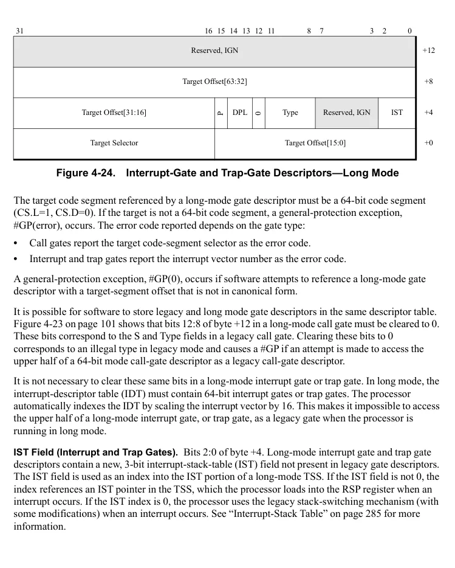

</details>


<!-- PDF source page: 165 | printed page: 103 -->

**Count Field (Call Gates).** The count field found in legacy call-gate descriptors is not supported in long-mode call gates. In long mode, the field is reserved and should be cleared to zero.

<a id="4-8-5-long-mode-descriptor-summary"></a>

### 4.8.5 Long Mode Descriptor Summary

System descriptors and gate descriptors are expanded by 64 bits to handle 64-bit base addresses in long mode or 64-bit mode. The mode in which the expansion occurs depends on the purpose served by the descriptor, as follows:

- *Expansion Only In 64-Bit Mode*—The system descriptors and pseudo-descriptors that are loaded into the GDTR, IDTR, LDTR, and TR registers are expanded only in 64-bit mode. They are not expanded in compatibility mode.
- *Expansion In Long Mode*—Gate descriptors (call gates, interrupt gates, and trap gates) are expanded in long mode (both 64-bit mode and compatibility mode). Task gates and 16-bit gate descriptors are illegal in long mode.

The AMD64 architecture redefines several of the descriptor-entry fields in support of long mode. The specific change depends on whether the processor is in 64-bit mode or compatibility mode. Table 4-7 summarizes the changes in the descriptor entry field when the descriptor entry is loaded into a segment register (as opposed to when the segment register is subsequently used to access memory).

**Table 4-7. Descriptor-Entry Field Changes in Long Mode**

| Descriptor<br>Field | Descriptor<br>Type | Long Mode / Compatibility Mode | Long Mode / 64-Bit Mode |
| --- | --- | --- | --- |
| Limit | Code | Same as legacy x86 | Same as legacy x86 |
| Limit | Data | Same as legacy x86 |  |
| Limit | System | Same as legacy x86 |  |
| Offset | Gate | Expanded to 64 bits | Expanded to 64 bits |
| Base | Code | Same as legacy x86 | Same as legacy x86 |
| Base | Data | Same as legacy x86 |  |
| Base | System | Same as legacy x86 |  |
| Selecto | Gate | Same as legacy x86 |  |
| IST1 | Gate | Interrupt and trap gates only. (New for long mode.) |  |
| S and Type | Code | Same as legacy x86 | Same as legacy x86 |
| S and Type | Data | Same as legacy x86 |  |
| S and Type | System | Types 02h, 09h, and 0Bh redefined<br>Types 01h and 03h are illegal |  |
| S and Type | Gate | Types 0Ch, 0Eh, and 0Fh redefined<br>Types 04h–07h are illegal |  |
| Note(s):<br>1. Not available (reserved) in legacy mode. | Gate | Types 0Ch, 0Eh, and 0Fh redefined<br>Types 04h–07h are illegal |  |

<details>
<summary>Rendered source page 165 (figures/tables)</summary>

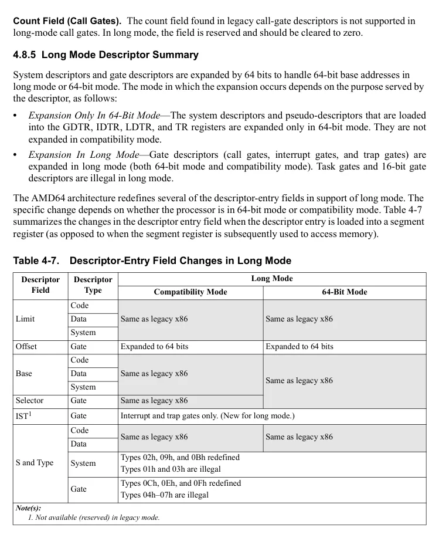

</details>


<!-- PDF source page: 166 | printed page: 104 -->

**Table 4-7. Descriptor-Entry Field Changes in Long Mode (continued)**

| Descriptor<br>Field | Descriptor<br>Type | Long Mode / Compatibility Mode | Long Mode / 64-Bit Mode |
| --- | --- | --- | --- |
| DPL | Code | Same as legacy x86 | Same as legacy x86 |
| DPL | Data | Same as legacy x86 |  |
| DPL | System | Same as legacy x86 |  |
| DPL | Gate | Same as legacy x86 |  |
| Present | Code | Same as legacy x86 | Same as legacy x86 |
| Present | Data | Same as legacy x86 |  |
| Present | System | Same as legacy x86 |  |
| Present | Gate | Same as legacy x86 |  |
| Default Size | Code | Same as legacy x86 | D=0 Indicates 64-bit address, 32-bit data<br>D=1 Reserved |
| Default Size | Data | Same as legacy x86 | Same as legacy x86 |
| Long1 | Code | Specifies compatibility mode | Specifies 64-bit mode |
| Granularity | Code | Same as legacy x86 | Same as legacy x86 |
| Granularity | Data | Same as legacy x86 |  |
| Granularity | System | Same as legacy x86 |  |
| Available | Code | Same as legacy x86 | Same as legacy x86 |
| Available | Data | Same as legacy x86 |  |
| Available | System | Same as legacy x86 |  |
| Note(s):<br>1. Not available (reserved) in legacy mode. | System | Same as legacy x86 |  |

<a id="4-9-segment-protection-overview"></a>

## 4.9 Segment-Protection Overview

The AMD64 architecture is designed to fully support the legacy segment-protection mechanism. The segment-protection mechanism provides system software with the ability to restrict program access into other software routines and data.

Segment-level protection remains enabled in compatibility mode. 64-bit mode eliminates most type checking, and limit checking is not performed, except on accesses to system-descriptor tables.

The preferred method of implementing memory protection in a long-mode operating system is to rely on the page-protection mechanism as described in “Page-Protection Checks” on page 161. System software still needs to create basic segment-protection data structures for 64-bit mode. These structures are simplified, however, by the use of the flat-memory model in 64-bit mode, and the limited segmentation checks performed when executing in 64-bit mode.

<details>
<summary>Rendered source page 166 (figures/tables)</summary>

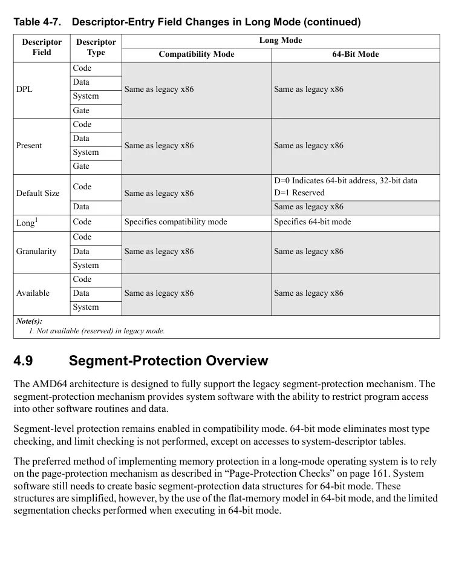

</details>


<!-- PDF source page: 167 | printed page: 105 -->

<a id="4-9-1-privilege-level-concept"></a>

### 4.9.1 Privilege-Level Concept

Segment protection is used to isolate and protect programs and data from each other. The segment-protection mechanism supports four privilege levels in protected mode. The privilege levels are designated with a numerical value from 0 to 3, with 0 being the most privileged and 3 being the least privileged. System software typically assigns the privilege levels in the following manner:

- *Privilege-level 0 (most privilege)*—This level is used by critical system-software components that require direct access to, and control over, all processor and system resources. This can include platform firmware, memory-management functions, and interrupt handlers.
- *Privilege-levels 1 and 2 (moderate privilege)*—These levels are used by less-critical system-software services that can access and control a limited scope of processor and system resources. Software running at these privilege levels might include some device drivers and library routines. These software routines can call more-privileged system-software services to perform functions such as memory garbage-collection and file allocation.
- *Privilege-level 3 (least privilege)*—This level is used by application software. Software running at privilege-level 3 is normally prevented from directly accessing most processor and system resources. Instead, applications request access to the protected processor and system resources by calling more-privileged service routines to perform the accesses.

Figure 4-25 shows the relationship of the four privilege levels to each other.

**Figure 4-25. Privilege-Level Relationships**

<details>
<summary>Extracted figure labels</summary>

```text
Memory Management
File Allocation
Interrupt Handling
Device-Drivers
Library Routines
Privilege
0
Privilege 1
Privilege 2
Privilege 3
513-236.eps
Application Programs
```

</details>

<a id="4-9-2-privilege-level-types"></a>

### 4.9.2 Privilege-Level Types

There are three types of privilege levels the processor uses to control access to segments. These are CPL, DPL, and RPL.

**Current Privilege-Level.** The current privilege-level (CPL) is the privilege level at which the processor is currently executing. The CPL is stored in an internal processor register that is invisible to

<details>
<summary>Rendered source page 167 (figures/tables)</summary>

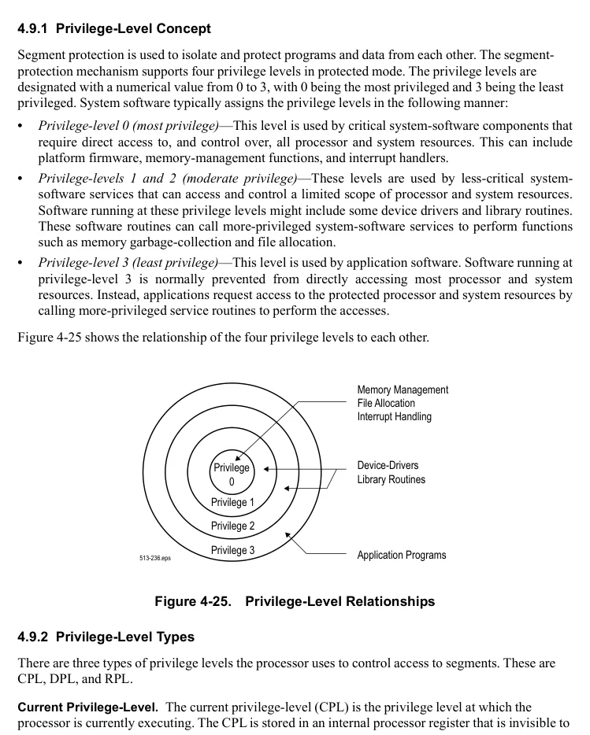

</details>


<!-- PDF source page: 168 | printed page: 106 -->

software. Software changes the CPL by performing a control transfer to a different code segment with a new privilege level.

**Descriptor Privilege-Level.** The descriptor privilege-level (DPL) is the privilege level that system software assigns to individual segments. The DPL is used in privilege checks to determine whether software can access the segment referenced by the descriptor. In the case of gate descriptors, the DPL determines whether software can access the descriptor reference by the gate. The DPL is stored in the segment (or gate) descriptor.

**Requestor Privilege-Level.** The requestor privilege-level (RPL) reflects the privilege level of the program that created the selector. The RPL can be used to let a called program know the privilege level of the program that initiated the call. The RPL is stored in the selector used to reference the segment (or gate) descriptor.

The following sections describe how the CPL, DPL, and RPL are used by the processor in performing privilege checks on data accesses and control transfers. Failure to pass a protection check generally causes an exception to occur.

<a id="4-10-data-access-privilege-checks"></a>

## 4.10 Data-Access Privilege Checks

<a id="4-10-1-accessing-data-segments"></a>

### 4.10.1 Accessing Data Segments

Before loading a data-segment register (DS, ES, FS, or GS) with a segment selector, the processor checks the privilege levels as follows to see if access is allowed:

1. 1. The processor compares the CPL with the RPL in the data-segment selector and determines the effective privilege level for the data access. The processor sets the effective privilege level to the lowest privilege (numerically-higher value) indicated by the comparison.

1. 2. The processor compares the effective privilege level with the DPL in the descriptor-table entry referenced by the segment selector. If the effective privilege level is greater than or equal to (numerically lower-than or equal-to) the DPL, then the processor loads the segment register with the data-segment selector. The processor automatically loads the corresponding descriptor-table entry into the hidden portion of the segment register. If the effective privilege level is lower than (numerically greater-than) the DPL, a general-protection exception (#GP) occurs and the segment register is not loaded.

Figure 4-26 on page 107 shows two examples of data-access privilege checks.


<!-- PDF source page: 169 | printed page: 107 -->

**Figure 4-26. Data-Access Privilege-Check Examples**

<details>
<summary>Extracted figure labels</summary>

```text
Effective
Privilege
CS
CPL=3
3
Max
Data
Selector
RPL=0
Access Denied
Data
Segment
£
DPL=2
Descriptor
Example 1: Privilege Check Fails
Effective
Privilege
CS
CPL=0
0
Max
Data
Selector
RPL=0
Access Allowed
Data
Segment
£
DPL=2
Descriptor
Example 2: Privilege Check Passes
513-229.eps
```

</details>

Example 1 in Figure 4-26 shows a failing data-access privilege check. The effective privilege level is 3 because CPL=3. This value is greater than the descriptor DPL, so access to the data segment is denied.

Example 2 in Figure 4-26 shows a passing data-access privilege check. Here, the effective privilege level is 0 because both the CPL and RPL have values of 0. This value is less than the descriptor DPL, so access to the data segment is allowed, and the data-segment register is successfully loaded.

<a id="4-10-2-accessing-stack-segments"></a>

### 4.10.2 Accessing Stack Segments

Before loading the stack segment register (SS) with a segment selector, the processor checks the privilege levels as follows to see if access is allowed:

<details>
<summary>Rendered source page 169 (figures/tables)</summary>

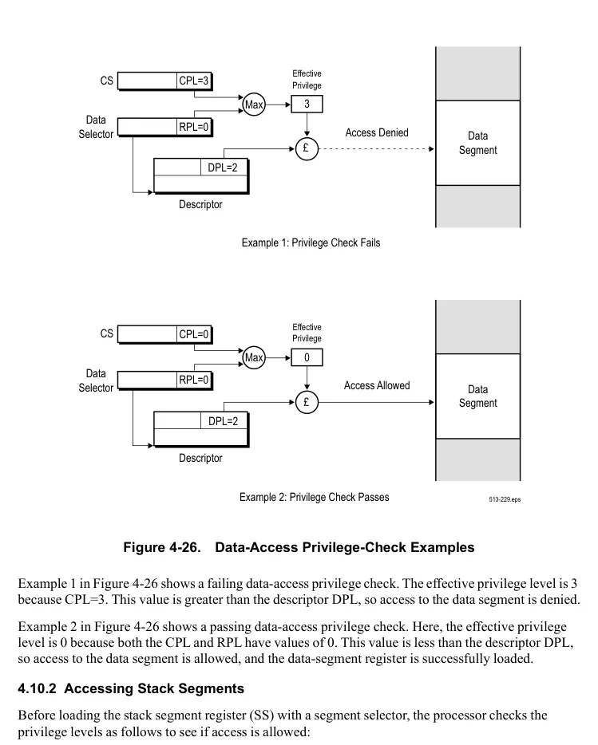

</details>


<!-- PDF source page: 170 | printed page: 108 -->

1. 1. The processor checks that the CPL and the stack-selector RPL are *equal*. If they are not equal, a general-protection exception (#GP) occurs and the SS register is not loaded.

1. 2. The processor compares the CPL with the DPL in the descriptor-table entry referenced by the segment selector. The two values *must be equal*. If they are not equal, a #GP occurs and the SS register is not loaded.

Figure 4-27 shows two examples of stack-access privilege checks. In Example 1 the CPL, stack-selector RPL, and stack segment-descriptor DPL are all equal, so access to the stack segment using the SS register is allowed. In Example 2, the stack-selector RPL and stack segment-descriptor DPL are both equal. However, the CPL is not equal to the stack segment-descriptor DPL, and access to the stack segment through the SS register is denied.

**Figure 4-27. Stack-Access Privilege-Check Examples**

<details>
<summary>Extracted figure labels</summary>

```text
CS
CPL=3
=
Stack
Selector
RPL=3
Access Allowed
Stack
Segment
DPL=3
Descriptor
Example 1: Privilege Check Passes
CS
CPL=2
=
Stack
Selector
RPL=3
Access Denied
Stack
Segment
DPL=3
Descriptor
Example 2: Privilege Check Fails
513-235.eps
```

</details>

<details>
<summary>Rendered source page 170 (figures/tables)</summary>

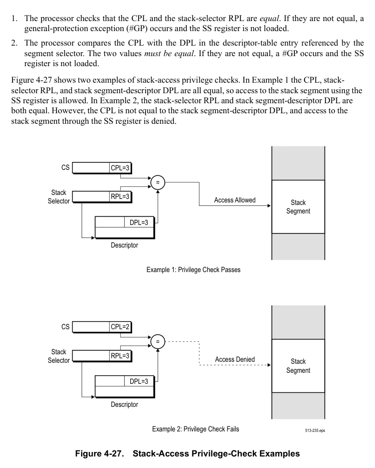

</details>


<!-- PDF source page: 171 | printed page: 109 -->

<a id="4-11-control-transfer-privilege-checks"></a>

## 4.11 Control-Transfer Privilege Checks

Control transfers between code segments (also called *far control transfers*) cause the processor to perform privilege checks to determine whether the source program is allowed to transfer control to the target program. If the privilege checks pass, access to the target code-segment is granted. When access is granted, the target code-segment selector is loaded into the CS register. The rIP register is updated with the target CS offset taken from either the far-pointer operand or the gate descriptor. Privilege checks are not performed during *near control transfers* because such transfers do not change segments.

The following mechanisms can be used by software to perform far control transfers:

- System-software control transfers using the *system-call* and *system-return* instructions. See “SYSCALL and SYSRET” on page 174 and “SYSENTER and SYSEXIT (Legacy Mode Only)” on page 176 for more information on these instructions. SYSCALL and SYSRET are the preferred method of performing control transfers in long mode. *SYSENTER and SYSEXIT are not supported in long mode.*
- Direct control transfers using CALL and JMP instructions. These are discussed in the next section, “Direct Control Transfers.”
- Call-gate control transfers using CALL and JMP instructions. These are discussed in “Control Transfers Through Call Gates” on page 113.
- Return control transfers using the RET instruction. These are discussed in “Return Control Transfers” on page 120.
- Interrupts and exceptions, including the INT*n* and IRET instructions. These are discussed in Chapter 8, “Exceptions and Interrupts.”
- Task switches initiated by CALL and JMP instructions. Task switches are discussed in Chapter 12, “Task Management.” *The hardware task-switch mechanism is not supported in long mode.*

<a id="4-11-1-direct-control-transfers"></a>

### 4.11.1 Direct Control Transfers

A *direct control transfer* occurs when software executes a far-CALL or a far-JMP instruction without using a call gate. The privilege checks and type of access allowed as a result of a direct control transfer depends on whether the target code segment is conforming or nonconforming. The code-segment-descriptor conforming (C) bit indicates whether or not the target code-segment is conforming (see “Conforming (C) Bit” on page 91 for more information on the conforming bit).

Privilege levels are not changed as a result of a direct control transfer. Program stacks are not automatically switched by the processor as they are with privilege-changing control transfers through call gates (see “Stack Switching” on page 117 for more information on automatic stack switching during privilege-changing control transfers).

**Nonconforming Code Segments.** Software can perform a direct control transfer to a nonconforming code segment only if the target code-segment descriptor DPL and the CPL are equal and the RPL is less than or equal to the CPL. Software must use a call gate to transfer control to a


<!-- PDF source page: 172 | printed page: 110 -->

more-privileged, nonconforming code segment (see “Control Transfers Through Call Gates” on page 113 for more information).

In far calls and jumps, the far pointer (CS:rIP) references the target code-segment descriptor. Before loading the CS register with a nonconforming code-segment selector, the processor checks as follows to see if access is allowed:

1. 1. *DPL = CPL Check*—The processor compares the target code-segment descriptor DPL with the currently executing program CPL. If they are equal, the processor performs the next check. If they are not equal, a general-protection exception (#GP) occurs.

1. 2. *RPL*  *CPL Check*—The processor compares the target code-segment selector RPL with the currently executing program CPL. If the RPL is less than or equal to the CPL, access is allowed. If the RPL is greater than the CPL, a #GP exception occurs.

If access is allowed, the processor loads the CS and rIP registers with their new values and begins executing from the target location. The CPL is *not changed*—the target-CS selector RPL value is disregarded when the selector is loaded into the CS register.

Figure 4-28 on page 111 shows three examples of privilege checks performed as a result of a far control transfer to a nonconforming code-segment. In Example 1, access is allowed because CPL = DPL and RPL CPL. In Example 2, access is denied because CPL DPL. In Example 3, access is denied because RPL  CPL.


<!-- PDF source page: 173 | printed page: 111 -->

**Figure 4-28. Nonconforming Code-Segment Privilege-Check Examples**

<details>
<summary>Extracted figure labels</summary>

```text
RPL=0
Code
Selector
Access
Allowed
£
Access Allowed
CS
CPL=2
?
Code
Segment
=
Access
Allowed
DPL=2
Descriptor
Example 1: Privilege Check Passes
RPL=0
Code
Selector
Access
Allowed
£
Access Denied
CS
CPL=2
?
Code
Segment
=
Access
Denied
DPL=3
Descriptor
Example 2: Privilege Check Fails
RPL=3
Code
Selector
Access
Denied
£
Access Denied
CS
CPL=2
?
Code
Segment
=
Access
Allowed
DPL=2
Descriptor
Example 3: Privilege Check Fails
513-230.eps
```

</details>

**Conforming Code Segments.** On a direct control transfer to a conforming code segment, the target code-segment descriptor DPL can be lower than (at a greater privilege) the CPL. Before loading the

<details>
<summary>Rendered source page 173 (figures/tables)</summary>

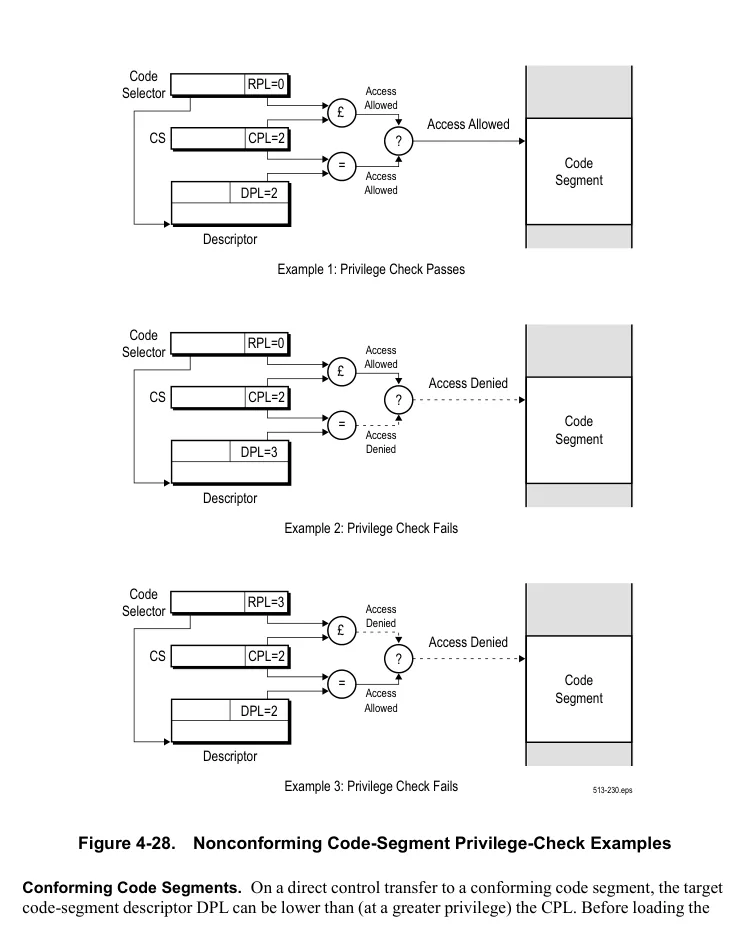

</details>


<!-- PDF source page: 174 | printed page: 112 -->

CS register with a conforming code-segment selector, the processor compares the target code-segment descriptor DPL with the currently-executing program CPL. If the DPL is less than or equal to the CPL, access is allowed. If the DPL is greater than the CPL, a #GP exception occurs.

On an access to a conforming code segment, the RPL is ignored and not involved in the privilege check.

When access is allowed, the processor loads the CS and rIP registers with their new values and begins executing from the target location. The CPL is *not changed*—the target CS-descriptor DPL value is disregarded when the selector is loaded into the CS register. The target program runs at the same privilege as the program that called it.

Figure 4-29 shows two examples of privilege checks performed as a result of a direct control transfer to a conforming code segment. In Example 1, access is allowed because the CPL of 3 is greater than the DPL of 0. As the target code selector is loaded into the CS register, the old CPL value of 3 replaces the target-code selector RPL value, and the target program executes with CPL=3. In Example 2, access is denied because CPL  DPL.

**Figure 4-29. Conforming Code-Segment Privilege-Check Examples**

<details>
<summary>Extracted figure labels</summary>

```text
Code
Selector
CS
CPL=3
Access Allowed
Code
Segment
³
DPL=0
Descriptor
Example 1: Privilege Check Passes
Code
Selector
CS
CPL=0
Access Denied
Code
Segment
³
DPL=3
Descriptor
Example 2: Privilege Check Fails
513-231.eps
```

</details>

<details>
<summary>Rendered source page 174 (figures/tables)</summary>

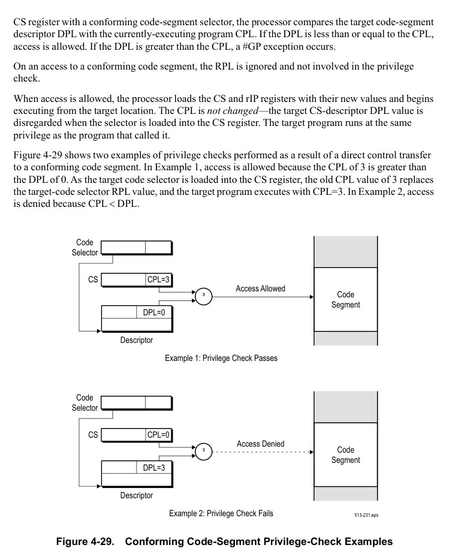

</details>


<!-- PDF source page: 175 | printed page: 113 -->

<a id="4-11-2-control-transfers-through-call-gates"></a>

### 4.11.2 Control Transfers Through Call Gates

Control transfers to more-privileged code segments are accomplished through the use of *call gates*. Call gates are a type of descriptor that contain pointers to code-segment descriptors and control access to those descriptors. System software uses call gates to establish protected entry points into system-service routines.

**Transfer Mechanism.** The pointer operand of a far-CALL or far-JMP instruction consists of two pieces: a code-segment selector (CS) and a code-segment offset (rIP). In a call-gate transfer, the CS selector points to a call-gate descriptor rather than a code-segment descriptor, and the rIP is ignored (but required by the instruction).

Figure 4-30 shows a call-gate control transfer in legacy mode. The call-gate descriptor contains segment-selector and segment-offset fields (see “Gate Descriptors” on page 95 for a detailed description of the call-gate format and fields). These two fields perform the same function as the pointer operand in a direct control-transfer instruction. The segment-selector field points to the target code-segment descriptor, and the segment-offset field is the instruction-pointer offset into the target code-segment. The code-segment base taken from the code-segment descriptor is added to the offset field in the call-gate descriptor to create the target virtual address (linear address).

**Figure 4-30. Legacy-Mode Call-Gate Transfer Mechanism**

<details>
<summary>Extracted figure labels</summary>

```text
Virtual-Address
Space
Far Pointer
Segment Selector
Instruction Offset
Descriptor Table
Call-Gate
Descriptor
DPL Code-Segment Selector
+
Virtual Address
Code-Segment Offset
Code Segment
DPL
Code-Segment Limit
Code-Segment Base
Code-Segment
Descriptor
513-233.eps
```

</details>

<details>
<summary>Rendered source page 175 (figures/tables)</summary>

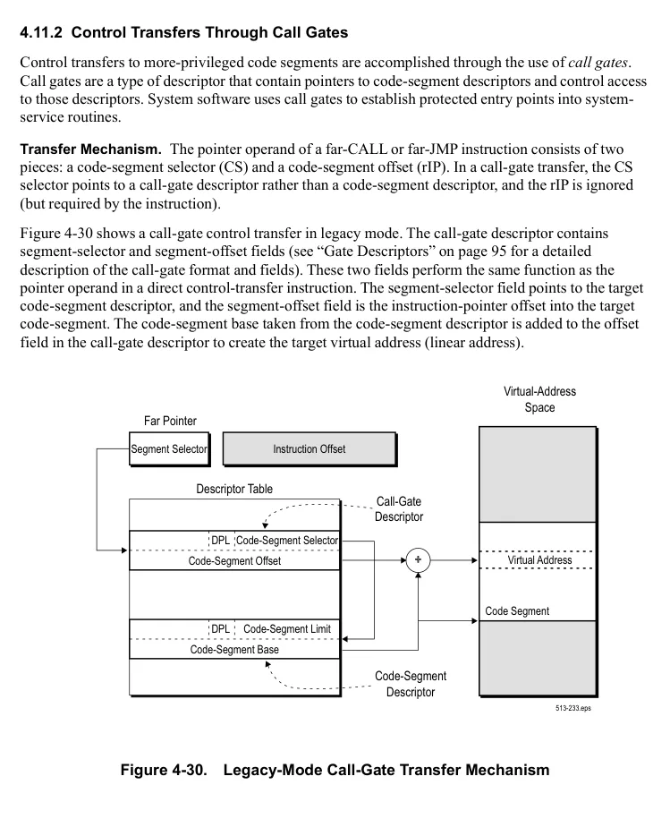

</details>


<!-- PDF source page: 176 | printed page: 114 -->

Figure 4-31 shows a call-gate control transfer in long mode. The long-mode call-gate descriptor format is expanded by 64 bits to hold a full 64-bit offset into the virtual-address space. Only long-mode call gates can be referenced in long mode (64-bit mode and compatibility mode). The legacy-mode 32-bit call-gate types are redefined in long mode as 64-bit types, and 16-bit call-gate types are illegal.

**Figure 4-31. Long-Mode Call-Gate Access Mechanism**

<details>
<summary>Extracted figure labels</summary>

```text
Far Pointer
Virtual-Address
Space
Segment Selector
Instruction Offset
Call-Gate
Descriptor
Descriptor Table
Code-Segment Offset (63:32)
DPL Code-Segment Selector
Virtual Address
Code-Segment Offset (31:0)
DPL
Code-Segment Limit
Code-Segment Base
Code-Segment
Descriptor
Flat Code-Segment
Unused
513-234.eps
```

</details>

A long-mode call gate must reference a 64-bit code-segment descriptor. In 64-bit mode, the code-segment descriptor base-address and limit fields are ignored. The target virtual-address is the 64-bit offset field in the expanded call-gate descriptor.

**Privilege Checks.** Before loading the CS register with the code-segment selector located in the call gate, the processor performs three privilege checks. The following checks are performed when either conforming or nonconforming code segments are referenced:

1. 1. The processor compares the CPL with the call-gate DPL from the call-gate descriptor (DPLG). The CPL must be numerically *less than or equal to* DPLG for this check to pass. In other words, the following expression must be true: CPL DPLG.

<details>
<summary>Rendered source page 176 (figures/tables)</summary>

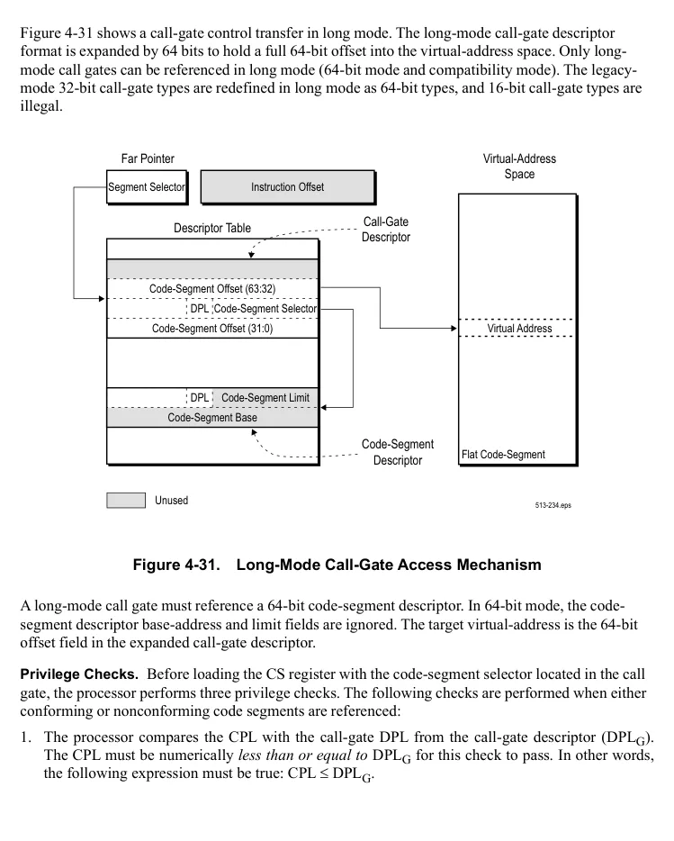

</details>


<!-- PDF source page: 177 | printed page: 115 -->

1. 2. The processor compares the RPL in the call-gate selector with DPLG. The RPL must be numerically *less than or equal to* DPLG for this check to pass. In other words, the following expression must be true: RPL DPLG.

1. 3. The processor compares the CPL with the target code-segment DPL from the code-segment descriptor (DPLS). The type of comparison varies depending on the type of control transfer.
- When a call—or a jump to a *conforming* code segment—is used to transfer control through a call gate, the CPL must be numerically *greater than or equal to* DPLS for this check to pass. (This check prevents control transfers to less-privileged programs.) In other words, the following expression must be true: CPL DPLS.
- When a JMP instruction is used to transfer control through a call gate to a *nonconforming* code segment, the CPL must be numerically *equal to* DPLS for this check to pass. (JMP instructions cannot change CPL.) In other words, the following expression must be true: CPL = DPLS.

Figure 4-32 on page 116 shows two examples of call-gate privilege checks. In Example 1, all privilege checks pass as follows:

- The call-gate DPL (DPLG) is at the lowest privilege (3), specifying that software running at any privilege level (CPL) can access the gate.
- The selector referencing the call gate passes its privilege check because the RPL is numerically less than or equal to DPLG.
- The target code segment is at the highest privilege level (DPLS = 0). This means software running at any privilege level can access the target code segment through the call gate.


<!-- PDF source page: 178 | printed page: 116 -->

**Figure 4-32. Privilege-Check Examples for Call Gates**

<details>
<summary>Extracted figure labels</summary>

```text
CS
CPL=2
Call-Gate
Selector
RPL=3
DPLG=3
Code
Segment
Call-Gate Descriptor
DPLS=0
Access Allowed
Code-Segment Descriptor
Example 1: Privilege Check Passes
CS
CPL=2
Call-Gate
Selector
RPL=3
DPLG=0
Code
Segment
Call-Gate Descriptor
DPLS=3
Access Denied
Code-Segment Descriptor
Example 2: Privilege Check Fails
513-232.eps
```

</details>

In Example 2, all privilege checks fail as follows:

- The call-gate DPL (DPLG) specifies that only software at privilege-level 0 can access the gate. The current program does not have enough privilege to access the call gate because its CPL is 2.
- The selector referencing the call-gate descriptor does not have enough privilege to complete the reference. Its RPL is numerically greater than DPLG.

<details>
<summary>Rendered source page 178 (figures/tables)</summary>

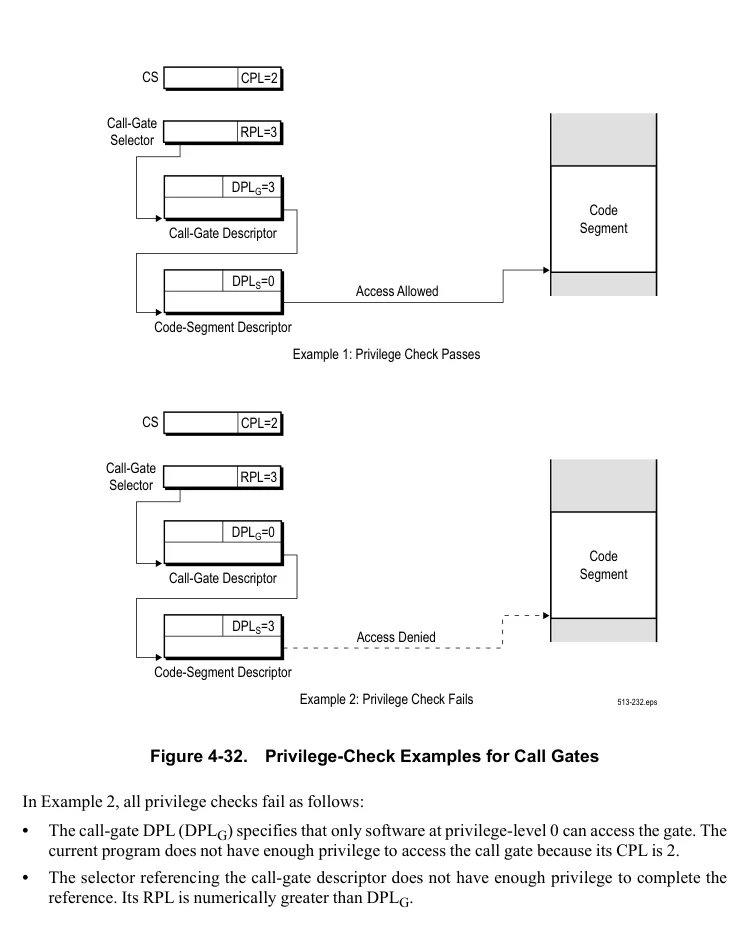

</details>


<!-- PDF source page: 179 | printed page: 117 -->

- The target code segment is at a lower privilege (DPLS = 3) than the currently running software (CPL = 2). Transitions from more-privileged software to less-privileged software are not allowed, so this privilege check fails as well.

Although all three privilege checks failed in Example 2, failing only one check is sufficient to deny access into the target code segment.

**Stack Switching.** The processor performs an automatic stack switch when a control transfer causes a change in privilege levels to occur. Switching stacks isolates more-privileged software stacks from less-privileged software stacks and provides a mechanism for saving the return pointer back to the program that initiated the call.

When switching to more-privileged software, as is done when transferring control using a call gate, the processor uses the corresponding stack pointer (privilege-level 0, 1, or 2) stored in the task-state segment (TSS). The format of the stack pointer stored in the TSS depends on the system-software operating mode:

- Legacy-mode system software stores a 32-bit ESP value (stack offset) and 16-bit SS selector register value in the TSS for each of three privilege levels 0, 1, and 2.
- Long-mode system software stores a 64-bit RSP value in the TSS for privilege levels 0, 1, and 2. No SS register value is stored in the TSS because in long mode a call gate *must* reference a 64-bit code-segment descriptor. 64-bit mode does not use segmentation, and the stack pointer consists solely of the 64-bit RSP. Any value loaded in the SS register is ignored.

See “Task-Management Resources” on page 367 for more information on the legacy-mode and long-mode TSS formats.

Figure 4-33 on page 118 shows a 32-bit stack in legacy mode before and after the automatic stack switch. This particular example assumes that parameters are passed from the current program to the target program. The process followed by legacy mode in switching stacks and copying parameters is:

1. 1. The target code-segment DPL is read by the processor and used as an index into the TSS for selecting the new stack pointer (SS:ESP). For example, if DPL=1 the processor selects the SS:ESP for privilege-level 1 from the TSS.

1. 2. The SS and ESP registers are loaded with the new SS:ESP values read from the TSS.

1. 3. The old values of the SS and ESP registers are pushed onto the stack pointed to by the new SS:ESP.

1. 4. The 5-bit count field is read from the call-gate descriptor.

1. 5. The number of parameters specified in the count field (up to 31) are copied from the old stack to the new stack. The size of the parameters copied by the processor depends on the call-gate size: 32-bit call gates copy 4-byte parameters and 16-bit call gates copy 2-byte parameters.

1. 6. The return pointer is pushed onto the stack. The return pointer consists of the current CS-register value and the EIP of the instruction following the calling instruction.


<!-- PDF source page: 180 | printed page: 118 -->

1. 7. The CS register is loaded from the segment-selector field in the call-gate descriptor, and the EIP is loaded from the offset field in the call-gate descriptor.

1. 8. The target program begins executing with the instruction referenced by new CS:EIP.

**Figure 4-33. Legacy-Mode 32-Bit Stack Switch, with Parameters**

<details>
<summary>Extracted figure labels</summary>

```text
Old
32-Bit Stack
Before CALL
New
32-Bit Stack
After CALL
Old SS
Old ESP
+(n*4)+12
+(n*4)+8
Parameter 1
Parameter 2
+(n-2)*4
+(n-1)*4
Parameter 1
Parameter 2
+(n*4)+4
+(n*4)
Parameter n
. . .
Parameter n
. . .
Old SS:ESP
+8
Old CS
+4
New SS:ESP
Old EIP
Stack Switch
513-224.eps
```

</details>

Figure 4-34 shows a 32-bit stack in legacy mode before and after the automatic stack switch when no parameters are passed (count=0). Most software does not use the call-gate descriptor count-field to pass parameters. System software typically defines linkage mechanisms that do not rely on automatic parameter copying.

**Figure 4-34. 32-Bit Stack Switch, No Parameters—Legacy Mode**

<details>
<summary>Extracted figure labels</summary>

```text
Old
32-Bit Stack
Before CALL
New
32-Bit Stack
After CALL
+12
Old ESP
Old SS
+8
Old CS
+4
Old EIP
Old SS:ESP
New SS:ESP
Stack Switch
513-225.eps
```

</details>

Figure 4-35 on page 119 shows a long-mode stack switch. In long mode, all call gates *must* reference 64-bit code-segment descriptors, so a long-mode stack switch uses a 64-bit stack. The process of

<details>
<summary>Rendered source page 180 (figures/tables)</summary>

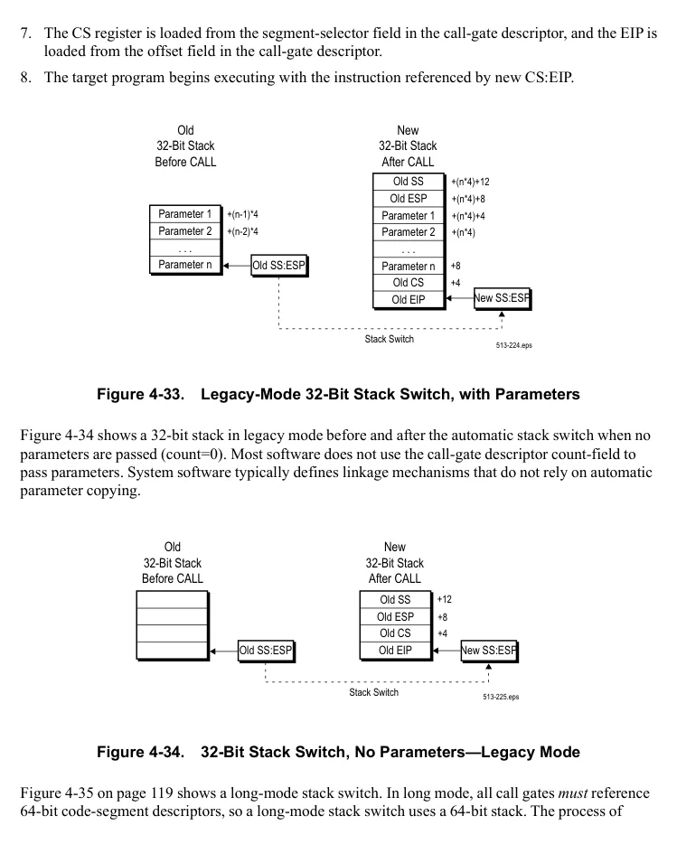

</details>


<!-- PDF source page: 181 | printed page: 119 -->

switching stacks in long mode is similar to switching in legacy mode when no parameters are passed. The process is as follows:

1. 1. The target code-segment DPL is read by the processor and used as an index into the 64-bit TSS for selecting the new stack pointer (RSP).

1. 2. The RSP register is loaded with the new RSP value read from the TSS. The SS register is loaded with a null selector (SS0). Setting the new SS selector to null allows proper handling of nested control transfers in 64-bit mode. See “Nested Returns to 64-Bit Mode Procedures” on page 121 for additional information. As in legacy mode, it is desirable to keep the stack-segment requestor privilege-level (SS.RPL) equal to the current privilege-level (CPL). When using a call gate to change privilege levels, the SS.RPL is updated to reflect the new CPL. The SS.RPL is restored from the return-target CS.RPL on the subsequent privilege-level-changing far return.

1. 3. The old values of the SS and RSP registers are pushed onto the stack pointed to by the new RSP. The old SS value is popped on a subsequent far return. This allows system software to set up the SS selector for a compatibility-mode process by executing a RET (or IRET) that changes the privilege level.

1. 4. The return pointer is pushed onto the stack. The return pointer consists of the current CS-register value and the RIP of the instruction following the calling instruction.

1. 5. The CS register is loaded from the segment-selector field in the long-mode call-gate descriptor, and the RIP is loaded from the offset field in the long-mode call-gate descriptor.

The target program begins execution with the instruction referenced by the new RIP.

**Figure 4-35. Stack Switch—Long Mode**

<details>
<summary>Extracted figure labels</summary>

```text
Old
64-Bit Stack
Before CALL
New
64-Bit Stack
After CALL
+24
Old RSP
Old SS
+16
Old CS
+8
New RSP
Old SS:RSP
Old RIP
(SS=0 + new_CPL)
Stack Switch
513-226.eps
```

</details>

All long-mode stack pushes resulting from a privilege-level-changing far call are eight-bytes wide and increment the RSP by eight. Long mode ignores the call-gate count field and does not support the automatic parameter-copy feature found in legacy mode. Software can access parameters on the old stack, if necessary, by referencing the old stack segment selector and stack pointer saved on the new process stack.

<details>
<summary>Rendered source page 181 (figures/tables)</summary>

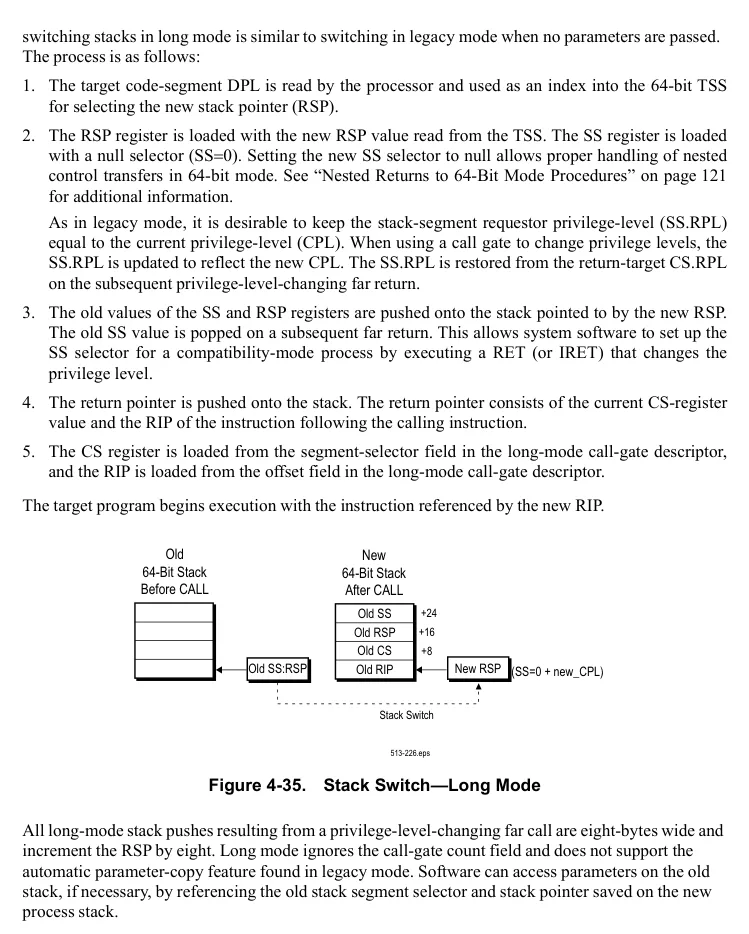

</details>


<!-- PDF source page: 182 | printed page: 120 -->

<a id="4-11-3-return-control-transfers"></a>

### 4.11.3 Return Control Transfers

Returns to calling programs can be performed by using the RET instruction. The following types of returns are possible:

- *Near Return*—Near returns perform control transfers within the same code segment, so the CS register is unchanged. The new offset is popped off the stack and into the rIP register. No privilege checks are performed.
- *Far Return, Same Privilege*—A far return transfers control from one code segment to another. When the original code segment is at the same privilege level as the target code segment, a far pointer (CS:rIP) is popped off the stack and the RPL of the new code segment (CS) is checked. If the requested privilege level (RPL) matches the current privilege level (CPL), then a return is made to the same privilege level. This prevents software from changing the CS value on the stack in an attempt to return to higher-privilege software.
- *Far Return, Less Privilege*—Far returns can change privilege levels, but only to a *lower*-privilege level. In this case a stack switch is performed between the current, higher-privilege program and the lower-privilege return program. The CS-register and rIP-register values are popped off the stack. The lower-privilege stack pointer is also popped off the stack and into the SS register and rSP register. The processor checks both the CS and SS privilege levels to ensure they are equal and at a lesser privilege than the current CS. In the case of nested returns to 64-bit mode, a null selector can be popped into the SS register. See “Nested Returns to 64-Bit Mode Procedures” on page 121. Far returns also check the privilege levels of the DS, ES, FS and GS selector registers. If any of these segment registers have a selector with a higher privilege than the return program, the segment register is loaded with the null selector.

**Stack Switching.** The stack switch performed by a far return to a lower-privilege level reverses the stack switch of a call gate to a higher-privilege level, except that parameters are never automatically copied as part of a return. The process followed by a far-return stack switch in long mode and legacy mode is:

1. 1. The return code-segment RPL is read by the processor from the CS value stored on the stack to determine that a lower-privilege control transfer is occurring.

1. 2. The return-program instruction pointer is popped off the current-program (higher privilege) stack and loaded into the CS and rIP registers.

1. 3. The return instruction can include an immediate operand that specifies the number of additional bytes to be popped off of the stack. These bytes may correspond to the parameters pushed onto the stack previously by a call through a call gate containing a non-zero parameter-count field. If the return includes the immediate operand, then the stack pointer is adjusted upward by adding the specified number of bytes to the rSP.

1. 4. The return-program stack pointer is popped off the current-program (higher privilege) stack and loaded into the SS and rSP registers. In the case of nested returns to 64-bit mode, a null selector can be popped into the SS register.


<!-- PDF source page: 183 | printed page: 121 -->

The operand size of a far return determines the size of stack pops when switching stacks. If a far return is used in 64-bit mode to return from a prior call through a long-mode call gate, the far return must use a 64-bit operand size. The 64-bit operand size allows the far return to properly read the stack established previously by the far call.

**Nested Returns to 64-Bit Mode Procedures.** In long mode, a far call that changes privilege levels causes the SS register to be loaded with a null selector (this is the same action taken by an interrupt in long mode). If the called procedure performs another far call to a higher-privileged procedure, or is interrupted, the null SS selector is pushed onto the stack frame, and another null selector is loaded into the SS register. Using a null selector in this way allows the processor to properly handle returns nested within 64-bit-mode procedures and interrupt handlers.

Normally, a RET that pops a null selector into the SS register causes a general-protection exception (#GP) to occur. However, in long mode, the null selector acts as a flag indicating the existence of nested interrupt handlers or other privileged software in 64-bit mode. Long mode allows RET to pop a null selector into SS from the stack under the following conditions:

- The target mode is 64-bit mode.
- The target CPL is less than 3.

In this case, the processor does not load an SS descriptor, and the null selector is loaded into SS without causing a #GP exception.

<a id="4-12-limit-checks"></a>

## 4.12 Limit Checks

Except in 64-bit mode, limit checks are performed by all instructions that reference memory. Limit checks detect attempts to access memory outside the current segment boundary, attempts at executing instructions outside the current code segment, and indexing outside the current descriptor table. If an instruction fails a limit check, either (1) a general-protection exception occurs for all other segment-limit violations or (2) a stack-fault exception occurs for stack-segment limit violations.

In 64-bit mode, segment limits are *not checked* during accesses to any segment referenced by the CS, DS, ES, FS, GS, and SS selector registers. Instead, the processor checks that the virtual addresses used to reference memory are in canonical-address form. In 64-bit mode, as with legacy mode and compatibility mode, descriptor-table limits *are checked*.

<a id="4-12-1-determining-limit-violations"></a>

### 4.12.1 Determining Limit Violations

To determine segment-limit violations, the processor checks a virtual (linear) address to see if it falls outside the valid range of segment offsets determined by the segment-limit field in the descriptor. If any part of an operand or instruction falls outside the segment-offset range, a limit violation occurs. For example, a doubleword access, two bytes from an upper segment boundary, causes a segment violation because half of the doubleword is outside the segment.


<!-- PDF source page: 184 | printed page: 122 -->

Three bits from the descriptor entry are used to control how the segment-limit field is interpreted: the granularity (G) bit, the default operand-size (D) bit, and for data segments, the expand-down (E) bit. See “Legacy Segment Descriptors” on page 88 for a detailed description of each bit.

For all segments other than expand-down segments, the minimum segment-offset is 0. The maximum segment-offset depends on the value of the G bit:

- If G=0 (byte granularity), the maximum allowable segment-offset is equal to the value of the segment-limit field.
- If G=1 (4096-byte granularity), the segment-limit field is first scaled by 4096 (1000h). Then 4095 (0FFFh) is added to the scaled value to arrive at the maximum allowable segment-offset, as shown in the following equation: maximum segment-offset  (limit  1000h)  0FFFh For example, if the segment-limit field is 0100h, then the maximum allowable segment-offset is (0100h 1000h) 0FFFh 10_1FFFh.

In both cases, the maximum segment-size is specified when the descriptor segment-limit field is 0F_FFFFh.

**Expand-Down Segments.** Expand-down data segments are supported in legacy mode and compatibility mode but not in 64-bit mode. With expand-down data segments, the maximum segment offset depends on the value of the D bit in the data-segment descriptor:

- If D=0 the maximum segment-offset is 0_FFFFh.
- If D=1 the maximum segment-offset is 0_FFFF_FFFFh.

The minimum allowable segment offset in expand-down segments depends on the value of the G bit:

- If G=0 (byte granularity), the minimum allowable segment offset is the segment-limit value plus 1. For example, if the segment-limit field is 0100h, then the minimum allowable segment-offset is 0101h.
- If G=1 (4096-byte granularity), the segment-limit value in the descriptor is first scaled by 4096 (1000h), and then 4095 (0FFFh) is added to the scaled value to arrive at a scaled segment-limit value. The minimum allowable segment-offset is this scaled segment-limit value plus 1, as shown in the following equation: minimum segment-offset  (limit  1000)  0FFFh  1 For example, if the segment-limit field is 0100h, then the minimum allowable segment-offset is (0100h 1000h) 0FFFh  1 10_1000h.

For expand-down segments, the maximum segment size is specified when the segment-limit value is 0.


<!-- PDF source page: 185 | printed page: 123 -->

<a id="4-12-2-data-limit-checks-in-64-bit-mode"></a>

### 4.12.2 Data Limit Checks in 64-bit Mode

In 64-bit mode, data reads and writes are not normally checked for segment-limit violations. When EFER.LMSLE = 1, reads and writes in 64-bit mode at CPL &gt; 0, using the DS, ES, FS, or SS segments, have a segment-limit check applied.

This limit-check uses the 32-bit segment-limit to find the maximum allowable address in the top 4GB of the 64-bit virtual (linear) address space.

**Table 4-8. Segment Limit Checks in 64-Bit Mode**

| Memory Address | Effect of Limit Check |
| --- | --- |
| Linear Address £ (0FFFFFFFF 00000000h + 32-bit Limit) | Access OK. |
| Linear Address > (0FFFFFFFF 00000000h + 32-bit Limit) | Exception (#GP or #SS) |

This segment-limit check does not apply to accesses through the GS segment, or to code reads. If the DS, ES, FS, or SS segment is null or expand-down, the effect of the limit check is undefined. Data segment limit checking in 64-bit mode is not supported by all processor implementations and has been deprecated. If CPUID Fn8000_0008_EBX[EferLmlseUnsupported](bit 20) = 1, 64-bit mode segment limit checking is not supported and attempting to enable this feature by setting EFER.LMSLE =1 will result in a #GP exception.

<a id="4-13-type-checks"></a>

## 4.13 Type Checks

Type checks prevent software from using descriptors in invalid ways. Failing a type check results in an exception. Type checks are performed using five bits from the descriptor entry: the S bit and the 4-bit Type field. Together, these five bits are used to specify the descriptor type (code, data, segment, or gate) and its access characteristics. See “Legacy Segment Descriptors” on page 88 for a detailed description of the S bit and Type-field encodings. Type checks are performed by the processor in compatibility mode as well as legacy mode. Limited type checks are performed in 64-bit mode.

<a id="4-13-1-type-checks-in-legacy-and-compatibility-modes"></a>

### 4.13.1 Type Checks in Legacy and Compatibility Modes

The type checks performed in legacy mode and compatibility mode are listed in the following sections.

**Descriptor-Table Register Loads.** Loads into the LDTR and TR descriptor-table registers are checked for the appropriate system-segment type. The LDTR can only be loaded with an LDT descriptor, and the TR only with a TSS descriptor. The checks are performed during any action that causes these registers to be loaded. This includes execution of the LLDT and LTR instructions and during task switches.

**Segment Register Loads.** The following restrictions are placed on the segment-descriptor types that can be loaded into the six user segment registers:

- Only code segments can be loaded into the CS register.
- Only writable data segments can be loaded into the SS register.

<details>
<summary>Rendered source page 185 (figures/tables)</summary>

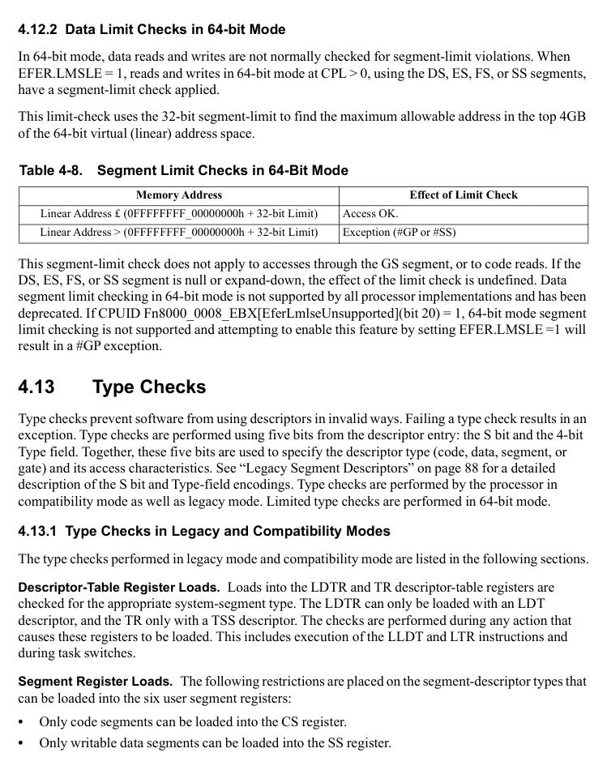

</details>


<!-- PDF source page: 186 | printed page: 124 -->

- Only the following segment types can be loaded into the DS, ES, FS, or GS registers:
- Read-only or read/write data segments.
- Readable code segments.

These checks are performed during any action that causes the segment registers to be loaded. This includes execution of the MOV segment-register instructions, control transfers, and task switches.

**Control Transfers.** Control transfers (branches and interrupts) place additional restrictions on the segment types that can be referenced during the transfer:

- The segment-descriptor type referenced by far CALLs and far JMPs must be one of the following:
- A code segment
- A call gate or a task gate
- An available TSS (only allowed in legacy mode)
- A task gate (only allowed in legacy mode)
- Only code-segment descriptors can be referenced by call-gate, interrupt-gate, and trap-gate descriptors.
- Only TSS descriptors can be referenced by task-gate descriptors.
- The link field (selector) in the TSS can only point to a TSS descriptor. This is checked during an IRET control transfer to a task.
- The far RET and far IRET instructions can only reference code-segment descriptors.
- The interrupt-descriptor table (IDT), which is referenced during interrupt control transfers, can only contain interrupt gates, trap gates, and task gates.

**Segment Access.** After a segment descriptor is successfully loaded into one of the segment registers, reads and writes into the segments are restricted in the following ways:

- Writes are not allowed into read-only data-segment types.
- Writes are not allowed into code-segment types (executable segments).
- Reads from code-segment types are not allowed if the readable (R) type bit is cleared to 0.

These checks are generally performed during execution of instructions that access memory.

<a id="4-13-2-long-mode-type-check-differences"></a>

### 4.13.2 Long Mode Type Check Differences

**Compatibility Mode and 64-Bit Mode.** The following type checks differ in long mode (64-bit mode and compatibility mode) as compared to legacy mode:

- *System Segments*—System-segment types are checked, but the following types that are valid in legacy mode are illegal in long mode:
- 16-bit available TSS.
- 16-bit busy TSS.


<!-- PDF source page: 187 | printed page: 125 -->

- Type-field encoding of 00h in the upper half of a system-segment descriptor to indicate an illegal type and prevent access as a legacy descriptor.
- *Gates*—Gate-descriptor types are checked, but the following types that are valid in legacy mode are illegal in long mode:
- 16-bit call gate.
- 16-bit interrupt gate.
- 16-bit trap gate.
- Task gate.

**64-Bit Mode.** 64-bit mode disables segmentation, and most of the segment-descriptor fields are ignored. The following list identifies situations where type checks in 64-bit mode differ from those in compatibility mode and legacy mode:

- *Code Segments*—The readable (R) type bit is ignored in 64-bit mode. None of the legacy type-checks that prevent reads from or writes into code segments are performed in 64-bit mode.
- *Data Segments*—Data-segment type attributes are ignored in 64-bit mode. The writable (W) and expand-down (E) type bits are ignored. All data segments are treated as writable.
