<!-- PDF source page: 188 | printed page: 126 -->

<a id="5-page-translation-and-protection"></a>

# 5 Page Translation and Protection

The x86 page-translation mechanism (or simply *paging mechanism*) enables system software to create separate address spaces for each process or application. These address spaces are known as *virtual-address* spaces. System software uses the paging mechanism to selectively map individual pages of physical memory into the virtual-address space using a set of hierarchical address-translation tables known collectively as *page tables*.

The paging mechanism and the page tables are used to provide each process with its own private region of physical memory for storing its code and data. Processes can be protected from each other by isolating them within the virtual-address space. A process cannot access physical memory that is not mapped into its virtual-address space by system software.

System software can use the paging mechanism to selectively map physical-memory pages into multiple virtual-address spaces. Mapping physical pages in this manner allows them to be shared by multiple processes and applications. The physical pages can be configured by the page tables to allow read-only access. This prevents applications from altering the pages and ensures their integrity for use by all applications.

Shared mapping is typically used to allow access of shared-library routines by multiple applications. A read-only copy of the library routine is mapped to each application virtual-address space, but only a single copy of the library routine is present in physical memory. This capability also allows a copy of the operating-system kernel and various device drivers to reside within the application address space. Applications are provided with efficient access to system services without requiring costly address-space switches.

The system-software portion of the address space necessarily includes system-only data areas that must be protected from accesses by applications. System software uses the page tables to protect this memory by designating the pages as *supervisor* pages. Such pages are only accessible by system software.

When the supervisor mode execution prevention (SMEP) feature is supported and enabled, attempted instruction fetches from user-mode accessible pages while in supervisor-mode triggers a page fault (#PF). This protects the integrity of system software by preventing the execution of instructions at a supervisor privilege level (CPL &lt; 3) when these instructions could have been written or modified by user-mode code.

When the supervisor mode access prevention (SMAP) feature is supported and enabled and RFLAGS.AC=0, some attempted explicit data accesses from user-mode accessible pages while in supervisor-mode trigger a page fault (#PF). This protects the integrity of system software by preventing the use of data at a supervisor privilege level (CPL &lt; 3) that could have been modified by user-mode code. Supervisor software that requires access to data which is marked as user-mode accessible may temporarily suppress SMAP checks by modifying RFLAGS.AC, such as with the CLAC/STAC instructions.


<!-- PDF source page: 189 | printed page: 127 -->

Finally, system software can use the paging mechanism to map multiple, large virtual-address spaces into a much smaller amount of physical memory. Each application can use the entire 32-bit or 64-bit virtual-address space. System software actively maps the most-frequently-used virtual-memory pages into the available pool of physical-memory pages. The least-frequently-used virtual-memory pages are swapped out to the hard drive. This process is known as *demand-paged virtual memory*.

<a id="5-1-page-translation-overview"></a>

## 5.1 Page Translation Overview

The legacy x86 architecture provides support for translating 32-bit virtual addresses into 32-bit physical addresses (larger physical addresses, such as 36-bit or 40-bit addresses, are supported as a special mode). The AMD64 architecture enhances this support to allow translation of 64-bit virtual addresses into 52-bit physical addresses, although processor implementations can support smaller virtual-address and physical-address spaces.

Virtual addresses are translated to physical addresses through hierarchical translation tables created and managed by system software. Each table contains a set of entries that point to the next-lower table in the translation hierarchy. A single table at one level of the hierarchy can have hundreds of entries, each of which points to a unique table at the next-lower hierarchical level. Each lower-level table can in turn have hundreds of entries pointing to tables further down the hierarchy. The lowest-level table in the hierarchy points to the translated physical page.

Figure 5-1 on page 128 shows an overview of the page-translation hierarchy used in long mode. Legacy mode paging uses a subset of this translation hierarchy (the page-map level-4 table does not exist in legacy mode and the PDP table may or may not be used, depending on which paging mode is enabled). The 5th level of translation, Page Map Level 5, only exists when 5-Level paging is enabled. As this figure shows, a virtual address is divided into fields, each of which is used as an offset into a translation table. The complete translation chain is made up of all table entries referenced by the virtual-address fields. The lowest-order virtual-address bits are used as the byte offset into the physical page.


<!-- PDF source page: 190 | printed page: 128 -->

**Figure 5-1. Virtual to Physical Address Translation—Long Mode**

<details>
<summary>Extracted figure labels</summary>

```text
64-Bit Virtual Address
63
0
Physical Page
Offset
Sign
Extension
Page Map
Level-5 Offset
Page Directory
Offset
Page Map
Level-4 Offset
Page Map
Level-4 Offset
Page Directory
Pointer Offset
Page Table
Offset
PDPE
PTE
PML4E
PDE
PML5E
Physical
Address
Page Map
Level 5
Table
Page Directory Pointer
Table
Page Directory
Table
Physical Page
Frame
Page
Table
Page Map
Level 4
Table
(when 5-Level
paging is enabled)
Page Map Base Register
CR3
513-333.eps
```

</details>

The following physical-page sizes are supported: 4 Kbytes, 2 Mbytes, 4 Mbytes, and 1 Gbytes. In long mode 4-Kbyte, 2-MByte, and 1-GByte sizes are available. In legacy mode 4-Kbyte, 2-MByte, and 4-MByte sizes are available.

Virtual addresses are 32 bits long, and physical addresses up to the supported physical-address size can be used. The AMD64 architecture enhances the legacy translation support by allowing virtual addresses of up to 64 bits long to be translated into physical addresses of up to 52 bits long.

<details>
<summary>Rendered source page 190 (figures/tables)</summary>

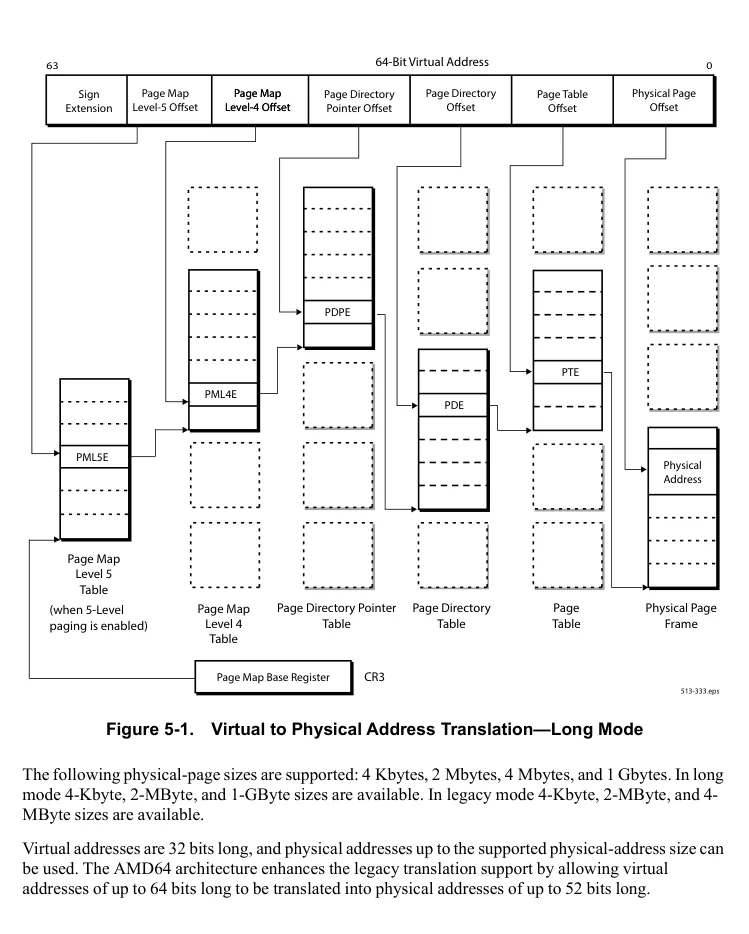

</details>


<!-- PDF source page: 191 | printed page: 129 -->

Currently, the AMD64 architecture defines a mechanism for translating 48-bit virtual addresses to 52-bit physical addresses. The mechanism used to translate a full 64-bit virtual address is reserved and will be described in a future AMD64 architectural specification.

<a id="5-1-1-page-translation-options"></a>

### 5.1.1 Page-Translation Options

The form of page-translation support available to software depends on which paging features are enabled. Four controls are available for selecting the various paging alternatives:

- Page-Translation Enable (CR0.PG)
- Physical-Address Extensions (CR4.PAE)
- Page-Size Extensions (CR4.PSE)
- Long-Mode Active (EFER.LMA)

Not all paging alternatives are available in all modes. Table 5-1 summarizes the paging support available in each mode.

**Table 5-1. Supported Paging Alternatives (CR0.PG=1)**

| Mode | Physical-<br>Address<br>Extensions<br>(CR4.PAE) | Page-Size<br>Extensions<br>(CR4.PSE) | Page-<br>Directory<br>Pointer Offset | Page-<br>Directory<br>Page Size | Resulting<br>Physical-<br>Page Size | Maximum<br>Virtual<br>Address | Maximum<br>Physical<br>Address |
| --- | --- | --- | --- | --- | --- | --- | --- |
| Long Mode<br>(64-bit and<br>compatibility<br>modes) | Enabled | – | PDPE.PS=0 | PDE.PS=0 | 4 Kbyte | 64-bit | 52-bit |
| Long Mode<br>(64-bit and<br>compatibility<br>modes) | Enabled | – |  | PDE.PS=1 | 2 Mbyte |  |  |
| Long Mode<br>(64-bit and<br>compatibility<br>modes) | Enabled | – | PDPE.PS=1 | – | 1 Gbyte |  |  |
| Legacy Mode | Enabled | – | PDPE.PS=0 | PDE.PS=0 | 4 Kbyte | 32-bit | 52-bit |
| Legacy Mode | Enabled | – |  | PDE.PS=1 | 2 Mbyte |  | 52-bit |
| Legacy Mode | Disabled | Disabled |  | – | 4 Kbyte |  | 32-bit |
| Legacy Mode | Disabled | Enabled |  | PDE.PS=0 | 4 Kbyte |  | 32-bit |
| Legacy Mode | Disabled | Enabled |  | PDE.PS=1 | 4 Mbyte |  | 40-bit |

<a id="5-1-2-page-translation-enable-pg-bit"></a>

### 5.1.2 Page-Translation Enable (PG) Bit

Page translation is controlled by the PG bit in CR0 (bit 31). When CR0.PG is set to 1, page translation is enabled. When CR0.PG is cleared to 0, page translation is disabled.

The AMD64 architecture uses CR0.PG to activate and deactivate long mode when long mode is enabled. See “Enabling and Activating Long Mode” on page 489 for more information.

<a id="5-1-3-physical-address-extensions-pae-bit"></a>

### 5.1.3 Physical-Address Extensions (PAE) Bit

Physical-address extensions are controlled by the PAE bit in CR4 (bit 5). When CR4.PAE is set to 1, physical-address extensions are enabled. When CR4.PAE is cleared to 0, physical-address extensions are disabled.

<details>
<summary>Rendered source page 191 (figures/tables)</summary>

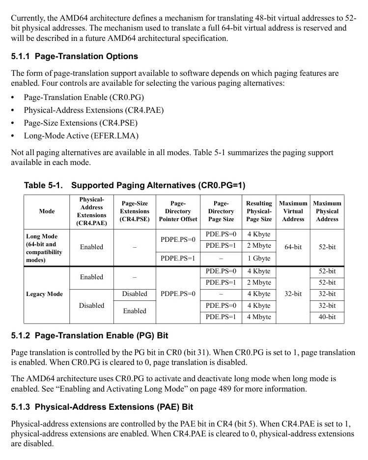

</details>


<!-- PDF source page: 192 | printed page: 130 -->

Setting CR4.PAE = 1 enables virtual addresses to be translated into physical addresses up to 52 bits long. This is accomplished by doubling the size of paging data-structure entries from 32 bits to 64 bits to accommodate the larger physical base-addresses for physical-pages.

PAE must be enabled before activating long mode. See “Enabling and Activating Long Mode” on page 489.

<a id="5-1-4-page-size-extensions-pse-bit"></a>

### 5.1.4 Page-Size Extensions (PSE) Bit

Page-size extensions are controlled by the PSE bit in CR4 (bit 4). Setting CR4.PSE to 1 allows operating-system software to use 4-Mbyte physical pages in the translation process. The 4-Mbyte physical pages can be mixed with standard 4-Kbyte physical pages or replace them entirely. The selection of physical-page size is made on a page-directory-entry basis. See “Page Size (PS) Bit” on page 155 for more information on physical-page size selection. When CR4.PSE is cleared to 0, page-size extensions are disabled.

The choice of 2 Mbyte or 4 Mbyte as the large physical-page size depends on the value of CR4.PSE and CR4.PAE, as follows:

- If physical-address extensions are enabled (CR4.PAE=1), the large physical-page size is 2 Mbytes, regardless of the value of CR4.PSE.
- If physical-address extensions are disabled (CR4.PAE=0) *and* CR4.PSE=1, the large physical-page size is 4 Mbytes.
- If both CR4.PAE=0 and CR4.PSE=0, the only available page size is 4 Kbytes.

The value of CR4.PSE is ignored when long mode is active. This is because physical-address extensions must be enabled in long mode, and the only available page sizes are 4 Kbytes and 2 Mbytes.

In legacy mode, physical addresses up to 40 bits long can be translated from 32-bit virtual addresses using 32-bit paging data-structure entries when 4-Mbyte physical-page sizes are selected. In this special case, CR4.PSE=1 and CR4.PAE=0. See “4-Mbyte Page Translation” on page 134 for a description of the 4-Mbyte PDE that supports 40-bit physical-address translation. The 40-bit physical-address capability is an AMD64 architecture enhancement over the similar capability available in the legacy x86 architecture.

<a id="5-1-5-page-directory-page-size-ps-bit"></a>

### 5.1.5 Page-Directory Page Size (PS) Bit

The page directory offset entry (PDE) and page directory pointer offset entry (PDPE) are data structures used in page translation (see Figure 5-1 on page 128). The page-size (PS) bit in the PDE (bit 7, referred to as PDE.PS) selects between standard 4-Kbyte physical-page sizes and larger (2-Mbyte or 4-Mbyte) physical-page sizes. The page-size (also PS) bit in the PDPE (bit 7, referred to as PDPE.PS) selects between 2-Mbyte and 1-Gbyte physical-page sizes in long mode.

When PDE.PS is set to 1, large physical pages are used, and the PDE becomes the lowest level of the translation hierarchy. The size of the large page is determined by the values of CR4.PAE and


<!-- PDF source page: 193 | printed page: 131 -->

CR4.PSE, as shown in Figure 5-1 on page 129. When PDE.PS is cleared to 0, standard 4-Kbyte physical pages are used, and the PTE is the lowest level of the translation hierarchy.

When PDPE.PS is set to 1, 1-Gbyte physical pages are used, and the PDPE becomes the lowest level of the translation hierarchy. Neither the PDE nor PTE are used for 1-Gbyte paging.

<a id="5-2-legacy-mode-page-translation"></a>

## 5.2 Legacy-Mode Page Translation

Legacy mode supports two forms of translation:

- *Normal* (non-PAE) *Paging*—This is used when physical-address extensions are disabled (CR4.PAE=0). Entries in the page translation table are 32 bits and are used to translate 32-bit virtual addresses into physical addresses as large as 40 bits.
- *PAE Paging*—This is used when physical-address extensions are enabled (CR4.PAE=1). Entries in the page translation table are 64 bits and are used to translate 32-bit virtual addresses into physical addresses as large as 52 bits.

Legacy paging uses up to three levels of page-translation tables, depending on the paging form used and the physical-page size. Entries within each table are selected using virtual-address bit fields. The legacy page-translation tables are:

- *Page Table*—Each page-table entry (PTE) points to a physical page. If 4-Kbyte pages are used, the page table is the lowest level of the page-translation hierarchy. PTEs are not used when translating 2-Mbyte or 4-Mbyte pages.
- *Page Directory*—If 4-Kbyte pages are used, each page-directory entry (PDE) points to a page table. If 2-Mbyte or 4-Mbyte pages are used, a PDE is the lowest level of the page-translation hierarchy and points to a physical page. In non-PAE paging, the page directory is the highest level of the translation hierarchy.
- *Page-Directory Pointer*—Each page-directory pointer entry (PDPE) points to a page directory. Page-directory pointers are only used in PAE paging (CR4.PAE=1), and are the highest level in the legacy page-translation hierarchy.

The translation-table-entry formats and how they are used in the various forms of legacy page translation are described beginning on page 132.

<a id="5-2-1-cr3-register"></a>

### 5.2.1 CR3 Register

The CR3 register is used to point to the base address of the highest-level page-translation table. The base address is either the page-directory pointer table or the page directory table. The CR3 register format depends on the form of paging being used. Figure 5-2 on page 132 shows the CR3 format when normal (non-PAE) paging is used (CR4.PAE=0). Figure 5-3 shows the CR3 format when PAE paging is used (CR4.PAE=1).


<!-- PDF source page: 194 | printed page: 132 -->

**Figure 5-2. Control Register 3 (CR3)—Non-PAE Paging Legacy-Mode**

<details>
<summary>Extracted figure labels</summary>

```text
31
12 11
5
4
3
2
0
PWT
PCD
Page-Directory-Table Base Address
Reserved
```

</details>

**Figure 5-3. Control Register 3 (CR3)—PAE Paging Legacy-Mode**

<details>
<summary>Extracted figure labels</summary>

```text
31
5
4
3
2
0
PWT
PCD
Page-Directory-Pointer-Table Base Address
Reserved
```

</details>

The CR3 register fields for legacy-mode paging are:

**Table Base Address Field.** This field points to the starting physical address of the highest-level page-translation table. The size of this field depends on the form of paging used:

- *Normal (Non-PAE) Paging (CR4.PAE=0)*—This 20-bit field occupies bits 31:12, and points to the base address of the page-directory table. The page-directory table is aligned on a 4-Kbyte boundary, with the low-order 12 address bits 11:0 assumed to be 0. This yields a total base-address size of 32 bits.
- *PAE Paging (CR4.PAE=1)*—This field is 27 bits and occupies bits 31:5. The CR3 register points to the base address of the page-directory-pointer table. The page-directory-pointer table is aligned on a 32-byte boundary, with the low 5 address bits 4:0 assumed to be 0.

**Page-Level Writethrough (PWT) Bit.** Bit 3. Page-level writethrough indicates whether the highest-level page-translation table has a writeback or writethrough caching policy. When PWT=0, the table has a writeback caching policy. When PWT=1, the table has a writethrough caching policy.

**Page-Level Cache Disable (PCD) Bit.** Bit 4. Page-level cache disable indicates whether the highest-level page-translation table is cacheable. When PCD=0, the table is cacheable. When PCD=1, the table is not cacheable.

**Reserved Bits.** Reserved fields should be cleared to 0 by software when writing CR3.

<a id="5-2-2-normal-non-pae-paging"></a>

### 5.2.2 Normal (Non-PAE) Paging

Non-PAE paging (CR4.PAE=0) supports 4-Kbyte and 4-Mbyte physical pages, as described in the following sections.

**4-Kbyte Page Translation.** 4-Kbyte physical-page translation is performed by dividing the 32-bit virtual address into three fields. Each of the upper two fields is used as an index into a two-level page-translation hierarchy. The virtual-address fields are used as follows, and are shown in Figure 5-4:

- Bits 31:22 index into the 1024-entry page-directory table.

<details>
<summary>Rendered source page 194 (figures/tables)</summary>

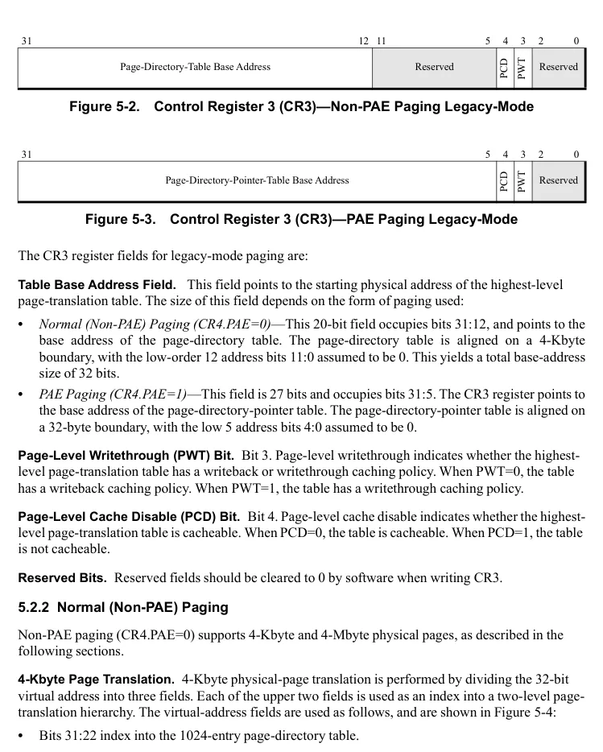

</details>


<!-- PDF source page: 195 | printed page: 133 -->

- Bits 21:12 index into the 1024-entry page table.
- Bits 11:0 provide the byte offset into the physical page.

**Figure 5-4. 4-Kbyte Non-PAE Page Translation—Legacy Mode**

<details>
<summary>Extracted figure labels</summary>

```text
Virtual Address
0
11
12
21
22
31
Page Offset
Page-Directory
Offset
Page-Table
Offset
10
12
Page-
Directory
Table
Page
Table
4 Kbyte
Physical
Page
32
PTE
Physical
Address
32
PDE
12
31
CR3
Page-Directory Base
```

</details>

Figure 5-5 on page 133 shows the format of the PDE (page-directory entry), and Figure 5-6 on page 134 shows the format of the PTE (page-table entry). Each table occupies 4 Kbytes and can hold 1024 of the 32-bit table entries. The fields within these table entries are described in “Page-Translation-Table Entry Fields” on page 153.

Figure 5-5 shows bit 7 cleared to 0. This bit is the *page-size* bit (PS), and specifies a 4-Kbyte physical-page translation.

**Figure 5-5. 4-Kbyte PDE—Non-PAE Paging Legacy-Mode**

<details>
<summary>Extracted figure labels</summary>

```text
31
12 11
9
8
7
6
5
4
3
2
1
0
PWT
PCD
R/W
IGN
Page-Table Base Address
AVL
U/S
A
P
0
```

</details>

<details>
<summary>Rendered source page 195 (figures/tables)</summary>

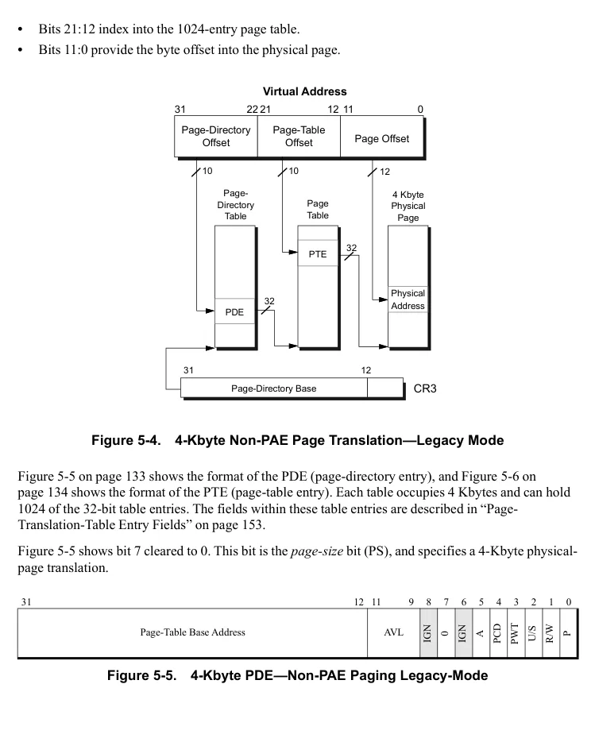

</details>


<!-- PDF source page: 196 | printed page: 134 -->

**Figure 5-6. 4-Kbyte PTE—Non-PAE Paging Legacy-Mode**

<details>
<summary>Extracted figure labels</summary>

```text
31
12 11
9
8
7
6
5
4
3
2
1
0
PWT
PCD
R/W
Physical-Page Base Address
AVL
U/S
PA
G
D
A
P
```

</details>

**4-Mbyte Page Translation.** 4-Mbyte page translation is only supported when page-size extensions are enabled (CR4.PSE=1) and physical-address extensions are disabled (CR4.PAE=0).

PSE defines a page-size bit in the 32-bit PDE format (PDE.PS). This bit is used by the processor during page translation to support both 4-Mbyte and 4-Kbyte pages. 4-Mbyte pages are selected when PDE.PS is set to 1, and the PDE points directly to a 4-Mbyte physical page. PTEs are not used in a 4-Mbyte page translation. If PDE.PS is cleared to 0, or if 4-Mbyte page translation is disabled, the PDE points to a PTE.

4-Mbyte page translation is performed by dividing the 32-bit virtual address into two fields. Each field is used as an index into a single-level page-translation hierarchy. The virtual-address fields are used as follows, and are shown in Figure 5-7 on page 135:

- Bits 31:22 index into the 1024-entry page-directory table.
- Bits 21:0 provide the byte offset into the physical page.

<details>
<summary>Rendered source page 196 (figures/tables)</summary>

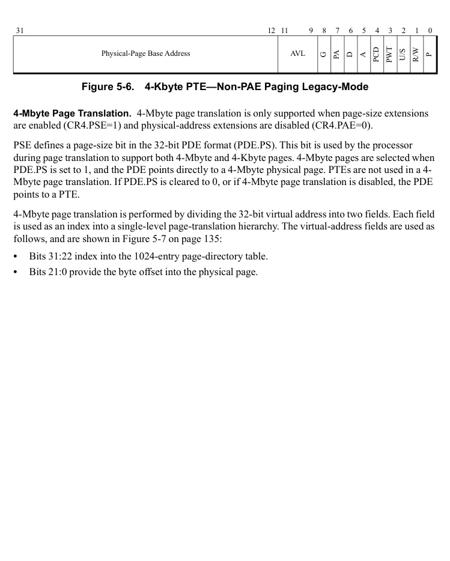

</details>


<!-- PDF source page: 197 | printed page: 135 -->

**Figure 5-7. 4-Mbyte Page Translation—Non-PAE Paging Legacy-Mode**

<details>
<summary>Extracted figure labels</summary>

```text
Virtual Address
0
21
22
31
Page Offset
Page-Directory
Offset
10
22
Page-
Directory
Table
4 Mbyte
Physical
Page
Physical
Address
PDE
40
12
31
CR3
Page-Directory Base
```

</details>

The AMD64 architecture modifies the legacy 32-bit PDE format in PSE mode to increase physical-address size support to 40 bits. This increase in address size is accomplished by using bits 20:13 to hold eight additional high-order physical-address bits. Bit 21 is reserved and must be cleared to 0.

Figure 5-8 shows the format of the PDE when PSE mode is enabled. The physical-page base-address bits are contained in a split field. The high-order, physical-page base-address bits 39:32 are located in PDE[20:13], and physical-page base-address bits 31:22 are located in PDE[31:22].

**Figure 5-8. 4-Mbyte PDE—Non-PAE Paging Legacy-Mode**

<details>
<summary>Extracted figure labels</summary>

```text
31
22 21 20
13 12 11
9
8
7
6
5
4
3
2
1
0
Physical-Page Base Address
[39:32]
PWT
PCD
R/W
Physical-Page Base Address [31:22]
AVL
P
PAT
U/S
G
D
A
1
0
```

</details>

<a id="5-2-3-pae-paging"></a>

### 5.2.3 PAE Paging

PAE paging is used when physical-address extensions are enabled (CR4.PAE=1). PAE paging doubles the size of page-translation table entries to 64 bits so that the table entries can hold larger physical

<details>
<summary>Rendered source page 197 (figures/tables)</summary>

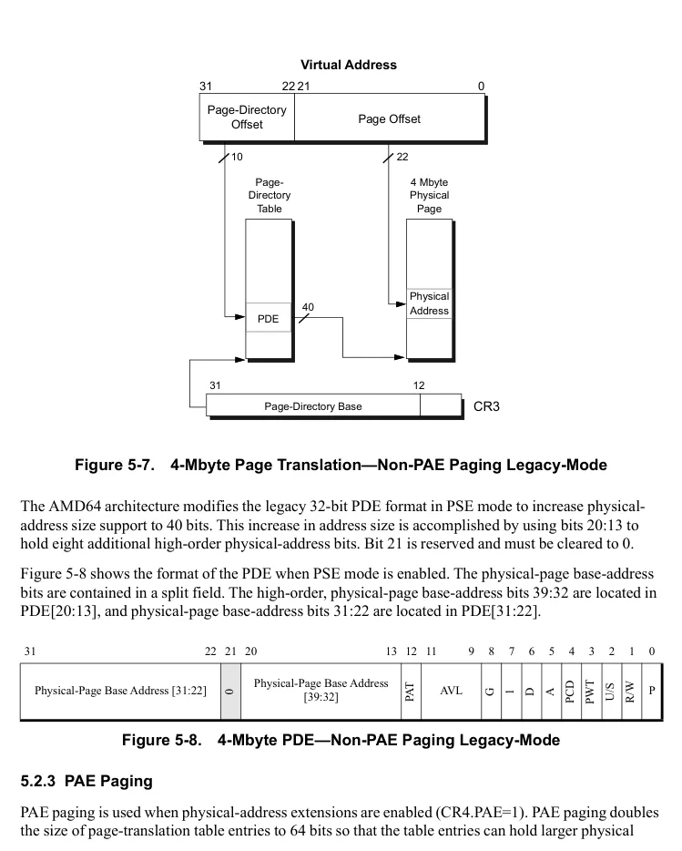

</details>


<!-- PDF source page: 198 | printed page: 136 -->

addresses (up to 52 bits). The size of each table remains 4 Kbytes, which means each table can hold 512 of the 64-bit entries. PAE paging also introduces a third-level page-translation table, known as the page-directory-pointer table (PDPT).

The size of large pages in PAE-paging mode is 2 Mbytes rather than 4 Mbytes. PAE uses the page-directory page-size bit (PDE.PS) to allow selection between 4-Kbyte and 2-Mbyte page sizes. PAE automatically uses the page-size bit, so the value of CR4.PSE is ignored by PAE paging.

**4-Kbyte Page Translation.** With PAE paging, 4-Kbyte physical-page translation is performed by dividing the 32-bit virtual address into four fields, each of the upper three fields is used as an index into a 3-level page-translation hierarchy. The virtual-address fields are described as follows and are shown in Figure 5-9:

- Bits 31:30 index into a 4-entry page-directory-pointer table.
- Bits 29:21 index into the 512-entry page-directory table.
- Bits 20:12 index into the 512-entry page table.
- Bits 11:0 provide the byte offset into the physical page.

**Figure 5-9. 4-Kbyte PAE Page Translation—Legacy Mode**

<details>
<summary>Extracted figure labels</summary>

```text
Virtual Address
0
11
12
20
21
29
30
31
Page Offset
Page-Directory
Offset
Page-Table
Offset
Page-Directory-
Pointer Offset
9
2
12
4 Kbyte
Physical
Page
Page-
Directory
Table
Page
Table
Page-
Directory-
Pointer
Table
52*
PTE
52*
PDPE
Physical
Address
52*
PDE
*This is an architectural limit. A given processor
implementation may support fewer bits.
5
31
CR3
Page-Directory-Pointer Base
```

</details>

Figures 5-10 through 5-12 show the legacy-mode 4-Kbyte translation-table formats:

<details>
<summary>Rendered source page 198 (figures/tables)</summary>

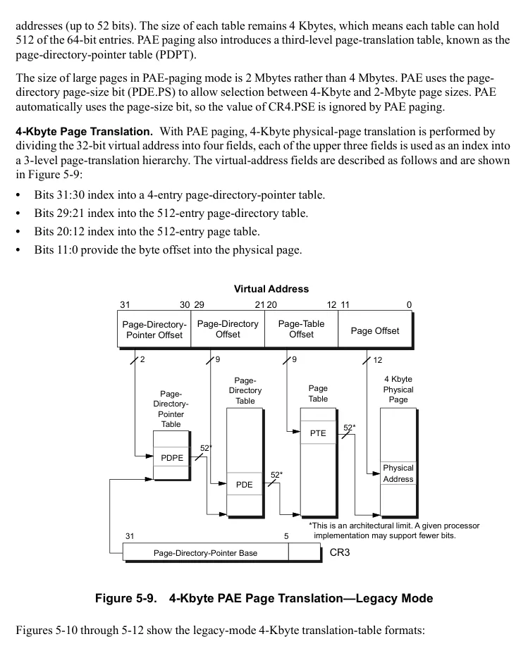

</details>


<!-- PDF source page: 199 | printed page: 137 -->

- Figure 5-10 shows the PDPE (page-directory-pointer entry) format.
- Figure 5-11 shows the PDE (page-directory entry) format.
- Figure 5-12 shows the PTE (page-table entry) format.

The fields within these table entries are described in “Page-Translation-Table Entry Fields” on page 153.

Figure 5-11 shows the PDE.PS bit cleared to 0 (bit 7), specifying a 4-Kbyte physical-page translation.

63 52 51 32

Reserved, MBZ Page-Directory Base Address (This is an architectural limit. A given implementation may support fewer bits.)

**Figure 5-10. 4-Kbyte PDPE—PAE Paging Legacy-Mode**

<details>
<summary>Extracted figure labels</summary>

```text
31
12 11
9
8
5
4
3
2
1
0
PWT
PCD
Page-Directory Base Address
AVL
Reserved, MBZ
MBZ
P
```

</details>

63 62 52 51 32

Reserved, MBZ Page-Table Base Address (This is an architectural limit. A given implementation may support fewer bits.)

**Figure 5-11. 4-Kbyte PDE—PAE Paging Legacy-Mode**

<details>
<summary>Extracted figure labels</summary>

```text
NX
31
12 11
9
8
7
6
5
4
3
2
1
0
PWT
PCD
R/W
IGN
Page-Table Base Address
AVL
U/S
A
P
0
```

</details>

63 62 52 51 32

Reserved, MBZ Physical-Page Base Address (This is an architectural limit. A given implementation may support fewer bits.)

**Figure 5-12. 4-Kbyte PTE—PAE Paging Legacy-Mode**

<details>
<summary>Extracted figure labels</summary>

```text
NX
31
12 11
9
8
7
6
5
4
3
2
1
0
PWT
PCD
R/W
Physical-Page Base Address
AVL
PAT
U/S
G
D
A
P
```

</details>

<details>
<summary>Rendered source page 199 (figures/tables)</summary>

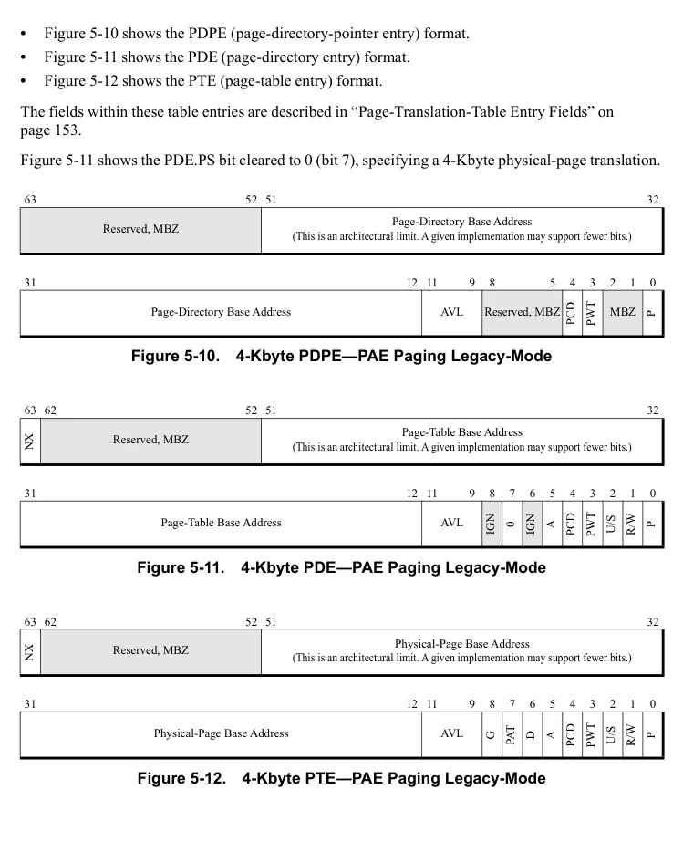

</details>


<!-- PDF source page: 200 | printed page: 138 -->

**2-Mbyte Page Translation.** 2-Mbyte page translation is performed by dividing the 32-bit virtual address into three fields. Each field is used as an index into a 2-level page-translation hierarchy. The virtual-address fields are described as follows and are shown in Figure 5-13 on page 138:

- Bits 31:30 index into the 4-entry page-directory-pointer table.
- Bits 29:21 index into the 512-entry page-directory table.
- Bits 20:0 provide the byte offset into the physical page.

**Figure 5-13. 2-Mbyte PAE Page Translation—Legacy Mode**

<details>
<summary>Extracted figure labels</summary>

```text
Virtual Address
0
20
21
29
30
31
Page Offset
Page-Directory
Offset
Page-Directory-
Pointer Offset
9
2
21
Page-
Directory
Table
2 Mbyte
Physical
Page
Page-
Directory-
Pointer
Table
52*
PDPE
Physical
Address
PDE
52*
*This is an architectural limit. A given processor
implementation may support fewer bits.
5
31
CR3
Page-Directory-Pointer Base Register
```

</details>

Figure 5-14 shows the format of the PDPE (page-directory-pointer entry) and Figure 5-15 on page 139 shows the format of the PDE (page-directory entry). PTEs are not used in 2-Mbyte page translations.

Figure 5-15 on page 139 shows the PDE.PS bit set to 1 (bit 7), specifying a 2-Mbyte physical-page translation.

<details>
<summary>Rendered source page 200 (figures/tables)</summary>

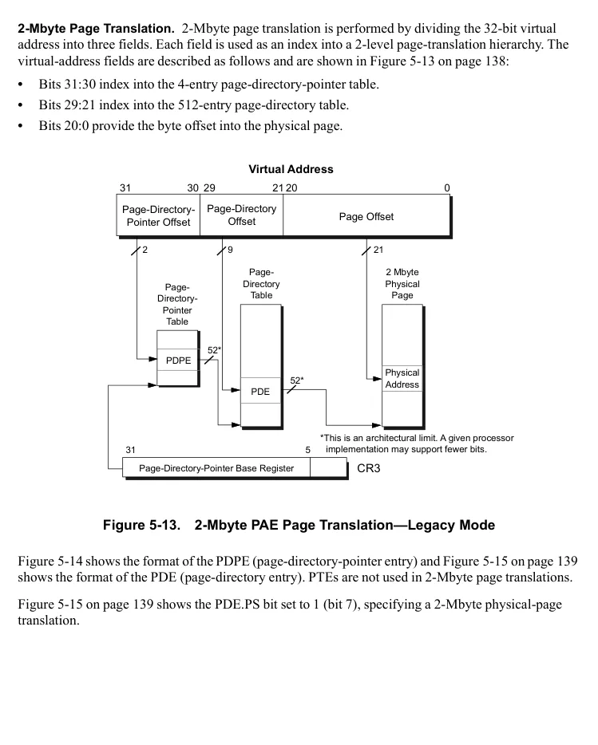

</details>


<!-- PDF source page: 201 | printed page: 139 -->

63 52 51 32

Reserved, MBZ Page-Directory Base Address (This is an architectural limit. A given implementation may support fewer bits.)

**Figure 5-14. 2-Mbyte PDPE—PAE Paging Legacy-Mode**

<details>
<summary>Extracted figure labels</summary>

```text
31
12 11
9
8
5
4
3
2
1
0
PWT
PCD
Page-Directory Base Address
AVL
Reserved, MBZ
MBZ
P
```

</details>

63 62 52 51 32

Reserved, MBZ Physical-Page Base Address (This is an architectural limit. A given implementation may support fewer bits.)

**Figure 5-15. 2-Mbyte PDE—PAE Paging Legacy-Mode**

<details>
<summary>Extracted figure labels</summary>

```text
NX
31
21 20
13 12 11
9
8
7
6
5
4
3
2
1
0
PWT
PCD
R/W
Physical-Page Base Address
Reserved, MBZ
AVL
PAT
U/S
G
D
A
P
1
```

</details>

<a id="5-3-long-mode-page-translation"></a>

## 5.3 Long-Mode Page Translation

Long-mode page translation requires the use of physical-address extensions (PAE). Before activating long mode, PAE must be enabled by setting CR4.PAE to 1. Activating long mode before enabling PAE causes a general-protection exception (#GP) to occur.

The PAE-paging data structures support mapping of 64-bit virtual addresses into 52-bit physical addresses. PAE expands the size of legacy page-directory entries (PDEs) and page-table entries (PTEs) from 32 bits to 64 bits, allowing physical-address sizes of greater than 32 bits.

The AMD64 architecture enhances the page-directory-pointer entry (PDPE) by defining previously reserved bits for access and protection control. A new translation table is added to PAE paging, called the page-map level-4 (PML4). The PML4 table precedes the PDP table in the page-translation hierarchy.

Because PAE is always enabled in long mode, the PS bit in the page directory entry (PDE.PS) selects between 4-Kbyte and 2-Mbyte page sizes, and the CR4.PSE bit is ignored. When 1-Gbyte pages are supported, the PDPE. PS bit selects the 1-Gbyte page size.

Some processors, identified by CPUID Fn0000_0007_ECX[LA57] (bit 16) = 1, support an additional translation table called page-map level-5 (PML5). The PML5 table precedes the PML4 table and allows translation of up to 57 bits of virtual address. 5-Level paging is enabled by setting

<details>
<summary>Rendered source page 201 (figures/tables)</summary>

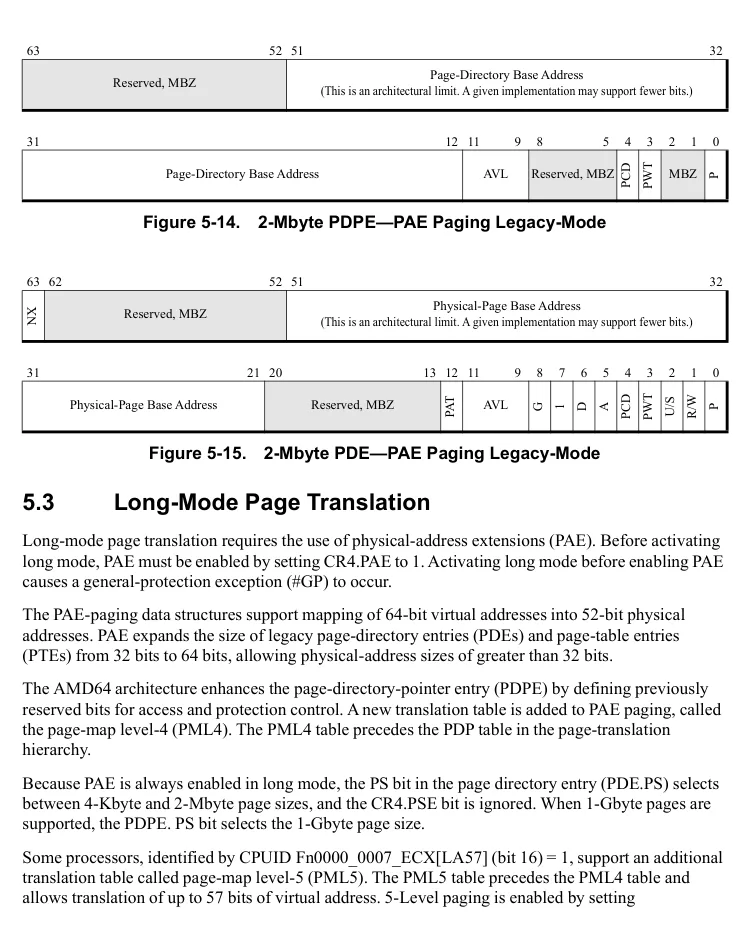

</details>


<!-- PDF source page: 202 | printed page: 140 -->

CR4[LA57]=1 when EFER[LMA]=1. CR4[LA57] is ignored when long mode is not active (EFER[LMA]=0).

<a id="5-3-1-canonical-address-form"></a>

### 5.3.1 Canonical Address Form

The AMD64 architecture requires implementations supporting fewer than the full 64-bit virtual address to ensure that those addresses are in canonical form. An address is in canonical form if the address bits from the most-significant implemented bit up to bit 63 are all ones or all zeros. If the addresses of all bytes in a virtual-memory reference are not in canonical form, the processor generates a general-protection exception (#GP) or a stack fault (#SS) as appropriate.

<a id="5-3-2-cr3"></a>

### 5.3.2 CR3

In long mode, the CR3 register is used to point to the PML4 base address when 5-Level paging is disabled (CR4[LA57]=0) or the PML5 base address when 5-Level paging is enabled (CR4[LA57]=1). CR3 is expanded to 64 bits in long mode, allowing the PML4 or PML5 table to be located anywhere in the 52-bit physical-address space. Figure 5-16 on page 140 shows the long-mode CR3 format.

63 52 51 32

Reserved, MBZ Page-Map Level-4 or Level-5 (This is an architectural limit. A given implementation may support fewer bits.)

31 12 11 5 4 3 2 0

Page-Map Level-4 or Level-5 Table Base Address Usage depends on state of Processor Context ID enablement (CR4.PCIDE). See below.

11 5 4 3 2 0

PWT

PCD

CR4.PCIDE=0 Reserved

Reserved

CR4.PCIDE=1 Processor Context Identifier (See “Process Context Identifier” on page 158 for more information.)

**Figure 5-16. Control Register 3 (CR3)—Long Mode**

> ***Note:** When PCID is enabled, bit 63 is set to 1 to enable PCID for this linear space as discussed in section 5.5.1. It is no longer reserved.*

The CR3 register fields for long mode are:

**Table Base Address Field.** Bits 51:12. When 5-Level paging is enabled (CR4.LA57=1) this 40-bit field points to the PML5 base address. Otherwise it points to the PML4 base address. The PML4 or PML5 table is aligned on a 4-Kbyte boundary with the low-order 12 address bits (11:0) assumed to be 0. This yields a total base-address size of 52 bits. System software running on processor

<details>
<summary>Rendered source page 202 (figures/tables)</summary>

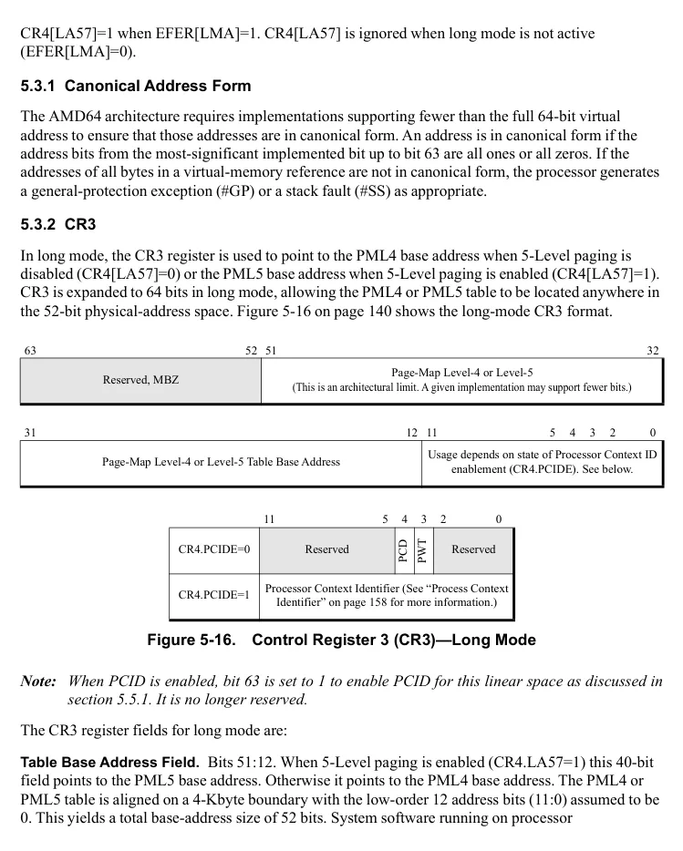

</details>


<!-- PDF source page: 203 | printed page: 141 -->

implementations supporting less than the full 52-bit physical-address space must clear the unimplemented upper base-address bits to 0.

**Page-Level Writethrough (PWT) Bit.** Bit 3. Page-level writethrough indicates whether the highest-level page-translation table has a writeback or writethrough caching policy. When PWT=0, the table has a writeback caching policy. When PWT=1, the table has a writethrough caching policy.

**Page-Level Cache Disable (PCD) Bit.** Bit 4. Page-level cache disable indicates whether the highest-level page-translation table is cacheable. When PCD=0, the table is cacheable. When PCD=1, the table is not cacheable.

**Process Context Identifier.** Bits 11:0. This 12-bit field determines the current Processor Context Identifier (PCID) when CR4.PCIDE=1.

**Reserved Bits.** Reserved fields should be cleared to 0 by software when writing CR3.

<a id="5-3-3-4-kbyte-page-translation"></a>

### 5.3.3 4-Kbyte Page Translation

In long mode, 4-Kbyte physical-page translation is performed by dividing the virtual address into up to seven fields. Up to four of the fields are used as indices into the level page-translation hierarchy. The virtual-address fields are described as follows, and are shown in Figure 5-17 on page 142 (4-Kbyte Page Translation—Long Mode 4-Level Paging) and Figure 5-18 on page 143 (4-Kbyte Page Translation—Long Mode 5-Level Paging):

- Bits 63:57 are a sign extension of bit 56, as required for canonical-address forms.
- Bits 56:48 index into the 512-entry page-map level-5 table. (Only when 5-Level paging is enabled).
- Bits 47:39 index into the 512-entry page-map level-4 table.
- Bits 38:30 index into the 512-entry page-directory pointer table.
- Bits 29:21 index into the 512-entry page-directory table.
- Bits 20:12 index into the 512-entry page table.
- Bits 11:0 provide the byte offset into the physical page. ***Note:** The sizes of the sign extension, PML5, and the PML4 fields depend on the number of virtual address bits supported by the implementation.*


<!-- PDF source page: 204 | printed page: 142 -->

**Figure 5-17. 4-Kbyte Page Translation—Long Mode 4-Level Paging**

<details>
<summary>Extracted figure labels</summary>

```text
Virtual Address
0
2
1
2
0
2
0
3
9
2
9
3
8
3
47
48
63
Page-Map
Level-4 Offset
(PML4)
Page-Directory
Pointer Offset
Page-Directory
Offset
Page-Table
Offset
Physical-Page
Offset
Sign Extend
9
12
9
Page
Directory
Pointer
Table
Page-Map
Level-4
Table
4 Kbyte
Physical
Page
Directory
Table
Page
Table
52*
PTE
52*
PDPE
52*
Physical
Address
PML4E
PDE
* This is an architectural limit. A given processor
implementation may support fewer bits.
12
51
CR3
Page-Map Level-4
Base Address
```

</details>

<details>
<summary>Rendered source page 204 (figures/tables)</summary>

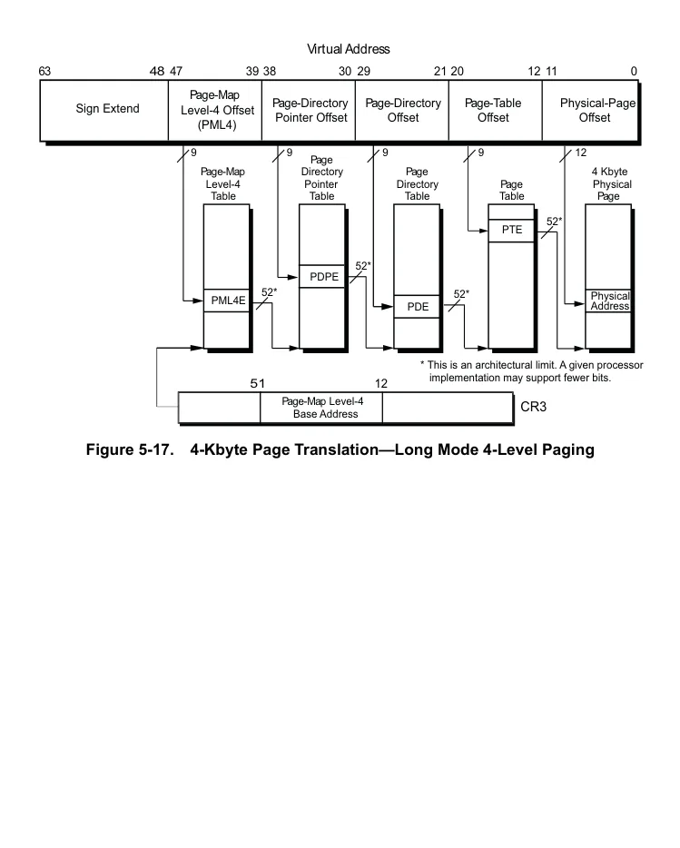

</details>


<!-- PDF source page: 205 | printed page: 143 -->

**Figure 5-18. 4-Kbyte Page Translation—Long Mode 5-Level Paging**

<details>
<summary>Extracted figure labels</summary>

```text
Virtual Address
0
2
1
2
0
2
0
3
9
2
9
3
8
3
47
48
63
57 56
Page-Map
Level-4 Offset
(PML4)
Page-Map
Level-5 Offset
(PML5)
Page-Directory
Pointer Offset
Page-Directory
Offset
Page-Table
Offset
Physical-Page
Offset
d
Sign Exten
9
12
9
Page
Directory
Pointer
Table
Page-Map
Level-5
Table
Page-Map
Level-4
Table
4 Kbyte
Physical
Page
Directory
Table
Page
Table
52*
PTE
52*
PDPE
52*
Physical
Address
PML5E
PML4E
PDE
* This is an architectural limit. A given processor
implementation may support fewer bits
12
51
CR3
Page-Map Level-5
Base Address
```

</details>

Figures 5-19 through 5-22 on page 144 and Figure 5-23 on page 145 show the long-mode 4-Kbyte translation-table formats:

- Figure 5-19 on page 144 shows the PML5E (page-map level-5 entry) format.
- Figure 5-20 on page 144 shows the PML4E (page-map level-4 entry) format.
- Figure 5-21 on page 144 shows the PDPE (page-directory-pointer entry) format.
- Figure 5-22 on page 144 shows the PDE (page-directory entry) format.
- Figure 5-23 on page 145 shows the PTE (page-table entry) format.

The fields within these table entries are described in “Page-Translation-Table Entry Fields” on page 153.

Figure 5-22 on page 144 shows the PDE.PS bit (bit 7) cleared to 0, indicating a 4-Kbyte physical-page translation.

<details>
<summary>Rendered source page 205 (figures/tables)</summary>

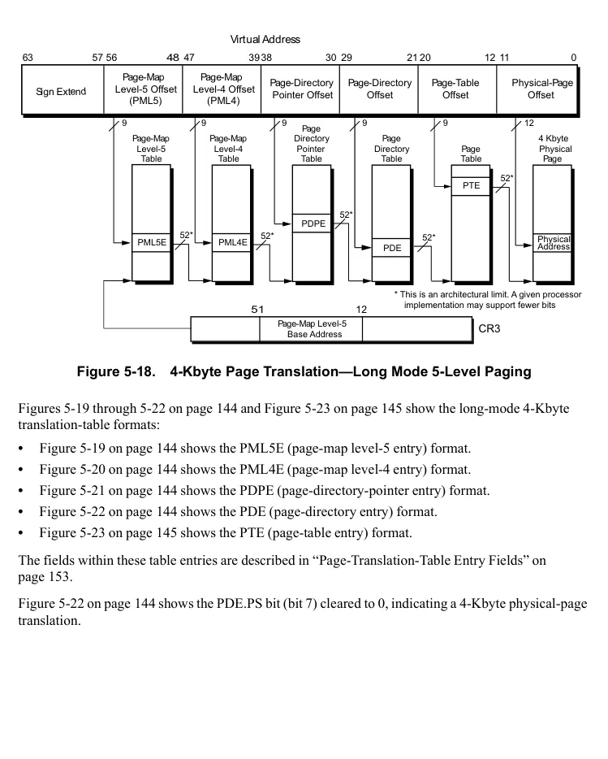

</details>


<!-- PDF source page: 206 | printed page: 144 -->

63 62 52 51 32

Available Page-Map Level-4 Base Address (This is an architectural limit. A given implementation may support fewer bits.)

**Figure 5-19. 4-Kbyte PML5E—Long Mode**

<details>
<summary>Extracted figure labels</summary>

```text
NX
31
12 11
9
8
7
6
5
4
3
2
1
0
MBZ
PWT
PCD
R/W
IGN
Page-Map Level-4 Table Bse Address
AVL
U/S
A
P
```

</details>

63 62 52 51 32

Available Page-Directory-Pointer Base Address (This is an architectural limit. A given implementation may support fewer bits.)

**Figure 5-20. 4-Kbyte PML4E—Long Mode**

<details>
<summary>Extracted figure labels</summary>

```text
NX
31
12 11
9
8
7
6
5
4
3
2
1
0
MBZ
PWT
PCD
R/W
IGN
Page-Directory-Pointer Base Address
AVL
U/S
A
P
```

</details>

63 62 52 51 32

Available Page-Directory Base Address (This is an architectural limit. A given implementation may support fewer bits.)

**Figure 5-21. 4-Kbyte PDPE—Long Mode**

<details>
<summary>Extracted figure labels</summary>

```text
NX
31
12 11
9
8
7
6
5
4
3
2
1
0
PWT
PCD
R/W
IGN
Page-Directory Base Address
AVL
U/S
A
0
P
```

</details>

63 62 52 51 32

Available Page-Table Base Address (This is an architectural limit. A given implementation may support fewer bits.)

**Figure 5-22. 4-Kbyte PDE—Long Mode**

<details>
<summary>Extracted figure labels</summary>

```text
NX
31
12 11
9
8
7
6
5
4
3
2
1
0
PWT
PCD
R/W
IGN
Page-Table Base Address
AVL
U/S
A
P
0
```

</details>

<details>
<summary>Rendered source page 206 (figures/tables)</summary>

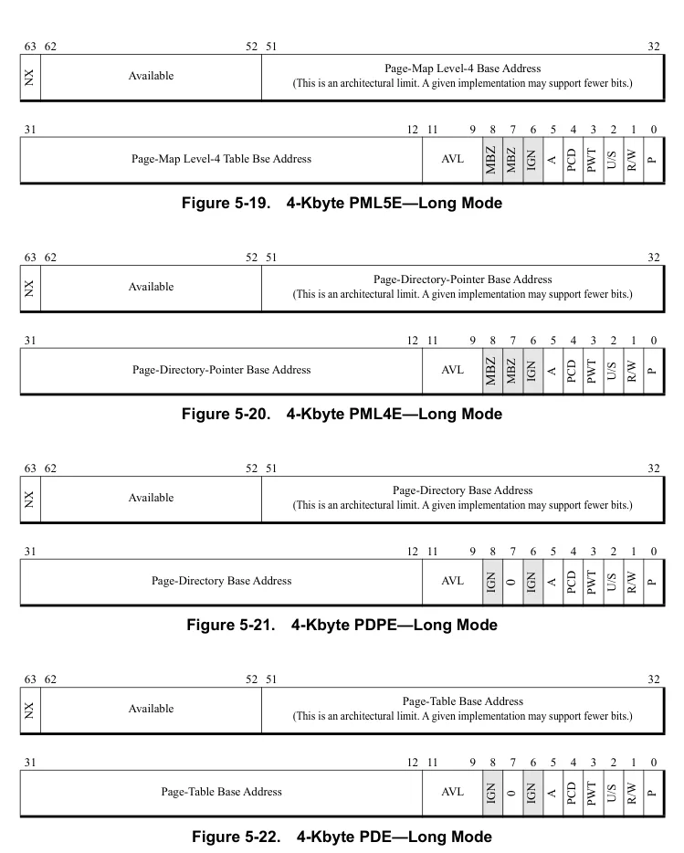

</details>


<!-- PDF source page: 207 | printed page: 145 -->

63 62 59 58 52 51 32

Usage depends on CR4.PKE (see below) Available Physical-Page Base Address (This is an architectural limit. A given implementation may support fewer bits.)

NX

31 12 11 9 8 7 6 5 4 3 2 1 0

PWT

PCD

R/W

PAT

Physical-Page Base Address AVL

U/S

G

D

A

P

62 59

CR4.PKE=0 Available

CR4.PKE=1 Memory Protection Key (See “Memory Pro-tection Keys (MPK) Bit” on page 164 for more information)

**Figure 5-23. 4-Kbyte PTE—Long Mode**

<a id="5-3-4-2-mbyte-page-translation"></a>

### 5.3.4 2-Mbyte Page Translation

In long mode, 2-Mbyte physical-page translation is performed by dividing the virtual address into up to six fields. Up to four of the fields are used as indices into the level page-translation hierarchy. The virtual-address fields are described as follows, and are shown in Figure 5-24 on page 146 (2-Mbyte PDE—Long Mode) and Figure 5-25 on page 147 (2-Mbyte Page Translation—Long Mode 5-Level Paging):

- Bits 63:57 are a sign extension of bit 56 as required for canonical address forms.
- Bits 56:48 index into the 512-entry page-map level-5 table (only when 5-Level paging is enabled).
- Bits 47:39 index into the 512-entry page-map level-4 table.
- Bits 38:30 index into the 512-entry page-directory-pointer table.
- Bits 29:21 index into the 512-entry page-directory table.
- Bits 20:0 provide the byte offset into the physical page.

<details>
<summary>Rendered source page 207 (figures/tables)</summary>

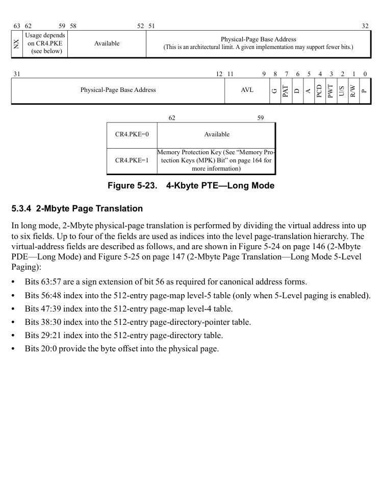

</details>


<!-- PDF source page: 208 | printed page: 146 -->

**Figure 5-24. 2-Mbyte Page Translation—Long Mode 4-Level Paging**

<details>
<summary>Extracted figure labels</summary>

```text
Virtual Address
0
1
2
0
2
0
3
9
2
9
3
8
3
47
48
63
Sign Extend
Page-Map
Level-4 Table Offset
(PML4)
Page-Directory
Pointer Offset
Page-Directory
Offset
Page Offset
9
21
9
Page
Directory
Pointer
Table
Page-Map
Level-4
Table
2 Mbyte
Physical
Page
Directory
Table
52*
PDPE
52*
PDE
Physical
Address
PML4E
* This is an architectural limit. A given processor
implementation may support fewer bits
12
51
CR3
Page-Map Level-4
Base Address
```

</details>

<details>
<summary>Rendered source page 208 (figures/tables)</summary>

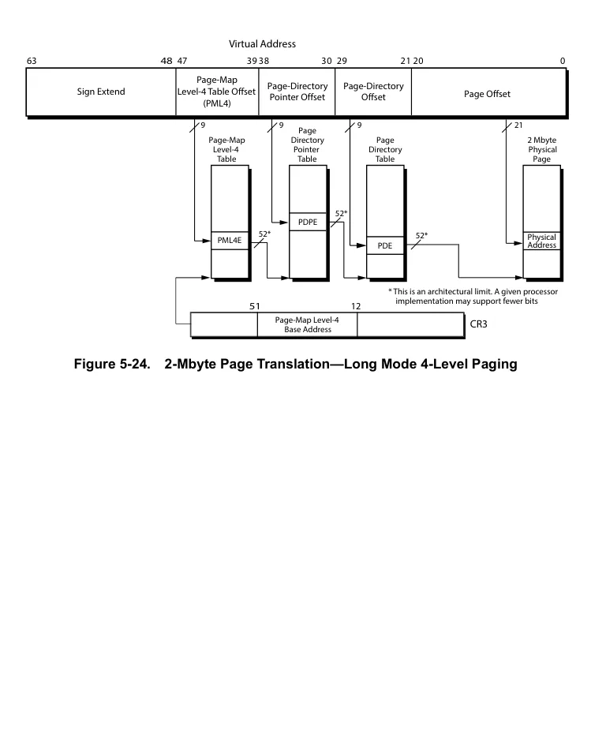

</details>


<!-- PDF source page: 209 | printed page: 147 -->

**Figure 5-25. 2-Mbyte Page Translation—Long Mode 5-Level Paging**

<details>
<summary>Extracted figure labels</summary>

```text
Virtual Address
0
1
2
0
2
0
3
9
2
9
3
8
3
47
48
63
57 56
Page-Map
Level-4 Offset
(PML4)
Sign Extend
Page-Map
Level-5 Offset
(PML5)
Page-Directory
Pointer Offset
Page-Directory
Offset
Page Offset
9
21
9
Page
Directory
Pointer
Table
Page-Map
Level-5
Table
Page-Map
Level-4
Table
2 Mbyte
Physical
Page
Directory
Table
52*
PDPE
52*
PDE
Physical
Address
PML5E
PML4E
* This is an architectural limit. A given processor
implementation may support fewer bits
12
51
CR3
Page-Map Level-5
Base Address
```

</details>

Figures 5-26 through 5-29 on page 149 show the long-mode 2-Mbyte translation-table formats (the PML4 and PDPT formats are identical to those used for 4-Kbyte page translations and are repeated here for clarity):

- Figure 5-26 on page 148 shows the PML5E (page-map level-5 entry) format.
- Figure 5-27 on page 148 shows the PML4E (page-map level-4 entry) format.

- Figure 5-28 on page 148 shows the PDPE (page-directory-pointer entry) format.
- Figure 5-29 on page 149 shows the PDE (page-directory entry) format.

The fields within these table entries are described in “Page-Translation-Table Entry Fields” on page 153. PTEs are not used in 2-Mbyte page translations.

Figure 5-29 shows the PDE.PS bit (bit 7) set to 1, indicating a 2-Mbyte physical-page translation.

<details>
<summary>Rendered source page 209 (figures/tables)</summary>

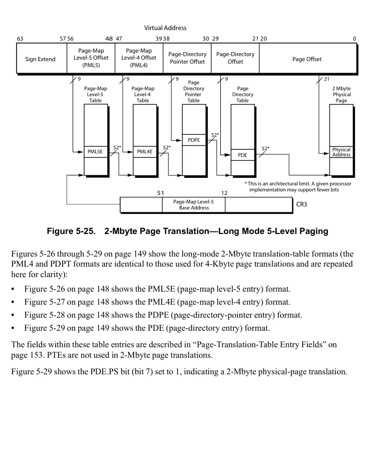

</details>


<!-- PDF source page: 210 | printed page: 148 -->

63 62 52 51 32

Available Page-Map Level-4 Table Base Address (This is an architectural limit. A given implementation may support fewer bits.)

**Figure 5-26. 2-Mbyte PML5E—Long Mode**

<details>
<summary>Extracted figure labels</summary>

```text
NX
31
12 11
9
8
7
6
5
4
3
2
1
0
MBZ
PWT
PCD
R/W
IGN
Page-Map Level-4 Table Base Address
AVL
U/S
A
P
```

</details>

63 62 52 51 32

Available Page-Directory-Pointer Base Address (This is an architectural limit. A given implementation may support fewer bits.)

**Figure 5-27. 2-Mbyte PML4E—Long Mode**

<details>
<summary>Extracted figure labels</summary>

```text
NX
31
12 11
9
8
7
6
5
4
3
2
1
0
MBZ
PWT
PCD
R/W
IGN
Page-Directory-Pointer Base Address
AVL
U/S
A
P
```

</details>

63 62 52 51 32

Available Page-Directory Base Address (This is an architectural limit. A given implementation may support fewer bits.)

**Figure 5-28. 2-Mbyte PDPE—Long Mode**

<details>
<summary>Extracted figure labels</summary>

```text
NX
31
12 11
9
8
7
6
5
4
3
2
1
0
PWT
PCD
R/W
IGN
Page-Directory Base Address
AVL
U/S
A
0
P
```

</details>

<details>
<summary>Rendered source page 210 (figures/tables)</summary>

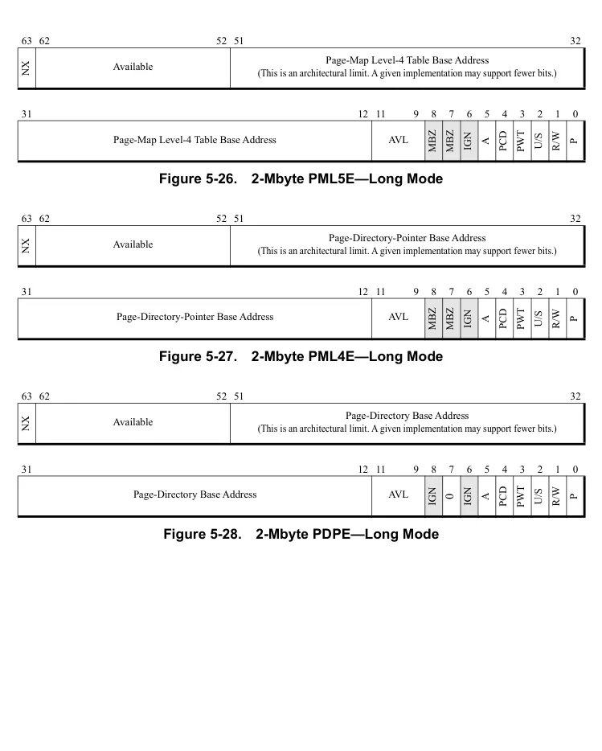

</details>


<!-- PDF source page: 211 | printed page: 149 -->

63 52 51 32

Usage depends on CR4.PKE (see below) Available Physical-Page Base Address (This is an architectural limit. A given implementation may support fewer bits.)

NX

31 21 20 13 12 11 9 8 7 6 5 4 3 2 1 0

PWT

PCD

R/W

Physical-Page Base Address Reserved, MBZ

AVL

PAT

U/S

G

D

A

P

1

62 59

CR4.PKE=0 Available

CR4.PKE=1 Memory Protection Key (See “Memory Pro-tection Keys (MPK) Bit” on page 164 for more information.

**Figure 5-29. 2-Mbyte PDE—Long Mode**

<a id="5-3-5-1-gbyte-page-translation"></a>

### 5.3.5 1-Gbyte Page Translation

In long mode, 1-Gbyte physical-page translation is performed by dividing the virtual address into up to five fields. Up to three of the fields are used as indices into the level page-translation hierarchy. The virtual-address fields are described as follows, and are shown in Figure 5-30 on page 150 (1-Gbyte PDPE—Long Mode) and Figure 5-31 on page 151 (1-Gbyte Page Translation—Long Mode 5-Level Paging):

- Bits 63:57 are a sign extension of bit 56 as required for canonical address forms.
- Bits 56:48 index into the 512-entry page-map level-5 table. (Only when 5-Level paging is enabled)
- Bits 47:39 index into the 512-entry page-map level-4 table.
- Bits 38:30 index into the 512-entry page-directory-pointer table.
- Bits 29:0 provide the byte offset into the physical page.

<details>
<summary>Rendered source page 211 (figures/tables)</summary>

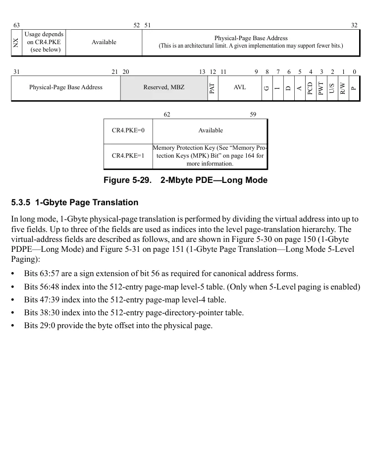

</details>


<!-- PDF source page: 212 | printed page: 150 -->

**Figure 5-30. 1-Gbyte Page Translation—Long Mode 4-Level Paging**

<details>
<summary>Extracted figure labels</summary>

```text
Virtual Address
0
3
9
2
9
3
38
47
48
63
Sign Extend
Page-Map
Level-4 Table Offset
(PML4)
Page-Directory
Pointer Offset
Page Offset
9
30
9
Page
Directory
Pointer
Table
Page-Map
Level-4
Table
1 Gbyte
Physical
Page
52*
PDPE
52*
Physical
Address
PML4E
* This is an architectural limit. A given processor
implementation may support fewer bits
12
51
CR3
Page-Map Level-4
Base Address
```

</details>

<details>
<summary>Rendered source page 212 (figures/tables)</summary>

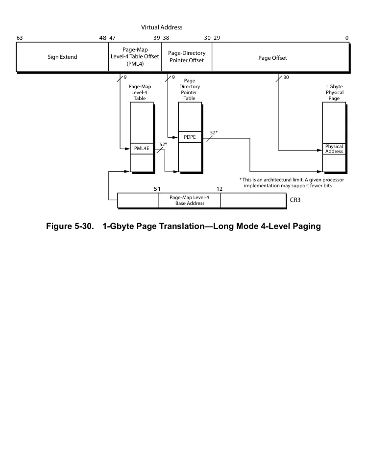

</details>


<!-- PDF source page: 213 | printed page: 151 -->

**Figure 5-31. 1-Gbyte Page Translation—Long Mode 5-Level Paging**

<details>
<summary>Extracted figure labels</summary>

```text
Virtual Address
0
3
9
2
9
3
8
3
47
48
63
57 56
Page-Map
Level-4 Offset
(PML4)
Sign Extend
Page-Map
Level-5 Offset
(PML5)
Page-Directory
Pointer Offset
Page Offset
9
30
9
Page
Directory
Pointer
Table
Page-Map
Level-5
Table
Page-Map
Level-4
Table
1 Gbyte
Physical
Page
52*
PDPE
52*
Physical
Address
PML5E
PML4E
* This is an architectural limit. A given processor
implementation may support fewer bits
12
51
CR3
Page-Map Level-5
Base Address
```

</details>

Figure 5-32 to Figure 5-34 show the long mode 1-Gbyte translation-table formats (the PML4 and PML5 formats are identical to the ones used for 4-Kbyte page translations and are repeated here for clarity):

- Figure 5-32 shows the PML5E (page-map level-5 entry) format.
- Figure 5-33 shows the PML4E (page-map level-4 entry) format.

- Figure 5-34 shows the PDPE (page-directory-pointer entry) format.

The fields within these table entries are described in Section 5.4 “Page-Translation-Table Entry Fields” on page 153 in the current volume. PTEs and PDEs are not used in 1-Gbyte page translations.

Figure 5-34 on page 153 shows the PDPE.PS bit (bit 7) set to 1, indicating a 1-Gbyte physical-page translation.

<details>
<summary>Rendered source page 213 (figures/tables)</summary>

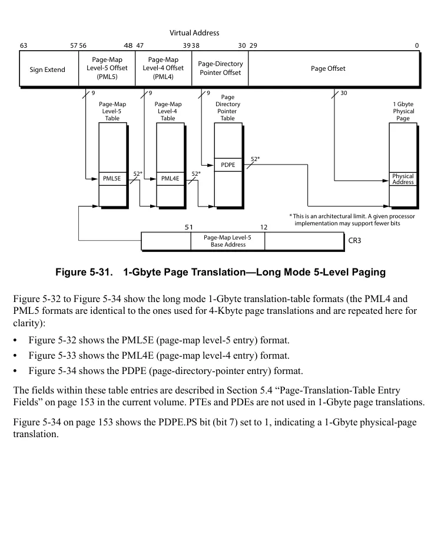

</details>


<!-- PDF source page: 214 | printed page: 152 -->

63 62 52 51 32

Available Page-Map Level-4 Table Base Address (This is an architectural limit. A given implementation may support fewer bits.)

**Figure 5-32. 1-Gbyte PML5E—Long Mode**

<details>
<summary>Extracted figure labels</summary>

```text
NX
31
12 11
9
8
7
6
5
4
3
2
1
0
MBZ
PWT
PCD
R/W
IGN
Page-Map Level-4 Table Base Address
AVL
U/S
A
P
```

</details>

63 62 52 51 32

Available Page Directory Pointer Base Address (This is an architectural limit. A given implementation may support fewer bits.)

**Figure 5-33. 1-Gbyte PML4E—Long Mode**

<details>
<summary>Extracted figure labels</summary>

```text
NX
31
12 11
9
8
7
6
5
4
3
2
1
0
MBZ
PWT
PCD
R/W
IGN
Page-Directory-Pointer Base Address
AVL
US
A
P
```

</details>

<details>
<summary>Rendered source page 214 (figures/tables)</summary>

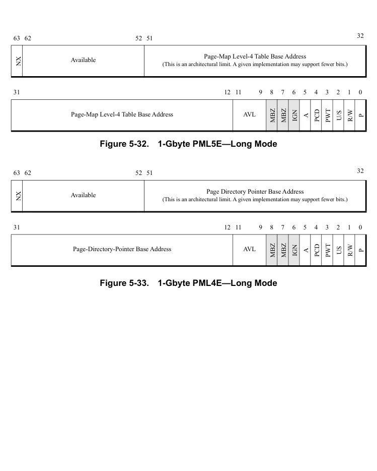

</details>


<!-- PDF source page: 215 | printed page: 153 -->

63 62 59 58 52 51 32

Usage depends on CR4.PKE (see below)

Available Physical Page Base Address (This is an architectural limit. A given implementation may support fewer bits.)

NX

31 30 12 11 9 8 7 6 5 4 3 2 1 0

Phy Page Base Addr

P A T

PWT

PCD

R/W

Reserved, MBZ

AVL

U/S

G 1

D

A

P

62 59

CR4.PKE=0 Available

CR4.PKE=1 Memory Protection Key (See “Memory Pro-tection Keys (MPK) Bit” on page 164 for more information.

**Figure 5-34. 1-Gbyte PDPE—Long Mode**

**1-Gbyte Paging Feature Identification.** EDX bit 26 as returned by CPUID function 8000_0001h indicates 1-Gbyte page support. The EAX register as returned by CPUID function 8000_0019h reports the number of 1-Gbyte L1 TLB entries supported and EBX reports the number of 1-Gbyte L2 TLB entries. For more information using the CPUID instruction see Section 3.3 “Processor Feature Identification” on page 71.

<a id="5-4-page-translation-table-entry-fields"></a>

## 5.4 Page-Translation-Table Entry Fields

The page-translation-table entries contain control and informational fields used in the management of the virtual-memory environment. Most fields are common across all translation table entries and modes and occupy the same bit locations. However, some fields are located in different bit positions depending on the page translation hierarchical level, and other fields have different sizes depending on which physical-page size, physical-address size, and operating mode are selected. Although these fields can differ in bit position or size, their meaning is consistent across all levels of the page translation hierarchy and in all operating modes.

<a id="5-4-1-field-definitions"></a>

### 5.4.1 Field Definitions

The following sections describe each field within the page-translation table entries.

**Translation-Table Base Address Field.** The translation-table base-address field points to the physical base address of the next-lower-level table in the page-translation hierarchy. Page data-structure tables are always aligned on 4-Kbyte boundaries, so only the address bits above bit 11 are

<details>
<summary>Rendered source page 215 (figures/tables)</summary>

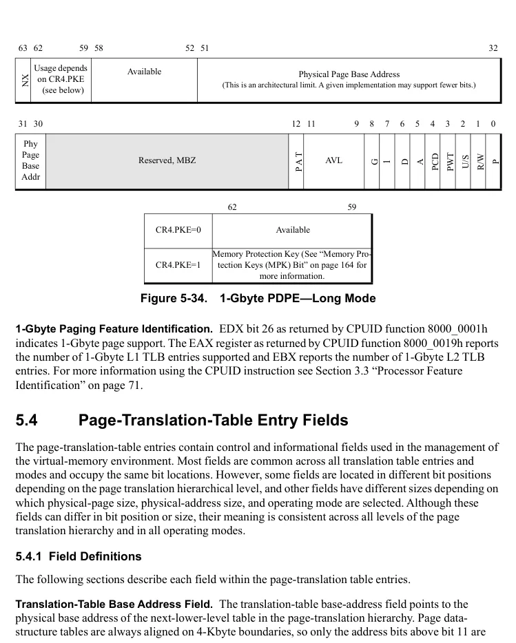

</details>


<!-- PDF source page: 216 | printed page: 154 -->

stored in the translation-table base-address field. Bits 11:0 are assumed to be 0. The size of the field depends on the mode:

- In normal (non-PAE) paging (CR4.PAE=0), this field specifies a 32-bit physical address.
- In PAE paging (CR4.PAE=1), this field specifies a 52-bit physical address.

52 bits correspond to the maximum physical-address size allowed by the AMD64 architecture. If a processor implementation supports fewer than the full 52-bit physical address, software must clear the unimplemented high-order translation-table base-address bits to 0. For example, if a processor implementation supports a 40-bit physical-address size, software must clear bits 51:40 when writing a translation-table base-address field in a page data-structure entry.

**Physical-Page Base Address Field.** The physical-page base-address field points to the base address of the translated physical page. This field is found only in the lowest level of the page-translation hierarchy. The size of the field depends on the mode:

- In normal (non-PAE) paging (CR4.PAE=0), this field specifies a 32-bit base address for a physical page.
- In PAE paging (CR4.PAE=1), this field specifies a 52-bit base address for a physical page.

Physical pages can be 4 Kbytes, 2 Mbytes, 4 Mbytes, or 1-Gbyte and they are always aligned on an address boundary corresponding to the physical-page length. For example, a 2-Mbyte physical page is always aligned on a 2-Mbyte address boundary. Because of this alignment, the low-order address bits are assumed to be 0, as follows:

- 4-Kbyte pages, bits 11:0 are assumed 0.
- 2-Mbyte pages, bits 20:0 are assumed 0.
- 4-Mbyte pages, bits 21:0 are assumed 0.
- 1-Gbyte pages, bits 29:0 are assumed 0.

**Present (P) Bit.** Bit 0. This bit indicates whether the page-translation table or physical page is loaded in physical memory. When the P bit is cleared to 0, the table or physical page is not loaded in physical memory. When the P bit is set to 1, the table or physical page is loaded in physical memory.

Software clears this bit to 0 to indicate a page table or physical page is not loaded in physical memory. A page-fault exception (#PF) occurs if an attempt is made to access a table or page when the P bit is 0. System software is responsible for loading the missing table or page into memory and setting the P bit to 1.

When the P bit is 0, indicating a not-present page, all remaining bits in the page data-structure entry are available to software.

Entries with P cleared to 0 are never cached in TLB nor will the processor set the Accessed or Dirty bit for the table entry.

**Read/Write (R/W) Bit.** Bit 1. This bit controls read/write access to all physical pages mapped by the table entry. For example, a page-map level-4 R/W bit controls read/write access to all 128M


<!-- PDF source page: 217 | printed page: 155 -->

(512 512 512) physical pages it maps through the lower-level translation tables. When the R/W bit is cleared to 0, access is restricted to read-only. When the R/W bit is set to 1, both read and write access is allowed. See “Page-Protection Checks” on page 161 for a description of the paging read/write protection mechanism.

**User/Supervisor (U/S) Bit.** Bit 2. This bit controls user (CPL 3) access to all physical pages mapped by the table entry. For example, a page-map level-4 U/S bit controls the access allowed to all 128M (512 512 512) physical pages it maps through the lower-level translation tables. When the U/S bit is cleared to 0, access is restricted to supervisor level (CPL 0, 1, 2). When the U/S bit is set to 1, both user and supervisor access is allowed. See “Page-Protection Checks” on page 161 for a description of the paging user/supervisor protection mechanism.

**Page-Level Writethrough (PWT) Bit.** Bit 3. This bit indicates whether the page-translation table or physical page to which this entry points has a writeback or writethrough caching policy. When the PWT bit is cleared to 0, the table or physical page has a writeback caching policy. When the PWT bit is set to 1, the table or physical page has a writethrough caching policy. See “Memory Caches” on page 204 for additional information on caching. If the processor supports the Page-Attribute Table Mechanism, this bit is used in constructing an index into the PAT register. See Section 7.8 “Page-Attribute Table Mechanism” on page 227.

**Page-Level Cache Disable (PCD) Bit.** Bit 4. This bit indicates whether the page-translation table or physical page to which this entry points is cacheable. When the PCD bit is cleared to 0, the table or physical page is cacheable. When the PCD bit is set to 1, the table or physical page is not cacheable. See “Memory Caches” on page 204 for additional information on caching. If the processor supports the Page-Attribute Table Mechanism, this bit is used in constructing an index into the PAT register. See Section 7.8 “Page-Attribute Table Mechanism” on page 227.

**Accessed (A) Bit.** Bit 5. This bit indicates whether the page-translation table or physical page to which this entry points has been accessed. The A bit is set to 1 by the processor the first time the table or physical page is either read from or written to. The A bit is never cleared by the processor. Instead, software must clear this bit to 0 when it needs to track the frequency of table or physical-page accesses.

**Dirty (D) Bit.** Bit 6. This bit is only present in the lowest level of the page-translation hierarchy. It indicates whether the physical page to which this entry points has been written. The D bit is set to 1 by the processor the first time there is a write to the physical page. The D bit is never cleared by the processor. Instead, software must clear this bit to 0 when it needs to track the frequency of physical-page writes.

**Page Size (PS) Bit.** Bit 7. This bit is present in page-directory entries and long-mode page-directory-pointer entries. When the PS bit is set in the page-directory-pointer entry (PDPE) or page-directory entry (PDE), that entry is the lowest level of the page-translation hierarchy. When the PS bit is cleared to 0 in all levels above PTE, the lowest level of the page-translation hierarchy is the page-table entry (PTE), and the physical-page size is 4 Kbytes. The physical-page size is determined as follows:

- If EFER.LMA=1 and PDPE.PS=1, the physical-page size is 1 Gbyte.
- If CR4.PAE=0 and PDE.PS=1, the physical-page size is 4 Mbytes.


<!-- PDF source page: 218 | printed page: 156 -->

- If CR4.PAE=1 and PDE.PS=1, the physical-page size is 2 Mbytes.

See Table 5-1 on page 129 for a description of the relationship between the PS bit, PAE, physical-page sizes, and page-translation hierarchy.

**Global Page (G) Bit.** Bit 8. This bit is only present in the lowest level of the page-translation hierarchy. It indicates the physical page is a global page. The TLB entry for a global page (G=1) is not invalidated when CR3 is loaded either explicitly by a MOV CRn instruction or implicitly during a task switch. Use of the G bit requires the page-global enable bit in CR4 to be set to 1 (CR4.PGE=1). See “Global Pages” on page 158 for more information on the global-page mechanism.

**Available to Software (AVL) Bit.** These bits are not interpreted by the processor and are available for use by system software.

**Page-Attribute Table (PAT) Bit.** This bit is only present in the lowest level of the page-translation hierarchy, as follows:

- If the lowest level is a PTE (PDE.PS=0), PAT occupies bit 7.
- If the lowest level is a PDE (PDE.PS=1) or PDPE (PDPE.PS=1), PAT occupies bit 12.

The PAT bit is the high-order bit of a 3-bit index into the PAT register (Figure 7-13 on page 227). The other two bits involved in forming the index are the PCD and PWT bits. Not all processors support the PAT bit by implementing the PAT registers. See “Page-Attribute Table Mechanism” on page 227 for a description of the PAT mechanism and how it is used.

**Memory Protection Key (MPK) Bits.** Bits 62:59. When Memory Protection Keys are enabled (CR4.PKE=1), this 4-bit field selects the memory protection key for the physical page mapped by this entry. Ignored if memory protection keys are disabled (CR4.PKE=0). (See “Memory Protection Keys (MPK) Bit” on page 164 for a description of this mechanism.)

**No Execute (NX) Bit.** Bit 63. This bit is present in the translation-table entries defined for PAE paging, with the exception that the legacy-mode PDPE does not contain this bit. This bit is not supported by non-PAE paging.

The NX bit can only be set when the no-execute page-protection feature is enabled by setting EFER.NXE to 1 (see “Extended Feature Enable Register (EFER)” on page 55). If EFER.NXE=0, the NX bit is treated as reserved. In this case, a page-fault exception (#PF) occurs if the NX bit is not cleared to 0.

This bit controls the ability to execute code from all physical pages mapped by the table entry. For example, a page-map level-4 NX bit controls the ability to execute code from all 128M (512 512 512) physical pages it maps through the lower-level translation tables. When the NX bit is cleared to 0, code can be executed from the mapped physical pages. When the NX bit is set to 1, code cannot be executed from the mapped physical pages. See “No Execute (NX) Bit” on page 156 for a description of the no-execute page-protection mechanism.


<!-- PDF source page: 219 | printed page: 157 -->

**Reserved Bits.** Software should clear all reserved bits to 0. If the processor is in long mode, or if page-size and physical-address extensions are enabled in legacy mode, a page-fault exception (#PF) occurs if reserved bits are not cleared to 0.

<a id="5-4-2-notes-on-accessed-and-dirty-bits"></a>

### 5.4.2 Notes on Accessed and Dirty Bits

The processor never sets the Accessed bit or the Dirty bit for a not present page (P = 0). The ordering of Accessed and Dirty bit updates with respect to surrounding loads and stores is discussed below.

**Accessed (A) Bit.** The Accessed bit can be set for instructions that are speculatively executed by the processor.

For example, the Accessed bit may be set by instructions in a mispredicted branch path even though those instructions are never retired. Thus, software must not assume that the TLB entry has not been cached in the TLB, just because no instruction that accessed the page was successfully retired. Nevertheless, a table entry is never cached in the TLB without its Accessed bit being set at the same time.

The processor does not order Accessed bit updates with respect to loads done by other instructions.

**Dirty (D) Bit.** The Dirty bit is not updated speculatively. For instructions with multiple writes, the D bit may be set for any writes completed up to the point of a fault. In rare cases, the Dirty bit may be set even if a write was not actually performed, including MASKMOVQ with a mask of zero and certain x87 floating point instructions that cause an exception. Thus software can not assume that the page has actually been written even where PTE[D] is set to 1.

If PTE[D] is cleared to 0, software can rely on the fact that the page has not been written.

In general, Dirty bit updates are ordered with respect to other loads and stores, although not necessarily with respect to accesses to WC memory; in particular, they may not cause WC buffers to be flushed. However, to ensure compatibility with future processors, a serializing operation should be inserted before reading the D bit.

<a id="5-5-translation-lookaside-buffer-tlb"></a>

## 5.5 Translation-Lookaside Buffer (TLB)

When paging is enabled, every memory access has its virtual address automatically translated into a physical address using the page-translation hierarchy. *Translation-lookaside buffers* (TLBs), also known as *page-translation caches*, nearly eliminate the performance penalty associated with page translation. TLBs are special on-chip caches that hold the most-recently used virtual-to-physical address translations. Each memory reference (instruction and data) is checked by the TLB. If the translation is present in the TLB, it is immediately provided to the processor, thus avoiding external memory references for accessing page tables.

TLBs take advantage of the *principle of locality.* That is, if a memory address is referenced, it is likely that nearby memory addresses will be referenced in the near future. In the context of paging, the proximity of memory addresses required for locality can be broad—it is equal to the page size. Thus, it


<!-- PDF source page: 220 | printed page: 158 -->

is possible for a large number of addresses to be translated by a small number of page translations. This high degree of locality means that almost all translations are performed using the on-chip TLBs.

System software is responsible for managing the TLBs when updates are made to the linear-to-physical mapping of addresses. A change to any paging data-structure entry is not automatically reflected in the TLB, and hardware snooping of TLBs during memory-reference cycles is not performed. Software must invalidate the TLB entry of a modified translation-table entry so that the change is reflected in subsequent address translations. TLB invalidation is described in “TLB Management” on page 159. Only privileged software running at CPL=0 can manage the TLBs.

<a id="5-5-1-process-context-identifier"></a>

### 5.5.1 Process Context Identifier

The Process Context Identifier (PCID) feature allows a logical processor to cache TLB mappings concurrently for multiple virtual address spaces. When enabled (by setting CR4.PCIDE=1), the processor associates the current 12-bit PCID with each TLB mapping it creates. Only entries matching the current PCID are used when performing address translations. In this way, the processor may retain cached TLB mappings for multiple contexts.

The current PCID is the value in CR3[11:0]. When PCIDs are enabled the system software can store 12-bit Process Context Identifiers in CR3 for different address spaces. Subsequently, when system software switches address spaces (by writing the page table base pointer in CR3[62:12]), the processor may use TLB mappings previously stored for that address space and PCID, providing that bit 63 of the source operand is set to 1. If bit 63 is set to 0, the legacy behavior of a move to CR3 is maintained, invalidating TLB entries but only non-global entries for the specified PCID. Note that this bit is not stored in the CR3 register itself. PCID-tagged TLB contents may also be managed using the INVPCID instruction; see the INVPCID description in volume 3 for details. A MOV to CR4 that clears CR4.PCIDE causes all cached entries in the TLB for the logical processor to be invalidated. When PCIDs are not enabled (CR4.PCIDE=0) the current PCID is always zero and all TLB mappings are associated with PCID=0.

Attempting to set CR4.PCIDE with a MOV to CR4 if EFER.LMA = 0 or CR3[11:0] &lt;&gt; 0 causes a #GP exception. Attempting to clear CR0.PG with a MOV to CR0 if CR4.PCIDE is set also causes a #GP exception. The presence of PCID functionality is indicated by CPUID Function 1, ECX[PCID]=1.

<a id="5-5-2-global-pages"></a>

### 5.5.2 Global Pages

The processor invalidates the TLB whenever CR3 is loaded either explicitly or implicitly. After the TLB is invalidated, subsequent address references can consume many clock cycles until their translations are cached as new entries in the TLB. Invalidation of TLB entries for frequently-used or critical pages can be avoided by specifying the translations for those pages as *global.* TLB entries for global pages are not invalidated as a result of a CR3 load. Global pages are invalidated using the INVLPG instruction.

Global-page extensions are controlled by setting and clearing the PGE bit in CR4 (bit 7). When CR4.PGE is set to 1, global-page extensions are enabled. When CR4.PGE is cleared to 0, global-page


<!-- PDF source page: 221 | printed page: 159 -->

extensions are disabled. When CR4.PGE=1, setting the global (G) bit in the translation-table entry marks the page as global.

The INVLPG instruction ignores the G bit and can be used to invalidate individual global-page entries in the TLB. To invalidate all entries, including global-page entries, disable global-page extensions (CR4.PGE=0).

<a id="5-5-3-tlb-management"></a>

### 5.5.3 TLB Management

Generally, unless system software modifies the linear-to-physical address mapping, the processor manages the TLB transparently to software. This includes allocating entries and replacing old entries with new entries. In general, software changes made to paging-data structures are not automatically reflected in the TLB. In these situations, it is necessary for software to invalidate TLB entries so that these changes will be propagated to the page-translation mechanism.

TLB entries can be explicitly invalidated using operations intended for that purpose or implicitly invalidated as a result of another operation. TLB invalidation has no effect on the associated page-translation tables in memory.

**Explicit Invalidations.** Several mechanisms are provided to explicitly invalidate the TLB:

- The *Invalidate TLB Entry* instruction (INVLPG) can be used to invalidate a specific entry within the TLB. This instruction invalidates an entry regardless of whether it is marked as global or not.
- The *Invalidate TLB entry in a Specified ASID* instruction (INVLPGA) operates similarly, but operates only on entries associated with the specified ASID. See “Invalidate Page, Alternate ASID” on page 530.
- The *Invalidate TLB with Broadcast* instruction (INVLPGB) can be used to invalidate a specified range of TLB entries on the local processor and broadcast the invalidation operation to remote processors. See INVLPGB in Volume 3.
- The *Invalidate TLB entries in Specified PCID* instruction (INVPCID) can be used to invalidate TLB entries of the specified Processor Context ID. See INVPCID in Volume 3.
- Updates to the CR3 register cause the entire TLB to be invalidated *except* for global pages. The CR3 register can be updated with the MOV CR3 instruction. CR3 is also updated during a task switch, with the updated CR3 value read from the TSS of the new task. This behavior for CR3 is modified by the PCID extension; See “Process Context Identifier” on page 158 for details.
- The TLB_CONTROL field of a VMCB can request specific flushes of the TLB to occur when the VMRUN instruction is executed on that VMCB. See “TLB Flush” on page 529.

**Implicit Invalidations.** The following operations cause the entire TLB to be invalidated, including global pages:

- Modifying the CR0.PG bit (paging enable).
- Modifying the CR4.PAE bit (physical-address extensions), the CR4.PSE bit (page-size extensions), or the CR4.PGE bit (page-global enable).
- Entering SMM as a result of an SMI interrupt.


<!-- PDF source page: 222 | printed page: 160 -->

- Executing the RSM instruction to return from SMM.
- Updating a memory-type range register (MTRR) with the WRMSR instruction.
- External initialization of the processor.
- External masking of the A20 address bit (asserting the A20M# input signal).
- Writes to certain model-specific registers with the WRMSR instruction; see the *BIOS and Kernel Developer’s Guide (BKDG)* or *Processor Programming Reference Manual (PPR)* applicable to your product for more information.
- A MOV to CR4 that changes CR4.PKE from 0 to 1.
- A MOV to CR4 that clears CR4.PCIDE from 1 to 0.

**Invalidation of Table Entry Upgrades.** If a table entry is updated to remove a page access constraint, such as removing supervisor, read-only, and/or no-execute restrictions, an invalidation is not required because the hardware will automatically detect the changes. If a table entry is updated and does not remove a permission violation, it is unpredictable whether the old or updated entry will be used until an invalidation is performed.

**Speculative Caching of Address Translations.** For performance reasons, AMD64 processors may speculatively load valid address translations into the TLB on false execution paths. Such translations are not based on references that a program makes from an “architectural state” perspective, but which the processor may make in speculatively following an instruction path which turns out to be mispredicted. In general, the processor may create a TLB entry for any linear address for which valid entries exist in the page table structure currently pointed to by CR3. This may occur for both instruction fetches and data references. Such entries remain cached in the TLBs and may be used in subsequent translations. Loading a translation speculatively will set the Accessed bit, if not already set. A translation will *not* be loaded speculatively if the Dirty bit needs to be set.

**Caching of Upper Level Translation Table Entries.** Similarly, to improve the performance of table walks on TLB misses, AMD64 processors may save upper level translation table entries in special table walk caching structures which are kept coherent with the tables in memory via the same mechanisms as the TLBs—by means of the INVLPG instruction, moves to CR3, and modification of paging control bits in CR0 and CR4. Like address translations in the TLB, these upper level entries may also be cached speculatively and by false-path execution. These entries are never cached if their P (present) bits are set to 0.

Under certain circumstances, an upper-level table entry that cannot ultimately lead to a valid translation (because there are no valid entries in the lower level table to which it points) may also be cached. This can happen while executing down a false path, when an in-progress table walk gets cancelled by the branch mispredict before the low level table entry that would cause a fault is encountered. Said another way, the fact that a page table has no valid entries does not guarantee that upper level table entries won't be accessed and cached in the processor, as long as those upper level entries are marked as present. For this reason, it is not safe to modify an upper level entry, even if no valid lower-level entries exist, without first clearing its present bit, followed by an INVLPG instruction.


<!-- PDF source page: 223 | printed page: 161 -->

**Use of Cached Entries When Reporting a Page Fault Exception.** On current AMD64 processors, when any type of page fault exception is encountered by the MMU, any cached upper-level entries that lead to the faulting entry are flushed (along with the TLB entry, if already cached) and the table walk is repeated to confirm the page fault using the table entries in memory. This is done because a table entry is allowed to be upgraded (by marking it as present, or by removing its write, execute or supervisor restrictions) without explicitly maintaining TLB coherency. Such an upgrade will be found when the table is re-walked, which resolves the fault. If the fault is confirmed on the re-walk however, a page fault exception is reported, and upper level entries that may have been cached on the re-walk are flushed.

**Handling of D-Bit Updates.** When the processor needs to set the D bit in the PTE for a TLB entry that is already marked as writable at all cached TLB levels, the table walk that is performed to access the PTE in memory may use cached upper level table entries. This differs from the fault situation previously described, in which cached entries aren’t used to confirm the fault during the table walk.

**Invalidation of Cached Upper-level Entries by INVLPG.** The effect of INVLPG on TLB caching of upper-level page table entries is controlled by EFER[TCE] on processors that support the translation cache extension feature. If EFER[TCE] is 0, or if the processor does not support the translation cache extension feature, an INVLPG will flush all upper-level page table entries in the TLB as well as the target PTE. If EFER[TCE] is 1, INVLPG will flush only those upper-level entries that lead to the target PTE, along with the target PTE itself. INVLPGA may flush all upper-level entries regardless of the state of TCE. For further details, see Section 3.1.7 “Extended Feature Enable Register (EFER)” on page 55.

**Handling of PDPT Entries in PAE Mode.** When 32-bit PAE mode is enabled on AMD64 processors (CR4.PAE is set to 1) a third level of the address translation table hierarchy, the page directory pointer table (PDPT), is enabled. This table contains four entries. On older AMD64 processors, in native mode, these four entries are unconditionally loaded into the table walk cache whenever CR3 is written with the PDPT base address, and remain locked in. At this point they are also checked for reserved bit violations, and if such violations are present a general-protection exception (#GP) occurs.

Under SVM, however, when the processor is in guest mode with PAE enabled, the guest PDPT entries are not cached or validated at this point, but instead are loaded and checked on demand in the normal course of address translation, just like page directory and page table entries. Any reserved bit violations are detected at the point of use, and result in a page-fault (#PF) exception rather than a general-protection (#GP) exception. The cached PDPT entries are subject to displacement from the table walk cache and reloading from the PDPT, hence software must assume that the PDPT entries may be read by the processor at any point while those tables are active. Modern AMD processors implement this same behavior in native mode as well, rather than pre-loading the PDPT entries.

<a id="5-6-page-protection-checks"></a>

## 5.6 Page-Protection Checks

The AMD64 architecture provides the following forms of page-level memory protection:


<!-- PDF source page: 224 | printed page: 162 -->

- Supervisor pages. This form of protection prevents non-privileged (user) code from accessing privileged (supervisor) code and data.
- Read-only pages. This form of protection prevents writes into read-only address spaces.
- Instruction fetch restrictions. Two forms of page-level memory protection prevent the processor from fetching instructions from pages that are either known to contain non-executable data or that are accessible by user-mode code.
- Memory protection keys. This form of protection allows an application to manage page-based data access protections from user mode.
- Shadow stack pages. The processor restricts the types of memory accesses that are allowed to read or write a shadow stack page and prohibits the shadow stack mechanism from accessing non-shadow stack pages. See “Shadow Stack Protection” on page 165.

Access protection checks are performed when a virtual address is translated into a physical address. For those checks, the processor examines the page-level memory-protection bits in the translation tables to determine if the access is allowed. The page table bits involved in these checks are:

- User/Supervisor (U/S)—See “User/Supervisor (U/S) Bit” on page 155.
- Read/Write (R/W)—See “Read/Write (R/W) Bit” on page 154.
- No-Execute (NX)—See “No Execute (NX) Bit” on page 156.
- Memory Protection Key (MPK)—See “Memory Protection Keys (MPK) Bit” on page 164.

Access protection actions taken by the processor are controlled by the following bits:

- Write-Protect enable (CR0.WP)—See “Write Protect (WP) Bit” on page 43.
- No-Execute Enable (EFER.NXE)—See “No-Execute Enable (NXE) Bit” on page 57.
- Supervisor-mode Execution Prevention enable (CR4.SMEP)—See “Supervisor Mode Execution Prevention (SMEP)” on page 50.
- Supervisor-mode Access Prevention enable (CR4.SMAP)—See “Supervisor-Mode Access Prevention(CR4.SMAP) Bit” on page 164.
- Alignment Check Bit (RFLAGS.AC) – See ““Alignment Check (AC) Bit” on page 54.
- Protection Key Enable (CR4.PKE)—See “Protected-Mode Enable (PE) Bit” on page 42.
- Control-flow Enforcement Technology (CR4.CET) - See “CR4 Register” on page 46.

These protection checks are available at all levels of the page-translation hierarchy.

<a id="5-6-1-user-supervisor-u-s-bit"></a>

### 5.6.1 User/Supervisor (U/S) Bit

The U/S bit in the page-translation tables determines the privilege level required to access the page. If U/S=0 in any of the page table entries traversed during a table walk, the page is considered a supervisor page. If U/S=1 in all the page table entries traversed during a table walk, the page is considered a user page. Conceptually, user (non-privileged) pages correspond to a current privilege-level (CPL) of 3, or least-privileged. Supervisor (privileged) pages correspond to a CPL of 0, 1, or 2, all of which are jointly regarded as most-privileged.


<!-- PDF source page: 225 | printed page: 163 -->

When the processor is running at a CPL of 0, 1, or 2, it can access both user and supervisor pages unless restricted by SMEP or SMAP (See sections “Supervisor-Mode Execution Prevention (CR4.SMEP) Bit” on page 164 and “Supervisor-Mode Access Prevention(CR4.SMAP) Bit” on page 164 for further details). However, when the processor is running at a CPL of 3, it can only access user pages. If an attempt is made to access a supervisor page while the processor is running at CPL = 3, a page-fault exception (#PF) occurs.

See “Privilege-Level Concept” on page 105 for more information on processor privilege levels.

<a id="5-6-2-read-write-r-w-bit"></a>

### 5.6.2 Read/Write (R/W) Bit

The R/W bit in the page-translation tables specifies the access type allowed for the page. If R/W=0 in any of the page table entries traversed during a table walk, the page is read-only. If R/W=1 in all the page table entries traversed during a table walk, the page is read/write. A page-fault exception (#PF) occurs if an attempt is made by user software to write to a read-only page. If supervisor software attempts to write a read-only page, the outcome depends on the value of the CR0.WP bit (described below).

<a id="5-6-3-no-execute-nx-bit"></a>

### 5.6.3 No Execute (NX) Bit

The NX bit provides the ability to mark a page as non-executable. If the NX bit is set at any level of the page-table hierarchy in the table entries traversed during a table walk, the page mapped by those entries is a no-execute page. When no-execute protection is enabled, any attempt to fetch an instruction from a no-execute page results in a page-fault exception (#PF).

The no-execute protection check applies to all privilege levels. It does not distinguish between supervisor and user-level accesses.

The no-execute protection feature is supported only in PAE-paging mode. In 32-bit PAE mode, the NX bit is not supported at the Page Directory Pointer table level. In this mode, the value of the NX bit at the PDP level defaults to 0.

No-execute protection is enabled by setting the NXE bit in the EFER register to 1. Before setting this bit, system software must verify the processor supports the no-execute feature by checking the CPUID NX feature flag (CPUID Fn8000_0001_EDX[NX]).

<a id="5-6-4-write-protect-cr0-wp-bit"></a>

### 5.6.4 Write Protect (CR0.WP) Bit

The ability to write to read-only pages is governed by the processor mode and whether write protection is enabled. If write protection is *not* enabled, a processor running at CPL 0, 1, or 2 can write to any physical page, even if it is marked as read-only. Enabling write protection by setting the WP bit in CR0 prevents supervisor code from writing into read-only pages, including read-only user-level pages.

A page-fault exception (#PF) occurs if software attempts to write (at any privilege level) into a read-only page while write protection is enabled.


<!-- PDF source page: 226 | printed page: 164 -->

<a id="5-6-5-supervisor-mode-execution-prevention-cr4-smep-bit"></a>

### 5.6.5 Supervisor-Mode Execution Prevention (CR4.SMEP) Bit

When supported and enabled, a page-fault exception (#PF) is generated if the processor attempts to fetch an instruction from a user page while running at CPL 0, 1, or 2.

Supervisor-mode execution prevention is enabled by setting the SMEP bit (bit 20) in the CR4 register to 1. Before setting this bit, system software must verify the processor supports the SMEP feature by checking the SMEP feature flag (CPUID Fn0000_0007_EBX[SMEP]_x0 = 1).

For more information using the CPUID instruction see Section 3.3 “Processor Feature Identification” on page 71.

<a id="5-6-6-supervisor-mode-access-prevention-cr4-smap-bit"></a>

### 5.6.6 Supervisor-Mode Access Prevention(CR4.SMAP) Bit

When SMAP is supported and enabled, a page-fault exception (#PF) is generated if the processor attempts to read or write data from a user page and one of the following is true:

- The access is an implicit supervisor-mode access OR
- The access is made while running at CPL 0,1, or 2 and RFLAGS.AC=0.

Some accesses are considered implicit supervisor-mode accesses. Implicit supervisor-mode accesses are subject to the SMAP check regardless of the value of RFLAGS.AC. An implicit supervisor-mode access is one that is considered a supervisor access regardless of the value of CPL.

Supervisor-mode access prevention is enabled by setting the SMAP bit (bit 21) in the CR4 register to 1. Before setting this bit, system software must verify the processor supports the SMAP feature by checking the SMAP feature flag CPUID Fn0000_0007_EBX[SMAP]_x0 (bit 20) = 1.

Shadow stack accesses are not subject to the SMAP check.

For more information on using the CPUID instruction see “Processor Feature Identification” on page 71.

<a id="5-6-7-memory-protection-keys-mpk-bit"></a>

### 5.6.7 Memory Protection Keys (MPK) Bit

The Memory Protection Key (MPK) feature provides a way for applications to impose page-based data access protections (read/write, read-only or no access), without requiring modification of page tables and subsequent TLB invalidations when the application changes protection domains.

When MPK is enabled (CR4.PKE=1), a protection key is located in bits 62:59 of final page table entry mapping each virtual address. This 4-bit protection key is used as an index (i) into the user-accessible PKRU register which contains 16 access-disable/write-disable (WDi/ADi) pairs.


<!-- PDF source page: 227 | printed page: 165 -->

**Figure 5-35. PKRU Register**

<details>
<summary>Extracted figure labels</summary>

```text
31 30 29 28 27 26 25 24 23 22 21 20 19 18 17 16 15 14 13 12 11 10
9
8
7
6
5
4
3
2
1
0
PK15 PK14 PK13 PK12 PK11 PK10 PK9
PK8
PK7
PK6
PK5
PK4
PK3
PK2
PK1
PK0
W
D
A
D
W
D
A
D
W
D
A
D
W
D
A
D
W
D
A
D
W
D
A
D
W
D
A
D
W
D
A
D
W
D
A
D
W
D
A
D
W
D
A
D
W
D
A
D
W
D
A
D
W
D
A
D
W
D
A
D
W
D
A
D
```

</details>

The WDi/ADi pairs operate as follows:

If ADi=0, data access is permitted

- If ADi=1, no data access is permitted (regardless of CPL)
- If WDi == 0, write access is allowed
- If WDi == 1: User-mode write access is not allowed. Supervisor access is controlled by CR0.WP:
- If CR0.WP=1, supervisor-mode writes are not allowed
- If CR0.WP=0, supervisor-mode writes are allowed

Software can use the RDPKRU and WRPKRU instructions to read and write the PKRU register. These instructions are not privileged and can be used in user mode or in supervisor mode.

The MPK mechanism is ignored in the following cases:

- if CR4.PKE=0
- if long mode is disabled (EFER.LMA=0)
- for instruction fetches
- for pages marked in the paging structures as supervisor addresses (U/S=0)

<a id="5-7-shadow-stack-protection"></a>

## 5.7 Shadow Stack Protection

When the shadow stack feature is enabled (CR4.CET=1), certain combinations of page-table protection bits are used to distinguish pages containing shadow stacks from ordinary pages. As described in the following sections, the processor restricts the types of memory accesses that can be made to shadow stack pages and prohibits the shadow stack mechanism from accessing non-shadow stack pages. (See “Shadow Stacks” on page 678 for details on the shadow stack feature).

<a id="5-7-1-shadow-stack-accesses"></a>

### 5.7.1 Shadow Stack Accesses

The processor treats certain memory accesses as shadow stack accesses. Shadow stack accesses are generated only by the shadow stack instructions or by the shadow stack mechanism. As with ordinary data accesses, a shadow stack access can be either a supervisor access or a user access, depending on the CPL when the access is made. Shadow stack accesses made when the processor is at CPL 0, 1, or 2 are supervisor-shadow stack accesses, and accesses made at CPL 3 are user-shadow stack accesses.

<details>
<summary>Rendered source page 227 (figures/tables)</summary>

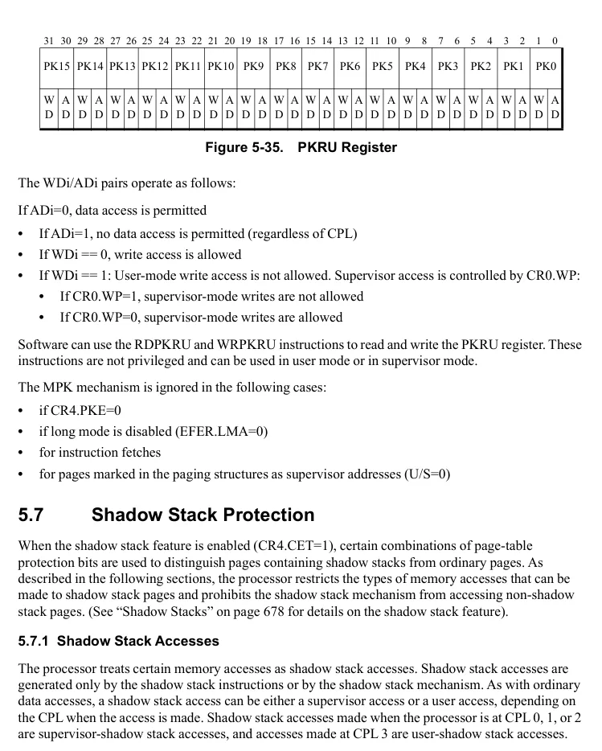

</details>


<!-- PDF source page: 228 | printed page: 166 -->

(An exception is the WRUSS instruction, whose accesses are always treated as user-shadow stack accesses).

<a id="5-7-2-shadow-stack-pages"></a>

### 5.7.2 Shadow Stack Pages

Shadow stack accesses are allowed only to linear addresses that are mapped to shadow stack pages. A shadow stack is described by the following combination of page-table protection bits:

- R/W(Read/Write)=0 and D(Dirty)=1 in the final page-table entry that maps the linear address.
- R/W(Read/Write)=1 in all other page-mapping structures leading to the final page-table entry.

The U/S (User/Supervisor) bit in the page-translation tables determines the privilege level required to access a given shadow stack page. If U/S=0, the page is considered a supervisor-shadow stack page and if U/S=1 the page is considered a user-shadow stack page.

<a id="5-7-3-shadow-stack-protection-checks"></a>

### 5.7.3 Shadow Stack Protection Checks

The processor restricts the types of memory accesses that are allowed to read or write a shadow stack page. The page-level protection bits and the type of memory access are examined to determine if the access is allowed. The following section assumes the memory protection key field allows access to the given page, if memory protection keys are enabled, and that CR0.WP=1 (which is prerequisite for enabling the shadow stack feature).

The following memory accesses are allowed to shadow stack pages:

- User-shadow stack accesses can read or write user-shadow stack pages,
- Supervisor-shadow stack accesses can read or write supervisor-shadow stack pages.

*(****Note****: shadow stack write accesses are allowed to complete, even though the R/W bit is 0).*

- Non-shadow stack reads can read any shadow stack page (subject to U/S page protections).

The following memory accesses are not allowed:

- User-shadow stack access to supervisor-shadow stack pages.
- Supervisor-shadow stack access to user-shadow stack pages.
- Any shadow stack access to a non-shadow stack page.
- Non-shadow stack writes to a shadow stack page.

If the memory access is not allowed, a page-fault exception (#PF) is generated with the paging-protection violation bits (user/supervisor, read/write, or both) set in the error code as appropriate. The SS bit is set in the #PF error code if the page-fault was caused by a shadow stack access. (See “Page-Fault Error Code” on page 263).


<!-- PDF source page: 229 | printed page: 167 -->

<a id="5-8-protection-across-paging-hierarchy"></a>

## 5.8 Protection Across Paging Hierarchy

The privilege level and access type specified at each level of the page-translation hierarchy have a combined effect on the protection of the translated physical page. Enabling and disabling write protection via CR0.WP further qualifies the protection effect on the physical page.

Table 5-2 shows the overall effect that privilege level and access type have on physical-page protection when write protection is disabled (CR0.WP=0). In this case, when *any* translation-table entry is specified as supervisor level, the physical page is a supervisor page and can only be accessed by software running at CPL 0, 1, or 2. Such a page allows read/write access even if all levels of the page-translation hierarchy specify read-only access.

**Table 5-2. Physical-Page Protection, CR0.WP=0**

| Page-Map Level-4<br>Entry / U/S | Page-Map Level-4<br>Entry / R/W | Page-Directory-<br>Pointer Entry / U/S | Page-Directory-<br>Pointer Entry / R/W | Page-Directory<br>Entry / U/S | Page-Directory<br>Entry / R/W | Page-Table Entry / U/S | Page-Table Entry / R/W | Effective Result on<br>Physical Page / U/S | Effective Result on<br>Physical Page / R/W |
| --- | --- | --- | --- | --- | --- | --- | --- | --- | --- |
| S | — | — | — | — | — | — | — | S | R/W |
| — | — | S | — | — | — | — | — |  |  |
| — | — | — | — | S | — | — | — |  |  |
| — | — | — | — | — | — | S | — |  |  |
| U | R | U | — | U | — | U | — | U | R1 |
| U | — | U | R | U | — | U | — |  |  |
| U | — | U | — | U | R | U | — |  |  |
| U | — | U | — | U | — | U | R |  |  |
| U | R/W | U | R/W | U | R/W | U | R/W | U | R/W |

> Note: S = Supervisor Level (CPL=0, 1, or 2), U = User Level (CPL = 3), R = Read-Only Access, R/W = Read/Write Access, — = Don’t Care. Note: 1. Supervisor-level programs can access these pages as R/W.

If *all* table entries in the translation hierarchy are specified as user level the physical page is a user page, and both supervisor and user software can access it. In this case the physical page is read-only if any table entry in the translation hierarchy specifies read-only access. All table entries in the translation hierarchy must specify read/write access for the physical page to be read/write.

Table 5-3 shows the overall effect that privilege level and access type have on physical-page access when write protection is enabled (CR0.WP=1). When any translation-table entry is specified as supervisor level, the physical page is a supervisor page and can only be accessed by supervisor software. In this case, the physical page is read-only if any table entry in the translation hierarchy specifies read-only access. All table entries in the translation hierarchy must specify read/write access for the supervisor page to be read/write.

<details>
<summary>Rendered source page 229 (figures/tables)</summary>

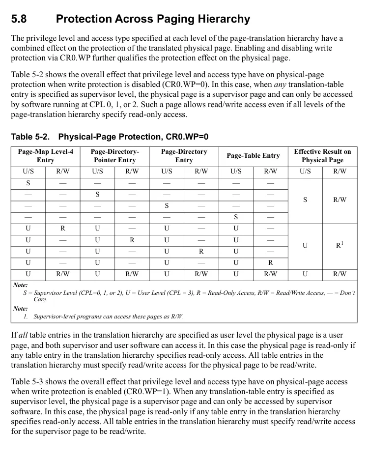

</details>


<!-- PDF source page: 230 | printed page: 168 -->

**Table 5-3. Effect of CR0.WP=1 on Supervisor Page Access**

| Page-Map<br>Level-4<br>Entry | Page<br>Directory-<br>Pointer<br>Entry | Page Directory<br>Entry | Page Table<br>Entry | Physical Page |
| --- | --- | --- | --- | --- |
| R/W | R/W | R/W | R/W | R/W |
| R | — | — | — | R |
| — | R | — | — |  |
| — | — | R | — |  |
| — | — | — | R |  |
| W | W | W | W | W |

> Note: R = Read-Only Access Type, W = Read/Write Access Type, — = Don’t Care. Physical page is in supervisor mode, as determined by U/S settings in Table 5-2.

<a id="5-8-1-access-to-user-pages-when-cr0-wp-1"></a>

### 5.8.1 Access to User Pages when CR0.WP=1

As shown in Table 5-2 on page 167, read/write access to user-level pages behaves the same as when write protection is disabled (CR0.WP=0), with one critical difference. When write protection is enabled, supervisor programs cannot write into read-only user pages.

<a id="5-9-effects-of-segment-protection"></a>

## 5.9 Effects of Segment Protection

Segment-protection and page-protection checks are performed serially by the processor, with segment-privilege checks performed first, followed by page-protection checks. Page-protection checks are not performed if a segment-protection violation is found. If a violation is found during either segment-protection or page-protection checking, an exception occurs and no memory access is performed. Segment-protection violations cause either a general-protection exception (#GP) or a stack exception (#SS) to occur. Page-protection violations cause a page-fault exception (#PF) to occur.

<a id="5-10-upper-address-ignore"></a>

## 5.10 Upper Address Ignore

The Upper Address Ignore feature provides a way for software to use bits 63:57 of an address as an arbitrary software-assigned and software-interpreted tag. When this feature is enabled, these address bits are excluded from the canonicality check that’s done when the address is used for certain memory references.

<a id="5-10-1-detecting-and-enabling-upper-address-ignore"></a>

### 5.10.1 Detecting and Enabling Upper Address Ignore

Support for the Upper Address Ignore feature is indicated by CPUID Fn8000_0021_EAX[UpperAddressIgnore](bit 7)=1. The Upper Address Ignore feature is enabled by setting EFER.UAIE (bit 20) in 64-bit mode (EFER.LMA=CS.L=1). EFER.UAIE is ignored outside of 64-bit mode.

<details>
<summary>Rendered source page 230 (figures/tables)</summary>

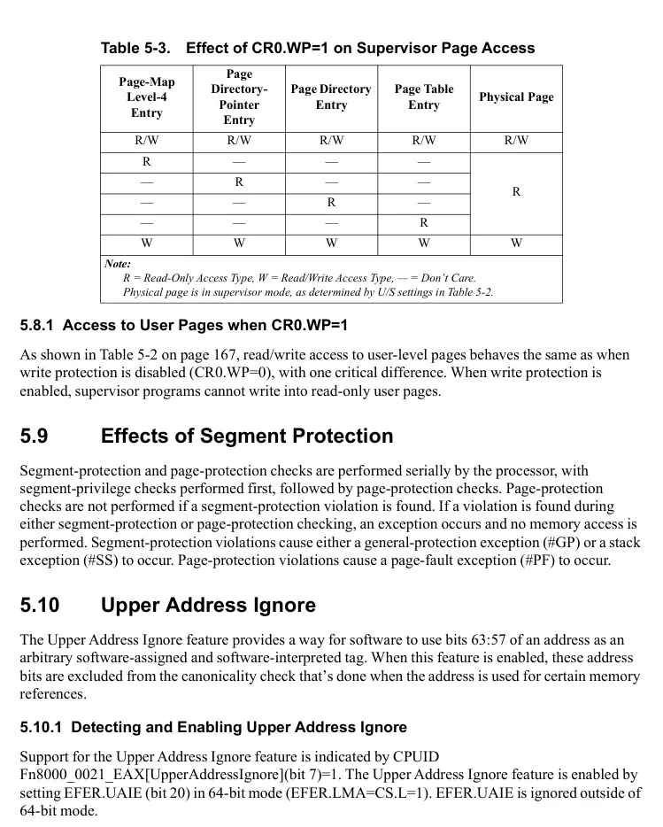

</details>


<!-- PDF source page: 231 | printed page: 169 -->

<a id="5-10-2-upper-address-ignore-operation"></a>

### 5.10.2 Upper Address Ignore Operation

When Upper Address Ignore is active the processor no longer performs a canonical address check on bits 63:57 of the logical address for memory references that use either the DS or ES segment, it checks only bits 56:48 of the logical address when 4-level paging is enabled. No canonical checks are performed for ES or DS segment memory references when 5-level paging is enabled. For a description of 4-level and 5-level paging see Section 5.3 “Long-Mode Page Translation” on page 139.

Any memory reference made using the segment registers CS, SS, FS or GS still performs the normal canonical address check. This includes indirect jump, call, and return target addresses since they are CS based. Canonical checks for implicit references to IDT, GDT, LDT and TSS are not suppressed when Upper Address Ignore is active.

<a id="5-10-3-address-tag-storage"></a>

### 5.10.3 Address Tag Storage

The following registers, which hold virtual addresses for communication to software, are not guaranteed to hold the address tag in the upper 7 bits:

- CR2
- x87 DP
- IBS Data Cache Linear Address Register

<a id="5-10-4-debug-breakpoint-behavior-with-upper-address-ignore"></a>

### 5.10.4 Debug Breakpoint Behavior with Upper Address Ignore

The Debug Breakpoint Address Registers (DR0-3) hold full 64-bit addresses and Upper Address Ignore changes how the address match is performed for data address breakpoints. When Upper Address Ignore is active the value in DR0-3[63:57] is ignored and the linear address of the memory access is only compared against DR0-3[56:0].
