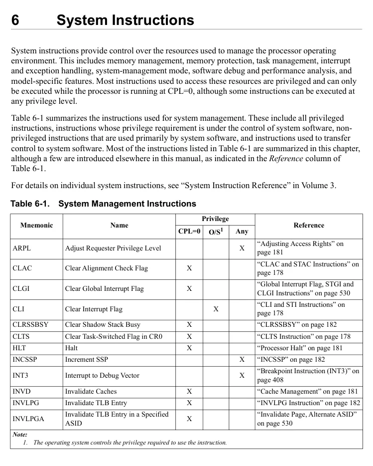
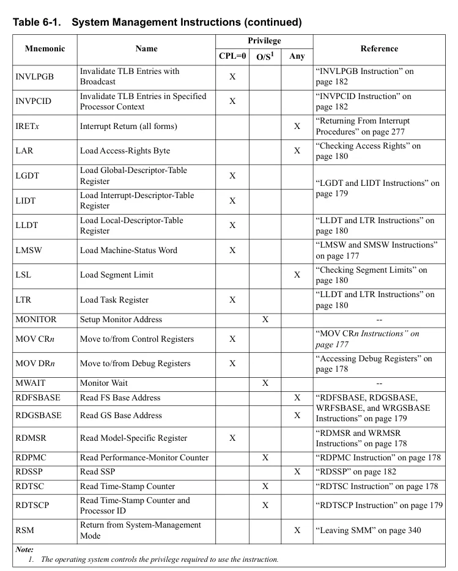
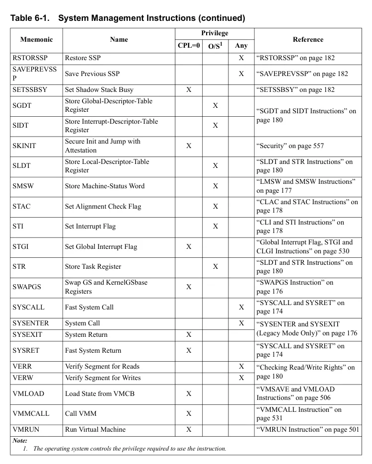
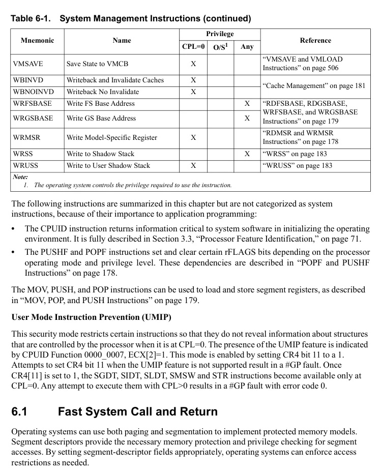
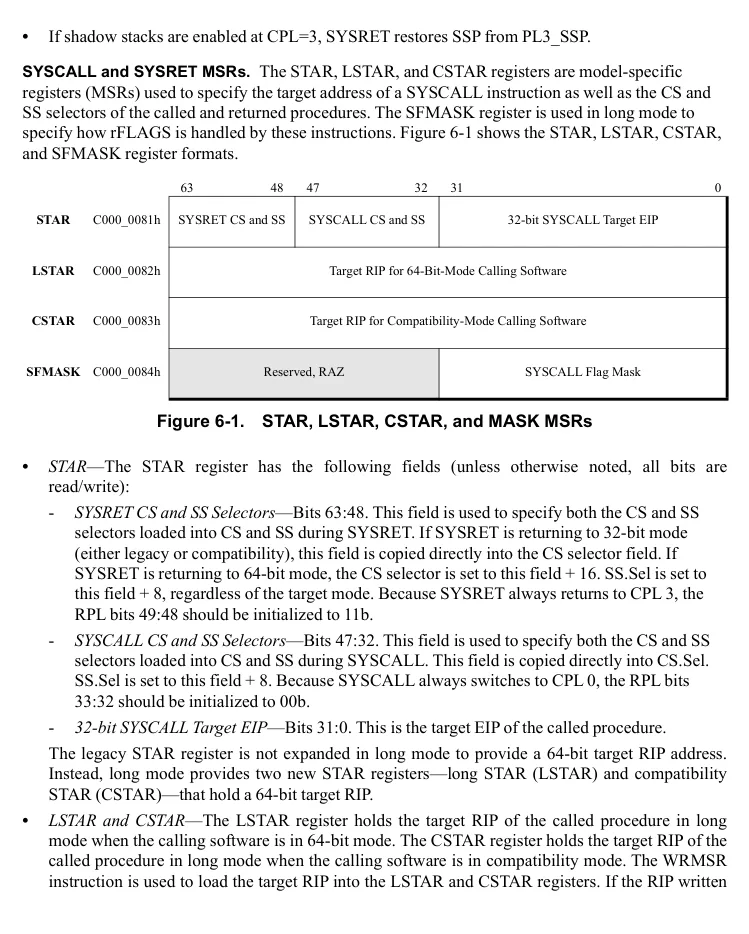
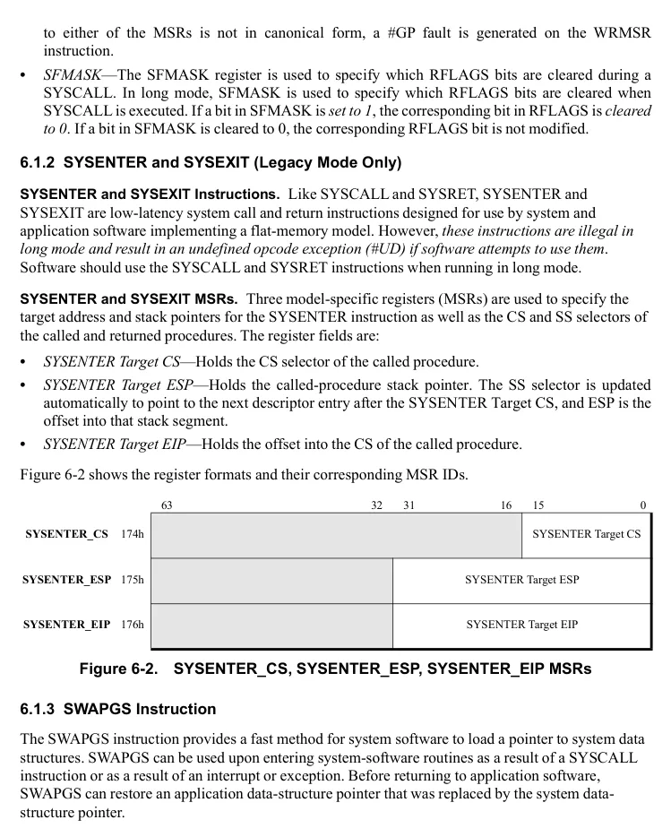

<!-- PDF source page: 232 | printed page: 170 -->

<a id="6-system-instructions"></a>

# 6 System Instructions

System instructions provide control over the resources used to manage the processor operating environment. This includes memory management, memory protection, task management, interrupt and exception handling, system-management mode, software debug and performance analysis, and model-specific features. Most instructions used to access these resources are privileged and can only be executed while the processor is running at CPL=0, although some instructions can be executed at any privilege level.

Table 6-1 summarizes the instructions used for system management. These include all privileged instructions, instructions whose privilege requirement is under the control of system software, non-privileged instructions that are used primarily by system software, and instructions used to transfer control to system software. Most of the instructions listed in Table 6-1 are summarized in this chapter, although a few are introduced elsewhere in this manual, as indicated in the *Reference* column of Table 6-1.

For details on individual system instructions, see “System Instruction Reference” in Volume 3.

**Table 6-1. System Management Instructions**

| Mnemonic | Name | Privilege / CPL=0 | Privilege / O/S1 | Privilege / Any | Reference |
| --- | --- | --- | --- | --- | --- |
| ARPL | Adjust Requester Privilege Level |  |  | X | “Adjusting Access Rights” on<br>page 181 |
| CLAC | Clear Alignment Check Flag | X |  |  | “CLAC and STAC Instructions” on<br>page 178 |
| CLGI | Clear Global Interrupt Flag | X |  |  | “Global Interrupt Flag, STGI and<br>CLGI Instructions” on page 530 |
| CLI | Clear Interrupt Flag | X | X |  | “CLI and STI Instructions” on<br>page 178 |
| CLRSSBSY | Clear Shadow Stack Busy | X |  |  | “CLRSSBSY” on page 182 |
| CLTS | Clear Task-Switched Flag in CR0 | X |  |  | “CLTS Instruction” on page 178 |
| HLT | Halt | X |  |  | “Processor Halt” on page 181 |
| INCSSP | Increment SSP | X |  | X | “INCSSP” on page 182 |
| INT3 | Interrupt to Debug Vecto | X |  | X | “Breakpoint Instruction (INT3)” on<br>page 408 |
| INVD | Invalidate Caches | X |  |  | “Cache Management” on page 181 |
| INVLPG | Invalidate TLB Entry | X |  |  | “INVLPG Instruction” on page 182 |
| INVLPGA | Invalidate TLB Entry in a Specified<br>ASID | X |  |  | “Invalidate Page, Alternate ASID”<br>on page 530 |

> Note: 1. The operating system controls the privilege required to use the instruction.

<details>
<summary>Rendered source page 232 (figures/tables)</summary>



</details>


<!-- PDF source page: 233 | printed page: 171 -->

**Table 6-1. System Management Instructions (continued)**

| Mnemonic | Name | Privilege / CPL=0 | Privilege / O/S1 | Privilege / Any | Reference |
| --- | --- | --- | --- | --- | --- |
| INVLPGB | Invalidate TLB Entries with<br>Broadcast | X |  |  | “INVLPGB Instruction” on<br>page 182 |
| INVPCID | Invalidate TLB Entries in Specified<br>Processor Context | X |  |  | “INVPCID Instruction” on<br>page 182 |
| IRETx | Interrupt Return (all forms) | X |  | X | “Returning From Interrupt<br>Procedures” on page 277 |
| LAR | Load Access-Rights Byte | X |  | X | “Checking Access Rights” on<br>page 180 |
| LGDT | Load Global-Descriptor-Table<br>Registe | X |  |  | “LGDT and LIDT Instructions” on<br>page 179 |
| LIDT | Load Interrupt-Descriptor-Table<br>Registe | X |  |  |  |
| LLDT | Load Local-Descriptor-Table<br>Registe | X |  |  | “LLDT and LTR Instructions” on<br>page 180 |
| LMSW | Load Machine-Status Word | X |  |  | “LMSW and SMSW Instructions”<br>on page 177 |
| LSL | Load Segment Limit | X |  | X | “Checking Segment Limits” on<br>page 180 |
| LTR | Load Task Registe | X |  |  | “LLDT and LTR Instructions” on<br>page 180 |
| MONITOR | Setup Monitor Address | X | X |  | -- |
| MOV CRn | Move to/from Control Registers | X |  |  | “MOV CRn Instructions” on<br>page 177 |
| MOV DRn | Move to/from Debug Registers | X |  |  | “Accessing Debug Registers” on<br>page 178 |
| MWAIT | Monitor Wait | X | X |  | -- |
| RDFSBASE | Read FS Base Address | X |  | X | “RDFSBASE, RDGSBASE,<br>WRFSBASE, and WRGSBASE<br>Instructions” on page 179 |
| RDGSBASE | Read GS Base Address | X |  | X |  |
| RDMSR | Read Model-Specific Registe | X |  |  | “RDMSR and WRMSR<br>Instructions” on page 178 |
| RDPMC | Read Performance-Monitor Counte | X | X |  | “RDPMC Instruction” on page 178 |
| RDSSP | Read SSP | X |  | X | “RDSSP” on page 182 |
| RDTSC | Read Time-Stamp Counte | X | X |  | “RDTSC Instruction” on page 178 |
| RDTSCP | Read Time-Stamp Counter and<br>Processor ID | X | X |  | “RDTSCP Instruction” on page 179 |
| RSM | Return from System-Management<br>Mode | X |  | X | “Leaving SMM” on page 340 |

> Note: 1. The operating system controls the privilege required to use the instruction.

<details>
<summary>Rendered source page 233 (figures/tables)</summary>



</details>


<!-- PDF source page: 234 | printed page: 172 -->

**Table 6-1. System Management Instructions (continued)**

| Mnemonic | Name | Privilege / CPL=0 | Privilege / O/S1 | Privilege / Any | Reference |
| --- | --- | --- | --- | --- | --- |
| RSTORSSP | Restore SSP |  |  | X | “RSTORSSP” on page 182 |
| SAVEPREVSS<br>P | Save Previous SSP |  |  | X | “SAVEPREVSSP” on page 182 |
| SETSSBSY | Set Shadow Stack Busy | X |  |  | “SETSSBSY” on page 182 |
| SGDT | Store Global-Descriptor-Table<br>Registe | X | X |  | “SGDT and SIDT Instructions” on<br>page 180 |
| SIDT | Store Interrupt-Descriptor-Table<br>Registe | X | X |  |  |
| SKINIT | Secure Init and Jump with<br>Attestation | X |  |  | “Security” on page 557 |
| SLDT | Store Local-Descriptor-Table<br>Registe | X | X |  | “SLDT and STR Instructions” on<br>page 180 |
| SMSW | Store Machine-Status Word | X | X |  | “LMSW and SMSW Instructions”<br>on page 177 |
| STAC | Set Alignment Check Flag | X | X |  | “CLAC and STAC Instructions” on<br>page 178 |
| STI | Set Interrupt Flag | X | X |  | “CLI and STI Instructions” on<br>page 178 |
| STGI | Set Global Interrupt Flag | X |  |  | “Global Interrupt Flag, STGI and<br>CLGI Instructions” on page 530 |
| STR | Store Task Registe | X | X |  | “SLDT and STR Instructions” on<br>page 180 |
| SWAPGS | Swap GS and KernelGSbase<br>Registers | X |  |  | “SWAPGS Instruction” on<br>page 176 |
| SYSCALL | Fast System Call | X |  | X | “SYSCALL and SYSRET” on<br>page 174 |
| SYSENTER | System Call | X |  | X | “SYSENTER and SYSEXIT<br>(Legacy Mode Only)” on page 176 |
| SYSEXIT | System Return | X |  |  |  |
| SYSRET | Fast System Return | X |  |  | “SYSCALL and SYSRET” on<br>page 174 |
| VERR | Verify Segment for Reads | X |  | X | “Checking Read/Write Rights” on<br>page 180 |
| VERW | Verify Segment for Writes | X |  | X |  |
| VMLOAD | Load State from VMCB | X |  |  | “VMSAVE and VMLOAD<br>Instructions” on page 506 |
| VMMCALL | Call VMM | X |  |  | “VMMCALL Instruction” on<br>page 531 |
| VMRUN | Run Virtual Machine | X |  |  | “VMRUN Instruction” on page 501 |

> Note: 1. The operating system controls the privilege required to use the instruction.

<details>
<summary>Rendered source page 234 (figures/tables)</summary>



</details>


<!-- PDF source page: 235 | printed page: 173 -->

**Table 6-1. System Management Instructions (continued)**

| Mnemonic | Name | Privilege / CPL=0 | Privilege / O/S1 | Privilege / Any | Reference |
| --- | --- | --- | --- | --- | --- |
| VMSAVE | Save State to VMCB | X |  |  | “VMSAVE and VMLOAD<br>Instructions” on page 506 |
| WBINVD | Writeback and Invalidate Caches | X |  |  | “Cache Management” on page 181 |
| WBNOINVD | Writeback No Invalidate | X |  |  |  |
| WRFSBASE | Write FS Base Address | X |  | X | “RDFSBASE, RDGSBASE,<br>WRFSBASE, and WRGSBASE<br>Instructions” on page 179 |
| WRGSBASE | Write GS Base Address | X |  | X |  |
| WRMSR | Write Model-Specific Registe | X |  |  | “RDMSR and WRMSR<br>Instructions” on page 178 |
| WRSS | Write to Shadow Stack | X |  | X | “WRSS” on page 183 |
| WRUSS | Write to User Shadow Stack | X |  |  | “WRUSS” on page 183 |

> Note: 1. The operating system controls the privilege required to use the instruction.

The following instructions are summarized in this chapter but are not categorized as system instructions, because of their importance to application programming:

- The CPUID instruction returns information critical to system software in initializing the operating environment. It is fully described in Section 3.3, “Processor Feature Identification,” on page 71.
- The PUSHF and POPF instructions set and clear certain rFLAGS bits depending on the processor operating mode and privilege level. These dependencies are described in “POPF and PUSHF Instructions” on page 178.

The MOV, PUSH, and POP instructions can be used to load and store segment registers, as described in “MOV, POP, and PUSH Instructions” on page 179.

**User Mode Instruction Prevention (UMIP)**

This security mode restricts certain instructions so that they do not reveal information about structures that are controlled by the processor when it is at CPL=0. The presence of the UMIP feature is indicated by CPUID Function 0000_0007, ECX[2]=1. This mode is enabled by setting CR4 bit 11 to a 1. Attempts to set CR4 bit 11 when the UMIP feature is not supported result in a #GP fault. Once CR4[11] is set to 1, the SGDT, SIDT, SLDT, SMSW and STR instructions become available only at CPL=0. Any attempt to execute them with CPL&gt;0 results in a #GP fault with error code 0.

<a id="6-1-fast-system-call-and-return"></a>

## 6.1 Fast System Call and Return

Operating systems can use both paging and segmentation to implement protected memory models. Segment descriptors provide the necessary memory protection and privilege checking for segment accesses. By setting segment-descriptor fields appropriately, operating systems can enforce access restrictions as needed.

<details>
<summary>Rendered source page 235 (figures/tables)</summary>



</details>


<!-- PDF source page: 236 | printed page: 174 -->

A disadvantage of segment-based protection and privilege checking is the overhead associated with loading a new segment selector (and its corresponding descriptor) into a segment register. Even when using the flat-memory model, this overhead still occurs when switching between privilege levels because code segments (CS) and stack segments (SS) are reloaded with different segment descriptors.

To initiate a call to the operating system, an application transfers control to the operating system through a gate descriptor (call, interrupt, trap, or task gate). In the past, control was transferred using either a far CALL instruction or a software interrupt. Transferring control through one of these gates is slowed by the segmentation-related overhead, as is the later return using a far RET or IRET instruction. The following checks are performed when control is transferred in this manner:

- Selectors, gate descriptors, and segment descriptors are in the proper form.
- Descriptors lie within the bounds of the descriptor tables.
- Gate descriptors reference the appropriate segment descriptors.
- The caller, gate, and target privileges all allow the control transfer to take place.
- The stack created by the call has sufficient properties to allow the transfer to take place.

In addition to these call-gate checks, other checks are made involving the task-state segment when a task switch occurs.

<a id="6-1-1-syscall-and-sysret"></a>

### 6.1.1 SYSCALL and SYSRET

**SYSCALL and SYSRET Instructions.** SYSCALL and SYSRET are low-latency system call and return instructions. These instructions assume the operating system implements a flat-memory model, which greatly simplifies calls to and returns from the operating system. This simplification comes from eliminating unneeded checks, and by loading pre-determined values into the CS and SS segment registers (both visible and hidden portions). As a result, SYSCALL and SYSRET can take fewer than one-fourth the number of internal clock cycles to complete than the legacy CALL and RET instructions. SYSCALL and SYSRET are particularly well-suited for use in 64-bit mode, which requires implementation of a paged, flat-memory model.

SYSCALL and SYSRET require that the code-segment base, limit, and attributes (except for DPL) are consistent for all application and system processes. Only the DPL is allowed to vary. The processor assumes (but does not check) that the SYSCALL target CS segment descriptor entry has DPL=0 and the SYSRET target CS segment descriptor entry has DPL=3.

For details on the SYSCALL and SYSRET instructions, see “System Instruction Reference” in Volume 3.

Because SYSCALL and SYSRET do not use the program stack to store return addresses, the shadow stack mechanism is not used to validate their return addresses. However, when shadow stacks are enabled, SYSCALL and SYSRET save and restore the current SSP as follows:

- If the shadow stack feature is enabled at the current CPL (typically CPL=3), SYSCALL saves the current SSP to the PL3_SSP MSR
- If shadow stacks are enabled at the target CPL (CPL=0), SYSCALL clears the SSP to 0.


<!-- PDF source page: 237 | printed page: 175 -->

- If shadow stacks are enabled at CPL=3, SYSRET restores SSP from PL3_SSP.

**SYSCALL and SYSRET MSRs.** The STAR, LSTAR, and CSTAR registers are model-specific registers (MSRs) used to specify the target address of a SYSCALL instruction as well as the CS and SS selectors of the called and returned procedures. The SFMASK register is used in long mode to specify how rFLAGS is handled by these instructions. Figure 6-1 shows the STAR, LSTAR, CSTAR, and SFMASK register formats.

**Figure 6-1. STAR, LSTAR, CSTAR, and MASK MSRs**

<details>
<summary>Extracted figure labels</summary>

```text
63
48
47
32
31
0
STAR
C000_0081h
SYSRET CS and SS
SYSCALL CS and SS
32-bit SYSCALL Target EIP
LSTAR
C000_0082h
Target RIP for 64-Bit-Mode Calling Software
CSTAR
C000_0083h
Target RIP for Compatibility-Mode Calling Software
SFMASK
C000_0084h
Reserved, RAZ
SYSCALL Flag Mask
```

</details>

- *STAR*—The STAR register has the following fields (unless otherwise noted, all bits are read/write):
- *SYSRET CS and SS Selectors*—Bits 63:48. This field is used to specify both the CS and SS selectors loaded into CS and SS during SYSRET. If SYSRET is returning to 32-bit mode (either legacy or compatibility), this field is copied directly into the CS selector field. If SYSRET is returning to 64-bit mode, the CS selector is set to this field + 16. SS.Sel is set to this field + 8, regardless of the target mode. Because SYSRET always returns to CPL 3, the RPL bits 49:48 should be initialized to 11b.
- *SYSCALL CS and SS Selectors*—Bits 47:32. This field is used to specify both the CS and SS selectors loaded into CS and SS during SYSCALL. This field is copied directly into CS.Sel. SS.Sel is set to this field + 8. Because SYSCALL always switches to CPL 0, the RPL bits 33:32 should be initialized to 00b.
- *32-bit SYSCALL Target EIP*—Bits 31:0. This is the target EIP of the called procedure. The legacy STAR register is not expanded in long mode to provide a 64-bit target RIP address. Instead, long mode provides two new STAR registers—long STAR (LSTAR) and compatibility STAR (CSTAR)—that hold a 64-bit target RIP.
- *LSTAR and CSTAR*—The LSTAR register holds the target RIP of the called procedure in long mode when the calling software is in 64-bit mode. The CSTAR register holds the target RIP of the called procedure in long mode when the calling software is in compatibility mode. The WRMSR instruction is used to load the target RIP into the LSTAR and CSTAR registers. If the RIP written

<details>
<summary>Rendered source page 237 (figures/tables)</summary>



</details>


<!-- PDF source page: 238 | printed page: 176 -->

to either of the MSRs is not in canonical form, a #GP fault is generated on the WRMSR instruction. **•* SFMASK*—The SFMASK register is used to specify which RFLAGS bits are cleared during a SYSCALL. In long mode, SFMASK is used to specify which RFLAGS bits are cleared when SYSCALL is executed. If a bit in SFMASK is *set to 1*, the corresponding bit in RFLAGS is *cleared to 0*. If a bit in SFMASK is cleared to 0, the corresponding RFLAGS bit is not modified.

<a id="6-1-2-sysenter-and-sysexit-legacy-mode-only"></a>

### 6.1.2 SYSENTER and SYSEXIT (Legacy Mode Only)

**SYSENTER and SYSEXIT Instructions.** Like SYSCALL and SYSRET, SYSENTER and SYSEXIT are low-latency system call and return instructions designed for use by system and application software implementing a flat-memory model. However, *these instructions are illegal in long mode and result in an undefined opcode exception (#UD) if software attempts to use them*. Software should use the SYSCALL and SYSRET instructions when running in long mode.

**SYSENTER and SYSEXIT MSRs.** Three model-specific registers (MSRs) are used to specify the target address and stack pointers for the SYSENTER instruction as well as the CS and SS selectors of the called and returned procedures. The register fields are:

- *SYSENTER Target CS*—Holds the CS selector of the called procedure.
- *SYSENTER Target ESP*—Holds the called-procedure stack pointer. The SS selector is updated automatically to point to the next descriptor entry after the SYSENTER Target CS, and ESP is the offset into that stack segment.
- *SYSENTER Target EIP*—Holds the offset into the CS of the called procedure.

Figure 6-2 shows the register formats and their corresponding MSR IDs.

**Figure 6-2. SYSENTER_CS, SYSENTER_ESP, SYSENTER_EIP MSRs**

<details>
<summary>Extracted figure labels</summary>

```text
63
32
31
16
15
0
SYSENTER_CS
174h
SYSENTER Target CS
SYSENTER_ESP
175h
SYSENTER Target ESP
SYSENTER_EIP
176h
SYSENTER Target EIP
```

</details>

<a id="6-1-3-swapgs-instruction"></a>

### 6.1.3 SWAPGS Instruction

The SWAPGS instruction provides a fast method for system software to load a pointer to system data structures. SWAPGS can be used upon entering system-software routines as a result of a SYSCALL instruction or as a result of an interrupt or exception. Before returning to application software, SWAPGS can restore an application data-structure pointer that was replaced by the system data-structure pointer.

<details>
<summary>Rendered source page 238 (figures/tables)</summary>



</details>


<!-- PDF source page: 239 | printed page: 177 -->

SWAPGS exchanges the base-address value located in the KernelGSbase model-specific register (MSR address C000_0102h) with the base-address value located in the hidden portion of the GS selector register (GS.base). This exchange allows the system-kernel software to quickly access kernel data structures by using the GS segment-override prefix during memory references.

The need for SwapGS arises from the requirement that, upon entry to the OS kernel, the kernel needs to obtain a 64-bit pointer to its essential data structures. When using SYSCALL to implement system calls, no kernel stack exists at the OS entry point. Neither is there a straightforward method to obtain a pointer to kernel structures, from which the kernel stack pointer could be read. Thus, the kernel cannot save GPRs or reference memory. SwapGS does not require any GPR or memory operands, so no registers need to be saved before using it. Similarly, when the OS kernel is entered via an interrupt or exception (where the kernel stack is already set up), SwapGS can be used to quickly get a pointer to the kernel data structures.

See “FS and GS Registers in 64-Bit Mode” on page 80 for more information on using the GS.base register in 64-bit mode.

<a id="6-2-system-status-and-control"></a>

## 6.2 System Status and Control

System-status and system-control instructions are used to determine the features supported by a processor, gather information about the current execution state, and control the processor operating modes.

<a id="6-2-1-processor-feature-identification-cpuid"></a>

### 6.2.1 Processor Feature Identification (CPUID)

**CPUID Instruction.** The CPUID instruction provides complete information about the processor implementation and its capabilities. Software operating at any privilege level can execute the CPUID instruction to collect this information. System software normally uses the CPUID instruction to determine which optional features are available so the system can be configured appropriately. See Section 3.3, “Processor Feature Identification,” on page 71.

<a id="6-2-2-accessing-control-registers"></a>

### 6.2.2 Accessing Control Registers

**MOV CR*****n* Instructions.** The MOV CRn instructions can be used to copy data between the control registers and the general-purpose registers. These instructions are privileged and cause a general-protection exception (#GP) if non-privileged software attempts to execute them.

**LMSW and SMSW Instructions.** The machine status word is located in CR0 register bits 15:0. The *load machine status word* (LMSW) instruction writes only the least-significant four status-word bits (CR0[3:0]). All remaining status-word bits (CR0[15:4]) are left unmodified by the instruction. The instruction is privileged and causes a #GP to occur if non-privileged software attempts to execute it.

The *store machine status word* (SMSW) instruction stores all 16 status-word bits (CR0[15:0]) into the target GPR or memory location. The instruction is not privileged and can be executed by all software.


<!-- PDF source page: 240 | printed page: 178 -->

**CLTS Instruction.** The *clear task-switched bit* instruction (CLTS) clears CR0.TS to 0. The CR0.TS bit is set to 1 by the processor every time a task switch takes place. The bit is useful to system software in determining when the x87 and multimedia register state should be saved or restored. See “Task Switched (TS) Bit” on page 43 for more information on using CR0.TS to manage x87-instruction state. The CLTS instruction is privileged and causes a #GP to occur if non-privileged software attempts to execute it.

<a id="6-2-3-accessing-the-rflags-register"></a>

### 6.2.3 Accessing the RFLAGS Register

The RFLAGS register contains both application and system bits. This section describes the instructions used to read and write system bits. Descriptions of instruction effects on application flags can be found in “Flags Register” in Volume 1 and “Instruction Effects on rFLAGS” in Volume 3.

**POPF and PUSHF Instructions.** The *pop and push rFLAGS* instructions are used for moving data between the rFLAGS register and the stack. They are not strictly system instructions, but their behavior is mode-dependent.

**CLI and STI Instructions.** The *clear interrupt* (CLI) and *set interrupt* (STI) instructions modify only the RFLAGS.IF bit or RFLAGS.VIF bit. Clearing RFLAGS.IF to 0 causes the processor to ignore maskable interrupts. Setting RFLAGS.IF to 1 causes the processor to allow maskable interrupts.

See “Virtual Interrupts” on page 288 for more information on the operation of these instructions when virtual-8086 mode extensions are enabled (CR4.VME=1).

**CLAC and STAC Instructions.** The *clear alignment check flag (CLAC) and set alignment check flag (STAC)* instructions modify only the RFLAGS.AC bit.

<a id="6-2-4-accessing-debug-registers"></a>

### 6.2.4 Accessing Debug Registers

The MOV DR*n* instructions are used to copy data between the debug registers and the general-purpose registers. These instructions are privileged and cause a general-protection exception (#GP) if non-privileged software attempts to execute them. See “Debug Registers” on page 392 for a detailed description of the debug registers.

<a id="6-2-5-accessing-model-specific-registers"></a>

### 6.2.5 Accessing Model-Specific Registers

**RDMSR and WRMSR Instructions.** The *read/write model-specific register* instructions (RDMSR and WRMSR) can be used by privileged software to access the 64-bit MSRs. See “Model-Specific Registers (MSRs)” on page 59 for details about the MSRs.

**RDPMC Instruction.** The *read performance-monitoring counter* instruction, RDPMC, is used to read the model-specific performance-monitoring counter registers.

**RDTSC Instruction.** The *read time-stamp counter* instruction, RDTSC, is used to read the model-specific time-stamp counter (TSC) register.


<!-- PDF source page: 241 | printed page: 179 -->

**RDTSCP Instruction.** The *read time-stamp counter and processor ID* instruction, RDTSCP, is used to read the model-specific time-stamp counter (TSC) register and the low 32 bits of the TSC_AUX register (MSR C000_0103h).

<a id="6-3-segment-register-and-descriptor-register-access"></a>

## 6.3 Segment Register and Descriptor Register Access

The AMD64 architecture supports the legacy instructions that load and store segment registers and descriptor registers. In some cases the instruction capabilities are expanded to support long mode.

<a id="6-3-1-accessing-segment-registers"></a>

### 6.3.1 Accessing Segment Registers

**MOV, POP, and PUSH Instructions.** The MOV and POP instructions can be used to load a selector into a segment register from a general-purpose register or memory (MOV) or from the stack (POP). Any segment register, except the CS register, can be loaded with the MOV and POP instructions. The CS register must be loaded with a far-transfer instruction.

All segment register selectors can be stored in a general-purpose register or memory using the MOV instruction or pushed onto the stack using the PUSH instruction.

When a selector is loaded into a segment register, the processor automatically loads the corresponding descriptor-table entry into the hidden portion of the selector register. The hidden portion contains the base address, limit, and segment attributes.

Segment-load and segment-store instructions work normally in 64-bit mode. The appropriate entry is read from the system descriptor table (GDT or LDT) and is loaded into the hidden portion of the segment descriptor register. However, the contents of data-segment and stack-segment descriptor registers are ignored, except in the case of the FS and GS segment-register base fields—see “FS and GS Registers in 64-Bit Mode” on page 80 for more information.

The ability to use segment-load instructions allows a 64-bit operating system to set up segment registers for a compatibility-mode application before switching to compatibility mode.

<a id="6-3-2-accessing-segment-register-hidden-state"></a>

### 6.3.2 Accessing Segment Register Hidden State

**WRMSR and RDMSR Instructions.** The base address field of the hidden state of the FS and GS registers are mapped to MSRs and may be read and written by privileged software when running in 64-bit mode.

**RDFSBASE, RDGSBASE, WRFSBASE, and WRGSBASE Instructions.** When supported and enabled, these instructions allow software running at any privilege level to read and write the base address field of the hidden state of the FS and GS segment registers. These instructions are only defined in 64-bit mode.

<a id="6-3-3-accessing-descriptor-table-registers"></a>

### 6.3.3 Accessing Descriptor-Table Registers

**LGDT and LIDT Instructions.** The *load GDTR* (LGDT) and *load IDTR* (LIDT) instructions load a *pseudo-descriptor* from memory into the GDTR or IDTR registers, respectively.


<!-- PDF source page: 242 | printed page: 180 -->

**LLDT and LTR Instructions.** The *load LDTR* (LLDT) and *load TR* (LTR) instructions load a system-segment descriptor from the GDT into the LDTR and TR segment-descriptor registers (hidden portion), respectively.

**SGDT and SIDT Instructions.** The *store GDTR* (SGDT) and *store IDTR* (SIDT) instructions reverse the operation of the LGDT and LIDT instructions. SGDT and SIDT store a pseudo-descriptor from the GDTR or IDTR register into memory.

**SLDT and STR Instructions.** In all modes, the *store LDTR* (SLDT) and *store TR* (STR) instructions store the LDT or task selector from the visible portion of the LDTR or TR register into a general-purpose register or memory, respectively. The hidden portion of the LDTR or TR register is not stored.

<a id="6-4-protection-checking"></a>

## 6.4 Protection Checking

Several instructions are provided to allow software to determine the outcome of a protection check before performing a memory access that could result in a protection violation. By performing the checks before a memory access, software can avoid violations that result in a general-protection exception (#GP).

<a id="6-4-1-checking-access-rights"></a>

### 6.4.1 Checking Access Rights

**LAR Instruction.** The *load access-rights* (LAR) instruction can be used to determine if access to a segment is allowed, based on privilege checks and type checks. The LAR instruction uses a segment-selector in the source operand to reference a descriptor in the GDT or LDT. LAR performs a set of access-rights checks and, if successful, loads the segment-descriptor access rights into the destination register. Software can further examine the access-rights bits to determine if access into the segment is allowed.

<a id="6-4-2-checking-segment-limits"></a>

### 6.4.2 Checking Segment Limits

**LSL Instruction.** The *load segment-limit* (LSL) instruction uses a segment-selector in the source operand to reference a descriptor in the GDT or LDT. LSL performs a set of preliminary access-rights checks and, if successful, loads the segment-descriptor limit field into the destination register. Software can use the limit value in comparisons with pointer offsets to prevent segment limit violations.

<a id="6-4-3-checking-read-write-rights"></a>

### 6.4.3 Checking Read/Write Rights

**VERR and VERW Instructions.** The *verify read-rights* (VERR) and *verify write-rights* (VERW) can be used to determine if a target code or data segment (not a system segment) can be read or written from the current privilege level (CPL). The source operand for these instructions is a pointer to the segment selector to be tested. If the tested segment (code or data) is readable from the current CPL, the VERR instruction sets RFLAGS.ZF to 1; otherwise, it is cleared to zero. Likewise, if the tested data segment is writable, the VERW instruction sets the RFLAGS.ZF to 1. A code segment cannot be tested for writability.


<!-- PDF source page: 243 | printed page: 181 -->

<a id="6-4-4-adjusting-access-rights"></a>

### 6.4.4 Adjusting Access Rights

**ARPL Instruction.** The *adjust RPL-field* (ARPL) instruction can be used by system software to prevent access into privileged-data segments by lower-privileged software. This can happen if an application passes a selector to system software and the selector RPL is less than (has greater privilege than) the calling-application CPL. To prevent this surrogate access, system software executes ARPL with the following operands:

- The destination operand is the data-segment selector passed to system software by the application.
- The source operand is the application code-segment selector (available on the system-software stack as a result of the CALL into system software by the application).

ARPL is not supported in 64-bit mode.

<a id="6-5-processor-halt"></a>

## 6.5 Processor Halt

The *processor halt* instruction (HLT) halts instruction execution, leaving the processor in the halt state. No registers or machine state are modified as a result of executing the HLT instruction. The processor remains in the halt state until one of the following occurs:

- A non-maskable interrupt (NMI).
- An enabled, maskable interrupt (INTR).
- Processor reset (RESET).
- Processor initialization (INIT).
- System-management interrupt (SMI).

<a id="6-6-cache-and-tlb-management"></a>

## 6.6 Cache and TLB Management

Cache-management instructions are used by system software to maintain coherency within the memory hierarchy. Memory coherency and caches are discussed in Chapter 7, “Memory System.” Similarly, TLB-management instructions are used to maintain coherency between page translations cached in the TLB and the translation tables maintained by system software in memory. See “Translation-Lookaside Buffer (TLB)” on page 157 for more information.

<a id="6-6-1-cache-management"></a>

### 6.6.1 Cache Management

**WBINVD and WBNOINVD Instructions.** The *writeback and invalidate* (WBINVD) and *writeback no invalidate* (WBNOINVD) instructions are used to write all modified cache lines to memory so that memory contains the most recent copy of data. After the writes are complete, the WBINVD instruction invalidates all cache lines, whereas the WBNOINVD instruction may leave the lines in the cache hierarchy in a non-modified state. These instructions operate on all caches in the memory hierarchy, including caches that are external to the processor. See the instructions' description in Volume 3 for further operational details.


<!-- PDF source page: 244 | printed page: 182 -->

**INVD Instruction.** The *invalidate* (INVD) instruction is used to invalidate all cache lines in all caches in the memory hierarchy. Unlike the WBINVD instruction, no modified cache lines are written to memory. The INVD instruction should only be used in situations where memory coherency is not required.

<a id="6-6-2-tlb-invalidation"></a>

### 6.6.2 TLB Invalidation

**INVLPG Instruction.** The *invalidate TLB entry* (INVLPG) instruction can be used to invalidate specific entries within the TLB. The source operand is a virtual-memory address that specifies the TLB entry to be invalidated. Invalidating a TLB entry does not remove the associated page-table entry from the data cache. See “Translation-Lookaside Buffer (TLB)” on page 157 for more information.

**INVLPGA Instruction.** The *invalidate TLB entry in a Specified ASID* instruction (INVLPGA) can be used to invalidate TLB entries associated with the specified ASID. See “Invalidate Page, Alternate ASID” on page 530.

**INVLPGB Instruction.** The *invalidate TLB with Broadcast* instruction (INVLPGB) can be used to invalidate a specified range of TLB entries on the local processor and broadcast the invalidation to remote processors. See “INVLPGB” in Volume 3.

**INVPCID Instruction.** The *invalidate TLB entries in Specified PCID* instruction (INVPCID) can be used to invalidate TLB entries of the specified Processor Context ID. See “INVPCID” in Volume 3.

<a id="6-7-shadow-stack-management"></a>

## 6.7 Shadow Stack Management

The following instructions are available to software for use in managing shadow stacks if the shadow stack feature is present as indicated by CPUID Fn0000_0007_x0_ECX[CET_SS] (bit 7) =1. Except for RDSSP, attempting to execute these instructions when shadow stacks are disabled results in a #UD exception. For more information refer to the detailed instruction descriptions in APM volume 3.

**CLRSSBSY.** Validates a shadow stack token and clears the tokens busy bit. This is a privileged instruction.

**INCSSP.** Increment SSP by ‘n’ stack frames. Used to pop unneeded items from a shadow stack.

**RDSSP.** Read the SSP into a GPR. Treated as a NOP if shadow stacks are disabled.

**RSTORSSP.** Used to switch shadow stacks. Expects a ‘shadow stack restore token’ at the top of the new shadow stack. Upon validating this token, sets the token’s busy bit and sets SSP to the top of the new shadow stack.

**SAVEPREVSSP.** Copies a ‘previous SSP token’ from the current shadow stack back to the previous stack for later use by an RSTORSSP instruction.

**SETSSBSY.** Validates the shadow stack token pointed to by the PL0_SSP MSR. If valid, sets the busy bit to 1 and sets SSP = PL0_SSP. This is a privileged instruction.


<!-- PDF source page: 245 | printed page: 183 -->

**WRSS.** Writes the source operand to a shadow stack. This instruction must be enabled in the U_CET and S_CET MSRs, otherwise a #UD is generated.

**WRUSS.** Writes the source operand to a user shadow stack. This is a privileged instruction.
