<!-- PDF source page: 246 | printed page: 184 -->

<a id="7-memory-system"></a>

# 7 Memory System

This chapter describes:

- Cache coherency mechanisms
- Cache control mechanisms
- Memory typing
- Memory mapped I/O
- Memory ordering rules
- Serializing instructions

Figure 7-1 on page 185 shows a conceptual picture of a processor and memory system, and how data and instructions flow between the various components. This diagram is not intended to represent a specific microarchitectural implementation but instead is used to illustrate the major memory-system components covered by this chapter.


<!-- PDF source page: 247 | printed page: 185 -->

**Figure 7-1. Processor and Memory System**

<details>
<summary>Extracted figure labels</summary>

```text
Main Memory
System Bus Interface
L2 Cache
Write-Combining
Buffers
L1
Instruction Cache
L1
Data Cache
Write Buffers
Load/Store Unit
Execution Units
Processor Chip
513-211.eps
```

</details>

The memory-system components described in this chapter are shown as *unshaded* boxes in Figure 7-1. Those items are summarized in the following paragraphs.

*Main memory* is external to the processor chip and is the memory-hierarchy level farthest from the processor execution units.

*Caches* are the memory-hierarchy levels closest to the processor execution units. They are much smaller and much faster than main memory, and can be either internal or external to the processor chip. Caches contain copies of the most frequently used instructions and data. By allowing fast access to frequently used data, software can run much faster than if it had to access that data from main memory. Figure 7-1 shows three caches, all internal to the processor:

<details>
<summary>Rendered source page 247 (figures/tables)</summary>

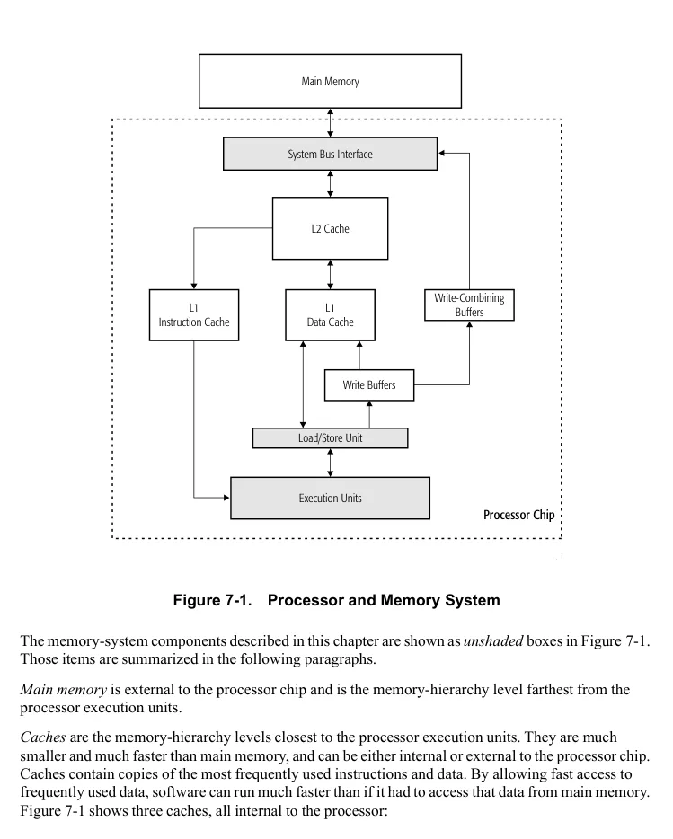

</details>


<!-- PDF source page: 248 | printed page: 186 -->

- *L1 Data Cache*—The L1 (level-1) data cache holds the data most recently read or written by the software running on the processor.
- *L1 Instruction Cache*—The L1 instruction cache is similar to the L1 data cache except that it holds only the instructions executed most frequently. In some processor implementations, the L1 instruction cache can be combined with the L1 data cache to form a unified L1 cache.
- *L2 Cache*—The L2 (level-2) cache is usually several times larger than the L1 caches, but it is also slower. It is common for L2 caches to be implemented as a unified cache containing both instructions and data. Recently used instructions and data that do not fit within the L1 caches can reside in the L2 cache. The L2 cache can be exclusive, meaning it does not cache information contained in the L1 cache. Conversely, inclusive L2 caches contain a copy of the L1-cached information.

Memory-read operations from cacheable memory first check the cache to see if the requested information is available. A *read hit* occurs if the information is available in the cache, and a *read miss* occurs if the information is not available. Likewise, a *write hit* occurs if the memory write can be stored in the cache, and a *write miss* occurs if it cannot be stored in the cache.

Caches are divided into fixed-size blocks called *cache lines*. The cache allocates lines to correspond to regions in memory of the same size as the cache line, aligned on an address boundary equal to the cache-line size. For example, in a cache with 32-byte lines, the cache lines are aligned on 32-byte boundaries and byte addresses 0007h and 001Eh are both located in the same cache line. The size of a cache line is implementation dependent. Most implementations have either 32-byte or 64-byte cache lines. The implemented cache line size is reported by CPUID Fn8000_0005 and Fn8000_0006 for the various caches, as described in Appendix E of Volume 3.

The process of loading data into a cache is a *cache-line fill*. Even if only a single byte is requested, all bytes in a cache line are loaded from memory. Typically, a cache-line fill must remove (evict) an existing cache line to make room for the new line loaded from memory. This process is called *cache-line replacement*. If the existing cache line was modified before the replacement, the processor performs a cache-line *writeback* to main memory when it performs the cache-line fill.

Cache-line writebacks help maintain *coherency* between the caches and main memory. Internally, the processor can also maintain cache coherency by *internally probing* (checking) the other caches and write buffers for a more recent version of the requested data. External devices can also check processor caches for more recent versions of data by *externally probing* the processor. Throughout this document, the term *probe* is used to refer to external probes, while internal probes are always qualified with the word *internal*.

*Write buffers* temporarily hold data writes when main memory or the caches are busy with other memory accesses. The existence of write buffers is implementation dependent.

Implementations of the architecture can use *write-combining buffers* if the order and size of non-cacheable writes to main memory is not important to the operation of software. These buffers can combine multiple, individual writes to main memory and transfer the data in fewer bus transactions.


<!-- PDF source page: 249 | printed page: 187 -->

<a id="7-1-single-processor-memory-access-ordering"></a>

## 7.1 Single-Processor Memory Access Ordering

The flexibility with which memory accesses can be ordered is closely related to the flexibility in which a processor implementation can *execute* and *retire* instructions. Instruction execution *creates* results and status and determines whether or not the instruction causes an exception. Instruction retirement *commits* the results of instruction execution, in program order, to software-visible resources such as memory, caches, write-combining buffers, and registers, or it causes an exception to occur if instruction execution created one.

Implementations of the AMD64 architecture retire instructions in program order, but implementations can execute instructions in any order, subject only to data dependencies. Implementations can also *speculatively execute* instructions—executing instructions before knowing they are needed. Internally, implementations manage data reads and writes so that instructions complete in order. However, because implementations can execute instructions out of order and speculatively, the sequence of memory accesses performed by the hardware can appear to be out of program order. The following sections describe the rules governing memory accesses to which processor implementations adhere. These rules may be further restricted, depending on the memory type being accessed. Further, these rules govern single processor operation; see “Multiprocessor Memory Access Ordering” on page 189 for multiprocessor ordering rules.

<a id="7-1-1-read-ordering"></a>

### 7.1.1 Read Ordering

Generally, reads do not affect program order because they do not affect the state of software-visible resources other than register contents. However, some system devices might be sensitive to reads. In such a situation software can map a read-sensitive device to a memory type that enforces strong read-ordering, or use read/write barrier instructions to force strong read-ordering.

For cacheable memory types, the following rules govern read ordering:

- Out-of-order reads are allowed to the extent that they can be performed transparently to software, such that the appearance of in-order execution is maintained. Out-of-order reads can occur as a result of out-of-order instruction execution or speculative execution. The processor can read memory and perform cache refills out-of-order to allow out-of-order execution to proceed.
- Speculative reads are allowed. A speculative read occurs when the processor begins executing a memory-read instruction before it knows the instruction will actually complete. For example, the processor can predict a branch will occur and begin executing instructions following the predicted branch before it knows whether the prediction is valid. When one of the speculative instructions reads data from memory, the read itself is speculative. Cache refills may also be performed speculatively.
- Reads can be reordered ahead of writes. Reads are generally given a higher priority by the processor than writes because instruction execution stalls if the read data required by an instruction is not immediately available. Allowing reads ahead of writes usually maximizes software performance.
- A read *cannot* be reordered ahead of a prior write if the read is from the same location as the prior write. In this case, the read instruction stalls until the write instruction completes execution. The


<!-- PDF source page: 250 | printed page: 188 -->

read instruction requires the result of the write instruction for proper software operation. For cacheable memory types, the write data can be forwarded to the read instruction before it is actually written to memory. **•** Instruction fetching constitutes a parallel, asynchronous stream of reads that is independent from and unordered with respect to the read accesses performed by loads in that instruction stream.

<a id="7-1-2-write-ordering"></a>

### 7.1.2 Write Ordering

Writes affect program order because they affect the state of software-visible resources. The following rules govern write ordering:

- Generally, out-of-order writes are *not* allowed. Write instructions executed out of order cannot commit (write) their result to memory until all previous instructions have completed in program order. The processor can, however, hold the result of an out-of-order write instruction in a private buffer (not visible to software) until that result can be committed to memory.
- It is possible for writes to *write-combining* memory types to appear to complete out of order, relative to writes into other memory types. See “Memory Types” on page 196 and “Write Combining” on page 203 for additional information.
- Speculative writes are *not* allowed. As with out-of-order writes, speculative write instructions cannot commit their result to memory until all previous instructions have completed in program order. Processors can hold the result in a private buffer (not visible to software) until the result can be committed.
- Write buffering is allowed. When a write instruction completes and commits its result, that result can be buffered until it is actually written to system memory in program order. Although the write buffer itself is not directly accessible by software, the results in the buffer are accessible by subsequent memory accesses to the locations that are buffered, including reads for which only a subset of bytes being accessed are in the buffer. For example, a doubleword read that overlaps a single modified byte in the write buffer can return the buffered value for that byte before that write has been committed to memory. In general, any read from cacheable memory returns the net result of all prior globally and locally visible writes to those bytes, as performed in program order. A given implementation may provide bytes from the write buffer to satisfy this, or may stall the read until any overlapping buffered writes have been committed to memory. For cacheable memory types, the write buffer can be read out-of-order and speculatively, just like memory.
- Write combining is allowed. In some situations software can relax the write-ordering rules through the use of a Write Combining memory type or non-temporal store instructions, and allow several writes to be combined into fewer writes to memory. When write-combining is used, it is possible for writes to other memory types to proceed ahead of (out-of-order) memory-combining writes, unless the writes are to the same address. Write-combining should be used only when the order of writes does not affect program order (for example, writes to a graphics frame buffer).


<!-- PDF source page: 251 | printed page: 189 -->

<a id="7-1-3-read-write-barriers"></a>

### 7.1.3 Read/Write Barriers

When the order of memory accesses must be strictly enforced, software can use read/write barrier instructions to force reads and writes to proceed in program order. Read/write barrier instructions force all prior reads or writes to complete before subsequent reads or writes are executed. The LFENCE, SFENCE, and MFENCE instructions are provided as dedicated read, write, and read/write barrier instructions (respectively). Serializing instructions, I/O instructions, and locked instructions (including the implicitly locked XCHG instruction) can also be used as read/write barriers. Barrier instructions are useful for controlling ordering between differing memory types as well as within one memory type; see Section 7.3.1, “Special Coherency Considerations,” on page 194 for details.

Table 7-2 on page 198 summarizes the memory-access ordering possible for each memory type supported by the AMD64 architecture.

<a id="7-2-multiprocessor-memory-access-ordering"></a>

## 7.2 Multiprocessor Memory Access Ordering

The term memory ordering refers to the sequence in which memory accesses are performed by the memory system, as observed by all processors or programs.

To improve performance of applications, AMD64 processors can speculatively execute instructions out of program order and temporarily hold out-of-order results. However, certain rules are followed with regard to normal cacheable accesses on naturally aligned boundaries to WB memory.

In the examples below, all memory values are initialized to zero.

From the point of view of a program, in ascending order of priority:

- All loads, stores and I/O operations from a single processor appear to occur in program order to the code running on that processor and all instructions appear to execute in program order.
- Successive stores from a single processor are committed to system memory and visible to other processors in program order. A store by a processor cannot be committed to memory before a read appearing earlier in the program has captured its targeted data from memory. In other words, stores from a processor cannot be reordered to occur prior to a load preceding it in program order. In this context:
- Loads do not pass previous loads (loads are not reordered). Stores do not pass previous stores (stores are not reordered)

**Processor 0 Processor 1** Store A  1 Load B Store B  1 Load A

Load A cannot read 0 when Load B reads 1. (This rule may be violated in the case of loads as part of a string operation, in which one iteration of the string reads 0 for Load A while another iteration reads 1 for Load B.) -Stores do not pass loads


<!-- PDF source page: 252 | printed page: 190 -->

**Processor 0 Processor 1** Load A Load B Store B  1 Store A  1

Load A and Load B cannot both read 1. **•** Stores from a processor appear to be committed to the memory system in program order; however, stores can be delayed arbitrarily by store buffering while the processor continues operation. Therefore, stores from a processor may not appear to be sequentially consistent.

**Processor 0 Processor 1** Store A  1 Store B  1 … … Store A  2 Store B  2 … … Load B Load A

Both Load A and Load B may read 1. Also, due to possible write combining one or both processors may not actually store a 1 at the designated location.

- Non-overlapping Loads may pass stores.

**Processor 0 Processor 1** Store A  1 Store B  1 Load B Load A

All combinations of values (00, 01, 10, and 11) may be observed by Processors 0 and 1. -Where sequential consistency is needed (for example in Dekker’s algorithm for mutual exclusion), an MFENCE instruction should be used between the store and the subsequent load, or a locked access, such as XCHG, should be used for the store.

**Processor 0 Processor 1** Store A  1 Store B  1 MFENCE MFENCE Load B Load A

Load A and Load B cannot both read 0. -Loads that partially overlap prior stores may return the modified part of the load operand from the store buffer, combining globally visible bytes with bytes that are only locally visible. To ensure that such loads return only a globally visible value, an MFENCE or locked access must be used between the store and the dependent load, or the store or load must be performed with a locked operation such as XCHG.

- Stores to different locations in memory observed from two (or more) other processors will appear in the same order to all observers. Behavior such as that shown in this code example,


<!-- PDF source page: 253 | printed page: 191 -->

**Processor 0 Processor 1 Processor X Processor Y** Store A  1 Store B  1 Load A (1) Load B (1) Load B (0) Load A (0)

in which processor X sees store A from processor 0 before store B from processor 1, while processor Y sees store B from processor 1 before store A from processor 0, is not allowed. **•** Dependent stores between different processors appear to occur in program order, as shown in the code example below.

**Processor 0 Processor 1 Processor 2** Store A  1 Load A (1) Store B  1 Load B (1) Load A (1)

If processor 1 reads a value from A (written by processor 0) before carrying out a store to B, and if processor 2 reads the updated value from B, a subsequent read of A must also be the updated value.

- The local visibility (within a processor) for a memory operation may differ from the global visibility (from another processor). Using a data bypass, a local load can read the result of a local store in a store buffer, before the store becomes globally visible. Program order is still maintained when using such bypasses.

**Processor 0 Processor 1** Store A  1 Store B  1 Load r1 A Load r3 B Load r2 B Load r4 A

Load A in processor 0 can read 1 using the data bypass, while Load A in processor 1 can read 0. Similarly, Load B in processor 1 can read 1 while Load B in processor 0 can read 0. Therefore, the result r1 = 1, r2 = 0, r3 = 1 and r4 = 0 may occur. There are no constraints on the relative order of when the Store A of processor 0 is visible to processor 1 relative to when the Store B of processor 1 is visible to processor 0. If a very strong memory ordering model is required that does not allow local store-load bypasses, an MFENCE instruction or a synchronizing instruction such as XCHG or a locked read-modify-write should be used between the store and the subsequent load. This enforces a memory ordering stronger than total store ordering.

**Processor 0 Processor 1** Store A  1 Store B  1 MFENCE MFENCE


<!-- PDF source page: 254 | printed page: 192 -->

**Processor 0 Processor 1**

Load r1 A Load r3 B Load r2 B Load r4 A

In this example, the MFENCE instruction ensures that any buffered stores are globally visible before the loads are allowed to execute, so the result r1 = 1, r2 = 0, r3 = 1 and r4 = 0 will not occur.

<a id="7-3-memory-coherency-and-protocol"></a>

## 7.3 Memory Coherency and Protocol

Implementations that support caching support a cache-coherency protocol for maintaining coherency between main memory and the caches. The cache-coherency protocol is also used to maintain coherency in a multiprocessor or multi-mastering system. All processors and all external bus-mastering devices participate in this cache-coherency protocol. In this section, the word processor encompasses any bus-mastering devices as well as other processors that participate in this cache-coherency protocol.

The cache-coherency protocol supported by the AMD64 architecture is the MOESDIF (modified, owned, exclusive, shared, dirty, invalid, forward) protocol. The states of the MOESDIF protocol are:

- *Invalid -* A cache line in the Invalid state does not hold a valid copy of the data. Valid copies of the data can be either in main memory or another processor cache.
- *Exclusive -* A cache line in the Exclusive state holds the most recent, correct copy of the data. The copy in main memory is also the most recent, correct copy of the data. No other processor holds a copy of the data.
- *Shared -* A cache line in the Shared state holds the most recent, correct copy of the data. Other processors in the system may hold copies of the data in the Shared state and one other processor may hold a copy of the data in the Owned or Forward state. If no other processor holds it in the Owned state, then the copy in main memory is also the most recent.
- *Forward -* A cache line in the Forward state holds the most recent, correct copy of the data. Other processors in the system may hold copies of the data in the Shared state, as well. The Forward state acts as a performance hint indicating which cache should respond with data when there is a broad casted probe.
- *Modified -* A cache line in the Modified state holds the most recent, correct copy of the data. The copy in main memory is stale (incorrect), and no other processor holds a copy. The data has usually been changed after it was received into the cache.
- *Dirty -* A cache line in the Dirty state holds the most recent, correct copy of the data. The copy in main memory is stale (incorrect), and no other processor holds a copy. The data has usually not been changed after it was received into the cache.
- *Owned -* A cache line in the Owned state holds the most recent, correct copy of the data. The Owned state is similar to the Shared state in that other processors can hold a copy of the most recent, correct data. Unlike the Shared state, however, the copy in main memory can be stale (incorrect). Only one processor can hold the data in the Owned state. Any other processors that hold the data are in the Shared state.


<!-- PDF source page: 255 | printed page: 193 -->

For the purpose of this section a read could be a load, an instruction fetch, or a read during address translation of page tables or other translation structures. A write could be a store, or a change made due to address translation, such as the setting of a page table's Accessed or Dirty bit.

Figure 7-2 on page 170 shows the general MOESDIF state transitions possible with various types of memory accesses. This is a logical software view of the possible state transitions of a cache-line, not a hardware view. Instruction-execution activity and external-bus transactions can both be used to modify the cache MOESDIF state in multiprocessing or multi-mastering systems.

**Figure 7-2. MOESDIF State Transitions**

<details>
<summary>Rendered source page 255 (figures/tables)</summary>

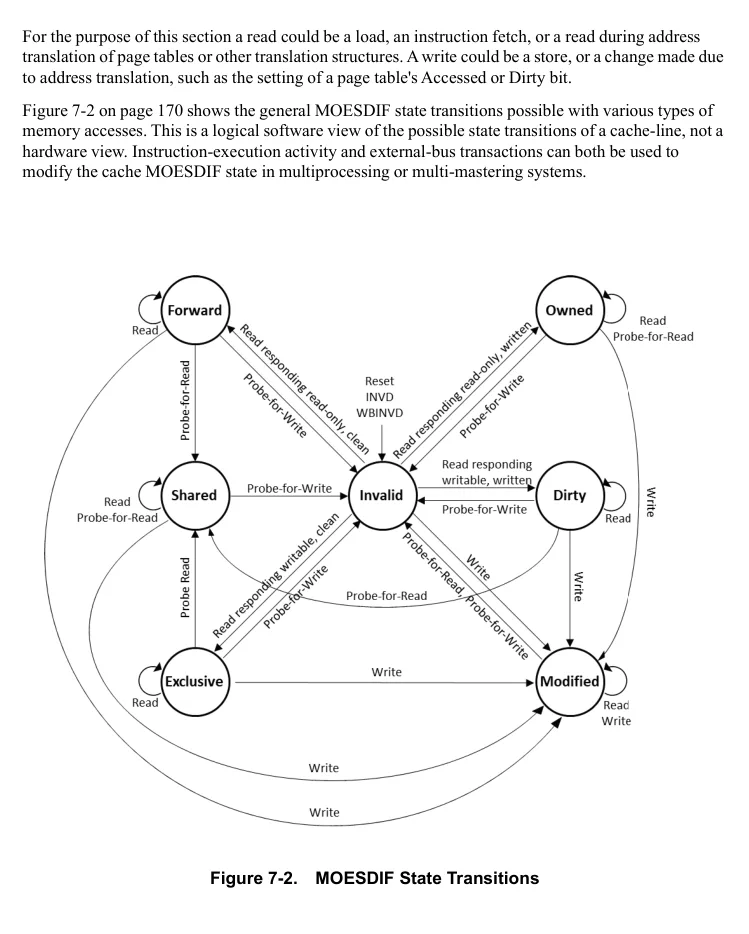

</details>


<!-- PDF source page: 256 | printed page: 194 -->

To maintain memory coherency, processors need to acquire the most recent copy of data before caching it internally. That copy can be in main memory or in the internal caches of other devices. When a processor has a cache read-miss or write-miss, it probes the other processors to determine whether the most recent copy of data is held in any of their caches and to perform cache state transitions if necessary. If one of the other caches holds the most recent copy, it may provide it to the requesting processor. The cache-line may be returned to the requesting processor in any of four conditions: read-only and clean, read-only and written, writable and clean, or writable and written. Otherwise, the most recent copy is provided by main memory.

There are two general types of probes:

- Probe-for-read indicates the external processor is requesting the data for read purposes.
- Probe-for-write indicates the external processor is requesting the data for the purpose of modifying it, or a processor has executed a CLFLUSH.

Referring back to Figure 7-2 on page 170, the state transitions involving probes are initiated by other processors or bus-mastering devices. In addition, some read probes are initiated by I/O devices that do not intend to cache the data. Some processor implementations do not change the MOESDIF state if the read probe is initiated by a device that does not intend to cache the data.

Read hits do not cause a MOESDIF-state change. Write hits generally cause a MOESDIF-state change into the Modified state and may require probe-for-write activity to cause cache state transitions on other processors that have the data. If the cache line is already in the Modified state, a write hit does not change its state.

A state transition caused by a read, probe-for-read, or probe-for-write can be caused by prefetching or speculative execution. Starting in family 17h, a transition to the Modified state does not occur speculatively, although the cache may still receive written data from another cache speculatively, putting the line into the Dirty state.

Some implementations may support a subset of the MOESDIF states. The specific operation of external-bus signals and transactions and how they influence a cache MOESDIF state are implementation dependent. For example, an implementation could convert a write miss to a WB memory type into two separate MOESDIF-state changes. The first would be a read-miss placing the cache line in the exclusive state. This would be followed by a write hit into the exclusive cache line, changing the cache-line state to Modified.

<a id="7-3-1-special-coherency-considerations"></a>

### 7.3.1 Special Coherency Considerations

In some cases, data can be modified in a manner that is impossible for the memory-coherency protocol to handle due to the effects of instruction prefetching. In such situations software must use serializing instructions and/or cache-invalidation instructions to ensure subsequent data accesses are coherent.

An example of this type of a situation is a page-table update followed by accesses to the physical pages referenced by the updated page tables. The following sequence of events shows what can happen when software changes the translation of virtual-page *A* from physical-page *M* to physical-page *N*:


<!-- PDF source page: 257 | printed page: 195 -->

1. 1. Software invalidates the TLB entry. The tables that translate virtual-page *A* to physical-page *M* are now held only in main memory. They are not cached by the TLB.

1. 2. Software changes the page-table entry for virtual-page A in main memory to point to physical-page *N* rather than physical-page *M*.

1. 3. Software accesses data in virtual-page A.

During Step 3, software expects the processor to access the data from physical-page *N*. However, it is possible for the processor to prefetch the data from physical-page *M* before the page table for virtual-page *A* is updated in Step 2. This is because the physical-memory references for the *page tables* are different than the physical-memory references for the *data*. Because the physical-memory references are different, the processor does not recognize them as requiring coherency checking and believes it is safe to prefetch the data from virtual-page A, which is translated into a read from physical page M. Similar behavior can occur when instructions are prefetched from beyond the page table update instruction.

To prevent this problem, software must use an INVLPG or MOV CR3 instruction immediately after the page-table update to ensure that subsequent instruction fetches and data accesses use the correct virtual-page-to-physical-page translation. It is not necessary to perform a TLB invalidation operation preceding the table update.

<a id="7-3-2-access-atomicity"></a>

### 7.3.2 Access Atomicity

Cacheable, naturally-aligned single loads or stores of up to a quadword are atomic on any processor model, as are misaligned loads or stores of less than a quadword that are contained entirely within a naturally-aligned quadword. Misaligned load or store accesses typically incur a small latency penalty. Model-specific relaxations of this quadword atomicity boundary, with respect to this latency penalty, may be found in a given processor's Software Optimization Guide.

Misaligned accesses can be subject to interleaved accesses from other processors or cache-coherent devices which can result in unintended behavior. Atomicity for misaligned accesses can be achieved where necessary by using the XCHG instruction or any suitable LOCK-prefixed instruction.

Processors that report CPUID Fn0000_0001_ECX[AVX](bit 28) = 1 extend the atomicity for cacheable, naturally-aligned single loads or stores from a quadword to a double quadword.

<a id="7-3-3-cacheable-locks-and-bus-locks"></a>

### 7.3.3 Cacheable Locks and Bus Locks

The processor guarantees access atomicity for locked read-modify-write operations. WB memory type, aligned locked read-modify-write (RMW) instructions are referred to as "cacheable locks". Cacheable locks are handled within a single processor and incur minimal or no performance penalty. Non-WB and misaligned locked RMW instructions are referred to as "bus locks" and require system-wide synchronization among all processors to guarantee atomicity. Bus locks may incur significant performance penalties for all processors in the system when any processor performs a non-WB or misaligned locked RMW instruction.


<!-- PDF source page: 258 | printed page: 196 -->

The processor performs a bus lock for any locked read-modify-write operations with a memory type other than WB, regardless of alignment.

The processor performs a bus lock for any misaligned locked read-modify-write operations, regardless of memory type. The alignment boundary at which a processor considers an access to be misaligned, and thus performs a bus lock instead of a cacheable lock for a locked read-modify-write operation, is implementation-dependent. A bus lock is always performed when an access spans an L1 data cache cacheline alignment boundary, but a processor may perform a bus lock at alignment boundaries smaller than the L1 data cache cacheline alignment boundary. The L1 data cache cacheline size and alignment boundary is specified by CPUID Fn8000_0005_ECX [L1 Data Cache Identifiers] (bits 7:0).

Atomic read-modify-write operations are performed on behalf of the types of operations listed in Table 7-1.

**Table 7-1. Atomic Read-Modify-Write Operation**

| Category | Operations | Comments |
| --- | --- | --- |
| Software atomic using a<br>memory operand | XCHG, LOCK prefix + ADD, SUB, AND, OR, XOR,<br>ADC, SBB, INC, DEC, NOT, NEG, BTC, BTR, BTS,<br>XADD, CMPXCHG | Atomic read-modify-write on<br>the memory operand |
| Segmentation and system<br>data structures | LSL, LAR, VERR, VERW, LDS, LES, LFS, LGS,<br>LSS, LTR, MOV DS, MOV ES, MOV FS, MOV GS,<br>MOV SS, POP DS, POP ES, POP FS, POP GS, POP<br>SS, Task switch | Setting Accessed bit in segment<br>or task descriptor or TSS |
| Far control transfe | CALL (far), JMP (far), RET (far), IRET, INTn, INT3,<br>INT0, INT1, exception or interrupt or trap gate | Setting Accessed bit in gate<br>descripto |
| Paging | Page table walk for instruction fetch or data access | Setting Accessed or Dirty bit in<br>page table entries |

The processor provides several methods for reporting bus lock activity to system software and reducing its frequency and performance penalty. Bus lock trap is described in section 8.2.2 on page 248 and section 13.1 on page 391, and SVM Bus Lock Threshold is described in section 15.14.5 on page 525.

<a id="7-4-memory-types"></a>

## 7.4 Memory Types

*Memory type* is an attribute that can be associated with a specific region of virtual or physical memory. Memory type designates certain caching and ordering behaviors for loads and stores to addresses in that region. Most memory types are explicitly assigned, although some are inferred by the hardware from current processor state and instruction context.

The AMD64 architecture defines the following memory types:

- *Uncacheable (UC)*—Reads from, and writes to, UC memory are not cacheable. Reads from UC memory cannot be speculative. Write-combining to UC memory is not allowed. Reads from or

<details>
<summary>Rendered source page 258 (figures/tables)</summary>

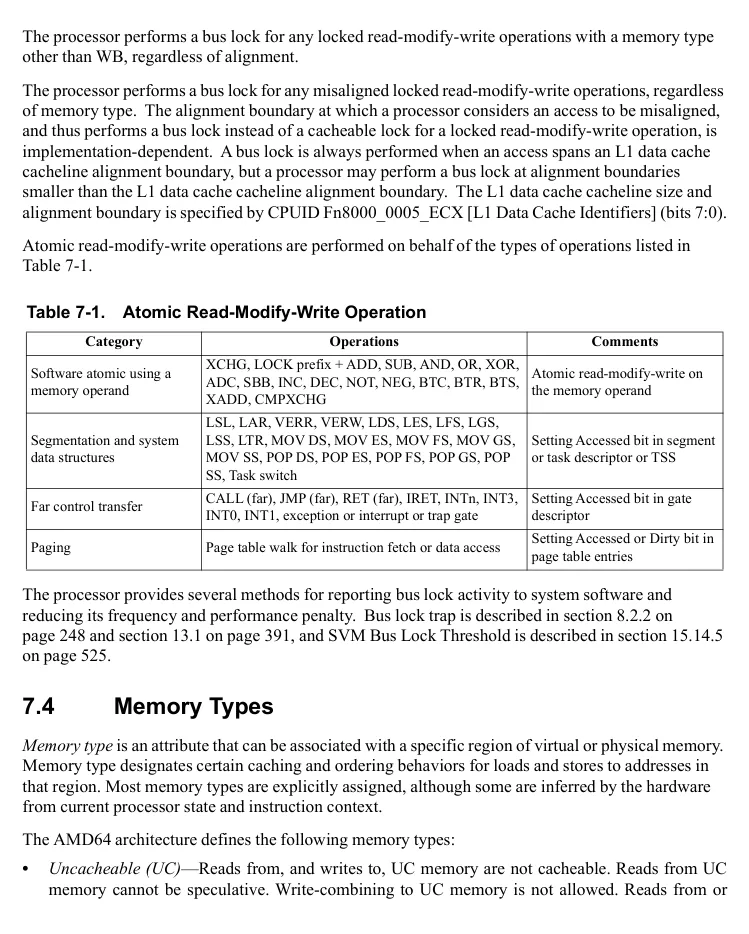

</details>


<!-- PDF source page: 259 | printed page: 197 -->

writes to UC memory cause the write buffers to be written to memory and be invalidated prior to the access to UC memory. The UC memory type is useful for memory-mapped I/O devices where strict ordering of reads and writes is important. Note that this strong ordering is with respect to UC accesses only; reads to memory types which support speculative operation may bypass non-conflicting UC accesses. **•* Cache Disable (CD)*—The CD memory type is a form of uncacheable memory type that is inferred when the L1 caches are disabled but not invalidated, or for certain conflicting memory type assignments from the Page Attribute Table (PAT) and Memory Type Range Register (MTRR) mechanisms. The former case occurs when caches are disabled by setting CR0.CD to 1 without invalidating the caches with either the INVD or WBINVD instruction for any reference to a region designated as cacheable. The latter case occurs when a specific type has been assigned to a virtual page via PAT, and a conflicting type has been assigned to the mapped physical page via an MTRR (see “Combined Effect of MTRRs and PAT” on page 230 and “Combining Memory Types, MTRRs” on page 553 for details). For the L1 data cache and the L2 cache, reads from, and writes to, CD memory that hit the cache, or any other caches in the system, cause the cache line(s) to be invalidated before accessing main memory. If a cache line is in the modified state, the line is written to main memory prior to being invalidated. The access is allowed to proceed after any invalidations are complete. For the L1 instruction cache, instruction fetches from CD memory that hit the cache read the cached instructions rather than access main memory. Instruction fetches that miss the cache access main memory and do not cause cache-line replacement. Writes to CD memory that hit in the instruction cache cause the line to be invalidated. **•* Write-Combining (WC)*—Reads from, and writes to, WC memory are not cacheable. Reads from WC memory can be speculative. Writes to this memory type can be combined internally by the processor and written to memory as a single write operation to reduce memory accesses. For example, four word writes to consecutive addresses can be combined by the processor into a single quadword write, resulting in one memory access instead of four. Reads from this memory can also be combined internally by the processor if they are to the same cache line. WC reads are not combined across serializing or barrier instructions. The WC memory type is useful for graphics-display memory buffers where the order of writes is not important. **•* Write-Combining Plus (WC+)*—WC+ is an uncacheable memory type, and combines writes in write-combining buffers like WC. Unlike WC (but like the CD memory type), accesses to WC+ memory probe the caches on all processors (including the caches of the processor issuing the request) to maintain coherency. This ensures that cacheable writes are observed by WC+ accesses. **•* Write-Protect (WP)*—Reads from WP memory are cacheable and allocate cache lines on a read miss. Reads from WP memory can be speculative. Writes to WP memory that hit in the cache do not update the cache. Instead, all writes update memory (write to memory), and writes that hit in the cache invalidate the cache line. Write buffering of WP memory is allowed.


<!-- PDF source page: 260 | printed page: 198 -->

The WP memory type is useful for shadowed-ROM memory where updates must be immediately visible to all devices that read the shadow locations. **•* Writethrough (WT)*—Reads from WT memory are cacheable and allocate cache lines on a read miss. Reads from WT memory can be speculative. All writes to WT memory update main memory, and writes that hit in the cache update the cache line (cache lines remain in the same state after a write that hits a cache line). Writes that miss the cache do not allocate a cache line. Write buffering of WT memory is allowed. **•* Writeback (WB)*—Reads from WB memory are cacheable and allocate cache lines on a read miss. Cache lines can be allocated in the shared, exclusive, or modified states. Reads from WB memory can be speculative. All writes that hit in the cache update the cache line and place the cache line in the modified state. Writes that miss the cache allocate a new cache line and place the cache line in the modified state. Writes to main memory only take place during writeback operations. Write buffering of WB memory is allowed. The WB memory type provides the highest-possible performance and is useful for most software and data stored in system memory (DRAM).

Table 7-2 shows the memory access ordering possible for each memory type supported by the AMD64 architecture. Table 7-4 on page 201 shows the ordering behavior of various operations on various memory types in greater detail. Table 7-3 on page 199 shows the caching policy for the same memory types.

**Table 7-2. Memory Access by Memory Type**

| Memory Access<br>Allowed | Memory Access<br>Allowed (2) | Memory Type / UC/CD | Memory Type / WC | Memory Type / WP | Memory Type / WT | Memory Type / WB |
| --- | --- | --- | --- | --- | --- | --- |
| Read | Out-of-Orde | no | yes | yes | yes | yes |
| Read | Speculative | no | yes | yes | yes | yes |
| Read | Reorder Before Write | no | yes | yes | yes | yes |
| Write | Out-of-Orde | no | yes | no | no | no |
| Write | Speculative | no | no | no | no | no |
| Write | Buffering | no | yes | yes | yes | yes |
| Write | Combining1 | no | yes | no | yes | yes |
| Note:<br>1. Write-combining buffers are separate from write (store) buffers. | Combining1 | no |  |  |  |  |

<details>
<summary>Rendered source page 260 (figures/tables)</summary>

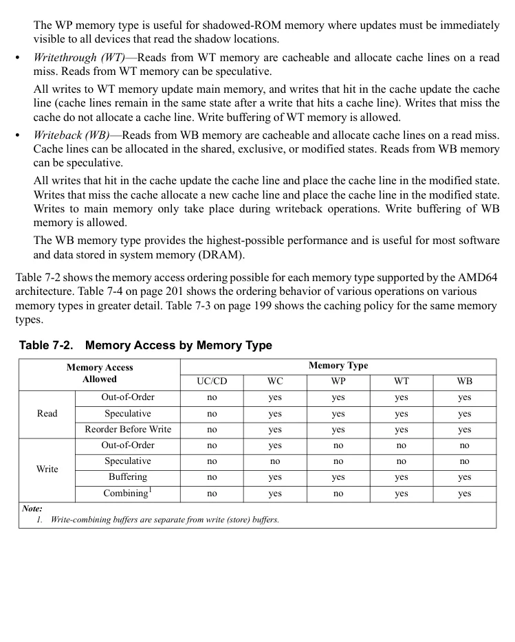

</details>


<!-- PDF source page: 261 | printed page: 199 -->

**Table 7-3. Caching Policy by Memory Type**

| Caching Policy | Memory Type / UC | Memory Type / CD | Memory Type / WC | Memory Type / WP | Memory Type / WT | Memory Type / WB |
| --- | --- | --- | --- | --- | --- | --- |
| Read Cacheable | no | no | no | yes | yes | yes |
| Write Cacheable | no | no | no | no | yes | yes |
| Read Allocate | no | no | no | yes | yes | yes |
| Write Allocate | no | no | no | no | no | yes |
| Write Hits Update Memory | yes2 | yes1 | yes2 | yes3 | yes | no |

> Note: 1. For the L1 data cache and the L2 cache, if an access hits the cache, the cache line is invalidated. If the cache line is in the modified state, the line is written to main memory and then invalidated. For the L1 instruction cache, read (instruction fetch) hits access the cache rather than main memory. 2. The data is not cached, so a cache write hit cannot occur. However, memory is updated. 3. Write hits update memory and invalidate the cache line.

<a id="7-4-1-instruction-fetching-from-uncacheable-memory"></a>

### 7.4.1 Instruction Fetching from Uncacheable Memory

Instruction fetches from an uncacheable memory type (including those for the CD type which don't hit in the instruction cache) may read a naturally-aligned block of memory no larger than an instruction cache line that contains multiple instructions, and may or may not repeat reads of a given block in the course of extracting instructions from it. In general, the exact sequence of read accesses is not deterministic, regardless of instruction stream contents, aside from the following constraints:

- instruction fetching of branch targets from uncacheable memory will only be done non-speculatively
- sequential instruction fetching will not transition speculatively from a cacheable memory type to an uncacheable memory type
- sequential instruction fetching will not speculatively cross more than one 4KB page boundary

It is recommended that MMIO devices that have read side-effects be separated from memory that's subject to uncacheable instruction fetches by at least one 4KB page.

<a id="7-4-2-memory-barrier-interaction-with-memory-types"></a>

### 7.4.2 Memory Barrier Interaction with Memory Types

Memory types other than WB may allow weaker ordering in certain respects. When the ordering of memory accesses to differing memory types must be strictly enforced, software can use the LFENCE, MFENCE or SFENCE barrier instructions to force loads and stores to proceed in program order. Table 7-4 on page 201 summarizes the cases where a memory barrier must be inserted between two memory operations.

The table is read as follows: the ROW is the first memory operation in program order, followed by the COLUMN, which is the second memory operation in program order. Each cell represents the ordered combination of the two memory operations and the letters *a*, *b*, *c*, *d*, *e*, *f*, *g*, *h*, *i*, *j*, *k*, and *l* within the cell represent the applicable memory ordering rule for that combination. These symbols are described in

<details>
<summary>Rendered source page 261 (figures/tables)</summary>

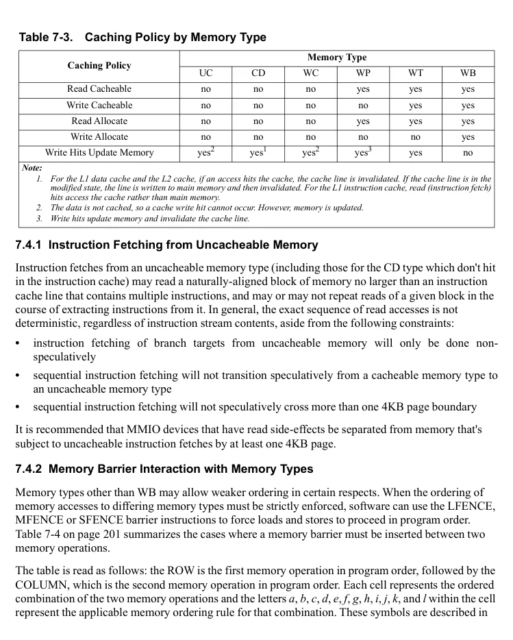

</details>


<!-- PDF source page: 262 | printed page: 200 -->

the footnotes below the table. In the table and footnotes, the abbreviation *nt* stands for non-temporal (load or store), *io* stands for input / output, *lf* for LFENCE, *sf* for SFENCE, and *mf* for MFENCE.

<a id="7-4-3-floating-point-instructions-and-memory-types"></a>

### 7.4.3 Floating Point Instructions and Memory Types

Uncacheable (UC) and Cache Disable (CD) memory types should not be used with x87, MMX, or SIMD (SSE, AVX, and AVX512) instructions. These instructions may read or write a memory location multiple times, which can have undesired side effects with these memory types.


<!-- PDF source page: 263 | printed page: 201 -->

**Table 7-4. Memory Access Ordering Rules**

| First Memory Operation | Second Memory Operation / Load (wp, wt, wb) | Second Memory Operation / Load (uc) | Second Memory Operation / Load (wc, wc+) | Second Memory Operation / Store (wp, wt, wb) | Second Memory Operation / Store (uc) | Second Memory Operation / Store (wc, wc+, non-temporal) | Second Memory Operation / Load/Store (io) | Second Memory Operation / Lock (atomic) | Second Memory Operation / Serialize instructions/ Interrupts/Exceptions |
| --- | --- | --- | --- | --- | --- | --- | --- | --- | --- |
| Load (wp, wt, wb) | a | f | (lf) | c | c | c | d | d | d |
| Load (uc) | a | f | (lf) | c | c | c | d | d | d |
| Load (wc, wc+) | a | f | (lf) | c | c | c | d | d | d |
| Store (wp, wt, wb) | e (mf) | f | e (mf) | g | g | h (sf) | d | d | d |
| Store (uc) | i | f | i | g | g | h (sf) | d | d | d |
| Store (wc, wc+, non-temporal) | e (mf) | f | e (mf) | j (sf) | g, m | h (sf) | d | d | d |
| Load/Store (io) | k | k | k | k | k | l | d, k | d, k | d, k |
| Lock (atomic) | k | k | k | k | k | k | d, k | d, k | d, k |
| Serialize instruction/<br>Interrupts/Exceptions | l | l | l | l | l | l | d, l | d, l | d, l |

a — A load (wp, wt, wb) may not pass a previous load (wp, wt, wb, wc, wc+, uc).

b — A load (wc, wc+) may pass a previous load (wp, wt, wb, wc, wc+). To ensure memory order, an LFENCE instruction must be inserted between the two loads.

c — A store (wp, wt, wb, uc, wc, wc+, nt) may not pass a previous load (wp, wt, wb, uc, wc, wc+, nt).

d — All previous loads and stores complete to memory or I/O space before a memory access for an I/O, locked or serializing instruction is issued.

e — A load (wp, wt, wb, wc, wc+) may pass a previous non-conflicting store (wp, wt, wb, wc, wc+, nt). To ensure memory order, an MFENCE instruction must be inserted between the store and the load.

f — A load or store (uc) does not pass a previous load or store (wp, wt, wb, uc, wc, wc+, nt).

g — A store (wp, wt, wb, uc) does not pass a previous store (wp, wt, wb, uc).

h — A store (wc, wc+, nt) may pass a previous store (wp, wt, wb) or non-conflicting store (wc, wc+, nt). To ensure memory order, an SFENCE instruction must be inserted between these two stores. A store (wc, wc+, nt) does not pass a previous conflicting store (wc, wc+, nt, uc).

i — A load (wp, wt, wb, wc, wc+) may pass a previous non-conflicting store (uc). To ensure memory order, an MFENCE instruction must be inserted between the store and the load.

j — A store (wp, wt, wb) may pass a previous store (wc, wc+, nt). To ensure memory order, an SFENCE instruction must be inserted between these two stores.

k — All loads and stores associated with the I/O and locked instructions complete to memory (no buffered stores) before a load or store from a subsequent instruction is issued.

<details>
<summary>Rendered source page 263 (figures/tables)</summary>

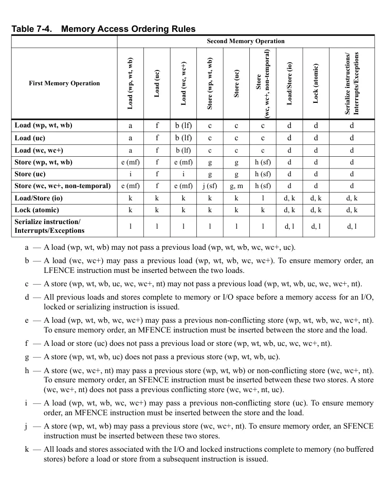

</details>


<!-- PDF source page: 264 | printed page: 202 -->

l — All loads and stores complete to memory for the serializing instruction before the subsequent instruction fetch is issued.

m — A store (uc) does not pass a previous store (wc, wc+).

<a id="7-5-buffering-and-combining-memory-writes"></a>

## 7.5 Buffering and Combining Memory Writes

<a id="7-5-1-write-buffering"></a>

### 7.5.1 Write Buffering

Writes to memory (main memory and caches) can be stored internally by the processor in *write buffers* (also known as store buffers) before actually writing the data into a memory location. System performance can be improved by buffering writes, as shown in the following examples:

- When higher-priority memory transactions, such as reads, compete for memory access with writes, writes can be delayed in favor of reads, which minimizes or eliminates an instruction-execution stall due to a memory-operand read.
- When the memory is busy, buffering writes while the memory is busy removes the writes from the instruction-execution pipeline, which frees instruction-execution resources.

The processor manages the write buffer so that it is transparent to software. Memory accesses check the write buffer, and the processor completes writes into memory from the buffer in program order. Also, the processor completely empties the write buffer by writing the contents to memory as a result of performing any of the following operations:

- *SFENCE Instruction*—Executing a store-fence (SFENCE) instruction forces all memory writes before the SFENCE (in program order) to be written into memory (or, for WB type, the cache) before memory writes that follow the SFENCE instruction. The memory-fence (MFENCE) instruction has a similar effect, but it forces the ordering of loads in addition to stores.
- *Serializing Instructions*—Executing a serializing instruction forces the processor to retire the serializing instruction (complete both instruction execution and result writeback) before the next instruction is fetched from memory.
- *I/O instructions*—Before completing an I/O instruction, all previous reads and writes must be written to memory, and the I/O instruction must complete before completing subsequent reads or writes. Writes to I/O-address space (OUT instruction) are never buffered.
- *Locked Instructions*—A locked instruction (an instruction executed using the LOCK prefix) or an XCHG instruction (which is implicitly locked) must complete *after* all previous reads and writes and *before* subsequent reads and writes. Locked writes are never buffered, although locked reads and writes are cacheable.
- *Interrupts and Exceptions*—Interrupts and exceptions, including virtualization intercepts (#VMEXIT), are serializing events that force the processor to write all results from the write buffer to memory before fetching the first instruction from the interrupt or exception service routine.
- *UC Memory Reads*—UC memory reads are not reordered ahead of writes.


<!-- PDF source page: 265 | printed page: 203 -->

Write buffers can behave similarly to *write-combining buffers* because multiple writes may be collected internally before transferring the data to caches or main memory. See the following section for a description of write combining.

<a id="7-5-2-write-combining"></a>

### 7.5.2 Write Combining

Write-combining memory uses a different buffering scheme than write buffering described above. Writes to write-combining (WC) memory can be combined internally by the processor in a buffer for more efficient transfer to main memory at a later time. For example, 16 doubleword writes to consecutive memory addresses can be combined in the WC buffers and transferred to main memory as a single burst operation rather than as individual memory writes.

The following instructions perform writes to WC memory:

1. (V) MASKMOVDQU
- MASKMOVQ
2. (V) MOVNTDQ
- MOVNTI
3. (V) MOVNTPD
4. (V) MOVNTPS
- MOVNTQ
- MOVNTSD
- MOVNTSS

WC memory is not cacheable. A WC buffer writes its contents only to main memory.

The size and number of WC buffers available is implementation dependent. The processor assigns an address range to an empty WC buffer when a WC-memory write occurs. The size and alignment of this address range is equal to the buffer size. All subsequent writes to WC memory that fall within this address range can be stored by the processor in the WC-buffer entry until an event occurs that causes the processor to write the WC buffer to main memory. After the WC buffer is written to main memory, the processor can assign a new address range on a subsequent WC-memory write.

Writes to consecutive addresses in WC memory are not required for the processor to combine them. The processor combines any WC memory write that falls within the active-address range for a buffer. Multiple writes to the same address overwrite each other (in program order) until the WC buffer is written to main memory.

It is possible for writes to proceed out of program order when WC memory is used. For example, a write to cacheable memory that follows a write to WC memory can be written into the cache before the WC buffer is written to main memory. For this reason, and the reasons listed in the previous paragraph, software that is sensitive to the order of memory writes should avoid using WC memory.

WC buffers are written to main memory under the same conditions as the write buffers, namely when:

- Executing a store-fence (SFENCE) instruction.


<!-- PDF source page: 266 | printed page: 204 -->

- Executing a serializing instruction.
- Executing an I/O instruction.
- Executing an MMIO access (load or store to UC memory type)
- Executing a locked instruction (an instruction executed using the LOCK prefix).
- Executing an XCHG instruction
- An interrupt or exception occurs.

WC buffers are also written to main memory when:

- A subsequent non-write-combining operation has a write address that matches the WC-buffer active-address range.
- A write to WC memory falls outside the WC-buffer active-address range. The existing buffer contents are written to main memory, and a new address range is established for the latest WC write.

<a id="7-6-memory-caches"></a>

## 7.6 Memory Caches

The AMD64 architecture supports the use of internal and external caches. The size, organization, coherency mechanism, and replacement algorithm for each cache is implementation dependent. Generally, the existence of the caches is transparent to both application and system software. In some cases, however, software can use cache-structure information to optimize memory accesses or manage memory coherency. Such software can use the extended-feature functions of the CPUID instruction to gather information on the caching subsystem supported by the processor. For more information, see Section 3.3, “Processor Feature Identification,” on page 71.

<a id="7-6-1-cache-organization-and-operation"></a>

### 7.6.1 Cache Organization and Operation

Although the detailed organization of a processor cache depends on the implementation, the general constructs are similar. L1 caches—data and instruction, or unified—and L2 caches usually are implemented as n-way set-associative caches. Figure 7-3 on page 205 shows a typical *logical* organization of an n-way set-associative cache. The physical implementation of the cache can be quite different.


<!-- PDF source page: 267 | printed page: 205 -->

**Figure 7-3. Cache Organization Example**

<details>
<summary>Extracted figure labels</summary>

```text
Tag
Data
Other
Tag
Data
Other
. . .
Way 1
Way 0
Way n-1
Tag
Data
Other
Set 0
Set 1
Set 2
Line Data 0,2
Line Data 1,2
Line Data n-1,2
Set 3
. . .
Set m-1
Miss
Hit
. . .
=
Hit
MUX n:1
Data
Cache
Hit Data
Physical Address
Tag Field
Index Field
Offset Field
513-213.eps
```

</details>

As shown in Figure 7-3, the cache is organized as an array of cache lines. Each cache line consists of three parts: a cache-data line (a fixed-size copy of a memory block), a tag, and other information. Rows of cache lines in the cache array are *sets*, and columns of cache lines are *ways*. In an n-way set-associative cache, each set is a collection of n lines. For example, in a four-way set-associative cache, each set is a collection of four cache lines, one from each way.

<details>
<summary>Rendered source page 267 (figures/tables)</summary>

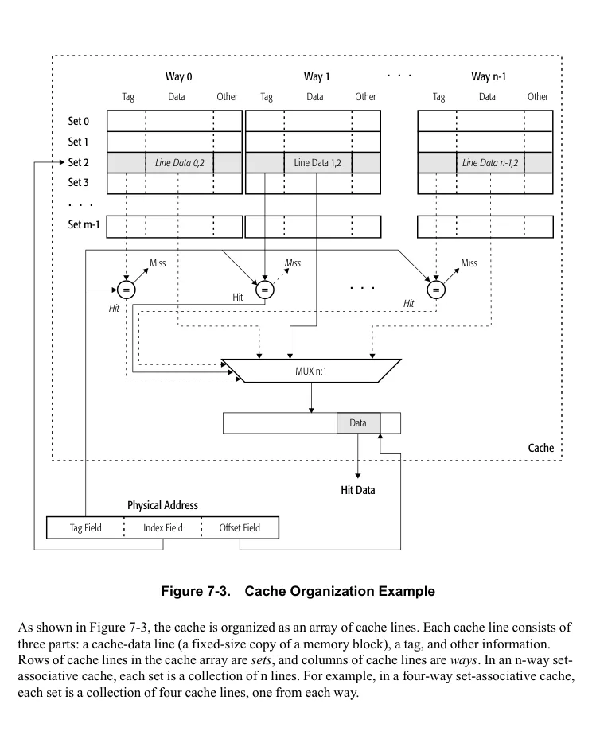

</details>


<!-- PDF source page: 268 | printed page: 206 -->

The cache is accessed using the physical address of the data or instruction being referenced. To access data within a cache line, the physical address is used to select the set, way, and byte from the cache. This is accomplished by dividing the physical address into the following three fields:

- *Index—*The *index field* selects the cache set (row) to be examined for a hit. All cache lines within the set (one from each way) are selected by the index field.
- *Tag—*The *tag field* is used to select a specific cache line from the cache set. The physical-address tag field is compared with each cache-line tag in the set. If a match is found, a cache hit is signaled, and the appropriate cache line is selected from the set. If a match is not found, a cache miss is signaled.
- *Offset—*The *offset field* points to the first byte in the cache line corresponding to the memory reference. The referenced data or instruction value is read from (or written to, in the case of memory writes) the selected cache line starting at the location selected by the offset field.

In Figure 7-3 on page 205, the physical-address index field is shown selecting Set 2 from the cache. The tag entry for each cache line in the set is compared with the physical-address tag field. The tag entry for Way 1 matches the physical-address tag field, so the cache-line data for Set 2, Way 1 is selected using the n:1 multiplexer. Finally, the physical-address offset field is used to point to the first byte of the referenced data (or instruction) in the selected cache line.

Cache lines can contain other information in addition to the data and tags, as shown in Figure 7-3 on page 205. MOESI state and the state bits associated with the cache-replacement algorithm are typical pieces of information kept with the cache line. Instruction caches can also contain pre-decode or branch-prediction information. The type of information stored with the cache line is implementation dependent.

**Self-Modifying Code.** Software that stores into its own pending instruction stream with the intent of then executing the modified instructions is classified as self-modifying code. To support self-modifying code, AMD64 processors will flush any lines from the instruction cache that such stores hit, and will additionally check whether an instruction being modified is already in decode or execution behind the store instruction. If so, it will flush the pipeline and restart instruction fetch to acquire and re-decode the updated instruction bytes. No special action is needed by software for such updates to be immediately recognized. As with cache coherency, the check for instructions that are in flight is performed using physical addresses to avoid aliasing issues that could arise with virtual (linear) addresses.

When the modified bytes are in cacheable memory, the data cache may retain a copy of the modified cache line in a shared state, and the instruction cache refill may be satisfied from any suitable place in the memory hierarchy in a model-dependent manner that maintains cache coherency.

**Cross-Modifying Code.** Software that stores into the active instruction stream of another executing thread with the intent that the other thread subsequently execute the modified instruction stream is classified as cross-modifying code. There are two approaches to consider: asynchronous modification and synchronous modification.


<!-- PDF source page: 269 | printed page: 207 -->

**Asynchronous modification.** This is done with a write to the target instruction stream with no particular coordination being done between the writing and receiving threads. The nature of the code being executed by the target thread is such that it is insensitive to the exact timing of the update, for example executing in a known loop until an update to a branch instruction's offset takes it down a new path (or an update to an immediate operand, or opcode, or other instruction field). Such modifications must be done via a single store to the target thread's instruction stream that is contained entirely within a naturally-aligned quadword, and is subject to the constraints given here. A key aspect is that, although the store is performed atomically, the affected quadword may be read more than once in the process of extracting instruction bytes from it. This can result in the following scenarios resulting from a single store:

1. 1. An update to two successive instructions, A and B, to A' and B' may result in execution of an A-B' sequence rather than A'-B'. However it will not result in an A'-B sequence since stores become visible to instruction fetchers in program order, and instruction fetchers read memory sequentially between taken branches.

1. 2. A modification to one instruction A that changes it to two instructions A'-B will only result in execution of A'-B.

1. 3. A modification to two instructions A-B that combines them into one instruction A' may result in a sequence of A-X, where X starts at the point in A' where B previously started.

Note that since stores to the instruction stream are observed by the instruction fetcher in program order, one can do multiple modifications to an area of the target thread's code that is beyond reach of the thread's current control flow, followed by a final asynchronous update that alters the control flow to expose the modified code to fetching and execution.

If the desired action cannot be achieved within these constraints, a synchronous modification approach must be used for reliable operation.

**Synchronous modification.** This entails a producer-consumer approach to the modification, where the target thread waits on a signal from the modifying thread, such as changing the state of a shared variable, before executing the modified code. The modifying thread writes to the target instruction bytes in any desired manner, then writes the synchronizing variable to release the target thread. Upon release, the target thread must then execute a serializing instruction such as CPUID or MFENCE (a locked operation is not sufficient) before proceeding to the modified code to avoid executing a stale view of the instructions which may have been speculatively fetched. Note that such speculative fetching is a function of branch predictor operation which is completely beyond the control of software.

See Volume 1, Chapter 3, “Semaphores,” for a discussion of instructions that are useful for interprocessor synchronization.

<a id="7-6-2-cache-control-mechanisms"></a>

### 7.6.2 Cache Control Mechanisms

The AMD64 architecture provides a number of mechanisms for controlling the cacheability of memory. These are described in the following sections.


<!-- PDF source page: 270 | printed page: 208 -->

**Cache Disable.** Bit 30 of the CR0 register is the cache-disable bit, CR0.CD. Caching is enabled when CR0.CD is cleared to 0, and caching is disabled when CR0.CD is set to 1. When caching is disabled, reads and writes access main memory.

Software can disable the cache while the cache still holds valid data (or instructions). If a read or write hits the L1 data cache or the L2 cache when CR0.CD=1, the processor does the following:

1. 1. Writes the cache line back if it is in the modified or owned state.

1. 2. Invalidates the cache line.

1. 3. Performs a non-cacheable main-memory access to read or write the data.

If an instruction fetch hits the L1 instruction cache when CR0.CD=1, some processor models may read the cached instructions rather than access main memory. When CR0.CD=1, the exact behavior of L2 and L3 caches is model-dependent, and may vary for different types of memory accesses.

The processor also responds to cache probes when CR0.CD=1. Probes that hit the cache cause the processor to perform Step 1. Step 2 (cache-line invalidation) is performed only if the probe is performed on behalf of a memory write or an exclusive read.

**Writethrough Disable.** Bit 29 of the CR0 register is the *not writethrough* disable bit, CR0.NW. In early x86 processors, CR0.NW is used to control cache writethrough behavior, and the combination of CR0.NW and CR0.CD determines the cache operating mode.

*In early x86 processors*, clearing CR0.NW to 0 enables writeback caching for main memory, effectively disabling writethrough caching for main memory. When CR0.NW=0, software can disable writeback caching for specific memory pages or regions by using other cache control mechanisms. When software sets CR0.NW to 1, writeback caching is disabled for main memory, while writethrough caching is enabled.

*In implementations of the AMD64 architecture*, CR0.NW is not used to qualify the cache operating mode established by CR0.CD. Table 7-5 shows the effects of CR0.NW and CR0.CD on the AMD64 architecture cache-operating modes.

**Table 7-5. AMD64 Architecture Cache-Operating Modes**

| CR0.CD | CR0.NW | Cache Operating Mode |
| --- | --- | --- |
| 0 | 0 | Cache enabled with a writeback-caching policy. |
| 0 | 1 | Invalid setting—causes a general-protection exception (#GP). |
| 1 | 0 | Cache disabled. See “Cache Disable” on page 208. |
| 1 | 1 | Cache disabled. See “Cache Disable” on page 208. |

**Page-Level Cache Disable.** Bit 4 of all paging data-structure entries controls page-level cache disable (PCD). When a data-structure-entry PCD bit is cleared to 0, the page table or physical page pointed to by that entry is cacheable, as determined by the CR0.CD bit. When the PCD bit is set to 1, the page table or physical page is not cacheable. The PCD bit in the paging data-structure base-register

<details>
<summary>Rendered source page 270 (figures/tables)</summary>

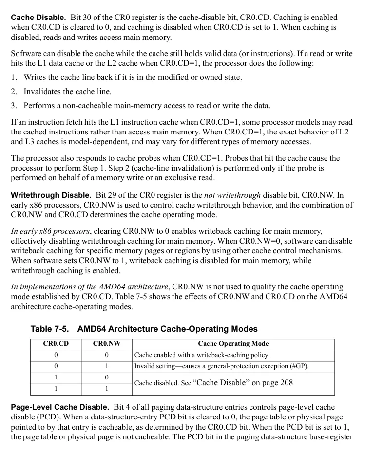

</details>


<!-- PDF source page: 271 | printed page: 209 -->

(bit 4 in CR3) controls the cacheability of the highest-level page table in the page-translation hierarchy.

**Page-Level Writethrough Enable.** Bit 3 of all paging data-structure entries is the page-level writethrough enable control (PWT). When a data-structure-entry PWT bit is cleared to 0, the page table or physical page pointed to by that entry has a writeback caching policy. When the PWT bit is set to 1, the page table or physical page has a writethrough caching policy. The PWT bit in the paging data-structure base-register (bit 3 in CR3) controls the caching policy of the highest-level page table in the page-translation hierarchy.

The corresponding PCD bit must be cleared to 0 (page caching enabled) for the PWT bit to have an effect.

**Memory Typing.** Two mechanisms are provided for software to control access to and cacheability of specific memory regions:

- The memory-type range registers (MTRRs) control cacheability based on physical addresses. See “MTRRs” on page 218 for more information on the use of MTRRs.
- The page-attribute table (PAT) mechanism controls cacheability based on virtual addresses. PAT extends the capabilities provided by the PCD and PWT page-level cache controls. See “Page-Attribute Table Mechanism” on page 227 for more information on the use of the PAT mechanism.

System software can combine the use of both the MTRRs and PAT mechanisms to maximize control over memory cacheability.

If the MTRRs are disabled in implementations that support the MTRR mechanism, the default memory type is set to uncacheable (UC). Memory accesses are not cached even if the caches are enabled by clearing CR0.CD to 0. Cacheable memory types must be established using the MTRRs in order for memory accesses to be cached.

**Cache Control Precedence.** The cache-control mechanisms are used to define the memory type and cacheability of main memory and regions of main memory. Taken together, the most restrictive memory type takes precedence in defining the caching policy of memory. The order of precedence is:

1. 1. Uncacheable (UC)

1. 2. Write-combining (WC)

1. 3. Write-protected (WP)

1. 4. Writethrough (WT)

1. 5. Writeback (WB)

For example, assume a large memory region is designated a writethrough type using the MTRRs. Individual pages within that region can have caching disabled by setting the appropriate page-table PCD bits. However, no pages within that region can have a writeback caching policy, regardless of the page-table PWT values.


<!-- PDF source page: 272 | printed page: 210 -->

<a id="7-6-3-cache-and-memory-management-instructions"></a>

### 7.6.3 Cache and Memory Management Instructions

**Data Prefetch.** The prefetch instructions are used by software as a hint to the processor that the referenced data is likely to be used in the near future. The processor can preload the cache line containing the data in anticipation of its use. PREFETCH provides a hint that the data is to be read. PREFETCHW provides a hint that the data is to be written. The processor can mark the line as modified if it is preloaded using PREFETCHW.

**Memory Ordering.** Instructions are provided for software to enforce memory ordering (serialization) in weakly-ordered memory types. These instructions are:

- *SFENCE (store fence)*—forces all memory writes (stores) preceding the SFENCE (in program order) to be written into memory before memory writes following the SFENCE.
- *LFENCE (load fence)*—forces all memory reads (loads) preceding the LFENCE (in program order) to be read from memory before memory reads following the LFENCE. In some systems, LFENCE may be configured to be dispatch serializing. In systems where CPUID Fn8000_0021_EAX[LFenceAlwaysSerializing] (bit 2) = 1, LFENCE is always dispatch serializing.
- *MFENCE (memory fence)*—forces all memory accesses (reads and writes) preceding the MFENCE (in program order) to be written into or read from memory before memory accesses following the MFENCE.

**Cache Line Writeback and Flush.** The CLFLUSH instruction (writeback, if modified, and invalidate) takes the byte memory-address operand (a linear address), and checks to see if the address is cached. If the address is cached, the entire cache line containing the address is invalidated. If any portion of the cache line is dirty (in the modified or owned state), the entire line is written to main memory before it is invalidated. CLFLUSH affects *all caches* in the memory hierarchy—internal and external to the processor, and across all cores. The CLWB instruction operates in the same manner except it does not invalidate the cache line. The checking and invalidation process continues until the address has been updated in memory and, for CLFLUSH, invalidated in all caches.

In most cases, the underlying memory type assigned to the address has no effect on the behavior of this instruction. However, when the underlying memory type for the address is UC or WC (as defined by the MTRRs), the processor does not proceed with checking all caches to see if the address is cached. In both cases, the address is uncacheable, and invalidation is unnecessary. Write-combining buffers are written back to memory if the corresponding physical address falls within the buffer active-address range.

**Cache Writeback and Invalidate.** Unlike the CLFLUSH and CLWB instructions, the WBINVD and WBNOINVD instructions operate on the entire cache, rather than a single cache line. The WBINVD and WBNOINVD instructions first write back all cache lines that are dirty (in the modified or owned state) to main memory. After writeback is complete, the WBINVD instruction additionally invalidates all cache lines. The checking and invalidation process continues until all internal caches in the executing core's path to system memory are invalidated. In some implementations this may include caches in other branches of the system's cache hierarchy; see the description of these instructions in


<!-- PDF source page: 273 | printed page: 211 -->

volume 3 for more detail. For either instruction, a special bus cycle is transmitted to higher-level external caches directing them to perform a writeback-and-invalidate operation.

**Cache Invalidate.** The INVD instruction is used to invalidate all cache lines. Unlike the WBINVD instruction, dirty cache lines are not written to main memory. The process continues until all internal caches have been invalidated. A special bus cycle is transmitted to higher-level external caches directing them to perform an invalidation.

The INVD instruction should only be used in situations where memory coherency is not required.

<a id="7-6-4-serializing-instructions"></a>

### 7.6.4 Serializing Instructions

Serializing instructions force the processor to retire the serializing instruction and all previous instructions before the next instruction is fetched. A serializing instruction is retired when the following operations are complete:

- The instruction has executed.
- All registers modified by the instruction are updated.
- All memory updates performed by the instruction are complete.
- All data held in the write buffers have been written to memory.

Serializing instructions can be used as a barrier between memory accesses to force strong ordering of memory operations. Care should be exercised in using serializing instructions because they modify processor state and may affect program flow. The instructions also force execution serialization, which can significantly degrade performance. When strongly-ordered memory accesses are required, but execution serialization is not, it is recommended that software use the memory-ordering instructions described on page 210.

The following are serializing instructions:

- *Non-Privileged Instructions*
- CPUID
- IRET
- RSM
- MFENCE
- *Privileged Instructions*
- MOV CRn
- MOV DRn
- LGDT, LIDT, LLDT, LTR
- WRMSR (see note 1)
- WBINVD, WBNOINVD, INVD
- INVLPG


<!-- PDF source page: 274 | printed page: 212 -->

***Note 1:** Writes to the following MSRs are not serializing:* SPEC_CTRL, PRED_CMD, all x2APIC MSRs.

A dispatch serializing instruction is a lighter form of ordering than a serializing instruction. A dispatch serializing instruction forces the processor to retire the serializing instruction and all previous instructions before the next instruction is executed. In some systems, LFENCE may be configured to be dispatch serializing. In systems where CPUID Fn8000_0021_EAX[LFenceAlwaysSerializing](bit 2) = 1, LFENCE is always dispatch serializing.

<a id="7-6-5-cache-and-processor-topology"></a>

### 7.6.5 Cache and Processor Topology

Cache and processor topology information is useful in the optimal management of system and application resources. Exposing processor and cache topology information to the programmer allows software to make more efficient use of hardware multithreading resources delivering optimal performance. Shared resources in a specific cache and processor topology may require special consideration in the optimization of multiprocessing software performance.

The processor topology allows software to determine which cores or logical processors are siblings in a compute unit, node, and processor package. For example, a scheduler can then choose to either compact or scatter threads (or processes) to cores in compute units, nodes, or across the cores in the entire physical package in order to optimize for a power and performance profile.

Topology extensions define processor topology at both the node, compute unit and cache level. Topology extensions include cache properties with sharing and the processor topology identified. The result is a simplified extension to the CPUID instruction that describes the processors cache topology and leverages existing industry cache properties folded into AMD’s topology extension description.

Topology extensions definition supports existing and future processors with varying degrees of cache level sharing. Topology extensions also support the description of a simple compute unit with one core or packages where the number of cores in a node and/or compute unit are not an even power of two.

**CPUID Function 8000_001D: Cache Topology Definition.** CPUID Function 8000_001D describes the hierarchical relationships of cache levels relative to the cores which share these resources. Function 8000_001D is defined to be called iteratively with the value 8000001Dh in EAX and an additional parameter in ECX. To gather information for all cache levels, software must execute the CPUID instruction with 8000001Dh in EAX and ECX set to increasing values beginning with 0 until a value of 0 is returned from EAX[4:0], which indicates no more cache descriptions.

If software dynamically manages cache configuration, it will need to update any stored cache properties for the processor.

**CPUID Function 8000_001E: Processor Topology Definition.** CPUID Function 8000_001E describes processor topology with component identifiers. To read the processor topology, definition software calls the CPUID instruction with the value 8000001Eh in EAX. After execution, the APIC ID is represented in EAX. EBX contains the compute unit description in the processor, while ECX contains system unique node identification. Software may read this information once for each core.


<!-- PDF source page: 275 | printed page: 213 -->

**CPUID Function 8000_0026: Extended CPU Topology.** CPUID Fn8000_0026 reports extended topology level information, including heterogenous topology, for the cores within the system. The topology level is selected by the value passed to the instruction in ECX. To discover the topology of a system, software should execute the CPUID instruction with an EAX value of 80000026h and increasing values of ECX, starting with a value of zero, until CPUID Fn8000_0026_ECX[LevelType](bits 15:8) returns zero. More information about CPUID Fn8000_0026 can be found in Appendix E of Volume 3.

The following CPUID functions provide processor topology information:

- CPUID Fn8000_0001_ECX
- CPUID Fn8000_0008_ECX
- CPUID Fn8000_001D_EAX, EBX, ECX, EDX
- CPUID Fn8000_001E_EAX, EBX, ECX
- CPUID Fn8000_0026_EAX, EBX, ECX, EDX

For more information using the CPUID instruction, see Section 3.3, “Processor Feature Identification,” on page 71.

<a id="7-6-6-l3-cache-range-reservation"></a>

### 7.6.6 L3 Cache Range Reservation

The L3 Cache Range Reservation feature allows a portion of the L3 cache to be reserved for a specific system physical address range. This capability is intended to reduce access latency for a specified range of memory by keeping it in the L3 cache as much as possible, which may be useful in some latency-sensitive applications. However, it does not provide a guaranteed level of performance. Since many factors can affect the performance of a particular process, performance evaluation of specific configurations is critical to determining whether to enable the L3 Range Reservation feature. Further details are provided in the following subsections.

**CPUID Feature Flag.** Support for the L3 Cache Range Reservation feature is indicated by CPUID Fn8000_0020_EBX[L3RR] (bit 4) = 1.

**L3 Range Reservation Registers.** The following MSRs are used to program L3 Range Reservation:

- L3 Range Reserve Base Address Register (C001_1095h)
- L3 Range Reserve Maximum Address Register (C001_1096h)
- L3 Range Reserve Way Mask (C001_109Ah)

L3 Range Reservation MSR layouts are shown below. The MSR bit position numbering uses *P* and *W*, where:

- P is equal to the value of CPUID Fn8000_0008_EAX[PhysAddrSize].
- W is equal to the value of CPUID Fn8000_001D_EBX_x03[CacheNumWays].


<!-- PDF source page: 276 | printed page: 214 -->

<a id="l3-range-reserve-base-address"></a>

#### L3 Range Reserve Base Address

**Figure 7-4. L3 Range Reserve Base Address Register (L3RangeReserveBaseAddr)**

<details>
<summary>Extracted figure labels</summary>

```text
63
P P-1
32
Reserved
BaseAddr[P-1:32]
31
12 11
0
Base[Addr31:12]
Reserved
Bits
Mnemonic
Description
Access type
63:P
Reserved
MBZ
P-1:12
BaseAddr[P-1:12]
Base Address, 4KB aligned SPA
R/W
11:0
Reserved
MBZ
```

</details>

<a id="l3-range-reserve-maximum-address"></a>

#### L3 Range Reserve Maximum Address

**Figure 7-5. L3 Range Reserve Maximum Address Register (L3RangeReserveMaxAddr)**

<details>
<summary>Extracted figure labels</summary>

```text
63
P P-1
32
Reserved
MaxAddr[P-1:32]
31
12 11
0
MaxAddr[31:12]
Reserved
En
Bits
Mnemonic
Description
Access type
63:P
Reserved
MBZ
P-1:12
MaxAddr[P-1:12]
Maximum Address, 4KB aligned SPA
R/W
11:1
Reserved
MBZ
0
En
Enable
R/W
```

</details>

<details>
<summary>Rendered source page 276 (figures/tables)</summary>

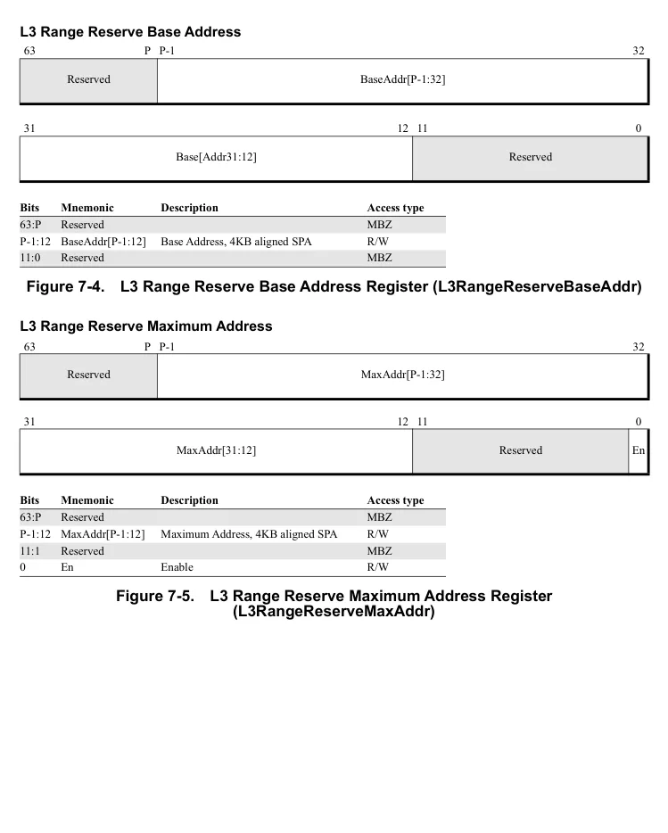

</details>


<!-- PDF source page: 277 | printed page: 215 -->

<a id="l3-range-reserve-way-mask"></a>

#### L3 Range Reserve Way Mask

**Figure 7-6. L3 Range Reserve Way Mask Register (L3RangeReserveWayMask)**

<details>
<summary>Extracted figure labels</summary>

```text
63
32
Reserved
31
0
Reserved
WayMask[W-1:0]
Bits
Mnemonic
Description
Access type
63:W
Reserved
MBZ
W-1:0
WayMask[W-1:0]
Way Mask, WayMask[n]=1 allocates L3
way n to range reserved addresses.
R/W
```

</details>

**L3 Range Reservation Register Programming.** A system physical address *A* is in the reserved range if:

*BaseAddr[P-1:12] &lt;= A[P-1:12] &lt; MaxAddr[P-1:12]*

The L3 ways enabled for use by cache lines in the reserved range will be referred to as the reserved region of the cache.

To enable the L3 Range Reservation feature, software must follow the following sequence of MSR writes:

1. 1. Write MSR C001_109Ah to program the WayMask[W-1:0] field.

1. 2. Write MSR C001_1095h to program the BaseAddr[P-1:12] field.

1. 3. Write MSR C001_1096h to program the MaxAddr[P-1:12] field and set En to 1.

To disable the L3 Range Reservation feature, set En to zero.

See “Programming Considerations” on page 216 for other requirements and considerations.

**Range Reservation used as Range Lock.** The L3 Range Reservation feature can be used to lock the reserved range of addresses in the L3 cache in the reserved region. To accomplish this, software must calculate the size of the L3 cache using the following fields of CPUID information:

- CacheNumSets from CPUID Fn8000001D_ECX_x03.
- CacheLineSize from CPUID Fn8000001D_EBX_x03.

Using the above parameters, the L3 cache size per-way in bytes is calculated as:

*L3SizePerWay = CacheNumSets * (CacheLineSize + 1).*

<details>
<summary>Rendered source page 277 (figures/tables)</summary>

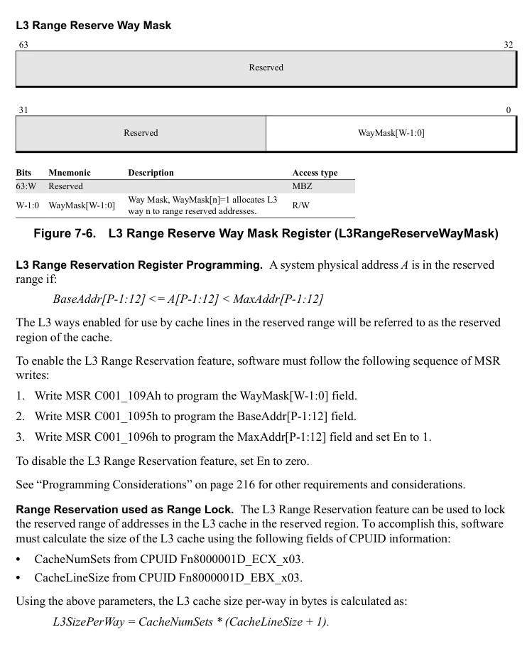

</details>


<!-- PDF source page: 278 | printed page: 216 -->

Software can determine the size of the reserved range it wishes to lock in bytes and allocate as many L3-ways as needed by programming the *WayMask* field in MSR C001_109Ah. Software must set CR0.CD on all logical processors sharing the L3 cache and execute the WBINVD instruction to flush the L3 cache before enabling the Range Reservation feature. If the size of the reserved range is less than the number of bytes of L3 cache allocated by the *WayMask* field in MSR C001_109Ah, the reserved range will remain “locked” in cache. The reserved range follows coherency rules around evictions, probes, and cache flushes. If the size of the reserved range does not fit in the allocated L3 ways as programmed in the *WayMask* field in MSR C001_109Ah, the cache lines within the reserved range are replaced using normal L3 cache replacement policy, in those allocated L3 ways. However, the reserved region is only used by cache lines in the reserved range.

**Range Reservation Operation.** The scope of L3 range reservation is limited to an L3 cache and the cores sharing that L3 cache. Setting up a reserved range reserves a portion of the corresponding cache for use by a range of system physical addresses but does not bring the data or instructions at those addresses into the cache. The cache is filled with the data or instructions from the reserved address region as those addresses are accessed by the associated logical processors, either through explicit references by software, by hardware-based prefetching or by speculative execution of instructions which may or may not eventually retire. After the L3 range reservation is enabled, the cache lines with addresses in the reserved range are cached in the reserved region of the L3 cache. The cache lines with addresses outside the reserved range are cached in the unreserved region of the L3 cache.

Whether L3 range reservation is enabled or disabled, a cache line in the reserved range will still behave coherently with respect to all coherent operations. Placing a cache line in a reserved location does not exempt it from the rules of coherency. In case where a cache line outside the reserved range is present in the reserved region at the time the L3 range reservation feature is enabled or where a cache line in the reserved range is present in unreserved regions of the cache, normal coherent accesses by any processor in the system will still read the correct, current data from these locations.

**Programming Considerations.** The Range Reservation configuration registers should not be modified while cacheable traffic is in flight. The recommended way to meet this requirement is to set the CR0.CD bit on all logical processors which are connected to the cache being configured. For the L3 cache, that includes all the logical processors sharing an L3 cache and for the L2 cache that includes the two logical processors which share a physical core and L2 cache.

If a given range is reserved in multiple L3 caches in a system, the cache lines can be cached in each of them as long as none of the logical processors accessing the data modify it. Modifying the cache lines will remove them from all other caches. However, once the modification is complete the cache lines can once again be re-cached in multiple caches if accessed by those processors. The cache lines thus accessed are again placed in the reserved region of the L3 cache upon access. It is not necessary to disable and re-enable the address range in order to re-establish the reserved region; the affected addresses will be brought into the reserved cache regions again as they are accessed, although the initial accesses to those ranges will incur the latency penalty associated with retrieving the data or instructions from memory or another cache.

Setting up a reserved range does not affect the cacheability rules of the addresses in that range. For example, if the page tables specify that the memory type for a page is UC, including that page within a


<!-- PDF source page: 279 | printed page: 217 -->

range reserved region will not cause the addresses on that page to become cacheable. Instead, a portion of the cache will become unusable by any address since the addresses for which that portion of cache is reserved cannot be installed in the cache and all other addresses are prevented from being installed there.

When Secure Memory Encryption (SME) or Secure Encrypted Virtualization (SEV) is enabled, the L3 range reservation feature cannot be used on system physical addresses that are encrypted. See “Secure Memory Encryption” on page 238 and “Secure Encrypted Virtualization” on page 588 for details.

Reserving a way of the L3 cache for range reservation exempts those ways from being used by the L3 QoS Allocation feature. The ways that overlap between any of the *L3 QoS Allocation Mask* MSRs (MSR 0x0000_0C90h through 0x0000_0C9Fh) will be unavailable for use by the L3 QoS Allocation feature and only available for use by the L3 Range Reservation feature.

<a id="7-7-memory-type-range-registers"></a>

## 7.7 Memory-Type Range Registers

The AMD64 architecture supports three mechanisms for software access-control and cacheability-control over memory regions. These mechanisms can be used in place of similar capabilities provided by external chipsets used with early x86 processors.

This section describes a control mechanism that uses a set of programmable model-specific registers (MSRs) called the *memory-type-range registers* (MTRRs). The MTRR mechanism provides system software with the ability to manage hardware-device memory mapping. System software can characterize physical-memory regions by type (e.g., ROM, flash, memory-mapped I/O) and assign hardware devices to the appropriate physical-memory type.

Another control mechanism is implemented as an extension to the page-translation capability and is called the *page attribute table* (PAT). It is described in “Page-Attribute Table Mechanism” on page 227. Like the MTRRs, PAT provides system software with the ability to manage hardware-device memory mapping. With PAT, however, system software can characterize physical pages and assign virtually-mapped devices to those physical pages using the page-translation mechanism. PAT may be used in conjunction with the MTTR mechanism to maximize flexibility in memory control.

Finally, control mechanisms are provided for managing memory-mapped I/O. These mechanisms employ extensions to the MTRRs and a separate feature called the *top-of-memory registers*. The MTRR extensions include additional MTRR type-field encodings for fixed-range MTRRs and variable-range I/O range registers (IORRs). These mechanisms are described in “Memory-Mapped I/O” on page 232.

<a id="7-7-1-mtrr-type-fields"></a>

### 7.7.1 MTRR Type Fields

The MTRR mechanism provides a means for associating a physical-address range with a memory type (see “Memory Types” on page 196). The MTRRs contain a type field used to specify the memory type in effect for a given physical-address range.


<!-- PDF source page: 280 | printed page: 218 -->

There are two variants of the memory type-field encodings: standard and extended. Both the standard and extended encodings use type-field bits 2:0 to specify the memory type. For the standard encodings, bits 7:3 are reserved and must be zero. For the extended encodings, bits 7:5 are reserved, but bits 4:3 are defined as the RdMem and WrMem bits. “Extended Fixed-Range MTRR Type-Field Encodings” on page 232 describes the function of these extended bits and how software enables them. Only the fixed-range MTRRs support the extended type-field encodings. Variable-range MTRRs use the standard encodings.

Table 7-6 on page 218 shows the memory types supported by the MTRR mechanism and their encoding in the MTRR type fields referenced throughout this section. Unless the extended type-field encodings are explicitly enabled, the processor uses the type values shown in Table 7-6.

**Table 7-6. MTRR Type Field Encodings**

| Type Value | Type Name | Type Description |
| --- | --- | --- |
| 00h | UC—Uncacheable | All accesses are uncacheable. Write combining is not<br>allowed. Speculative accesses are not allowed |
| 01h | WC—Write-Combining | All accesses are uncacheable. Write combining is allowed.<br>Speculative reads are allowed |
| 04h | WT—Writethrough | Reads allocate cache lines on a cache miss. Cache lines are<br>not allocated on a write miss. Write hits update the cache and<br>main memory. |
| 05h | WP—Write-Protect | Reads allocate cache lines on a cache miss. All writes update<br>main memory. Cache lines are not allocated on a write miss.<br>Write hits invalidate the cache line and update main memory. |
| 06h | WB—Writeback | Reads allocate cache lines on a cache miss, and can allocate to<br>either the shared, exclusive, or modified state. Writes allocate<br>to the modified state on a cache miss. |

If the MTRRs are disabled in implementations that support the MTRR mechanism, the default memory type is set to uncacheable (UC). *Memory accesses are not cached even if the caches are enabled by clearing CR0.CD to 0.* Cacheable memory types must be established using the MTRRs to enable memory accesses to be cached.

<a id="7-7-2-mtrrs"></a>

### 7.7.2 MTRRs

Both fixed-size and variable-size address ranges are supported by the MTRR mechanism. The fixed-size ranges are restricted to the lower 1 Mbyte of physical-address space, while the variable-size ranges can be located anywhere in the physical-address space.

Figure 7-7 on page 219 shows an example mapping of physical memory using the fixed-size and variable-size MTRRs. The areas shaded gray are not mapped by the MTRRs. Unmapped areas are set to the software-selected default memory type.

<details>
<summary>Rendered source page 280 (figures/tables)</summary>

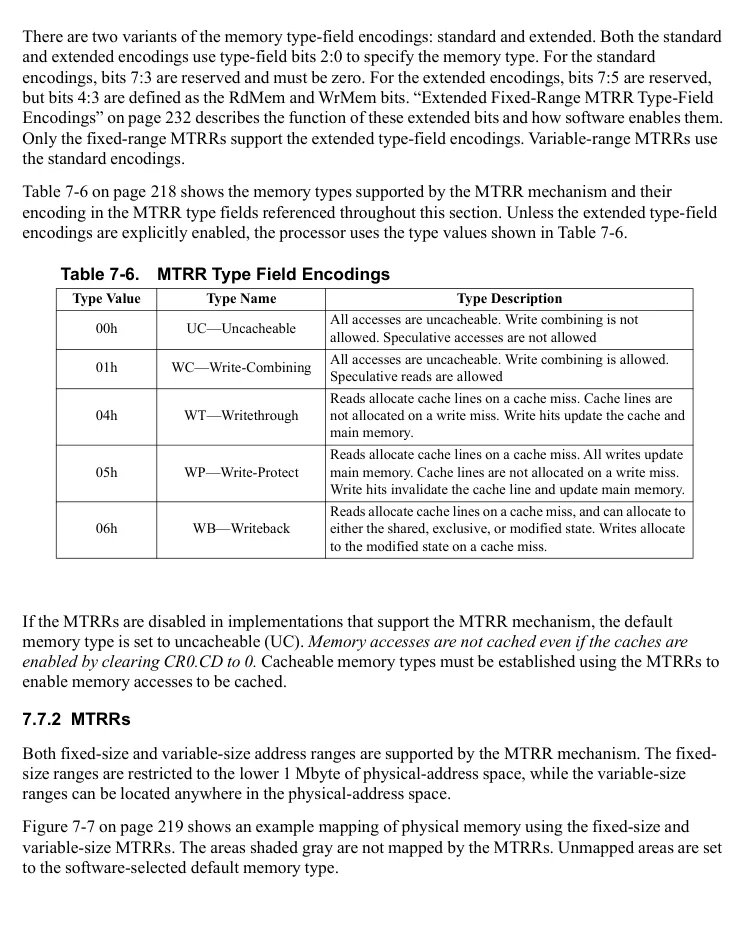

</details>


<!-- PDF source page: 281 | printed page: 219 -->

**Figure 7-7. MTRR Mapping of Physical Memory**

<details>
<summary>Extracted figure labels</summary>

```text
Physical Memory
0_FFFF_FFFF_FFFFh
Default (Unmapped) Ranges
Up to 8 Variable Ranges
0F_FFFFh
10_0000h
64 4-Kbyte Ranges
256 Kbytes
16 16-Kbyte Ranges
512 Kbytes
8 64-Kbyte Ranges
513-214.eps
00_0000h
```

</details>

MTRRs are 64-bit model-specific registers (MSRs). They are read using the RDMSR instruction and written using the WRMSR instruction. See “Memory-Typing MSRs” on page 727 for a listing of the MTRR MSR numbers. The following sections describe the types of MTRRs and their function.

**Fixed-Range MTRRs.** The fixed-range MTRRs are used to characterize the first 1 Mbyte of physical memory. Each fixed-range MTRR contains eight type fields for characterizing a total of eight memory ranges. Fixed-range MTRRs support extended type-field encodings as described in “Extended Fixed-Range MTRR Type-Field Encodings” on page 232. The extended type field allows a fixed-range MTRR to be used as a fixed-range IORR. Figure 7-8 on page 220 shows the format of a fixed-range MTRR.

<details>
<summary>Rendered source page 281 (figures/tables)</summary>

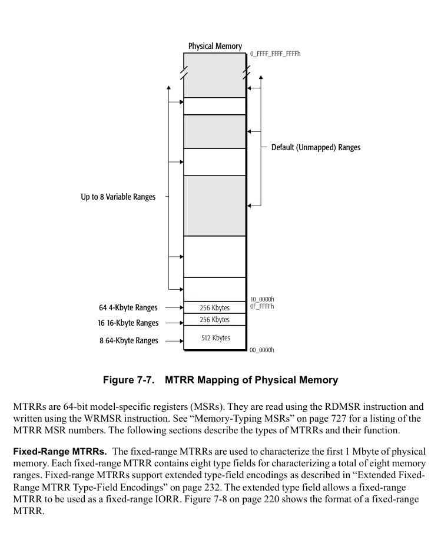

</details>


<!-- PDF source page: 282 | printed page: 220 -->

**Figure 7-8. Fixed-Range MTRR**

<details>
<summary>Extracted figure labels</summary>

```text
63
56 55
48 47
40 39
32
Type
31
24 23
16 15
8
7
0
Type
```

</details>

For the purposes of memory characterization, the first 1 Mbyte of physical memory is segmented into a total of 88 non-overlapping memory ranges, as follows:

- The 512 Kbytes of memory spanning addresses 00_0000h to 07_FFFFh are segmented into eight 64-Kbyte ranges. A single MTRR is used to characterize this address space.
- The 256 Kbytes of memory spanning addresses 08_0000h to 0B_FFFFh are segmented into 16 16-Kbyte ranges. Two MTRRs are used to characterize this address space.
- The 256 Kbytes of memory spanning addresses 0C_0000h to 0F_FFFFh are segmented into 64 4-Kbyte ranges. Eight MTRRs are used to characterize this address space.

Table 7-7 shows the address ranges corresponding to the type fields within each fixed-range MTRR. The gray-shaded heading boxes represent the bit ranges for each type field in a fixed-range MTTR. See Table 7-6 on page 218 for the type-field encodings.

**Table 7-7. Fixed-Range MTRR Address Ranges**

| Physical Address Range (in hexadecimal) / 63–56 | Physical Address Range (in hexadecimal) / 55–48 | Physical Address Range (in hexadecimal) / 47–40 | Physical Address Range (in hexadecimal) / 39–32 | Physical Address Range (in hexadecimal) / 31–24 | Physical Address Range (in hexadecimal) / 23–16 | Physical Address Range (in hexadecimal) / 15–8 | Physical Address Range (in hexadecimal) / 7–0 | Register Name |
| --- | --- | --- | --- | --- | --- | --- | --- | --- |
| 70000–7<br>FFFF | 60000–6<br>FFFF | 50000–5<br>FFFF | 40000–4<br>FFFF | 30000–3<br>FFFF | 20000–2<br>FFFF | 10000–1<br>FFFF | 00000–0<br>FFFF | MTRRfix64K 00000 |
| 9C000–9<br>FFFF | 98000–9<br>BFFF | 94000–9<br>7FFF | 90000–9<br>3FFF | 8C000–8<br>FFFF | 88000–8<br>BFFF | 84000–8<br>7FFF | 80000–8<br>3FFF | MTRRfix16K 80000 |
| BC000–<br>BFFFF | B8000–B<br>BFFF | B4000–B<br>7FFF | B0000–B<br>3FFF | AC000–<br>AFFFF | A8000–<br>ABFFF | A4000–<br>A7FFF | A0000–<br>A3FFF | MTRRfix16K A0000 |
| C7000–C<br>7FFF | C6000–C<br>6FFF | C5000–C<br>5FFF | C4000–C<br>4FFF | C3000–C<br>3FFF | C2000–C<br>2FFF | C1000–C<br>1FFF | C0000–C<br>0FFF | MTRRfix4K C0000 |
| CF000–<br>CFFFF | CE000–<br>CEFFF | CD000–<br>CDFFF | CC000–<br>CCFFF | CB000–<br>CBFFF | CA000–<br>CAFFF | C9000–C<br>9FFF | C8000–C<br>8FFF | MTRRfix4K C8000 |
| D7000–<br>D7FFF | D6000–<br>D6FFF | D5000–<br>D5FFF | D4000–<br>D4FFF | D3000–<br>D3FFF | D2000–<br>D2FFF | D1000–<br>D1FFF | D0000–<br>D0FFF | MTRRfix4K D0000 |
| DF000–<br>DFFFF | DE000–<br>DEFFF | DD000–<br>DDFFF | DC000–<br>DCFFF | DB000–<br>DBFFF | DA000–<br>DAFFF | D9000–<br>D9FFF | D8000–<br>D8FFF | MTRRfix4K D8000 |

<details>
<summary>Rendered source page 282 (figures/tables)</summary>

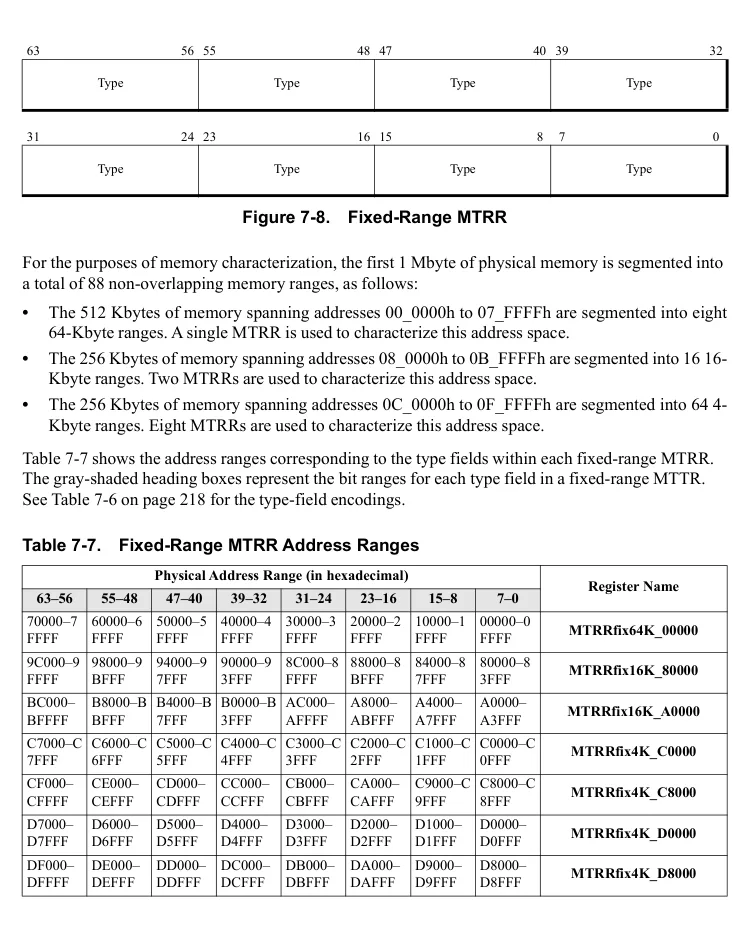

</details>


<!-- PDF source page: 283 | printed page: 221 -->

**Table 7-7. Fixed-Range MTRR Address Ranges (continued)**

| Physical Address Range (in hexadecimal) / 63–56 | Physical Address Range (in hexadecimal) / 55–48 | Physical Address Range (in hexadecimal) / 47–40 | Physical Address Range (in hexadecimal) / 39–32 | Physical Address Range (in hexadecimal) / 31–24 | Physical Address Range (in hexadecimal) / 23–16 | Physical Address Range (in hexadecimal) / 15–8 | Physical Address Range (in hexadecimal) / 7–0 | Register Name |
| --- | --- | --- | --- | --- | --- | --- | --- | --- |
| E7000–E<br>7FFF | E6000–E<br>6FFF | E5000–E<br>5FFF | E4000–E<br>4FFF | E3000–E<br>3FFF | E2000–E<br>2FFF | E1000–E<br>1FFF | E0000–E<br>0FFF | MTRRfix4K E0000 |
| EF000–E<br>FFFF | EE000–E<br>EFFF | ED000–<br>EDFFF | EC000–<br>ECFFF | EB000–<br>EBFFF | EA000–<br>EAFFF | E9000–E<br>9FFF | E8000–E<br>8FFF | MTRRfix4K E8000 |
| F7000–F<br>7FFF | F6000–F<br>6FFF | F5000–F<br>5FFF | F4000–F<br>4FFF | F3000–F<br>3FFF | F2000–F<br>2FFF | F1000–F<br>1FFF | F0000–F<br>0FFF | MTRRfix4K F0000 |
| FF000–F<br>FFFF | FE000–F<br>EFFF | FD000–F<br>DFFF | FC000–F<br>CFFF | FB000–F<br>BFFF | FA000–F<br>AFFF | F9000–F<br>9FFF | F8000–F<br>8FFF | MTRRfix4K F8000 |

**Variable-Range MTRRs.** The variable-range MTRRs can be used to characterize any address range within the physical-memory space, including all of physical memory. Up to eight address ranges of varying sizes can be characterized using the MTRR. Two variable-range MTRRs are used to characterize each address range: MTRRphysBase*n* and MTRRphysMask*n* (*n* is the address-range number from 0 to 7). For example, address-range 3 is characterized using the MTRRphysBase3 and MTRRphysMask3 register pair.

Figure 7-9 shows the format of the MTRRphysBase*n* register and Figure 7-10 on page 222 shows the format of the MTRRphysMask*n* register. The fields within the register pair are read/write.

**MTRRphysBase*****n* Registers.** The fields in these variable-range MTRRs, shown in Figure 7-9, are:

- *Type*—Bits 7:0. The memory type used to characterize the memory range. See Table 7-6 on page 218 for the type-field encodings. Variable-range MTRRs do not support the extended type-field encodings.
- *Range Physical Base-Address (PhysBase)*—Bits 51:12. The memory-range base-address in physical-address space. PhysBase is aligned on a 4-Kbyte (or greater) address in the 52-bit physical-address space supported by the AMD64 architecture. PhysBase represents the most-significant 40-address bits of the physical address. Physical-address bits 11:0 are assumed to be 0.

Note that a given processor may implement less than the architecturally-defined physical address size of 52 bits.

<details>
<summary>Rendered source page 283 (figures/tables)</summary>

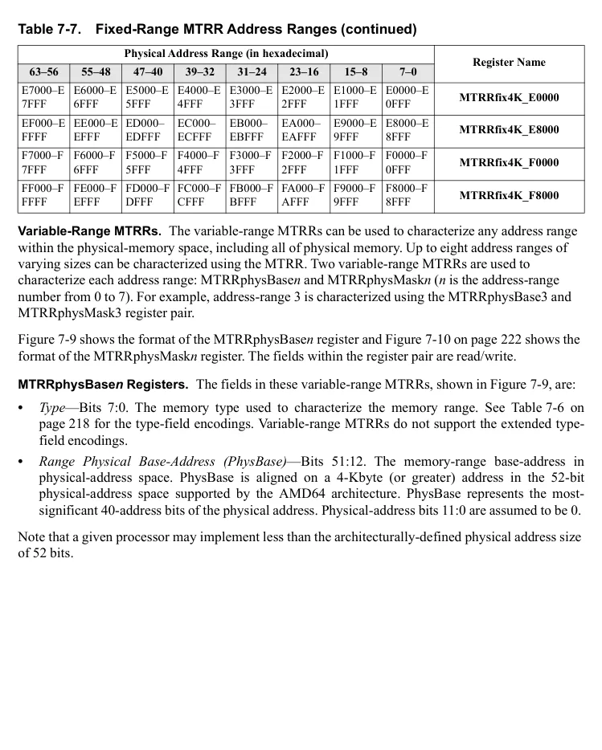

</details>


<!-- PDF source page: 284 | printed page: 222 -->

63 52 51 32

Reserved PhysBase[51:32]

31 12 11 8 7 0

PhysBase[31:12] Reserved Type

**Bits Mnemonic Description Access type** 63:52 Reserved MBZ 51:12 PhysBase Range Physical Base Address R/W 11:8 Reserved MBZ 7:0 Type Default Memory Type R/W

**Figure 7-9. MTRRphysBasen Register**

**MTRRphysMask*****n* Registers.** The fields in these variable-range MTRRs, shown in Figure 7-10, are:

- *Valid (V)*—Bit 11. Indicates that the MTRR pair is valid (enabled) when set to 1. When the valid bit is cleared to 0 the register pair is not used.
- *Range Physical Mask (PhysMask)*—Bits 51:12. The mask value used to specify the memory range. Like PhysBase, PhysMask is aligned on a 4-Kbyte physical-address boundary. Bits 11:0 of PhysMask are assumed to be 0.

**Figure 7-10. MTRRphysMaskn Register**

<details>
<summary>Extracted figure labels</summary>

```text
63
52 51
32
Reserved
PhysMask[51:32]
31
12 11 10
0
PhysMask[31:12]
V
Reserved
Bits
Mnemonic
Description
Access type
63:52
Reserved
MBZ
51:12
PhysMask
Range Physical Mask
R/W
11
V
MTRR Pair Enable (Valid)
R/W
10:0
Reserved
MBZ
```

</details>

PhysMask and PhysBase are used together to determine whether a target physical-address falls within the specified address range. PhysMask is logically ANDed with PhysBase and separately ANDed with

<details>
<summary>Rendered source page 284 (figures/tables)</summary>

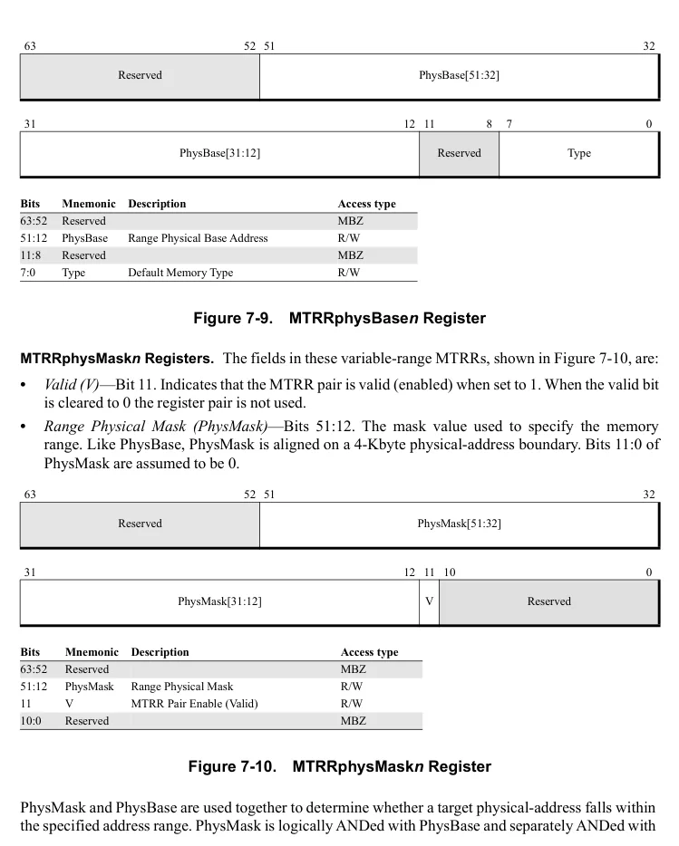

</details>


<!-- PDF source page: 285 | printed page: 223 -->

the upper 40 bits of the target physical-address. If the results of the two operations are identical, the target physical-address falls within the specified memory range. The pseudo-code for the operation is:

```text
MaskBase = PhysMask AND PhysBase
MaskTarget = PhysMask AND Target_Address[51:12]
IF MaskBase == MaskTarget
target address is in range
ELSE
target address is not in range
```

**Variable Range Size and Alignment.** The size and alignment of variable memory-ranges (MTRRs) and I/O ranges (IORRs) are restricted as follows:

- The boundary on which a variable range is aligned must be equal to the range size. For example, a memory range of 16 Mbytes must be aligned on a 16-Mbyte boundary.
- The range size must be a power of 2 (2n, 52 &gt; n &gt; 11), with a minimum allowable size of 4 Kbytes. For example, 4 Mbytes and 8 Mbytes are allowable memory range sizes, but 6 Mbytes is not allowable.

**PhysMask and PhysBase Values.** Software can calculate the PhysMask value using the following procedure:

1. 1. Subtract the memory-range physical base-address from the upper physical-address of the memory range.

1. 2. Subtract the value calculated in Step 1 from the physical memory size.

1. 3. Truncate the lower 12 bits of the result in Step 2 to create the PhysMask value to be loaded into the MTRRphysMask*n* register. Truncation is performed by right-shifting the value 12 bits.

For example, assume a 32-Mbyte memory range is specified within the 52-bit physical address space, starting at address 200_0000h. The upper address of the range is 3FF_FFFFh. Following the process outlined above yields:

1. 1. 3FF_FFFFh–200_0000h = 1FF_FFFFh

1. 2. F_FFFF_FFFF_FFFF–1FF_FFFFh = F_FFFF_FE00_0000h

1. 3. Right shift (F_FFFF_FE00_0000h) by 12 = FF_FFFF_E000h

In this example, the 40-bit value loaded into the PhysMask field is FF_FFFF_E000h.

Software must also truncate the lower 12 bits of the physical base-address before loading it into the PhysBase field. In the example above, the 40-bit PhysBase field is 00_0000_2000h.

**Default-Range MTRRs.** Physical addresses that are not within ranges established by fixed-range and variable-range MTRRs are set to a default memory-type using the MTRRdefType register. The format of this register is shown in Figure 7-11.


<!-- PDF source page: 286 | printed page: 224 -->

63 32

Reserved

31 12 11 10 9 8 7 0

Reserved

Type

FE

E

**Bits Mnemonic Description Access type** 63:12 Reserved MBZ 11 E MTRR Enable R/W 10 FE Fixed Range Enable R/W 9:8 Reserved MBZ 7:0 Type Default Memory Type R/W

**Figure 7-11. MTRRdefType Register Format**

The fields within the MTRRdefType register are read/write. These fields are:

- *Type*—Bits 7:0. The default memory-type used to characterize physical-memory space. See Table 7-6 on page 218 for the type-field encodings. The extended type-field encodings are not supported by this register.
- *Fixed-Range Enable (FE)*—Bit 10. All fixed-range MTRRs are enabled when FE is set to 1. Clearing FE to 0 disables all fixed-range MTRRs. Setting and clearing FE has no effect on the variable-range MTRRs. The FE bit has no effect unless the E bit is set to 1 (see below).
- *MTRR Enable (E)*—Bit 11. This is the MTRR memory typing enable bit. The memory typing capabilities of all fixed-range and variable-range MTRRs are enabled when E is set to 1. Clearing E to 0 disables the memory typing capabilities of all fixed-range and variable-range MTRRs and sets the default memory-type to uncacheable (UC) regardless of the value of the Type field. This bit does not affect the operation of the RdMem and WrMem fields.

<a id="7-7-3-using-mtrrs"></a>

### 7.7.3 Using MTRRs

**Identifying MTRR Features.** Software determines whether a processor supports the MTRR mechanism by executing the CPUID instruction with either function 0000_0001h or function 8000_0001h. If MTRRs are supported, bit 12 in the EDX register is set to 1 by CPUID. See “Processor Feature Identification” on page 71 for more information on the CPUID instruction.

The MTRR capability register (MTRRcap) is a read-only register containing information describing the level of MTRR support provided by the processor. Figure 7-12 shows the format of this register. If MTRRs are supported, software can read MTRRcap using the RDMSR instruction. Attempting to write to the MTRRcap register causes a general-protection exception (#GP).

<details>
<summary>Rendered source page 286 (figures/tables)</summary>

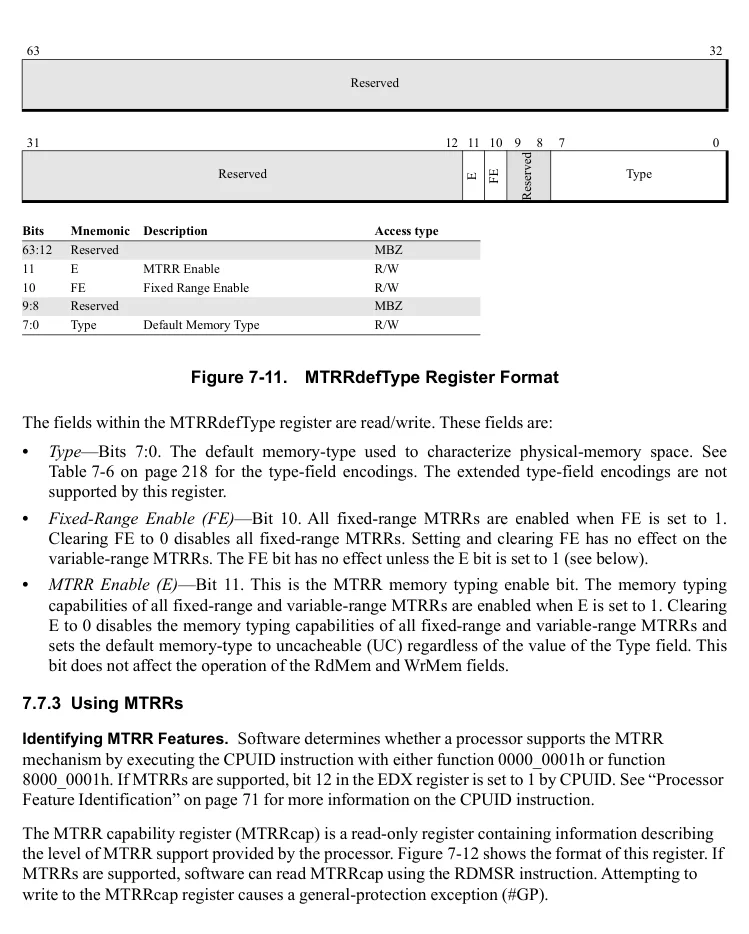

</details>


<!-- PDF source page: 287 | printed page: 225 -->

63 32

Reserved

31 11 10 9 8 7 0

Reserved

VCNT

WC

FIX

**Bits Mnemonic Description Access type** 63:11 Reserved R 10 WC Write Combining R 9 Reserved R 8 FIX Fixed-Range Registers R 7:0 VCNT Variable-Range Register Count R

**Figure 7-12. MTRR Capability Register Format**

The MTRRcap register field are:

- *Variable-Range Register Count (VCNT)*—Bits 7:0. The VCNT field contains the number of variable-range register pairs supported by the processor. For example, a processor supporting eight register pairs returns a 08h in this field.
- *Fixed-Range Registers (FIX)*—Bit 8. The FIX bit indicates whether or not the fixed-range registers are supported. If the processor returns a 1 in this bit, *all* fixed-range registers are supported. If the processor returns a 0 in this bit, *no* fixed-range registers are supported.
- *Write-Combining (WC)*—Bit 10. The WC bit indicates whether or not the write-combining memory type is supported. If the processor returns a 1 in this bit, WC memory is supported, otherwise it is not supported.

<a id="7-7-4-mtrrs-and-page-cache-controls"></a>

### 7.7.4 MTRRs and Page Cache Controls

When paging and the MTRRs are both enabled, the address ranges defined by the MTRR registers can span multiple pages, each of which can characterize memory with different types (using the PCD and PWT page bits). When caching is enabled (CR0.CD=0 and CR0.NW=0), the *effective memory type* is determined as follows:

1. 1. If the page is defined as cacheable and writeback (PCD=0 and PWT=0), then the MTRR defines the effective memory-type.

1. 2. If the page is defined as not cacheable (PCD=1), then UC is the effective memory-type.

1. 3. If the page is defined as cacheable and writethrough (PCD=0 and PWT=1), then the MTRR defines the effective memory-type *unless* the MTRR specifies WB memory, in which case WT is the effective memory-type.

<details>
<summary>Rendered source page 287 (figures/tables)</summary>

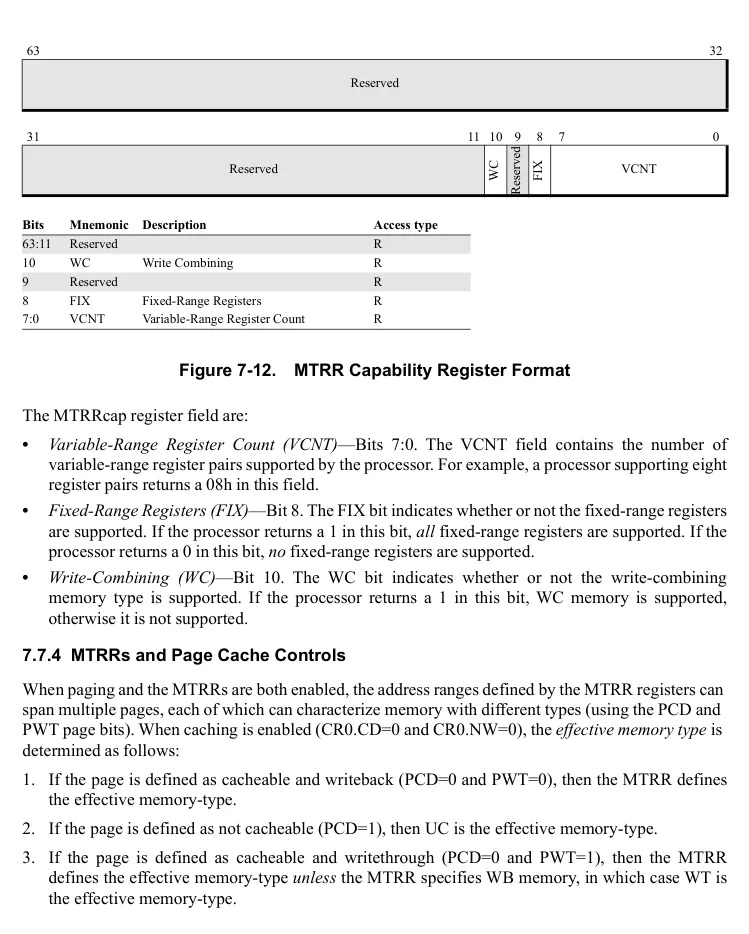

</details>


<!-- PDF source page: 288 | printed page: 226 -->

Table 7-8 lists the MTRR and page-level cache-control combinations and their combined effect on the final memory-type, if the PAT register holds the default settings.

**Table 7-8. Combined MTRR and Page-Level Memory Type with Unmodified PAT MSR**

| MTRR<br>Memory Type | Page<br>PCD Bit | Page<br>PWT Bit | Effective<br>Memory-Type |
| --- | --- | --- | --- |
| UC | — | — | UC |
| WC | 0 | — | WC |
| WC | 1 | 0 | WC1 |
| WC | 1 | 1 | UC |
| WP | 0 | — | WP |
| WP | 1 | — | UC |
| WT | 0 | — | WT |
| WT | 1 | — | UC |
| WB | 0 | 0 | WB |
| WB | 0 | 1 | WT |
| WB | 1 | — | UC |

> Note: 1. The effective memory-type resulting from the combination of PCD=1, PWT=0, and an MTRR WC memory type is implementation dependent.

**Large Page Sizes.** When paging is enabled, software can use large page sizes (2 Mbytes and 4 Mbytes) in addition to the more typical 4-Kbyte page size. When large page sizes are used, it is possible for multiple MTRRs to span the memory range within a single large page. Each MTRR can characterize the regions within the page with different memory types. If this occurs, the effective memory-type used by the processor within the large page is undefined.

Software can avoid the undefined behavior in one of the following ways:

- Avoid using multiple MTRRs to characterize a single large page.
- Use multiple 4-Kbyte pages rather than a single large page.
- If multiple MTRRs must be used within a single large page, software can set the MTRR type fields to the same value.
- If the multiple MTRRs must have different type-field values, software can set the large page PCD and PWT bits to the most restrictive memory type defined by the multiple MTRRs.

**Overlapping MTRR Registers.** If the address ranges of two or more MTRRs overlap, the following rules are applied to determine the memory type used to characterize the overlapping address range:

1. 1. Fixed-range MTRRs, which characterize only the first 1 Mbyte of physical memory, have precedence over variable-range MTRRs.

<details>
<summary>Rendered source page 288 (figures/tables)</summary>

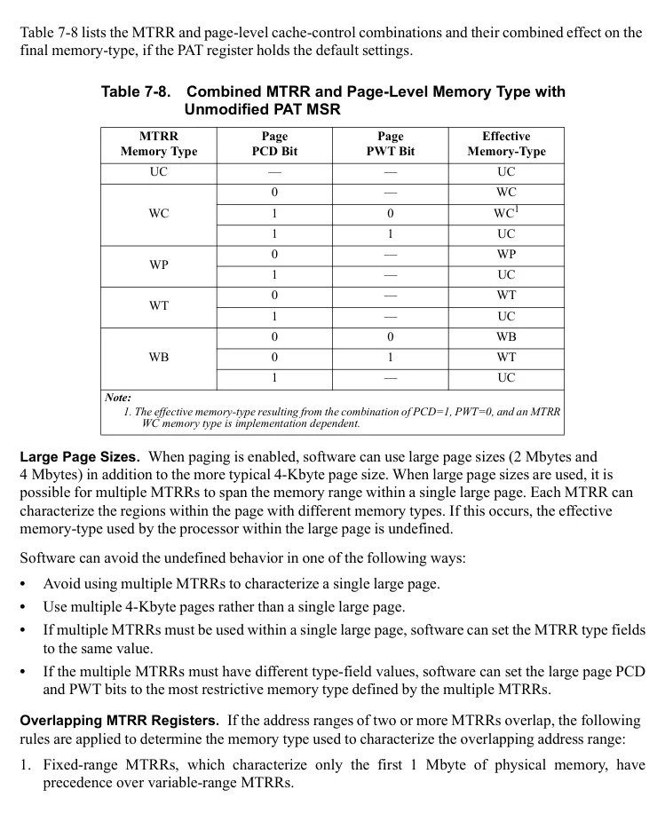

</details>


<!-- PDF source page: 289 | printed page: 227 -->

1. 2. If two or more variable-range MTRRs overlap, the following rules apply:

1. If the memory types are identical, then that memory type is used.

1. b. If at least one of the memory types is UC, the UC memory type is used.

1. If at least one of the memory types is WT, and the only other memory type is WB, then the WT memory type is used.

1. d. If the combination of memory types is not listed Steps A through C immediately above, then the memory type used is undefined.

<a id="7-7-5-mtrrs-in-multi-processing-environments"></a>

### 7.7.5 MTRRs in Multi-Processing Environments

In multi-processing environments, the MTRRs located in all processors must characterize memory in the same way. Generally, this means that identical values are written to the MTRRs used by the processors. This also means that values CR0.CD and the PAT must be consistent across processors. Failure to do so may result in coherency violations or loss of atomicity. Processor implementations *do not* check the MTRR settings in other processors to ensure consistency. It is the responsibility of system software to initialize and maintain MTRR consistency across all processors.

<a id="7-8-page-attribute-table-mechanism"></a>

## 7.8 Page-Attribute Table Mechanism

The page-attribute table (PAT) mechanism extends the page-table entry format and enhances the capabilities provided by the PCD and PWT page-level cache controls. PAT (and PCD, PWT) allow memory-type characterization based on the virtual (linear) address. The PAT mechanism provides the same memory-typing capabilities as the MTRRs but with the added flexibility of the paging mechanism. Software can use both the PAT and MTRR mechanisms to maximize flexibility in memory-type control.

<a id="7-8-1-pat-register"></a>

### 7.8.1 PAT Register

Like the MTRRs, the PAT register is a 64-bit model-specific register (MSR). The format of the PAT registers is shown in Figure 7-13. See “Memory-Typing MSRs” on page 727 for more information on the PAT MSR number and reset value.

**Figure 7-13. PAT Register**

<details>
<summary>Extracted figure labels</summary>

```text
63
59 58
56 55
51 50
48 47
43 42
40 41
35 34
32
Reserved
PA7
Reserved
PA6
Reserved
PA5
Reserved
PA4
31
27 26
24 23
19 18
16 15
11 10
8
7
3
2
0
Reserved
PA3
Reserved
PA2
Reserved
PA1
Reserved
PA0
```

</details>

<details>
<summary>Rendered source page 289 (figures/tables)</summary>

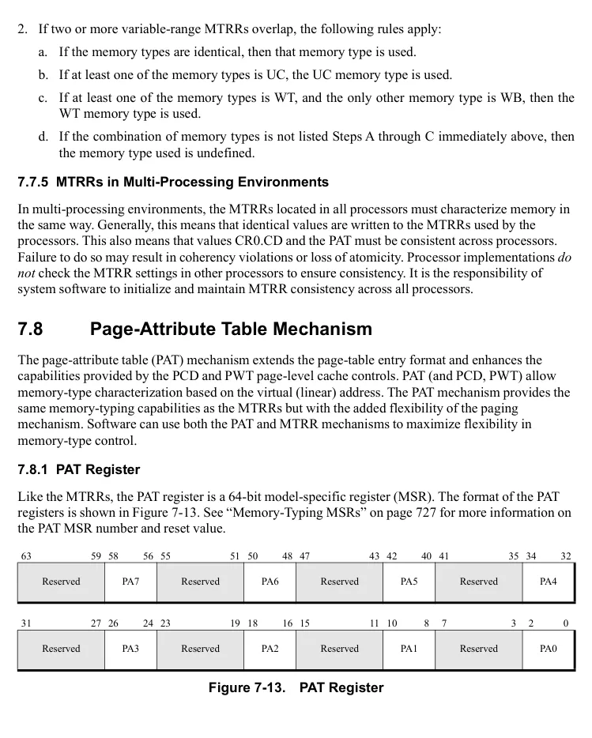

</details>


<!-- PDF source page: 290 | printed page: 228 -->

The PAT register contains eight page-attribute (PA) fields, numbered from PA0 to PA7. The PA fields hold the encoding of a memory type, as found in Table 7-9 on page 228. The PAT type-encodings match the MTRR type-encodings, with the exception that PAT adds the 07h encoding. The 07h encoding corresponds to a *UC-* type. The UC-type (07h) is identical to the UC type (00h) except it can be overridden by an MTRR type of WC.

Software can write any supported memory-type encoding into any of the eight PA fields. An attempt to write anything but zeros into the reserved fields causes a general-protection exception (#GP). An attempt to write an unsupported type encoding into a PA field also causes a #GP exception.

The PAT register fields are initiated at processor reset to the default values shown in Table 7-10 on page 229.

**Table 7-9. PAT Type Encodings**

| Type Value | Type Name | Type Description |
| --- | --- | --- |
| 00h | UC—Uncacheable | All accesses are uncacheable. Write combining is not allowed. Speculative<br>accesses are not allowed. |
| 01h | WC—Write-Combining | All accesses are uncacheable. Write combining is allowed. Speculative<br>reads are allowed. |
| 04h | WT—Writethrough | Reads allocate cache lines on a cache miss, but only to the shared state.<br>Cache lines are not allocated on a write miss. Write hits update the cache<br>and main memory. |
| 05h | WP—Write-Protect | Reads allocate cache lines on a cache miss, but only to the shared state. All<br>writes update main memory. Cache lines are not allocated on a write miss.<br>Write hits invalidate the cache line and update main memory. |
| 06h | WB—Writeback | Reads allocate cache lines on a cache miss, and can allocate to either the<br>shared or exclusive state. Writes allocate to the modified state on a cache<br>miss. |
| 07h | UC–<br>(UC minus) | All accesses are uncacheable. Write combining is not allowed. Speculative<br>accesses are not allowed. Can be overridden by an MTRR with the WC<br>type. |

<a id="7-8-2-pat-indexing"></a>

### 7.8.2 PAT Indexing

PA fields in the PAT register are selected using three bits from the page-table entries. These bits are:

- *PAT (page attribute table)*—The PAT bit is bit 7 in 4-Kbyte PTEs; it is bit 12 in 2-Mbyte and 4-Mbyte PDEs. Page-table entries that don’t have a PAT bit (PML4 entries, for example) assume PAT = 0.
- *PCD (page cache disable)*—The PCD bit is bit 4 in all page-table entries. The PCD from the PTE or PDE is selected depending on the paging mode.
- *PWT (page writethrough)*—The PWT bit is bit 3 in all page-table entries. The PWT from the PTE or PDE is selected depending on the paging mode.

<details>
<summary>Rendered source page 290 (figures/tables)</summary>

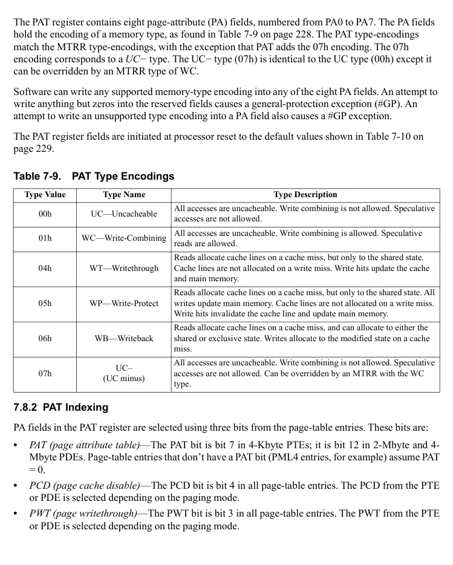

</details>


<!-- PDF source page: 291 | printed page: 229 -->

Table 7-10 on page 229 shows the various combinations of the PAT, PCD, and PWT bits used to select a PA field within the PAT register. Table 7-10 also shows the default memory-type values established in the PAT register by the processor after a reset. The default values correspond to the memory types established by the PCD and PWT bits alone in processor implementations that do not support the PAT mechanism. In such implementations, the PAT field in page-table entries is reserved and cleared to 0. See “Page-Translation-Table Entry Fields” on page 153 for more information on the page-table entries.

**Table 7-10. PAT-Register PA-Field Indexing**

| Page Table Entry Bits / PAT | Page Table Entry Bits / PCD | Page Table Entry Bits / PWT | PAT Register Field | Default Memory Type |
| --- | --- | --- | --- | --- |
| 0 | 0 | 0 | PA0 | WB |
| 0 | 0 | 1 | PA1 | WT |
| 0 | 1 | 0 | PA2 | UC–1 |
| 0 | 1 | 1 | PA3 | UC |
| 1 | 0 | 0 | PA4 | WB |
| 1 | 0 | 1 | PA5 | WT |
| 1 | 1 | 0 | PA6 | UC–1 |
| 1 | 1 | 1 | PA7 | UC |
| Note:<br>1. Can be overridden by WC memory type set by an MTRR. | 1 | 1 |  |  |

<a id="7-8-3-identifying-pat-support"></a>

### 7.8.3 Identifying PAT Support

Software determines whether a processor supports the PAT mechanism by executing the CPUID instruction with either function 0000_0001h or function 8000_0001h. If PAT is supported, bit 16 in the EDX register is set to 1 by CPUID. See Section 3.3, “Processor Feature Identification,” on page 71 for more information on the CPUID instruction.

If PAT is supported by a processor implementation, it is *always enabled*. The PAT mechanism cannot be disabled by software. Software can effectively avoid using PAT by:

- Not setting PAT bits in page-table entries to 1.
- Not modifying the reset values of the PA fields in the PAT register.

In this case, memory is characterized using the same types that are used by implementations that do not support PAT.

<a id="7-8-4-pat-accesses"></a>

### 7.8.4 PAT Accesses

In implementations that support the PAT mechanism, all memory accesses that are translated through the paging mechanism use the PAT index bits to specify a PA field in the PAT register. The memory type stored in the specified PA field is applied to the memory access. The process is summarized as:

1. 1. A virtual address is calculated as a result of a memory access.

<details>
<summary>Rendered source page 291 (figures/tables)</summary>

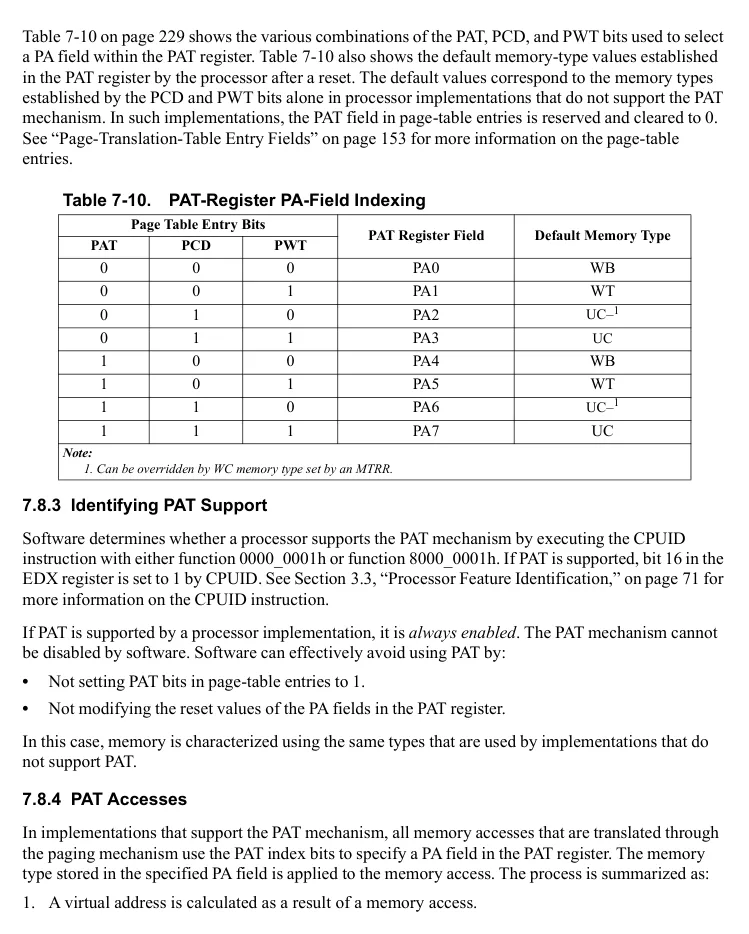

</details>


<!-- PDF source page: 292 | printed page: 230 -->

1. 2. The virtual address is translated to a physical address using the page-translation mechanism.

1. 3. The PAT, PCD and PWT bits are read from the corresponding page-table entry during the virtual-address to physical-address translation.

1. 4. The PAT, PCD and PWT bits are used to select a PA field from the PAT register.

1. 5. The memory type is read from the appropriate PA field.

1. 6. The memory type is applied to the physical-memory access using the translated physical address.

**Page-Translation Table Access.** The PAT bit exists only in the PTE (4K paging) or PDEs (2/4 Mbyte paging). In the remaining upper levels (PML5, PML4, PDP, and 4KB PDEs), only the PWT and PCD bits are used to index into the first 4 entries in the PAT register. The resulting memory type is used for the next lower paging level.

<a id="7-8-5-combined-effect-of-mtrrs-and-pat"></a>

### 7.8.5 Combined Effect of MTRRs and PAT

The memory types established by the PAT mechanism can be combined with MTRR-established memory types to form an effective memory-type. The combined effect of MTRR and PAT memory types are shown in Figure 7-11. In the AMD64 architecture, reserved and undefined combinations of MTRR and PAT memory types result in undefined behavior. If the MTRRs are disabled in implementations that support the MTRR mechanism, the default memory type is set to uncacheable (UC).

**Table 7-11. Combined Effect of MTRR and PAT Memory Types**

| PAT Memory Type | MTRR Memory Type | Effective Memory Type |
| --- | --- | --- |
| UC | UC | UC |
| UC | WC, WP, WT, WB | CD |
| UC- | UC | UC |
| UC- | WC | WC |
| UC- | WP, WT, WB | CD |
| WC | — | WC |
| WP | UC | UC |
| WP | WC | CD |
| WP | WP | WP |
| WP | WT | CD |
| WP | WB | WP |
| WT | UC | UC |
| WT | WC, WP | CD |
| WT | WT, WB | WT |

<details>
<summary>Rendered source page 292 (figures/tables)</summary>

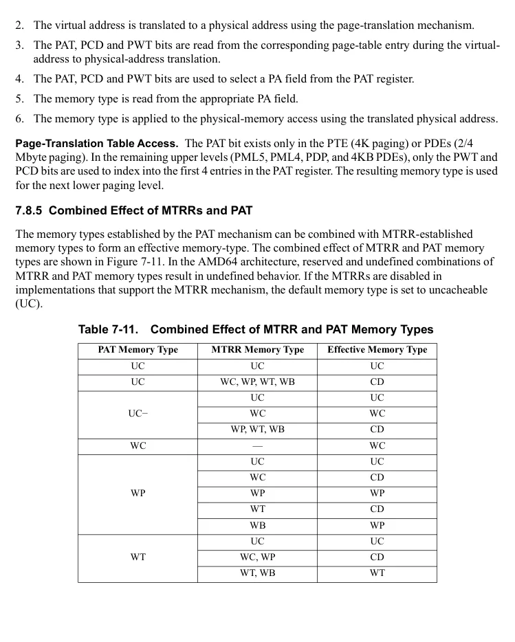

</details>


<!-- PDF source page: 293 | printed page: 231 -->

**Table 7-11. Combined Effect of MTRR and PAT Memory Types (continued)**

| PAT Memory Type | MTRR Memory Type | Effective Memory Type |
| --- | --- | --- |
| WB | UC | UC |
| WB | WC | WC |
| WB | WP | WP |
| WB | WT | WT |
| WB | WB | WB |

<a id="7-8-6-pats-in-multi-processing-environments"></a>

### 7.8.6 PATs in Multi-Processing Environments

In multi-processing environments, values of CR0.CD and the PAT must be consistent across all processors and the MTRRs in all processors must characterize memory in the same way. In other words, matching address ranges and cachability types are written to the MTRRs for each processor.

Failure to do so may result in coherency violations or loss of atomicity. Processor implementations *do not* check the MTRR, CR0.CD and PAT values in other processors to ensure consistency. It is the responsibility of system software to initialize and maintain consistency across all processors.

<a id="7-8-7-changing-memory-type"></a>

### 7.8.7 Changing Memory Type

A physical page should not have differing cacheability types assigned to it through different virtual mappings; they should be either all of a cacheable type (WB, WT, WP) or all of a non-cacheable type (UC, WC). Otherwise, this may result in a loss of cache coherency, leading to stale data and unpredictable behavior. For this reason, certain precautions must be taken when changing the memory type of a page. In particular, when changing from a cachable memory type to an uncachable type the caches must be flushed, because speculative execution by the processor may have resulted in memory being cached even though it was not programmatically referenced. The following table summarizes the serialization requirements for safely changing memory types.

<details>
<summary>Rendered source page 293 (figures/tables)</summary>

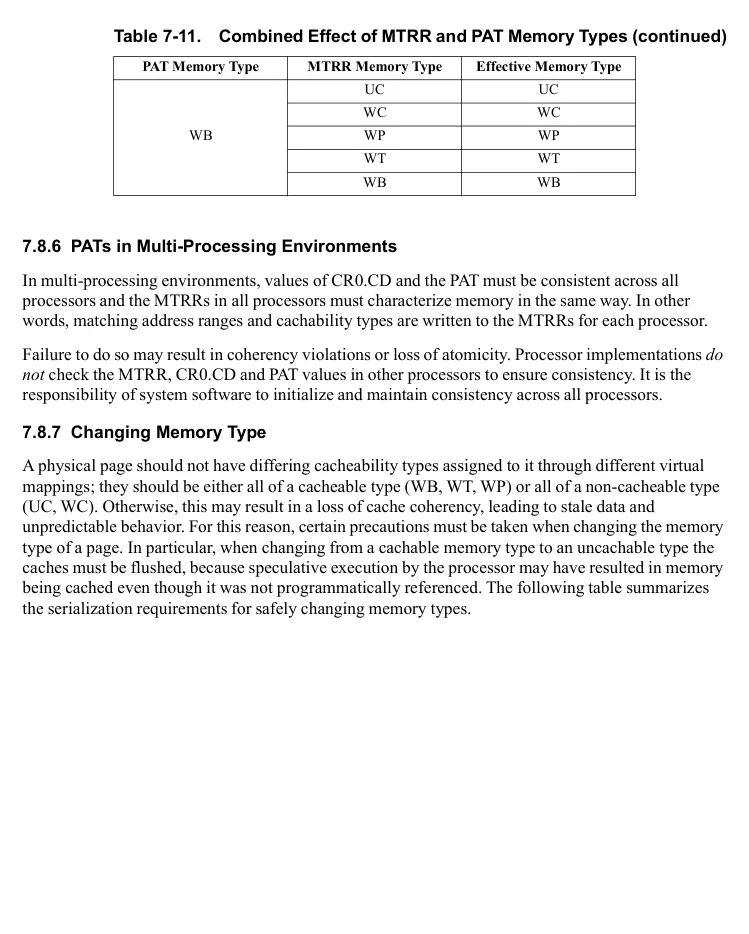

</details>


<!-- PDF source page: 294 | printed page: 232 -->

**Table 7-12. Serialization Requirements for Changing Memory Types**

| Column 1 | Column 2 | New Type / WB | New Type / WT | New Type / WP | New Type / UC | New Type / WC |
| --- | --- | --- | --- | --- | --- | --- |
| Old Type | WB | – | a | a |  |  |
| Old Type | WT | a | – | a |  |  |
| Old Type | WP | a | a | – |  |  |
| Old Type | UC | a | a | a | – | a |
| Old Type | WC | a | a | a | a | – |

> Note: a. Remove the previous mapping (make it not present in the page tables); Flush the TLBs including the TLBs of other processors that may have used the mapping, even speculatively; Create a new mapping in the page tables using the new type. b. In addition to the steps described in note a, software should flush the page from the caches of any processor that may have used the previous mapping. This must be done after the TLB flushing in note a has been completed.

<a id="7-9-memory-mapped-i-o"></a>

## 7.9 Memory-Mapped I/O

Processor implementations can independently direct reads and writes to either system memory or memory-mapped I/O. The method used for directing those memory accesses is implementation dependent. In some implementations, separate system-memory and memory-mapped I/O buses can be provided at the processor interface. In other implementations, system memory and memory-mapped I/O share common data and address buses, and system logic uses sideband signals from the processor to route accesses appropriately. Refer to AMD data sheets and application notes for more information about particular hardware implementations of the AMD64 architecture.

The I/O range registers (IORRs), and the top-of-memory registers allow system software to specify where memory accesses are directed for a given address range. The MTRR extensions are described in the following section. “IORRs” on page 234 describes the IORRs and “Top of Memory” on page 236 describes the top-of-memory registers. *In implementations that support these features, the default action taken when the features are disabled is to direct memory accesses to memory-mapped I/O.*

<a id="7-9-1-extended-fixed-range-mtrr-type-field-encodings"></a>

### 7.9.1 Extended Fixed-Range MTRR Type-Field Encodings

The fixed-range MTRRs support extensions to the type-field encodings that allow system software to direct memory accesses to system memory or memory-mapped I/O. The extended MTRR type-field encodings use previously reserved bits 4:3 to specify whether reads and writes to a physical-address range are to system memory or to memory-mapped I/O. The format for this encoding is shown in Figure 7-14 on page 233. The new bits are:

- *WrMem*—Bit 3. When set to 1, the processor directs write requests for this physical address range to system memory. When cleared to 0, writes are directed to memory-mapped I/O.
- *RdMem*—Bit 4. When set to 1, the processor directs read requests for this physical address range to system memory. When cleared to 0, reads are directed to memory-mapped I/O.

<details>
<summary>Rendered source page 294 (figures/tables)</summary>

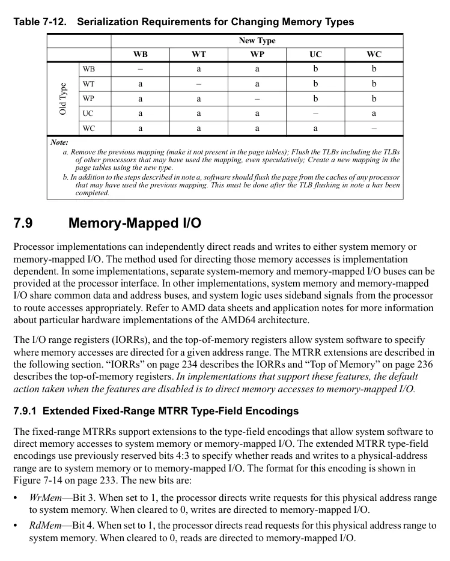

</details>


<!-- PDF source page: 295 | printed page: 233 -->

The type subfield (bits 2:0) allows the encodings specified in Table 7-6 on page 218 to be used for memory characterization.

**Figure 7-14. Extended MTRR Type-Field Format (Fixed-Range MTRRs)**

<details>
<summary>Extracted figure labels</summary>

```text
7
5
4
3
2
0
Reserved
RdMem
WrMem
Type
```

</details>

These extensions are enabled using the following bits in the SYSCFG MSR:

- *MtrrFixDramEn*—Bit 18. When set to 1, RdMem and WrMem attributes are enabled. When cleared to 0, these attributes are disabled. *When disabled, accesses are directed to memory-mapped I/O space.*
- *MtrrFixDramModEn*—Bit 19. When set to 1, software can read and write the RdMem and WrMem bits. When cleared to 0, writes do not modify the RdMem and WrMem bits, and reads return 0.

To use the MTRR extensions, system software must first set MtrrFixDramModEn=1 to allow modification to the RdMem and WrMem bits. After the attribute bits are properly initialized in the fixed-range registers, the extensions can be enabled by setting MtrrFixDramEn=1.

RdMem and WrMem allow the processor to independently direct reads and writes to either system memory or memory-mapped I/O. The RdMem and WrMem controls are particularly useful when shadowing ROM devices located in memory-mapped I/O space. It is often useful to shadow such devices in RAM system memory to improve access performance, but writes into the RAM location can corrupt the shadowed ROM information. The MTRR extensions solve this problem. System software can create the shadow location by setting WrMem = 1 and RdMem = 0 for the specified memory range and then copy the ROM location into itself. Reads are directed to the memory-mapped ROM, but writes go to the same physical addresses in system memory. After the copy is complete, system software can change the bit values to WrMem = 0 and RdMem = 1. Now reads are directed to the faster copy located in system memory, and writes are directed to memory-mapped ROM. The ROM responds as it would normally to a write, which is to ignore it.

Not all combinations of RdMem and WrMem are supported for each memory type encoded by bits 2:0. Table 7-13 on page 234 shows the allowable combinations. The behavior of reserved encoding combinations (shown as gray-shaded cells) is undefined and results in unpredictable behavior.

<details>
<summary>Rendered source page 295 (figures/tables)</summary>

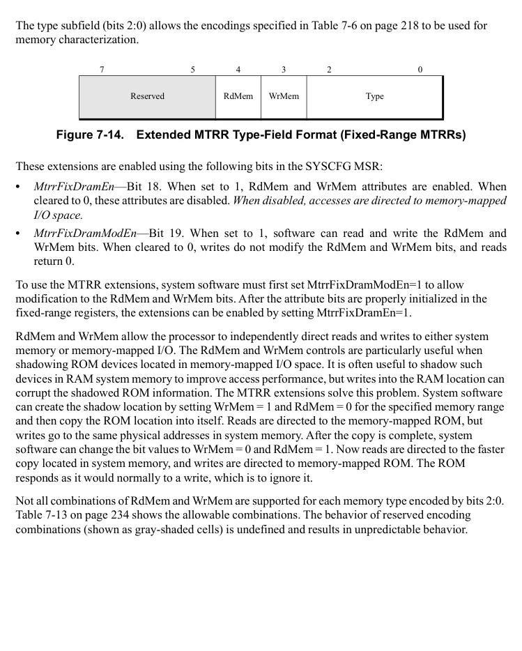

</details>


<!-- PDF source page: 296 | printed page: 234 -->

**Table 7-13. Extended Fixed-Range MTRR Type Encodings**

| RdMem | WrMem | Type | Implication or Potential Use |
| --- | --- | --- | --- |
| 0 | 0 | 0 (UC) | UC I/O |
| 0 | 0 | 1 (WC) | WC I/O |
| 0 | 0 | 4 (WT) | WT I/O |
| 0 | 0 | 5 (WP) | WP I/O |
| 0 | 0 | 6 (WB) | Reserved |
| 0 | 1 | 0 (UC) | Used while creating a shadowed ROM |
| 0 | 1 | 1 (WC) |  |
| 0 | 1 | 4 (WT) | Reserved |
| 0 | 1 | 5 (WP) |  |
| 0 | 1 | 6 (WB) |  |
| 1 | 0 | 0 (UC) | Used to access a shadowed ROM |
| 1 | 0 | 1 (WC) | Reserved |
| 1 | 0 | 4 (WT) |  |
| 1 | 0 | 5 (WP) | WP Memory<br>(Can be used to access shadowed ROM) |
| 1 | 0 | 6 (WB) | Reserved |
| 1 | 1 | 0 (UC) | UC Memory |
| 1 | 1 | 1 (WC) | WC Memory |
| 1 | 1 | 4 (WT) | WT Memory |
| 1 | 1 | 5 (WP) | Reserved |
| 1 | 1 | 6 (WB) | WB Memory |

<a id="7-9-2-iorrs"></a>

### 7.9.2 IORRs

The IORRs operate similarly to the variable-range MTRRs. The IORRs specify whether reads and writes in any physical-address range map to system memory or memory-mapped I/O. Up to two address ranges of varying sizes can be controlled using the IORRs. A pair of IORRs are used to control each address range: IORRBase*n* and IORRMask*n* (*n* is the address-range number from 0 to 1).

Figure 7-15 on page 235 shows the format of the IORRBase*n* registers and Figure 7-16 on page 236 shows the format of the IORRMask*n* registers. The fields within the register pair are read/write.

The intersection of the IORR range with the equivalent effective MTRR range follows the same type encoding table (Table 7-13) as the fixed-range MTRR, where the RdMem/WrMem and memory type are directly tied together.

**IORRBase*****n* Registers.** The fields in these IORRs are:

- *WrMem*—Bit 3. When set to 1, the processor directs write requests for this physical address range to system memory. When cleared to 0, writes are directed to memory-mapped I/O.

<details>
<summary>Rendered source page 296 (figures/tables)</summary>

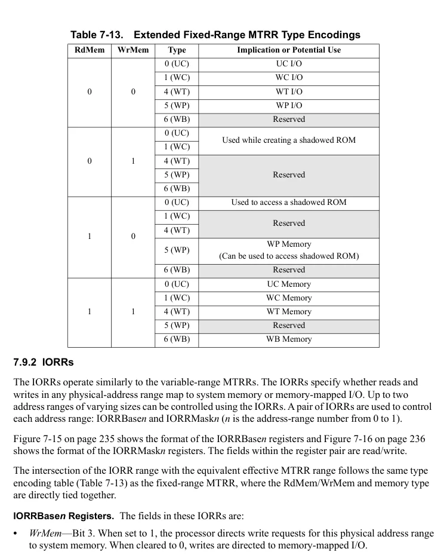

</details>


<!-- PDF source page: 297 | printed page: 235 -->

- *RdMem*—Bit 4. When set to 1, the processor directs read requests for this physical address range to system memory. When cleared to 0, reads are directed to memory-mapped I/O.
- *Range Physical-Base-Address (PhysBase)*—Bits 51:12. The memory-range base-address in physical-address space. PhysBase is aligned on a 4-Kbyte (or greater) address in the 52-bit physical-address space supported by the AMD64 architecture. PhysBase represents the most-significant 40-address bits of the physical address. Physical-address bits 11:0 are assumed to be 0.

Note that a given processor may implement less than the architecturally-defined physical address size of 52 bits.

The format of these registers is shown in Figure 7-15.

63 52 51 32

Reserved PhysBase[51:32]

31 12 11 5 4 3 0

PhysBase[31:12] Reserved

Reserved

Wr

Rd

**Bits Mnemonic Description Access type** 63:52 Reserved IGN 51:12 PhysBase Range Physical Base Address R/W 11:5 Reserved IGN 4 Rd RdMem Enable R/W 3 Wr WrMem Enable R/W 2:0 Reserved IGN

**Figure 7-15. IORRBasen Register**

**IORRMask*****n* Registers.** The fields in these IORRs are:

- *Valid (V)*—Bit 11. Indicates that the IORR pair is valid (enabled) when set to 1. When the valid bit is cleared to 0 the register pair is not used for memory-mapped I/O control (disabled).
- *Range Physical-Mask (PhysMask)*—Bits 51:12. The mask value used to specify the memory range. Like PhysBase, PhysMask is aligned on a 4-Kbyte physical-address boundary. Bits 11:0 of PhysMask are assumed to be 0.

The format of these registers is shown in Figure 7-16 on page 236.

<details>
<summary>Rendered source page 297 (figures/tables)</summary>

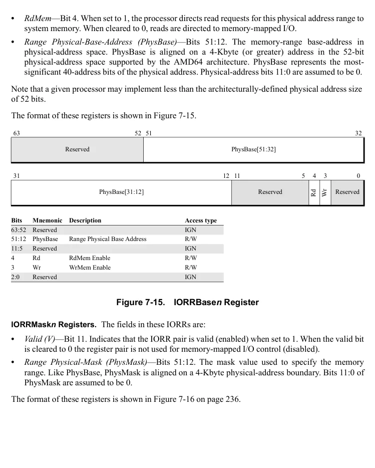

</details>


<!-- PDF source page: 298 | printed page: 236 -->

63 52 51 32

Reserved PhysMask[51:32]

31 12 11 10 0

PhysMask[31:12] V Reserved

**Bits Mnemonic Description Access type** 63:52 Reserved IGN 51:12 PhysMask Range Physical Mask R/W 11 V I/O Register Pair Enable (Valid) R/W 10:0 Reserved IGN

**Figure 7-16. IORRMaskn Register**

The operation of the PhysMask and PhysBase fields is identical to that of the variable-range MTRRs. See page 222 for a description of this operation.

<a id="7-9-3-iorr-overlapping"></a>

### 7.9.3 IORR Overlapping

The use of overlapping IORRs is not recommended. If overlapping IORRs are specified, the resulting behavior is implementation-dependent.

<a id="7-9-4-top-of-memory"></a>

### 7.9.4 Top of Memory

The *top-of-memory* registers, TOP_MEM and TOP_MEM2, allow system software to specify physical addresses ranges as memory-mapped I/O locations. Processor implementations can direct accesses to memory-mapped I/O differently than system I/O, and the precise method depends on the implementation. System software specifies memory-mapped I/O regions by writing an address into each of the top-of-memory registers. The memory regions specified by the TOP_MEM registers are aligned on 8-Mbyte boundaries as follows:

- Memory accesses from physical address 0 to one less than the value in TOP_MEM are directed to system memory.
- Memory accesses from the physical address specified in TOP_MEM to FFFF_FFFFh are directed to memory-mapped I/O.
- Memory accesses from physical address 1_0000_0000h to one less than the value in TOP_MEM2 are directed to system memory.
- Memory accesses from the physical address specified in TOP_MEM2 to the maximum physical address supported by the system are directed to memory-mapped I/O.

<details>
<summary>Rendered source page 298 (figures/tables)</summary>

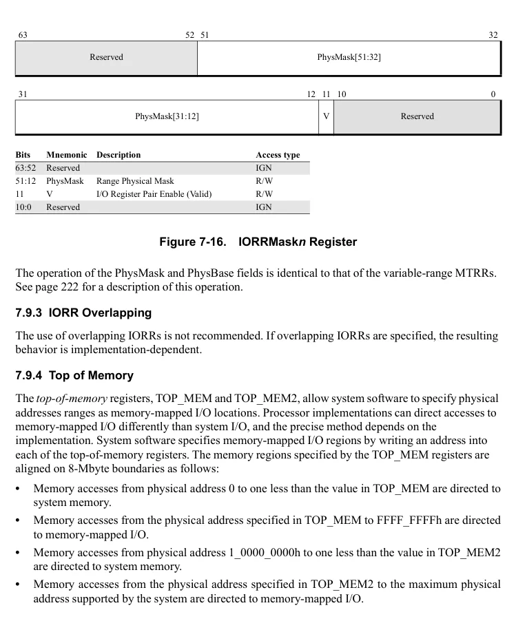

</details>


<!-- PDF source page: 299 | printed page: 237 -->

Figure 7-17 on page 237 shows how the top-of-memory registers organize memory into separate system-memory and memory-mapped I/O regions.

The intersection of the top-of-memory range with the equivalent effective MTRR range follows the same type encoding table (Table 7-13 on page 234) as the fixed-range MTRR, where the RdMem/WrMem and memory type are directly tied together.

**Figure 7-17. Memory Organization Using Top-of-Memory Registers**

Figure 7-18 shows the format of the TOP_MEM and TOP_MEM2 registers. Bits 51:23 specify an 8-Mbyte aligned physical address. All remaining bits are reserved and ignored by the processor. System software should clear those bits to zero to maintain compatibility with possible future extensions to the registers. The TOP_MEM registers are model-specific registers. See “Memory-Typing MSRs” on page 727 for information on the MSR address and reset values for these registers.

**Figure 7-18. Top-of-Memory Registers (TOP_MEM, TOP_MEM2)**

<details>
<summary>Extracted figure labels</summary>

```text
63
52 51
32
Reserved, IGN
Top-of-Memory Physical Address[51:32]
31
23 22
0
Top-of-Memory Physical
Address[31:23]
Reserved, IGN
```

</details>

<details>
<summary>Rendered source page 299 (figures/tables)</summary>

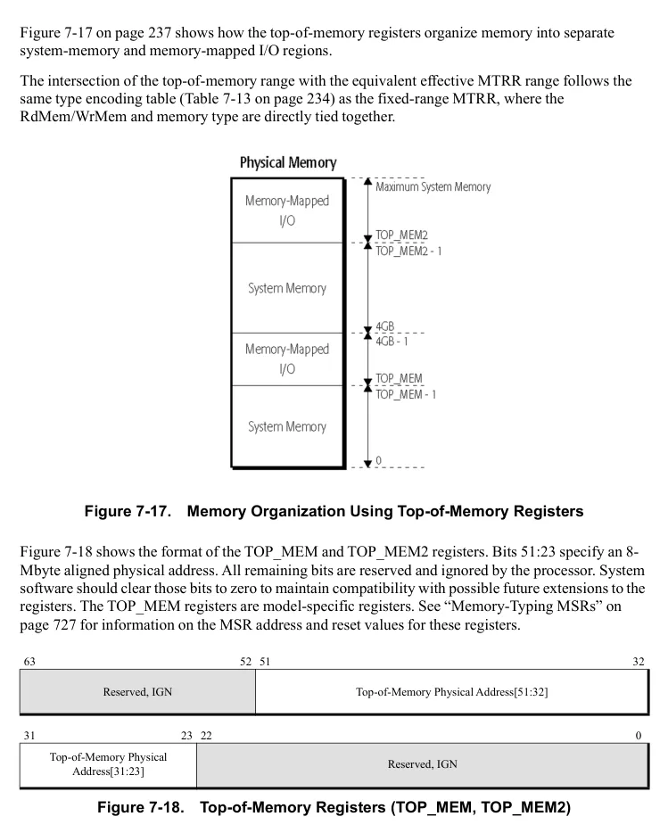

</details>


<!-- PDF source page: 300 | printed page: 238 -->

The TOP_MEM register is enabled by setting the MtrrVarDramEn bit in the SYSCFG MSR (bit 20) to 1 (one). The TOP_MEM2 register is enabled by setting the MtrrTom2En bit in the SYSCFG MSR (bit 21) to 1 (one). The registers are disabled when their respective enable bits are cleared to 0. When the top-of-memory registers are disabled, memory accesses default to memory-mapped I/O space.

Note that a given processor may implement fewer than the architecturally-defined number of physical address bits.

<a id="7-10-secure-memory-encryption"></a>

## 7.10 Secure Memory Encryption

Software running in non-virtualized (native) mode can utilize the Secure Memory Encryption (SME) feature to mark individual pages of memory as encrypted through the page tables. A page of memory marked encrypted will be automatically decrypted when read by software and automatically encrypted when written to DRAM. SME may therefore be used to protect the contents of DRAM from physical attacks on the system.

All memory encrypted using SME is encrypted with the same AES key which is created randomly each time a system is booted. The memory encryption key cannot be read or modified by software.

For details on using memory encryption in virtualized environments, please see Section 15.34, “Secure Encrypted Virtualization,” on page 588.

<a id="7-10-1-determining-support-for-secure-memory-encryption"></a>

### 7.10.1 Determining Support for Secure Memory Encryption

Support for memory encryption features is reported in CPUID Fn8000_001F[EAX]. Bit 0 indicates support for Secure Memory Encryption. When this feature is present, CPUID Fn8000_001F[EBX] supplies additional information regarding the use of memory encryption such as which page table bit is used to mark pages as encrypted.

Additionally, in some implementations, the physical address size of the processor may be reduced when memory encryption features are enabled, for example from 48 to 43 bits. In this case the upper physical address bits are treated as reserved when the feature is enabled except where otherwise indicated. When memory encryption is supported in an implementation, CPUID Fn8000_001F[EBX] reports any physical address size reduction present. Bits reserved in this mode are treated the same as other page table reserved bits, and will generate a page fault if found to be non-zero when used for address translation.

Complete CPUID details for encrypted memory features can be found in Volume 3, section E.4.17.

<a id="7-10-2-enabling-memory-encryption-extensions"></a>

### 7.10.2 Enabling Memory Encryption Extensions

Prior to using SME, memory encryption features must be enabled by setting SYSCFG MSR bit 23 (MemEncryptionModEn) to 1. In implementations where the physical address size of the processor is reduced when memory encryption features are enabled, software must ensure it is executing from addresses where these upper physical address bits are 0 prior to setting SYSCFG[MemEncryptionModEn]. Memory encryption is then further controlled via the page tables.


<!-- PDF source page: 301 | printed page: 239 -->

Note that software should keep the value of SYSCFG[MemEncryptionModEn] consistent across all CPU cores in the system. Failure to do so may lead to unexpected results.

<a id="7-10-3-supported-operating-modes"></a>

### 7.10.3 Supported Operating Modes

SME is supported in all CPU modes when CR4.PAE=1 and paging is enabled. This includes long mode as well as legacy PAE-enabled protected mode.

<a id="7-10-4-page-table-support"></a>

### 7.10.4 Page Table Support

Software utilizes the page tables to indicate if a memory page is encrypted or unencrypted. The location of the specific attribute bit (C-bit, or enCrypted bit) used is implementation-specific but may be determined by referencing CPUID Fn8000_001F[EBX] (see Volume 3, section E.4.17 for details). In some implementations, the bit used may be a physical address bit (e.g., address bit 47), especially in cases where the physical address size is reduced by hardware when memory encryption features are enabled.

To mark a memory page for encryption when stored in DRAM, software sets the C-bit to 1 for the page. If the C-bit is 0, the page is not encrypted when stored in DRAM. The C bit can be applied to translation table entries for any size of page - 4KB, 2MB, or 1GB.

Note that it is possible for the page tables themselves to be located in encrypted memory. For instance, if the C-bit is set in a PML4 entry, the PDP table it points to (and thus all PDPEs in that table) will be loaded from encrypted memory.

**Figure 7-19. Encrypted Memory Accesses**

<details>
<summary>Extracted figure labels</summary>

```text
PTE C‐Bit
Memory Read
Data
DRAM
0
CPU
1
AES Decrypt
Memory Write
PTE C‐Bit
Data
CPU
0
DRAM
AES Encrypt
1
```

</details>

<details>
<summary>Rendered source page 301 (figures/tables)</summary>

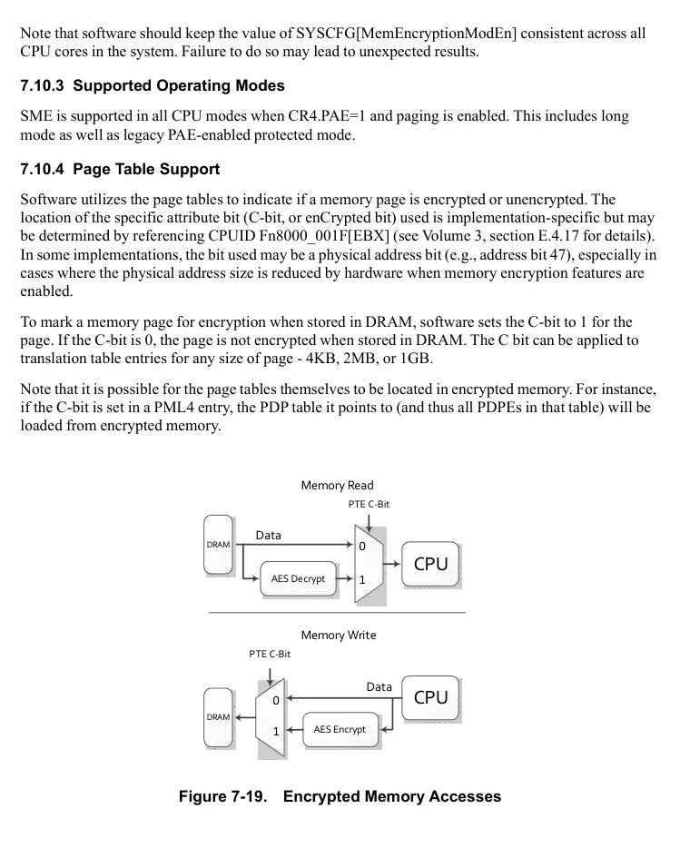

</details>


<!-- PDF source page: 302 | printed page: 240 -->

<a id="7-10-5-i-o-accesses"></a>

### 7.10.5 I/O Accesses

In implementations where the physical address size is reduced when memory encryption features are enabled, memory range checks (e.g. MTRR/TOM/IORR/etc.) to determine memory types or DRAM/MMIO are performed using the reduced physical address size. In particular, the C-bit is not considered a physical address bit and is masked by hardware for purposes of these checks.

Additionally, any pages corresponding to MMIO addresses must be configured with the C-bit clear. Encrypted I/O pages are not allowed and accesses with the C-bit set will be ignored.

<a id="7-10-6-restrictions"></a>

### 7.10.6 Restrictions

In some hardware implementations, coherency between the encrypted and unencrypted mappings of the same physical page are not enforced. In such a system, prior to changing the value of the C-bit for a page, software should flush the page from all CPU caches in the system. If a hardware implementation supports coherency across encryption domains as indicated by CPUID Fn8000_001F_EAX[10] then this flush is not required.

Simply changing the value of a C-bit on a page will not automatically encrypt the existing contents of a page, and any data in the page prior to the C-bit modification will become unintelligible. To set the C-bit on a page and cause its contents to become encrypted so the data remains accessible, see Section 7.10.8, “Encrypt-in-Place,” on page 240.

In legacy PAE mode, if the C-bit location is in the upper 32 bits of the page table entry, the first level page table (the PDP table) cannot be located in encrypted memory. This is because when the CPU is in 32-bit PAE mode, the CR3 value is only 32-bits in length.

<a id="7-10-7-smm-interaction"></a>

### 7.10.7 SMM Interaction

SME is available when the processor is executing in SMM, once it has enabled paging. Any physical address bit restrictions that exist due to memory encryption features being enabled remain in place while in SMM.

<a id="7-10-8-encrypt-in-place"></a>

### 7.10.8 Encrypt-in-Place

It is possible to perform an in-place encryption of data in physical memory. This technique is useful for setting the C-bit on a page while maintaining visibility to the page's contents such as during SME initialization. This is accomplished by creating two linear mappings of the same page where one mapping has the C-bit set to 0 and the other has the C-bit set to 1. To avoid possible data corruption, software should use the following algorithm for performing in-place encryption of memory:

1. 1. Create two linear mappings X and Y that map to the same physical page. Mapping X has C-bit=0 and uses the WP (Write Protect) memory type. Mapping Y has C-bit=1 and uses the WB (Write-Back) memory type.

1. 2. Perform a WBINVD on all cores in the system.


<!-- PDF source page: 303 | printed page: 241 -->

1. 3. Copy N bytes from mapping X to a temporary buffer in conventionally-mapped memory (for which the C bit may or may not be set, as desired). N must be equal to the L1 cache line size as specified by CPUID Fn8000_0005[ECX].

1. 4. Write N bytes from the temporary buffer to Y. Note that the initial cache refill of the line for this step will cause it to be decrypted, which corrupts the contents since it is not yet encrypted. This step restores the original contents. (If the line were evicted before this step was completed, the unwritten portion would get corrupted by the outgoing encryption, which is why the line can't be copied in-place, but rather must be copied from the temporary buffer.)

1. 5. Repeat steps 3-4 until the entire page has been copied.

<a id="7-10-9-secure-multi-key-memory-encryption"></a>

### 7.10.9 Secure Multi-Key Memory Encryption

The Multi-Key Secure Memory Encryption (SME-MK) feature is an extension of the Secure Memory Encryption (SME) feature. This feature allows software (OS or hypervisor) to load encryption keys into hardware memory controllers and to select which key is used to encrypt each page of memory. Encryption key loading also requires the use of the AMD Secure Processor (AMD-SP).

Support for SME-MK is reported by CPUID Fn8000_0023_EAX[MemHmk] (bit 0) = 1. When this feature is present, the number of simultaneously available host encryption key IDs (EncrKeyId) is reported by CPUID Fn8000_0023_EBX[MaxMemHmkEncrKeyID] (bits 15:0).

The MEM-MK feature is enabled by setting SYSCFG MSR bit 26 (HostMultiKeyMemEncrModeEn) to 1 and bit 23 (MemEncryptionModEn) to 0. In implementations where the physical address size of the processor is reduced when memory encryption features are enabled, software must ensure it is executing from addresses where these upper physical address bits are 0 prior to enabling the MEM-MK feature. Memory encryption is then further controlled via the page tables. Software should keep the value of SYSCFG MSR bits HostMultiKeyMemEncrModeEn and MemEncryptionModEn consistent across all CPU cores in the system. Failure to do so may lead to unexpected results.

When SME-MK is enabled, all system physical addresses have an EncrKeyID field defined as part of the system physical address (this includes CR3, the nested page table base, VMCB addresses, etc.). The EncrKeyID field specifies the index of the encryption key to use. An EncrKeyID value of zero indicates that encryption is not used for that access. The physical address space may be reduced and the upper physical address bits used to specify the EncrKeyID (the physical address size reduction is reported by CPUID Fn8000_001F_EBX[PhysAddrReduction]). EncrKeyID width (EncrKeyIdWidth) is equal to log2(CPUID Fn8000_0023_EBX[MaxMemHmkEncrKeyID] + 1). System physical address bits [CBitP:(CBitP-EncrKeyIdWidth + 1)] contain EncrKeyID, where CBitP is equal to CPUID Fn8000_001F_EBX[CbitPosition] (5:0).
