<!-- PDF source page: 304 | printed page: 242 -->

<a id="8-exceptions-and-interrupts"></a>

# 8 Exceptions and Interrupts

Exceptions and interrupts force control transfers from the currently-executing program to a system-software service routine that handles the interrupting event. These routines are referred to as *exception handler*s and *interrupt handlers*, or collectively as *event handlers*. Typically, interrupt events can be handled by the service routine transparently to the interrupted program. During the control transfer to the service routine, the processor stops executing the interrupted program and saves its return pointer. The system-software service routine that handles the exception or interrupt is responsible for saving the state of the interrupted program. This allows the processor to restart the interrupted program after system software has handled the event.

When an exception or interrupt occurs, the processor uses the interrupt vector number as an index into the interrupt-descriptor table (IDT). An IDT is used in all processor operating modes, including real mode (also called real-address mode), protected mode, and long mode.

Exceptions and interrupts come from three general sources:

- *Exceptions* occur as a result of software execution errors or other internal-processor errors. Exceptions also occur during non-error situations, such as program single stepping or address-breakpoint detection. Exceptions are considered *synchronous* events because they are a direct result of executing the interrupted instruction.
- *Software interrupts* occur as a result of executing interrupt instructions. Unlike exceptions and external interrupts, software interrupts allow intentional triggering of the interrupt-handling mechanism. Like exceptions, software interrupts are synchronous events.
- *External interrupts* are generated by system logic in response to an error or some other event outside the processor. They are reported over the processor bus using external signaling. External interrupts are *asynchronous* events that occur independently of the interrupted instruction.

Throughout this section, the term *masking* can refer to either disabling or delaying an interrupt. For example, masking external interrupts *delays* the interrupt, with the processor holding the interrupt as pending until it is unmasked. With floating-point exceptions (SSE and x87), masking *prevents* an interrupt from occurring and causes the processor to perform a default operation on the exception condition.

<a id="8-1-general-characteristics"></a>

## 8.1 General Characteristics

Exceptions and interrupts have several different characteristics that depend on how events are reported and the implications for program restart.

<a id="8-1-1-precision"></a>

### 8.1.1 Precision

*Precision* describes how the exception is related to the interrupted program:

- *Precise* exceptions are reported on a predictable instruction boundary. This boundary is generally the first instruction that has not completed when the event occurs. All previous instructions (in


<!-- PDF source page: 305 | printed page: 243 -->

program order) are allowed to complete before transferring control to the event handler. The pointer to the instruction boundary is saved automatically by the processor. When the event handler completes execution, it returns to the interrupted program and restarts execution at the interrupted-instruction boundary. **•* Imprecise* exceptions are not guaranteed to be reported on a predictable instruction boundary. The boundary can be any instruction that has not completed when the interrupt event occurs. Imprecise events can be considered asynchronous, because the source of the interrupt is not necessarily related to the interrupted instruction. Imprecise exception and interrupt handlers typically collect machine-state information related to the interrupting event for reporting through system-diagnostic software. The interrupted program is not restartable.

<a id="8-1-2-instruction-restart"></a>

### 8.1.2 Instruction Restart

As mentioned above, precise exceptions are reported on an instruction boundary. The instruction boundary can be reported in one of two locations:

- Most exceptions report the boundary *before* the instruction causing the exception. In this case, all previous instructions (in program order) are allowed to complete, but the interrupted instruction is not. *No program state is updated as a result of partially executing an interrupted instruction.*
- Some exceptions report the boundary *after* the instruction causing the exception. In this case, all previous instructions—including the one executing when the exception occurred—are allowed to complete. Program state can be updated when the reported boundary is after the instruction causing the exception. This is particularly true when the event occurs as a result of a task switch. In this case, the general registers, segment-selector registers, page-base address register, and LDTR are all updated by the hardware task-switch mechanism. The event handler cannot rely on the state of those registers when it begins execution and must be careful in validating the state of the segment-selector registers before restarting the interrupted task. This is not an issue in long mode, however, because the hardware task-switch mechanism is disabled in long mode.

<a id="8-1-3-types-of-exceptions"></a>

### 8.1.3 Types of Exceptions

There are three types of exceptions, depending on whether they are precise and how they affect program restart:

- *Faults* are precise exceptions reported on the boundary before the instruction causing the exception. Generally, faults are caused by an error condition involving the faulted instruction. Any machine-state changes caused by the faulting instruction are discarded so that the instruction can be restarted. The saved rIP points to the faulting instruction.
- *Traps* are precise exceptions reported on the boundary following the instruction causing the exception. The trapped instruction is completed by the processor and all state changes are saved. The saved rIP points to the instruction following the faulting instruction.
- *Aborts* are imprecise exceptions. Because they are imprecise, aborts typically do not allow reliable program restart.


<!-- PDF source page: 306 | printed page: 244 -->

<a id="8-1-4-masking-external-interrupts"></a>

### 8.1.4 Masking External Interrupts

**General Masking Capabilities.** Software can *mask* the occurrence of certain exceptions and interrupts. Masking can delay or even prevent triggering of the exception-handling or interrupt-handling mechanism when an interrupt-event occurs. External interrupts are classified as maskable or nonmaskable:

- *Maskable interrupts* trigger the interrupt-handling mechanism only when RFLAGS.IF=1. Otherwise they are held pending for as long as the RFLAGS.IF bit is cleared to 0.
- *Nonmaskable interrupts* (NMI) are unaffected by the value of the RFLAGS.IF bit. However, the occurrence of an NMI masks further NMIs until an IRET instruction is executed to completion or, in the event of a task switch, to the completion of the outgoing TSS update. An exception raised during execution of the IRET prior to these points will result in NMI continuing to be masked for the duration of the exception handler, until the exception handler completes an IRET.

**Masking During Stack Switches.** The processor delays recognition of maskable external interrupts and debug exceptions during certain instruction sequences that are often used by software to switch stacks. The typical programming sequence used to switch stacks is:

1. 1. Load a stack selector into the SS register.

1. 2. Load a stack offset into the ESP register.

If an interrupting event occurs after the selector is loaded but before the stack offset is loaded, the interrupted-program stack pointer is invalid during execution of the interrupt handler.

To prevent interrupts from causing stack-pointer problems, the processor does not allow external interrupts or debug exceptions to occur until the instruction immediately following the MOV SS or POP SS instruction completes execution.

The recommended method of performing this sequence is to use the LSS instruction. LSS loads both SS and ESP, and the instruction inhibits interrupts until both registers are updated successfully.

<a id="8-1-5-masking-floating-point-and-media-instructions"></a>

### 8.1.5 Masking Floating-Point and Media Instructions

Any x87 floating-point exceptions can be masked and reported later using bits in the x87 floating-point status register (FSW) and the x87 floating-point control register (FCW). The floating-point exception-pending exception is used for unmasked x87 floating-point exceptions (see Section “#MF—x87 Floating-Point Exception-Pending (Vector 16)” on page 257).

The SIMD floating-point exception is used for unmasked SSE floating-point exceptions (see Section “#XF—SIMD Floating-Point Exception (Vector 19)” on page 259). SSE floating-point exceptions are masked using the MXCSR register. The exception mechanism is not triggered when these exceptions are masked. Instead, the processor handles the exceptions in a default manner.


<!-- PDF source page: 307 | printed page: 245 -->

<a id="8-1-6-disabling-exceptions"></a>

### 8.1.6 Disabling Exceptions

Disabling an exception prevents the exception condition from being recognized, unlike masking an exception which prevents triggering the exception mechanism after the exception is recognized. Some exceptions can be disabled by system software running at CPL=0, using bits in the CR0 register or CR4 register:

- Alignment-check exception (see Section “#AC—Alignment-Check Exception (Vector 17)” on page 258).
- Device-not-available exception (see Section “#NM—Device-Not-Available Exception (Vector 7)” on page 251).
- Machine-check exception (see Section “#MC—Machine-Check Exception (Vector 18)” on page 259).

The debug-exception mechanism provides control over when specific breakpoints are enabled and disabled. See Section “Setting Breakpoints” on page 402 for more information on how breakpoint controls are used for triggering the debug-exception mechanism.

<a id="8-2-vectors"></a>

## 8.2 Vectors

Specific exception and interrupt sources are assigned a fixed vector-identification number (also called an “interrupt vector” or simply “vector”). The interrupt vector is used by the interrupt-handling mechanism to locate the system-software service routine assigned to the exception or interrupt. Up to 256 unique interrupt vectors are available. The first 32 vectors are reserved for predefined exception and interrupt conditions. Software-interrupt sources can trigger an interrupt using any available interrupt vector.

Table 8-1 on page 246 lists the supported interrupt vector numbers, the corresponding exception or interrupt name, the mnemonic, the source of the interrupt event, and a summary of the possible causes.


<!-- PDF source page: 308 | printed page: 246 -->

**Table 8-1. Interrupt Vector Source and Cause**

| Vecto | Exception/Interrupt | Mnemonic | Cause |
| --- | --- | --- | --- |
| 0 | Divide-by-Zero-Erro | #DE | DIV, IDIV, AAM instructions |
| 1 | Debug | #DB | Instruction accesses and data accesses |
| 2 | Non-Maskable-Interrupt | #NMI | External NMI signal |
| 3 | Breakpoint | #BP | INT3 instruction |
| 4 | Overflow | #OF | INTO instruction |
| 5 | Bound-Range | #BR | BOUND instruction |
| 6 | Invalid-Opcode | #UD | Invalid instructions |
| 7 | Device-Not-Available | #NM | x87 instructions |
| 8 | Double-Fault | #DF | Exception during the handling of another exception or<br>interrupt |
| 9 | Coprocessor-Segment-Overrun | — | Unsupported (Reserved) |
| 10 | Invalid-TSS | #TS | Task-state segment access and task switch |
| 11 | Segment-Not-Present | #NP | Segment register loads |
| 12 | Stack | #SS | SS register loads and stack references |
| 13 | General-Protection | #GP | Memory accesses and protection checks |
| 14 | Page-Fault | #PF | Memory accesses when paging enabled |
| 15 | Reserved | — |  |
| 16 | x87 Floating-Point Exception-<br>Pending | #MF | x87 floating-point instructions |
| 17 | Alignment-Check | #AC | Misaligned memory accesses |
| 18 | Machine-Check | #MC | Model specific |
| 19 | SIMD Floating-Point | #XF | SSE floating-point instructions |
| 20 | Reserved | — |  |
| 21 | Control-Protection Exception | #CP | RET/IRET or other control transfe |
| 22–27 | Reserved | — |  |
| 28 | Hypervisor Injection Exception | #HV | Event injection |
| 29 | VMM Communication Exception | #VC | Virtualization event |
| 30 | Security Exception | #SX | Security-sensitive event in host |
| 31 | Reserved | — |  |
| 0–255 | External Interrupts (Maskable) | #INTR | External interrupts |
| 0–255 | Software Interrupts | — | INTn instruction |

Table 8-2 on page 247 shows how each interrupt vector is classified. Reserved interrupt vectors are indicated by the gray-shaded rows.

<details>
<summary>Rendered source page 308 (figures/tables)</summary>

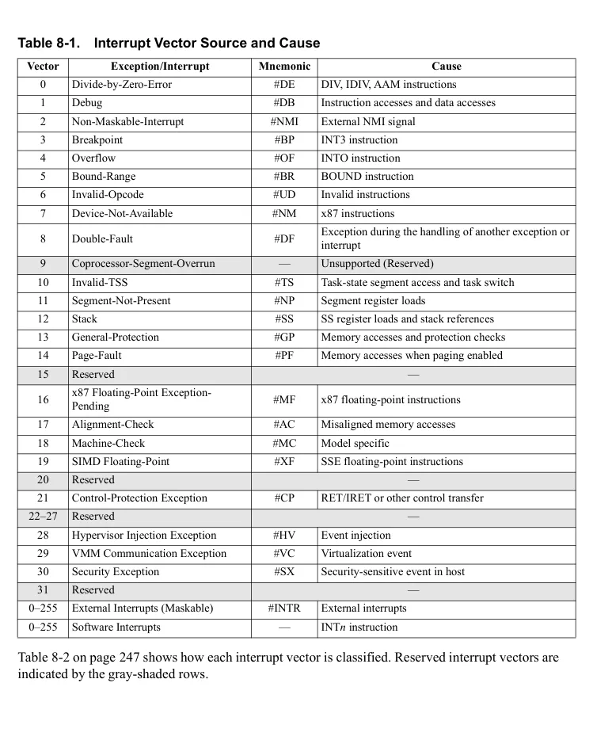

</details>


<!-- PDF source page: 309 | printed page: 247 -->

**Table 8-2. Interrupt Vector Classification**

| Vecto | Interrupt (Exception) | Type | Precise | Class2 |
| --- | --- | --- | --- | --- |
| 0 | Divide-by-Zero-Erro | Fault | yes | Contributory |
| 1 | Debug | Fault or Trap |  | Benign |
| 2 | Non-Maskable-Interrupt | — | — |  |
| 3 | Breakpoint | Trap | yes |  |
| 4 | Overflow | Trap |  |  |
| 5 | Bound-Range | Fault |  |  |
| 6 | Invalid-Opcode | Fault |  |  |
| 7 | Device-Not-Available | Fault |  |  |
| 8 | Double-Fault | Abort | no |  |
| 9 | Coprocessor-Segment-Overrun | Abort |  |  |
| 10 | Invalid-TSS | Fault | yes | Contributory |
| 11 | Segment-Not-Present | Fault |  |  |
| 12 | Stack | Fault |  |  |
| 13 | General-Protection | Fault |  |  |
| 14 | Page-Fault | Fault |  | Benign or Contributory |
| 15 | Reserved | Fault |  |  |
| 16 | x87 Floating-Point Exception-<br>Pending | Fault | no | Benign |
| 17 | Alignment-Check | Fault | yes |  |
| 18 | Machine-Check | Abort | no |  |
| 19 | SIMD Floating-Point | Fault | yes |  |
| 20 | Reserved | Fault |  |  |
| 21 | Control Protection | Fault | yes | Contributory |
| 22–27 | Reserved | Fault |  |  |
| 28 | Hypervisor Injection Exception | – | – | Benign |
| 29 | VMM Communication Exception | Fault | yes | Contributory |
| 30 | Security Exception | – | yes | Contributory |
| 31 | Reserved | – |  |  |
| 0–255 | External Interrupts (Maskable) | —1 | —1 | Benign |
| 0–255 | Software Interrupts | —1 |  |  |

> Note: 1. External interrupts are not classified by type or whether or not they are precise. 2. See Section “#DF—Double-Fault Exception (Vector 8)” on page 251 for a definition of benign and contributory classes.

The following sections describe each interrupt in detail. The format of the error code reported by each interrupt is described in Section “Error Codes” on page 262.

<details>
<summary>Rendered source page 309 (figures/tables)</summary>

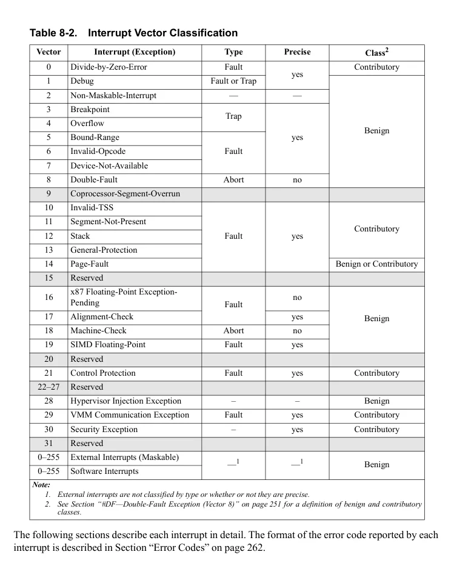

</details>


<!-- PDF source page: 310 | printed page: 248 -->

<a id="8-2-1-dedivide-by-zero-error-exception-vector-0"></a>

### 8.2.1 #DE—Divide-by-Zero-Error Exception (Vector 0)

A #DE exception occurs when the denominator of a DIV instruction or an IDIV instruction is 0. A #DE also occurs if the result is too large to be represented in the destination.

#DE cannot be disabled.

**Error Code Returned.** None.

**Program Restart.** #DE is a fault-type exception. The saved instruction pointer points to the instruction that caused the #DE.

<a id="8-2-2-dbdebug-exception-vector-1"></a>

### 8.2.2 #DB—Debug Exception (Vector 1)

When the debug-exception mechanism is enabled, a #DB exception can occur under any of the following circumstances:

- Instruction execution.
- Instruction single stepping.
- Data read.
- Data write.
- I/O read.
- I/O write.
- Task switch.
- Debug-register access, or *general detect fault (debug register access when DR7.GD=1).*
- Executing the INT1 instruction (opcode 0F1h).

#DB conditions are enabled and disabled using the debug-control register, DR7 and RFLAGS.TF. Each #DB condition is described in more detail in Section “Setting Breakpoints” on page 402.

The processor can be configured to generate a #DB exception as a trap following the successful execution of a bus lock when the processor is at privilege level &gt; 0. Section 13.1.3.6 on page 407 describes the bus lock trap mechanism in further detail.

The conditions under which a bus lock occurs are described in Section 7.3.3 on page 195.

**Error Code Returned.** None. #DB information is returned in the debug-status register, DR6.

**Program Restart.** #DB can be either a fault-type or trap-type exception. In the following cases, the saved instruction pointer points to the instruction that caused the #DB:

- Instruction execution.
- Invalid debug-register access, or *general detect.*

In all other cases, the instruction that caused the #DB is completed, and the saved instruction pointer points to the instruction after the one that caused the #DB.


<!-- PDF source page: 311 | printed page: 249 -->

The RFLAGS.RF bit can be used to restart an instruction following an instruction breakpoint resulting in a #DB. In most cases, the processor clears RFLAGS.RF to 0 after every instruction is successfully executed. However, in the case of the IRET, JMP, CALL, and INT*n (*through a task gate) instructions, RFLAGS.RF is not cleared to 0 until the *next* instruction successfully executes.

When a non-debug exception occurs (or when a string instruction is interrupted), the processor normally sets RFLAGS.RF to 1 in the rFLAGS *image* that is pushed on the interrupt stack. A subsequent IRET back to the interrupted program pops the rFLAGS image off the stack and into the RFLAGS register, with RFLAGS.RF=1. The interrupted instruction executes without causing an instruction breakpoint, after which the processor clears RFLAGS.RF to 0.

However, when a #DB exception occurs, the processor clears RFLAGS.RF to 0 in the rFLAGS image that is pushed on the interrupt stack. The #DB handler has two options:

- Disable the instruction breakpoint completely.
- Set RFLAGS.RF to 1 in the interrupt-stack rFLAGS image. The instruction breakpoint condition is ignored immediately after the IRET, but reoccurs if the instruction address is accessed later, as can occur in a program loop.

<a id="8-2-3-nminon-maskable-interrupt-exception-vector-2"></a>

### 8.2.3 NMI—Non-Maskable-Interrupt Exception (Vector 2)

An NMI exception occurs as a result of system logic signaling a non-maskable interrupt to the processor.

**Error Code Returned.** None.

**Program Restart.** NMI is an interrupt. The processor recognizes an NMI at an instruction boundary. The saved instruction pointer points to the instruction immediately following the boundary where the NMI was recognized.

**Masking.** NMI cannot be masked. However, when an NMI is recognized by the processor, recognition of subsequent NMIs are disabled until an IRET instruction is executed.

<a id="8-2-4-bpbreakpoint-exception-vector-3"></a>

### 8.2.4 #BP—Breakpoint Exception (Vector 3)

A #BP exception occurs when an INT3 instruction is executed. The INT3 is normally used by debug software to set instruction breakpoints by replacing instruction-opcode bytes with the INT3 opcode.

#BP cannot be disabled.

**Error Code Returned.** None.

**Program Restart.** #BP is a trap-type exception. The saved instruction pointer points to the byte after the INT3 instruction. This location can be the start of the next instruction. However, if the INT3 is used to replace the first opcode bytes of an instruction, the restart location is likely to be in the middle of an instruction. In the latter case, the debug software must replace the INT3 byte with the correct instruction byte. The saved RIP instruction pointer must then be decremented by one before returning


<!-- PDF source page: 312 | printed page: 250 -->

to the interrupted program. This allows the program to be restarted correctly on the interrupted-instruction boundary.

<a id="8-2-5-ofoverflow-exception-vector-4"></a>

### 8.2.5 #OF—Overflow Exception (Vector 4)

An #OF exception occurs as a result of executing an INTO instruction while the overflow bit in RFLAGS is set to 1 (RFLAGS.OF=1).

#OF cannot be disabled.

**Error Code Returned.** None.

**Program Restart.** #OF is a trap-type exception. The saved instruction pointer points to the instruction following the INTO instruction that caused the #OF.

<a id="8-2-6-brbound-range-exception-vector-5"></a>

### 8.2.6 #BR—Bound-Range Exception (Vector 5)

A #BR exception can occur as a result of executing the BOUND instruction. The BOUND instruction compares an array index (first operand) with the lower bounds and upper bounds of an array (second operand). If the array index is not within the array boundary, the #BR occurs.

#BR cannot be disabled.

**Error Code Returned.** None.

**Program Restart.** #BR is a fault-type exception. The saved instruction pointer points to the BOUND instruction that caused the #BR.

<a id="8-2-7-udinvalid-opcode-exception-vector-6"></a>

### 8.2.7 #UD—Invalid-Opcode Exception (Vector 6)

A #UD exception occurs when an attempt is made to execute an invalid or undefined opcode. The validity of an opcode often depends on the processor operating mode. A #UD occurs under the following conditions:

- Execution of any reserved or undefined opcode in any mode.
- Execution of the UD0, UD1 or UD2 instructions.
- Use of the LOCK prefix on an instruction that cannot be locked.
- Use of the LOCK prefix on a lockable instruction with a non-memory target location.
- Execution of an instruction with an invalid-operand type.
- Execution of the SYSENTER or SYSEXIT instructions in long mode.
- Execution of any of the following instructions in 64-bit mode: AAA, AAD, AAM, AAS, BOUND, CALL (opcode 9A), DAA, DAS, DEC, INC, INTO, JMP (opcode EA), LDS, LES, POP (DS, ES, SS), POPA, PUSH (CS, DS, ES, SS), PUSHA, SALC.
- Execution of the ARPL, LAR, LLDT, LSL, LTR, SLDT, STR, VERR, or VERW instructions when protected mode is not enabled, or when virtual-8086 mode is enabled.


<!-- PDF source page: 313 | printed page: 251 -->

- Execution of any legacy SSE instruction when CR4.OSFXSR is cleared to 0. (For further information, see Section “FXSAVE/FXRSTOR Support (OSFXSR)” on page 49.
- Execution of any SSE instruction (uses ZMM/YMM/XMM registers), or 64-bit media instruction (uses MMX™ registers) when CR0.EM = 1.
- Execution of any SSE floating-point instruction (uses ZMM/YMM/XMM registers) that causes a numeric exception when CR4.OSXMMEXCPT = 0.
- Use of the DR4 or DR5 debug registers when CR4.DE = 1.
- Execution of RSM when not in SMM mode.

See the specific instruction description (in the other volumes) for additional information on invalid conditions.

#UD cannot be disabled.

**Error Code Returned.** None.

**Program Restart.** #UD is a fault-type exception. The saved instruction pointer points to the instruction that caused the #UD.

<a id="8-2-8-nmdevice-not-available-exception-vector-7"></a>

### 8.2.8 #NM—Device-Not-Available Exception (Vector 7)

A #NM exception occurs under any of the following conditions:

- An FWAIT/WAIT instruction is executed when CR0.MP=1 and CR0.TS=1.
- Any x87 instruction other than FWAIT is executed when CR0.EM=1.
- Any x87 instruction is executed when CR0.TS=1. The CR0.MP bit controls whether the FWAIT/WAIT instruction causes an #NM exception when TS=1.
- Any 128-bit or 64-bit media instruction when CR0.TS=1.

#NM can be enabled or disabled under the control of the CR0.MP, CR0.EM, and CR0.TS bits as described above. See Section 3.1.1 for more information on the CR0 bits used to control the #NM exception.

**Error Code Returned.** None.

**Program Restart.** #NM is a fault-type exception. The saved instruction pointer points to the instruction that caused the #NM.

<a id="8-2-9-dfdouble-fault-exception-vector-8"></a>

### 8.2.9 #DF—Double-Fault Exception (Vector 8)

A #DF exception can occur when a second exception occurs during the handling of a prior (first) exception or interrupt handler.

Usually, the first and second exceptions can be handled sequentially without resulting in a #DF. In this case, the first exception is considered *benign*, as it does not harm the ability of the processor to handle the second exception.


<!-- PDF source page: 314 | printed page: 252 -->

In some cases, however, the first exception adversely affects the ability of the processor to handle the second exception. These exceptions contribute to the occurrence of a #DF, and are called *contributory* exceptions. If a contributory exception is followed by another contributory exception, a double-fault exception occurs. Likewise, if a page fault is followed by another page fault or a contributory exception, a double-fault exception occurs.

Table 8-3 shows the conditions under which a #DF occurs. Page faults are either benign or contributory, and are listed separately. See the “Class” column in Table 8-2 on page 247 for information on whether an exception is benign or contributory.

**Table 8-3. Double-Fault Exception Conditions**

| First Interrupting Event | Second Interrupting Event |
| --- | --- |
| Contributory Exceptions<br>• Divide-by-Zero-Error Exception<br>• Invalid-TSS Exception<br>• Segment-Not-Present Exception<br>• Stack Exception<br>• General-Protection Exception | Invalid-TSS Exception<br>Segment-Not-Present Exception<br>Stack Exception<br>General-Protection Exception |
| Page Fault Exception | Page Fault Exception<br>Invalid-TSS Exception<br>Segment-Not-Present Exception<br>Stack Exception<br>General-Protection Exception |

If a third interrupting event occurs while transferring control to the #DF handler, the processor shuts down. Only an NMI, RESET, or INIT can restart the processor in this case. However, if the processor shuts down as it is executing an NMI handler, the processor can only be restarted with RESET or INIT.

#DF cannot be disabled.

**Error Code Returned.** Zero.

**Program Restart.** #DF is an abort-type exception. The saved instruction pointer is undefined, and the program cannot be restarted.

<a id="8-2-10-coprocessor-segment-overrun-exception-vector-9"></a>

### 8.2.10 Coprocessor-Segment-Overrun Exception (Vector 9)

*This interrupt vector is reserved.* It is for a discontinued exception originally used by processors that supported external x87-instruction coprocessors. On those processors, the exception condition is caused by an invalid-segment or invalid-page access on an x87-instruction coprocessor-instruction operand. On current processors, this condition causes a general-protection exception to occur.

**Error Code Returned.** Not applicable.

**Program Restart.** Not applicable.

<details>
<summary>Rendered source page 314 (figures/tables)</summary>

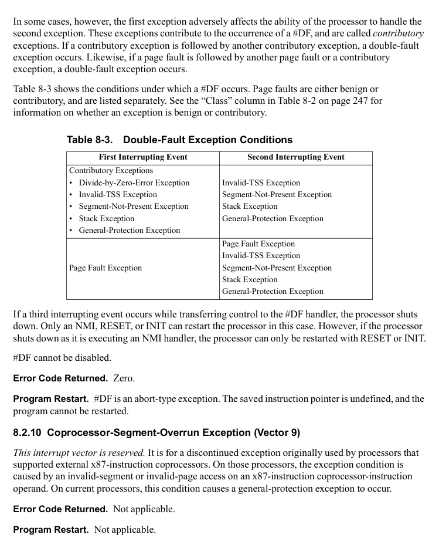

</details>


<!-- PDF source page: 315 | printed page: 253 -->

<a id="8-2-11-tsinvalid-tss-exception-vector-10"></a>

### 8.2.11 #TS—Invalid-TSS Exception (Vector 10)

A #TS exception occurs when an invalid reference is made to a segment selector as part of a task switch. A #TS also occurs during a privilege-changing control transfer (through a call gate or an interrupt gate), if a reference is made to an invalid stack-segment selector located in the TSS. Table 8-4 lists the conditions under which a #TS occurs and the error code returned by the exception mechanism.

#TS cannot be disabled.

**Error Code Returned.** See Table 8-4 for a list of error codes returned by the #TS exception.

**Program Restart.** #TS is a fault-type exception. If the exception occurs before loading the segment selectors from the TSS, the saved instruction pointer points to the instruction that caused the #TS. However, most #TS conditions occur due to errors with the loaded segment selectors. When an error is found with a segment selector, the hardware task-switch mechanism completes loading the new task state from the TSS, and then triggers the #TS exception mechanism. In this case, the saved instruction pointer points to the first instruction in the new task.

In long mode, a #TS cannot be caused by a task switch, because the hardware task-switch mechanism is disabled. A #TS occurs only as a result of a control transfer through a gate descriptor that results in an invalid stack-segment reference using an SS selector in the TSS. In this case, the saved instruction pointer always points to the control-transfer instruction that caused the #TS.

**Table 8-4. Invalid-TSS Exception Conditions**

| Selector<br>Reference | Error Condition | Error Code |
| --- | --- | --- |
| Task-State<br>Segment | TSS limit check on a task switch | TSS Selector Index |
| Task-State<br>Segment | TSS limit check on an inner-level stack pointe | TSS Selector Index |
| LDT Segment | LDT does not point to GDT | LDT Selector Index |
| LDT Segment | LDT reference outside GDT | LDT Selector Index |
| LDT Segment | GDT entry is not an LDT descripto | LDT Selector Index |
| LDT Segment | LDT descriptor is not present | LDT Selector Index |
| Code Segment | CS reference outside GDT or LDT | CS Selector Index |
| Code Segment | Privilege check (conforming DPL > CPL) | CS Selector Index |
| Code Segment | Privilege check (non-conforming DPL ¹ CPL) | CS Selector Index |
| Code Segment | Type check (CS not executable) | CS Selector Index |
| Data Segment | Data segment reference outside GDT or LDT | DS, ES, FS or GS Selector Index |
| Data Segment | Type check (data segment not readable) | DS, ES, FS or GS Selector Index |
| Stack Segment | SS reference outside GDT or LDT | SS Selector Index |
| Stack Segment | Privilege check (stack segment descriptor DPL ¹ CPL) | SS Selector Index |
| Stack Segment | Privilege check (stack segment selector RPL ¹ CPL) | SS Selector Index |
| Stack Segment | Type check (stack segment not writable) | SS Selector Index |

<details>
<summary>Rendered source page 315 (figures/tables)</summary>

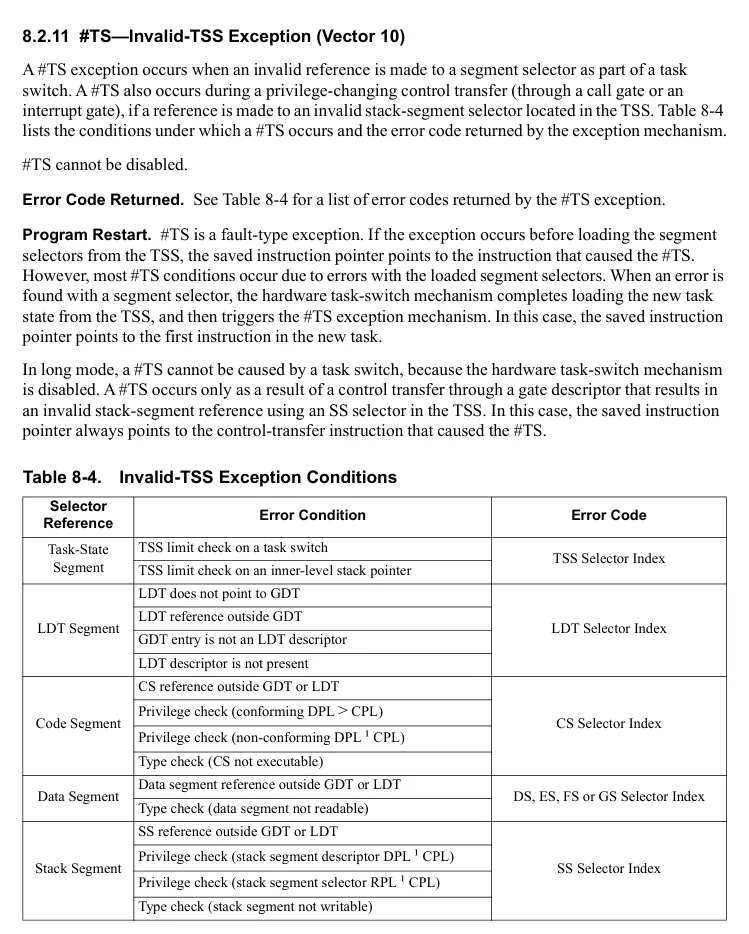

</details>


<!-- PDF source page: 316 | printed page: 254 -->

<a id="8-2-12-npsegment-not-present-exception-vector-11"></a>

### 8.2.12 #NP—Segment-Not-Present Exception (Vector 11)

An #NP occurs when an attempt is made to load a segment or gate with a clear present bit, as described in the following situations:

- Using the MOV, POP, LDS, LES, LFS, or LGS instructions to load a segment selector (DS, ES, FS, and GS) that references a segment descriptor containing a clear present bit (descriptor. P=0).
- Far transfer to a CS that is not present.
- Referencing a gate descriptor containing a clear present bit.
- Referencing a TSS descriptor containing a clear present bit. This includes attempts to load the TSS descriptor using the LTR instruction.
- Attempting to load a descriptor containing a clear present bit into the LDTR using the LLDT instruction.
- Loading a segment selector (CS, DS, ES, FS, or GS) as part of a task switch, with the segment descriptor referenced by the segment selector having a clear present bit. In long mode, an #NP cannot be caused by a task switch, because the hardware task-switch mechanism is disabled.

When loading a stack-segment selector (SS) that references a descriptor with a clear present bit, a stack exception (#SS) occurs. For information on the #SS exception, see the next section, “#SS— Stack Exception (Vector 12).”

#NP cannot be disabled.

**Error Code Returned.** The segment-selector index of the segment descriptor causing the #NP exception.

**Program Restart.** #NP is a fault-type exception. In most cases, the saved instruction pointer points to the instruction that loaded the segment selector resulting in the #NP. See Section “Exceptions During a Task Switch” on page 262 for a description of the consequences when this exception occurs during a task switch.

<a id="8-2-13-ssstack-exception-vector-12"></a>

### 8.2.13 #SS—Stack Exception (Vector 12)

An #SS exception can occur in the following situations:

- Implied stack references in which the stack address is not in canonical form. Implied stack references include all push and pop instructions, and any instruction using RSP or RBP as a base register.
- Attempting to load a stack-segment selector that references a segment descriptor containing a clear present bit (descriptor. P=0).
- Any stack access that fails the stack-limit check.

#SS cannot be disabled.

**Error Code Returned.** The error code depends on the cause of the #SS, as shown in Table 8-5 on page 255:


<!-- PDF source page: 317 | printed page: 255 -->

**Table 8-5. Stack Exception Error Codes**

| Stack Exception Cause | Error Code |
| --- | --- |
| Stack-segment descriptor present bit is clea | SS Selector Index |
| Stack-limit violation | 0 |
| Stack reference using a non-canonical address | 0 |

**Program Restart.** #SS is a fault-type exception. In most cases, the saved instruction pointer points to the instruction that caused the #SS. See Section “Exceptions During a Task Switch” on page 262 for a description of the consequences when this exception occurs during a task switch.

<a id="8-2-14-gpgeneral-protection-exception-vector-13"></a>

### 8.2.14 #GP—General-Protection Exception (Vector 13)

Table 8-6 describes the general situations that can cause a #GP exception. The table is not an exhaustive, detailed list of #GP conditions, but rather a guide to the situations that can cause a #GP. If an invalid use of an AMD64 architectural feature results in a #GP, the specific cause of the exception is described in detail in the section describing the architectural feature.

#GP cannot be disabled.

**Error Code Returned.** As shown in Table 8-6, a selector index is reported as the error code if the #GP is due to a segment-descriptor access. In all other cases, an error code of 0 is returned.

**Program Restart.** #GP is a fault-type exception. In most cases, the saved instruction pointer points to the instruction that caused the #GP. See Section “Exceptions During a Task Switch” on page 262 for a description of the consequences when this exception occurs during a task switch.

**Table 8-6. General-Protection Exception Conditions**

| Error Condition | Error Code |
| --- | --- |
| Any segment privilege-check violation, while loading a segment register. | Selector Index |
| Any segment type-check violation, while loading a segment register. | Selector Index |
| Loading a null selector into the CS, SS, or TR register. | Selector Index |
| Accessing a gate-descriptor containing a null segment selector. | Selector Index |
| Referencing an LDT descriptor or TSS descriptor located in the LDT. | Selector Index |
| Attempting a control transfer to a busy TSS (except IRET). | Selector Index |
| In 64-bit mode, loading a non-canonical base address into the GDTR or IDTR. | Selector Index |
| In long mode, accessing a gate descriptor containing a non-canonical offset. | Selector Index |
| In long mode, accessing a 16-bit gate descriptor. | Selector Index |
| In long mode, attempting a control transfer to a TSS or task gate. | Selector Index |

> In long mode, accessing a system or call-gate descriptor whose extended type field is not 0.
> In long mode, accessing a system descriptor containing a non-canonical base address.
> In long mode, accessing a gate descriptor that does not point to a 64-bit code segment.

<details>
<summary>Rendered source page 317 (figures/tables)</summary>

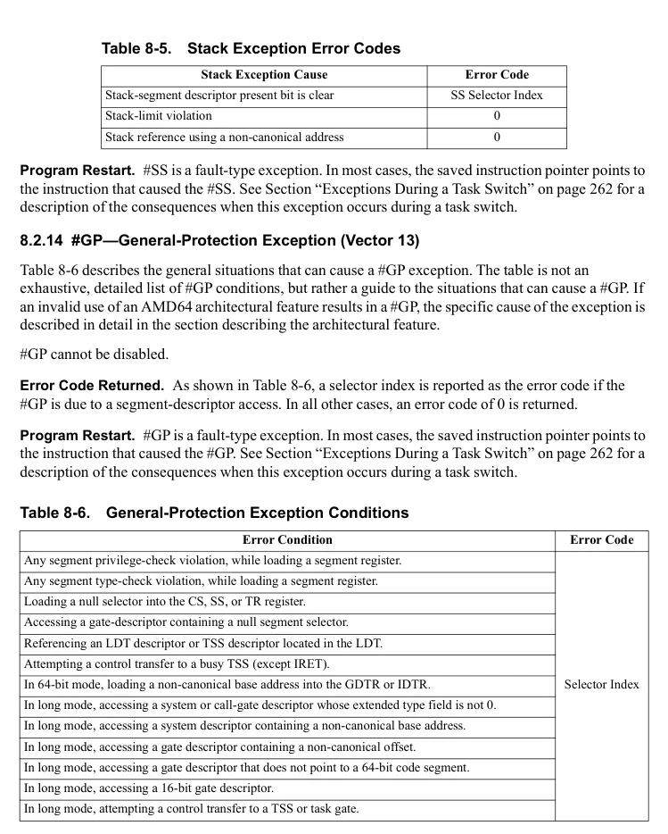

</details>


<!-- PDF source page: 318 | printed page: 256 -->

**Table 8-6. General-Protection Exception Conditions (continued)**

| Error Condition | Error Code |
| --- | --- |
| Any segment limit-check or non-canonical address violation (except when using the SS register). | 0 |
| Accessing memory using a null segment register. | 0 |
| Writing memory using a read-only segment register. | 0 |
| Attempting to execute an SSE instruction specifying an unaligned memory operand. | 0 |
| Executing a privileged instruction while CPL is > 0. | 0 |
| Executing an instruction that is more than 15 bytes long. | 0 |
| Writing a 1 into any register field that is reserved, must be zero (MBZ). | 0 |
| Using WRMSR to write a read-only MSR. | 0 |
| Using WRMSR to write a non-canonical value into an MSR that must be canonical. | 0 |
| Using WRMSR to set an invalid type encoding in an MTRR or the PAT MSR. | 0 |
| Enabling paging while protected mode is disabled. | 0 |
| Setting CR0.NW=1 while CR0.CD=0. | 0 |
| Any long-mode consistency-check violation. | 0 |

> Attempting to execute code that is past the CS segment limit or at a non-canonical RIP.

<a id="8-2-15-pfpage-fault-exception-vector-14"></a>

### 8.2.15 #PF—Page-Fault Exception (Vector 14)

A #PF exception can occur during a memory access in any of the following situations:

- A page-translation-table entry or physical page involved in translating the memory access is not present in physical memory. This is indicated by a cleared present bit (P=0) in the translation-table entry.
- An attempt is made by the processor to load the instruction TLB with a translation for a non-executable page.
- The memory access fails the paging-protection checks (user/supervisor, read/write, or both).
- A reserved bit in one of the page-translation-table entries is set to 1. A #PF occurs for this reason only when CR4.PSE=1 *or* CR4.PAE=1.
- A data access to a user-mode address caused a protection key violation.

#PF cannot be disabled.

**CR2 Register.** The virtual (linear) address that caused the #PF is stored in the CR2 register. The legacy CR2 register is 32 bits long. The CR2 register in the AMD64 architecture is 64 bits long, as shown in Figure 8-1 on page 257. In AMD64 implementations, when either software or a page fault causes a write to the CR2 register, only the low-order 32 bits of CR2 are used in legacy mode; the processor clears the high-order 32 bits.

<details>
<summary>Rendered source page 318 (figures/tables)</summary>

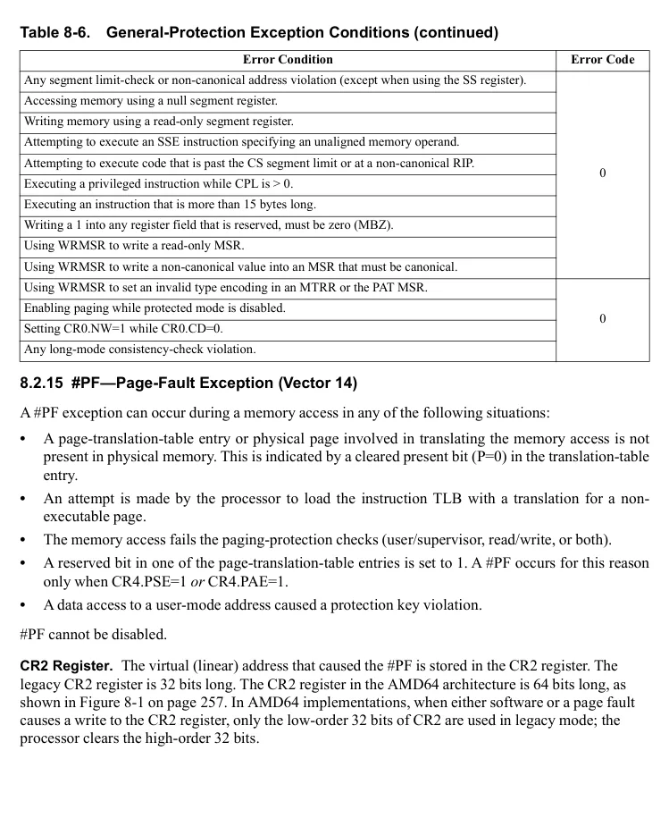

</details>


<!-- PDF source page: 319 | printed page: 257 -->

**Figure 8-1. Control Register 2 (CR2)**

<details>
<summary>Extracted figure labels</summary>

```text
63
0
Page-Fault Virtual Address
```

</details>

**Error Code Returned.** The page-fault error code is pushed onto the page-fault exception-handler stack. See Section “Page-Fault Error Code” on page 263 for a description of this error code.

**Program Restart.** #PF is a fault-type exception. In most cases, the saved instruction pointer points to the instruction that caused the #PF. See Section “Exceptions During a Task Switch” on page 262 for a description of what can happen if this exception occurs during a task switch.

<a id="8-2-16-mfx87-floating-point-exception-pending-vector-16"></a>

### 8.2.16 #MF—x87 Floating-Point Exception-Pending (Vector 16)

The #MF exception is used to handle unmasked x87 floating-point exceptions. An #MF occurs when *all* of the following conditions are true:

- CR0.NE=1.
- An unmasked x87 floating-point exception is pending. This is indicated by an exception bit in the x87 floating-point status-word register being set to 1
- The corresponding mask bit in the x87 floating-point control-word register is cleared to 0.
- The FWAIT/WAIT instruction or any waiting floating-point instruction is executed.

If there is an exception mask bit (in the FPU control word) set, the exception is not reported. Instead, the x87-instruction unit responds in a default manner and execution proceeds normally.

The x87 floating-point exceptions reported by the #MF exception are (including mnemonics):

- IE—Invalid-operation exception (also called #I), which is either:
- IE alone—Invalid arithmetic-operand exception (also called #IA), or
- SF and IE together—x87 Stack-fault exception (also called #IS).
- DE—Denormalized-operand exception (also called #D).
- ZE—Zero-divide exception (also called #Z).
- OE—Overflow exception (also called #O).
- UE—Underflow exception (also called #U).
- PE—Precision exception (also called #P or inexact-result exception).

**Error Code Returned.** None. Exception information is provided by the x87 status-word register. See “x87 Floating-Point Programming” in Volume 1 for more information on using this register.

**Program Restart.** #MF is a fault-type exception. The #MF exception is not precise, because multiple instructions and exceptions can occur before the #MF handler is invoked. Also, the saved instruction

<details>
<summary>Rendered source page 319 (figures/tables)</summary>

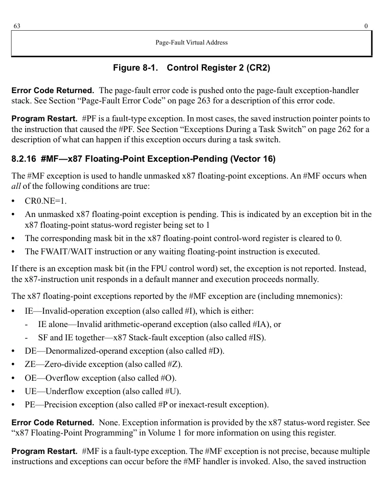

</details>


<!-- PDF source page: 320 | printed page: 258 -->

pointer does not point to the instruction that caused the exception resulting in the #MF. Instead, the saved instruction pointer points to the x87 floating-point instruction or FWAIT/WAIT instruction that is about to be executed when the #MF occurs. The address of the *last instruction* that caused an x87 floating-point exception is in the x87 instruction-pointer register. See “x87 Floating-Point Programming” in Volume 1 for information on accessing this register.

**Masking.** Each type of x87 floating-point exception can be masked by setting the appropriate bits in the x87 control-word register. See “x87 Floating-Point Programming” in Volume 1 for more information on using this register.

#MF can also be disabled by clearing the CR0.NE bit to 0. See Section “Numeric Error (NE) Bit” on page 43 for more information on using this bit.

<a id="8-2-17-acalignment-check-exception-vector-17"></a>

### 8.2.17 #AC—Alignment-Check Exception (Vector 17)

An #AC exception occurs when an unaligned-memory data reference is performed while alignment checking is enabled.

After a processor reset, #AC exceptions are disabled. Software enables the #AC exception by setting the following register bits:

- CR0.AM=1.
- RFLAGS.AC=1.

When the above register bits are set, an #AC can occur only when CPL=3. #AC never occurs when CPL  3.

Table 8-7 lists the data types and the alignment boundary required to avoid an #AC exception when the mechanism is enabled.

**Table 8-7. Data-Type Alignment**

| Supported Data Type | Required Alignment<br>(Byte Boundary) |
| --- | --- |
| Word | 2 |
| Doubleword | 4 |
| Quadword | 8 |
| Bit string | 2, 4 or 8 (depends on operand size) |
| 256-bit media | 16 |
| 128-bit media | 16 |
| 64-bit media | 8 |
| Segment selecto | 2 |
| 32-bit near pointe | 4 |
| 32-bit far pointe | 2 |
| 48-bit far pointe | 4 |

<details>
<summary>Rendered source page 320 (figures/tables)</summary>

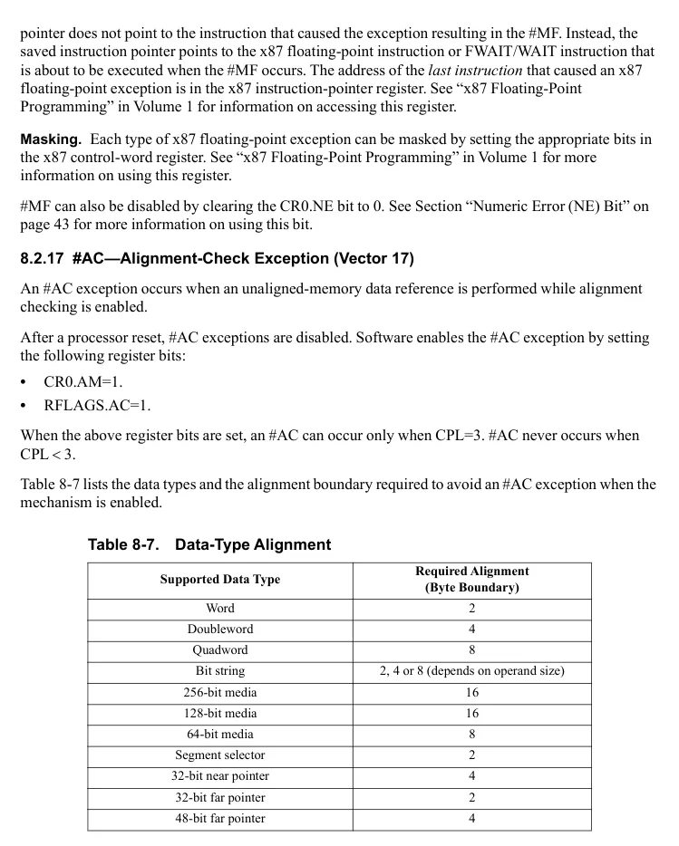

</details>


<!-- PDF source page: 321 | printed page: 259 -->

**Table 8-7. Data-Type Alignment (continued)**

| Supported Data Type | Required Alignment<br>(Byte Boundary) |
| --- | --- |
| x87 Floating-point single-precision | 4 |
| x87 Floating-point double-precision | 8 |
| x87 Floating-point extended-precision | 8 |
| x87 Floating-point save areas | 2 or 4 (depends on operand size) |

**Error Code Returned.** Zero.

**Program Restart.** #AC is a fault-type exception. The saved instruction pointer points to the instruction that caused the #AC.

<a id="8-2-18-mcmachine-check-exception-vector-18"></a>

### 8.2.18 #MC—Machine-Check Exception (Vector 18)

The #MC exception is model specific. Processor implementations are not required to support the #MC exception, and those implementations that do support #MC can vary in how the #MC exception mechanism works.

The exception is enabled by setting CR4.MCE to 1. The machine-check architecture can include model-specific masking for controlling the reporting of some errors. Refer to Chapter 9, “Machine Check Architecture,” for more information.

**Error Code Returned.** None. Error information is provided by model-specific registers (MSRs) defined by the machine-check architecture.

**Program Restart.** #MC is an abort-type exception. If the RIPV flag (RIP valid) is set in the MCG_Status MSR, the saved CS and rIP point to the instruction at which the interrupted process thread can be restarted. If RIPV is clear, there is no reliable way to restart the program. If the EIPV flag (EIP valid) is set in the MCG_Status MSR, the saved CS and rIP point to the process thread that caused the error. If EIPV is clear, the CS:rIP of the instruction causing the failure is not known or the machine check is not related to a specific instruction.

<a id="8-2-19-xfsimd-floating-point-exception-vector-19"></a>

### 8.2.19 #XF—SIMD Floating-Point Exception (Vector 19)

The #XF exception is used to handle unmasked SSE floating-point exceptions. A #XF exception occurs when all of the following conditions are true:

- A SSE floating-point exception occurs. The exception causes the processor to set the appropriate exception-status bit in the MXCSR register to 1.
- The exception-mask bit in the MXCSR that corresponds to the SSE floating-point exception is clear (=0).
- CR4.OSXMMEXCPT=1, indicating that the operating system supports handling of SSE floating-point exceptions.

<details>
<summary>Rendered source page 321 (figures/tables)</summary>

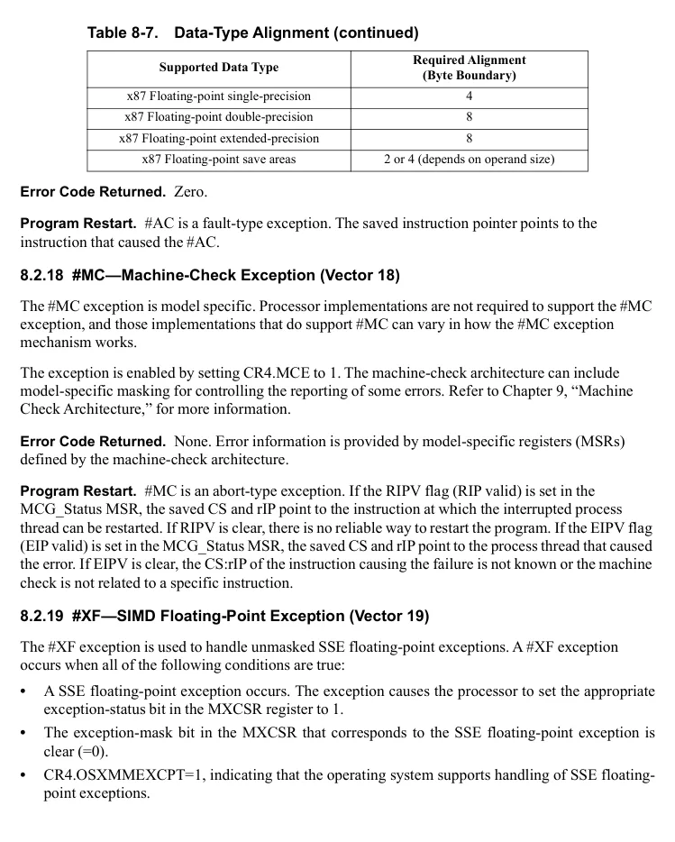

</details>


<!-- PDF source page: 322 | printed page: 260 -->

The exception-mask bits are used by software to specify the handling of SSE floating-point exceptions. When the corresponding mask bit is cleared to 0, an exception occurs under the control of the CR4.OSXMMEXCPT bit. However, if the mask bit is set to 1, the SSE floating-point unit responds in a default manner and execution proceeds normally.

The CR4.OSXMMEXCPT bit specifies the interrupt vector to be taken when an unmasked SSE floating-point exception occurs. When CR4.OSXMMEXCPT=1, the #XF interrupt vector is taken when an exception occurs. When CR4.OSXMMEXCPT=0, the #UD (undefined opcode) interrupt vector is taken when an exception occurs.

The SSE floating-point exceptions reported by the #XF exception are (including mnemonics):

- IE—Invalid-operation exception (also called #I).
- DE—Denormalized-operand exception (also called #D).
- ZE—Zero-divide exception (also called #Z).
- OE—Overflow exception (also called #O).
- UE—Underflow exception (also called #U).
- PE—Precision exception (also called #P or inexact-result exception).

Each type of SSE floating-point exception can be masked by setting the appropriate bits in the MXCSR register. #XF can also be disabled by clearing the CR4.OSXMMEXCPT bit to 0.

**Error Code Returned.** None. Exception information is provided by the SSE floating-point MXCSR register. See “Instruction Reference” in Volume 4 for more information on using this register.

**Program Restart.** #XF is a fault-type exception. Unlike the #MF exception, the #XF exception is precise. The saved instruction pointer points to the instruction that caused the #XF.

<a id="8-2-20-cpcontrol-protection-exception-vector-21"></a>

### 8.2.20 #CP—Control-Protection Exception (Vector 21)

A #CP exception is generated when shadow stacks are enabled (CR4.CET=1) and any of the following situations occur:

- For RET or IRET instructions, the return addresses on the shadow stack and the data stack do not match.
- An invalid supervisor shadow stack token is encountered by the CALL, RET, IRET, SETSSBSY or RSTORSSP instructions or during the delivery of an interrupt or exception.
- For inter-privilege RET and IRET instructions, the SSP is not 8-byte aligned, or the previous SSP from shadow stack is not 4-byte aligned or, in legacy or compatibility mode, is not less than 4GB.
- A task switch initiated by IRET where the incoming SSP is not aligned to 4 bytes or is not less than 4GB.

**Error Code Returned.** The #CP error code is pushed onto the control-protection exception-handler stack. See Section “Control-Protection Error Code” on page 263 for a description of this error code.


<!-- PDF source page: 323 | printed page: 261 -->

**Program Restart.** #CP is a fault-type exception. In most cases, the saved instruction pointer points to the instruction that caused the #CP. See Section “Exceptions During a Task Switch” on page 262 for a description of what can happen if this exception occurs during a task switch.

<a id="8-2-21-hvhypervisor-injection-exception-vector-28"></a>

### 8.2.21 #HV—Hypervisor Injection Exception (Vector 28)

The #HV exception may be injected by the hypervisor into a secure guest VM to notify the VM of pending events. See Section 15.36.16 for details.

<a id="8-2-22-vcvmm-communication-exception-vector-29"></a>

### 8.2.22 #VC—VMM Communication Exception (Vector 29)

The #VC exception is generated when certain events occur inside a secure guest VM. See Section 15.35.5 for more details.

<a id="8-2-23-sxsecurity-exception-vector-30"></a>

### 8.2.23 #SX—Security Exception (Vector 30)

The #SX exception is generated by security-sensitive events under SVM. See Section 15.28 for details.

<a id="8-2-24-user-defined-interrupts-vectors-32255"></a>

### 8.2.24 User-Defined Interrupts (Vectors 32–255)

User-defined interrupts can be initiated either by system logic or software. They occur when:

- System logic signals an external interrupt request to the processor. The signaling mechanism and the method of communicating the interrupt vector to the processor are implementation dependent.
- Software executes an INT*n* instruction. The INT*n* instruction operand provides the interrupt vector number.

Both methods can be used to initiate an interrupt into vectors 0 through 255. However, because vectors 0 through 31 are defined or reserved by the AMD64 architecture, software should not use vectors in this range for purposes other than their defined use.

**Error Code Returned.** None.

**Program Restart.** The saved instruction pointer depends on the interrupt source:

- External interrupts are recognized on instruction boundaries. The saved instruction pointer points to the instruction immediately following the boundary where the external interrupt was recognized.
- If the interrupt occurs as a result of executing the INT*n* instruction, the saved instruction pointer points to the instruction after the INT*n*.

**Masking.** The ability to mask user-defined interrupts depends on the interrupt source:

- External interrupts can be masked using the RFLAGS.IF bit. Setting RFLAGS.IF to 1 enables external interrupts, while clearing RFLAGS.IF to 0 inhibits them.
- Software interrupts (initiated by the INT*n* instruction) cannot be disabled.


<!-- PDF source page: 324 | printed page: 262 -->

<a id="8-3-exceptions-during-a-task-switch"></a>

## 8.3 Exceptions During a Task Switch

An exception can occur during a task switch while loading a segment selector. Page faults can also occur when accessing a TSS. In these cases, the hardware task-switch mechanism completes loading the new task state from the TSS, and then triggers the appropriate exception mechanism. No other checks are performed. When this happens, the saved instruction pointer points to the first instruction in the new task.

In long mode, an exception cannot occur during a task switch, because the hardware task-switch mechanism is disabled.

<a id="8-4-error-codes"></a>

## 8.4 Error Codes

The processor exception-handling mechanism reports error and status information for some exceptions using an error code. The error code is pushed onto the stack by the exception mechanism during the control transfer into the exception handler. The error code formats are described in the following sections.

<a id="8-4-1-selector-error-code"></a>

### 8.4.1 Selector-Error Code

Figure 8-2 shows the format of the selector-error code.

**Figure 8-2. Selector Error Code**

<details>
<summary>Extracted figure labels</summary>

```text
31
16 15
3
2
1
0
EXT
Reserved
Selector Index
IDT
TI
```

</details>

The information reported by the selector-error code includes:

- *EXT*—Bit 0. If this bit is set to 1, the exception source is external to the processor. If cleared to 0, the exception source is internal to the processor.
- *IDT*—Bit 1. If this bit is set to 1, the error-code selector-index field references a gate descriptor located in the interrupt-descriptor table (IDT). If cleared to 0, the selector-index field references a descriptor in either the global-descriptor table (GDT) or local-descriptor table (LDT), as indicated by the TI bit.
- *TI*—Bit 2. If this bit is set to 1, the error-code selector-index field references a descriptor in the LDT. If cleared to 0, the selector-index field references a descriptor in the GDT. The TI bit is relevant only when the IDT bit is cleared to 0.
- *Selector Index*—Bits 15:3. The selector-index field specifies the index into either the GDT, LDT, or IDT, as specified by the IDT and TI bits.

Some exceptions return a zero in the selector-error code.

<details>
<summary>Rendered source page 324 (figures/tables)</summary>

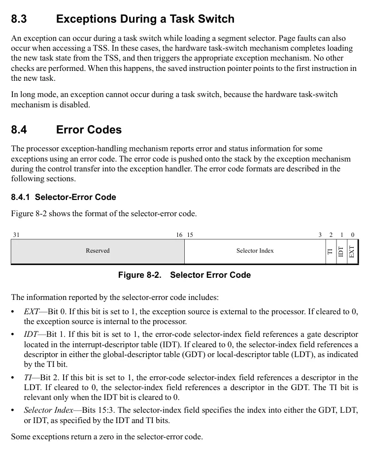

</details>


<!-- PDF source page: 325 | printed page: 263 -->

<a id="8-4-2-page-fault-error-code"></a>

### 8.4.2 Page-Fault Error Code

Figure 8-4 shows the format of the page-fault error code.

**Figure 8-3. Page-Fault Error Code**

<details>
<summary>Extracted figure labels</summary>

```text
31 30
7
6
5
4
3
2
1
0
RMP
RSV
R/W
S S
PK
Reserved
U/S
I/D
P
```

</details>

The information reported by the page-fault error code includes:

- *P*—Bit 0. If this bit is cleared to 0, the page fault was caused by a not-present page. If this bit is set to 1, the page fault was caused by a page-protection violation.
- *R/W*—Bit 1. If this bit is cleared to 0, the access that caused the page fault is a memory read. If this bit is set to 1, the memory access that caused the page fault was a write. This bit does not necessarily indicate the cause of the page fault was a read or write violation.
- *U/S*—Bit 2. If this bit is cleared to 0, an access in supervisor mode (CPL=0, 1, or 2) caused the page fault. If this bit is set to 1, an access in user mode (CPL=3) caused the page fault. This bit does not necessarily indicate the cause of the page fault was a privilege violation.
- *RSV*—Bit 3. If this bit is set to 1, the page fault is a result of the processor reading a 1 from a reserved field within a page-translation-table entry. This type of page fault occurs only when CR4.PSE=1 or CR4.PAE=1. If this bit is cleared to 0, the page fault was not caused by the processor reading a 1 from a reserved field.
- *I/D*—Bit 4. If this bit is set to 1, it indicates that the access that caused the page fault was an instruction fetch. Otherwise, this bit is cleared to 0. This bit is only defined if no-execute feature is enabled (EFER.NXE=1 && CR4.PAE=1).
- *PK*—Bit 5. If this bit is set to 1, it indicates that a data access to a user-mode address caused a protection key violation. This fault only occurs if memory protection keys are enabled (CR4.PKE=1).
- *SS*—Bit 6. If this bit is set to 1, the page fault was caused by a shadow stack access. This bit is only set when the shadow stack feature is enabled (CR4.CET=1).
- *RMP*—Bit 31. If this bit is set to 1, the page fault is a result of the processor encountering an RMP violation. This type of page fault only occurs when SYSCFG[SecureNestedPagingEn]=1. If this bit is cleared to 0, the page fault was not caused by an RMP violation. See section 15.36.10 for additional information.

<a id="8-4-3-control-protection-error-code"></a>

### 8.4.3 Control-Protection Error Code

Figure 8-4 shows the format of the #CP error code.

<details>
<summary>Rendered source page 325 (figures/tables)</summary>

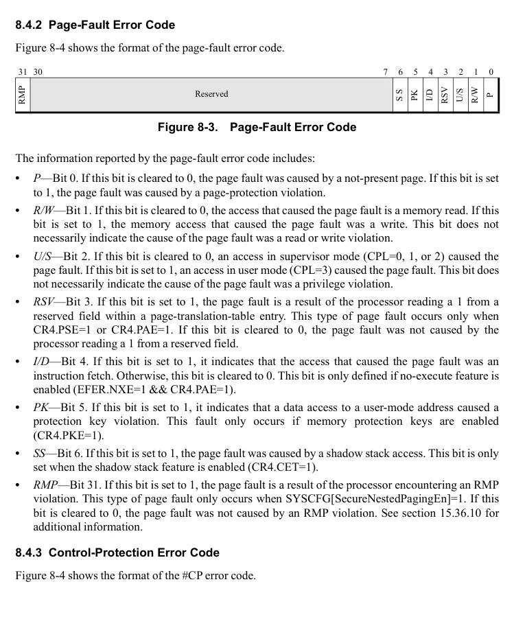

</details>


<!-- PDF source page: 326 | printed page: 264 -->

**Figure 8-4. Control-Protection Error Code**

<details>
<summary>Extracted figure labels</summary>

```text
31
15 14
0
Reserved
Control-protection error code
```

</details>

The control-protection error codes are defined below:

**Table 8-8. Control-Protection Error Codes**

| Error Code Value | Name | Cause |
| --- | --- | --- |
| 1 | NEAR-RET | A RET (near) instruction encountered a return address mismatch. |
| 2 | FAR-RET/IRET | A RET (far) or IRET instruction encountered a return address mismatch. |
| 4 | RSTORSSP | An RSTORSSP instruction encountered an invalid shadow stack restore<br>token. |
| 5 | SETSSBSY | A SETSSBSY instruction encountered an invalid supervisor shadow<br>stack token. |

<a id="8-5-priorities"></a>

## 8.5 Priorities

To allow for consistent handling of multiple-interrupt conditions, simultaneous interrupts are prioritized by the processor. The AMD64 architecture defines priorities between groups of interrupts, and interrupt prioritization within a group is implementation dependent. Table 8-9 shows the interrupt priorities defined by the AMD64 architecture.

When simultaneous interrupts occur, the processor transfers control to the highest-priority interrupt handler. Lower-priority interrupts from external sources are held pending by the processor, and they are handled after the higher-priority interrupt is handled. Lower-priority interrupts that result from internal sources are discarded. Those interrupts reoccur when the high-priority interrupt handler completes and transfers control back to the interrupted instruction. Software interrupts are discarded as well, and reoccur when the software-interrupt instruction is restarted.

**Table 8-9. Simultaneous Interrupt Priorities**

| Interrupt<br>Priority | Interrupt Condition | Interrupt<br>Vecto |
| --- | --- | --- |
| (High)<br>0 | Processor Reset | — |
| (High)<br>0 | Machine-Check Exception | 18 |
| 1 | External Processor Initialization (INIT) | — |
| 1 | SMI Interrupt | — |
| 1 | External Clock Stop (Stpclk) | — |

<details>
<summary>Rendered source page 326 (figures/tables)</summary>

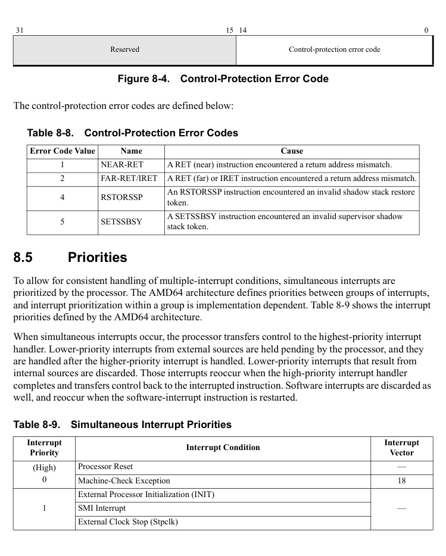

</details>


<!-- PDF source page: 327 | printed page: 265 -->

**Table 8-9. Simultaneous Interrupt Priorities (continued)**

| Interrupt<br>Priority | Interrupt Condition | Interrupt<br>Vecto |
| --- | --- | --- |
| 2 | Data, and I/O Breakpoint (Debug Register) | 1 |
| 2 | Single-Step Execution Instruction Trap (RFLAGS.TF=1) | 1 |
| 3 | Non-Maskable Interrupt | 2 |
| 4 | Maskable External Interrupt (INTR) | 32–255 |
| 5 | Instruction Breakpoint (Debug Register) | 1 |
| 5 | Code-Segment-Limit Violation1 | 13 |
| 5 | Instruction-Fetch Page Fault1 | 14 |
| 6 | Invalid Opcode Exception1 | 6 |
| 6 | Device-Not-Available Exception | 7 |
| 6 | Instruction-Length Violation (> 15 Bytes) | 13 |
| 7 | Divide-by-zero Exception | 0 |
| 7 | Invalid-TSS Exception | 10 |
| 7 | Segment-Not-Present Exception | 11 |
| 7 | Stack Exception | 12 |
| 7 | General-Protection Exception | 13 |
| 7 | Data-Access Page Fault | 14 |
| 7 | Floating-Point Exception-Pending Exception | 16 |
| 7 | Alignment-Check Exception | 17 |
| 7 | SIMD Floating-Point Exception | 19 |
| 7 | Control-Protection Exception | 21 |
| 7 | Hypervisor Injection Exception | 28 |
| 7 | VMM Communication Exception | 29 |

> Note: 1. This reflects the relative priority for faults encountered when fetching the first byte of an instruction. In the fetching and decoding of subsequent bytes of an instruction, if those bytes span the segment limit or cross into a non-executable or not-present page, the fetch will result in a #GP(0) fault or #PF as appropriate, preventing those bytes from being accessed. However, if the instruction can be determined to be invalid based just on the bytes preceding that boundary, a #UD fault may take priority. This behavior is model-dependent.

<a id="8-5-1-floating-point-exception-priorities"></a>

### 8.5.1 Floating-Point Exception Priorities

Floating-point exceptions (SSE and x87 floating-point) can be handled in one of two ways:

- Unmasked exceptions are reported in the appropriate floating-point status register, and a software-interrupt handler is invoked. See Section “#MF—x87 Floating-Point Exception-Pending (Vector
1. 16) ” on page 257 and Section “#XF—SIMD Floating-Point Exception (Vector 19)” on page 259 for more information on the floating-point interrupts.

<details>
<summary>Rendered source page 327 (figures/tables)</summary>

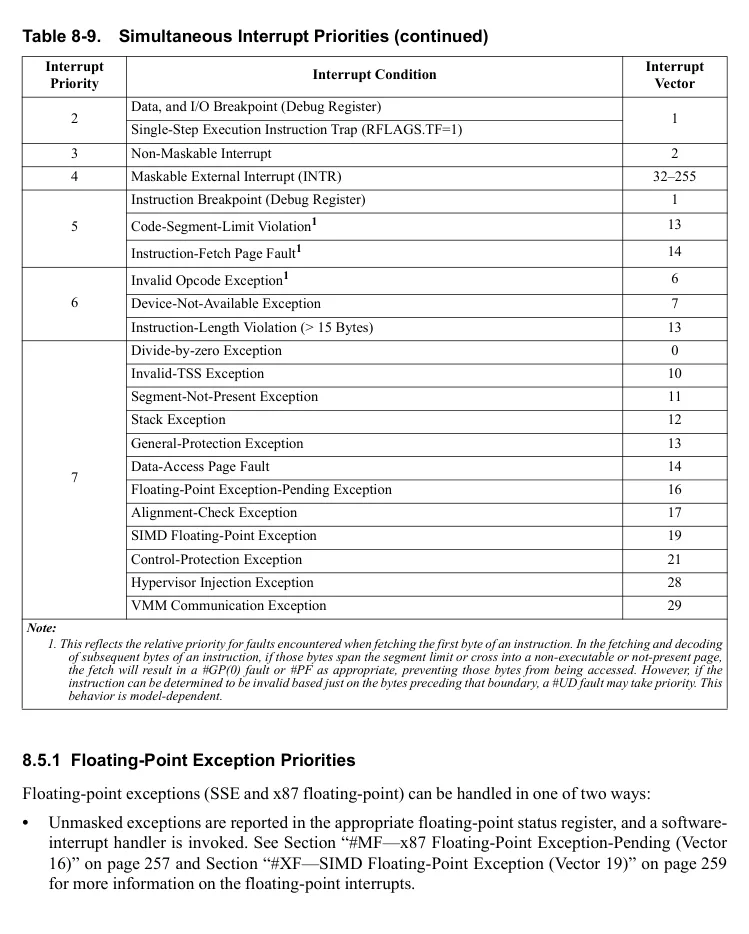

</details>


<!-- PDF source page: 328 | printed page: 266 -->

- Masked exceptions are also reported in the appropriate floating-point status register. Instead of transferring control to an interrupt handler, however, the processor handles the exception in a default manner and execution proceeds.

If the processor detects more than one exception while executing a single floating-point instruction, it prioritizes the exceptions in a predictable manner. When responding in a default manner to masked exceptions, it is possible that the processor acts only on the high-priority exception and ignores lower-priority exceptions. In the case of vector (SIMD) floating-point instructions, priorities are set on sub-operations, not across all operations. For example, if the processor detects and acts on a QNaN operand in one sub-operation, the processor can still detect and act on a denormal operand in another sub-operation.

When reporting SSE floating-point exceptions before taking an interrupt or handling them in a default manner, the processor first classifies the exceptions as follows:

- *Input exceptions* include SNaN operand (#I), invalid operation (#I), denormal operand (#D), or zero-divide (#Z). Using a NaN operand with a maximum, minimum, compare, or convert instruction is also considered an input exception.
- *Output exceptions* include numeric overflow (#O), numeric underflow (#U), and precision (#P).

Using the above classification, the processor applies the following procedure to report the exceptions:

1. 1. The exceptions for all sub-operations are prioritized.

1. 2. The exception conditions for all sub-operations are logically ORed together to form a single set of exceptions covering all operations. For example, if two sub-operations produce a denormal result, only one denormal exception is reported.

1. 3. If the set of exceptions includes any *unmasked* input exceptions, all input exceptions are reported in MCXSR, and no output exceptions are reported. Otherwise, all input and output exceptions are reported in MCXSR.

1. 4. If any exceptions are unmasked, control is transferred to the appropriate interrupt handler.

Table 8-10 on page 266 lists the priorities for simultaneous floating-point exceptions.

**Table 8-10. Simultaneous Floating-Point Exception Priorities**

| Exception<br>Priority / (High)<br>0 | Exception Condition / SNaN Operand | Exception Condition / #I |
| --- | --- | --- |
|  | Stack Overflow (x87 Floating-Point) |  |
|  | Stack Underflow (x87 Floating-Point) |  |
| 1 | QNaN Operand | — |
| 2 | Invalid Operation (Remaining Conditions) | #I |
| 2 | Zero Divide | #Z |

> NaN Operand of Maximum, Minimum, Compare, and Convert Instructions (Vector Floating-Point)

<details>
<summary>Rendered source page 328 (figures/tables)</summary>

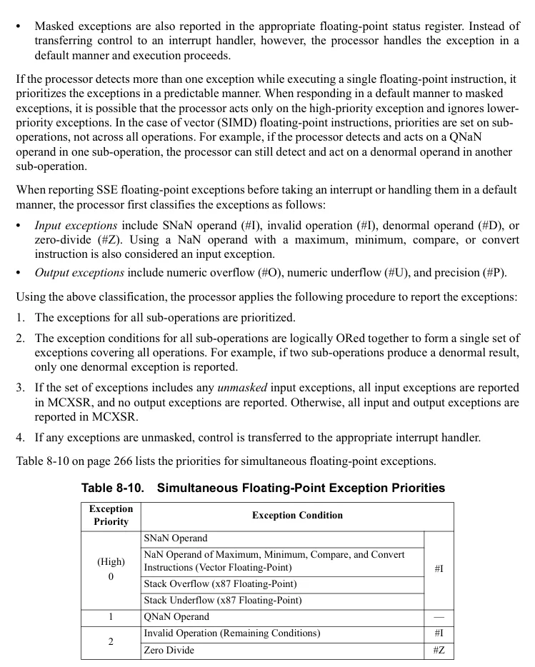

</details>


<!-- PDF source page: 329 | printed page: 267 -->

**Table 8-10. Simultaneous Floating-Point Exception Priorities (continued)**

| Exception<br>Priority / 3 | Exception Condition / Denormal Operand | Exception Condition / #D |
| --- | --- | --- |
| 4 | Numeric Overflow | #O |
| 4 | Numeric Underflow | #U |
| 5<br>(Low) | Precision | #P |

<a id="8-5-2-external-interrupt-priorities"></a>

### 8.5.2 External Interrupt Priorities

The AMD64 architecture allows software to define up to 15 external interrupt-priority classes. Priority classes are numbered from 1 to 15, with priority-class 1 being the lowest and priority-class 15 the highest. The organization of these priority classes is implementation dependent. A typical method is to use the upper four bits of the interrupt vector number to define the priority. Thus, interrupt vector 53h has a priority of 5 and interrupt vector 37h has a priority of 3.

A new control register (CR8) is introduced by the AMD64 architecture for managing priority classes. This register, called the *task-priority register* (TPR), uses its four low-order bits to specify a task priority. The remaining 60 bits are reserved and must be written with zeros. Figure 8-5 shows the format of the TPR.

The TPR is available only in 64-bit mode.

**Figure 8-5. Task Priority Register (CR8)**

<details>
<summary>Extracted figure labels</summary>

```text
63
4
3
0
Reserved, MBZ
Task Priority
(TPR)
```

</details>

System software can use the TPR register to temporarily block low-priority interrupts from interrupting a high-priority task. This is accomplished by loading TPR with a value corresponding to the highest-priority interrupt that is to be blocked. For example, loading TPR with a value of 9 (1001b) blocks all interrupts with a priority class of 9 or less, while allowing all interrupts with a priority class of 10 or more to be recognized. Loading TPR with 0 enables all external interrupts. Loading TPR with 15 (1111b) disables all external interrupts. The TPR is cleared to 0 on reset.

System software reads and writes the TPR using a MOV CR8 instruction. The MOV CR8 instruction requires a privilege level of 0. Programs running at any other privilege level cannot read or write the TPR, and an attempt to do so results in a general-protection exception (#GP).

A serializing instruction is not required after loading the TPR, because a new priority level is established when the MOV instruction completes execution. For example, assume two sequential TPR loads are performed, in which a low value is first loaded into TPR and immediately followed by a load

<details>
<summary>Rendered source page 329 (figures/tables)</summary>

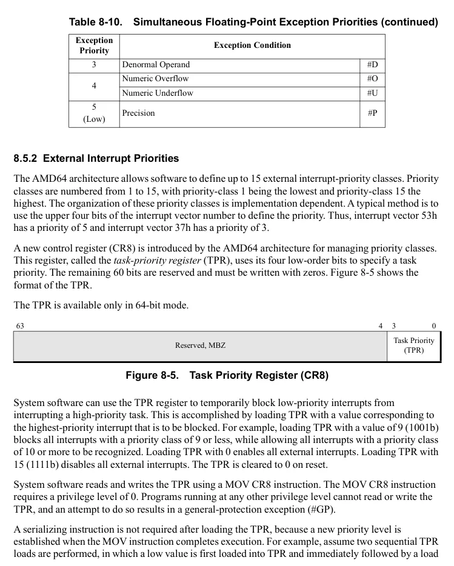

</details>


<!-- PDF source page: 330 | printed page: 268 -->

of a higher value. Any pending, lower-priority interrupt enabled by the first MOV CR8 is recognized between the two MOVs.

The TPR is an architectural abstraction of the interrupt controller (IC), which prioritizes and manages external interrupt delivery to the processor. The IC can be an external system device, or it can be integrated on the chip like the local advanced programmable interrupt controller (APIC). Typically, the IC contains a priority mechanism similar, if not identical to, the TPR. The IC, however, is implementation dependent, and the underlying priority mechanisms are subject to change. The TPR, by contrast, is part of the AMD64 architecture.

**Effect of IC on TPR.** The features of the implementation-specific IC can impact the operation of the TPR. For example, the TPR might affect interrupt delivery only if the IC is enabled. Also, the mapping of an external interrupt to a specific interrupt priority is an implementation-specific behavior of the IC.

While the CR8 register provides the same functionality as the TPR at offset 80h of the local APIC, software should only use one mechanism to access the TPR. For example, updating the TPR with a write to the local APIC offset 0x80 but then reading it with a MOV CR8 is not guaranteed to return the same value that was written by the local APIC write.

<a id="8-6-real-mode-interrupt-control-transfers"></a>

## 8.6 Real-Mode Interrupt Control Transfers

In real mode, the IDT is a table of 4-byte entries, one entry for each of the 256 possible interrupts implemented by the system. The real mode IDT is often referred to as an *interrupt vector table*, or IVT. Table entries contain a far pointer (CS:IP pair) to an exception or interrupt handler. The base of the IDT is stored in the IDTR register, which is loaded with a value of 00h during a processor reset. Figure 8-6 on page 269 shows how the real-mode interrupt handler is located by the interrupt mechanism.


<!-- PDF source page: 331 | printed page: 269 -->

**Figure 8-6. Real-Mode Interrupt Control Transfer**

<details>
<summary>Extracted figure labels</summary>

```text
Memory
Interrupt-Descriptor
Table
Interrupt Vector
CS
Interrupt Handler
Offset
*
+
4
IDT Base Address
513-239.eps
Interrupt-Descriptor-Table Register
```

</details>

When an exception or interrupt occurs in real mode, the processor performs the following:

1. 1. Pushes the FLAGS register (EFLAGS[15:0]) onto the stack.

1. 2. Clears EFLAGS.IF to 0 and EFLAGS.TF to 0.

1. 3. Saves the CS register and IP register (RIP[15:0]) by pushing them onto the stack.

1. 4. Locates the interrupt-handler pointer (CS:IP) in the IDT by scaling the interrupt vector by four and adding the result to the value in the IDTR.

1. 5. Transfers control to the interrupt handler referenced by the CS:IP in the IDT.

Figure 8-7 on page 270 shows the stack after control is transferred to the interrupt handler in real mode.

<details>
<summary>Rendered source page 331 (figures/tables)</summary>

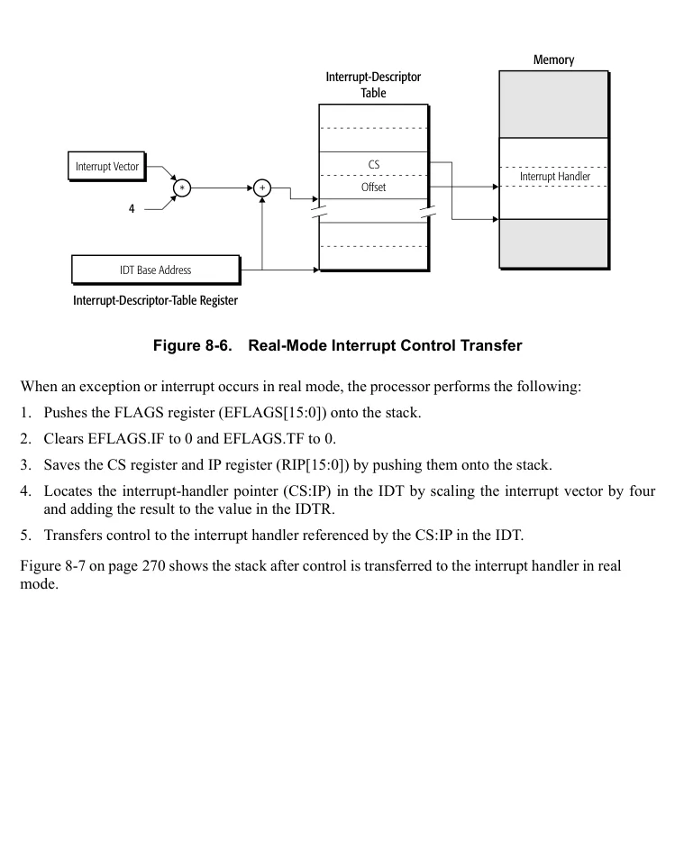

</details>


<!-- PDF source page: 332 | printed page: 270 -->

**Figure 8-7. Stack After Interrupt in Real Mode**

<details>
<summary>Extracted figure labels</summary>

```text
Interrupt-Handler and
Interrupted-Program
Stack
Return FLAGS
+4
Return CS
+2
Return IP
SS:SP
513-243.eps
```

</details>

An IRET instruction is used to return to the interrupted program. When an IRET is executed, the processor performs the following:

1. 1. Pops the saved CS value off the stack and into the CS register. The saved IP value is popped into RIP[15:0].

1. 2. Pops the FLAGS value off of the stack and into EFLAGS[15:0].

1. 3. Execution begins at the saved CS.IP location.

<a id="8-7-legacy-protected-mode-interrupt-control-transfers"></a>

## 8.7 Legacy Protected-Mode Interrupt Control Transfers

In protected mode, the interrupt mechanism transfers control to an exception or interrupt handler through gate descriptors. In protected mode, the IDT is a table of 8-byte gate entries, one for each of the 256 possible interrupt vectors implemented by the system. Three gate types are allowed in the IDT:

- Interrupt gates
- Trap gates
- Task gates

If a reference is made to any other descriptor type in the IDT, a general-protection exception (#GP) occurs.

Interrupt-gate control transfers are similar to CALLs and JMPs through call gates. The interrupt mechanism uses gates (interrupt, trap, and task) to establish protected entry-points into the exception and interrupt handlers.

The remainder of this chapter discusses control transfers through interrupt gates and trap gates. If the gate descriptor in the IDT is a task gate, a TSS-segment selector is referenced, and a task switch occurs. See Chapter 12, “Task Management,” for more information on the hardware task-switch mechanism.

<details>
<summary>Rendered source page 332 (figures/tables)</summary>

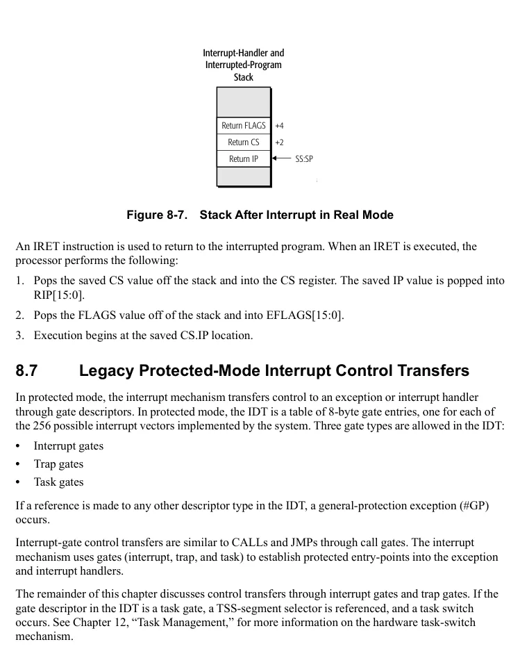

</details>


<!-- PDF source page: 333 | printed page: 271 -->

<a id="8-7-1-locating-the-interrupt-handler"></a>

### 8.7.1 Locating the Interrupt Handler

When an exception or interrupt occurs, the processor scales the interrupt vector number by eight and uses the result as an offset into the IDT. If the gate descriptor referenced by the IDT offset is an interrupt gate or a trap gate, it contains a segment-selector and segment-offset field (see Section “Legacy Segment Descriptors” on page 88 for a detailed description of the gate-descriptor format and fields). These two fields perform the same function as the pointer operand in a far control-transfer instruction. The gate-descriptor segment-selector field points to the target code-segment descriptor located in either the GDT or LDT. The gate-descriptor segment-offset field is the instruction-pointer offset into the interrupt-handler code segment. The code-segment base taken from the code-segment descriptor is added to the gate-descriptor segment-offset field to create the interrupt-handler virtual address (linear address).

Figure 8-8 on page 272 shows how the protected-mode interrupt handler is located by the interrupt mechanism.


<!-- PDF source page: 334 | printed page: 272 -->

**Figure 8-8. Protected-Mode Interrupt Control Transfer**

<details>
<summary>Extracted figure labels</summary>

```text
Interrupt
Descriptor Table
CS Selector
DPL
Interrupt Vector
Code-Segment Offset
+
*
8
IDT Base Address
IDT Limit
Interrupt-Descriptor-Table Register
Virtual-Address
Space
Global or Local
Descriptor Table
Interrupt Handler
+
CS Limit
DPL
Code Segment
Code-Segment Base
513-240.eps
```

</details>

<a id="8-7-2-interrupt-to-same-privilege"></a>

### 8.7.2 Interrupt To Same Privilege

When a control transfer to an exception or interrupt handler at the same privilege level occurs (through an interrupt gate or a trap gate), the processor performs the following:

1. 1. Pushes the EFLAGS register onto the stack.

1. 2. Clears the TF, NT, RF, and VM bits in EFLAGS to 0.

1. 3. The processor handles EFLAGS.IF based on the gate-descriptor type:

<details>
<summary>Rendered source page 334 (figures/tables)</summary>

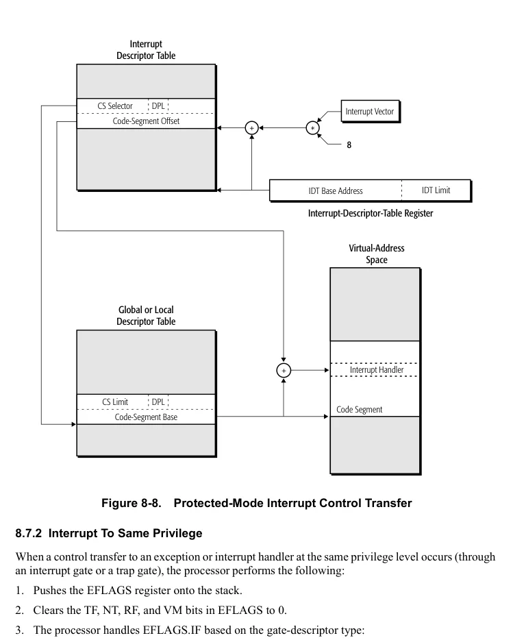

</details>


<!-- PDF source page: 335 | printed page: 273 -->

- If the gate descriptor is an interrupt gate, EFLAGS.IF is cleared to 0.
- If the gate descriptor is a trap gate, EFLAGS.IF is not modified.

1. 4. Saves the return CS register and EIP register (RIP[31:0]) by pushing them onto the stack. The CS value is padded with two bytes to form a doubleword.

1. 5. If the interrupt has an associated error code, the error code is pushed onto the stack.

1. 6. The CS register is loaded from the segment-selector field in the gate descriptor, and the EIP is loaded from the offset field in the gate descriptor.

1. 7. The interrupt handler begins executing with the instruction referenced by new CS:EIP.

Figure 8-9 shows the stack after control is transferred to the interrupt handler.

**Figure 8-9. Stack After Interrupt to Same Privilege Level**

<details>
<summary>Extracted figure labels</summary>

```text
Interrupt-Handler and
Interrupted Program
Stack
With Error Code
With No Error Code
Return EFLAGS
+12
Return CS
+8
Return EFLAGS
+8
Return EIP
+4
Return CS
Error Code
SS:ESP
Return EIP
SS:ESP
513-242.eps
```

</details>

<a id="8-7-3-interrupt-to-higher-privilege"></a>

### 8.7.3 Interrupt To Higher Privilege

When a control transfer to an exception or interrupt handler running at a higher privilege occurs (numerically lower CPL value), the processor performs a stack switch using the following steps:

1. 1. The target CPL is read by the processor from the target code-segment DPL and used as an index into the TSS for selecting the new stack pointer (SS:ESP). For example, if the target CPL is 1, the processor selects the SS:ESP for privilege-level 1 from the TSS.

1. 2. Pushes the return stack pointer (old SS:ESP) onto the new stack. The SS value is padded with two bytes to form a doubleword.

1. 3. Pushes the EFLAGS register onto the new stack.

1. 4. Clears the following EFLAGS bits to 0: TF, NT, RF, and VM.

1. 5. The processor handles the EFLAGS.IF bit based on the gate-descriptor type:

<details>
<summary>Rendered source page 335 (figures/tables)</summary>

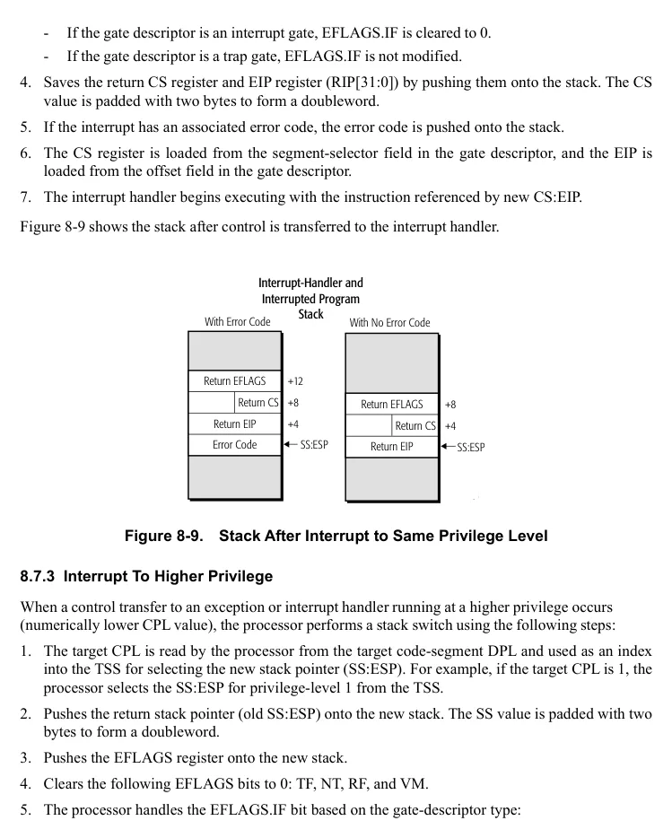

</details>


<!-- PDF source page: 336 | printed page: 274 -->

- If the gate descriptor is an interrupt gate, EFLAGS.IF is cleared to 0.
- If the gate descriptor is a trap gate, EFLAGS.IF is not modified.

1. 6. Saves the return-address pointer (CS:EIP) by pushing it onto the stack. The CS value is padded with two bytes to form a doubleword.

1. 7. If the interrupt vector number has an error code associated with it, the error code is pushed onto the stack.

1. 8. The CS register is loaded from the segment-selector field in the gate descriptor, and the EIP is loaded from the offset field in the gate descriptor.

1. 9. The interrupt handler begins executing with the instruction referenced by new CS:EIP.

Figure 8-10 shows the new stack after control is transferred to the interrupt handler.

**Figure 8-10. Stack After Interrupt to Higher Privilege**

<details>
<summary>Extracted figure labels</summary>

```text
Interrupt-Handler Stack
With Error Code
With No Error Code
+20
Return SS
Return ESP
+16
Return SS
Return ESP
Return EFLAGS
+12
Return CS
+8
Return EFLAGS
Return CS
Return EIP
+4
Error Code
New SS:ESP
Return EIP
New SS:ESP
513-241.eps
```

</details>

<a id="8-7-4-privilege-checks"></a>

### 8.7.4 Privilege Checks

Before loading the CS register with the interrupt-handler code-segment selector (located in the gate descriptor), the processor performs privilege checks similar to those performed on call gates. The checks are performed when either conforming or nonconforming interrupt handlers are referenced:

1. 1. The processor reads the gate DPL from the interrupt-gate or trap-gate descriptor. The gate DPL is the *minimum privilege-level* (numerically-highest value) needed by a program to access the gate. The processor compares the CPL with the gate DPL. The CPL must be numerically *less-than or equal-to* the gate DPL for this check to pass.

<details>
<summary>Rendered source page 336 (figures/tables)</summary>

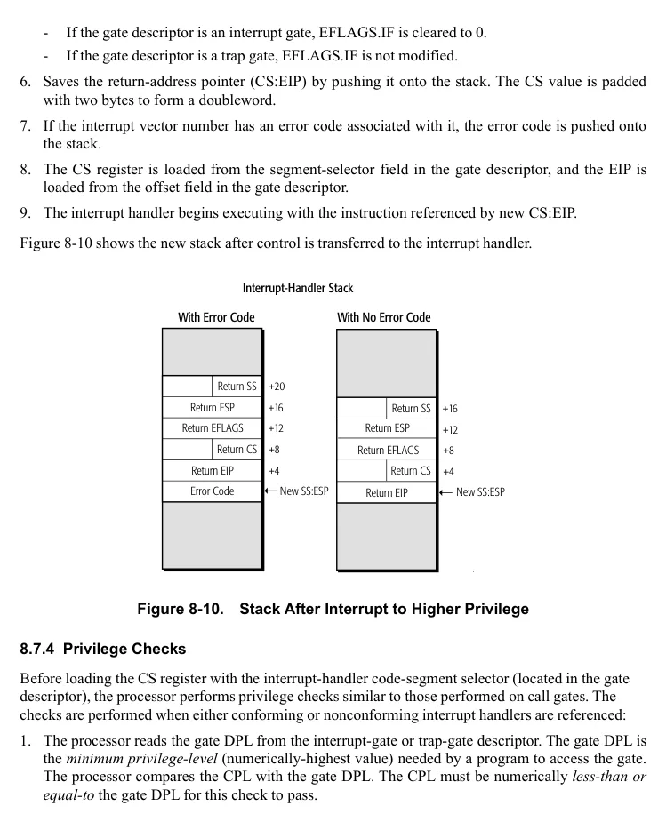

</details>


<!-- PDF source page: 337 | printed page: 275 -->

1. 2. The processor compares the CPL with the interrupt-handler code-segment DPL. For this check to pass, the CPL must be numerically *greater-than or equal-to* the code-segment DPL. This check prevents control transfers to less-privileged interrupt handlers.

Unlike call gates, no RPL comparison takes place. This is because the gate descriptor is referenced in the IDT using the interrupt vector number rather than a selector, and no RPL field exists in the interrupt vector number.

Exception and interrupt handlers should be made reachable from software running at any privilege level that requires them. If the gate DPL value is too low (requiring more privilege), or the interrupt-handler code-segment DPL is too high (runs at lower privilege), the interrupt control transfer can fail the privilege checks. Setting the gate DPL=3 and interrupt-handler code-segment DPL=0 makes the exception handler or interrupt handler reachable from any privilege level.

Figure 8-11 on page 276 shows two examples of interrupt privilege checks. In Example 1, both privilege checks pass:

- The interrupt-gate DPL is at the lowest privilege (3), which means that software running at any privilege level (CPL) can access the interrupt gate.
- The interrupt-handler code segment is at the highest-privilege level, as indicated by DPL=0. This means software running at any privilege can enter the interrupt handler through the interrupt gate.


<!-- PDF source page: 338 | printed page: 276 -->

**Figure 8-11. Privilege-Check Examples for Interrupts**

<details>
<summary>Extracted figure labels</summary>

```text
CS
CPL=2
Interrupt Vector
Access
Allowed
≤
Access Allowed
DPL=3
?
Interrupt
Handler
Gate Descriptor
≥
Access
Allowed
DPL=0
Code Descriptor
Example 1: Privilege Check Passes
CS
CPL=2
Interrupt Vector
Access
Denied
≤
Access Denied
DPL=0
?
Interrupt
Handler
Gate Descriptor
≥
Access
Denied
DPL=3
Code Descriptor
513-244.eps
Example 2: Privilege Check Fails
```

</details>

In Example 2, both privilege checks fail:

- The interrupt-gate DPL specifies that only software running at privilege-level 0 can access the gate. The current program does not have a high enough privilege level to access the interrupt gate, since its CPL is set at 2.

<details>
<summary>Rendered source page 338 (figures/tables)</summary>

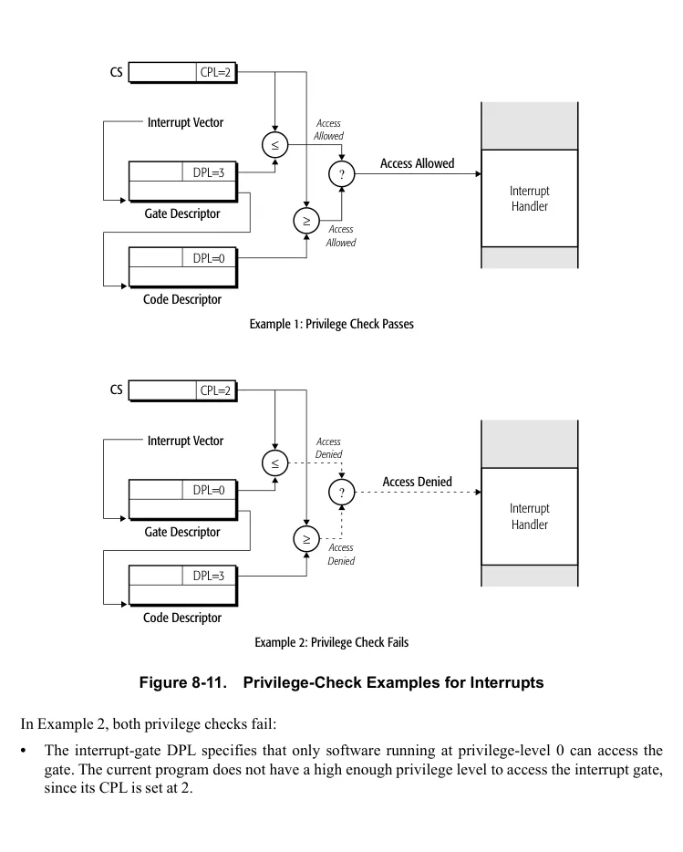

</details>


<!-- PDF source page: 339 | printed page: 277 -->

- The interrupt handler has a lower privilege (DPL=3) than the currently-running software (CPL=2). Transitions from more-privileged software to less-privileged software are not allowed, so this privilege check fails as well.

Although both privilege checks fail, only one such failure is required to deny access to the interrupt handler.

<a id="8-7-5-returning-from-interrupt-procedures"></a>

### 8.7.5 Returning From Interrupt Procedures

A return to an interrupted program should be performed using the IRET instruction. An IRET is a far return to a different code segment, with or without a change in privilege level. The actions of an IRET in both cases are described in the following sections.

**IRET, Same Privilege.** Before performing the IRET, the stack pointer must point to the return EIP. If there was an error code pushed onto the stack as a result of the exception or interrupt, that error code should have been popped off the stack earlier by the handler. The IRET reverses the actions of the interrupt mechanism:

1. 1. Pops the return pointer off of the stack, loading both the CS register and EIP register (RIP[31:0]) with the saved values. The return code-segment RPL is read by the processor from the CS value stored on the stack to determine that an equal-privilege control transfer is occurring.

1. 2. Pops the saved EFLAGS image off of the stack and into the EFLAGS register.

1. 3. Transfers control to the return program at the target CS:EIP.

**IRET, Less Privilege.** If an IRET changes privilege levels, the return program must be at a lower privilege than the interrupt handler. The IRET in this case causes a stack switch to occur:

1. 1. The return pointer is popped off of the stack, loading both the CS register and EIP register (RIP[31:0]) with the saved values. The return code-segment RPL is read by the processor from the CS value stored on the stack to determine that a lower-privilege control transfer is occurring.

1. 2. The saved EFLAGS image is popped off of the stack and loaded into the EFLAGS register.

1. 3. The return-program stack pointer is popped off of the stack, loading both the SS register and ESP register (RSP[31:0]) with the saved values.

1. 4. Control is transferred to the return program at the target CS:EIP.

<a id="8-7-6-shadow-stack-support-for-interrupts-and-exceptions"></a>

### 8.7.6 Shadow Stack Support for Interrupts and Exceptions

The operation of the shadow stack for an interrupt control transfer depends whether or not the interrupt handler runs at the same privilege or at a higher privilege level than the CPL when the interrupt or exception occurred.

**Interrupt Control Transfer to Same Privilege Level.** When a control transfer to a interrupt handler at the same privilege occurs, and the shadow stack feature is enabled for the current CPL, the processor pushes the interrupted procedure's CS and LIP (CS.base + EIP) onto the current shadow stack.


<!-- PDF source page: 340 | printed page: 278 -->

**Interrupt Control Transfer to Higher Privilege Level.** When a control transfer to a interrupt handler at a higher privilege occurs, the actions taken by the processor depend on the CPL when the interrupt or exception occurred.

- If the CPL = 3:
- if shadow stacks are enabled in user-mode, the current SSP is saved to MSR PL3_SSP.
- if shadow stacks are enabled in supervisor mode, a new SSP is loaded from MSR PLn_SSP (where n = the target CPL 0, 1 or 2).
- the shadow stack token located at the base of the new shadow stack is checked, and if valid, the token's busy bit is set to 1. **Note**: the CS and LIP are not pushed onto the new shadow stack.

- If the CPL =1 or 2, and shadow stacks are enabled in supervisor mode:
- the new SSP is loaded from MSR PLn_SSP (where n = the target CPL 0 or 1).
- the shadow stack token located at the base of the new shadow stack is checked, and if valid, the token's busy bit is set to 1.
- the CS, LIP and old SSP are pushed onto the new shadow stack.

For a detailed description of shadow stack operations, see Section “Shadow Stacks” on page 678.

<a id="8-8-virtual-8086-mode-interrupt-control-transfers"></a>

## 8.8 Virtual-8086 Mode Interrupt Control Transfers

This section describes interrupt control transfers as they relate to virtual-8086 mode. Virtual-8086 mode is not supported by long mode. Therefore, the control-transfer mechanism described here is not applicable to long mode.

When a software interrupt occurs (not external interrupts, INT1, or INT3) while the processor is running in virtual-8086 mode (EFLAGS.VM=1), the control transfer that occurs depends on three system controls:

- *EFLAGS.IOPL***—**This field controls interrupt handling based on the CPL. See Section “I/O Privilege Level Field (IOPL) Field” on page 53 for more information on this field. Setting IOPL3 redirects the interrupt to the general-protection exception (#GP) handler.
- *CR4.VME***—**This bit enables virtual-mode extensions. See Section “Virtual-8086 Mode Extensions (VME)” on page 47 for more information on this bit.
- *TSS Interrupt-Redirection Bitmap*—The TSS interrupt-redirection bitmap contains 256 bits, one for each possible INT*n* vector (software interrupt). When CR4.VME=1, the bitmap is used by the processor to direct interrupts to the handler provided by the currently-running 8086 program (bitmap entry is 0), or to the protected-mode operating-system interrupt handler (bitmap entry is
1. 1) . See Section “Legacy Task-State Segment” on page 372 for information on the location of this field within the TSS.


<!-- PDF source page: 341 | printed page: 279 -->

If IOPL&lt;3, CR4.VME=1, and the corresponding interrupt redirection bitmap entry is 0, the processor uses the virtual-interrupt mechanism. See Section “Virtual Interrupts” on page 288 for more information on this mechanism.

Table 8-11 summarizes the actions of the above system controls on interrupts taken when the processor is running in virtual-8086 mode.

**Table 8-11. Virtual-8086 Mode Interrupt Mechanisms**

| EFLAGS.IOPL | CR4.VME | TSS Interrupt<br>Redirection<br>Bitmap Entry | Interrupt Mechanism |
| --- | --- | --- | --- |
| 0, 1, or 2 | 0 | — | General-Protection Exception |
| 0, 1, or 2 | 1 | 1 |  |
| 0, 1, or 2 | 1 | 0 | Virtual Interrupt |
| 3 | 0 | — | Protected-Mode Handle |
| 3 | 1 | 1 |  |
| 3 | 1 | 0 | Virtual 8086 Handle |

<a id="8-8-1-protected-mode-handler-control-transfer"></a>

### 8.8.1 Protected-Mode Handler Control Transfer

Control transfers to protected-mode handlers from virtual-8086 mode differ from standard protected-mode transfers in several ways. The processor follows these steps in making the control transfer:

1. 1. Reads the CPL=0 stack pointer (SS:ESP) from the TSS.

1. 2. Pushes the GS, FS, DS, and ES selector registers onto the stack. Each push is padded with two bytes to form a doubleword.

1. 3. Clears the GS, FS, DS, and ES selector registers to 0. This places a null selector in each of the four registers

1. 4. Pushes the return stack pointer (old SS:ESP) onto the new stack. The SS value is padded with two bytes to form a doubleword.

1. 5. Pushes the EFLAGS register onto the new stack.

1. 6. Clears the following EFLAGS bits to 0: TF, NT, RF, and VM.

1. 7. Handles EFLAGS.IF based on the gate-descriptor type:
- If the gate descriptor is an interrupt gate, EFLAGS.IF is cleared to 0.
- If the gate descriptor is a trap gate, EFLAGS.IF is not modified.

1. 8. Pushes the return-address pointer (CS:EIP) onto the stack. The CS value is padded with two bytes to form a doubleword.

1. 9. If the interrupt has an associated error code, pushes the error code onto the stack.

1. 10. Loads the segment-selector field from the gate descriptor into the CS register, and loads the offset field from the gate descriptor into the EIP register.

<details>
<summary>Rendered source page 341 (figures/tables)</summary>

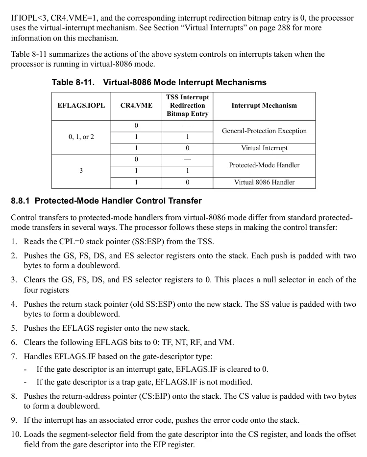

</details>


<!-- PDF source page: 342 | printed page: 280 -->

1. 11. Begins execution of the interrupt handler with the instruction referenced by the new CS:EIP.

Figure 8-12 shows the new stack after control is transferred to the interrupt handler with an error code.

**Figure 8-12. Stack After Virtual-8086 Mode Interrupt to Protected Mode**

<details>
<summary>Extracted figure labels</summary>

```text
Interrupt-Handler Stack
With Error Code
With No Error Code
Return GS
+36
Return FS
+32
Return GS
Return DS
+28
Return FS
Return ES
+24
Return DS
+20
Return ES
Return SS
+20
Return ESP
+16
Return SS
+16
Return ESP
Return EFLAGS
+12
Return EFLAGS
Return CS
+8
Return CS
Return EIP
+4
Error Code
New SS:ESP
(From TSS, CPL=0)
Return EIP
New SS:ESP
513-249.eps
```

</details>

An IRET from privileged protected-mode software (CPL=0) to virtual-8086 mode reverses the stack-build process. After the return pointer, EFLAGS, and return stack-pointer are restored, the processor restores the ES, DS, FS, and GS registers by popping their values off the stack.

<a id="8-8-2-virtual-8086-handler-control-transfer"></a>

### 8.8.2 Virtual-8086 Handler Control Transfer

When a control transfer to an 8086 handler occurs from virtual-8086 mode, the processor creates an interrupt-handler stack identical to that created when an interrupt occurs in real mode (see Figure 8-7 on page 270). The processor performs the following actions during a control transfer:

1. 1. Pushes the FLAGS register (EFLAGS[15:0]) onto the stack.

1. 2. Clears the EFLAGS.IF and EFLAGS.RF bits to 0.

1. 3. Saves the CS register and IP register (RIP[15:0]) by pushing them onto the stack.

1. 4. Locates the interrupt-handler pointer (CS:IP) in the 8086 IDT by scaling the interrupt vector by four and adding the result to the virtual (linear) address 0. The value in the IDTR is not used.

1. 5. Transfers control to the interrupt handler referenced by the CS:IP in the IDT.

An IRET from the 8086 handler back to virtual-8086 mode reverses the stack-build process.

<details>
<summary>Rendered source page 342 (figures/tables)</summary>

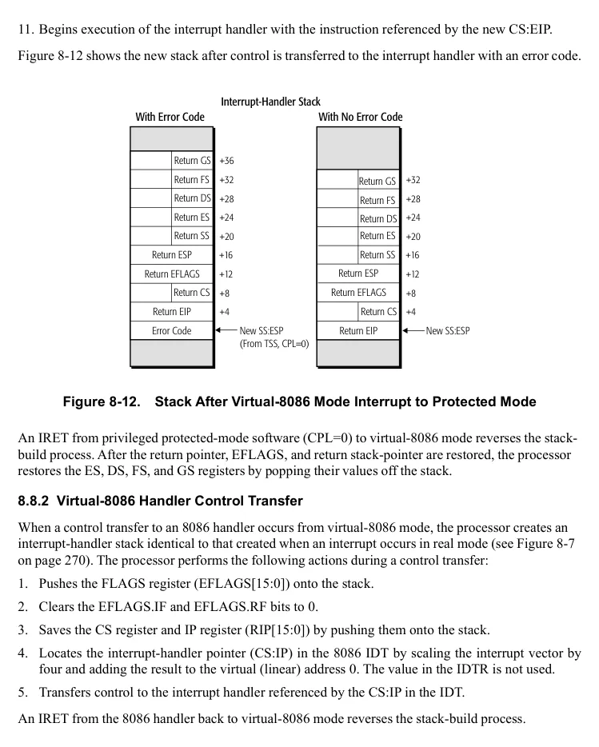

</details>


<!-- PDF source page: 343 | printed page: 281 -->

<a id="8-9-long-mode-interrupt-control-transfers"></a>

## 8.9 Long-Mode Interrupt Control Transfers

The long-mode architecture expands the legacy interrupt-mechanism to support 64-bit operating systems and applications. These changes include:

- All interrupt handlers are 64-bit code and operate in 64-bit mode.
- The size of an interrupt-stack push is fixed at 64 bits (8 bytes).
- The interrupt-stack frame is aligned on a 16-byte boundary.
- The stack pointer, SS:RSP, is pushed unconditionally on interrupts, rather than conditionally based on a change in CPL.
- The SS selector register is loaded with a null selector as a result of an interrupt, if the CPL changes.
- The IRET instruction behavior changes, to unconditionally pop SS:RSP, allowing a null SS to be popped.
- A new interrupt stack-switch mechanism, called the interrupt-stack table or IST, is introduced.
- When shadow stacks are enabled, a new shadow stack-switch mechanism, called the Interrupt SSP Table or ISST, is introduced.

<a id="8-9-1-interrupt-gates-and-trap-gates"></a>

### 8.9.1 Interrupt Gates and Trap Gates

Only long-mode interrupt and trap gates can be referenced in long mode (64-bit mode and compatibility mode). The legacy 32-bit interrupt-gate and 32-bit trap-gate types (0Eh and 0Fh, as described in Section “System Descriptors” on page 99) are redefined in long mode as 64-bit interrupt-gate and 64-bit trap-gate types. 32-bit and 16-bit interrupt-gate and trap-gate types do not exist in long mode, and software is prohibited from using task gates. If a reference is made to any gate other than a 64-bit interrupt gate or a 64-bit trap gate, a general-protection exception (#GP) occurs.

The long-mode gate types are 16 bytes (128 bits) long. They are an extension of the legacy-mode gate types, allowing a full 64-bit segment offset to be stored in the descriptor. See Section “Legacy Segment Descriptors” on page 88 for a detailed description of the gate-descriptor format and fields.

<a id="8-9-2-locating-the-interrupt-handler"></a>

### 8.9.2 Locating the Interrupt Handler

When an interrupt occurs in long mode, the processor multiplies the interrupt vector number by 16 and uses the result as an offset into the IDT. The gate descriptor referenced by the IDT offset contains a segment-selector and a 64-bit segment-offset field. The gate-descriptor segment-offset field contains the complete virtual address for the interrupt handler. The gate-descriptor segment-selector field points to the target code-segment descriptor located in either the GDT or LDT. The code-segment descriptor is only used for privilege-checking purposes and for placing the processor in 64-bit mode. The code segment-descriptor base field, limit field, and most attributes are ignored.

Figure 8-13 shows how the long-mode interrupt handler is located by the interrupt mechanism.


<!-- PDF source page: 344 | printed page: 282 -->

**Figure 8-13. Long-Mode Interrupt Control Transfer**

<details>
<summary>Extracted figure labels</summary>

```text
Interrupt-Descriptor
Table
Code-Segment Offset
Interrupt Vector
CS Selector
DPL
+
*
16
IDT Base Address
IDT Limit
Global- or Local-
Descriptor Table
Interrupt-Descriptor-Table Register
Virtual-Address
Space
CS Limit
DPL
Code-Segment Base
Interrupt Handler
513-245.eps
```

</details>

<a id="8-9-3-interrupt-stack-frame"></a>

### 8.9.3 Interrupt Stack Frame

In long mode, the return-program stack pointer (SS:RSP) is always pushed onto the interrupt-handler stack, regardless of whether or not a privilege change occurs. Although the SS register is not used in 64-bit mode, SS is pushed to allow returns into compatibility mode. Pushing SS:RSP unconditionally presents operating systems with a consistent interrupt-stack-frame size for all interrupts, except for error codes. Interrupt service-routine entry points that handle interrupts generated by non-error-code interrupts can push an error code on the stack for consistency.

In long mode, when a control transfer to an interrupt handler occurs, the processor performs the following:

1. 1. Aligns the new interrupt-stack frame by masking RSP with FFFF_FFFF_FFFF_FFF0h.

<details>
<summary>Rendered source page 344 (figures/tables)</summary>

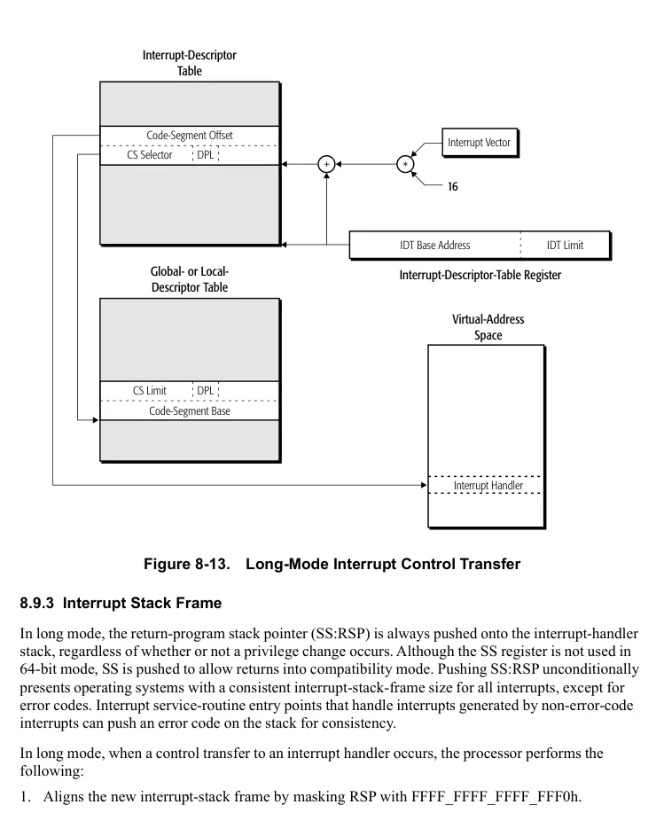

</details>


<!-- PDF source page: 345 | printed page: 283 -->

1. 2. If IST field in interrupt gate is not 0, reads IST pointer into RSP.

1. 3. If a privilege change occurs, the target DPL is used as an index into the long-mode TSS to select a new stack pointer (RSP).

1. 4. If a privilege change occurs, SS is cleared to zero indicating a null selector.

1. 5. Pushes the return stack pointer (old SS:RSP) onto the new stack. The SS value is padded with six bytes to form a quadword.

1. 6. Pushes the 64-bit RFLAGS register onto the stack. The upper 32 bits of the RFLAGS image on the stack are written as zeros.

1. 7. Clears the TF, NT, and RF bits in RFLAGS bits to 0.

1. 8. Handles the RFLAGS.IF bit according to the gate-descriptor type:
- If the gate descriptor is an interrupt gate, RFLAGS.IF is cleared to 0.
- If the gate descriptor is a trap gate, RFLAGS.IF is not modified.

1. 9. Pushes the return CS register and RIP register onto the stack. The CS value is padded with six bytes to form a quadword.

1. 10. If the interrupt vector number has an error code associated with it, pushes the error code onto the stack. The error code is padded with four bytes to form a quadword.

1. 11. Loads the segment-selector field from the gate descriptor into the CS register. The processor checks that the target code-segment is a 64-bit mode code segment.

1. 12. Loads the offset field from the gate descriptor into the target RIP. The interrupt handler begins execution when control is transferred to the instruction referenced by the new RIP.

Figure 8-14 on page 284 shows the stack after control is transferred to the interrupt handler.


<!-- PDF source page: 346 | printed page: 284 -->

**Figure 8-14. Long-Mode Stack After Interrupt—Same Privilege**

<details>
<summary>Extracted figure labels</summary>

```text
Interrupt-Handler Stack
With No Error Code
With Error Code
+40
Return SS
+32
Return RSP
+24
Return RFLAGS
Return RSP
Return RFLAGS
+16
Return CS
+16
+8
Return RIP
Return CS
RSP
Return RIP
Error Code
RSP
```

</details>

**Interrupt-Stack Alignment.** In legacy mode, the interrupt-stack pointer can be aligned at any address boundary. Long mode, however, aligns the stack on a 16-byte boundary. This alignment is performed by the processor in hardware before pushing items onto the stack frame. The previous RSP is saved unconditionally on the new stack by the interrupt mechanism. A subsequent IRET instruction automatically restores the previous RSP.

Aligning the stack on a 16-byte boundary allows optimal performance for saving and restoring the 16-byte XMM registers. The interrupt handler can save and restore the XMM registers using the faster 16-byte aligned loads and stores (MOVAPS), rather than unaligned loads and stores (MOVUPS). Although the RSP alignment is always performed in long mode, it is only of consequence when the interrupted program is already running at CPL=0, and it is generally used only within the operating-system kernel. The operating system should put 16-byte aligned RSP values in the TSS for interrupts that change privilege levels.

**Stack Switch.** In long mode, the stack-switch mechanism differs slightly from the legacy stack-switch mechanism (see Section “Interrupt To Higher Privilege” on page 273). When stacks are switched during a long-mode privilege-level change resulting from an interrupt, a new SS descriptor is *not* loaded from the TSS. Long mode only loads an inner-level RSP from the TSS. However, the SS selector is loaded with a null selector, allowing nested control transfers, including interrupts, to be handled properly in 64-bit mode. The SS.RPL is set to the new CPL value. See Section “Nested IRETs to 64-Bit Mode Procedures” on page 287 for additional information.

<details>
<summary>Rendered source page 346 (figures/tables)</summary>

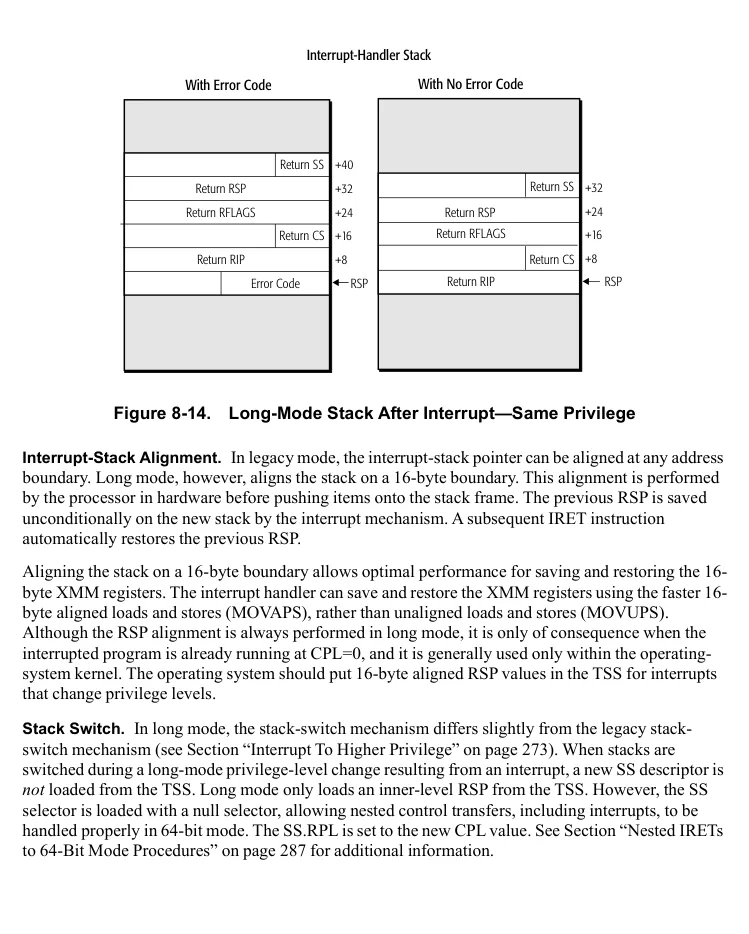

</details>


<!-- PDF source page: 347 | printed page: 285 -->

The interrupt-handler stack that results from a privilege change in long mode looks identical to a long-mode stack when no privilege change occurs. Figure 8-15 shows the stack after the switch is performed and control is transferred to the interrupt handler.

**Figure 8-15. Long-Mode Stack After Interrupt—Higher Privilege**

<details>
<summary>Extracted figure labels</summary>

```text
Interrupt-Handler Stack
Without Error Code
With Error Code
+40
Return SS
+32
Return RSP
+24
Return RFLAGS
+16
Return CS
+16
+8
Return CS
+8
Return RIP
New RSP
(from TSS)
New RSP
(from TSS)
Error Code
Return RIP
SS=0
(if CPL changes)
SS=0
(if CPL changes)
```

</details>

<a id="8-9-4-interrupt-stack-table"></a>

### 8.9.4 Interrupt-Stack Table

In long mode, a new interrupt-stack table (IST) mechanism is introduced as an alternative to the modified legacy stack-switch mechanism described above. The IST mechanism provides a method for specific interrupts, such as NMI, double-fault, and machine-check, to always execute on a known-good stack. In legacy mode, interrupts can use the hardware task-switch mechanism to set up a known-good stack by accessing the interrupt service routine through a task gate located in the IDT. However, the hardware task-switch mechanism is not supported in long mode.

When enabled, the IST mechanism unconditionally switches stacks. It can be enabled on an individual interrupt vector basis using a new field in the IDT gate-descriptor entry. This allows some interrupts to use the modified legacy mechanism, and others to use the IST mechanism. The IST mechanism is only available in long mode.

The IST mechanism uses new fields in the 64-bit TSS format and the long-mode interrupt-gate and trap-gate descriptors:

- Figure 12-8 on page 378 shows the format of the 64-bit TSS and the location of the seven IST pointers. The 64-bit TSS offsets from 24h to 5Bh provide space for seven IST pointers, each of which are 64 bits (8 bytes) long.

<details>
<summary>Rendered source page 347 (figures/tables)</summary>

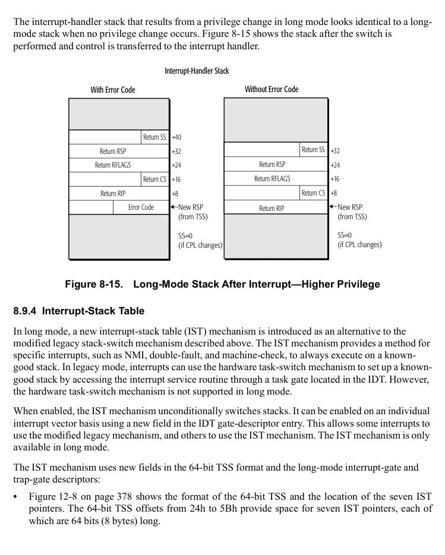

</details>


<!-- PDF source page: 348 | printed page: 286 -->

- The long-mode interrupt-gate and trap-gate descriptors define a 3-bit IST-index field in bits 2:0 of byte +4. Figure 4-24 on page 102 shows the format of long-mode interrupt-gate and trap-gate descriptors and the location of the IST-index field.

To enable the IST mechanism for a specific interrupt, system software stores a non-zero value in the interrupt gate-descriptor IST-index field. If the IST index is zero, the modified legacy stack-switching mechanism (described in the previous section) is used.

Figure 8-16 shows how the IST mechanism is used to create the interrupt-handler stack. When an interrupt occurs and the IST index is non-zero, the processor uses the index to select the corresponding IST pointer from the TSS. The IST pointer is loaded into the RSP to establish a new stack for the interrupt handler. The SS register is loaded with a null selector if the CPL changes and the SS.RPL is set to the new CPL value. After the stack is loaded, the processor pushes the old stack pointer, RFLAGS, the return pointer, and the error code (if applicable) onto the stack. Control is then transferred to the interrupt handler.

**Figure 8-16. Long-Mode IST Mechanism**

<details>
<summary>Extracted figure labels</summary>

```text
64-Bit
Interrupt-Handler Stack
+40
Return SS
64-Bit TSS
Return RSP
+32
Return RFLAGS
+24
Long-Mode
Interrupt- or Trap-
Gate Descriptor
Return CS
+16
Return RIP
+8
SS=0
IST1 : IST7
RSP
Error Code
IST
RSP0 : RSP2
513-248.eps
```

</details>

Software must make sure that an interrupt or exception handler using an IST pointer doesn't take another exception using the same IST pointer, as this will result in the first stack exception frame being overwritten.

<details>
<summary>Rendered source page 348 (figures/tables)</summary>

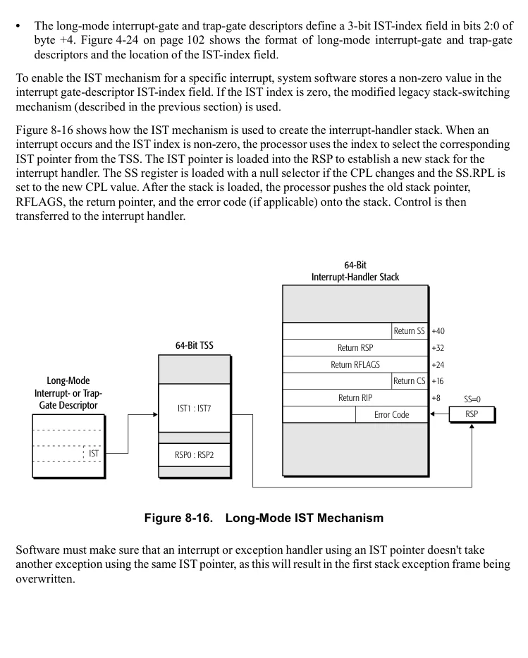

</details>


<!-- PDF source page: 349 | printed page: 287 -->

**Interrupt Shadow Stack Table.** When the shadow stack feature is enabled in long mode (EFER.LMA=1), a mechanism similar to the IST is provided to switch shadow stacks. This mechanism, the Interrupt Shadow Stack Table (ISST) is described in Section “Shadow Stacks” on page 678.

<a id="8-9-5-returning-from-interrupt-procedures"></a>

### 8.9.5 Returning From Interrupt Procedures

As with legacy mode, a return to an interrupted program in long mode should be performed using the IRET instruction. However, in long mode, the IRET semantics are different from legacy mode:

- *In 64-bit mode*, IRET pops the return-stack pointer unconditionally off the interrupt-stack frame and into the SS:RSP registers. This reverses the action of the long-mode interrupt mechanism, which saves the stack pointer whether or not a privilege change occurs. IRET also allows a null selector to be popped off the stack and into the SS register. See Section “Nested IRETs to 64-Bit Mode Procedures” on page 287 for additional information.
- *In compatibility mode*, IRET behaves as it does in legacy mode. The SS:ESP is popped off the stack only if a control transfer to less privilege (numerically greater CPL) is performed. Otherwise, it is assumed that a stack pointer is not present on the interrupt-handler stack.

The long-mode interrupt mechanism always uses a 64-bit stack when saving values for the interrupt handler, and the interrupt handler is always entered in 64-bit mode. To work properly, an IRET used to exit the 64-bit mode interrupt-handler requires a series of eight-byte pops off the stack. This is accomplished by using a 64-bit operand-size prefix with the IRET instruction. The default stack size assumed by an IRET in 64-bit mode is 32 bits, so a 64-bit REX prefix is needed by 64-bit mode interrupt handlers.

**Nested IRETs to 64-Bit Mode Procedures.** In long mode, an interrupt causes a null selector to be loaded into the SS register if the CPL changes (this is the same action taken by a far CALL in long mode). If the interrupt handler performs a far call, or is itself interrupted, the null SS selector is pushed onto the stack frame, and another null selector is loaded into the SS register. Using a null selector in this way allows the processor to properly handle returns nested within 64-bit-mode procedures and interrupt handlers.

The null selector enables the processor to properly handle nested returns to 64-bit mode (which do not use the SS register), and returns to compatibility mode (which do use the SS register). Normally, an IRET that pops a null selector into the SS register causes a general-protection exception (#GP) to occur. However, in long mode, the null selector indicates the existence of nested interrupt handlers and/or privileged software in 64-bit mode. Long mode allows an IRET to pop a null selector into SS from the stack under the following conditions:

- The target mode is 64-bit mode.
- The target CPL3.

In this case, the processor does not load an SS descriptor, and the null selector is loaded into SS without causing a #GP exception.


<!-- PDF source page: 350 | printed page: 288 -->

<a id="8-10-virtual-interrupts"></a>

## 8.10 Virtual Interrupts

The term *virtual interrupts* includes two classes of extensions to the interrupt-handling mechanism:

- *Virtual-8086 Mode Extensions (VME)*—These allow virtual interrupts and interrupt redirection in virtual-8086 mode. VME has no effect on protected-mode programs.
- *Protected-Mode Virtual Interrupts (PVI)*—These allow virtual interrupts in protected mode when CPL=3. Interrupt redirection is not available in protected mode. PVI has no effect on virtual-8086-mode programs.

Because virtual-8086 mode is not supported in long mode, VME extensions are not supported in long mode. PVI extensions are, however, supported in long mode.

<a id="8-10-1-virtual-8086-mode-extensions"></a>

### 8.10.1 Virtual-8086 Mode Extensions

The virtual-8086-mode extensions (VME) enable performance enhancements for 8086 programs running as protected tasks in virtual-8086 mode. These extensions are enabled by setting CR4.VME (bit 0) to 1. The extensions enabled by CR4.VME are:

- Virtualizing control and notification of maskable external interrupts with the EFLAGS VIF (bit
1. 19) and VIP (bit 20) bits.
- Selective interception of software interrupts (INT*n* instructions) using the TSS interrupt redirection bitmap (IRB).

**Background.** Legacy-8086 programs expect to have full access to the EFLAGS interrupt flag (IF) bit, allowing programs to enable and disable maskable external interrupts. When those programs run in virtual-8086 mode under a multitasking protected-mode environment, it can disrupt the operating system if programs enable or disable interrupts for their own purposes. This is particularly true if interrupts associated with one program can occur during execution of another program. For example, a program could request that an area of memory be copied to disk. System software could suspend the program before external hardware uses an interrupt to acknowledge that the block has been copied. System software could subsequently start a second program which enables interrupts. This second program could receive the external interrupt indicating that the memory block of the first program has been copied. If that were to happen, the second program would probably be unprepared to handle the interrupt properly.

Access to the IF bit must be managed by system software on a task-by-task basis to prevent corruption of system resources. In order to completely manage the IF bit, system software must be able to interrupt all instructions that can read or write the bit. These instructions include STI, CLI, PUSHF, POPF, INT*n*, and IRET. These instructions are part of an instruction class that is *IOPL-sensitive*. The processor takes a general-protection exception (#GP) whenever an IOPL-sensitive instruction is executed and the EFLAGS.IOPL field is less than the CPL. Because all virtual-8086 programs run at CPL=3, system software can interrupt all instructions that modify the IF bit by setting IOPL3.

System software maintains a virtual image of the IF bit for each virtual-8086 program by emulating the actions of IOPL-sensitive instructions that modify the IF bit. When an external maskable-interrupt


<!-- PDF source page: 351 | printed page: 289 -->

occurs, system software checks the state of the IF image for the current virtual-8086 program to determine whether the program is masking interrupts. If the program is masking interrupts, system software saves the interrupt information until the virtual-8086 program attempts to re-enable interrupts. When the virtual-8086 program unmasks interrupts with an IOPL-sensitive instruction, system software traps the action with the #GP handler.

The performance of a processor can be significantly degraded by the overhead of trapping and emulating IOPL-sensitive instructions, and the overhead of maintaining images of the IF bit for each virtual-8086 program. This performance loss can be eliminated by running virtual-8086 programs with IOPL set to 3, thus allowing changes to the real IF flag from any privilege level. Unfortunately, this can leave critical system resources unprotected.

In addition to the performance problems caused by virtualizing the IF bit, software interrupts (INT*n* instructions) cannot be masked by the IF bit or virtual copies of the IF bit. The IF bit only affects maskable external interrupts. Software interrupts in virtual-8086 mode are normally directed to the real mode interrupt vector table (IVT), but it can be desirable to redirect certain interrupts to the protected-mode interrupt-descriptor table (IDT).

The virtual-8086-mode extensions are designed to support both external interrupts and software interrupts, with mechanisms that preserve high performance without compromising protection. Virtualization of external interrupts is supported using two bits in the EFLAGS register: the virtual-interrupt flag (VIF) bit and the virtual-interrupt pending (VIP) bit. Redirection of software interrupts is supported using the interrupt-redirection bitmap (IRB) in the TSS. A separate TSS can be created for each virtual-8086 program, allowing system software to control interrupt redirection independently for each virtual-8086 program.

**VIF and VIP Extensions for External Interrupts.** When VME extensions are enabled, the IF-modifying instructions normally trapped by system software are allowed to execute. However, instead of modifying the IF bit, they modify the EFLAGS VIF bit. This leaves control over maskable interrupts to the system software. It can also be used as an indicator to system software that the virtual-8086 program is able to, or is expecting to, receive external interrupts.

When an unmasked external interrupt occurs, the processor transfers control from the virtual-8086 program to a protected-mode interrupt handler. If the interrupt handler determines that the interrupt is for the virtual-8086 program, it can check the state of the VIF bit in the EFLAGS value pushed on the stack for the virtual-8086 program. If the VIF bit is set (indicating the virtual-8086 program attempted to unmask interrupts), system software can allow the interrupt to be handled by the appropriate virtual-8086 interrupt handler.

If the VIF bit is clear (indicating the virtual-8086 program attempted to mask interrupts) and the interrupt is for the virtual-8086 program, system software can hold the interrupt pending. System software holds an interrupt pending by saving appropriate information about the interrupt, such as the interrupt vector, and setting the virtual-8086 program's VIP bit in the EFLAGS image on the stack. When the virtual-8086 program later attempts to set IF, the previously set VIP bit causes a general-protection exception (#GP) to occur. System software can then pass the saved interrupt information to the virtual-8086 interrupt handler.


<!-- PDF source page: 352 | printed page: 290 -->

To summarize, when the VME extensions are enabled (CR4.VME=1), the VIF and VIP bits are set and cleared as follows:

- *VIF Bit*—This bit is set and cleared by the processor in virtual-8086 mode in response to an attempt by a virtual-8086 program to set and clear the EFLAGS.IF bit. VIF is used by system software to determine whether a maskable external interrupt should be passed on to the virtual-8086 program, emulated by system software, or held pending. VIF is also cleared during software interrupts through interrupt gates, with the original VIF value preserved in the EFLAGS image on the stack.
- *VIP Bit*—System software sets and clears this bit in the EFLAGS image saved on the stack after an interrupt. It can be set when an interrupt occurs for a virtual-8086 program that has a clear VIF bit. The processor examines the VIP bit when an attempt is made by the virtual-8086 program to set the IF bit. If VIP is set when the program attempts to set IF, a general-protection exception (#GP) occurs *before* execution of the IF-setting instruction. System software must clear VIP to avoid repeated #GP exceptions when returning to the interrupted instruction.

The VIF and VIP bits can be used by system software to minimize the overhead associated with managing maskable external interrupts because virtual copies of the IF flag do not have to be maintained by system software. Instead, VIF and VIP are maintained during context switches along with the remaining EFLAGS bits.

Table 8-12 on page 292 shows how the behavior of instructions that modify the IF bit are affected by the VME extensions.

**Interrupt Redirection of Software Interrupts.** In virtual-8086 mode, software interrupts (INT*n* instructions) are trapped using a #GP exception handler if the IOPL is less than 3 (the CPL for virtual-8086 mode). This allows system software to interrupt and emulate 8086-interrupt handlers. System software can set the IOPL to 3, in which case the INT*n* instruction is vectored through a gate descriptor in the protected-mode IDT. System software can use the gate to control access to the virtual-8086 mode interrupt vector table (IVT), or to redirect the interrupt to a protected-mode interrupt handler.

When VME extensions are enabled, for INT*n* instructions to execute normally, vectoring directly to a virtual-8086 interrupt handler through the virtual-8086 IVT (located at address 0 in the virtual-address space of the task). For security or performance reasons, however, it can be necessary to intercept INT*n* instructions on a vector-specific basis to allow servicing by protected-mode interrupt handlers. This is performed by using the interrupt-redirection bitmap (IRB), located in the TSS and enabled when CR4.VME=1. The IRB is available only in virtual-8086 mode.

Figure 12-6 on page 373 shows the format of the TSS, with the interrupt redirection bitmap located near the top. The IRB contains 256 bits, one for each possible software-interrupt vector. The most-significant bit of the IRB controls interrupt vector 255, and is located immediately before the IOPB base. The least-significant bit of the IRB controls interrupt vector 0.

The bits in the IRB function as follows:


<!-- PDF source page: 353 | printed page: 291 -->

- When set to 1, the INT*n* instruction behaves as if the VME extensions are not enabled. The interrupt is directed through the IDT to a protected-mode interrupt handler if IOPL=3. If IOPL&lt;3, the INT*n* causes a #GP exception.
- When cleared to 0, the INT*n* instruction is directed through the IVT for the virtual-8086 program to the corresponding virtual-8086 interrupt handler.

Only software interrupts can be redirected using the IRB mechanism. External interrupts are asynchronous events that occur outside the context of a virtual-8086 program. Therefore, external interrupts require system-software intervention to determine the appropriate context for the interrupt. The VME extensions described in Section “VIF and VIP Extensions for External Interrupts” on page 289 are provided to assist system software with external-interrupt intervention.

<a id="8-10-2-protected-mode-virtual-interrupts"></a>

### 8.10.2 Protected Mode Virtual Interrupts

The protected-mode virtual-interrupt (PVI) bit in CR4 enables support for interrupt virtualization in protected mode. When enabled, the processor maintains program-specific VIF and VIP bits similar to the manner defined by the virtual-8086 mode extensions (VME). However, unlike VME, only the STI and CLI instructions are affected by the PVI extension. When a program is running at CPL=3, it can use STI and CLI to set and clear its copy of the VIF flag without causing a general-protection exception. The last section of Table 8-12 on page 292 describes the behavior of instructions that modify the IF bit when PVI extensions are enabled.

The interrupt redirection bitmap (IRB) defined by the VME extensions is not supported by the PVI extensions.

<a id="8-10-3-effect-of-instructions-that-modify-eflags-if"></a>

### 8.10.3 Effect of Instructions that Modify EFLAGS.IF

Table 8-12 on page 292 shows how the behavior of instructions that modify the IF bit are affected by the VME and PVI extensions. The table columns specify the following:

- *Operating Mode*—the processor mode in effect when the instruction is executed.
- *Instruction*—the IF-modifying instruction.
- *IOPL*—the value of the EFLAGS.IOPL field.
- *VIP*—the value of the EFLAGS.VIP bit.
- *#GP*—indicates whether the conditions in the first four columns cause a general-protection exception (#GP) to occur.
- *Effect on IF Bit*—indicates the effect the conditions in the first four columns have on the EFLAGS.IF bit and the image of EFLAGS.IF on the stack.
- *Effect on VIF Bit*—indicates the effect the conditions in the first four columns have on the EFLAGS.VIF bit and the image of EFLAGS.VIF on the stack.


<!-- PDF source page: 354 | printed page: 292 -->

**Table 8-12. Effect of Instructions that Modify the IF Bit**

| Operating Mode | Instruction | IOPL | VIP | #GP | Effect on IF Bit | Effect on VIF Bit |
| --- | --- | --- | --- | --- | --- | --- |
| Real Mode<br>CR0.PE=0<br>EFLAGS.VM=0<br>CR4.VME=0<br>CR4.PVI=0 | CLI |  |  | no | IF = 0 |  |
| Real Mode<br>CR0.PE=0<br>EFLAGS.VM=0<br>CR4.VME=0<br>CR4.PVI=0 | STI |  |  |  | IF = 1 |  |
| Real Mode<br>CR0.PE=0<br>EFLAGS.VM=0<br>CR4.VME=0<br>CR4.PVI=0 | PUSHF |  |  |  | EFLAGS.IF Stack Image =<br>IF |  |
| Real Mode<br>CR0.PE=0<br>EFLAGS.VM=0<br>CR4.VME=0<br>CR4.PVI=0 | POPF |  |  |  | IF = EFLAGS.IF stack image |  |
| Real Mode<br>CR0.PE=0<br>EFLAGS.VM=0<br>CR4.VME=0<br>CR4.PVI=0 | INTn |  |  |  | EFLAGS.IF Stack Image =<br>IF<br>IF = 0 |  |
| Real Mode<br>CR0.PE=0<br>EFLAGS.VM=0<br>CR4.VME=0<br>CR4.PVI=0 | IRET |  |  |  | IF = EFLAGS.IF Stack<br>Image |  |
| Protected Mode<br>CR0.PE=1<br>EFLAGS.VM=0<br>CR4.VME=x<br>CR4.PVI=0 | CLI | ³CPL |  | no | IF = 0 |  |
| Protected Mode<br>CR0.PE=1<br>EFLAGS.VM=0<br>CR4.VME=x<br>CR4.PVI=0 | CLI | CPL |  | yes | — |  |
| Protected Mode<br>CR0.PE=1<br>EFLAGS.VM=0<br>CR4.VME=x<br>CR4.PVI=0 | STI | ³CPL |  | no | IF = 1 |  |
| Protected Mode<br>CR0.PE=1<br>EFLAGS.VM=0<br>CR4.VME=x<br>CR4.PVI=0 | STI | CPL |  | yes | — |  |
| Protected Mode<br>CR0.PE=1<br>EFLAGS.VM=0<br>CR4.VME=x<br>CR4.PVI=0 | PUSHF | x |  | no | EFLAGS.IF Stack Image =<br>IF |  |
| Protected Mode<br>CR0.PE=1<br>EFLAGS.VM=0<br>CR4.VME=x<br>CR4.PVI=0 | POPF | ³CPL |  |  | IF = EFLAGS.IF Stack<br>Image |  |
| Protected Mode<br>CR0.PE=1<br>EFLAGS.VM=0<br>CR4.VME=x<br>CR4.PVI=0 | POPF | CPL |  |  | No Change |  |
| Protected Mode<br>CR0.PE=1<br>EFLAGS.VM=0<br>CR4.VME=x<br>CR4.PVI=0 | INTn gate | x |  |  | EFLAGS.IF Stack Image =<br>IF<br>IF = 0 |  |
| Protected Mode<br>CR0.PE=1<br>EFLAGS.VM=0<br>CR4.VME=x<br>CR4.PVI=0 | IRET | x |  |  | IF = EFLAGS.IF Stack<br>Image |  |
| Protected Mode<br>CR0.PE=1<br>EFLAGS.VM=0<br>CR4.VME=x<br>CR4.PVI=0 | IRETD | x |  |  |  |  |

> Note: Gray-shaded boxes indicate the bits are unsupported (ignored) in the specified operating mode. “x” indicates the value of the bit is a “don’t care”. “—” indicates the instruction causes a general-protection exception (#GP). Note: 1. If the EFLAGS.IF stack image is 0, no #GP exception occurs and the IRET instruction is executed. 2. If the EFLAGS.IF stack image is 1, the IRET is not executed, and a #GP exception occurs.

<details>
<summary>Rendered source page 354 (figures/tables)</summary>

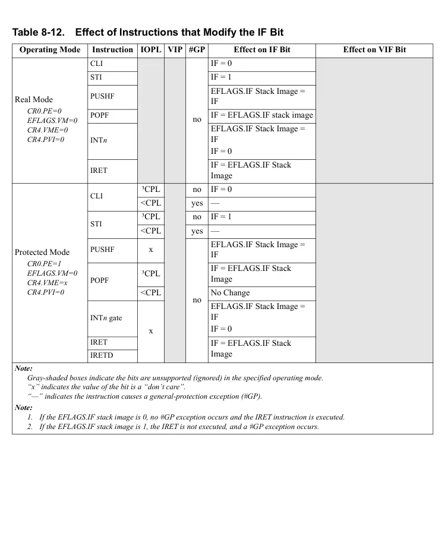

</details>


<!-- PDF source page: 355 | printed page: 293 -->

**Table 8-12. Effect of Instructions that Modify the IF Bit (continued)**

| Operating Mode | Instruction | IOPL | VIP | #GP | Effect on IF Bit | Effect on VIF Bit |
| --- | --- | --- | --- | --- | --- | --- |
| Virtual-8086 Mode<br>CR0.PE=1<br>EFLAGS.VM=1<br>CR4.VME=0<br>CR4.PVI=x | CLI | 3 |  | no | IF = 0 |  |
| Virtual-8086 Mode<br>CR0.PE=1<br>EFLAGS.VM=1<br>CR4.VME=0<br>CR4.PVI=x | CLI | 3 |  | yes | — |  |
| Virtual-8086 Mode<br>CR0.PE=1<br>EFLAGS.VM=1<br>CR4.VME=0<br>CR4.PVI=x | STI | 3 |  | no | IF = 1 |  |
| Virtual-8086 Mode<br>CR0.PE=1<br>EFLAGS.VM=1<br>CR4.VME=0<br>CR4.PVI=x | STI | 3 |  | yes | — |  |
| Virtual-8086 Mode<br>CR0.PE=1<br>EFLAGS.VM=1<br>CR4.VME=0<br>CR4.PVI=x | PUSHF | 3 |  | no | EFLAGS.IF Stack Image =<br>IF |  |
| Virtual-8086 Mode<br>CR0.PE=1<br>EFLAGS.VM=1<br>CR4.VME=0<br>CR4.PVI=x | PUSHF | 3 |  | yes | — |  |
| Virtual-8086 Mode<br>CR0.PE=1<br>EFLAGS.VM=1<br>CR4.VME=0<br>CR4.PVI=x | POPF | 3 |  | no | IF = EFLAGS.IF Stack<br>Image |  |
| Virtual-8086 Mode<br>CR0.PE=1<br>EFLAGS.VM=1<br>CR4.VME=0<br>CR4.PVI=x | POPF | 3 |  | yes | — |  |
| Virtual-8086 Mode<br>CR0.PE=1<br>EFLAGS.VM=1<br>CR4.VME=0<br>CR4.PVI=x | INTn gate | 3 |  | no | EFLAGS.IF Stack Image =<br>IF<br>IF = 0 |  |
| Virtual-8086 Mode<br>CR0.PE=1<br>EFLAGS.VM=1<br>CR4.VME=0<br>CR4.PVI=x | INTn gate | 3 |  | yes | — |  |
| Virtual-8086 Mode<br>CR0.PE=1<br>EFLAGS.VM=1<br>CR4.VME=0<br>CR4.PVI=x | IRET | 3 |  | no | IF = EFLAGS.IF Stack<br>Image |  |
| Virtual-8086 Mode<br>CR0.PE=1<br>EFLAGS.VM=1<br>CR4.VME=0<br>CR4.PVI=x | IRET | 3 |  | yes | — |  |
| Virtual-8086 Mode<br>CR0.PE=1<br>EFLAGS.VM=1<br>CR4.VME=0<br>CR4.PVI=x | IRETD | 3 |  | no | IF = EFLAGS.IF Stack<br>Image |  |
| Virtual-8086 Mode<br>CR0.PE=1<br>EFLAGS.VM=1<br>CR4.VME=0<br>CR4.PVI=x | IRETD | 3 |  | yes | — |  |

> Note: Gray-shaded boxes indicate the bits are unsupported (ignored) in the specified operating mode. “x” indicates the value of the bit is a “don’t care”. “—” indicates the instruction causes a general-protection exception (#GP). Note: 1. If the EFLAGS.IF stack image is 0, no #GP exception occurs and the IRET instruction is executed. 2. If the EFLAGS.IF stack image is 1, the IRET is not executed, and a #GP exception occurs.

<details>
<summary>Rendered source page 355 (figures/tables)</summary>

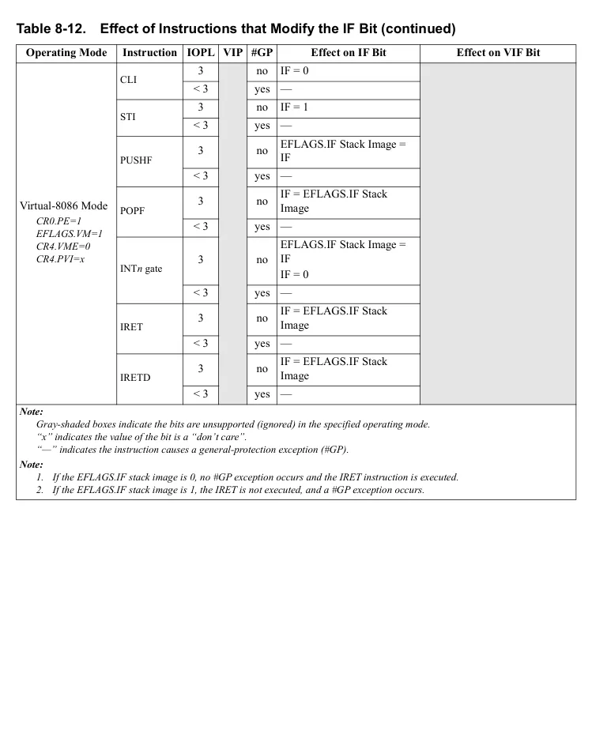

</details>


<!-- PDF source page: 356 | printed page: 294 -->

**Table 8-12. Effect of Instructions that Modify the IF Bit (continued)**

| Operating Mode | Instruction | IOPL | VIP | #GP | Effect on IF Bit | Effect on VIF Bit |
| --- | --- | --- | --- | --- | --- | --- |
| Virtual-8086 Mode<br>with VME<br>Extensions<br>CR0.PE=1<br>EFLAGS.VM=1<br>CR4.VME=1<br>CR4.PVI=x | CLI | 3 | x | no | IF = 0 | No Change |
| Virtual-8086 Mode<br>with VME<br>Extensions<br>CR0.PE=1<br>EFLAGS.VM=1<br>CR4.VME=1<br>CR4.PVI=x | CLI | 3 |  |  | No Change | VIF = 0 |
| Virtual-8086 Mode<br>with VME<br>Extensions<br>CR0.PE=1<br>EFLAGS.VM=1<br>CR4.VME=1<br>CR4.PVI=x | STI | 3 | x | no | IF = 1 | No Change |
| Virtual-8086 Mode<br>with VME<br>Extensions<br>CR0.PE=1<br>EFLAGS.VM=1<br>CR4.VME=1<br>CR4.PVI=x | STI | 3 | 0 | no | No Change | VIF = 1 |
| Virtual-8086 Mode<br>with VME<br>Extensions<br>CR0.PE=1<br>EFLAGS.VM=1<br>CR4.VME=1<br>CR4.PVI=x | STI | 3 | 1 | yes | — |  |
| Virtual-8086 Mode<br>with VME<br>Extensions<br>CR0.PE=1<br>EFLAGS.VM=1<br>CR4.VME=1<br>CR4.PVI=x | PUSHF | 3 | x | no | EFLAGS.IF Stack Image =<br>IF | Not Pushed |
| Virtual-8086 Mode<br>with VME<br>Extensions<br>CR0.PE=1<br>EFLAGS.VM=1<br>CR4.VME=1<br>CR4.PVI=x | PUSHF | 3 |  |  | Not Pushed | EFLAGS.IF Stack Image = VIF |
| Virtual-8086 Mode<br>with VME<br>Extensions<br>CR0.PE=1<br>EFLAGS.VM=1<br>CR4.VME=1<br>CR4.PVI=x | PUSHFD | 3 | x | no | EFLAGS.IF Stack Image =<br>IF | EFLAGS.VIF Stack Image = VIF |
| Virtual-8086 Mode<br>with VME<br>Extensions<br>CR0.PE=1<br>EFLAGS.VM=1<br>CR4.VME=1<br>CR4.PVI=x | PUSHFD | 3 |  | yes | — |  |
| Virtual-8086 Mode<br>with VME<br>Extensions<br>CR0.PE=1<br>EFLAGS.VM=1<br>CR4.VME=1<br>CR4.PVI=x | POPF | 3 | x | no | IF = EFLAGS.IF Stack<br>Image | No Change |
| Virtual-8086 Mode<br>with VME<br>Extensions<br>CR0.PE=1<br>EFLAGS.VM=1<br>CR4.VME=1<br>CR4.PVI=x | POPF | 3 | 0 | no | No Change | VIF = EFLAGS.IF Stack Image |
| Virtual-8086 Mode<br>with VME<br>Extensions<br>CR0.PE=1<br>EFLAGS.VM=1<br>CR4.VME=1<br>CR4.PVI=x | POPF | 3 | 1 | yes | — |  |
| Virtual-8086 Mode<br>with VME<br>Extensions<br>CR0.PE=1<br>EFLAGS.VM=1<br>CR4.VME=1<br>CR4.PVI=x | POPFD | 3 | x | no | IF = EFLAGS.IF Stack<br>Image | No Change |
| Virtual-8086 Mode<br>with VME<br>Extensions<br>CR0.PE=1<br>EFLAGS.VM=1<br>CR4.VME=1<br>CR4.PVI=x | POPFD | 3 |  | yes | — |  |
| Virtual-8086 Mode<br>with VME<br>Extensions<br>CR0.PE=1<br>EFLAGS.VM=1<br>CR4.VME=1<br>CR4.PVI=x | INTn gate | 3 | x | no | EFLAGS.IF Stack Image =<br>IF<br>IF = 0 | No Change |
| Virtual-8086 Mode<br>with VME<br>Extensions<br>CR0.PE=1<br>EFLAGS.VM=1<br>CR4.VME=1<br>CR4.PVI=x | INTn gate | 3 |  |  | No Change | EFLAGS.IF Stack Image = VIF<br>VIF = 0 |
| Virtual-8086 Mode<br>with VME<br>Extensions<br>CR0.PE=1<br>EFLAGS.VM=1<br>CR4.VME=1<br>CR4.PVI=x | IRET | 3 | x | no | IF = EFLAGS.IF Stack<br>Image | No Change |
| Virtual-8086 Mode<br>with VME<br>Extensions<br>CR0.PE=1<br>EFLAGS.VM=1<br>CR4.VME=1<br>CR4.PVI=x | IRET | 3 | 0 | no | No Change | VIF = EFLAGS.IF Stack Image |
| Virtual-8086 Mode<br>with VME<br>Extensions<br>CR0.PE=1<br>EFLAGS.VM=1<br>CR4.VME=1<br>CR4.PVI=x | IRET | 3 | 1 | no1 | No Change | VIF = EFLAGS.IF Stack Image |
| Virtual-8086 Mode<br>with VME<br>Extensions<br>CR0.PE=1<br>EFLAGS.VM=1<br>CR4.VME=1<br>CR4.PVI=x | IRET | 3 |  | yes2 | — |  |
| Virtual-8086 Mode<br>with VME<br>Extensions<br>CR0.PE=1<br>EFLAGS.VM=1<br>CR4.VME=1<br>CR4.PVI=x | IRETD | 3 | x | no | IF = EFLAGS.IF Stack<br>Image | VIF = EFLAGS.IF Stack Image |
| Virtual-8086 Mode<br>with VME<br>Extensions<br>CR0.PE=1<br>EFLAGS.VM=1<br>CR4.VME=1<br>CR4.PVI=x | IRETD | 3 |  | yes | — |  |

> Note: Gray-shaded boxes indicate the bits are unsupported (ignored) in the specified operating mode. “x” indicates the value of the bit is a “don’t care”. “—” indicates the instruction causes a general-protection exception (#GP). Note: 1. If the EFLAGS.IF stack image is 0, no #GP exception occurs and the IRET instruction is executed. 2. If the EFLAGS.IF stack image is 1, the IRET is not executed, and a #GP exception occurs.

<details>
<summary>Rendered source page 356 (figures/tables)</summary>

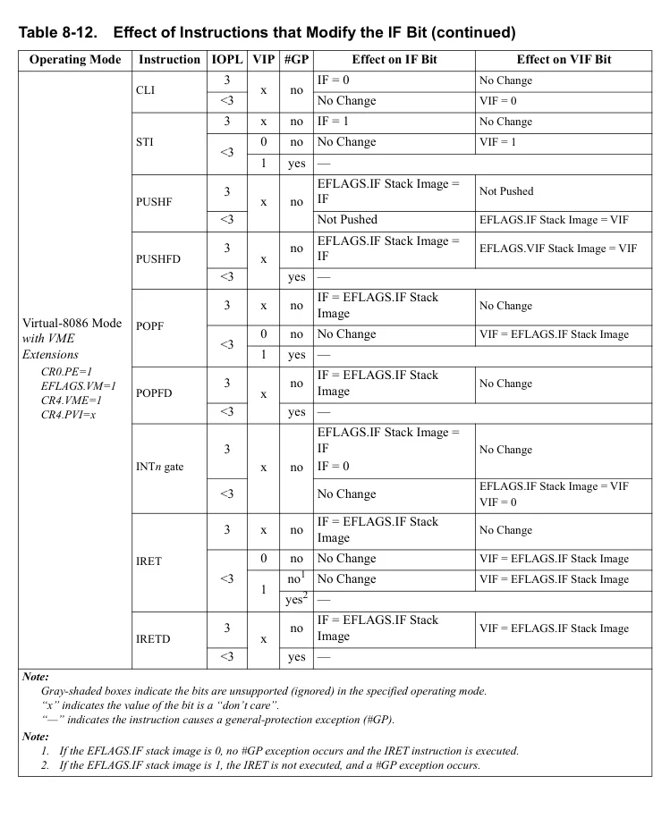

</details>


<!-- PDF source page: 357 | printed page: 295 -->

**Table 8-12. Effect of Instructions that Modify the IF Bit (continued)**

| Operating Mode | Instruction | IOPL | VIP | #GP | Effect on IF Bit | Effect on VIF Bit |
| --- | --- | --- | --- | --- | --- | --- |
| Protected Mode<br>with PVI Extensions<br>CR0.PE=1<br>EFLAGS.VM=0<br>CR4.VME=x<br>CR4.PVI=1<br>CPL=3 | CLI | 3 | x | no | IF = 0 | No Change |
| Protected Mode<br>with PVI Extensions<br>CR0.PE=1<br>EFLAGS.VM=0<br>CR4.VME=x<br>CR4.PVI=1<br>CPL=3 | CLI | 3 |  |  | No Change | VIF = 0 |
| Protected Mode<br>with PVI Extensions<br>CR0.PE=1<br>EFLAGS.VM=0<br>CR4.VME=x<br>CR4.PVI=1<br>CPL=3 | STI | 3 | x | no | IF = 1 | No Change |
| Protected Mode<br>with PVI Extensions<br>CR0.PE=1<br>EFLAGS.VM=0<br>CR4.VME=x<br>CR4.PVI=1<br>CPL=3 | STI | 3 | 0 | no | No Change | VIF = 1 |
| Protected Mode<br>with PVI Extensions<br>CR0.PE=1<br>EFLAGS.VM=0<br>CR4.VME=x<br>CR4.PVI=1<br>CPL=3 | STI | 3 | 1 | yes | — |  |
| Protected Mode<br>with PVI Extensions<br>CR0.PE=1<br>EFLAGS.VM=0<br>CR4.VME=x<br>CR4.PVI=1<br>CPL=3 | PUSHF | x | x | no | EFLAGS.IF Stack Image =<br>IF | Not Pushed |
| Protected Mode<br>with PVI Extensions<br>CR0.PE=1<br>EFLAGS.VM=0<br>CR4.VME=x<br>CR4.PVI=1<br>CPL=3 | PUSHFD | x |  |  |  | EFLAGS.VIF Stack Image = VIF |
| Protected Mode<br>with PVI Extensions<br>CR0.PE=1<br>EFLAGS.VM=0<br>CR4.VME=x<br>CR4.PVI=1<br>CPL=3 | POPF | x |  |  | IF = EFLAGS.IF Stack<br>Image | No Change |
| Protected Mode<br>with PVI Extensions<br>CR0.PE=1<br>EFLAGS.VM=0<br>CR4.VME=x<br>CR4.PVI=1<br>CPL=3 | POPFD | x |  |  |  | VIF = 0 |
| Protected Mode<br>with PVI Extensions<br>CR0.PE=1<br>EFLAGS.VM=0<br>CR4.VME=x<br>CR4.PVI=1<br>CPL=3 | INTn gate | x |  |  | EFLAGS.IF Stack Image =<br>IF<br>IF = 0 (if interrupt gate) | No Change |
| Protected Mode<br>with PVI Extensions<br>CR0.PE=1<br>EFLAGS.VM=0<br>CR4.VME=x<br>CR4.PVI=1<br>CPL=3 | IRET | x |  |  | IF = EFLAGS.IF Stack<br>Image | No Change |
| Protected Mode<br>with PVI Extensions<br>CR0.PE=1<br>EFLAGS.VM=0<br>CR4.VME=x<br>CR4.PVI=1<br>CPL=3 | IRETD | x |  |  |  | VIF = EFLAGS.VIF Stack Image |

> Note: Gray-shaded boxes indicate the bits are unsupported (ignored) in the specified operating mode. “x” indicates the value of the bit is a “don’t care”. “—” indicates the instruction causes a general-protection exception (#GP). Note: 1. If the EFLAGS.IF stack image is 0, no #GP exception occurs and the IRET instruction is executed. 2. If the EFLAGS.IF stack image is 1, the IRET is not executed, and a #GP exception occurs.

<details>
<summary>Rendered source page 357 (figures/tables)</summary>

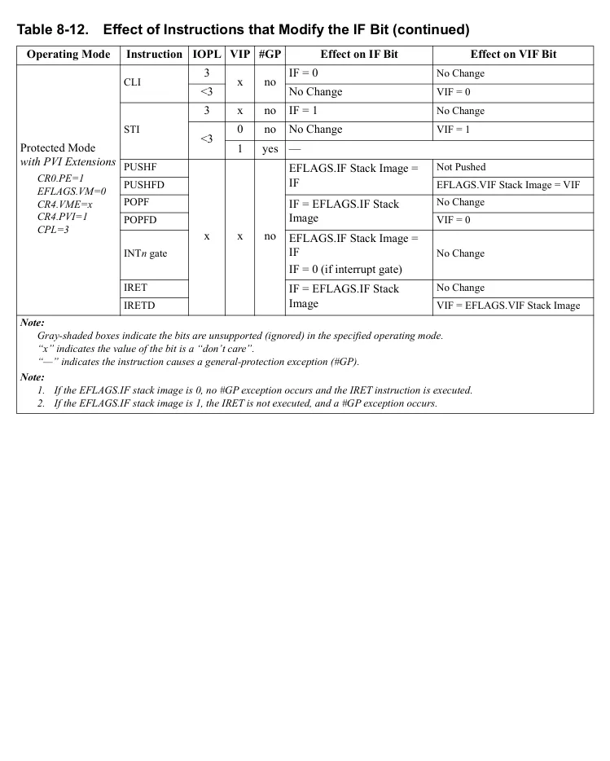

</details>
