<!-- PDF source page: 358 | printed page: 296 -->

<a id="9-machine-check-architecture"></a>

# 9 Machine Check Architecture

The AMD64 Machine Check Architecture (MCA) plays a vital role in the reliability, availability, and serviceability (RAS) of AMD processors, as well as the RAS of the computer systems in which they are embedded. MCA defines the facilities by which processor and system hardware errors are logged and reported to system software. This allows system software to serve a strategic role in recovery from and diagnosis of hardware errors.

Error checking hardware is configured and information about detected error conditions is conveyed via an architecturally-defined set of registers. The system programming interface of MCA is described below in Section 9.3 “Machine Check Architecture MSRs” on page 301.

<a id="9-1-introduction"></a>

## 9.1 Introduction

All computer systems are susceptible to errors—results that are contrary to the system design. Errors can be categorized as *soft* or *hard*. Soft errors are caused by transient interference and are not necessarily indicative of any damage to the computer circuitry. These external events include noise from electromagnetic radiation and the incursion of sub-atomic particles that cause bit cell storage capacitors to change state.

Hard errors are repeatable malfunctions that are generally attributable to physical damage to computer circuitry. Damage may be caused by external forces (for example, voltage surges) or wear processes inherent in the circuit technology. Damaged circuit elements can manifest symptoms similar to those that are caused by soft error processes. An increase in the frequency of errors attributable to one circuit element may indicate that the element has sustained damage or is wearing-out and may, in the future, cause a hard error.

<a id="9-1-1-reliability-availability-and-serviceability"></a>

### 9.1.1 Reliability, Availability, and Serviceability

This section describes the concepts of reliability, availability, and serviceability (RAS) and shows how they are interrelated.

The rate at which errors occur in a computer system is a measure of the system’s *reliability*. *Availability* is the percentage of time that the system is available to do useful work. Errors that prevent a computer system from continued operation result in *down-time*, that is, periods of unavailability. Down-time includes the amount of time required to restore the system to operation. This may include the time to diagnose a failure, determine the field replaceable unit (FRU) containing the faulty circuitry, carry out the repair action required to replace the identified FRU, and restart the system. This time directly impacts the system’s availability and is a measure of the system’s *serviceability*.

The availability of a computer system can be increased without decreasing performance or significantly increasing cost through the judicious addition of data and control path redundancy in concert with dedicated error-checking hardware. Together, redundancy and error checking *detect* and


<!-- PDF source page: 359 | printed page: 297 -->

often *correct* hardware errors. When errors are corrected by hardware, system operation continues without any perceptible disruption or loss in performance.

Another important technique that can prevent down-time is *error containment*. Error containment limits the propagation of an erroneous data. This enhances system availability by limiting the effects of errors to a subset of software or hardware resources. System software may either correct the error and resume the interrupted program or, if the error cannot be corrected, terminate software processes that cannot continue due to the error.

Error logging enhances serviceability by providing information that is used to identify the FRU that contains the failed circuitry. The mechanical design of the computer system can enhance serviceability (and thus availability) by making the task of physically replacing a failed FRU quicker and easier.

<a id="9-1-2-error-detection-logging-and-reporting"></a>

### 9.1.2 Error Detection, Logging, and Reporting

Error detection requires specific error-checking hardware that compares the actual result of some data transfer or transformation to the expected result. Any disparity indicates that an error has occurred. Error detection is controlled through implementation-specific means. Disabling detection is normally only appropriate when hardware is being debugged in the laboratory.

When an error is detected, hardware autonomously acts to either correct the error or contain the propagation of the corrupting effects of an uncorrected error. For some error sources, hardware action can be disabled by software through the MCA interface.

As hardware acts to correct or contain a detected error, it gathers information about the error to aid in recovery, diagnosis, and repair. The architecture provides software control of error *logging* and *reporting*. The following describes the characteristics of each:

- Logging Logging involves saving information about the error in specific MCA registers. If the error reporting bank associated with the error source is enabled, logging occurs; if disabled, error information is generally discarded (there are implementation-specific exceptions).
- Reporting An uncorrected error may be reported to system software via a machine-check exception, if error reporting for the specific error source is enabled.

Reporting is the hardware-initiated action of interrupting the processor using a machine-check exception (#MC). Reporting for each specific error type can be enabled or disabled by system software though the MCA register interface. Even if reporting for an error type is disabled, logging may continue.

Disabling reporting can negatively impact both error containment and error recovery (see the next section) and should be avoided.


<!-- PDF source page: 360 | printed page: 298 -->

Hardware categorizes errors into three classes. These are:

- *corrected*
- *uncorrected*
- *deferred*

The following sections describe the characteristics of each of these error classes:

If an error can be corrected by hardware, no immediate action by software is required. In this case, information is logged, if enabled, to aid in later diagnosis and possible repair.

If correction is not possible, the error is classified as uncorrected. The occurrence of an uncorrected error requires immediate action by system software to either correct the error and resume the interrupted program or, if software-based correction is not possible, to determine the extent of the impact of the uncorrected error to any executing instruction stream or the architectural state of the processor or system and take actions to contain the error condition by terminating corrupted software processes.

For errors that are not corrected, but have no immediate impact on the architectural state of the system, processor core, or any current thread of execution, the error may be classified by hardware as a deferred error. Information about deferred errors is logged, if enabled, but not reported via a machine-check exception. Instead hardware monitors the error and escalates the error classification to uncorrected at the point in time where the error condition is about to impact the execution of an instruction stream or cause the corruption of the processor core or system architectural state.

This escalation results in a #MC exception, assuming that reporting for that error source is enabled. If software can correct the error, it may be possible to resume the affected program. If not, software can terminate the affected program rather than bringing down the entire system. This is referred to as *error localization*.

A common example of deferred error processing and localization is the conversion of globally uncorrected DRAM errors to process-specific consumed memory errors. In this example, uncorrected ECC-protected data that has not yet been consumed by any processor core is tagged as “poison.” Hardware reports the uncorrected data as a localized error via a #MC exception when it is about to be used (“consumed”) by an instruction execution stream.

In contrast, an error that cannot be contained and is of such severity that it has compromised the continued operation of a processor core requires immediate action to terminate system processing and may result in a hardware-enforced *shutdown*. In the shutdown state, the execution of instructions by that processor core is halted. See Section 8.2.9 “#DF—Double-Fault Exception (Vector 8)” on page 251 for a description of the shutdown processor state.

If supported, system software can chose to configure and enable hardware to generate an interrupt when a deferred error is first detected. Corrected errors may be counted as they are logged. If supported and enabled, exceeding a software-configured count threshold may be signalled via an interrupt. These notification mechanisms are independent of machine-check reporting.


<!-- PDF source page: 361 | printed page: 299 -->

Specific details on hardware error detection, logging, and reporting are implementation-dependent and are described in the *BIOS and Kernel Developer’s Guide (BKDG)* or *Processor Programming Reference Manual (PPR)* applicable to your product.

<a id="9-1-3-error-recovery"></a>

### 9.1.3 Error Recovery

When errors cannot be corrected by hardware, *error recovery* comes into play. Error recovery, as defined by MCA, always involves software intervention. Logged information about the uncorrected error condition that caused the exception allows system software to take actions to either correct the error and resume the interrupted execution stream or terminate software processes (or higher-level software constructs) that are known to be affected by the uncorrected error.

From a system perspective, all errors are either recoverable or unrecoverable. The following outlines the characteristics of each:

- *Recoverable*—Hardware has determined that the architectural state of the processor experiencing the uncorrected error has not been compromised. Software execution can continue if system software can determine the extent of the error and take actions to either:
- *correct* the error and *resume* the interrupted stream of execution or,
- if this is not possible, *terminate* software processes that have incurred a loss of architectural state and *continue* other software processes that are unaffected by the error.
- *Unrecoverable*—Hardware has determined that the architectural state of the processor experiencing the uncorrected error has been corrupted. Software execution cannot reliably continue. Software saves any diagnostic information that it may be able to gather and halts.

The fact that an error is recoverable does not mean that recovery software will be able to resume program execution. If it is unable to determine the extent of the corruption or if it determines that essential state information has been lost, it may only be able to save information about the error and halt processing.

System software has many options to recover from an uncorrected error. The following is a partial list of possible actions that system software might take:

- If it can be determined that the corruption caused by the uncorrected error is contained within a software process, software can kill the process.
- If the uncorrected error has corrupted the architectural state of a virtual machine, the VMM can rebuild the container (using only hardware resources that are known to be good) and reboot the guest operating system.
- If the uncorrected error is a part of a block of data being transferred to or from an I/O device, the data transfer can be flushed and retried or terminated with an error.
- If the uncorrected error is due to a hard link failure, software can reconfigure the network to route information around the failed link.


<!-- PDF source page: 362 | printed page: 300 -->

- If the uncorrected error is in a cache and the cache line containing the uncorrected (known bad) data is in the shared state, software can invalidate the line so that it will be reloaded from memory or another cache that has the line in the owned state.

Many more error scenarios are recoverable depending on the effectiveness of hardware error containment, the logging capabilities of the system, and the sophistication of the recovery software that acts on the information conveyed through the MCA reporting structure.

If recovery software is unable to restore a valid system architectural state at some level of software abstraction (process, guest operating system, virtual machine, or virtual machine monitor), the uncorrected error is considered *system fatal*. In this situation, system software must halt the execution of instructions. A system reset is required to restore the system to a known-good architectural state.

<a id="9-2-determining-machine-check-architecture-support"></a>

## 9.2 Determining Machine-Check Architecture Support

Support for the machine-check architecture is implementation-dependent. System software executes the CPUID instruction to determine whether a processor implements the machine-check exception (#MC) and the global MCA MSRs. The CPUID Fn0000_0001_EDX[MCE] feature bit indicates support for the machine-check exception and the CPUID Fn0000_0001_EDX[MCA] feature bit indicates support for the base set of global machine-check MSRs.

Once system software determines that the base set of MCA MSRs is available, it determines the implemented number of machine-check reporting banks by reading the machine-check capabilities register (MCG_CAP), which is the first of the global MCA MSRs.

For a processor implementation to provide an architecturally compliant MCA interface, it must provide support for the machine-check exception, the global machine-check MSRs, the watchdog timer (see “CPU Watchdog Timer Register” on page 304.), and at least one bank of the machine-check reporting registers.

Support for the deferred reporting and software-based containment of uncorrected data errors is indicated by the feature bit CPUID Fn8000_0007_EBX[SUCCOR]. See “Machine-Check Recovery” on page 307.

Support for recoverable MCA overflow conditions is indicated by feature bit CPUID Fn8000_0007_EBX[McaOverflowRecov]. See the discussion of recoverable status overflow in Section 9.3.2.1 “MCA Overflow” on page 306.

Implementation-specific information concerning the machine-check mechanism can be found in the *BIOS and Kernel Developer’s Guide (BKDG)* or *Processor Programming Reference Manual (PPR)* applicable to your product. For more information on using the CPUID instruction, see Section 3.3, “Processor Feature Identification,” on page 71.


<!-- PDF source page: 363 | printed page: 301 -->

<a id="9-3-machine-check-architecture-msrs"></a>

## 9.3 Machine Check Architecture MSRs

The AMD64 Machine-Check Architecture defines the set of model-specific registers (MCA MSRs) used to log and report hardware errors. These registers are:

- Global status and control registers:
- Machine-check global-capabilities register (MCG_CAP)
- Machine-check global-status register (MCG_STATUS)
- Machine-check global-control register (MCG_CTL)
- Machine-check exception configuration register (MCA_INTR_CFG)
- One or more error-reporting register banks, each containing:
- Machine-check control register (MC*i*_CTL)
- Machine-check status register (MC*i*_STATUS)
- Machine-check address register (MC*i*_ADDR)
- At least one machine-check miscellaneous error-information register (MC*i*_MISC0) Each error-reporting register bank is associated with a specific processor unit (or group of processor units).
- CPU Watchdog Timer register (CPU_WATCHDOG_TIMER)

The error-reporting registers retain their values through a warm reset. (A warm reset occurs while power to the processor is stable. This in contrast to a cold reset, which occurs during the application of power after a period of power loss.) This preservation of error information allows the platform firmware or other system-boot software to recover and report information associated with the error when the processor is forced into a shutdown state.

The RDMSR and WRMSR instructions are used to read and write the machine-check MSRs. See “Machine-Check MSRs” on page 729 for a listing of the machine-check MSR numbers and their reset values. The following sections describe each MCA MSR and its function.

<a id="9-3-1-global-status-and-control-registers"></a>

### 9.3.1 Global Status and Control Registers

The global status and control MSRs are the MCG_CAP, MCG_STATUS, MCG_CTL and MCA_INTR_CFG registers.

1. 9. 3.1.1 Machine-Check Global-Capabilities Register**

Figure 9-1 shows the format of the machine-check global-capabilities register (MCG_CAP). MCG_CAP is a read-only register that specifies the machine-check mechanism capabilities supported by the processor implementation.


<!-- PDF source page: 364 | printed page: 302 -->

**Figure 9-1. MCG_CAP Register**

<details>
<summary>Extracted figure labels</summary>

```text
63
32
Reserved
31
9
8
7
0
CTLP
Reserved
BANK_CNT
Bits
Mnemonic
Description
Access type
63:9
Reserved
R
8
CTLP
MCG_CTL register present
R
7:0
BANK_CNT
Number of reporting banks
R
```

</details>

The fields within the MCG_CAP register are:

- *BANK_CNT (MCi Bank Count)*—Bits 7:0. This field specifies how many error-reporting register banks are supported by the processor implementation.
- *CTLP(MCG_CTL Register Present)*—Bit 8. This bit specifies whether or not the Machine-Check Global-Control (MCG_CTL) Register is supported by the processor. When the bit is set to 1, the register is supported. When the bit is cleared to 0, the register is unsupported. The MCG_CTL register is described on page 303.

All remaining bits in the MCG_CAP register are reserved. Writing values to the MCG_CAP register produces undefined results.

1. 9. 3.1.2 Machine-Check Global-Status Register**

Figure 9-2 shows the format of the machine-check global-status register (MCG_STATUS). MCG_STATUS provides basic information about the processor state after the occurrence of a machine-check error.

<details>
<summary>Rendered source page 364 (figures/tables)</summary>

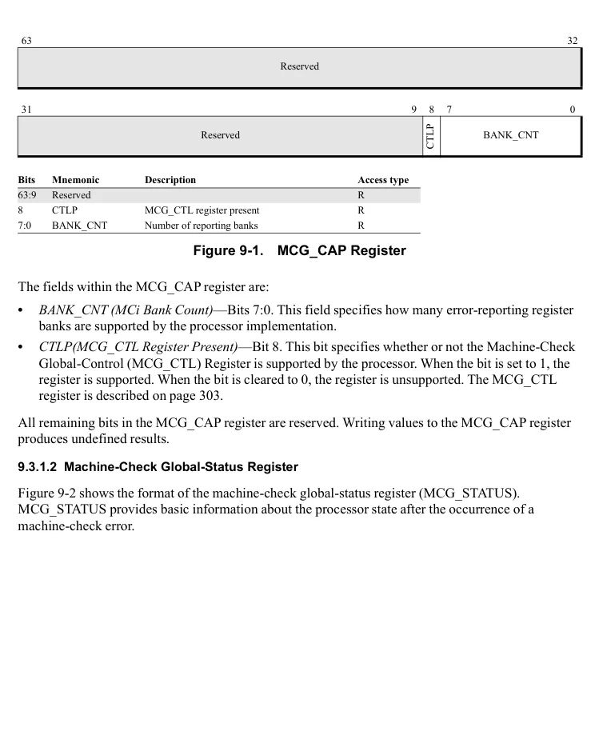

</details>


<!-- PDF source page: 365 | printed page: 303 -->

63 32

Reserved

31 3 2 1 0

MCIP

RIPV

EIPV

Reserved

**Bits Mnemonic Description Access type** 63:3 Reserved RAZ 2 MCIP Machine Check In-Progress R/W 1 EIPV Error IP Valid Flag R/W 0 RIPV Restart IP Valid Flag R/W

**Figure 9-2. MCG_STATUS Register**

The fields within the MCG_STATUS register are:

- *Restart-IP Valid (RIPV)*—Bit 0. When this bit is set to 1, the interrupted program can be reliably restarted at the instruction addressed by the instruction pointer pushed onto the stack by the machine-check error mechanism. If this bit is cleared to 0, the interrupted program cannot be reliably restarted.
- *Error-IP Valid (EIPV)*—Bit 1. When this bit is set to 1, the process thread that was interrupted by the #MC is responsible for the machine-check error, which occurred at the privilege level indicated by the CS selector that was pushed on the stack by the exception. If this bit is cleared to 0, it is possible that the interrupted thread is not responsible for the machine-check error.
- *Machine Check In-Progress (MCIP)*—Bit 2. When this bit is set to 1, it indicates that a machine-check error is in progress. If another machine-check error occurs while this bit is set, the processor enters the shutdown state. The processor sets this bit whenever a machine check exception is generated. Software is responsible for clearing it after the machine check exception is handled.

All remaining bits in the MCG_STATUS register are reserved.

1. 9. 3.1.3 Machine-Check Global-Control Register**

Figure 9-3 shows the format of the machine-check global-control register (MCG_CTL). MCG_CTL is used by software to enable or disable the logging and reporting of machine-check errors from the implemented error-reporting banks. Depending on the implementation, detected errors from some error sources associated with a reporting bank that is disabled are still logged. Setting all bits to 1 in this register enables all implemented error-reporting register banks to log errors.

<details>
<summary>Rendered source page 365 (figures/tables)</summary>

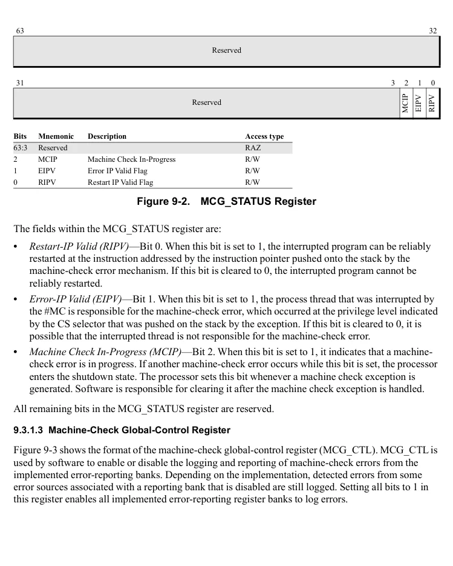

</details>


<!-- PDF source page: 366 | printed page: 304 -->

**Figure 9-3. MCG_CTL Register**

<details>
<summary>Extracted figure labels</summary>

```text
63
2
1
0
EN63
EN2
EN1
EN0
…
Error-Reporting Register-Bank Enable Bits
…
```

</details>

1. 9. 3.1.4 Machine-Check Exception Configuration Register**

In addition to the standard Machine Check exception (#MC) signaling, certain machine check events can raise an interrupt via the APIC LVT mechanism. Configuration of these interrupts are provided, in part, in register MCA_INTR_CFG located at MSR C000_0410, see Figure 9-4. See Section 16.4 “Local Interrupts” on page 634 for details on configuring LVT entries.

63 32

Reserved

31 16 15 12 11 8 7 4 3 0

Reserved Threshold LvtOffset Reserved DeferredLvt Offset Reserved

**Bits Mnemonic Description Access type** 63:16 Reserved RAZ

For error thresholding interrupts, specifies the address of the LVT entry in the APIC registers as follows: LVT address = (ThresholdLvtOffset &lt; &lt; 4) + 500h (see APIC[530:500]).

R/W

15:12 ThresholdLvtOffset

11:8 Reserved RAZ

For deferred error interrupts, specifies the address of the LVT entry in the APIC registers as follows: LVT address = (DeferredLvtOffset &lt; &lt; 4) + 500h (see APIC[530:500]).

**Figure 9-4. MCA_INTR_CFG Register**

<details>
<summary>Extracted figure labels</summary>

```text
R/W
7:4
DeferredLvtOffset
3:0
Reserved
RAZ
```

</details>

1. 9. 3.1.5 CPU Watchdog Timer Register**

The CPU watchdog timer is used to generate a machine check condition when an instruction does not complete within a time period specified by the CPU Watchdog Timer register. The timer restarts the count each time an instruction completes, when enabled by the *CPU Watchdog Timer Enable* bit. The time period is determined by the *Count Select* and *Time Base* fields. The timer does not count during halt or stop-grant.

The format of the CPU watchdog timer is shown in Figure 9-5.

<details>
<summary>Rendered source page 366 (figures/tables)</summary>

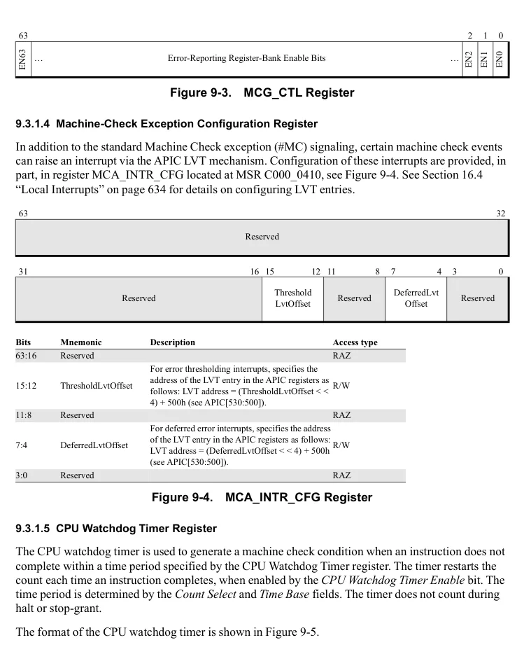

</details>


<!-- PDF source page: 367 | printed page: 305 -->

63 32

Reserved

31 7 6 3 2 1 0

Model dependent; see BKDG or PPR for desired processor. CS TB EN

**Bits Mnemonic Description Access type** 63:7 Reserved SBZ 6:3 CS CPU Watchdog Timer Count Select R/W 2:1 TB CPU Watchdog Timer Time Base R/W 0 EN CPU Watchdog Timer Enable R/W

**Figure 9-5. CPU Watchdog Timer Register Format**

*CPU Watchdog Timer Enable (EN) -* Bit 0. This bit specifies whether the CPU Watchdog Timer is enabled. When the bit is set to 1, the timer increments and generates a machine check when the timer expires. When cleared to 0, the timer does not increment and no machine check is generated.

*CPU Watchdog Timer Time Base (TB)* - Bits 2:1. Specifies the time base for the time-out period indicated in the *Count Select* field. The allowable time base values are provided in Table 9-1.

.

**Table 9-1. CPU Watchdog Timer Time Base**

| TB[1:0] | Time Base |
| --- | --- |
| 00 | 1 millisecond |
| 01 | 1 microsecond |
| 10 | Reserved |
| 11 | Reserved |

*CPU Watchdog Timer Count Select (CS)* - Bits 6:3. Specifies the time period required for the CPU Watchdog Timer to expire. The time period is this value times the time base specified in the *Time Base* field. The allowable values are shown in Table 9-2.

**Table 9-2. CPU Watchdog Timer Count Select**

| CS[3:0] | Value |
| --- | --- |
| 0000 | 4095 |
| 0001 | 2047 |
| 0010 | 1023 |
| 0011 | 511 |
| 0100 | 255 |
| 0101 | 127 |

<details>
<summary>Rendered source page 367 (figures/tables)</summary>

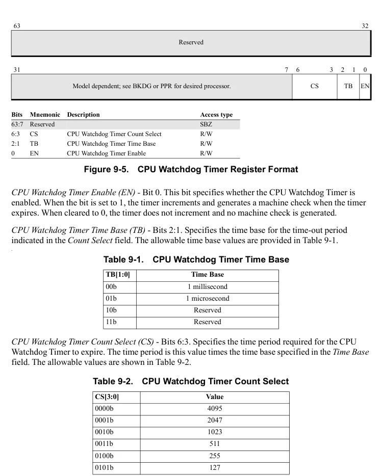

</details>


<!-- PDF source page: 368 | printed page: 306 -->

**Table 9-2. CPU Watchdog Timer Count Select (continued)**

| 0110 | 63 |
| --- | --- |
| 0111 | 31 |
| 1000 | 8191 |
| 1001 | 16383 |
| 1010b–1111 | Reserved |

<a id="9-3-2-error-reporting-register-banks"></a>

### 9.3.2 Error-Reporting Register Banks

Each error-reporting register bank contains the following registers:

- Machine-check control register (MC*i*_CTL).
- Machine-check status register (MC*i*_STATUS).
- Machine-check address register (MC*i*_ADDR).
- Machine-check miscellaneous error-information register 0 (MC*i*_MISC0).

The *i* in each register name corresponds to the number of a supported register bank. Each error-reporting register bank is normally associated with a specific execution unit. The number of error-reporting register banks is implementation-specific. For more information, see the *BIOS and Kernel Developer’s Guide (BKDG)* or *Processor Programming Reference Manual (PPR)* applicable to your product.

Software reads the MCG_CAP register to determine the number of supported register banks. The first error-reporting register (MC0_CTL) always starts with MSR address 400h, followed by MC0_STATUS (401h), MC0_ADDR (402h), and MC0_MISC0 (403h). The addresses of any additional error-reporting MSRs are assigned sequentially starting at 404h through the remaining supported register banks.

1. 9. 3.2.1 MCA Overflow**

If an error occurs within an error reporting bank while the status register for that bank contains valid data (MC*i*_STATUS[VAL] = 1), an MCA overflow condition results. In this situation, information about the new error will either be discarded or will replace the information about the prior error.

Hardware sets the MC*i*_STATUS[OVER] bit to indicate this condition has occurred and follows a set of rules to determine whether to overwrite the previously logged error information or discard the new error information. These rules are shown in Table 9-3 below.

<details>
<summary>Rendered source page 368 (figures/tables)</summary>

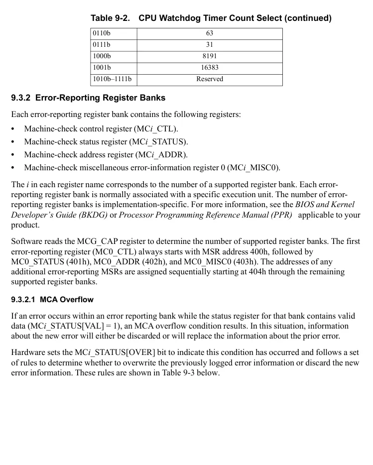

</details>


<!-- PDF source page: 369 | printed page: 307 -->

**Table 9-3. Error Logging Priorities**

| Column 1 | Column 2 | Previous Error Type / Corrected | Previous Error Type / Deferred | Previous Error Type / Uncorrected |
| --- | --- | --- | --- | --- |
| Current<br>Error<br>Type | Corrected | Discard Current | Discard Current | Discard Current |
| Current<br>Error<br>Type | Deferred | Overwrite Previous | Discard Current | Discard Current |
| Current<br>Error<br>Type | Uncorrected | Overwrite Previous | Overwrite Previous | Discard Current |

> Note(s): 1. Logging a deferred error has priority over the retention of information concerning a prior corrected error. 2. Logging an uncorrected error has priority over the retention of information concerning either a prior deferred or corrected error. 3. Valid Information concerning an uncorrected error is not overwritten by any subsequent errors.

If the VAL bit is not set, hardware writes the appropriate logging registers based on the type of error (writing the MC*i*_STATUS register last) and then sets the VAL bit to indicate to software that the information currently contained in the MC*i*_STATUS register is valid. Software clears the VAL bit after reading the contents of this register (after reading and saving valid information stored in any of the other logging registers) to indicate to hardware that it has saved the information, making the registers available to log the next error.

If survivable MCA overflow is supported by the implementation (as indicated by CPUID Fn8000_0007_EBX[McaOverflowRecov] = 1), the state of the MC*i*_STATUS[PCC] bit indicates whether system execution can continue. If a particular processor does not support survivable MCA overflow and overflow occurs, software must halt instruction execution on that processor core regardless of the state of the PCC bit because critical information may have been lost as a result of the overflow. See the description of the Machine-Check Status registers below for more information on the PCC bit.

1. 9. 3.2.2 Machine-Check Recovery**

Machine Check Recovery is a feature allowing recovery of the system when the hardware cannot correct an error. Machine Check Recovery is supported when CPUID Fn8000_0007_EBX[SUCCOR]=1.

When Machine Check Recovery is supported and an uncorrected error has been detected that the hardware can contain to the task or process to which the machine check has been delivered, it logs a context-synchronous uncorrectable error (MCi_STATUS[UC]=1, MCi_STATUS[PCC]=0). The rest of the system is unaffected and may continue running if supervisory software can terminate only the affected process context.

1. 9. 3.2.3 Machine-Check Control Registers**

The machine-check control registers (MC*i*_CTL), as shown in Figure 9-6, contain an enable bit for each error source within an error-reporting register bank. Setting an enable bit to 1 enables error reporting for the specific feature controlled by the bit, and clearing the bit to 0 disables error reporting

<details>
<summary>Rendered source page 369 (figures/tables)</summary>

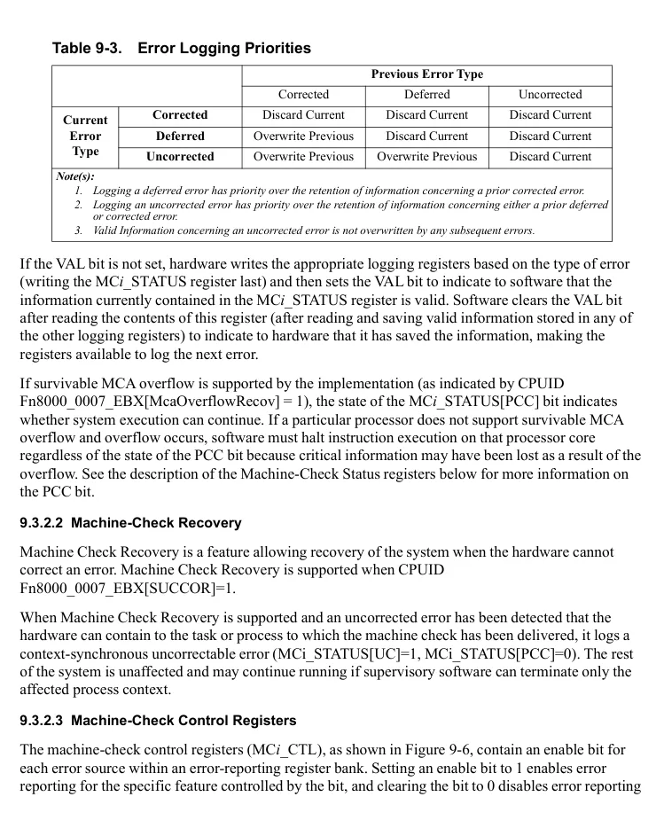

</details>


<!-- PDF source page: 370 | printed page: 308 -->

for the feature. It is recommended that the value FFFF_FFFF_FFFF_FFFFh be programmed into each MC*i*_CTL register.

Disabling the reporting of errors from error sources that are capable of detecting uncorrected errors can compromise future error recovery and is not recommended. Other implementation-specific values are documented in the product’s *BIOS and Kernel Developer’s Guide (BKDG)* or *Processor Programming Reference Manual (PPR)* .

**Figure 9-6. MCi_CTL Register**

<details>
<summary>Extracted figure labels</summary>

```text
63
2
1
0
EN63
EN2
EN1
EN0
…
Error-Reporting Register-Bank Enable Bits
…
```

</details>

1. 9. 3.2.4 Machine-Check Status Registers**

Each error-reporting register bank includes a machine-check status register (MC*i*_STATUS) that the processor uses to log error information. Hardware writes the status register bits when an error is detected, and sets the VAL bit of the register to 1, indicating that the status information is valid. Error reporting for the error source associated with the detected error *does not* need to be enabled in the MC*i*_CTL Register for the processor to write the status register. Error reporting must be enabled for the error to be reported via a #MC exception. Software is responsible for clearing the status register after the exception has been handled. Attempting to write a value other than 0 to an MC*i*_STATUS register in an implemented MCA bank may raise a general-protection (#GP) exception.

Figure 9-7 on page 309 shows the format of the MC*i*_STATUS register.

<details>
<summary>Rendered source page 370 (figures/tables)</summary>

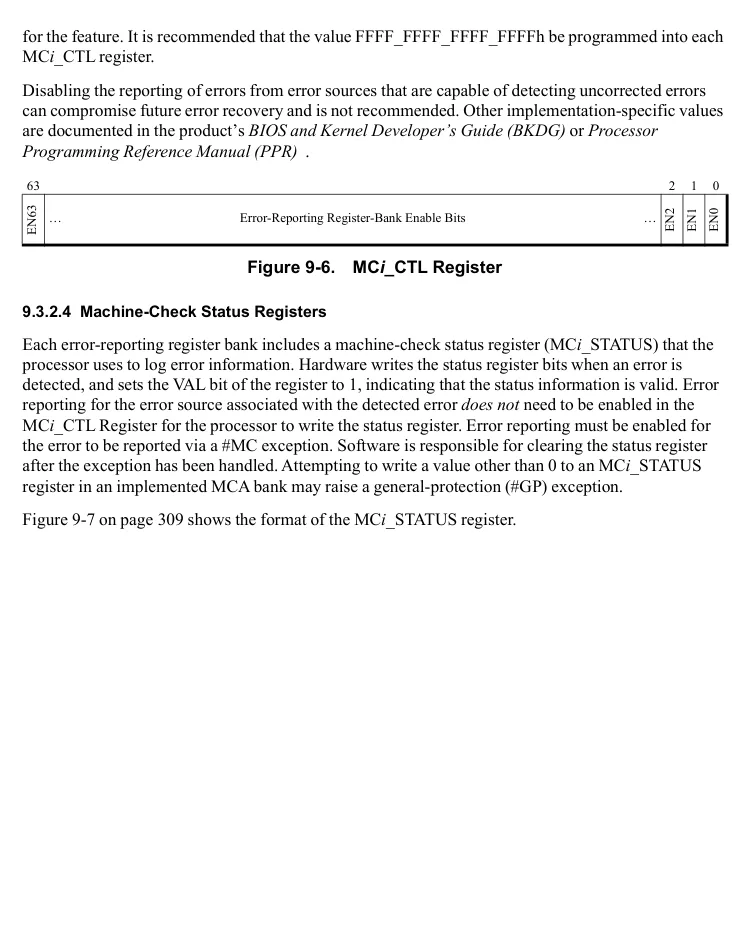

</details>


<!-- PDF source page: 371 | printed page: 309 -->

63 62 61 60 59 58 57 56 55 54 53 52 45 44 43 42 32

Deferred

ADDRV

SYNDV

MISCV

Implementation-specific information

Poison

OVER

TCC

VAL

PCC

UC

EN

31 16 15 0

Model-Specific Extended Error Code MCA Error Code

**Bits Mnemonic Description Access type** 63 VAL Valid R/W* 62 OVER Status Register Overflow R/W* 61 UC Uncorrected Error R/W* 60 EN Error Condition Enabled R/W* 59 MISCV Miscellaneous-Error Register Valid R/W* 58 ADDRV Error-Address Register Valid R/W* 57 PCC Processor-Context Corrupt R/W* 56 Implementation-specific information R/W* 55 TCC Task-Context Corrupt R/W* 54 Implementation-specific information R/W* 53 SYNDV Syndrome Register Valid R/W* 52:45 Implementation-specific information R/W* 44 Deferred Deferred error R/W* 43 Poison Poisoned data consumed R/W* 42:32 Implementation-specific information R/W* 31:16 Model-Specific Extended Error Code R/W* 15:0 MCA Error Code R/W  System software can only clear this bit to 0.

**Figure 9-7. MCi_STATUS Register**

The fields within the MC*i*_STATUS register are:

- *MCA Error Code*—Bits 15:0. This field encodes information about the error, including:
- The type of transaction that caused the error.
- The memory-hierarchy level involved in the error.
- The type of request that caused the error.
- Other information concerning the transaction type. See the *BIOS and Kernel Developer’s Guide (BKDG)* or *Processor Programming Reference Manual (PPR)* applicable to your product for information on the format and encoding of the MCA error code.
- *Model-Specific Extended Error Code*—Bits 31:16. This field encodes model-specific information about the error. For further information, see the documentation for particular implementations of the architecture.

<details>
<summary>Rendered source page 371 (figures/tables)</summary>

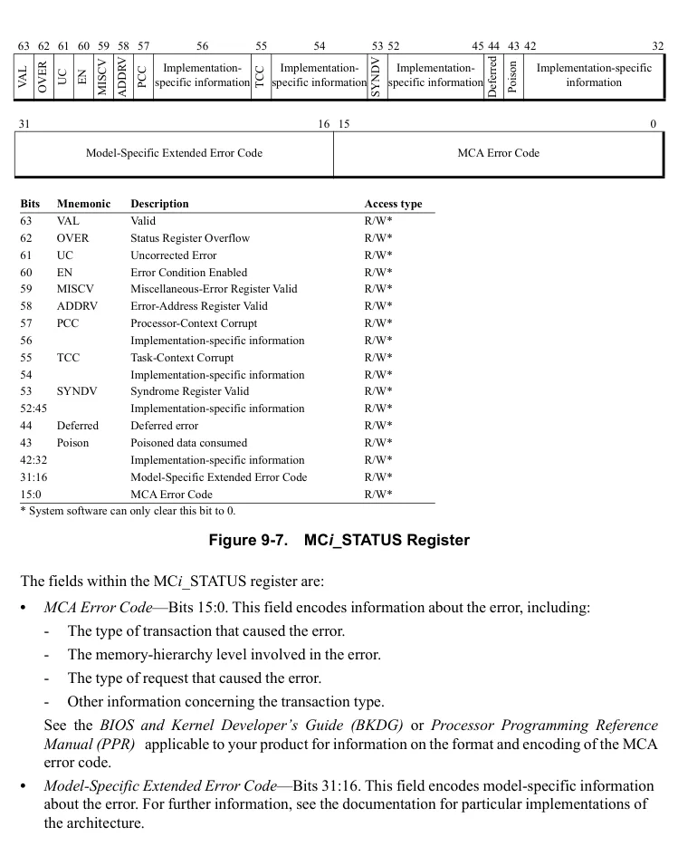

</details>


<!-- PDF source page: 372 | printed page: 310 -->

- *Implementation-specific Information*—Bits 56, 54:45, 42:32. These bit ranges hold model-specific error information. Software should not rely on the field definitions in these ranges being consistent between processor implementations. For details see the *BIOS and Kernel Developer’s Guide* or *Processor Programming Reference Manual* for desired implementations of the architecture.
- *Poison*—Bit 43. When set to 1, this bit indicates that the uncorrected error condition being reported is due to the attempted use of data that was previous detected as in error (and could not be corrected) and marked as known-bad.
- *Deferred*—Bit 44. When set to 1, this bit indicates that hardware has determined that the error condition being logged has not affected the execution of any instruction stream and that action by system software to prevent or correct an error is not required. No machine-check exception is signaled. Hardware will monitor the error and log an uncorrected error when the execution of any thread of execution is impacted.
- *SYNDV*—Bit 53. When set to 1, this bit indicates that the contents of the corresponding syndrome register (MCA_SYND) are valid. When this bit is cleared, the contents of MCA_SYND are not valid.
- *TCC*—Bit 55. When set to 1, this bit indicates that the hardware context of the process thread to which the error was reported may have been corrupted. Continued operation of the thread may have unpredictable results. When this bit is cleared, the hardware context of the process thread to which the error was reported is not corrupted and recovery of the process thread is possible. This bit is only meaningful when MCA_STATUS[PCC]=0.
- *PCC*—Bit 57. When set to 1, this bit indicates that the processor state is likely to be corrupt due to an uncorrected error. In this case, it is possible that software cannot reliably continue execution. When this bit is cleared, the processor state is not corrupted and recovery is still possible. If the PCC bit is set in any error bank, the processor will clear RIPV and EIPV in the MCG_STATUS register.
- *ADDRV*—Bit 58. When set to 1, this bit indicates that the contents of the corresponding error-reporting address register (MC*i*_ADDR) are valid. When this bit is cleared, the contents of MC*i*_ADDR are not valid.
- *MISCV*—Bit 59. When set to 1, this bit indicates that additional information about the error is saved in the corresponding error-reporting miscellaneous register (MC*i*_MISC0). When cleared, this bit indicates that the contents of the MC*i*_MISC0 register are not valid.
- *EN*—Bit 60. When set to 1, this bit indicates that the error condition is enabled in the corresponding error-reporting control register (MC*i*_CTL). Errors disabled by MC*i*_CTL do not cause a machine-check exception.
- *UC*—Bit 61. When set to 1, this bit indicates that the logged error status is for an uncorrected error. When cleared, the error class is determined by looking at the Deferred bit; the error is a Corrected error if the Deferred bit is clear or a Deferred error if the Deferred bit is set. (See Section 9.1.2, “Error Detection, Logging, and Reporting,” on page 297, for more detail on these error classes.)
- *OVER*—Bit 62. This bit is set to 1 by the processor if the VAL bit is already set to 1 as the processor attempts to write error information into MC*i*_STATUS. In this situation, the machine-check mechanism handles the contents of MC*i*_STATUS as follows:


<!-- PDF source page: 373 | printed page: 311 -->

- For processor implementations that log errors for disabled reporting banks, status for an enabled error replaces status for a disabled error.
- Status for a deferred error replaces status for a corrected error.
- Status for an uncorrected error replaces status for a corrected or deferred error.
- Status for an enabled uncorrected error is never replaced. See Section 9.3.2.1 “MCA Overflow” on page 306 for more information on this field.
- *VAL*—Bit 63. This bit is set to 1 by the processor if the contents of MC*i*_STATUS are valid. Software should clear the VAL bit after reading the MC*i*_STATUS register, otherwise a subsequent machine-check error sets the OVER bit as described above.

When a machine-check error occurs, the processor writes an error code into the appropriate MC*i*_STATUS register MCA error-code field. The MC*i*_STATUS[VAL] bit is set to 1, indicating that the MC*i*_STATUS register contents are valid.

MCA error-codes are used to report errors in the memory hierarchy, the system bus, and the system-interconnection logic. Error-codes are divided into subfields that are used to describe the cause of an error. The information is implementation-specific. For further information, see the *BIOS and Kernel Developer’s Guide (BKDG)* or *Processor Programming Reference Manual (PPR)* applicable to your product.

1. 9. 3.2.5 Machine-Check Address Registers**

Each error-reporting register bank includes a machine-check address register (MC*i*_ADDR) that the processor uses to report the address or location associated with the logged error. The address field can hold a virtual (linear) address, a physical address, or a value indicating an internal physical location, depending on the type of error. For further information, see the documentation for particular implementations of the architecture. The contents of this register are valid only if the ADDRV bit in the corresponding MC*i*_STATUS register is set to 1.

1. 9. 3.2.6 Machine-Check Miscellaneous-Error Information Register 0 (MC*****i*****_MISC0)**

Each error-reporting register bank includes the Machine-Check Miscellaneous 0 register that the processor uses to report additional error information.

In some implementations, the MC*i*_MISC0 register is used for error thresholding. Thresholding is a mechanism provided by hardware to:

- count detected errors, and
- (optionally) generate an APIC-based interrupt when a programmed number of errors has been counted.

Processor hardware counts detected errors and ensures that multiple error sources do not share the same thresholding register. Software can use corrected error counts to help predict which components might soon fail (begin generating uncorrectable errors) and schedule their replacement.

Threshold counters increment for error sources that are enabled for logging.


<!-- PDF source page: 374 | printed page: 312 -->

1. 9. 3.2.7 Additional Machine-Check Miscellaneous-Error Information Registers (MC*****i*****_MISC*****j*****)**

The MC*i*_MISC0[BLKP] field is used to point to any additional MC*i*_MISC*j* registers, where j &gt; 0. If this field is zero, no additional MC*i*_MISC registers are implemented. If this field is one, and CPUID Fn8000_0007_EBX[ScalableMca]=1, refer to Section 9.3.3, “Machine-Check Architecture Extension Registers,” on page 314 for addresses of additional MC*i*_MISC*j* registers.

If the MC*i*_MISC0[BLKP] field is non-zero and CPUID Fn8000_0007_EBX[ScalableMca]=0, up to 8 additional MC*i*_MISC*j* registers can be implemented for the error-reporting bank *i* (for a total of 9). These registers are allocated in contiguous blocks of 8, with MC*i*_MISC1 addressed by:

**Figure 9-8. MCi_MISC1 Addressing**

<details>
<summary>Extracted figure labels</summary>

```text
MCi_MISC1 address = C000_0400h + (MCi_MISC0[BLKP] << 3)
This is illustrated in Figure 9-8 below.
MCi_CTL
MCi_STATUS
MCi_ADDR
MCi_MISC0
C000_0400h + (MCi_MISC0[BLKP] << 3)
MCi_MISC1
MCi_MISC2
MCi_MISC3
. . .
MCi_MISC8
```

</details>

The format of implemented MC*i*_MISC*j* registers depends upon their use and use can vary from one implementation to another. Figure 9-9 below illustrates the format of a miscellaneous error information register when used as an error thresholding register.

All miscellaneous error information registers will contain the VAL field in bit position 63. MC*i*_MISC0 must contain the BLKP field in bits 31:24.

<details>
<summary>Rendered source page 374 (figures/tables)</summary>

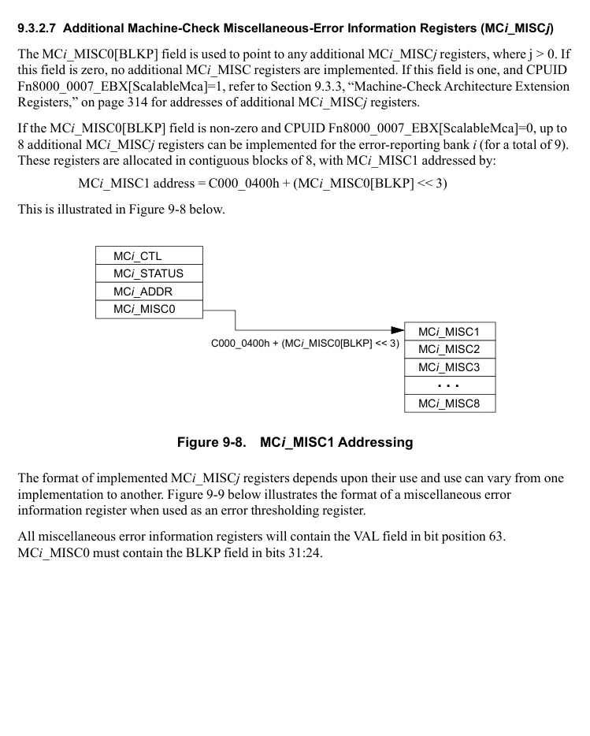

</details>


<!-- PDF source page: 375 | printed page: 313 -->

63 62 61 60 59 56 55 52 51 50 49 48 47 32

CNTE

CNTP

LKD

VAL

Reserved LVTOFF

INTT

ERRCT

IntP

OF

31 24 23 0

BLKP Reserved

**Bits Mnemonic Description Access type Reset** 63 VAL Valid R 1b 62 CNTP Counter Present R 1b 61 LKD Locked R/W 0b

60 IntP Thresholding Interrupt Supported R Implementation Dependent 59:56 Reserved 55:52 LVTOFF LVT Offset R/W 0000b 51 CNTE Counter Enable R/W 0b 50:49 INTT Interrupt Type R/W 00b 48 OF Overflow R/W Undefined 47:32 ERRCT Error Counter R/W Undefined 31:24 BLKP Block pointer for additional MISC registers R Undefined 23:0 Reserved

**Figure 9-9. Miscellaneous Information Register (Thresholding Register Format)**

The fields within the MC*i*_MISC*j* register are:

- *Valid (VAL)*—Bit 63. When set to 1, indicates that the counter present (CNTP) and block pointer (BLKP) fields in this register are valid.
- *Counter Present (CNTP)*—Bit 62. When set to 1, indicates the presence of a threshold counter.
- *Locked (LKD)*—Bit 61. When set to 1, indicates that the threshold counter is not available for OS use. If this is the case, writes to bits 60:0 of this register are ignored and do not generate a fault. Software must check the Locked bit before writing into the thresholding register. This field is write-enabled by MSR C001_0015h Hardware Configuration Register [MCSTATUSWrEn].
- *IntP (Thresholding Interrupt Supported)*—Bit 60. When set, this bit indicates that the reporting of threshold overflow via interrupt is supported. Interrupt type is determined by the setting of the INTT field.
- *LVT Offset (LVTOFF)*—Bits 55:52. This field specifies the address of the APIC LVT entry to deliver the threshold counter interrupt. Software must initialize the APIC LVT entry before enabling the threshold counter to generate the APIC interrupt; otherwise, undefined behavior may result. This field is aliased to MCA_INTR_CFG[ThresholdLvtOffest].

<details>
<summary>Rendered source page 375 (figures/tables)</summary>

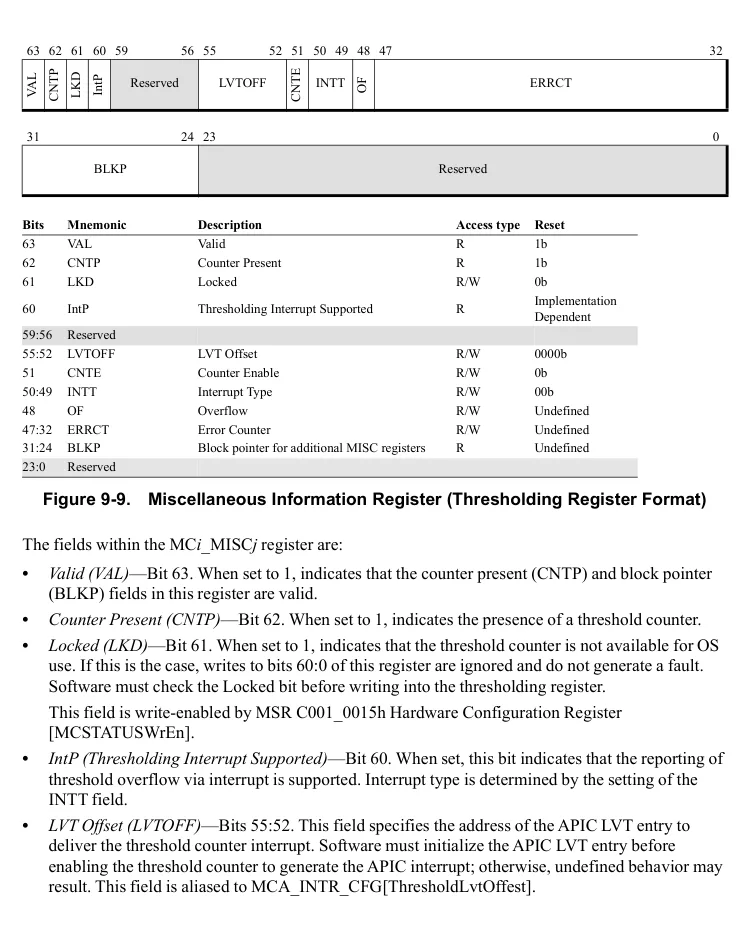

</details>


<!-- PDF source page: 376 | printed page: 314 -->

- *Counter Enable (CNTE)*—Bit 51. When set to 1, counting of implementation-dependent errors is enabled; otherwise, counting is disabled.
- *Interrupt Type (INTT)*—Bits 50:49. The value of this field specifies the type of interrupt signaled when the value of the overflow bit changes from 0 to 1.
- 00b = No interrupt
- 01b = APIC-based interrupt
- 10b = Reserved
- 11b = Reserved
- *Overflow (OF)*—Bit 48. The value of this field is maintained through a warm reset. This bit is set by hardware when the error counter increments to its maximum implementation-supported value (from FFFEh to FFFFh for the maximum implementation-supported value). This is defined as the threshold level. When the overflow bit is set, the interrupt selected by the interrupt type field is generated. Software must reset this bit to zero in the interrupt handler routine when they update the error counter.
- *Error Counter (ERRCT)*—Bits 47:32. This field is maintained through a warm reset. The size of the threshold counter is implementation-dependent. Implementations with less than 16 bits fill the most significant unimplemented bits with zeros. Software enumerates the counter bits to discover the size of the counter and the threshold level (when counter increments to the maximum count implemented). Software sets the starting error count as follows: *Starting error count* = *threshold level* – *desired software error count to cause overflow* The error counter is incremented by hardware when errors for the associated error counter are logged. When this counter overflows, it stays at the maximum error count (with no rollover). MCA_MISCx[ErrCt] will not increment on errors that set MCA_STATUS[Poison].
- *Block pointer for additional MISC registers (BLKP)*—Bits 31:24. This field is only valid when valid (VAL) bit is set. When non-zero, this field is used to indicate the presence of additional MCi_MISC registers.

Other formats for miscellaneous information registers are implementation-dependent, see the *BIOS and Kernel Developer’s Guide (BKDG)* or *Processor Programming Reference Manual (PPR)* applicable to your product for more details.

<a id="9-3-3-machine-check-architecture-extension-registers"></a>

### 9.3.3 Machine-Check Architecture Extension Registers

This section describes the Machine Check Architecture Extension (MCAX). MCAX is available on a processor when CPUID Fn8000_0007_EBX[ScalableMca] returns 1.

A processor that supports MCAX supports up to 64 MCA banks per thread, with 16 MCAX registers per bank, at MSRs C000_2[3FF:000]. MSRs C000_2[FFF:400] are reserved for future use.

Software can identify an MCA bank as MCAX-capable by checking for MCA_CONFIG[Mcax]=1. An MCAX bank contains the following MCAX registers: MCA_CTL, MCA_STATUS,


<!-- PDF source page: 377 | printed page: 315 -->

MCA_ADDR, MCA_MISC0, MCA_CONFIG, MCA_IPID, MCA_SYND, MCA_DESTAT, MCA_MISC[4:1], and MCA_SYND[2:1]. See Figure 9-10 for address mapping of registers in a MCAX bank.

MCAX bank registers MCA_CTL, MCA_STATUS, MCA_ADDR, and MCA_MISC0 are aliased to MCA bank registers MCi_CTL, MCi_STATUS, MCi_ADDR, and MCi_MISC0 in MCA banks 0 to 31. The format of MCA_CTL, MCA_STATUS, MCA_ADDR, and MCA_MISC0 is the same as the format of the corresponding MCA bank register.

**Figure 9-10. Address Mapping of Registers in MCAX Bank**

<details>
<summary>Extracted figure labels</summary>

```text
MCAX Bank registers
(MSR C000_2xxx)
MCAX Bank registers (MSR C000_2xxx)
MCA
bank
number
(decimal)
MCA_
STAT
US
MCA_
MISC
0
MCA
_CON
FIG
MCA
_SYN
D
MCA
_DES
TAT
MCA_
DEAD
DR
MCA_
MISC
[1:4]
MCA_
SYND
[1:2]
MCA_
CTL
MCA_
ADDR
MCA
_IPID
Reser
ved
0
000h
001h
002h
003h
004h
005h
006h
007h
008h
009h
00Ah:0
0Dh
00Eh:0
0Fh
(00Ah:
00Dh)
+
n*10h
(00Eh:
00Fh)
+
n*10h
001h
+
n*10h
002h
+
n*10h
003h
+
n*10h
004h
+
n*10h
005h
+
n*10h
006h
+
n*10h
009h
+
n*10h
n
000h
+
n*10h
007h
+
n*10h
008h
+
n*10h
```

</details>

1. 9. 3.3.1 MCA Configuration Register**

The MCA_CONFIG register holds configuration information for the MCA bank.

63 41 40 39 38 37 36 35 34 33 32

DeferredIntType

Log DeferredEn

MCAXEN

Reserved

IntEn

Reserved

31 9 8 7 6 5 4 3 2 1 0

DeferredLoggingSupported

DeferredIntTypeSupported

DeStatErrCodeSupported

FatalMaskSupported

FruTextInMCA LsbInStatSupported

Reserved

MCAX

Reserved

**Bits Mnemonic Description Access Type** 63:41 Reserved 40 IntEn Interrupt Enable R/W 39 Reserved

<details>
<summary>Rendered source page 377 (figures/tables)</summary>

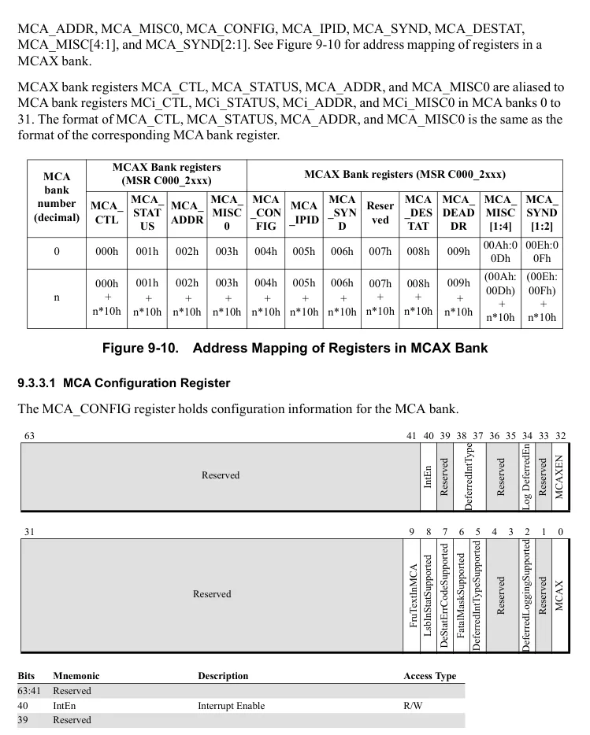

</details>


<!-- PDF source page: 378 | printed page: 316 -->

**Bits Mnemonic Description Access Type**

38:37 DeferredIntType Deferred Error Interrupt Type R/W 36:35 Reserved 34 LogDeferredEn Deferred Error Logging Enable R/W 33 Reserved 32 McaxEn MCAX Enable R/W 31:10 Reserved 9 FruTextInMCA MCA FruText Supported R/W 8 LsbInStatSupported Address LSB in MCA_STATUS Supported R 7 DeStatErrCodeSupported Deferred Error Status Error Code Supported R 6 FatalMaskSupported System fatal error event supported. R 5 DeferredIntTypeSupported Deferred Interrupt Type Supported R 4:3 Reserved 2 DeferredLoggingSupported Deferred Error Logging Supported R 1 Reserved 0 MCAX MCAX Capable R

*IntEn*—Bits 40. When this bit is set to 0, an interrupt will not occur for corrected errors. When this bit is set to 1 and IntPresent=1, this bank will generate an interrupt on a corrected error to the interrupt vector configured in MCA_INTR_CFG[ThresholdLvtOffset].

*DeferredIntType*—Bits 38:37. When MCA_CONFIG[McaxEn]=1, specifies the type of interrupt to generate on a deferred error.

00b No interrupt 01b APIC based interrupt 10b SMI 11b Reserved

*LogDeferredEn—*Bit 34. Enable logging of deferred errors in MCA_STATUS. 0=Log deferred errors only in MCA_DESTAT and MCA_DEADDR. 1=Log deferred errors in MCA_STATUS and MCA_ADDR in addition to MCA_DESTAT and MCA_DEADDR. This bit does not affect logging of deferred errors in MCA_SYND or MCA_MISCx.

*McaxEn—*Bit 32. Enable MCAX feature set. 1=System software acknowledges support for the MCAX feature set. 0=System software has not acknowledged support for the MCAX feature set; all uncorrected errors and fatal errors cause a system fatal event.

*FruTextInMca—*Bit 9. 1=MCA_SYND1 and MCA_SYND2 contain an ASCII-formatted Field Replaceable Unit (FRU) identifier for the error logged in MCA_STATUS or MCA_DESTAT. 0=MCA_SYND1 and MCA_SYND2 contain implementation-specific information.

*LsbInStatSupported—*Bit 8. 1=MCA_STATUS[29:24] and MCA_DESTAT[29:24] contain the least significant valid bit of the address logged in MCA_ADDR and MCA_DEADDR.

*DeStatErrCodeSupported—*Bit 7. 1=MCA_DESTAT contains an MCA Error Code and a Model-specific Extended Error Code for the error logged in MCA_DESTAT.


<!-- PDF source page: 379 | printed page: 317 -->

*DeferredIntTypeSupported—*Bit 5. 1=MCA_CONFIG[DeferredIntType] controls the type of interrupt generated on a deferred error. Deferred errors are supported in this bank only if MCA_CONFIG[DeferredLoggingSupported]=1.

*DeferredLoggingSupported—*Bit 2. 1= MCA_CONFIG[LogDeferredEn] in this bank controls the logging behavior for deferred errors. 0= MCA_CONFIG[LogDeferredEn] is not supported.

*MCAX—*Bit 0. MCAX: Set by hardware. This MCA bank provides Machine Check Architecture Extensions.

1. 9. 3.3.2 MCA IP Identification**

This register holds information which identifies the specific bank type: the McaType value, HWID, and the InstanceID. By providing those values as part of the MCA, the bank type information is available to the machine check handler for parsing and for diagnosis.

63 48 47 44 43 32

MCA Type InstanceldHi HWID

31 0

Instanceld

**Bits Mnemonic Description Access type** 63:48 McaType MCA bank type. R/W 47:44 InstanceIdHi The high bits of the Instance ID. R/W 43:32 Hwid Hardware ID value. R/W 31:0 InstanceID The low bits of the Instance ID. R/W

**Figure 9-11. MCA_IPID Register**

*McaType—*Bits 63:48. MCA bank type. This field is used to identify the MCA bank type in conjunction with MCA_IPID[Hwid]. For more information, see the Processor Programming Reference Manual applicable to your product.

*InstanceIdHi—*Bits 47:44. The high bits of the Instance identification for the MCA bank. This field is used to identify the MCA bank instance in conjunction with MCA_IPID[InstanceId]. For more information, see the Processor Programming Reference Manual applicable to your product.

*Hwid—*Bits 43:32. MCA bank hardware identification. For more information, see the Processor Programming Reference Manual applicable to your product.

*InstanceId—*Bits 31:0. The Instance identification for the MCA bank. This field is used to identify the MCA bank instance.

<details>
<summary>Rendered source page 379 (figures/tables)</summary>

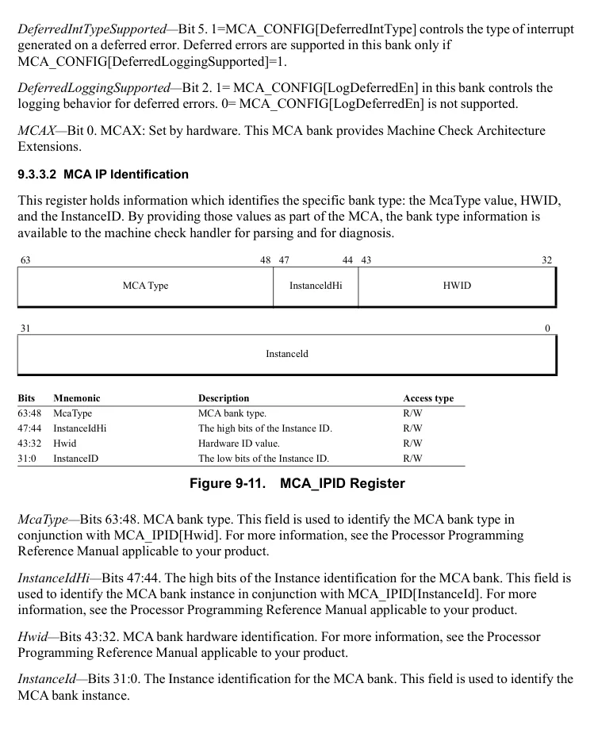

</details>


<!-- PDF source page: 380 | printed page: 318 -->

1. 9. 3.3.3 MCA Syndrome Register** The MCA_SYND register stores a syndrome associated with the error logged in MCA_STATUS or MCA_DESTAT. The “syndrome” may include syndrome values associated with an error correcting code or other information about the error. The contents of this register are valid if MCA_STATUS[SYNDV] bit is set to 1 or MCA_DESTAT[SYNDV] bit is set to 1.

The format and contents of this register are implementation dependent. For more information, see the Processor Programming Reference Manual applicable to your product.

1. 9. 3.3.4 MCA Deferred Error Status Register** This register holds status information for deferred errors. This register ensures that software will see a deferred error, even when a later error of higher severity occurs. If the error being logged is a deferred error, then the error will be logged to MCA_DESTAT. See Section 9.3.2.4, “Machine-Check Status Registers,” on page 308 for more detailed descriptions of the register fields.

When the deferred error has been processed by the deferred error handler, MCA_DESTAT should be cleared. If MCA_STATUS also contains a deferred error, MCA_STATUS should be cleared.

63 62 61 59 58 57 54 53 52 45 44 43 32

Overflow

Deferred

Model Dependent

AddrV

SyndV

Valid

Model Dependent

31 16 15 0

Model-specific Extended Error Code MCA Error Code

**Bits Mnemonic Description Access type** 63 Valid A valid error is contained in this register. R/W 62 Overflow One or more deferred errors was not logged. R/W 61:59 Model Dependent. 58 AddrV An address is contained in MCA_DEADDR. R/W 57:54 Model Dependent.

53 SyndV Syndrome valid. MCA_SYND contains error syn-drome information associated with this deferred error. R/W

52:45 Model Dependent. 44 Deferred Error is a deferred error. R/W 43:32 Model Dependent.

This field encodes model-specific information about the error. Valid if MCA_CONFIG[DeSta-tErrCodeSupported]=1, else Reserved. R/W

31:16 Model-Specific Extended Error Code

This field encodes information about the error logged in MCA_DESTAT. Valid if MCA_CON-FIG[DeStatErrCodeSupported]=1, else Reserved.

**Figure 9-12. MCA_DESTAT Register**

<details>
<summary>Extracted figure labels</summary>

```text
15:0
MCA Error Code
R/W
```

</details>

<details>
<summary>Rendered source page 380 (figures/tables)</summary>

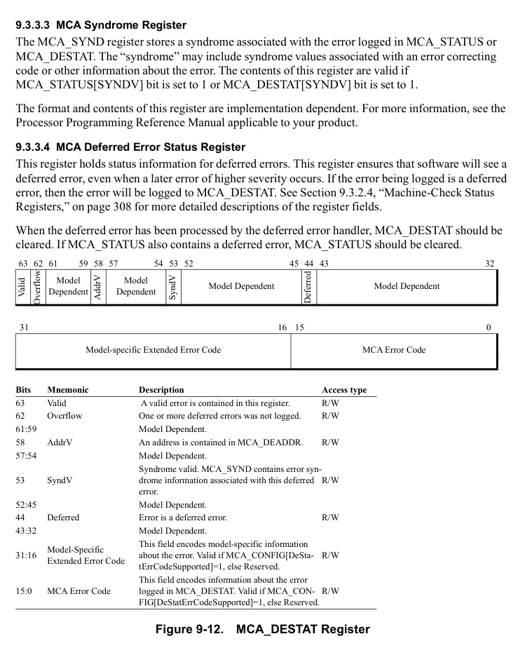

</details>


<!-- PDF source page: 381 | printed page: 319 -->

1. 9. 3.3.5 MCA Deferred Error Address Register**

The MCA_DEADDR register provides the address associated with an error logged in MCA_DESTAT.

The format of this register is the same as MCA_ADDR.

The register is only meaningful if MCA_DESTAT[Valid]=1 and MCA_DESTAT[ADDRV]=1.

1. 9. 3.3.6 MCA Miscellaneous Registers 1 - 4**

Set by hardware.

The format of MCA_MISC[4-1] is the same as the format of MCA_MISC0.

1. 9. 3.3.7 MCA Syndrome Registers 1 - 2**

The MCA_SYND[2-1] registers store information associated with the error in MCA_STATUS or MCA_DESTAT. The contents of these registers are valid if MCA_STATUS[SYNDV] is set or MCA_DESTAT[SYNDV] is set.

The format and contents of this register is implementation dependent. For more information, see the Processor Programming Reference Manual applicable to your product.

<a id="9-4-initializing-the-machine-check-mechanism"></a>

## 9.4 Initializing the Machine-Check Mechanism

Following a processor reset, all machine-check error-reporting enable bits are disabled. System software must enable these bits before machine-check errors can be reported. Generally, system software should initialize the machine-check mechanism using the following process:

- Execute the CPUID instruction and verify that the processor supports the machine-check exception (MCE) and machine-check registers (MCA). Software should not proceed with initializing the machine-check mechanism if the machine-check registers are not supported.
- If the machine-check registers are supported, system software should take the following steps:
- Check to see if the CTLP bit in the MCG_CAP register is set to 1. If it is, then the MCG_CTL register is supported by the processor. If the MCG_CTL register is supported, software should set its enable bits to 1 for the machine-check features it uses. Software can load MCG_CTL with all 1s to enable all available machine-check reporting banks.
- Read the COUNT field from the MCG_CAP register to determine the number of error-reporting register banks supported by the processor. For each error-reporting register bank, software should set the enable bits to 1 in the MC*i*_CTL register for the error types it wants the processor to report. Software can write each MC*i*_CTL with all 1s to enable all error-reporting mechanisms. Not enabling reporting banks that may be involved in the reporting of uncorrected errors can lead to the loss of system reliability and error recoverability.
- Check the VAL bit on each implemented MC*i*_STATUS register. It is possible that valid error-status information has already been logged in the MC*i*_STATUS registers at the time software


<!-- PDF source page: 382 | printed page: 320 -->

is attempting to initialize them. The status can reflect errors logged prior to a warm reset or errors recorded during the system power-up and boot process. Before clearing the MC*i*_STATUS registers, software should examine their contents and log any errors found. -After saving any valid error information contained in the MC*i*_STATUS, MC*i*_ADDR, and any implemented miscellaneous error information registers for each implemented reporting bank, software should clear all status fields in the MC*i*_STATUS register for each bank by writing all 0s to the register. **•** As a final step in the initialization process, system software should enable the machine-check exception by setting CR4[MCE] to 1.

A machine-check condition that occurs while CR4[MCE] is cleared will result in the processor core entering the shutdown state.

<a id="9-5-using-mca-features"></a>

## 9.5 Using MCA Features

System software can detect and handle logged errors using three methods:

1. 1. Polling Software can periodically examine the machine-check status registers for errors, and save any error information found. Uncorrected errors found during polling will require some type of immediate response to initiate recovery or shutdown.

1. 2. Enabling machine-check reporting When reporting is enabled, any uncorrected error that occurs causes control to be transferred to the machine-check exception handler. The exception handler can be designed for a specific processor implementation or can be generalized to work on multiple implementations.

1. 3. Setting up and enabling interrupts for deferred and corrected errors In many implementations, MCA hardware can be configured to generate an interrupt hardware on the detection of a deferred error or when a programmed corrected error threshold is reached.

These methods are not mutually exclusive.

<a id="9-5-1-determining-the-scope-of-detected-errors"></a>

### 9.5.1 Determining the Scope of Detected Errors

Table 9-4 details the actions that recovery software should take and the level of recovery possible based on status information returned in the MCi_STATUS and MCG_STATUS registers.


<!-- PDF source page: 383 | printed page: 321 -->

**Table 9-4. Error Scope**

| MCi STATUS<br>_ / PCC | MCi STATUS<br>_ / TCC | MCi STATUS<br>_ / UC | MCi STATUS<br>_ / Deferred | Error Scope |
| --- | --- | --- | --- | --- |
| 1 | — | 1 | — | System fatal error. Error has corrupted the processor core architectural state.<br>System processing must be terminated. |
| 0 | 0 | 1 | — | Recoverable error. If software can correct the error, the interrupted program can<br>be resumed. |
| 0 | 1 | 1 | — | Containable error. The interrupted instruction stream cannot be resumed. System-<br>level recovery may be possible if software can localize the error and terminate<br>any affected software processes. |
| 0 | 0 | 0 | 1 | Deferred error. Immediate software action is not required. A latent error has been<br>discovered, but not yet consumed. Error handling software may attempt to correct<br>this data error, or prevent access by processes which map the data, or make the<br>physical resource containing the data inaccessible. |
| 0 | 0 | 0 | 0 | Hardware corrected error. No software action is required. Error information<br>should be saved for analysis. |

<a id="9-5-2-handling-machine-check-exceptions"></a>

### 9.5.2 Handling Machine Check Exceptions

The processor uses the interrupt control-transfer mechanism to invoke an exception handler after a machine-check exception occurs. This requires system software to initialize the interrupt-descriptor table (IDT) with either an interrupt gate or a trap gate that references the interrupt handler. See “Legacy Protected-Mode Interrupt Control Transfers” on page 270 and “Long-Mode Interrupt Control Transfers” on page 281 for more information on interrupt control transfers.

At a minimum, the machine-check exception handler must be capable of logging errors for later examination. This can be a sufficient implementation for some handlers. More thorough exception-handler implementations can analyze the error to determine if it is unrecoverable, and whether it can be recovered in software.

Machine-check exception handlers that attempt recovery must be thorough in their analysis and their corrective actions. The following guidelines should be used when writing such a handler:

- The status registers in all the enabled error-reporting register banks must be examined to identify the cause of the machine-check exception. Read the COUNT field from MCG_CAP to determine the number of status registers supported by the processor.
- Check the valid bit in each status register (MC*i*_STATUS[VAL]). The MC*i*_STATUS register does not need to be examined when its valid bit is clear.
- Check the valid MC*i*_STATUS registers to see if error recovery is possible. Error recovery is not possible when:
- The processor-context corrupt bit (MC*i*_STATUS[PCC]) is set to 1.
- The error-overflow status bit (MC*i*_STATUS[OVER]) is set and the processor does not support recoverable MC*i*_STATUS overflow (as indicated by feature bit CPUID Fn8000_0007_EBX[McaOverflowRecov] = 0).

<details>
<summary>Rendered source page 383 (figures/tables)</summary>

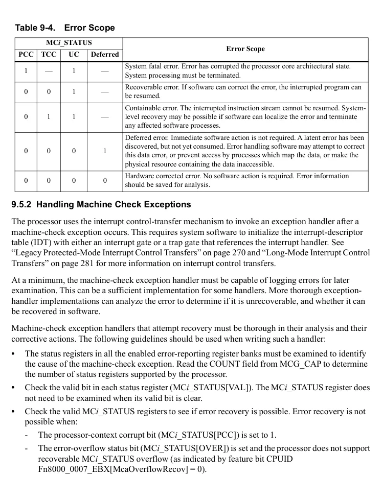

</details>


<!-- PDF source page: 384 | printed page: 322 -->

- The processor does not support Machine Check Recovery as indicated by feature bit CPUID Fn8000_0007_EBX[SUCCOR]. If error recovery is not possible, the handler should log the error information and return to the system software responsible for shutting down the processor core.
- Check the MC*i*_STATUS[UC] bit to see if the processor corrected the error. If UC is set, the processor did not correct the error and the exception handler must correct the error before restarting the interrupted program.
- If MCA Recovery is supported:
- Check MCA_STATUS[TCC].
- If TCC is set, the context of the process executing on the interrupted thread may be corrupt and the thread cannot be recovered. The rest of the system is unaffected; it is possible to terminate only the affected process thread.
- If TCC is clear, the context of the process thread executing on the interrupted logical core is not corrupt. Recovery of the process thread may be possible, but only if the uncorrected error condition is first corrected by software; otherwise, the interrupted process thread must be terminated. If the handler cannot correct the error or the MCG_STATUS[RIPV] bit is cleared, it should not return control to the interrupted program, but should log the error information and terminate the software process that was about to consume the uncorrected data. If the error has compromised the state of a guest operating system, the guest should be restarted. If the state of the virtual machine has been corrupted, the virtual machine must be reinitialized.
- When identifying the error condition, portable exception handlers should examine only the architecturally defined fields of the MC*i*_STATUS register.
- If the MCG_STATUS[RIPV] bit is set, the interrupted program can be restarted reliably at the instruction pointer address pushed onto the exception handler stack. If RIPV = 0, the interrupted program cannot be restarted reliably at that location, although it can be restarted at that location for debugging purposes.
- When logging errors, particularly those that are not recoverable, check the MCG_STATUS[EIPV] bit to see if the instruction-pointer address pushed onto the exception handler stack is related to the process thread interrupted by the machine-check exception. If EIPV = 0, the address is not guaranteed to be related to the interrupted process thread.
- Before exiting the machine-check handler, clear the MCG_STATUS[MCIP] bit. MCIP indicates a machine-check exception occurred. If this bit is set when another machine-check exception occurs, the processor enters the shutdown state.
- When an exception handler is able to, at a minimum, successfully log an error condition, the MC*i*_STATUS registers should be cleared before exiting the machine-check handler. Software is responsible for clearing at least the MC*i*_STATUS[VAL] bits.
- Additional machine-check exception-handler portability can be added by having the handler use the CPUID instruction to identify the processor and its capabilities. Implementation-specific


<!-- PDF source page: 385 | printed page: 323 -->

software can be added to the machine-check exception handler based on the processor information reported by CPUID.

<a id="9-5-3-reporting-corrected-errors"></a>

### 9.5.3 Reporting Corrected Errors

Machine-check exceptions do not occur if the error is corrected by the processor. If system software wishes to detect and save information concerning corrected machine-check errors, a system-service routine must be provided to check the contents of the machine-check status registers for corrected errors. The service routine can be invoked by system software on a periodic basis, or by an error-thresholding interrupt.

A service routine that gathers error information for corrected errors should perform the following:

- Examine the status register (MC*i*_STATUS) in each of the enabled error-reporting register banks. For each MC*i*_STATUS register with a set valid bit (VAL=1), the service routine should:
- Save the contents of the MC*i*_STATUS register.
- Save the contents of the corresponding MC*i*_ADDR register if MC*i*_STATUS[ADDRV] = 1.
- Save the contents of the corresponding MC*i*_MISC register if MC*i*_STATUS[MISCV] = 1.
- Once the information found in the error-reporting register banks is saved, the MC*i*_STATUS register should be cleared. This allows the processor to properly report any subsequent errors in the MC*i*_STATUS registers.
- The service routine can save the time-stamp counter with each error logged. This can help in determining how frequently errors occur. For further information, see “Time-Stamp Counter” on page 423.
- In multiprocessor configurations, the service routine can save the processor-node identifier. This can help locate a failing multiprocessor-system component, which can then be isolated from the rest of the system. For further information, see the documentation for particular implementations of the architecture.
