<!-- PDF source page: 386 | printed page: 324 -->

<a id="10-system-management-mode"></a>

# 10 System-Management Mode

System-management mode (SMM) is an operating mode designed for system-control activities like power management. Normally, these activities are transparent to conventional operating systems and applications. SMM is used by platform firmware and specialized low-level device drivers, rather than the operating system.

The SMM interrupt-handling mechanism differs substantially from the standard interrupt-handling mechanism described in Chapter 8, “Exceptions and Interrupts.” SMM is entered using a special external interrupt called the *system-management interrupt* (SMI). After an SMI is received by the processor, the processor saves the processor state in a separate address space, called *SMRAM*. The SMM-handler software and data structures are also located in the SMRAM space. Interrupts and exceptions that ordinarily cause control transfers to the operating system are disabled when SMM is entered. The processor exits SMM, restores the saved processor state, and resumes normal execution by using a special instruction, *RSM*.

In SMM, address translation is disabled and addressing is similar to real mode. SMM programs can address up to 4 Gbytes of physical memory. See “SMM Operating-Environment” on page 334 for additional information on memory addressing in SMM.

The following sections describe the components of the SMM mechanism:

- *“SMM Resources” on page 325*—this section describes SMRAM, the SMRAM save-state area used to hold the processor state, and special SMRAM save-state entries used in support of SMM.
- *“Using SMM” on page 334*—this section describes the mechanism of entering and exiting SMM. It also describes SMM memory allocation, addressing, and interrupts and exceptions.

Of these mechanisms, only the format of the SMRAM save-state area differs between the AMD64 architecture and the legacy architecture.

> ***Note:** Model-independent aspects of SMM operation are described here; see the BIOS and Kernel Developer’s Guide (BKDG) or Processor Programming Reference Manual (PPR) of a given processor family for possible model-specific details.*

<a id="10-1-smm-differences"></a>

## 10.1 SMM Differences

There are functional differences between the SMM support in the AMD64 architecture and the SMM support found in previous architectures. These are:

- The SMRAM state-save area layout is changed to hold the 64-bit processor state.
- The initial processor state upon entering SMM is expanded to reflect the 64-bit nature of the processor.
- New conditions exist that can cause a processor shutdown while in SMM.


<!-- PDF source page: 387 | printed page: 325 -->

- The auto-halt restart and I/O-instruction restart entries in the SMRAM state-save area are one byte each instead of two bytes each.
- SMRAM caching considerations are modified because the legacy FLUSH# external signal (writeback, if modified, and invalidate) is not supported on implementations of the AMD64 architecture.
- Some previous AMD x86 processors saved and restored the CR2 register in the SMRAM state-save area. This register is not saved by the SMM implementation in the AMD64 architecture. SMM handlers that save and restore CR2 must perform the operation in software.

<a id="10-2-smm-resources"></a>

## 10.2 SMM Resources

The SMM resources supported by the processor consist of SMRAM, the SMRAM state-save area, and special entries within the SMRAM state-save area. In addition to the save-state area, SMRAM includes space for the SMM handler.

<a id="10-2-1-smram"></a>

### 10.2.1 SMRAM

SMRAM is the memory-address space accessed by the processor when in SMM. The default size of SMRAM is 64 Kbytes and can range in size between 32 Kbytes and 4 Gbytes. System logic can use physically separate SMRAM and main memory, directing memory transactions to SMRAM after recognizing SMM is entered, and redirecting memory transactions back to system memory after recognizing SMM is exited. When separate SMRAM and main memory are used, the system designer needs to provide a method of mapping SMRAM into main memory so that the SMI handler and data structures can be loaded.

Figure 10-1 on page 326 shows the default SMRAM memory map. The default SMRAM code segment (CS) has a base address of 0003_0000h (the base address is automatically scaled by the processor using the CS-selector register, which is set to the value 3000h). This default SMRAM-base address is known as *SMBASE*. A 64-Kbyte memory region, addressed from 0003_0000h to 0003_FFFFh, makes up the default SMRAM memory space. The top 32 Kbytes (0003_8000h to 0003_FFFFh) must be supported by system logic, with physical memory covering that entire address range. The top 512 bytes (0003_FE00h to 0003_FFFFh) of this address range are the default *SMM state-save area*. The default entry point for the SMM interrupt handler is located at 0003_8000h.


<!-- PDF source page: 388 | printed page: 326 -->

**Figure 10-1. Default SMRAM Memory Map**

<details>
<summary>Extracted figure labels</summary>

```text
SMRAM
0003_FFFFh
(SMBASE+FFFFh)
SMM State-Save Area
0003_FE00h
SMM Handler
0003_8000h
(SMBASE+8000h)
0003_0000h
(SMBASE)
513-250.eps
```

</details>

<a id="10-2-2-smbase-register"></a>

### 10.2.2 SMBASE Register

The format of the SMBASE register is shown in Figure 10-2. SMBASE is an internal processor register that holds the value of the SMRAM-base address. SMBASE is set to 30000h after a processor reset.

**Figure 10-2. SMBASE Register**

<details>
<summary>Extracted figure labels</summary>

```text
0
31
SMRAM Base
```

</details>

In some operating environments, relocation of SMRAM to a higher memory area can provide more low memory for legacy software. SMBASE relocation is supported when the SMM-base relocation bit in the SMM-revision identifier (bit 17) is set to 1. In processors implementing the AMD64 architecture, SMBASE relocation is always supported.

Software can only modify SMBASE (relocate the SMRAM-base address) by entering SMM, modifying the SMBASE image stored in the SMRAM state-save area, and exiting SMM. The SMM-handler entry point must be loaded at the new memory location specified by SMBASE+8000h. The next time SMM is entered, the processor saves its state in the new state-save area at SMBASE+0FE00h, and begins executing the SMM handler at SMBASE+8000h. The new SMBASE address is used for every SMM until it is changed, or a hardware reset occurs.

<details>
<summary>Rendered source page 388 (figures/tables)</summary>

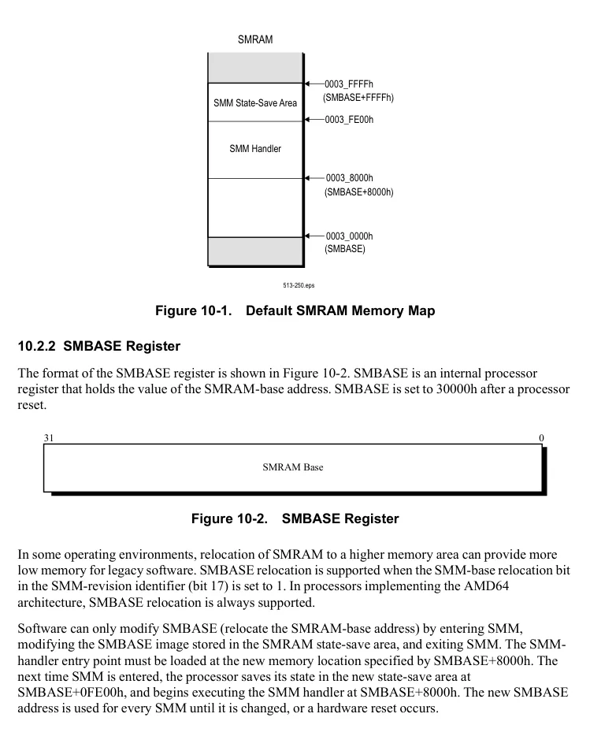

</details>


<!-- PDF source page: 389 | printed page: 327 -->

When SMBASE is used to relocate SMRAM to an address above 1 Mbyte, 32-bit address-size override prefixes must be used to access this memory. This is because addressing in SMM behaves as it does in real mode, with a 16-bit default operand size and address size. The values in the 16-bit segment-selector registers are left-shifted four bits to form a 20-bit segment-base address. Without using address-size overrides, the maximum computable address is 10FFEFh.

Because SMM memory-addressing is similar to real-mode addressing, the SMBASE address must be less than 4 Gbytes.

<a id="10-2-3-smram-state-save-area"></a>

### 10.2.3 SMRAM State-Save Area

When an SMI occurs, the processor saves its state in the 512-byte SMRAM state-save area during the control transfer into SMM. The format of the state-save area defined by the AMD64 architecture is shown in Table 10-1. This table shows the offsets in the SMRAM state-save area relative to the SMRAM-base address. The state-save area is located between offset 0_FE00h (SMBASE+0_FE00h) and offset 0_FFFFh (SMBASE+0_FFFFh). Software should not modify offsets specified as read-only or reserved, otherwise unpredictable results can occur.

**Table 10-1. AMD64 Architecture SMM State-Save Area**

| Offset (Hex)<br>from SMBASE / FE00h | Contents / ES | Contents / Selecto | Size / Word | Allowable<br>Access / Read-Only |
| --- | --- | --- | --- | --- |
| FE02h |  | Attributes | Word |  |
| FE04h |  | Limit | Doubleword |  |
| FE08h |  | Base | Quadword |  |
| FE10h | CS | Selecto | Word | Read-Only |
| FE12h | CS | Attributes | Word |  |
| FE14h | CS | Limit | Doubleword |  |
| FE18h | CS | Base | Quadword |  |
| FE20h | SS | Selecto | Word | Read-Only |
| FE22h | SS | Attributes | Word |  |
| FE24h | SS | Limit | Doubleword |  |
| FE28h | SS | Base | Quadword |  |
| FE30h | DS | Selecto | Word | Read-Only |
| FE32h | DS | Attributes | Word |  |
| FE34h | DS | Limit | Doubleword |  |
| FE38h | DS | Base | Quadword |  |

> Note: 1. The offset for the SMM-revision identifier is compatible with previous implementations.

<details>
<summary>Rendered source page 389 (figures/tables)</summary>

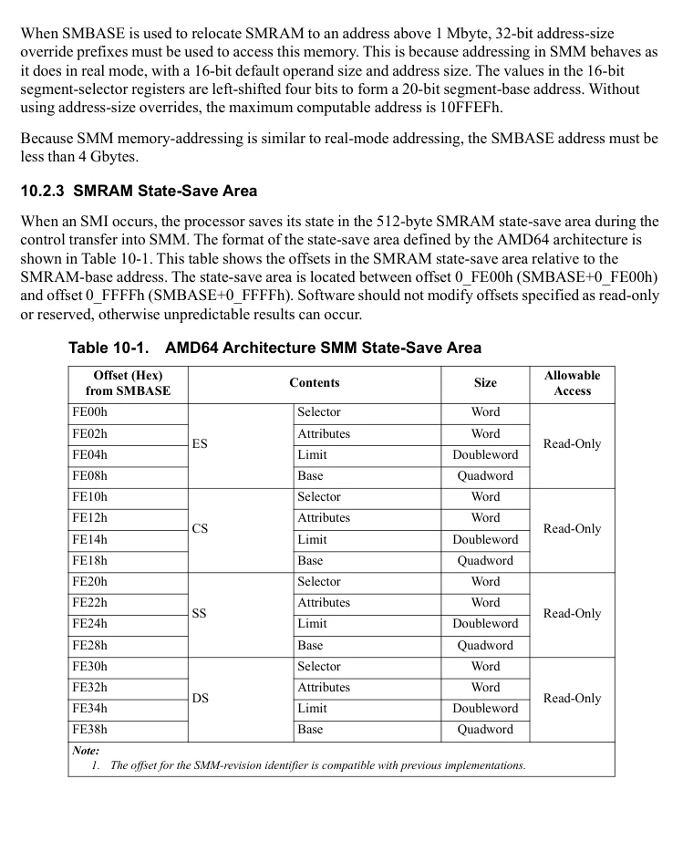

</details>


<!-- PDF source page: 390 | printed page: 328 -->

**Table 10-1. AMD64 Architecture SMM State-Save Area (continued)**

| Offset (Hex)<br>from SMBASE / FE40h | Contents / FS | Contents / Selecto | Size / Word | Allowable<br>Access / Read-Only |
| --- | --- | --- | --- | --- |
| FE42h |  | Attributes | Word |  |
| FE44h |  | Limit | Doubleword |  |
| FE48h |  | Base | Quadword |  |
| FE50h | GS | Selecto | Word | Read-Only |
| FE52h | GS | Attributes | Word |  |
| FE54h | GS | Limit | Doubleword |  |
| FE58h | GS | Base | Quadword |  |
| FE60h–FE63h | GDTR | Reserved | 4 Bytes | Read-Only |
| FE64h | GDTR | Limit | Word |  |
| FE66h–FE67h | GDTR | Reserved | 2 Bytes |  |
| FE68h | GDTR | Base | Quadword |  |
| FE70h | LDTR | Selecto | Word | Read-Only |
| FE72h | LDTR | Attributes | Word |  |
| FE74h | LDTR | Limit | Doubleword |  |
| FE78h | LDTR | Base | Quadword |  |
| FE80h–FE83h | IDTR | Reserved | 4 Bytes | Read-Only |
| FE84h | IDTR | Limit | Word |  |
| FE86h–FE87h | IDTR | Reserved | 2 Bytes |  |
| FE88h | IDTR | Base | Quadword |  |
| FE90h | TR | Selecto | Word | Read-Only |
| FE92h | TR | Attributes | Word |  |
| FE94h | TR | Limit | Doubleword |  |
| FE98h | TR | Base | Quadword |  |
| FEA0h | I/O Instruction Restart RIP | Base | Quadword | Read-Only |
| FEA8h | I/O Instruction Restart RCX | Base | Quadword | Read-Only |
| FEB0h | I/O Instruction Restart RSI | Base | Quadword | Read-Only |
| FEB8h | I/O Instruction Restart RDI | Base | Quadword | Read-Only |
| FEC0h | I/O Instruction Restart Dword | Base | Doubleword | Read-Only |
| FEC4h–FEC7h | Reserved | Base | 4 Bytes | — |
| FEC8h | I/O Instruction Restart | Base | Byte | Read/Write |
| FEC9h | Auto-Halt Restart | Base | Byte |  |
| FECAh—FECFh | Reserved | Base | 6 Bytes | — |
| FED0h | EFER | Base | Quadword | Read-Only |

> Note: 1. The offset for the SMM-revision identifier is compatible with previous implementations.

<details>
<summary>Rendered source page 390 (figures/tables)</summary>

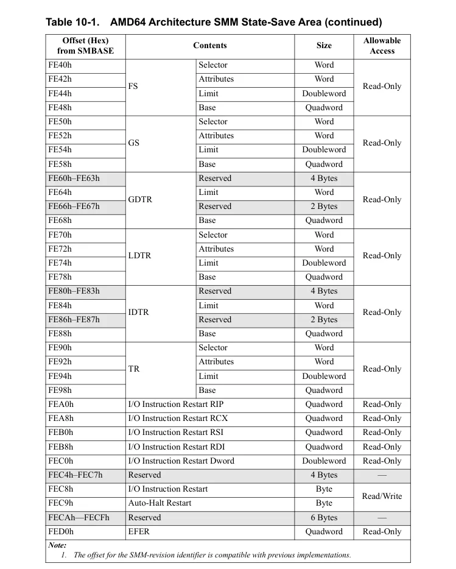

</details>


<!-- PDF source page: 391 | printed page: 329 -->

**Table 10-1. AMD64 Architecture SMM State-Save Area (continued)**

| Offset (Hex)<br>from SMBASE | Contents | Size | Allowable<br>Access |
| --- | --- | --- | --- |
| FED8h | SVM Guest | Quadword | Read-Only |
| FEE0h | SVM Guest VMCB Physical Address | Quadword |  |
| FEE8h | SVM Guest Virtual Interrupt | Quadword |  |
| FEF0h—FEFBh | Reserved | 12 Bytes | — |
| FEFCh | SMM-Revision Identifier1 | Doubleword | Read-Only |
| FF00h | SMBASE | Doubleword | Read/Write |
| FF04h—FF17h | Reserved | 20 Bytes | — |
| FF18h | SSP | Quadword | Read/Write |
| FF20h | SVM Guest PAT | Quadword | Read-Only |
| FF28h | SVM Host EFER | Quadword |  |
| FF30h | SVM Host CR4 | Quadword |  |
| FF38h | SVM Host CR3 | Quadword |  |
| FF40h | SVM Host CR0 | Quadword |  |
| FF48h | CR4 | Quadword | Read-Only |
| FF50h | CR3 | Quadword |  |
| FF58h | CR0 | Quadword |  |
| FF60h | DR7 | Quadword | Read-Only |
| FF68h | DR6 | Quadword |  |
| FF70h | RFLAGS | Quadword | Read/Write |
| FF78h | RIP | Quadword | Read/Write |
| FF80h | R15 | Quadword |  |
| FF88h | R14 | Quadword |  |
| FF90h | R13 | Quadword |  |
| FF98h | R12 | Quadword |  |
| FFA0h | R11 | Quadword |  |
| FFA8h | R10 | Quadword |  |
| FFB0h | R9 | Quadword |  |
| FFB8h | R8 | Quadword |  |

> Note: 1. The offset for the SMM-revision identifier is compatible with previous implementations.

<details>
<summary>Rendered source page 391 (figures/tables)</summary>

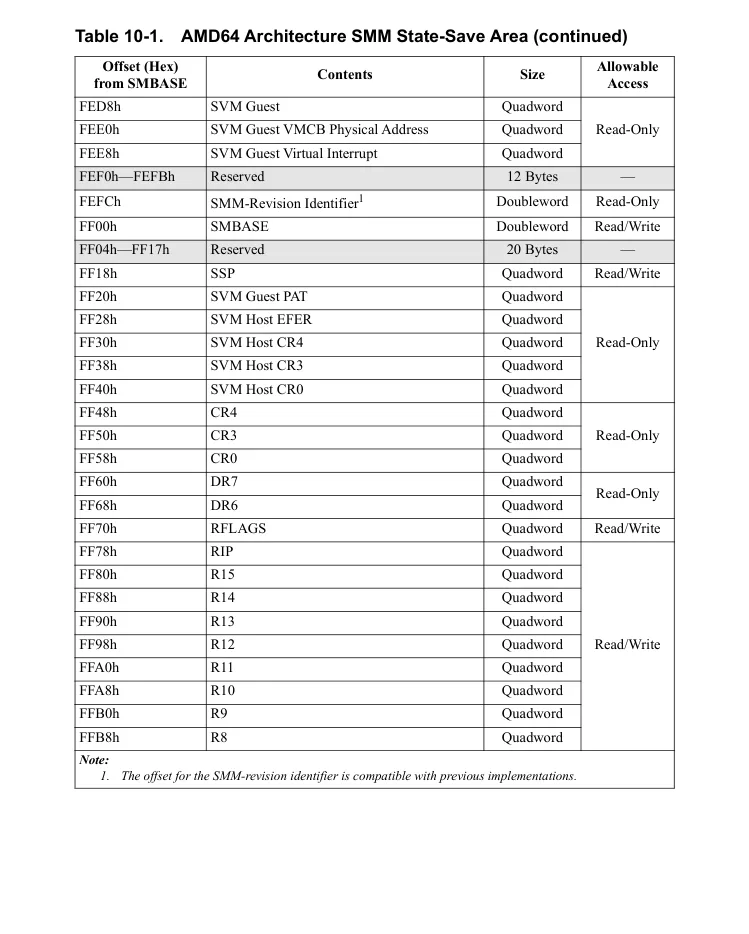

</details>


<!-- PDF source page: 392 | printed page: 330 -->

**Table 10-1. AMD64 Architecture SMM State-Save Area (continued)**

| Offset (Hex)<br>from SMBASE | Contents | Size | Allowable<br>Access |
| --- | --- | --- | --- |
| FFC0h | RDI | Quadword | Read/Write |
| FFC8h | RSI | Quadword |  |
| FFD0h | RBP | Quadword |  |
| FFD8h | RSP | Quadword |  |
| FFE0h | RBX | Quadword |  |
| FFE8h | RDX | Quadword |  |
| FFF0h | RCX | Quadword |  |
| FFF8h | RAX | Quadword |  |

> Note: 1. The offset for the SMM-revision identifier is compatible with previous implementations.

A number of other registers are not saved or restored automatically by the SMM mechanism. See “Saving Additional Processor State” on page 337 for information on using these registers in SMM.

As a reference for legacy processor implementations, the legacy SMM state-save area format is shown in Table 10-2. *Implementations of the AMD64 architecture do not use this format.*

**Table 10-2. Legacy SMM State-Save Area (Not used by AMD64 Architecture)**

| Offset (Hex)<br>from SMBASE | Contents | Size | Allowable<br>Access |
| --- | --- | --- | --- |
| FE00h—FEF7h | Reserved | 248 Bytes | — |
| FEF8h | SMBASE | Doubleword | Read/Write |
| FEFCh | SMM-Revision Identifie | Doubleword | Read-Only |
| FF00h | I/O Instruction Restart | Word | Read/Write |
| FF02h | Auto-Halt Restart | Word |  |
| FF04h—FF87h | Reserved | 132 Bytes | — |
| FF88h | GDT Base | Doubleword | Read-Only |
| FF8Ch—FF93h | Reserved | Quadword | — |
| FF94h | IDT Base | Doubleword | Read-Only |
| FF98h—FFA7h | Reserved | 16 Bytes | — |

> Note: 1. The offset for the SMM-revision identifier is compatible with previous implementations.

<details>
<summary>Rendered source page 392 (figures/tables)</summary>

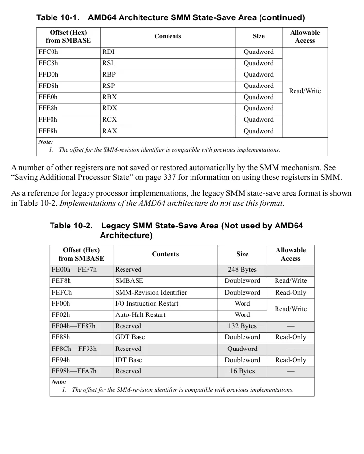

</details>


<!-- PDF source page: 393 | printed page: 331 -->

**Table 10-2. Legacy SMM State-Save Area (Not used by AMD64 Architecture) (continued)**

| Offset (Hex)<br>from SMBASE | Contents | Size | Allowable<br>Access |
| --- | --- | --- | --- |
| FFA8h | ES | Doubleword | Read-Only |
| FFACh | CS | Doubleword |  |
| FFB0h | SS | Doubleword |  |
| FFB4h | DS | Doubleword |  |
| FFB8h | FS | Doubleword |  |
| FFBCh | GS | Doubleword |  |
| FFC0h | LDT Base | Doubleword | Read-Only |
| FFC4h | TR | Doubleword |  |
| FFC8h | DR7 | Doubleword | Read-Only |
| FFCCh | DR6 | Doubleword |  |
| FFD0h | EAX | Doubleword | Read/Write |
| FFD4h | ECX | Doubleword |  |
| FFD8h | EDX | Doubleword |  |
| FFDCh | EBX | Doubleword |  |
| FFE0h | ESP | Doubleword |  |
| FFE4h | EBP | Doubleword |  |
| FFE8h | ESI | Doubleword |  |
| FFECh | EDI | Doubleword |  |
| FFF0h | EIP | Doubleword | Read/Write |
| FFF4h | EFLAGS | Doubleword | Read/Write |
| FFF8h | CR3 | Doubleword | Read-Only |
| FFFCh | CR0 | Doubleword |  |

> Note: 1. The offset for the SMM-revision identifier is compatible with previous implementations.

<a id="10-2-4-smm-revision-identifier"></a>

### 10.2.4 SMM-Revision Identifier

The SMM-revision identifier specifies the SMM version and the available SMM extensions implemented by the processor. Software reads the SMM-revision identifier from offset FEFCh in the SMM state-save area of SMRAM. This offset location is compatible with earlier versions of SMM. Software must not write to this location. Doing so can produce undefined results. Figure 10-3 on page 332 shows the format of the SMM-revision identifier.

<details>
<summary>Rendered source page 393 (figures/tables)</summary>

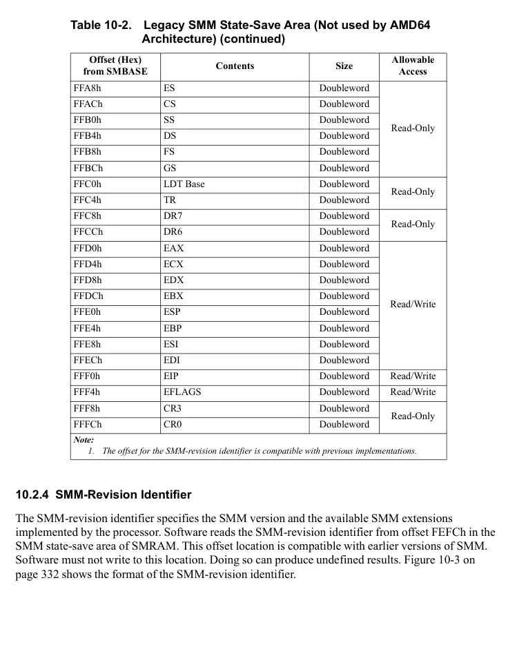

</details>


<!-- PDF source page: 394 | printed page: 332 -->

**Figure 10-3. SMM-Revision Identifier**

<details>
<summary>Extracted figure labels</summary>

```text
Reserved
Description
Bits
SMM-Revision Level
I/O Instruction Restart
SMM Base Relocation
15:0
16
17
0
15
16
17
31
18
1 1
SMM-Revision Level
513-251eps
```

</details>

The fields within the SMM-revision identifier are:

- *SMM-revision Level*—Bits 15:0. Specifies the version of SMM supported by the processor. The SMM-revision level is of the form 0_xx64h, where *xx* starts with 00 and is incremented for later revisions to the SMM mechanism.
- *I/O Instruction Restart*—Bit 16. When set to 1, the processor supports restarting I/O instructions that are interrupted by an SMI. This bit is always set to 1 by implementations of the AMD64 architecture. See “I/O Instruction Restart” on page 338 for information on using this feature.
- *SMM Base Relocation*—Bit 17. When set to 1, the processor supports relocation of SMRAM. This bit is always set to 1 by implementations of the AMD64 architecture. See “SMBASE Register” on page 326 for information on using this feature.

All remaining bits in the SMM-revision identifier are reserved.

<a id="10-2-5-smram-protected-areas"></a>

### 10.2.5 SMRAM Protected Areas

Two areas are provided as safe areas for SMM code and data that are not readily accessible by non-SMM applications. The SMI handler can be located in one of these two ranges, or it can be located outside of these ranges. The handler is placed in the desired range by setting SMBASE accordingly.

The ASeg range is located at a fixed address from A_0000h to B_FFFFh. The TSeg range is located at a variable base specified by the SMM_ADDR MSR with a variable size specified by the SMM_MASK MSR. These ranges must never overlap.

Each CPU memory access is in the TSeg range if the following is true:

Phys Addr[51:17] & SMM_MASK[51:17] = SMM_ADDR[51:17] & SMM_MASK[51:17].

For example, if the TSeg range spans 256 Kbytes starting at address 10_0000h, then SMM_ADDR =0010_0000h and SMM_MASK=FFFC_0000h. This results in a TSeg address range from 0010_0000

<details>
<summary>Rendered source page 394 (figures/tables)</summary>

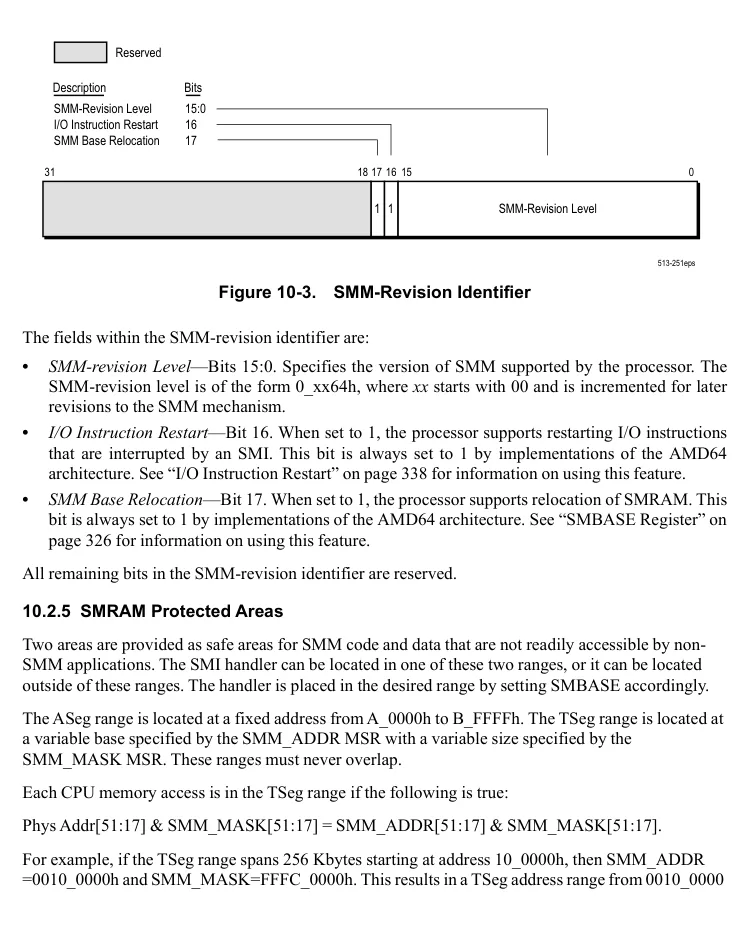

</details>


<!-- PDF source page: 395 | printed page: 333 -->

to 0013_FFFFh. The TSeg range must be aligned to a 128 Kbyte boundary and the minimum TSeg size is 128 Kbytes.

**Figure 10-4. SMM_ADDR Register Format**

<details>
<summary>Extracted figure labels</summary>

```text
63
52 51
32
Reserved
BASE[51:32]
31
17 16
0
BASE[31:17]
Reserved
Bits
Mnemonic
Description
Access type
63:52
Reserved
RAZ
51:17
BASE
SMM TSeg Base Address
R/W
16:0
Reserved
RAZ
```

</details>

- *SMM TSeg Base Address (BASE)—*Bits 51:17. Specifies the base address of the TSeg range of protected addresses.

63 52 51 32

Reserved MASK[51:32]

31 17 16 2 1 0

MASK[31:17] Reserved TE AE

**Bits Mnemonic Description Access type** 63:52 Reserved RAZ 51:17 MASK TSeg Mask R/W 16:2 Reserved RAZ 1 TE Tseg Address Range Enable R/W 0 AE Aseg Address Range Enable R/W

**Figure 10-5. SMM_MASK Register Format**

- *ASeg Address Range Enable (AE)*—Bit 0. Specifies whether the ASeg address range is enabled for protection. When the bit is set to 1, the ASeg address range is enabled for protection. When cleared to 0, the ASeg address range is disabled for protection.

<details>
<summary>Rendered source page 395 (figures/tables)</summary>

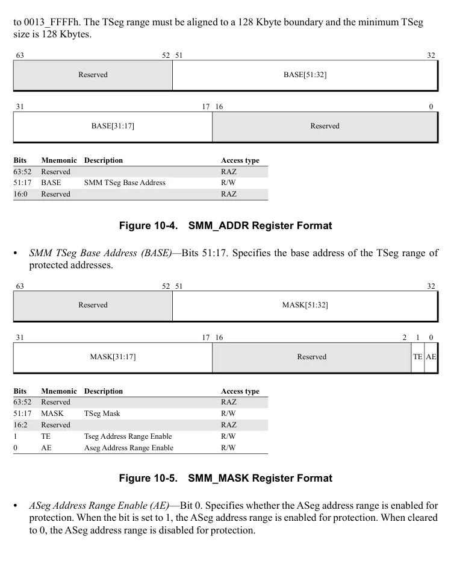

</details>


<!-- PDF source page: 396 | printed page: 334 -->

- *TSeg Address Range Enable (TE)*—Bit 1. Specifies whether the TSeg address range is enabled for protection. When the bit is set to 1, the TSeg address range is enabled for protection. When cleared to 0, the TSeg address range is disabled for protection.
- *TSeg Mask (MASK)—*Bits 51:17. Specifies the mask used to determine the TSeg range of protected addresses. The physical address is in the TSeg range if the following is true: Phys Addr[51:17] & SMM_MASK[51:17] = SMM_ADDR[51:17] & SMM_MASK[51:17].

Note that a processor is not required to implement all 52 bits of the physical address.

<a id="10-3-using-smm"></a>

## 10.3 Using SMM

<a id="10-3-1-system-management-interrupt-smi"></a>

### 10.3.1 System-Management Interrupt (SMI)

SMM is entered using the system-management interrupt (SMI). SMI is an external non-maskable interrupt that operates differently from and independently of other interrupts. SMI has priority over all other external interrupts, including NMI (see “Priorities” on page 264 for a list of the interrupt priorities). SMIs are disabled when in SMM, which prevents reentrant calls to the SMM handler.

When an SMI is received by the processor, the processor stops fetching instructions and waits for currently-executing instructions to complete and write their results. The SMI also waits for all buffered memory writes to update the caches or system memory. When these activities are complete, the processor uses implementation-dependent external signaling to acknowledge back to the system that it has received the SMI.

<a id="10-3-2-smm-operating-environment"></a>

### 10.3.2 SMM Operating-Environment

The SMM operating-environment is similar to real mode, except that the segment limits in SMM are 4 Gbytes rather than 64 Kbytes. This allows an SMM handler to address memory in the range from 0h to 0FFFF_FFFFh. As with real mode, segment-base addresses are restricted to 20 bits in SMM, and the default operand-size and address-size is 16 bits. To address memory locations above 1 Mbyte, the SMM handler must use the 32-bit operand-size-override and address-size-override prefixes.

After saving the processor state in the SMRAM state-save area, a processor running in SMM sets the segment-selector registers and control registers into a state consistent with real mode. Other registers are also initialized upon entering SMM, as shown in Table 10-3.

**Table 10-3. SMM Register Initialization**

| Register / CS | Register / Selecto | Initial SMM Contents / SMBASE right-shifted 4 bits |
| --- | --- | --- |
|  | Base | SMBASE |
|  | Limit | FFFF FFFFh |
|  | Att | Read-Write-Execute |

<details>
<summary>Rendered source page 396 (figures/tables)</summary>

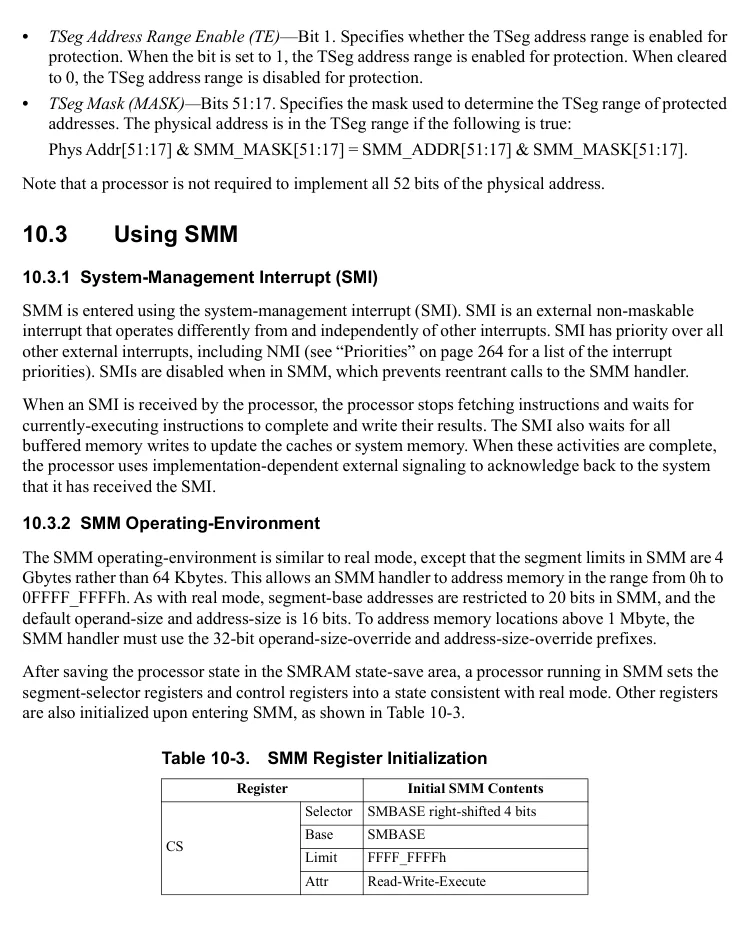

</details>


<!-- PDF source page: 397 | printed page: 335 -->

**Table 10-3. SMM Register Initialization (continued)**

| Register / DS, ES, FS, GS, SS | Register / Selecto | Initial SMM Contents / 0000h |
| --- | --- | --- |
|  | Base | 0000 0000 0000 0000h<br>_ _ _ |
|  | Limit | FFFF FFFFh |
|  | Att | Read-Write |
| RIP | Att | 0000 0000 0000 8000h<br>_ _ _ |
| RFLAGS | Att | 0000 0000 0000 0002h<br>_ _ _ |
| CR0 | Att | PE, EM, TS, PG bits cleared to 0.<br>All other bits are unmodified. |
| CR4 | Att | 0000 0000 0000 0000h<br>_ _ _ |
| DR7 | Att | 0000 0000 0000 0400h<br>_ _ _ |
| EFER | Att | 0000 0000 0000 0000h<br>_ _ _ |

<a id="10-3-3-exceptions-and-interrupts"></a>

### 10.3.3 Exceptions and Interrupts

All hardware interrupts are disabled upon entering SMM, but exceptions and software interrupts are not disabled. If necessary, the SMM handler can re-enable hardware interrupts. Software that handles interrupts in SMM should consider the following:

- *SMI*—If an SMI occurs while the processor is in SMM, it is latched by the processor. The latched SMI occurs when the processor leaves SMM.
- *NMI*—If an NMI occurs while the processor is in SMM, it is latched by the processor, but the NMI handler is not invoked until the processor leaves SMM with the execution of an RSM instruction. A pending NMI causes the handler to be invoked immediately after the RSM completes and before the first instruction in the interrupted program is executed. An SMM handler can unmask NMI interrupts by simply executing an IRET. Upon completion of the IRET instruction, the processor recognizes the pending NMI, and transfers control to the NMI handler. Once an NMI is recognized within SMM using this technique, subsequent NMIs are recognized until SMM is exited. Later SMIs cause NMIs to be masked, until the SMM handler unmasks them.
- *Exceptions*—Exceptions (internal processor interrupts) are not disabled and can occur while in SMM. Therefore, the SMM-handler software should be written to avoid generating exceptions.
- *Software Interrupts*—The software-interrupt instructions (BOUND, INT*n*, INT3, and INTO) can be executed while in SMM. However, it is not recommended that the SMM handler use these instructions.
- *Maskable Interrupts*—RFLAGS.IF is cleared to 0 by the processor when SMM is entered. Software can re-enable maskable interrupts while in SMM, but it must follow the guidelines listed below for handling interrupts.

<details>
<summary>Rendered source page 397 (figures/tables)</summary>

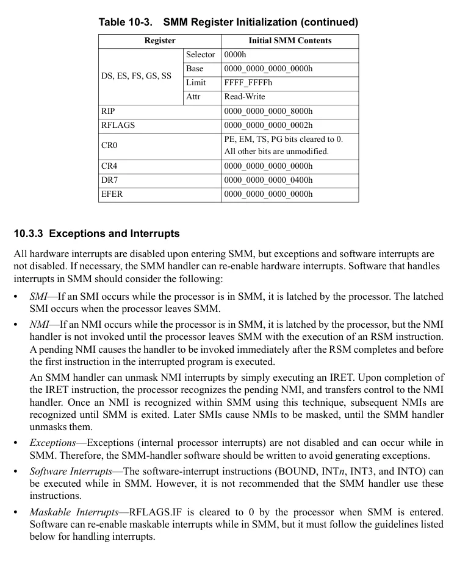

</details>


<!-- PDF source page: 398 | printed page: 336 -->

- *Debug Interrupts*—The processor disables the debug interrupts when SMM is entered by clearing DR7 to 0 and clearing RFLAGS.TF to 0. The SMM handler can re-enable the debug facilities while in SMM, but it must follow the guidelines listed below for handling interrupts.
- *INIT—*The processor does not recognize INIT while in SMM.

Because the RFLAGS.IF bit is cleared when entering SMM, the HLT instruction should not be executed in SMM without first setting the RFLAGS.IF bit to 1. Setting this bit to 1 allows the processor to exit the halt state by using an external maskable interrupt.

In the cases where an SMM handler must accept and handle interrupts and exceptions, several guidelines must be followed:

- Interrupt handlers must be loaded and accessible before enabling interrupts.
- A real-mode interrupt vector table located at virtual (linear) address 0 is required.
- Segments accessed by the interrupt handler cannot have a base address greater than 20 bits because of the real-mode addressing used in SMM. In SMM, the 16-bit value stored in the segment-selector register is left-shifted four bits to form the 20-bit segment-base address, like real mode.
- Only the IP (rIP[15:0]) is pushed onto the stack as a result of an interrupt in SMM, because of the real-mode addressing used in SMM. If the SMM handler is interrupted at a code-segment offset above 64 Kbytes, then the return address on the stack must be adjusted by the interrupt-handler, and a RET instruction with a 32-bit operand-size override must be used to return to the SMM handler.
- If the interrupt-handler is located below 1 Mbyte, and the SMM handler is located above 1 Mbyte, a RET instruction cannot be used to return to the SMM handler. In this case, the interrupt handler can adjust the return pointer on the stack, and use a far CALL to transfer control back to the SMM handler.

<a id="10-3-4-invalidating-the-caches"></a>

### 10.3.4 Invalidating the Caches

The processor can cache SMRAM-memory locations. If the system implements physically separate SMRAM and system memory, it is possible for SMRAM and system memory locations to alias into identical cache locations. In some processor implementations, the cache contents must be written to memory and invalidated when SMM is entered *and* exited. This prevents the processor from using previously-cached main-memory locations as aliases for SMRAM-memory locations when SMM is entered, and vice-versa when SMM is exited.

Implementations of the AMD64 architecture *do not require cache invalidation* when entering and exiting SMM. Internally, the processor keeps track of SMRAM and system-memory accesses separately and properly handles situations where aliasing occurs. Cached system memory and SMRAM locations can persist across SMM mode changes. Removal of the requirement to writeback and invalidate the cache simplifies SMM entry and exit and allows SMM code to execute more rapidly.


<!-- PDF source page: 399 | printed page: 337 -->

<a id="10-3-5-saving-additional-processor-state"></a>

### 10.3.5 Saving Additional Processor State

Several registers are not saved or restored automatically by the SMM mechanism. These are:

- The 128-bit media instruction registers.
- The 64-bit media instruction registers.
- The x87 floating-point registers.
- The page-fault linear-address register (CR2).
- The task-priority register (CR8).
- The debug registers, DR0, DR1, DR2, and DR3.
- The memory-type range registers (MTRRs).
- Model-specific registers (MSRs).

These registers are not saved because SMM handlers do not normally use or modify them. If an SMI results in a processor reset (due to powering down the processor, for example) or the SMM handler modifies the contents of the unsaved registers, the SMM handler should save and restore the original contents of those registers. The unsaved registers, along with those stored in the SMRAM state-save area, need to be saved in a non-volatile storage location if a processor reset occurs. The SMM handler should execute the CPUID instruction to determine the feature set available in the processor, and be able to save and restore the registers required by those features. For more information on using the CPUID instruction, see Section 3.3, “Processor Feature Identification,” on page 71.

The SMM handler can execute any of the 128-bit media, 64-bit media, or x87 instructions. A simple method for saving and restoring those registers is to use the FXSAVE and FXRSTOR instructions, respectively, if it is supported by the processor. See “Saving Media and x87 Execution Unit State” on page 349 for information on saving and restoring those registers.

Floating-point exceptions can occur when the SMM handler uses media or x87 floating-point instructions. If the SMM handler uses floating-point exception handlers, they must follow the usage guidelines established in “Exceptions and Interrupts” on page 335. A simple method for dealing with floating-point exceptions while in SMM is to simply mask all exception conditions using the appropriate floating-point control register. When the exceptions are masked, the processor handles floating-point exceptions internally in a default manner, and allows execution to continue uninterrupted.

<a id="10-3-6-operating-in-protected-mode-and-long-mode"></a>

### 10.3.6 Operating in Protected Mode and Long Mode

Software can enable protected mode from SMM and it can also enable and activate long mode. An SMM handler can use this capability to enter 64-bit mode and save additional processor state that cannot be accessed from outside 64-bit mode (for example, the most-significant 32 bits of CR2).

<a id="10-3-7-auto-halt-restart"></a>

### 10.3.7 Auto-Halt Restart

The auto-halt restart entry is located at offset FEC9h in the SMM state-save area. The size of this field is one byte, as compared with two bytes in previous versions of SMM.


<!-- PDF source page: 400 | printed page: 338 -->

When entering SMM, the processor loads the auto-halt restart entry to indicate whether SMM was entered from the halt state, as follows:

- Bit 0 indicates the processor state upon entering SMM:
- When set to 1, the processor entered SMM from the halt state.
- When cleared to 0, the processor did not enter SMM from the halt state.
- Bits 7:1 are cleared to 0.

The SMM handler can write the auto-halt restart entry to specify whether the return from SMM should take the processor back to the halt state or to the instruction-execution state specified by the SMM state-save area. The values written are:

- *Clear to 00h*—The processor returns to the state specified by the SMM state-save area.
- *Set to any non-zero value*—The processor returns to the halt state.

If the return from SMM takes the processor back to the halt state, the HLT instruction is not re-executed. However, the halt special bus-cycle is driven on the processor bus after the RSM instruction executes.

The result of entering SMM from a non-halt state and returning to a halt state is not predictable.

<a id="10-3-8-i-o-instruction-restart"></a>

### 10.3.8 I/O Instruction Restart

The I/O-instruction restart entry is located at offset FEC8h in the SMM state-save area. The size of this field is one byte, as compared with two bytes in previous versions of SMM. The I/O-instruction restart mechanism is supported when the I/O-instruction restart bit (bit 16) in the SMM-revision identifier is set to 1. This bit is always set to 1 in the AMD64 architecture.

When an I/O instruction is interrupted by an SMI, the I/O-instruction restart entry specifies whether the interrupted I/O instruction should be re-executed following an RSM that returns from SMM. Re-executing a trapped I/O instruction is useful, for example, when an I/O write is performed to a powered-down disk drive. When this occurs, the system logic monitoring the access can issue an SMI to have the SMM handler power-up the disk drive and retry the I/O write. The SMM handler does this by querying system logic and detecting the failed I/O write, asking system logic to initiate the disk-drive power-up sequence, enabling the I/O instruction restart mechanism, and returning from SMM. Upon returning from SMM, the I/O write to the disk drive is restarted.

When an SMI occurs, the processor always clears the I/O-instruction restart entry to 0. If the SMI interrupted an I/O instruction, then the SMM handler can modify the I/O-instruction restart entry as follows:

- *Clear to 00h (default value)*—The I/O instruction is not restarted, and the instruction following the interrupted I/O-instruction is executed. When a REP (repeat) prefix is used with an I/O instruction, it is possible that the next instruction to be executed is the next I/O instruction in the repeat loop.
- *Set to any non-zero value*—The I/O instruction is restarted.


<!-- PDF source page: 401 | printed page: 339 -->

While in SMM, the handler must determine the cause of the SMI and examine the processor state at the time the SMI occurred to determine whether or not an I/O instruction was interrupted. Implementations provide state information in the SMM save-state area to assist in this determination:

- I/O Instruction Restart DWORD—indicates whether the SMI interrupted an I/O instruction, and saves extra information describing the I/O instruction.
- I/O Instruction Restart RIP—the RIP of the interrupted I/O instruction.
- I/O Instruction Restart RCX—the RCX of the interrupted I/O instruction.
- I/O Instruction Restart RSI—the RSI of the interrupted I/O instruction.
- I/O Instruction Restart RDI—the RDI of the interrupted I/O instruction.

**Figure 10-6. I/O Instruction Restart Dword**

<details>
<summary>Extracted figure labels</summary>

```text
31
16 15 14 13 12 11 10
9
8
7
6
5
4
3
2
1
0
PORT
TYPE
SZ32
SZ16
VAL
REP
STR
PORT
A64
A32
A16
SZ8
B3
B2
B1
B0
TF
```

</details>

The fields in the I/O Instruction Restart DWORD are as follows:

- B3—DR6.B3 status
- B2—DR6.B2 status
- B1—DR6.B1 status
- B0 —DR6.B0 status
- TF—The I/O instruction was interrupted with Single Stepping (EFLAGS.TF = 1)
- PORT—Intercepted I/O port
- A64—64-bit address
- A32—32-bit address
- A16—16-bit address
- SZ32—32-bit I/O port size
- SZ16—16-bit I/O port size
- SZ8—8-bit I/O port size
- REP—Repeated port access
- STR—String based port access (INS, OUTS)
- VAL—Valid (SMI was detected during an I/O instruction.)
- TYPE—Access type (0 = OUT instruction, 1 = IN instruction).

<a id="10-3-9-smm-page-configuration-lock"></a>

### 10.3.9 SMM Page Configuration Lock

The SMM Page Configuration Lock feature allows the SMM handler to lock the paging configuration. The feature is enabled by setting HWCR.SMM_PGCFG_LOCK=1 (bit 33). Once locked, the paging

<details>
<summary>Rendered source page 401 (figures/tables)</summary>

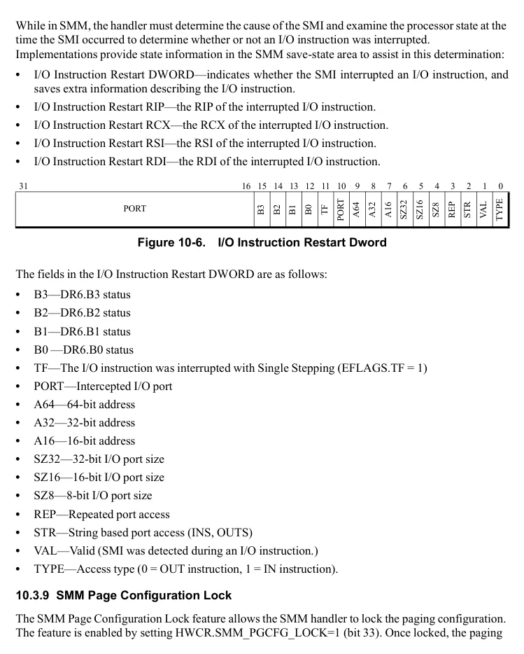

</details>


<!-- PDF source page: 402 | printed page: 340 -->

configuration cannot be modified until SMM is exited using the RSM instruction. The processor clears HWCR.SMM_PGCFG_LOCK when completing the RSM instruction. If page configuration locking is needed when the processor enters SMM again in the future, HWCR.SMM_PGCFG_LOCK must be set again by the SMM handler.

When SMM Page Configuration Lock is enabled, the following will result in a #GP exception:

- Writing Extended Feature Register (EFER) using the WRMSR instruction.
- Writing CR0, CR3, or CR4 using the MOV CRn instruction.

Attempting to set HWCR.SMM_PGCFG_LOCK when not in SMM results in a #GP exception. Before setting HWCR.SMM_PGCFG_LOCK, system software must verify the processor supports the SMM Page Configuration Lock feature by checking that CPUID Fn8000_0021_EAX[SmmPgCfgLock] (bit 3) = 1. For more information on using the CPUID instruction see Section 3.3, “Processor Feature Identification,” on page 71.

<a id="10-4-leaving-smm"></a>

## 10.4 Leaving SMM

Software leaves SMM and returns to the interrupted program by executing the RSM instruction. RSM causes the processor to load the interrupted state from the SMRAM state-save area and then transfer control back to the interrupted program. RSM cannot be executed in any mode other than SMM, otherwise an invalid-opcode exception (#UD) occurs.

An RSM causes a processor shutdown if an invalid-state condition is found in the SMRAM state-save area. Only an external reset, external processor-initialization, or non-maskable external interrupt (NMI) can cause the processor to leave the shutdown state. The invalid SMRAM state-save-area conditions that can cause a processor shutdown during an RSM are:

- CR0.PE=0 and CR0.PG=1.
- CR0.CD=0 and CR0.NW=1.
- Certain reserved bits are set to 1, including:
- Any CR0 bit in the range 63:32 is set to 1.
- Any unsupported bit in CR3 is set to 1.
- Any unsupported bit in CR4 is set to 1.
- Any DR6 bit or DR7 bit in the range 63:32 is set to 1.
- Any unsupported bit in EFER is set to 1.
- Invalid returns to long mode, including:
- EFER.LME=1, CR0.PG=1, and CR4.PAE=0.
- EFER.LME=1, CR0.PG=1, CR4.PAE=1, CS.L=1, and CS.D=1.
- The SSM revision identifier is modified.


<!-- PDF source page: 403 | printed page: 341 -->

Some SMRAM state-save-area conditions are ignored, and the registers, or bits within the registers, are restored in a default manner by the processor. This avoids a processor shutdown when an invalid condition is stored in SMRAM. The default conditions restored by the processor are:

- The EFER.LMA register bit is set to the value obtained by logically ANDing the SMRAM values of EFER.LME, CR0.PG, and CR4.PAE.
- The RFLAGS.VM register bit is set to the value obtained by logically ANDing the SMRAM values of RFLAGS.VM, CR0.PE, and the inverse of EFER.LMA.
- The base values of FS, GS, GDTR, IDTR, LDTR, and TR are restored in canonical form. Those values are sign-extended to bit 63 using the most-significant implemented bit.
- Unimplemented segment-base bits in the CS, DS, ES, and SS registers are cleared to 0.
- SSP is canonicalized (i.e., sign-extended to bit 63).

<a id="10-5-multiprocessor-considerations"></a>

## 10.5 Multiprocessor Considerations

For multiprocessor operation, each logical processor must be given a separate SMBASE value so that the save-state areas do not overlap. For systems with fewer than 64 logical processors it is sufficient to stagger the SMBASE values by 512 bytes. Note that this also offsets the SMI entry point by the same amount for each processor. With 64 or more logical processors, the entry points will start to collide with the save-state areas. Staggering the SMBASE values by 1024 bytes results in 512-byte entry point areas interleaved with the 512-byte state-save areas, and so provides scaling beyond 63 logical processors.

Further details on multiprocessor aspects of SMM may be found in the *BIOS and Kernel Developer’s Guide (BKDG)* or *Processor Programming Reference Manual (PPR)* for a given processor family.
