<!-- PDF source page: 404 | printed page: 342 -->

<a id="11-sse-mmx-and-x87-programming"></a>

# 11 SSE, MMX, and x87 Programming

This chapter describes the system-software implications of supporting applications that use the Streaming SIMD Extensions (SSE), MMX™, and x87 instructions. Throughout this chapter, these instructions are collectively referred to as *media and x87* (media/x87) instructions. A complete listing of the instructions that fall in this category—and the detailed operation of each instruction—can be found in volumes 4 and 5. Refer to Volume 1 for information on using these instructions in application software.

The SSE instruction set is comprised of the *legacy SSE* instruction set which includes the SSE1, SSE2, SSE3, SSSE3, SSE4A, SSE4.1, and SSE4.2 subsets and the *extended SSE* instruction set which includes the AVX, FMA4, XOP, and AVX512 subsets. Many of the extended SSE instructions support both 128-bit and 256-bit data types.

<a id="11-1-overview-of-system-software-considerations"></a>

## 11.1 Overview of System-Software Considerations

Processor implementations can support different combinations of the SSE, MMX, and x87 instruction sets. Two sets of registers—independent of the general-purpose registers—support these instructions. The SSE instructions operate on the ZMM/YMM/XMM registers, and the 64-bit media and x87-instructions operate on the aliased MMX/x87 registers. The SSE and x87 floating-point instruction sets have distinct status registers, control registers, exception vectors, and system-software control bits for managing the operating environment. System software that supports use of these instructions must be able to manage these resources properly including:

- Detecting support for the instruction set, and enabling any optional features, as necessary.
- Saving and restoring the processor media or x87 state.
- Execution of floating-point instructions (media or x87) can produce exceptions. System software must supply exception handlers for all unmasked floating-point exceptions.

<a id="11-2-determining-media-and-x87-feature-support"></a>

## 11.2 Determining Media and x87 Feature Support

Support for the architecturally defined subsets within the media and x87 instructions is implementation dependent. System software executes the CPUID instruction to determine whether a processor implements any of these features (see Section 3.3, “Processor Feature Identification,” on page 71 for more information on using the CPUID instruction). After CPUID is executed feature support can be determined by examining specific bit fields returned in the EAX, ECX, and EDX registers.

The following table summarizes the architecturally defined SSE subsets and state management instructions and gives the feature bits returned by the CPUID function. If the indicated bit is set, the feature is supported by the processor.


<!-- PDF source page: 405 | printed page: MMX -->

**Table 11-5. SSE Subsets – CPUID Feature Identifiers**

| CPUID Fn | Field Name | Field Bit | Instruction Subset |
| --- | --- | --- | --- |
| Legacy SSE |  |  |  |
| 0000 0001h | EDX[SSE] | EDX[25] | Original Streaming SIMD Extensions (SSE1) |
| 0000 0001h | EDX[SSE2] | EDX[26] | SSE2 |
| 0000 0001h | ECX[SSE3] | ECX[0] | SSE3 |
| 0000 0001h | ECX[SSSE3] | ECX[9] | SSSE3 |
| 0000 0001h | ECX[SSE41] | ECX[19] | SSE4.1 |
| 0000 0001h | ECX[SSE42] | ECX[20] | SSE4.2 |
| 8000 0001h | ECX[SSE4A] | ECX[6] | SSE4A: EXTRQ, INSERTQ, MOVNTSS, and<br>MOVNTSD instructions |
| Extended SSE | ECX[SSE4A] | ECX[6] |  |
| 0000 0001h | ECX[AVX] | ECX[28] | AVX |
| 8000 0001h | ECX[XOP] | ECX[11] | AMD XOP |
| 0000 0001h | ECX[FMA] | ECX[12] | FMA |
| 8000 0001h | ECX[FMA4] | ECX[16] | AMD FMA4 |
| MMX | ECX[FMA4] | ECX[16] |  |
| 0000 0001h or<br>8000 0001h | EDX[MMX] | EDX[23] | Original MMX™ Instructions |
| 8000 0001h | EDX[MmxExt] | EDX[22] | AMD Extensions to MMX |
| 8000 0001h | EDX[3DNow] | EDX[31] | AMD 3DNow!™ |
| 8000 0001h | EDX[3DNowExt] | EDX[30] | AMD Extensions to 3DNow! |
| x87 | EDX[3DNowExt] | EDX[30] |  |
| 0000 0001h or<br>8000 0001h | EDX[FPU] | EDX[0] | x87 instruction set and facilities |
| Context Management Instructions | EDX[FPU] | EDX[0] |  |
| 0000 0001h or<br>8000 0001h | EDX[FXSR] | EDX[24] | FXSAVE / FXRSTOR instructions |
| 8000 0001h | EDX[FFXSR] | EDX[25] | Hardware optimizations for FXSAVE / FXRSTOR |
| 0000 0001h | ECX[XSAVE] | ECX[26] | XSAVE / XRSTOR instructions |
| 0000 000Dh<br>ECX=01h | EAX[XSAVEOPT] | EAX[0] | XSAVEOPT |

Some instructions may be listed in more than one subset. If software attempts to execute an instruction belonging to an unsupported instruction subset, an invalid-opcode exception (#UD) occurs. Refer to Appendix D, “Instruction Subsets and CPUID Feature Flags” in Volume 3 for specific information.

<details>
<summary>Rendered source page 405 (figures/tables)</summary>

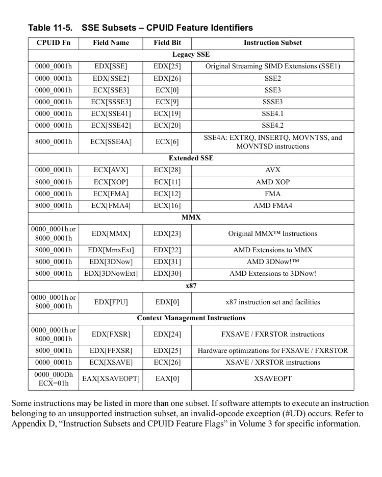

</details>


<!-- PDF source page: 406 | printed page: 344 -->

<a id="11-3-enabling-sse-instructions"></a>

## 11.3 Enabling SSE Instructions

Use of the 512-bit, 256-bit, and 128-bit media instructions by application software requires system software support. System software must determine which SSE subsets are supported, enable those that are to be used, and supply code to handle the various exceptions that may occur during the execution of these instructions. The legacy SSE instructions and the extended SSE instructions often require unique exception handling.

<a id="11-3-1-enabling-legacy-sse-instruction-execution"></a>

### 11.3.1 Enabling Legacy SSE Instruction Execution

When legacy SSE instructions are supported, system software must set CR4.OSFXSR to let the processor know that the software supports the FXSAVE/FXRSTOR instructions. When the processor detects CR4.OSFXSR = 1, it allows execution of the legacy SSE instructions. If system software does not set CR4.OSFXSR, any attempt to execute these instructions causes an invalid-opcode exception (#UD). System software must also *clear* the CR0.EM (emulate coprocessor) bit to 0, otherwise an attempt to execute a legacy SSE instruction causes a #UD exception. An attempt to execute either FXSAVE or FXRSTOR when CR0.EM is set results in a #NM exception.

System software should also *set* the CR0.MP (monitor coprocessor) bit to 1. When CR0.EM=0 and CR0.MP=1, all media instructions, x87 instructions, and the FWAIT/WAIT instructions cause a device-not-available exception (#NM) when the CR0.TS bit is set. System software can use the #NM exception to perform lazy context switching, saving and restoring media and x87 state only when necessary after a task switch. See “CR0 Register” on page 41 for more information.

<a id="11-3-2-enabling-extended-sse-instruction-execution"></a>

### 11.3.2 Enabling Extended SSE Instruction Execution

After the steps specified above are completed to enable legacy SSE instruction execution, additional steps are required to enable the extended SSE instructions and state management. System software must carry out the following process:

- Confirm that the hardware supports the XSAVE, XRSTOR, XSETBV, and XGETBV instructions and the XCR0 register (XFEATURE_ENABLED_MASK) by executing the CPUID instruction function 0000_0001h. If CPUID Fn0000_0001_ECX[XSAVE] is set, hardware support is verified.
- Optionally confirm hardware support of the XSAVEOPT instruction by executing CPUID function 0000_000Dh, sub-function 1 (ECX = 1). If CPUID Fn0000_000D_EAX_x1[XSAVEOPT] is set, the processor supports the XSAVEOPT instruction. XSAVEOPT is a performance optimized version of XSAVE.
- Confirm that hardware supports the extended SSE instructions by verifying XFeatureSupportedMask[2:0] = 111b. XFeatureSupportedMask is accessed via the CPUID instruction function 0000_000Dh, sub-function 0 (ECX = 0). XFeatureSupportedMask[31:0] is returned in the EAX register. If CPUID Fn0000_000D_EAX_x0[2:0] = 111b, hardware supports x87, legacy SSE, and extended SSE instructions. Bit 0 of EAX signifies x87 floating-point and MMX support, bit 1 signifies legacy SSE support, and bit 2 signifies extended SSE support. Support for both x87 and legacy SSE instructions are required for processors that support the extended SSE instructions.


<!-- PDF source page: 407 | printed page: MMX -->

- Set CR4[OSXSAVE] (bit 18) to enable the use of the XSETBV and XGETBV instructions. XSETBV is a privileged instruction that writes the XCRn registers. XCR0 is the XFEATURE_ENABLED_MASK used to manage media and x87 processor state using the XSAVE, XSAVEOPT, and XRSTOR instructions.
- Enable the x87/MMX, legacy SSE, and extended SSE instructions and processor state management by setting the x87, SSE, and YMM bits of XCR0 (XFEATURE_ENABLED_MASK). This is done via the privileged instruction XSETBV. Enabling extended SSE capabilities without enabling legacy SSE capabilities is not allowed. The x87 flag (bit 0) of the XFEATURE_ENABLED_MASK must be set when writing XCR0.
- Determine the XSAVE/XRSTOR memory save area size requirement. The field XFeatureEnabledSizeMax specifies the size requirement in bytes based on the currently enabled extended features and is returned in the EBX register after execution of CPUID Function 0000_000Dh, sub-function 0 (ECX = 0).
- Allocate the save/restore area based on the information obtained in the previous step.

For a detailed description of the XSETBV and XGETBV instructions, see individual instruction reference pages in Volume 4. See the section entitled “XFEATURE_ENABLED_MASK” in Volume 4 for details on the field definitions for XFEATURE_ENABLED_MASK.

For more information on using the CPUID instruction to obtain processor feature information, see Section 3.3, “Processor Feature Identification,” on page 71.

<a id="11-3-3-simd-floating-point-exception-handling"></a>

### 11.3.3 SIMD Floating-Point Exception Handling

System software must supply an exception handler if unmasked SSE floating-point exceptions are allowed to occur. When an unmasked exception is detected, the processor transfers control to the SIMD floating-point exception (#XF) handler provided by the operating system. System software must let the processor know that the #XF handler is available by setting CR4.OSXMMEXCPT to 1. If this bit is set to 1, the processor transfers control to the #XF handler when it detects an unmasked exception, otherwise a #UD exception occurs. When the processor detects a masked exception, it handles it in a default manner regardless of the CR4.OSXMMEXCPT value.

<a id="11-4-media-and-x87-processor-state"></a>

## 11.4 Media and x87 Processor State

The media and x87 processor state includes the contents of the registers used by SSE, MMX, and x87 instructions. System software that supports such applications must be capable of saving and restoring these registers.

<a id="11-4-1-sse-execution-unit-state"></a>

### 11.4.1 SSE Execution Unit State

Figure 11-1 shows registers whose contents are affected by execution of SSE instructions, including:

- ZMM/YMM/XMM0-31—Thirty-two 512-bit/256-bit/128-bit SSE registers. In legacy and compatibility modes, software access is limited to the first eight registers.
- MXCSR—The 32-bit Media eXtensions Control and Status Register.


<!-- PDF source page: 408 | printed page: 346 -->

All of these registers are visible to application software. Refer to “Streaming SIMD Extensions Media and Scientific Programming” in Volume 1 for more information on these registers.

**Figure 11-1. SSE Execution Unit State**

<details>
<summary>Extracted figure labels</summary>

```text
255
0
127
511
XMM0
XMM1
XMM2
XMM3
XMM4
XMM5
XMM6
XMM7
XMM8
XMM9
XMM10
XMM11
XMM12
XMM13
XMM14
XMM15
YMM0
YMM1
YMM2
YMM3
YMM4
YMM5
YMM6
YMM7
YMM8
YMM9
YMM10
YMM11
YMM12
YMM13
YMM14
YMM15
ZMM/YMM/XMM0
ZMM/YMM/XMM1
ZMM/YMM/XMM2
ZMM/YMM/XMM3
ZMM/YMM/XMM4
ZMM/YMM/XMM5
ZMM/YMM/XMM6
ZMM/YMM/XMM7
ZMM/YMM/XMM8
ZMM/YMM/XMM9
ZMM/YMM/XMM10
ZMM/YMM/XMM11
ZMM/YMM/XMM12
ZMM/YMM/XMM13
ZMM/YMM/XMM14
ZMM/YMM/XMM15
ZMM0
ZMM1
ZMM2
ZMM3
ZMM4
ZMM5
ZMM6
ZMM7
ZMM8
ZMM9
ZMM10
ZMM11
ZMM12
ZMM13
ZMM14
ZMM15
XMM16
XMM17
XMM18
XMM19
XMM20
XMM21
XMM22
XMM23
XMM24
XMM25
XMM26
XMM27
XMM28
XMM29
XMM30
XMM31
Mask Registers
k0
k1
k2
k3
k4
k5
k6
k7
ZMM16
ZMM17
ZMM18
ZMM19
ZMM20
ZMM21
ZMM22
ZMM23
ZMM24
ZMM25
ZMM26
ZMM27
ZMM28
ZMM29
ZMM30
ZMM31
YMM16
YMM17
YMM18
YMM19
YMM20
YMM21
YMM22
YMM23
YMM24
YMM25
YMM26
YMM27
YMM28
YMM29
YMM30
YMM31
ZMM/YMM/XMM16
ZMM/YMM/XMM17
ZMM/YMM/XMM18
ZMM/YMM/XMM19
ZMM/YMM/XMM20
ZMM/YMM/XMM21
ZMM/YMM/XMM22
ZMM/YMM/XMM23
ZMM/YMM/XMM24
ZMM/YMM/XMM25
ZMM/YMM/XMM26
ZMM/YMM/XMM27
ZMM/YMM/XMM28
ZMM/YMM/XMM29
ZMM/YMM/XMM30
ZMM/YMM/XMM31
63
0
Media eXtension Control and Status Register
MXCSR
31
0
Available in all modes
Available only in 64-bit mode
```

</details>

<details>
<summary>Rendered source page 408 (figures/tables)</summary>

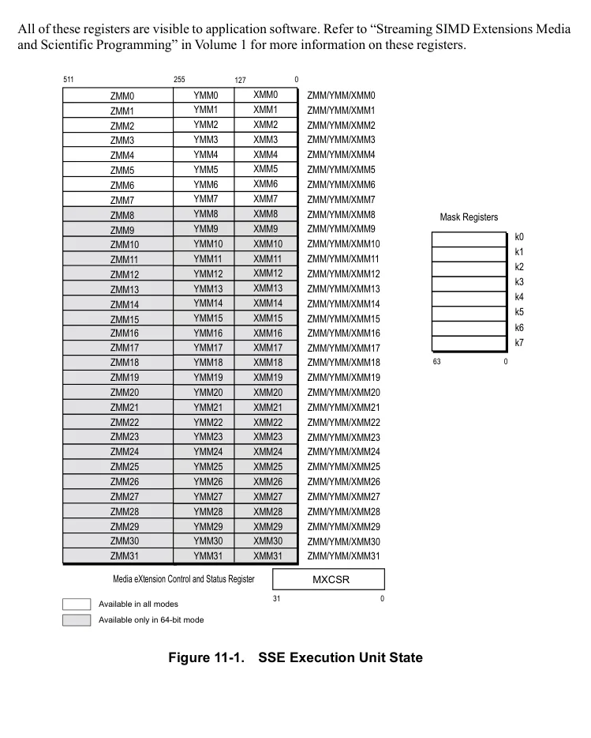

</details>


<!-- PDF source page: 409 | printed page: MMX -->

<a id="11-4-2-mmx-execution-unit-state"></a>

### 11.4.2 MMX Execution Unit State

Figure 11-2 on page 347 shows register contents that are affected by execution of 64-bit media instructions, including:

**Figure 11-2. MMX Execution Unit State**

<details>
<summary>Extracted figure labels</summary>

```text
•
mmx0–mmx7—Eight 64-bit media registers.
•
FSW—Two fields (TOP and ES) in the 16-bit x87 status word register.
•
FTW—The 16-bit x87 tag word.
MMX Registers
79
0
63
64
MMX0
FPR0
MMX1
FPR1
MMX2
FPR2
MMX3
FPR3
MMX4
FPR4
MMX5
FPR5
MMX6
FPR6
MMX7
FPR7
ES
TOP
Visible to application
software
x87 Status Word
FSW
Written by processor
hardware
FTW
x87 Tag Word
0
15
```

</details>

The 64-bit media instructions and x87 floating-point instructions share the same physical data registers. Figure 11-2 shows how the 64-bit registers (MMX0–MMX7) are aliased onto the low 64 bits of the 80-bit x87 floating-point physical data registers (FPR0–FPR7). Refer to “64-Bit Media Programming” in Volume 1 for more information on these registers.

Of the registers shown in Figure 11-2, only the eight 64-bit MMX registers are visible to 64-bit media application software. The processor maintains the contents of the two fields of the x87 status word— top-of-stack-pointer (TOP) and exception summary (ES)—and the 16-bit x87 tag word during execution of 64-bit media instructions, as described in “Actions Taken on Executing 64-Bit Media Instructions” in Volume 1.

64-bit media instructions do not generate x87 floating-point exceptions, nor do they set any status flags. However, 64-bit media instructions can trigger an unmasked floating-point exception caused by

<details>
<summary>Rendered source page 409 (figures/tables)</summary>

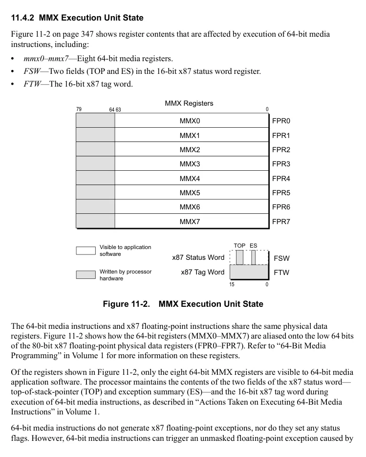

</details>


<!-- PDF source page: 410 | printed page: 348 -->

a previously executed x87 instruction. 64-bit media instructions do this by reading the x87 FSW.ES bit to determine whether such an exception is pending.

<a id="11-4-3-x87-execution-unit-state"></a>

### 11.4.3 x87 Execution Unit State

Figure 11-3 on page 349 shows the registers whose contents are affected by execution of x87 floating-point instructions. These registers include:

- *fpr0–fpr7*—Eight 80-bit floating-point physical registers.
- *FCW*—The 16-bit x87 control word register.
- *FSW*—The 16-bit x87 status word register.
- *FTW*—The 16-bit x87 tag word.
- *Last x87 Instruction Pointer*—This value is a pointer (32-bit, 48-bit, or 64-bit, depending on effective operand size and mode) to the last non-control x87 floating-point instruction executed.
- *Last x87 Data Pointer*—The pointer (32-bit, 48-bit, or 64-bit, depending on effective operand size and mode) to the data operand referenced by the last non-control x87 floating-point instruction executed, if that instruction referenced memory; if it did not, then this value is implementation dependent.
- *Last x87 Opcode*—An 11-bit permutation of the instruction opcode from the last non-control x87 floating-point instruction executed.

Of the registers shown in Figure 11-3 on page 349, only FPR0–FPR7, FCW, and FSW are directly updated by x87 application software. The processor maintains the contents of the FTW, instruction and data pointers, and opcode registers during execution of x87 instructions. Refer to “Registers” in Volume 1 for more information on these registers.

The 11-bit instruction opcode register holds a permutation of the two-byte instruction opcode from the last non-control x87 instruction executed by the processor. (For a definition of *non-control x87 instruction*, see “Control” in Chapter 6 of Volume 1.) The opcode field is formed as follows:

- Opcode Register Field[10:8] = First x87 opcode byte[2:0].
- Opcode Register Field[7:0] = Second x87 opcode byte[7:0].

For example, the x87 opcode D9 F8h is stored in the opcode register as 001_1111_1000b. The low-order three bits of the first opcode byte, D9h (1101_1001b), are stored in opcode-register bits 10:8. The second opcode byte, F8h (1111_1000b), is stored in bits 7:0 of the opcode register. The high-order five bits of the first opcode byte (1101_1b) are not needed because they are identical for all x87 instructions.


<!-- PDF source page: 411 | printed page: MMX -->

**Figure 11-3. x87 Execution Unit State**

<details>
<summary>Extracted figure labels</summary>

```text
x87 Floating-Point Registers
79
0
FPR0
FPR1
FPR2
FPR3
FPR4
FPR5
FPR6
FPR7
x87 Control Word
FCW
Control Word
x87 Status Word
FSW
Status Word
FTW
x87 Tag Word
Tag Word
0
15
Last x87 Instruction Pointer
Last x87 Data Pointer
63
Opcode
0
10
```

</details>

<a id="11-4-4-saving-media-and-x87-execution-unit-state"></a>

### 11.4.4 Saving Media and x87 Execution Unit State

In most cases, operating systems, exception handlers, and device drivers should save and restore the media and/or x87 processor state between task switches or other interventions in the execution of 128-bit, 64-bit, or x87 procedures. Application programs are also free to save and restore state at any time.

In general, system software should use the FXSAVE and FXRSTOR instructions to save and restore the entire media and x87 processor state. The FSAVE/FNSAVE and FRSTOR instructions can be used for saving and restoring the x87 state. Because the 64-bit media registers are physically aliased onto the x87 registers, the FSAVE/FNSAVE and FRSTOR instructions can also be used to save and restore the 64-bit media state. However, FSAVE/FNSAVE and FRSTOR do not save or restore the 128-bit media state.

<details>
<summary>Rendered source page 411 (figures/tables)</summary>

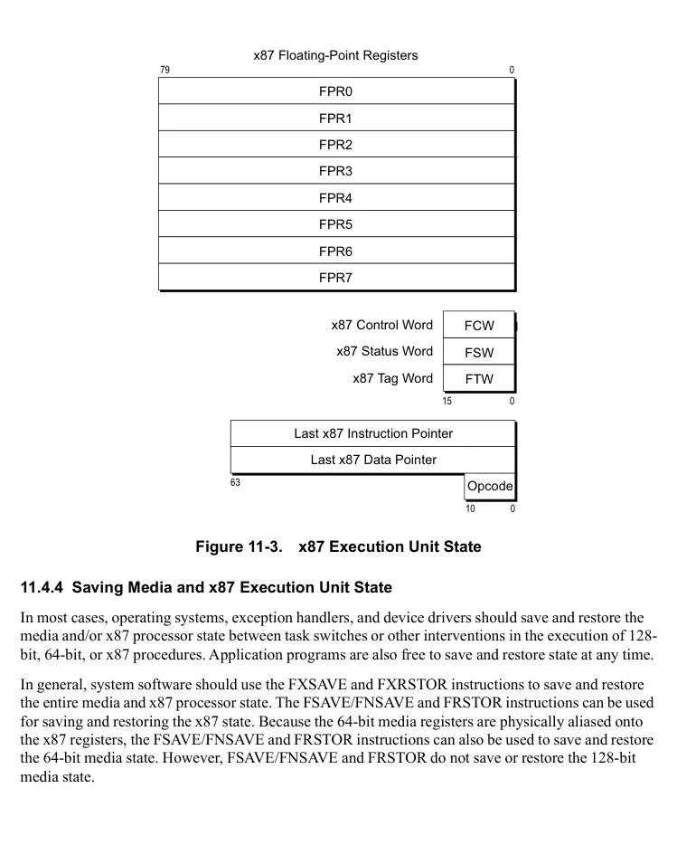

</details>


<!-- PDF source page: 412 | printed page: 350 -->

1. 11. 4.4.1 FSAVE/FNSAVE and FRSTOR Instructions**

The FSAVE/FNSAVE and FRSTOR instructions save and restore the entire register state for 64-bit media instructions and x87 floating-point instructions. The FSAVE instruction stores the register state, but only after handling any pending unmasked-x87 floating-point exceptions. The FNSAVE instruction stores the register state but skips the reporting and handling of these exceptions. The state of all MMX/FPR registers is saved, as well as all other x87 state (the control word register, status word register, tag word, instruction pointer, data pointer, and last opcode). After saving this state, the tag state for all MMX/FPR registers is changed to *empty* and is thus available for a new procedure.

Starting on page 351, Figure 11-4 through Figure 11-7 show the memory formats used by the FSAVE/FNSAVE and FRSTOR instructions when storing the x87 state in various processor modes and using various effective-operand sizes. This state includes:

- *x87 Data Registers*
- FPR0–FPR7 80-bit physical data registers.
- *x87 Environment*
- FCW: x87 control word register
- FSW: x87 status word register
- FTW: x87 tag word
- Last x87 instruction pointer
- Last x87 data pointer
- Last x87 opcode

The eight data registers are stored in the 80 bytes following the environment information. Instead of storing these registers in their physical order (FPR0–FPR7), the processor stores the registers in the their stack order, ST(0)–ST(7), beginning with the top-of-stack, ST(0).


<!-- PDF source page: 413 | printed page: MMX -->

**Figure 11-4. FSAVE/FNSAVE Image (32-Bit, Protected Mode)**

<details>
<summary>Extracted figure labels</summary>

```text
Bit Offset
Byte
Offset
31
16
15
0
ST(7)[79:48]
+68h
¼
ST(1)[15:0]
ST(0)[79:64]
¼
ST(0)[63:32]
¼
ST(0)[31:0]
+1Ch
Reserved, IGN
Data DS Selector[15:0]
+18h
Data Offset[31:0]
+14h
00000b
Instruction Opcode[10:0]
Instruction CS Selector[15:0]
+10h
Instruction Offset[31:0]
+0Ch
Reserved, IGN
x87 Tag Word (FTW)
+08h
Reserved, IGN
x87 Status Word (FSW)
+04h
Reserved, IGN
x87 Control Word (FCW)
+00h
```

</details>

<details>
<summary>Rendered source page 413 (figures/tables)</summary>

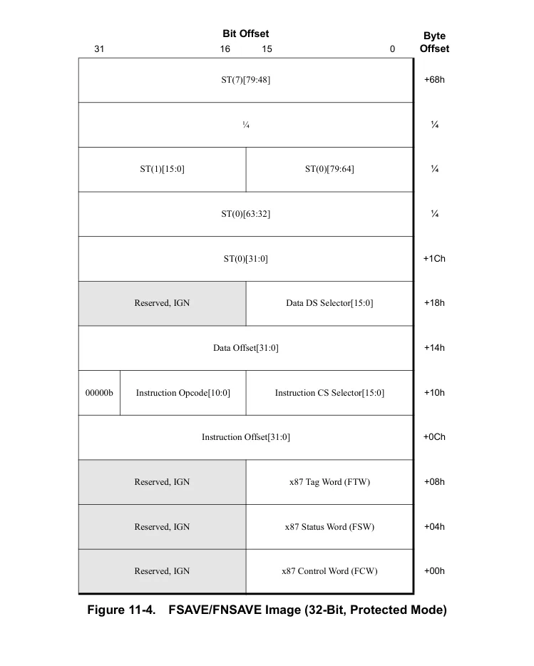

</details>


<!-- PDF source page: 414 | printed page: 352 -->

**Figure 11-5. FSAVE/FNSAVE Image (32-Bit, Real/Virtual-8086 Modes)**

<details>
<summary>Extracted figure labels</summary>

```text
Bit Offset
Byte
Offset
31
16
15
0
ST(7)[79:48]
+68h
¼
ST(1)[15:0]
ST(0)[79:64]
¼
ST(0)[63:32]
¼
ST(0)[31:0]
+1Ch
0000b
Data Offset[3:16]
0000 0000 0000b
+18h
Reserved, IGN
Data Offset[15:0]
+14h
0000b
Instruction Offset[31:16]
0
Instruction Opcode[10:0]
+10h
Reserved, IGN
Instruction Offset[15:0]
+0Ch
Reserved, IGN
x87 Tag Word (FTW)
+08h
Reserved, IGN
x87 Status Word (FSW)
+04h
Reserved, IGN
x87 Control Word (FCW)
+00h
```

</details>

<details>
<summary>Rendered source page 414 (figures/tables)</summary>

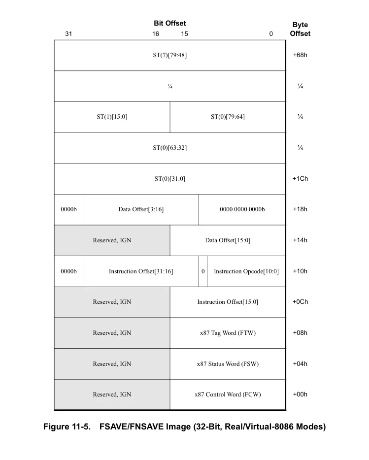

</details>


<!-- PDF source page: 415 | printed page: MMX -->

**Figure 11-6. FSAVE/FNSAVE Image (16-Bit, Protected Mode)**

<details>
<summary>Extracted figure labels</summary>

```text
Bit Offset
Byte
Offset
31
16
15
0
Not Part of x87 State
ST(7)[79:64]
+5Ch
¼
ST(0)[79:48]
+14h
ST(0)[47:16]
+10h
ST(0)[15:0]
Data DS Selector[15:0]
+0Ch
Data Offset[15:0]
Instruction CS Selector[15:0]
+08h
Instruction Offset[15:0]
x87 Tag Word (FTW)
+04h
x87 Status Word (FSW)
x87 Control Word (FCW)
+00h
```

</details>

<details>
<summary>Rendered source page 415 (figures/tables)</summary>

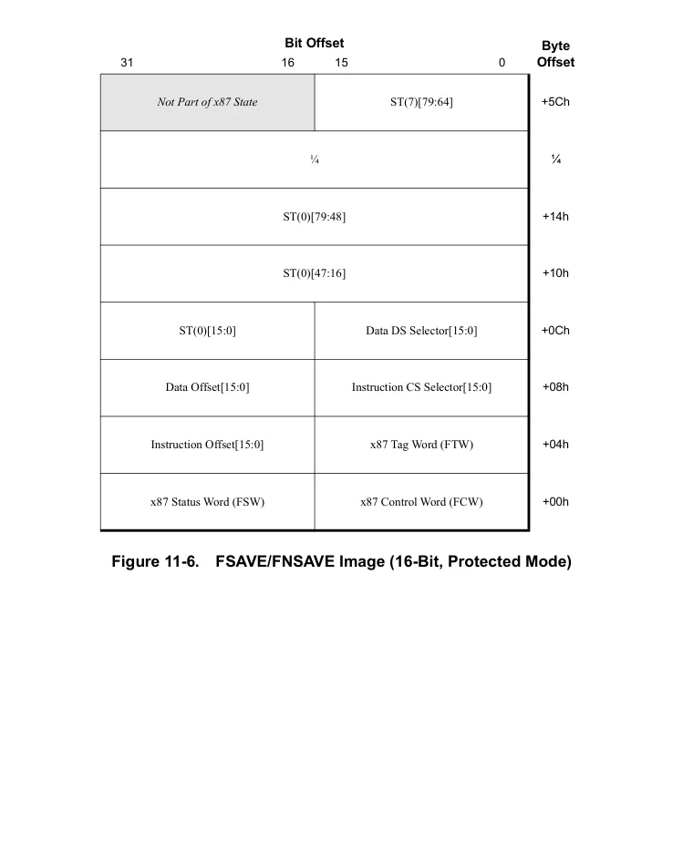

</details>


<!-- PDF source page: 416 | printed page: 354 -->

**Figure 11-7. FSAVE/FNSAVE Image (16-Bit, Real/Virtual-8086 Modes)**

<details>
<summary>Extracted figure labels</summary>

```text
Bit Offset
Byte
Offset
31
16
15
0
Not Part of x87 State
ST(7)[79:64]
+5Ch
¼
ST(0)[79:48]
+14h
ST(0)[47:16]
+10h
ST(0)[15:0]
Data
[19:16]
0000 0000 0000b
+0Ch
Data Offset [15:0]
Instruction
[19:16]
0
Instruction Opcode[10:0]
+08h
Instruction Offset [15:0]
x87 Tag Word (FTW)
+04h
x87 Status Word (FSW)
x87 Control Word (FCW)
+00h
```

</details>

1. 11. 4.4.2 FLDENV/FNLDENV and FSTENV Instructions**

The FLDENV/FNLDENV and FSTENV instructions load and store only the x87 floating-point environment. These instructions, unlike the FSAVE/FNSAVE and FRSTOR instructions, do not save or restore the x87 data registers. The FLDENV/FSTENV instructions do not save the full 64-bit data and instruction pointers. 64-bit applications should use FXSAVE/FXRSTOR, rather than FLDENV/FSTENV. The format of the saved x87 environment images for protected mode and real/virtual mode are the same as those of the first 14-bytes of the FSAVE/FNSAVE images for 16-bit operands or 32/64-bit operands, respectively. See Figure 11-4 on page 351, Figure 11-5 on page 352, Figure 11-6 on page 353, and Figure 11-7.

<details>
<summary>Rendered source page 416 (figures/tables)</summary>

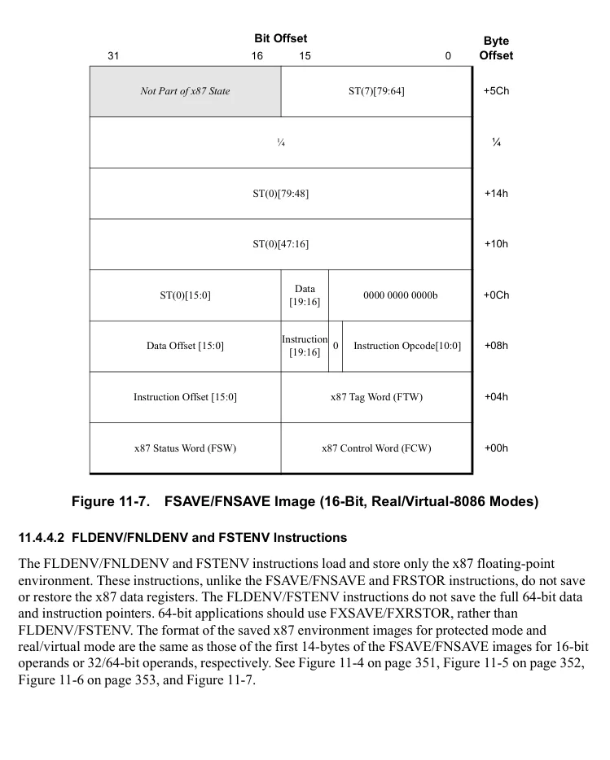

</details>


<!-- PDF source page: 417 | printed page: MMX -->

1. 11. 4.4.3 FXSAVE and FXRSTOR Instructions**

The FXSAVE and FXRSTOR instructions save and restore the entire 128-bit media, 64-bit media, and x87 state. These instructions usually execute faster than FSAVE/FNSAVE and FRSTOR because they do not normally save and restore the x87 exception pointers (last-instruction pointer, last data-operand pointer, and last opcode). The only case in which they do save the exception pointers is the relatively rare case in which the exception-summary bit in the x87 status word (FSW.ES) is set to 1, indicating that an unmasked exception has occurred. The FXSAVE and FXRSTOR memory format contains fields for storing these values.

Unlike FSAVE and FNSAVE, the FXSAVE instruction does not alter the x87 tag word. Therefore, the contents of the shared 64-bit MMX and 80-bit FPR registers can remain valid after an FXSAVE instruction (or any other value the tag bits indicated before the save). Also, FXSAVE (like FNSAVE) does not check for pending unmasked-x87 floating-point exceptions.

Figure 11-9 on page 361 shows the memory format of the media x87 state in long mode. If a 32-bit operand size is used in 64-bit mode, the memory format is the same, except that RIP and RDS are stored as *sel:offset* pointers, as shown in Figure 11-10 on page 362.

For more information on the FXSAVE and FXRSTOR instructions, see individual instruction listings in “64-Bit Media Instruction Reference” of Volume 5.

<a id="11-5-xsave-xrstor-instructions"></a>

## 11.5 XSAVE/XRSTOR Instructions

The XSAVE, XSAVEOPT, XRSTOR, XGETBV, and XSETBV instructions and associated data structures extend the FXSAVE/FXRSTOR memory image used to manage processor states and provide additional functionality. These instructions do not obviate the FXSAVE/FXRSTOR instructions. For more information about FXSAVE/FXRSTOR, see *“FXSAVE and FXRSTOR Instructions” in Volume 2*. For detailed descriptions of FXSAVE and FXRSTOR, see individual instruction listings in AMD64 Architecture Programmer’s Manual *“Volume 5: 64-Bit Media and x87 Floating-Point Instructions.”*

The CPUID instruction is used to identify features supported in processor hardware. Extended control registers are used to enable and disable the handling of processor states associated with supported hardware features and to communicate to an application whether an operating system supports a particular feature that has a processor state specific to it.

<a id="11-5-1-cpuid-enhancements"></a>

### 11.5.1 CPUID Enhancements

- CPUID Fn0000_00001_ECX[XSAVE] indicates that the processor supports XSAVE/XRSTOR instructions and at least one XCR.
- CPUID Fn0000_00001_ECX[OSXSAVE] indicates whether the operating system has enabled extensible state management and supports processor extended state management.
- CPUID Fn0000_0000D enumerates processor states (including legacy x87 FPU states, SSE states, and processor extended states), the offset, and the size of the save area for each processor extended state. Sub-functions (ECX &gt; 0) provide details concerning features and support of processor states enumerated in the root function.


<!-- PDF source page: 418 | printed page: 356 -->

<a id="11-5-2-xfeature-enabled-mask"></a>

### 11.5.2 XFEATURE_ENABLED_MASK

XFEATURE_ENABLED_MASK is set up by privileged software to enable the saving and restoring of extended processor architectural state information supported by a specific processor. Clearing defined bit fields in this mask inhibits the XSAVE instruction from saving (and XRSTOR from restoring) this state information.

XFEATURE_ENABLED_MASK is addressed as XCR0 in the extended control register space and is accessed via the XSETBV and XGETBV instructions.

XFEATURE_ENABLED_MASK is defined as follows:

63 62 61 10 9 8 7 6 5 4 3 2 1 0

ZMM_Hi256

Hi16_ZMM

Reserved

YMM

LWP

MPK

Reserved

SSE

x87

X

K

**Bits Mnemonic Description Access type** 63 X Reserved specifically for XCR0 bit vector expansion. MBZ

62 LWP When set, Lightweight Profiling (LWP) extensions are enabled and XSAVE/XRSTOR supports LWP state management. R/W

61:10 Reserved MBZ

9 MPK When set, PKRU state management is supported by XSAVE/XRSTOR. R/W

8 Reserved MBZ

7 Hi16_ZMM When set, ZMM16-ZMM31 register state management is supported by XSAVE/XRSTOR. Must be set to enable AVX512 extensions. R/W

6 ZMM_Hi256 When set, ZMM0-ZMM15 register state management, upper half, is supported by XSAVE/XRSTOR. Must be set to enable AVX512 extensions. R/W

5 K When set, K0-K7 opmask register state management is supported by XSAVE/XRSTOR. Must be set to enable AVX512 extensions. R/W

4:3 Reserved MBZ

2 YMM When set, 256-bit SSE state management is supported by XSAVE/XRSTOR. Must be set to enable AVX extensions. R/W

When set, 128-bit SSE state management is supported by XSAVE/XRSTOR. This bit must be set if YMM is set. Must be set to enable AVX extensions.

**Figure 11-8. XFEATURE_ENABLED_MASK Format**

<details>
<summary>Extracted figure labels</summary>

```text
1
SSE
R/W
0
x87
x87 FPU state management is supported by XSAVE/XRSTOR. Must be set to 1.
R/W
```

</details>

Hardware initializes XCR0 to 0000_0000_0000_0001h. On writing this register, software must ensure that bits marked MBZ in Figure 11-8 are clear and that XCR0[7:5,2:0] are either 000_001b, 000_011b, 000_111b, or 111_111b. An attempt to write data that violates these rules results in a #GP.

<details>
<summary>Rendered source page 418 (figures/tables)</summary>

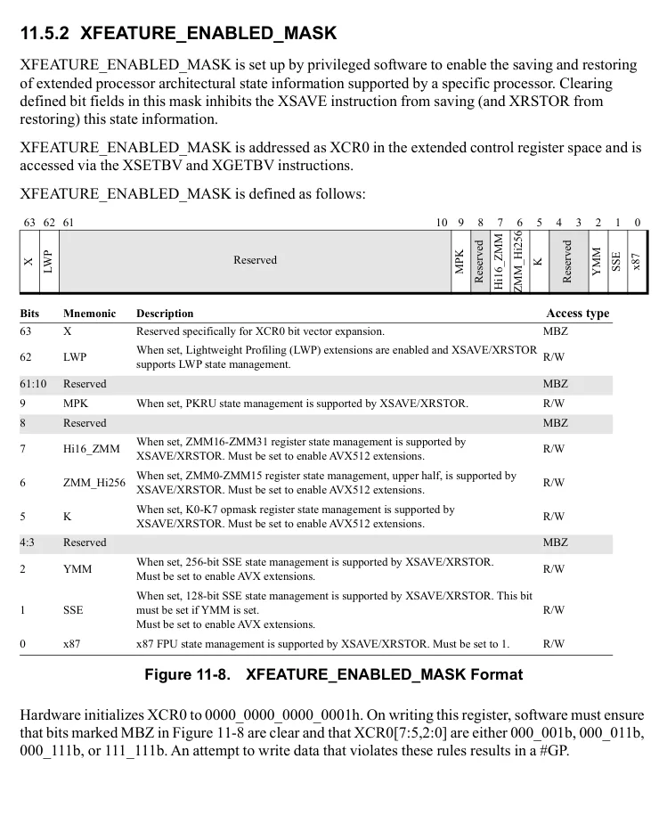

</details>


<!-- PDF source page: 419 | printed page: MMX -->

<a id="11-5-3-extended-save-area"></a>

### 11.5.3 Extended Save Area

The XSAVE/XRSTOR save area extends the legacy 512-byte FXSAVE/FXRSTOR memory image to provide a compatible register state management environment as well as an upward migration path. The save area is architecturally defined to be extendable and enumerated by the sub-functions of CPUID Fn 0000_000Dh. Figure 11-6 shows the format of the XSAVE/XRSTOR area.

**Table 11-6. Extended Save Area Format**

| Save Area | Offset (Byte) | Size (Bytes) |
| --- | --- | --- |
| FPU/SSE Save Area | 0 | 512 |
| Heade | 512 | 64 |
| Reserved, (Ext Save Area 2)<br>_ _ _ | CPUID Fn 0000 000D EBX x02<br>_ _ _ | CPUID Fn 0000 000D EAX x02<br>_ _ _ |
| Reserved, (Ext Save Area 3)<br>_ _ _ | CPUID Fn 0000 000D EBX x03<br>_ _ _ | CPUID Fn 0000 000D EAX x03<br>_ _ _ |
| Reserved, (Ext Save Area 4)<br>_ _ _ | CPUID Fn 0000 000D EBX x04<br>_ _ _ | CPUID Fn 0000 000D EAX x04<br>_ _ _ |
| Reserved, (…) | … | … |

> Note: Bytes 464–511 are available for software use. XRSTOR ignores bytes 464–511 of an XSAVE image.

The register fields of the first 512 bytes of the XSAVE/XRSTOR area are the same as those of the FXSAVE/FXRSTOR area, but the 512-byte area is organized as x87 FPU states, MXCSR (including MXCSR_MASK), and XMM registers. The layout of the save area is fixed and may contain non-contiguous individual save areas because a processor does not support certain extended states or because system software does not support certain processor extended states. The save area is not compacted when features are not saved or are not supported by the processor or by system software.

For more information on using the CPUID instruction to obtain processor implementation information, see Section 3.3, “Processor Feature Identification,” on page 71.

<a id="11-5-4-instruction-functions"></a>

### 11.5.4 Instruction Functions

CR4.OSXSAVE and XCR0 can be read at all privilege levels but written only at ring 0.

- XGETBV reads XCR0.
- XSETBV writes XCR0, ring 0 only.
- XRSTOR restores states specified by bitwise AND of a mask operand in EDX:EAX with XCR0.
- XSAVE (and XSAVEOPT) saves states specified by bitwise AND of a mask operand in EDX:EAX with XCR0.

<a id="11-5-5-zmm-ymm-states-and-supported-operating-modes"></a>

### 11.5.5 ZMM/YMM States and Supported Operating Modes

Extended instructions operate on ZMM/YMM states by means of extended (XOP/VEX/EVEX) prefix encoding. When a processor supports ZMM/YMM states, the states exist in all operating modes, but interfaces to access the ZMM/YMM states may vary by mode. Processor support for extended prefix encoding is independent of processor support of ZMM/YMM states.

<details>
<summary>Rendered source page 419 (figures/tables)</summary>

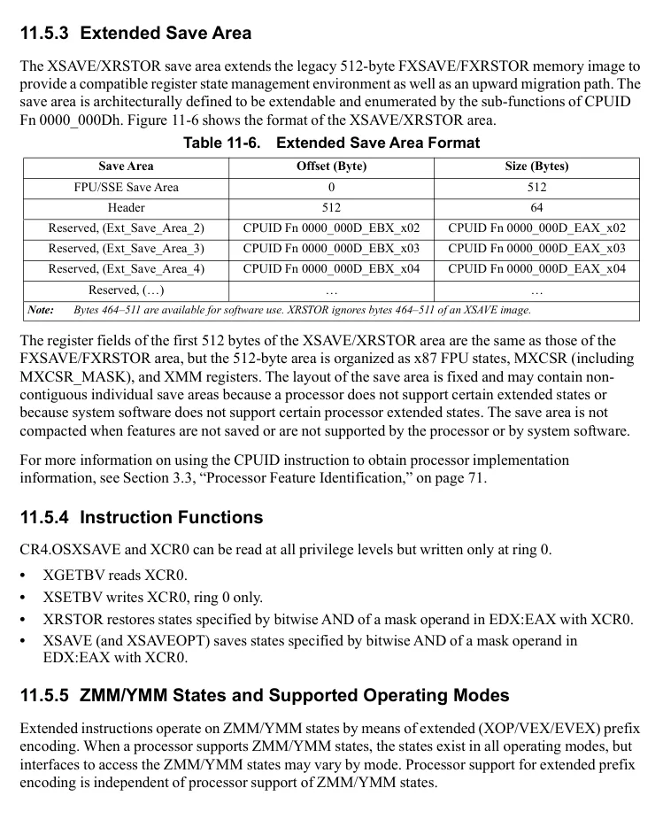

</details>


<!-- PDF source page: 420 | printed page: 358 -->

Instructions that use extended prefix encoding are generally supported in long and protected modes, but are not supported in real or virtual 8086 modes, or when entering SMM mode. Bits 511:128 of the ZMM/YMM register state are maintained across transitions into and out of these modes. The XSAVE/XRSTOR instructions function in all operating modes; XRSTOR can modify ZMM/YMM register state in any operating mode, using state information from the XSAVE/XRSTOR area.

<a id="11-5-6-extended-sse-execution-state-management"></a>

### 11.5.6 Extended SSE Execution State Management

Operating system software must use the XSAVE/XRSTOR instructions for extended SSE execution state management. XSAVEOPT, a performance optimized version of XSAVE, may be used instead of XSAVE once the XSAVE/XRSTOR save area is initialized. In the following discussion XSAVEOPT may be substituted for the instruction XSAVE. The instructions also provide an interface to manage XMM/MXCSR states and x87 FPU states in conjunction with processor extended states. An operating system must enable extended SSE execution state management prior to the execution of extended SSE instructions. Attempting to execute an extended SSE instruction without enabling execution state management causes a #UD exception.

1. 11. 5.6.1 Enabling Extended SSE Instruction Execution**

To enable extended SSE instruction execution and state management, system software must carry out the following process:

- Confirm that the hardware supports the XSAVE, XRSTOR, XSETBV, and XGETBV instructions and the XCR0 register (XFEATURE_ENABLED_MASK) by executing the CPUID instruction function 0000_0001h. If CPUID Fn0000_0001_ECX[XSAVE] is set, hardware support is verified.
- Optionally confirm hardware support of the XSAVEOPT instruction by executing CPUID function 0000_000Dh, sub-function 1 (ECX = 1). If CPUID Fn0000_000D_EAX_x1[XSAVEOPT] is set, the processor supports the XSAVEOPT instruction. XSAVEOPT is a performance optimized version of XSAVE. (SDCR-3580)
- Confirm that hardware supports the extended SSE instructions by verifying XFeatureSupportedMask[2:0] = 111b. XFeatureSupportedMask is accessed via the CPUID instruction function 0000_000Dh, sub-function 0 (ECX = 0). If CPUID Fn0000_000D_EAX_x0[2:0] = 111b, hardware supports x87, legacy SSE, and extended SSE instructions. Bit 0 of EAX signifies x87 floating-point and MMX support, bit 1 signifies legacy SSE support, and bit 2 signifies extended SSE support. Support for both x87 and legacy SSE instructions are required for processors that support the extended SSE instructions. Confirm that hardware supports the AVX512 instructions by verifying XFeatureSupportedMask[7:5] = 111b.
- Set CR4[OSXSAVE] (bit 18) to enable the use of the XSETBV and XGETBV instructions. XSETBV is a privileged instruction that writes the XCRn registers. XCR0 is the XFEATURE_ENABLED_MASK used to manage media and x87 processor state using the XSAVE, XSAVEOPT, and XRSTOR instructions.


<!-- PDF source page: 421 | printed page: MMX -->

- Enable the x87/MMX, legacy SSE, and extended SSE instructions and processor state management by setting the x87, SSE, YMM, ZMM, and K bits of XCR0 (XFEATURE_ENABLED_MASK). Enabling extended SSE capabilities without enabling legacy SSE capabilities is not allowed. The x87 flag (bit 0) of the XFEATURE_ENABLED_MASK must be set when writing XCR0.
- Determine the XSAVE/XRSTOR memory save area size requirement. The field XFeatureEnabledSizeMax specifies the size requirement in bytes based on the currently enabled extended features and is returned in the EAX register after execution of CPUID Function 0000_000Dh, sub-function 0 (ECX = 0).
- Allocate the save/restore area based on the information obtained in the previous step.

For more information on the XSETBV and XGETBV instructions, see individual instruction descriptions in Volume 4. XFEATURE_ENABLED_MASK fields are defined in Section 11.5.2 above.

For more information on using the CPUID instruction to obtain processor implementation information, see Section 3.3, “Processor Feature Identification,” on page 71.

<a id="11-5-7-saving-processor-state"></a>

### 11.5.7 Saving Processor State

The XSTATE header starts at byte offset 512 in the save area. XSTATE_BV is the first 64-bit field in the header. The order of bit vectors in XSTATE_BV matches the order of bit vectors in XCR0. The XSAVE instruction sets bits in the XSTATE_BV vector field when it writes the corresponding processor extended state to a save area in memory. XSAVE modifies only bits for processor states specified by bitwise AND of the XSAVE bit mask operand in EDX:EAX with XCR0. If software modifies the save area image of a particular processor state component directly, it must also set the corresponding bit of XSTATE_BV. If the bit is not set, directly modified state information in a save area image may be ignored by XRSTOR.

XSAVEOPT, a performance optimized version of the XSAVE instruction, may be used (if supported) in lieu of the XSAVE instruction once the XSAVE/XRSTOR save area has been initialized via the execution of the XSAVE instruction.

<a id="11-5-8-restoring-processor-state"></a>

### 11.5.8 Restoring Processor State

When XRSTOR is executed, processor state components are updated only if the corresponding bits in the mask operand (EDX:EAX) and XCR0 are both set. For each updated component, when the corresponding bit in the XSTATE_BV field in the save area header is set, the component is loaded


<!-- PDF source page: 422 | printed page: 360 -->

from the save area in memory. When the XSTATE_BV bit is cleared, the state is set to the hardware-specified initial values shown in Table 11-7.

**Table 11-7. XRSTOR Hardware-Specified Initial Values**

| Component | Initial Value |
| --- | --- |
| x87 | FCW = 037Fh<br>FSW = 0000h<br>Empty/Full = 00h (FTW = FFFFh)<br>x87 Error Pointers = 0<br>ST0 - ST7 = 0 |
| XMM | XMM0 - XMM15 = 0, if 64-bit mode<br>XMM0 - XMM7 = 0, if !64-bit mode |
| YMM HI | YMM HI0 -Y MM HI15 = 0, if 64-bit mode<br>_ _<br>YMM HI0-YMM HI7 = 0, if !64-bit mode<br>_ _ |
| K | K0-K7 = 0 |
| ZMM Hi256 | ZMM HI0-YMM HI15 = 0, if 64-bit mode<br>_ _<br>ZMM HI0-YMM HI7 = 0, if !64-bit mode<br>_ _ |
| HI16 ZMM | ZMM16-ZMM31 = 0 |
| LWP | LWP disabled |
| MPK | PKRU = 0 |
| CET S | PL0 SSP = PL1 SSP = PL2 SSP = 0<br>_ _ _ |
| CET U | U CET = 0, PL3 SSP = 0<br>_ _ |

<a id="11-5-9-mxcsr-state-management"></a>

### 11.5.9 MXCSR State Management

The MXCSR has no hardware-specified initial state; it is read from the save area in memory whenever either XMM or YMM_HI are updated.

<a id="11-5-10-mode-specific-xsave-xrstor-state-management"></a>

### 11.5.10 Mode-Specific XSAVE/XRSTOR State Management

Some state is conditionally saved or updated, depending on processor state:

- On processors where CPUID Fn8000_0008_EBX[2] is 0, the x87 error pointers are not saved or restored if the state saved or loaded from memory doesn't have a pending #MF. On processors where CPUID Fn8000_0008_EBX[2] is 1, the error pointers are always restored from the save area (and if in 64-bit mode the CS and DS portions of the error pointer registers are zeroed), and the error pointer fields in the save area are zeroed if there is no pending #MF, else the error pointer offset registers are written to the save area.
- XMM8–XMM15 are not saved or restored in non-64-bit mode.
- YMM_HI8–YMM_HI15 are not saved or restored in non-64-bit mode.
- ZMM8–ZMM31[511:256] are not saved or restored in non-64-bit mode.

<details>
<summary>Rendered source page 422 (figures/tables)</summary>

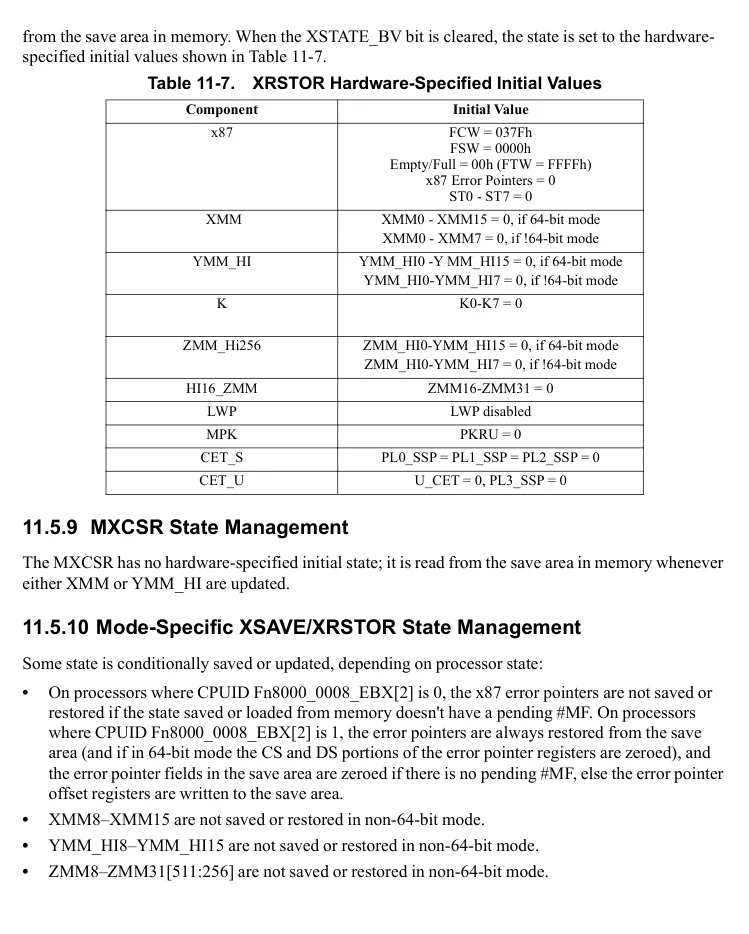

</details>


<!-- PDF source page: 423 | printed page: MMX -->

**F E D C B A 9 8 7 6 5 4 3 2 1 0 Byte**

Reserved, IGN +1F0h

¼ 

Reserved, IGN +1A0h

XMM15 +190h

XMM14 +180h

XMM13 +170h

XMM12 +160h

XMM11 +150h

XMM10 +140h

XMM9 +130h

XMM8 +120h

XMM7 +110h

XMM6 +100h

XMM5 +F0h

XMM4 +E0h

XMM3 +D0h

XMM2 +C0h

XMM1 +B0h

XMM0 +A0h

Reserved, IGN ST(7) +90h

Reserved, IGN ST(6) +80h

Reserved, IGN ST(5) +70h

Reserved, IGN ST(4) +60h

Reserved, IGN ST(3) +50h

Reserved, IGN ST(2) +40h

Res erv ed, IG N

ST(1) +30h

Reserved, IGN ST(0) +20h

MXCSR_MASK MXCSR RDP1 +10h

RIP1 FOP 0 FTW FSW FCW +00h

1. 1. Stored as sel:offset if operand size is 32 bits. 32bit sel:offset format of the pointers is shown in figure 11-10.*

**Figure 11-9. FXSAVE and FXRSTOR Image (64-bit Mode)**

<details>
<summary>Rendered source page 423 (figures/tables)</summary>

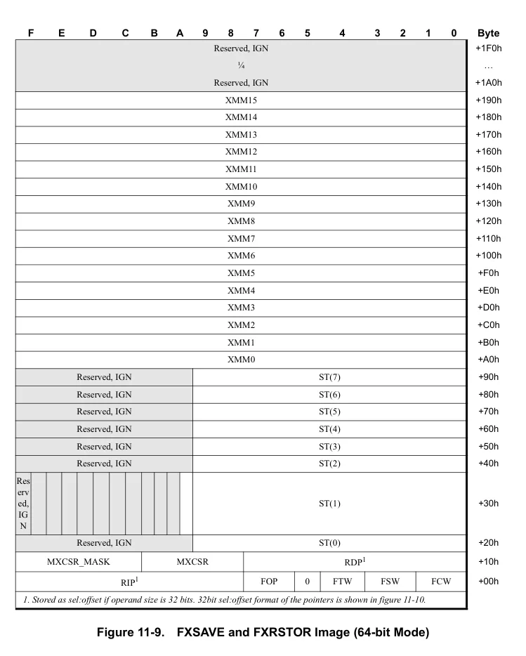

</details>


<!-- PDF source page: 424 | printed page: 362 -->

**Figure 11-10. FXSAVE and FXRSTOR Image (Non-64-bit Mode)**

<details>
<summary>Extracted figure labels</summary>

```text
F
E
D
C
B
A
9
8
7
6
5
4
3
2
1
0
Byte
Reserved, IGN
+1F0h
¼

Reserved, IGN
+120h
XMM7
+110h
XMM6
+100h
XMM5
+F0h
XMM4
+E0h
XMM3
+D0h
XMM2
+C0h
XMM1
+B0h
XMM0
+A0h
Reserved, IGN
ST(7)
+90h
Reserved, IGN
ST(6)
+80h
Reserved, IGN
ST(5)
+70h
Reserved, IGN
ST(4)
+60h
Reserved, IGN
ST(3)
+50h
Reserved, IGN
ST(2)
+40h
Reserved, IGN
ST(1)
+30h
Reserved, IGN
ST(0)
+20h
MXCSR_MASK
MXCSR
rsrvd, IGN
DS
DP
+10h
rsrvd, IGN
CS
EIP
FOP
0
FTW
FSW
FCW
+00h
```

</details>

Software can read and write all fields within the FXSAVE and FXRSTOR memory image. These fields include:

- *FCW*—Bytes 01h–00h. x87 control word.
- *FSW*—Bytes 03h–02h. x87 status word.
- *FTW*—Byte 04h. x87 tag word. See “FXSAVE Format for x87 Tag Word” on page 363 for additional information on the FTW format saved by the FXSAVE instruction.
- (Byte 05h contains the value 00h.)
- *FOP*—Bytes 07h–06h. last x87 opcode.
- *Last x87 Instruction Pointer*—A pointer to the last non-control x87 floating-point instruction executed by the processor:

<details>
<summary>Rendered source page 424 (figures/tables)</summary>

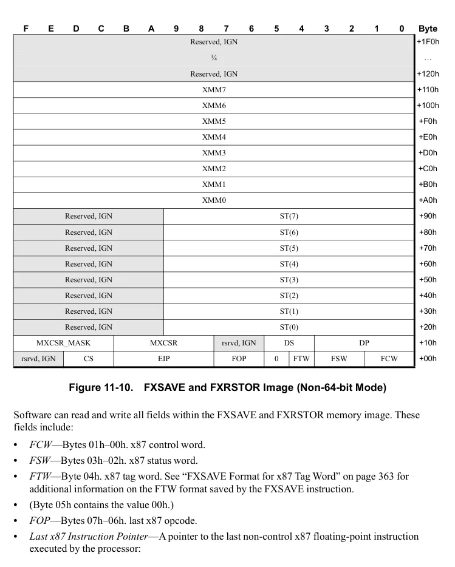

</details>


<!-- PDF source page: 425 | printed page: MMX -->

- *RIP (64-bit format)*—Bytes 0Fh–08h. 64-bit offset into the code segment (used without a CS selector).
- *EIP (32-bit format)*—Bytes 0Bh–08h. 32-bit offset into the code segment.
- *CS (32-bit format)*—Bytes 0Dh–0Ch. Segment selector portion of the pointer.
- *Last x87 Data Pointer*—If the last non-control x87 floating point instruction referenced memory, this value is a pointer to the data operand referenced by the last non-control x87 floating-point instruction executed by the processor:
- *RDP (64-bit format)*—Bytes 17h–10h. 64-bit offset into the data segment (used without a DS selector).
- *DP (32-bit format)*—Bytes 13h–10h. 32-bit offset into the data segment.
- *DS (32-bit format)*—Bytes 15h–14h. Segment selector portion of the pointer. If the last non-control x87 instruction did not reference memory, then the value in the pointer is implementation dependent.
- *MXCSR*—Bytes 1Bh–18h. 128-bit media-instruction control and status register. This register is saved only if CR4.OSFXSR is set to 1.
- *MXCSR_MASK*—Bytes 1Fh–1Ch. Set bits in MXCSR_MASK indicate supported feature bits in MXCSR. For example, if bit 6 (the DAZ bit) in the returned MXCSR_MASK field is set to 1, the DAZ mode and the DAZ flag in MXCSR *are* supported. Cleared bits in MXCSR_MASK indicate reserved bits in MXCSR. If software attempts to set a reserved bit in the MXCSR register, a #GP exception will occur. To avoid this exception, after software clears the FXSAVE memory image and executes the FXSAVE instruction, software should use the value returned by the processor in the MXCSR_MASK field when writing a value to the MXCSR register, as follows:
- *MXCSR_MASK = 0:* If the processor writes a zero value into the MXCSR_MASK field, the denormals-are-zeros (DAZ) mode and the DAZ flag in MXCSR are *not* supported. Software should use the default mask value, 0000_FFBFh (bit 6, the DAZ bit, and bits 31:16 cleared to
1. 0) , to mask any value it writes to the MXCSR register to ensure that all reserved bits in MXCSR are written with 0, thus avoiding a #GP exception.
- *MXCSR_MASK*  *0:* If the processor writes a non-zero value into the MXCSR_MASK field, software should AND this value with any value it writes to the MXCSR register.
- *MMXn/FPRn*—Bytes 9Fh–20h. Shared 64-bit media and x87 floating-point registers. As in the case of the x87 FSAVE instruction, these registers are stored in stack order ST(0)–ST(7). The upper six bytes in the memory image for each register are reserved.
- *XMMn*—Bytes 11Fh–A0h. 128-bit media registers. These registers are saved only if CR4.OSFXSR is set to 1.

1. 11. 5.10.1 FXSAVE Format for x87 Tag Word**

Rather than saving the entire x87 tag word, FXSAVE saves a single-byte encoded version. FXSAVE encodes each of the eight two-bit fields in the x87 tag word as follows:

- Two-bit values of 00, 01, and 10 are encoded as a 1, indicating the corresponding x87 FPR*n* register holds a value.


<!-- PDF source page: 426 | printed page: 364 -->

- A two-bit value of 11 is encoded as a 0, indicating the corresponding x87 FPR*n* is empty.

For example, assume an FSAVE instruction saves an x87 tag word with the value 83F1h. This tag-word value describes the x87 FPRn contents as follows:

**x87 Register FPR7 FPR6 FPR5 FPR4 FPR3 FPR2 FPR1 FPR0 Tag Word Value (hex)** 8 3 F 1 **Tag Value (binary)** 10 00 00 11 11 11 00 01 **Meaning** Special Valid Valid Empty Empty Empty Valid Zero

When an FXSAVE is used to write the x87 tag word to memory, it encodes the value as E3h. This encoded version describes the x87 FPRn contents as follows:

**x87 Register FPR7 FPR6 FPR5 FPR4 FPR3 FPR2 FPR1 FPR0 Encoded Tag Byte (hex)** E 3 **Tag Value (binary)** 1 1 1 0 0 0 1 1 **Meaning** Valid Valid Valid Empty Empty Empty Valid Valid

If necessary, software can decode the single-bit FXSAVE tag-word fields into the two-bit field FSAVE uses by examining the contents of the corresponding FPR registers saved by FXSAVE. Table 11-8 on page 365 shows how the FPR contents are used to find the equivalent FSAVE tag-field value. The *fraction* column refers to fraction portion of the extended-precision significand (bits 62:0). The *integer bit* column refers to the integer-portion of the significand (bit 63). See Chapter 11, “SSE, MMX, and x87 Programming,” on page 342 for more information on floating-point numbering formats.


<!-- PDF source page: 427 | printed page: MMX -->

**Table 11-8. Deriving FSAVE Tag Field from FXSAVE Tag Field**

| Encoded<br>FXSAVE<br>Tag Field | Exponent | Integer Bit2 | Fraction1 | Type of Value | Equivalent<br>FSAVE<br>Tag Field |
| --- | --- | --- | --- | --- | --- |
| 1 (Valid) | All 0s | 0 | All 0s | Zero | 01 (Zero) |
| 1 (Valid) | All 0s | 0 | Not all 0s | Denormal | 10 (Special) |
| 1 (Valid) | All 0s | 1 | All 0s | Pseudo Denormal |  |
| 1 (Valid) | All 0s | 1 | Not all 0s |  |  |
| 1 (Valid) | Neither<br>all 0s<br>nor all 1s | 0 | don’t care | Unnormal |  |
| 1 (Valid) | Neither<br>all 0s<br>nor all 1s | 1 |  | Normal | 00 (Valid) |
| 1 (Valid) | All 1s | 0 |  | Pseudo Infinity<br>or Pseudo NaN | 10 (Special) |
| 1 (Valid) | All 1s | 1 | All 0s | Infinity |  |
| 1 (Valid) | All 1s | 1 | Not all 0s | NaN |  |
| 0 (Empty) | don’t care | 1 |  | Empty | 11 (Empty) |

> Note(s): 1. Bits 62:0 of the significand. Bit 62, the most-significant bit of the fraction, is also called the M bit. 2. Bit 63 of the significand, also called the J bit.

1. 11. 5.10.2 Performance Considerations**

When system software supports multi-tasking, it must be able to save the processor state for one task and load the state for another. For performance reasons, the media and/or x87 processor state is usually saved and loaded only when necessary. System software can save and load this state at the time a task switch occurs. However, if the new task does not use the state, loading the state is unnecessary and reduces performance.

The task-switch bit (CR0.TS) is provided as a *lazy* context-switch mechanism that allows system software to save and load the processor state only when necessary. When CR0.TS=1, a device-not-available exception (#NM) occurs when an attempt is made to execute a 128-bit media, 64-bit media, or x87 instruction. System software can use the #NM exception handler to save the state of the previous task, and restore the state of the current task. Before returning from the exception handler to the media or x87 instruction, system software must clear CR0.TS to 0 to allow the instruction to be executed. Using this approach, the processor state is saved only when the registers are used.

In legacy mode, the hardware task-switch mechanism sets CR0.TS=1 during a task switch (see “Task Switched (TS) Bit” on page 43 for more information). In long mode, the hardware task-switching is not supported, and the CR0.TS bit is not set by the processor. Instead, the architecture assumes that system software handles all task-switching and state-saving functions. If CR0.TS is to be used in long mode for controlling the save and restore of media or x87 state, system software must set and clear it explicitly.

<details>
<summary>Rendered source page 427 (figures/tables)</summary>

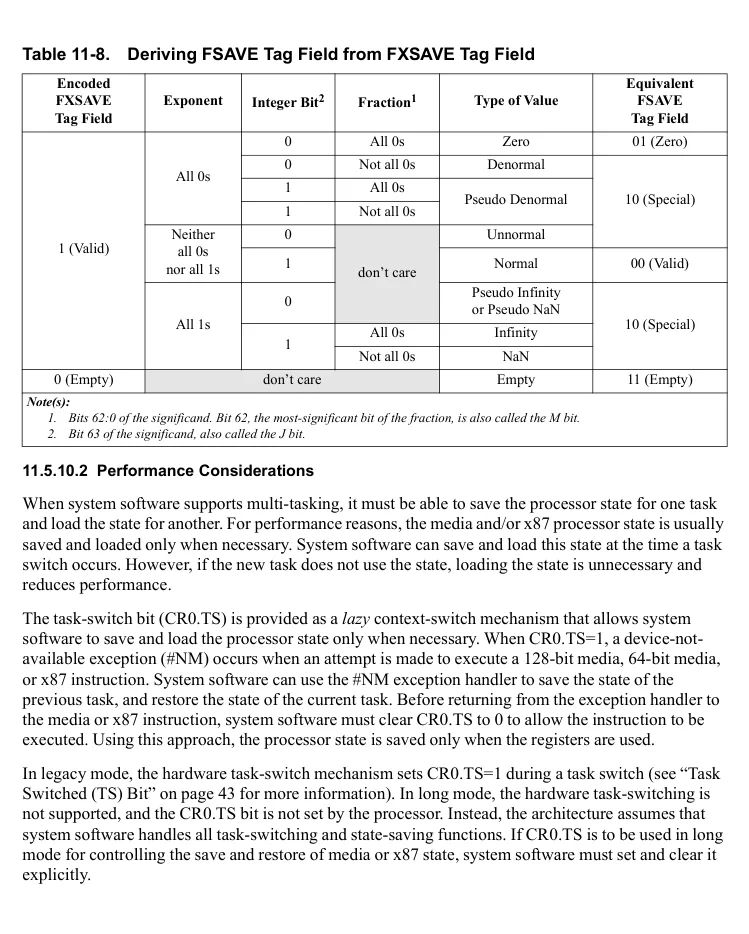

</details>
