<!-- PDF source page: 428 | printed page: 366 -->

<a id="12-task-management"></a>

# 12 Task Management

This chapter describes the hardware task-management features. All of the legacy x86 task-management features are supported by the AMD64 architecture in legacy mode, but most features are not available in long mode. Long mode, however, requires system software to initialize and maintain certain task-management *resources*. The details of these resource-initialization requirements for long mode are discussed in “Task-Management Resources” on page 367.

<a id="12-1-hardware-multitasking-overview"></a>

## 12.1 Hardware Multitasking Overview

A task (also called a *process*) is a program that the processor can execute, suspend, and later resume executing at the point of suspension. During the time a task is suspended, other tasks are allowed to execute. Each task has its own execution space, consisting of:

- Code segment and instruction pointer.
- Data segments.
- Stack segments for each privilege level.
- General-purpose registers.
- rFLAGS register.
- Local-descriptor table.
- Task register, and a link to the previously-executed task.
- I/O-permission and interrupt-permission bitmaps.
- Pointer to the page-translation tables (CR3).

The state information defining this execution space is stored in the task-state segment (TSS) maintained for each task.

Support for hardware multitasking is provided in legacy mode. Hardware multitasking provides automated mechanisms for switching tasks, saving the execution state of the suspended task, and restoring the execution state of the resumed task. When hardware multitasking is used to switch tasks, the processor takes the following actions:

- Suspends execution of the task, allowing any executing instructions to complete and save their results.
- Saves the task execution state in the task TSS.
- Loads the execution state for the new task from its TSS.
- Begins executing the new task at the location specified in the new task TSS.

Software can switch tasks by branching to a new task using the CALL or JMP instructions. Exceptions and interrupts can also switch tasks if the exception or interrupt handlers are themselves separate tasks. IRET can be used to return to an earlier task.


<!-- PDF source page: 429 | printed page: 367 -->

<a id="12-2-task-management-resources"></a>

## 12.2 Task-Management Resources

The hardware-multitasking features are available when protected mode is enabled (CR0.PE=1). Protected-mode software execution, by definition, occurs as part of a task. While system software is not required to use the hardware-multitasking features, it is required to initialize certain task-management resources for at least one task (the current task) when running in protected mode. This single task is needed to establish the protected-mode execution environment. The resources that must be initialized are:

- *Task-State Segment (TSS)*—A segment that holds the processor state associated with a task.
- *TSS Descriptor*—A segment descriptor that defines the task-state segment.
- *TSS Selector*—A segment selector that references the TSS descriptor located in the GDT.
- *Task Register*—A register that holds the TSS selector and TSS descriptor for the current task.

Figure 12-1 on page 368 shows the relationship of these resources to each other in both 64-bit and 32-bit operating environments.


<!-- PDF source page: 430 | printed page: 368 -->

**Figure 12-1. Task-Management Resources**

<details>
<summary>Extracted figure labels</summary>

```text
Global-Descriptor
Table
TSS Descriptor
Task Register (Visible)
Task Register (Hidden From Software)
0
15
TSS Selector
32-Bit Limit
64-Bit or 32-Bit Base Address
Attributes
+
Task-State Segment
I/O-Permission Bitmap
Interrupt-Redirection Bitmap
I/O-Bitmap Base Address
513-254.eps
```

</details>

A fifth resource is available in legacy mode for use by system software that uses the hardware-multitasking mechanism to manage more than one task:

- *Task-Gate Descriptor*—This form of gate descriptor holds a reference to a TSS descriptor and is used to control access between tasks.

The task-management resources are described in the following sections.

<details>
<summary>Rendered source page 430 (figures/tables)</summary>

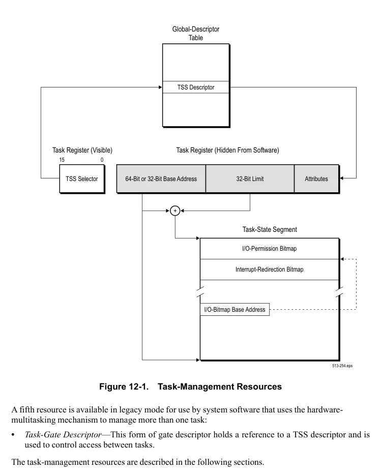

</details>


<!-- PDF source page: 431 | printed page: 369 -->

<a id="12-2-1-tss-selector"></a>

### 12.2.1 TSS Selector

TSS selectors are selectors that point to task-state segment descriptors in the GDT. Their format is identical to all other segment selectors, as shown in Figure 12-2.

**Figure 12-2. Task-Segment Selector**

<details>
<summary>Extracted figure labels</summary>

```text
15
3
2
1
0
Selector Index
TI
RPL
Bits
Mnemonic
Description
15:3
Selector Index
2
TI
Table Indicator
1:0
RPL
Requestor Privilege Level
```

</details>

The selector format consists of the following fields:

**Selector Index.** Bits 15:3. The selector-index field locates the TSS descriptor in the global-descriptor table.

**Table Indicator (TI) Bit.** Bit 2. The TI bit must be cleared to 0, which indicates that the GDT is used. TSS descriptors cannot be located in the LDT. If a reference is made to a TSS descriptor in the LDT, a general-protection exception (#GP) occurs.

**Requestor Privilege-Level (RPL) Field.** Bits 1:0. RPL represents the privilege level (CPL) the processor is operating under at the time the TSS selector is loaded into the task register.

<a id="12-2-2-tss-descriptor"></a>

### 12.2.2 TSS Descriptor

The TSS descriptor is a system-segment descriptor, and it can be located only in the GDT. The format for an 8-byte, legacy-mode and compatibility-mode TSS descriptor can be found in “System Descriptors” on page 94. The format for a 16-byte, 64-bit mode TSS descriptor can be found in “System Descriptors” on page 99.

The fields within a TSS descriptor (all modes) are described in “Descriptor Format” on page 88. The following additional information applies to TSS descriptors:

- *Segment Limit*—When shadow stacks are not enabled (CR4.CET=0), a TSS descriptor must have a segment limit value of at least 67h, which defines a minimum TSS size of 68h (104 decimal) bytes. If shadow stacks are enabled (CR4.CET=1), the TSS segment limit must be at least 06Bh (for a minimum size of 108 decimal bytes), in order to accommodate the 32-bit shadow stack pointer (SSP). If the limit is less than the specified values, an invalid-TSS exception (#TS) occurs during the task switch. When an I/O-permission bitmap, interrupt-redirection bitmap, or additional state information is included in the TSS, the limit must be set to a value large enough to enclose that information. In this case, if the TSS limit is not large enough to hold the additional information, a

<details>
<summary>Rendered source page 431 (figures/tables)</summary>

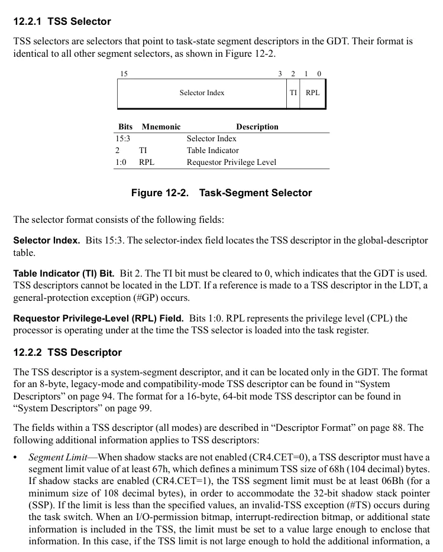

</details>


<!-- PDF source page: 432 | printed page: 370 -->

#GP exception occurs when an attempt is made to access beyond the TSS limit. No check for the larger limit is performed during the task switch. **•* Type*—Four system-descriptor types are defined as TSS types, as shown in Table 4-5 on page 94. Bit 9 is used as the descriptor busy bit (B). This bit indicates that the task is busy when set to 1, and available when cleared to 0. Busy tasks are the currently running task and any previous (outer) tasks in a nested-task hierarchy. Task recursion is not supported, and a #GP exception occurs if an attempt is made to transfer control to a busy task. See “Nesting Tasks” on page 387 for additional information. In long mode, the 32-bit TSS types (available and busy) are redefined as 64-bit TSS types, and only 64-bit TSS descriptors can be used. Loading the task register with an available 64-bit TSS causes the processor to change the TSS descriptor type to indicate a busy 64-bit TSS. Because long mode does not support task switching, the TSS-descriptor busy bit is never cleared by the processor to indicate an available 64-bit TSS. Sixteen-bit TSS types are illegal in long mode. A general-protection exception (#GP) occurs if a reference is made to a 16-bit TSS.

<a id="12-2-3-task-register"></a>

### 12.2.3 Task Register

The *task register* (TR) points to the TSS location in memory, defines its size, and specifies its attributes. As with the other descriptor-table registers, the TR has two portions. A *visible* portion holds the TSS selector, and a *hidden* portion holds the TSS descriptor. When the TSS selector is loaded into the TR, the processor automatically loads the TSS descriptor from the GDT into the hidden portion of the TR.

The TR is loaded with a new selector using the LTR instruction. The TR is also loaded during a task switch, as described in “Switching Tasks” on page 380.

Figure 12-3 shows the format of the TR in legacy mode.

**Figure 12-3. TR Format, Legacy Mode**

<details>
<summary>Extracted figure labels</summary>

```text
Selector
Descriptor Attributes
32-Bit Descriptor-Table Limit
32-Bit Descriptor-Table Base Address
Hidden From Software
513-221.eps
```

</details>

Figure 12-4 shows the format of the TR in long mode (both compatibility mode and 64-bit mode).

<details>
<summary>Rendered source page 432 (figures/tables)</summary>

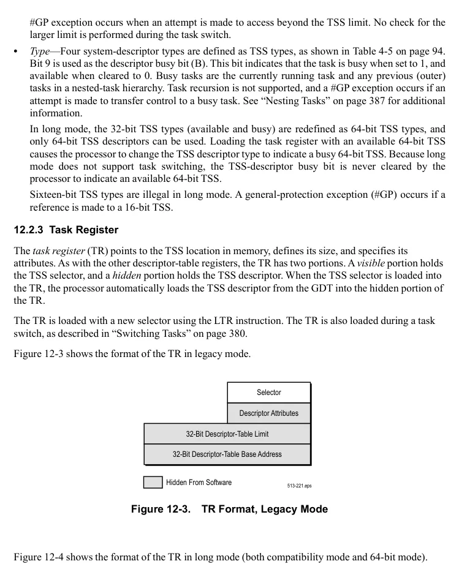

</details>


<!-- PDF source page: 433 | printed page: 371 -->

**Figure 12-4. TR Format, Long Mode**

<details>
<summary>Extracted figure labels</summary>

```text
Selector
Descriptor Attributes
32-Bit Descriptor-Table Limit
64-Bit Descriptor-Table Base Address
Hidden From Software
513-267.eps
```

</details>

The AMD64 architecture expands the TSS-descriptor base-address field to 64 bits so that system software running in long mode can access a TSS located anywhere in the 64-bit virtual-address space. The processor ignores the 32 high-order base-address bits when running in legacy mode. Because the TR is loaded from the GDT, the system-segment descriptor format has been expanded to 16 bytes by the AMD64 architecture in support of 64-bit mode. See “System Descriptors” on page 99 for more information on this expanded format. The high-order base-address bits are only loaded from 64-bit mode using the LTR instruction. Figure 12-5 shows the relationship between the TSS and GDT.

**Figure 12-5. Relationship between the TSS and GDT**

<details>
<summary>Extracted figure labels</summary>

```text
Global
Descriptor
Table
Task
State
Segment
Task Selector
TSS Attributes
GDT Limit
TSS Limit
GDT Base Address
TSS Base Address
Global Descriptor Table Register
Task Register
513-210.eps
```

</details>

Long mode requires the use of a 64-bit TSS type, and this type must be loaded into the TR by executing the LTR instruction in *64-bit mode*. Executing the LTR instruction in 64-bit mode loads the TR with the full 64-bit TSS base address from the 16-byte TSS descriptor format (compatibility mode

<details>
<summary>Rendered source page 433 (figures/tables)</summary>

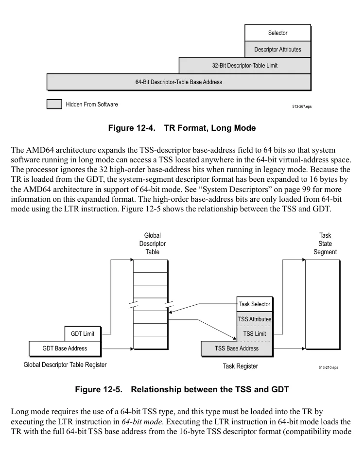

</details>


<!-- PDF source page: 434 | printed page: 372 -->

can only load 8-byte system descriptors). A processor running in either compatibility mode or 64-bit mode uses the full 64-bit TR.base address.

<a id="12-2-4-legacy-task-state-segment"></a>

### 12.2.4 Legacy Task-State Segment

The task-state segment (TSS) is a data structure in memory that the processor uses to save and restore the execution state for a task when a task switch occurs. Figure 12-6 on page 373 shows the format of a legacy 32-bit TSS.


<!-- PDF source page: 435 | printed page: 373 -->

**Figure 12-6. Legacy 32-bit TSS**

<details>
<summary>Extracted figure labels</summary>

```text
Bit Offset
Byte
Offset
31
16
15
0
I/O-Permission Bitmap (IOPB) (Up to 8 Kbytes)
IOPB
Base
Interrupt-Redirection Bitmap (IRB) (Eight 32-Bit Locations)
¯
Operating-System Data Structure
¯
SSP
+68h
I/O-Permission Bitmap Base Address
Reserved, IGN
T
+64h
Reserved, IGN
LDT Selector
+60h
Reserved, IGN
GS
+5Ch
Reserved, IGN
FS
+58h
Reserved, IGN
DS
+54h
Reserved, IGN
SS
+50h
Reserved, IGN
CS
+4Ch
Reserved, IGN
ES
+48h
EDI
+44h
ESI
+40h
EBP
+3Ch
ESP
+38h
EBX
+34h
EDX
+30h
ECX
+2Ch
EAX
+28h
EFLAGS
+24h
EIP
+20h
CR3
+1Ch
Reserved, IGN
SS2
+18h
ESP2
+14h
Reserved, IGN
SS1
+10h
ESP1
+0Ch
Reserved, IGN
SS0
+08h
ESP0
+04h
Reserved, IGN
Link (Prior TSS Selector)
+00h
```

</details>

<details>
<summary>Rendered source page 435 (figures/tables)</summary>

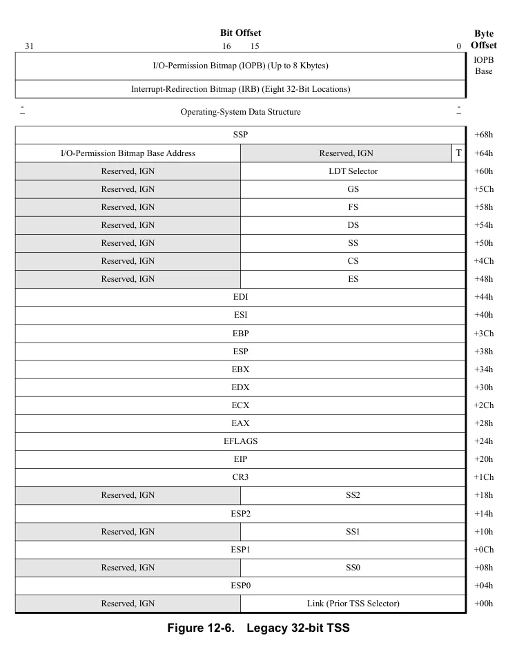

</details>


<!-- PDF source page: 436 | printed page: 374 -->

The 32-bit TSS contains three types of fields:

- *Static fields* are read by the processor during a task switch when a new task is loaded, but are not written by the processor when a task is suspended.
- *Dynamic fields* are read by the processor during a task switch when a new task is loaded, and are written by the processor when a task is suspended.
- *Software-defined fields* are read and written by software, but are not read or written by the processor. All but the first 104 bytes of a TSS can be defined for software purposes, minus any additional space required for the optional I/O-permission bitmap and interrupt-redirection bitmap.

TSS fields are not read or written by the processor when the LTR instruction is executed. The LTR instruction loads the TSS descriptor into the TR and marks the task as busy, but it does not cause a task switch.

The TSS fields used by the processor in legacy mode are:

- *Link*—Bytes 01h–00h, dynamic field. Contains a copy of the task selector from the previously-executed task. See “Nesting Tasks” on page 387 for additional information.
- *Stack Pointers*—Bytes 1Bh–04h, static field. Contains the privilege 0, 1, and 2 stack pointers for the task. These consist of the stack-segment selector (SS*n)*, and the stack-segment offset (ESP*n*).
- *CR3*—Bytes 1Fh–1Ch, static field. Contains the page-translation-table base-address (CR3) register for the task.
- *EIP*—Bytes 23h–20h, dynamic field. Contains the instruction pointer (EIP) for the next instruction to be executed when the task is restored.
- *EFLAGS*—Bytes 27h–24h, dynamic field. Contains a copy of the EFLAGS image at the point the task is suspended.
- *General-Purpose Registers*—Bytes 47h–28h, dynamic field. Contains a copy of the EAX, ECX, EDX, EBX, ESP, EBP, ESI, and EDI values at the point the task is suspended.
- *Segment-Selector Registers*—Bytes 59h–48h, dynamic field. Contains a copy of the ES, CS, SS, DS, FS, and GS, values at the point the task is suspended.
- *LDT Segment-Selector Register*—Bytes 63h–60h, static field. Contains the local-descriptor-table segment selector for the task.
- *T (Trap) Bit*—Bit 0 of byte 64h, static field. This bit, when set to 1, causes a debug exception (#DB) to occur on a task switch. See “Breakpoint Instruction (INT3)” on page 408 for additional information.
- *Shadow Stack Pointer (SSP)*—Bytes 6Bh-68h, static field. Contains the 32-bit SSP for the incoming task. Note that the SSP of the outgoing task is not saved in this field.
- *I/O-Permission Bitmap Base Address*—Bytes 67h–66h, static field. This field represents a 16-bit offset into the TSS. This offset points to the beginning of the I/O-permission bitmap, and the end of the interrupt-redirection bitmap.
- *I/O-Permission Bitmap*—Static field. This field specifies protection for I/O-port addresses (up to the 64K ports supported by the processor), as follows:


<!-- PDF source page: 437 | printed page: 375 -->

- Whether the port can be accessed at any privilege level.
- Whether the port can be accessed outside the privilege level established by EFLAGS.IOPL.
- Whether the port can be accessed when the processor is running in virtual-8086 mode. Because one bit is used per 8-byte I/O-port, this bitmap can take up to 8 Kbytes of TSS space. The bitmap can be located anywhere within the first 64 Kbytes of the TSS, as long as it is above byte
1. 103. The last byte of the bitmap must contain all ones (0FFh). See “I/O-Permission Bitmap” on page 375 for more information.
- *Interrupt-Redirection Bitmap*—Static field. This field defines how each of the 256-possible software interrupts is directed in a virtual-8086 environment. One bit is used for each interrupt, for a total bitmap size of 32 bytes. The bitmap can be located anywhere above byte 103 within the first 64 Kbytes of the TSS. See “Interrupt Redirection of Software Interrupts” on page 290 for information on using this field.

The TSS can be paged by system software. System software that uses the hardware task-switch mechanism must guarantee that a page fault does not occur during a task switch. Because the processor only reads and writes the first 104 TSS bytes during a task switch, this restriction only applies to those bytes. The simplest approach is to align the TSS on a page boundary so that all critical bytes are either present or not present. Then, if a page fault occurs when the TSS is accessed, it occurs before the first byte is read. If the page fault occurs after a portion of the TSS is read, the fault is unrecoverable.

**I/O-Permission Bitmap.** The I/O-permission bitmap (IOPB) allows system software to grant less-privileged programs access to individual I/O ports, overriding the effect of RFLAGS.IOPL for those devices. When an I/O instruction is executed, the processor checks the IOPB only if the processor is in virtual x86 mode or the CPL is greater than the RFLAGS.IOPL field. Each bit in the IOPB corresponds to a byte I/O port. A word I/O port corresponds to two consecutive IOPB bits, and a doubleword I/O port corresponds to four consecutive IOPB bits. Access is granted to an I/O port of a given size when *all* IOPB bits corresponding to that port are clear. If any bits are set, a #GP occurs.

The IOPB is located in the TSS, as shown by the example in Figure 12-7 on page 376. Each TSS can have a different copy of the IOPB, so access to individual I/O devices can be granted on a task-by-task basis. The I/O-permission bitmap base-address field located at byte 66h in the TSS is an offset into the TSS locating the start of the IOPB. If all 64K I/O ports are supported, the IOPB base address must not be greater than 0DFFFh, otherwise accesses to the bitmap cause a #GP to occur. An extra byte must be present after the last IOPB byte. This byte must have all bits set to 1 (0FFh). This allows the processor to read two IOPB bytes each time an I/O port is accessed. By reading two IOPB bytes, the processor can check all bits when unaligned, multi-byte I/O ports are accessed.


<!-- PDF source page: 438 | printed page: 376 -->

**Figure 12-7. I/O-Permission Bitmap Example**

<details>
<summary>Extracted figure labels</summary>

```text
Bit Offset
Byte
Offset
31
16 15
0
1111_1111
IOPB+Ch
IOPB+8h
0
IOPB+4h
IOPB
I/O-Permission Bitmap Base Address
+64h
. . .
+00h
```

</details>

Bits in the IOPB sequentially correspond to I/O port addresses. The example in Figure 12-7 shows bits 12 through 15 in the second doubleword of the IOPB cleared to 0. Those bit positions correspond to byte I/O ports 44h through 47h, or alternatively, doubleword I/O port 44h. Because the bits are cleared to zero, software running at any privilege level can access those I/O ports.

By adjusting the TSS limit, it may happen that some ports in the I/O-address space have no corresponding IOPB entry. Ports not represented by the IOPB will cause a #GP exception. Referring again to Figure 12-7, the last IOPB entry is at bit 23 in the fourth IOPB doubleword, which corresponds to I/O port 77h. In this example, all ports from 78h and above will cause a #GP exception, as if their permission bit was set to 1.

<a id="12-2-5-64-bit-task-state-segment"></a>

### 12.2.5 64-Bit Task State Segment

Although the hardware task-switching mechanism is not supported in long mode, a 64-bit task state segment (TSS) must still exist. System software must create at least one 64-bit TSS for use after activating long mode, and it must execute the LTR instruction, *in 64-bit mode*, to load the TR register with a pointer to the 64-bit TSS that serves both 64-bit-mode programs and compatibility-mode programs.

The legacy TSS contains several fields used for saving and restoring processor-state information. The legacy fields include general-purpose register, EFLAGS, CR3 and segment-selector register state, among others. Those legacy fields are not supported by the 64-bit TSS. System software must save and restore the necessary processor-state information required by the software-multitasking implementation (if multitasking is supported). Figure 12-8 on page 378 shows the format of a 64-bit TSS.

The 64-bit TSS holds several pieces of information important to long mode that are not directly related to the task-switch mechanism:

- *RSPn***—**Bytes 1Bh–04h**.** The full 64-bit canonical forms of the stack pointers (RSP) for privilege levels 0 through 2.

<details>
<summary>Rendered source page 438 (figures/tables)</summary>

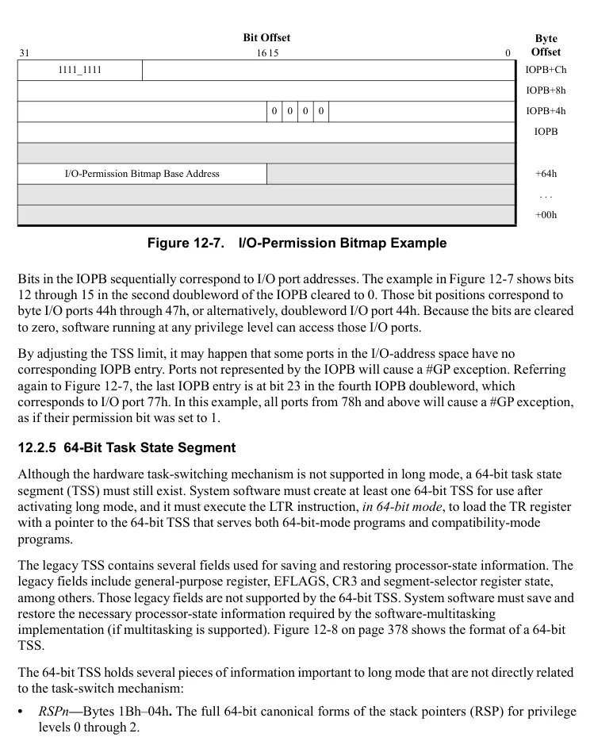

</details>


<!-- PDF source page: 439 | printed page: 377 -->

- *ISTn***—**Bytes 5Bh–24h**.** The full 64-bit canonical forms of the interrupt-stack-table (IST) pointers. See “Interrupt-Stack Table” on page 285 for a description of the IST mechanism.
- *I/O Map Base Address*—Bytes 67h–66h**.** The 16-bit offset to the I/O-permission bit map from the 64-bit TSS base. The function of this field is identical to that in a legacy 32-bit TSS. See “I/O-Permission Bitmap” on page 375 for more information.


<!-- PDF source page: 440 | printed page: 378 -->

**Figure 12-8. Long Mode TSS Format**

<details>
<summary>Extracted figure labels</summary>

```text
Bit Offset
Byte
Offset
31
16 15
0
I/O-Permission Bitmap (IOPB) (Up to 8 Kbytes)
IOPB
Base
¯
I/O Map Base Address
Reserved, IGN
+64h
Reserved, IGN
+60h
+5Ch
IST7[63:32]
+58h
IST7[31:0]
+54h
IST6[63:32]
+50h
IST6[31:0]
+4Ch
IST5[63:32]
+48h
IST5[31:0]
+44h
IST4[63:32]
+40h
IST4[31:0]
+3Ch
IST3[63:32]
+38h
IST3[31:0]
+34h
IST2[63:32]
+30h
IST2[31:0]
+2Ch
IST1[63:32]
+28h
IST1[31:0]
+24h
Reserved, IGN
+20h
+1Ch
RSP2[63:32]
+18h
RSP2[31:0]
+14h
RSP1[63:32]
+10h
RSP1[31:0]
+0Ch
RSP0[63:32]
+08h
RSP0[31:0]
+04h
Reserved, IGN
+00h
```

</details>

<details>
<summary>Rendered source page 440 (figures/tables)</summary>

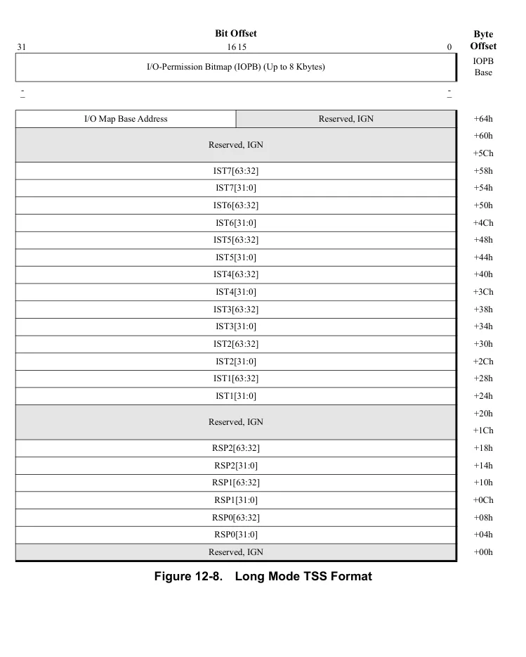

</details>


<!-- PDF source page: 441 | printed page: 379 -->

<a id="12-2-6-task-gate-descriptor-legacy-mode-only"></a>

### 12.2.6 Task Gate Descriptor (Legacy Mode Only)

Task-gate descriptors hold a selector reference to a TSS and are used to control access between tasks. Unlike a TSS descriptor or other gate descriptors, a task gate can be located in any of the three descriptor tables (GDT, LDT, and IDT). Figure 12-9 shows the format of a task-gate descriptor.

**Figure 12-9. Task-Gate Descriptor, Legacy Mode Only**

<details>
<summary>Extracted figure labels</summary>

```text
31
16 15 14 13 12 11
8
7
0
Reserved, IGN
P
DPL
S
Type
Reserved, IGN
+4
TSS Selector
Reserved, IGN
+0
```

</details>

The task-gate descriptor fields are:

- *System (S) and Type*—Bits 12 and 11:8 (respectively) of byte +4. These bits are encoded by software as 00101b to indicate a task-gate descriptor type.
- *Present (P)*—Bit 15 of byte +4. The segment-present bit indicates the segment referenced by the gate descriptor is loaded in memory. If a reference is made to a segment when P=0, a segment-not-present exception (#NP) occurs. This bit is set and cleared by system software and is never altered by the processor.
- *Descriptor Privilege-Level (DPL)*—Bits 14:13 of byte +4. The DPL field indicates the gate-descriptor privilege level. DPL can be set to any value from 0 to 3, with 0 specifying the most privilege and 3 the least privilege.

<a id="12-3-hardware-task-management-in-legacy-mode"></a>

## 12.3 Hardware Task-Management in Legacy Mode

This section describes the operation of the task-switch mechanism when the processor is running in legacy mode. None of these features are supported in long mode (either compatibility mode or 64-bit mode).

<a id="12-3-1-task-memory-mapping"></a>

### 12.3.1 Task Memory-Mapping

The hardware task-switch mechanism gives system software a great deal of flexibility in managing the sharing and isolation of memory—both virtual (linear) and physical—between tasks.

**Segmented Memory.** The segmented memory for a task consists of the segments that are loaded during a task switch and any segments that are later accessed by the task code. The hardware task-switch mechanism allows tasks to either share segments with other tasks, or to access segments in isolation from one another. Tasks that share segments actually share a virtual-address (linear-address) space, but they do not necessarily share a physical-address space. When paging is enabled, the virtual-to-physical mapping for each task can differ, as is described in the following section. Shared segments

<details>
<summary>Rendered source page 441 (figures/tables)</summary>

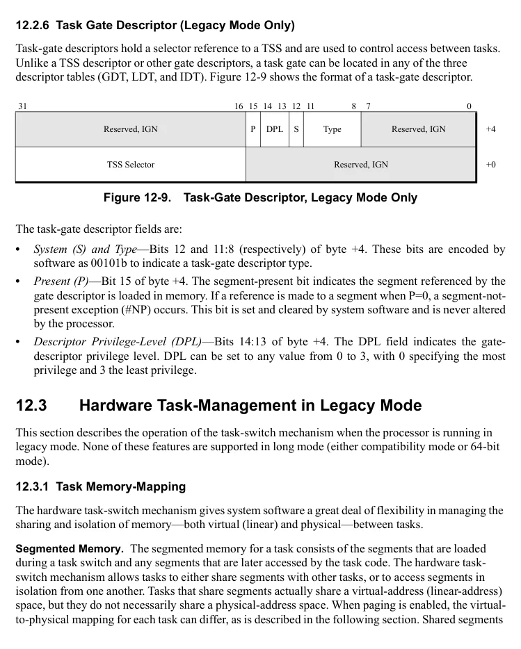

</details>


<!-- PDF source page: 442 | printed page: 380 -->

*do share* physical memory when paging is disabled, because virtual addresses are used as physical addresses.

A number of options are available to system software that shares segments between tasks:

- Sharing segment descriptors using the GDT. All tasks have access to the GDT, so it is possible for segments loaded in the GDT to be shared among tasks.
- Sharing segment descriptors using a single LDT. Each task has its own LDT, and that LDT selector is automatically saved and restored in the TSS by the processor during task switches. Tasks, however, can share LDTs simply by storing the same LDT selector in multiple TSSs. Using the LDT to manage segment sharing and segment isolation provides more flexibility to system software than using the GDT for the same purpose.
- Copying shared segment descriptors into multiple LDTs. Segment descriptors can be copied by system software into multiple LDTs that are otherwise not shared between tasks. Allowing segment sharing at the segment-descriptor level, rather than the LDT level or GDT level, provides the greatest flexibility to system software.

In all three cases listed above, the actual data and instructions are shared between tasks only when the tasks’ virtual-to-physical address mappings are identical.

**Paged Memory.** Each task has its own page-translation table base-address (CR3) register, and that register is automatically saved and restored in the TSS by the processor during task switches. This allows each task to point to its own set of page-translation tables, so that each task can translate virtual addresses to physical addresses independently. Page translation must be enabled for changes in CR3 values to have an effect on virtual-to-physical address mapping. When page translation is disabled, the tables referenced by CR3 are ignored, and virtual addresses are equivalent to physical addresses.

<a id="12-3-2-switching-tasks"></a>

### 12.3.2 Switching Tasks

The hardware task-switch mechanism transfers program control to a new task when any of the following occur:

- A CALL or JMP instruction with a selector operand that references a task gate is executed. The task gate can be located in either the LDT or GDT.
- A CALL or JMP instruction with a selector operand that references a TSS descriptor is executed. The TSS descriptor must be located in the GDT.
- A software-interrupt instruction (INT*n*) is executed that references a task gate located in the IDT.
- An exception or external interrupt occurs, and the vector references a task gate located in the IDT.
- An IRET is executed while the EFLAGS.NT bit is set to 1, indicating that a return is being performed from an inner-level task to an outer-level task. The new task is referenced using the selector stored in the current-task link field. See “Nesting Tasks” on page 387 for additional information. The RET instruction *cannot* be used to switch tasks.

When a task switch occurs, the following operations are performed automatically by the processor:


<!-- PDF source page: 443 | printed page: 381 -->

- The processor performs privilege-checking to determine whether the currently-executing program is allowed to access the target task. If this check fails, the task switch is aborted without modifying the processor state, and a general-protection exception (#GP) occurs. The privilege checks performed depend on the cause of the task switch:
- If the task switch is initiated by a CALL or JMP instruction through a TSS descriptor, the processor checks that both the currently-executing program CPL and the TSS-selector RPL are numerically less-than or equal-to the TSS-descriptor DPL.
- If the task switch takes place through a task gate, the CPL and task-gate RPL are compared with the task-gate DPL, and no comparison is made using the TSS-descriptor DPL. See “Task Switches Using Task Gates” on page 385.
- Software interrupts, hardware interrupts, and exceptions all transfer control without checking the task-gate DPL.
- The IRET instruction transfers control without checking the TSS-descriptor DPL.
- The processor performs limit-checking on the target TSS descriptor to verify that the TSS limit is greater than or equal to:
- 67h (at least 104 bytes), when shadow stacks are not enabled (CR4.CET=0).
- 6Bh (at least 108 bytes), when shadow stacks are enabled (CR4.CET=1). If this check fails, the task switch is aborted without modifying the processor state, and an invalid-TSS exception (#TS) occurs.
- If shadow stacks are enabled at the current CPL and the task switch was initiated by an IRET instruction, the current SSP must be aligned to 8 bytes. If this check fails, the task switch is aborted without modifying the processor state, and an #TS(current task) exception is generated.
- The current-task state is saved in the TSS. This includes the next-instruction pointer (EIP), EFLAGS, the general-purpose registers, and the segment-selector registers. Up to this point, any exception that occurs aborts the task switch without changing the processor state. From this point forward, any exception that occurs does so in the context of the new task. If an exception occurs in the context of the new task during a task switch, the processor finishes loading the new-task state without performing additional checks. The processor transfers control to the #TS handler after this state is loaded, but before the first instruction is executed in the new task. When a #TS occurs, it is possible that some of the state loaded by the processor did not participate in segment access checks. The #TS handler must verify that all segments are accessible before returning to the interrupted task.
- The task register (TR) is loaded with the new-task TSS selector, and the hidden portion of the TR is loaded with the new-task descriptor. The TSS now referenced by the processor is that of the new task.
- The current task is marked as busy. The previous task is marked as available or remains busy, based on the type of linkage. See “Nesting Tasks” on page 387 for more information.
- CR0.TS is set to 1. This bit can be used to save other processor state only when it becomes necessary. For more information, see the next section, “Saving Other Processor State.”
- If shadow stacks are enabled (CR4.CET=1), the following shadow stack actions are performed:


<!-- PDF source page: 444 | printed page: 382 -->

```text
saveCsLipSsp = FALSE
```

```text
checkCsLip = FALSE
```

```text
Read CS and EFLAGS from the incoming TSS
```

```text
newCPL = (EFLAGS.VM == 1) ? 3 : CS.RPL
```

```text
IF (task switch was initiated by CALL, interrupt or exception)
```

```text
{
```

```text
IF (ShadowStacksEnabled at current CPL)
```

```text
{
```

```text
IF ((current CPL == 3) && (newCPL < 3))
```

```text
PL3_SSP = SSP // switching from user to supv
```

```text
ELSE
```

```text
{
```

```text
saveCsLipSsp = TRUE // all other priv changes
```

```text
tempSSP = SSP
```

```text
tempLIP = CS.base + EIP
```

```text
tempCS = CS.sel
```

```text
}
```

```text
} //end task switch initated by CALL,int, or exception
```

```text
ELSEIF (task switch was initiated by IRET)
```

```text
{
```

```text
IF (ShadowStacksEnabled at current CPL)
```

```text
{
```

```text
// pop CS, LIP and SSP from shadow stack
```

```text
IF ((newCPL == current CPL) || (newCPL < 3))
```

```text
{
```

```text
// no priv change, or supv to user/supv
```

```text
tempCS = SSTK_READ_MEM.d [SSP+16]
```

```text
tempLIP = SSTK_READ_MEM.d [SSP+8]
```

```text
tempSSP = SSTK_READ_MEM.d [SSP]
```

```text
SSP = SSP + 24
```

<details>
<summary>Rendered source page 444 (figures/tables)</summary>

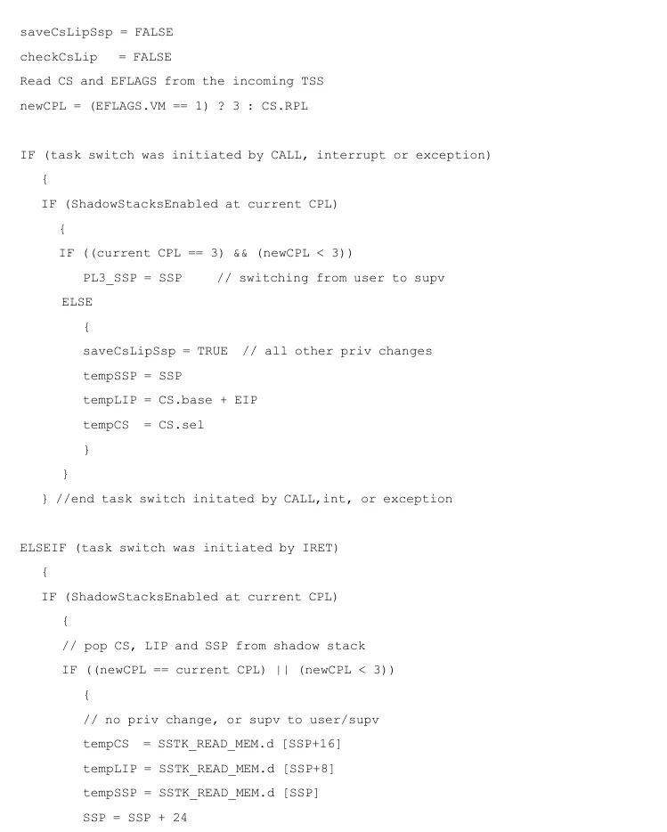

</details>


<!-- PDF source page: 445 | printed page: 383 -->

```text
checkCsLip = TRUE
```

```text
}
```

```text
// check shadow stack token and clear busy bit
```

```text
temp_Token = SSTK_READ_MEM.q [SSP]
// read supervisor sstk token
```

```text
expected_Token = SSP OR 0x01
// busy bit must be set
```

```text
IF (temp_token == expected token)
```

```text
SSTK_WRITE_MEM.q [SSP] = SSP // token OK, clear busy bit
```

```text
SSP = 0
```

```text
} // end shadow stacks enabled at current CPL
```

```text
} //end task switch initiated by IRET
```

- The new-task state is loaded from the TSS. This includes the next-instruction pointer (EIP), EFLAGS, the general-purpose registers, and the segment-selector registers. The processor clears the segment-descriptor present (P) bits (in the hidden portion of the segment registers) to prevent access into the new segments, until the task switch completes successfully.
- The LDTR and CR3 registers are loaded from the TSS, changing the virtual-to-physical mapping from that of the old task to the new task. Because this is done in the middle of accessing the new TSS, system software must ensure that TSS addresses are translated identically in all tasks.
- The descriptors for all previously-loaded segment selectors are loaded into the hidden portion of the segment registers. This sets or clears the P bits for the segments as specified by the new descriptor values.
- If shadow stacks are enabled (CR4.CET=1), the following shadow stack actions are performed:

```text
IF (ShadowStacksEnabled at current CPL)
```

```text
{
```

```text
IF (EFLAGS.VM == 1)
```

```text
EXCEPTION [#TSS(new task selector)]
```

```text
IF (task switch was initiated by a CALL, JMP, interrupt or exception)
```

```text
{
```

```text
newSSP = SSTK_READ_MEM.d [TSS offset 0x68] // read new SSP
```

```text
IF (newSSP[2:0] != 0)
// must be 8-byte aligned
```

```text
EXCEPTION [#TSS(new task selector)]
```

```text
// check token and set busy
```

<details>
<summary>Rendered source page 445 (figures/tables)</summary>

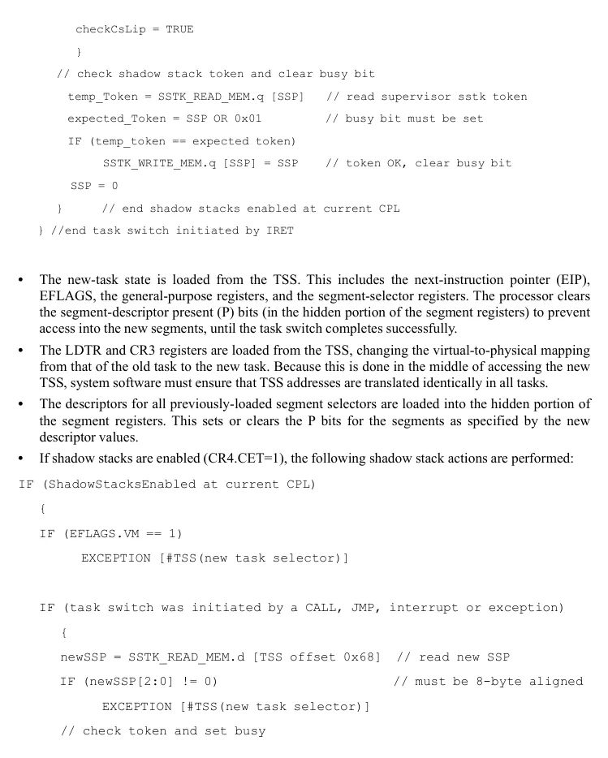

</details>


<!-- PDF source page: 446 | printed page: 384 -->

```text
temp_Token = SSTK_READ_MEM.q [newSSP] // read sstk token
```

```text
expected_Token = SSP
// busy bit must be clear
```

```text
IF (temp_token != expected_token)
// token must be valid
```

```text
EXCEPTION [#TSS(new task selector)]
```

```text
SSTK_WRITE_MEM.q [SSP] = SSP OR 0x01
// valid token, set busy bit
```

```text
SSP = newSSP
```

```text
IF (saveCsLipSsP == TRUE) // push old CS,LIP,SSP onto new sstk
```

```text
{
```

```text
SSTK_WRITE_MEM.q [SSP-24] = tempCS
```

```text
SSTK_WRITE_MEM.q [SSP-16] = tempLIP
```

```text
SSTK_WRITE_MEM.q [SSP-8] = tempSSP
```

```text
SSP = SSP - 24
```

```text
}
```

```text
} // end task switch initiated by CALL, JMP, interrupt or exception
```

```text
} // end shadow stacks enabled at current CPL
```

```text
ELSEIF (task switch was initiated by an IRET)
```

```text
{
```

```text
IF (checkCsLip == TRUE)
```

```text
{ // check CS, LIP against shadow stack
```

```text
IF (tempCS != CS)
```

```text
EXCEPTION [#CP(RETF/IRET)] // CS must match
```

```text
IF (tempLIP != (CS.base + EIP))
```

```text
EXCEPTION [#CP(RETF/IRET)] // LIP must match
```

```text
}
```

```text
IF ShadowStackEnabled at newCPL
```

```text
{
```

```text
IF (!checkCsLip)
```

<details>
<summary>Rendered source page 446 (figures/tables)</summary>

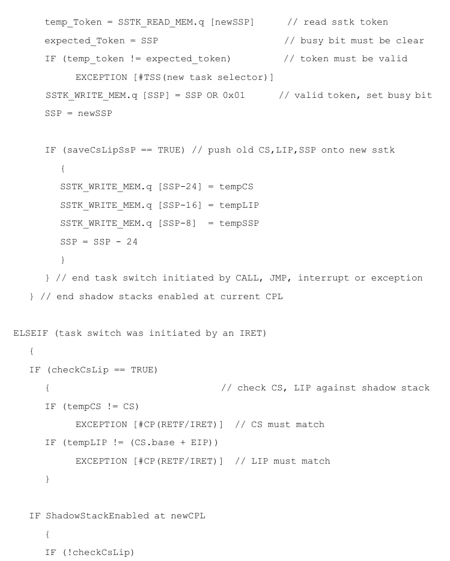

</details>


<!-- PDF source page: 447 | printed page: 385 -->

```text
tempSSP = PL3_SSP;
```

```text
IF (tempSSP[1:0] != 0) // SSP must be 4-byte aligned
```

```text
EXCEPTION [#CP(RETF/IRET)]
```

```text
IF (tempSSP[63:32] != 0) // and SSP must be <4 GB
```

```text
EXCEPTION [#CP(RETF/IRET)]
```

```text
SSP = tempSSP
```

```text
} // end shadow stacks enabled at new CPL
```

```text
} // end task swtich initiated by IRET
```

If the above steps complete successfully, the processor begins executing instructions in the new task beginning with the instruction referenced by the CS:EIP far pointer loaded from the new TSS. The privilege level of the new task is taken from the new CS segment selector’s RPL.

**Saving Other Processor State.** The processor does not automatically save the registers used by the media or x87 instructions. Instead, the processor sets CR0.TS to 1 during a task switch. Later, when an attempt is made to execute any of the media or x87 instructions while TS=1, a device-not-available exception (#NM) occurs. System software can then save the previous state of the media and x87 registers and clear the CR0.TS bit to 0 before executing the next media/x87 instruction. As a result, the media and x87 registers are saved only when necessary after a task switch.

<a id="12-3-3-task-switches-using-task-gates"></a>

### 12.3.3 Task Switches Using Task Gates

When a control transfer to a new task occurs through a task gate, the processor reads the task-gate DPL (DPLG) from the task-gate descriptor. Two privilege checks, both of which must pass, are performed on DPLG before the task switch can occur successfully:

- The processor compares the CPL with DPLG. The CPL must be numerically *less than or equal to* DPLG for this check to pass. In other words, the following expression must be true: CPL DPLG.
- The processor compares the RPL in the task-gate selector with DPLG. The RPL must be numerically *less than or equal to* DPLG for this check to pass. In other words, the following expression must be true: RPL DPLG.

Unlike call-gate control transfers, the processor does not read the DPL from the target TSS descriptor (DPLS) and compare it with the CPL when a task gate is used.

Figure 12-10 on page 387 shows two examples of task-gate privilege checks. In Example 1, the privilege checks pass:

- The task-gate DPL (DPLG) is at the lowest privilege (3), specifying that software running at any privilege level (CPL) can access the gate.
- The selector referencing the task gate passes its privilege check because the RPL is numerically less than or equal to DPLG.

<details>
<summary>Rendered source page 447 (figures/tables)</summary>

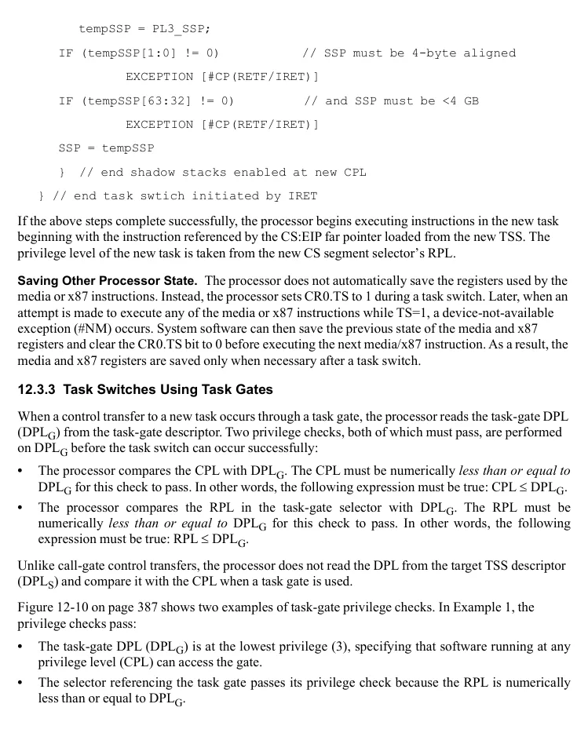

</details>


<!-- PDF source page: 448 | printed page: 386 -->

In Example 2, both privilege checks fail:

- The task-gate DPL (DPLG) specifies that only software at privilege-level 0 can access the gate. The current program does not have enough privilege to access the task gate, because its CPL is 2.
- The selector referencing the task-gate descriptor does not have a high enough privilege to complete the reference. Its RPL is numerically greater than DPLG.

Although both privilege checks failed in the example, if only one check fails, access into the target task is denied.

Because the legacy task-switch mechanism is not supported in long mode, *software cannot use task gates in long mode*. Any attempt to transfer control to another task using a task gate in long mode causes a general-protection exception (#GP) to occur.


<!-- PDF source page: 449 | printed page: 387 -->

**Figure 12-10. Privilege-Check Examples for Task Gates**

<details>
<summary>Extracted figure labels</summary>

```text
CS
CPL=2
Task-Gate
Selector
RPL=3
DPLG=3
Task-State
Segment
Task-Gate Descriptor
DPLS
Access Allowed
TSS Descriptor
Example 1: Privilege Check Passes
CS
CPL=2
Task-Gate
Selector
RPL=3
DPLG=0
Task-State
Segment
Task-Gate Descriptor
DPLS
Access Denied
TSS Descriptor
Example 2: Privilege Check Fails
513-255.eps
```

</details>

<a id="12-3-4-nesting-tasks"></a>

### 12.3.4 Nesting Tasks

The hardware task-switch mechanism supports task nesting through the use of EFLAGS *nested-task* (NT) bit and the TSS link-field. The manner in which these fields are updated and used during a task switch depends on how the task switch is initiated:

- The JMP instruction does not update EFLAGS.NT or the TSS link-field. Task nesting is not supported by the JMP instruction.

<details>
<summary>Rendered source page 449 (figures/tables)</summary>

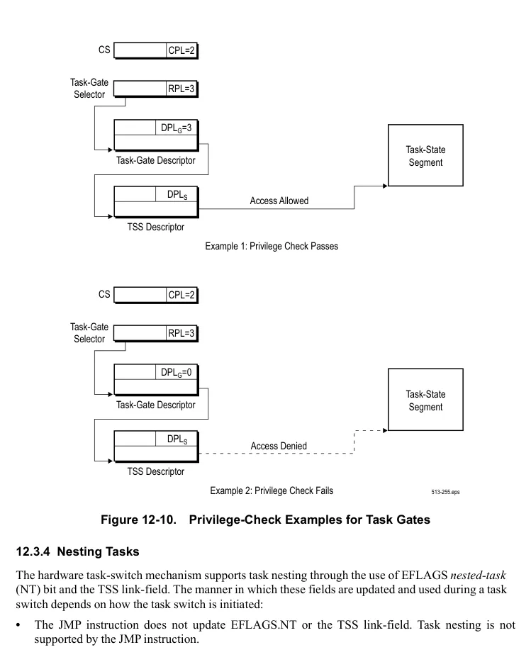

</details>


<!-- PDF source page: 450 | printed page: 388 -->

- The CALL instruction, INT*n* instructions, interrupts, and exceptions can only be performed from outer-level tasks to inner-level tasks. All of these operations set the EFLAGS.NT bit for the new task to 1 during a task switch, and copy the selector for the previous task into the new-task link field.
- An IRET instruction which returns to another task only occurs when the EFLAGS.NT bit for the current task is set to 1, and only can be performed from an inner-level task to an outer-level task. When an IRET results in a task switch, the new task is referenced using the selector stored in the current-TSS link field. The EFLAGS.NT bit for the current task is cleared to 0 during the task switch.

Table 12-1 summarizes the effect various task-switch initiators have on EFLAGS.NT, the TSS link-field, and the TSS-busy bit. (For more information on the busy bit, see the next section, “Preventing Recursion.”)

**Table 12-1. Effects of Task Nesting**

| Task-Switch<br>Initiato | Old Task / EFLAGS.NT | Old Task / Link<br>(Selector) | Old Task / Busy | New Task / EFLAGS.NT | New Task / Link<br>(Selector) | New Task / Busy |
| --- | --- | --- | --- | --- | --- | --- |
| JMP | — | — | Clear to 0<br>(was 1) | — | — | Set to 1 |
| CALL<br>INTn<br>Interrupt<br>Exception | — | — | —<br>(Was 1) | Set to 1 | Old Task | Set to 1 |
| IRET | Clear to 0<br>(was 1) | — | Clear to 0<br>(was 1) | — |  |  |
| Note:<br>“—” indicates no change is made. | Clear to 0<br>(was 1) | — |  |  |  |  |

Programs running at any privilege level can set EFLAGS.NT to 1 and execute the IRET instruction to transfer control to another task. System software can keep control over improperly nested-task switches by initializing the link field of all TSSs that it creates. That way, improperly nested-task switches always transfer control to a known task.

**Preventing Recursion.** Task recursion is not allowed by the hardware task-switch mechanism. If recursive-task switches were allowed, they would replace a previous task-state image with a newer image, discarding the previous information. To prevent recursion from occurring, the processor uses the busy bit located in the TSS-descriptor type field (bit 9 of byte +4). Use of this bit depends on how the task switch is initiated:

- The JMP instruction clears the busy bit in the old task to 0 and sets the busy bit in the new task to 1. A general-protection exception (#GP) occurs if an attempt is made to JMP to a task with a set busy bit.
- The CALL instruction, INT*n* instructions, interrupts, and exceptions set the busy bit in the new task to 1. The busy bit in the old task remains set to 1, preventing recursion through task-nesting

<details>
<summary>Rendered source page 450 (figures/tables)</summary>

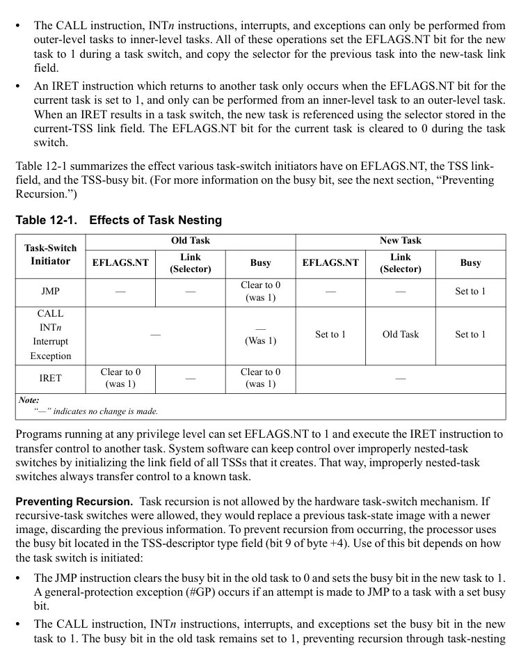

</details>


<!-- PDF source page: 451 | printed page: 389 -->

levels. A general-protection exception (#GP) occurs if an attempt is made to switch to a task with a set busy bit. **•** An IRET to another task (EFLAGS.NT must be 1) clears the busy bit in the old task to 0. The busy bit in the new task is not altered, because it was already set to 1.

Table 12-1 on page 388 summarizes the effect various task-switch initiators have on the TSS-busy bit.
