<!-- PDF source page: 452 | printed page: 390 -->

<a id="13-software-debug-and-performance-resources"></a>

# 13 Software Debug and Performance Resources

Testing, debug, and performance optimization consume a significant portion of the time needed to develop a new computer or software product and move it successfully into production. To stay competitive, product developers need tools that allow them to rapidly detect, isolate, and correct problems before a product is shipped. The goal of the debug and performance features incorporated into processor implementations of the AMD64 architecture is to support the tool chain solutions used in software and hardware product development.

The debug and performance resources that can be supported by AMD64 architecture implementations include:

- *Software Debug*—Software-debug facilities include the debug registers (DR0–DR7), debug exception, and breakpoint exception. Additional features are provided using model-specific registers (MSRs). These registers are used to set breakpoints on branches, interrupts, and exceptions and to single step from one branch to the next. The software-debug capability is described in the following section.
- *Performance Monitoring Counters*—Performance monitoring counters (PMCs) are provided to count specific processor hardware events. A set of control registers allow the selection of events to be monitored and a corresponding set of counter registers track the frequency of monitored events. These counters are described in Section 13.2 “Performance Monitoring Counters” on page 411.
- *Instruction-Based Sampling*— Instruction-based sampling is a hardware-based facility that enables system software to capture specific data concerning instruction fetch and instruction execution operation based on random sampling. This facility is described in Section 13.3 “Instruction-Based Sampling” on page 424.
- *Lightweight Profiling*—AMD64 architecture provides instructions that allow user-level programs to manage the gathering of instruction statistics using very little overhead. This facility is described in Section 13.4 “Lightweight Profiling” on page 438.

Although a subset of the facilities listed are available in all processor implementations, the remainder are optional. Support for optional facilities is indicated via CPUID feature bits. The means of determining support for each architected facility is described along with the facility in the sections that follow.

A given processor product may include additional debug and performance monitoring capabilities beyond those which are architecturally-defined. For details see the *BIOS and Kernel Developer’s Guide (BKDG)* or *Processor Programming Reference Manual (PPR)* applicable to your product.


<!-- PDF source page: 453 | printed page: 391 -->

<a id="13-1-software-debug-resources"></a>

## 13.1 Software-Debug Resources

Software can program breakpoints into the debug registers, causing a debug exception (#DB) when matches occur on instruction-memory addresses, data-memory addresses, or I/O addresses. The breakpoint exception (#BP) is also supported to allow software to set breakpoints by placing INT3 instructions in the instruction memory for a program. Program control is transferred to the breakpoint exception (#BP) handler when an INT3 instruction is executed.

In addition to the debug features supported by the debug registers (DR0–DR7), the processor also supports features supported by model-specific registers (MSRs). Together, these capabilities provide a rich set of breakpoint conditions, including:

- *Breakpoint On Address Match*—Breakpoints occur when the address stored in a address-breakpoint register matches the address of an instruction or data reference. Up to four address-match breakpoint conditions can be set by software.
- *Single Step All Instructions*—Breakpoints can be set to occur on every instruction, allowing a debugger to examine the contents of registers as a program executes.
- *Single Step Control Transfers*—Breakpoints can be set to occur on control transfers, such as calls, jumps, interrupts, and exceptions. This can allow a debugger to narrow a problem search to a specific section of code before enabling single stepping of all instructions.
- *Breakpoint On Any Instruction*—Breakpoints can be set on any specific instruction using either the address-match breakpoint condition or using the INT3 instruction to force a breakpoint when the instruction is executed.
- *Breakpoint On Task Switch*—Software forces a #DB exception to occur when a task switch is performed to a task with the T bit in the TSS set to 1. Debuggers can use this capability to enable or disable debug conditions for a specific task.
- *Breakpoint On Bus Lock* —The processor generates a #DB exception as a trap following the successful execution of a locked read-modify-write operation that requires a bus lock and the current privilege level (CPL) was &gt; 0. See Section 13.1.3.6 on page 407 for more information about Bus Lock traps.

Problem areas can be identified rapidly using the information supplied by the debug registers when breakpoint conditions occur:

- Special conditions that cause a #DB exception are recorded in the DR6 debug-status register, including breakpoints due to task switches and single stepping. The DR6 register also identifies which address-breakpoint register (DR0–DR3) caused a #DB exception due to an address match. When combined with the DR7 debug-control register settings, the cause of a #DB exception can be identified.
- To assist in analyzing the instruction sequence a processor follows in reaching its current state, the source and destination addresses of control-transfer events are saved by the processor. These include branches (calls and jumps), interrupts, and exceptions. Debuggers can use this information to narrow a problem search to a specific section of code before single stepping all instructions.


<!-- PDF source page: 454 | printed page: 392 -->

<a id="13-1-1-debug-registers"></a>

### 13.1.1 Debug Registers

The AMD64 architecture supports the legacy debug registers, DR0–DR7. These registers are expanded to 64 bits by the AMD64 architecture. In legacy mode and in compatibility mode, only the lower 32 bits are used. In these modes, writes to a debug register fill the upper 32 bits with zeros, and reads from a debug register return only the lower 32 bits. In 64-bit mode, all 64 bits of the debug registers are read and written. Operand-size prefixes are ignored.

The debug registers can be read and written only when the current-protection level (CPL) is 0 (most privileged). Attempts to read or write the registers at a lower-privilege level (CPL&gt;0) cause a general-protection exception (#GP).

Several debug registers described below are model-specific registers (MSRs). See “Software-Debug MSRs” on page 730 for a listing of the debug-MSR numbers and their reset values. Some processor implementations include additional MSRs used to support implementation-specific software debug features. For more information on these registers and their capabilities, see the *BIOS and Kernel Developer’s Guide (BKDG)* or *Processor Programming Reference Manual (PPR)* applicable to your product.

1. 13. 1.1.1 Address-Breakpoint Registers (DR0-DR3)**

Figure 13-1 shows the format of the four address-breakpoint registers, DR0-DR3. Software can load a virtual (linear) address into any of the four registers, and enable breakpoints to occur when the address matches an instruction or data reference. The MOV DR*n* instructions *do not* check that the virtual addresses loaded into DR0–DR3 are in canonical form. Breakpoint conditions are enabled using the debug-control register, DR7 (see “Debug-Control Register (DR7)” on page 394).

**Figure 13-1. Address-Breakpoint Registers (DR0–DR3)**

<details>
<summary>Extracted figure labels</summary>

```text
63
0
Breakpoint 0 64-bit Virtual (linear) Address
63
0
Breakpoint 1 64-bit Virtual (linear) Address
63
0
Breakpoint 2 64-bit Virtual (linear) Address
63
0
Breakpoint 3 64-bit Virtual (linear) Address
```

</details>

<details>
<summary>Rendered source page 454 (figures/tables)</summary>

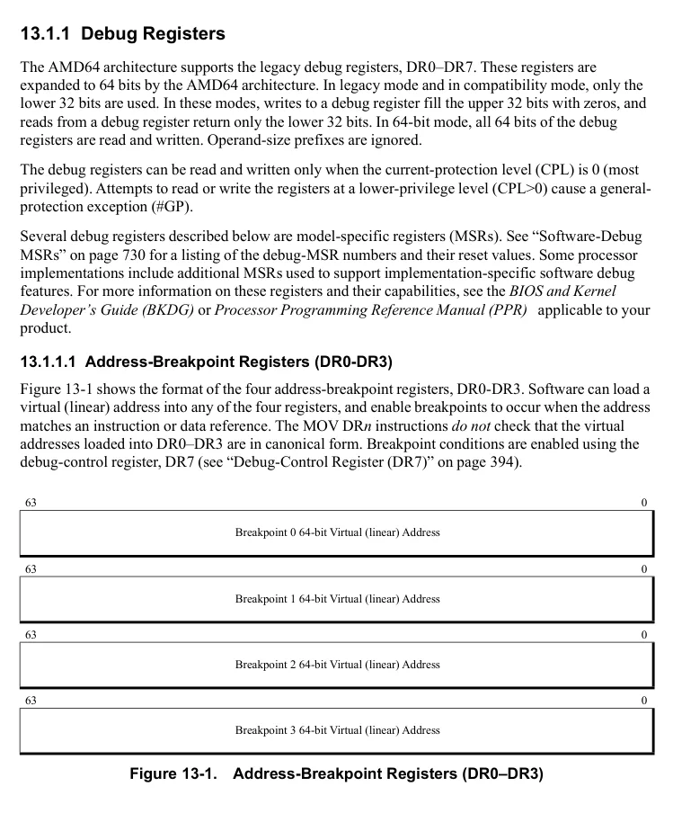

</details>


<!-- PDF source page: 455 | printed page: 393 -->

1. 13. 1.1.2 Reserved Debug Registers (DR4, DR5)**

The DR4 and DR5 registers are reserved and should not be used by software. These registers are aliased to the DR6 and DR7 registers, respectively. When the debug extensions are enabled (CR4[DE] = 1) attempts to access these registers cause an invalid-opcode exception (#UD).

1. 13. 1.1.3 Debug-Status Register (DR6)**

Figure 13-2 on page 393 shows the format of the debug-status register, DR6. Debug status is loaded into DR6 when an enabled debug condition is encountered that causes a #DB exception.

63 32

Reserved

31 16 15 14 13 12 11 10 4 3 2 1 0

Reserved

BLD

Reserved

BD

BT

BS

B3

B2

B1

B0

**Bits Mnemonic Description Access type** 63:32 Reserved MBZ 31:16 Reserved RA1 15 BT Breakpoint Task Switch R/W 14 BS Breakpoint Single Step R/W 13 BD Breakpoint Debug Access Detected R/W 12 Reserved RAZ 11 BLD Bus Lock Detected R/W 10:4 Reserved RA1 3 B3 Breakpoint #3 Condition Detected R/W 2 B2 Breakpoint #2 Condition Detected R/W 1 B1 Breakpoint #1 Condition Detected R/W 0 B0 Breakpoint #0 Condition Detected R/W

**Figure 13-2. Debug-Status Register (DR6)**

Bits 15:13 of the DR6 register are not cleared by the processor and must be cleared by software after the contents have been read. Register fields are:

- *Breakpoint-Condition Detected (B3–B0)*—Bits 3:0. The processor updates these four bits on every debug breakpoint or general-detect condition. A bit is set to 1 if the corresponding address-breakpoint register detects an enabled breakpoint condition, as specified by the DR7 L*n,* G*n,* R/W*n* and LEN*n* controls, and is cleared to 0 otherwise. For example, B1 (bit 1) is set to 1 if an address-breakpoint condition is detected by DR1.
- *Bus Lock Detected (BLD)*—Bit 11. The processor clears this bit if #DB was generated due to a bus lock. Other sources of #DB do not modify this bit.

<details>
<summary>Rendered source page 455 (figures/tables)</summary>

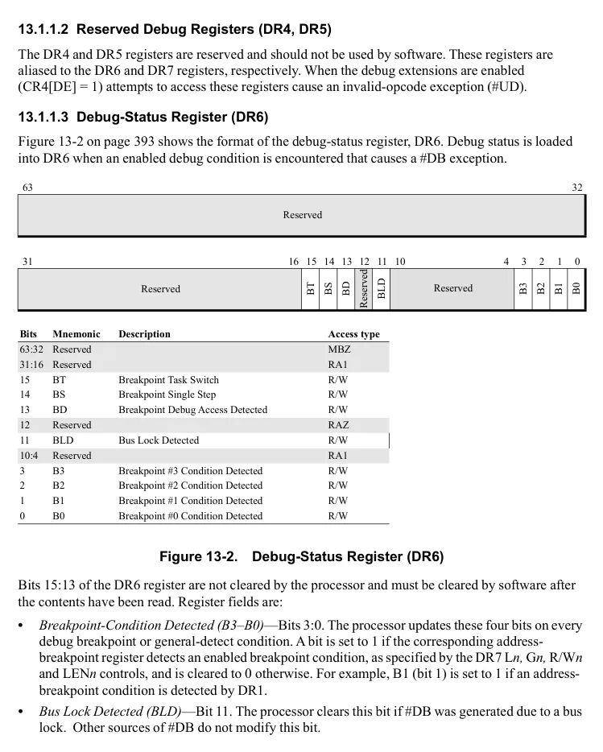

</details>


<!-- PDF source page: 456 | printed page: 394 -->

- *Debug-Register-Access Detected (BD)*—Bit 13. The processor sets this bit to 1 if software accesses any debug register (DR0–DR7) while the general-detect condition is enabled (DR7[GD] = 1).
- *Single Step (BS)*—Bit 14. The processor sets this bit to 1 if the #DB exception occurs as a result of single-step mode (rFLAGS[TF] = 1). Single-step mode has the highest-priority among debug exceptions. Other status bits within the DR6 register can be set by the processor along with the BS bit.
- *Task-Switch (BT)*—Bit 15. The processor sets this bit to 1 if the #DB exception occurred as a result of task switch to a task with a TSS T-bit set to 1.

All remaining bits in the DR6 register are reserved. Reserved bits 31:16 and 11:4 must all be set to 1, while reserved bit 12 must be cleared to 0. In 64-bit mode, the upper 32 bits of DR6 are reserved and must be written with zeros. Writing a 1 to any of the upper 32 bits results in a general-protection exception, #GP(0).

1. 13. 1.1.4 Debug-Control Register (DR7)**

Figure 13-3 shows the format of the debug-control register, DR7. DR7 is used to establish the breakpoint conditions for the address-breakpoint registers (DR0–DR3) and to enable debug exceptions for each address-breakpoint register individually. DR7 is also used to enable the general-detect breakpoint condition.


<!-- PDF source page: 457 | printed page: 395 -->

63 32

Reserved

31 30 29 28 27 26 25 24 23 22 21 20 19 18 17 16 15 14 13 12 11 10 9 8 7 6 5 4 3 2 1 0

Reserved

GD

LEN3 R/W3 LEN2 R/W2 LEN1 R/W1 LEN0 R/W0

GE

LE

G3

G2

G1

G0

L3

L2

L1

L0

**Bits Mnemonic Description Access type** 63:32 Reserved MBZ 31:30 LEN3 Length of Breakpoint #3 R/W 29:28 R/W3 Type of Transaction(s) to Trap R/W 27:26 LEN2 Length of Breakpoint #2 R/W 25:24 R/W2 Type of Transaction(s) to Trap R/W 23:22 LEN1 Length of Breakpoint #1 R/W 21:20 R/W1 Type of Transaction(s) to Trap R/W 19:18 LEN0 Length of Breakpoint #0 R/W 17:16 R/W0 Type of Transaction(s) to Trap R/W 15:14 Reserved RAZ 13 GD General Detect Enabled R/W 12:11 Reserved RAZ 10 Reserved RA1 9 GE Global Exact Breakpoint Enabled R/W 8 LE Local Exact Breakpoint Enabled R/W 7 G3 Global Exact Breakpoint #3 Enabled R/W 6 L3 Local Exact Breakpoint #3 Enabled R/W 5 G2 Global Exact Breakpoint #2 Enabled R/W 4 L2 Local Exact Breakpoint #2 Enabled R/W 3 G1 Global Exact Breakpoint #1 Enabled R/W 2 L1 Local Exact Breakpoint #1 Enabled R/W 1 G0 Global Exact Breakpoint #0 Enabled R/W 0 L0 Local Exact Breakpoint #0 Enabled R/W

**Figure 13-3. Debug-Control Register (DR7)**

The fields within the DR7 register are all read/write. These fields are:

- *Local-Breakpoint Enable (L3–L0)*—Bits 6, 4, 2, and 0 (respectively). Software individually sets these bits to 1 to enable debug exceptions to occur when the corresponding address-breakpoint register (DR*n*) detects a breakpoint condition while executing the *current* task. For example, if L1 (bit 2) is set to 1 and an address-breakpoint condition is detected by DR1, a #DB exception occurs. These bits are cleared to 0 by the processor when a hardware task-switch occurs.
- *Global-Breakpoint Enable (G3–G0)*—Bits 7, 5, 3, and 1 (respectively). Software sets these bits to 1 to enable debug exceptions to occur when the corresponding address-breakpoint register (DR*n*) detects a breakpoint condition while executing *any* task. For example, if G1 (bit 3) is set to 1 and an

<details>
<summary>Rendered source page 457 (figures/tables)</summary>

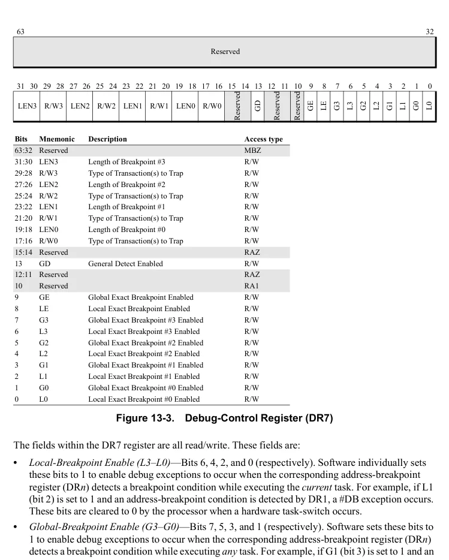

</details>


<!-- PDF source page: 458 | printed page: 396 -->

address-breakpoint condition is detected by DR1, a #DB exception occurs. These bits are never cleared to 0 by the processor. **•* Local-Enable (LE)*—Bit 8. Software sets this bit to 1 in legacy implementations to enable exact breakpoints while executing the *current* task. This bit is ignored by implementations of the AMD64 architecture. All breakpoint conditions, except certain string operations preceded by a repeat prefix, are exact. **•* Global-Enable (GE)*—Bit 9. Software sets this bit to 1 in legacy implementations to enable exact breakpoints while executing *any* task. This bit is ignored by implementations of the AMD64 architecture. All breakpoint conditions, except certain string operations preceded by a repeat prefix, are exact. **•* General-Detect Enable (GD)*—Bit 13. Software sets this bit to 1 to cause a debug exception to occur when an attempt is made to execute a MOV DR*n* instruction to any debug register (DR0–DR7). This bit is cleared to 0 by the processor when the #DB handler is entered, allowing the handler to read and write the DR*n* registers. The #DB exception occurs before executing the instruction, and DR6[BD] is set by the processor. Software debuggers can use this bit to prevent the currently-executing program from interfering with the debug operation. **•* Read/Write (R/W3–R/W0)*—Bits 29:28, 25:24, 21:20, and 17:16 (respectively). Software sets these fields to control the breakpoint conditions used by the corresponding address-breakpoint registers (DR*n*). For example, control-field R/W1 (bits 21:20) controls the breakpoint conditions for the DR1 register. The R/W*n* control-field encodings specify the following conditions for an address-breakpoint to occur: -00—Only on instruction execution. -01—Only on data write. -10—This encoding is further qualified by CR4[DE] as follows: . CR4[DE] = 0—Condition is undefined. . CR4[DE] = 1—Only on I/O read or I/O write. -11—Only on data read or data write. **•* Length (LEN3–LEN0)*—Bits 31:30, 27:26, 23:22, and 19:18 (respectively). Software sets these fields to control the range used in comparing a memory address with the corresponding address-breakpoint register (DR*n*). For example, control-field LEN1 (bits 23:22) controls the breakpoint-comparison range for the DR1 register. The value in DR*n* defines the low-end of the address range used in the comparison. LEN*n* is used to mask the low-order address bits in the corresponding DR*n* register so that they are not used in the address comparison. To work properly, breakpoint boundaries must be aligned on an address corresponding to the range size specified by LEN*n*. The LEN*n* control-field encodings specify the following address-breakpoint-comparison ranges: -00—1 byte. -01—2 byte, must be aligned on a word boundary. -10—8 byte, must be aligned on a quadword boundary. (Long mode only; otherwise undefined.)


<!-- PDF source page: 459 | printed page: 397 -->

- 11—4 byte, must be aligned on a doubleword boundary. If the R/W*n* field is used to specify instruction breakpoints (R/W*n*=00), the corresponding LEN*n* field must be set to 00. Setting LEN*n* to any other value produces undefined results.

All remaining bits in the DR7 register are reserved. Reserved bits 15:14 and 12:11 must all be cleared to 0, while reserved bit 10 must be set to 1. In 64-bit mode, the upper 32 bits of DR7 are reserved and must be written with zeros. Writing a 1 to any of the upper 32 bits results in a general-protection #GP(0) exception.

1. 13. 1.1.5 64-Bit-Mode Extended Debug Registers**

In 64-bit mode, additional encodings for debug registers are available. The R bit of the REX prefix is used to modify the ModRM *reg* field when that field encodes a control register. These additional encodings enable the processor to address DR8–DR15.

Access to the DR8–DR15 registers is implementation-dependent. The architecture does not require any of these extended debug registers to be implemented. Any attempt to access an unimplemented register results in an invalid-opcode exception (#UD).

1. 13. 1.1.6 Debug-Control MSR (DebugCtl)**

Figure 13-4 on page 398 shows the format of the debug-control MSR (DebugCtl). DebugCtl provides additional debug controls over control-transfer recording and single stepping, and external-breakpoint reporting and trace messages. DebugCtl is read and written using the RDMSR and WRMSR instructions.


<!-- PDF source page: 460 | printed page: 398 -->

63 32

Reserved

31 13 12 11 10 7 6 3 2 1 0

BLCKDB

FPMCI

FLBRI

LBR

BTF

Reserved

Reserved Reserved

**Bits Mnemonic Description Access type** 63:13 Reserved RAZ

12 FPMCI Freeze Core Performance Monitor Counters on PMC interrupt R/W

11 FLBRI Freeze LBR Stack on PMC interrupt R/W 10:7 Reserved RAZ 6:3 Reserved MBZ 2 BLCKDB Bus Lock #DB trap enabled R/W 1 BTF Branch Single Step R/W 0 LBR Last-Branch Record R/W

**Figure 13-4. Debug-Control MSR (DebugCtl)**

The fields within the DebugCtl register are:

- *Last-Branch Record (LBR)*—Bit 0, read/write. Software sets this bit to 1 to cause the processor to record the source and target addresses of the last control transfer taken before a debug exception occurs. The recorded control transfers include branch instructions, interrupts, and exceptions. See “Control-Transfer Breakpoint Features” on page 409 for more details on the registers. See Figure 13-5 on page 399 for the format of the control-transfer recording MSRs.
- *Branch Single Step (BTF)*—Bit 1, read/write. Software uses this bit to change the behavior of the rFLAGS[TF] bit. When this bit is cleared to 0, the rFLAGS[TF] bit controls instruction single stepping, (normal behavior). When this bit is set to 1, the rFLAGS[TF] bit controls single stepping on control transfers. The single-stepped control transfers include branch instructions, interrupts, and exceptions. Control-transfer single stepping requires both BTF = 1 and rFLAGS[TF] = 1. See “Control-Transfer Breakpoint Features” on page 409 for more details on control-transfer single stepping.
- *Bus Lock #DB Trap (BLCKDB)*—Bit 2, read/write. Software sets this bit to enable generation of a #DB trap following successful exection of a bus lock when CPL is &gt; 0. See Section 7.3.3 on page 195 for information on the conditions that cause a bus lock. Section 13.1.3.6 on page 407 describes bus lock #DB trap in more detail.
- *Freeze LBR Stack on PMC Interrupt (FLBRI)*—Bit 11, read/write. Software sets this bit to freeze the Last Branch Record (LBR) Stack when one of the Core Performance Counters overflows and is

<details>
<summary>Rendered source page 460 (figures/tables)</summary>

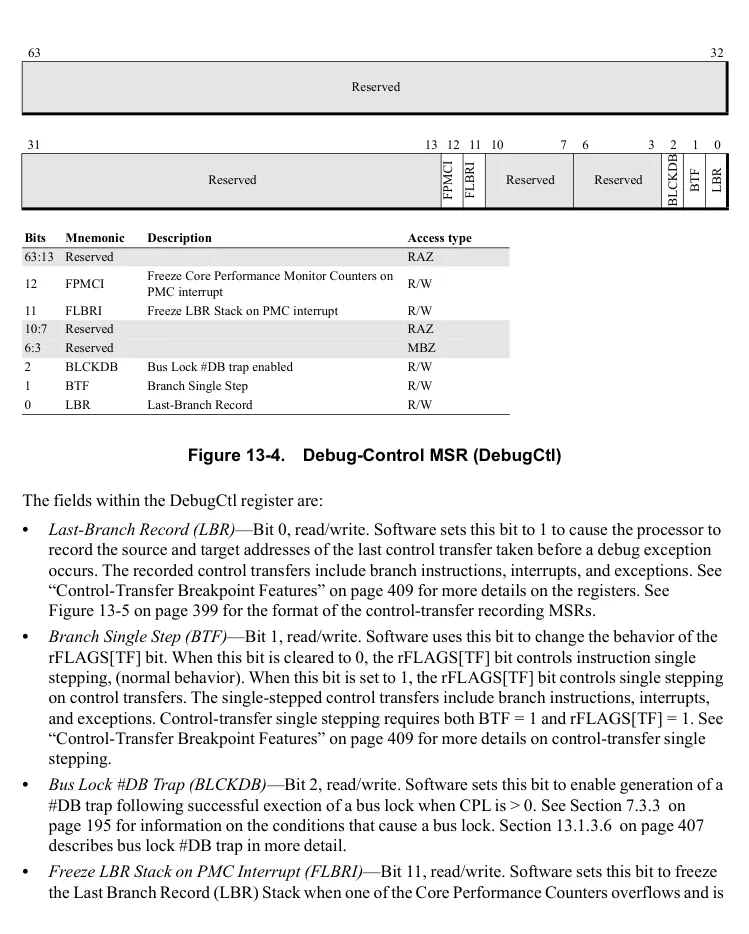

</details>


<!-- PDF source page: 461 | printed page: 399 -->

configured to signal a PMC overflow event. Support for this feature is indicated by CPUID Fn8000_0022_EAX[LbrAndPmcFreeze](bit 2) = 1. **•* Freeze PMC on PMC interrupt (FPMCI)*—Bit 12, read/write. Software sets this bit to freeze the Core Performance Counters when one of these counters overflows and is configured to signal a PMC overflow event. Support for this feature is indicated by CPUID Fn8000_0022_EAX[LbrAndPmcFreeze](bit 2) = 1.

All remaining bits in the DebugCtl register are reserved.

1. 13. 1.1.7 Control-Transfer Recording MSRs**

Figure 13-5 on page 399 shows the format of the 64-bit control-transfer recording MSRs: LastBranchToIP, LastBranchFromIP, LastIntToIP, and LastIntFromIP. These registers are loaded automatically by the processor when the DebugCtl[LBR] bit is set to 1. These MSRs are read-only.

**Figure 13-5. Control-Transfer Recording MSRs**

<details>
<summary>Extracted figure labels</summary>

```text
63
0
LastBranchToIP - 64-bit Segment Offset (RIP)
63
0
LastBranchFromIP - 64-bit Segment Offset (RIP)
63
0
LastIntToIP - 64-bit Segment Offset (RIP)
63
0
LastIntFromIP - 64-bit Segment Offset (RIP)
```

</details>

1. 13. 1.1.8 Debug-Extension-Control MSR (DebugExtnCtl)**

Figure 13-6 shows the format of the Debug-Extension-Control MSR (DebugExtnCtl). DebugExtnCtl is supported on processors that support Last Branch Record Stack (see Section 13.1.8, “Last Branch Record Stack,” on page 410) and provides control over enabling Last Branch Record Stack recording.

<details>
<summary>Rendered source page 461 (figures/tables)</summary>

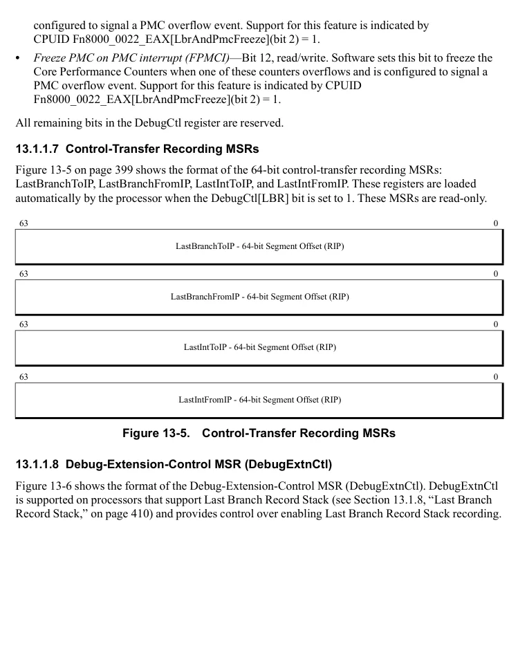

</details>


<!-- PDF source page: 462 | printed page: 400 -->

**Figure 13-6. Debug-Extension-Control MSR (DebugExtnCtl)**

<details>
<summary>Extracted figure labels</summary>

```text
63
32
Reserved
31
6
5
0
LBRSE
Reserved
Bits
Mnemonic
Description
Access type
63:7
Reserved
MBZ
6
LBRSE
LBR Stack Enable
R/W
5:0
Reserved
MBZ
```

</details>

The fields within the DebugExtnCtl register are:

- *Last-Branch Record Stack Enable (LBRSE)*—Bit 6, read/write. Software sets this bit to 1 to cause the source and target address of control transfer instructions to be recorded on the LBR stack. The processor clears this bit when #DB exception occurs. Support for LBR Stack is indicated by CPUID Fn8000_0022_EAX[LbrStack](bit 1) = 1.

1. 13. 1.1.9 Last Branch Stack Registers**

Figure 13-7 and Figure 13-8 show the format of the LastBranchStackFromIp and LastStackToIp MSRs. These MSRs provide access to the Last Branch Record Stack. These MSRs are supported on processors with CPUID Fn8000_0022_EAX[LbrStack] = 1. There are LBR_SIZE = CPUID Fn8000_0022_EBX[LbrStackSize] instances for each MSR. The Last Branch Record functionality is described in Section 13.1.8, “Last Branch Record Stack,” on page 410.

**Figure 13-7. LastBranchStackFromIp MSR**

<details>
<summary>Extracted figure labels</summary>

```text
63 62
57 56
0
M
Reserved
BranchFromIp
Bits
Mnemonic
Description
Access type
63
M
Mispredict
R/W
62:57
Reserved
56:0
BranchFromIp Segment offset of the recorded branch
R/W
```

</details>

<details>
<summary>Rendered source page 462 (figures/tables)</summary>

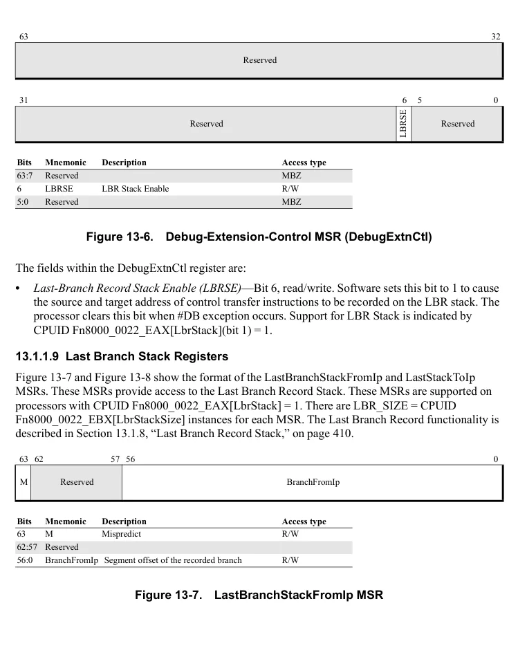

</details>


<!-- PDF source page: 463 | printed page: 401 -->

The fields within LastBranchStackFromIp are:

- *Mispredict*—Bit 63, read/write. The processor sets this bit to 1 when the recorded branch was mispredicted.
- *BranchFromIp*—Bits 56:0, read/write. The processor records either the segment offset of the branch itself or the instruction preceding the branch. It can only record the segment offset of an instruction preceding the branch if that instruction is not a branch itself. Recording the IP of an instruction preceding the branch is the result of branch fusion. If it is desired that BranchFromIp only records the address of branches, Branch Fusion needs to be disabled by also enabling Legacy LBR via DbgCfg[LBR].

**Figure 13-8. LastBranchStackToIp MSR**

<details>
<summary>Extracted figure labels</summary>

```text
63 62 61
57 56
0
SPEC
Reserved
BranchToIp
V
Bits
Mnemonic
Description
Access type
63
V
Valid
R/W
62
SPEC
Speculative
R/W
61:57
Reserved
56:0
BranchToIp
R/W
```

</details>

The fields within LastBranchStackToIp are:

- *Valid*—Bit 63, read/write. The processor sets this bit to 1 when the recorded branch entry is valid.
- *Speculative*—Bit 62, read/write. The processor sets this bit when the branch entry was recorded when a speculative performance feature was active.
- *BranchToIp*—Bits 56:0, read/write. The processor records the segment offset of the branch target.

Figure 13-9 shows the format of the LastBranchStackSelect MSR. LastBranchStackSelect controls the recording of branches to the Last Branch Record Stack. This MSR is supported on processors with CPUID Fn8000_0022_EAX[LbrStack] = 1.

<details>
<summary>Rendered source page 463 (figures/tables)</summary>

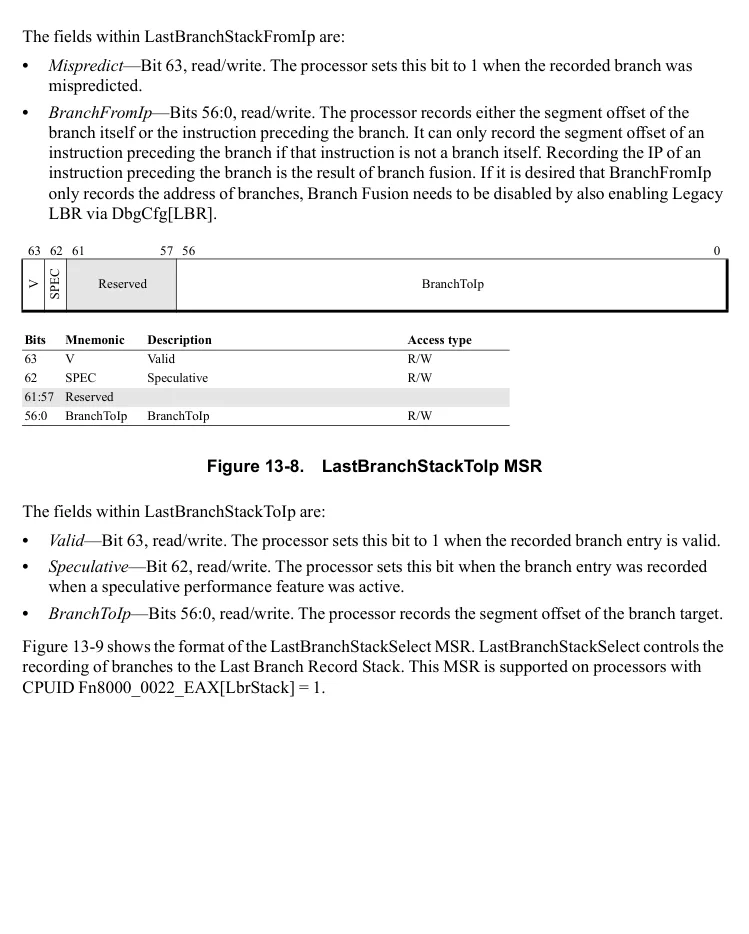

</details>


<!-- PDF source page: 464 | printed page: 402 -->

63 9 8 7 6 5 4 3 2 1 0

JmpNearRel

CallNearRel

JmpNearInd

CallNearInd

FarBranch

RetNear

CplEq0

CplGt0

Reserved

Jcc

**Bits Mnemonic Description Access type** 63:9 Reserved RAZ 8 FarBranch Suppress recording of far branches R/W 7 JmpNearRel Suppress recording of near relative jumps R/W 6 JumpNearInd Suppress recording of near indirect jumps R/W 5 RetNear Suppress recording of near returns R/W 4 CallNearInd Suppress recording of indirect near calls R/W 3 CallNearRel Suppress recording of relative near calls R/W 2 Jcc Suppress recording of conditional branches R/W 1 CplGt0 Suppress recording of branches ending in CPL &gt; 0 R/W 0 CplEq0 Suppress recording of branches ending in CPL = 0 R/W

**Figure 13-9. LastBranchStackSelect MSR**

The fields within LbrSelect are:

- *CplEq0*—Bit 0, read/write. When set, the LBR Stack does not record branches ending in CPL = 0.
- *CplGt0*—Bit 1, read/write. When set, the LBR Stack does not record branches ending in CPL &gt; 0.
- *Jcc*—Bit 2, read/write. When set, the LBR Stack does not record conditional near branches.
- *CallNearRel*—Bit 3, read/write. When set, the LBR Stack does not record direct (relative) near calls.
- *CallNearInd*—Bit 4, read/write. When set, the LBR Stack does not record indirect near calls.
- *RetNear*—Bit 5, read/write. When set, the LBR Stack does not record near returns.

- *JmpNearInd*—Bit 6, read/write. When set, the LBR Stack does not record near indirect jumps.
- *JmpNearRel*—Bit 7, read/write. When set, the LBR Stack does not record near direct (relative) jumps.
- *FarBranch*—Bit 8, read/write. When set, the LBR Stack does not record far branches.

<a id="13-1-2-setting-breakpoints"></a>

### 13.1.2 Setting Breakpoints

Breakpoints can be set to occur on either instruction addresses or data addresses using the breakpoint-address registers, DR0–DR3 (DR*n*). The values loaded into these registers represent the breakpoint-location virtual address. The debug-control register, DR7, is used to enable the breakpoint registers and to specify the type of access and the range of addresses that can trigger a breakpoint.

<details>
<summary>Rendered source page 464 (figures/tables)</summary>

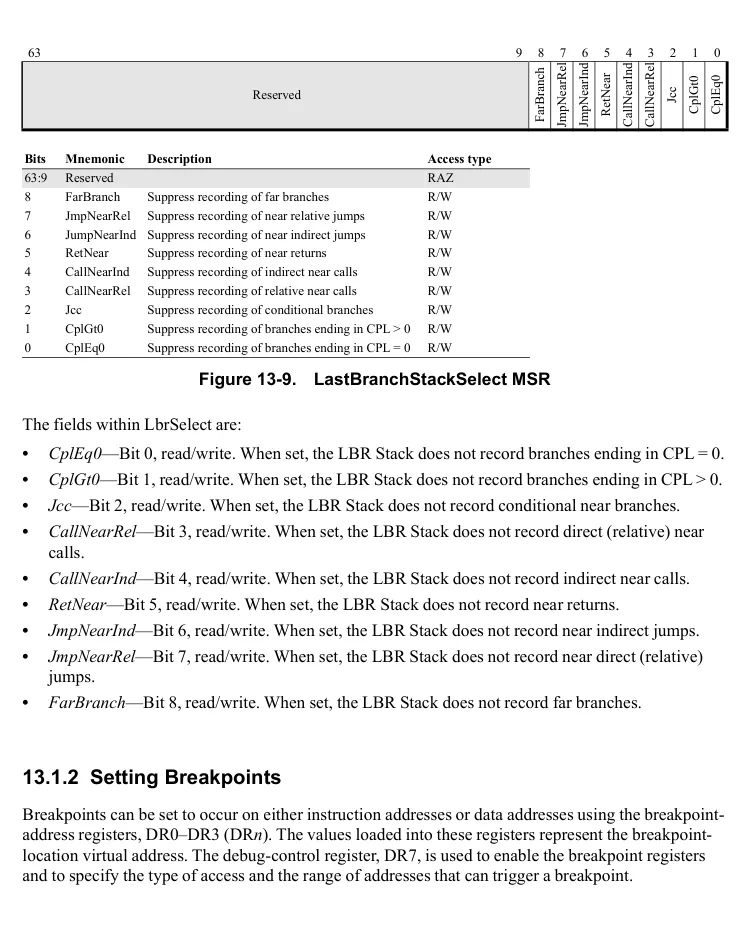

</details>


<!-- PDF source page: 465 | printed page: 403 -->

Software enables the DR*n* registers using the corresponding local-breakpoint enable (L*n*) or global-breakpoint enable (G*n*) found in the DR7 register. L*n* is used to enable breakpoints only while the current task is active, and it is cleared by the processor when a task switch occurs. G*n* is used to enable breakpoints for all tasks, and it is never cleared by the processor.

The R/W*n* fields in DR7, along with the CR4[DE] bit, specify the type of access required to trigger a breakpoint when an address match occurs on the corresponding DR*n* register. Breakpoints can be set to occur on instruction execution, data reads and writes, and I/O reads and writes. The R/W*n* and CR4[DE] encodings used to specify the access type are described on page 396 of “Debug-Control Register (DR7).”

The LEN*n* fields in DR7 specify the size of the address range used in comparison with data or instruction addresses. LEN*n* is used to mask the low-order address bits in the corresponding DR*n* register so that they are not used in the address comparison. Breakpoint boundaries must be aligned on an address corresponding to the range size specified by LEN*n*. Assuming the access type matches the type specified by R/W*n*, a breakpoint occurs if any accessed byte falls within the range specified by LEN*n*. For instruction breakpoints, LEN*n* must specify a single-byte range. The LEN*n* encodings used to specify the address range are described on page 396 of “Debug-Control Register (DR7).”

Table 13-1 shows several examples of data accesses, and whether or not they cause a #DB exception to occur based on the breakpoint address in DR*n* and the breakpoint-address range specified by LEN*n*. In this table, R/W*n* always specifies read/write access.

**Table 13-1. Breakpoint-Setting Examples**

| Data-Access Address<br>(hexadecimal) | Access Size<br>(bytes) | Byte-Addresses in Data-Access<br>(hexadecimal) | Breakpoint-Address Range<br>(hexadecimal) | Result |
| --- | --- | --- | --- | --- |
| DRn=F000, LENn=00 (1 Byte) |  |  |  |  |
| DRn=F005, LENn=10 (8 Bytes) |  |  |  |  |
| EFFB | 8 | EFFB, EFFC, EFFD, EFFE,<br>EFFF, F000, F001 | F000–F007 | #DB |
| EFFE | 2 | EFFE, EFFF |  | — |
| EFFE | 4 | EFFE, EFFF, F000, F001 |  | #DB |
| F000 | 1 | F000 |  |  |
| F001 | 2 | F001, F002 |  |  |
| F005 | 4 | F005, F006, F007, F008 |  |  |
| Note:<br>“—” indicates no #DB occurs. | 4 | F005, F006, F007, F008 |  |  |

<details>
<summary>Rendered source page 465 (figures/tables)</summary>

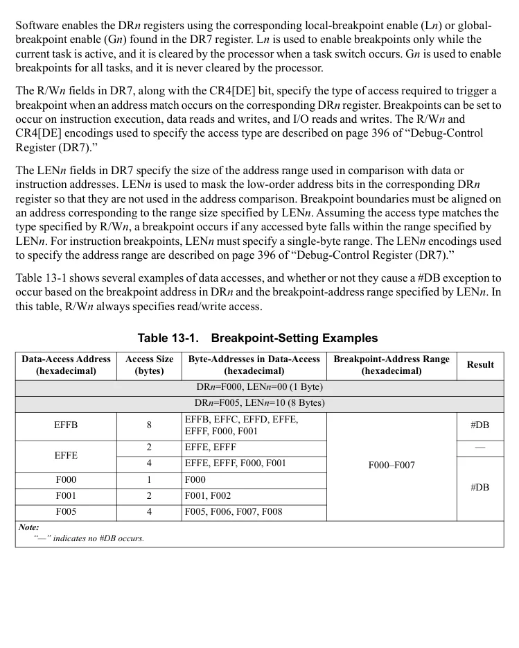

</details>


<!-- PDF source page: 466 | printed page: 404 -->

**Table 13-1. Breakpoint-Setting Examples (continued)**

| Data-Access Address<br>(hexadecimal) | Access Size<br>(bytes) | Byte-Addresses in Data-Access<br>(hexadecimal) | Breakpoint-Address Range<br>(hexadecimal) | Result |
| --- | --- | --- | --- | --- |
| EFFB | 8 | EFFB, EFFC, EFFD, EFFE,<br>EFFF, F000, F001 | F000 | #DB |
| EFFE | 2 | EFFE, EFFF |  | — |
| EFFE | 4 | EFFE, EFFF, F000, F001 |  | #DB |
| F000 | 1 | F000 |  |  |
| F001 | 2 | F001, F002 |  | — |
| F005 | 4 | F005, F006, F007, F008 |  |  |
| DRn=F004, LENn=11 (4 Bytes) | 4 | F005, F006, F007, F008 |  |  |
| EFFB | 8 | EFFB, EFFC, EFFD, EFFE,<br>EFFF, F000, F001 | F004–F007 | — |
| EFFE | 2 | EFFE, EFFF |  |  |
| EFFE | 4 | EFFE, EFFF, F000, F001 |  |  |
| F000 | 1 | F000 |  |  |
| F001 | 2 | F001, F002 |  |  |
| F005 | 4 | F005, F006, F007, F008 |  | #DB |
| DRn=F005, LENn=10 (8 Bytes) | 4 | F005, F006, F007, F008 |  |  |
| EFFB | 8 | EFFB, EFFC, EFFD, EFFE,<br>EFFF, F000, F001 | F000–F007 | #DB |
| EFFE | 2 | EFFE, EFFF |  | — |
| EFFE | 4 | EFFE, EFFF, F000, F001 |  | #DB |
| F000 | 1 | F000 |  |  |
| F001 | 2 | F001, F002 |  |  |
| F005 | 4 | F005, F006, F007, F008 |  |  |
| Note:<br>“—” indicates no #DB occurs. | 4 | F005, F006, F007, F008 |  |  |

<a id="13-1-3-using-breakpoints"></a>

### 13.1.3 Using Breakpoints

A debug exception (#DB) occurs when an enabled-breakpoint condition is encountered during program execution. The debug-handler must check the debug-status register (DR6), the conditions enabled by the debug-control register (DR7), and the debug-control MSR (DebugCtl), to determine the #DB cause. The #DB exception corresponds to interrupt vector 1. See “#DB—Debug Exception (Vector 1)” on page 248.

Instruction breakpoints and general-detect conditions cause the #DB exception to occur *before* the instruction is executed, while all other breakpoint and single-stepping conditions cause the #DB exception to occur *after* the instruction is executed. Table 13-2 summarizes where the #DB exception occurs based on the breakpoint condition.

<details>
<summary>Rendered source page 466 (figures/tables)</summary>

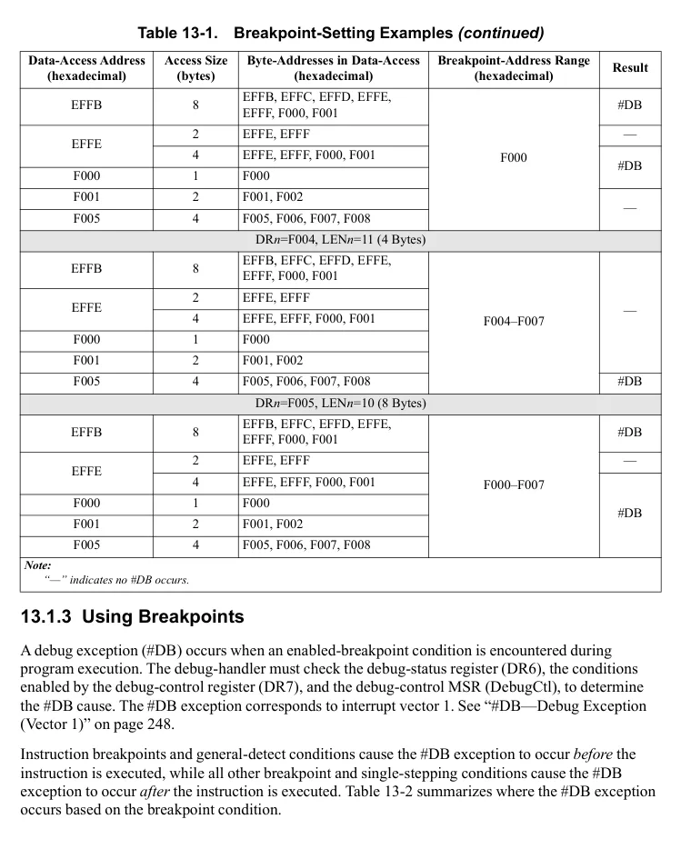

</details>


<!-- PDF source page: 467 | printed page: 405 -->

**Table 13-2. Breakpoint Location by Condition**

| Breakpoint Condition | Breakpoint Location |
| --- | --- |
| Instruction | Before Instruction is Executed |
| General Detect | Before Instruction is Executed |
| Data Write Only | After Instruction is Executed1 |
| Data Read or Data Write | After Instruction is Executed1 |
| I/O Read or I/O Write | After Instruction is Executed1 |
| Single Step1 | After Instruction is Executed |
| Task Switch | After Instruction is Executed |
| Note:<br>1. Repeated operations (REP prefix) can breakpoint between iterations. | After Instruction is Executed |

Instruction breakpoints and general-detect conditions have a lower interrupt-priority than the other breakpoint and single-stepping conditions (see “Priorities” on page 264). Data-breakpoint conditions on the *previous* instruction occur before an instruction-breakpoint condition on the *next* instruction. However, if instruction and data breakpoints can occur as a result of executing a *single* instruction, the instruction breakpoint occurs first (before the instruction is executed), followed by the data breakpoint (after the instruction is executed).

1. 13. 1.3.1 Instruction Breakpoints**

Instruction breakpoints are set by loading a breakpoint-address register (DR*n*) with the desired instruction virtual-address, and then setting the corresponding DR7 fields as follows:

- L*n* or G*n* is set to 1 to enable the breakpoint for either the local task or all tasks, respectively.
- R/W*n* is set to 00b to specify that the contents of DR*n* are to be compared only with the virtual address of the next instruction to be executed.
- LEN*n* must be set to 00b.

When a #DB exception occurs due to an instruction breakpoint-address in DR*n*, the corresponding B*n* field in DR6 is set to 1 to indicate that a breakpoint condition occurred. The breakpoint occurs before the instruction is executed, and the breakpoint-instruction address is pushed onto the debug-handler stack. If multiple instruction breakpoints are set, the debug handler can use the B*n* field to identify which register caused the breakpoint.

Returning from the debug handler causes the breakpoint instruction to be executed. Before returning from the debug handler, the rFLAGS[RF] bit should be set to 1 to prevent a re-occurrence of the #DB exception due to the instruction-breakpoint condition. The processor ignores instruction-breakpoint conditions when rFLAGS[RF] = 1, until after the next instruction (in this case, the breakpoint instruction) is executed. After the next instruction is executed, the processor clears rFLAGS[RF].

<details>
<summary>Rendered source page 467 (figures/tables)</summary>

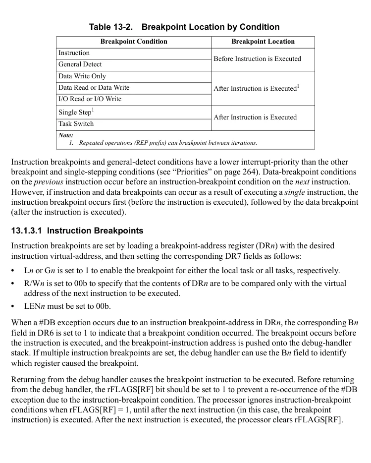

</details>


<!-- PDF source page: 468 | printed page: 406 -->

1. 13. 1.3.2 Data Breakpoints**

Data breakpoints are set by loading a breakpoint-address register (DR*n*) with the desired data virtual-address, and then setting the corresponding DR7 fields as follows:

- L*n* or G*n* is set to 1 to enable the breakpoint for either the local task or all tasks, respectively.
- R/W*n* is set to 01b to specify that the data virtual-address is compared with the contents of DR*n* only during a memory-write. Setting this field to 11b specifies that the comparison takes place during both memory reads and memory writes.
- LEN*n* is set to 00b, 01b, 11b, or 10b to specify an address-match range of one, two, four, or eight bytes, respectively. Long mode must be active to set LEN*n* to 10b.

When a #DB exception occurs due to a data breakpoint address in DR*n*, the corresponding B*n* field in DR6 is set to 1 to indicate that a breakpoint condition occurred. The breakpoint occurs after the data-access instruction is executed, which means that the original data is overwritten by the data-access instruction. If the debug handler needs to report the previous data value, it must save that value before setting the breakpoint.

Because the breakpoint occurs after the data-access instruction is executed, the address of the instruction following the data-access instruction is pushed onto the debug-handler stack. Repeated string instructions, however, can trigger a breakpoint before all iterations of the repeat loop have completed. When this happens, the address of the string instruction is pushed onto the stack during a #DB exception if the repeat loop is not complete. A subsequent IRET from the #DB handler returns to the string instruction, causing the remaining iterations to be executed. Most implementations cannot report breakpoints exactly for repeated string instructions, but instead report the breakpoint on an iteration later than the iteration where the breakpoint occurred.

1. 13. 1.3.3 I/O Breakpoints**

I/O breakpoints are set by loading a breakpoint-address register (DR*n*) with the I/O-port address to be trapped, and then setting the corresponding DR7 fields as follows:

- L*n* or G*n* is set to 1 to enable the breakpoint for either the local task or all tasks, respectively.
- R/W*n* is set to 10b to specify that the I/O-port address is compared with the contents of DR*n* only during execution of an I/O instruction. This encoding of R/W*n* is valid only when debug extensions are enabled (CR4[DE] = 1).
- LEN*n* is set to 00b, 01b, or 11b to specify the breakpoint occurs on a byte, word, or doubleword I/O operation, respectively.

The I/O-port address specified by the I/O instruction is zero extended by the processor to 64 bits before comparing it with the DR*n* registers.

When a #DB exception occurs due to an I/O breakpoint in DR*n*, the corresponding B*n* field in DR6 is set to 1 to indicate that a breakpoint condition occurred. The breakpoint occurs after the instruction is executed, which means that the original data is overwritten by the breakpoint instruction. If the debug handler needs to report the previous data value, it must save that value before setting the breakpoint.


<!-- PDF source page: 469 | printed page: 407 -->

Because the breakpoint occurs after the instruction is executed, the address of the instruction following the I/O instruction is pushed onto the debug-handler stack, in most cases. In the case of INS and OUTS instructions that use the repeat prefix, however, the breakpoint occurs after the first iteration of the repeat loop. When this happens, the I/O-instruction address can be pushed onto the stack during a #DB exception if the repeat loop is not complete. A subsequent return from the debug handler causes the next I/O iteration to be executed. If the breakpoint condition is still set, the #DB exception reoccurs after that iteration is complete.

1. 13. 1.3.4 Task-Switch Breakpoints**

Breakpoints can be set in a task TSS to raise a #DB exception after a task switch. Software enables a task breakpoint by setting the T bit in the TSS to 1. When a task switch occurs into a task with the T bit set, the processor completes loading the new task state. Before the first instruction is executed, the #DB exception occurs, and the processor sets DR6[BT] to 1, indicating that the #DB exception occurred as a result of task breakpoint.

The processor does not clear the T bit in the TSS to 0 when the #DB exception occurs. Software must explicitly clear this bit to disable the task breakpoint. Software should never set the T-bit in the debug-handler TSS if a separate task is used for #DB exception handling, otherwise the processor loops on the debug handler.

1. 13. 1.3.5 General-Detect Condition**

General-detect is a special debug-exception condition that occurs when software running at any privilege level attempts to access any of the DR*n* registers while DR7[GD] is set to 1. When a #DB exception occurs due to the general-detect condition, the processor clears DR7[GD] and sets DR6[BD] to 1. Clearing DR7[GD] allows the debug handler to access the DR*n* registers without causing infinite #DB exceptions.

A debugger enables general detection to prevent other software from accessing and interfering with the debug registers while they are in use by the debugger. The exception is taken before executing the MOV DR*n* instruction so that the DR*n* contents are not altered.

1. 13. 1.3.6 Bus Lock Trap**

The processor can be configured to generate a #DB exception when a bus lock occurs. Software enables bus lock trap by setting DebugCtl MSR[BLCKDB] (bit 2) to 1. When bus lock trap is enabled, the processor generates a #DB exception following the successful execution of a locked read-modify-write instruction that requires a bus lock when CPL is &gt; 0. The processor indicates that this #DB was caused by a bus lock by clearing DR6[BLD] (bit 11). DR6[11] previously had been defined to be always 1, so DR6[11]=0 uniquely identifies the source of the #DB as a bus lock trap. All other #DB exceptions leave DR6[BLD] unmodified, so to maintain DR6[BLD]=0 as the unique identifier of a bus lock trap, system software should set DR6[BLD]=1 before returning to the interrupted task.

See Section 7.3.3 on page 195 for information on the conditions that cause a bus lock.


<!-- PDF source page: 470 | printed page: 408 -->

Note that implicit supervisor-level accesses do not generate a bus lock trap, even when CPL is &gt; 0. An implicit supervisor-mode access is one that is considered a supervisor access regardless of the value of CPL.

<a id="13-1-4-single-stepping"></a>

### 13.1.4 Single Stepping

Single-step breakpoints are enabled by setting the rFLAGS[TF] bit to 1. TF may be set by the IRET, POPF or SYSRET instructions, with an IRET executed by a debugger being the typical use case. When IRET sets TF, it causes a #DB exception to be taken immediately *after* the *target* of the IRET is executed, returning control to the debugger and thereby single-stepping the target instruction. Setting TF with a POPF instruction also causes a one-instruction delayed #DB exception. When TF is set by SYSRET however, a #DB exception is taken *before* the target instruction executes, hence SYSRET does not provide the single-stepping behavior of IRET.

When a #DB exception occurs due to single stepping, the processor clears rFLAGS[TF] before entering the debug handler, so that the debug handler itself is not single stepped. The processor also sets DR6[BS] to 1, which indicates that the #DB exception occurred as a result of single stepping. The rFLAGS image pushed onto the debug-handler stack has the TF bit set, and single stepping resumes when a subsequent IRET pops the stack image into the rFLAGS register.

Single-step breakpoints have a higher priority than external interrupts. If an external interrupt occurs during single stepping, control is transferred to the #DB handler first, causing the rFLAGS[TF] bit to be cleared. Next, before the first instruction in the debug handler is executed, the processor transfers control to the pending-interrupt handler. This allows external interrupts to be handled outside of single-step mode.

The INT*n*, INT3, and INTO instructions clear the rFLAGS[TF] bit when they are executed. If a debugger is used to single-step software that contains these instructions, it must emulate them instead of executing them.

The single-step mechanism can also be set to single step only control transfers, rather than single step every instruction. See “Single Stepping Control Transfers” on page 410 for additional information.

<a id="13-1-5-breakpoint-instruction-int3"></a>

### 13.1.5 Breakpoint Instruction (INT3)

The INT3 instruction, or the INT*n* instruction with an operand of 3, can be used to set breakpoints that transfer control to the breakpoint-exception (#BP) handler rather than the debug-exception handler. When a debugger uses the breakpoint instructions to set breakpoints, it does so by replacing the first bytes of an instruction with the breakpoint instruction. The debugger replaces the breakpoint instructions with the original-instruction bytes to clear the breakpoint.

INT3 is a single-byte instruction while INT*n* with an operand of 3 is a two-byte instruction. The instructions have slightly different effects on the breakpoint exception-handler stack. See “#BP— Breakpoint Exception (Vector 3)” on page 249 for additional information on this exception.


<!-- PDF source page: 471 | printed page: 409 -->

<a id="13-1-6-control-transfer-breakpoint-features"></a>

### 13.1.6 Control-Transfer Breakpoint Features

A control transfers is accomplished by using one of following instructions:

- JMP, CALL, RET
- J*cc*, J*r*CXZ, LOOP*cc*
- JMPF, CALLF, RETF
- INT*n*, INT 3, INTO, ICEBP
- Exceptions, IRET
- SYSCALL, SYSRET, SYSENTER, SYSEXIT
- INTR, NMI, SMI, RSM

1. 13. 1.6.1 Recording Control Transfers**

Software enables control-transfer recording by setting DebugCtl[LBR] to 1. When this bit is set, the processor updates the recording MSRs automatically when control transfers occur:

- *LastBranchFromIP and LastBranchToIP Registers*—On branch instructions, the LastBranchFromIP register is loaded with the segment offset of the branch instruction, and the LastBranchToIP register is loaded with the first instruction to be executed after the branch. On interrupts and exceptions, the LastBranchFromIP register is loaded with the segment offset of the interrupted instruction, and the LastBranchToIP register is loaded with the offset of the interrupt or exception handler.
- *LastIntFromIP and LastIntToIP Registers—*The processor loads these from the LastBranchFromIP register and the LastBranchToIP register, respectively, when most interrupts and exceptions are taken. These two registers are not updated, however, when #DB or #MC exceptions are taken, or the ICEBP instruction is executed.

The processor automatically disables control-transfer recording when a debug exception (#DB) occurs by clearing DebugCtl[LBR] to 0. The contents of the control-transfer recording MSRs are not altered by the processor when the #DB occurs. Before exiting the debug-exception handler, software can set DebugCtl[LBR] to 1 to re-enable the recording mechanism.

Debuggers can trace a control transfer backward from a bug to its source using the recording MSRs and the breakpoint-address registers. The debug handler does this by updating the breakpoint registers from the recording MSRs after a #DB exception occurs, and restarting the program. The program takes a #DB exception on the previous control transfer, and this process can be repeated. The debug handler cannot simply copy the contents of the recording MSR into the breakpoint-address register. The recording MSRs hold segment offsets, while the debug registers hold virtual (linear) addresses. The debug handler must calculate the virtual address by reading the code-segment selector (CS) from the interrupt-handler stack, then reading the segment-base address from the CS descriptor, and adding that base address to the offset in the recording MSR. The calculated virtual-address can then be used as a breakpoint address.


<!-- PDF source page: 472 | printed page: 410 -->

1. 13. 1.6.2 Single Stepping Control Transfers**

Software can enable control-transfer single stepping by setting DebugCtl[BTF] to 1 and rFLAGS[TF] to 1. The processor automatically disables control-transfer single stepping when a debug exception (#DB) occurs by clearing DebugCtl[BTF]. rFLAGS[TF] is also cleared when a #DB exception occurs. Before exiting the debug-exception handler, software must set both DebugCtl[BTF] and rFLAGS[TF] to 1 to restart single stepping.

When enabled, this single-step mechanism causes a #DB exception to occur on every branch instruction, interrupt, or exception. Debuggers can use this capability to perform a “coarse” single step across blocks of code (bound by control transfers), and then, as the problem search is narrowed, switch into a “fine” single-step mode on every instruction (DebugCtl[BTF] = 0 and rFLAGS[TF] = 1).

Debuggers can use both the single-step mechanism and recording mechanism to support full backward and forward tracing of control transfers.

<a id="13-1-7-debug-breakpoint-address-masking"></a>

### 13.1.7 Debug Breakpoint Address Masking

The Breakpoint Address Extension feature extends the DR[0-3] breakpoint capabilities. Processors with this extension support address mask registers corresponding to each of the DR[0-3] breakpoint registers, in the form of DR[0-3]_ADDR_MASK MSRs. These masks may be used to increase the range of breakpoints by excluding address bits from the breakpoint match. Each bit set to one excludes the corresponding address bit from the breakpoint comparison. Mask bits 11:0 may be used to expand instruction fetch breakpoint ranges up to a 4KB page, while mask bits 31:12 have no effect on instruction breakpoints. For DR0 only, the full mask field (31:0) may be used to qualify data breakpoint matches. This extension is signified by CPUID Fn8000_0001_ECX[26]=1.

An additional extension expands the data breakpoint masking capability of DR0 to the other breakpoint registers, and extends instruction breakpoint masking to bits 31:0 for all registers. This is signified by CPUID Fn8000_0001_ECX[30]=1.

<a id="13-1-8-last-branch-record-stack"></a>

### 13.1.8 Last Branch Record Stack

Processors with CPUID Fn8000_0022_EAX[LbrStack] = 1 support Last Branch Record Stack (LBR Stack). The LBR Stack records the From and To IP for the LBR_ SIZE = CPUID Fn8000_0022_EBX[LbrStackSize] most recent control-transfer instructions.

LBR Stack recording is enabled by setting DebugExtnCtl [LBRSE] = 1. LBR Stack recording is independent of Last Branch Record (LBR). DebugCtl[LBR] does not need to be set to 1 for the processor to start recording to the LBR Stack.

Software can access the contents of the LBR stack using LastBranchStackFromIp and LastBranchStackToIp MSRs. The format of these MSRs is shown in Figure 13-7 on page 400 and Figure 13-8 on page 401.

Table 13-3, “Types of Branch Records” shows the types of branch records based on the values of LastBranchStackToIp[SPEC] and LastBranchStackToIp[V].


<!-- PDF source page: 473 | printed page: 411 -->

**Table 13-3. Types of Branch Records**

| LastBranchStackToIp[V] | LastBranchStackToIp[SPEC] | Description of LBR Stack entry |
| --- | --- | --- |
| 1 | 0 | Normal recorded branch. |
| 1 | 1 | Branch was recorded when a speculative<br>performance feature was active and<br>successful. |
| 0 | 1 | Branch was recorded, but the speculative<br>performance feature was not successful. |
| 0 | 0 | No branch has yet been recorded in this<br>entry since SW last cleared the V and<br>SPEC bits. |

Software can use the LastBranchStackSelect MSR (Figure 13-9 on page 402) to specify the branch types for which LBR Stack recording is suppressed.

<a id="13-2-performance-monitoring-counters"></a>

## 13.2 Performance Monitoring Counters

The AMD64 architecture supports a set of hardware-based performance-monitoring counters (PMCs) that can be utilized to measure the frequency or duration of certain hardware events. MSRs allow the selection of events to be monitored and include a set of corresponding counter registers that accumulate a count of monitored events.

Software tools can use these counters to identify performance bottlenecks, such as sections of code that have high cache-miss rates or frequently mispredicted branches. This information can then be used as a guide for improving overall performance or eliminating performance problems through software optimizations or hardware-design improvements.

Software performance analysis tools often require a means to time-stamp an event or measure elapsed time between two events. The time-stamp counter provides this capability. See Section 13.2.4 “Time-Stamp Counter” on page 423.

The registers used in support of performance monitoring are model-specific registers (MSRs). See “Model-Specific Registers (MSRs)” on page 59 for a general discussion of MSRs and “Performance-Monitoring MSRs” on page 731 for a listing of the performance-monitoring MSR numbers and their reset values.

<a id="13-2-1-performance-counter-msrs"></a>

### 13.2.1 Performance Counter MSRs

The legacy architecture defines four performance counters (PerfCtr*n*) and corresponding event-select registers (PerfEvtSel*n*). Extensions add Northbridge and L2 cache performance monitoring counters. Each *PerfCtr register counts events selected by the corresponding *PerfEvtSel register.

<details>
<summary>Rendered source page 473 (figures/tables)</summary>

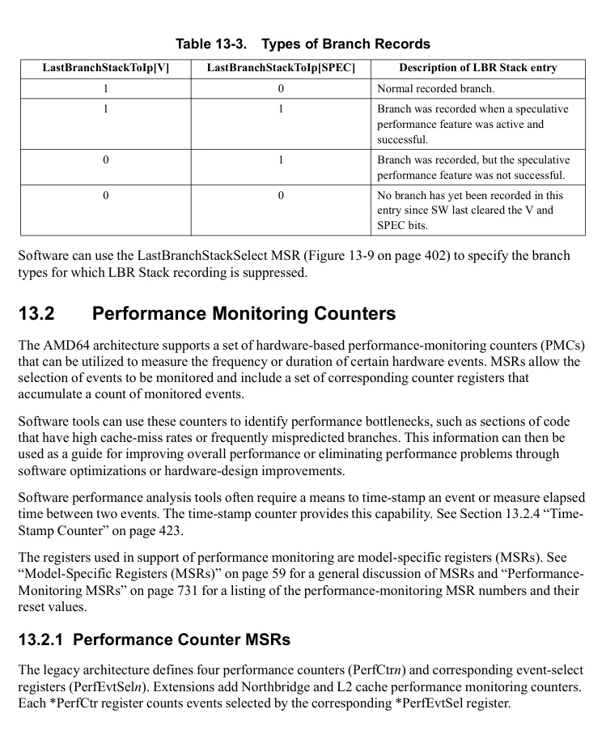

</details>


<!-- PDF source page: 474 | printed page: 412 -->

An architectural extension augments the number of performance and event-select registers by adding two more processor counter / event-select pairs. Further extensions add four counter / event-select pairs dedicated to counting Northbridge (NB) events and four counter / event-select pairs dedicated to counting L2 cache (L2I) events.

Core logic includes instruction execution pipelines, execution units, and caches closest to the execution hardware. The NB includes logic that routes data traffic between caches, external I/O devices, and a system memory controller which reads and writes system memory (usually implemented as external DRAM). The L2 cache is a cache that is further away from the processor core than the L1 cache or caches. This cache is normally larger than the L1 cache(s) and requires more processor cycles to access. An L2 cache may be shared between physical processor cores.

All implementations support the base set of four performance counter / event-select pairs. Support for the extended performance monitoring registers and the performance-related events selectable via the *PerfEvtSel registers vary by implementation and are described in the *BIOS and Kernel Developer’s Guide (BKDG)* or *Processor Programming Reference Manual (PPR)* for that processor.

Core performance counters are used to count processor core events, such as data-cache misses, or the duration of events, such as the number of clocks it takes to return data from memory after a cache miss. During event counting, hardware increments a counter each time it detects an occurrence of a specified event. During duration measurement, hardware counts the number of processor clock cycles required to complete a specific hardware function.

NB performance counters are used to count events that occur within the Northbridge. The L2I performance counters are used to count events associated with accessing the L2 cache.

Performance counters and event-select registers are implemented as machine-specific registers (MSRs). The base set of four PerfCtr and PerfEvtSel registers are accessed via a legacy set of MSRs and the extended set of six core PerfCtr / PerfEvtSel registers are accessed via a different set. Extended core PerfCtr / PerfEvtSel registers 0–3 alias the legacy set.

Support for the extended set of core PerfCtr registers and associated PerfEvtSel registers, as well as the sets of Northbridge and L2 cache counter / event-select pairs are indicated by CPUID feature bits. See “Detecting Hardware Support for Performance Counters” on page 421. The MSR address assignments for the legacy and extended performance / event-select pairs are listed in Appendix A, Section A.6, “Performance-Monitoring MSRs” on page 731.

The length, in bits, of the performance counters is implementation-dependent, but the maximum length supported is 64 bits. Figure 13-10 shows the format of the performance counter registers.

**Figure 13-10. Performance Counter Format**

<details>
<summary>Extracted figure labels</summary>

```text
63
0
event or duration count
```

</details>

<details>
<summary>Rendered source page 474 (figures/tables)</summary>

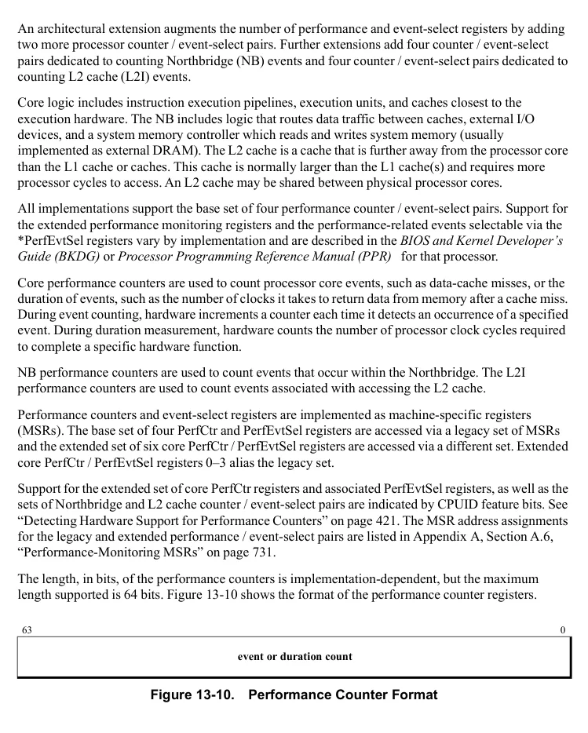

</details>


<!-- PDF source page: 475 | printed page: 413 -->

For a given processor, all implemented performance counter registers can be read and written by system software running at CPL = 0 using the RDMSR and WRMSR instructions, respectively. The architecture also provides an instruction, RDPMC, which may be employed by user-mode software to read the architected core, Northbridge, and L2 performance counters.

The RDPMC instruction loads the contents of the architected performance counter register specified by the index value contained in the ECX register, into the EDX register and the EAX register. The high 32 bits are returned in EDX, and the low 32 bits are returned in EAX. RDPMC can be executed only at CPL = 0, unless system software enables use of the instruction at all privilege levels. RDPMC can be enabled for use at all privilege levels by setting CR4[PCE] (the *performance-monitor counter-enable* bit) to 1. When CR4[PCE] = 0 and CPL &gt; 0, attempts to execute RDPMC result in a general-protection exception (#GP). For more information on the RDPMC instruction, see the instruction reference page in Volume 3 of this manual.

Writing the performance counters can be useful if software wants to count a specific number of events, and then trigger an interrupt when that count is reached. An interrupt can be triggered when a performance counter overflows (see “Counter Overflow” on page 422 for additional information). Software should use the WRMSR instruction to load the count as a two’s-complement negative number into the performance counter. This causes the counter to overflow after counting the appropriate number of times.

The performance counters are not guaranteed to produce identical measurements each time they are used to measure a particular instruction sequence, and they should not be used to take measurements of very small instruction sequences. The RDPMC instruction is not serializing, and it can be executed out-of-order with respect to other instructions around it. Even when bound by serializing instructions, the system environment at the time the instruction is executed can cause events to be counted before the counter value is loaded into EDX:EAX. The following sections describe the core performance event-select and the Northbridge performance event-select registers.

**Core Performance Event-Select Registers**

The core performance event-select registers (PerfEvtSel*n*) are 64-bit registers used to specify the events counted by the core performance counters, and to control other aspects of their operation. Each performance counter supported by the implementation has a corresponding event-select register that controls its operation. Figure 13-11 below shows the format of the core PerfEvtSel register.


<!-- PDF source page: 476 | printed page: 414 -->

63 44 43 42 41 40 39 36 35 32

PREC_RET

HG_ ONLY

Reserved

Reserved EVENT_ SELECT[11:8]

Reserved

31 24 23 22 21 20 19 18 17 16 15 8 7 0

Reserved

ED G E

USR

INV

INT

CNT_MASK

UNIT_MASK EVENT_SELECT[7:0]

EN

OS

**Bits Mnemonic Description Access type** 63:44 Reserved RAZ 43 PREC_RET Enable precise counting of retire events. R/W 42 Reserved RAZ 41:40 HG_ONLY Host/Guest Only R/W 39:36 Reserved RAZ 35:32 EVENT_SELECT[11:8] Event select bits 11:8 R/W 31:24 CNT_MASK Counter Mask R/W 23 INV Invert Comparison R/W 22 EN Counter Enable R/W 21 Reserved RAZ 20 INT Interrupt Enable R/W 19 Reserved RAZ 18 EDGE Edge Detect R/W 17 OS Operating-System Mode R/W 16 USR User Mode R/W 15:8 UNIT_MASK Unit Mask R/W 7:0 EVENT_SELECT[7:0] Event select bits 7:0 R/W

**Figure 13-11. Core Performance Event-Select Register (PerfEvtSeln)**

The fields shown in Figure 13-11 above are further described below:

- *PREC_RET (Enable precise counting of retire events)*—Bit 43, read/write. If CPUID Fn 8000_0021h_EAX[PreciseRetirePmc2Manual] is set, PREC_RET should be set when counting retired events. If CPUID Fn 8000_0021h_EAX[PreciseRetirePmc2Manual] is clear, this bit is Reserved. PREC_RET is only available in PerfEvtSel2 and Reserved for other PerfEvtSel*n* registers.
- *HG_ONLY (Host/Guest Only)*—Bits 41:40, read/write. This field qualifies events to be counted based on virtualization operating mode (guest or host). The following table defines how HG_ONLY qualifies the counting of events:

<details>
<summary>Rendered source page 476 (figures/tables)</summary>

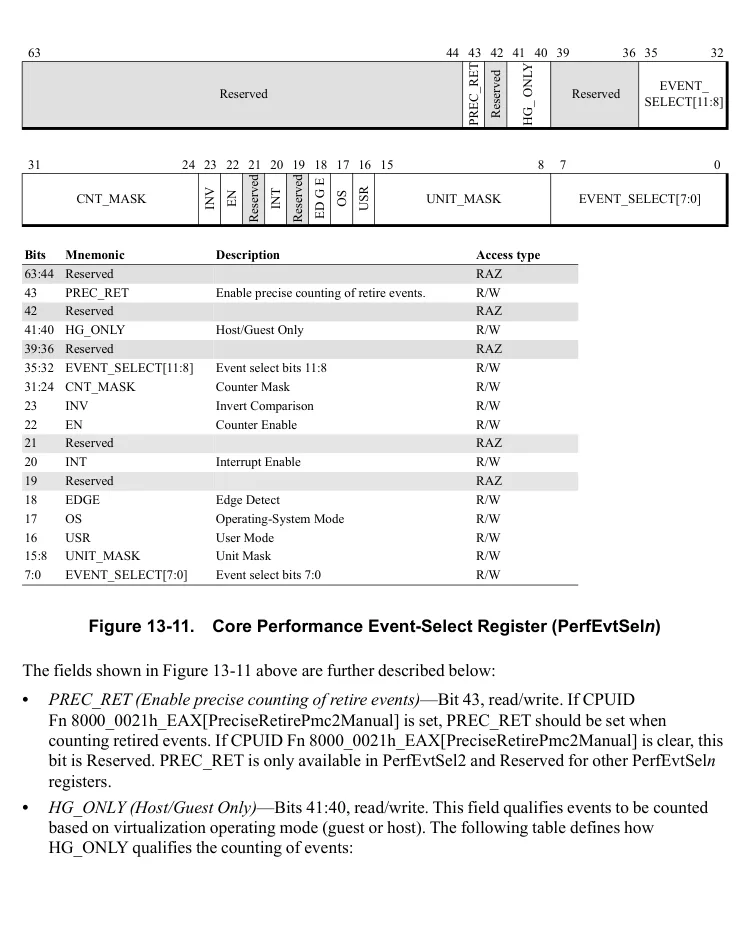

</details>


<!-- PDF source page: 477 | printed page: 415 -->

**Table 13-4. Host/Guest Only Bits**

| Host Mode<br>(Bit 41) | Guest Mode<br>(Bit 40) | Events Counted |
| --- | --- | --- |
| 0 | 0 | All events, irrespective of guest or host mode |
| 0 | 1 | Guest events, if EFER[SVME] = 1 |
| 1 | 0 | Host events, if EFER[SVME] = 1 |
| 1 | 1 | Guest and host events, if EFER[SVME] = 1 |

- *EVENT_SELECT[11:8] (Event Select)*—Bits 35:32, read/write. This field extends the EVENT_SELECT field from 8 bits to 12 bits. See EVENT_SELECT[7:0] below.
- *CNT_MASK (Counter Mask)*—Bits 31:24, read/write. Used with INV bit to control the counting of multiple events that occur within one clock cycle. The table below describes this:

**Table 13-5. Count Control Using CNT_MASK and INV**

| CNT MASK | INV | Increment Value |
| --- | --- | --- |
| 00h | – | Corresponding PerfCtr[n] register is incremented by the number of events occurring in a<br>clock cycle. If the number of events is equal to or greater than 32, the count register is<br>incremented by 32. |
| FFh:01h1 | 0 | Corresponding PerfCtr[n] register is incremented by 1, if the number of events occurring in<br>a clock cycle is greater than or equal to the CNT MASK value. |
| FFh:01h1 | 1 | Corresponding PerfCtr[n]register is incremented by 1, if the number of events occurring in<br>a clock cycle is less than the CNT MASK value. |

> Note 1: Maximum CNT MASK value (in the range FFh:01h is implementation dependent. Consult applicable BIOS and Ker- _ nel Developer’s Guide (BKDG) or Processor Programming Reference Manual (PPR) .

- INV (Invert Comparison), read/write. Used with CNT_MASK field to control the counting of multiple events within one clock cycle. See table above.
- EN (Counter Enable), read/write. Software sets this bit to 1 to enable the PerfEvtSel*n* register, and counting in the corresponding PerfCtr*n* register. Clearing this bit to 0 disables the register pair.
- INT (Interrupt Enable), read/write. Software sets this bit to 1 to enable an interrupt to occur when the performance counter overflows (see “Counter Overflow” on page 422 for additional information). Clearing this bit to 0 disables the triggering of the interrupt.
- EDGE (Edge Detect), read/write. Software sets this bit to 1 to count the number of edge transitions from the negated to asserted state. This feature is useful when coupled with event-duration monitoring, as it can be used to calculate the average time spent in an event. Clearing this bit to 0 disables edge detection.
- OS (Operating-System Mode) and USR (User Mode), read/write. Software uses these bits to control the privilege level at which event counting is performed according to Table 13-6.

<details>
<summary>Rendered source page 477 (figures/tables)</summary>

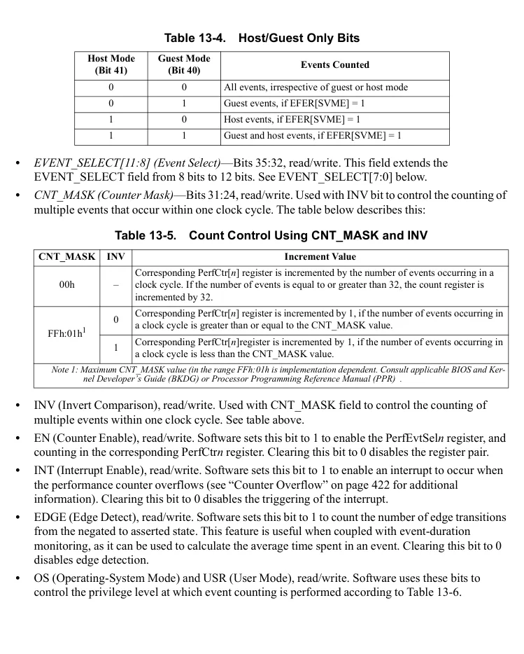

</details>


<!-- PDF source page: 478 | printed page: 416 -->

**Table 13-6. Operating-System Mode and User Mode Bits**

| OS<br>(Bit 17) | USR<br>(Bit 16) | Event Counting |
| --- | --- | --- |
| 0 | 0 | No counting. |
| 0 | 1 | Only at CPL > 0. |
| 1 | 0 | Only at CPL = 0. |
| 1 | 1 | At all privilege levels. |

- *UNIT_MASK (Unit Mask)*—Bits 15:8, read/write. This field further specifies or qualifies the event specified by the EVENT_SELECT field. Depending on implementation, it may be used to specify a sub-event within the class specified by the EVENT_SELECT field or it may act as bit mask and be used to specify a number of events within the class to be monitored simultaneously.
- *EVENT_SELECT[7:0] (Event Select [7:0])*—Bits 7:0, read/write. This field concatenated with EVENT_SELECT[11:8] specifies the event or event duration to be counted by the corresponding PerfCtr[*n*] register. The events that can be monitored are implementation dependent. In some implementations, support for a specific EVENT_SELECT value may restricted to a subset of the available performance counters. For more information, see the *BIOS and Kernel Developer’s Guide (BKDG)* or *Processor Programming Reference Manual (PPR)* applicable to your product.

The core performance event-select registers can be read and written only by system software running at CPL = 0 using the RDMSR and WRMSR instructions, respectively. Any attempt to read or write these registers at CPL &gt; 0 causes a general-protection exception to occur.

**Core Performance Global Control Register**

Core Performance Counter Global Control Register (PerfCntGlobalCtl) is a 64-bit register used to provide additional enable bits for each of the available core performance counters (PerfCnt*n*). The number of available core performance counters is reported by CPUID Fn8000_0022_EBX[NumCorePmc]. PerfCntGlobalCtl provides a way to simultaneously enable or disable multiple core performance counters with a single WRMSR instruction. To enable PerfCnt*n*, both bit *n* of PerfCntGlobalCtl and the EN field of the counter's PerfEvtSel register must be set to 1. Clearing either bit causes the corresponding count register to stop counting.

Figure 13-12 shows the format of the core PerfCntGlobalCtl register.

63 5 0

Reserved EN

<details>
<summary>Rendered source page 478 (figures/tables)</summary>

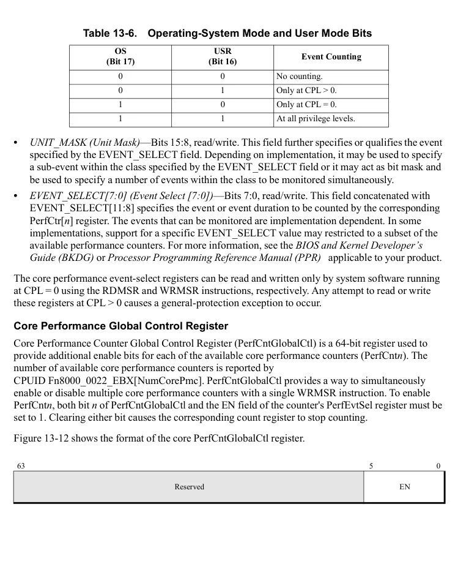

</details>


<!-- PDF source page: 479 | printed page: 417 -->

**Bits Mnemonic Description Access type** 63:6 Reserved RAZ 5:0 EN Global enable for PerfCnt[5:0] R/W

**Figure 13-12. Performance Counter Global Control (PerfCntGlobalCtl)**

**Core Performance Counter Status Registers**

A set of three registers is provided to monitor and manage core performance counter status. The Core Performance Counter Status Register (PerfCntGlobalStatus) contains overflow bits for the Core Performance Counters and freeze status bits for the LBR stack and performance counters. Software can clear individual status bits by writing 1’s to corresponding bit positions in the PerfCntGlobalStatusClr register, and set individual status bits by writing 1’s to corresponding bit positions in the PerfCntGlobalStatusSet register. Hardware normally sets these bits; setting or clearing them with software may cause certain hardware actions as described below.

**Performance Counter Global Status Register**

63 60 59 58 57 6 5 0

LBRSF

PMCF

Reserved

Reserved CNT_OF

**Bits Mnemonic Description Access type** 63:60 Reserved RO 59 PMCF Performance Counter Freeze RO 58 LBRSF Last Branch Record Stack Freeze RO 57:6 Reserved RO 5:0 CNT_OF Counter overflow for PerfCnt[5:0] RO

**Figure 13-13. Performance Counter Global Status Register (PerfCntGlobalStatus)**

The fields shown in Figure 13-13 are further described below:

- *Performance Counter Freeze (PMCF)*—Bit 59, read-only. When set, this indicates that the Core Performance Counter registers have been frozen due to an overflow interrupt triggered for at least one of the core performance counters. This feature is enabled via DebugCtl[FPCI] as described in “Debug-Control MSR (DebugCtl)” on page 397. Software must use PerfCntGlobalStatusClr[C_PMCF] to clear this bit to allow the Core Performance Counters to resume counting.
- *Last Branch Record Stack Freeze (LBRSF)*—Bit 58, read-only. When set, this indicates that the Last Branch Record Stack has been frozen due to an overflow interrupt triggered for at least one of the core performance counters. This feature is enabled via DebugCtl[FLBRI] as described in “Debug-Control MSR (DebugCtl)” on page 397. Software must use

<details>
<summary>Rendered source page 479 (figures/tables)</summary>

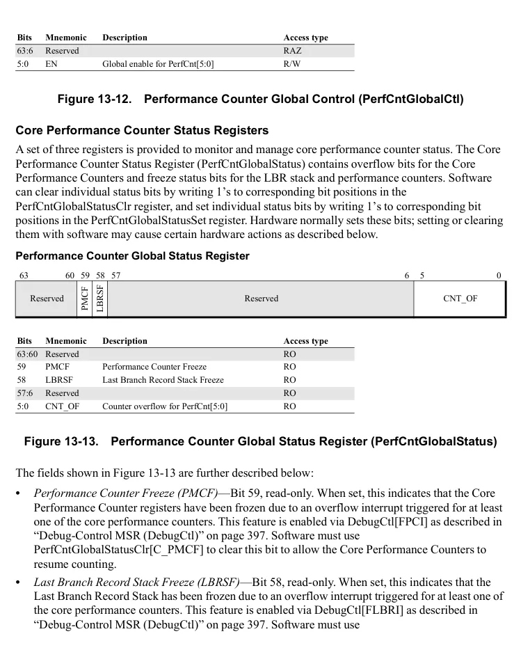

</details>


<!-- PDF source page: 480 | printed page: 418 -->

PerfCntGlobalStatusClr[C_LBRSF] to clear this bit to allow the Last Branch Record Stack to resume recording branches. **•* Core Performance Counter Overflow (CNT_OF)*—Bits 5:0, read-only. Each available Core Performance Counter corresponds to one bit in this field. When set, it indicates that the corresponding performance counter has overflowed. The CNT_OF bit will be set for a counter even when the counter is not configured to trigger an interrupt on overflow. Software must use PerfCntGlobalStatusSet[C_CNT_OF] to clear these indications.

Software may use PerfCntGlobalStatusSet and PerfCntGlobalStatusClr registers to modify the contents of the PerfCntGlobalStatus register for context switching purposes.

**Performance Counter Global Status Set Register**

63 60 59 58 57 6 5 0

S_LBRSF

S_PMCF

Reserved

Reserved S_CNT_OF

**Bits Mnemonic Description Access type** 63:60 Reserved WO 59 S_PMCF Set Performance Counter Freeze WO 58 S_LBRSF Set Last Branch Record Freeze WO 57:6 Reserved WO

5:0 S_CNT_OF Set selected bits of PerfCntGlobalStatus[CNT_OF] WO

**Figure 13-14. Performance Counter Global Status Set Register (PerfCntGlobalStatusSet)**

The fields shown in Figure 13-14 are further described below:

- *Set Core Performance Counter Freeze (S_PMCF)*—Bit 59, write-only. When written as 1, PerfCntGlobalStatus[PMCF] is set to 1 and the Core Performance Monitor Counters are frozen.
- *Set Last Branch Record Stack Freeze (S_LBRSF)*—Bit 58, write-only. When written as 1, PerfCntGlobalStatus[LBRSF] is set to 1 and the Last Branch Record Stack is frozen.
- *Set Core Performance Counter Overflow (S_CNT_OF)*—Bits 5:0, write-only. For each bit written as 1, the corresponding bit in PerfCntGlobalStatus[CNT_OF] is set to 1. Setting a bit in PerfCntGlobalStatus[CNT_OF] through PerfCntGlobalStatusSet[CNT_OF] does not trigger an interrupt, freeze core performance counters, freeze the Last Branch Record stack or trigger any other action that the hardware may take when a core performance counter overflows.

<details>
<summary>Rendered source page 480 (figures/tables)</summary>

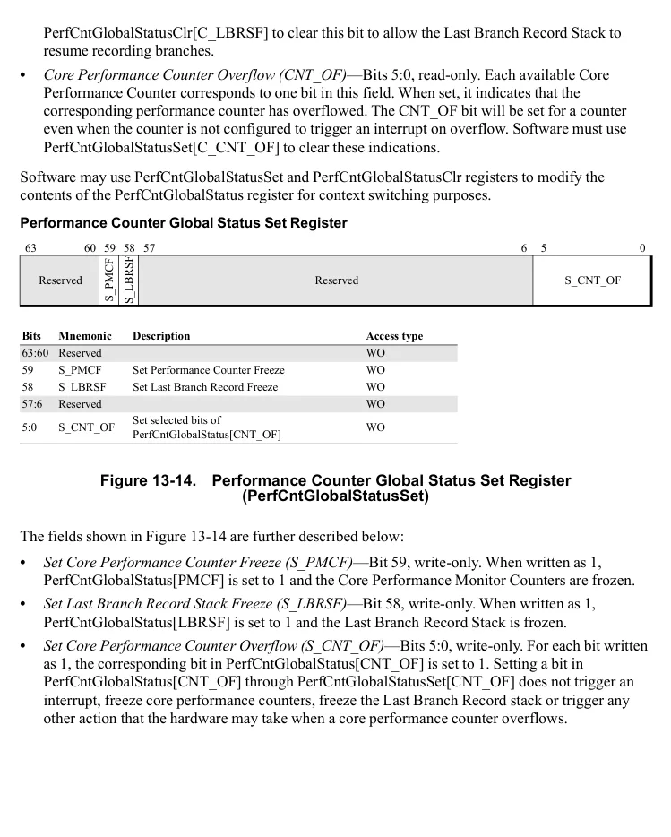

</details>


<!-- PDF source page: 481 | printed page: 419 -->

**Performance Counter Global Status Clear Register**

63 60 59 58 57 6 5 0

C_LBRSF

C_PMCF

Reserved

Reserved C_CNT_OF

**Bits Mnemonic Description Access type** 63:60 Reserved WO 59 C_PMCF Clear Performance Counter Freeze WO 58 C_LBRSF Clear Last Branch Record Freeze WO 57:6 Reserved WO

5:0 C_CNT_OF Clear selected bits of PerfCntGlobalStatus[CNT_OF] WO

**Figure 13-15. Performance Counter Global Status Clear Register (PerfCntGlobalStatusClr)**

The fields shown in Figure 13-15 are further described below:

- *Clear Performance Counter Freeze (C_PMCF)*—Bit 59, write-only. When written as 1, PerfCntGlobalStatus[PMCF] is cleared to 0 and core performance counters, that are enabled to count, continue counting.
- *Clear Last Branch Record Stack Freeze (C_LBRSF)*—Bit 58, write-only. When written as 1, PerfCntGlobalStatus[LBRSF] is cleared to 0 and the Last Branch Record Stack continues to record branches if enabled.
- *Clear Core Performance Counter Overflow (C_CNT_OF)*—Bits 5:0, write-only. For each bit written as 1, the corresponding bit in PerfCntGlobalStatus[CNT_OF] is cleared to 0. Software should clear the Performance Counter Overflow bits when:
- Handling a core performance counter overflow interrupt
- Disabling a core performance counter
- Resetting a core performance counter

**Northbridge Performance Event-Select Registers**

The Northbridge (NB) performance event-select registers (NB_PerfEvtSel*n*) are 64-bit registers used to specify the events counted by the Northbridge performance counters, and to control other aspects of their operation. Each performance counter supported by the implementation has a corresponding event-select register that controls its operation. Figure 13-16 below shows the format of the NB_PerfEvtSel*n* register.

<details>
<summary>Rendered source page 481 (figures/tables)</summary>

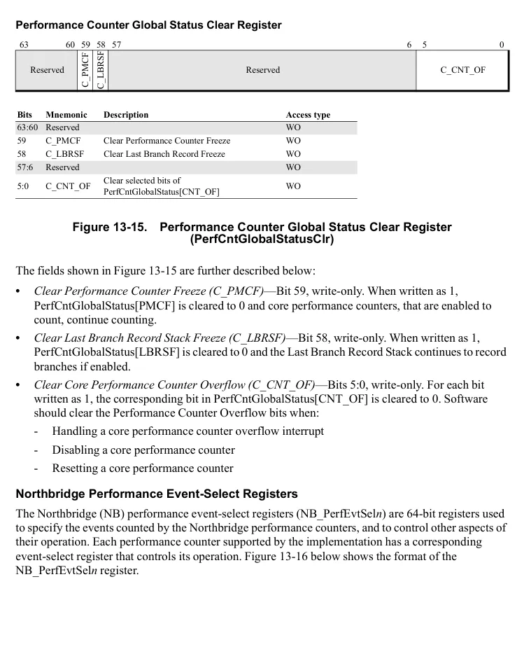

</details>


<!-- PDF source page: 482 | printed page: 420 -->

63 36 35 32

Reserved EVENT_ SELECT[11:8]

31 23 22 21 20 19 16 15 8 7 0

Reserved

INT

Reserved

Reserved UNIT_MASK EVENT_SELECT[7:0]

EN

**Bits Mnemonic Description Access type** 63:36 Reserved RAZ 35:32 EVENT_SELECT[11:8] Event select bits [11:8] R/W 31:23 Reserved RAZ 22 EN Counter Enable R/W 21 Reserved RAZ 20 INT Interrupt Enable R/W 19:16 Reserved RAZ 15:8 UNIT_MASK Unit Mask R/W 7:0 EVENT_SELECT[7:0] Event select bits [7:0] R/W

**Figure 13-16. Northbridge Performance Event-Select Register (NB_PerfEvtSeln)**

The Northbridge performance event-select registers can be read and written only by system software running at CPL = 0 using the RDMSR and WRMSR instructions, respectively. Any attempt to read or write these registers at CPL &gt; 0 causes a general-protection exception to occur.

For more information on the defined fields within the NB_PerfEvtSel*n* registers, see the *BIOS and Kernel Developer’s Guide (BKDG)* or *Processor Programming Reference Manual (PPR)* applicable to your product.

**L2 Cache (L2I) Performance Event-Select Registers**

The L2 cache performance event-select registers (L2I_PerfEvtSel*n*) are 64-bit registers used to specify the events counted by the L2 cache performance counters, and to control other aspects of their operation. Each performance counter supported by the implementation has a corresponding event-select register that controls its operation. Figure 13-17 below shows the format of the L2I_PerfEvtSel*n* register.

<details>
<summary>Rendered source page 482 (figures/tables)</summary>

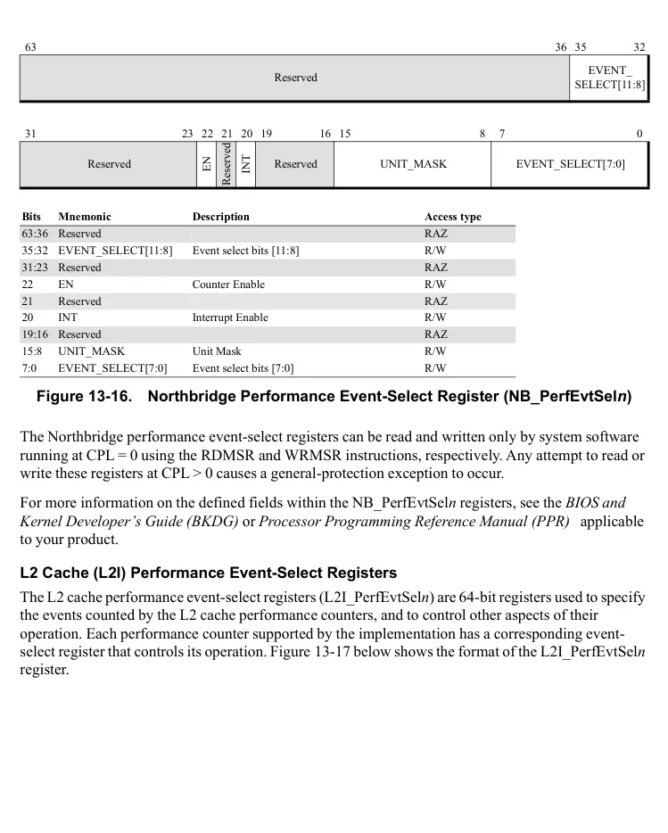

</details>


<!-- PDF source page: 483 | printed page: 421 -->

63 36 35 32

Reserved EVENT_ SELECT[11:8]

31 23 22 21 20 19 16 15 8 7 0

Reserved

INT

Reserved

Reserved UNIT_MASK EVENT_SELECT[7:0]

EN

**Bits Mnemonic Description Access type** 63:36 Reserved RAZ 35:32 EVENT_SELECT[11:8] Event select bits [11:8] R/W 31:23 Reserved RAZ 22 EN Counter Enable R/W 21 Reserved RAZ 20 INT Interrupt Enable R/W 19:16 Reserved RAZ 15:8 UNIT_MASK Unit Mask R/W 7:0 EVENT_SELECT[7:0] Event select bits [7:0] R/W

**Figure 13-17. L2 Cache Performance Event-Select Register (L2I_PerfEvtSeln)**

The L2 cache performance event-select registers can be read and written only by system software running at CPL = 0 using the RDMSR and WRMSR instructions, respectively. Any attempt to read or write these registers at CPL &gt; 0 causes a general-protection exception to occur.

For more information on the defined fields within the L2I_PerfEvtSel*n* registers, see the *BIOS and Kernel Developer’s Guide (BKDG)* or *Processor Programming Reference Manual (PPR)* applicable to your product.

**Instructions Retired Performance counter**

This is a dedicated counter that is always counting instructions retired. It exists at MSR address C000_00E9. It is enabled by setting a 1 to HWCR[30] and its support is indicated by CPUID Fn8000_0008_EBX[1].

<a id="13-2-2-detecting-hardware-support-for-performance-counters"></a>

### 13.2.2 Detecting Hardware Support for Performance Counters

Support for extended core, Northbridge, and L2 cache performance counters is implementation-dependent. Support on a given processor implementation can be verified using the CPUID instruction.

CPUID Fn8000_0001_ECX[PerfCtrExtCore] = 1 indicates support for the six architecturally defined extended core performance counters and their associated event-select registers. CPUID Fn8000_0001_ECX[PerfCtrExtNB] = 1 indicates support for the four architecturally defined Northbridge performance counter / event-select pairs and

<details>
<summary>Rendered source page 483 (figures/tables)</summary>

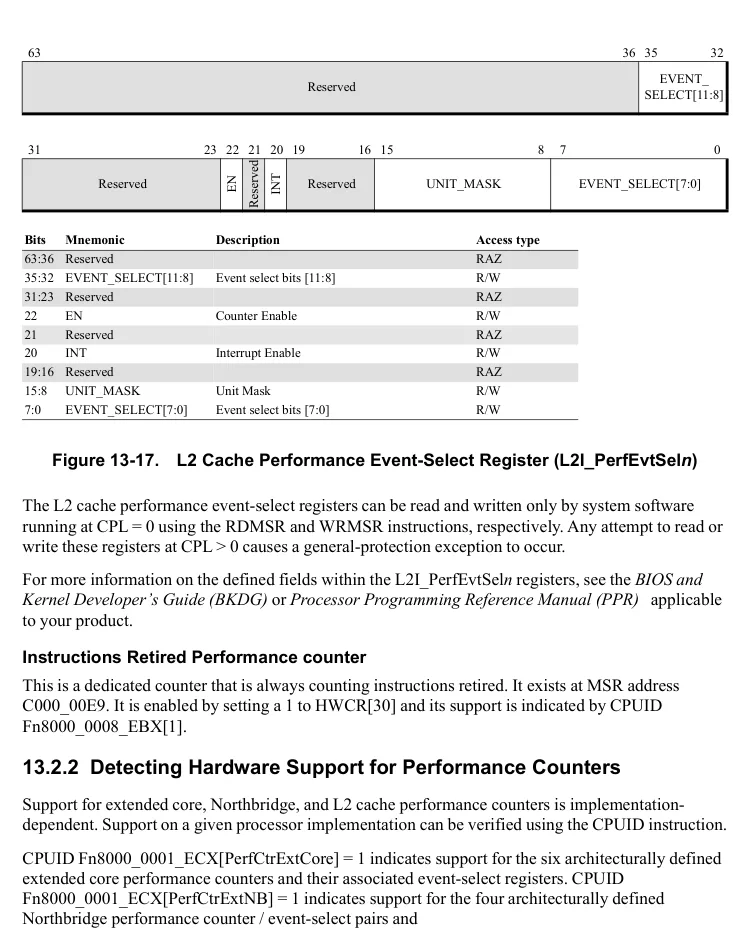

</details>


<!-- PDF source page: 484 | printed page: 422 -->

CPUID Fn8000_0001_ECX[PerfCtrExtL2I] = 1 indicates support for the four architecturally defined L2 cache performance counter / event-select pairs.

See Section 3.3, “Processor Feature Identification,” on page 71 for more information on using the CPUID instruction.

Processors that return a non-zero value in CPUID Fn8000_0022_EBX[NumPerfCtrCore] report the number of available core performance counters in CPUID Fn8000_0022_EBX[NumPerfCtrCore].

Processors that return a non-zero value in CPUID Fn8000_0022_EBX[NumPerfCtrNB] report the number of available Northbridge performance counters in CPUID Fn8000_0022_EBX[NumPerfCtrNB].

A given processor may implement other performance measurement MSRs with similar capabilities even if one or more of the optional architected facilities are not supported.

CPUID Fn8000_0022_EAX[PerfMonV2] = 1 indicates support for PerfCntGlobalCtl MSR, PerfCntGlobalStatus MSR, PerfCntGlobalStatusClr MSR and PerfCntGlobalStatusSet MSR.

CPUID Fn8000_0022_EAX[LbrAndPmcFreeze] = 1 indicates support for LBR Stack and Core Performance Counter Freeze on PMC overflow.

<a id="13-2-3-using-performance-counters"></a>

### 13.2.3 Using Performance Counters

1. 13. 2.3.1 Starting and Stopping**

Performance measurement using the PerfCtr*n*, NB_PerfCtr*n*, and L2I_PerfCtr*n* registers is initiated by setting the corresponding *PerfEvtSel*n*[EN] bit to 1. Counting is stopped by clearing the *PerfEvtSel*n*[EN] bit. Software must initialize the remaining *PerfEvtSel*n* fields with the appropriate setup information before or at the same time EN is set. Counting begins when the WRMSR instruction that sets *PerfEvtSel*n*[EN] to 1 completes execution. Counting stops when the WRMSR instruction that clears the EN bit completes execution.

1. 13. 2.3.2 Counter Overflow**

Some processor implementations support an interrupt-on-overflow capability that allows an interrupt to occur when one of the *PerfCtr*n* registers overflows. The source and type of interrupt is implementation dependent. Some implementations cause a debug interrupt to occur, while others make use of the local APIC to specify the interrupt vector and trigger the interrupt when an overflow occurs. Software enables or disables the triggering of an interrupt on counter overflow by setting or clearing the *PerfEvtSel*n*[INT] bit.

If system software makes use of the interrupt-on-overflow capability, an interrupt handler must be provided that can record information relevant to the counter overflow. Before returning from the interrupt handler, the performance counter can be re-initialized to its previous state so that another interrupt occurs when the appropriate number of events are counted.


<!-- PDF source page: 485 | printed page: 423 -->

<a id="13-2-4-time-stamp-counter"></a>

### 13.2.4 Time-Stamp Counter

The time-stamp counter (TSC) is used to count processor-clock cycles. The TSC is cleared to 0 after a processor reset. After a reset, the TSC is incremented at a rate corresponding to the baseline frequency of the processor (which may differ from actual processor frequency in low power modes of operation). Each time the TSC is read, it returns a monotonically-larger value than the previous value read from the TSC. When the TSC contains all ones, it wraps to zero. The TSC in a 1-GHz processor counts for almost 600 years before it wraps. Figure 13-18 shows the format of the 64-bit time-stamp counter (TSC).

**Figure 13-18. Time-Stamp Counter (TSC)**

<details>
<summary>Extracted figure labels</summary>

```text
63
0
TSC
```

</details>

The TSC is a model-specific register that can also be read using one of the special *read time-stamp counter* instructions, RDTSC (Read Time-Stamp Counter) or RDTSCP (Read Time-Stamp Counter and Processor ID). The RDTSC and RDTSCP instructions load the contents of the TSC into the EDX register and the EAX register. The high 32 bits are loaded into EDX, and the low 32 bits are loaded into EAX. The RDTSC and RDTSCP instructions can be executed at any privilege level and from any processor mode. However, system software can disable the RDTSC or RDTSCP instructions for programs that run at CPL &gt; 0 by setting CR4[TSD] (the *time-stamp disable* bit) to 1. When CR4[TSD] = 1 and CPL &gt; 0, attempts to execute RDSTC or RDSTCP result in a general-protection exception (#GP).

The TSC register can be read and written using the RDMSR and WRMSR instructions, respectively. The programmer should use the CPUID instruction to determine whether these features are supported. If EDX bit 4 (as returned by CPUID function 1) is set, then the processor supports TSC, the RDTSC instruction and CR4[TSD]. If EDX bit 27 returned by CPUID function 8000_0001h is set, then the processor supports the RDTSCP instruction.

The TSC register can be used by performance-analysis applications, along with the performance-monitoring registers, to help determine the relative frequency of an event or its duration. Software can also use the TSC to time software routines to help identify candidates for optimization. In general, the TSC should not be used to take very short time measurements, because the resulting measurement is not guaranteed to be identical each time it is made. The RDTSC instruction (unlike the RDTSCP instruction) is not serializing, and can be executed out-of-order with respect to other instructions around it. Even when bound by serializing instructions, the system environment at the time the instruction is executed can cause additional cycles to be counted before the TSC value is loaded into EDX:EAX.

When using the TSC to measure elapsed time, programmers must be aware that for some implementations, the rate at which the TSC is incremented varies based on the processor power management state (Pstate). For other implementations, the TSC increment rate is fixed and is not

<details>
<summary>Rendered source page 485 (figures/tables)</summary>

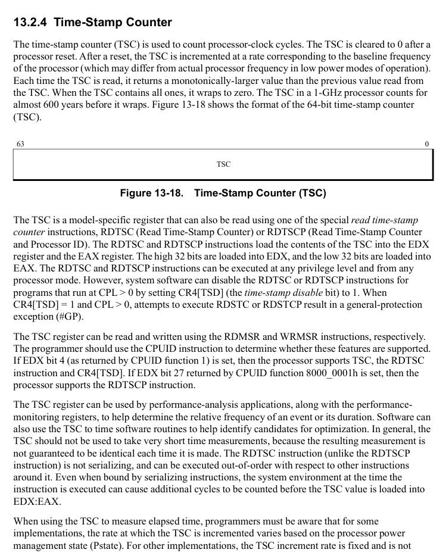

</details>


<!-- PDF source page: 486 | printed page: 424 -->

subject to power-management related changes in processor frequency. CPUID Fn 8000_0007h_EDX[TscInvariant] = 1 indicates that the TSC increment rate is a constant.

For more information on using the CPUID instruction to obtain processor implementation information, see Section 3.3, “Processor Feature Identification,” on page 71.

<a id="13-3-instruction-based-sampling"></a>

## 13.3 Instruction-Based Sampling

Instruction-Based Sampling (IBS) is a hardware facility that can be used to gather specific metrics related to processor instruction fetch and instruction execution activity. Data capture is performed by hardware at a sampling interval specified by values programmed in IBS sampling control registers. The IBS facility can be utilized by software to perform code profiling based on statistical sampling.

There are two independent data gathering components of IBS: instruction fetch sampling and instruction execution sampling. Instruction fetch sampling provides information about instruction address translation look-aside buffer (ITLB) and instruction cache behavior for a randomly selected fetch block, under the control of the IBS Fetch Control Register. Instruction execution sampling provides information about instruction execution behavior by tracking the execution of a single operation (op) that is randomly selected, under the control of the IBS Execution Control Register.

When the programmed interval for fetch sampling has expired, the fetch sampling component of IBS selects and tags the next fetch block. IBS hardware records specific performance information about the tagged fetch. In a similar manner, when the programmed interval for op sampling has expired, the op sampling component of IBS selects and tags the next op being dispatched for execution.

When data collection for the tagged fetch or op is complete, the hardware signals an interrupt. An interrupt handler can then read the performance information that was captured for the fetch or op in IBS MSRs, save it, and re-enable the hardware to take the next sample.

More information about the IBS facility and how software can use it to perform code profiling can be found in the *Software Optimization Guide* for your specific product. The *Software Optimization Guide for AMD Family 15h Processors* is order #47414.

Support for the IBS feature is indicated by the CPUID Fn 8000_0001h_ECX[IBS]. For more information on using the CPUID instruction to obtain processor implementation information, see Section 3.3, “Processor Feature Identification,” on page 71.

<a id="13-3-1-ibs-fetch-sampling"></a>

### 13.3.1 IBS Fetch Sampling

When a processor fetches an instruction, it is actually reading a contiguous range of instruction bytes that contains the instruction from memory or from cache. This range of bytes loaded by the processor in one operation is called a *fetch block*. The size and address-alignment characteristics of the fetch block are implementation-dependent. In the following discussion, the term *instruction fetch* or simply *fetch* refers to this operation of reading a fetch block.

Instruction fetch sampling records the following performance information for each tagged fetch:


<!-- PDF source page: 487 | printed page: 425 -->

- If the fetch completed or was aborted
- The number of core clock cycles spent on the fetch
- If the fetch hit or missed the instruction cache
- If the instruction fetch hit or missed the instruction TLBs
- The fetch address translation page size
- The linear and physical address associated with the fetch

IBS selects and tags a fetch at a programmable rate. When enabled by the IBS Fetch Control Register (IbsFetchEn = 1 and IbsFetchVal = 0), an internal 20-bit fetch interval counter increments for every attempted fetch operation. When the value in bits 19:4 of the fetch counter equal the value in the IbsFetchMaxCnt field of the IBS Fetch Control Register, the next fetch block is tagged for data collection.

When the tagged fetch completes or is aborted, the status of the fetch is written to the IBS Fetch Control Register and the associated linear address and physical address are written in the IBS Fetch Linear Address Register and IBS Fetch Physical Address Register, respectively. The IbsFetchVal bit is set in the IBS Fetch Control Register and an interrupt is generated as specified by the local APIC.

The interrupt service routine saves the performance information stored in the IBS fetch registers. Software can then initiate another sample by resetting the IbsFetchVal bit in the IBS Fetch Control Register. Hardware initializes bits 19:4 of the internal fetch interval counter with the value in the IbsFetchCnt field. If the IbsFetchCtl[IbsRandEn] bit is set, bits 3:0 of the fetch interval counter are re-initialized by hardware with a pseudo-random value; otherwise bits 3:0 are cleared.

<a id="13-3-2-ibs-fetch-sampling-registers"></a>

### 13.3.2 IBS Fetch Sampling Registers

The IBS fetch sampling registers consist of the status and control register (IBS Fetch Control Register) and the associated fetch address registers (IBS Fetch Linear Address Register and IBS Fetch Physical Address Register). The IBS fetch sampling registers are accessed using the RDMSR and WRMSR instructions.


<!-- PDF source page: 488 | printed page: 426 -->

**IBS Fetch Control Register**

63 62 61 60 59 58 57 56 55 54 53 52 51 50 49 48 47 32

IbsPhyAddrValid

IbsFetchOcMiss

IbsFetchL3Miss

IbsL3MissOnly

IbsFetchComp

IbsL1TlbPgSz

IbsL1TlbMiss

IbsFetchVal

IbsFetchEn

IbsRandEn

IbsIcMiss

Reserved

IbsFetchLat

31 16 15 0

IbsFetchCnt IbsFetchMaxCnt

**Bits Mnemonic Description Access type** 63:62 Reserved RAZ 61 IbsFetchL3Miss IBS Fetch L3 Cache Miss R/W 60 IbsFetchOcMiss IBS Fetch Op Cache Miss R/W 59 IbsL3MissOnly IBS Fetch L3 Miss Filtering R/W 58 Reserved RAZ 57 IbsRandEn IBS Randomize Tagging Enable R/W 56 Reserved RAZ 55 IbsL1TlbMiss IBS Fetch L1 TLB Miss R/W 54:53 IbsL1TlbPgSz IBS Fetch L1 TLB Page Size R/W 52 IbsPhyAddrValid IBS Fetch Physical Address Valid R/W 51 IbsIcMiss IBS Instruction Cache Miss R/W 50 IbsFetchComp IBS Fetch Complete R/W 49 IbsFetchVal IBS Fetch Valid R/W 48 IbsFetchEn IBS Fetch Enable R/W 47:32 IbsFetchLat IBS Fetch Latency R/W 31:16 IbsFetchCnt IBS Fetch Count R/W 15:0 IbsFetchMaxCnt IBS Fetch Maximum Count R/W

**Figure 13-19. IBS Fetch Control Register (IbsFetchCtl)**

The fields shown in Figure 13-19 are further described below:

- *IbsFetchL3Miss (IBS Fetch L3 Cache Miss)*—Bit 61, read/write. This bit is set when the tagged fetch missed in the L3 cache. This bit is supported when CPUID Fn8000_001B_EAX[IbsL3MissFiltering](bit 11) = 1.
- *IbsFetchOcMiss (IBS Fetch Op Cache Miss)*—Bit 60, read/write. This bit is set if the tagged fetch missed in the Op Cache. This bit is supported when CPUID Fn8000_001B_EAX[IbsL3MissFiltering](bit 11) = 1.
- *IbsL3MissOnly (IBS Fetch L3 Miss Filtering)*—Bit 59, read/write. This bit controls L3 Miss Filtering. When set, Fetch IBS only sends interrupts for samples with an L3 miss. See Section 13.3.5, “IBS Filtering,” on page 436 for a description of Fetch IBS Filtering.

<details>
<summary>Rendered source page 488 (figures/tables)</summary>

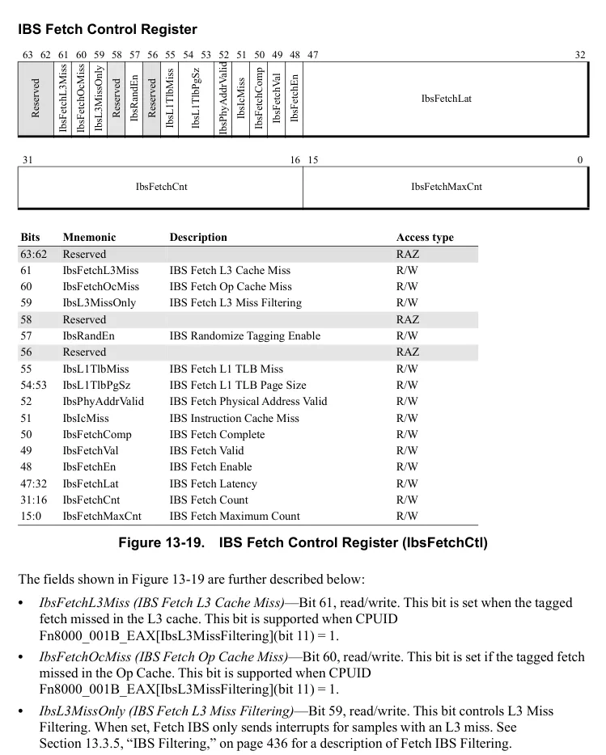

</details>


<!-- PDF source page: 489 | printed page: 427 -->

- *IbsRandEn (IBS Randomize Tagging Enable)*—Bit 57, read/write. Software sets this bit to 1 to add variability to the interval at which fetch operations are selected for tagging. When set, bits 3:0 of the fetch interval counter are set to a pseudo-random value when the IbsFetchCtl register is written. Clearing this bit causes bits 3:0 of the fetch interval counter to be reset to zero.
- *IbsL1TlbMiss (IBS Fetch L1 TLB Miss)*—Bit 55, read/write. This bit is set if the tagged fetch missed in the L1 TLB.
- *IbsL1TlbPgSz[1:0] (IBS Fetch L1 TLB Page Size)*—Bits 54:53, read/write. This field indicates the page size of the translation in the L1 TLB for the tagged fetch. This field is valid only if IbsPhyAddrVal = 1. The table below defines the encoding of this two-bit field:

**Value Page Size** 00b 4 Kbyte 01b 2 Mbyte 10b 1 Gbyte 11b 4 Kbyte coalesced

Some implementations might not support all page sizes. Note: The page size in the L1 TLB might not match the page size in the page table. **•* IbsPhyAddrValid (IBS Fetch Physical Address Valid)*—Bit 52, read/write. This bit is set if the physical address of the tagged fetch is valid. When this bit is set, the IbsL1TlbPgSz field and the contents of the IBS Fetch Physical Address Register (see definition of this register below) are both valid. **•* IbsIcMiss (IBS Instruction Cache Miss)*—Bit 51, read/write. This bit is set if the tagged fetch missed in the instruction cache. **•* IbsFetchComp (IBS Fetch Complete)*—Bit 50, read/write. This bit is set if the tagged fetch completes and data is available for use by the instruction decoder. **•* IbsFetchVal (IBS Fetch Valid)*—Bit 49, read/write. This bit is set if the tagged fetch either completes or is aborted. When the bit is set, captured data for the tagged fetch is available and the fetch interval counter stops. An interrupt is generated as specified by the local APIC. The interrupt handler should read and save the captured performance data before clearing the bit. **•* IbsFetchEn (IBS Fetch Enable)*—Bit 48, read/write. Software sets this bit to enable fetch sampling. Clearing this bit to 0 disables fetch sampling. **•* IbsFetchLat[15:0] (IBS Fetch Latency)*—Bits 47:32, read/write. This 16-bit field indicates the number of core clock cycles from the initiation of the fetch to the delivery of the instruction bytes to the core. If the fetch is aborted before it completes, this field returns the number of clock cycles from the initiation of the fetch to its abortion. **•* IbsFetchCnt[15:0] (IBS Fetch Count)*—Bits 31:16, read/write. This 16-bit field returns the current value of bits 19:4 of the fetch interval counter on a read. Bits 19:4 of the fetch interval counter are set to this value on a write. **•* IbsFetchMaxCnt[15:0] (IBS Fetch Maximum Count)*—Bits 15:0, read/write. This 16-bit field specifies the maximum count value of bits 19:4 of the fetch interval counter. When the value in bits 19:4 of the fetch counter equals the value in this field, the next fetch block is tagged for profiling.


<!-- PDF source page: 490 | printed page: 428 -->

**Figure 13-20. IBS Fetch Linear Address Register (IbsFetchLinAd)**

<details>
<summary>Extracted figure labels</summary>

```text
IBS Fetch Linear Address Register
63
32
IbsFetchLinAd[63:32]
31
0
IbsFetchLinAd[31:0]
Bits
Mnemonic
Description
Access type
63:0
IbsFetchLinAd
IBS Fetch Linear Address
RO
```

</details>

This is a read-only register. Reading the IbsFetchLinAd MSR returns the 64-bit linear address of the tagged fetch. This address may correspond to the first byte of an AMD64 instruction or the start of the fetch block. The address is valid only if the IbsFetchCtl[IbsFetchVal]=1. The address is in canonical form.

**Figure 13-21. IBS Fetch Physical Address Register (IbsFetchPhysAd)**

<details>
<summary>Extracted figure labels</summary>

```text
IBS Fetch Physical Address Register
63
52 51
32
Reserved
IbsFetchPhysAd[51:32]
31
0
IbsFetchPhysAd[31:0]
Bits
Mnemonic
Description
Access type
63:52
Reserved
MBZ
51:0
IbsFetchPhysAd
IBS Fetch Physical Address
RO
```

</details>

This is a read-only register. Reading the IbsFetchPhysAd MSR returns the 52-bit physical address of the tagged fetch. This address may correspond to the first byte of an AMD64 instruction or the start of the fetch block. The address is valid only if both the IbsPhyAddrValid and the IbsFetchVal bits of the IbsFetchCtl register are set. Otherwise, the contents of this register are undefined. The indicated size of 52 bits is an architectural limit. Specific processors may implement fewer bits.

<details>
<summary>Rendered source page 490 (figures/tables)</summary>

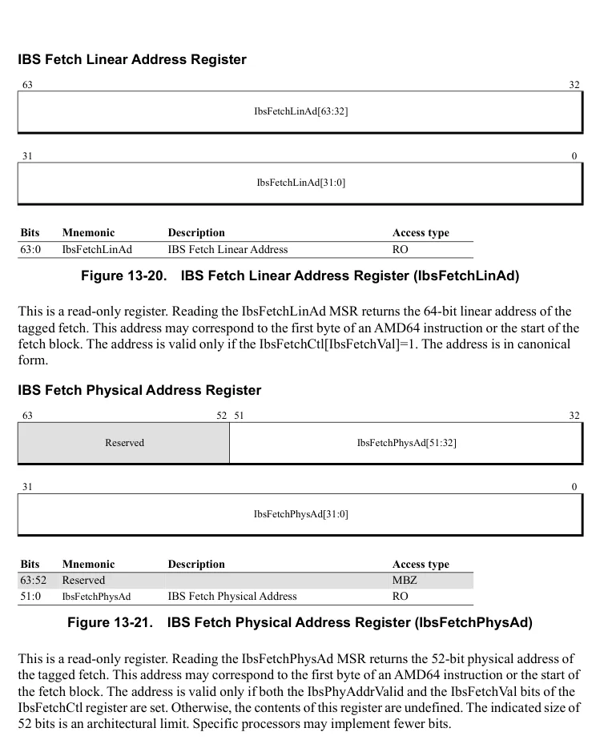

</details>


<!-- PDF source page: 491 | printed page: 429 -->

<a id="13-3-3-ibs-execution-sampling"></a>

### 13.3.3 IBS Execution Sampling

Instruction execution performance is measured by tagging an op associated with an instruction. The tagged op joins other ops in a queue waiting to be dispatched and executed. Instructions that decode to more than one op may return different performance data depending upon which op associated with the instruction is tagged. IBS returns the following performance information for each retired tagged op:

- Branch status for branch ops.
- For a load or store op:
- Whether the load or store missed in the data cache.
- Whether the load or store address hit or missed in the TLBs.
- The linear and physical address of the data operand associated with the load or store operation.
- Source information for cache, DRAM, MMIO, or I/O accesses.

IBS selects and tags an op at a programmable rate. When enabled by the IBS Execution Control Register (IbsOpEn = 1 and IbsOpVal = 0), an internal 27-bit op interval counter increments either once for every core clock cycle, if IbsOpCntCtl is cleared, or once for every dispatched op, if IbsOpCntCtl is set.

When the value in bits 26:4 of the op counter equals the value in the IbsOpMaxCnt field of the IBS Execution Control Register, an op is tagged in the next cycle. When the op is retired, the execution status of the op is written to the IBS execution registers, and IbsOpVal bit of the IBS Execution Control Register is set. When this is complete, an interrupt is signaled to the local APIC. The local APIC should be programmed to deliver this interrupt to the processor core.

The interrupt service routine must save the performance information stored in IBS execution registers. Software can then initiate another sample by resetting the IbsOpVal bit in the IBS Execution Control Register.

Aborted ops do not produce an IBS execution sample. If the tagged op aborts (i.e., does not retire), hardware resets bits 26:7 of the op interval counter to zero, and bits 6:0 to a random value. The op counter continues to increment and another op is selected when the value in bits 26:4 of the op interval counter equals the value in the IbsOpMaxCnt field.

**Randomization of sampling interval:** A degree of randomization of the sampling interval is necessary to ensure fairness in sampling, especially for loop-intensive code. For execution sampling this must be done by software. This is accomplished when writing the IbsOpCtl register to clear the IbsOpVal bit and initiate a new sampling interval. At that time software can provide a small random number (4-6 bits) in the IbsOpCurCnt field to offset the starting count, thereby randomizing the point at which the count reaches the IbsOpMaxCnt value and triggers a sample.

<a id="13-3-4-ibs-execution-sampling-registers"></a>

### 13.3.4 IBS Execution Sampling Registers

The IBS execution sampling registers consist of the control register (IBS Execution Control Register), the linear address register (IBS Op Linear Address Register), and three execution data registers (IBS


<!-- PDF source page: 492 | printed page: 430 -->

Op Data 1–3). The IBS execution sampling registers are accessed using the RDMSR and WRMSR instructions.

**IBS Execution Control Register (IbsOpCtl)**

63 59 58 32

Reserved IbsOpCurCnt[26:0]

31 27 26 20 19 18 17 16 15 0

IbsOpL3MissOnly

IbsOpCntCtl

IbsOpVal

IbsOpEn

Reserved IbsOpMaxCnt[26:20]

IbsOpMaxCnt[19:4]

**Bits Mnemonic Description Access type** 63:59 Reserved MBZ 58:32 IbsOpCurCnt[26:0] IBS Op Current Count, bits 26:0 R/W 31:27 Reserved MBZ 26:20 IbsOpMaxCnt[26:20] IBS Op Maximum Count, bits 26:20 R/W 19 IbsOpCntCtl IBS Op Counter Control R/W 18 IbsOpVal IBS Op Sample Valid R/W 17 IbsOpEn IBS Op Sampling Enable R/W 16 IbsOpL3MissOnly IBS Op L3 Miss Filtering R/W 15:0 IbsOpMaxCnt[19:4] IBS Op Maximum Count, bits 19:4 R/W

**Figure 13-22. IBS Execution Control Register (IbsOpCtl)**

The fields shown in Figure 13-22 are further described below:

- *IbsOpCurCnt[26:0] (IBS Op Current Count)*—Bits 58:32, read/write. This field returns the current value of the op counter, and provides the starting value of the counter when software writes this register to clear the IbsOpVal bit and start another sampling interval.
- *IbsOpMaxCnt[26:20] (IBS Op Maximum Count[26:20])*—Bits 26:20, read/write. This field is used to specify the most significant 7 bits of the IbsOpMaxCnt.
- *IbsOpCntCtl (IBS Op Counter Control)*—Bit 19, read/write. This bit controls op tagging. When this bit is zero, IBS counts core clock cycles in order to select an op for tagging. When this bit is one, IBS counts dispatched ops in order to select an op for tagging.
- *IbsOpVal (IBS Op Sample Valid)*—Bit 18, read/write. This bit is set when a tagged op retires and indicates that new instruction execution data is available. The op counter stops counting. An interrupt is generated as specified by the local APIC. The software interrupt handler captures the *performance data before clearing the bit to enable the hardware to take another sample.*

<details>
<summary>Rendered source page 492 (figures/tables)</summary>

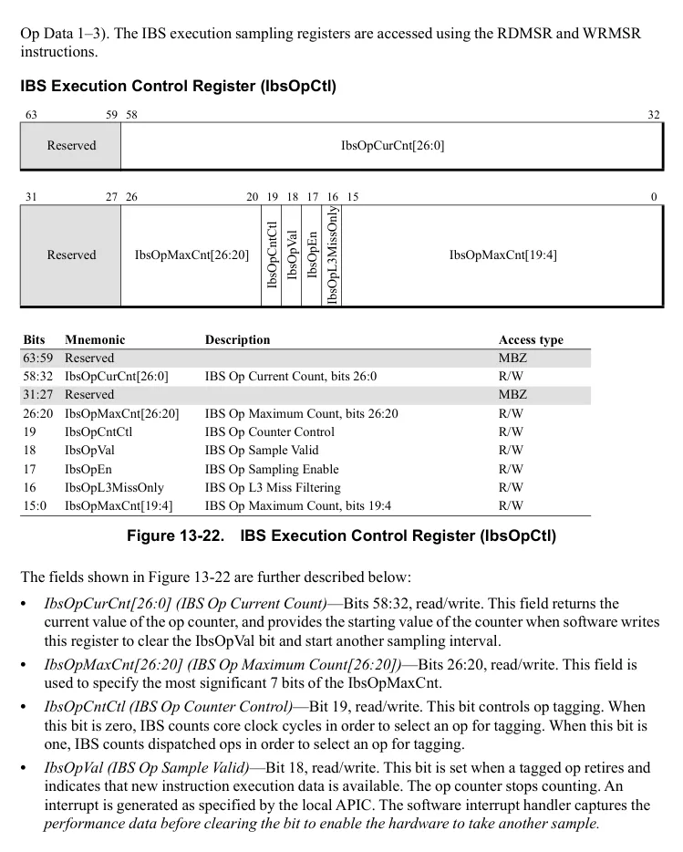

</details>


<!-- PDF source page: 493 | printed page: 431 -->

- *IbsOpEn (IBS Op Sample Enable)*—Bit 17, read/write. Software sets this bit to enable IBS execution sampling. Clearing this bit disables IBS execution sampling.
- *IbsOpL3MissOnly (IBS Op L3 Miss Filtering)*—Bit 16, read/write. This bit controls L3 Miss Filtering. When set, Execution IBS only sends interrupts for samples with an L3 miss. See Section 13.3.5, “IBS Filtering,” on page 436 for a description of Execution IBS Filtering.
- *IbsOpMaxCnt[19:4] (IBS Op Maximum Count[19:4])*—read/write. This field specifies the maximum count value for bits 19:4 of the op interval counter. When the value in bits 26:4 of the op interval counter equal the value specified by the concatenation of the IbsOpMaxCnt[26:20] field with this field, the next op is tagged for profiling.

**Figure 13-23. IBS Op Linear Address Register (IbsOpRip)**

<details>
<summary>Extracted figure labels</summary>

```text
IBS Op Linear Address Register (IbsOpRip)
63
32
IbsOpRip[63:31]
31
0
IbsOpRip[31:0]
Bits
Mnemonic
Description
Access type
63:0
IbsOpRip
IBS Op Linear Address
R/W
```

</details>

*IbsOpRip[63:0] (IBS Op Linear Address)*—Bits 63:0, read/write. Specifies the linear address for the instruction from which the tagged op was issued. The address is valid only if the IbsOpCtl[IbsOpVal] bit is set and the IbsOpData1[IbsRipInvalid] bit is cleared. The address is in canonical form.

<details>
<summary>Rendered source page 493 (figures/tables)</summary>

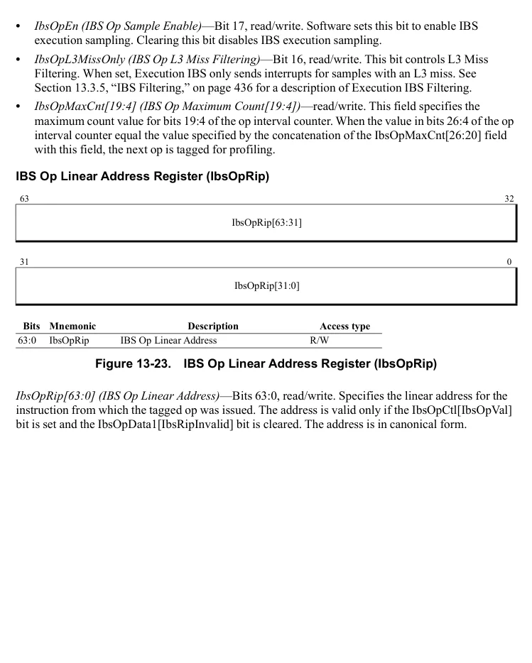

</details>


<!-- PDF source page: 494 | printed page: 432 -->

**IBS Op Data 1 Register (IbsOpData1)**

The IBS Op Data 1 Register provides core cycle counts for tagged ops and performance data for tagged ops which perform a branch.

63 39 38 37 36 35 34 33 32

IbsOpBrnTaken

IbsOpBrnMisp

IbsRipInvalid

IbsOpBrnRet

IbsOpReturn

Reserved

31 0

Reserved

**Bits Mnemonic Description Access type** 63:39 Reserved MBZ 38 IbsRipInvalid IbsOpRip Register Invalid R/W 37 IbsOpBrnRet IBS Op Branch Retired R/W 36 IbsOpBrnMisp IBS Op Branch Mispredicted R/W 35 IbsOpBrnTaken IBS Op Branch Taken R/W 34 IbsOpReturn IBS Op RET R/W 33:0 Reserved MBZ

**Figure 13-24. IBS Op Data 1 Register (IbsOpData1)**

The fields shown in Figure 13-24 are further described below:

- *IbsRipInvalid (IbsOpRip Register Invalid)*—Bit 38, read/write. If this bit is set, the contents of the IbsOpRip register are not valid.
- *IbsOpBrnRet (IBS Op Branch Retired)*—Bit 37, read/write. This bit is set if the tagged op performs a branch that retired.
- *IbsOpBrnMisp (IBS Op Branch Mispredicted)*—Bit 36, read/write. This bit is set if the tagged op performs a retired mispredicted branch.
- *IbsOpBrnTaken (IBS Op Branch Taken)*—Bit 35, read/write. This bit is set if the tagged op performs a retired taken branch.
- *IbsOpReturn (IBS Op RET)*—Bit 34, read/write. This bit is set if the tagged op performs a retired subroutine return (RET).

<details>
<summary>Rendered source page 494 (figures/tables)</summary>

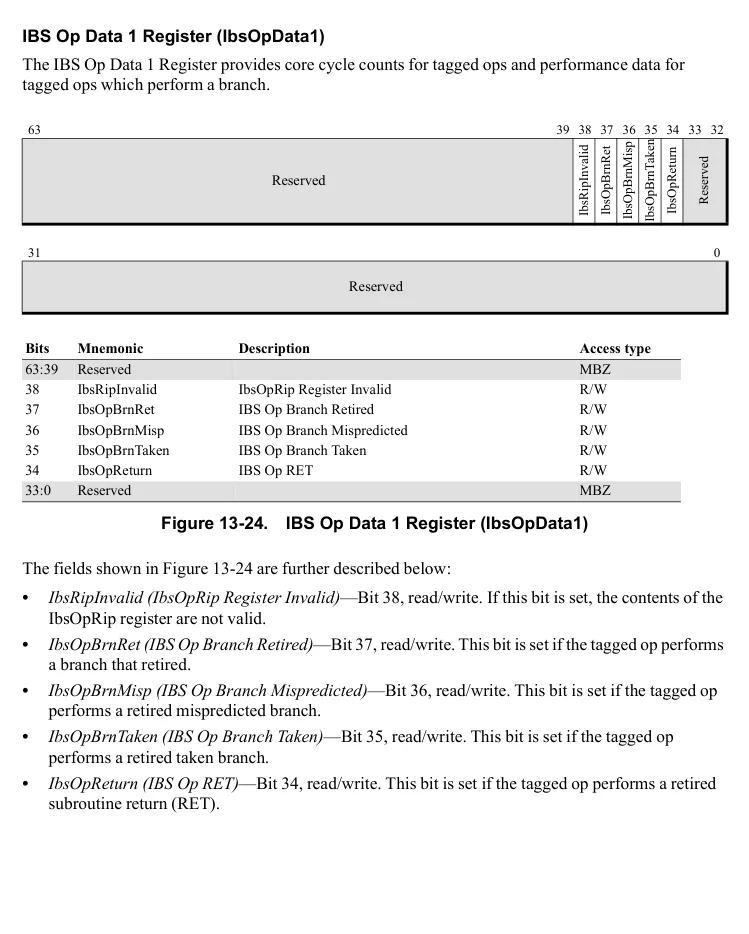

</details>


<!-- PDF source page: 495 | printed page: 433 -->

**IBS Op Data 2 Register (IbsOpData2)**

The IBS Op Data 2 Register captures Northbridge-related performance data. The information captured is implementation-dependent. See the *BIOS and Kernel Developer’s Guide (BKDG)* or *Processor Programming Reference Manual (PPR)* applicable to your product for details.

**IBS Op Data 3 Register (IbsOpData3)**

Data Cache (first-level cache) performance data is captured in IBS Op Data 3 Register. If a load or store operation crosses a 128-bit boundary, the data returned in this register is the data for the access to the data below the 128-bit boundary.

63 48 47 32

Reserved IbsDcMissLat[15:0]

31 19 18 17 16 15 14 13 12 9 8 7 6 5 4 3 2 1 0

IbsDcPhyAddrValid

IbsDcLinAddrValid

IbsDcWcMemAcc

IbsDcUcMemAcc

IbsDcL1tlbHit2M

IbsDcL1tlbHit1G

IbsDcLockedOp

IbsDcL1tlbMiss

IbsDcMisAcc

IbsDcMiss

Reserved

IbsLdOp

IbsStOp

Reserved


<!-- PDF source page: 496 | printed page: 434 -->

**Bits Mnemonic Description Access type** 63:48 Reserved MBZ 47:32 IbsDcMissLat[15:0] IBS Data Cache Miss Latency R/W 31:19 Reserved MBZ 18 IbsDcPhyAddrValid IBS Data Cache Physical Address Valid R/W 17 IbsDcLinAddrValid IBS Data Cache Linear Address Valid R/W 16 Reserved MBZ 15 IbsDcLockedOp IBS Data Cache Locked Op R/W 14 IbsDcUcMemAcc IBS Data Cache UC Memory Access R/W 13 IbsDcWcMemAcc IBS Data Cache WC Memory Access R/W 12:9 Reserved MBZ 8 IbsDcMisAcc IBS Data Cache Misaligned Access Penalty R/W 7 IbsDcMiss IBS Data Cache Miss R/W 6 Reserved MBZ 5 IbsDcL1tlbHit1G IBS Data Cache L1 TLB Hit 1-Gbyte Page R/W 4 IbsDcL1tlbHit2M IBS Data Cache L1 TLB Hit 2-Mbyte Page R/W 3 Reserved MBZ 2 IbsDcL1tlbMiss IBS Data Cache L1 TLB Miss R/W 1 IbsStOp IBS Store Operation R/W 0 IbsLdOp IBS Load Operation R/W

**Figure 13-25. IBS Op Data 3 Register (IbsOpData3)**

The fields shown in Figure 13-25 are further described below:

- *IbsDcMissLat[15:0] (IBS Data Cache Miss Latency)*—Bits 47:32, read/write. This field indicates the number of core clock cycles from when a miss is detected in the data cache to when the data is delivered to the core. The value is not valid for data cache store operations.
- *IbsDcPhyAddrValid (IBS Data Cache Physical Address Valid)*—Bit 18, read/write. This bit is set if the physical address in the IBS DC Physical Address Register is valid for a load or store operation.
- *IbsDcLinAddrValid (IBS Data Cache Linear Address Valid)*—Bit 17, read/write. This bit is set if the linear address in the IBS DC Linear Address Register is valid for a load or store operation.
- *IbsDcLockedOp (IBS Data Cache Locked Op)*—Bit 15, read/write. This bit is set if the tagged load or store operation was a locked operation.
- *IbsDcUcMemAcc (IBS Data Cache UC Memory Access)*—Bit 14, read/write. This bit is set if the tagged load or store operation accessed uncacheable memory.
- *IbsDcWcMemAcc (IBS Data Cache WC Memory Access)*—Bit 13, read/write. This bit is set if the tagged load or store operation accessed write combining memory.
- *IbsDcMisAcc (IBS Data Cache Misaligned Access Penalty)*—Bit 8, read/write. This bit is set if a tagged load or store operation incurred a performance penalty due to a misaligned access.

<details>
<summary>Rendered source page 496 (figures/tables)</summary>

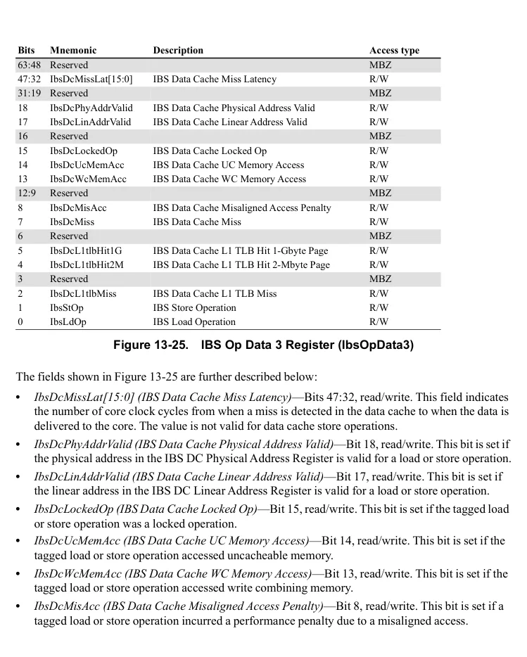

</details>


<!-- PDF source page: 497 | printed page: 435 -->

- *IbsDcMiss (IBS Data Cache Miss)*—Bit 7, read/write. This bit is set if the cache line used by the tagged load or store operation was not present in the data cache.
- *IbsDcL1tlbHit1G (IBS Data Cache L1 TLB Hit 1-Gbyte Page)*—Bit 5, read/write. This bit is set if the physical address for the tagged load or store operation was present in a 1-Gbyte page table entry in the data cache L1 TLB.
- *IbsDcL1tlbHit2M (IBS Data Cache L1 TLB Hit 2-Mbyte Page)*—Bit 4, read/write. This bit is set if the physical address for the tagged load or store operation was present in a 2-Mbyte page table entry in the data cache L1 TLB.
- *IbsDcL1tlbMiss (IBS Data Cache L1 TLB Miss)*—Bit 2, read/write. This bit is set if the physical address for the tagged load or store operation was not present in the data cache L1 TLB.
- *IbsStOp (IBS Store Op)*—Bit 1, read/write. This bit is set if the tagged op was a store.
- *IbsLdOp (IBS Load Op)*—Bit 0, read/write. This bit is set if the tagged op was a load.

**Figure 13-26. IBS Data Cache Linear Address Register (IbsDcLinAd)**

<details>
<summary>Extracted figure labels</summary>

```text
IBS Data Cache Linear Address Register (IbsDcLinAd)
63
32
IbsDcLinAd[63:32]
31
0
IbsDcLinAd[31:0]
Bit
Mnemonic
Description
Access type
63:0
IbsDcLinAd
IBS Data Cache Linear Address
R/W
```

</details>

*IbsDcLinAd[63:0] (IBS Data Cache Linear Address)*—Bits 63:0, read/write. Specifies the linear address of the tagged op's memory operand. The address is valid only if IbsOpData3[IbsDcLinAdVal] is set. The address is in canonical form.

<details>
<summary>Rendered source page 497 (figures/tables)</summary>

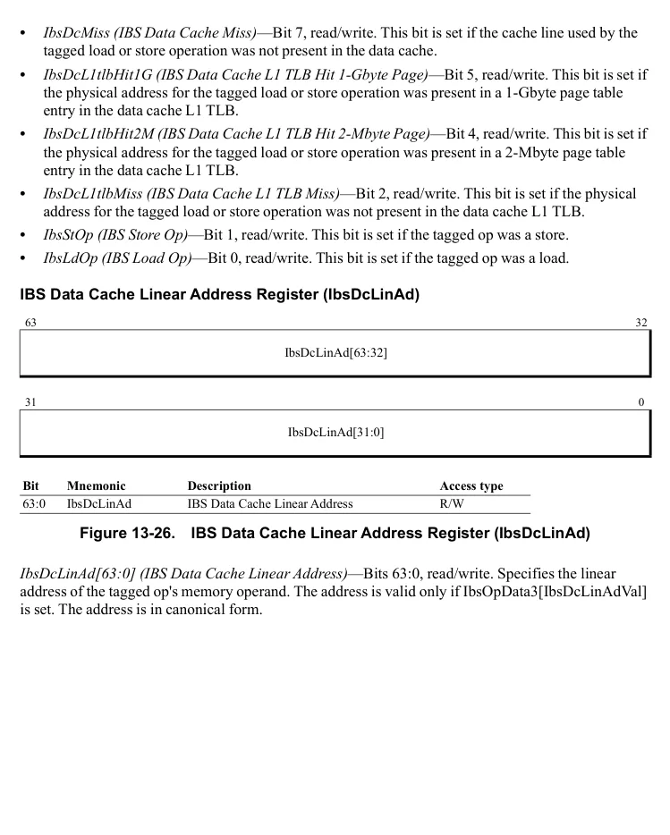

</details>


<!-- PDF source page: 498 | printed page: 436 -->

**Figure 13-27. IBS Data Cache Physical Address Register (IbsDcPhysAd)**

<details>
<summary>Extracted figure labels</summary>

```text
IBS Data Cache Physical Address Register (IbsDcPhysAd)
63
52 51
32
Reserved
IbsDcPhysAd[51:32]
31
0
IbsDcPhysAd[31:0]
Bits
Mnemonic
Description
Access type
63:52
Reserved
MBZ
51:0
IbsDcPhysAd
IBS Data Cache Physical Address
R/W
```

</details>

*IbsDcPhysAd (IBS Data Cache Physical Address)*—Bits 51:0, read/write. Specifies the physical address of the tagged op’s memory operand. The address is valid only if IbsOpData3[IbsDcPhyAdVal] is set.

**Figure 13-28. IBS Branch Target Address Register (IbsBrTarget)**

<details>
<summary>Extracted figure labels</summary>

```text
IBS Branch Target Address Register (IbsBrTarget)
63
32
IbsBrTarget[63:32]
31
0
IbsBrTarget[31:0]
Bits
Mnemonic
Description
Access type
63:0
IbsBrTarget
IBS branch target linear address
R/W
```

</details>

*IbsBrTarget (IBS Branch Target)*—Bits 63:0, read/write. Specifies the 64-bit linear address for the branch target. The address is in canonical form. For non-branch instructions, the value supplied in this register is invalid. For a conditional branch not taken, the value supplied in this register is the fall-through address.

<a id="13-3-5-ibs-filtering"></a>

### 13.3.5 IBS Filtering

Processors that set CPUID Fn8000_001B_EAX[IbsL3MissFiltering](bit 11) = 1 support IBS Filtering for both IBS Fetch Sampling and IBS Execution Sampling. IBS Filtering changes the behavior of the

<details>
<summary>Rendered source page 498 (figures/tables)</summary>

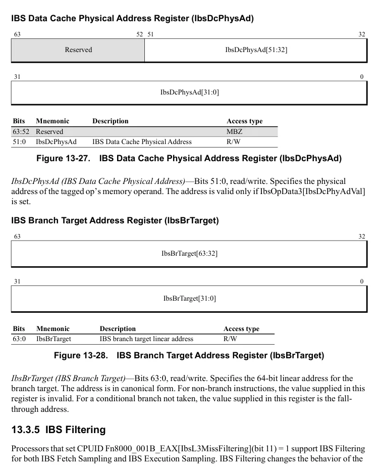

</details>


<!-- PDF source page: 499 | printed page: 437 -->

IBS hardware such that interrupts are only generated for samples that match certain criteria. If the sample does not match the selected criteria the IBS hardware restarts and selects a new sample. This results in reduced interrupt overhead if software is only interested in samples with certain characteristics.

**Fetch IBS Filtering**

When Fetch IBS collects a sample that does not match the selected filter criteria it does not set IbsFetchCtl[IbsFetchVal] and instead clears IbsFetchCtl[IbsFetchCnt] and bits 19:7 of the internal fetch counter. Bits 6:0 of the internal fetch counter are loaded with a pseudo-random value if IbsFetchCtl[IbsRandEn] is set and cleared if IbsFetchCtl[IbsRandEn] is not set. It is recommended that software sets IbsFetchCtl[IbsRandEn] when IBS Filtering is active. After its reset, the internal fetch counter increments for every attempted fetch. When the internal fetch counter's bits [19:4] match IbsFetchCtl[IbsFetchMaxCnt] the next fetch is selected for profiling. When the selected fetch completes or is aborted, the IBS hardware evaluates it against the IBS Filtering criteria and either sets IbsFetchCtl[IbsFetchVal] and signals an interrupt or restarts Fetch IBS in the manner described above.

**Execution IBS Filtering**

When Execution IBS collects a sample that does not match the selected filter criteria it does not set IbsOpCtl[IbsOpVal] and instead clears IbsOpCtl[IbsOpCurCnt] and bits 26:0 of the internal op counter. Bits 6:0 of the internal op counter are loaded with a pseudo-random value. After its reset, the internal op counter increments for every cycle (IbsOpCtl[IbsOpCntCtl] = 0) or dispatched op (IbsOpCtl[IbsOpCntCtl] = 1). When the internal op counter's bits [26:4] match IbsOpCtl[IbsOpMaxCnt] the next op is selected for profiling. When profiling is complete, the IBS hardware evaluates it against the IBS Filtering criteria and either sets IbsOpCtl[IbsOpVal] and signals an interrupt or restarts Execution IBS in the manner described above.

**Supported IBS Filter Criteria**

Figure 13-7 shows the supported filter criteria and how they are activated.

**Table 13-7. Supported IBS Filtering Criteria**

| Filter criterion | Active when | Supported If |
| --- | --- | --- |
| Fetch IBS only reports<br>samples with L3 miss | IbsFetchCtl[IbsL3MissOnly] =<br>1 | CPUID<br>Fn8000 001B EAX[IbsL3MissFiltering](bit<br>_ _<br>11) = 1 |
| Execution IBS only reports<br>samples with L3 miss | IbsOpCtl[IbsOpL3MissOnly] =<br>1 | CPUID<br>Fn8000 001B EAX[IbsL3MissFiltering](bit<br>_ _<br>11) = 1 |

<details>
<summary>Rendered source page 499 (figures/tables)</summary>

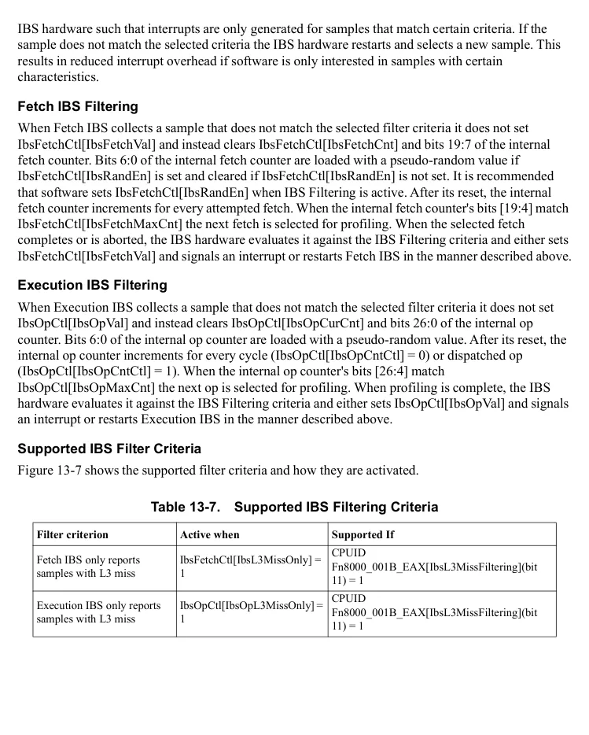

</details>


<!-- PDF source page: 500 | printed page: 438 -->

<a id="13-4-lightweight-profiling"></a>

## 13.4 Lightweight Profiling

Lightweight Profiling (LWP) is an AMD64 extension that allows user mode processes to gather performance data about themselves with very low overhead. LWP is supported in both long mode and legacy mode. Modules such as managed runtime environments and dynamic optimizers can use LWP to monitor the running program with high accuracy and high resolution. They can quickly discover performance problems and opportunities and immediately act on this information.

LWP allows a program to gather performance data and examine it either by polling or by taking an occasional interrupt. It introduces minimal additional state to the CPU and the process. LWP differs from the existing performance counters and from Instruction Based Sampling (IBS) because it collects large quantities of data before taking an interrupt. This substantially reduces the overhead of using performance feedback. An application can avoid the need to enable and process interrupts by polling the LWP data.

A program can control LWP data collection entirely in user mode. It can start, stop, and reconfigure profiling without calling the kernel.

LWP runs within the context of a thread, so it can be used by multiple processes in a system at the same time without interference. This also means that if one thread is using LWP and another is not, the latter thread incurs no profiling overhead.

LWP can be programmed to run in one of two modes: *synchronized mode* or *continuous mode*. In synchronized mode the recording of events stops when the buffer set up to hold event records becomes full. In continuous mode, the storing of events wraps in the buffer overwriting older records.

<a id="13-4-1-overview"></a>

### 13.4.1 Overview

When enabled, LWP hardware monitors one or more events during the execution of user-mode code and periodically inserts event records into a ring buffer in the address space of the running process. If performance timestamping is supported and enabled, each event record captured is timestamped using the value read from the Performance Timestamp Counter (PTSC). Timestamping is enabled by setting the Flags. PTSC bit of the Lightweight Profiling Control Block (LWPCB). When the ring buffer is filled beyond a user-specified threshold, the hardware can cause an interrupt which the operating system (OS) uses to signal a process to empty the ring buffer. With proper OS support, the interrupt can even be delivered to a separate process or thread.

LWP only counts instructions that retire in user mode (CPL = 3). Instructions that change to CPL 3 from some other level are not counted, since the instruction address is not an address in user mode space. LWP does not count hardware events while the processor is in system management mode (SMM) and while entering or leaving SMM.

Once LWP is enabled, each user-mode thread uses the LLWPCB and SLWPCB instructions to control LWP operation. These instructions refer to a data structure in application memory called the Lightweight Profiling Control Block, or LWPCB, to specify the profiling parameters and to interact


<!-- PDF source page: 501 | printed page: 439 -->

with the LWP hardware. The LWPCB in turn points to a buffer in memory in which LWP stores event records.

Each thread in a multi-threaded process must configure LWP separately. A thread has its own ring buffer and counters which are context switched with the rest of the thread state. However, a single monitor thread could collect and process LWP data from multiple other threads.

LWP may be set up to run in one of two modes:

- Synchronized Mode LWP runs in synchronized mode when it is started with LWPCB.Flags. CONT = 0. In this mode, LWP will not advance the ring buffer pointer when the event ring buffer is full. It simply increments LWPCB.MissedEvents to count the number of missed event records. In synchronized mode, a thread can remove event records from the ring buffer by advancing the ring buffer tail pointer without stopping LWP in the executing thread. If the buffer had been full, event records will again be written and the ring buffer pointer will be advanced.
- Continuous Mode LWP runs in continuous mode when it is started with LWPCB.Flags. CONT = 1. In this mode, LWP will store an event record even when the event ring buffer is full, wrapping around in the ring buffer and overwriting the oldest event record. In continuous mode, LWPCB.MissedEvents counts the number of times that such wrapping has occurred. The only reliable way to read events from the ring buffer when LWP is in continuous mode is to stop LWP in the running thread before accessing the LWPCB and the ring buffer contents. Support for continuous mode is indicated by CPUID Fn8000_001C_EAX[LwpCont].

During profiling, the LWP hardware monitors and reports on one or more types of events. Following are the steps in this process:

1. 1. **Count—**Each time an instruction is retired, LWP decrements its internal event counters for all of the events associated with the instruction. An instruction can cause zero, one, or multiple events. For instance, an indirect jump through a pointer in memory counts as an instruction retired, a branch retired, and may also cause up to two DCache misses (or more, if there is a TLB miss) and up to two ICache misses.
- Some events may have filters or conditions on them that regulate counting. For instance, the application may configure LWP so that only cache miss events with latency greater than a specified minimum are eligible to be counted.

1. 2. **Gather—**When an event counter becomes negative, the event should be reported. LWP gathers an event record and, if enabled, samples the value in the PTSC to be included in the record as the TimeStamp value. The event’s counter may continue to count below zero until the record is written to the event ring buffer. For most events, such as instructions retired, LWP gathers an event record describing the instruction that caused the counter to become negative. However, it is valid for LWP to gather event record data for the *next* instruction that causes the event, or to take other measures to capture a record. Some of these options are described with the individual events.


<!-- PDF source page: 502 | printed page: 440 -->

- An implementation can choose to gather event information on one or many events at any one time. If multiple event counters become negative, an advanced LWP implementation might gather one event record per event and write them sequentially. A basic LWP implementation may choose one of the eligible events. Other events continue counting but wait until the first event record is written. LWP picks the next eligible instructions for the waiting events. This situation should be extremely uncommon if software chooses large event interval values.
- LWP may discard an event occurrence. For instance, if the LWPCB or the event ring buffer needs to be paged in from disk, LWP might choose not to preserve the pending event data. If an event is discarded, LWP gathers an event record for the next instruction to cause the event.
- Similarly, if LWP needs to replay an instruction to gather a complete event record, the replay may abort instead of retiring. The event counter continues counting below zero and LWP gathers an event record for the next instruction to cause the event.

1. 3. **Store—**When a complete event record is gathered, LWP stores it into the event ring buffer in the process’ address space and advances the ring buffer head pointer.
- LWP checks to see if the ring buffer is full, i.e., if advancing the ring buffer head pointer would make it equal to the tail pointer. If the buffer is full, LWP increments the 64-bit counter LWPCB.MissedEvents. If LWP is running in synchronized mode, it does not advance the head pointer. If LWP is running in continuous mode, it always advances the head pointer and LWPCB.MissedEvents counts the number of times that the buffer wrapped.
- If more than one event record reaches the Store stage simultaneously, only one need be stored. Though LWP might store all such event records, it may delay storing some event records or it may discard the information and proceed to choose the next eligible instruction for the discarded event type(s). This behavior is implementation dependent.
- The store need not complete synchronously with the instruction retiring. In other words, if LWP buffers the event record contents, the Store stage (and subsequent stages) may complete some number of cycles after the tagged instruction retires. The data about the event and the instruction are precise, but the Report and Reset steps (below) may complete later.

1. 4. **Report—**If LWP threshold interrupts are enabled and the space used in the event ring buffer exceeds a user-defined threshold, LWP initiates an interrupt. The OS can use this to signal the process to empty the ring buffer. Note that the interrupt may occur significantly later than the event that caused the threshold to be reached.

1. 5. **Reset—**For each event that was stored, the counter is reset to its programmed interval. If requested by the application, LWP applies randomization to the low order bits of the interval. Counting for that event continues. Reset happens if the ring buffer head pointer was advanced or if the missed event counter was incremented. If the event counter went below -1, indicating that additional events occurred between the selected event and the time it was reported, that overrun value reduces the reset value so as to preserve the statistical distribution of events. For all events except the LWPVAL instruction, the hardware may impose a minimum on the reset value of an event counter. This prevents the system from spending too much time storing samples rather than making forward progress on the application. Any minimum imposed by the hardware can be detected by examining the EventInterval*n* fields in the LWPCB after enabling LWP.


<!-- PDF source page: 503 | printed page: 441 -->

An application should periodically remove event records from the ring buffer and advance the tail pointer. (If the application does not process the event records quickly enough or often enough, the LWP hardware will detect that the ring buffer is full and will miss events.) There are two ways to process the gathered events: interrupts or polling.

The application can wait until a threshold interrupt occurs to process the event records in the ring buffer. This requires OS or driver support. (As a consequence, interrupts can only be enabled if a kernel mode routine allows it; see “LWP_CFG—LWP Configuration MSR” on page 455) One usage model is to associate the LWP interrupt with a semaphore or mutex. When the interrupt occurs, the OS or driver signals the associated object. A thread waiting on the object wakes up and empties the ring buffer. Other models are possible, of course.

Alternatively, the application can have a thread that periodically polls the ring buffer. The polling thread need not be part of the process that is using LWP. It can be in a separate process that shares the memory containing the LWP control block and ring buffer.

Access to the ring buffer uses a lockless protocol between the LWP hardware and the application. The hardware owns the head pointer and the area in the ring buffer from the head pointer up to (but not including) the tail pointer. The application must not modify the head pointer nor rely on any data in the area of the ring buffer owned by the hardware. If the application has a stale value for the head pointer, it may miss an existing event record but it will never read invalid data. When the application is done emptying the ring buffer, it should refresh its copy of the head pointer to see if the LWP hardware has added any new event records.

Similarly, the application owns the tail pointer and the area in the ring buffer from the tail pointer up to (but not including) the head pointer. The hardware will never modify the tail pointer or overwrite the data in that region of the ring buffer. If the hardware has a stale value for the tail pointer, it may consider that the ring buffer is full or at its threshold, but it will never overwrite valid data. Instead, it refreshes its copy of the tail pointer and rechecks to see if the full or threshold condition still applies.

When LWP is in continuous mode, this lockless protocol does not work, since the LWP hardware may overwrite the event records in the ring buffer when it advances the head pointer past the tail pointer. Because of this, the application must stop LWP before removing event records from the ring buffer. This prevents the hardware from wrapping through the ring buffer asynchronously from the application’s attempt to remove data from it.

To use continuous mode properly, the application should set LWPCB.MissedEvents to 0 and set the head and tail pointers to the start of the ring buffer before starting LWP. To empty the ring buffer, the application should stop LWP. If LWPCB.MissedEvents is 0, the buffer did not wrap and there are event records starting at the tail pointer and continuing up to (but not including) the head pointer. If MissedEvents is not 0, the buffer wrapped and there are event records starting with the oldest one pointed to by the head pointer and continuing (possibly wrapping) all the way around to the newest one just before the head pointer.


<!-- PDF source page: 504 | printed page: 442 -->

<a id="13-4-2-events-and-event-records"></a>

### 13.4.2 Events and Event Records

When a monitored event overflows its event counter, LWP puts an event record into the LWP event ring buffer. If event timestamping is supported and enabled, each event record will include a TimeStamp value. This value is a copy of the contents of Performance Timestamp Counter (PTSC) zero-extended if necessary to 64 bits.

The PTSC is a free-running counter that increments at a constant rate of 100MHz and is synchronized across all cores on a node to within +/-1. This counter starts when the processor is initialized and cannot be reset or modified. It is at least 40 bits wide. Privileged code can read the PTSC value via the RDMSR instruction. The size of the counter is indicated by the 2-bit field CPUID Fn8000_0008_ECX[PerfTscSize]. A value of 00b means that the PTSC is 40 bits wide; 01b means 48 bits, 10b means 56 bits, and 11b indicates a full 64 bits.

The PTSC can be correlated to the architectural TSC that runs at the P0 frequency. An application can read the TSC and PTSC, wait a 1000 clock periods or so, then read them again. The ratio of the differences is the scaling factor for the counters.

The event record size is fixed but may vary based on implementation. The event record size for a given processor is discovered by executing CPUID Fn8000_001C and extracting the value of the LwpEventSize field. (See “Detecting LWP Capabilities” on page 452). Current implementations fix the record size at 32 bytes and this size is used in the record format specifications below.

Reserved fields and fields that are not defined for a particular event are set to zero when LWP writes an event record.


<!-- PDF source page: 505 | printed page: 443 -->

Byte 7 Byte 6 Byte 5 Byte 4 Byte 3 Byte 2 Byte 1 Byte 0

(Event-specific data) Flags CoreId EventId 0

InstructionAddress 8

(Event-specific address or data) 16

TimeStamp 24

**Bytes Field Description**

0 EventId Event identifier specifying the event record type. Valid identifiers are 1 to 255. 0 is an invalid identifier.

CPU core identifier value from COREID field of LWP_CFG (see “LWP_CFG—LWP Configuration MSR” on page 455). For multicore systems, this typically identifies the core on which LWP is running. This allows software to aggregate event records from multiple threads into a single data structure without losing CPU information. It also allows software to detect when a thread has migrated from one core to another. 3–2 Flags Event-specific flags. 7–4 Event-specific data.

1 CoreId

The Effective Address of the instruction that triggered this event record. This is the value before adding in the CS base address. If the base is non-zero, software must track it. (Modern operating systems use a CS base of zero, and CS is unused in long mode.) 23–16 Event-specific address or other data.

15–8 InstructionAddress

31–24 TimeStamp Performance Time Stamp Counter value if LWP was started with LWPCB.Flags. PTSC = 1, zero otherwise.

**Figure 13-29. Generic Event Record**

Table 13-8 below lists the event identifiers for the events defined in version 1 of LWP. They are described in detail in the following sections.

**Table 13-8. EventId Values**

| EventId | Description |
| --- | --- |
| 0 | Reserved – invalid event |
| 1 | Programmed value sample |
| 2 | Instructions retired |
| 3 | Branches retired |
| 4 | DCache misses |

<details>
<summary>Rendered source page 505 (figures/tables)</summary>

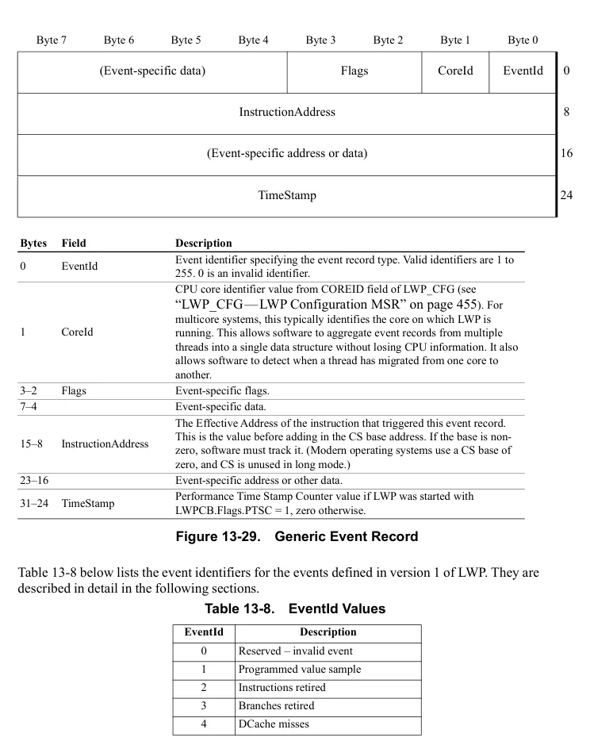

</details>


<!-- PDF source page: 506 | printed page: 444 -->

**Table 13-8. EventId Values (continued)**

**EventId Description**

5 CPU clocks not halted

6 CPU reference clocks not halted

255 Programmed event

1. 13. 4.2.1 Programmed Value Sample**

LWP decrements the event counter each time the program executes the LWPVAL instruction (see “LWPVAL—Insert Value Sample in LWP Ring Buffer” on page 459). When the counter becomes negative, it stores an event record with an EventId of 1. The data in the event record come from the operands to the instruction as detailed in the instruction description.

Byte 7 Byte 6 Byte 5 Byte 4 Byte 3 Byte 2 Byte 1 Byte 0

| Data1 | Flags | CoreId | EventId=1 |
| --- | --- | --- | --- |
| InstructionAddress |  |  |  |
| Data2 |  |  |  |
| TimeStamp |  |  |  |

**Bytes Field Description** 0 EventId Event identifier = 1 1 CoreId CPU core identifier from LWP_CFG 3–2 Flags Immediate value (bottom 16 bits) 7–4 Data1 Reg/mem value 15–8 InstructionAddress Instruction address of LWPVAL instruction 23–16 Data2 Reg value (zero extended if running in legacy mode)

31–24 TimeStamp Performance Time Stamp Counter value if LWP was started with LWPCB.Flags. PTSC = 1, zero otherwise.

**Figure 13-30. Programmed Value Sample Event Record**

1. 13. 4.2.2 Instructions Retired**

LWP decrements the event counter each time an instruction retires. When the counter becomes negative, it stores a generic event record with an EventId of 2.

Instructions are counted if they execute entirely in user mode (CPL = 3). Instructions that change to CPL 3 from some other level are not counted, since the instruction address is not an address in user mode space. All user mode instructions are counted, including LWPVAL and LWPINS.

<details>
<summary>Rendered source page 506 (figures/tables)</summary>

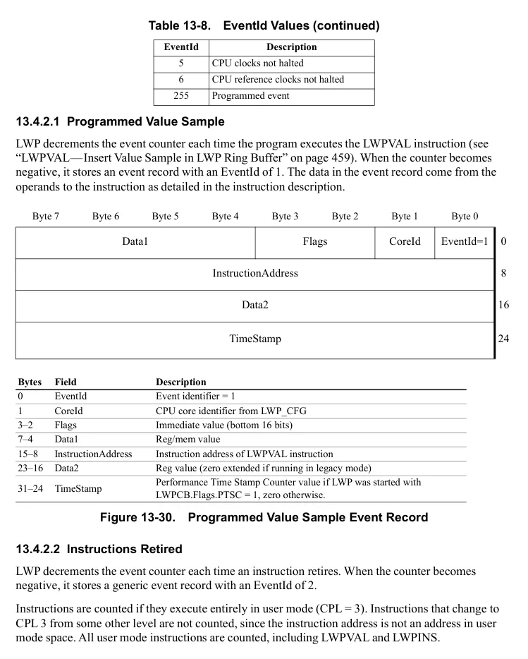

</details>


<!-- PDF source page: 507 | printed page: 445 -->

Byte 7 Byte 6 Byte 5 Byte 4 Byte 3 Byte 2 Byte 1 Byte 0

Reserved Reserved CoreId EventId=2 0

InstructionAddress 8

Reserved 16

TimeStamp 24

**Bytes Bits Field Description** 0 7:0 EventId Event identifier = 2 1 7:0 CoreId CPU identifier from LWP_CFG 7–2 Reserved 15–8 InstructionAddress Instruction address 23–16 Reserved

31–24 TimeStamp Performance Time Stamp Counter value if LWP was started with LWPCB.Flags. PTSC = 1, zero otherwise.

**Figure 13-31. Instructions Retired Event Record**

1. 13. 4.2.3 Branches Retired**

LWP decrements the event counter each time a transfer of control retires, regardless of whether or not it is taken. When the counter becomes negative, it stores an event record with an EventId of 3.

Control transfer instructions that are counted are:

- JMP (near), Jcc, JCXZ, JEXCZ, and JRCXZ
- LOOP, LOOPE, and LOOPNE
- CALL (near) and RET (near)

LWP does not count JMP (far), CALL (far), RET (far), traps, or interrupts (whether synchronous or asynchronous), nor does it count operations that switch to or from ring 3, SMM, or SVM, such as SYSCALL, SYSENTER, SYSEXIT, SYSRET, VMMCALL, INT, or INTO.

Some implementations of the AMD64 architecture perform an optimization called “fusing” when a compare operation (or other operation that sets the condition codes) is followed immediately by a conditional branch. The processor fuses these into a single operation internally before they are executed. While this is invisible to the programmer, the address of the actual branch is not available for LWP to report when the (fused) instruction retires. In this case, LWP sets the FUS bit in the event record and reports the address of the operation that set the condition codes. If FUS is set, software can find the address of the actual branch by decoding the instruction at the reported InstructionAddress and

<details>
<summary>Rendered source page 507 (figures/tables)</summary>

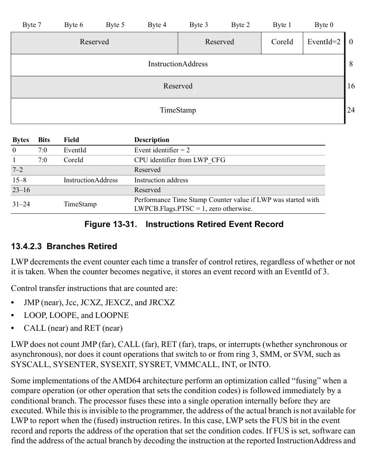

</details>


<!-- PDF source page: 508 | printed page: 446 -->

adding its length to that address. (Note that fused instructions do count as 2 instructions for the Instructions Retired event, since there were 2 x86 instructions originally.)

Byte 7 Byte 6 Byte 5 Byte 4 Byte 3 Byte 2 Byte 1 Byte 0

Reserved

Reserved CoreId EventId=3 0

TKN PRD PRV FUS

InstructionAddress 8

TargetAddress 16

TimeStamp 24

**Bytes Bits Field Description** 0 7:0 EventId Event identifier = 3 1 7:0 CoreId CPU core identifier from LWP_CFG 3–2 11:0 Reserved

1—Fused operation. InstructionAddress points to a compare operation (or other operation that sets the condition codes) immediately preceding the branch. 0—InstructionAddress points to the branch instruction.

3 4 FUS

1—PRD bit is valid 0—Prediction information is not available Some implementations of LWP may be unable to capture branch prediction information on some or all branches.

3 5 PRV

1—Branch was predicted correctly 0—Mispredicted If PRV = 0, the value of PRD is unpredictable and should be ignored. For unconditional branches, PRD=1 if PRV=1.

3 6 PRD

3 7 TKN 1—Branch was taken 0—Branch not taken Always 1 for unconditional branches. 7–4 Reserved 15–8 InstructionAddress Instruction address

Address of instruction executed after branch. This is the target if the branch was taken and the fall-through address if the branch was a not-taken conditional branch. TargetAddress is the Effective Address value before adding in the CS base address.

23–16 TargetAddress

31–24 TimeStamp Performance Time Stamp Counter value if LWP was started with LWPCB.Flags. PTSC = 1, zero otherwise.

**Figure 13-32. Branch Retired Event Record**

<details>
<summary>Rendered source page 508 (figures/tables)</summary>

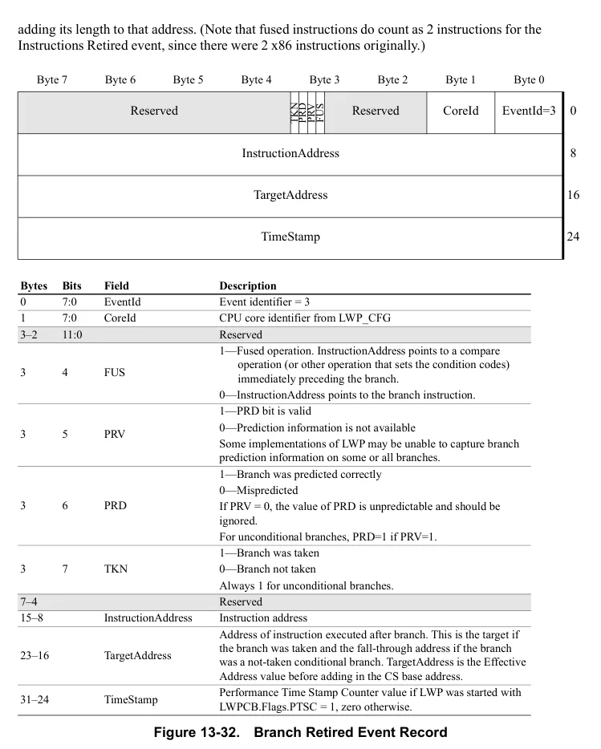

</details>


<!-- PDF source page: 509 | printed page: 447 -->

1. 13. 4.2.4 DCache Misses**

LWP decrements the event counter each time a load from memory causes a DCache miss whose latency exceeds the LwpCacheLatency threshold and/or whose data come from a level of the cache or memory hierarchy that is selected for counting. When the counter becomes negative, LWP stores an event record with an EventId of 4.

A misaligned access that causes two misses on a single load decrements the event counter by 1 and, if it reports an event, the data are for the lowest address that missed. LWP only counts loads directly caused by the instruction. It does not count cache misses that are indirectly due to TLB walks, LDT or GDT references, TLB misses, etc. Cache misses caused by LWP itself accessing the LWPCB or the event ring buffer are not counted.

**Measuring Latency**

The x86 architecture allows multiple loads to be outstanding simultaneously. An implementation of LWP might not have a full latency counter for every load that is waiting for a cache miss to be resolved. Therefore, an implementation may apply any of the following simplifications. Software using LWP should be prepared for this.

- The implementation may round the latency to a multiple of 2^*j*. This is a small power of 2, and the value of *j* must be 1 to 4. For example, in the rest of this section, assume that *j* = 4, so 2^*j* = 16. The low 4 bits of latency reported in the event record will be 0. The actual latency counter is incremented by 16 every 16 cycles of waiting. The value of *j* is returned as LwpLatencyRnd (see “Detecting LWP Capabilities” on page 452).
- The implementation may do an approximation when starting to count latency. If counting is in increments of 16, the 16 cycles need not start when the load begins to wait. The implementation may bump the latency value from 0 to 16 any time during the first 16 cycles of waiting.
- The implementation may cap total latency to 2^*n*-16 (where *n* &gt;= 10). The latency counter is thus a saturating counter that stops counting when it reaches its maximum value. For example, if *n* = 10, the latency value will count from 0 to 1008 in steps of 16 and then stop at 1008. (If *n* = 10, each counter is only 6 bits wide.) The value of *n* is returned as LwpLatencyMax (see “Detecting LWP Capabilities” on page 452).

Note that the latency threshold used to filter events is a multiple of 16. This value is used in the comparison that decides whether a cache miss event is eligible to be counted.

**Reporting the DCache Miss Data Address**

The event record for a DCache miss reports the linear address of the data (after adding in the segment base address, if any). The way an implementation records the linear address affects the exact event that is reported and the amount of time it takes to report a cache miss event. The implementation may report the event immediately, report the next eligible event once the counter becomes negative, or replay the instruction.


<!-- PDF source page: 510 | printed page: 448 -->

Byte 7 Byte 6 Byte 5 Byte 4 Byte 3 Byte 2 Byte 1 Byte 0

Latency SRC

Reserved CoreId EventId=4 0

DAV

InstructionAddress 8

DataAddress 16

TimeStamp 24

**Bytes Bits Field Description** 0 7:0 EventId Event identifier = 4 1 7:0 CoreId CPU identifier from LWP_CFG 2–3 11:0 Reserved

3 4 DAV 1—DataAddress is valid 0—Address is unavailable

Data source for the requested data

0 No valid status 1 Local L3 cache 2 Remote CPU or L3 cache 3 DRAM 4 Reserved (for Remote cache) 5 Reserved 6 Reserved 7 Other (MMIO/Config/PCI/APIC)

3 5:7 SRC

7–4 Latency Total latency of cache miss (in cycles) 15–8 InstructionAddress Instruction address 23–16 DataAddress Address of memory reference (if flag bit 28 = 1)

31–24 TimeStamp Performance Time Stamp Counter value if LWP was started with LWPCB.Flags. PTSC = 1, zero otherwise.

**Figure 13-33. DCache Miss Event Record**

1. 13. 4.2.5 CPU Clocks not Halted**

LWP decrements the event counter each clock cycle that the CPU is not in a halted state (due to STPCLK or a HLT instruction). When the counter becomes negative, it stores a generic event record with an EventId of 5. This counter varies in real-time frequency as the core clock frequency changes.

<details>
<summary>Rendered source page 510 (figures/tables)</summary>

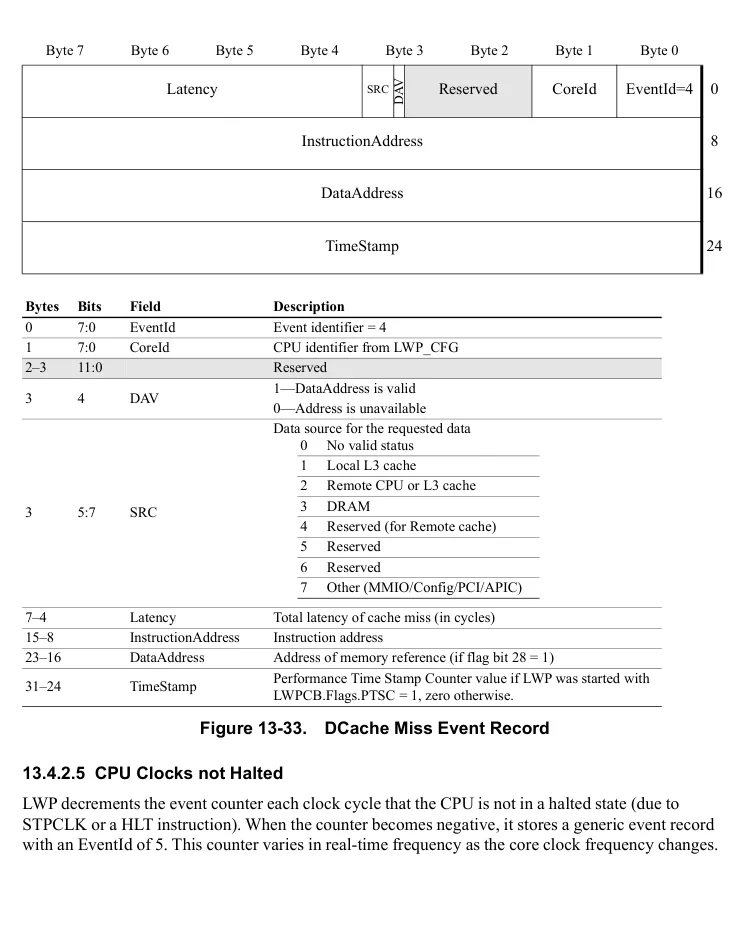

</details>


<!-- PDF source page: 511 | printed page: 449 -->

Byte 7 Byte 6 Byte 5 Byte 4 Byte 3 Byte 2 Byte 1 Byte 0

Reserved Reserved CoreId EventId=5 0

InstructionAddress 8

Reserved 16

TimeStamp 24

**Bytes Bits Field Description** 0 7:0 EventId Event identifier = 5 1 7:0 CoreId CPU identifier from LWP_CFG 7–2 Reserved 15–8 InstructionAddress Instruction address 23–16 Reserved

31–24 TimeStamp Performance Time Stamp Counter value if LWP was started with LWPCB.Flags. PTSC = 1, zero otherwise.

**Figure 13-34. CPU Clocks not Halted Event Record**

1. 13. 4.2.6 CPU Reference Clocks not Halted**

LWP decrements the event counter each reference clock cycle that the CPU is not in a halted state (due to STPCLK or a HLT instruction). When the counter becomes negative, it stores a generic event record with an EventId of 6.

The reference clock runs at a constant frequency that is independent of the core frequency and of the performance state. The reference clock frequency is processor dependent. The processor may implement this event by subtracting the ratio of (reference clock frequency / core clock frequency) each core clock cycle.

<details>
<summary>Rendered source page 511 (figures/tables)</summary>

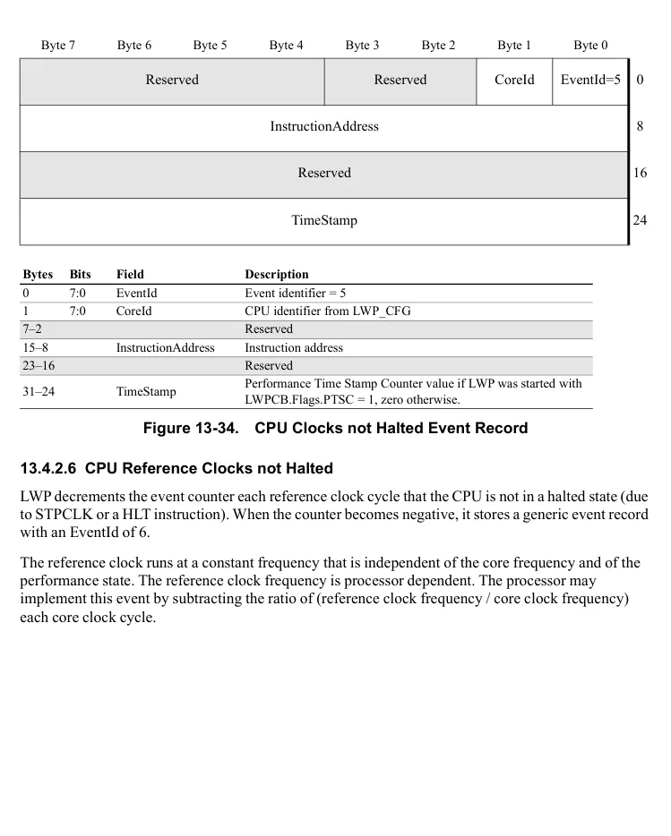

</details>


<!-- PDF source page: 512 | printed page: 450 -->

Byte 7 Byte 6 Byte 5 Byte 4 Byte 3 Byte 2 Byte 1 Byte 0

Reserved Reserved CoreId EventId=6 0

InstructionAddress 8

Reserved 16

TimeStamp 24

**Bytes Bits Field Description** 0 7:0 EventId Event identifier = 6 1 7:0 CoreId CPU identifier from LWP_CFG 2–7 Reserved 15–8 InstructionAddress Instruction address 23–16 Reserved

31–24 TimeStamp Performance Time Stamp Counter value if LWP was started with LWPCB.Flags. PTSC = 1, zero otherwise.

**Figure 13-35. CPU Reference Clocks not Halted Event Record**

1. 13. 4.2.7 Programmed Event**

When a program executes the LWPINS instruction (see “LWPINS—Insert User Event Record in LWP Ring Buffer” on page 460), the processor stores an event record with an event identifier of 255. The data in the event record come from the operands to the instruction as detailed in the instruction description.

<details>
<summary>Rendered source page 512 (figures/tables)</summary>

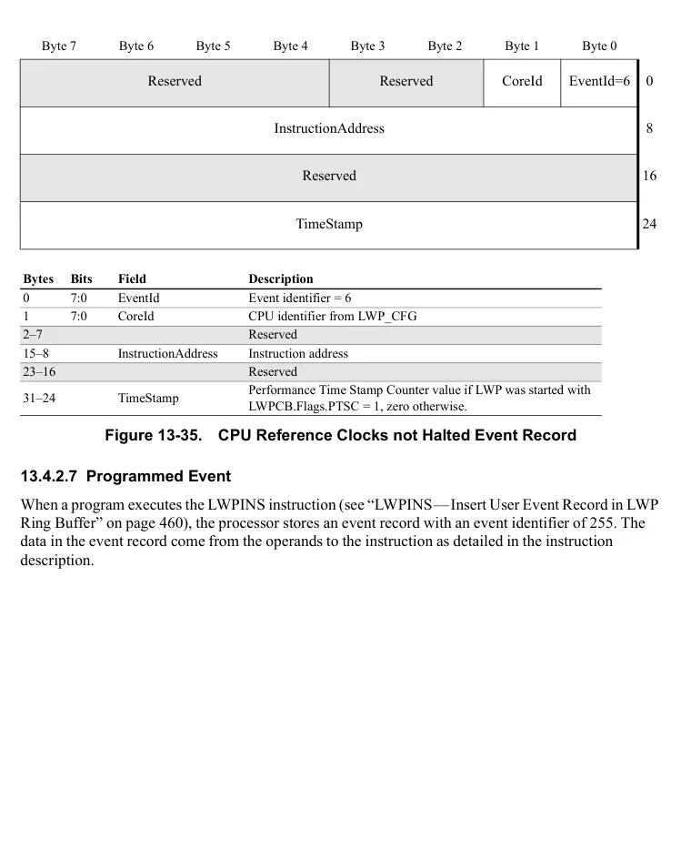

</details>


<!-- PDF source page: 513 | printed page: 451 -->

Byte 7 Byte 6 Byte 5 Byte 4 Byte 3 Byte 2 Byte 1 Byte 0

Data1 Flags CoreId EventID = 255 0

InstructionAddress 8

Data2 16

TimeStamp 24

**Bytes Field Description** 0 EventId Event identifier = 255 1 CoreId CPU identifier from LWP_CFG 3–2 Flags Imm16 value 7–4 Data1 Reg/mem value 15–8 InstructionAddress Instruction address of LWPINS instruction 23–16 Data2 Reg value (zero extended if running in legacy mode)

31–24 TimeStamp Performance Time Stamp Counter value if LWP was started with LWPCB.Flags. PTSC = 1, zero otherwise.

**Figure 13-36. Programmed Event Record**

1. 13. 4.2.8 Other Events**

The overall design of LWP allows easy extension to the list of events that it can monitor. The following are possibilities for events that may be added in future versions of LWP:

- DTLB misses
- FPU operations
- ICache misses
- ITLB misses

<a id="13-4-3-detecting-lwp"></a>

### 13.4.3 Detecting LWP

An application uses the CPUID instruction to identify whether Lightweight Profiling is present and which of its capabilities are available for use. An operating system uses CPUID to determine whether LWP is supported on the hardware and to determine which features of LWP are supported and can be made available to applications.

<details>
<summary>Rendered source page 513 (figures/tables)</summary>

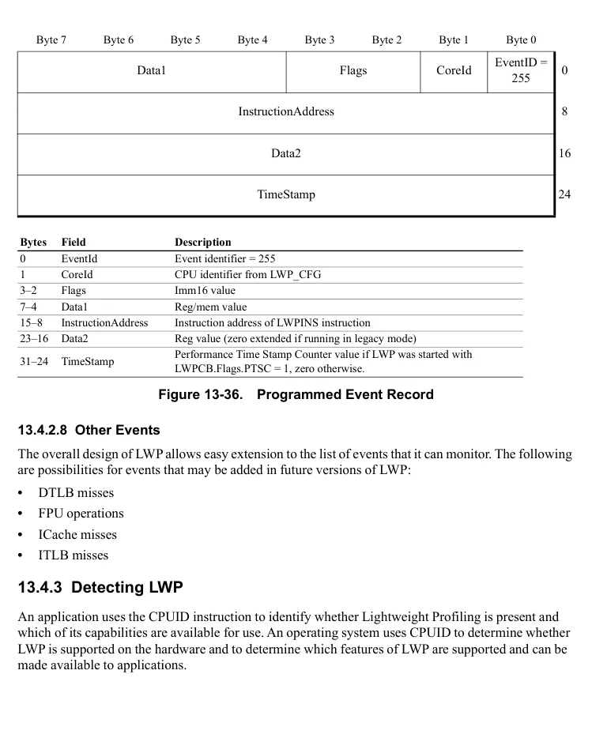

</details>


<!-- PDF source page: 514 | printed page: 452 -->

1. 13. 4.3.1 Detecting LWP Presence**

LWP is supported on a processor if CPUID Fn8000_0001_ECX[LWP] (bit 15) is set. This bit is identical to the value of CPUID Fn0000_000D_EDX_x0[bit 30], which is bit 62 of the XFeatureSupportedMask and indicates XSAVE support for LWP. A system can check either of those bits to determine if LWP is supported. Since LWP requires XSAVE, software can assume that this bit being set implies that CPUID Fn0000_0001_ECX[XSAVE] (bit 26) is also set.

1. 13. 4.3.2 Detecting LWP XSAVE Area**

The size of the LWP extended state save area used by XSAVE/XRSTOR is 128 bytes (080h). This value is returned by CPUID Fn0000_000D_ EAX_x3E (ECX=62).

The offset of the LWP save area from the beginning of the XSAVE/XRSTOR area is 832 bytes (340h). This value is returned by CPUID Fn0000_000D_ EBX_x3E (ECX=62).

The size of the LWP save area is included in the XFeatureSupportedSizeMax value returned by CPUID Fn0000_000D_ECX_x0 (ECX=0).

If LWP is enabled in the XFEATURE_ENABLED_MASK, the size of the LWP save area is included in the XFeatureEnabledSizeMax value returned by CPUID Fn0000_000D_EBX_x0 (ECX=0).

1. 13. 4.3.3 Detecting LWP Capabilities**

The values returned by CPUID Fn8000_001C indicate the capabilities of LWP. See Table 13-9, “Lightweight Profiling CPUID Values” for a listing of the returned values.

Bit 0 of EAX is a copy of bit 62 from XFEATURE_ENABLED_MASK and indicates whether LWP is available for use by applications. If it is 1, the processor supports LWP and the operating system has enabled LWP for applications.

Bits 31:1 returned in EAX are taken from the LWP_CFG MSR and reflect the LWP features that are available for use. These are a subset of the bits returned in EDX, which reflect the full capabilities of LWP on current processor. The operating system can make a subset of LWP available if it cannot handle all supported features. For instance, if the OS cannot handle an LWP threshold interrupt, it can disable the feature. User-mode software must assume that the bits in EAX describe the features it can use. Operating systems should use the bits from EDX to determine the supported capabilities of LWP and make all or some of those features available.

Under SVM, if a VMM allows the migration of guests among processors that all support LWP, it must arrange for CPUID to report the logical AND of the supported feature bits over all processors in the migration pool. Other CPUID values must also be reported as the “least common denominator” among the processors.


<!-- PDF source page: 515 | printed page: 453 -->

**Table 13-9. Lightweight Profiling CPUID Values**

| Reg | Bits | Field | Description |
| --- | --- | --- | --- |
| EAX | 0 | LwpAvail | 1—LWP is available to application programs. The hardware and the<br>operating system support LWP.<br>0—LWP is not available.<br>This bit is a copy of bit 62 of the XFEATURE ENABLED MASK<br>_ _<br>register (XCR0). |
| EAX | 1 | LwpVAL | LWPVAL instruction (EventId = 1) is available. |
| EAX | 2 | LwpIRE | Instructions retired event (EventId = 2) is available. |
| EAX | 3 | LwpBRE | Branch retired event (EventId = 3) is available. |
| EAX | 4 | LwpDME | DCache miss event (EventId = 4) is available. |
| EAX | 5 | LwpCNH | CPU clocks not halted event (EventId = 5) is available. |
| EAX | 6 | LwpRNH | CPU reference clocks not halted event (EventId = 6) is available. |
| EAX | 28:7 | LwpRNH | Reserved |
| EAX | 29 | LwpCont | Sampling in continuous mode is available. |
| EAX | 30 | LwpPTSC | Performance Time Stamp Counter in event records is available. |
| EAX | 31 | LwpInt | Interrupt on threshold overflow is available. |
| EBX | 7:0 | LwpCbSize | Size in quadwords of the LWPCB. This value is at least<br>(LwpEventOffset / 8) + LwpMaxEvents but an implementation may<br>require a larger control block. |
| EBX | 15:8 | LwpEventSize | Size in bytes of an event record in the LWP event ring buffer. (32 for<br>LWP Version 1.) |
| EBX | 23:16 | LwpMaxEvents | Maximum supported EventId value (not including EventId 255 used by<br>the LWPINS instruction). Not all events between 1 and LwpMaxEvents<br>are necessarily supported. |
| EBX | 31:24 | LwpEventOffset | Offset from the start of the LWPCB to the EventInterval1 field. Software<br>uses this value to locate the area of the LWPCB that describes events to<br>be sampled. This permits expansion of the initial fixed region of the<br>LWPCB. LwpEventOffset is always a multiple of 8. |

<details>
<summary>Rendered source page 515 (figures/tables)</summary>

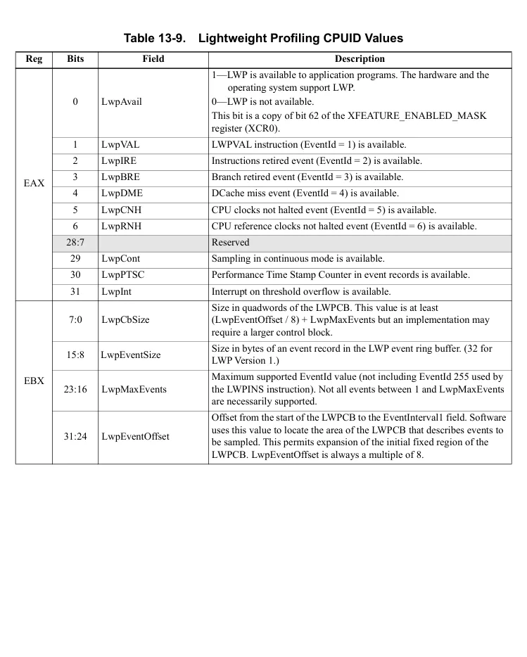

</details>


<!-- PDF source page: 516 | printed page: 454 -->

**Table 13-9. Lightweight Profiling CPUID Values**

| Reg | Bits | Field | Description |
| --- | --- | --- | --- |
| ECX | 4:0 | LwpLatencyMax | Number of bits in cache latency counters (10 to 31).<br>0 if DCache miss event is not supported (EDX[LwpDME] = 0). |
| ECX | 5 | LwpDataAddress | 1—Cache miss event records report the data address of the reference.<br>0—Data address is not reported.<br>0 if DCache miss event is not supported (EDX[LwpDME] = 0). |
| ECX | 8:6 | LwpLatencyRnd | The amount by which cache latency is rounded. The bottom<br>LwpLatencyRnd bits of latency information will be zero. The actual<br>number of bits implemented for the counter is (LwpLatencyMax –<br>LwpLatencyRnd).<br>Must be 0 to 4.<br>0 if DCache miss event is not supported (EDX[LwpDME] = 0). |
| ECX | 15:9 | LwpVersion | Version of LWP implementation. (1 for LWP Version 1.) |
| ECX | 23:16 | LwpMinBufferSize | Minimum size of the LWP event ring buffer, in units of 32 event records.<br>At least 32*LwpMinBufferSize records must be allocated for the LWP<br>event ring buffer, and hence the size of the ring buffer must be at least 32<br>* LwpMinBufferSize * LwpEventSize bytes. If 0, there is no minimum. |
| ECX | 27:24 | LwpMinBufferSize | Reserved |
| ECX | 28 | LwpBranchPrediction | 1—Branches Retired events can be filtered based on whether the branch<br>was predicted properly. The values of NMB and NPB in the LWPCB<br>enable filtering based on prediction.<br>0—NMB and NPB fields of the LWPCB are ignored.<br>0 if Branches Retired event is not supported (EDX[LwpBRE] = 0). |
| ECX | 29 | LwpIpFiltering | 1—IP filtering is supported.<br>0—IP filtering is not supported. The IPI, IPF, BaseIP, and LimitIP fields<br>of the LWPCB are ignored. |
| ECX | 30 | LwpCacheLevels | 1—Cache-related events can be filtered by the cache level that returned<br>the data. The value of CLF in the LWPCB enables cache level<br>filtering.<br>0—CLF is ignored.<br>An implementation must support filtering either by latency or by cache<br>level. It may support both.<br>0 if DCache miss event is not supported (EDX[LwpDME] = 0). |
| ECX | 31 | LwpCacheLatency | 1—Cache-related events can be filtered by latency. The value of<br>MinLatency in the LWPCB controls filtering.<br>0—MinLatency is ignored.<br>An implementation must support filtering either by latency or by cache<br>level. It may support both.<br>0 if DCache miss event is not supported (EDX[LwpDME] = 0). |
| EDX | 0 | LwpAvail | LWP is supported. If 0, the remainder of the data returned by CPUID<br>should be ignored.<br>This bit is a copy of CPUID Fn8000 0001 ECX[LWP] (bit 15).<br>_ _ |
| EDX | 1 | LwpVAL | LWPVAL instruction (EventId = 1) is supported. |

<details>
<summary>Rendered source page 516 (figures/tables)</summary>

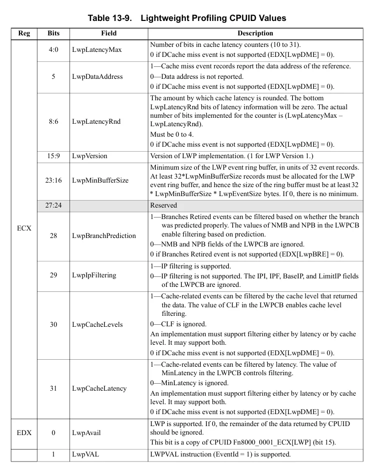

</details>


<!-- PDF source page: 517 | printed page: 455 -->

**Table 13-9. Lightweight Profiling CPUID Values**

| Reg | Bits | Field | Description |
| --- | --- | --- | --- |
|  | 2 | LwpIRE | Instructions retired event (EventId = 2) is supported. |
|  | 3 | LwpBRE | Branch retired event (EventId = 3) is supported. |
|  | 4 | LwpDME | DCache miss event (EventId = 4) is supported. |
|  | 5 | LwpCNH | CPU clocks not halted event (EventId = 5) is supported. |
|  | 6 | LwpRNH | CPU reference clocks not halted event (EventId = 6) is supported. |
|  | 28:7 | LwpRNH | Reserved |
|  | 29 | LwpCont | Sampling in continuous mode is supported. |
|  | 30 | LwpPTSC | Performance Time Stamp Counter in event records is supported. |
|  | 31 | LwpInt | Interrupt on threshold overflow is supported. |

For more information on using the CPUID instruction, refer to Section 3.3, “Processor Feature Identification,” on page 71.

<a id="13-4-4-lwp-registers"></a>

### 13.4.4 LWP Registers

The XFEATURE_ENABLED_MASK register (extended control register XCR0) and the LWP model-specific registers describe and control the LWP hardware. The MSRs are available if CPUID Fn8000_0001_ECX[LWP] (bit 15) is set. LWP can only be used if the system has made support for LWP state management available in XFEATURE_ENABLED_MASK.

1. 13. 4.4.1 XFEATURE_ENABLED_MASK Support**

LWP requires that the processor support the XSAVE/XRSTOR instructions to manage LWP state, along with the XSETBV/XGETBV instructions that manage the enabled state mask. An operating system uses XSETBV to set bit 62 of XFEATURE_ENABLED_MASK to indicate that it supports management of LWP state and allows applications to use LWP. When the system makes LWP available by setting bit 62 of XFEATURE_ENABLED_MASK, LWP is initially disabled (LWP_CBADDR is zero).

See “Guidelines for Operating Systems” on page 478 for details on how to implement LWP support in an operating system.

1. 13. 4.4.2 LWP_CFG—LWP Configuration MSR**

LWP_CFG (MSR C000_0105h) controls which features of LWP are available on the processor. The operating system loads LWP_CFG at start-up time (or at the time an LWP driver is loaded) to indicate its level of support for LWP. Only bits for supported features (those that are set in CPUID Fn8000_001C_EDX) can be turned on in LWP_CFG. Attempting to set other bits causes a #GP fault.

User code can examine LWP_CFG bits 31:1 by reading CPUID Fn8000_001C_EAX.

<details>
<summary>Rendered source page 517 (figures/tables)</summary>

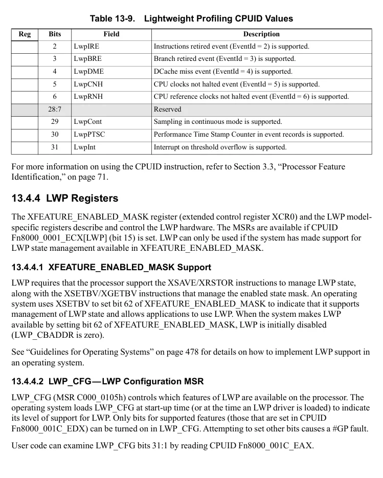

</details>


<!-- PDF source page: 518 | printed page: 456 -->

Bits 39:32 of LWP_CFG contains the COREID value that LWP will store into the CoreId field of every event record written by this core. The operating system should initialize this value to be the local APIC number, obtained from CPUID Fn0000_0001_EBX[LocalApicId] (bits 31:24). COREID is present so that when LWP is used in a virtualized environment, it has access to the core number without needing to enter the hypervisor. On systems that support x2APIC, local APIC numbers may be more than 8 bits wide. The operating system may then assign LWP COREID values that are small and identify the core within a cluster. If the system has more than 256 cores, there will be unavoidable duplication of COREID values.

Bits 47:40 of LWP_CFG specify the vector number that LWP will use when it signals a ring buffer threshold interrupt.

The reset value of LWP_CFG is 0.

6 3

6 2 6 1 6 0 5 9 5 8 5 7 5 6 5 5 5 4 5 3 5 2 5 1 5 0 4 9

4 8 4 7

4 6 4 5 4 4 4 3 4 2 4 1

4 0 3 9

3 8 3 7 3 6 3 5 3 4 3 3

3 2 3 1 3 0 2 9 2 8

2 7 2 6 2 5 2 4 2 3 2 2 2 1 2 0 1 9 1 8 1 7 1 6 1 5 1 4 1 3 1 2 1 1 1 0 9 8 7 6 5 4 3 2 1 0

INT PTSC CONT

RNH CNH DME BRE IRE VAL

Reserved VECTOR COREID

Reserved

**Bits Field Description** 0 Reserved 1 VAL Allow the LWPVAL instruction. 2 IRE Allow LWP to count instructions retired. 3 BRE Allow LWP to count branches retired. 4 DME Allow LWP to count DCache misses. 5 CNH Allow LWP to count CPU clocks not halted. 6 RNH Allow LWP to count CPU reference clocks not halted. 28:7 Reserved 29 CONT Enable continuous mode. If 0, LWP will always use synchronized mode.

30 PTSC Enable storing Performance Time Stamp Counter (PTSC) in the TimeStamp field of event records, if PTSC is available. 31 INT Allow LWP to generate an interrupt when threshold is exceeded. 39:32 COREID Value to store in CoreId field when writing an event record.

47:40 VECTOR Interrupt vector number to use for LWP Threshold interrupts. Must be provided if INT=1. 63:48 Reserved

**Figure 13-37. LWP_CFG—Lightweight Profiling Features MSR**

1. 13. 4.4.3 LWP_CBADDR—LWPCB Address MSR**

LWP_CBADDR (MSR C000_0106h) provides access to the internal copy of the LWPCB linear address.

<details>
<summary>Rendered source page 518 (figures/tables)</summary>

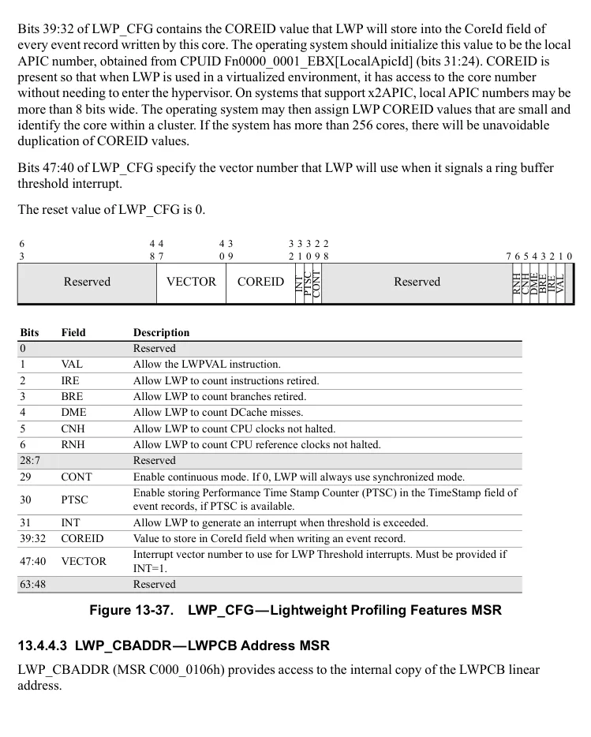

</details>


<!-- PDF source page: 519 | printed page: 457 -->

RDMSR from this register returns the current LWPCB address without performing any of the operations described for the SLWPCB instruction.

WRMSR to this register with a non-zero value generates a #GP fault; use LLWPCB or XRSTOR to load an LWPCB address.

Writing a zero to LWP_CBADDR immediately disables LWP, discarding any internal state. For instance, an operating system can write a zero to stop LWP when it terminates a thread.

Note that LWP_CBADDR contains the linear address of the control block. All references to the LWPCB that are made by microcode during the normal operation of LWP ignore the DS segment register.

The reset value of LWP_CBADDR is 0. This means that when the system sets bit 62 of XFEATURE_ENABLED_MASK to make LWP available, it is initially disabled.

<a id="13-4-5-lwp-instructions"></a>

### 13.4.5 LWP Instructions

This section describes the instructions included in the AMD64 architecture to support LWP. These instructions raise #UD if LWP is not supported or if bit 62 of XFEATURE_ENABLED_MASK is 0 indicating that LWP is not available.

The LLWPCB instruction enables or disables Lightweight Profiling and controls the events being profiled. The SLWPCB instruction queries the current state of Lightweight Profiling.

LWP provides two instructions for inserting user data into the event ring buffer. The LWPINS instruction unconditionally stores an event record into the ring buffer, while the LWPVAL instruction uses an LWP event counter to sample program values at defined intervals.

The instructions LLWPCB, SLWPCB, LWPINS, and LWPVAL are also described in the chapter “General-Purpose Instruction Reference” of Volume 3. Refer to reference pages for the individual instruction for information on instruction encoding, flags affected, and exception behavior.

1. 13. 4.5.1 LLWPCB—Load LWPCB Address**

Parses the Lightweight Profiling Control Block at the address contained in the specified register. If the LWPCB is valid, writes the address into the LWP_CBADDR MSR and enables Lightweight Profiling.

The LWPCB must be in memory that is readable and writable in user mode. For better performance, it should be aligned on a 64-byte boundary in memory and placed so that it does not cross a page boundary, though neither of these suggestions is required.

**Action** 1. If LWP is not available or if the machine is not in protected mode, LLWPCB immediately causes a #UD exception.

1. 2. If LWP is already enabled, the processor flushes the LWP state to memory in the old LWPCB. See “SLWPCB—Store LWPCB Address” on page 459 for details on saving the active LWP state.


<!-- PDF source page: 520 | printed page: 458 -->

If the flush causes a #PF exception, LWP remains enabled with the old LWPCB still active. Note that the flush is done before LWP attempts to access the new LWPCB.

1. 3. If the specified LWPCB address is 0, LWP is disabled and the execution of LLWPCB is complete.

1. 4. The LWPCB address is non-zero. LLWPCB validates it as follows:
- If any part of the LWPCB or the ring buffer is beyond the data segment limit, LLWPCB causes a #GP exception.
- If the ring buffer size is below the implementation’s minimum ring buffer size, LLWPCB causes a #GP exception.
- While doing these checks, LWP reads and writes the LWPCB, which may cause a #PF exception. If any of these exceptions occurs, LLWPCB aborts and LWP is left disabled. Usually, the operating system will handle a #PF exception by making the memory available and returning to retry the LLWPCB instruction. The #GP exceptions indicate application programming errors.

1. 5. LWP converts the LWPCB address and the ring buffer address to linear address form by adding the DS base address and stores the addresses internally.

1. 6. LWP examines the LWPCB.Flags field to determine which events should be enabled and whether threshold interrupts should be taken. It clears the bits for any features that are not available and stores the result back to LWPCB.Flags to inform the application of the actual LWP state.

1. 7. For each event being enabled, LWP examines the EventInterval*n* value and, if necessary, sets it to an implementation-defined minimum. (The minimum event interval for LWPVAL is zero.) It loads its internal counter for the event from the value in EventCounter*n*. A zero or negative value in EventCounter*n* means that the next event of that type will cause an event record to be stored. To count every *j*th event, a program should set EventInterval*n* to *j-1* and EventCounter*n* to some starting value (where *j-1* is a good initial count). If the counter value is larger than the interval, the first event record will be stored after a larger number of events than subsequent records.

1. 8. LWP is started. The execution of LLWPCB is complete.

**Notes**

If none of the bits in the LWPCB.Flags specifies an available event, LLWPCB still enables LWP to allow the use of the LWPINS instruction. However, no other event records will be stored.

A program can temporarily disable LWP by executing SLWPCB to obtain the current LWPCB address, saving that value, and then executing LLWPCB with a register containing 0. It can later re-enable LWP by executing LLWPCB with a register containing the saved address.

When LWP is enabled, it is typically an error to execute LLWPCB with the address of the active LWPCB. When the hardware flushes the existing LWP state into the LWPCB, it may overwrite fields that the application may have set to new LWP parameter values. The flushed values will then be loaded as LWP is restarted. To reuse an LWPCB, an application should stop LWP by passing a zero to LLWPCB, then prepare the LWPCB with new parameters and execute LLWPCB again to restart LWP.


<!-- PDF source page: 521 | printed page: 459 -->

Internally, LWP keeps the linear address of the LWPCB and the ring buffer. If the application changes the value of DS, LWP will continue to collect samples even if the new DS value would no longer allows it to access the LWPCB or the ring buffer. However, a #GP fault will occur if the application uses XRSTOR to restore LWP state saved by XSAVE. Programs should avoid using XSAVE/XRSTOR on LWP state if DS has changed. This only applies when the CPL ≠0; kernel mode operation of XRSTOR is unaffected by changes to DS. See “XSAVE/XRSTOR” on page 471 for details.

Operating system and hypervisor code that runs when the CPL ≠3 should use XSAVE and XRSTOR to control LWP rather than using LLWPCB (see below). Use WRMSR to write 0 to LWP_CBADDR to immediately stop LWP without saving its current state (see “LWP_CBADDR—LWPCB Address MSR” on page 456).

It is possible to execute LLWPCB when the CPL ≠3 or when SMM is active, but the system software must ensure that the LWPCB and the entire ring buffer are properly mapped into writable memory in order to avoid a #PF or #GP fault. Furthermore, if LWP is enabled when a kernel executes LLWPCB, both the old and new control blocks and ring buffers must be accessible. Using LLWPCB in these situations is not recommended.

1. 13. 4.5.2 SLWPCB—Store LWPCB Address**

Flushes LWP state to memory and returns the current effective address of the LWPCB in the specified register.

If LWP is not currently enabled, SLWPCB sets the specified register to zero.

The flush operation stores the internal event counters for active events and the current ring buffer head pointer into the LWPCB. If there is an unwritten event record pending, it is written to the event ring buffer.

If LWP_CBADDR is not zero, the value returned is an effective address that is calculated by subtracting the current DS.Base address from the linear address kept in LWP_CBADDR. Note that if DS has changed between the time LLWPCB was executed and the time SLWPCB is executed, this might result in an address that is not currently accessible by the application.

SLWPCB generates an invalid opcode exception (#UD) if the machine is not in protected mode or if LWP is not available.

It is possible to execute SLWPCB when the CPL ≠ 3 or when SMM is active, but if the LWPCB pointer is not zero, the system software must ensure that the LWPCB and the entire ring buffer are properly mapped into writable memory in order to avoid a #PF fault. Using SLWPCB in these situations is not recommended.

1. 13. 4.5.3 LWPVAL—Insert Value Sample in LWP Ring Buffer**

Decrements the event counter associated with the Programmed Value Sample event (see “Programmed Value Sample” on page 444). If the resulting counter value is negative, inserts an event record into the


<!-- PDF source page: 522 | printed page: 460 -->

LWP event ring buffer in memory and advances the ring buffer pointer. If the counter is not negative and the ModRM operand specifies a memory location, that location is not accessed.

The event record has an EventId of 1. The value in the register specified by vvvv (first operand) is stored in the Data2 field at bytes 23–16 (zero extended if the operand size is 32). The value in a register or memory location (second operand) is stored in the Data1 field at bytes 7–4. The immediate value (third operand) is truncated to 16 bits and stored in the Flags field at bytes 3–2. See Figure 13-30 on page 444.

If the ring buffer is not full or if LWP is running in continuous mode, the head pointer is advanced and the event counter is reset to the interval for the event (subject to randomization). If the ring buffer threshold is exceeded and threshold interrupts are enabled, an interrupt is signaled. If LWP is in continuous mode and the new head pointer equals the tail pointer, the MissedEvents counter is incremented to indicate that the buffer wrapped.

If the ring buffer is full and LWP is running in synchronized mode, the event record overwrites the last record in the buffer, the MissedEvents counter in the LWPCB is incremented, and the head pointer is not advanced.

LWPVAL generates an invalid opcode exception (#UD) if the machine is not in protected mode or if LWP is not available.

LWPVAL does nothing if LWP is not enabled or if the Programmed Value Sample event is not enabled in LWPCB.Flags. This allows LWPVAL instructions to be harmlessly ignored if profiling is turned off.

It is possible to execute LWPVAL when the CPL ≠ 3 or when SMM is active, but the system software must ensure that the memory operand (if present), the LWPCB, and the entire ring buffer are properly mapped into writable memory in order to avoid a #PF or #GP fault. Using LWPVAL in these situations is not recommended.

LWPVAL can be used by a program to perform value profiling. This is the technique of sampling the value of some program variable at a predetermined frequency. For example, a managed runtime might use LWPVAL to sample the value of the divisor for a frequently executed divide instruction in order to determine whether to generate specialized code for a common division. It might sample the target location of an indirect branch or call to see if one destination is more frequent than others. Since LWPVAL does not modify any registers or condition codes, it can be inserted harmlessly between any instructions.

**Note**

When LWPVAL completes (whether or not it stored an event record in the event ring buffer), it counts as an instruction retired. If the Instructions Retired event is active, this might cause that counter to become negative and immediately store an event record. If LWPVAL also stored an event record, the buffer will contain two records with the same instruction address (but different EventId values).

1. 13. 4.5.4 LWPINS—Insert User Event Record in LWP Ring Buffer**

Inserts a record into the LWP event ring buffer in memory and advances the ring buffer pointer.


<!-- PDF source page: 523 | printed page: 461 -->

The record has an EventId of 255. The value in the register specified by vvvv (first operand) is stored in the Data2 field at bytes 23–16 (zero extended if the operand size is 32). The value in a register or memory location (second operand) is stored in the Data1 field at bytes 7–4. The immediate value (third operand) is truncated to 16 bits and stored in the Flags field at bytes 3–2. See Figure 13-36 on page 451.

If the ring buffer is not full or if LWP is running in continuous mode, the head pointer is advanced and the CF flag is cleared. If the ring buffer threshold is exceeded and threshold interrupts are enabled, an interrupt is signaled. If LWP is in continuous mode and the new head pointer equals the tail pointer, the MissedEvents counter is incremented to indicate that the buffer wrapped.

If the ring buffer is full and LWP is running in synchronized mode, the event record overwrites the last record in the buffer, the MissedEvents counter in the LWPCB is incremented, the head pointer is not advanced, and the CF flag is set.

LWPINS generates an invalid opcode exception (#UD) if the machine is not in protected mode or if LWP is not available.

LWPINS simply clears CF if LWP is not enabled. This allows LWPINS instructions to be harmlessly ignored if profiling is turned off.

It is possible to execute LWPINS when the CPL ≠ 3 or when SMM is active, but the system software must ensure that the memory operand (if present), the LWPCB, and the entire ring buffer are properly mapped into writable memory in order to avoid a #PF or #GP fault. Using LWPINS in these situations is not recommended.

LWPINS can be used by a program to mark significant events in the ring buffer as they occur. For instance, a program might capture information on changes in the process’ address space such as library loads and unloads, or changes in the execution environment such as a change in the state of a user-mode thread of control.

Note that when the LWPINS instruction finishes writing a event record in the event ring buffer, it counts as an instruction retired. If the Instructions Retired event is active, this might cause that counter to become negative and immediately store another event record with the same instruction address (but different EventId values).

<a id="13-4-6-lwp-control-block"></a>

### 13.4.6 LWP Control Block

An application uses the LWP Control Block (LWPCB) to specify the details of Lightweight Profiling operation. It is an interactive region of memory in which some fields are controlled and modified by the LWP hardware and others are controlled and modified by the software that processes the LWP event records.

Most of the fields in the LWPCB are constant for the duration of a LWP session (the time between enabling LWP and disabling it). This means that they are loaded into the LWP hardware when it is enabled, and may be periodically reloaded from the same location as needed. The contents of the


<!-- PDF source page: 524 | printed page: 462 -->

constant fields must not be changed during a LWP run or results will be unpredictable. Changing the LWPCB memory to read-only or unmapped will cause an exception the next time LWP attempts to access it. To change values in the LWPCB, disable LWP, change the LWPCB (or create a new one), and re-enable LWP.

A few fields are modified by the LWP hardware to communicate progress to the software that is emptying the event ring buffer. Software may read them but should never modify them during an LWP session. Other fields are for software to modify to indicate that progress has been made in emptying the ring buffer. Software writes these fields and the LWP hardware reads them as needed.

For efficiency, some of the LWPCB fields may be shadowed internally in the LWP hardware unit when profiling is enabled. LWP refreshes these fields from (or flushes them to) memory as needed to allow software to make progress. For more information, refer to “LWPCB Access” on page 477.

The BufferTailOffset field is at offset 64 in the LWPCB in order to place it in a separate cache line on most implementations, assuming that the LWPCB itself is aligned properly. This allows the software thread that is emptying the ring buffer to retain write ownership of that cache line without colliding with the changes made by LWP when writing BufferHeadOffset. In addition, most implementations will use a value of 128 as the offset to the EventInterval1 field, since that places the event information in a separate cache line.

All fields in the LWPCB (as shown in Figure 13-38) that are marked as “Reserved” (or “Rsvd”) should be zero.


<!-- PDF source page: 525 | printed page: 463 -->

**Figure 13-38. LWPCB—Lightweight Profiling Control Block**

<details>
<summary>Extracted figure labels</summary>

```text
Byte 7
Byte 6
Byte 5
Byte 4
Byte 3
Byte 2
Byte 1
Byte 0
Random
BufferSize
Flags
0
BufferBase
8
Reserved
BufferHeadOffset
16
MissedEvents
24
Filters
Threshold
32
BaseIP
40
LimitIP
48
Reserved
56
Reserved
BufferTailOffset
64
Reserved for software
72
Reserved for software
80
.
Reserved
.
88
7
2
Rsvd
25
0
EventCounter1
7
2
Rsvd
25
0
EventInterval1
E = LwpEventOffset
E
7
2
Rsvd
25
0
EventCounter2
7
2
Rsvd
25
0
EventInterval2
E
+8
. . .
7
2
Rsvd
25
0
EventCounterN
7
2
Rsvd
25
0
EventIntervalN
N = LwpMaxEvents ...
```

</details>

The R/W column in Table 13-10 below indicates how a field is used while LWP is enabled:

<details>
<summary>Rendered source page 525 (figures/tables)</summary>

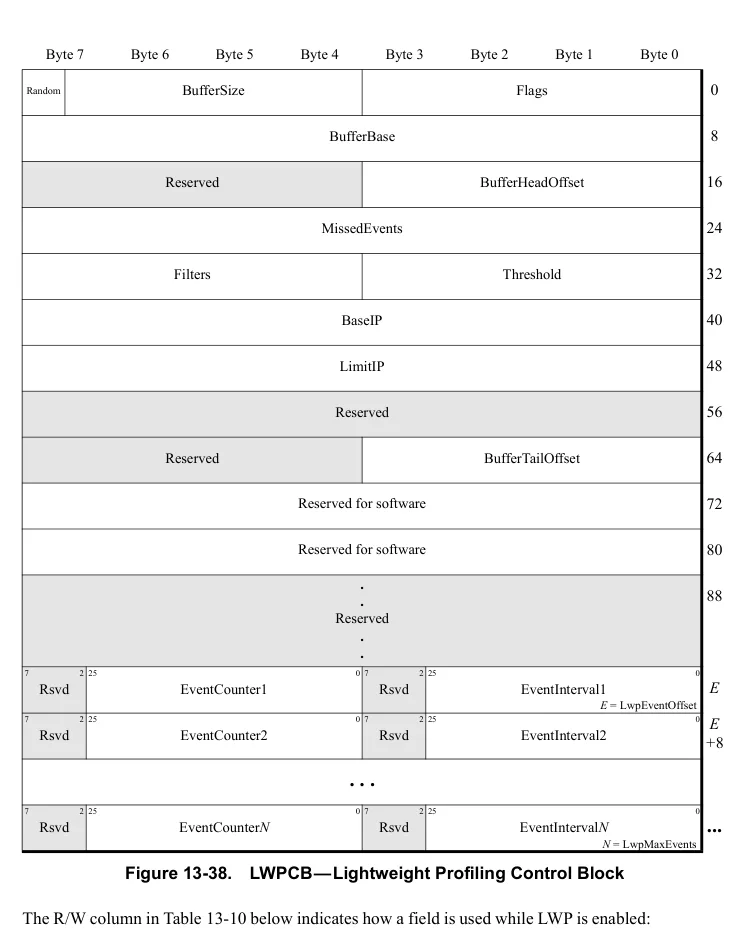

</details>


<!-- PDF source page: 526 | printed page: 464 -->

- LWP—hardware modifies the field; software may read it, but must not change it
- Init—hardware reads and modifies the field while executing LLWPCB; the field must then remain unchanged as long as the LWPCB is in use
- SW—software may modify the field; hardware may read it, but does not change it
- No—field must remain unchanged as long as the LWPCB is in use

**Table 13-10. LWPCB—Lightweight Profiling Control Block Fields**

| Bytes | Bits | Field | Description | R/W |
| --- | --- | --- | --- | --- |
| 3–0 |  | Flags | Flags indicating which events should be or are being counted (see<br>Figure 13-39, “LWPCB Flags”) and whether threshold interrupts<br>should be enabled.<br>Before executing LLWPCB, the application sets Flags to a bit mask of<br>the events (and interrupt) that should be enabled. LLWPCB does a<br>logical “and” of this mask with the available feature bits in LWP CFG<br>and rewrites Flags with the mask of features actually enabled. | Init |
| 7–4 | 27:0 | BufferSize | Total size of the event ring buffer (in bytes). Must be a multiple of the<br>event record size LwpEventSize (the value used internally will be<br>rounded down if not). BufferSize must be at least (32 *<br>LwpMinBufferSize * LwpEventSize). | No |
| 7 | 7:4 | Random | Number of bits of randomness to use in counters. Each time a counter is<br>loaded from an interval to start counting down to the next event to<br>record, the bottom Random bits are set to a random value. This avoids<br>fixed patterns in events. | No |
| 15–8 | 7:4 | BufferBase | The Effective Address of the event ring buffer. Should be aligned on a<br>64-byte boundary for reasonable performance. Software is encouraged<br>to align the ring buffer to a page boundary for best performance. If the<br>default address size is less than 64 bits, the upper bits of BufferBase<br>must be zero.<br>LLWPCB converts BufferBase to a linear address and stores it<br>internally. LWPCB.BufferBase is not modified. | No |
| 19–16 | 7:4 | BufferHeadOffset | Unsigned offset from BufferBase specifying where the LWP hardware<br>will store the next event record. When BufferHeadOffset ==<br>BufferTailOffset, the ring buffer is empty. BufferHeadOffset must<br>always be less than BufferSize; LWP will use a value of 0 if<br>BufferHeadOffset is too large. Also, it must always be a multiple of<br>LwpEventSize; LWP will round it down if not. | LWP |
| 23–20 | 7:4 | BufferHeadOffset | Reserved |  |
| 31–24 | 7:4 | MissedEvents | The 64-bit count of the number of events that were missed. A missed<br>event occurs when LWP stores an event record, attempts to advance<br>BufferHeadOffset, and discovers that it would be equal to<br>BufferTailOffset. In this case, LWP leaves BufferHeadOffset<br>unchanged and instead increments the MissedEvents counter. Thus,<br>when the ring buffer is full, the last event record is overwritten. | LWP |

<details>
<summary>Rendered source page 526 (figures/tables)</summary>

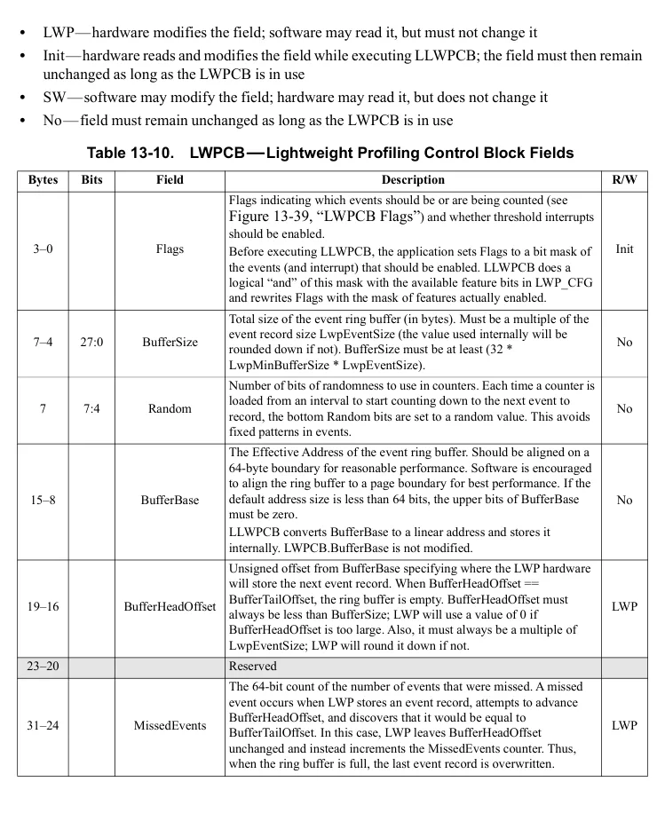

</details>


<!-- PDF source page: 527 | printed page: 465 -->

**Table 13-10. LWPCB—Lightweight Profiling Control Block Fields (continued)**

| Bytes | Bits | Field | Description | R/W |
| --- | --- | --- | --- | --- |
| 35–32 |  | Threshold | Threshold for signaling an interrupt to indicate that the ring buffer is<br>filling up. If threshold interrupts are enabled in Flags, then when LWP<br>advances BufferHeadOffset, it computes the space used as<br>((BufferHeadOffset – BufferTailOffset) % BufferSize). If the space<br>used equals or exceeds Threshold, LWP causes an interrupt.<br>If Threshold is greater than BufferSize, no interrupt will ever be taken.<br>If Threshold is zero, an interrupt will be taken every time an event<br>record is stored in the ring buffer.<br>Threshold is an unsigned integer multiple of LwpEventSize (the value<br>used internally will be rounded down if not).<br>Ignored if threshold interrupts are not available in LWP CFG or if they<br>are not enabled in Flags | No |
| 39–36 |  | Filters | Filters to qualify which events are eligible to be counted. This field<br>includes bits to filter branch events by type and prediction status, and<br>bits and values to filter cache events by type and latency. See Figure<br>13-40, “LWPCB Filters” for details. |  |
| 47–40 |  | BaseIP | Low limit of the IP filtering range. An instruction must start at a<br>location greater than or equal to BaseIP to be in range.<br>Ignored if IPF is zero or if the CPUID LwpIpFiltering bit is 0 to indicate<br>that IP filtering is not supported. | No |
| 55–48 |  | LimitIP | High limit of the IP filtering range. An instruction must start at a<br>location less than or equal to LimitIP to be in range.<br>Ignored if IPF is zero or if the CPUID LwpIpFiltering bit is 0 to indicate<br>that IP filtering is not supported. | No |
| 63–56 |  | LimitIP | Reserved |  |
| 67–64 |  | BufferTailOffset | Unsigned offset from BufferBase to the oldest event record in the ring<br>buffer. BufferTailOffset is maintained by software and must always be<br>less than BufferSize and a multiple of LwpEventSize. If software stores<br>a value of BufferTailOffset into the LWPCB that violates these rules,<br>the LWP hardware might not detect ring buffer overflow or threshold<br>conditions properly. | SW |
| 71–68 |  | BufferTailOffset | Reserved |  |
| 72–87 |  | BufferTailOffset | Reserved for software use. These bytes are never read or written by the<br>LWP hardware | SW |
| (E-1) –<br>88 |  | BufferTailOffset | Reserved area between the fixed portion of the LWPCB and the event<br>specifiers. Should be zero. The EventInterval1 field is at offset E =<br>LwpEventOffset. |  |

<details>
<summary>Rendered source page 527 (figures/tables)</summary>

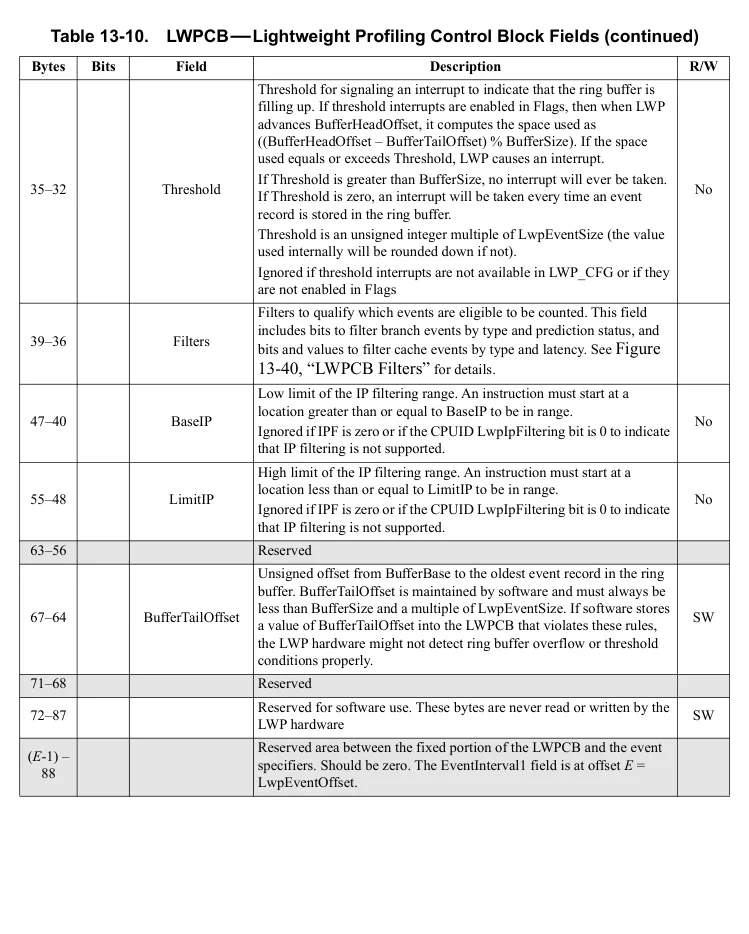

</details>


<!-- PDF source page: 528 | printed page: 466 -->

**Table 13-10. LWPCB—Lightweight Profiling Control Block Fields (continued)**

| Bytes | Bits | Field | Description | R/W |
| --- | --- | --- | --- | --- |
| (E+3)–<br>E | 25:0 | EventInterval1 | Reset value for counting events of type EventId = 1 (Programmed Value<br>Sample). A value of n specifies that after n+1 (modified by Random)<br>LWPVAL instructions, LWP will store an event record in the ring<br>buffer.<br>EventInterval1 is a signed value. If it is negative, LLWPCB will use<br>zero and will store zero into EventInterval1 in the LWPCB.<br>The Programmed Value Sample event is the only one which allows an<br>interval to be below the implementation minimum interval value. | Init |
| E+3 | 7:2 | EventInterval1 | Reserved |  |
| (E+7)–<br>(E+4) | 25:0 | EventCounter1 | Starting (LLWPCB) or current (SLWPCB) value of counter. This is a<br>signed number. LLWPCB treats a negative value as zero. | LWP |
| E+7 | 7:2 | EventCounter1 | Reserved |  |
| (E+11)<br>–<br>(E+8) | 25:0 | EventInterval2 | Reset value for counting events of type EventId = 2 (Instructions<br>Retired). A value of n specifies that after n+1 (modified by Random)<br>instructions are retired, LWP will store an event record in the ring<br>buffer.<br>EventInterval2 is a signed value. If it is negative or is below the<br>implementation minimum, LLWPCB will use the minimum and will<br>store that value into EventInterval2 in the LWPCB. | Init |
| E+11 | 7:2 | EventInterval2 | Reserved |  |
| (E+15)<br>–<br>(E+12) | 57:32 | EventCounter2 | Starting (LLWPCB) or current (SLWPCB) value of counter. This is a<br>signed number. LLWPCB treats a negative value as zero. | LWP |
| E+15 | 7:2 | EventCounter2 | Reserved |  |
| E+15 | 7:2 | Event3… | Repeat event configuration similar to EventInterval2 and<br>EventCounter2 for EventId values from 3 to LwpMaxEvents. |  |

The LLWPCB instruction reads the Flags word from the LWPCB to determine which events to profile and whether threshold interrupts should be enabled. LLWPCB writes the Flags word after turning off bits corresponding to features which are not currently available.

<details>
<summary>Rendered source page 528 (figures/tables)</summary>

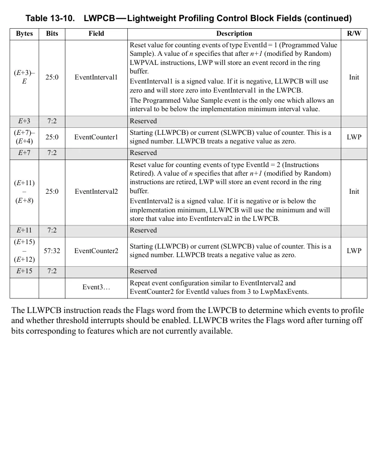

</details>


<!-- PDF source page: 529 | printed page: 467 -->

31 30 29 28 27 26 25 24 23 22 21 20 19 18 17 16 15 14 13 12 11 10 9 8 7 6 5 4 3 2 1 0

CONT

PTSC

DME

RNH

CNH

BRE

Reserved

VAL

INT

IRE

**Bit Field Input to LLWPCB Value after LLWPCB** 0 Reserved 1 VAL Enable LWPVAL instruction LWPVAL instruction enabled 2 IRE Enable Instructions Retired event Instructions Retired event enabled 3 BRE Enable Branches Retired event Branches Retired event enabled 4 DME Enable DCache miss event DCache Miss event enabled 5 CNH Enable CPU clocks not halted event CPU Clocks Not Halted event enabled

6 RNH Enable CPU reference clocks not halted event CPU Reference Clocks Not Halted event enabled 28:7 Reserved

1—Use continuous mode. If the ring buffer overflows, LWP continues to store events and advance BufferHead. Software must stop LWP in order to empty the ring buffer. 0—Use synchronized mode.

LWP operates in continuous mode if input bit is set and continuous mode is available. Otherwise, LWP operates in synchronous mode.

29 CONT

1—Store the Performance Time Stamp Counter (PTSC) in the TimeStamp field of each event record, if PTSC is available. 0—Store 0 in the TimeStamp field.

Performance Time Stamp Counter value will be stored if input bit is set and PTSC feature is available. Otherwise 0 is stored.

30 PTSC

31 INT Enable threshold interrupts. Threshold interrupts are enabled.

**Figure 13-39. LWPCB Flags**

Event counting can be filtered by a number of conditions which are specified in the Filters word of the LLWPCB. The IP filtering applies to all events. Cache level filtering applies to all events that interact with the caches. Branch filtering applies to the Branches Retired event.

<details>
<summary>Rendered source page 529 (figures/tables)</summary>

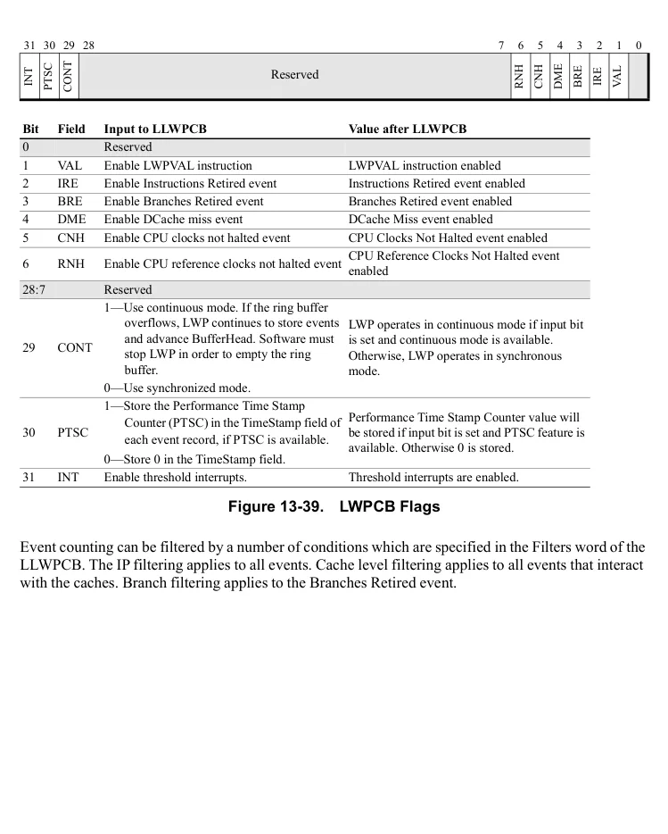

</details>


<!-- PDF source page: 530 | printed page: 468 -->

31 30 29 28 27 26 25 24 23 22 21 20 19 18 17 16 15 14 13 12 11 10 9 8 7 6 5 4 3 2 1 0

NMB

RAM

NAB

NRB

NCB

RDC

NBC

OTH

NPB

Reserved

MinLatency

CLF

IPF

IPI

**Bits Field Description** 7:0 MinLatency Minimum latency for a cache-related event 8 CLF Cache level filtering 9 NBC Northbridge cache events 10 RDC Remote data cache events 11 RAM DRAM cache events 12 OTH Other cache events 24:13 Reserved 25 NMB No mispredicted branches 26 NPB No predicted branches 27 NAB No absolute branches 28 NCB No conditional branches 29 NRB No unconditional relative branches 30 IPI IP filtering invert 31 IPF IP filtering

**Figure 13-40. LWPCB Filters**

The following table provides detailed descriptions of the fields in the Filters word.

<details>
<summary>Rendered source page 530 (figures/tables)</summary>

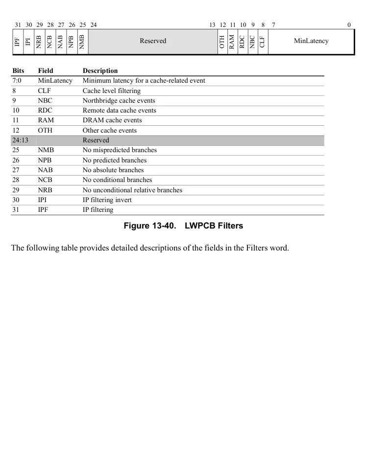

</details>


<!-- PDF source page: 531 | printed page: 469 -->

**Table 13-11. LWPCB Filters Fields**

| Bits | Field | Description |
| --- | --- | --- |
| 7:0 | MinLatency | Minimum latency for a cache-related event to be eligible for LWP counting. Applies<br>to all cache-related events being monitored. MinLatency is multiplied by 16 to get<br>the actual latency in cycles, providing less resolution but a larger range for filtering.<br>An implementation may have a maximum for the latency value. If MinLatency*16<br>exceeds this maximum value, the maximum is used instead. A value of 0 disables<br>filtering by latency.<br>Ignored if no cache latency event is enabled or if the CPUID LwpCacheLatency bit<br>is 0 to indicate that the implementation does not filter by latency (use the CLF bits to<br>get a similar effect). At least one of these mechanisms is supported if any cache miss<br>events are supported. |
| 8 | CLF | Cache level filtering.<br>1—Enables filtering cache-related events by the cache level or memory level that<br>returned the data. It enables the next 4 bits. Cache-related events are only<br>eligible for counting if the bit describing the memory level is on.<br>0—Disables cache level filtering. The next 4 bits are ignored, and any cache or<br>memory level is eligible.<br>Ignored if no cache latency event is enabled or if the CPUID LwpCacheLevels bit is<br>0 to indicate that the implementation does not filter by cache level (use the<br>MinLatency field to get a similar effect). At least one of these mechanisms is<br>supported if any cache miss events are supported. |
| 9 | NBC | Northbridge cache events.<br>1—Count cache-related events that are satisfied from data held in a cache that<br>resides on the Northbridge.<br>0—Ignore Northbridge cache events<br>Ignored if CLF is 0. |
| 10 | RDC | Remote data cache events.<br>1—Count cache-related events that are satisfied from data held in a remote data<br>cache.<br>0—Ignore remote cache events.<br>Ignored if CLF is 0. |
| 11 | RAM | DRAM cache events.<br>1—Count cache-related events that are satisfied from DRAM.<br>0—Ignore DRAM cache events.<br>Ignored if CLF is 0. |
| 12 | OTH | Other cache events.<br>1—Count cache-related events that are satisfied from other sources, such as MMIO,<br>Config space, PCI space, or APIC.<br>0—Ignore such cache events<br>Ignored if CLF is 0. |
| 24:13 | OTH | Reserved |

<details>
<summary>Rendered source page 531 (figures/tables)</summary>

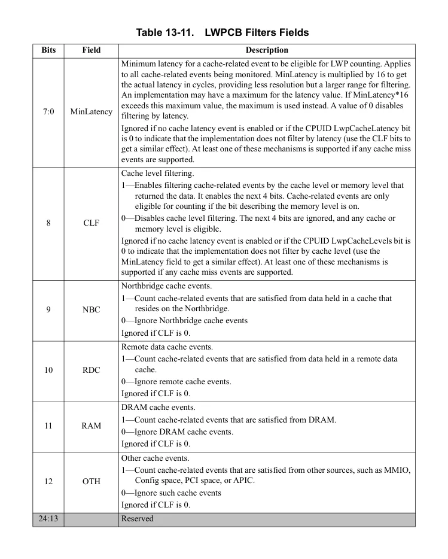

</details>


<!-- PDF source page: 532 | printed page: 470 -->

**Table 13-11. LWPCB Filters Fields (continued)**

| Bits | Field | Description |
| --- | --- | --- |
| 25 | NMB | No mispredicted branches.<br>1—Mispredicted branches will not be counted.<br>0—Mispredicted branches will be counted if not suppressed by other filter<br>conditions.<br>Caution: If NMB and NPB are both set, no branches will be counted.<br>Ignored if the Branches Retired event is not enabled or if the CPUID<br>LwpBranchPrediction bit is 0 to indicate that the implementation does not filter by<br>prediction. |
| 26 | NPB | No predicted branches.<br>1—Correctly predicted branches will not be counted. Note that since direct branches<br>are always predicted correctly, this is a superset of the NDB filter.<br>0—Correctly predicted branches will be counted if not suppressed by other filter<br>conditions.<br>Caution: If NMB and NPB are both set, no branches will be counted.<br>Ignored if the Branches Retired event is not enabled or if the CPUID<br>LwpBranchPrediction bit is 0 to indicate that the implementation does not filter by<br>prediction. |
| 27 | NAB | No absolute branches.<br>1—Absolute branches will not be counted. This only applies to jumps through a<br>register or memory (JMP opcode FF /4) and calls through a register or memory<br>(CALL opcode FF /2). Relative branches (both conditional and unconditional)<br>are counted normally if not disabled via the NRB or NCB bits.<br>0—Absolute branches will be counted if not suppressed by other filter conditions.<br>Caution: If NRB, NCB, and NAB are all set, no branches will be counted.<br>Ignored if the Branches Retired event is not enabled. |
| 28 | NCB | No conditional branches.<br>1—Conditional branches will not be counted. This only applies to conditional jumps<br>(Jcc) and loops (LOOPcc). Unconditional relative branches, indirect jumps<br>through a register or memory, and returns are counted normally if not disabled<br>via the NRB or NAB bits.<br>0—Conditional branches will be counted if not suppressed by other filter conditions.<br>Caution: If NRB, NCB, and NAB are all set, no branches will be counted.<br>Ignored if the Branches Retired event is not enabled. |

<details>
<summary>Rendered source page 532 (figures/tables)</summary>

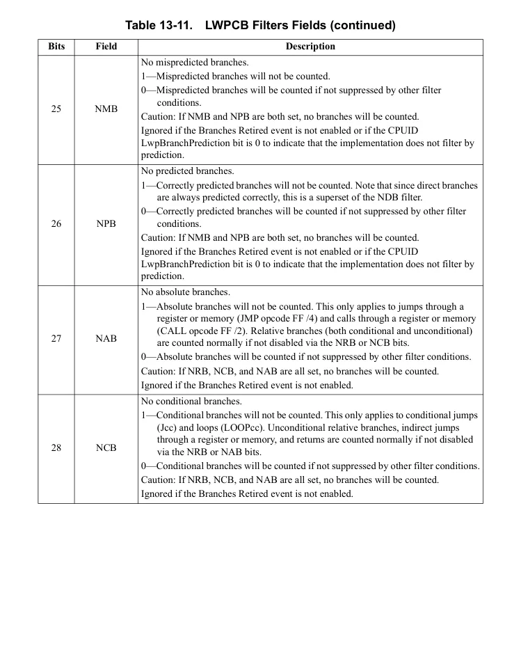

</details>


<!-- PDF source page: 533 | printed page: 471 -->

**Table 13-11. LWPCB Filters Fields (continued)**

| Bits | Field | Description |
| --- | --- | --- |
| 29 | NRB | No unconditional relative branches.<br>1—Unconditional relative branches will not be counted. This applies to<br>unconditional jumps (JMP), calls (CALL), and returns (RET). Conditional<br>branches and indirect jumps or calls through a register or memory are counted<br>normally if not disabled via the NCB or NAB bits.<br>0—Direct branches will be counted if not suppressed by other filter conditions.<br>Caution: If NRB, NCB, and NAB are all set, no branches will be counted.<br>Ignored if the Branches Retired event is not enabled. |
| 30 | IPI | IP filtering invert.<br>1—IP filtering inverted. Only instructions outside the range from BaseIP to LimitIP<br>are eligible for LWP counting.<br>0—IP filtering normal. Only instructions inside the range from BaseIP to LimitIP<br>are eligible for LWP counting.<br>Ignored if IPF is zero or if the CPUID LwpIpFiltering bit is 0 to indicate that IP<br>filtering is not supported. |
| 31 | IPF | IP filtering.<br>1—IP filtering enabled. The values of the BaseIP and LimitIP fields specify a range<br>of instruction addresses that are eligible for LWP event counting and reporting.<br>The range is inclusive if IPI is 0 and exclusive if IPI is 1.<br>0—IP filtering disabled; instructions at every address are eligible for LWP counting.<br>Ignored if the CPUID LwpIpFiltering bit is 0 to indicate that IP filtering is not<br>supported. |

<a id="13-4-7-xsave-xrstor"></a>

### 13.4.7 XSAVE/XRSTOR

LWP requires that the processor support the XSAVE/XRSTOR instructions for managing extended processor state components.

1. 13. 4.7.1 Configuration**

The processor uses bit 62 of XFEATURE_ENABLED_MASK (register XCR0) to indicate whether LWP state can be saved and restored, and thus whether LWP is available to applications. The LWP XSAVE area length and offset from the beginning of the XSAVE area are available from the CPUID instruction (see “Detecting LWP XSAVE Area” on page 452). In Version 1 of LWP, the LWP XSAVE area is 128 (080h) bytes long and the offset is 832 (340h) bytes.

1. 13. 4.7.2 XSAVE Area**

Figure 13-41 below shows the layout of the XSAVE area for LWP. It is large enough to allow for future expansion of the number of event counters. Details of the fields are in Table 13-12.

All fields in the XSAVE area that are marked as “Reserved” (or “Rsvd”) must be zero.

<details>
<summary>Rendered source page 533 (figures/tables)</summary>

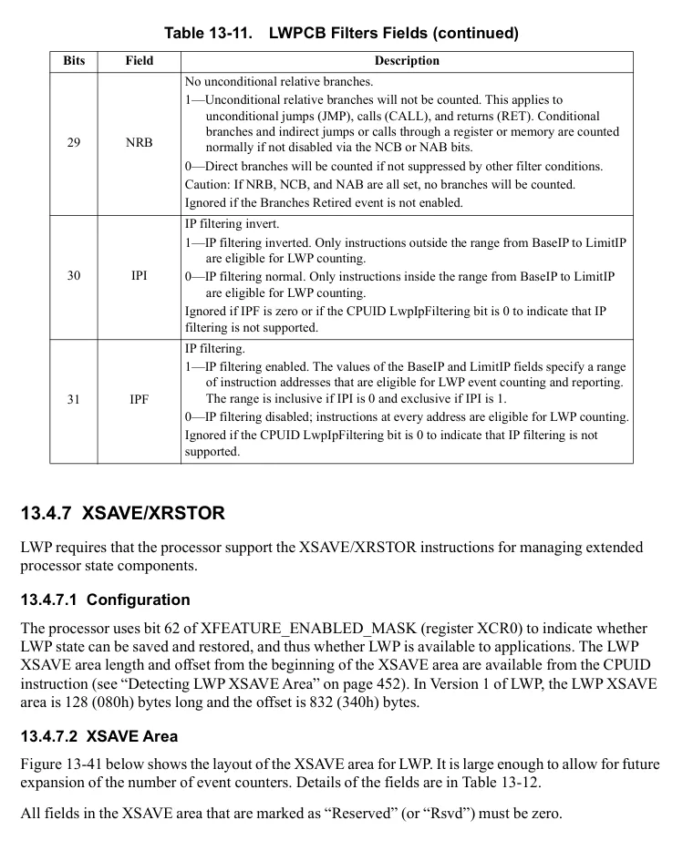

</details>


<!-- PDF source page: 534 | printed page: 472 -->

**Figure 13-41. XSAVE Area for LWP**

<details>
<summary>Extracted figure labels</summary>

```text
Byte 7
Byte 06
Byte 5
Byte 4
Byte 3
Byte 2
Byte 1
Byte 0
LWPCBAddress
0
BufferHeadOffset
Counter Flags (Reserved)
Cntr Flags
8
BufferBase
16
31
28
Rsvd
27
0
BufferSize
24
Filters
32
40
Saved Event Record
48
56
EventCounter2
EventCounter1
64
EventCounter4
EventCounter3
72
EventCounter6
EventCounter5
80
Reserved for EventCounter8
Reserved for EventCounter7
88
Reserved for EventCounter10
Reserved for EventCounter9
96
Reserved for EventCounter12
Reserved for EventCounter11
104
Reserved for EventCounter14
Reserved for EventCounter13
112
Reserved for EventCounter16
Reserved for EventCounter15
120
```

</details>

<details>
<summary>Rendered source page 534 (figures/tables)</summary>

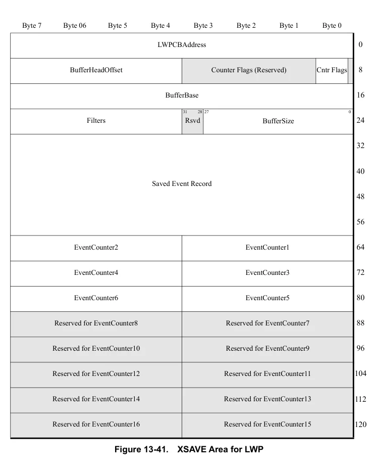

</details>


<!-- PDF source page: 535 | printed page: 473 -->

**Table 13-12. XSAVE Area for LWP Fields**

| Bytes | Bits | Field | Description |
| --- | --- | --- | --- |
| 7–0 |  | LWPCBAddress | Address of LWPCB. 0 if LWP is disabled, in which case the rest of the save<br>area is ignored. This is a linear address. |
| 9–8 | 0 | — | Reserved |
| 9–8 | 1 | CntrFlags.Counter1 | 1—Event with EventId 1 is active. XRSTOR will make the event active<br>and restore its counter from EventCounter1.<br>0—Event 1 is not active. XRSTOR will make the event inactive. |
| 9–8 | 6:2 | CntrFlags.Countern | Bit flags defined as above for EventCounter2–6. |
| 9–8 | 15:7 | — | Reserved for counter flags |
| 11–10 | 15:0 | — | Reserved for counter flags |
| 15–12 | 15:0 | BufferHeadOffset | BufferHeadOffset value |
| 23–16 | 15:0 | BufferBase | Address of the event ring buffer. This is a linear address. |
| 27–24 | 27:0 | BufferSize | Size of the event ring buffe |
| 27–24 | 31:28 | — | Reserved |
| 31–28 | 31:28 | Filters | Profiling filters (same as the Filters field in the LWPCB) |
| 63–32 | 31:28 | SavedEventRecord | If an event record is pending, the data to write. May be sparse. Zero in the<br>EventId field means no record pending. |
| 67–64 | 31:28 | EventCounter1 | Counter for event 1 (valid if CntrFlags.Counter1 bit is set) |
| 87–68 | 31:28 | EventCountern | Counters for events 2–6 (valid if the respective Countern bit is set) |
| 127–88 | 31:28 | — | Reserved for future event counters |

1. 13. 4.7.3 XSAVE operation**

If LWP is not currently enabled (i.e., if LWP_CBADDR = 0), no state needs to be stored. XSAVE sets bit 62 in XSAVE.HEADER.XSTATE_BV to 0 so that an attempt to restore state from this save area will use the processor supplied values. See “Processor supplied values” on page 475.

If LWP is enabled, XSAVE stores the various internal LWP values into the XSAVE area with no checking or conversion and sets bit 62 in XSAVE.HEADER.XSTATE_BV to 1.

1. 13. 4.7.4 XRSTOR operation**

If bit 62 in XFEATURE_ENABLED_MASK (XCR0) is 0 or if bit 62 of EDX:EAX (EDX[30]) is 0, XRSTOR does not alter the LWP state.

If the above bits are 1 but bit 62 in XSAVE.HEADER.XSTATE_BV is 0, XRSTOR writes the LWP state using the processor supplied values, disabling LWP. See “Processor supplied values” on page 475.

If all of the above bits are 1, XRSTOR loads LWP state from the XSAVE area as follows:

1. 1. The internal pointers and sizes are loaded.

<details>
<summary>Rendered source page 535 (figures/tables)</summary>

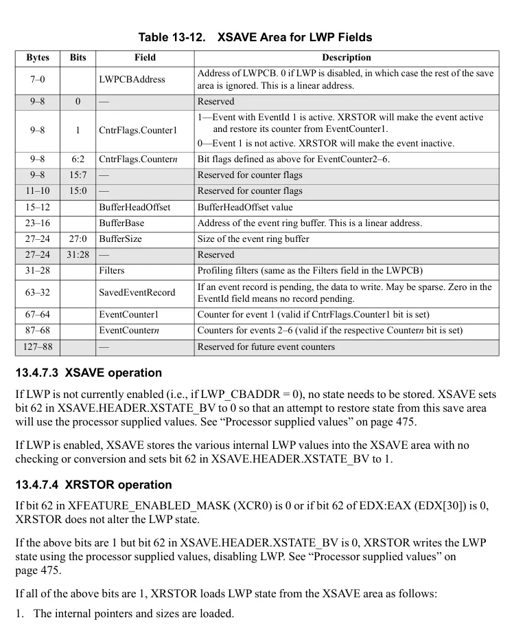

</details>


<!-- PDF source page: 536 | printed page: 474 -->

- If BufferSize is below the implementation minimum, LWP is disabled and XRSTOR of LWP state terminates.
- If BufferSize is not a multiple of the event record size, it is rounded down.
- If BufferHeadOffset is greater than (BufferSize - LwpEventSize), a value of 0 is used instead.
- If BufferHeadOffset is not a multiple of the event record size, it is rounded down.

1. 2. For each bit that is set in the Flags field that corresponds to an available event (as currently set in the LWP_CFG MSR), the corresponding event is enabled and the event counter is loaded from the EventCounter*n* field. All other events are disabled.

1. 3. If the EventId field in the SavedEventRecord is non-zero, there was a pending event when XSAVE was executed. XRSTOR loads the event record into hardware. LWP will store it into the event ring buffer as soon as possible once the CPL is 3. Software should not alter the SavedEventRecord field. An implementation may ignore a saved event record if it was not constructed by XSAVE. Storing an event into SavedEventRecord and then executing XRSTOR is not a reliable way of injecting an event into the ring buffer.

Note that if LWP is already enabled when executing XRSTOR, the old LWP state is overwritten without being saved.

No interrupt is generated by XRSTOR if the restored value of BufferHeadOffset results in a buffer that is filled beyond the threshold. The interrupt will occur the next time an event record is stored.

XRSTOR may not restore all of the state necessary for LWP to operate. The LWP hardware will read additional state from the LWPCB when it stores then next event record.

If the CPL = 0, XRSTOR simply reloads the LWPCB address and the ring buffer address from the XSAVE area. Kernel software is trusted not to alter the area in such a way as to allow access to memory that the application could not otherwise read or write. The linear addresses in the XSAVE area were validated when the application executed LLWPCB.

If the CPL ≠ 0, XRSTOR first validates the LWPCB and ring buffer pointers. This prevents an application from altering the XSAVE area in order to gain access to memory that it could not otherwise read or write (based on the current values in the DS segment register). Note that if a program’s DS value changes after doing a successful LLWPCB, it might be incapable of doing an XSAVE and then an XRSTOR of LWP state. The XRSTOR will fail if the new DS value no longer allows access to the linear addresses corresponding to the LWPCB or the ring buffer. Programs should avoid this behavior.

If XRSTOR is executed when the CPL ≠0, the system performs additional checks on the LWPCB and ring buffer addresses according to the pseudo-code below. A “Store-type Segment_check” fails if the limit check fails (address is beyond the segment limit) or if the segment is read-only.

```text
bool Check(uint64 addr, uint32 size) { // Utility function
if (!64bit_Mode)
addr = truncate32(addr - DS.BASE)
uint64 top = addr + size - 1;
if (! Store-type Segment_check on DS:[addr] || // Check lower bound
! Store-type Segment_check on DS:[top])
// and upper bound
```


<!-- PDF source page: 537 | printed page: 475 -->

```text
return false;
return true;
}
```

```text
if (! Check(XSAVE.LWPCBAddress, sizeof(LWPCB)) ||
! Check(XSAVE.BufferAddress, XSAVE.BufferSize))
Disable LWP
```

If any of the address checks fails, LWP is disabled. No fault is generated. A program that executes XRSTOR when the CPL ≠ 0 and DS has changed can use SLWPCB to check whether LWP is running.

As with all features that use XSAVE and XRSTOR, if bit 62 of XFEATURE_ENABLED_MASK (XCR0) is 0 but bit 62 of XSAVE.HEADER.XSTATE_BV is 1, XRSTOR will cause a #GP(0) exception.

1. 13. 4.7.5 Processor supplied values**

If XRSTOR is executed when bit 62 of XFEATURE_ENABLED_MASK (XCR0) and EDX:EAX are both 1, but the corresponding bit in XSAVE.HEADER.XSTATE_BV is 0, it indicates that there is no LWP state to restore. In this case, LWP_CBADDR is set to 0 and LWP is disabled. Other processor internal state for LWP is set to 0 as necessary to avoid security issues.

<a id="13-4-8-implementation-notes"></a>

### 13.4.8 Implementation Notes

The following subsections describe other LWP considerations.

1. 13. 4.8.1 Multiple Simultaneous Events**

Multiple events are possible when an instruction retires. For instance, an indirect jump through a pointer in memory can trigger the instructions retired, branches retired, and DCache miss events simultaneously. LWP counts all events that apply to the instruction, but might not store event records for all events whose event counters became negative. It is implementation dependent as to how many event records are stored when multiple event counters simultaneously become negative. If not all events cause event records to be stored, the choice of which event(s) to report is implementation dependent and may vary from run to run on the same processor.

1. 13. 4.8.2 Processor State for Context Switch, SVM, and SMM**

Implementations of LWP have internal state to hold information such as the current values of the counters for the various events, a pointer into the event ring buffer, and a copy of the tail pointer for quick detection of threshold and overflow states.

There are times when the system must preserve the volatile LWP state. When the operating system context switches from one user thread to another, the old user state must be saved with the thread’s context and the new state must be loaded. When a hypervisor decides to switch from one guest OS to another, the same must be done for the guest systems’ states. Finally, state must be stored and reloaded when the system enters and exits SMM, since the SMM code may decide to shut off power to the core.


<!-- PDF source page: 538 | printed page: 476 -->

Hardware does not maintain the LWP state in the active LWPCB. This is because the counters change with every event (not just every reported event), so keeping them in memory would generate a large amount of unnecessary memory traffic. Also, the LWPCB is in user memory and may be paged out to disk at any time, so the memory may not be available when needed.

**Saving State at Thread Context Switches**

LWP requires that an operating system use the XSAVE and XRSTOR instructions to save and restore LWP state across context switches.

XRSTOR restores the LWP volatile state when restoring other system state. Some additional LWP state will be restored from the LWPCB when operations in ring 3 require that information.

LWP does not support the “lazy” state save and restore that is possible for floating point and SSE state. It does not interact with the CR0[TS] bit. Operating systems that support LWP must always do an XSAVE to preserve the old thread’s LWP context and an XRSTOR to set up the new LWP context. The OS can continue to do a lazy switch of the FP and SSE state by ensuring that the corresponding bits in EDX:EAX are clear when it executes the XSAVE and XRSTOR to handle the LWP context.

**Saving State at SVM Worldswitch to a Different Guest**

Hypervisors that allow guests to use LWP must save and restore LWP state when the guest OS changes. In addition to the usual information in the VMCB, the hypervisor must use XSAVE/XRSTOR to maintain the volatile LWP state and must also save and restore LWP_CFG. When switching between a guest that uses LWP and one that does not, the hypervisor changes the value of XFEATURE_ENABLED_MASK (XCR0), which ensures that LWP is only enabled in the appropriate guest.

A hypervisor need not modify the LWP state if the guest OS is not changed.

**Enabling SVM Live Migration**

Some hypervisors support live migration of a guest virtual machine. Live migration is when a hypervisor preserves the entire state of the guest running on one physical machine, copies that state to another physical machine, and then resumes execution of the guest on the new hardware.

To allow live migration among machines which may have different internal implementations of LWP, the hypervisor must present the common subset of features among all the hosts in the pool of machines that can be used. Furthermore, since the hypervisor may XSAVE LWP state on one machine and XRSTOR it on another machine, the contents of the XSAVE area must be consistent across all implementations.

This means that an implementation of LWP keeps all event counters internally, not in the LWPCB. If implementations were permitted to differ in this detail, a counter might not get properly restored after migrating the guest machine.


<!-- PDF source page: 539 | printed page: 477 -->

**Saving State at SMM Entry and Exit**

SMM entry and exit must save and restore LWP state when the processor is going to change power state. SMM must use XSAVE/XRSTOR and must also save and restore LWP_CFG. Since LWP is ring 3 only and is inactive in System Management Mode, its state should not need to be saved and restored otherwise.

**Notes on Restoring LWP State**

The LWPCB may not be in memory at all times. Therefore, the LWP hardware does not attempt to access it while still in the OS kernel/VMM/SMM, since that access might fault. Some LWP state is restored once the processor is in ring 3 and can take a #PF exception without crashing. This usually happens the next time LWP needs to store an event record into the ring buffer.

1. 13. 4.8.3 LWPCB Access**

Several LWPCB fields are written asynchronously by the LWP hardware and by the user software. This section discusses techniques for reducing the associated memory traffic. This is interesting to software because it influences what state is kept internally in LWP, and it explains the protocol between the hardware filling the event ring buffer and the software emptying it.

The hardware keeps an internal copy of the event ring buffer head pointer. It need not flush the head pointer to the LWPCB every time it stores an event record. The flush can be done periodically or it can be deferred until a threshold or buffer full condition happens or until the application executes LLWPCB or SLWPCB. Exceeding the buffer threshold always forces the head pointer to memory so that the interrupt handler emptying the ring buffer sees the threshold condition.

The hardware may keep an internal copy of the event ring buffer tail pointer. It need not read the software-maintained tail pointer unless it detects a threshold or buffer full condition. At that point, it rereads the tail pointer to see if software has emptied some records from the ring buffer. If so, it recomputes the condition and acts accordingly. This implies that software polling the ring buffer should begin processing event records when it detects a threshold condition itself. To avoid a race condition with software, the hardware rereads the tail pointer every time it stores an event record while the threshold condition appears to be true. (An implementation can relax this to “every nth time” for some small value of n.) It also rereads it whenever the ring buffer appears to be full.

The interval values used to reset the counters can be cached in the hardware when the LLWPCB instruction is executed, or they can be read from the LWPCB each time the counter overflows.

The ring buffer base and size are cached in the hardware.

The MissedEvents value is a counter for an exceptional condition and is kept in memory.

The cached LWP state is refreshed from the LWPCB when LWP is enabled either explicitly via LLWPCB or implicitly when needed in ring 3 after LWP state is restored via XRSTOR.

Caching implies that software cannot reliably change sampling intervals or other cached state by modifying the LWPCB. The change might not be noticed by the LWP hardware. On the other hand, changing state in the LWPCB while LWP is running may change the operation at an unpredictable


<!-- PDF source page: 540 | printed page: 478 -->

moment in the future if LWP context is saved and restored due to context switching. Software must stop and restart LWP to ensure that any changes reliably take effect.

1. 13. 4.8.4 Security**

The operating system must ensure that information does not leak from one process to another or from the kernel to a user process. Hence, if it supports LWP at all, the operating system must ensure that the state of the LWP hardware is set appropriately when a context switch occurs and when a new process or thread is created. LWP state for a new thread can be initialized by executing XRSTOR with bit 62 of XSAVE.HEADER.XSTATE_BV set to 0 and the corresponding bit in EDX:EAX set to 1.

1. 13. 4.8.5 Interrupts**

The LWP threshold interrupt vector number is specified in the LWP_CFG MSR. The operating system must assign a vector for LWP threshold interrupts and fill in the corresponding entry in the interrupt-descriptor table. Note that the LWP interrupt is not shared with the performance counter interrupt, since the system allows concurrent and independent use of those two mechanisms.

1. 13. 4.8.6 Memory Access During LWP Operation**

When LWP needs to save an event record in the event ring buffer, it accesses the user memory containing the ring buffer and sometimes the memory containing the LWPCB. This causes a Page Fault (#PF) exception if those pages are not in memory.

A particular implementation of LWP has several ways to deal with page faults when storing an event record. These may include saving the event record in the XSAVE area and retrying the store later, re-executing the instruction, or discarding the event and reporting the next event of the appropriate type.

Note that this reinforces the notion that LWP is a sampling mechanism. Programs cannot rely on it to precisely capture every nth instance of an event. It captures *approximately* every nth instance.

1. 13. 4.8.7 Guidelines for Operating Systems**

To support LWP, an operating system should follow the following guidelines. Most of these operations should be done on each core of a multi-core system.

**System initialization** 1. Use CPUID Fn0000_0000 to ensure that the system is running on an “Authentic AMD” processor, and then check CPUID Fn8000_0001_ECX[LWP] to ensure that the processor supports LWP. Alternatively, check CPUID Fn0000_000D_EDX_x0[30] to ensure that the system supports the LWP XSAVE area, indicating that the processor supports LWP.

1. 2. Enable XSAVE operations by setting CR4[OSXSAVE].

1. 3. Enable LWP by executing XSETBV to set bit 62 of XCR0.


<!-- PDF source page: 541 | printed page: 479 -->

1. 4. Assign a unique interrupt vector number for LWP threshold interrupts and load the corresponding entry in the interrupt-descriptor table with the address of the interrupt handler. This handler should use some system-specific method to forward any threshold interrupts to the application.

1. 5. Make LWP available by setting LWP_CFG. To enable all supported LWP features, set LWP_CFG[31:0] to the value returned by CPUID Fn8000_001C_EDX. Set LWP_CFG[COREID] to the APIC core number (or some other value unique to the core) and LWP_CFG[VECTOR] to the assigned interrupt vector number.

**Thread support •** For each thread, allocate an XSAVE area that is at least as big as the XFeatureEnabledSizeMax value returned by CPUID Fn0000_000D_EBX_x0 (ECX=0). This is good practice for any system that supports XSAVE. **•** When creating a new process or thread, execute XRSTOR with bit 62 of EDX:EAX set to 1 and bit 62 of XSAVE.HEADER.XSTATE_BV set to 0. This ensures that LWP is turned off for any new thread. Alternatively, use WRMSR to write 0 into LWP_CBADDR before starting the thread. **•** When saving a running thread’s context, execute XSAVE with bit 62 of EDX:EAX set to 1 to save the thread’s LWP state. It takes almost no time or resources if the thread is not using LWP. **•** When restoring a thread’s context, execute XRSTOR with bit 62 of EDX:EAX set to 1. This restores the LWP state for the thread or disables LWP if the thread is not using it. **•** When a thread exits or aborts, use WRMSR to store 0 into LWP_CBADDR. This ensures that LWP is turned off.

1. 13. 4.8.8 Summary of LWP State**

LWP adds the following visible state to the AMD64 architecture:

- CPUID Fn8000_0001_ECX[LWP] (bit 15) to indicate LWP support.
- CPUID Fn8000_001C to indicate LWP features.
- Two new MSRs: LWP_CFG, LWP_CBADDR,.

- Four new instructions: LLWPCB, SLWPCB, LWPINS, and LWPVAL.
- Bit 62 in XCR0 (XFEATURE_ENABLED_MASK)
- A new XSAVE area for LWP state.
- New fields for LWP state in the SVM and SMM context, whether in the VMCB and SMM save area or elsewhere.

See Section 3.3, “Processor Feature Identification,” on page 71 for information on using the CPUID instruction to obtain information about processor capabilities.
