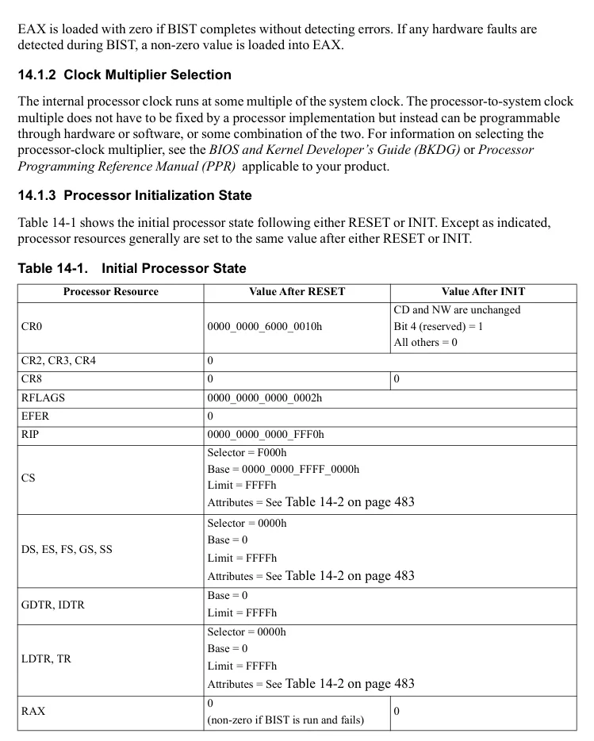
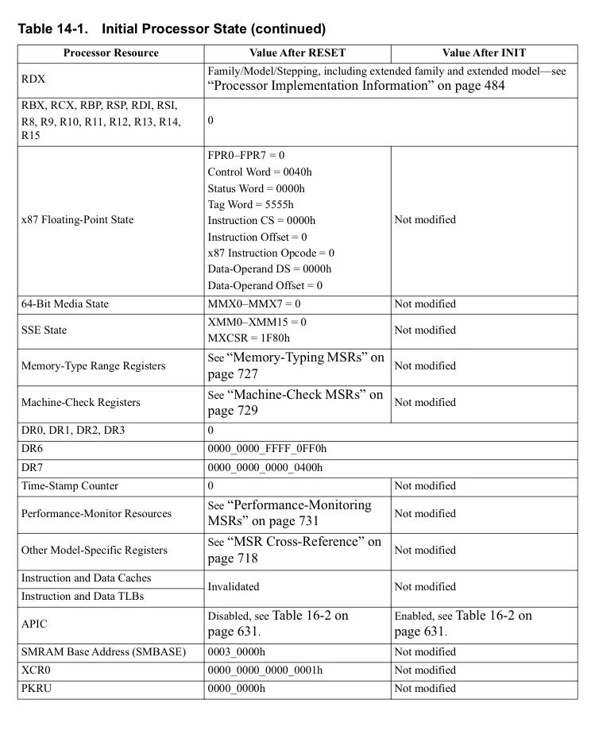
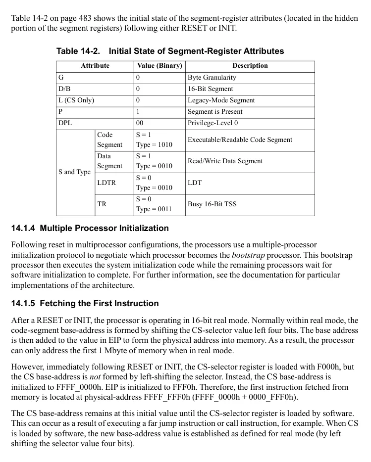
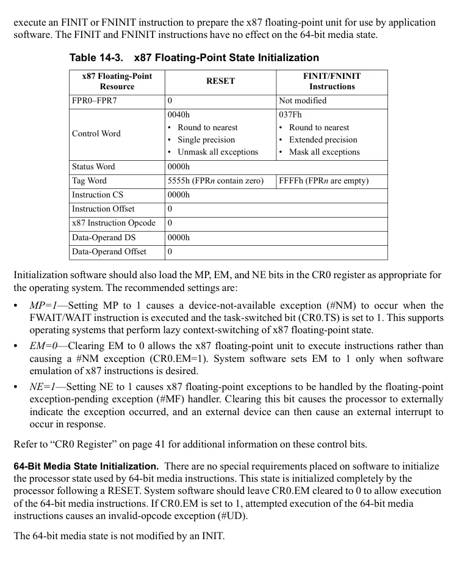
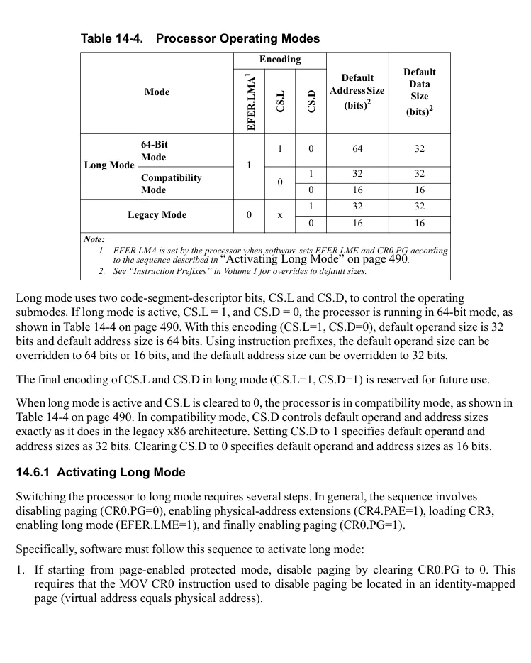
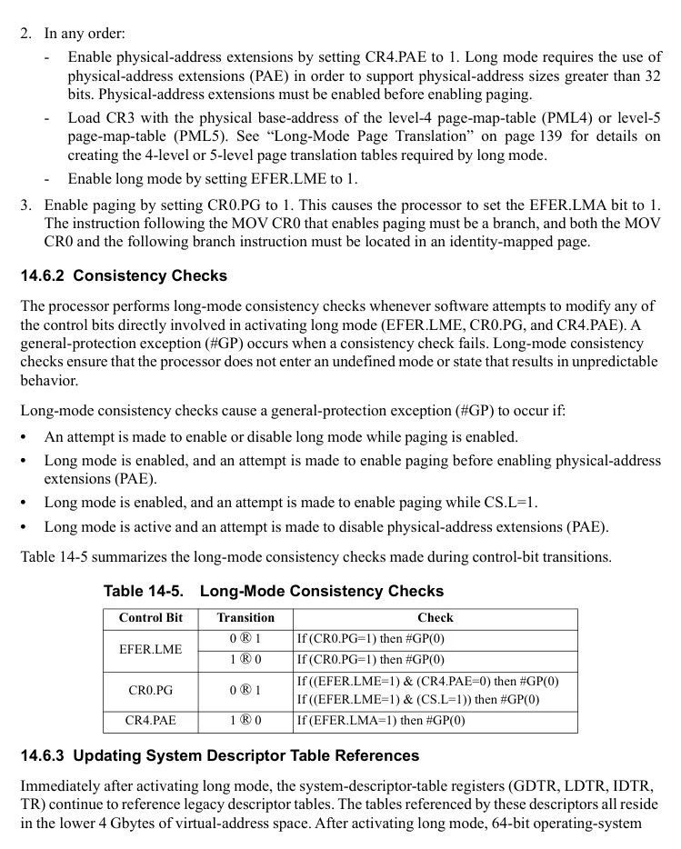

<!-- PDF source page: 542 | printed page: 480 -->

<a id="14-processor-initialization-and-long-mode-activation"></a>

# 14 Processor Initialization and Long Mode Activation

This chapter describes the hardware actions taken following a processor reset and the steps that must be taken to initialize processor resources and activate long mode. In some cases the actions required are implementation-specific with references made to the appropriate implementation-specific documentation.

<a id="14-1-processor-initialization"></a>

## 14.1 Processor Initialization

System logic can initialize the processor in either of two ways. One method, called RESET, is usually initiated by the assertion of an external signal (typically designated RESET#). The other method, called INIT, is typically initiated by another processor by means of an INIT interprocessor interrupt (IPI). See “Interprocessor Interrupts (IPI)” on page 641 for more information.

Both initialization techniques place the processor in real mode and initialize processor resources to a known, consistent state from which software can begin execution. The processor begins execution when the RESET# pin is deasserted or the INIT state is exited.

The RESET method places the processor in a known state and prepares it to begin execution in real mode. The INIT method is similar except it does not modify the state of certain registers. See Section 14.1.3 on page 481 for a comparison of these initialization methods.

System logic ensures that the processor transitions through the RESET state whenever power is reapplied after a planned or unplanned interruption. A RESET can also be performed when power is stable. An INIT can be performed at any time after the processor is powered up.

<a id="14-1-1-built-in-self-test-bist"></a>

### 14.1.1 Built-In Self Test (BIST)

An optional built-in self-test can be performed after the processor is reset. The mechanism for triggering the BIST is implementation-specific, and can be found in the hardware documentation for the implementation. The number of processor cycles BIST can consume before completing is also implementation-specific but typically consumes several million cycles.

BIST can be used by system implementations to assist in verifying system integrity, thereby improving system reliability, availability, and serviceability. The internal BIST hardware generally tests all internal array structures for errors. These structures can include (but are not limited to):

- All internal caches, including the tag arrays as well as the data arrays.
- All TLBs.
- Internal ROMs, such as the microcode ROM and floating-point constant ROM.
- Branch-prediction structures.


<!-- PDF source page: 543 | printed page: 481 -->

EAX is loaded with zero if BIST completes without detecting errors. If any hardware faults are detected during BIST, a non-zero value is loaded into EAX.

<a id="14-1-2-clock-multiplier-selection"></a>

### 14.1.2 Clock Multiplier Selection

The internal processor clock runs at some multiple of the system clock. The processor-to-system clock multiple does not have to be fixed by a processor implementation but instead can be programmable through hardware or software, or some combination of the two. For information on selecting the processor-clock multiplier, see the *BIOS and Kernel Developer’s Guide (BKDG)* or *Processor Programming Reference Manual (PPR)* applicable to your product.

<a id="14-1-3-processor-initialization-state"></a>

### 14.1.3 Processor Initialization State

Table 14-1 shows the initial processor state following either RESET or INIT. Except as indicated, processor resources generally are set to the same value after either RESET or INIT.

**Table 14-1. Initial Processor State**

| Processor Resource | Value After RESET | Value After INIT |
| --- | --- | --- |
| CR0 | 0000 0000 6000 0010h<br>_ _ _ | CD and NW are unchanged<br>Bit 4 (reserved) = 1<br>All others = 0 |
| CR2, CR3, CR4 | 0 | CD and NW are unchanged<br>Bit 4 (reserved) = 1<br>All others = 0 |
| CR8 | 0 | 0 |
| RFLAGS | 0000 0000 0000 0002h<br>_ _ _ | 0 |
| EFER | 0 | 0 |
| RIP | 0000 0000 0000 FFF0h<br>_ _ _ | 0 |
| CS | Selector = F000h<br>Base = 0000 0000 FFFF 0000h<br>_ _ _<br>Limit = FFFFh<br>Attributes = See Table 14-2 on page 483 | 0 |
| DS, ES, FS, GS, SS | Selector = 0000h<br>Base = 0<br>Limit = FFFFh<br>Attributes = See Table 14-2 on page 483 | 0 |
| GDTR, IDTR | Base = 0<br>Limit = FFFFh | 0 |
| LDTR, TR | Selector = 0000h<br>Base = 0<br>Limit = FFFFh<br>Attributes = See Table 14-2 on page 483 | 0 |
| RAX | 0<br>(non-zero if BIST is run and fails) | 0 |

<details>
<summary>Rendered source page 543 (figures/tables)</summary>



</details>


<!-- PDF source page: 544 | printed page: 482 -->

**Table 14-1. Initial Processor State (continued)**

| Processor Resource | Value After RESET | Value After INIT |
| --- | --- | --- |
| RDX | Family/Model/Stepping, including extended family and extended model—see<br>“Processor Implementation Information” on page 484 |  |
| RBX, RCX, RBP, RSP, RDI, RSI,<br>R8, R9, R10, R11, R12, R13, R14,<br>R15 | 0 |  |
| x87 Floating-Point State | FPR0–FPR7 = 0<br>Control Word = 0040h<br>Status Word = 0000h<br>Tag Word = 5555h<br>Instruction CS = 0000h<br>Instruction Offset = 0<br>x87 Instruction Opcode = 0<br>Data-Operand DS = 0000h<br>Data-Operand Offset = 0 | Not modified |
| 64-Bit Media State | MMX0–MMX7 = 0 | Not modified |
| SSE State | XMM0–XMM15 = 0<br>MXCSR = 1F80h | Not modified |
| Memory-Type Range Registers | See “Memory-Typing MSRs” on<br>page 727 | Not modified |
| Machine-Check Registers | See “Machine-Check MSRs” on<br>page 729 | Not modified |
| DR0, DR1, DR2, DR3 | 0 | Not modified |
| DR6 | 0000 0000 FFFF 0FF0h<br>_ _ _ | Not modified |
| DR7 | 0000 0000 0000 0400h<br>_ _ _ | Not modified |
| Time-Stamp Counte | 0 | Not modified |
| Performance-Monitor Resources | See “Performance-Monitoring<br>MSRs” on page 731 | Not modified |
| Other Model-Specific Registers | See “MSR Cross-Reference” on<br>page 718 | Not modified |
| Instruction and Data Caches | Invalidated | Not modified |
| Instruction and Data TLBs | Invalidated | Not modified |
| APIC | Disabled, see Table 16-2 on<br>page 631. | Enabled, see Table 16-2 on<br>page 631. |
| SMRAM Base Address (SMBASE) | 0003 0000h | Not modified |
| XCR0 | 0000 0000 0000 0001h<br>_ _ _ | Not modified |
| PKRU | 0000 0000h | Not modified |

<details>
<summary>Rendered source page 544 (figures/tables)</summary>



</details>


<!-- PDF source page: 545 | printed page: 483 -->

Table 14-2 on page 483 shows the initial state of the segment-register attributes (located in the hidden portion of the segment registers) following either RESET or INIT.

**Table 14-2. Initial State of Segment-Register Attributes**

| Attribute / G | Attribute | Value (Binary) / 0 | Description / Byte Granularity |
| --- | --- | --- | --- |
| D/B |  | 0 | 16-Bit Segment |
| L (CS Only) |  | 0 | Legacy-Mode Segment |
| P |  | 1 | Segment is Present |
| DPL |  | 00 | Privilege-Level 0 |
| S and Type | Code<br>Segment | S = 1<br>Type = 1010 | Executable/Readable Code Segment |
| S and Type | Data<br>Segment | S = 1<br>Type = 0010 | Read/Write Data Segment |
| S and Type | LDTR | S = 0<br>Type = 0010 | LDT |
| S and Type | TR | S = 0<br>Type = 0011 | Busy 16-Bit TSS |

<a id="14-1-4-multiple-processor-initialization"></a>

### 14.1.4 Multiple Processor Initialization

Following reset in multiprocessor configurations, the processors use a multiple-processor initialization protocol to negotiate which processor becomes the *bootstrap* processor. This bootstrap processor then executes the system initialization code while the remaining processors wait for software initialization to complete. For further information, see the documentation for particular implementations of the architecture.

<a id="14-1-5-fetching-the-first-instruction"></a>

### 14.1.5 Fetching the First Instruction

After a RESET or INIT, the processor is operating in 16-bit real mode. Normally within real mode, the code-segment base-address is formed by shifting the CS-selector value left four bits. The base address is then added to the value in EIP to form the physical address into memory. As a result, the processor can only address the first 1 Mbyte of memory when in real mode.

However, immediately following RESET or INIT, the CS-selector register is loaded with F000h, but the CS base-address is *not* formed by left-shifting the selector. Instead, the CS base-address is initialized to FFFF_0000h. EIP is initialized to FFF0h. Therefore, the first instruction fetched from memory is located at physical-address FFFF_FFF0h (FFFF_0000h + 0000_FFF0h).

The CS base-address remains at this initial value until the CS-selector register is loaded by software. This can occur as a result of executing a far jump instruction or call instruction, for example. When CS is loaded by software, the new base-address value is established as defined for real mode (by left shifting the selector value four bits).

<details>
<summary>Rendered source page 545 (figures/tables)</summary>



</details>


<!-- PDF source page: 546 | printed page: 484 -->

<a id="14-2-hardware-configuration"></a>

## 14.2 Hardware Configuration

<a id="14-2-1-processor-implementation-information"></a>

### 14.2.1 Processor Implementation Information

Software can read processor-identification information from the EDX register immediately following RESET or INIT. This information can be used to initialize software to perform processor-specific functions. The information stored in EDX is defined as follows:

- *Stepping ID (bits 3:0)*—This field identifies the processor-revision level.
- *Extended Model (bits 19:16) and Model (bits 7:4)*—These fields combine to differentiate processor models within a instruction family. For example, two processors may share the same microarchitecture but differ in their feature set. Such processors are considered different models within the same instruction family. This is a split field, comprising an extended-model portion in bits 19:16 with a legacy portion in bits 7:4
- *Extended Family (bits 27:20) and Family (bits 11:8)*—These fields combine to differentiate processors by their microarchitecture.

The CPUID instruction can be used to obtain the same information. This is done by executing CPUID with either function 1 or function 8000_0001h. Additional information about the processor and the features supported can be gathered using CPUID with other feature codes. See Section 3.3, “Processor Feature Identification,” on page 71 for additional information.

<a id="14-2-2-enabling-internal-caches"></a>

### 14.2.2 Enabling Internal Caches

Following a RESET (but not an INIT), all instruction and data caches are disabled, and their contents are invalidated (the MOESI state is set to the invalid state). Software can enable these caches by clearing the cache-disable bit (CR0.CD) to zero (RESET sets this bit to 1). Software can further refine caching based on individual pages and memory regions. Refer to “Cache Control Mechanisms” on page 207 for more information on cache control.

**Memory-Type Range Registers (MTRRs).** Following a RESET (but not an INIT), the MTRRdefType register is cleared to 0, which disables the MTRR mechanism. The variable-range and fixed-range MTRR registers are not initialized and are therefore in an undefined state. Before enabling the MTRR mechanism, the initialization software (usually platform firmware) must load these registers with a known value to prevent unexpected results. Clearing these registers, for example, sets memory to the uncacheable (UC) type.

<a id="14-2-3-initializing-media-and-x87-processor-state"></a>

### 14.2.3 Initializing Media and x87 Processor State

Some resources used by x87 floating-point instructions and media instructions must be initialized by software before being used. Initialization software can use the CPUID instruction to determine whether the processor supports these instructions, and then initialize their resources as appropriate.

**x87 Floating-Point State Initialization.** Table 14-3 on page 485 shows the differences between the initial x87 floating-point state following a RESET and the state established by the FINIT/FNINIT instruction. An INIT does not modify the x87 floating-point state. The initialization software can


<!-- PDF source page: 547 | printed page: 485 -->

execute an FINIT or FNINIT instruction to prepare the x87 floating-point unit for use by application software. The FINIT and FNINIT instructions have no effect on the 64-bit media state.

**Table 14-3. x87 Floating-Point State Initialization**

| x87 Floating-Point<br>Resource | RESET | FINIT/FNINIT<br>Instructions |
| --- | --- | --- |
| FPR0–FPR7 | 0 | Not modified |
| Control Word | 0040h<br>• Round to nearest<br>• Single precision<br>• Unmask all exceptions | 037Fh<br>• Round to nearest<br>• Extended precision<br>• Mask all exceptions |
| Status Word | 0000h | 037Fh<br>• Round to nearest<br>• Extended precision<br>• Mask all exceptions |
| Tag Word | 5555h (FPRn contain zero) | FFFFh (FPRn are empty) |
| Instruction CS | 0000h | FFFFh (FPRn are empty) |
| Instruction Offset | 0 | FFFFh (FPRn are empty) |
| x87 Instruction Opcode | 0 | FFFFh (FPRn are empty) |
| Data-Operand DS | 0000h | FFFFh (FPRn are empty) |
| Data-Operand Offset | 0 | FFFFh (FPRn are empty) |

Initialization software should also load the MP, EM, and NE bits in the CR0 register as appropriate for the operating system. The recommended settings are:

- *MP=1*—Setting MP to 1 causes a device-not-available exception (#NM) to occur when the FWAIT/WAIT instruction is executed and the task-switched bit (CR0.TS) is set to 1. This supports operating systems that perform lazy context-switching of x87 floating-point state.
- *EM=0*—Clearing EM to 0 allows the x87 floating-point unit to execute instructions rather than causing a #NM exception (CR0.EM=1). System software sets EM to 1 only when software emulation of x87 instructions is desired.
- *NE=1*—Setting NE to 1 causes x87 floating-point exceptions to be handled by the floating-point exception-pending exception (#MF) handler. Clearing this bit causes the processor to externally indicate the exception occurred, and an external device can then cause an external interrupt to occur in response.

Refer to “CR0 Register” on page 41 for additional information on these control bits.

**64-Bit Media State Initialization.** There are no special requirements placed on software to initialize the processor state used by 64-bit media instructions. This state is initialized completely by the processor following a RESET. System software should leave CR0.EM cleared to 0 to allow execution of the 64-bit media instructions. If CR0.EM is set to 1, attempted execution of the 64-bit media instructions causes an invalid-opcode exception (#UD).

The 64-bit media state is not modified by an INIT.

<details>
<summary>Rendered source page 547 (figures/tables)</summary>



</details>


<!-- PDF source page: 548 | printed page: 486 -->

**SSE State Initialization.** Platform firmware or system software must also prepare the processor to allow execution of SSE instructions. The required preparations include:

- Leaving CR0.EM cleared to 0 to allow execution of the SSE instructions. If CR0.EM is set to 1, attempted execution of the SSE instructions except FXSAVE/FXRSTOR causes an invalid-opcode exception (#UD). An attempt to execute either of these instructions when CR0.EM is set results in a #NM exception.
- Enabling the SSE instructions by setting CR4.OSFXSR to 1. Software cannot execute the SSE instructions unless this bit is set. Setting this bit also indicates that system software uses the FXSAVE and FXRSTOR instructions to save and restore, respectively, the SSE state. These instructions also save and restore the 64-bit media state and x87 floating-point state.
- Indicating that system software uses the SIMD floating-point exception (#XF) for handling SSE floating-point exceptions. This is done by setting CR4.OSXMMEXCPT to 1.
- Setting (optionally) the MXCSR mask bits to mask or unmask SSE floating-point exceptions as desired. Because this register can be read and written by application software, it is not absolutely necessary for system software to initialize it.

Refer to “CR4 Register” on page 46 for additional information on these CR4 control bits.

<a id="14-2-4-model-specific-initialization"></a>

### 14.2.4 Model-Specific Initialization

Implementations of the AMD64 architecture can contain model-specific features and registers that are not initialized by the processor and therefore require system-software initialization. System software must use the CPUID instruction to determine which features are supported. Model-specific features are generally configured using model-specific registers (MSRs), which can be read and written using the RDMSR and WRMSR instructions, respectively.

Some of the model-specific features are pervasive across many processor implementations of the AMD64 architecture and are therefore described within this volume. These include:

- System-call extensions, which must be enabled in the EFER register before using the SYSCALL and SYSRET instructions. See “System-Call Extension (SCE) Bit” on page 56 for information on enabling these instructions.
- Memory-typing MSRs. See “Memory-Type Range Registers (MTRRs)” on page 484 for information on initializing and using these registers.
- The machine-check mechanism. See “Initializing the Machine-Check Mechanism” on page 319 for information on enabling and using this capability.
- Extensions to the debug mechanism. See “Software-Debug Resources” on page 391 for information on initializing and using these extensions.
- The performance-monitoring resources. See “Performance Monitoring Counters” on page 411 for information on initializing and using these resources.

Initialization of other model-specific features used by the page-translation mechanism and long mode are described throughout the remainder of this section.


<!-- PDF source page: 549 | printed page: 487 -->

Some model-specific features are not pervasive across processor implementations and are therefore not described in this volume. For more information on these features and their initialization requirements, see the *BIOS and Kernel Developer’s Guide (BKDG)* or *Processor Programming Reference Manual (PPR)* applicable to your product.

<a id="14-3-initializing-real-mode"></a>

## 14.3 Initializing Real Mode

A basic real-mode (real-address-mode) operating environment must be initialized so that system software can initialize the protected-mode operating environment. This real-mode environment must include:

- A real-mode IDT for vectoring interrupts and exceptions to the appropriate handlers while in real mode. The IDT base-address value in the IDTR initialized by the processor can be used, or system software can relocate the IDT by loading a new base-address into the IDTR.
- The real-mode interrupt and exception handlers. These must be loaded before enabling external interrupts. Because the processor can always accept a non-maskable interrupt (NMI), it is possible an NMI can occur before initializing the IDT or the NMI handler. System hardware must provide a mechanism for disabling NMIs to allow time for the IDT and NMI handler to be properly initialized. Alternatively, the IDT and NMI handler can be stored in non-volatile memory that is referenced by the initial values loaded into the IDTR. Maskable interrupts can be enabled by setting EFLAGS.IF after the real-mode IDT and interrupt handlers are initialized.
- A valid stack pointer (SS:SP) to be used by the interrupt mechanism should interrupts or exceptions occur. The values of SS:SP initialized by the processor can be used.
- One or more data-segment selectors for storing the protected-mode data structures that are created in real mode.

Once the real-mode environment is established, software can begin initializing the protected-mode environment.

<a id="14-4-initializing-protected-mode"></a>

## 14.4 Initializing Protected Mode

Protected mode must be entered before activating long mode. A minimal protected-mode environment must be established to allow long-mode initialization to take place. This environment must include the following:

- A protected-mode IDT for vectoring interrupts and exceptions to the appropriate handlers while in protected mode.
- The protected-mode interrupt and exception handlers referenced by the IDT. Gate descriptors for each handler must be loaded in the IDT.


<!-- PDF source page: 550 | printed page: 488 -->

- A GDT which contains:
- A code descriptor for the code segment that is executed in protected mode.
- A read/write data segment that can be used as a protected-mode stack. This stack can be used by the interrupt mechanism if interrupts or exceptions occur.

Software can optionally load the GDT with one or more data segment descriptors, a TSS descriptor, and an LDT descriptor for use by long-mode initialization software.

After the protected-mode data structures are initialized, system software must load the IDTR and GDTR with pointers to those data structures. Once these registers are initialized, protected mode can be enabled by setting CR0.PE to 1.

If legacy paging is used during the long-mode initialization process, the page-translation tables must be initialized before enabling paging. At a minimum, one page directory and one page table are required to support page translation. The CR3 register must be loaded with the starting physical address of the highest-level table supported in the page-translation hierarchy. After these structures are initialized and protected mode is enabled, paging can be enabled by setting CR0.PG to 1.

<a id="14-5-initializing-long-mode"></a>

## 14.5 Initializing Long Mode

From protected mode, system software can initialize the data structures required by long mode and store them anywhere in the first 4 Gbytes of physical memory. These data structures can be relocated above 4 Gbytes once long mode is activated. The data structures required by long mode include the following:

- An IDT with 64-bit interrupt-gate descriptors. Long-mode interrupts are always taken in 64-bit mode, and the 64-bit gate descriptors are used to transfer control to interrupt handlers running in 64-bit mode. See “Long-Mode Interrupt Control Transfers” on page 281 for more information.
- The 64-bit mode interrupt and exception handlers to be used in 64-bit mode. Gate descriptors for each handler must be loaded in the 64-bit IDT.
- A GDT containing segment descriptors for software running in 64-bit mode and compatibility mode, including:
- Any LDT descriptors required by the operating system or application software.
- A TSS descriptor for the single 64-bit TSS required by long mode.
- Code descriptors for the code segments that are executed in long mode. The code-segment descriptors are used to specify whether the processor is operating in 64-bit mode or compatibility mode. See “Code-Segment Descriptors” on page 97, “Long (L) Attribute Bit” on page 98, and “CS Register” on page 79 for more information.
- Data-segment descriptors for software running in compatibility mode. The DS, ES, and SS segments are ignored in 64-bit mode. See “Data-Segment Descriptors” on page 98 for more information.


<!-- PDF source page: 551 | printed page: 489 -->

- FS and GS data-segment descriptors for 64-bit mode, if required by the operating system. If these segments are used in 64-bit mode, system software can also initialize the full 64-bit base addresses using the WRMSR instruction. See “FS and GS Registers in 64-Bit Mode” on page 80 for more information. The existing protected-mode GDT can be used to hold the long-mode descriptors described above.
- A single 64-bit TSS for holding the privilege-level 0, 1, and 2 stack pointers, the interrupt-stack-table pointers, and the I/O-redirection-bitmap base address (if required). This is the only TSS required, because hardware task-switching is not supported in long mode. See “64-Bit Task State Segment” on page 376 for more information.
- The 4-level page-translation tables required by long mode. Long mode also requires the use of physical-address extensions (PAE) to support physical-address sizes greater than 32 bits. See “Long-Mode Page Translation” on page 139 for more information.

If paging is enabled during the initialization process, it *must* be disabled before enabling long mode. After the long-mode data structures are initialized, and paging is disabled, software can enable and activate long mode.

<a id="14-6-enabling-and-activating-long-mode"></a>

## 14.6 Enabling and Activating Long Mode

Long mode is *enabled* by setting the long-mode enable control bit (EFER.LME) to 1. However, long mode is not *activated* until software also enables paging. When software enables paging while long mode is enabled, the processor activates long mode, which the processor indicates by setting the long-mode-active status bit (EFER.LMA) to 1. The processor behaves as a 32-bit x86 processor in all respects until long mode is activated, even if long mode is enabled. None of the new 64-bit data sizes, addressing, or system aspects available in long mode can be used until EFER.LMA=1.

Table 14-4 shows the control-bit settings for enabling and activating the various operating modes of the AMD64 architecture. The default address and data sizes are shown for each mode. For the methods of overriding these default address and data sizes, see “Instruction Prefixes” in Volume 1.


<!-- PDF source page: 552 | printed page: 490 -->

**Table 14-4. Processor Operating Modes**

| Mode | Mode (2) | Encoding / EFER.LMA1 | Encoding / CS.L | Encoding / CS.D | Default<br>Address Size<br>(bits)2 | Default<br>Data<br>Size<br>(bits)2 |
| --- | --- | --- | --- | --- | --- | --- |
| Long Mode | 64-Bit<br>Mode | 1 | 1 | 0 | 64 | 32 |
| Long Mode | Compatibility<br>Mode | 1 | 0 | 1 | 32 | 32 |
| Long Mode | Compatibility<br>Mode | 1 |  | 0 | 16 | 16 |
| Legacy Mode | Compatibility<br>Mode | 0 | x | 1 | 32 | 32 |
| Legacy Mode | Compatibility<br>Mode | 0 |  | 0 | 16 | 16 |

> Note: 1. EFER.LMA is set by the processor when software sets EFER.LME and CR0.PG according to the sequence described in “Activating Long Mode” on page 490. 2. See “Instruction Prefixes” in Volume 1 for overrides to default sizes.

Long mode uses two code-segment-descriptor bits, CS.L and CS.D, to control the operating submodes. If long mode is active, CS.L = 1, and CS.D = 0, the processor is running in 64-bit mode, as shown in Table 14-4 on page 490. With this encoding (CS.L=1, CS.D=0), default operand size is 32 bits and default address size is 64 bits. Using instruction prefixes, the default operand size can be overridden to 64 bits or 16 bits, and the default address size can be overridden to 32 bits.

The final encoding of CS.L and CS.D in long mode (CS.L=1, CS.D=1) is reserved for future use.

When long mode is active and CS.L is cleared to 0, the processor is in compatibility mode, as shown in Table 14-4 on page 490. In compatibility mode, CS.D controls default operand and address sizes exactly as it does in the legacy x86 architecture. Setting CS.D to 1 specifies default operand and address sizes as 32 bits. Clearing CS.D to 0 specifies default operand and address sizes as 16 bits.

<a id="14-6-1-activating-long-mode"></a>

### 14.6.1 Activating Long Mode

Switching the processor to long mode requires several steps. In general, the sequence involves disabling paging (CR0.PG=0), enabling physical-address extensions (CR4.PAE=1), loading CR3, enabling long mode (EFER.LME=1), and finally enabling paging (CR0.PG=1).

Specifically, software must follow this sequence to activate long mode:

1. 1. If starting from page-enabled protected mode, disable paging by clearing CR0.PG to 0. This requires that the MOV CR0 instruction used to disable paging be located in an identity-mapped page (virtual address equals physical address).

<details>
<summary>Rendered source page 552 (figures/tables)</summary>



</details>


<!-- PDF source page: 553 | printed page: 491 -->

1. 2. In any order:
- Enable physical-address extensions by setting CR4.PAE to 1. Long mode requires the use of physical-address extensions (PAE) in order to support physical-address sizes greater than 32 bits. Physical-address extensions must be enabled before enabling paging.
- Load CR3 with the physical base-address of the level-4 page-map-table (PML4) or level-5 page-map-table (PML5). See “Long-Mode Page Translation” on page 139 for details on creating the 4-level or 5-level page translation tables required by long mode.
- Enable long mode by setting EFER.LME to 1.

1. 3. Enable paging by setting CR0.PG to 1. This causes the processor to set the EFER.LMA bit to 1. The instruction following the MOV CR0 that enables paging must be a branch, and both the MOV CR0 and the following branch instruction must be located in an identity-mapped page.

<a id="14-6-2-consistency-checks"></a>

### 14.6.2 Consistency Checks

The processor performs long-mode consistency checks whenever software attempts to modify any of the control bits directly involved in activating long mode (EFER.LME, CR0.PG, and CR4.PAE). A general-protection exception (#GP) occurs when a consistency check fails. Long-mode consistency checks ensure that the processor does not enter an undefined mode or state that results in unpredictable behavior.

Long-mode consistency checks cause a general-protection exception (#GP) to occur if:

- An attempt is made to enable or disable long mode while paging is enabled.
- Long mode is enabled, and an attempt is made to enable paging before enabling physical-address extensions (PAE).
- Long mode is enabled, and an attempt is made to enable paging while CS.L=1.
- Long mode is active and an attempt is made to disable physical-address extensions (PAE).

Table 14-5 summarizes the long-mode consistency checks made during control-bit transitions.

**Table 14-5. Long-Mode Consistency Checks**

| Control Bit | Transition | Check |
| --- | --- | --- |
| EFER.LME | 0 ® 1 | If (CR0.PG=1) then #GP(0) |
| EFER.LME | 1 ® 0 | If (CR0.PG=1) then #GP(0) |
| CR0.PG | 0 ® 1 | If ((EFER.LME=1) & (CR4.PAE=0) then #GP(0)<br>If ((EFER.LME=1) & (CS.L=1)) then #GP(0) |
| CR4.PAE | 1 ® 0 | If (EFER.LMA=1) then #GP(0) |

<a id="14-6-3-updating-system-descriptor-table-references"></a>

### 14.6.3 Updating System Descriptor Table References

Immediately after activating long mode, the system-descriptor-table registers (GDTR, LDTR, IDTR, TR) continue to reference legacy descriptor tables. The tables referenced by these descriptors all reside in the lower 4 Gbytes of virtual-address space. After activating long mode, 64-bit operating-system

<details>
<summary>Rendered source page 553 (figures/tables)</summary>



</details>


<!-- PDF source page: 554 | printed page: 492 -->

software should use the LGDT, LLDT, LIDT, and LTR instructions to load the system descriptor-table registers with references to the 64-bit versions of the descriptor tables. See “Descriptor Tables” on page 82 for details on descriptor tables in long mode.

Long mode requires 64-bit interrupt-gate descriptors to be stored in the interrupt-descriptor table (IDT). Software must not allow exceptions or interrupts to occur between the time long mode is activated and the subsequent update of the interrupt-descriptor-table register (IDTR) that establishes a reference to the 64-bit IDT. This is because the IDTR continues to reference a 32-bit IDT immediately after long mode is activated. If an interrupt or exception occurred before updating the IDTR, a legacy 32-bit interrupt gate would be referenced and interpreted as a 64-bit interrupt gate, with unpredictable results.

External interrupts can be disabled using the CLI instruction. Non-maskable interrupts (NMI) and system-management interrupts (SMI) must be disabled using external hardware. See “Long-Mode Interrupt Control Transfers” on page 281 for more information on long mode interrupts.

<a id="14-6-4-relocating-page-translation-tables"></a>

### 14.6.4 Relocating Page-Translation Tables

The long-mode page-translation tables must be located in the first 4 Gbytes of physical-address space before activating long mode. This is necessary because the MOV CR3 instruction used to initialize the page-map level-4 base address must be executed in legacy mode before activating long mode. Because the MOV CR3 is executed in legacy mode, only the low 32 bits of the register are written, which limits the location of the page-map level-4 translation table to the low 4 Gbytes of memory. Software can relocate the page tables anywhere in physical memory, and re-initialize the CR3 register, after long mode is activated.

<a id="14-7-leaving-long-mode"></a>

## 14.7 Leaving Long Mode

To return from long mode to legacy protected mode with paging enabled, software must deactivate and disable long mode using the following sequence:

1. 1. Switch to compatibility mode and place the processor at the highest privilege level (CPL=0).

1. 2. Deactivate long mode by clearing CR0.PG to 0. This causes the processor to clear the LMA bit to
2. 0. The MOV CR0 instruction used to disable paging must be located in an identity-mapped page. Once paging is disabled, the processor behaves as a standard 32-bit x86 processor.

1. 3. Load CR3 with the physical base-address of the legacy page tables.

1. 4. Disable long mode by clearing EFER.LME to 0.

1. 5. Enable legacy page-translation by setting CR0.PG to 1. The instruction following the MOV CR0 that enables paging must be a branch, and both the MOV CR0 and the following branch instruction must be located in an identity-mapped page.


<!-- PDF source page: 555 | printed page: 493 -->

<a id="14-8-long-mode-initialization-example"></a>

## 14.8 Long-Mode Initialization Example

Following is sample code that outlines the steps required to place the processor in long mode.

```text
mydata segment para
;;;;;;;;;;;;;;;;;;;;;;;;;;;;;;;;;;;;;;;;;;;;;;;;;;;;;;;;;;;;
;
; This generic data-segment holds pseudo-descriptors used
; by the LGDT and LIDT instructions.
;
;;;;;;;;;;;;;;;;;;;;;;;;;;;;;;;;;;;;;;;;;;;;;;;;;;;;;;;;;;;;
;
; Establish a temporary 32-bit GDT and IDT.
;
pGDT32 label fword ; Used by LGDT.
dw gdt32_limit ; GDT limit ...
dd gdt32_base ; and 32-bit GDT base
pIDT32 label fword ; Used by LIDT.
dw idt32_limit ; IDT limit ...
dd idt32_base ; and 32-bit IDT base
;
; Establish a 64-bit GDT and IDT (64-bit linear base-
; address)
;
pGDT64 label tbyte ; Used by LGDT.
dw gdt64_limit ; GDT limit ...
dq gdt64_base ; and 64-bit GDT base
pIDT64 label tbyte ; Used by LIDT.
dw idt64_limit ; IDT limit ...
dq idt64_base ; and 64-bit IDT base
mydata ends
; end of data segment
code16 segment para use16 ; 16-bit code segment
;;;;;;;;;;;;;;;;;;;;;;;;;;;;;;;;;;;;;;;;;;;;;;;;;;;;;;;;;;;;;
; 16-bit code, real mode
;
;;;;;;;;;;;;;;;;;;;;;;;;;;;;;;;;;;;;;;;;;;;;;;;;;;;;;;;;;;;;
;
; Initialize DS to point to the data segment containing
; pGDT32 and PIDT32. Set up a real-mode stack pointer, SS:SP,
; in case of interrupts and exceptions.
;
cli
mov
ax, seg mydata
mov
ds, ax
mov
ax, seg mystack
mov
ss, ax
mov
sp, esp0
```


<!-- PDF source page: 556 | printed page: 494 -->

```text
;
; Use CPUID to determine if the processor supports long mode. ;
```

```text
mov
eax, 80000000h ; Extended-function 8000000h.
cpuid ; Is largest extended function
cmp
eax, 80000000h ; any function > 80000000h?
jbe
no_long_mode ; If not, no long mode.
mov
eax, 80000001h ; Extended-function 8000001h.
cpuid ; Now EDX = extended-features flags.
bt
edx, 29 ; Test if long mode is supported.
jnc
no_long_mode ; Exit if not supported.
;
; Load the 32-bit GDT before entering protected mode.
; This GDT must contain, at a minimum, the following
; descriptors:
;
1) a CPL=0 16-bit code descriptor for this code segment.
;
2) a CPL=0 32/64-bit code descriptor for the 64-bit code.
;
3) a CPL=0 read/write data segment, usable as a stack
;
(referenced by SS).
;
; Load the 32-bit IDT, in case any interrupts or exceptions
; occur after entering protected mode, but before enabling
; long mode).
;
; Initialize the GDTR and IDTR to point to the temporary
; 32-bit GDT and IDT, respectively.
;
lgdt
ds:[pGDT32]
lidt
ds:[pIDT32]
;
; Enable protected mode (CR0.PE=1).
;
mov
eax, 000000011h
mov
cr0, eax
;
; Execute a far jump to turn protected mode on.
; code16_sel must point to the previously-established 16-bit
; code descriptor located in the GDT (for the code currently
; being executed).
;
db
0eah
;Far jump...
dw
offset now_in_prot;to offset...
dw
code16_sel
;in current code segment.
;;;;;;;;;;;;;;;;;;;;;;;;;;;;;;;;;;;;;;;;;;;;;;;;;;;;;;;;;;;;;
; At this point we are in 16-bit protected mode, but long
; mode is still disabled.
;
;;;;;;;;;;;;;;;;;;;;;;;;;;;;;;;;;;;;;;;;;;;;;;;;;;;;;;;;;;;;
```


<!-- PDF source page: 557 | printed page: 495 -->

```text
now_in_prot:
;
; Set up the protected-mode stack pointer, SS:ESP.
; Stack_sel must point to the previously-established stack
; descriptor (read/write data segment), located in the GDT.
; Skip setting DS/ES/FS/GS, because we are jumping right to
; 64-bit code.
;
mov
ax, stack_sel
mov
ss, ax
mov
esp, esp0
;
; Enable the 64-bit page-translation-table entries by
; setting CR4.PAE=1 (this is _required_ before activating
; long mode). Paging is not enabled until after long mode
; is enabled.
;
mov
eax, cr4
bts
eax, 5
mov
cr4, eax
;
; Create the long-mode page tables, and initialize the
; 64-bit CR3 (page-table base address) to point to the base
; of the PML4 page table. The PML4 page table must be located
; below 4 Gbytes because only 32 bits of CR3 are loaded when
; the processor is not in 64-bit mode.
;
mov
eax, pml4_base ; Pointer to PML4 table (<4GB).
mov
cr3, eax ; Initialize CR3 with PML4 base.
;
; Enable long mode (set EFER.LME=1).
;
mov
ecx, 0c0000080h
; EFER MSR number.
rdmsr
; Read EFER.
bts
eax, 8
; Set LME=1.
wrmsr
; Write EFER.
;
; Enable paging to activate long mode (set CR0.PG=1)
;
mov
eax, cr0
; Read CR0.
bts
eax, 31
; Set PE=1.
mov
cr0, eax
; Write CR0.
;
; At this point, we are in 16-bit compatibility mode
; ( LMA=1, CS.L=0, CS.D=0 ).
; Now, jump to the 64-bit code segment. The offset must be
; equal to the linear address of the 64-bit entry point,
; because 64-bit code is in an unsegmented address space.
; The selector points to the 32/64-bit code selector in the
; current GDT.
;
```


<!-- PDF source page: 558 | printed page: 496 -->

```text
db
066h
db
0eah
dd
start64_linear
dw
code64_sel
code16ends
; End of the 16-bit code segment
;;;;;;;;;;;;;;;;;;;;;;;;;;;;;;;;;;;;;;;;;;;;;;;;;;;;;;;;;;;;;
;;
;;; Start of 64-bit code
;;
;
;;;;;;;;;;;;;;;;;;;;;;;;;;;;;;;;;;;;;;;;;;;;;;;;;;;;;;;;;;;;
code64 para use64
start64:
; At this point, we're using 64-bit code
;
; Point the 64-bit RSP register to the stack’s _linear_
; address. There is no need to set SS here, because the SS
; register is not used in 64-bit mode.
;
mov
rsp, stack0_linear
;
; This LGDT is only needed if the long-mode GDT is to be
; located at a linear address above 4 Gbytes. If the long
; mode GDT is located at a 32-bit linear address, putting
; 64-bit descriptors in the GDT pointed to by [pGDT32] is
; just fine. pGDT64_linear is the _linear_ address of the
; 10-byte GDT pseudo-descriptor.
;
; The new GDT should have a valid CPL0 64-bit code segment
; descriptor at the entry-point corresponding to the current
; CS selector. Alternatively, a far transfer to a valid CPL0
; 64-bit code segment descriptor in the new GDT must be done
; before enabling interrupts.
;
lgdt
[pGDT64_linear]
;
; Load the 64-bit IDT. This is _required_, because the 64-bit
; IDT uses 64-bit interrupt descriptors, while the 32-bit
; IDT used 32-bit interrupt descriptors. pIDT64_linear is
; the _linear_ address of the 10-byte IDT pseudo-descriptor.
;
lidt
[pIDT64_linear]
;
; Set the current TSS. tss_sel should point to a 64-bit TSS
; descriptor in the current GDT. The TSS is used for
; inner-level stack pointers and the IO bit-map.
;
mov
ax, tss_sel
ltr
ax
;
; Set the current LDT. ldt_sel should point to a 64-bit LDT
; descriptor in the current GDT.
```


<!-- PDF source page: 559 | printed page: 497 -->

```text
;
mov
ax, ldt_sel
lldt
ax
;
; Using fs: and gs: prefixes on memory accesses still uses
; the 32-bit fs.base and gs.base. Reload these 2 registers
; before using the fs: and gs: prefixes. FS and GS can be
; loaded from the GDT using a normal “mov fs,foo” type
; instructions, which loads a 32-bit base into FS or GS.
; Alternatively, use WRMSR to assign 64-bit base values to
; MSR_FS_base or MSR_GS_base.
;
mov
ecx, MSR_FS_base
mov
eax, FsbaseLow
mov
edx, FsbaseHi
wrmsr
;
; Reload CR3 if long-mode page tables are to be located above
; 4 Gbytes. Because the original CR3 load was done in 32-bit
; legacy mode, it could only load 32 bits into CR3. Thus, the
; current page tables are located in the lower 4 Gbytes of
; physical memory. This MOV to CR3 is only needed if the
; actual long-mode page tables should be located at a linear
; address above 4 Gbytes.
;
mov
rax, final_pml4_base ; Point to PML4
mov
cr3, rax ; Load 64-bit CR3
;
; Enable interrupts.
;
sti
; Enabled INTR
<insert 64-bit code here>
```
