<!-- PDF source page: 560 | printed page: 498 -->

<a id="15-secure-virtual-machine"></a>

# 15 Secure Virtual Machine

The AMD Virtualization™ (AMD-V™) architecture is designed to support enterprise-class server virtualization software technology and facilitate virtualization development and deployment on any type of system, through the Secure Virtual Machine (SVM) extension. An SVM-enabled virtual machine architecture provides hardware resources that allow a single physical machine to run multiple operating systems efficiently, while maintaining secure, hardware-enforced isolation.

<a id="15-1-the-virtual-machine-monitor"></a>

## 15.1 The Virtual Machine Monitor

A *virtual machine monitor* (VMM), also known as a *hypervisor*, consists of software that controls the execution of multiple *guest* operating systems on a single physical machine. The VMM provides each guest the appearance of full control over a complete computer system (memory, CPU, and all peripheral devices). The use of the term *host* refers to the execution context of the VMM. *World switch* refers to the operation of switching between the host and guest. A guest may have one or more virtual CPUs (vCPUs) managed by the guest OS, just as on a non-virtualized system, and a VMM may run any mix of vCPUs from the same or different guests on different logical processors simultaneously with no hardware-imposed constraints.

Fundamentally, VMMs work by *intercepting* and emulating in a safe manner sensitive operations in the guest (such as changing the page tables, which could give a guest access to memory it is not allowed to access, or accessing peripheral devices that are shared among multiple guests). The AMD SVM architecture provides hardware assists to improve performance and facilitate implementation of virtualization.

<a id="15-2-svm-hardware-overview"></a>

## 15.2 SVM Hardware Overview

SVM processor support provides a set of hardware extensions designed to enable economical and efficient implementation of virtual machine systems. Generally speaking, hardware support falls into two complementary categories: *virtualization* support and *security* support.

<a id="15-2-1-virtualization-support"></a>

### 15.2.1 Virtualization Support

The AMD virtual machine architecture is designed to provide:

- A guest/host tagged TLB to reduce virtualization overhead
- External (DMA) access protection for memory
- Assists for interrupt handling, virtual interrupt support, and enhanced pause filter
- The ability to intercept selected instructions or events in the guest
- Mechanisms for fast world switch between VMM and guest


<!-- PDF source page: 561 | printed page: 499 -->

<a id="15-2-2-guest-mode"></a>

### 15.2.2 Guest Mode

This new processor mode is entered through the VMRUN instruction. When in guest mode, the behavior of some x86 instructions changes to facilitate virtualization.

The CPUID function numbers 4000_0000h–4000_00FFh have been reserved for software use. Hypervisors can use these function numbers to provide an interface to pass information from the hypervisor to the guest. This is similar to extracting information about a physical CPU by using CPUID. Hypervisors use the CPUID Fn 400000[FF:00] bit to denote a virtual platform.

Feature bit CPUID Fn0000_0001_ECX[31] has been reserved for use by hypervisors to indicate the presence of a hypervisor. Hypervisors set this bit to 1 and physical CPUs set this bit to zero. This bit can be probed by the guest software to detect whether they are running inside a virtual machine.

<a id="15-2-3-external-access-protection"></a>

### 15.2.3 External Access Protection

Guests may be granted direct access to selected I/O devices. Hardware support is designed to prevent devices owned by one guest from accessing memory owned by another guest (or the VMM).

<a id="15-2-4-interrupt-support"></a>

### 15.2.4 Interrupt Support

To facilitate efficient virtualization of interrupts, the following support is provided under control of VMCB flags:

**Intercepting physical interrupt delivery.** The VMM can request that physical interrupts cause a running guest to exit, allowing the VMM to process the interrupt.

**Virtual interrupts.** The VMM can inject virtual interrupts into the guest. Under control of the VMM, a virtual copy of the EFLAGS.IF interrupt mask bit, and a virtual copy of the APIC's task priority register are used transparently by the guest instead of the physical resources.

**Sharing a physical APIC.** SVM allows multiple guests to share a physical APIC with isolation of each guest's manipulation of APIC state from the other guests' views of their own APIC state, so that no guest can interfere with delivery of interrupts to another guest.

**Direct interrupt delivery.** On models that support it, the Advanced Virtual Interrupt Controller (AVIC) extension virtualizes the APIC's interrupt delivery functions. This provides for delivery of device or inter-processor interrupts directly to a target vCPU or vCPUs, which avoids the overhead of having the VMM determine interrupt routing and speeds up interrupt delivery. (see Section 15.29).

<a id="15-2-5-restartable-instructions"></a>

### 15.2.5 Restartable Instructions

SVM is designed to safely restart, with the exception of task switches, any intercepted instruction (either atomic or idempotent) after the intercept.


<!-- PDF source page: 562 | printed page: 500 -->

<a id="15-2-6-security-support"></a>

### 15.2.6 Security Support

To further support secure initialization and execution, SVM provides additional system support through a variety of extensions.

**Attestation.** The SKINIT instruction and associated system support (the Trusted Platform Module, or TPM) allow for verifiable startup of trusted software (such as a hypervisor, or a native operating system), based on secure hash comparison. (Section 15.27).

**Encrypted memory.** On models that support it, the Secure Encrypted Virtualization (SEV) and SEV Encrypted State (SEV-ES) extensions guard against inspection of guest memory and (for SEV-ES) guest register state by malicious hypervisor code, memory bus tracing or memory device removal through encryption of guest memory and register contents (Section 15.34 and Section 15.35).

**Secure Nested Paging.** On models that support it, the SEV-SNP extension provides additional protection for guest memory against malicious manipulation of address translation mechanisms by hypervisor code. (Section 15.36).

<a id="15-3-svm-processor-and-platform-extensions"></a>

## 15.3 SVM Processor and Platform Extensions

SVM hardware extensions can be grouped into the following categories:

- State switch—VMRUN, VMSAVE, VMLOAD instructions, global interrupt flag (GIF), and instructions to manipulate the latter (STGI, CLGI). (Section 15.5, Section 15.5.2, Section 15.17)
- Intercepts—allow the VMM to intercept sensitive operations in the guest. (Section 15.7 through Section 15.14)
- Interrupt and APIC assists—physical interrupt intercepts, virtual interrupt support, APIC.TPR virtualization. (Section 15.17 and Section 15.21)
- SMM intercepts and assists (Section 15.22)
- External (DMA) access protection (Section 15.24)
- Nested paging support for two levels of address translation. (Section 15.25)
- Security—SKINIT instruction. (Section 15.27)

<a id="15-4-enabling-svm"></a>

## 15.4 Enabling SVM

The VMRUN, VMLOAD, VMSAVE, CLGI, VMMCALL, and INVLPGA instructions can be used when the EFER.SVME is set to 1; otherwise, these instructions generate a #UD exception. The SKINIT and STGI instructions can be used when either the EFER.SVME bit is set to 1 or the feature flag CPUID Fn8000_0001_ECX[SKINIT] is set to 1; otherwise, these instructions generate a #UD exception.

Before enabling SVM, software should detect whether SVM can be enabled using the following algorithm:


<!-- PDF source page: 563 | printed page: 501 -->

```text
if (CPUID Fn8000_0001_ECX[SVM] == 0)
return SVM_NOT_AVAIL;
```

```text
if (VM_CR.SVMDIS == 0)
return SVM_ALLOWED;
```

```text
if (CPUID Fn8000_000A_EDX[SVML]==0)
return SVM_DISABLED_AT_BIOS_NOT_UNLOCKABLE
// the user must change a platform firmware setting to enable SVM
else return SVM_DISABLED_WITH_KEY;
// SVMLock may be unlockable; consult platform firmware or TPM to obtain the
key.
```

For more information on using the CPUID instruction to obtain processor capability information, see Section 3.3, “Processor Feature Identification,” on page 71.

<a id="15-5-vmrun-instruction"></a>

## 15.5 VMRUN Instruction

The VMRUN instruction is the cornerstone of SVM. VMRUN takes, as a single argument, the physical address of a 4KB-aligned page, the *virtual machine control block* (VMCB), which describes a virtual machine (guest) to be executed. The VMCB contains:

- a list of instructions or events in the guest (e.g., write to CR3) to intercept,
- various control bits that specify the execution environment of the guest or that indicate special actions to be taken before running guest code, and
- guest processor state (such as control registers, etc.).

Note that VMRUN is not supported inside the SMM handler and the behavior is undefined.

<a id="15-5-1-basic-operation"></a>

### 15.5.1 Basic Operation

The VMRUN instruction has an implicit addressing mode of [rAX]. Software must load RAX (EAX in 32-bit mode) with the physical address of the VMCB, a 4-Kbyte-aligned page that describes a virtual machine to be executed. The portion of RAX used in forming the address is determined by the current effective address size.

The VMCB is accessed by physical address and should be mapped as writeback (WB) memory.

VMRUN is available only at CPL 0. A #GP(0) exception is raised if the CPL is greater than 0. Furthermore, the processor must be in protected mode and EFER.SVME must be set to 1, otherwise, a #UD exception is raised.

The VMRUN instruction saves some host processor state information in the host state-save area in main memory at the physical address specified in the VM_HSAVE_PA MSR; it then loads corresponding guest state from the VMCB state-save area. VMRUN also reads additional control bits from the VMCB that allow the VMM to flush the guest TLB, inject virtual interrupts into the guest, etc.


<!-- PDF source page: 564 | printed page: 502 -->

The VMRUN instruction then checks the guest state just loaded. If an illegal state has been loaded, the processor exits back to the host (Section 15.6).

Otherwise, the processor now runs the guest code until an intercept event occurs, at which point the processor suspends guest execution and resumes host execution at the instruction following the VMRUN. This is called a #VMEXIT and is described in detail in (Section 15.6).

VMRUN saves or restores a minimal amount of state information to allow the VMM to resume execution after a guest has exited. This allows the VMM to handle simple intercept conditions quickly. If additional guest state information must be saved or restored (e.g., to handle more complex intercepts or to switch to a different guest), the VMM must use the VMLOAD and VMSAVE instructions to handle the additional guest state (Section 15.5.2).

**Saving Host State.** To ensure that the host can resume operation after #VMEXIT, VMRUN saves at least the following host state information:

- CS.SEL, NEXT_RIP—The CS selector and rIP of the instruction following the VMRUN. On #VMEXIT the host resumes running at this address.
- RFLAGS, RAX—Host processor mode and the register used by VMRUN to address the VMCB.
- SS.SEL, RSP—Stack pointer for host.
- CR0, CR3, CR4, EFER—Paging/operating mode for host.
- IDTR, GDTR—The pseudo-descriptors. VMRUN does not save or restore the host LDTR.
- ES.SEL and DS.SEL.

Processor implementations may store only part or none of host state in the memory area pointed to by VM_HSAVE_PA MSR and may store some or all host state in hidden on-chip memory. Different implementations may choose to save the hidden parts of the host’s segment registers as well as the selectors. For these reasons, software must not rely on the format or contents of the host state save area, nor attempt to change host state by modifying the contents of the host save area.

**Loading Guest State.** After saving host state, VMRUN loads the following guest state from the VMCB:

- CS, rIP—Guest begins execution at this address. The hidden state of the CS segment register is also loaded from the VMCB.
- RFLAGS, RAX.
- SS, RSP—Includes the hidden state of the SS segment register.
- CR0, CR2, CR3, CR4, EFER—Guest paging mode. Writing paging-related control registers with VMRUN does *not* flush the TLB since address spaces are switched. (Section 15.16.)
- INTERRUPT_SHADOW—This flag indicates whether the guest is currently in an interrupt lockout shadow; (Section 15.21.5).
- IDTR, GDTR.
- ES and DS—Includes the hidden state of the segment registers.


<!-- PDF source page: 565 | printed page: 503 -->

- DR6 and DR7—The guest’s breakpoint state.
- V_TPR—The guest’s virtual TPR.
- V_IRQ—The flag indicating whether a virtual interrupt is pending in the guest.
- CPL—If the guest is in real mode, the CPL is forced to 0; if the guest is in v86 mode, the CPL is forced to 3. Otherwise, the CPL saved in the VMCB is used.

The processor checks the loaded guest state for consistency. If a consistency check fails while loading guest state, the processor performs a #VMEXIT. For additional information, see “Canonicalization and Consistency Checks” on page 504.

If the guest is in PAE paging mode according to the registers just loaded and nested paging is not enabled, the processor will also read the four PDPEs pointed to by the newly loaded CR3 value; setting any reserved bits in the PDPEs also causes a #VMEXIT.

It is possible for the VMRUN instruction to load a guest rIP that is outside the limit of the guest code segment or that is non-canonical (if running in long mode). If this occurs, a #GP fault is delivered inside the guest; the rIP falling outside the limit of the guest code segment is not considered illegal guest state.

After all guest state is loaded, and intercepts and other control bits are set up, the processor reenables interrupts by setting GIF to 1. It is assumed that VMM software cleared GIF some time before executing the VMRUN instruction, to ensure an atomic state switch.

Some processor models allow the VMM to designate certain guest VMCB fields as “clean,” meaning that they haven't been modified relative to the current state of hardware. This allows the hardware to optimize execution of VMRUN. See Section 15.15 for details on which fields may be affected by this. The descriptions below assume all fields are loaded.

**Control Bits.** Besides loading guest state, the VMRUN instruction reads various control fields from the VMCB; most of these fields are not written back to the VMCB on #VMEXIT, since they cannot change during guest execution:

- TSC_OFFSET—an offset to add when the guest reads the TSC (time stamp counter). Guest writes to the TSC can be intercepted and emulated by changing the offset (without writing the physical TSC). This offset is cleared when the guest exits back to the host.
- V_INTR_PRIO, V_INTR_VECTOR, V_IGN_TPR—fields used to describe a virtual interrupt for the guest (see “Injecting Virtual (INTR) Interrupts” on page 534).
- V_INTR_MASKING—controls whether masking of interrupts (in EFLAGS.IF and TPR) is to be virtualized (Section 15.21).
- The address space ID (ASID) to use while running the guest.
- A field to control flushing of the TLB during a VMRUN (see Section 15.16).
- The intercept vectors describing the active intercepts for the guest. On exit from the guest, the internal intercept registers are cleared so no host operations will be intercepted.


<!-- PDF source page: 566 | printed page: 504 -->

The maximum ASID value supported by a processor is implementation specific. The value returned in EBX after executing CPUID Fn8000_000A is the number of ASIDs supported by the processor.

See Section 3.3, “Processor Feature Identification,” on page 71 for more information on using the CPUID instruction.

**Segment State in the VMCB.** The segment registers are stored in the VMCB in a format similar to that for SMM: both base and limit are fully expanded; segment attributes are stored as 12-bit values formed by the concatenation of bits 55:52 and 47:40 from the original 64-bit (in-memory) segment descriptors; the descriptor “P” bit is used to signal NULL segments (P=0) where permissible and/or relevant. The loading of segment attributes from the VMCB (which may have been overwritten by software) may result in attribute bit values that are otherwise not allowed. However, only some of the attribute bits are actually observed by hardware, depending on the segment register in question:

- CS—D, L, P, and R.
- SS—B, P, E, W, and Code/Data
- DS, ES, FS, GS —D, P, DPL, E, W, and Code/Data.
- LDTR—P, S, and Type (LDT)
- TR—P, S, and Type (32- or 16-bit TSS)

> NOTE: For the Stack Segment attributes, P is observed in legacy and compatibility mode. In 64-bit mode, P is ignored because all stack segments are treated as present.

The VMM should follow these rules when storing segment attributes into the VMCB:

- For NULL segments, set all attribute bits to zero; otherwise, write the concatenation of bits 55:52 and 47:40 from the original 64-bit (in-memory) segment descriptors.
- The processor reads the current privilege level from the CPL field in the VMCB. The CS.DPL will match the CPL field.
- When in virtual x86 or real mode, the processor ignores the CPL field in the VMCB and forces the values of 3 and 0, respectively.

When examining segment attributes after a #VMEXIT:

- Test the Present (P) bit to check whether a segment is NULL; note that CS and TR never contain NULL segments and so their P bit is ignored;
- Retrieve the CPL from the CPL field in the VMCB, not from any segment DPL.

**Canonicalization and Consistency Checks.** The VMRUN instruction performs consistency checks on guest state and #VMEXIT performs the appropriate subset of these consistency checks on host state. Illegal guest state combinations cause a #VMEXIT with error code VMEXIT_INVALID. The following conditions are considered illegal state combinations (note that some checks may be subject to VMCB Clean field settings, see below):

- EFER.SVME is zero.
- CR0.CD is zero and CR0.NW is set.


<!-- PDF source page: 567 | printed page: 505 -->

- CR0[63:32] are not zero.
- Any MBZ bit of CR3 is set.
- Any MBZ bit of CR4 is set.
- DR6[63:32] are not zero.
- DR7[63:32] are not zero.
- Any MBZ bit of EFER is set.
- EFER.LMA or EFER.LME is non-zero and this processor does not support long mode.
- EFER.LME and CR0.PG are both set and CR4.PAE is zero.
- EFER.LME and CR0.PG are both non-zero and CR0.PE is zero.
- EFER.LME, CR0.PG, CR4.PAE, CS.L, and CS.D are all non-zero.
- The VMRUN intercept bit is clear.
- The MSR or IOIO intercept tables extend to a physical address that is greater than or equal to the maximum supported physical address.
- Illegal event injection (Section 15.20).
- ASID is equal to zero.
- Any reserved bit is set in S_CET
- CR4.CET=1 when CR0.WP=0
- CR4.CET=1 and U_CET.SS=1 when EFLAGS.VM=1
- Any reserved bit set in U_CET (SEV-ES only):
- VMRUN results in VMEXIT(INVALID)
- VMEXIT forces reserved bits to 0

VMRUN can load a guest value of CR0 with PE = 0 but PG = 1, a combination that is otherwise illegal (see Section 15.19).

In addition to consistency checks, VMRUN and #VMEXIT canonicalize (i.e., sign-extend to bit 63):

- All base addresses in the segment registers that have been loaded.
- SSP
- ISST_ADDR
- PL0_SSP, PL1_SSP, PL2_SSP, PL3_SSP

**VMCB Clean field behavior:** On processor models that support designation of clean fields, the final merged hardware state is used for consistency checks. This may include state from fields marked as clean, if the processor chooses to ignore the indication.

**VMRUN and TF/RF Bits in EFLAGS.** When considering interactions of VMRUN with the TF and RF bits in EFLAGS, one must distinguish between the behavior of host as opposed to that of the guest.


<!-- PDF source page: 568 | printed page: 506 -->

From the host point of view, VMRUN acts like a single instruction, even though an arbitrary number of guest instructions may execute before a #VMEXIT effectively completes the VMRUN. As a single host instruction, VMRUN interacts with EFLAGS.RF and EFLAGS.TF like ordinary instructions. EFLAGS.RF suppresses any potential instruction breakpoint match on the VMRUN, and EFLAGS.TF causes a #DB trap after the VMRUN completes on the host side (i.e., after the #VMEXIT from the guest). As with any normal instruction, completion of the VMRUN instruction clears the host EFLAGS.RF bit.

The value of EFLAGS.RF from the VMCB affects the first guest instruction. When VMRUN loads a guest value of 1 for EFLAGS.RF, that value takes effect and suppresses any potential (guest) instruction breakpoint on the first guest instruction. When VMRUN loads a guest value of 1 in EFLAGS.TF, that value does *not* cause a trace trap between the VMRUN and the first guest instruction, but rather *after* completion of the first guest instruction.

Host values of EFLAGS have no effect on the guest and guest values of EFLAGS have no effect on the host.

See also Section 15.7.1 regarding the value of EFLAGS.RF saved on #VMEXIT.

<a id="15-5-2-vmsave-and-vmload-instructions"></a>

### 15.5.2 VMSAVE and VMLOAD Instructions

These instructions transfer additional guest register context, including hidden context that is not otherwise accessible, between the processor and a guest's VMCB for a more complete context switch than VMRUN and #VMEXIT perform. The system physical address of the VMCB is specified in rAX. When these operations are needed, VMLOAD would be executed as desired prior to executing a VMRUN, and VMSAVE at any desired point after a #VMEXIT.

The VMSAVE and VMLOAD instructions take the physical address of a VMCB in rAX. These instructions complement the state save/restore abilities of VMRUN instruction and #VMEXIT. They provide access to hidden processor state that software cannot otherwise access, as well as additional privileged state.

These instructions handle the following register state:

- FS, GS, TR, LDTR (including all hidden state)

- KernelGsBase

- STAR, LSTAR, CSTAR, SFMASK

- SYSENTER_CS, SYSENTER_ESP, SYSENTER_EIP

Like VMRUN, these instructions are only available at CPL0 (otherwise causing a #GP(0) exception) and are only valid in protected mode with SVM enabled via EFER.SVME (otherwise causing a #UD exception).


<!-- PDF source page: 569 | printed page: 507 -->

<a id="15-6-vmexit"></a>

## 15.6 #VMEXIT

When an intercept triggers, the processor performs a *#*VMEXIT (i.e., an exit from the guest to the host context).

On #VMEXIT, the processor:

- Disables interrupts by clearing the GIF, so that after the #VMEXIT, VMM software can complete the state switch atomically.
- Writes back to the VMCB the current guest state—the same subset of processor state as is loaded by the VMRUN instruction, including the V_IRQ, V_TPR, and the INTERRUPT_SHADOW bits.
- Saves the reason for exiting the guest in the VMCB’s EXITCODE field; additional information may be saved in the EXITINFO1 or EXITINFO2 fields, depending on the intercept. Note that the contents of the EXITINFO1 and EXITINFO2 fields are undefined for intercepts where their use is not indicated.
- Clears all intercepts.
- Resets the current ASID register to zero (host ASID).
- Clears the V_IRQ and V_INTR_MASKING bits inside the processor.
- Clears the TSC_OFFSET inside the processor.
- Reloads the host state previously saved by the VMRUN instruction. The processor reloads the host’s CS, SS, DS, and ES segment registers and, if required, re-reads the descriptors from the host’s segment descriptor tables, depending on the implementation. The segment descriptor tables must be mapped as present and writable by the host's page tables. Software should keep the host’s segment descriptor tables consistent with the segment registers when executing VMRUN instructions. Immediately after #VMEXIT, the processor still contains the guest value for LDTR. So for CS, SS, DS, and ES, the VMM must only use segment descriptors from the global descriptor table. (The VMSAVE instruction can be used for a more complete context switch, allowing the VMM to then load LDTR and other registers not saved by #VMEXIT with desired values; see Section 15.5.2 for details.) Any exception encountered while reloading the host segments causes a shutdown.
- If the host is in PAE mode, the processor reloads the host's PDPEs from the page table indicated by the host's CR3. If the PDPEs contain illegal state, the processor causes a shutdown.
- Forces CR0.PE = 1, RFLAGS.VM = 0.
- Sets the host CPL to zero.
- Disables all breakpoints in the host DR7 register.
- Checks the reloaded host state for consistency; any error causes the processor to shutdown. If the host’s rIP reloaded by #VMEXIT is outside the limit of the host’s code segment or non-canonical (in the case of long mode), a #GP fault is delivered inside the host.


<!-- PDF source page: 570 | printed page: 508 -->

<a id="15-7-intercept-operation"></a>

## 15.7 Intercept Operation

Various instructions and events (such as exceptions) in the guest can be intercepted by means of control bits in the VMCB “VMCB Layout” on page 737. The two primary classes of intercepts supported by SVM are instruction and exception intercepts.

**Exception intercepts.** Exception intercepts are checked when normal instruction processing must raise an exception before resolving possible double-fault conditions and before attempting delivery of the exception (which includes pushing an exception frame, accessing the IDT, etc.).

For some exceptions, the processor still writes certain exception-specific registers even if the exception is intercepted. (See the descriptions in Section 15.12 and following for details.) When an external or virtual interrupt is intercepted, the interrupt is left pending.

When an intercept occurs while the guest is in the process of delivering a non-intercepted interrupt or exception using the IDT, SVM provides additional information on #VMEXIT (See Section 15.7.2).

**Instruction intercepts.** These occur at well-defined points in instruction execution—before the results of the instruction are committed, but ordered in an intercept-specific priority relative to the instruction’s exception checks. Generally, instruction intercepts are checked after simple exceptions (such as #GP—when CPL is incorrect—or #UD) have been checked, but before exceptions related to memory accesses (such as page faults) and exceptions based on specific operand values. There are several exceptions to this guideline, e.g., the RSM instruction. Instruction breakpoints for the current instruction and pending data breakpoint traps from the previous instruction are designed to be checked before instruction intercepts.

<a id="15-7-1-state-saved-on-exit"></a>

### 15.7.1 State Saved on Exit

When triggered, intercepts write an EXITCODE into the VMCB identifying the cause of the intercept. The EXITINTINFO field signals whether the intercept occurred while the guest was attempting to deliver an interrupt or exception through the IDT; a VMM can use this information to transparently complete the delivery (Section 15.20). Some intercepts provide additional information in the EXITINFO1 and EXITINFO2 fields in the VMCB; see the individual intercept descriptions for details.

The guest state saved in the VMCB is the processor state as of the moment the intercept triggers. In the x86 architecture, traps (as opposed to faults) are detected and delivered after the instruction that triggered them has completed execution. Accordingly, a trap intercept takes place after the execution of the instruction that triggered the trap in the first place. The saved guest state thus includes the effects of executing that instruction.

**Example:** Assume a guest instruction triggers a data breakpoint (#DB) trap which is in turn intercepted. The VMCB records the guest state after execution of that instruction, so that the saved CS:rIP points to the following instruction, and the saved DR7 includes the effects of matching the data breakpoint.


<!-- PDF source page: 571 | printed page: 509 -->

The next sequential instruction pointer (nRIP) is saved in the guest VMCB control area at location C8h on all #VMEXITs that are due to instruction intercepts, as defined in Section 15.9, as well as MSR and IOIO intercepts and exceptions caused by the INT3, INTO, and BOUND instructions. For all other intercepts, nRIP is reset to zero.

The nRIP is the RIP that would be pushed on the stack if the current instruction were subject to a trap-style debug exception, if the intercepted instruction were to cause no change in control flow. If the intercepted instruction would have caused a change in control flow, the nRIP points to the next sequential instruction rather than the target instruction.

Some exceptions write special registers even when they are intercepted; see the individual descriptions in Section 15.12 for details.

Support for the NRIP save on #VMEXIT is indicated by CPUID Fn8000_000A_EDX[NRIPS]. See Section 3.3, “Processor Feature Identification,” on page 71 for more information on using the CPUID instruction.

<a id="15-7-2-intercepts-during-idt-interrupt-delivery"></a>

### 15.7.2 Intercepts During IDT Interrupt Delivery

It is possible for an intercept to occur while the guest is attempting to deliver an exception or interrupt through the IDT (e.g., #PF because the VMM has paged out the guest’s exception stack). In some cases, such an intercept can result in the loss of information necessary for transparent resumption of the guest. In the case of an external interrupt, for example, the processor will already have performed an interrupt acknowledge cycle with the PIC or APIC to obtain the interrupt type and vector, and the interrupt is thus no longer pending.

To recover from such situations, all intercepts indicate (in the EXITINTINFO field in the VMCB) whether they occurred during exception or interrupt delivery though the IDT. This mechanism allows the VMM to complete the intercepted interrupt delivery, even when it is no longer possible to recreate the event in question.

63 32 31 30 12 11 10 8 7 0

ERRORCODE V Reserved EV TYPE VECTOR

**Bits Mnemonic Description** 63:32 ERRORCODE Error Code 31 V Valid 30:12 — Reserved 11 EV Error Code Valid 10:8 TYPE Qualifies the guest exception or interrupt. Table 15-1 shows possible values returned and their corresponding interrupt or exception types. Values not indicated are unused and reserved. 7:0 VECTOR 8-bit IDT vector of the interrupt or exception.

**Figure 15-1. EXITINTINFO**

<details>
<summary>Rendered source page 571 (figures/tables)</summary>

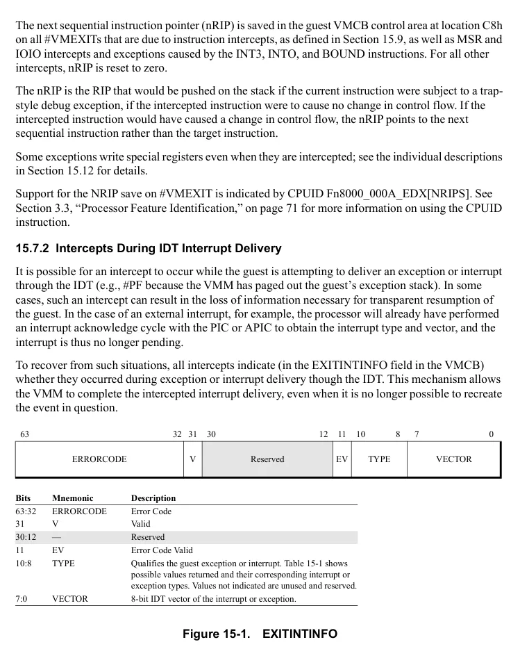

</details>


<!-- PDF source page: 572 | printed page: 510 -->

**Table 15-1. Guest Exception or Interrupt Types**

| Value | Type |
| --- | --- |
| 0 | External or virtual interrupt (INTR) |
| 2 | NMI |
| 3 | Exception (fault or trap) |
| 4 | Software interrupt (caused by INTn instruction) |

Despite the instruction name, the events raised by the INT1 (also known as ICEBP), INT3 and INTO instructions (opcodes F1h, CCh and CEh) are considered exceptions for the purposes of EXITINTINFO, not software interrupts. Only events raised by the INT*n* instruction (opcode CDh) are considered software interrupts.

- Error Code Valid—Bit 11. Set to 1 if the guest exception would have pushed an error code; otherwise cleared to zero.
- Valid—Bit 31. Set to 1 if the intercept occurred while the guest attempted to deliver an exception through the IDT; otherwise cleared to zero.
- Errorcode—Bits 63:32. If EV is set to 1, holds the error code that the guest exception would have pushed; otherwise is undefined.

In the case of multiple exceptions, EXITINTINFO records the aggregate information on all exceptions but the last (intercepted) one.

**Example:** A guest raises a #GP during delivery of which a #NP is raised (a scenario that, according to x86 rules, resolves to a #DF), and an intercepted #PF occurs during the attempt to deliver the #DF. Upon intercept of the #PF, EXITINTINFO indicates that the guest was in the process of delivering a #DF when the #PF occurred. The information about the intercepted page fault itself is encoded in the EXITCODE, EXITINFO1 and EXITINFO2 fields. If the VMM decides to repair and dismiss the #PF, it can resume guest execution by re-injecting (see Section 15.20) the fault recorded in EXITINTINFO. If the VMM decides that the #PF should be reflected back to the guest, it must combine the event in EXITINTINFO with the intercepted exception according to x86 rules. In this case, a #DF plus a #PF would result in a triple fault or shutdown.

<a id="15-7-3-exitintinfo-pseudo-code"></a>

### 15.7.3 EXITINTINFO Pseudo-Code

When delivering exceptions or interrupts in a guest, the processor checks for exception intercepts and updates the value of EXITINTINFO should an intercept occur during exception delivery. The following pseudo-code outlines how the processor delivers an event (exception or interrupt) E.

```text
if E is an exception and is intercepted:
#VMEXIT(E)
E = (result of combining E with any prior events)
```

```text
if (result was #DF and #DF is intercepted):
#VMEXIT(#DF)
if (result was shutdown and shutdown is intercepted):
```

<details>
<summary>Rendered source page 572 (figures/tables)</summary>

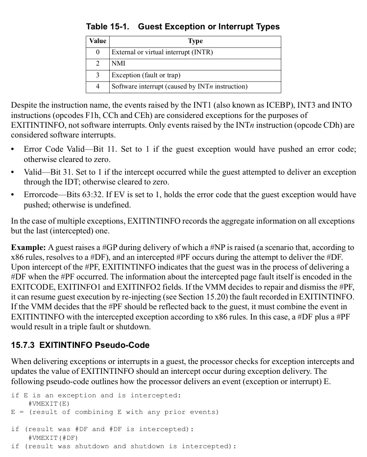

</details>


<!-- PDF source page: 573 | printed page: 511 -->

```text
#VMEXIT(#shutdown)
EXITINTINFO = E // Record the event the guest is delivering.
```

```text
Attempt delivery of E through the IDT
Note that this may cause secondary exceptions
```

```text
Once an exception has been successfully taken in the guest:
```

```text
EXITINTINFO.V = 0 // Delivery succeeded; no #VMEXIT.
Dispatch to first instruction of handler
```

When an exception triggers an intercept, the EXITCODE, and optionally EXITINFO1 and EXITINFO2, fields always reflect the intercepted exception, while EXITINTINFO, if marked valid, indicates the prior exception the guest was attempting to deliver when the intercept occurred.

<a id="15-8-decode-assists"></a>

## 15.8 Decode Assists

Decode assists are provided to allow hypervisors to decode guest instructions more efficiently. CPUID Fn8000_000A_EDX[DecodeAssists] = 1 indicates support for this feature. See Section 3.3, “Processor Feature Identification,” on page 71 for more information on using the CPUID instruction.

<a id="15-8-1-mov-crx-drx-intercepts"></a>

### 15.8.1 MOV CRx/DRx Intercepts

The EXITINFO1 field holds a flag indicating whether the instruction was a MOV CRx and the number of the GPR operand. MOV-to-CR instructions always set bit 63 and provide the GPR number, except for CR0 as specified below.

**Table 15-2. EXITINFO1 for MOV CRx**

| Bit Offsets | Field Contents |
| --- | --- |
| 3:0 | GPR numbe |
| 62:4 | 0 |
| 63 | Instruction was MOV CRx—set to1 if the instruction was<br>a MOV CRx instruction; cleared to 0 otherwise. |

**Table 15-3. EXITINFO1 for MOV DRx**

| Bit Offsets | Field Contents |
| --- | --- |
| 3:0 | GPR numbe |
| 63:4 | 0 |

**MOV-to-CR0 Special Case.** If the instruction is MOV-to-CR, the GPR number is provided. If the instruction is LMSW or CLTS, no additional information is provided and bit 63 is not set.

<details>
<summary>Rendered source page 573 (figures/tables)</summary>

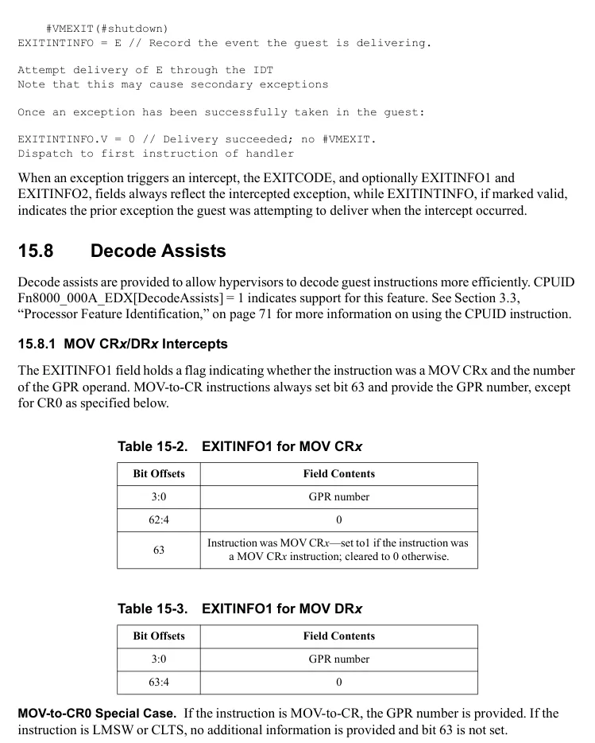

</details>


<!-- PDF source page: 574 | printed page: 512 -->

**MOV-from-CR0 Special Case.** If the instruction is MOV-from-CR, the GPR number is provided and bit 63 is set. If the instruction is SMSW, no information is provided and bit 63 is not set.

<a id="15-8-2-intn-intercepts"></a>

### 15.8.2 INTn Intercepts

EXITINFO1 records the immediate value of the interrupt number for INT *n* instructions*.* See Table 15-4.

**Table 15-4. EXITINFO1 for INTn**

| Bit Offsets | Field Contents |
| --- | --- |
| 7:0 | Software interrupt numbe |
| 63:8 | 0 |

<a id="15-8-3-invlpg-and-invlpga-intercepts"></a>

### 15.8.3 INVLPG and INVLPGA Intercepts

For an INVLPG intercept, EXITINFO1 provides the linear address after segment base addition and address size masking produce the effective address size. See Table 15-5. For an INVLPGA intercept, the linear address is available directly from the guest rAX register and is not provided in EXITINFO1.

**Table 15-5. EXITINFO1 for INVLPG**

| Bit Offsets | Field Contents |
| --- | --- |
| 63:0 | Linear address |

<a id="15-8-4-nested-and-intercepted-pf"></a>

### 15.8.4 Nested and Intercepted #PF

In the case of a Nested Page Fault or intercepted #PF, guest instruction bytes at guest CS:RIP are stored into the 16-byte wide field Guest Instruction Bytes located at offset 0D0h in the VMCB. The format of this field is summarized in Table 15-6 below. Up to 15 bytes are recorded, read from guest CS:RIP. If a faulting condition occurs, such as not-present page or exceeding the CS limit, then the Guest Instruction Bytes field records as many bytes as could be fetched. The number of bytes fetched is put into the first byte of this field. Zero indicates that no bytes were fetched. The default number of bytes is always 15. Fewer bytes are returned only if a fault occurs while fetching.

This field is filled in only during data page faults. Instruction-fetch page faults provide no additional information.

All other intercepts clear bits 7:0 in this field to zero (to indicate an invalid condition); implementations may leave the other bytes untouched.

**Table 15-6. Guest Instruction Bytes**

| Bit Offsets | Field Contents |
| --- | --- |
| 3:0 | Number of bytes fetched |

<details>
<summary>Rendered source page 574 (figures/tables)</summary>

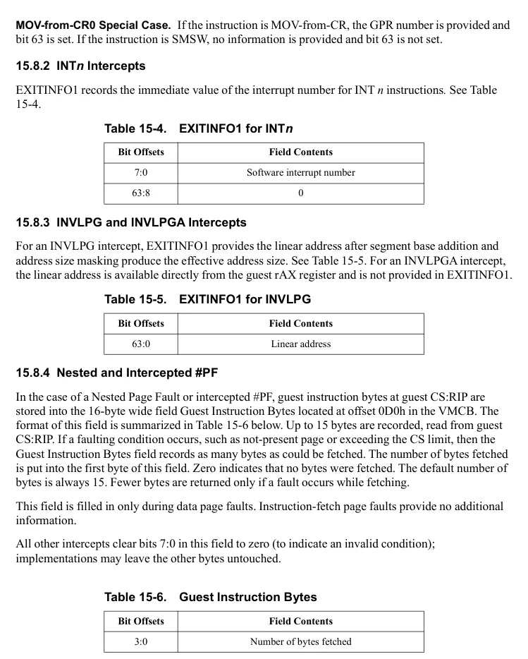

</details>


<!-- PDF source page: 575 | printed page: 513 -->

**Table 15-6. Guest Instruction Bytes (continued)**

| Bit Offsets | Field Contents |
| --- | --- |
| 7:4 | 0 |
| 127:8 | Instruction bytes |

<a id="15-9-instruction-intercepts"></a>

## 15.9 Instruction Intercepts

Table 15-7 specifies the instructions that check a given intercept and, where relevant, how the intercept is prioritized relative to exceptions.

**Table 15-7. Instruction Intercepts**

| Instruction Intercept | Checked By | Priority |
| --- | --- | --- |
| Read/Write of CR0 | MOV TO/FROM CR0, LMSW,<br>SMSW, CLTS | Checks non-memory exceptions (CPL, illegal bit<br>combinations, etc.) before the intercept. For LMSW<br>and SMSW, checks SVM intercepts before checking<br>memory exceptions. |
| Read/Write of CR3<br>(excluding task switch) | MOV TO/FROM CR3 (not checked<br>by task switch operations) | Checks non-memory exceptions first, then the<br>intercept. If the intercept triggers on a write, the<br>intercept happens before the TLB is flushed. If PAE is<br>enabled, the loading of the four PDPEs can cause a<br>#GP; that exception is checked after the intercept<br>check, so the VMM handling a CR3 intercept cannot<br>rely on the PDPEs being legal; it must examine them in<br>software if necessary.<br>The reads and writes of CR3 that occur in VMRUN,<br>#VMEXIT or task switches are not subject to this<br>intercept check. |
| Read/Write of other<br>CRs | MOV TO/FROM CRn | All normal exception checks take precedence over the<br>SVM intercepts. |
| Read/Write of Debug<br>Registers, DRn | MOV TO/FROM DRn. (Not checked<br>by implicit DR6/DR7 writes.) | All normal exception checks take precedence over the<br>SVM intercepts. |

<details>
<summary>Rendered source page 575 (figures/tables)</summary>

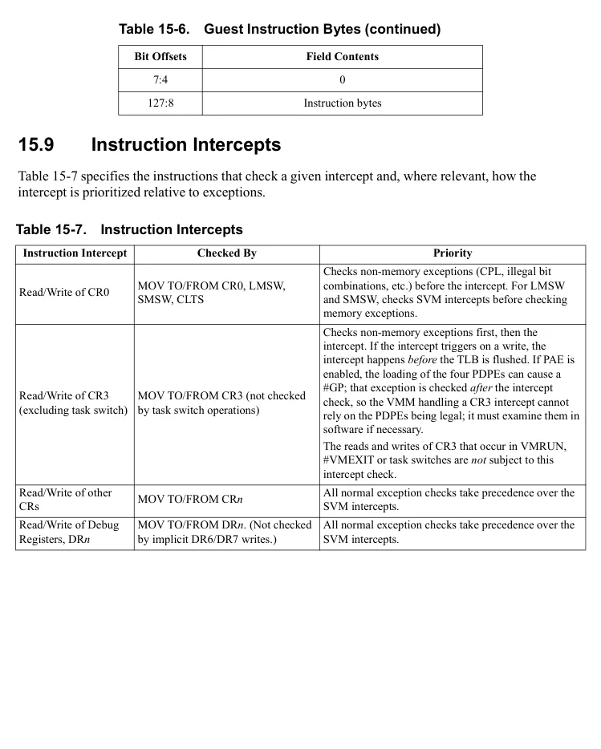

</details>


<!-- PDF source page: 576 | printed page: 514 -->

**Table 15-7. Instruction Intercepts (continued)**

| Instruction Intercept | Checked By | Priority |
| --- | --- | --- |
| Selective CR0 Write<br>Intercept | MOV TO CR0, LMSW | Checks non-memory exceptions (CPL, illegal bit<br>combinations, etc.) before the intercept. For LMSW<br>and SMSW, checks SVM intercepts before checking<br>memory exceptions.<br>The selective write intercept on CR0 triggers only if a<br>bit other than CR0.TS or CR0.MP is being changed by<br>the write. In particular, this means that CLTS does not<br>check this intercept.<br>When both selective and non-selective CR0-write<br>intercepts are active at the same time, the non-selective<br>intercept takes priority. With respect to exceptions, the<br>priority of this intercept is the same as the generic CR0-<br>write intercept.<br>The LMSW instruction treats the selective CR0-write<br>intercept as a non-selective intercept (i.e., it intercepts<br>regardless of the value being written). |
| Reading or Writing<br>IDTR, GDTR, LDTR,<br>TR | LIDT, SIDT, LGDT, SGDT, LLDT,<br>SLDT, LTR, STR | The SVM intercept is checked after #UD and #GP<br>exception checks, but before any memory access is<br>performed. |
| RDTSC | RDTSC | Checks all exceptions before the SVM intercept. |
| RDPMC | RDPMC | Checks all exceptions before the SVM intercept. |
| PUSHF | PUSHF | Takes priority over any exceptions. |
| POPF | POPF | Takes priority over any exceptions. |
| CPUID | CPUID | No exceptions to check. |
| RSM | RSM | The intercept takes priority over any exceptions. |
| IRET | IRET | The intercept takes priority over any exceptions. |
| Software Interrupt | INTn | The intercept occurs before any exceptions are checked.<br>The CS:rIP reported on #VMEXIT are those of the<br>intercepted INTn instruction.<br>Though the INTn instruction may dispatch through IDT<br>vectors in the range of 0–31, those events cannot be<br>intercepted by means of exception intercepts (see<br>“Exception Intercepts” on page 519). |
| INVD | INVD | Exceptions (#GP) are checked before the intercept. |

<details>
<summary>Rendered source page 576 (figures/tables)</summary>

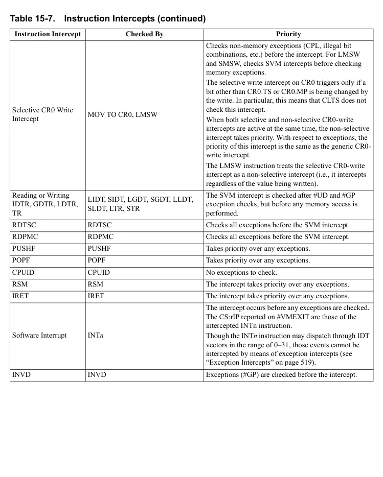

</details>


<!-- PDF source page: 577 | printed page: 515 -->

**Table 15-7. Instruction Intercepts (continued)**

| Instruction Intercept | Checked By | Priority |
| --- | --- | --- |
| PAUSE | PAUSE | No exceptions to check.<br>VMRUN copies the VMCB.PauseFilterCount into an<br>internal counter. Each PAUSE instruction decrements<br>the counter, and the PAUSE intercept only occurs if the<br>counter goes below zero while the PAUSE intercept is<br>enabled. The VMCB.PauseFilterCount field is not<br>written by the processor. Certain events, including SMI,<br>can cause the internal count to be reloaded from the<br>VMCB.<br>VMCB.PauseFilterCount support is indicated by<br>EDX[10] as returned by CPUID extended function<br>8000 000A. If This feature is not supported or<br>VMCB.PauseFilterCount = 0, then the first PAUSE<br>instruction can be intercepted. |
| HLT | HLT | Checks all exceptions before checking for this<br>intercept. |
| IDLE HLT | HLT | When both HLT and Idle HLT intercepts are active at<br>the same time, the HLT intercept takes priority. This<br>intercept occurs only if a virtual interrupt is not pending<br>(V INTR or V NMI).<br>_ _ |
| INVLPG | INVLPG | Checks all exceptions (#GP) before the intercept. |
| INVLPGA | INVLPGA | Checks all exceptions (#GP) before the intercept. |
| VMRUN | VMRUN | Checks exceptions (#GP) before the intercept.<br>The current implementation requires that the VMRUN<br>intercept always be set in the VMCB. |
| VMLOAD | VMLOAD | Checks exceptions (#GP) before the intercept. |
| VMSAVE | VMSAVE | Checks exceptions (#GP) before the intercept. |
| VMMCALL | VMMCALL | The intercept takes priority over exceptions.<br>VMMCALL causes #UD in the guest if it is not<br>intercepted. |
| STGI | STGI | Checks exceptions (#GP) before the intercept. |
| CLGI | CLGI | Checks exceptions (#GP) before the intercept. |
| SKINIT | SKINIT | Checks exceptions (#GP) before the intercept. |
| RDTSCP | RDTSCP | Checks all exceptions before the SVM intercept. |
| ICEBP | ICEBP(opcode F1h). | Although the ICEBP instruction dispatches through<br>IDT vector 1, that event is not interceptable by means<br>of the #DB exception intercept. |
| WBINVD | WBINVD, WBNOINVD | Checks exceptions (#GP) before the intercept. |
| MONITOR | MONITOR, MONITORX | Checks all exceptions before the intercept. |

<details>
<summary>Rendered source page 577 (figures/tables)</summary>

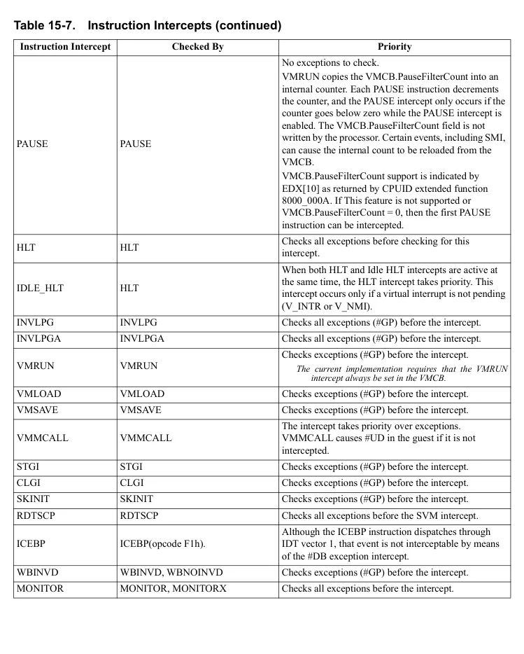

</details>


<!-- PDF source page: 578 | printed page: 516 -->

**Table 15-7. Instruction Intercepts (continued)**

| Instruction Intercept | Checked By | Priority |
| --- | --- | --- |
| MWAIT | MWAIT, MWAITX | Checks all exceptions before the intercept. There are<br>conditional and unconditional MWAIT intercepts. The<br>conditional MWAIT intercept is checked before the<br>unconditional MWAIT intercept.<br>When both conditional and unconditional MWAIT<br>intercepts are active, the conditional intercept is<br>checked first. A hypervisor that sets both intercepts will<br>receive the conditional MWAIT intercept exit code for<br>a guest MWAIT instruction that would have entered a<br>low-power state, and will receive the unconditional<br>MWAIT intercept exit code for a guest MWAIT<br>instruction that would not have entered the low-power<br>state. These checks also apply to MWAITX. |
| XSETBV | XSETBV | Checks intercept before exceptions (#GP). |
| RDPRU | RDPRU | Check all exceptions before the intercept. |
| INVLPGB | INVLPGB | Intercept takes priority over all exceptions except #GP<br>for CPL<>0. |
| INVLPGB ILLEGAL | INVLPGB exception cases | Intercept takes priority over all exceptions except #GP<br>for CPL<>0. |
| INVPCID | INVPCID | Intercept takes priority over all exceptions except #GP<br>for CPL<>0. |
| TLBSYNC | TLBSYNC | Checks exceptions (#GP) before the intercept. |

<a id="15-10-ioio-intercepts"></a>

## 15.10 IOIO Intercepts

The VMM can intercept IOIO instructions (IN, OUT, INS, OUTS) on a port-by-port basis by means of the SVM I/O permissions map.

<a id="15-10-1-i-o-permissions-map"></a>

### 15.10.1 I/O Permissions Map

The I/O Permissions Map (IOPM) occupies 12 Kbytes of contiguous physical memory. The map is structured as a linear array of 64K+3 bits (two 4-Kbyte pages, and the first three bits of a third 4-Kbyte page) and must be aligned on a 4-Kbyte boundary; the physical base address of the IOPM is specified in the IOPM_BASE_PA field in the VMCB and loaded into the processor by the VMRUN instruction. The VMRUN instruction ignores the lower 12 bits of the address specified in the VMCB. If the address of the last byte in the IOPM is greater than or equal to the maximum supported physical address, this is treated as illegal VMCB state and causes a #VMEXIT(VMEXIT_INVALID).

Each bit in the IOPM corresponds to an 8-bit I/O port. Bit 0 in the table corresponds to I/O port 0, bit 1 to I/O port 1 and so on. A bit set to 1 indicates that accesses to the corresponding port should be intercepted. The IOPM is accessed by physical address, and should reside in memory that is mapped as writeback (WB).

<details>
<summary>Rendered source page 578 (figures/tables)</summary>

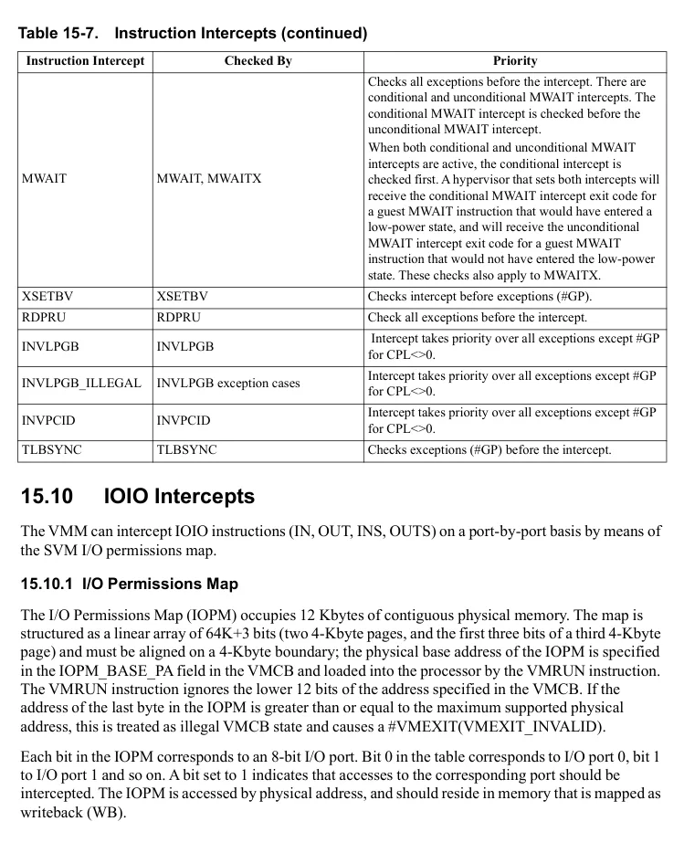

</details>


<!-- PDF source page: 579 | printed page: 517 -->

<a id="15-10-2-in-and-out-behavior"></a>

### 15.10.2 IN and OUT Behavior

If the IOIO_PROT intercept bit is set, the IOPM controls port access. For IN/OUT instructions that access more than a single byte, the permission bits for all bytes are checked; if any bit is set to 1, the I/O operation is intercepted.

Exceptions related to virtual x86 mode, IOPL, or the TSS-bitmap are checked *before* the SVM intercept check. All other exceptions are checked *after* the SVM intercept check.

**I/O Intercept Information.** When an IOIO intercept triggers, the following information (describing the intercepted operation in order to facilitate emulation) is saved in the VMCB’s EXITINFO1 field:

31 16 15 13 12 10 9 8 7 6 5 4 3 2 1 0

TYPE

R SD

SZ32

SZ16

STR

REP

A64

A32

A16

SZ8

PORT Reserved SEG

**Bits Mnemonic Description** 31:16 PORT Intercepted I/O port 15-13 — Reserved 12:10 SEG Effective segment number 9 A64 64-bit address 8 A32 32-bit address 7 A16 16-bit address 6 SZ32 32-bit operand size 5 SZ16 16-bit operand size 4 SZ8 8-bit operand size 3 REP Repeated port access 2 STR String based port access (INS, OUTS) 1 — Reserved

0 TYPE Access Type (0 = OUT instruction, 1 = IN instruction)

**Figure 15-2. EXITINFO1 for IOIO Intercept**

The rIP of the instruction *following* the IN/OUT is saved in EXITINFO2, so that the VMM can easily resume the guest after I/O emulation.

<a id="15-10-3-rep-outs-and-ins"></a>

### 15.10.3 (REP) OUTS and INS

Bits 12:10 of the EXITINFO1 field provide the effective segment number (the default segment is DS). (For segment register encodings, see Table A-32, “16-Bit Register and Memory References” on page 478*,* in *AMD64 Architecture Programmer’s Manual Volume 3: General-Purpose and System Instructions.*)

INS provides the effective segment (always ES, encoded as 0).

<details>
<summary>Rendered source page 579 (figures/tables)</summary>

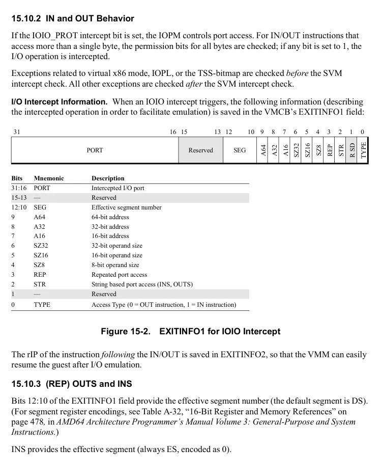

</details>


<!-- PDF source page: 580 | printed page: 518 -->

On intercepted SMI-on-I/O, bits 12:10 of EXITINFO1 encode the segment. For definitions of the remaining bits of this field, (Section 15.13.3).

<a id="15-11-msr-intercepts"></a>

## 15.11 MSR Intercepts

The VMM can intercept RDMSR and WRMSR instructions by means of the *SVM MSR permissions map* (MSRPM) on a per-MSR basis.

**MSR Permissions Map.** The MSR permissions bitmap consists of four separate bit vectors of 16 Kbits (2 Kbytes) each. Each 16 Kbit vector controls guest access to a defined range of 8K MSRs. Each MSR is covered by two bits defining the guest read and write access permissions. The lsb of the two bits controls read access to the MSR and the msb controls write access. A value of 1 indicates that the operation is intercepted. The four separate bit vectors must be packed together and located in two contiguous physical pages of memory. If the MSR_PROT intercept is active, any attempt to read or write an MSR not covered by the MSRPM will automatically cause an intercept.

The following table defines the ranges of MSRs covered by the MSR permissions map. Note that the MSR ranges are not contiguous.

**Table 15-8. MSR Ranges Covered by MSRPM**

| MSRPM Byte Offset | MSR Range |
| --- | --- |
| 000h–7FFh | 0000 0000h–0000 1FFFh<br>_ _ |
| 800h–FFFh | C000 0000h–C000 1FFFh<br>_ _ |
| 1000h–17FFh | C001 0000h–C001 1FFFh<br>_ _ |
| 1800h–1FFFh | Reserved |

The MSRPM is accessed by physical address and should reside in memory that is mapped as writeback (WB). The MSRPM must be aligned on a 4KB boundary. The physical base address of the MSRPM is specified in MSRPM_BASE_PA field in the VMCB and is loaded into the processor by the VMRUN instruction. The VMRUN instruction ignores the lower 12 bits of the address specified in the VMCB, and if the address of the last byte in the table is greater than or equal to the maximum supported physical address, this is treated as illegal VMCB state and causes a #VMEXIT(VMEXIT_INVALID).

**RDMSR and WRMSR Behavior.** If the MSR_PROT bit in the VMCB’s intercept vector is clear, RDMSR/WRMSR instructions are not intercepted.

RDMSR and WRMSR instructions check for exceptions and intercepts in the following order:

- Exceptions common to all MSRs (e.g., #GP if not at CPL 0)
- Check SVM intercepts in the MSR permission map, if the MSR_PROT intercept is requested.
- Exceptions specific to a given MSR (including password protection, unimplemented MSRs, reserved bits, etc.)

<details>
<summary>Rendered source page 580 (figures/tables)</summary>

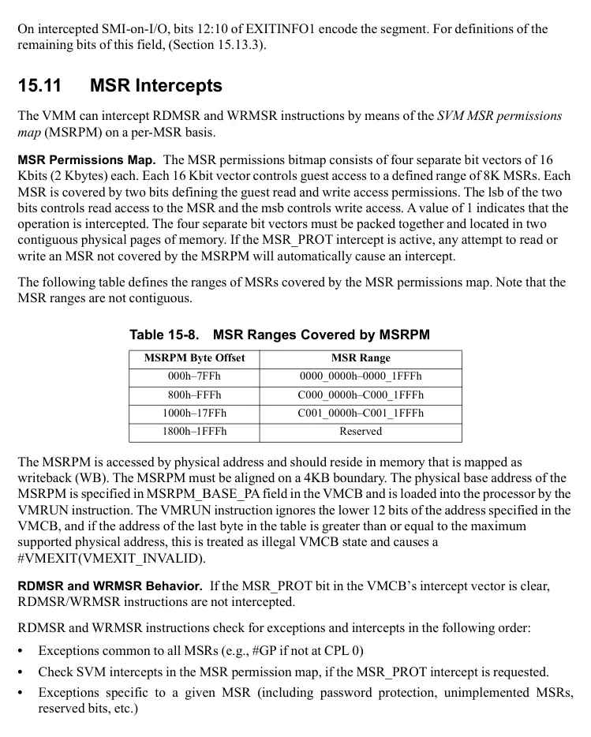

</details>


<!-- PDF source page: 581 | printed page: 519 -->

**MSR Intercept Information.** On #VMEXIT, the processor indicates in the VMCB’s EXITINFO1 whether a RDMSR (EXITINFO1 = 0) or WRMSR (EXITINFO1 = 1) was intercepted.

<a id="15-12-exception-intercepts"></a>

## 15.12 Exception Intercepts

When intercepting exceptions that define an error code (normally pushed onto the exception stack), the SVM hardware delivers that error code in the VMCB’s EXITINFO1 field; the exception vector number can be derived from the EXITCODE. The CS.SEL and rIP saved in the VMCB on an exception-intercept match those that would otherwise have been pushed onto the exception stack frame, except that when an interrupt-based instruction causes an intercept, the rIP of the instruction is stored in the VMCB, rather than the rIP of the next instruction. The interrupt-based instructions are INT3 (opcode CC), INTO, and BOUND.

Unless otherwise noted below, no special registers are written before an exception is intercepted. For details on guest state saved in the VMCB, see Section 15.7.1.

External interrupts and software interrupts (INT*n* instruction) do not check the exception intercepts, even when they use a vector in the range 0 to 31.

Exceptions that occur during the handling of a prior exception are checked for intercepts *before* being combined with the prior exception (e.g., into a double-fault). If the result of combining exceptions is a double-fault or shutdown, the processor checks whether those are intercepted before attempting delivery.

**Example:** Assume that the VMM intercepts #GP and #DF exceptions, and the guest raises a (non-intercepted) #NP, during the delivery of which it also gets a #GP (e.g., due to an illegal IDT entry)—a situation that, according to x86 semantics, results in a #DF. In this case, #VMEXIT signals an intercepted #GP, *not* an intercepted #DF and fills EXITINTINFO with the #NP fault. On the other hand, if only the #DF intercept were active in this scenario, #VMEXIT would signal an intercepted #DF.

The following subsections detail the individual intercepts.

<a id="15-12-1-de-divide-by-zero"></a>

### 15.12.1 #DE (Divide By Zero)

The EXITINFO1 and EXITINFO2 fields are undefined.

<a id="15-12-2-db-debug"></a>

### 15.12.2 #DB (Debug)

The #DB exception can have fault-type (e.g., instruction breakpoint) or trap-type (e.g., data breakpoint) behavior; accordingly the intercept differs in what state is saved in the VMCB (see Section 15.7.1). In either case, however, the value saved for DR6 and DR7 matches what would be visible to a #DB exception handler (i.e., both #DB faults and traps are permitted to write DR6 and DR7 before the intercept). The EXITINFO1 and EXITINFO2 fields are undefined.

Fault-type #DB exceptions, whether indicated in EXITCODE or EXITINTINFO, cause the CS:rIP saved in the VMCB to indicate the instruction that caused the #DB exception. Trap-type #DB


<!-- PDF source page: 582 | printed page: 520 -->

exceptions cause the VMCB’s CS:rIP to indicate the instruction following the instruction that caused the exception. A vector 1 exception generated by the single byte INT1 instruction (also known as ICEBP) does not trigger the #DB intercept. Software should use the dedicated ICEBP intercept to intercept ICEBP (see Section 15.9).

<a id="15-12-3-vector-2-reserved"></a>

### 15.12.3 Vector 2 (Reserved)

This intercept bit is not implemented; use the NMI intercept (Section 15.13.2) instead. The effect of setting this bit is undefined.

<a id="15-12-4-bp-breakpoint"></a>

### 15.12.4 #BP (Breakpoint)

This intercept applies to the trap raised by the single byte INT3 (opcode CCh) instruction. The EXITINFO1 and EXITINFO2 fields are undefined. The CS:rIP reported on #VMEXIT are those of the INT3 instruction.

<a id="15-12-5-of-overflow"></a>

### 15.12.5 #OF (Overflow)

This intercept applies to the trap raised by the INTO (opcode CEh) instruction. The EXITINFO1 and EXITINFO2 fields are undefined.

<a id="15-12-6-br-bound-range"></a>

### 15.12.6 #BR (Bound-Range)

This intercept applies to the fault raised by the BOUND instruction. The EXITINFO1 and EXITINFO2 fields are undefined.

<a id="15-12-7-ud-invalid-opcode"></a>

### 15.12.7 #UD (Invalid Opcode)

The EXITINFO1 and EXITINFO2 fields are undefined.

<a id="15-12-8-nm-device-not-available"></a>

### 15.12.8 #NM (Device-Not-Available)

The EXITINFO1 and EXITINFO2 fields are undefined.

<a id="15-12-9-df-double-fault"></a>

### 15.12.9 #DF (Double Fault)

The EXITINFO1 and EXITINFO2 fields are undefined. The rIP value saved in the VMCB is undefined (as is the case for the rIP value pushed on the stack for #DF exceptions). If a double fault is intercepted, the exceptions leading up to the double fault will have written any status registers normally written by those exceptions.

<a id="15-12-10-vector-9-reserved"></a>

### 15.12.10 Vector 9 (Reserved)

This intercept is not implemented. The effect of setting this bit is undefined.


<!-- PDF source page: 583 | printed page: 521 -->

<a id="15-12-11-ts-invalid-tss"></a>

### 15.12.11 #TS (Invalid TSS)

The EXITINFO1 and EXITINFO2 fields are undefined. The rIP value saved in the VMCB may point to either the instruction causing the task switch, or to the first instruction of the incoming task. See Section 15.14.1 for information on the EXITINFO1 and EXITINFO2 fields.

<a id="15-12-12-np-segment-not-present"></a>

### 15.12.12 #NP (Segment Not Present)

The EXITINFO1 field contains the error code that would be pushed on the stack by a #NP exception. The EXITINFO2 field is undefined.

<a id="15-12-13-ss-stack-fault"></a>

### 15.12.13 #SS (Stack Fault)

The EXITINFO1 field contains the error code that would be pushed on the stack by a #SS exception. The EXITINFO2 field is undefined.

<a id="15-12-14-gp-general-protection"></a>

### 15.12.14 #GP (General Protection)

The EXITINFO1 field contains the error code that would be pushed on the stack by a #GP exception.

<a id="15-12-15-pf-page-fault"></a>

### 15.12.15 #PF (Page Fault)

This intercept is tested *before* CR2 is written by the exception. The error code saved in EXITINFO1 is the same as would be pushed onto the stack by a non-intercepted #PF exception in protected mode. The faulting address is saved in the EXITINFO2 field in the VMCB. Even when the guest is running in paged real mode, the processor will deliver the (protected-mode) page-fault error code in EXITINFO1, for the VMM to use in analyzing the intercepted #PF. The processor may provide additional instruction decode assist information. (See Section 15.8.4.)

<a id="15-12-16-mf-x87-floating-point"></a>

### 15.12.16 #MF (X87 Floating Point)

This intercept is tested *after* the floating point status word has been written, as is the case for a normal FP exception. The EXITINFO1 and EXITINFO2 fields are undefined.

<a id="15-12-17-ac-alignment-check"></a>

### 15.12.17 #AC (Alignment Check)

The EXITINFO1 field contains the error code that would be pushed on the stack by an #AC exception. The EXITINFO2 field is undefined.

<a id="15-12-18-mc-machine-check"></a>

### 15.12.18 #MC (Machine Check)

The SVM intercept is checked after all #MC-specific registers have been written, but before other guest state is modified. When #MC is being intercepted, a machine-check exits to the VMM, whenever possible, and shuts down the processor only when this is not a reasonable option. The EXITINFO1 and EXITINFO2 fields are undefined.

Note that in some processors, if the guest VM has disabled machine check handling (CR4.MCE=0) then all machine check errors that occur in the guest will result in a shutdown event. However in


<!-- PDF source page: 584 | printed page: 522 -->

processors where CPUID Fn8000_000A_EDX[HOST_MCE_OVERRIDE] (bit 23) = 1 the VMM may override this behavior by setting CR4.MCE=1 in the host. In this scenario, machine check errors that occur in the guest and which can be contained by the processor will always result in a #VMEXIT(MC).

<a id="15-12-19-xf-simd-floating-point"></a>

### 15.12.19 #XF (SIMD Floating Point)

This intercept is tested after the SIMD status word (MXCSR) has been written, as is the case for a normal FP exception. The EXITINFO1 and EXITINFO2 fields are undefined.

<a id="15-12-20-sx-security-exception"></a>

### 15.12.20 #SX (Security Exception)

The EXITINFO1 field contains the error code that would be pushed on the stack by a #SX exception. The EXITINFO2 field is undefined.

<a id="15-12-21-cp-control-protection"></a>

### 15.12.21 #CP (Control Protection)

The EXITINFO1 field contains the error code that would be pushed on the stack by a #CP exception. The EXITINFO2 field is undefined.

<a id="15-13-interrupt-intercepts"></a>

## 15.13 Interrupt Intercepts

External interrupts, when intercepted, cause a #VMEXIT; the interrupt is held pending so that the interrupt can eventually be taken in the VMM. Exception intercepts do not apply to external or software interrupts, so it is not possible to intercept an interrupt by means of the exception intercepts, even if the interrupt should happen to use a vector in the range from 0 to 31.

<a id="15-13-1-intr-intercept"></a>

### 15.13.1 INTR Intercept

This intercept affects physical, as opposed to virtual, maskable interrupts. See “Virtual Interrupt Intercept” on page 535 for virtualization of maskable interrupts.

<a id="15-13-2-nmi-intercept"></a>

### 15.13.2 NMI Intercept

This intercept affects non-maskable interrupts. NMI interrupts (and SMIs) may be blocked for one instruction following an STI.

<a id="15-13-3-smi-intercept"></a>

### 15.13.3 SMI Intercept

This intercept affects System Management Mode Interrupts (SMIs); see “SMM Support” on page 537 for details on SMI handling.

When this intercept triggers, bit 0 of the EXITINFO1 field distinguishes whether the SMI was caused internally by I/O Trapping (bit 0 = 0), or asserted externally (bit 0 = 1).

If the SMI was asserted while the guest was executing an I/O instruction, extra information (describing the I/O instruction) is saved in the upper 32 bits of EXITINFO1, and the rIP of the I/O instruction is


<!-- PDF source page: 585 | printed page: 523 -->

saved in EXITINFO2. EXITINFO1 indicates that SMI was asserted during an I/O instruction when the VALID bit is set.

If the SMI wasn't asserted during an I/O instruction, the extra EXITINFO1 and EXITINFO2 bits are undefined.

The SMI intercept is ignored when HWCR[SMMLOCK] is set.

63 48 47 44 43 42 41 40 39 38 37 36 35 34 33 32

TYPE

SZ32

SZ16

VAL

STR

REP

RAZ

A64

A32

A16

SZ8

PORT BRP

TF

31 12 10 9 2 1 0

MCREDIR

SMISRC

Reserved, RAZ SEG Reserved, RAZ

**Bits Mnemonic Description** 63:48 PORT Intercepted I/O port 47:44 BRP I/O breakpoint matches 43 TF EFLAGS TF value 42 — Reserved, RAZ 41 A64 64-bit address 40 A32 32-bit address 39 A16 16-bit address 38 SZ32 32-bit operand size 37 SZ16 16-bit operand size 36 SZ8 8-bit operand size 35 REP Repeated port access 34 STR String based port access (INS, OUTS) 33 VAL Valid (SMI was detected during an I/O instruction)

32 TYPE Access Type (0 = OUT instruction, 1 = IN instruction)

31:13 — Reserved, RAZ 12:10 SEG Effective segment number (see Section 15.9) 9:2 — Reserved, RAZ

1 MCREDIR SMI was due to a redirect machine check error (See “Inter-action with SMI and #MC” on page 601) 0 SMISRC SMI source (0 = internal, 1 = external)

**Figure 15-3. EXITINFO1 for SMI Intercept**

<a id="15-13-4-init-intercept"></a>

### 15.13.4 INIT Intercept

The INIT intercept allows the VMM to intercept the assertion of INIT while a guest is running. An intercepted INIT remains pending until the VMM sets GIF (see “Global Interrupt Flag, STGI and CLGI Instructions” on page 530), at which point it either takes effect or is redirected. See Section 15.21.8 for a discussion of the INIT redirection feature.

<details>
<summary>Rendered source page 585 (figures/tables)</summary>

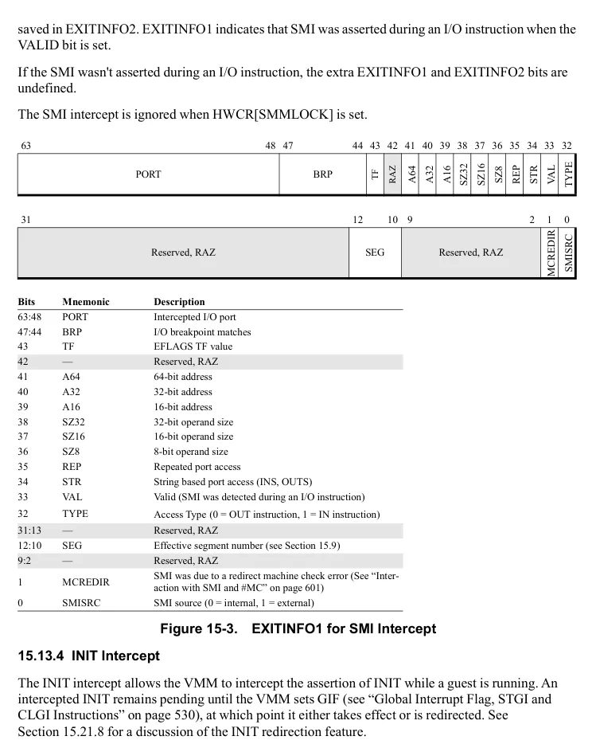

</details>


<!-- PDF source page: 586 | printed page: 524 -->

<a id="15-13-5-virtual-interrupt-intercept"></a>

### 15.13.5 Virtual Interrupt Intercept

This intercept is taken just before a guest takes a virtual interrupt. When the intercept triggers, the virtual interrupt has not been taken, and remains pending in the guest's VMCB V_IRQ field. This intercept is not required for handling fixed local APIC interrupts, but may be used for emulating ExtINT interrupt delivery mode (which is not masked by the TPR), or legacy PICs in auto-EOI mode.

<a id="15-14-miscellaneous-intercepts"></a>

## 15.14 Miscellaneous Intercepts

The SVM architecture includes intercepts to handle task switches, processor freezes due to FERR, and shutdown operations.

<a id="15-14-1-task-switch-intercept"></a>

### 15.14.1 Task Switch Intercept

**Checked by—**Any instruction or event that causes a task switch (e.g., JMP, CALL, exceptions, interrupts, software interrupts).

**Priority—**The intercept is checked before the task switch takes place but *after* the incoming TSS and task gate (if one was involved) have been checked for correctness.

Task switches can modify several resources that a VMM may want to protect (CR3, EFLAGS, LDT). However, instead of checking various intercepts (e.g., CR3 Write, LDTR Write) individually, task switches check only a single intercept bit.

On #VMEXIT, the following information is delivered in the VMCB:

- EXITINFO1[15:0] holds the segment selector identifying the incoming TSS.
- EXITINFO2[31:0] holds the error code to push in the new task, if applicable; otherwise, this field is undefined.
- EXITINFO2[63:32] holds auxiliary information for the VMM:
- EXITINFO2[36]—Set to 1 if the task switch was caused by an IRET; else cleared to 0.
- EXITINFO2[38]—Set to 1 if the task switch was caused by a far jump; else cleared to 0.
- EXITINFO2[44]—Set to 1 if the task switch has an error code; else cleared to 0.
- EXITINFO2[48]—The value of EFLAGS.RF that would be saved in the outgoing TSS if the task switch were not intercepted.

<a id="15-14-2-ferr-freeze-intercept"></a>

### 15.14.2 Ferr_Freeze Intercept

Checked when the processor freezes due to assertion of FERR (while IGNNE is deasserted, and legacy handling of FERR is selected in CR0.NE), i.e., while the processor is waiting to be unfrozen by an external interrupt.


<!-- PDF source page: 587 | printed page: 525 -->

<a id="15-14-3-shutdown-intercept"></a>

### 15.14.3 Shutdown Intercept

When this intercept occurs, any condition that normally causes a shutdown causes a #VMEXIT to the VMM instead. After an intercepted shutdown, the state saved in the VMCB is undefined.

<a id="15-14-4-pause-intercept-filtering"></a>

### 15.14.4 Pause Intercept Filtering

On processors that support Pause filtering (indicated by CPUID Fn8000_000A_EDX[PauseFilter] = 1), the VMCB provides a 16 bit PAUSE Filter Count value. On VMRUN this value is loaded into an internal counter. Each time a PAUSE instruction is executed, this counter is decremented until it reaches zero at which time a #VMEXIT is generated if PAUSE intercept is enabled. If the PAUSE Filter Count is set to zero and PAUSE Intercept is enabled, every PAUSE instruction will cause a #VMEXIT.

In addition, some processor families support Advanced Pause Filtering (indicated by CPUID Fn8000_000A_EDX[PauseFilterThreshold] = 1). In this mode, a 16-bit PAUSE Filter Threshold field is added in the VMCB. The threshold value is a cycle count that is used to reset the pause counter.

As with simple Pause filtering, VMRUN loads the PAUSE count VMCB value into an internal counter. Then, on each PAUSE instruction the processor checks the elapsed number of cycles since the most recent PAUSE instruction against the PAUSE Filter Threshold. If the elapsed cycle count is greater than the PAUSE Filter Threshold, then the internal pause count is reloaded from the VMCB and execution continues. If the elapsed cycle count is less than the PAUSE Filter Threshold, then the internal pause count is decremented. If the count value is less than zero and PAUSE intercept is enabled, a #VMEXIT is triggered.

If Advanced Pause Filtering is supported and PAUSE Filter Threshold field is set to zero, the filter will operate in the simpler, count only mode.

See Section 3.3, “Processor Feature Identification,” on page 71 for more information on using the CPUID instruction.

<a id="15-14-5-bus-lock-threshold"></a>

### 15.14.5 Bus Lock Threshold

On processors that support Bus Lock Threshold (indicated by CPUID Fn8000_000A_EDX[29] BusLockThreshold=1), the VMCB provides a Bus Lock Threshold enable bit and an unsigned 16-bit Bus Lock Threshold count. On VMRUN, this value is loaded into an internal count register. Before the processor executes a bus lock in the guest, it checks the value of this register. If the value is greater than 0, the processor executes the bus lock successfully and decrements the count. If the value is 0, the bus lock is not executed and a #VMEXIT to the VMM is taken. A Bus Lock Threshold #VMEXIT is reported to the VMM with VMEXIT code A5h, VMEXIT_BUSLOCK. EXITINFO1 and EXITINFO2 are set to 0 on a VMEXIT_BUSLOCK.

On a #VMEXIT, the processor writes the current value of the Bus Lock Threshold Counter to the VMCB.

Section 7.3.3 on page 195 describes the conditions under which a bus lock is executed.


<!-- PDF source page: 588 | printed page: 526 -->

The bus lock threshold #VMEXIT may occur due to a table walk A/D bit update if a page table memory type is not WB. In this case, the bus lock threshold #VMEXIT is still reported as a VMEXIT_BUSLOCK, not a Nested Page Fault.

<a id="15-15-vmcb-state-caching"></a>

## 15.15 VMCB State Caching

VMCB state caching allows the processor to cache certain guest register values in hardware between a #VMEXIT and subsequent VMRUN instructions and use the cached values to improve context-switch performance. Depending on the particular processor implementation, VMRUN loads each guest register value either from the VMCB or from the VMCB state cache, as specified by the value of the VMCB Clean field in the VMCB. Support for VMCB state caching is indicated by CPUID Fn8000_000A_EDX[VmcbClean] = 1.

The SVM architecture uses the physical address of the VMCB as a unique identifier for the guest virtual CPU for the purposes of deciding whether the cached copy belongs to the guest. For the purposes of VMCB state caching, the ASID is not a unique identifier for a guest virtual CPU.

<a id="15-15-1-vmcb-clean-bits"></a>

### 15.15.1 VMCB Clean Bits

The VMCB Clean field (VMCB offset 0C0h, bits 31:0) controls which guest register values are loaded from the VMCB state cache on VMRUN. Each set bit in the VMCB Clean field allows the processor to load one guest register or group of registers from the hardware cache; each clear bit requires that the processor load the guest register from the VMCB. The clean bits are a hint, since any given processor implementation may ignore bits that are set to 1 on any given VMRUN, unconditionally loading the associated register value(s) from the VMCB. Clean bits that are set to zero are always honored.

This field is backward-compatible to CPUs that do not support VMCB state caching; older CPUs neither cache VMCB state nor read the VMCB Clean field.

Older hypervisors that are not aware of VMCB state caching and respect the SBZ property of undefined VMCB fields will not enable VMCB state caching.

<a id="15-15-2-guidelines-for-clearing-vmcb-clean-bits"></a>

### 15.15.2 Guidelines for Clearing VMCB Clean Bits

The hypervisor must clear specific bits in the VMCB Clean field every time it explicitly modifies the associated guest state in the VMCB. The guest's execution can cause cached state to be updated, but the hypervisor is not responsible for setting VMCB Clean bits corresponding to any state changes caused by guest execution.

The hypervisor must clear the entire VMCB field to 0 for a guest, under the following circumstances:

- This is the first time a particular guest is run.
- The hypervisor executes the guest on a different CPU core than one used the last time that guest was executed.
- The hypervisor has moved the guest's VMCB to a different physical page since the last time that guest was executed.


<!-- PDF source page: 589 | printed page: 527 -->

Failure to clear the VMCB Clean bits to zero in these cases may result in undefined behavior.

The CPU automatically treats the VMCB Clean field as zero on the current VMRUN when the hypervisor executes a guest that is not currently cached. The CPU compares the VMCB physical address against all cached VMCB physical addresses and treats the VMCB Clean field as zero, if no cached VMCB address matches.

SMM software (or any other agent external to the hypervisor that has access to VMCBs) that changes the contents of a VMCB needs to comprehend the clean bits and adjust them accordingly; otherwise the guest may not operate as intended.

<a id="15-15-3-vmcb-clean-field"></a>

### 15.15.3 VMCB Clean Field

The VMCB Clean field layout is illustrated in Figure 15-4 below.

31 13 12 11 10 9 8 7 6 5 4 3 2 1 0

C ET

IOPM

ASID

AVIC

LBR

SEG

CR2

DR*x*

TPR

CR*x*

Reserved

DT

NP

I

**Bits Mnemonic Description** 31:13 — Reserved 12 CET S_CET, SSP, ISST_ADDR 11 AVIC AVIC APIC_BAR; AVIC APIC_BACKING_PAGE, AVIC PHYSICAL_TABLE and AVIC LOGICAL_TABLE Point-ers 10 LBR DebugCtl MSR, br_from/to, lastint_from/to 9 CR2 CR2 8 SEG CS/DS/SS/ES Sel/Base/Limit/Attr, CPL 7 DT GDT/IDT Limit and Base 6 DR*x* DR6, DR7 5 CR*x* CR0, CR3, CR4, EFER 4 NP Nested Paging: NCR3, G_PAT 3 TPR V_TPR, V_IRQ, V_INTR_PRIO, V_IGN_TPR, V_IN-TR_MASKING, V_INTR_VECTOR (Offset 60h–67h) 2 ASID ASID 1 IOPM IOMSRPM: IOPM_BASE, MSRPM_BASE

0 I Intercepts: all the intercept vectors, TSC offset, Pause Filter Count

**Figure 15-4. VMCB Clean Field**

Bits 31:12 are reserved for future implementations. For forward compatibility, if the hypervisor has not modified the VMCB, the hypervisor may write FFFF_FFFFh to the VMCB Clean Field to indicate that it has not changed any VMCB contents other than the fields described below as explicitly uncached. The hypervisor should write 0h to indicate that the VMCB is new or potentially inconsistent with the CPU's cached copy, as occurs when the hypervisor has allocated a new location for an existing VMCB from a list of free pages and does not track whether that page had recently been used as a

<details>
<summary>Rendered source page 589 (figures/tables)</summary>

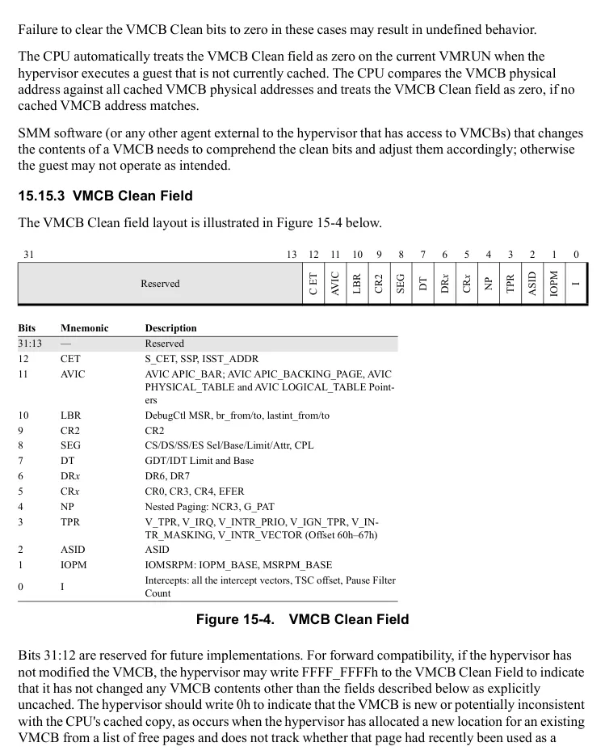

</details>


<!-- PDF source page: 590 | printed page: 528 -->

VMCB for another guest. If any VMCB fields (excluding explicitly uncached fields) have been modified, all clean bits that are undefined (within the scope of the hypervisor) must be cleared to zero.

Bit 31 is a special bit reserved for the host that the CPU will never use for a clean bit.

The following are explicitly not cached and not represented by Clean bits:

- TLB_Control
- Interrupt shadow
- VMCB status fields (Exitcode, EXITINFO1, EXITINFO2, EXITINTINFO, Decode Assist, etc.)
- Event injection
- RFLAGS, RIP, RSP, RAX

<a id="15-16-tlb-control"></a>

## 15.16 TLB Control

TLB entries are tagged with *Address Space Identifier* (ASID) bits to distinguish different guest virtual address spaces when shadow page tables are used, or different guest physical address spaces when nested page tables are used. The VMM can choose a software strategy in which it keeps multiple shadow page tables, and/or multiple nested page tables in processors that support nested paging, up-to-date; the VMM can allocate a different ASID for each shadow or nested page table. This allows switching to a new process in a guest under shadow paging (changing CR3 contents), or to a new guest under nested paging (changing nCR3 contents), without flushing the TLBs. (See Section 15.25 for a complete explanation of nested paging operation.)

With shadow paging, the VMM is responsible for setting up a shadow page table for each guest linear address space that maps it to system physical addresses. These are used as the active page tables in place of the guest OS's page tables. The VMM sets the CR3 field in the guest VMCB to point to the system physical address of the desired shadow page table. The VMM is responsible for updating the shadow page table when the guest changes its page table or paging control state, and the VMM updates the access and dirty bits of the guest page table.

The VMRUN instruction and #VMEXIT write the CR0, CR3, CR4 and EFER registers, but these writes do *not* flush the TLB. The VMM is responsible for explicitly invalidating any guest translations that may be affected by its actions. There are two mechanisms available for this described in the next two sections.

When running with SVM enabled, global page table entries (PTEs) are global only *within* an ASID, not across ASIDs.

**Software Rule.** When the VMM changes a guest’s paging mode by changing entries in the guest’s VMCB, the VMM must ensure that the guest’s TLB entries are flushed from the TLB. The relevant VMCB state includes:

- CR0—PG, WP, CD, NW.
- CR3—Any bit.


<!-- PDF source page: 591 | printed page: 529 -->

- CR4—PGE, PAE, PSE.
- EFER—NXE, LMA, LME.

<a id="15-16-1-tlb-flush"></a>

### 15.16.1 TLB Flush

TLB flush operations function identically whether or not SVM is enabled (e.g., MOV CR3 instruction flushes non-global mappings, whereas MOV CR4 instruction flushes global and non-global mappings). TLB flush operations must not be assumed to affect all ASIDs. If a VMM sets the intercept bit for any guest action that would have flushed the TLB, the #VMEXIT intercept occurs and the TLB is not flushed; it is the VMM's responsibility to flush the TLB appropriately. In implementations that do not provide a way to selectively flush all translations of a single specified ASID, software may effectively flush the guest's TLB entries by allocating a new ASID for the guest and not reusing the old ASID until the entire TLB has been flushed at least once.

The TLB_CONTROL field in the VMCB provides the commands specified by the control byte encodings shown in Table 15-9. The first two commands are available on all processors that support SVM; support for the other commands is optional and is indicated by CPUID Fn8000_000A_EDX[FlushByAsid] = 1.

**Table 15-9. TLB Control Byte Encodings**

| Encoding | Function Definition |
| --- | --- |
| 00h | Do not flush |
| 01h | Flush entire TLB (Should be used only on legacy hardware.) |
| 03h | Flush this guest's TLB entries |
| 07h | Flush this guest's non-global TLB entries |
| Note: All encodings not defined in this table are reserved. | Flush this guest's non-global TLB entries |

When the VMM sets the TLB_CONTROL field to 1, the VMRUN instruction flushes the TLB for all ASIDs, for both global and non-global pages. The VMRUN instruction reads, but does not change, the value of the TLB_CONTROL field.

A MOV CR3 instruction, a task switch that changes CR3, or clearing or setting CR0.PG or bits PGE, PAE, PSE of CR4 affects only the TLB entries belonging to the current ASID, regardless of whether the operation occurred in host or guest mode. The current ASID is 0 when the CPU is not inside a guest context.

All TLB entries belonging to all ASIDs are flushed by SMI, RSM, MTRR modifications, IORR modifications, and access to other system MSRs that affect address translation.

If a hypervisor modifies a nested page table by decreasing permission levels, clearing present bits, or changing address translations and intends to return to the same ASID, it should use either TLB command 011b or 001b.

<details>
<summary>Rendered source page 591 (figures/tables)</summary>

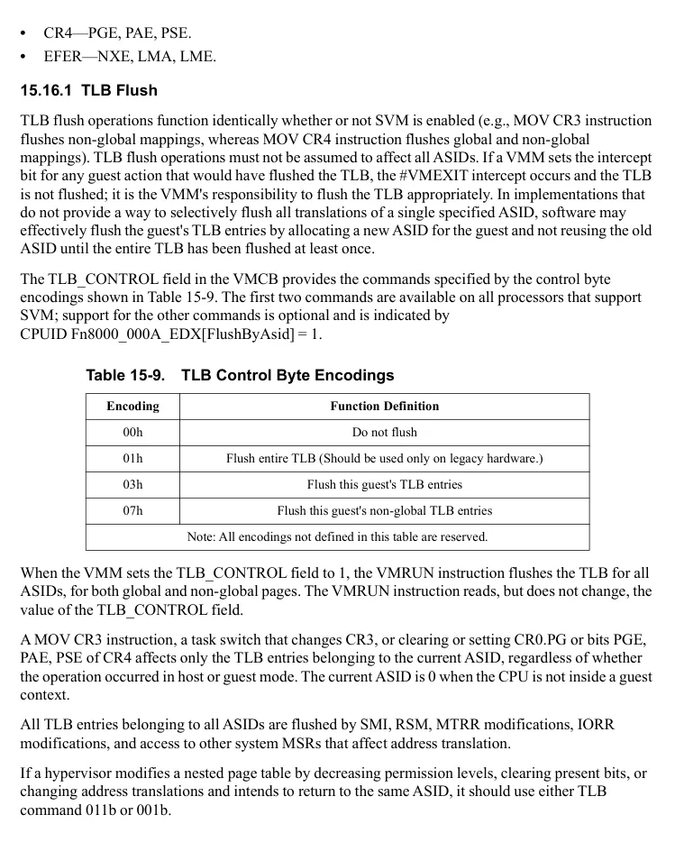

</details>


<!-- PDF source page: 592 | printed page: 530 -->

<a id="15-16-2-invalidate-page-alternate-asid"></a>

### 15.16.2 Invalidate Page, Alternate ASID

The INVLPGA instruction allows the VMM to selectively invalidate the TLB mapping for a given guest virtual page within a given ASID. The linear address is specified in the implicit register operand rAX; the ASID is specified in ECX. The input address is always interpreted as a guest virtual address, so INVLPGA is typically meaningful only when used with shadow page tables; it does not provide a means to invalidate a nested translation by guest physical address.

<a id="15-17-global-interrupt-flag-stgi-and-clgi-instructions"></a>

## 15.17 Global Interrupt Flag, STGI and CLGI Instructions

The global interrupt flag (GIF) is a bit that controls whether interrupts and other events can be taken by the processor. The STGI and CLGI instructions set and clear, respectively, the GIF. Table 15-10 shows how the value of the GIF affects how interrupts and exceptions are handled. Implementations may provide hardware support for virtualizing the GIF in nested virtualization scenarios; see Section 15.33, for details.

**Table 15-10. Effect of the GIF on Interrupt Handling**

| Interrupt source | GIF==0 | GIF ==1 |
| --- | --- | --- |
| Debug exception or trap, due<br>to breakpoint register match | Ignored and discarded | Normal operation |
| Debug trace trap due to<br>EFLAGS.TF | Normal operation | Normal operation |
| RESET | Normal operation | Normal operation |
| INIT | Held pending until GIF==1 | Normal operation, see Table 15-12 |
| NMI | Held pending until GIF==1 | Normal operation, see Table 15-13 |
| External SMI | Held pending until GIF==1 | Normal operation, see Table 15-14 |
| Internal SMI (I/O Trapping) | Ignored and discarded | Normal operation, see Table 15-14 |
| INTR and vINTR | Held pending until GIF==1 | Normal operation |
| #SX (Security Exception) | n/a1 | Normal operation |
| Machine Check | If possible (implementation-<br>dependent), held pending until<br>GIF==1, otherwise shutdown. | Normal operation |
| A20M | Normal operation | Normal operation |
| A20M | (VM CR.DIS A20M controls A20 masking)<br>_ _ | Normal operation |
| Other implementation-<br>specific but non-<br>architecturally-visible<br>interrupts (STPCLK, IGNNE<br>toggle, ECC scrub) | Normal operation | Normal operation |

> Note: 1. #SX is caused only by an INIT signal that has been “redirected” (i.e., converted to an #SX; see Section 15.28); the conversion only happens when GIF==1, as the INIT is simply held pending otherwise.

<details>
<summary>Rendered source page 592 (figures/tables)</summary>

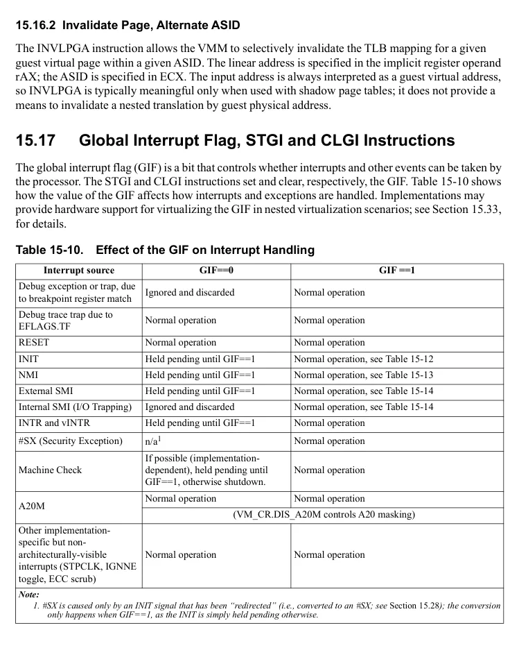

</details>


<!-- PDF source page: 593 | printed page: 531 -->

<a id="15-18-vmmcall-instruction"></a>

## 15.18 VMMCALL Instruction

This instruction is meant as a way for a guest to explicitly call the VMM. No CPL checks are performed, so the VMM can decide whether to make this instruction legal at the user-level or not.

If VMMCALL instruction is not intercepted, the instruction raises a #UD exception.

<a id="15-19-paged-real-mode"></a>

## 15.19 Paged Real Mode

To facilitate virtualization of real mode, the VMRUN instruction may legally load a guest CR0 value with PE = 0 but PG = 1. Likewise, the RSM instruction is permitted to return to paged real mode. This processor mode behaves in every way like real mode, with the exception that paging is applied. The intent is that the VMM run the guest in paged-real mode at CPL0, and with page faults intercepted. The VMM is responsible for setting up a shadow page table that maps guest *physical* memory to the appropriate system physical addresses.

The behavior of running a guest in paged real mode without intercepting page faults to the VMM is undefined.

<a id="15-20-event-injection"></a>

## 15.20 Event Injection

The VMM can inject exceptions or interrupts (collectively referred to as events) into the guest by setting bits in the VMCB’s EVENTINJ field prior to executing the VMRUN instruction. The format of the field is shown in Figure 15-5. The encoding matches that of the EXITINTINFO field. When an event is injected by means of this mechanism, the VMRUN instruction causes the guest to take the specified exception or interrupt unconditionally before executing the first guest instruction.

Injected events are treated in every way as though they had occurred normally in the guest (in particular, they are recorded in EXITINTINFO) with the following exceptions:

- Injected events are not subject to intercept checks. (Note, however, that if secondary exceptions occur during delivery of an injected event, those exceptions *are* subject to exception intercepts.)
- An injected NMI does not block delivery of further NMIs.
- If the VMM attempts to inject an event that is impossible for the guest mode (e.g., a #BR exception when the guest is in 64-bit mode), the event injection will fail and no guest state instructions will be executed; VMRUN will immediately exit with an error code of VMEXIT_INVALID.
- Injecting an exception (TYPE = 3) with vectors 3 or 4 behaves like a trap raised by INT3 and INTO instructions, respectively, in which case the processor checks the DPL of the IDT descriptor before dispatching to the handler.
- Software interrupts cannot be properly injected if the processor does not support the NextRIP field. Support is indicated by CPUID Fn8000_000A_EDX[NRIPS] = 1. Hypervisor software should emulate the event injection of software interrupts if NextRIP is not supported.


<!-- PDF source page: 594 | printed page: 532 -->

- Event injection does not support injection of intercepted #DB faults that are the result of a guest ICEBP instruction. ICEBP does not perform DPL checks, as does INT*n* injection. Hypervisor software should emulate the injection of ICEBP.

**Figure 15-5. EVENTINJ Field in the VMCB**

<details>
<summary>Extracted figure labels</summary>

```text
63
32 31 30
12 11 10
8
7
0
ERRORCODE
V
Reserved, SBZ
EV TYPE
VECTOR
```

</details>

The fields in EVENTINJ are as follows:

- *VECTOR*—Bits 7:0. The 8-bit IDT vector of the interrupt or exception. If TYPE is 2 (NMI), the VECTOR field is ignored.
- *TYPE*—Bits 10:8. Qualifies the guest exception or interrupt to generate. Table 15-11 shows possible values and their corresponding interrupt or exception types. Values not indicated are unused and reserved.

**Table 15-11. Guest Exception or Interrupt Types**

| Value | Type |
| --- | --- |
| 0 | External or virtual interrupt (INTR) |
| 2 | NMI |
| 3 | Exception (fault or trap) |
| 4 | Software interrupt (INTn instruction) |

- *EV (Error Code Valid)*—Bit 11. Set to 1 if the exception should push an error code onto the stack; clear to 0 otherwise.
- *V (Valid)*—Bit 31. Set to 1 if an event is to be injected into the guest; clear to 0 otherwise.

- *ERRORCODE*—Bits 63:32. If EV is set to 1, the error code to be pushed onto the stack, ignored otherwise.

VMRUN exits with VMEXIT_INVALID error code if either:

- Reserved values of TYPE have been specified, or
- TYPE = 3 (exception) has been specified with a vector that does not correspond to an exception (this includes vector 2, which is an NMI, not an exception).

<a id="15-21-interrupt-and-local-apic-support"></a>

## 15.21 Interrupt and Local APIC Support

SVM hardware support is designed to ensure efficient virtualization of interrupts.

<details>
<summary>Rendered source page 594 (figures/tables)</summary>

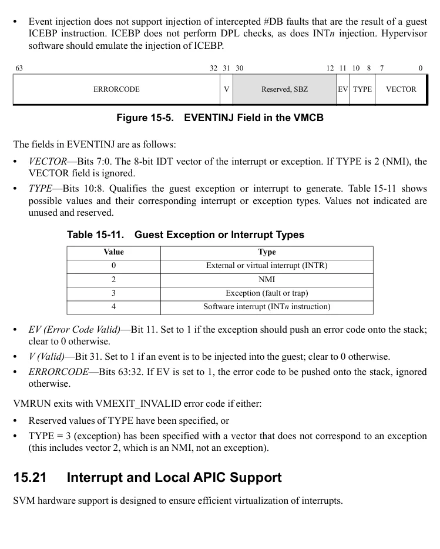

</details>


<!-- PDF source page: 595 | printed page: 533 -->

<a id="15-21-1-physical-intr-interrupt-masking-in-eflags"></a>

### 15.21.1 Physical (INTR) Interrupt Masking in EFLAGS

To prevent the guest from blocking maskable interrupts (INTR), SVM provides a VMCB control bit, V_INTR_MASKING, which changes the operation of EFLAGS.IF and accesses to the TPR by means of the CR8 register. While running a guest with V_INTR_MASKING cleared to zero:

- EFLAGS.IF controls both virtual and physical interrupts.

While running a guest with V_INTR_MASKING set to 1:

- The host EFLAGS.IF at the time of the VMRUN is saved and controls physical interrupts while the guest is running.
- The guest value of EFLAGS.IF controls virtual interrupts only.

<a id="15-21-2-virtualizing-apic-tpr"></a>

### 15.21.2 Virtualizing APIC.TPR

SVM provides a virtual TPR register, V_TPR, for use by the guest; its value is loaded from the VMCB by VMRUN and written back to the VMCB by #VMEXIT. The APIC's TPR always controls the task priority for physical interrupts, and the V_TPR always controls virtual interrupts.

While running a guest with V_INTR_MASKING cleared to 0:

- Writes to CR8 affect both the APIC's TPR and the V_TPR register.
- Reads from CR8 operate as they would without SVM.

While running a guest with V_INTR_MASKING set to 1:

- Writes to CR8 affect only the V_TPR register.
- Reads from CR8 return V_TPR.

<a id="15-21-3-tpr-access-in-32-bit-mode"></a>

### 15.21.3 TPR Access in 32-Bit Mode

The mechanism for TPR virtualization described in Section 15.21.2 applies only to accesses that are performed using the CR8 register. However, in 32-bit mode, the TPR is traditionally accessible only by using a memory-mapped register. Typically, a VMM virtualizes such TPR accesses by not mapping the APIC page addresses in the guest. A guest access to that region then causes a #PF intercept to the VMM, which inspects the guest page tables to determine the physical address and, after recognizing the physical address as belonging to the APIC, finally invokes software emulation code.

To improve the efficiency of TPR accesses in 32-bit mode, SVM makes CR8 available to 32-bit code by means of an alternate encoding of MOV TO/FROM CR8 (namely, MOV TO/FROM CR0 with a LOCK prefix). To achieve better performance, 32-bit guests should be modified to use this access method, instead of the memory-mapped TPR. (For details, see “MOV CRn” on page 377 of the *AMD64 Programmer’s Reference Volume 3: General Purpose and System Instructions*, order# 24594.)

The alternate encodings of the MOV TO/FROM CR8 instructions are available even if SVM is disabled in EFER.SVME. They are available in both 64-bit and 32-bit mode.


<!-- PDF source page: 596 | printed page: 534 -->

<a id="15-21-4-injecting-virtual-intr-interrupts"></a>

### 15.21.4 Injecting Virtual (INTR) Interrupts

Virtual Interrupts allow the host to pass an interrupt (#INTR) to a guest. While inside a guest, the virtual interrupt follows the same rules that a real interrupt follows (virtual #INTR is not taken until EFLAGS.IF is 1, the guest's TPR has enabled interrupts at the same priority as that of the pending virtual interrupt).

SVM provides an efficient mechanism by which the VMM can inject virtual interrupts into a guest:

- As described in Section 15.13.1, the VMM can intercept physical interrupts that arrive while a guest is running, by activating the INTR intercept in the VMCB.
- As described in Section 15.21.4, the VMM can virtualize the interrupt masking logic by setting the V_INTR_MASKING bit in the VMCB.
- The three VMCB fields V_IRQ, V_INTR_PRIO, and V_INTR_VECTOR indicate whether there is a virtual interrupt pending, and, if so, what its vector number and priority are. The VMRUN instruction loads this information into corresponding on-chip registers.
- The processor takes a virtual INTR interrupt if:
- V_IRQ and V_INTR_PRIO indicate that there is a virtual interrupt pending whose priority is greater than the value in V_TPR,
- interrupts are enabled in EFLAGS.IF,
- interrupts are enabled using GIF, and
- the processor is not in an interrupt shadow (see Section 15.21.5). The only other difference between virtual INTR handling and normal interrupt handling is that, in the latter case, the interrupt vector is obtained from the V_INTR_VECTOR register (as opposed to running an INTACK cycle to the local APIC).
- The V_IGN_TPR field in the VMCB can be set to indicate that the currently pending virtual interrupt is not subject to masking by TPR. The priority comparison against V_TPR is omitted in this case. This mechanism can be used to inject ExtINT-type interrupts into the guest.

- When the processor dispatches a virtual interrupt (through the IDT), V_IRQ is cleared after checking for intercepts of virtual interrupts and before the IDT is accessed.
- On #VMEXIT, V_IRQ is written back to the VMCB, allowing the VMM to track whether a virtual interrupt has been taken.
- Physical interrupts take priority over virtual interrupts, whether they are taken directly or through a #VMEXIT.
- On #VMEXIT, the processor clears its internal copies of V_IRQ and V_INTR_MASKING, so virtual interrupts do not remain pending in the VMM, and interrupt control reverts to normal.

<a id="15-21-5-interrupt-shadows"></a>

### 15.21.5 Interrupt Shadows

The x86 architecture defines the notion of an *interrupt shadow*—a single-instruction window during which interrupts are not recognized. For example, the instruction after an STI instruction that sets EFLAGS.IF (from zero to one) does not recognize interrupts or certain debug traps. The VMCB


<!-- PDF source page: 597 | printed page: 535 -->

INTERRUPT_SHADOW field indicates whether the guest is currently in an interrupt shadow. This information is saved on #VMEXIT and loaded on VMRUN.

<a id="15-21-6-virtual-interrupt-intercept"></a>

### 15.21.6 Virtual Interrupt Intercept

When virtualizing interrupt handling, a VMM typically needs only gain control when new interrupts for a guest arrive or are generated, and when the guest issues an EOI (end-of-interrupt). In some circumstances, it may also be necessary for the VMM to gain control at the moment interrupts become enabled in the guest (i.e., just before the guest takes a virtual interrupt). The VMM can do so by enabling the VINTR intercept.

<a id="15-21-7-interrupt-masking-in-local-apic"></a>

### 15.21.7 Interrupt Masking in Local APIC

When guests have direct access to devices, interrupts arriving at the local APIC can usually be dismissed only by the guest that owns the device causing the interrupt. To prevent one guest from blocking other guests’ interrupts (by never processing their own), the VMM can mask pending interrupts in the local APIC, so they do not participate in the prioritization of other interrupts.

SVM introduces the following APIC features:

- A 256-bit IER (interrupt enable) register is added to the local APIC. This register resets to all ones (enabling all 256 vectors). Software can read and write the IER by means of the memory-mapped APIC page.
- Only vectors that are enabled in the IER participate in the APIC computation of the highest-priority pending interrupt.
- The VMM can issue specific end-of-interrupt (EOI) commands to the local APIC, allowing the VMM to clear pending interrupts in any order, rather than always targeting the interrupt with highest-priority.

<a id="15-21-8-init-support"></a>

### 15.21.8 INIT Support

The INIT signal interrupts the processor at the next instruction boundary and causes an unconditional control transfer. INIT reinitializes the control registers, segment registers and GP registers in a manner similar to RESET, but does not alter the contents of most MSRs, caches or numeric coprocessor (x87 or SSE) state, and then transfers control to the same instruction address as RESET (physical address FFFFFFF0h). Unlike RESET, INIT is not expected to be visible to the memory controller, and hence will not trigger automatic clearing of trusted memory pages by memory controller hardware.

To maintain the security of such pages, the VMM can request that INITs be redirected and turned into #SX exceptions by setting the R_INIT bit in the VM_CR MSR (see Section 15.30.1). This allows the VMM to gain control when an INIT is requested and scrub any sensitive context. The VMM may then disable the redirection of INIT and cause the platform to reassert INIT (see the relevant *BIOS and Kernel Developer’s Guide* or *Processor Programming Reference Manual* for details), at which point the processor will respond in the normal manner. The actions initiated by the INIT pin may also be initiated by an incoming APIC INIT interrupt; the mechanisms described here apply in either case. Table 15-12 summarizes the handling of INITs.


<!-- PDF source page: 598 | printed page: 536 -->

**Table 15-12. INIT Handling in Different Operating Modes**

| GIF | INIT Intercept | INIT Redirect | Processor Response to INIT |
| --- | --- | --- | --- |
| 0 | X | X | Hold pending until GIF = 1. |
| 1 | 1 | X | #VMEXIT(INIT), INIT is still pending. |
| 1 | 0 | 0 | Taken normally. |
| 1 | 0 | 1 | #SX, INIT is no longer pending. |

If redirection is enabled without the INIT intercept being enabled, an INIT that asserts during guest execution will result in #SX being asserted within the guest, with the INIT being cleared. The VMM may intercept the assertion of #SX as described in “Intercept Operation” on page 508. Note that when a VMM has intercepted an INIT assertion, it may modify R_INIT any time before setting GIF to control the behavior when GIF is ultimately set, or the VMM may instead return to a guest VM with the intercept disabled and redirection enabled to effectively hand off the INIT to the guest as a #SX exception.

<a id="15-21-9-nmi-support"></a>

### 15.21.9 NMI Support

The VMM can intercept non-maskable interrupts (NMI) using a VMCB control bit (see Table 15-13). When intercepted, NMIs cause an exit from the guest and are held pending.

**Table 15-13. NMI Handling in Different Operating Modes**

| GIF | NMI Intercept | Processor Response to NMI |
| --- | --- | --- |
| 0 | X | Hold pending until GIF=1. |
| 1 | 1 | #VMEXIT(NMI), NMI is still pending. |
| 1 | 0 | Taken normally. |

<a id="15-21-10-nmi-virtualization"></a>

### 15.21.10 NMI Virtualization

NMI Virtualization allows the host to inject an NMI (#NMI) into a guest. While inside a guest, the virtual NMI follows the same rules as a physical NMI. With NMI Virtualization, the processor virtualizes the masking state of NMIs which prevents a guest from taking a second virtual NMI until the execution of an IRET instruction.

NMI Virtualization support is indicated by CPUID Fn8000_000A_EDX[VNMI] = 1.

NMI Virtualization is enabled by setting V_NMI_ENABLE (bit 26 in offset 60h of the VMCB). Enabling NMI Virtualization requires the NMI intercept bit to be set. An attempt to run a guest with V_NMI_ENABLE without the NMI intercept bit set results in #VMEXIT(INVALID). When NMI Virtualization is enabled, NMI intercepts only apply to physical NMIs, not virtual NMIs.

Three new bits are added to the VMCB field at offset 60h to provide NMI virtualization hardware support:

<details>
<summary>Rendered source page 598 (figures/tables)</summary>

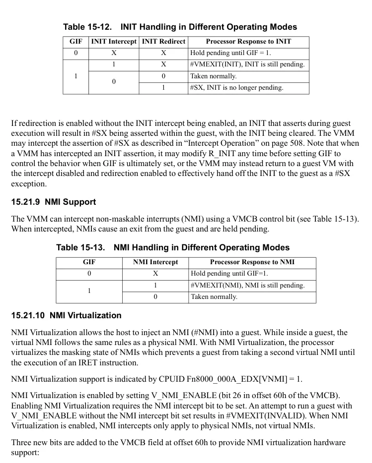

</details>


<!-- PDF source page: 599 | printed page: 537 -->

**V_NMI**: Indicates whether a virtual NMI is pending in the guest. The processor will clear V_NMI once it takes the virtual NMI.

**V_NMI_MASK**: Indicates whether virtual NMIs are masked. The processor will set V_NMI_MASK once it takes the virtual NMI. V_NMI_MASK is cleared when the guest successfully completes an IRET instruction or #VMEXIT occurs while delivering the virtual NMI.

**V_NMI_ENABLE**: Enables NMI virtualization.

SVM provides an efficient mechanism by which the VMM can inject virtual NMI into a guest:

- The VMM can inject NMI into the guest by setting V_NMI_ENABLE and V_NMI in the VMCB.
- When V_NMI_ENABLE is set, VMRUN loads V_NMI and V_NMI_MASK from the VMCB into internal registers.
- The processor takes a virtual NMI if:
- virtual NMIs are not masked,
- interrupts are enabled with GIF,
- virtual interrupts are enabled with VGIF, and
- the processor is not in an interrupt shadow.
- When the processor recognizes a virtual NMI, V_NMI is cleared and V_NMI_MASK is set before the IDT is accessed.
- On #VMEXIT, V_NMI and V_NMI_MASK are written back to the VMCB.
- If a #VMEXIT occurs during the virtual NMI delivery, EXITINTINFO is set appropriately and V_NMI_MASK is saved as 0.
- If Event Injection is used to inject an NMI when NMI Virtualization is enabled, VMRUN sets V_NMI_MASK in the guest state.
- Physical NMI takes priority over virtual NMI.

<a id="15-22-smm-support"></a>

## 15.22 SMM Support

This section describes SVM support for virtualization of System Management Mode (SMM).

<a id="15-22-1-sources-of-smi"></a>

### 15.22.1 Sources of SMI

Various events can cause an assertion of a system management interrupt (SMI); these are classified into three categories

- Internal, synchronous (also known as I/O Trapping)—implementation-specific IOIO or config space trapping in the CPU itself; always synchronous in response to an IN or OUT instruction. I/O Trapping is set up by means of MSRs and can be brought under the control of the VMM by intercepting guest access to those MSRs.
- External, synchronous—IOIO trapping in response to (and synchronous with) IN or OUT instructions, but generated by an external agent (typically the Southbridge).


<!-- PDF source page: 600 | printed page: 538 -->

- External, asynchronous—generated externally in response to an external, physical event, e.g., closing a laptop lid, temperature sensor triggering, etc.

<a id="15-22-2-response-to-smi"></a>

### 15.22.2 Response to SMI

How hardware responds to SMIs is a function of whether SMM interrupts are being intercepted and whether interrupts are enabled globally, as shown in Table 15-14.

**Table 15-14. SMI Handling in Different Operating Modes**

| GIF | Intercept<br>SMI | Internal SMI | External SMI |
| --- | --- | --- | --- |
| 0 | x | Lost. | Hold pending until GIF=1. |
| 1 | 1 | Exit guest,<br>code #VMEXIT(SMI), SMI is not pending. | #VMEXIT(SMI), SMI is still pending. |
| 1 | 0 | Taken normally. | Taken normally. |

By intercepting SMIs, the VMM can gain control before the processor enters SMM.

<a id="15-22-3-containerizing-platform-smm"></a>

### 15.22.3 Containerizing Platform SMM

In some usage scenarios, the VMM may not trust the existing platform SMM code, or may otherwise want to ensure that the SMM does not operate in the context of certain guests or the hypervisor. To address these cases, SVM provides the ability to *containerize* SMM code, i.e., run it inside a guest, with the full protection mechanisms of the VMM in place. In other scenarios, the VMM may not want to exert control over SMM.

There are three solutions for the VMM to control SMM handlers:

- The simplest solution is to not intercept SMI signals. SMIs encountered while in a guest context are taken from within the guest context. In this case, the SMM handler is not subject to any intercepts set up by the VMM and consequently runs outside of the virtualization controls. The state saved in the SMM State-Save area as seen by the SMM handler reflects the state of the guest that had been running at the time the SMI was encountered. When the SMM handler executes the RSM instruction, the processor returns to executing in the guest context, and any modifications to the SMM State-Save area made by the SMM handler are reflected in the guest state.
- A hypervisor may want to emulate all SMI-based I/O interceptions for a guest and to take SMI signals only in the hypervisor context. The hypervisor should set all IOIO intercept bits and the SMI intercept bit for the guest to ensure that there is no possibility of encountering synchronous (internal or external) SMI signals while running the guest. Any #VMEXIT(SMI) encountered is then known to be due to an external, asynchronous SMI. The hypervisor may respond to the #VMEXIT(SMI) by executing the STGI instruction, which causes the pending SMI to be taken immediately. When an SMI due to an I/O instruction is pending, the effect of executing STGI in the hypervisor is undefined. To handle a pending SMI due to an I/O instruction, the hypervisor must either containerize SMM or not intercept SMI.

<details>
<summary>Rendered source page 600 (figures/tables)</summary>

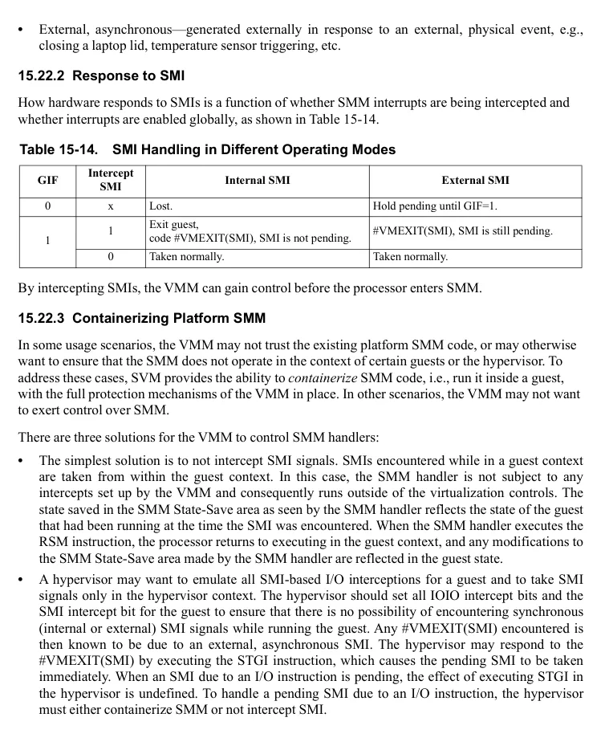

</details>


<!-- PDF source page: 601 | printed page: 539 -->

- The most involved solution is to containerize SMM by placing it in a guest. Containerizing gives the VMM full control over the state that the SMM handler can access.

**Containerizing Platform SMM.** A VMM can containerize SMM by creating its own trusted SMM hypervisor and use that handler to run the platform SMM code in a container. The SMM hypervisor may be the same code as the VMM itself, or may be an entirely different set of code. The trusted SMM hypervisor sets up a guest context to run the platform SMM as a guest. The guest context consists of a VMCB and related state and the guest's (real or virtual) SMM save area. The SMM hypervisor emulates SMM entry, including setup of the SMM save area, and emulates RSM at the end of SMM operation. The guest executes the platform SMM code in paged real mode with appropriate SVM intercepts in place, thus ensuring security.

For this approach to work, the VMM may need to write the SMM_BASE MSR, as well as related SMM control registers. As part of the emulation of SMM entry and RSM, the VMM needs to access the SMM_CTL MSR (see Section 15.30.3). However, these actions conflict with any platform firmware that locks SMM control registers.

A VMM can determine if it is running with a compatible firmware setup by checking the SMMLOCK bit in the HWCR MSR (described in the *BIOS and Kernel Developer’s Guide (BKDG)* or *Processor Programming Reference Manual (PPR)* applicable to your product). If the bit is 1, firmware has locked the SMM control registers and the VMM is unable to move them or insert its own SMM hypervisor.

As the processor physically enters SMM, the SMRAM regions are remapped. The VMM design must ensure that none of its code or data disappears when the SMRAM areas are mapped or unmapped. Also note that the ASEG region of the SMRAM overlaps with a portion of video memory, so the SMM hypervisor should not attempt to write diagnostic messages to the screen. Any attempt by guests to relocate any of the SMRAM areas (by means of certain MSR writes) must also be intercepted to prevent malicious SMM code from interfering with VMM operation.

Writes to the SMM_CTL MSR cause a #GP if firmware has locked the SMM control registers.

<a id="15-23-last-branch-record-virtualization"></a>

## 15.23 Last Branch Record Virtualization

The debug control MSR (DebugCtl) provides control of control-transfer recording and other debug facilities. (See Chapter 13, “Software Debug and Performance Resources,” on page 390, for more information on using the debug control MSR.) Software sets the last-branch record (DebugCtl[LBR]) bit to 1 to cause the processor to record the source and target addresses of the last control transfer taken before a debug exception. These control transfers include branch instructions, interrupts, and exceptions. Recorded information is stored in four MSRs:

- LastBranchFromIP
- LastBranchToIP
- LastIntFromIP
- LastIntToIP


<!-- PDF source page: 602 | printed page: 540 -->

Under SVM, to virtualize the function of these MSRs, the VMM must save the contents of the control-transfer recording MSRs on #VMEXIT and restore them prior to the VMRUN for each guest. If control-transfer recording is to be used in host state as well the values of these registers must be exchanged between values tracked by host and guest.

<a id="15-23-1-hardware-acceleration-for-lbr-virtualization"></a>

### 15.23.1 Hardware Acceleration for LBR Virtualization

Processors optionally support hardware acceleration for LBR virtualization. The following fields are allocated in the VMCB state save area to hold the contents of the DebugCtl and control-transfer recording MSRs:

- DBGCTL—Holds the guest value of the DebugCtl MSR.
- BR_FROM—Holds the guest value of the LastBranchFromIP MSR.
- BR_TO—Holds the guest value of the LastBranchToIP MSR.
- LASTEXCPFROM—Holds the guest value of the LastIntFromIP MSR.
- LASTEXCPTO—Holds the guest value of the LastIntToIPLastIntToIP MSR.

When VMCB.LBR_VIRTUALIZATION_ENABLE is set, VMRUN saves all five host control-transfer MSRs in the host save area, and then loads the same five MSRs for the guest from the VMCB save area. Similarly, #VMEXIT saves the guest's MSRs and loads the host's MSRs to and from their respective save areas.

On processors supporting LBR Stack, VMCB.LBR_VIRTUALIZATION_ENABLE also controls save and restore of the following fields in the VMCB state save area:

- DBGEXNTCTL - Holds the guest value of the DebugExtnCtl MSR.
- LBR_STACK_FROM - Holds the guest value of the LastBranchStackFromIp MSRs
- LBR_STACK_TO - Holds the guest value of the LastBranchStackToIp MSRs
- LBR_SELECT - Holds the guest value of the LastBranchStackSelect MSR.

VMRUN saves the host state and restores the guest state and #VMEXIT saves the guest state and restores the host state of the DebugExtnCtl MSR. VMRUN only restores the guest state and #VMEXIT only saves the guest state of the LastBranchStackFromIp, LastBranchStackToIp and LastBranchStackSelect MSRs. For SEV-ES guests #VMEXIT clears the contents of the LastBranchStackFromIp, LastBranchStackToIp and LastBranchStackSelect MSRs after saving the guest state.

<a id="15-23-2-lbr-virtualization-cpuid-feature-detection"></a>

### 15.23.2 LBR Virtualization CPUID Feature Detection

CPUID Fn8000_000A_EDX[LbrVirt] = 1 indicates support for the LBR virtualization acceleration feature on AMD64 processors. See Section 3.3, “Processor Feature Identification,” on page 71 for more information on using the CPUID instruction.


<!-- PDF source page: 603 | printed page: 541 -->

<a id="15-24-external-access-protection"></a>

## 15.24 External Access Protection

By securing the virtual address translation mechanism, the VMM can restrict guest CPU accesses to memory. However, should the guest have direct access to DMA-capable devices, an additional protection mechanism is required. SVM provides multiple protection domains which can restrict device access to physical memory on a per-page basis. This is accomplished via control logic in the Northbridge’s host bridge which governs any external access port (e.g., PCI or HyperTransport™ technology interfaces).

<a id="15-24-1-device-ids-and-protection-domains"></a>

### 15.24.1 Device IDs and Protection Domains

The Northbridge’s host bridge provides a number of protection domains. Each protection domain has associated with it a device exclusion vector (DEV) that specifies the per-page access rights of devices in that domain. Devices are identified by a HyperTransport™ bus/unitID (device ID) and the host bridge contains a lookup table of fixed size that maps device IDs to a protection domain.

<a id="15-24-2-device-exclusion-vector-dev"></a>

### 15.24.2 Device Exclusion Vector (DEV)

A DEV is a contiguous array of bits in physical memory; each bit in the DEV (in little-endian order) corresponds to one 4-Kbyte page in physical memory.

The physical address of the base of a DEV must be 4-Kbyte-aligned and stored in one of the DEVBASE registers, which are accessed through an indirection mechanism in the DEVCTL PCI Configuration Space function block in the host bridge (see “DEV Control and Status Registers” on page 545). The DEV protection hardware is not operational until enabled by setting a control bit in the DEV Control Register, also in the DEVCTL function block.

The DEV may have to cover part of MMIO space beyond the DRAM. Especially in 64-bit systems, the operating system should map MMIO space starting immediately after the DRAM area and building up, as opposed to starting down from the maximum physical address.

**Host Bridge and Processor DEV Caching.** For improved performance, the host bridge may cache portions of the DEV. Any such cached information can be invalidated by setting the DEV_FLUSH flag in the DEV control register to 1. Software must set this flag after modifying DEV contents to ensure that the protection logic uses the updated values. The host bridge automatically clears this flag when the flush operation completes. After setting this flag, software should monitor it until it has cleared, in order to synchronize DEV updates with subsequent activity.

By default, the host bridge probes the processor caches for the latest data when it accesses the DEV in DRAM. However, it is possible to disable probing by means of the DEV_CR register (“DEV_CR Register” on page 545); this is recommended in the case of unified memory architecture (UMA) graphics systems. If cache probing is disabled, host bridge reads of the DEV will not check processor caches for more recent copies. This requires software on the CPU to map the memory containing the DEV as uncacheable (UC) or write-through (WT). Alternatively, software must perform a CLFLUSH before it can expect a change to the DEV to be visible by the Northbridge (and before software flushes the DEV cache in the host controller).


<!-- PDF source page: 604 | printed page: 542 -->

**Multiprocessor Issues.** Device-originated memory requests are checked against the DEV at the point of entry to the system—the Northbridge to which the device is physically attached. Each Northbridge can have its own set of domains, device-to-domain mappings, and DEV tables (e.g., domain #2 on one node can encompass different devices, and can have different access rights than domain #2 on another node). Thus, the number of protection domains available to software can scale with the number of Northbridges in the system.

<a id="15-24-3-access-checking"></a>

### 15.24.3 Access Checking

**Memory Space Accesses.** When a memory-space read or write request is received on an external host bridge port, the host bridge maps the HyperTransport bus device ID to a protection domain number, which in turn selects the DEV defining the access permissions for the device (see Figure 15-6). The host bridge then checks the memory address against the DEV contents by indexing into the DEV with the PFN portion of the address (bits 39:12). The PFN is used as a bit index within the DEV. If the bit read from the DEV is set to 1, the host bridge inhibits the access by returning all ones for the data for a read request, or suppressing the store operation on a write request. A Master Abort error response will be returned to the requesting device.

Peer-to-peer memory accesses routed up to the host bridge are also subjected to checks against the DEV. Peer-to-peer transfers that may be occurring behind bridges are not checked.

DEV checks are applied before addresses are translated by the GART. The DEV table is never consulted by accesses originating in the CPU.

**I/O Space Accesses.** The host bridge can be configured to reject all I/O space accesses from devices, by setting the IOSPE bit in the DEV_CR control register (see “DEV_CR Register” on page 545). I/O space peer-to-peer transfers behind bridges are not checked.

**Config Space Accesses.** Major aspects of host bridge functionality are configured by means of control registers that are accessed through PCI configuration space. Because this is potentially accessible by means of device peer-to-peer transfers, the host bridge always blocks access to this space from anything other than the CPU.


<!-- PDF source page: 605 | printed page: 543 -->

**Figure 15-6. Host Bridge DMA Checking**

<details>
<summary>Extracted figure labels</summary>

```text
Physical Address
TM
HyperTransport
DEV Cache
Bus/Dev ID
Domain#
Bus/Dev ID
Tagged
to
Domain#
(Zero if No Match)
with
Domain#
DEV_BASE/LIMIT[0]
DEV_BASE/LIMIT[1]
DEV Table
Walker
DEV_BASE/LIMIT[2]
DEV_BASE/LIMIT[3]
```

</details>

<a id="15-24-4-dev-capability-block"></a>

### 15.24.4 DEV Capability Block

The presence of DEV support is indicated through a new PCI capability block. The capability block also provides access to the registers that control operation of the DEV feature.

The DEV capability block in PCI space contains three 32-bit words: the capability header (DEV_HDR), and two registers (DEV_OP and DEV_DATA) which serve as an indirection mechanism for accessing the actual DEV control and status registers.

**Table 15-15. DEV Capability Block, Overall Layout**

| Byte Offset | Registe | Comments |
| --- | --- | --- |
| 0 | DEV HDR | Capability block heade |
| 4 | DEV OP | Selects control/status register to access |
| 8 | DEV DATA | Read/write to access register selected in DEV OP |

**DEV Capability Header.** The DEV capability header (DEV_HDR) is defined in Table 15-16.

<details>
<summary>Rendered source page 605 (figures/tables)</summary>

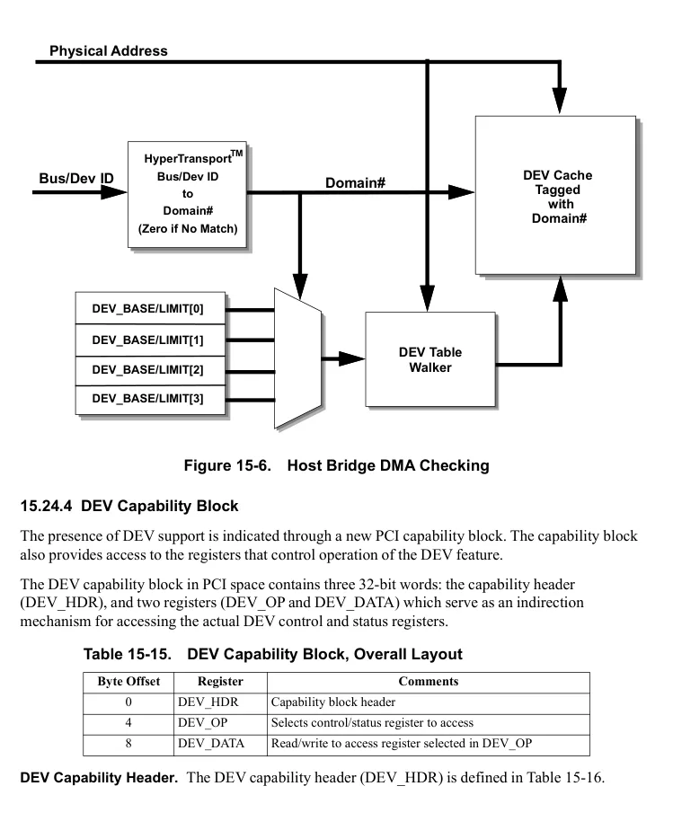

</details>


<!-- PDF source page: 606 | printed page: 544 -->

**Table 15-16. DEV Capability Header (DEV_HDR) (in PCI Config Space)**

| Bit(s) | Definition |
| --- | --- |
| 31:22 | Reserved, MBZ |
| 21 | Interrupt Reporting Capability |
| 20 | Machine Check Exception Reporting Capability |
| 19 | Reserved, MBZ |
| 18:16 | DEV Capability Block Type; hardwired to 000b. |
| 15:8 | PCI Capability pointer; points to next capability in list |
| 7:0 | PCI Capability ID; hardwired to 0x0F |

<a id="15-24-5-dev-register-access-mechanism"></a>

### 15.24.5 DEV Register Access Mechanism

The Northbridge’s DEV control and status registers are accessed through an indirection mechanism: writing the DEV_OP register selects which internal register is to be accessed, and the DEV_DATA register can be read or written to access the selected register.

Figure 15-7 shows the format of the DEV_OP register. The DEV_DATA register reflects the format of the DEV register selected in DEV_OP.

**Figure 15-7. Format of DEV_OP Register (in PCI Config Space)**

<details>
<summary>Extracted figure labels</summary>

```text
31
16
15
8
7
0
Reserved, MBZ
FUNCTION
INDEX
```

</details>

The FUNCTION field in the DEV_OP register selects the function/register to read or write according to the encoding in Table 15-17; for blocks of registers that have multiple instances (e.g., multiple DEV_BASE_HI/LO registers), the INDEX field selects the instance; otherwise it is ignored.

**Table 15-17. Encoding of Function Field in DEV_OP Register**

| Function Code | Register Type | Number of Instances |
| --- | --- | --- |
| 0 | DEV BASE LO<br>_ _ | multiple |
| 1 | DEV BASE HI<br>_ _ | multiple |
| 2 | DEV MAP | multiple |
| 3 | DEV CAP | single |
| 4 | DEV CR | single |
| 5 | DEV ERR STATUS<br>_ _ | single |
| 6 | DEV ERR ADDR LO<br>_ _ _ | single |
| 7 | DEV ERR ADDR HI<br>_ _ _ | single |

<details>
<summary>Rendered source page 606 (figures/tables)</summary>

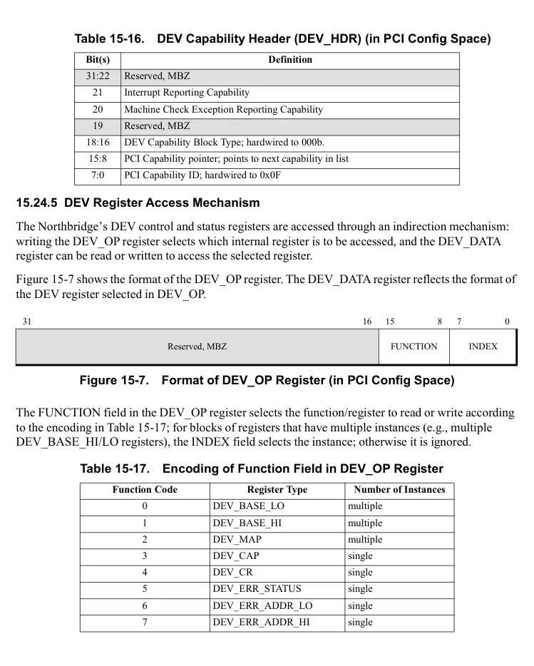

</details>


<!-- PDF source page: 607 | printed page: 545 -->

For example, to write the DEV_BASE_HI register for protection domain number 2, software sets DEV_OP.FUNCTION to 1, and DEV_OP.INDEX to 2, and then writes the desired 32-bit value into DEV_DATA. As the DEV_OP and DEV_DATA registers are accessed through PCI config space (ports 0CF8h–0CFFh), they may be secured from unauthorized access by software executing on the processor by appropriate settings in the SVM I/O protection bitmap. These registers are also protected by the host bridge from external access as described in “Config Space Accesses” on page 542.

<a id="15-24-6-dev-control-and-status-registers"></a>

### 15.24.6 DEV Control and Status Registers

The DEV control and status registers are accessible by means of the indirection mechanism; these registers are *not* directly visible in PCI config space.

**DEV_CAP Register.** Read-only register; holds implementation specific information: the number of protection domains supported, the number of DEV_MAP registers (which map device/unit IDs to domain numbers), and the revision ID.

**Figure 15-8. Format of DEV_CAP Register (in PCI Config Space)**

<details>
<summary>Extracted figure labels</summary>

```text
31
24
23
16
15
8
7
0
Reserved, RAZ
N_MAPS
N_DOMAINS
REVISION
```

</details>

The initial implementation provide four domains and three map registers.

**DEV_CR Register.** This is the main control register for the DEV mechanism; it is cleared to zero by RESET.

**Table 15-18. DEV_CR Control Register**

| Bit(s) | Definition |
| --- | --- |
| 31:7 | Reserved, MBZ |
| 6 | DEV table walk probe disable.<br>0 = Use probe on DEV walk; 1 = Do not use probe |
| 5 | SL DEV EN. Enable bit for limited memory protection, see Section 15.24.8 on<br>_ _<br>page 547. Set to “1” by SKINIT instruction, can be cleared by software. |
| 4 | Invalidate DEV cache. Software must set this bit to 1 to invalidate the DEV cache;<br>cleared by hardware when invalidation is complete. |
| 3 | Enable MCE reporting.<br>0 = Do not generate MCE; 1 = Generate MCE on errors. |
| 2 | I/O space protection enable (IOSPEN)<br>0 = Allow upstream I/O cycles; 1 = Block. |
| 1 | Memory clear disable. If non-zero, memory-clearing on reset is disabled.<br>This bit is not writable until the memory is enabled. |
| 0 | DEV global enable bit. If zero, DEV protection is turned off. |

<details>
<summary>Rendered source page 607 (figures/tables)</summary>

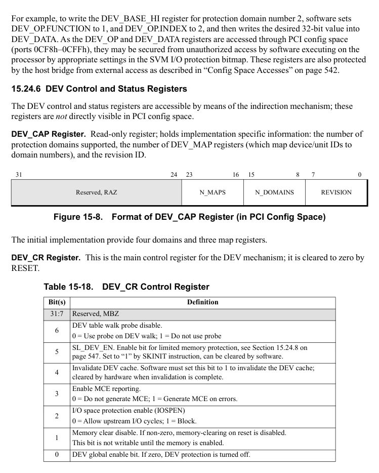

</details>


<!-- PDF source page: 608 | printed page: 546 -->

**DEV_BASE Address/Limit Registers.** The DEV base address registers (one set per domain) each point to the physical address of a DEV table corresponding to a protection domain. The address and size are encoded in a pair (high/low) of 32-bit registers. The N_DOMAINS field in DEV_CAP indicates how many (pairs of) DEV_BASE registers are implemented. The register format is as shown in Figures 15-9 and 15-10.

**Figure 15-9. Format of DEV_BASE_HI[n] Registers**

<details>
<summary>Extracted figure labels</summary>

```text
31
8
7
0
Reserved, MBZ
BASEADDRESS[39:32]
```

</details>

**Figure 15-10. Format of DEV_BASE_LO[n] Registers**

<details>
<summary>Extracted figure labels</summary>

```text
31
12 11
7
6
2
1
0
BASEADDRESS[31:12]
Reserved, MBZ
SIZE
P
V
```

</details>

Fields of the DEV_BASE_HI and DEV_BASE_LO registers are defined as follows:

- *Valid (V)*—Bit 0. Indicates whether a DEV table has been defined for the given protection domain; if this bit is clear, software can leave the other fields undefined, and no protection checks are performed for memory references in this domain.
- *Protect (P)*—Bit 1. Indicates whether accesses to addresses beyond the address range covered by the DEV are legal (P=0) or illegal (P=1).
- *SIZE*—Bits 6:2. Specifies how much memory the DEV covers, expressed increments of 4GB * 2size. In other words, a DEV table covers a minimum of 4GB, and can expand by powers of two.

**DEV_MAP Registers.** The DEV_MAP registers assign protection domain numbers to device-originated requests by matching the device ID (HT bus and unit number) associated with the request against bus and unit numbers in the registers. If no match is found in any of the registers, a domain number of zero is returned. The number of DEV_MAP registers implemented by the chip is indicated by the N_MAPS field in DEV_CAP.

The format of the DEV_MAP registers is shown in Figure 15-11.

**Figure 15-11. Format of DEV_MAP[n] Registers**

<details>
<summary>Extracted figure labels</summary>

```text
31
26 25
20 19
12 11 10
6
5
4
0
DOM1
DOM0
BUSNO
V1
UNIT1
V0
UNIT0
```

</details>

<details>
<summary>Rendered source page 608 (figures/tables)</summary>

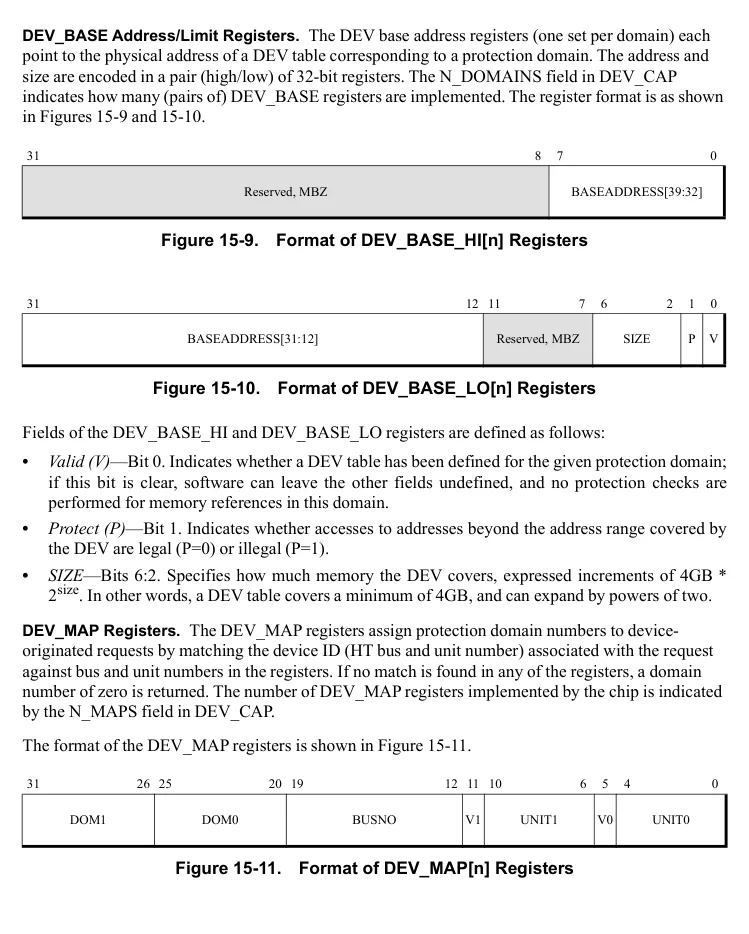

</details>


<!-- PDF source page: 609 | printed page: 547 -->

The fields of the DEV_MAP[*n*] registers are defined as follows:

- UNIT0—Bits 4:0. Specifies the first of two HyperTransport link unit numbers on the bus number specified by the BUSNO field.
- V0—Bit 5. Indicates whether UNIT0 is valid (no matches occur on invalid entries).
- UNIT1—Bits 10:6. Specifies the second of two HyperTransport link unit numbers on the bus number specified by the BUSNO field.
- V1—Bit 11. Indicates whether UNIT1 is valid (no matches occur on invalid entries).
- BUSNO—Bits 19:12. Specifies a HyperTransport link bus number.
- DOM0—Bits 25:20. Specifies the protection domain for the first HyperTransport link unit.
- DOM1—Bits 31:26. Specifies the protection domain for the second HyperTransport link unit.

<a id="15-24-7-unauthorized-access-logging"></a>

### 15.24.7 Unauthorized Access Logging

Any attempted unauthorized access by devices to DEV-protected memory is logged by the host bridge in the DEV_Error_Status and DEV_Error_Address registers for possible inspection by the VMM.

<a id="15-24-8-secure-initialization-support"></a>

### 15.24.8 Secure Initialization Support

The host bridge contains additional logic that operates in conjunction with the SKINIT instruction to provide a limited form of memory protection during the secure startup protocol. This provides protection for a Secure Loader image in memory, allowing it to, among other things, set up full DEV protection. (See Section 15.27 for detailed operation of SKINIT.)

The host bridge logic includes a hidden (not accessible to software) SL_DEV_BASE address register. SL_DEV_BASE points to a 64KB-aligned 64KB region of physical memory. When SL_DEV_EN is 1, the 64KB region defined by SL_DEV_BASE is protected from external access (as if it were protected by the DEV), as well as from any access (both CPU and external accesses) via GART-translated addresses. Additionally, the SL_DEV mechanism, when enabled, blocks all device accesses to PCI Configuration space.

<a id="15-25-nested-paging"></a>

## 15.25 Nested Paging

The optional SVM nested paging feature provides for two levels of address translation, thus eliminating the need for the VMM to maintain shadow page tables.

<a id="15-25-1-traditional-paging-versus-nested-paging"></a>

### 15.25.1 Traditional Paging versus Nested Paging

Figure 15-12 shows how a page in the linear address space is mapped to a page in the physical address space in traditional (single-level) address translation. Control register CR3 contains the physical address of the base of the page tables (PT, represented by the shaded box in the figure), which governs the address translation.


<!-- PDF source page: 610 | printed page: 548 -->

**Figure 15-12. Address Translation with Traditional Paging**

<details>
<summary>Extracted figure labels</summary>

```text
0
Linear Space
CR3
0
PT
```

</details>

With nested paging enabled, *two* levels of address translation are applied; refer to Figure 15-13 below.

- Both guest and host levels have their own copy of CR3, referred to as gCR3 and nCR3, respectively.
- Guest page tables (gPT) map guest linear addresses to guest physical addresses. The guest page tables are in guest physical memory, and are pointed to by gCR3.
- Nested page tables (nPT) map guest physical addresses to system physical addresses. The nested page tables are in system physical memory, and are pointed to by nCR3.
- The most-recently used translations from guest linear to system physical address are cached in the TLB and used on subsequent guest accesses.

It is important to note that gCR3 and the guest page table entries contain guest physical addresses, not system physical addresses. Hence, before accessing a guest page table entry, the table walker first translates that entry’s guest physical address into a system physical address.

<details>
<summary>Rendered source page 610 (figures/tables)</summary>

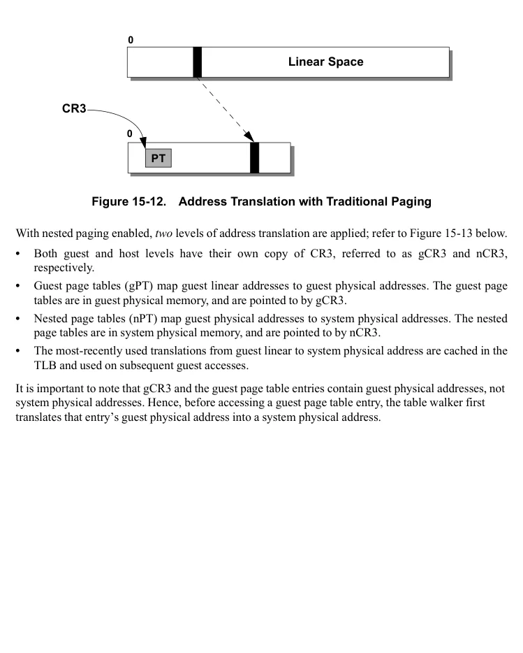

</details>


<!-- PDF source page: 611 | printed page: 549 -->

**Figure 15-13. Address Translation with Nested Paging**

<details>
<summary>Extracted figure labels</summary>

```text
0
Guest Linear
paged by
gCR3
0
Guest Physical
gPT
0
paged by
nCR3
paged by
nCR3
TLB Entry
VMM
Host Linear
nCR3
paged by
the VMM’s CR3
CR3 (used by VMM)
0
System Physical
PT
nPT
gPT
```

</details>

The VMM can give each guest a different ASID, so that TLB entries from different guests can coexist in the TLB. The ASID value of zero is reserved for the host; if the VMM attempts to execute VMRUN with a guest ASID of zero, the result is #VMEXIT(VMEXIT_INVALID). Note that because an ASID is associated with the guest's physical address space, it is common across all of the guest's virtual address spaces within a processor. This differs from shadow page tables where ASIDs tag individual guest virtual address spaces. Note also that the same ASID may or may not be associated with the same address space across all processors in a multiprocessor system, for either nested tables or shadow tables; this depends on how the VMM manages ASID assignment.

<a id="15-25-2-replicated-state"></a>

### 15.25.2 Replicated State

Most processor state affecting paging is replicated for host and guest. This includes the paging registers CR0, CR3, CR4, EFER and PAT. CR2 is not replicated but is loaded by VMRUN. The MTRRs are not replicated.

While nested paging is enabled, all (guest) references to the state of the paging registers by x86 code (MOV to/from CR*n*, etc.) read and write the guest copy of the registers; the VMM's versions of the registers are untouched and continue to control the second level translations from guest physical to system physical addresses. In contrast, when nested paging is disabled, the VMM's paging control registers are stored in the host state save area and the paging control registers from the guest VMCB are the only active versions of those registers.

<details>
<summary>Rendered source page 611 (figures/tables)</summary>

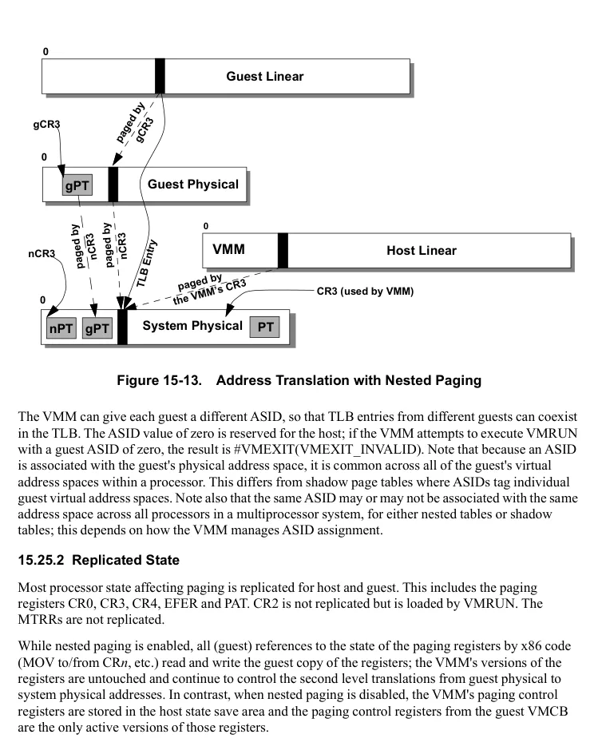

</details>


<!-- PDF source page: 612 | printed page: 550 -->

<a id="15-25-3-enabling-nested-paging"></a>

### 15.25.3 Enabling Nested Paging

The VMRUN instruction enables nested paging when the NP_ENABLE bit in the VMCB is set to 1. The VMCB contains the hCR3 value for the page tables for the extra translation. The extra translation uses the same paging mode as the VMM used when it executed the most recent VMRUN.

Nested paging is automatically disabled by #VMEXIT.

Nested paging is allowed only if the host has paging enabled. Support for nested paging is indicated by CPUID Fn8000_000A_EDX[NP] = 1. If VMRUN is executed with hCR0.PG cleared to zero and NP_ENABLE set to 1, VMRUN terminates with #VMEXIT(VMEXIT_INVALID). See Section 3.3, “Processor Feature Identification,” on page 71 for more information on using the CPUID instruction.

<a id="15-25-4-nested-paging-and-vmrun-vmexit"></a>

### 15.25.4 Nested Paging and VMRUN/#VMEXIT

When VMRUN is executed with nested paging enabled (NP_ENABLE = 1), the paging registers are affected as follows:

- VMRUN saves the VMM’s CR3 in the host save area.
- VMRUN loads the guest paging state from the guest VMCB into the guest registers (i.e., VMRUN loads CR3 with the VMCB CR3 field, etc.). The guest PAT register is loaded from G_PAT field in the VMCB.
- VMRUN loads nCR3, the version of CR3 to be used while the nested-paging guest is running, from the N_CR3 field in the VMCB. The other host paging-control bits (hCR4.PAE, etc.) remain the same as they were in the VMM at the time VMRUN was executed.

When VMRUN is executed with nested paging enabled (NP_ENABLE = 1), the following conditions are considered illegal state combinations, in addition to those mentioned in “Canonicalization and Consistency Checks” on page 504:

- Any MBZ bit of nCR3 is set.
- Any G_PAT.PA field has an unsupported type encoding or any reserved field in G_PAT has a non-zero value. (See Section 7.8.1, “PAT Register,” on page 227.)

When #VMEXIT occurs with nested paging enabled:

- #VMEXIT writes the guest paging state (gCR3, gCR0, etc.) back into the VMCB. nCR3 is not saved back into the VMCB.
- #VMEXIT need not reload any host paging state other than CR3 from the host save area, though an implementation is free to do so.

<a id="15-25-5-nested-table-walk"></a>

### 15.25.5 Nested Table Walk

When the guest is running with nested paging enabled, a TLB miss causes several nested table walks:

- Guest Page Tables—the gCR3 register specifies a guest physical address, as do the entries in the guest's page tables. These guest physical addresses must be translated to system physical addresses


<!-- PDF source page: 613 | printed page: 551 -->

using the nested page tables. Nested page table level faults can occur on these accesses, including write faults due to setting of accessed and dirty bits in the guest page table. **•** Final Guest-Physical Page—once a guest linear to guest physical mapping is known, guest permissions can be checked. If the guest page tables allow the access, the guest physical address is walked in the nested page tables to find the system physical address.

Unless Read Only Guest Page Tables is enabled for a guest, table walks for guest page tables are always treated as user writes at the nested page table level. For this reason,

- the page must be writable by user at the nested page table level, or else a #VMEXIT(NPF) is raised, and
- the dirty and accessed bits are always set in the nested page table entries that were touched during nested page table walks for guest page table entries.

A table walk for the guest page itself is always treated as a user access at the nested page table level, but is treated as a data read, data write, or code read, depending on the guest access.

CPUID Fn8000000A_EDX[ROGPT] (bit 21) = 1 indicates support for Read Only Guest Page Tables. Read Only Guest Page Tables is enabled for a guest by setting VMCB bit 6 at offset 90h. When Read Only Guest Page Tables is enabled, guest page table accesses are treated as writes at the nested page table level only when an access or dirty bit update in a guest page table is required, thus allowing a hypervisor to map guest page tables into read-only nested pages.

If the guest has paging disabled (gCR0.PG = 0), there are no guest page table entries to be translated in the nested page tables. In this case, the final guest-physical address is equal to the guest-linear address, and is still translated in the nested page tables.

<a id="15-25-6-nested-versus-guest-page-faults-fault-ordering"></a>

### 15.25.6 Nested versus Guest Page Faults, Fault Ordering

In nested paging, page faults can be raised at either the guest or nested page table level. Nested walks proceed in the following order; faults are generated in the same order:

1. 1. Walk the guest page table entries in the nested page table. Dirty/Accessed bits are set as needed in the nested page table. Any nested page table faults result in #VMEXIT(NPF).

1. 2. As the guest page table walk proceeds from the top of the page table to the last entry, any not-present entries or reserved bits in the guest page table entries at each level of the guest walk cause #PF in the guest. Guest dirty and accessed bits are set as needed in the guest page tables during the walk. Steps 1 and 2 are repeated for each level of the guest page table that is traversed.

1. 3. Once the guest physical address for the guest access has been determined, check the guest permissions; any fault at this point causes a #PF in the guest.

1. 4. Perform the final translation from guest physical to system physical using the nested page table; any fault during this translation results in a #VMEXIT(NPF).

Nested page faults are entirely a function of the nested page table and VMM processor mode. Nested faults cause a #VMEXIT(NPF) to the VMM. The faulting guest physical address is saved in the VMCB's EXITINFO2 field; EXITINFO1 delivers an error code similar to a #PF error code:


<!-- PDF source page: 614 | printed page: 552 -->

- Bit 0 (P)—cleared to 0 if the nested page was not present, 1 otherwise
- Bit 1 (RW)—set to 1 if the nested page table level access was a write. Note that host table walks for guest page tables are always treated as data writes.
- Bit 2 (US)—set to 1 if the nested page table level access was a user access. Note that nested page table accesses performed by the MMU are treated as user accesses unless there are features enabled that override this.
- Bit 3 (RSV)—set to 1 if reserved bits were set in the corresponding nested page table entry
- Bit 4 (ID)—set to 1 if the nested page table level access was a code read. Note that nested table walks for guest page tables are always treated as data writes, even if the access itself is a code read
- Bit 6 (SS) - set to 1 if the fault was caused by a shadow stack access.

In addition, the VMCB contents for nested page faults indicate whether the page fault was encountered during the nested page table walk for a guest page TLB entry, or for the final nested walk for the guest physical address, as indicated by EXITINFO1[33:32]:

- Bit 32—set to 1 if nested page fault occurred while translating the guest’s final physical address
- Bit 33—set to 1 if nested page fault occurred while translating the guest page tables
- Bit 37—set to 1 if the page was marked as a supervisor shadow stack page in the leaf node of the nested page table and the shadow stack check feature is enabled in VMCB offset 90h.

Guest faults are entirely a function of the guest page tables and processor mode; they are delivered to the guest as normal #PF exceptions without any VMM intervention, unless the VMM is intercepting guest #PF exceptions. Bits 32 and 33 of EXITINFO1 are written during nested page faults to indicate whether the page fault was encountered during the nested page table walk for a guest page table's table entries, or if the fault was encountered during the nested page table walk for the translation of the final guest physical address.

See Section 15.36.10, “RMP and VMPL Access Checks,” on page 608 for additional #VMEXIT(NPF) EXITINFO1 field definitions.

The processor may provide additional instruction decode assist information. See Section 15.10.

<a id="15-25-7-combining-nested-and-guest-attributes"></a>

### 15.25.7 Combining Nested and Guest Attributes

Any access to guest physical memory is subjected to a permission check by examining the mapping of the guest physical address in the nested page table.

A page is considered writable by the guest only if it is marked writable at both the guest and nested page table levels. Note that the guest’s gCR0.WP affects only the interpretation of the guest page table entry; setting gCR0.WP cannot make a page writable at any CPL in the guest, if the page is marked read-only in the nested page table. The host hCR0.WP bit is ignored under nested paging.

A page is considered executable by the guest only if it is marked executable at both the guest and nested page table levels. If the EFER.NXE bit is cleared for the guest, all guest pages are executable at


<!-- PDF source page: 615 | printed page: 553 -->

the guest level. Similarly, if the EFER.NXE bit is cleared for the host, all nested page table mappings are executable at the underlying nested level.

Some attributes are taken from the guest page tables and operating modes only. A page is considered global within the guest only if is marked global in the guest page tables; the nested page table entry and host hCR4.PGE are irrelevant. Global pages are only global within their ASID.

A page is considered user in the guest only if it is marked as user at the guest level. The page must be marked user in the nested page table to allow any guest access at all.

<a id="15-25-8-combining-memory-types-mtrrs"></a>

### 15.25.8 Combining Memory Types, MTRRs

When nested paging is disabled, the processor behaves as though there is no gPAT register.

The host PAT MSR determines memory type attributes for the current VM, and guest writes to the PAT MSR that aren't intercepted by the VMM will alter the host PAT MSR. The hypervisor is responsible for context-switching the PAT MSR contents on world switches between VMs.

When nested paging is enabled, the processor combines guest and nested page table memory types. Registers that affect memory types include:

- The PCD/PWT/PAT*i* bits in the nested and guest page table entries.
- The PCD/PWT bits in the nested CR3 and guest CR3 registers.
- The guest PAT type (obtained by appropriately indexing the gPAT register).
- The host PAT type (obtained by appropriately indexing the host’s PAT register).
- The MTRRs (which are referenced based only on system physical address).
- gCR0.CD and hCR0.CD.

Note that there is no hardware support for guest MTRRs; the VMM can simulate their effect by altering the memory types in the nested page tables. Note that the MTRRs are only applied to system physical addresses.

The rules for combining memory types when constructing a guest TLB entry are:

- Nested and guest PAT types are combined according to Table 15-19, producing a “combined PAT type.”
- Combined PAT type is further combined with the MTRR type according to Table 15-20, where the relevant MTRRs are determined by the system physical address.
- Either gCR0.CD or hCR0.CD can disable caching.

**Memory Consistency Issues.** Because the guest uses extra fields to determine the memory type, the VMM may use a different memory type to access a given piece of memory than does the guest. If one access is cacheable and the other is not, the VMM and guest could observe different memory images, which is undesirable. (MP systems are particularly sensitive to this problem when the VMM desires to migrate a virtual processor from one physical processor to another.)


<!-- PDF source page: 616 | printed page: 554 -->

To address this issue, the following mechanisms are provided:

- VMRUN and #VMEXIT flush the write combiners. This ensures that all writes to WC memory by the guest are visible to the host (or vice-versa) regardless of memory type. (It does not ensure that cacheable writes by one agent are properly observed by WC reads or writes by the other agent.)
- A new memory type *WC+* is introduced. WC+ is an uncacheable memory type, and combines writes in write-combining buffers like WC. Unlike WC (but like the CD memory type), accesses to WC+ memory also snoop the caches on all processors (including self-snooping the caches of the processor issuing the request) to maintain coherency. This ensures that cacheable writes are observed by WC+ accesses.
- When combining nested and guest memory types that are incompatible with respect to caching, the WC+ memory type is used instead of WC (and Table 15-20 ensures that the snooping behavior is retained regardless of the host MTRR settings). Refer to Table 15-19 or details.

Table 15-19 shows how guest and host PAT types are combined into an effective PAT type. When interpreting this table, recall (a) that guest and host PAT types are not combined when nested paging is disabled and (b) that the intent is for the VMM to use its PAT type to simulate guest MTRRs.

**Table 15-19. Combining Guest and Host PAT Types**

| Column 1 | Column 2 | Host PAT Type / UC | Host PAT Type / UC– | Host PAT Type / WC | Host PAT Type / WP | Host PAT Type / WT | Host PAT Type / WB |
| --- | --- | --- | --- | --- | --- | --- | --- |
| Guest PAT Type | UC | UC | UC | UC | UC | UC | UC |
| Guest PAT Type | UC– | UC | UC– | WC | UC | UC | UC |
| Guest PAT Type | WC | WC | WC | WC | WC+ | WC+ | WC+ |
| Guest PAT Type | WP | UC | UC | UC | WP | UC | WP |
| Guest PAT Type | WT | UC | UC | UC | UC | WT | WT |
| Guest PAT Type | WB | UC | UC | WC | WP | WT | WB |

The existing AMD64 table that defines how PAT types are combined with the physical MTRRs is extended to handle CD and WC+ PAT types as shown in Table 15-20.

**Table 15-20. Combining PAT and MTRR Types**

| Column 1 | Column 2 | MTRR Type / UC | MTRR Type / WC | MTRR Type / WP | MTRR Type / WT | MTRR Type / WB |
| --- | --- | --- | --- | --- | --- | --- |
| Effective PAT Type | UC | UC | CD | CD | CD | CD |
| Effective PAT Type | UC– | UC | WC | CD | CD | CD |
| Effective PAT Type | WC | WC | WC | WC | WC | WC |
| Effective PAT Type | WC+ | WC | WC | WC+ | WC+ | WC+ |
| Effective PAT Type | WP | UC | CD | WP | CD | WP |
| Effective PAT Type | WT | UC | CD | CD | WT | WT |
| Effective PAT Type | WB | UC | WC | WP | WT | WB |

<details>
<summary>Rendered source page 616 (figures/tables)</summary>

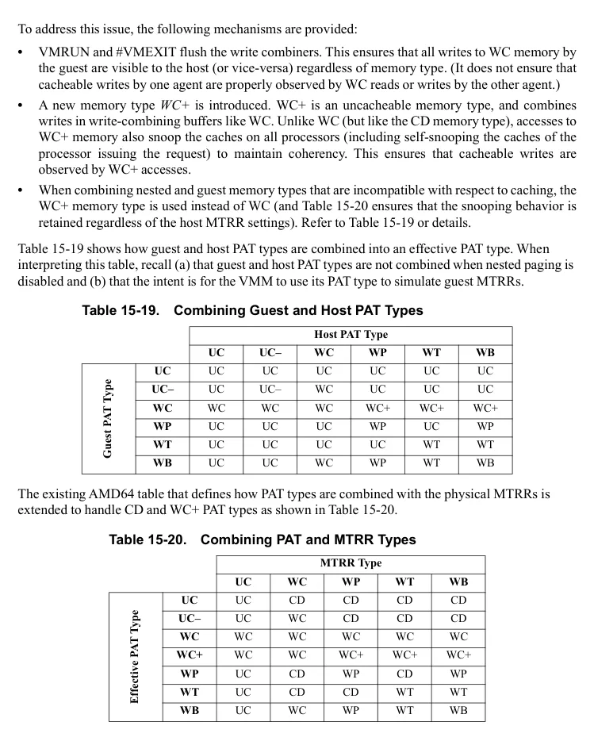

</details>


<!-- PDF source page: 617 | printed page: 555 -->

<a id="15-25-9-page-splintering"></a>

### 15.25.9 Page Splintering

When an address is mapped by guest and nested page table entries with different page sizes, the TLB entry that is created matches the size of the smaller page.

<a id="15-25-10-legacy-pae-mode"></a>

### 15.25.10 Legacy PAE Mode

The behavior of PAE mode in a nested-paging guest differs slightly from the behavior of (host-only) legacy PAE mode, in that the guest’s four PDPEs are not loaded into the processor at the time CR3 is written. Instead, the PDPEs are accessed on demand as part of a table walk. This has the side-effect that illegal bit combinations in the PDPEs are not signaled at the time that CR3 is written, but instead when the faulty PDPE is accessed as part of a table walk.

This means that an operating system cannot rely on the behavior when the in-memory PDPEs are different than the in-processor copy.

<a id="15-25-11-a20-masking"></a>

### 15.25.11 A20 Masking

There is no provision for applying A20 masking to guest physical addresses; the VMM can emulate A20 masking by changing the nested page mappings accordingly.

<a id="15-25-12-detecting-nested-paging-support"></a>

### 15.25.12 Detecting Nested Paging Support

Nested Paging is an optional feature of SVM and is not available in all implementations of SVM-capable processors. The CPUID instruction should be used to detect nested paging support on a particular processor. See Section 3.3, “Processor Feature Identification,” on page 71 for more information on using the CPUID instruction.

<a id="15-25-13-guest-mode-execute-trap-extension"></a>

### 15.25.13 Guest Mode Execute Trap Extension

The Guest Mode Execute Trap (GMET) extension allows a hypervisor to cause nested page faults on attempts by a guest to execute code at CPL0, 1 or 2 from pages designated by the hypervisor. The presence of the GMET extension is indicated by CPUID Fn8000_000A EDX[17]=1. The GMET mode is selected for a targeted guest by setting bit 3 of VMCB offset 090h to 1. For processors that don’t support GMET this bit is ignored.

On GMET capable processors, when this bit is set to 1 on a VMRUN, the processor changes how the U/S bit in the nested page table is interpreted. The NX bit still prohibits execution of code at any privilege level when set to 1. However, with GMET enabled and the effective NX bit =0, if the effective U/S bit =1 and the page is being accessed for execution at CPL0, 1 or 2, a nested page fault #VMEXIT(NPF) is generated. If the effective NX bit =0 and the effective U/S bit =0 then the


<!-- PDF source page: 618 | printed page: 556 -->

translation is allowed for the code page. The following table summarizes the behavior when GMET is enabled.

**Table 15-21. GMET Page Configuration**

| nPT NX Bit | nPT U/S Bit | Guest<br>User-Mode Code | Guest<br>Supervisor-Mode Code |
| --- | --- | --- | --- |
| 1 | X | No Execute | No Execute |
| 0 | 1 | Execute | No Execute |
| 0 | 0 | Execute | Execute |

The EXITINFO1 field for the nested page fault contains the page fault error code describing attributes of the attempted translation that caused the fault. A GMET violation is not explicitly indicated with a separate bit. It is up to software to determine if it was NX based or GMET based by inspecting this error code along with the faulting page’s effective NX and U/S settings.1

<a id="15-25-14-supervisor-shadow-stacks"></a>

### 15.25.14 Supervisor Shadow Stacks

The Supervisor Shadow Stack (SSS) feature is an extension to nested paging which allows a hypervisor to restrict which guest physical addresses may be used for a guest supervisor shadow stack. Supervisor shadow stack accesses made by the guest to pages not designated as SSS pages in the nested page tables result in a #VMEXIT(NPF).

**Determining Support for SSS.** Support for the SSS feature is indicated by CPUID Fn8000_000A_EDX[19](SupervisorShadowStack)=1.

**Enabling SSS.** The SSS feature is enabled by setting bit 4 in VMCB offset 90h (See Table B-1. VMCB Layout, Control Area). The SSS feature can be enabled only if nested paging is enabled in the VMCB and the PAE and No Execute paging modes (EFER.NXE=1) are enabled in the host.

Attempting to execute a VMRUN with SSS enabled and nested paging disable result in a VMEXIT(INVALID). If the host is not legacy non-PAE mode or EFER.NXE=0, attempts to enable the SSS feature are silently ignored.

The SSS feature can be enabled regardless of whether the guest has enabled shadow stacks or not.

**Designating SSS Pages.** When the SSS feature is enabled, the hypervisor indicates a page may be used for a supervisor shadow stack using following combination of nested page table bits:

- NX=1 and U/S=0 in the final nested page table entry used to translate the address.
- R/W=1 in all other nested non-leaf page table entries leading to the final nested page table entry.

Although is not enforced by the SSS feature, R/W should be 0 in the final nested page table entry in order to achieve the desired security functionality.

1 The guest user/supervisor indication is normally provided in ExitInfo1, however on some im-plementations a GMET erratum may require CPL to be read from the guest VMCB.

<details>
<summary>Rendered source page 618 (figures/tables)</summary>

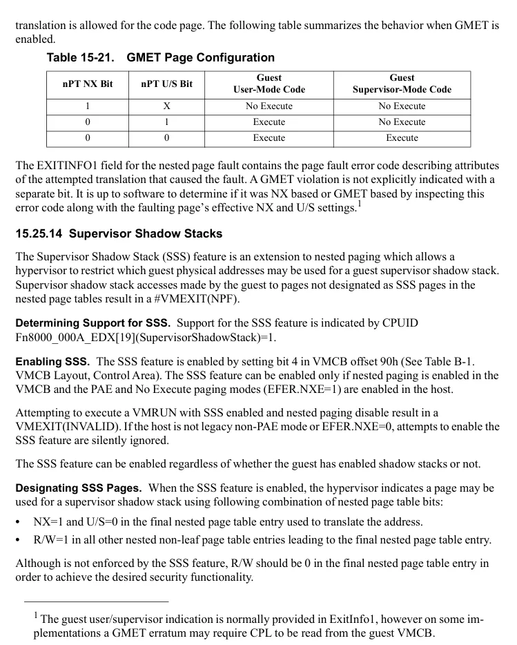

</details>


<!-- PDF source page: 619 | printed page: 557 -->

**SSS Access Checking.** When the SSS feature is enabled, guest supervisor shadow stack accesses are allowed only to physical pages designated as SSS pages in the nested page tables. Note that supervisor shadow stack writes to SSS pages are allowed to complete even though R/W=0 in the final nested page table entry.

The following accesses to SSS pages are not allowed:

- Supervisor shadow accesses made to non-SSS pages. These result in a #VMEXIT(NPF) with the SS bit set in the EXITINFO1 error code.
- Attempting to execute code from an SSS page. This results in a #VMEXIT(NPF) the same as any page with NX=1.

See Chapter 15.25.6, “Nested versus Guest Page Faults, Fault Ordering,” on page 551 for more information on EXITINFO1 error codes for nested page faults.

<a id="15-26-security"></a>

## 15.26 Security

SVM provides additional hardware support that is designed to facilitate the construction of trusted software systems. While the security features described in this section are orthogonal to SVM’s virtualization support (and are not required for processor virtualization), the two form building blocks for trusted systems.

**SKINIT Instruction.** The SKINIT instruction and associated system support (the Trusted Platform Module or TPM) are designed to allow for verifiable startup of trusted software (such as a VMM), based on secure hash comparison.

**Security Exception.** A security exception (#SX) is used to signal certain security-critical events.

<a id="15-27-secure-startup-with-skinit"></a>

## 15.27 Secure Startup with SKINIT

The SKINIT instruction is one of the keys to creating a “root of trust” starting with an initially untrusted operating mode. SKINIT reinitializes the processor to establish a secure execution environment for a software component called the secure loader (SL) and starts execution of the SL in a way that cannot be tampered with. SKINIT also copies the secure loader executable image to an external device, such as a Trusted Platform Module (TPM) for verification using unique bus transactions that preclude SKINIT operation from being emulated by software in a way that the TPM could not readily detect. (Detailed operation is described in Section 15.27.4.)

<a id="15-27-1-secure-loader"></a>

### 15.27.1 Secure Loader

A secure loader (SL) typically initializes SVM hardware mechanisms and related data structures, and initiates execution of a trusted piece of software such as a VMM (referred to as a Security Kernel, or SK, in this document), after first having validated the identity of that software.

SKINIT allows SVM protections to be reliably enabled after the system is already up and running in a non-trusted mode — there is no requirement to change the typical x86 platform boot process.


<!-- PDF source page: 620 | printed page: 558 -->

Exact details of the hand-off from the SL to an SK are dependent on characteristics of the SL, SK and the initial untrusted operating environment. However, there are specific requirements for the SL image, as described in Section 15.27.2.

<a id="15-27-2-secure-loader-image"></a>

### 15.27.2 Secure Loader Image

The secure loader (SL) image contains all code and initialized data sections of a secure loader. This code and initial data are used to initialize and start a security kernel in a completely safe manner, including setting up DEV protection for memory allocated for use by SL and SK. The SL image is loaded into a region of memory called the secure loader block (SLB) and can be no larger than 64Kbyte (see Section 15.27.3). The SL image is defined to start at byte offset 0 in the SLB.

The first word (16 bits) of the SL image must specify the SL entry point as an unsigned offset into the SL image. The second word must contain the length of the image in bytes; the maximum length allowed is 65535 bytes. These two values are used by the SKINIT instruction. The layout of the rest of the image is determined by software conventions. The image typically includes a digital signature for validation purposes. The digital signature hash must include the entry point and length fields. SKINIT transfers the SL image to the TPM for validation prior to starting SL execution (see Section 15.27.6 for further details of this transfer). The SL image for which the hash is computed must be ready to execute without prior manipulation.

<a id="15-27-3-secure-loader-block"></a>

### 15.27.3 Secure Loader Block

The secure loader block is a 64Kbyte range of physical memory which may be located at any 64Kbyte-aligned address below 4Gbyte. The SL image must have been loaded into the SLB starting at offset 0 before executing SKINIT. The physical address of the SLB is provided as an input operand (in the EAX register) to SKINIT, which sets up special protection for the SLB against device accesses (i.e., the DEV need not be activated yet).

The SL must be written to execute initially in flat 32-bit protected mode with paging disabled. A base address can be derived from the value in EAX to access data areas within the SL image using base+displacement addressing, to make the SL code position-independent.

Memory between the end of the SL image and the end of the SLB may be used immediately upon entry by the SL as secure scratch space, such as for an initial stack, before DEV protections are set up for the rest of memory. The amount of space required for this will limit the maximum size of the SL image, and will depend on SL implementation. SKINIT sets the ESP register to the appropriate top-of-stack value (EAX + 10000h).

Figure 15-14 illustrates the layout of the SLB, showing where EAX and ESP point after SKINIT execution. Labels in italics indicate suggested uses; other labels reflect required items.


<!-- PDF source page: 621 | printed page: 559 -->

**Figure 15-14. SLB Example Layout**

<details>
<summary>Extracted figure labels</summary>

```text
Post SKINIT ESP
SL Stack
SL Runtime
Data Area
64 KB
SL Code
and
Static Data
SL Image
(Hash Area)
SL Entry Point
SL Header
Post SKINIT EAX
Length
EP Offset
31
16 15
0
```

</details>

<a id="15-27-4-trusted-platform-module"></a>

### 15.27.4 Trusted Platform Module

The trusted platform module, or TPM, is an essential part of full trusted system initialization. This device is attached to an LPC link off the system I/O hub. It recognizes special SKINIT transactions, receives the SL image sent by SKINIT and verifies the signature. Based on the outcome, the device decides whether or not to cooperate with the SL or subsequent SK. The TPM typically contains sealed storage containing cryptographic keys and other high-security information that may be specific to the platform.

<details>
<summary>Rendered source page 621 (figures/tables)</summary>

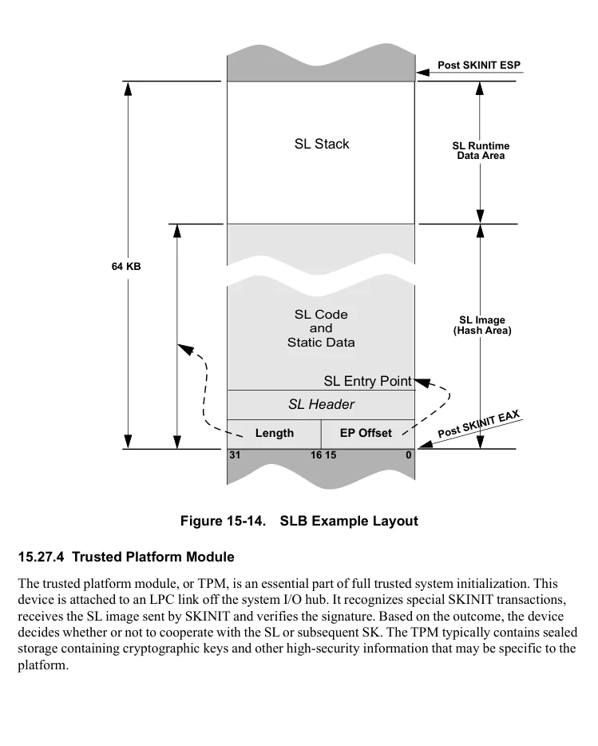

</details>


<!-- PDF source page: 622 | printed page: 560 -->

<a id="15-27-5-system-interface-memory-controller-and-i-o-hub-logic"></a>

### 15.27.5 System Interface, Memory Controller and I/O Hub Logic

SKINIT uses special support logic in the processor’s system interface unit, the internal controller and the I/O hub to which the TPM is attached. SKINIT uses special transactions that are unique to SKINIT, along with this support logic, designed to securely transmit the SL Image to the TPM for validation.

The use of this special protocol is intended to allow the TPM to detect true execution, as opposed to emulation, of a trusted Secure Loader, which in turn provides a means for verifying the subsequent loading and startup of a trusted Security Kernel.

<a id="15-27-6-skinit-operation"></a>

### 15.27.6 SKINIT Operation

The SKINIT instruction is intended to be used primarily in normal mode prior to the VMM taking control.

SKINIT takes the physical base address of the SLB as its only input operand in EAX, and performs the following steps:

1. 1. Reinitialize processor state in the same manner as for the INIT signal, then enter flat 32-bit protected mode with paging off. The CS selector is set to 8h and CS is read only. The SS selector is set to 10h and SS is read/write and expand-up. The CS and SS bases are cleared to 0 and limits are set to 4G. DS, ES, FS and GS are left as 16-bit real mode segments and the SL must reload these with protected mode selectors having appropriate GDT entries before using them. Initialized data in the SLB may be referenced using the SS segment override prefix until DS is reloaded. The general purpose registers are cleared except for EAX, which points to the start of the secure loader, EDX, which contains model, family and stepping information, and ESP, which contains the initial stack pointer for the secure loader. Cache contents remain intact, as do the x87 and SSE control registers. Most MSRs also retain their values, except those which might compromise SVM protections. The EFER MSR, however, is cleared. The DPD, R_INIT and DIS_A20M flags in the VM_CR register are unconditionally set to 1.

1. 2. Form the SLB base address by clearing bits 15:0 of EAX (EAX is updated), and enable the SL_DEV protection mechanism (see Section 15.24.8) to protect the 64-Kbyte region of physical memory starting at the SLB base address from any device access.

1. 3. In multiprocessor operation, perform an interprocessor handshake as described in Section 15.27.8.

1. 4. Read the SL image from memory and transmit it to the TPM in a manner that cannot be emulated by software.

1. 5. Signal the TPM to complete the hash and verify the signature. If any failures have occurred along the way, the TPM will conclude that no valid SL was started.

1. 6. Clear the Global Interrupt Flag. This disables all interrupts, including NMI, SMI and INIT and ensures that the subsequent code can execute atomically. If the processor enters the shutdown state (due to a triple fault for instance) while GIF is clear, it can only be restarted by means of a RESET.


<!-- PDF source page: 623 | printed page: 561 -->

1. 7. Update the ESP register to point to the first byte beyond the end of the SLB (SLB base + 65536), so that the first item pushed onto the stack by the SL will be at the top of the SLB.

1. 8. Add the unsigned 16-bit entry point offset value from the SLB to the SLB base address to form the SL entry point address, and jump to it.

The validation of the SL image by the TPM is a one-way transaction as far as SKINIT is concerned. It does not depend on any response from the TPM after transferring the SL image before jumping to the SL entry point, and initiates execution of the Secure Loader unconditionally. Because of the processor initialization performed, SKINIT does not honor instruction or data breakpoint traps, or trace traps due to EFLAGS.TF.

**Pending interrupts.** Device interrupts that may be pending prior to SKINIT execution due to EFLAGS.IF being clear, or that assert during the execution of SKINIT, will be held pending until software subsequently sets GIF to 1. Similarly, SMI, INIT and NMI interrupts that assert after the start of SKINIT execution will also be held pending until GIF is set to 1.

**Debug Considerations.** SKINIT automatically disables various implementation-specific hardware debug features. A debug version of the SL can reenable those features by clearing the VM_CR.DPD flag immediately upon entry.

<a id="15-27-7-sl-abort"></a>

### 15.27.7 SL Abort

If the SL determines that it cannot properly initialize a valid SK, it must cause GIF to be set to 1 and clear the VM_CR MSR to re-enable normal processor operation.

<a id="15-27-8-secure-multiprocessor-initialization"></a>

### 15.27.8 Secure Multiprocessor Initialization

The following standard APIC features are used for secure MP initialization:

- The concept of a single Bootstrap Processor (BSP) and multiple Application Processors (APs).
- The INIT interprocessor interrupt (IPI), which puts the target processors into a halted state (INIT state) which is responsive only to a subsequent Startup IPI.
- The Startup IPI causes target processors to begin execution at a location in memory that is specified by the Boot Processor and conveyed along with the Startup IPI. The operation of the processor in response to a Startup IPI is slightly modified to support secure initialization, as described below.

A Startup IPI normally causes an AP to start execution at a location provided by the IPI. To support secure MP startup, each AP responds to a startup IPI by additionally clearing its GIF and setting the DPD, R_INIT and DIS_A20M flags in the VM_CR register if, and only if, the BSP has indicated that it has executed an SKINIT. All other aspects of Startup IPI behavior remain unchanged.

**Software Requirements for Secure MP initialization.** The driver that starts the SL must execute on the BSP. Prior to executing the SKINIT instruction, the driver must save any processor-specific system register contents to memory for restoration after reinitialization of the APs. The driver should also put all APs in an idle state. The driver must first confirmed that all APs are idle and then it must issue an


<!-- PDF source page: 624 | printed page: 562 -->

INIT IPI to all APs and wait for its local APIC busy indication to clear. This places the APs into a halted state which is responsive only to a subsequent Startup IPI. APs will still respond to snoops for cache coherency. The driver may execute SKINIT at any time after this point. Depending on processor implementation, a fixed delay of no more than 1000 processor cycles may be necessary before executing SKINIT to ensure reliable sensing of APIC INIT state by the SKINIT.

**AP Startup Sequence.** While the SL starts executing on the BSP, the APs remain halted in APIC INIT state. Either the SL or the SK may issue the Startup IPI for the APs at whatever point is deemed appropriate. The Startup IPI conveys an 8-bit vector specified by the software that issues the IPI to the APs. This vector provides the upper 8 bits of a 20-bit physical address. Therefore, the AP startup code must reside in the lower 1 Mbyte of physical memory—with the entry point at offset 0 on that particular page.

In response to the Startup IPI, the APs start executing at the specified location in 16-bit real mode. This AP startup code must set up protections on each processor as determined by the SL or SK. It must also set GIF to re-enable interrupts, and restore the pre-SKINIT system context (as directed by the SL or SK executing on the BSP), before resuming normal system operation.

The SL must ensure the integrity of the AP startup sequence, for example by including the startup code in the hashed SL image and setting up DEV protection for it before copying it to the desired area. The AP startup code does not need to (and should not) execute SKINIT. Care must also be taken to avoid issuing another INIT IPI from any processor after the BSP executes SKINIT and before all APs have received a Startup IPI, as this could compromise the integrity of AP initialization.

**Pending interrupts.** Device interrupts that may be pending on an AP prior to the APIC INIT IPI due to EFLAGS.IF being clear, or that assert any time after the processor has accepted the INIT IPI, will be held pending through the subsequent Startup IPI, and remain pending until software sets GIF to 1 on that AP. Similarly, SMI, INIT, and NMI interrupts that assert after the processor has accepted the INIT IPI will also be held pending until GIF is set to 1.

**Aborting MP initialization.** In the event that the SL or SK on the BSP decides to abort SVM system initialization for any reason, the following clean-up actions must be performed by SL code executing on each processor before returning control to the original operating environment:

- The BSP and all APs that responded to the Startup IPI must restore GIF and clear VM_CR on each processor for normal operation.
- For each processor that has a distinct memory controller associated with it, the SL_DEV_EN flag in the DEV control register must be cleared in order to restore normal device accessibility to the 64KB SL memory range.

Any secure context created by the SL that should not be exposed to untrusted code should be cleaned up as appropriate before these steps are taken.


<!-- PDF source page: 625 | printed page: 563 -->

<a id="15-28-security-exception-sx"></a>

## 15.28 Security Exception (#SX)

The Security Exception fault signals security-sensitive events that occur while executing the VMM, in the form of an exception so that the VMM may take appropriate action. (A VMM would typically intercept comparable sensitive events in the guest.) Currently, the only use of the #SX is to redirect external INITs into an exception so that the VMM may — among other possibilities — destroy sensitive information before re-issuing the INIT, this time without redirection. The INIT redirection is controlled by the VM_CR.R_INIT bit. (See “INIT Support” on page 535 for more details on INIT and #SX behavior). Note that INIT is gated by the Global Interrupt Flag (GIF), and so will be held pending if asserted while GIF is 0. When GIF transitions to 1, INIT will either take effect or be redirected to #SX, depending on the state of R_INIT.

The #SX exception dispatches to vector 30, and behaves like other fault-class exceptions such as General Protection Fault (#GP). The #SX exception pushes an error code. The only error code currently defined is 1, and indicates redirection of INIT has occurred.

The #SX exception is a contributory fault.

<a id="15-29-advanced-virtual-interrupt-controller"></a>

## 15.29 Advanced Virtual Interrupt Controller

The AMD Advanced Virtual Interrupt Controller (AVIC) is an important enhancement to AMD Virtualization™ Technology (AMD-V). In a virtualized environment, AVIC presents to each guest a virtual interrupt controller that is compliant with the local Advanced Programmable Interrupt Controller (APIC) architecture. See Chapter 16, “Advanced Programmable Interrupt Controller (APIC),” on page 627 for a detailed description of APIC.

<a id="15-29-1-introduction"></a>

### 15.29.1 Introduction

In a virtualized computer system, each guest operating system needs access to an interrupt controller to send and receive device and interprocessor interrupts. When there is no hardware acceleration, it falls to the virtual machine monitor (VMM) to intercept guest-initiated attempts to access the interrupt controller registers and provide direct emulation of the controller system programming interface allowing the guest to initiate and process interrupts. The VMM uses the underlying physical and virtual interrupt delivery mechanisms of the system to deliver interrupts from I/O devices and virtual processors to the target guest virtual processor and to handle any required end of interrupt processing.

Given the high rate of device and interprocessor interrupt generation in certain scenarios, in particular on server-class systems, the emulation of a local APIC can be a significant burden for the VMM. The AVIC architecture addresses the overhead of guest interrupt processing in a virtualized environment by applying hardware acceleration to the following components of interrupt processing:

- Providing a guest operating system access to performance-critical interrupt controller registers
- Initiating intra-and inter-processor interrupts (IPIs) in and between virtual processors in a guest

**Software-initiated Interrupts.** Modern operating systems use software interrupts (self-IPIs) to implement software event signaling, inter-process communication and the scheduling of deferred


<!-- PDF source page: 626 | printed page: 564 -->

processing. System software sets up and initiates these interrupts by writing to control registers of the local APIC. AVIC hardware reduces VMM overhead by providing hardware assist for many of these operations.

**Inter-processor Interrupts.** Inter-processor interrupts (IPIs) are used extensively by modern operating systems to handle communication between processor cores within a machine (or, in a virtualized environment, between virtual processors within a virtual machine). IPIs are also employed to provide signaling and synchronization for operations such as cross-processor TLB invalidations (also known as TLB shootdowns). AVIC provides hardware mechanisms that deliver the interrupt to the virtual interrupt controller of the target virtual processor without VMM intervention.

**Device Interrupts.** Acceleration of the delivery of virtual interrupts from I/O devices to virtual processors is not addressed directly by AVIC hardware. This acceleration would be provided by an I/O memory management unit (IOMMU). The AVIC architecture is compatible with the AMD I/O Memory Management Unit (IOMMU). For more information on the IOMMU architecture, see *AMD I/O Virtualization Technology (IOMMU) Specification* (order #48882). See “Device Interrupts” on page 577 for further details of device interrupt handling under the AVIC extension.

The following subsections describe the AVIC architecture in detail.

<a id="15-29-2-local-apic-register-virtualization"></a>

### 15.29.2 Local APIC Register Virtualization

The system programming interface for the local APIC comprises a set of memory-mapped registers. In a non-virtualized environment, system software directly reads and writes these registers to configure the interrupt controller and initiate and process interrupts. In a virtualized environment, each guest operating system still requires access to this system programming interface but does not own the underlying interrupt processing hardware. To provide this facility to the guest operating system, VMM-level software emulates the local APIC for each guest virtual processor.

The AVIC architecture provides an image of the local APIC called the guest virtual APIC (guest vAPIC) in the guest physical address (GPA) space of each virtual processor when the virtual machine for the guest is instantiated. This image is backed by a page in the system physical address (SPA) space called a vAPIC backing page. The backing page remains pinned in system memory as long as the virtual machine persists, even when the specific virtual processor associated with the backing page is not running. Accesses to the memory-mapped register set by the guest are redirected by AVIC hardware to this backing page.

The VMM reads configuration, control, and command information written by the guest from the backing page and writes status information to this page for the guest to read. The guest is allowed to read most registers directly without the need for VMM intervention. Most writes are intercepted allowing the VMM to process and act on the configuration, control, and command data from the guest. However, for certain frequently used command and control operations, specific hardware support allows the guest to directly initiate interrupts and complete end of interrupt processing, eliminating the need for VMM intervention in the execution of performance-critical operations.


<!-- PDF source page: 627 | printed page: 565 -->

<a id="15-29-3-avic-backing-page"></a>

### 15.29.3 AVIC Backing Page

AVIC hardware detects attempted accesses by the guest to its local APIC register set and redirects these accesses to the vAPIC backing page. This is illustrated in the figure below.

**Figure 15-15. vAPIC Backing Page Access**

<details>
<summary>Extracted figure labels</summary>

```text
Memory Mapped Image
vAPIC Backing Page
System Physical
Address Space
VMCB
Emulated
vAPIC
Registers
Guest
vAPIC
Registers
Guest Physical
Address Space
Backing
Page SPA
Guest vAPIC
Page GPA
AVIC Hardware
allow*
trap
AVIC_BACKING_PAGE ptr
GPA to SPA
Mapping
Register-level
Permissions Filter
V_APIC_BAR
fault
Guest vAPIC Page GPA
Backing Page SPA
*Writes to specific registers can initiate AVIC hardware actions
v2_AVIC_diagram2.eps
```

</details>

To correctly redirect guest accesses of the guest vAPIC registers to the vAPIC backing page, the hard-ware needs two addresses. These are: **•** vAPIC backing page address in the SPA space **•** Guest vAPIC base address (APIC BAR) in the GPA space

System software is responsible for setting up a translation in the nested page table granting guest read and write permissions for accesses to the vAPIC Backing Page in SPA space. AVIC hardware walks the nested page table to check permissions, but does not use the SPA address specified in the leaf page table entry. Instead, AVIC hardware finds this address in the AVIC_BACKING_PAGE pointer field of the VMCB.

<details>
<summary>Rendered source page 627 (figures/tables)</summary>

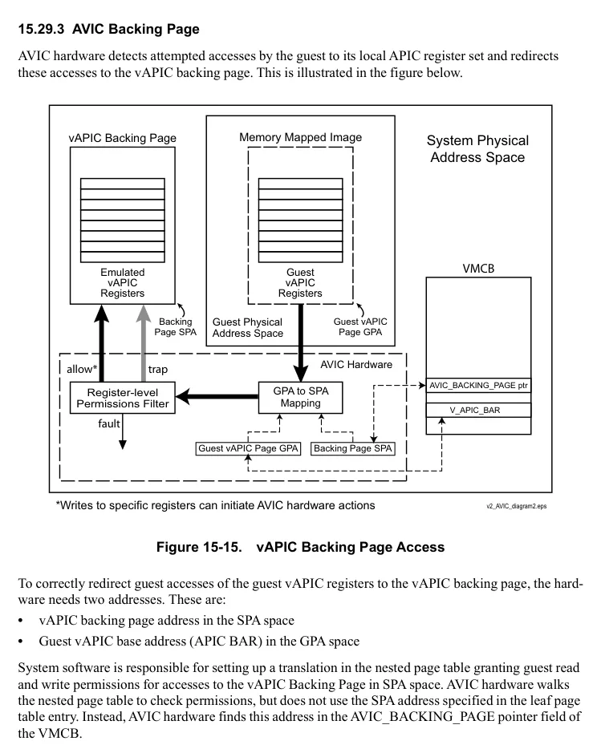

</details>


<!-- PDF source page: 628 | printed page: 566 -->

The VMM initializes the backing page with appropriate default APIC register values including items such as APIC version number. The vAPIC backing page address and the guest vAPIC base address are stored in the VMCB fields AVIC_BACKING_PAGE pointer and V_APIC_BAR respectively.

System firmware initializes the value of guest vAPIC base address (and VMCB.V_APIC_BAR) to FEE0_0000h. This is the address where the guest operating system expects to find the local APIC register set when it boots. If the guest attempts to relocate the local APIC register base address in GPA space by writing to the APIC Base Address Register (MSR 0000_001Bh), the VMM should intercept the write to update the V_APIC_BAR field of the guest’s VMCB(s) and the GPA part of translation in the virtual machine’s nested page tables.

The vAPIC backing page must be present in system physical memory for the life of the guest VM because some fields are updated even when the guest is not running.

1. 15. 29.3.1 Virtual APIC Register Accesses** AVIC hardware detects attempted guest accesses to the vAPIC registers in the backing page. These attempted accesses are handled by the register-level permissions filter in one of three ways:

- Allow—The access to the backing page is allowed to complete. Writes update the backing page value, while reads return the current value. In certain cases, a write results in specific hardware-based acceleration actions (summarized in Table 15-22 and described below).
- Fault—The processor performs an SVM intercept before the access. Causes a #VMEXIT.
- Trap— The processor performs an SVM intercept immediately after the access completes. Causes a #VMEXIT.

The details of this behavior for each of these registers are summarized in the following table.

**Table 15-22. Guest vAPIC Register Access Behavior**

| xAPIC<br>Register<br>Offset | x2APIC MSR<br>Address | Register Name | xAVIC and x2AVIC Register Access<br>Behavio |
| --- | --- | --- | --- |
| 20h | 802h | APIC ID Registe | Read: Allowed<br>Write: #VMEXIT (trap) |
| 30h | 803h | APIC Version Registe | Read: Allowed<br>Write: #VMEXIT (fault) |
| 80h | 808h | Task Priority Register (TPR) | Read: Allowed<br>Write: Accelerated by AVIC |
| 90h | 809h | Arbitration Priority Register (APR) | Read: #VMEXIT (fault)<br>Write: #VMEXIT (fault) |
| A0h | 80Ah | Processor Priority Register (PPR) | Read: Allowed<br>Write: #VMEXIT (fault) |
| B0h | 80Bh | End of Interrupt Register (EOI) | Read: Allowed<br>Write: Accelerated by AVIC for edge-<br>triggered interrupts or #VMEXIT (trap)<br>for level triggered interrupts |

<details>
<summary>Rendered source page 628 (figures/tables)</summary>

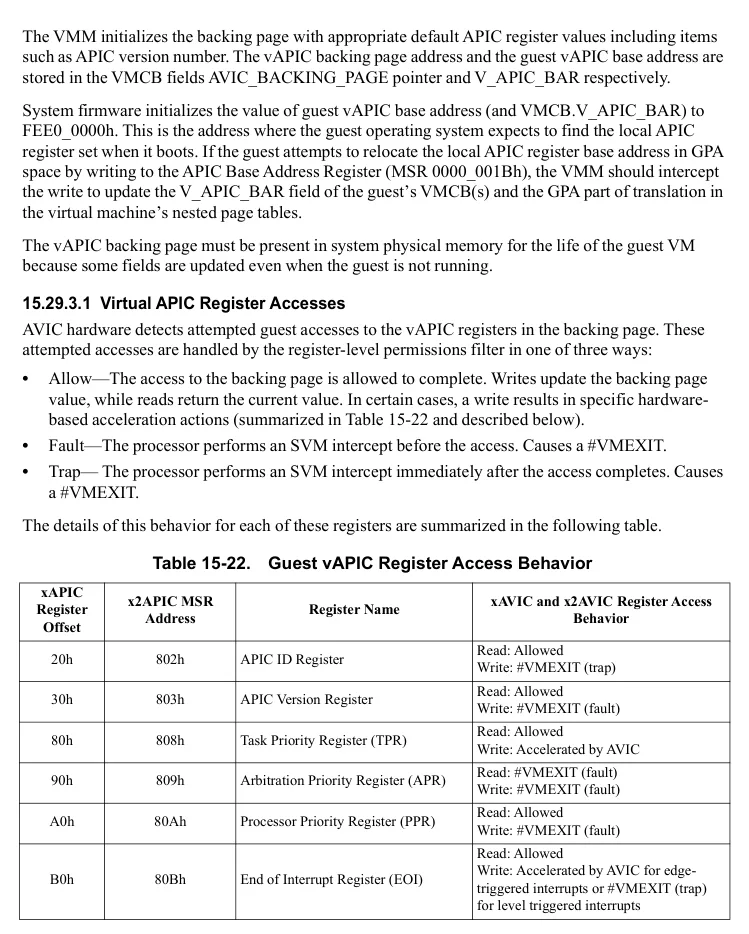

</details>


<!-- PDF source page: 629 | printed page: 567 -->

**Table 15-22. Guest vAPIC Register Access Behavior (continued)**

| xAPIC<br>Register<br>Offset | x2APIC MSR<br>Address | Register Name | xAVIC and x2AVIC Register Access<br>Behavio |
| --- | --- | --- | --- |
| C0h | - | Remote Read Registe | Read: Allowed<br>Write: #VMEXIT (trap) |
| D0h | 80Dh | Logical Destination Registe | Read: Allowed<br>Write: #VMEXIT (trap) |
| E0h | - | Destination Format Registe | Read: Allowed<br>Write: #VMEXIT (trap) |
| F0h | 80Fh | Spurious Interrupt Vector Registe | Read: Allowed<br>Write: #VMEXIT (trap) |
| 100h–170h | 810h-817h | In-Service Register (ISR) | Read: Allowed<br>Write: #VMEXIT (fault) |
| 180h–1F0h | 818h-81Fh | Trigger Mode Register (TMR) | Read: Allowed<br>Write: #VMEXIT (fault) |
| 200h–270h | 820h-827h | Interrupt Request Register (IRR) | Read: Allowed<br>Write: #VMEXIT (fault) |
| 280h | 828h | Error Status Register (ESR) | Read: Allowed<br>Write: #VMEXIT (trap) |
| 300h | 830h | Interrupt Command Register Low<br>(ICRL) | Read: Allowed<br>Write: Accelerated by AVIC or #VMEXIT<br>(trap) for advanced functions. |
| 310h | - | Interrupt Command Register High<br>(ICRH) | Read: Allowed (xAVIC)<br>Write: Allowed (xAVIC) |
| 320h | 832h | Timer Local Vector Table Entry | Read: Allowed<br>Write: #VMEXIT (trap) |
| 330h | 833h | Thermal Local Vector Table Entry | Read: Allowed<br>Write: #VMEXIT (trap) |
| 340h | 834h | Performance Counter Local Vector<br>Table Entry | Read: Allowed<br>Write: #VMEXIT (trap) |
| 350h | 835h | Local Interrupt 0 Vector Table Entry | Read: Allowed<br>Write: #VMEXIT (trap) |
| 360h | 836h | Local Interrupt 1 Vector Table Entry | Read: Allowed<br>Write: #VMEXIT (trap) |
| 370h | 837h | Error Vector Table Entry | Read: Allowed<br>Write: #VMEXIT (trap) |
| 380h | 838h | Timer Initial Count Registe | Read: Allowed<br>Write: #VMEXIT (trap) |
| 390h | 839h | Timer Current Count Registe | Read: #VMEXIT (fault)<br>Write: #VMEXIT (fault) |
| 3E0h | 83Eh | Timer Divide Configuration Registe | Read: Allowed<br>Write: #VMEXIT (trap) |
| - | 83Fh | Self IPI Register (x2APIC only) | Write: Allowed (x2AVIC) |

<details>
<summary>Rendered source page 629 (figures/tables)</summary>

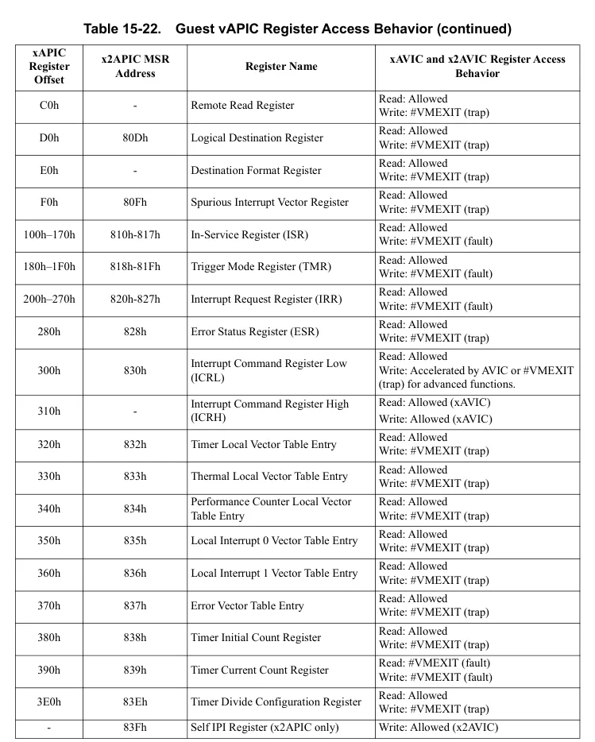

</details>


<!-- PDF source page: 630 | printed page: 568 -->

**Table 15-22. Guest vAPIC Register Access Behavior (continued)**

| xAPIC<br>Register<br>Offset | x2APIC MSR<br>Address | Register Name | xAVIC and x2AVIC Register Access<br>Behavio |
| --- | --- | --- | --- |
| 400h | 840h | Extended APIC Feature Registe | Read: #VMEXIT (fault)<br>Write: #VMEXIT (fault) |
| 410h | 841h | Extended APIC Control Registe | Read: #VMEXIT (fault)<br>Write: #VMEXIT (fault) |
| 420h | 842h | Specific End of Interrupt Register<br>(SEOI) | Read: #VMEXIT (fault)<br>Write: #VMEXIT (fault) |
| 480h–4F0h | 848h-84Fh | Interrupt Enable Registers (IER) | Read: #VMEXIT (fault)<br>Write: #VMEXIT (fault) |
| 500h-530h | 850h-853h | Extended Interrupt [3:0] Local Vector<br>Table Registers | CPUID Fn8000 000A EDX[27]=1:<br>_ _<br>Read: Allowed<br>Write: #VMEXIT (trap)<br>CPUID Fn8000 000A EDX[27]=0:<br>_ _<br>Read: #VMEXIT (fault)<br>Write: #VMEXIT(fault) |
| 540h-FFFh | - | Reserved | Read: #VMEXIT (fault)<br>Write: #VMEXIT (fault) |

Accesses to any other register locations not explicitly defined in this table are allowed to read and write the backing page.

All vAPIC registers are 32-bits wide and are located at 16-byte aligned offsets. The results of an attempted read or write of any bytes in the range [register_offset + 4:register_offset + 15] are undefined.

Guest writes to the Task Priority Register (TPR) and specific usage cases of writes to the End of Interrupt (EOI) Register and the Interrupt Command Register Low (ICRL) cause specific hardware actions. AVIC hardware allows guest writes to the Interrupt Command Register High (ICRH) since the writing of this register has no immediate hardware side-effect. AVIC hardware maintains and uses the value in the Processor Priority Register (PPR) to control the delivery of interrupts to guest virtual processors. The following sections discuss the handling of accesses by the guest to these registers in the vAPIC backing page.

**Task Priority Register (TPR).** When the guest operating system writes to the TPR, the value is updated in the backing page and the upper 4 bits of the value are automatically copied by the hardware to the V_TPR value in the VMCB. All reads from the TPR location return the value from the vAPIC backing page. Also, any TPR accesses using the MOV CR8 semantics update the backing page and V_TPR values.

The priority value stored in CR8 and V_TPR are not the same format as the APIC TPR register. Only the Task Priority bits of are maintained in the lower 4 bits of CR8 and V_TPR. The Task Priority Sub-

<details>
<summary>Rendered source page 630 (figures/tables)</summary>

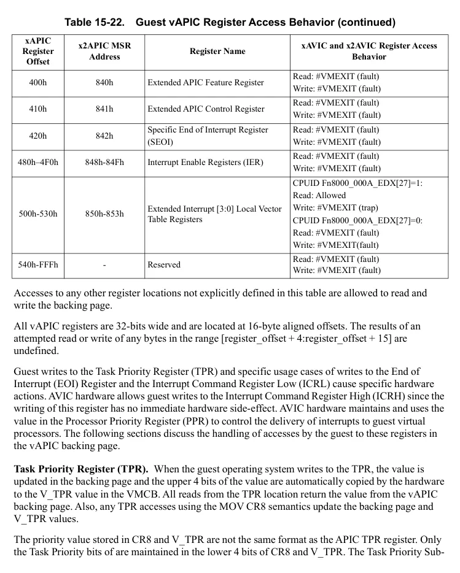

</details>


<!-- PDF source page: 631 | printed page: 569 -->

class value is not stored. Writes to the memory-mapped TPR register update bits 3:0 of CR8 and V_TPR and writes to CR8 update the TPR backing page value bits 7:4 while bits 3:0 are set to zero.

**Figure 15-16. Virtual APIC Task Priority Register Synchronization**

<details>
<summary>Extracted figure labels</summary>

```text
7
4
0
3
Task Priority
Subclass
TPR
7
4
0
3
CR8 / V_TPR
Reserved
Task Priority
```

</details>

The synchronization between the Task Priority field of the TPR and the Task Priority field of CR8 is normal local APIC behavior which is emulated by AVIC. For more information on the APIC, see Chapter 16, “Advanced Programmable Interrupt Controller (APIC),” on page 627.

**Processor Priority Register (PPR).** Writes to the processor priority register by the guest cause a #VMEXIT without updating the value in the backing page. AVIC hardware maintains the PPR value in the backing page. AVIC hardware updates the PPR value in the backing page when either the TPR value or the highest in-service interrupt changes. This value is used to control the delivery of virtual interrupts to the guest. PPR reads by the guest are allowed.

**End of Interrupt (EOI) Register.** When the guest writes to the EOI register address, AVIC hardware clears the highest priority in-service interrupt (ISR) bit in the backing page and re-evaluates the interrupt state to determine if another pending interrupt should be delivered. If the highest priority in-service interrupt is set to level mode (in the corresponding TMR bit), the EOI write causes a #VMEXIT to allow the VMM to emulate the level-triggered behavior.

**Interrupt Command Register Low (ICRL).** Writes to the ICRL register have the side-effect of initiating the generation of an interprocessor interrupt (IPI) based on the values written to the fields in both the ICRL and ICRH registers. AVIC hardware handles the generation of IPIs when the specified Message Type is Fixed (also known as fixed delivery mode) and the Trigger Mode is edge-triggered. The hardware also supports self and broadcast delivery modes specified via the Destination Shorthand (DSH) field of the ICRL. Logical and physical APIC ID formats are supported. All other IPI types cause a #VMEXIT. For more information on AVIC’s handling of IPI commands, see “Inter-processor Interrupts” on page 564.

<a id="15-29-4-vmcb-changes-for-avic"></a>

### 15.29.4 VMCB Changes for AVIC

The following paragraphs provide an overview of new VMCB fields defined as part of the AVIC architecture.

<details>
<summary>Rendered source page 631 (figures/tables)</summary>

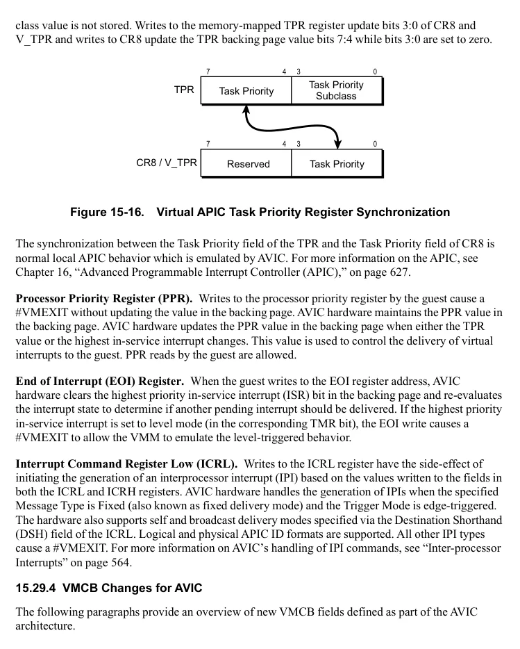

</details>


<!-- PDF source page: 632 | printed page: 570 -->

1. 15. 29.4.1 VMCB Virtual Interrupt Control Word** AVIC adds the AVIC Enable bit to the VMCB virtual interrupt control word at offset 60h. x2AVIC mode, described in Section 15.29.10 on page 582, adds x2AVIC Mode Enable.

**AVIC Enable—Virtual Interrupt Control, Bit 31.** The AVIC hardware support may be enabled on a per virtual processor basis. This bit determines whether or not AVIC is enabled for a particular virtual processor. Any guest configured to use AVIC must also enable nested paging. Enabling AVIC implicitly disables the V_IRQ, V_INTR_PRIO, V_IGN_TPR, and V_INTR_VECTOR fields in the VMCB Control Word. Enabling AVIC also affects CR8 behavior independent of V_INTR_MASKING enable (bit 24): writes to CR8 affect the V_TPR and update the backing page and reads from CR8 return V_TPR.

**x2AVIC Mode Enable—Virtual Interrupt Control, Bit 30**. The x2APIC MSR interface virtualization enable. When this bit is set to 1 on a VMRUN, AVIC Enable also has to be set to 1. If not the VMRUN fails with a VMEXIT_INVALID error code.

When AVIC is enabled (bit 31 set to 1), x2AVIC Mode Enable (bit 30) determines AVIC mode. If the x2AVIC bit is cleared to 0, xAVIC virtualization mode is enabled (used for MMIO local APIC register interface). If the x2AVIC bit is set to 1, x2AVIC virtualization mode is enabled (used for MSR local APIC register interface).

1. 15. 29.4.2 AVIC VMCB Fields** AVIC utilizes a number of formerly reserved locations in the VMCB.

**V_APIC_BAR—VMCB, Offset 098h.** This entry is used to hold a copy of guest physical base address of its local APIC register block. The guest can change the GPA of its local APIC register block by writing to the guest version of the APIC Base Address Register (MSR 0000_001Bh). Writes to this MSR are intercepted by the VMM and the value is used to update the GPA in the nested page table entry for the vAPIC backing page and the value to be saved in this field of the VMCB.

**APIC_BACKING_Page Pointer—VMCB, Offset 0E0h.** This is a 52-bit HPA pointer to the vAPIC backing page for this virtual processor. The vAPIC backing page is described in more detail in the following section.

**Logical APIC Table Pointer—VMCB, Offset 0F0h.** This is a 52-bit HPA pointer to the Logical APIC ID Table for the virtual machine containing this virtual processor. This table is described in more detail in the following section.

**Physical APIC Table Pointer—VMCB, Offset 0F8h.** This is a 52-bit HPA pointer to the Physical APIC ID Table for the virtual machine containing this virtual processor. This table is described in more detail in the following section.

**AVIC_PHYSICAL_MAX_INDEX—VMCB, Offset 0F8h.** Bits 11:0. This value provides the index of the last guest physical core ID for this guest.


<!-- PDF source page: 633 | printed page: 571 -->

1. 15. 29.4.3 Physical Address Pointer Restrictions** All of the physical addresses in the previous sections must point to legal, implementation-supported physical address ranges. These pointers are evaluated on VMRUN and cause a #VMEXIT if they are outside of the legal range. These memory ranges must be mapped as write-back cacheable memory type.

All the addresses point to 4-Kbyte aligned data structures. Bits 11:0 are reserved (except for offset 0F8h) and should be set to zero. The lower 12 bits of offset 0F8h are used for the AVIC_PHYSICAL_MAX_INDEX field. VMRUN fails with #VMEXIT(VMEXIT_INVALID) if AVIC_PHYSICAL_MAX_INDEX is greater than 255 in xAVIC mode or greater than 511 in x2AVIC mode when CPUID Fn8000_000A_ECX[x2AVIC_EXT] (bit 6)=0.

**Multiprocessor VM requirements.** When running a VM which has multiple virtual CPUs with xAVIC mode enabled, and the VMM runs a virtual CPU on a core which had last run a different virtual CPU from the same VM, regardless of the respective ASID values, care must be taken to flush the TLB on the VMRUN using a TLB_CONTROL value of 3h. Failure to do so may result in stale mappings misdirecting virtual APIC accesses to the previous virtual CPU's APIC backing page.

<a id="15-29-5-avic-memory-data-structures"></a>

### 15.29.5 AVIC Memory Data Structures

The AVIC architecture defines three new memory-resident data structures. Each of these structures is defined to fit exactly in one 4-Kbyte page. Future implementations may expand the size.

1. 15. 29.5.1 Virtual APIC Backing Page** Each virtual processor in the system is assigned a virtual APIC backing page (vAPIC backing page). Accesses by the guest to the local APIC register block in the guest physical address space are redirected to the vAPIC backing page in system memory. The vAPIC backing page is used by AVIC hardware and the VMM to emulate the local APIC. See “Virtual APIC Register Accesses” on page 566 for a detailed description.

1. 15. 29.5.2 Physical APIC ID Table** The physical APIC ID table is set up and maintained by the VMM and is used by the hardware to locate the proper vAPIC backing page to be used to deliver interrupts based on the guest physical APIC ID. One physical APIC ID table must be provided per virtual machine.

The guest physical APIC ID is used as an index into this table. Each entry contains a pointer to the virtual processor’s vAPIC backing page, a bit to indicate whether the virtual processor is currently scheduled on a physical core, and if so, the physical APIC ID of that core.

If CPUID Fn8000_000A_ECX[x2AVIC_EXT] (bit 6) = 0, the length of this table is fixed at 4 Kbytes allowing a maximum of 512 virtual processors per virtual machine. If CPUID Fn8000_000A_ECX[x2AVIC_EXT] (bit 6) = 1, the length of this table is up to eight consecutive 4-Kbyte pages, where the number of pages is equal to AVIC_PHYSICAL_MAX_INDEX[11:9] plus 1. The physical ID table can be populated in a sparse manner using the valid bit to indicate assigned IDs. The index of the last valid entry is stored in the VMCB AVIC_PHYSICAL_MAX_INDEX field.


<!-- PDF source page: 634 | printed page: 572 -->

A pointer to this table is maintained in the VMCB. Because there is a single Physical APIC ID Table per virtual machine, the value of this pointer is the same for every virtual processor within the virtual machine.

Each entry in the table has the following format:

**Figure 15-17. Physical APIC ID Table Entry**

<details>
<summary>Extracted figure labels</summary>

```text
63 62 61
52 51
32
V
IR
Reserved
Backing Page Pointer[51:32]
31
12 11
0
Backing Page Pointer[31:12]
Host Physical APIC ID
```

</details>

**Table 15-23. Physical APIC ID Table Entry Fields**

| Bit(s) | Field Name | Description |
| --- | --- | --- |
| 63 | V | Valid bit. When set, indicates that this entry contains a valid vAPIC backing page pointer.<br>If cleared, this table entry contains no information. |
| 62 | IR | IsRunning. This bit indicates that the corresponding guest virtual processor is currently<br>scheduled by the VMM to run on a physical core. |
| 61:52 | — | Reserved, SBZ. Should always be set to zero. |
| 51:12 | Backing Page Pointe | 4-Kbyte aligned HPA of the vAPIC backing page for this virtual processor. |
| 11:0 | Host Physical APIC ID | Physical APIC ID of the physical core allocated by the VMM to host the guest virtual<br>processor. This field is not valid unless the IsRunning bit is set. |

Note that the IR bit, when set, indicates that the VMM has assigned a physical core to host this virtual processor. The bit does not differentiate between a physical processor running in guest mode (actively executing guest software) or in host mode (having suspended the execution of guest software).

<details>
<summary>Rendered source page 634 (figures/tables)</summary>

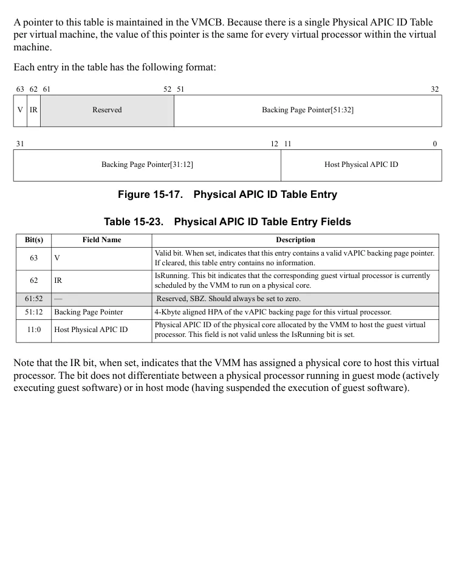

</details>


<!-- PDF source page: 635 | printed page: 573 -->

In xAVIC mode, the Physical APIC ID table occupies the lower half of a single 4-Kbyte memory page, formatted as follows:

**Figure 15-18. Physical APIC Table in Memory**

<details>
<summary>Extracted figure labels</summary>

```text
4088
Reserved
2048
255
Reserved
2040
Physical APIC Entry 254
254
2032
Physical APIC Entry 253
253
2024
Physical APIC Entry 252
252
Guest
Physical
APIC ID
2016
251
2008
Physical APIC Entry 251
2
Physical APIC Entry 2
16
Physical APIC Entry 1
1
8
Physical APIC Entry 0
0
2 Ph
APIC di
```

</details>

Since a destination of FFh is used to specify a broadcast, physical APIC ID FFh is reserved. The upper 2048 bytes of the table are reserved and should be set to zero.

1. 15. 29.5.3 Logical APIC ID Table** In addition to the Physical APIC ID Table, each guest VM is assigned a Logical APIC ID Table. This table is used to lookup the guest physical APIC ID for logically addressed interrupt requests. Each entry of this table provides the guest physical APIC ID corresponding to a single logically addressed APIC. Note that this implies that the logical ID of each vAPIC must be unique. The entries of this table are selected using the logical ID and interpreted differently depending upon logical APIC addressing mode of the guest.

If the guest attempts to change the logical ID of its APIC, the VMM must reflect this change in the Logical APIC ID Table. AVIC hardware supports the fixed interrupt message type targeting one or more logical destinations. The hardware also supports self and broadcast delivery modes specified via the Destination Shorthand (DSH) field of the ICRL. Any other message types must be supported through emulation by the VMM.

<details>
<summary>Rendered source page 635 (figures/tables)</summary>

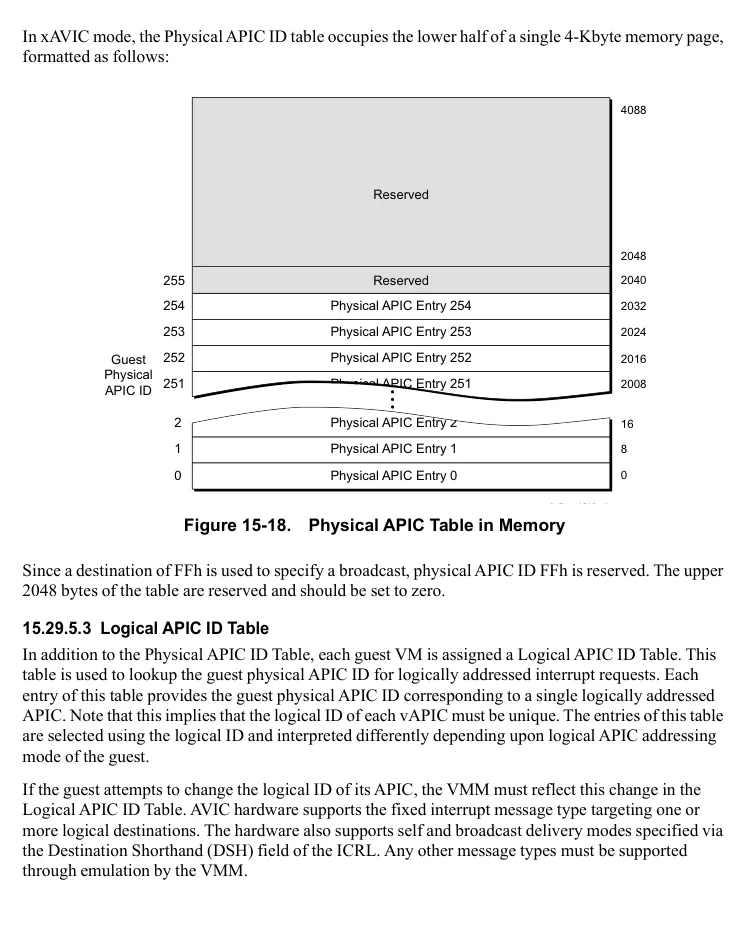

</details>


<!-- PDF source page: 636 | printed page: 574 -->

A pointer to this table is maintained in the VMCB. Because there is a single Logical APIC ID Table per virtual machine, the value of this pointer is the same for every virtual processor within the virtual machine.

For all logical destination modes, the table entries have the following format:

**Figure 15-19. Logical APIC ID Table Entry**

<details>
<summary>Extracted figure labels</summary>

```text
31 30
8
7
0
V
Reserved
Guest Physical APIC ID
```

</details>

**Table 15-24. Logical APIC ID Table Entry Fields**

| Bit(s) | Field Name | Description |
| --- | --- | --- |
| 31 | V | Valid Bit. When set, indicates that this table entry contains a valid physical APIC ID. If<br>cleared, this table entry contains no information. |
| 30:8 | — | Reserved, SBZ. Should always be set to zero. |
| 7:0 | Guest Physical APIC ID | Guest physical APIC ID corresponding to the local APIC selected when logically<br>addressed. |

**Logical APIC ID Table Format for Flat Mode.** When running in flat mode, AVIC expects the logical APIC ID table to be formatted as shown in Figure 15-20 below. This mode uses only the first 8 entries of the table. Although the logical APIC ID is an eight bit value, supported encodings must be of the form 2i, where i = 0 to 7. In the figure the value i is used and represents the index into the table. The actual byte offset into the table for a given logical APIC ID *l_apic_id* is 4 * log2(l_apic_id).

The Logical APIC ID Table is not used by AVIC hardware in x2AVIC mode. Instead, the destination logical ID is derived from the target x2APIC ID as follows: Logical x2APICID = (X2APICID[19:4] &lt;&lt; 16) | (1 &lt;&lt; x2APICID[3:0]).

<details>
<summary>Rendered source page 636 (figures/tables)</summary>

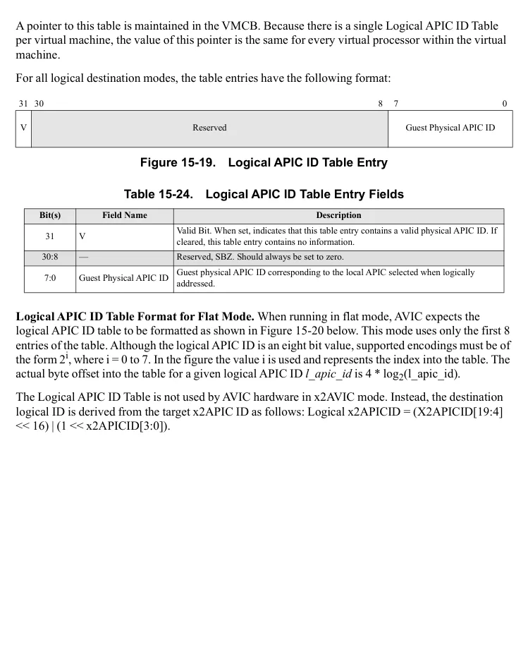

</details>


<!-- PDF source page: 637 | printed page: 575 -->

**Figure 15-20. Logical APIC ID Table Format, Flat Mode**

<details>
<summary>Extracted figure labels</summary>

```text
4092
Reserved
32
Entry for Logical APIC 7
Entry for Logical APIC 6
Entry for Logical APIC 5
Entry for Logical APIC 4
7
1
4
8
12
16
20
24
28
6
5
Logical
APIC ID
Index
4
Entry for Logical APIC 3
Entry for Logical APIC 2
Entry for Logical APIC 1
Entry for Logical APIC 0
3
2
0
```

</details>

**Logical APIC ID Table Format for Cluster Mode.** In cluster mode, bits 7:4 of the logical APIC ID represent the cluster number and bits 3:0 represent the APIC index (bit encoded). The cluster number Fh (15) is reserved. Since the APIC index field is four bits, four encodings are supported for the APIC index value.

The actual byte offset into the table for a given cluster *c* and an APIC index *apic_ix* is (16 * c) + 4 * log2(apic_ix).

When running in cluster mode, AVIC expects the logical APIC ID table to be formatted as shown in Figure 15-21 below.

<details>
<summary>Rendered source page 637 (figures/tables)</summary>

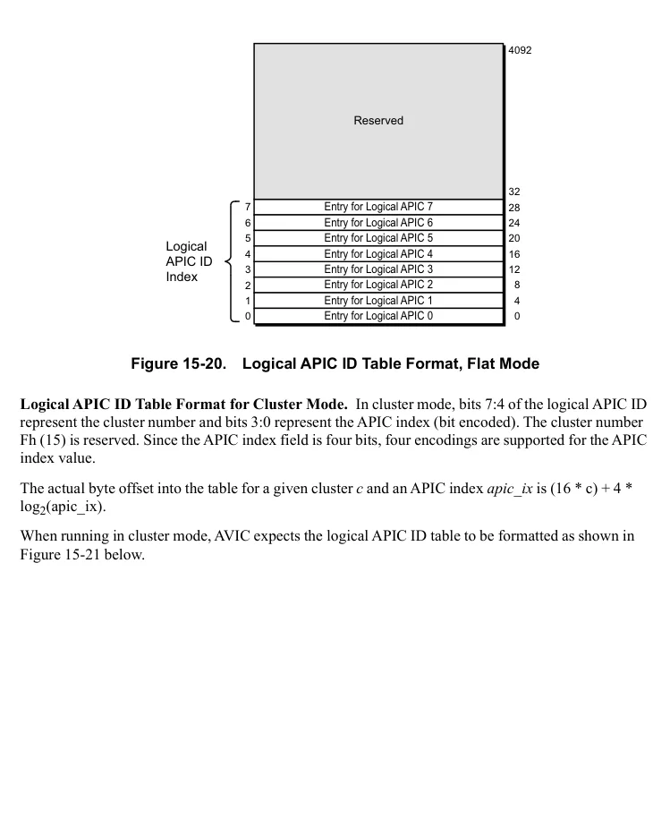

</details>


<!-- PDF source page: 638 | printed page: 576 -->

**Figure 15-21. Logical APIC ID Table Format, Cluster Mode**

<details>
<summary>Extracted figure labels</summary>

```text
4092
Reserved
240
Entry for Cluster 14, Logical APIC 2
Entry for Cluster 14, Logical APIC 3
236
Entry for Cluster 14, Logical APIC 1
Entry for Cluster 14, Logical APIC 0
224
Entry for Cluster 1, Logical APIC 3
24
28
Entry for Cluster 1, Logical APIC 2
Entry for Cluster 1, Logical APIC 1
Entry for Cluster 1, Logical APIC 0
16
20
Entry for Cluster 0, Logical APIC 3
Entry for Cluster 0, Logical APIC 2
Entry for Cluster 0, Logical APIC 1
Entry for Cluster 0, Logical APIC 0
8
12
0
4
```

</details>

<a id="15-29-6-interrupt-delivery"></a>

### 15.29.6 Interrupt Delivery

There are two fundamental types of virtual interrupts—interprocessor interrupts (IPIs) and I/O device interrupts (device interrupts). An IPI is initiated when guest system software writes the ICRL register. A device interrupt is initiated by a I/O device that has been programmed by guest system software (usually a device driver) to send a message signaling an event to a specific guest physical processor. This message usually includes an interrupt vector number indicating the nature of the event.

The following sections discuss the actions taken by AVIC hardware when a virtual processor signals an IPI and the actions taken by I/O virtualization hardware when a device signals a virtual interrupt.

1. 15. 29.6.1 Interprocessor Interrupts** To process an IPI, AVIC hardware executes the following steps:

1. 1. If the destination-shorthand coded in the command is 01b (i.e. self), update the IRR in the backing page, signal doorbell to self and skip remaining steps.

1. 2. If destination-shorthand is non-zero, or if the destination field is FFh (i.e. broadcast), jump to step 4.

1. 3. If the destination(s) is (are) logically addressed, lookup the guest physical APIC IDs for each logical ID using the Logical APIC ID table. If the entry is not valid (V bit is cleared), cause a #VMEXIT.

<details>
<summary>Rendered source page 638 (figures/tables)</summary>

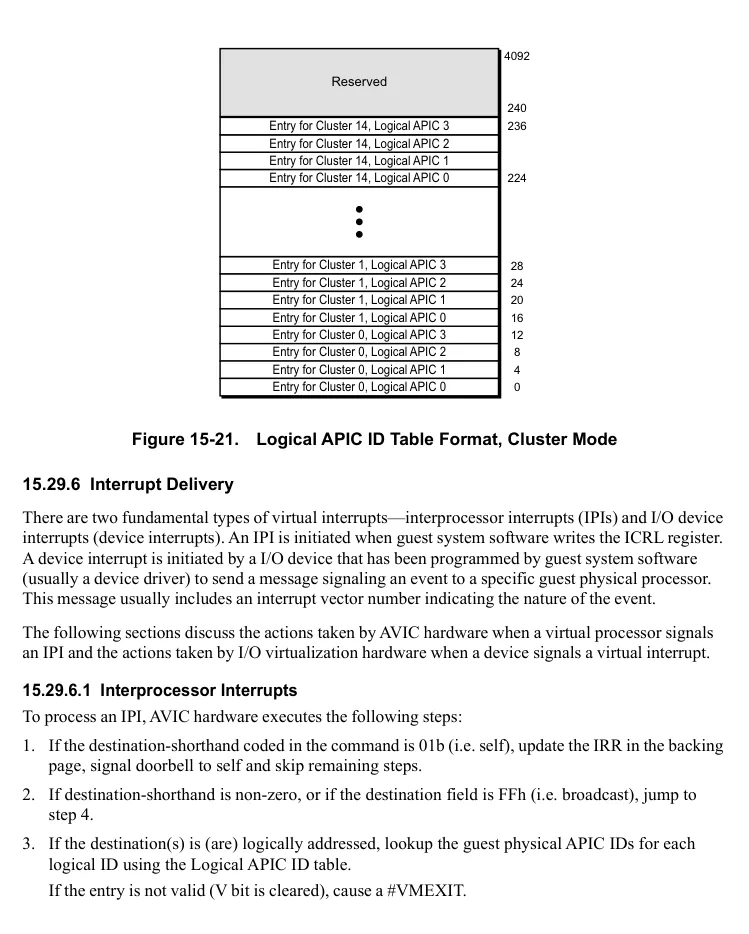

</details>


<!-- PDF source page: 639 | printed page: 577 -->

If the entry is valid, but the Guest Physical APIC ID is greater than 255, cause a #VMEXIT (xAVIC). If the entry is valid, but contains an invalid backing page pointer, cause a #VMEXIT.

1. 4. Lookup the vAPIC backing page address in the Physical APIC table using the guest physical APIC ID as an index into the table. For directed interrupts, if the selected table entry is not valid, cause a #VMEXIT. For broadcast IPIs, invalid entries are ignored.

1. 5. For every valid destination:
- Atomically set the appropriate IRR bit in each of the destinations’ vAPIC backing page.
- Check the IsRunning status of each destination.
- If the destination IsRunning bit is set, send a doorbell message using the host physical core number from the Physical APIC ID table.

1. 6. If any destinations are identified as not currently scheduled on a physical core (i.e., the IsRunning bit for that virtual processor is not set), cause a #VMEXIT.

Refer to Section 15.29.9.1, “AVIC IPI Delivery Not Completed,” on page 580 for new exit codes associated with the #VMEXIT exceptions listed above.

1. 15. 29.6.2 Device Interrupts** The delivery of a I/O device interrupt to a virtual processor is handled by an IOMMU with virtual interrupt capability. To deliver a virtual interrupt, I/O virtualization hardware executes the following steps:

1. 1. An interrupt message arrives from the I/O device identifying the source device and interrupt vector number.

1. 2. I/O virtualization hardware uses the device ID to determine the guest physical APIC ID of the core that is the target of the device interrupt.

1. 3. I/O virtualization hardware uses the guest physical APID ID to index into the Physical APIC ID Table to find the SPA of the vAPIC backing page. If the I/O virtualization hardware accesses an entry in the Physical APIC ID Table that is not valid (V bit is cleared), the I/O virtualization hardware aborts the virtual interrupt delivery and logs an error.

1. 4. I/O virtualization hardware performs any required vector number translation.

1. 5. I/O virtualization hardware atomically sets the bit in the IRR in the vAPIC backing page that corresponds to the vector.

1. 6. If the virtual processor that is the target of the interrupt is not currently running on its assigned physical core, the virtual interrupt will be presented when the virtual processor is made active again. I/O virtualization hardware may provide additional information to the VMM about the device interrupt to aid in virtual processor scheduling decisions. If the virtual processor that is the target of the interrupt is scheduled on a physical processor (indicated by the IsRunning bit of the Physical APIC ID table entry being set), I/O virtualization


<!-- PDF source page: 640 | printed page: 578 -->

hardware uses the host physical APIC ID in the table entry to send a doorbell signal to the corresponding processor core to signal that an interrupt needs to be processed.

<a id="15-29-7-avic-cpuid-feature-flags"></a>

### 15.29.7 AVIC CPUID Feature Flags

A CPUID feature bit is used indicate support for AVIC on a specific hardware implementation. CPUID Fn8000_000A_EDX[AVIC] (bit 13) = 1 indicates support for the AVIC architecture on that hardware. Additionally, CPUID Fn8000_000A_EDX[x2AVIC] (bit 18) = 1 indicates support for the AVIC architecture when the guest is using x2APIC MSR interface.

See Section 3.3, “Processor Feature Identification,” on page 71 for more information on using the CPUID instruction.

<a id="15-29-8-new-processor-mechanisms"></a>

### 15.29.8 New Processor Mechanisms

In order to support the direct injection of interrupts into the guest and to accelerate critical vAPIC functions, new hardware mechanisms are implemented in the processor.

1. 15. 29.8.1 Special Trap/Fault Handling for vAPIC Accesses** To virtualize the local APIC utilized by the guest to generate and process interrupts, all read and write accesses by the guest virtual processor to its local APIC registers are redirected to the vAPIC backing page. Most reads and many writes to this guest physical address range read or write the contents of memory locations within the vAPIC backing page at the corresponding offset.

To support proper handling and emulation of the guest local APIC, the processor provides permissions filtering hardware (Refer to Figure 15-15.) that detects and intercepts accesses to specific offsets (representing APIC registers) within the vAPIC backing page. This hardware either allows the access, blocks the access and causes a #VMEXIT (fault behavior), or allows the access and then causes a #VMEXIT (trap behavior).

Hardware directly handles the side effects of guest writes to the TPR and EOI registers. Writes to the ICRL register with simple functional side effects such as the generation of a directed IPI or a self-IPI request are handled directly. Values written to the ICRL defined to initiate more complex behavior cause a #VMEXIT to allow the VMM to emulate the function. A guest write to the ICRH register has no immediate hardware side effect and is allowed.

Most other write access attempts within the vAPIC register address range cause a #VMEXIT with trap or fault behavior allowing the VMM to emulate the function of that register. See Table 15-22 for more detail.

Reads and writes to locations within the vAPIC backing page, but outside the offset range of defined vAPIC registers are allowed to complete.

1. 15. 29.8.2 Doorbell Mechanism** Each core provides a doorbell mechanism that is used by other cores (for IPIs) and the IOMMU (for device interrupts) to signal to the VMM of the target physical core that a virtual interrupt requires


<!-- PDF source page: 641 | printed page: 579 -->

processing. The exact mechanism is implementation-specific, but must be protected from access from non-privileged software running on other cores and from direct access by an external device.

When the doorbell is received in guest mode, hardware on the receiving core evaluates the vAPIC state in the vAPIC backing page for the currently running virtual processor and injects the interrupt into the guest as appropriate.

**Doorbell Register.** The system programming interface to the doorbell mechanism is provided via an MSR. Sending a doorbell signal to a another core is initiated by writing the physical APIC ID corresponding to that core to the Doorbell Register (MSR C001_011Bh). The format of this register is shown in Figure 15-22 below.

**Figure 15-22. Doorbell Register, MSR C001_011Bh**

<details>
<summary>Extracted figure labels</summary>

```text
63
8
7
0
Reserved, MBZ
Physical APIC ID
```

</details>

Writing to this register causes a doorbell signal to be sent to the specified physical core. The serializing semantics of WRMSR are relaxed when writing to the Doorbell Register. Any attempt to read from this register results in a #GP.

**Processing of Doorbell Signals.** A doorbell signal delivered to a running guest is recognized by the hardware regardless of whether it can be immediately injected into the guest as a virtual interrupt. On the next VMRUN, the virtual interrupt delivery mechanism evaluates the state of the IRR register of the guest’s vAPIC backing page to find the highest priority pending interrupt and injects it if interrupt masking and priority allow.

1. 15. 29.8.3 Additional VMRUN Handling** In addition to the normal VMRUN operations, the core re-evaluates the APIC state in the vAPIC backing page upon entry into the guest and processes pending interrupts as necessary. Specifically:

- On VMRUN the interrupt state is evaluated and the highest priority pending interrupt indicated in the IRR is delivered if interrupt masking and priority allow
- Any doorbell signals received during VMRUN processing are recognized immediately after entering the guest
- When AVIC mode is enabled for a virtual processor, the V_IRQ, V_INTR_PRIO, V_INTR_VECTOR, and V_IGN_TPR fields in the VMCB are ignored.

<a id="15-29-9-avic-exit-codes"></a>

### 15.29.9 AVIC Exit Codes

The AVIC architecture defines two new AVIC-related #VMEXIT events. These cases are described in the following sections. Assigned EXITCODE values are given in Table C-1 on page 756.

<details>
<summary>Rendered source page 641 (figures/tables)</summary>

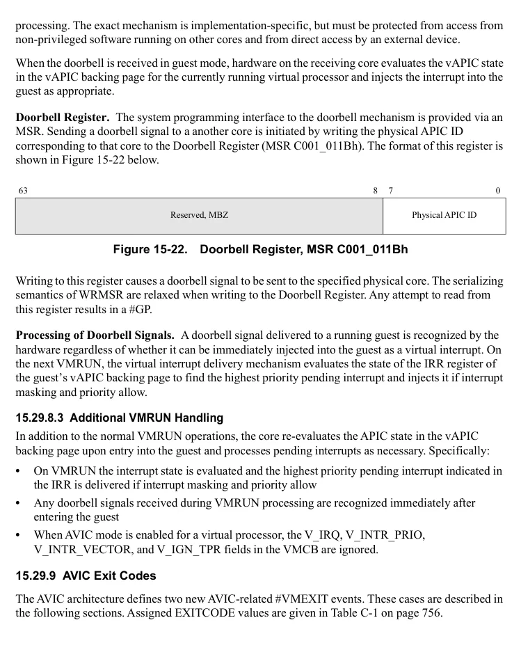

</details>


<!-- PDF source page: 642 | printed page: 580 -->

1. 15. 29.9.1 AVIC IPI Delivery Not Completed** An IPI could not be delivered to all targeted guest virtual processors because at least one guest virtual processor was not allocated to a physical core at the time. This results in a #VMEXIT with an exit code of AVIC_INCOMPLETE_IPI. Additional data associated with this #VMEXIT event is returned in the EXITINFO1 and EXITINFO2 fields.

**EXITINFO1.** This field contains the values written to the vAPIC ICRH and ICRL registers.

**Figure 15-23. EXITINFO1 for AVIC_INCOMPLETE_IPI**

<details>
<summary>Extracted figure labels</summary>

```text
63
32 31
0
ICRH
ICRL
```

</details>

**Table 15-25. EXITINFO1 Fields for AVIC_INCOMPLETE_IPI**

| Bit(s) | Field Name | Description |
| --- | --- | --- |
| 63:32 | ICRH | Value written to the vAPIC ICRH register. |
| 31:0 | ICRL | Value written to the vAPIC ICRL register. |

**EXITINFO2.** This field contains information describing the specific reason for the IPI delivery failure.

**Figure 15-24. EXITINFO2 for AVIC_INCOMPLETE_IPI**

<details>
<summary>Extracted figure labels</summary>

```text
63
32 31
12 11
0
ID
Reserved
Index
```

</details>

**Table 15-26. EXITINFO2 Fields for AVIC_INCOMPLETE_IPI**

| Bit(s) | Field Name | Description |
| --- | --- | --- |
| 63:32 | ID | Specific reason for the delivery failure. See Table 15-27 for defined values. |
| 31:12 | — | Reserved |
| 11:0 | Index | For ID = 1 – 3, this field provides the index of a logical or physical table entry.<br>Reserved for all other ID values. |

The ID field identifies the reason for the IPI delivery failure:

<details>
<summary>Rendered source page 642 (figures/tables)</summary>

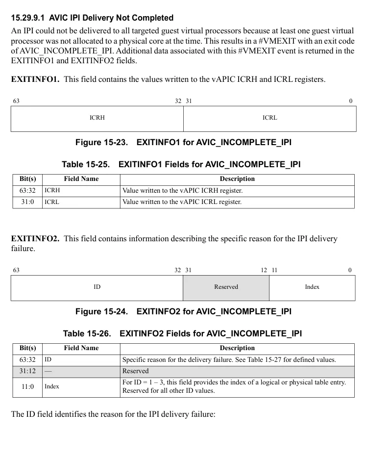

</details>


<!-- PDF source page: 643 | printed page: 581 -->

**Table 15-27. ID Field—IPI Delivery Failure Cause**

| ID | Cause | Description | Index |
| --- | --- | --- | --- |
| 0 | Invalid Interrupt type | The trigger mode for the specified IPI was set to<br>level or the destination type is unsupported. | Reserved. |
| 1 | IPI Target Not<br>Running | IsRunning bit of the target for a<br>Singlecast/Broadcast/Multicast IPI is not set in the<br>physical APIC ID table. | Index of the physical or logical APIC<br>ID table entry for the target virtual<br>processor that was not scheduled on a<br>physical core. |
| 2 | Invalid IPI Target | Target ID invalid. Target is not covered by the<br>physical or logical ID table. | Index of the physical or logical table<br>entry for the invalid target. |
| 3 | Invalid Backing Page<br>Pointe | The vAPIC Backing Page Pointer field of the<br>Physical APIC ID Table contained an invalid<br>physical address. | For shorthand or broadcast delivery<br>modes, index of the physical APIC<br>ID Table containing the invalid<br>address. For directed IPIs, index of<br>the logical or physical APIC ID table<br>depending on the destination mode. |
| 4 | Invalid IPI Vecto | The vector for the specified IPI was set to an illegal<br>value (VEC < 16). | Reserved |
| 5 | Un-accelerated IPI | Destination Shorthand is not set to Self (Secure<br>AVIC). | Reserved |
| 5 | Reserved | — | Reserved |

1. 15. 29.9.2 AVIC Access to Un-accelerated vAPIC register** A guest access to an APIC register that is not accelerated by AVIC results in a #VMEXIT with the exit code of AVIC_NOACCEL. This fault is also generated if an EOI is attempted when the highest priority in-service interrupt is set for level-triggered mode. Additional data associated with this #VMEXIT event is returned in the EXITINFO1 and EXITINFO2 fields.

<details>
<summary>Rendered source page 643 (figures/tables)</summary>

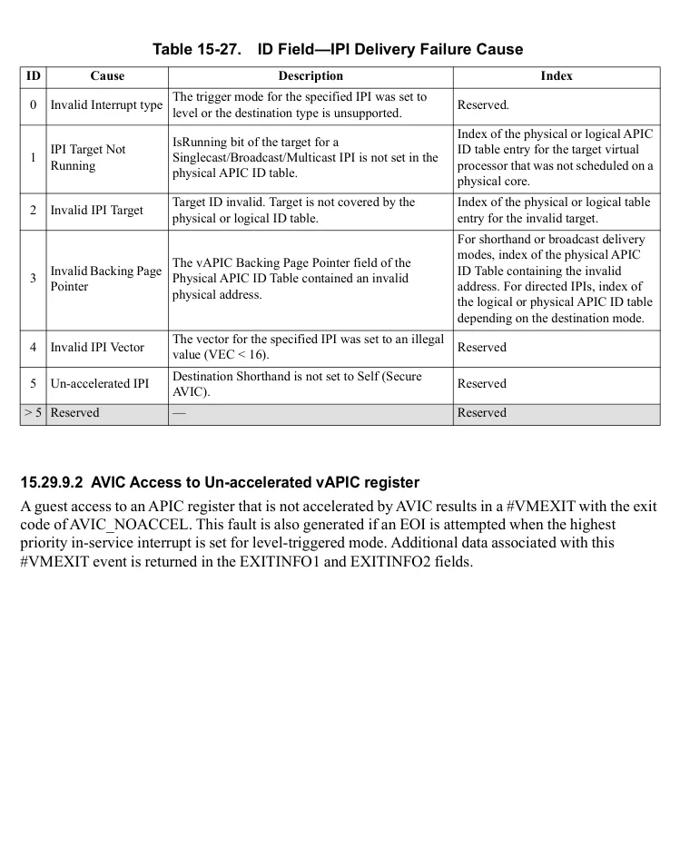

</details>


<!-- PDF source page: 644 | printed page: 582 -->

**EXITINFO1.** This field contains the offset of the un-accelerated virtual APIC register and a bit indicating whether a read or write operation was attempted.

**Figure 15-25. EXITINFO1 for AVIC_NOACCEL**

<details>
<summary>Extracted figure labels</summary>

```text
63
33 32 31
12 11
4
3
0
R/W
Reserved
APIC Offset[11:4]
Reserved
```

</details>

**Table 15-28. EXITINFO1 Fields for AVIC_NOACCEL**

| Bits | Field Name | Description |
| --- | --- | --- |
| 63:33 | — | Reserved. |
| 32 | R/W | If set, write was attempted. If clear, read was attempted. |
| 31:12 | — | Reserved. |
| 11:4 | APIC Offset[11:4] | Offset within virtual vAPIC backing page at which read or write was attempted.<br>APIC Offset[3:0] = 0, since all registers are aligned on 16-byte boundaries. |
| 3:0 | — | Reserved. |

**EXITINFO2.** This field contains extra information for the un-accelerated operation. If the EXITINFO1 fields indicate a write to the vAPIC EOI register (offset = B0h), bits 7:0 of this value contain the number of the highest in-service vector found in the virtual APIC ISR.

**Figure 15-26. EXITINFO2 for AVIC_NOACCEL**

<details>
<summary>Extracted figure labels</summary>

```text
63
8
7
0
Reserved
Vector
```

</details>

**Table 15-29. EXITINFO2 Fields for AVIC_NOACCEL**

| Bit(s) | Field Name | Description |
| --- | --- | --- |
| 63:8 | — | Reserved |
| 7:0 | Vecto | Vector for attempted EOI; otherwise undefined. |

<a id="15-29-10-x2avic"></a>

### 15.29.10 x2AVIC

The x2AVIC virtualization feature provides hardware acceleration for performance-sensitive APIC accesses when the x2APIC MSR interface is used by the guest operating system. x2AVIC support is reported by Fn8000000A_EDX[X2AVIC] (bit 18) = 1.

<details>
<summary>Rendered source page 644 (figures/tables)</summary>

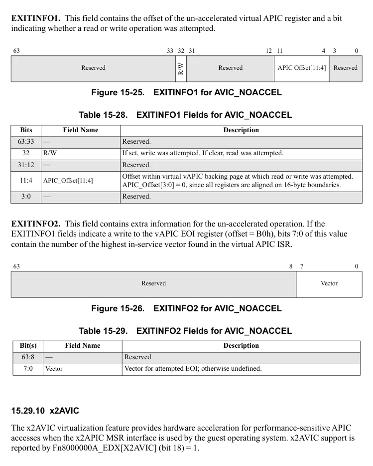

</details>


<!-- PDF source page: 645 | printed page: 583 -->

x2AVIC mode is enabled by setting AVIC Enable (bit 31) and x2AVIC Mode Enable (bit 30) in VMCB offset 60h to 1. When x2AVIC mode is enabled, x2APIC MSR accesses are virtualized in a similar manner to MMIO accesses in xAVIC mode. x2APIC MSR intercept checks and access checks have higher priority than AVIC access permission checks. See Section 15.29.3.1 for x2APIC register access behavior when x2AVIC is enabled.

In x2APIC mode Interrupt Command Register Low (ICRL) and Interrupt Command Register High (ICRH) registers are combined into a 64-bit register and accessed through the ICR MSR (830h). In x2AVIC mode ICR MSR bits 31:0 and 63:32 are mapped to ICRL (offset 300h) and ICRH (offset 310h) in the backing page. SELF_IPI MSR (83Fh) acceleration is handled the same way as ICR MSR acceleration.

V_APIC_BAR and Logical Destination Table are not used in x2AVIC mode.

New x2AVIC mode error conditions are documented in Section 15.29.4.1, Section 15.29.4.3 and Table 15-28.

<a id="15-30-svm-related-msrs"></a>

## 15.30 SVM Related MSRs

SVM uses the following MSRs for various control purposes. These MSRs are available regardless of whether SVM is enabled in EFER.SVME. For details on implementation-specific features, see the *BIOS and Kernel Developer’s Guide (BKDG)* or *Processor Programming Reference Manual (PPR)* applicable to your product.

<a id="15-30-1-vm-cr-msr-c001-0114h"></a>

### 15.30.1 VM_CR MSR (C001_0114h)

The VM_CR MSR controls certain global aspects of SVM. The VM_CR MSR layout is shown in Figure 15-27.

**Figure 15-27. VM_CR MSR (C001_0114h)**

<details>
<summary>Extracted figure labels</summary>

```text
63
5
4
3
2
1
0
Reserved, MBZ
SVMDIS
LOCK
DIS_A20M R_INIT DPD
```

</details>

The individual fields are as follows:

- DPD—Bit 0. If set, disables the external hardware debug port and certain internal debug features.
- R_INIT—Bit 1. If set, non-intercepted INIT signals are converted into an #SX exception.
- DIS_A20M—Bit 2. If set, disables A20 masking.
- LOCK—Bit 3. When this bit is set, writes to LOCK and SVMDIS are silently ignored. When this bit is clear, VM_CR bits 3 and 4 can be written. Once set, LOCK can only be cleared using the SVM_KEY MSR (See Section 15.31.) This bit is not affected by INIT or SKINIT.

<details>
<summary>Rendered source page 645 (figures/tables)</summary>

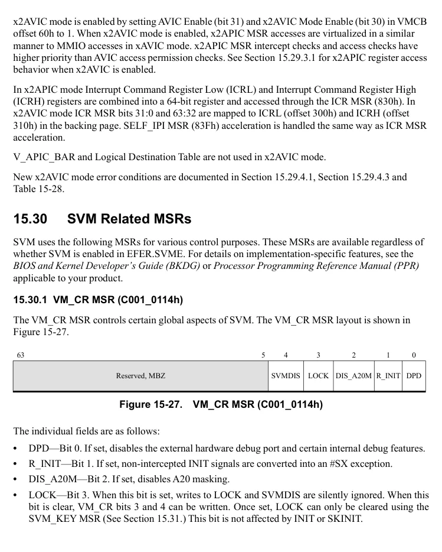

</details>


<!-- PDF source page: 646 | printed page: 584 -->

- SVMDIS—Bit 4. When this bit is set, writes to EFER treat the SVME bit as MBZ. When this bit is clear, EFER.SVME can be written normally. This bit does not prevent CPUID from reporting that SVM is available. Setting SVMDIS while EFER.SVME is 1 generates a #GP fault, regardless of the current state of VM_CR.LOCK. This bit is not affected by SKINIT. It is cleared by INIT when LOCK is cleared to 0; otherwise, it is not affected.

<a id="15-30-2-ignne-msr-c001-0115h"></a>

### 15.30.2 IGNNE MSR (C001_0115h)

The read/write IGNNE MSR is used to set the state of the processor-internal IGNNE signal directly. This is only useful if IGNNE emulation has been enabled in the HW_CR MSR (and thus the external signal is being ignored). Bit 0 specifies the current value of IGNNE; all other bits are MBZ.

<a id="15-30-3-smm-ctl-msr-c001-0116h"></a>

### 15.30.3 SMM_CTL MSR (C001_0116h)

The write-only SMM_CTL MSR provides software control over SMM signals. SMM_CTL MSR is not supported when CPUID Fn8000_0021[NoSmmCtlMSR] is set.

**Figure 15-28. SMM_CTL MSR (C001_0116h)**

<details>
<summary>Extracted figure labels</summary>

```text
63
5
4
3
2
1
0
Reserved, MBZ
RSM_CYCLE EXIT SMI_CYCLE ENTER DISMISS
```

</details>

Writing individual bits causes the following actions:

- DISMISS—Bit 0. Clear the processor-internal “SMI pending” flag.
- ENTER—Bit 1. Enter SMM: map the SMRAM memory areas, record whether NMI was currently blocked and block further NMI and SMI interrupts.
- SMI_CYCLE—Bit 2. Send SMI special cycle.
- EXIT—Bit 3. Exit SMM: unmap the SMRAM memory areas, restore the previous masking status of NMI and unconditionally reenable SMI.
- RSM_CYCLE—Bit 4. Send RSM special cycle.

Writes to the SMM_CTL MSR cause a #GP if platform firmware has locked the SMM control registers by setting HWCR[SMMLOCK].

Conceptually, the bits are processed in the order of ENTER, SMI_CYCLE, DISMISS, RSM_CYCLE, EXIT, though only the following bit combinations may be set together in a single write (for all other combinations of more than one bit, behavior is undefined):

- ENTER + SMI_CYCLE
- DISMISS + ENTER
- DISMISS + ENTER + SMI_CYCLE
- EXIT + RSM_CYCLE

<details>
<summary>Rendered source page 646 (figures/tables)</summary>

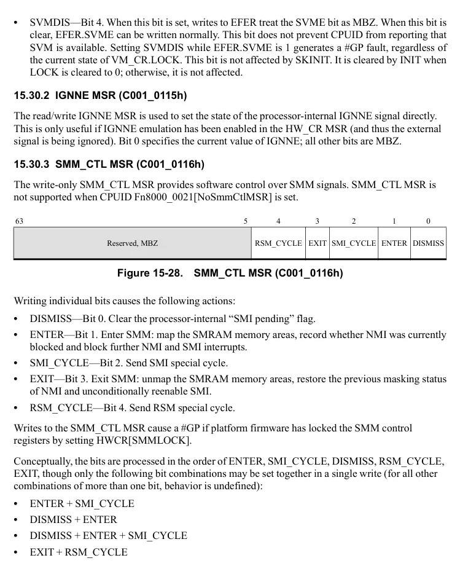

</details>


<!-- PDF source page: 647 | printed page: 585 -->

The VMM must ensure that ENTER and EXIT operations are properly matched, and *not* nested, otherwise processor behavior is undefined. Also undefined are ENTER when the processor is already in SMM, and EXIT when the processor is not in SMM.

<a id="15-30-4-vm-hsave-pa-msr-c001-0117h"></a>

### 15.30.4 VM_HSAVE_PA MSR (C001_0117h)

The 64-bit read/write VM_HSAVE_PA MSR holds the physical address of a 4KB block of memory where VMRUN saves host state, and from which #VMEXIT reloads host state. The VMM software is expected to set up this register before issuing the first VMRUN instruction.

Writing this MSR causes a #GP if:

- any of the low 12 bits of the address written are nonzero, or
- the address written is greater than or equal to the maximum supported physical address for this implementation.

<a id="15-30-5-tsc-ratio-msr-c000-0104h"></a>

### 15.30.5 TSC Ratio MSR (C000_0104h)

Writing to the TSC Ratio MSR allows the hypervisor to control the guest's view of the Time Stamp Counter. The contents of TSC Ratio MSR sets the value of the TSCRatio. This constant scales the timestamp value returned when the TSC is read by a guest via the RDTSC or RDTSCP instructions or when the TSC, MPERF, or MPerfReadOnly MSRs are read via the RDMSR instruction by a guest running under virtualization.

This facility allows the hypervisor to provide a consistent TSC, MPERF, and MPerfReadOnly rate for a guest process when moving that process between cores that have a differing P0 rate. The TSCRatio does not affect the value read from the TSC, MPERF, and MPerfReadOnly MSRs when in host mode or when virtualization is disabled. System Management Mode (SMM) code sees unscaled TSC, MPERF and MPerfReadOnly values unless the SMM code is executed within a guest container. The TSCRatio value does not affect the rate of the underlying TSC, MPERF, and MPerfReadOnly counters, nor the value that gets written to the TSC, MPERF, and MPerfReadOnly MSRs counters on a write by either the host or the guest.

The TSC Ratio MSR specifies the TSCRatio value as a fixed-point binary number in 8.32 format, which is composed of 8 bits of integer and 32 bits of fraction. This number is the ratio of the desired P0 frequency to be presented to the guest relative to the P0 frequency of the core (See Section 17.1, “P-State Control,” on page 664). The reset value of the TSCRatio is 1.0, which sets the guest P0 frequency to match the core P0 frequency.

Note that:

TSCFreq = Core P0 frequency * TSCRatio, so TSCRatio = (Desired TSCFreq) / Core P0 frequency.

The TSC value read by the guest is computed using the TSC Ratio MSR along with the TSC_OFFSET field from the VMCB so that the actual value returned is:

TSC Value (in guest) = (P0 frequency * TSCRatio * t) + VMCB.TSC_OFFSET + (Last Value Written to TSC) * TSCRatio Where **t** is time since the TSC was last written via the TSC MSR (or since reset if not written)


<!-- PDF source page: 648 | printed page: 586 -->

The TSC Ratio MSR layout is illustrated in the figure below.

**Figure 15-29. TSC Ratio MSR (C000_0104h)**

<details>
<summary>Extracted figure labels</summary>

```text
63
40
39
32
31
0
Reserved
INT
FRAC
Bits
Mnemonic
Description
Access Type
63:40
Reserved
MBZ
39:32
INT
Integer Part
R/W
31:0
FRAC
Fractional Part
R/W
```

</details>

**INT.** Integer Part. Bits 39:32. Integer part of TSCRatio.

**FRAC.** Fractional Part. Bits 39:32. Fractional part of TSCRatio.

TSCRatio = INT + FRAC  2-32

CPUID Fn8000_000A_EDX[TscRateMsr] =1 indicates support for the TSC Ratio MSR. See Section 3.3, “Processor Feature Identification,” on page 71 for more information on using the CPUID instruction.

<a id="15-31-svm-lock"></a>

## 15.31 SVM-Lock

The SVM-Lock feature allows software to prevent EFER.SVME from being set, either unconditionally or with a 64-bit key to re-enable SVM functionality.

Support for SVM-Lock is indicated by CPUID Fn8000_000A_EDX[SVML] = 1. On processors that support the SVM-Lock feature, SKINIT and STGI can be executed even if EFER.SVME=0. See descriptions of LOCK and SVMDIS bits in Section 15.30.1. When the SVM-Lock feature is not available, hypervisors can use the read-only VM_CR.SVMDIS bit to detect SVM (see Section 15.4).

<a id="15-31-1-svm-key-msr-c001-0118h"></a>

### 15.31.1 SVM_KEY MSR (C001_0118h)

The write-only SVM_KEY MSR is used to create a password-protected mechanism to clear VM_CR.LOCK.

When VM_CR.LOCK is zero, writes to SVM_KEY MSR set the 64-bit SVM Key value.

When VM_CR.LOCK is one, writes to SVM_KEY MSR compare the written value to the SVM Key value; if the values match and are non-zero, the VM_CR.LOCK bit is cleared. If the values mismatch or the SVM Key value is zero, the write to SVM_KEY is ignored, and VM_CR.LOCK is unmodified. Software should read VM_CR.LOCK after writing SVM_KEY to determine whether the unlock succeeded.

<details>
<summary>Rendered source page 648 (figures/tables)</summary>

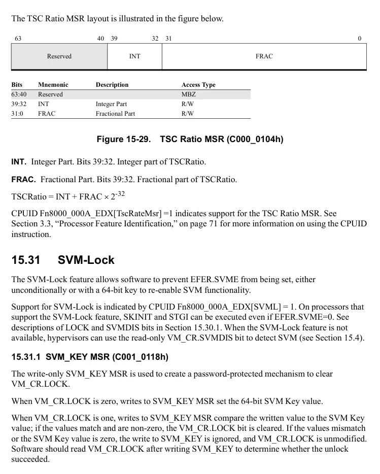

</details>


<!-- PDF source page: 649 | printed page: 587 -->

If SVM Key is zero when VM_CR.LOCK is one, VM_CR.LOCK can only be cleared by a processor reset.

To preserve the security of the SVM key, reading the SVM_KEY MSR always returns zero.

<a id="15-32-smm-lock"></a>

## 15.32 SMM-Lock

The SMM-Lock feature allows platform firmware to prevent System Management Interrupts (SMI) from being intercepted in SVM. The SmmLock bit is located in the HWCR MSR register.

<a id="15-32-1-smmlock-bit-hwcr-0"></a>

### 15.32.1 SmmLock Bit — HWCR[0]

The SmmLock bit (bit 0) is located in the HWCR MSR (C001_0015h). When SmmLock is clear, it can be set to one. Once set, the bit cannot be cleared by software and writes to it are ignored. SmmLock can only be cleared using the SMM_KEY MSR (see Section 15.32.2), or by a processor reset. This bit is not affected by INIT or SKINIT. When SmmLock is set, other SMM configuration registers cannot be written. For complete information on the HWCR register, see the *BIOS and Kernel Developer’s Guide (BKDG)* or *Processor Programming Reference Manual (PPR)* applicable to your product.

<a id="15-32-2-smm-key-msr-c001-0119h"></a>

### 15.32.2 SMM_KEY MSR (C001_0119h)

The write-only SMM_KEY MSR is used to create a password-protected mechanism to clear SmmLock.

When SmmLock is zero, writes to SMM_KEY MSR set the 64-bit SMM Key value.

When SmmLock is one, writes to SMM_KEY MSR compare the written value to the SMM Key value; if the values match and are non-zero, the SmmLock bit is cleared. If the values mismatch or the SMM Key value is zero, the write to SMM_KEY is ignored, and SmmLock is unmodified. Software should read SmmLock after writing SMM_KEY to determine whether the unlock succeeded.

If SMM_KEY MSR is equal to zero when SmmLock is one, SmmLock can only be cleared by a processor reset.

To preserve the security of the SMM key, reading SMM_KEY MSR always returns zero.

<a id="15-33-nested-virtualization"></a>

## 15.33 Nested Virtualization

Hardware support for improved performance of nested virtualization, which is the act of running a hypervisor as a guest under a higher-level hypervisor, is provided through the features described here. These relieve the top-level hypervisor from performing certain common, high-overhead operations that can occur with nested virtualization.


<!-- PDF source page: 650 | printed page: 588 -->

<a id="15-33-1-vmsave-and-vmload-virtualization"></a>

### 15.33.1 VMSAVE and VMLOAD Virtualization

This feature allows the VMSAVE and VMLOAD instructions to execute in guest mode without causing a #VMEXIT. The VMCB address in RAX is treated as a guest physical address and is translated to a host physical address. Any page fault in attempting that translation will result in a normal #VMEXIT with a nested page fault exit code. If the translation is successful, the register state transfer to or from the VMCB will then be performed.

Support for virtualized VMSAVE and VMLOAD is indicated by CPUID Fn8000_000A_EDX[15]=1. When this feature is available, it must be explicitly enabled by setting bit 1 of VMCB offset 0B8h to 1. This enable bit is only recognized when the hypervisor is in 64 bit mode, nested paging is enabled and Secure Encrypted Virtualization is disabled, otherwise attempted execution of a VMLOAD or VMSAVE in the guest will result in a #VMEXIT with a VMSAVE/VMLOAD exit code.

<a id="15-33-2-virtual-gif-vgif"></a>

### 15.33.2 Virtual GIF (VGIF)

This feature allows STGI and CLGI to execute in guest mode and control virtual interrupts in guest mode while still allowing physical interrupts to be intercepted by the hypervisor. The presence of the VGIF feature is indicated by CPUID Fn8000_000A_EDX[16]=1.

In order to provide this ability, two new bits are added to the VMCB field at offset 60h:

**Offset Bit Description**

60h 9 VGIF value (0 – Virtual interrupts are masked, 1 – Virtual Interrupts are unmasked)

60h 25 Virtual GIF enable for this guest (0 - Disabled, 1 - Enabled)

When a VMRUN is executed and VGIF is enabled, the processor uses bit 9 as the starting value of the virtual GIF. It then provides masking capability for when virtual interrupts are taken. STGI executed in the guest sets bit 9 of VMCB offset 60h and allows a virtual interrupt to be taken. CLGI executed in the guest clears bit 9 of VMCB offset 60h and causes the virtual interrupt to be masked. Bit 9 in the VMCB is also writeable by the hypervisor, and loaded on VMRUN and is saved on #VMEXIT.

The hypervisor can still use the STGI and CLGI intercept controls in the VMCB to intercept execution of these in the guest regardless of VGIF enablement.

<a id="15-34-secure-encrypted-virtualization"></a>

## 15.34 Secure Encrypted Virtualization

Secure Encrypted Virtualization (SEV) is available when the CPU is running in guest mode utilizing AMD-V virtualization features. SEV enables running encrypted virtual machines (VMs) in which the code and data of the virtual machine are secured so that the decrypted version is available only within the VM itself. Each virtual machine may be associated with a unique encryption key so if data is accessed by a different entity using a different key, the SEV encrypted VM's data will be decrypted with an incorrect key, leading to unintelligible data.

It is important to note that SEV mode therefore *represents a departure from the standard x86 virtualization security model,* as the hypervisor is no longer able to inspect or alter all guest code or


<!-- PDF source page: 651 | printed page: 589 -->

data. The guest page tables, managed by the guest, may mark data memory pages as either private or shared, thus allowing selected pages to be shared outside the guest. Private memory is encrypted using a guest-specific key, while shared memory is accessible to the hypervisor.

<a id="15-34-1-determining-support-for-sev"></a>

### 15.34.1 Determining Support for SEV

Support for memory encryption features is reported in CPUID 8000_001F[EAX] as described in Section 7.10.1, “Determining Support for Secure Memory Encryption,” on page 238. Bit 1 indicates support for Secure Encrypted Virtualization.

When memory encryption features are present, CPUID 8000_001F[EBX] and 8000_001F[ECX] supply additional information regarding the use of memory encryption, such as the number of keys supported simultaneously and which page table bit is used to mark pages as encrypted. Additionally, in some implementations, the physical address size of the processor may be reduced when memory encryption features are enabled, for example from 48 to 43 bits. In this example, physical address bits 47:43 would be treated as reserved except where otherwise indicated. When memory encryption is supported in an implementation, CPUID 8000_001F[EBX] reports any physical address size reduction present. Bits reserved in this mode are treated the same as other page table reserved bits, and will generate a page fault if found to be non-zero when used for address translation.

Full CPUID details for memory encryption features may be found in Volume 3, section E.4.17.

<a id="15-34-2-key-management"></a>

### 15.34.2 Key Management

Under the memory encryption extensions defined here, each SEV-enabled guest virtual machine is associated with a memory encryption key, and the SME mode (if used, see Section 7.10 on page 238) is associated with a separate key. Key management for the SEV feature is not handled by the CPU but rather by a separate processor known as the AMD Secure Processor (AMD-SP) which is present on AMD SOCs. A detailed discussion of AMD-SP operation is beyond the scope of this manual.

CPU software is not aware of the values of these keys but the hypervisor should coordinate the loading of virtual machine keys through the AMD-SP driver. This coordination will also determine which ASID the hypervisor should use for a particular guest. Under SEV, the ASID is used as the key index that identifies which encryption key is used to encrypt/decrypt memory traffic associated with that SEV-enabled guest. Encryption keys themselves are never visible to CPU software and are never stored off-chip in the clear.

<a id="15-34-3-enabling-sev"></a>

### 15.34.3 Enabling SEV

Prior to starting an encrypted VM, software must set MemEncryptionModEn to 1 in the SYSCFG MSR as described in Section 7.10.2, “Enabling Memory Encryption Extensions,” on page 238. SEV may then be enabled on a specific virtual machine during the VMRUN instruction if the hypervisor sets the SEV enable (bit 1) in VMCB offset 090h.

When SEV is enabled in VMCB, the following additional consistency checks are performed during VMRUN:

- Nested paging must be enabled


<!-- PDF source page: 652 | printed page: 590 -->

- SmmLock bit in HWCR MSR must be set
- ASID must not be greater than the maximum value defined by CPUID Fn8000_001F_ECX[NumEncryptedGuests]

If any of the above consistency checks fail, the VMRUN instruction will terminate with a VMEXIT_INVALID error code. If MemEncryptionModEn is 0, SEV cannot be enabled and the VMCB control bit for SEV is ignored.

Note that on systems where CPUID Fn8000_001F_EAX[64BitHost] is set to 1, the hypervisor must be in 64-bit mode in order to execute a VMRUN to an SEV-enabled guest. If not, the VMRUN fails with a VMEXIT_INVALID error code.

<a id="15-34-4-supported-operating-modes"></a>

### 15.34.4 Supported Operating Modes

Secure Encrypted Virtualization may be enabled on guests running in any operating mode. However the guest is only able to control memory encryption when operating in long mode or legacy PAE mode. In all other modes, all guest memory accesses are unconditionally considered private and are encrypted with the guest-specific key.

<a id="15-34-5-sev-encryption-behavior"></a>

### 15.34.5 SEV Encryption Behavior

When a guest is executed with SEV enabled, the guest page tables are used to determine the C-bit for a memory page and hence the encryption status of that memory page. This allows a guest to determine which pages are private or shared, but this control is available only for data pages. Memory accesses on behalf of instruction fetches and guest page table walks are always treated as private, regardless of the software value of the C-bit. This behavior ensures non-guest entities (such as the hypervisor) cannot inject their own code or data into an SEV-enabled guest. If a guest does wish to make data in instruction pages or page tables accessible to code outside of the guest, this data must be explicitly copied into a shared data page.

Note that while the guest may choose to set the C-bit explicitly on instruction pages and page table addresses, the value of this bit is a don't-care in such situations as hardware always performs these as private accesses.

<a id="15-34-6-page-table-support"></a>

### 15.34.6 Page Table Support

An SEV-enabled guest controls encryption in its own guest page tables using the C-bit defined by CPUID 8000_001F[EBX]. This location is the same C-bit location as defined under SME (Section 7.10, “Secure Memory Encryption,” on page 238) in non-virtualized mode. If the C-bit is an address bit, this bit is masked from the guest physical address when it is translated through the nested page tables. Consequently, the hypervisor does not need to be aware of which pages the guest has chosen to mark private.

For example if the C-bit is address bit 47, when a guest accesses virtual address 0x54321, it might be translated to guest physical address 0x8000_00AB_C321, indicating the page should be encrypted with the private guest key. When this guest physical address is translated through the nested page tables, host virtual address 0xAB_C321 is used for translation. The C-bit value from the guest physical


<!-- PDF source page: 653 | printed page: 591 -->

address is saved and used on the final system physical address after the nested table translation as shown in Figure 15-30.

Note that because guest physical addresses are always translated through the nested page tables, the size of the guest physical address space is not impacted by any physical address space reduction indicated in CPUID 8000_001F[EBX]. If the C-bit is a physical address bit however, the guest physical address space is effectively reduced by 1 bit.

**Figure 15-30. Guest Data Request**

<details>
<summary>Extracted figure labels</summary>

```text
Guest Data Request
Guest Page Tables
Address
C‐bit
Guest Physical Address
Nested Page Tables
Address
C‐bit
System Physical Address
```

</details>

<a id="15-34-7-restrictions"></a>

### 15.34.7 Restrictions

As with SME, some hardware implementations may not enforce coherency between mappings of the same physical page with different encryption enablement or keys. In such a system, when the encryption enablement or key for a particular memory page is to be changed, software must first ensure the page is flushed from all CPU caches. Certain conventional cache flushing techniques may not work however; see Section 15.34.9 for further details.

Note that if the hardware implementation enforces coherency across encryption domains as indicated by CPUID Fn8000_001F_EAX[10] then this flush is not required.

<a id="15-34-8-sev-interaction-with-sme"></a>

### 15.34.8 SEV Interaction with SME

SEV may be used in conjunction with SME mode. In this scenario, the guest page tables control encryption for guest memory, and the host (nested) page tables control encryption for shared memory. This behavior is summarized in Table 15-30. SEV is considered active when the CPU is in guest mode and the guest has SEV enabled in the VMCB.

<details>
<summary>Rendered source page 653 (figures/tables)</summary>

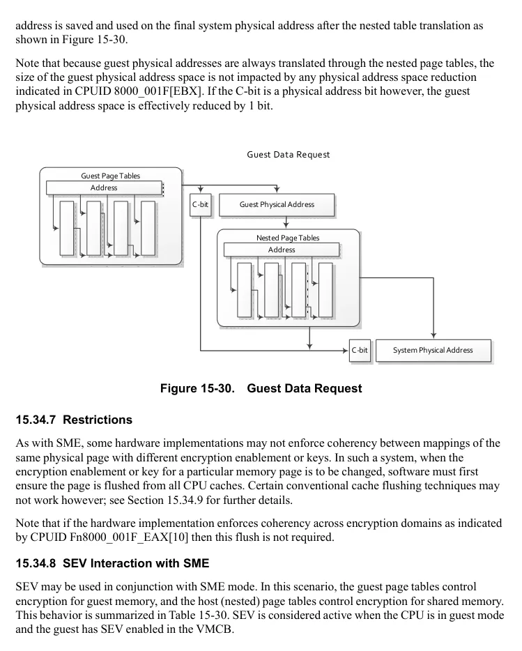

</details>


<!-- PDF source page: 654 | printed page: 592 -->

**Table 15-30. Encryption Control**

| Type of<br>Access | MemEncrypt<br>ionModEn | Guest<br>Mode | SEV<br>Mode<br>Active | Encrypted | Encryption<br>Key | Notes |
| --- | --- | --- | --- | --- | --- | --- |
| Legacy Mode (memory encryption disabled) |  |  |  |  |  |  |
| All | 0 | X | X | No | N/A |  |
| Secure Memory Encryption Mode | 0 | X |  |  |  |  |
| All | 1 | 0 | X | Optional | Host Key | Determined by page tables (CR3) |
| All | 1 | 1 | 0 | Optional | Host Key | Determined by nested page tables<br>(hCR3) |
| Secure Encrypted Virtualization Mode | 1 | 1 |  |  |  |  |
| Instruction<br>Fetch | 1 | 1 | 1 | Yes | Guest Key |  |
| Guest Page<br>Table<br>Access | 1 | 1 | 1 | Yes | Guest Key |  |
| Nested Page<br>Table<br>Access | 1 | 1 | 1 | Optional | Host Key | Determined by nested page tables<br>(hCR3) |
| Data Access | 1 | 1 | 1 | Optional1 | See Table<br>15-31:<br>SEV/SME<br>Interaction | Determined by guest page tables<br>(gCR3) and nested page tables<br>(hCR3) |

> Note: 1. Encryption is guest-controlled in long mode and legacy PAE mode only. In all other modes, these accesses are always considered private and are encrypted with the guest key

Note that during a nested page table walk, it is possible for both the guest page tables to be encrypted and the nested page tables to be encrypted. In this scenario, the guest page tables are decrypted using the guest private encryption key, and the nested page tables are decrypted using the host (SME) encryption key.

Guest data accesses that are marked shared (C=0) by the guest may still be optionally encrypted using the host (SME) key if the pages are marked encrypted in the nested tables. If a page is marked encrypted in both the guest and nested tables, the guest tables have priority and the page will be encrypted using the guest key. This behavior is summarized in Table 15-31.

<details>
<summary>Rendered source page 654 (figures/tables)</summary>

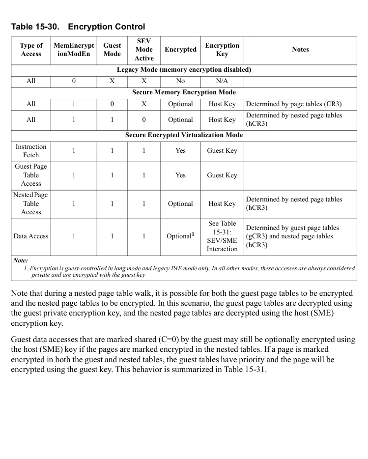

</details>


<!-- PDF source page: 655 | printed page: 593 -->

**Table 15-31. SEV/SME Interaction**

| Column 1 | Column 2 | Nested Page Table / C=0 | Nested Page Table / C=1 |
| --- | --- | --- | --- |
| Guest<br>Page<br>Table | C=0 | Unencrypted | Encrypted with host key |
| Guest<br>Page<br>Table | C=1 | Encrypted with<br>guest key | Encrypted with guest key |

<a id="15-34-9-page-flush-msr"></a>

### 15.34.9 Page Flush MSR

If coherency across encryption domains is not supported (see “Restrictions” on page 591), and the hypervisor wishes to read an encrypted page, it must first flush the guest view of that page from all CPU caches to ensure it is able to view the most recent copy of that data. This may be accomplished by issuing a WBINVD instruction on all cores on which the guest has run, or by using the VMPAGE_FLUSH MSR (C001_011E). Support for the VMPAGE_FLUSH MSR is indicated in CPUID 8000_001F[EAX] bit 2.

The VMPAGE_FLUSH MSR is a write-only register that may be used to flush 4KB of data on behalf of a guest. The hypervisor writes the host linear address of the page and guest ASID to the MSR, and hardware will then perform a write-back invalidation of the page causing any dirty data present in any CPU caches throughout the system to be encrypted and written to DRAM. Note that the VMPAGE_FLUSH MSR uses the standard host page tables to perform the page translation. The Page Flush MSR operation will hit on and evict guest-cached instances of the memory, whereas CLFLUSH instructions using this same translation will not.

**Bit[s] Description** 63:12 **VirtualAddr:** Write-only. Host virtual address of page to flush 11:0 **ASID:** Write-only. Guest ASID to use for the flush

The VMPAGE_FLUSH MSR will only flush memory pages marked private by the guest. If the hypervisor does not know if the memory page was marked private but wishes to evict the page from the cache, it should perform a standard CLFLUSH in addition to using the VMPAGE_FLUSH MSR.

Attempts to flush a host virtual address that is not mapped into a physical address or use of an ASID=0 will cause a #GP(0) fault. If SMAP is enabled, the input address needs to be mapped in page tables as a supervisor address.

If coherency across encryption domains is supported, the CLFLUSH instruction may be used to evict guest pages from the cache regardless of whether they are marked private or not by the guest.

<a id="15-34-10-sev-status-msr"></a>

### 15.34.10 SEV_STATUS MSR

Guests can determine what SEV features are currently active by reading the SEV_STATUS MSR (C001_0131). This MSR indicates which SEV features were enabled in the last VMRUN for that guest as shown in Table 15-32. The SEV_STATUS MSR is read-only and accesses to the SEV_STATUS

<details>
<summary>Rendered source page 655 (figures/tables)</summary>

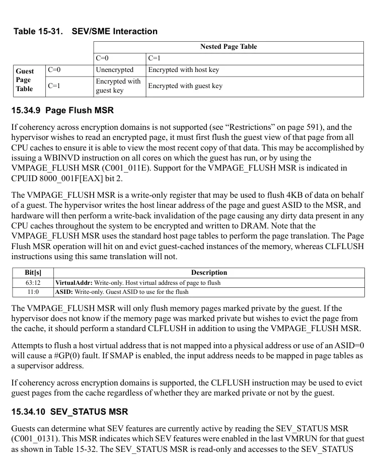

</details>


<!-- PDF source page: 656 | printed page: 594 -->

MSR cannot be intercepted by the hypervisor. The SEV_STATUS MSR is available on processors that support SEV.

**Table 15-32. SEV_STATUS MSR Fields**

| Bit[s] | Description |
| --- | --- |
| 63:24 | Reserved |
| 23 | IbpbOnEntry Active: IBPB on Entry feature is enabled in SEV FEATURES[21]<br>_ _ |
| 22-18 | Reserved |
| 18 | SecureAVIC Active: Secure AVIC feature is enabled in SEV FEATURES[16]<br>_ _ |
| 17 | SmtProtection Active: SMT Protection feature is enabled in SEV FEATURES[15]<br>_ _ |
| 16 | VmsaRegProt Active: VMSA Register Protection feature is enabled in SEV FEATURES[14]<br>_ _ |
| 15 | GuestInterceptCtl Active: Guest Intercept Control feature is enabled in SEV FEATURES[13]<br>_ _ |
| 14 | IbsVirtualization Active: IBS Virtualization feature is enabled in SEV FEATURES[12]<br>_ _ |
| 13 | PmcVirtualization Active: PMC Virtualization feature is enabled in SEV FEATURES[11]<br>_ _ |
| 12 | VmgexitParameter Active: VMGEXIT Parameter feature is enabled in SEV FEATURES[10]<br>_ _ |
| 11 | SecureTsc Active: Secure TSC feature is enabled in SEV FEATURES[9]<br>_ _ |
| 10 | VmplSSS Active: VMPL SSS feature is enabled in SEV FEATURES[8]<br>_ _ |
| 9 | SNPBTBIsolation Active: BTB isolation feature is enabled in SEV FEATURES[7]<br>_ _ |
| 8 | PreventHostIBS Active: PreventHostIBS feature is enabled in SEV FEATURES[6]<br>_ _ |
| 7 | DebugVirtualization Active: Debug Virtualization feature is enabled in SEV FEATURES[5]<br>_ _ |
| 6 | AlternateInjection Active: Alternate Injection feature is enabled in SEV FEATURES[4]<br>_ _ |
| 5 | RestrictedInjection Active: Restricted Injection feature is enabled in SEV FEATURES[3]<br>_ _ |
| 4 | ReflectVC Active: ReflectVC feature is enabled in SEV FEATURES[2]<br>_ _ |
| 3 | vTOM Active: Virtual TOM feature is enabled in SEV FEATURES[1]<br>_ _ |
| 2 | SNP Active: SNP-Active mode is selected by SEV FEATURES[0]<br>_ _ |
| 1 | SEV ES Enabled: SEV-ES feature is enabled in VMCB offset 90h<br>_ _ |
| 0 | SEV Enabled: SEV feature is enabled in VMCB offset 90h |

<a id="15-34-11-virtual-transparent-encryption-vte"></a>

### 15.34.11 Virtual Transparent Encryption (VTE)

The Virtual Transparent Encryption feature can be enabled to force all memory accesses within an SEV guest to be encrypted with the guest’s key. Support for this feature is indicated in CPUID Fn8000_001F[EAX] bit 16.

To enable this feature, the hypervisor must set VMCB offset 90h bit 5. Bit 5 is only observed when SEV (bit 1) is also set to 1 and SEV-ES (bit 2) is cleared to 0. In all other configurations of these bits (namely SEV disabled or SEV-ES enabled), bit 5 is ignored by hardware.

When this feature is enabled, CPU hardware treats the guest C-bit as 1 for all guest memory references. The actual C-bit in the guest page tables is ignored by hardware.

Guest address translation is unchanged, so the guest physical address (without the C-bit) is used for translation in the nested page tables.

<details>
<summary>Rendered source page 656 (figures/tables)</summary>

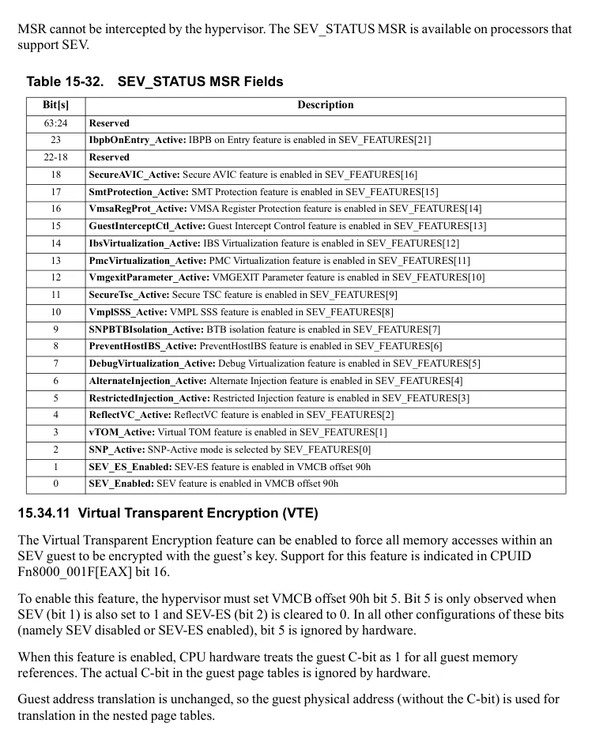

</details>


<!-- PDF source page: 657 | printed page: 595 -->

<a id="15-35-encrypted-state-sev-es"></a>

## 15.35 Encrypted State (SEV-ES)

Encrypted VMs that use the SEV feature described in Section 15.34 may additionally use the SEV-ES feature to protect guest register state from the hypervisor. An SEV-ES VM's CPU register state is encrypted during world switches and cannot be directly accessed or modified by the hypervisor. This is designed to protect against attacks such as exfiltration (unauthorized reading of VM state) and control flow attacks (modifying VM state) including rollback attacks (restoring an earlier VM register state).

SEV-ES includes architectural support for notifying a VM's operating system when certain types of world switches are about to occur, allowing the VM to selectively share information with the hypervisor when needed for functionality.

<a id="15-35-1-determining-support-for-sev-es"></a>

### 15.35.1 Determining Support for SEV-ES

SEV-ES support can be determined by reading CPUID Fn8000_001F[EAX] as described in Section 15.34.1. Bit 3 of EAX indicates support for SEV-ES.

<a id="15-35-2-enabling-sev-es"></a>

### 15.35.2 Enabling SEV-ES

SEV-ES may be enabled on a per-VM basis by setting bit 2 in offset 90h of the VMCB. When enabling SEV-ES, the hypervisor must also enable SEV (offset 90h bit 1) and LBR virtualization (offset B8h bit 0). Additionally, all other programming requirements related to enabling SEV (see Section 15.34.3) must be satisfied when running an SEV-ES guest.

On some systems, there is a limitation on which ASID values can be used on SEV guests that are run with SEV-ES disabled. While SEV-ES may be enabled on any valid SEV ASID (as defined by CPUID Fn8000_001F[ECX]), there are restrictions on which ASIDs may be used for SEV guests with SEV-ES disabled. CPUID Fn8000_001F[EDX] indicates the minimum ASID value that must be used for an SEV-enabled, SEV-ES-disabled guest. For example, if CPUID Fn8000_001F[EDX] returns the value 5, then any VMs which use ASIDs 1-4 and which enable SEV must also enable SEV-ES.

Note that prior to running an SEV-ES VM for the first time, the hypervisor must coordinate with the AMD Secure Processor to create the initial encrypted state image for the guest VM.

<a id="15-35-3-sev-es-overview"></a>

### 15.35.3 SEV-ES Overview

The SEV-ES architecture is designed to protect guest VM register state by default, and only allow the guest VM itself to grant selective access as required. This additional security protection functionality is accomplished in two ways. First, all VM register state is saved and encrypted when a VM exit event (#VMEXIT) occurs. This state is decrypted and restored on a VMRUN only. Second, certain types of #VMEXIT events cause a new exception to be taken within the guest VM. This new exception (#VC, see Section 15.35.5) indicates that the guest VM performed some action which requires hypervisor involvement, an example of which would be an I/O access by the VM. The guest #VC handler is responsible for determining what register state is necessary to expose to the hypervisor for the purpose of emulating this operation. The #VC handler also inspects the returned values from the hypervisor and updates the guest state if the output is deemed acceptable.


<!-- PDF source page: 658 | printed page: 596 -->

Register state that needs to be exposed utilizes a new structure called the Guest-Hypervisor Communication Block (GHCB). The GHCB location is chosen by the guest who maps the page as a shared memory page, thus allowing direct hypervisor access. Only state located in the GHCB can be read by the hypervisor as all state stored in the traditional VMCB save state structure is encrypted using the guest memory encryption key and integrity protected.

In the #VC handler, the guest may utilize a new instruction (Section 15.35.6) to perform a world switch and invoke the hypervisor. In response to this, the hypervisor can inspect the GHCB and determine the services requested by the guest.

<a id="15-35-4-types-of-exits"></a>

### 15.35.4 Types of Exits

When SEV-ES is enabled, all #VMEXIT events are classified as either Automatic Exits (AE) or Non-Automatic Exits (NAE). AE events are generally events that occur asynchronously with respect to the guest execution (e.g. interrupts) or events that need not involve exposing any guest register state. All other #VMEXIT events are classified as NAE events, and with NAE events the guest is allowed to determine what register state (if any) to expose in the GHCB. During guest execution, #VMEXIT events (both AE and NAE) are only taken if the corresponding intercept bit in the VMCB control area is set.

The hypervisor is informed of specific AE events exclusively via the #VMEXIT codes within the EXITCODE field of the VMCB control area. NAE events result in a #VC exception which is handled by the guest. Table 15-33 lists the possible AE events, all other events are considered NAE events.

**Table 15-33. AE Exitcodes**

| Code | Name | Notes | HW Advances RIP |
| --- | --- | --- | --- |
| 52h | VMEXIT MC | Machine check exception | No |
| 60h | VMEXIT INTR | Physical INTR | No |
| 61h | VMEXIT NMI | Physical NMI | No |
| 62h | VMEXIT SMI | Physical SMI | No |
| 63h | VMEXIT INIT | Physical INIT | No |
| 64h | VMEXIT VINTR | Virtual INTR | No |
| 77h | VMEXIT PAUSE | PAUSE instruction | Yes |
| 78h | VMEXIT HLT | HLT instruction | Yes |
| 7Fh | VMEXIT SHUTDOWN | Shutdown | No |
| 8Fh | VMEXIT EFER WRITE TRAP<br>_ _ _ | See Section 15.35.10 | Yes |
| 90h -9Fh | VMEXIT CR[0-15] WRITE TRAP<br>_ _ _ | See Section 15.35.10 | Yes |
| A5h | VMEXIT BUSLOCK | Bus Lock Threshold | No |
| A6h | VMEXIT IDLE HLT<br>_ _ | HLT instruction if idle | Yes |
| 400h | VMEXIT NPF | Only if PFCODE[3]=0 | No |
| 403h | VMEXIT VMGEXIT | VMGEXIT instruction | Yes |
| –1 | VMEXIT INVALID | Invalid guest state | – |

<details>
<summary>Rendered source page 658 (figures/tables)</summary>

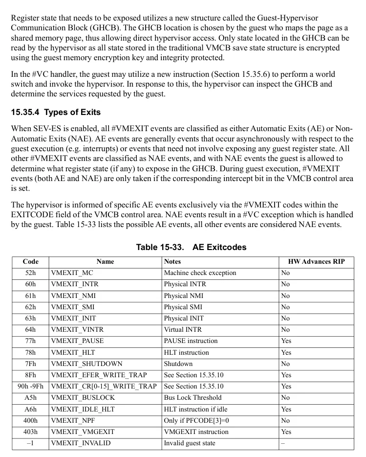

</details>


<!-- PDF source page: 659 | printed page: 597 -->

**Table 15-33. AE Exitcodes (continued)**

| Code | Name | Notes | HW Advances RIP |
| --- | --- | --- | --- |
| –2 | VMEXIT BUSY | BUSY bit was set in VMSA | – |
| -3 | VMEXIT IDLE REQUIRED<br>_ _ | The sibling thread is not idle | – |
| -4 | VMEXIT INVALID PMC<br>_ _ | Invalid PMC state | – |

In the case of exits due to specific instructions, the CPU will automatically advance the guest RIP in response to the AE so that execution will resume at the next instruction on a subsequent VMRUN.

In the case of nested page faults, these are treated as AEs only if there was no reserved bit error. This is intended to be used to help distinguish nested page faults due to demand misses (hypervisor needs to allocate a page) vs MMIO emulation (hypervisor needs to emulate a device). Consequently, the hypervisor should set a reserved page table bit, such as a reserved address bit, on all MMIO pages that it intends to emulate. (This can include address bits that may become reserved when SEV is enabled; see Section 15.34.1.) This will ensure that MMIO page faults become NAE events, which is critical so the guest #VC handler can be invoked to assist in the MMIO emulation. Nested page faults that are AE events do not invoke any guest handler and the hypervisor is intended to allocate memory as needed and then resume the guest.

Note that when a guest is running with SEV-ES enabled, instruction bytes (VMCB offset D0h) are never saved to the VMCB on a nested page fault.

<a id="15-35-5-vc-exception"></a>

### 15.35.5 #VC Exception

The VMM Communication Exception (#VC) is always generated by hardware when an SEV-ES enabled guest is running and an NAE event occurs. The #VC exception is a precise, contributory, fault-type exception utilizing exception vector 29. This exception cannot be masked. The error code of the #VC exception is equal to the #VMEXIT code (see Appendix C) of the event that caused the NAE.

In response to a #VC exception, a typical flow would involve the guest handler inspecting the error code to determine the cause of the exception and deciding what register state must be copied to the GHCB for the event to be handled. The handler should then execute the VMGEXIT instruction to create an AE and invoke the hypervisor. After a later VMRUN, guest execution will resume after the VMGEXIT instruction where the handler can view the results from the hypervisor and copy state from the GHCB back to its internal state as needed. This flow is shown in Figure 15-31.

Note that it is inadvisable for the hypervisor to set the VMCB intercept bit for the #VC exception as this would prevent proper handling of NAEs by the guest. Similarly, the hypervisor should avoid setting intercept bits for events that would occur in the #VC handler (such as IRET).

<details>
<summary>Rendered source page 659 (figures/tables)</summary>

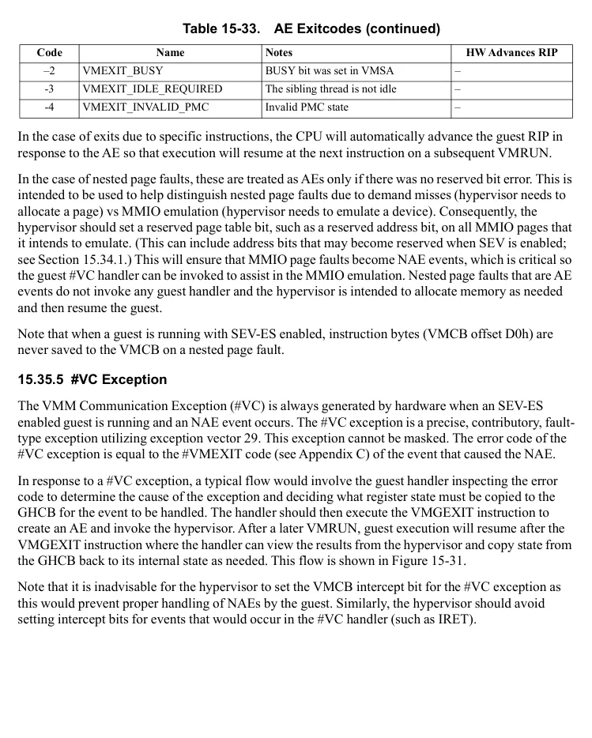

</details>


<!-- PDF source page: 660 | printed page: 598 -->

**Figure 15-31. EXAMPLE #VC FLOW**

<details>
<summary>Extracted figure labels</summary>

```text
Guest
AMD64 Hardware
Hypervisor
Guest triggers
VMEXIT condition
Send #VC exception
to the guest
#VC handler copies
state to GHCB as
needed
VMGEXIT
Save guest state to
protected memory
and load HV state
Hypervisor handles
exit
VMRUN
Load guest state
from protected
memory
Returns to #VC
handler
Handler modifies
state as needed
IRET
```

</details>

<details>
<summary>Rendered source page 660 (figures/tables)</summary>

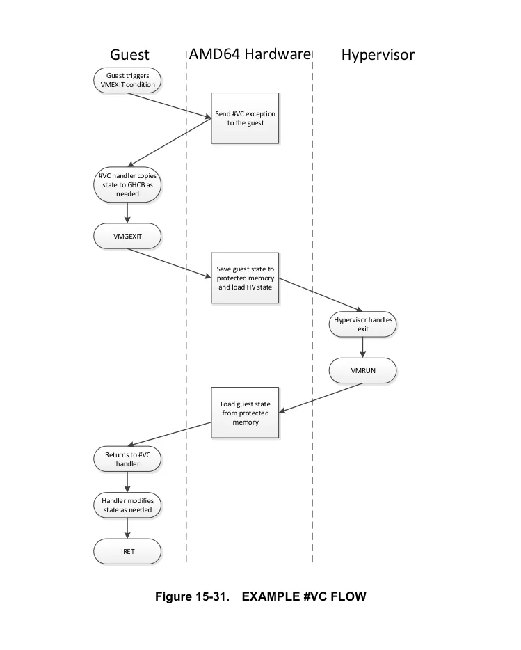

</details>


<!-- PDF source page: 661 | printed page: 599 -->

<a id="15-35-6-vmgexit"></a>

### 15.35.6 VMGEXIT

The VMGEXIT instruction creates an AE and is intended to allow a guest #VC handler to invoke the hypervisor when needed. VMGEXIT causes an AE with the VMEXIT_VMGEXIT code and behaves like a trap so that upon a subsequent VMRUN, execution resumes following the VMGEXIT. There is no hypervisor intercept bit for VMGEXIT as the instruction unconditionally causes an AE when executed in an SEV-ES guest.

The VMGEXIT opcode is only valid within a guest when run with SEV-ES mode active. If the guest is not run with SEV-ES mode active, the VMGEXIT opcode will be treated as a VMMCALL opcode and will behave exactly like a VMMCALL.

The VMGEXIT Parameter feature may be used by a guest #VC handler to atomically pass one parameter to the hypervisor. Support for the VMGEXIT Parameter feature is indicated by CPUID Fn8000_001F_EAX[VmgexitParameter] (bit 17) = 1. The VMGEXIT Parameter feature is enabled by setting SEV_FEATURES bit 10 (VmgexitParameter) in VMSA. When this feature is enabled, the RAX and the CPL values are written to the VMCB control area on VMGEXIT at offsets 110h (VMGEXIT_RAX) and 118h (VMGEXIT_CPL).

<a id="15-35-7-ghcb"></a>

### 15.35.7 GHCB

The GHCB is an unencrypted memory page used to communicate register state between the SEV-ES guest and the hypervisor. The guest VM is able to set the location of the GHCB via the GHCB MSR (C001_0130). This value is also included in the VMCB and is saved/restored on VMRUN/#VMEXIT respectively.

The GHCB MSR is used to set up the location of the GHCB memory page. The format of this MSR is defined below:

**Bit Function**

63:0 Guest physical address of GHCB

The value of this MSR is saved/restored from the VMCB offset 0A0h. It is recommended software write this MSR with a page-aligned address. The GHCB MSR can be read/written only in guest mode, attempts to access this MSR in host mode will result in a #GP.

Hardware never accesses the GHCB directly, and as a result the format of the GHCB is not fixed.

<a id="15-35-8-vmrun"></a>

### 15.35.8 VMRUN

When SEV-ES is enabled, the VM save state area does not reside at offset 400h in the VMCB page. Instead it resides starting at offset 0h in a separate page called the VM Save Area (VMSA) as indicated by the VMSA Pointer at offset 108h. The VMSA Pointer value is stored as a host physical address. Hardware always accesses the VMSA save state area using encrypted memory accesses utilizing the guest's memory encryption key.

When hardware executes a VMRUN instruction and the VMCB indicates SEV-ES is enabled for the guest, the hardware loads guest state from the encrypted save state area indicated by the VMSA


<!-- PDF source page: 662 | printed page: 600 -->

Pointer. Also, the VMRUN instruction will perform the following actions in addition to the standard VMRUN behavior:

- Calculate a checksum over guest state to verify integrity
- Perform a VMLOAD to load additional guest register state
- Load guest GPR state
- Load guest FPU state

When a guest has SEV-ES enabled, the encrypted VM state save area definition is expanded to include all GPR and FPU state (see Appendix B). If any part of the VMRUN flow faults or if the integrity checksum fails to match, a #VMEXIT(VMEXIT_INVALID) is generated.

Note that if SEV-ES is enabled, the VMRUN instruction ignores bits 10:5 of the VMCB clean bits and always reloads the full guest state.

Also note that for SEV-ES guests, while the full guest state is loaded on VMRUN only the minimal hypervisor state defined by the legacy VMRUN instruction (see Section 15.5.1) is saved to the host save area. The hypervisor itself should save its desired additional segment state and GPR values to the host save area since these values will be restored by hardware on a subsequent VMEXIT. Hardware does not automatically save host state such as FS, STAR, or GPR values from the hypervisor on a VMRUN. See Appendix B for a detailed breakdown of each piece of VMCB state.

Finally, note that event injection for SEV-ES guests is restricted. Software interrupts and exception vectors 3 and 4 may not be injected. If this is attempted, the VMRUN will fail with a VMEXIT_INVALID error code.

<a id="15-35-9-automatic-exits"></a>

### 15.35.9 Automatic Exits

When an automatic exit event occurs while an SEV-ES enabled guest is executing, hardware automatically saves guest state to the encrypted save state area and restores hypervisor state from the host save area. Specifically, in addition to the standard state saved/restored by the VMEXIT flow, hardware will also perform the following steps:

- Perform a VMSAVE to save additional guest register state
- Save guest GPR state
- Save guest FPU state
- Calculate and store a checksum over the guest state for use in a subsequent VMRUN
- Perform a VMLOAD to load additional host register state
- Load host GPR state
- Re-initialize FPU state to their reset values

The loading of host GPR state from the host save area is done using the format of the expanded VMCB described in Appendix B. All register state is either loaded from this location or re-initialized to default values so no guest register state is visible to the hypervisor.


<!-- PDF source page: 663 | printed page: 601 -->

<a id="15-35-10-control-register-write-traps"></a>

### 15.35.10 Control Register Write Traps

The use of CR[0-15]_WRITE intercepts are discouraged for guests that are run with SEV-ES. These intercepts occur prior to the control register being modified, and the hypervisor is not able to modify the control register itself since the register is located in the encrypted state image. Hypervisors are encouraged to use the new CR[0-15]_WRITE_TRAP and EFER_WRITE_TRAP intercept bits instead which cause an AE after a control register has been modified. These intercepts enable the hypervisor to track the guest mode and verify if desired features are being enabled. When these traps are taken, the new value of the control register is saved in EXITINFO1. CR write traps are only supported for SEV-ES guests.

Note that writes by SEV-ES guests to EFER.SVME are always ignored by hardware.

<a id="15-35-11-interaction-with-smi-and-mc"></a>

### 15.35.11 Interaction with SMI and #MC

If an SMI occurs while an SEV-ES guest is executing, the platform SMI handler is not immediately executed. Instead, the SMI will remain pending and a #VMEXIT(SMI) is generated. The SMI will then be taken in hypervisor context after STGI is executed. Note that this behavior occurs regardless of the value of the SMI intercept bit in the VMCB.

In some systems, machine check errors are first delivered as an SMI. If this occurs while an SEV-ES guest is executing, #VMEXIT(SMI) will be generated and EXITINFO1[MCREDIR] will be set to 1 (“SMI Intercept” on page 522). As described above, the SMI will be held pending until STGI is executed. After the platform SMI handler executes following STGI, the hypervisor should check the MCREDIR bit to determine if the #VMEXIT(SMI) was due to a machine check error in the guest and handle it appropriately.

<a id="15-36-secure-nested-paging-sev-snp"></a>

## 15.36 Secure Nested Paging (SEV-SNP)

The SEV-SNP features enable additional protection for encrypted VMs designed to achieve stronger isolation from the hypervisor. SEV-SNP is used with the SEV and SEV-ES features described in Section 15.34 and Section 15.35 respectively and requires the enablement and use of these features.

Primarily, SEV-SNP provides integrity protection of VM memory to help prevent hypervisor-based attacks that rely on guest data corruption, aliasing, replay, and various other attack vectors. To achieve this, a new system-wide data structure called the Reverse Map Table (RMP) is used to perform additional security checks on memory access as described in Section 15.36.3.

In addition to memory protection, SEV-SNP also includes several security features including a new Virtual Machine Privilege Level (VMPL) architecture, interrupt injection restrictions, and side-channel protection. These features are designed to enable additional use models and enhanced security protections.

While this chapter describes the CPU hardware behavior of SEV-SNP, the technology also requires the use of the AMD Secure Processor (AMD-SP) SEV-SNP Application Binary Interface (ABI) to


<!-- PDF source page: 664 | printed page: 602 -->

manage the lifecycle events of SEV-SNP VMs. See the SEV-SNP ABI specification (PID#56860) on AMD’s website for more details.

<a id="15-36-1-determining-support-for-sev-snp"></a>

### 15.36.1 Determining Support for SEV-SNP

Support for SEV-SNP can be determined by reading CPUID Fn8000_001F[EAX] as described in Section 15.34.1. Bit 4 indicates support for SEV-SNP, while bit 5 indicates support for VMPLs. The number of VMPLs available in an implementation is indicated in bits 15:12 of CPUID Fn8000_001F[EBX].

CPUID Fn8000_001F[EAX] also indicates support for additional security features used with SEV-SNP guests, which are described in the following sections.

<a id="15-36-2-enabling-sev-snp"></a>

### 15.36.2 Enabling SEV-SNP

SEV-SNP depends on SEV for confidentiality protection. Before enabling SEV-SNP, the MemEncryptionModEn bit in MSR C001_0010 (SYSCFG) must be set, and all programming requirements described in Section 15.34.3 must be satisfied. After SecureNestedPagingEn is set to 1 in MSR C001_0010, certain MSRs may no longer be modified. This includes the fixed range MTRR registers (see Section 7.7.2), the IORR registers (see Section 7.9.2), the TOP_MEM and TOP_MEM2 registers (see Section 7.9.4), the SMM_KEY register (see section 15.32.2), as well as the SYSCFG MSR. Attempts to write the SYSCFG MSR after SecureNestedPagingEn is set to 1 will be ignored while attempts to write the other MSRs mentioned will result in #GP(0).

Enabling SEV-SNP requires a two-step initialization procedure:

1. 1. Construct the Reverse Map Table (RMP) as described in Section 15.36.4.

1. 2. Set VMPLEn and SecureNestedPagingEn in MSR C001_0010 (SYSCFG) on every core in the system.

After the SEV-SNP feature has been globally enabled, SEV-SNP can be activated on a per-VM basis by setting bit 0 of the SEV_FEATURES field at offset 3B0h of the VMSA during VM creation. SEV-SNP activated VMs must also enable SEV-ES as described in Section 15.35.2 and SEV as described in Section 15.34.3.

In this chapter, the term *SNP-enabled* indicates that SEV-SNP is globally enabled in the SYSCFG MSR. The term *SNP-active* indicates that SEV-SNP is enabled for a specific VM in the SEV_FEATURES field of its VMSA. While SNP-enabled systems support both SNP-active and non-SNP-active VMs, SNP-active VMs can only run on SNP-enabled systems.

<a id="15-36-3-reverse-map-table"></a>

### 15.36.3 Reverse Map Table

The Reverse Map Table (RMP) is a structure shared globally by all logical processors that resides in system memory and is used to ensure a one-to-one mapping between system physical addresses and guest physical addresses. Each page of physical memory that is potentially assignable to guests has one entry within the RMP. RMP entries contain the security attributes of the system physical page as described in Table 15-34.


<!-- PDF source page: 665 | printed page: 603 -->

**Table 15-34. Fields of an RMP Entry**

| Name | Notes |
| --- | --- |
| Assigned | Flag indicating that the system physical page is assigned to a guest or to the<br>AMD-SP.<br>0: Owned by the hypervisor<br>1: Owned by a guest or the AMD-SP |
| Page Size | Encoding of the page size.<br>0: 4KB page<br>1: 2MB page |
| Immutable | Flag indicating that software can alter the entry via x86 RMP manipulation<br>instructions.<br>0: RMP entry can be altered by software<br>1: RMP entry cannot be altered by software |
| Guest Physical Address<br>_ _ | Guest physical address associated with the page |
| ASID | ASID of guest to which page is assigned |
| VMSA | Flag indicating that the page is a VMSA page.<br>0: Non-VMSA page<br>1: VMSA page |
| Validated | Flag indicating that the guest has validated the page.<br>See Section 15.36.6 for details.<br>0: The guest has not yet validated the page<br>1: The guest validated the page with PVALIDATE |
| Permissions[0] | VMPL permission masks for the page. See section 15.36.7.<br>for details. |
| ... | VMPL permission masks for the page. See section 15.36.7.<br>for details. |
| Permissions[n-1] | VMPL permission masks for the page. See section 15.36.7.<br>for details. |

The integrity of the RMP is maintained by restricting software manipulation of it to the following special-purpose instructions:

- RMPUPDATE: Available to the hypervisor to alter the Guest_Physical_Address, Assigned, Page_Size, Immutable, and ASID fields of an RMP entry. See Section 15.36.5 for details.
- PSMASH: Allows the hypervisor to split a 2MB entry in the RMP into 512 4KB entries in the RMP. See Section 15.36.11 for details.
- RMPADJUST: Allows a guest to alter the VMPL permission masks of the RMP entry. See Section
1. 15. 36.7 for details.
- PVALIDATE: Allows a guest to write to the Validated flag in the RMP entry. See Section 15.36.6 for details.

When SEV-SNP is globally enabled, it adds more restrictions to page access controls. The hypervisor and the guests use the above instructions to enforce these restrictions on memory accesses. A violation

<details>
<summary>Rendered source page 665 (figures/tables)</summary>

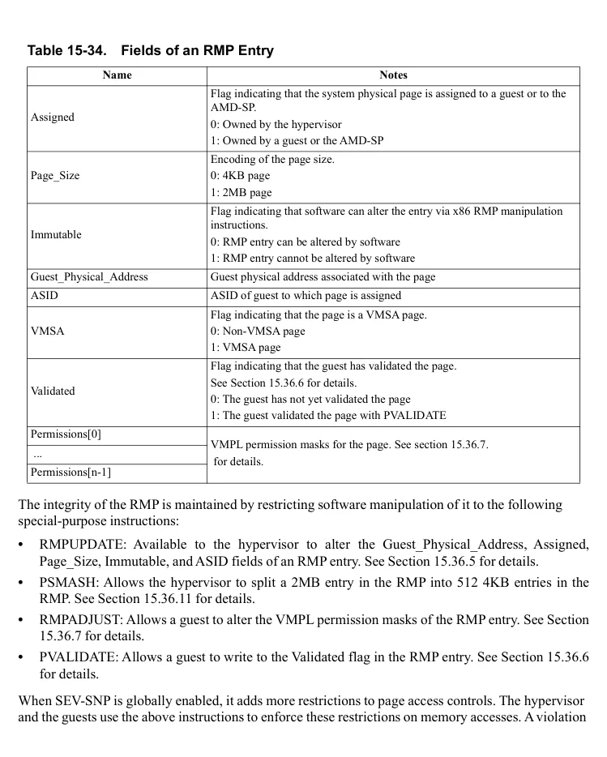

</details>


<!-- PDF source page: 666 | printed page: 604 -->

of memory access restrictions indicated by the RMP will result in an exception. See Section 15.36.10 for details.

<a id="15-36-4-initializing-the-rmp"></a>

### 15.36.4 Initializing the RMP

This section describes the single-level RMP initialization. The two-level RMP is described in Section 15.36.22, “Segmented RMP,” on page 621.

MSR C001_0132 (RMP_BASE) defines the system physical address of the first byte of the RMP. The MSR C001_0133 (RMP_END) defines the system physical address of last byte of the RMP. Software must program RMP_BASE and RMP_END identically for each core in the system and before enabling SEV-SNP globally.

RMP_BASE and (RMP_END+1) must be 8KB aligned. The AMD-SP may place further alignment requirements on these registers. Refer to the latest AMD-SP specifications to determine the required alignment.

The region of memory between RMP_BASE and RMP_END contains a 16KB region used for processor bookkeeping followed by the RMP entries, which are each 16B in size. The size of the RMP determines the range of physical memory that the hypervisor can assign to SNP-active virtual machines at runtime. The RMP covers the system physical address space from address 0h to the address calculated by:

((RMP_END + 1 – RMP_BASE – 16KB) / 16B) x 4KB

For example, if the RMP_BASE is equal to 10_0000h, then to cover the first 4GB of physical memory, RMP_END must be set to 110_3FFFh, which makes the RMP just over 16MB.

Once SEV-SNP is globally enabled, memory accesses are restricted by RMP checks. To ensure that the RMP starts in a known and non-restrictive state, software should write zeros to all memory from RMP_BASE to RMP_END before setting the SecureNestedPagingEn bit in the SYSCFG MSR. The hypervisor then requests the AMD-SP to finalize the initialization of the RMP. The AMD-SP initializes the RMP to prevent all software from directly writing to the memory between RMP_BASE and RMP_END. All subsequent RMP entry manipulation must occur either via the x86 RMP manipulation instructions or through interactions with the AMD-SP.

<a id="15-36-5-hypervisor-rmp-management"></a>

### 15.36.5 Hypervisor RMP Management

The hypervisor manages the SEV-SNP security attributes of pages assigned to SNP-active guests by altering the RMP entries of those pages. Because the RMP is initialized by the AMD-SP to prevent direct access to the RMP, the hypervisor must use the RMPUPDATE instruction to alter the entries of the RMP. RMPUPDATE allows the hypervisor to alter the Guest_Physical_Address, Assigned, Page_Size, Immutable, and ASID fields of an RMP entry.

SEV-SNP associates an owner with each system physical page through settings of the Assigned, ASID, and Immutable fields of the page’s RMP entry according to Table 15-35. A page can be owned by the hypervisor, a guest, or the AMD-SP.


<!-- PDF source page: 667 | printed page: 605 -->

**Table 15-35. RMP Page Assignment Settings**

| Owne | Assigned | ASID | Immutable |
| --- | --- | --- | --- |
| Hyperviso | 0 | 0 | - |
| Guest | 1 | ASID of the guest | - |
| AMD-SP | 1 | 0 | 1 |

When the hypervisor assigns a page to a guest, it must also set the Guest_Physical_Address and Page_Size to match the nested page table mapping for the guest. If not, access to the page by the guest will result in a fault. See Section 15.36.10 for details on the RMP access checks.

The hypervisor may transition any page that has Immutable set to 0 into a hypervisor-owned page by using RMPUPDATE to set Assigned to 0 and ASID to 0. To transition a page that has Immutable set to 1, the hypervisor must request the AMD-SP to transition the page.

The RMP initialization requirement to write zeros to the RMP (see Section 15.36.4) results in all pages in the system initially belonging to the hypervisor. Any memory pages which are not covered by the RMP are considered permanent hypervisor pages. For example, if the RMP is configured to only cover the first 4GB of memory then all memory above 4GB is considered hypervisor memory for the purpose of RMP access checks.

<a id="15-36-6-page-validation"></a>

### 15.36.6 Page Validation

Each page assigned to a VM is either validated or unvalidated, as indicated by the Validated flag in the page’s RMP entry. Memory accesses by the VM to private pages that are unvalidated generate a #VC. All pages are initially assigned as unvalidated.

The VM may use the PVALIDATE instruction to either set or clear the Validated flag of a page. It is expected that VMs would use PVALIDATE to set the Validated flag during VM startup to gain access to the memory the hypervisor has assigned. The VM may later use PVALIDATE to clear the Validated flag if its memory space is being reduced, such as after a memory hot-plug event.

Page validation allows a VM to detect an unexpected remapping of its pages by the hypervisor. Before accessing a page, the VM must validate the page. Once validated, any use of RMPUPDATE by the hypervisor to unassign, reassign, or remap the page will cause the page to become unvalidated. The VM can then detect tampering with the page mapping via the #VC that occurs from accessing unvalidated pages.

PVALIDATE takes a page size as an input parameter indicating that either a 4KB or 2MB page should be validated. If the VM attempts to use PVALIDATE on a 4KB page that is mapped to a 2MB or 1GB page in the nested page table, PVALIDATE generates an #VMEXIT(NPF). In this case, the hypervisor can smash the larger page into 4KB pages using the PSMASH instruction as described in Section 15.36.11. If the VM attempts to use PVALIDATE on a 2MB guest page that is mapped to 4KB nested pages, PVALIDATE returns an error indication to the VM. The VM can instead attempt to execute PVALIDATE for each of the 4KB pages individually.

<details>
<summary>Rendered source page 667 (figures/tables)</summary>

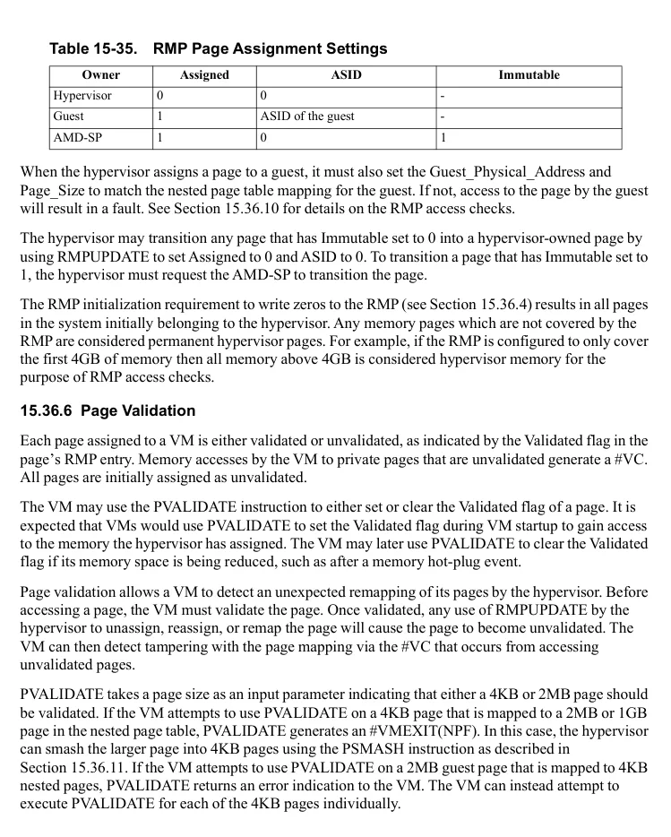

</details>


<!-- PDF source page: 668 | printed page: 606 -->

<a id="15-36-7-virtual-machine-privilege-levels"></a>

### 15.36.7 Virtual Machine Privilege Levels

A typical guest VM may consist of multiple vCPUs. SEV-SNP expands on this capability by enabling the vCPUs to run at distinct Virtual Machine Privilege Levels (VMPLs). Within a vCPU, the different VMPLs are represented by unique VMSAs and are expected to be run in a mutually exclusive manner. Each VMSA is assigned a VMPL as indicated by the VMPL field in the VMSA.

VMPLs are identified numerically starting at 0 with VMPL0 being the most privileged. The number of VMPLs available in an implementation is indicated in bits 15:12 of CPUID Fn8000_001F[EBX]. The VMPL feature enables a guest to sub-divide its address space and implement vCPU-specific access controls on a page-by-page basis.

The processor restricts guest memory accesses based on VMPL permission masks in RMP entries. Each RMP entry contains a set of permission masks, one mask for each implemented VMPL. On memory accesses, the processor checks the current VMPL permission mask of the page to determine whether the access is allowed. The permission mask bits are defined in Table 15-36.

**Table 15-36. VMPL Permission Mask Definition**

| Bit | Name | Settings |
| --- | --- | --- |
| 0 | Read | 0: Reads cause #VMEXIT(NPF)<br>1: Reads are allowed |
| 1 | Write | 0: Writes cause #VMEXIT(NPF)<br>1: Writes are allowed |
| 2 | Execute-Use | 0: Execution at CPL 3 causes #VMEXIT(NPF)<br>1: Execution at CPL 3 is allowed |
| 3 | Execute-Superviso | 0: Execution at CPL < 3 causes #VMEXIT(NPF)<br>1: Execution at CPL < 3 is allowed |
| 4 | Supervisor-Shadow-<br>Stack | 0: SSS accesses cause #VMEXIT(NPF)<br>1: SSS accesses are allowed |
| 5-7 | Reserved | SBZ |

When a guest access results in a #VMEXIT(NPF) due to a VMPL permission violation, an error code bit in EXITINFO1 is set as described in Section 15.36.10. It is illegal to configure a page with VMPL write permissions but not read permissions. A data access to such a page will result in a #VMEXIT(NPF).

When the hypervisor assigns a page to a guest using RMPUPDATE, full permissions are enabled for VMPL0 and are disabled for all other VMPLs. A VM can then use the RMPADJUST instruction to modify the permissions of VMPLs numerically higher than its own. For example, a vCPU executing at VMPL0 could use RMPADJUST to restrict a page of memory to be only read-write but not executable at VMPL1. However, the vCPU executing at VMPL1 could not alter its own permissions or the permissions of VMPL0.

<details>
<summary>Rendered source page 668 (figures/tables)</summary>

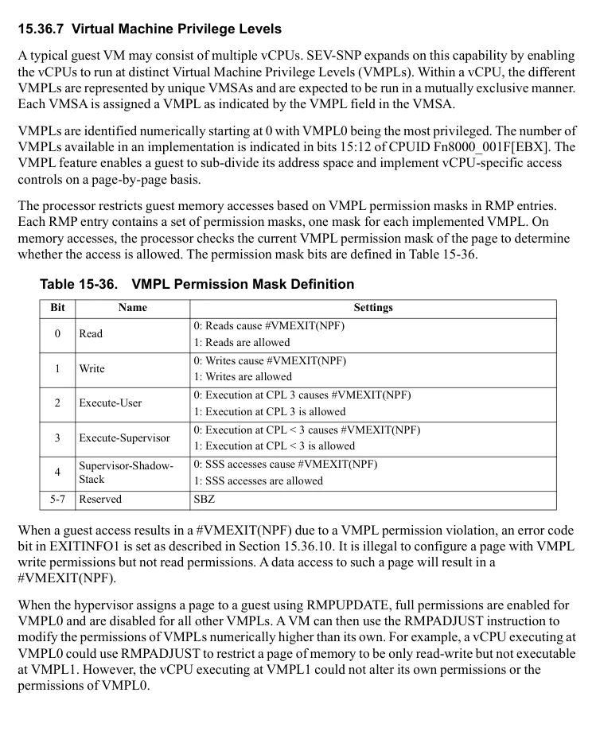

</details>


<!-- PDF source page: 669 | printed page: 607 -->

Further, RMPADJUST cannot be used to grant greater permissions than what is allowed by the permission mask for the current VMPL. For example, if VMPL1 attempts to grant write permission to a page to VMPL2, but VMPL1 does not have write permission to the page, RMPADJUST will fail.

**VMPL Supervisor Shadow Stack.** The VMPL Supervisor Shadow Stack (VMPL SSS) feature allows an SNP-active guest instead of the hypervisor (see Section 15.25.14) to restrict which guest physical addresses may be used for a guest supervisor shadow stack by designating SSS pages with VMPL SSS permission bit. Supervisor shadow stack accesses made by the guest to pages not designated as SSS pages in the VMPL Permissions result in a #VMEXIT(NPF).

Support for the VMPL SSS feature is indicated by CPUID Fn8000_001F_EAX[VmplSSS] (bit 7) = 1. The VMPL SSS feature is enabled by setting SEV_FEATURES bit 8 (VmplSSS) in VMSA. VMPL SSS and nested page controlled SSS feature are mutually exclusive. If SEV_FEATURES[VmplSSS] = 1 and VMCB[SSS] = 1, VMRUN fails with #VMEXIT(VMEXIT_INVALID).

If the VMPL SSS feature is enabled, than both supervisor and user shadow stack accesses must be to private memory pages. If not, a #PF exception with the reserved (RSV) error code bit set is generated in the guest.

<a id="15-36-8-virtual-top-of-memory"></a>

### 15.36.8 Virtual Top-of-Memory

In the VMSA of an SNP-active guest, the VIRTUAL_TOM field designates a 2MB aligned guest physical address called the virtual top of memory. When bit 1 (vTOM) of SEV_FEATURES is set in the VMSA of an SNP-active VM, the VIRTUAL_TOM field is used to determine the C-bit for data accesses instead of the guest page table contents. All data accesses below VIRTUAL_TOM are accessed with an effective C-bit of 1 and all addresses at or above VIRTUAL_TOM are accessed with an effective C-bit of 0. Note that page table accesses and instruction fetches always have an effective C-bit of 1, regardless of the value of VIRTUAL_TOM or whether the feature is enabled.

The Virtual TOM MSR (C001_0135) may be used to change the VIRTUAL_TOM value. CPUID Fn8000_001F_EAX[VirtualTom] (bit 18) = 1 indicates support for the Virtual TOM MSR. This MSR register is read-write when Virtual TOM is active, and an attempt to access it when Virtual TOM is not active will result in a #GP(0) exception. Virtual TOM MSR bits 63:52 and 20:0 are Reserved, RAZ. A WRMSR to this register flushes TLB entries belonging to the current ASID.

When virtual top of memory is enabled in SEV_FEATURES, the C-bit in the guest page table entries must be zero for all accesses. Any guest memory accesses with the C-bit set to 1 in the guest page tables will result in a #PF due to a reserved bit error.

<a id="15-36-9-reflect-vc"></a>

### 15.36.9 Reflect #VC

When running an SEV-SNP VM, the CPU generates #VC exceptions in response to events that may require hypervisor interaction. #VC exceptions and the events that may lead to them are discussed in Section 15.35.5. SEV-SNP VMs may either chose to handle #VC exceptions directly in their current guest context or turn #VC exceptions into Automatic Exits. This behavior is controlled by bit 2 (ReflectVC) of SEV_FEATURES. If this bit is set to 1, then any event that would otherwise lead to a #VC exception is instead turned into an Automatic Exit.


<!-- PDF source page: 670 | printed page: 608 -->

When a #VC is turned into an Automatic Exit, the guest VM terminates with an exit code of VMEXIT_VC. The error code for the #VC, which reflects the event which led to the #VC (e.g., VMEXIT_CPUID), is saved to the GUEST_EXITCODE field in the VMSA. Additional information about the event that caused the #VC is saved to the GUEST_EXITINFO1, GUEST_EXITINFO2, GUEST_EXITINTINFO, and GUEST_NRIP fields in the VMSA. The information saved to these fields is the same as the standard exit information provided for the event that occurred. For example, if the VM performs a port I/O instruction which is marked for interception, the GUEST_EXITCODE field will be set to VMEXIT_IOIO and the GUEST_EXITINFO1 field will contain information about the I/O port access, as defined in Section 15.10.2.

The Reflect #VC feature enables #VC events to be handled by a vCPU at a VMPL other than the one that initiated them. For example, a guest may contain a vCPU which consists of two different VMSAs. One VMSA is defined to execute at VMPL0, while the other has ReflectVC enabled and is defined to execute at VMPL3. When the vCPU running at VMPL3 encounters a #VC condition, the information is saved to its VMSA and control is returned to the hypervisor. The hypervisor may then run the vCPU at VMPL0 which can read the exit information saved to the VMPL3 VMSA, interact with the hypervisor as required, write appropriate response data back into the VMPL3 VMSA, and instruct the hypervisor to resume execution of the vCPU at VMPL3.

If the #VC event occurred during the processing of an interrupt or exception, the GUEST_EXITINTINFO.V bit will be set. If the Alternate Injection feature is enabled (see Section 15.36.15), hardware will automatically set the VINTR_CTRL[BUSY] bit in the VMSA. This enables a higher privileged VMPL to re-inject the event that caused the #VC.

The GUEST_EXITCODE, GUEST_EXITINFO1, GUEST_EXITINFO2, GUEST_EXITINTINFO, and GUEST_NRIP fields are populated by hardware on every Automatic Exit, regardless of the ReflectVC feature. For Automatic Exits other than reflected #VCs, these fields are set to the same values that are set in the VMCB.

<a id="15-36-10-rmp-and-vmpl-access-checks"></a>

### 15.36.10 RMP and VMPL Access Checks

When SEV-SNP is enabled globally, the processor places restrictions on all memory accesses based on the contents of the RMP, whether the accesses are performed by the hypervisor, a legacy guest VM, a non-SNP guest VM or an SNP-active guest VM. The processor may perform one or more of the following checks depending on the context of the access:

- RMP-Covered: Checks that the target page is covered by the RMP. A page is covered by the RMP if its corresponding RMP entry is below RMP_END. Any page not covered by the RMP is considered a Hypervisor-Owned page.
- Hypervisor-Owned: Checks that if the target page is covered by the RMP then the Assigned bit of the target page is 0. If the page table entry that specifies the sPA indicates that the target page size is 2MB, then all RMP entries for the 4KB constituent pages of the target page must have the Assigned bit set to 0. Accesses to 1GB pages only install 2MB TLB entries when SEV-SNP is enabled, therefore this check treats 1GB accesses as 2MB accesses for purposes of this check.
- Guest-Owned: Checks that the ASID field of the RMP entry of the target page matches the ASID of the current VM.


<!-- PDF source page: 671 | printed page: 609 -->

- Reverse-Map: Checks that the Guest_Physical_Address of the RMP entry of the target page matches the guest physical address of the translation.
- Validated: Checks that the Validated field of the RMP entry of the target page is 1.
- Mutable: Checks that the Immutable field of the RMP entry of the target page is 0.
- Page-Size: Checks that the following conditions are met:
- If the nested page table indicates a 2MB or 1GB page size, the Page_Size field of the RMP entry of the target page is 1.
- If the nested page table indicates a 4KB page size, the Page_Size field of the RMP entry of the target page is 0.
- VMPL: Checks that the VMPL permission mask allows access. See Section 15.36.7 for details.

Table 15-37 describes under which conditions each check is performed and what fault is produced on failure.

**Table 15-37. RMP Memory Access Checks**

| Host/Guest | SNP-<br>Active | Type of Access | C-Bit | Check | Fault |
| --- | --- | --- | --- | --- | --- |
| Host | - | Data write,<br>Page Table Access | - | Hypervisor-Owned | #PF |
| Guest | No | Data write,<br>Page Table Access | - | Hypervisor-Owned | #VMEXIT(NPF) |
| Guest | Yes | Instruction Fetch,<br>Page Table Access | - | RMP-Covered,<br>Guest-Owned,<br>Reverse-Map,<br>Mutable,<br>Page-Size | #VMEXIT(NPF) |
| Guest | Yes | Instruction Fetch,<br>Page Table Access |  | Validated | #VC |
| Guest | Yes | Instruction Fetch,<br>Page Table Access |  | VMPL | #VMEXIT(NPF) |
| Guest | Yes | Data write | 0 | Hypervisor-Owned | #VMEXIT(NPF) |
| Guest | Yes | Data write,<br>Data read | 1 | RMP-Covered,<br>Guest-Owned,<br>Reverse-Map,<br>Mutable,<br>Page-Size | #VMEXIT(NPF) |
| Guest | Yes | Data write,<br>Data read |  | Validated | #VC |
| Guest | Yes | Data write,<br>Data read |  | VMPL | #VMEXIT(NPF) |

In addition, any memory access that results in an RMP check may result in an RMP violation (#PF or #VMEXIT(NPF)) if the accessed RMP entries are in use by other logical processors. In this case, software should retry the access.

<details>
<summary>Rendered source page 671 (figures/tables)</summary>

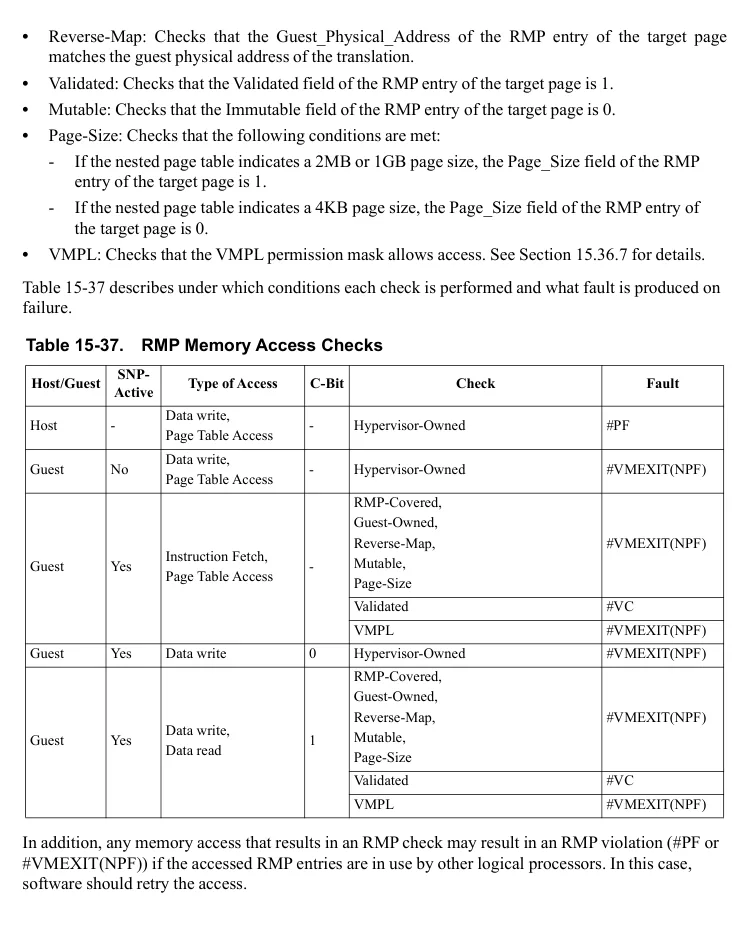

</details>


<!-- PDF source page: 672 | printed page: 610 -->

If a memory access results in a modification of the Accessed or Dirty bits in a page table entry, this page table modification is treated similarly to data write accesses by SEV-SNP. For any such page table modification access, the page size of the access is inherently 4KB.

If the virtual TOM feature (see Section 15.36.8) is enabled, then the Virtual TOM setting is used to determine the C-bit for a given guest access. Guest physical addresses below Virtual TOM are considered to have a C-bit set to 1.

The following page-fault error bits are set on an RMP check related #PF:

- Bit 31 (RMP): Set to 1 if the fault was caused due to an RMP check or a VMPL check failure, 0 otherwise. All RMP violations described in this section will set this bit to 1.

Additionally, the following page-fault error bits may be set on a #VMEXIT(NPF) in EXITINFO1:

- Bit 34 (ENC): Set to 1 if the guest’s effective C-bit was 1, 0 otherwise.
- Bit 35 (SIZEM): Set to 1 if the fault was caused by a size mismatch between PVALIDATE or RMPADJUST and the RMP, 0 otherwise.
- Bit 36 (VMPL): Set to 1 if the fault was caused by a VMPL permission check failure, 0 otherwise.
- Bit 37 (SSS): Set to VMPL permission mask SSS (bit 4) value if VmplSSS is enabled.

The effective C-bit is always a 1 on any guest instruction fetch, page table access, or data write to private (C=1) memory.

All RMP checks described in this section occur after page table and nested page table access checks and have lower priority than existing paging checks. Table 15-37 reflects the relative priority of RMP checks. Namely, VMPL checks have the lowest priority, preceded by page validation checks. For example, if a guest access fails the Page-Size check and the Validated check, a #VMEXIT(NPF) will occur instead of a #VC since the Page-Size check has priority over the page validation check.

A failure of the page validation check results in a #VC with error code PAGE_NOT_VALIDATED (0x404). The faulting guest virtual address is saved to CR2 when this error occurs.

<a id="15-36-11-large-page-management"></a>

### 15.36.11 Large Page Management

The hypervisor may need to convert a 2MB page assigned to a guest into 4KB pages. This conversion is called page smashing and requires the hypervisor to alter the RMP. The hypervisor can use RMPUPDATE to alter the size of the page in the RMP, but this will clear the validated bit.

To convert a 2MB page into 4KB pages without altering the validated status of the region, the hypervisor may use the PSMASH instruction. PSMASH takes a 2MB aligned system physical address and smashes the page while preserving the Validated bit in the RMP. After PSMASH successfully completes, the RMP entries of the resulting 4KB pages have the following contents:

- Consecutive values in the Guest_Physical_Address fields
- Page_Size set to 0 indicating 4KB pages
- All other RMP fields copied from the original 2MB page RMP entry


<!-- PDF source page: 673 | printed page: 611 -->

One reason the hypervisor may need to smash a 2MB page is if the guest executes PVALIDATE or RMPADJUST on a 4KB page that is backed by a 2MB page. In that case, the instructions generate a #VMEXIT(NPF) with the SIZEM bit set in EXITINFO1. To resolve this, the hypervisor can smash the page and then have the guest restart the instruction.

If the guest wishes to validate a 2MB aligned region, the guest should first attempt to execute PVALIDATE with a size of 2MB. If the page is backed by 4KB pages, PVALIDATE terminates with a FAIL_SIZEMISMATCH error. In this case, the guest should then execute PVALIDATE on each 4KB page individually. This allows the guest to take advantage of the more efficient 2MB mappings and avoid having the hypervisor unnecessarily smash the page.

Table 15-38 summarizes the potential page size mismatches and how to resolve them.

**Table 15-38. PVALIDATE/RMPADJUST Page Size Mismatch Combinations**

| Requested<br>Page Size | Page Size in<br>RMP | Error Condition | Recommended Handling |
| --- | --- | --- | --- |
| 4KB | 2MB | #VMEXIT(NPF) | PSMASH |
| 2MB | 4KB | FAIL SIZEMISMATCH | Guest retries on each 4KB constituent page |

The reverse operation of converting a set of consecutive 4KB pages into a single 2MB page requires assistance from either the guest or the AMD-SP to ensure that the operation is safe to perform.

<a id="15-36-12-running-snp-active-virtual-machines"></a>

### 15.36.12 Running SNP-Active Virtual Machines

As with SEV-ES guests, SNP-active guests are described by a hypervisor controlled VMCB and a guest encrypted VMSA. The initial VMSA for an SNP-active guest must be set up through coordination with the AMD-SP, the details of which are beyond the scope of this manual. This includes the initial configuration of the SEV_FEATURES field in the VMSA which indicates which guest security features are enabled for that particular VM instance. VMRUN to an SNP-active guest will fail with a VMEXIT_INVALID error code if SEV-SNP is not globally enabled.

**VMRUN Checks.** When SEV-SNP is globally enabled on a system, the VMRUN instruction performs additional security checks on various memory pages. These checks are similar to the ones described in Section 15.36.10. Note that where a check depends on page size, a page size of 4KB is used. In addition to the checks described in that section, an additional check exists:

- VMSA: Checks that the VMSA field in the RMP entry equals 1.

The VMSA field in an RMP entry may be set by the AMD-SP, or by a vCPU running at VMPL0 using the RMPADJUST instruction.

<details>
<summary>Rendered source page 673 (figures/tables)</summary>

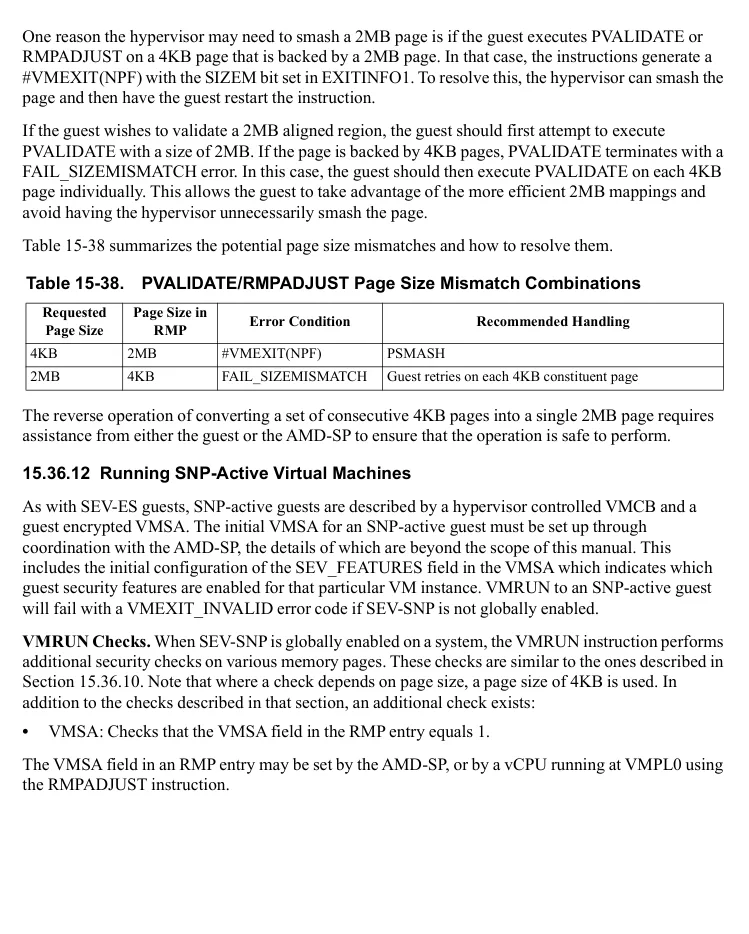

</details>


<!-- PDF source page: 674 | printed page: 612 -->

The checks performed on VMRUN are as follows:

**Table 15-39. VMRUN Page Checks**

| Page Type | SNP-Active | Check | Fault |
| --- | --- | --- | --- |
| VMCB | - | Hypervisor-Owned | #GP(0) |
| AVIC Backing Page | - | Hypervisor-Owned | #VMEXIT(VMEXIT INVALID) |
| VMSA | No | Hypervisor-Owned | #VMEXIT(VMEXIT INVALID) |
| VMSA | Yes | RMP-Covered<br>Guest-Owned<br>Reverse-Map<br>Mutable<br>VMSA | #VMEXIT(VMEXIT INVALID) |

The AVIC Logical Table, AVIC Physical Table, IOPM_BASE_PA, MSRPM_BASE_PA, and nCR3 are not checked by VMRUN as these structures are only read by the hardware.

After a successful VMRUN, the VMCB page, as well as any AVIC Backing Page and VMSA Page are marked as in-use by hardware, and any attempt to modify the RMP entries for these pages via instructions like RMPUPDATE will result in a FAIL_INUSE response. The in-use marking is automatically cleared by hardware after a #VMEXIT event.

**Other Checks.** In addition to the RMP checks performed by VMRUN, a few other VM-related operations perform special RMP checks.

The address written to the VM_HSAVE_PA MSR, which holds the address of the page used to save the host state on a VMRUN, must point to a hypervisor-owned page. If this check fails, the WRMSR will fail with a #GP(0) exception. Note that a value of 0 is not considered valid for the VM_HSAVE_PA MSR and a VMRUN that is attempted while the HSAVE_PA is 0 will fail with a #GP(0) exception.

The VMSAVE instruction also performs checks to ensure that the target page is hypervisor-owned. The VMSAVE instruction is not expected to be used with SEV-ES and SNP-active guests, as described in Section 15.36.8, but may be used with other guests.

If VMSAVE is executed in host mode and the target page fails the RMP check, a #GP(0) exception is generated. If VMSAVE is executed in a guest when the VMSAVE instruction is virtualized (see Section 15.33.1) and the target page fails the RMP check, then a #VMEXIT(NPF) is generated indicating an RMP permission error. In processors that support SEV-SNP, the execution of the VMSAVE instruction inside an SEV-ES or SNP-active guest is not supported and will result in a #VMEXIT(VMSAVE).

**Intercept Behavior.** All port I/O (IN, INS, OUT, OUTS) and CPUID instructions executed by an SNP-Active guest are treated as intercepted regardless of the intercept bits set in the VMCB and IOPM. Execution of these instructions in an SNP-Active guest will unconditionally generate a Non-Automatic Exit.

<details>
<summary>Rendered source page 674 (figures/tables)</summary>

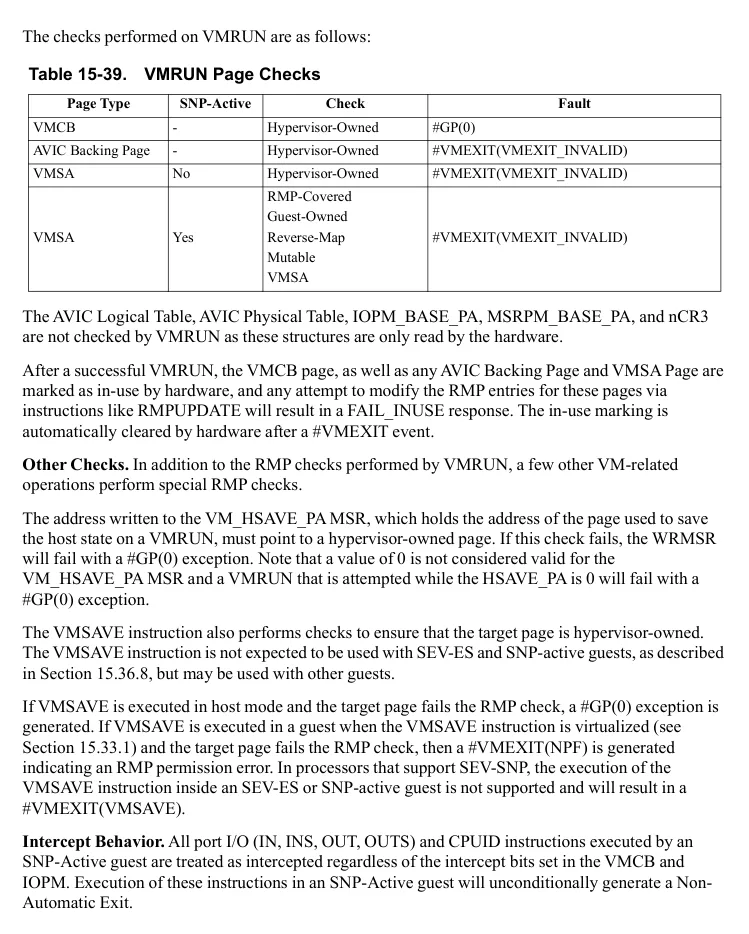

</details>


<!-- PDF source page: 675 | printed page: 613 -->

<a id="15-36-13-debug-registers"></a>

### 15.36.13 Debug Registers

SEV-ES and SNP-active guests may choose to enable full virtualization of CPU debug registers through SEV_FEATURES bit 5 (DebugVirtualization).

When enabled, the DR[0-3] registers and DR[0-3]_ADDR_MASK registers are swapped as type ‘B’ state (see Appendix B).

<a id="15-36-14-memory-types"></a>

### 15.36.14 Memory Types

When an SNP-active guest accesses memory, the hardware forces the use of coherent memory types. This prevents the hypervisor from attempting to corrupt guest memory by the use of non-coherent memory types for accesses by the guest.

If a guest memory access is determined to be non-coherent after the memory type determination logic described in Section 15.25.8, the hardware forces a coherent type as described in Table 15-40.

**Table 15-40. Non-Coherent Memory Type Conversion**

| Non-Coherent Memory Type | Forced Coherent Memory Type |
| --- | --- |
| UC | CD |
| WC | WC+ |

<a id="15-36-15-tlb-management"></a>

### 15.36.15 TLB management

For non-SNP-active guests, when a hypervisor moves a VMSA to a new logical processor it must ensure that the VMSA cannot use any stale (incorrect) TLB translations to prevent corruption of the guest. For SNP-active guests, to avoid any dependency on the hypervisor for correctly managing guest TLB contents, the hardware detects when the VMSA is moved and manages the TLB for that guest automatically. The hardware uses two VMSA fields to track this information: the TLB_ID (byte offset 3D0h) and the PCPU_ID (byte offset 3D8h).

During guest creation, software should initialize the TLB_ID and PCPU_ID by setting both to zero. The hardware subsequently manages the values in both fields throughout the lifetime of that VMSA. During operation, software may explicitly write PCPU_ID to 0 to force a TLB flush on the next VMRUN to that VMSA if desired. If this occurs, the hardware will set the PCPU_ID field to a non-zero value when it flushes the TLB.

For example, when guest software performs an RMPADJUST to alter the permissions of a VMPL, it may need to ensure that the existing TLB entries of all vCPUs executing at the targeted VMPL are not used anymore. The guest software can do this by writing zero to PCPU_ID of the affected VMSAs. When these VMSAs are re-entered with VMRUN, the hardware will ensure existing TLB entries are no longer used and set PCPU_ID to a non-zero value. This value can be checked for non-zero by the guest software to ensure the operation has completed before proceeding.

As with any guest, the hypervisor may use the TLB_CONTROL field in the VMCB to force TLB flushes when desired. When the hypervisor writes 3h or 7h to TLB_CONTROL, both global and non-global TLB entries of the guest are invalidated.

<details>
<summary>Rendered source page 675 (figures/tables)</summary>

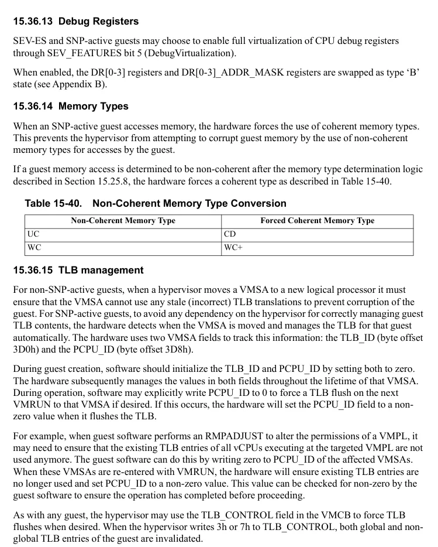

</details>


<!-- PDF source page: 676 | printed page: 614 -->

<a id="15-36-16-interrupt-injection-restrictions"></a>

### 15.36.16 Interrupt Injection Restrictions

SNP-active guests may choose to enable the Restricted Injection or Alternate Injection features through SEV_FEATURES bits 3 and 4 respectively. These features enforce additional interrupt and event injection security protections designed to help protect against malicious injection attacks. The two are mutually exclusive for a specific VMSA and an attempt to enable both will result in a #VMEXIT(VMEXIT_INVALID) when the VMRUN instruction is executed.

**Restricted Injection.** This feature disables all hypervisor-based interrupt queuing and event injection of all vectors except a new exception vector, #HV (28), which is reserved for SNP guest use, but never generated by hardware. #HV is only allowed to be injected into VMSAs that execute with Restricted Injection. #HV is a benign exception and can only be injected as an exception (VMCB.EVENTINJ[Type]=3) and without an error code. Guests running with Restricted Injection are expected to communicate with the hypervisor about events via a software-managed para-virtualization interface. This interface can use #HV injection as a doorbell to inform the guest that new events have been added.

The VMRUN instruction with Restricted Injection enabled will fail with a VMEXIT_INVALID error code if the hypervisor attempts the injection of any unsupported event or attempts to run the guest with AVIC enabled.

**Alternate Injection.** This feature replaces all hypervisor-based interrupt queuing and event injection with guest-controlled queuing and injection. When Alternate Injection is enabled in a VMSA, event injection information on VMRUN is read from the EventInjCtrl field in the VMSA (offset 3E0h) and interrupt queuing information is read from the VIntrCtrl field in the VMSA (offset 3B8h). This feature is intended to be used in a multi-VMPL architecture where a high privilege VMSA injects events and interrupts directly into a low privilege VMSA.

When Alternate Injection is enabled, the EventInjCtlr field in the VMCB (offset A8h) is ignored on VMRUN. The VIntrCtrl field in the VMCB (offset 60h) is processed, but only the V_INTR_MASKING, Virtual GIF Mode, and AVIC Enable bits are used. The AVIC Enable bit must be 0 if the guest is running with Alternate Injection enabled, otherwise the VMRUN will fail with a VMEXIT_INVALID error code.

The remaining fields of VIntrCtrl (V_TPR, V_IRQ, VGIF, V_INTR_PRIO, V_IGN_TPR, V_INTR_VECTOR, V_NMI, V_NMI_MASK, V_NMI_EN) are read from the VMSA. Additionally, bit 10 of the encrypted VIntrCtrl field is defined as the INT_SHADOW bit and the unencrypted INT_SHADOW bit in VMCB offset 68h bit 0 is ignored. On a VMEXIT, the V_TPR, V_IRQ, V_NMI, V_NMI_MASK, and INT_SHADOW values are written back to the encrypted VIntrCtrl only.

In guests that run with Alternate Injection, bit 63 of the encrypted VIntrCtrl field is defined as a BUSY bit. On VMRUN, if VIntrCtrl[BUSY] is set to 1, then the VMRUN fails with a VMEXIT_BUSY error code. The BUSY bit enables a VMSA to be temporarily marked non-runnable while software modifications are in progress.


<!-- PDF source page: 677 | printed page: 615 -->

**Additional Intercept Behavior.** Additional hardware-forced intercept behavior exists in guests that run with either of these features enabled:

- For either feature, hardware treats physical INTR, NMI, INIT, and #MC events as intercepted regardless of the intercept bit set in the VMCB.
- Under Alternate Injection, any MSR access to the x2APIC MSR range (MSR 0x800-0x8FF) by the guest is intercepted regardless of the MSR_PROT intercept and MSR protection bitmap. In this case, the interception behavior is the same as what would occur if the MSR bitmap indicated an interception of the corresponding MSR.

<a id="15-36-17-side-channel-protection"></a>

### 15.36.17 Side-Channel Protection

SEV-SNP provides optional protections against certain side channel attacks.

**Branch Target Buffer Isolation**

SNP-active guests may choose to enable the Branch Target Buffer Isolation mode through SEV_FEATURES bit 7 (BTBIsolation). The Branch Target Buffer (BTB) is an internal CPU structure that is used when predicting indirect branches, and SNP-active guests may choose to impose additional restrictions on it in order to help prevent certain types of speculative execution-based side channels.

When executing an SNP-active guest when BTB Isolation is enabled, CPU hardware will ensure that no code outside of that guest context is able to influence the BTB-based predictions performed by hardware within the guest. Hardware tracks the source of prediction information in the BTB and may flush BTB contents when required to maintain this isolation.

In hardware that supports BTB Isolation, new BTB prediction information is never written if SPEC_CTRL[IBRS] is enabled in the current context. Therefore, it is recommended that non-guest software that executes temporarily (e.g., hypervisor exit handling code) run with SPEC_CTRL[IBRS] set to 1. This ensures that indirect branch information from that context is not stored in the BTB and may avoid the need for a BTB flush when guest execution is resumed.

**Indirect Branch Prediction Barrier on Entry**

SNP-active guests may choose to enable Indirect Branch Prediction Barrier (IBPB) on Entry through SEV_FEATURES bit 21 (IbpbOnEntry). Support for IBPB on Entry is indicated by CPUID Fn8000_001F[IbpbOnEntry], bit 31. When entering a guest context with IbpbOnEntry enabled, CPU hardware writes PRED_CMD[IBPB]=1 before executing guest instructions.

**Instruction Based Sampling**

SEV-ES and SNP-active guests may choose to disallow the use of Instruction Based Sampling (IBS) by the hypervisor in order to limit the information that may be gathered about their execution. Guests may enable this restriction through SEV_FEATURES bit 6 (PreventHostIBS). When a VMRUN is executed on a guest that has enabled this protection, the IbsFetchCtl[IbsFetchEn] and IbsOpCtl[IbsOpEn] MSR bits must be 0. If either of these bits are not 0 then the VMRUN will fail with a VMEXIT_INVALID error code.


<!-- PDF source page: 678 | printed page: 616 -->

**VMSA Register Protection**

SNP-active guests may choose to enable the VMSA Register Protection feature through SEV_FEATURES bit 14 (VmsaRegProt). When an Automatic Exit occurs and this feature is enabled, CPU hardware will obfuscate the values of certain registers before they are written to the VMSA. The hardware will then deobfuscate these values on a subsequent VMRUN. This obfuscation may help prevent certain types of side channel attacks on the encrypted VMSA ciphertext.

The obfuscation is performed with a bit-wise XOR operation between the register value and an 8B nonce. The nonce value is stored in the VMSA and is updated in a pseudo-random manner by the CPU hardware on every Automatic Exit. When initializing a new VMSA, it is recommended that the nonce is set to a random value.

The specific VMSA fields which are obfuscated when this feature is enabled may vary by implementation. More information about this may be found in the AMD-SP SEV-SNP ABI specification.

**SMT Protection**

The SMT Protection feature allows SEV-SNP VMs to require the sibling thread to be idle while the VM is being run. This ensures that malicious code is not executed by the sibling thread and therefore provides mitigation for potential side channel attacks related to shared core resources. The hypervisor must execute the HLT instruction or request an I/O C-state on the sibling thread prior to executing the VMRUN instruction to run an SEV-SNP vCPU with the SMT Protection feature enabled.

SNP-active guests may choose to enable the SMT Protection feature through SEV_FEATURES bit 15 (SmtProtection). Support for the SMT Protection feature is indicated by CPUID Fn8000_001F_EAX[25](SmtProtection)=1.

When the hypervisor executes VMRUN to run an SNP-active guest with SMT Protection enabled, the processor checks if the sibling thread is in an idle state and in host mode. If not, the VMRUN fails with a VMEXIT_IDLE_REQUIRED error code.

When a thread is in the idle state and the sibling thread is in guest mode with SMT Protection active, the thread in the idle state does not immediately exit the idle state upon receiving a wake up event, such as an interrupt. Instead, the processor writes the APIC ICR register with the IDLE_WAKEUP_ICR MSR value and remains in the idle state until the sibling thread enters host mode. The write is done once and only if x2APIC mode is enabled. It is recommended that hypervisor software program the IDLE_WAKEUP_ICR value to send an IPI to the sibling thread in order to force it to enter host mode.

The IDLE_WAKEUP_ICR MSR (C001_0137h) has the same layout and access properties as the x2APIC Interrupt Command Register (ICR) MSR (see Section 16.13).

<a id="15-36-18-secure-tsc"></a>

### 15.36.18 Secure TSC

SNP-active guests may choose to enable the Secure TSC feature through SEV_FEATURES bit 9 (SecureTscEn). When enabled, Secure TSC changes the guest view of the Time Stamp Counter when


<!-- PDF source page: 679 | printed page: 617 -->

read by the guest via either the TSC MSR, RDTSC, or RDTSCP instructions. The TSC value is first scaled with the GUEST_TSC_SCALE value from the VMSA and then is added to the VMSA GUEST_TSC_OFFSET value. The P0 frequency, TSC_RATIO (C001_0104h) and TSC_OFFSET (VMCB offset 50h) values are not used in the calculation.

The GUEST_TSC_SCALE is an 8.32 fixed point binary number which is composed of 8 bits of integer and 32 bits of fraction. The AMD-SP SEV-SNP ABI specification provides additional information about the Secure TSC feature and initialization of GUEST_TSC_SCALE.

Guests that run with Secure TSC enabled may read the GUEST_TSC_FREQ MSR (C001_0134h) which returns the effective frequency in MHz of the guest view of TSC. This MSR is read-only and attempting to write the MSR or read it when outside of a guest with Secure TSC enabled causes a #GP(0) exception.

Guests that run with Secure TSC enabled are not expected to perform writes to the TSC MSR (10h). If such a write occurs, subsequent TSC values read are undefined.

<a id="15-36-19-sev-snp-instruction-virtualization"></a>

### 15.36.19 SEV-SNP Instruction Virtualization

The hypervisor uses RMPUPDATE and PSMASH instructions to modify the RMP when SEV-SNP is enabled. In a nested virtualization use case, when the hypervisor is running as a guest, these instructions should be replaced with WRMSR VIRT_RMPUPDATE MSR (C001_F001h) and WRMSR VIRT_PSMASH MSR (C001_F002h), respectively. The VIRT_RMPUPDATE MSR, VIRT_PSMASH MSR and CPUID Fn8000_001F_EAX[NestedVirtSnpMsr] (bit 29), which reports VIRT_RMPUPDATE and VIRT_PSMASH MSR support, are not implemented in the processor and are expected to be emulated by the top-level hypervisor.

VIRT_RMPUPDATE MSR input convention:

RAX: 4KB aligned GPA RDX: New RMP entry, bytes 7:0 R8: New RMP entry, bytes 15:8

VIRT_RMPUPDATE MSR output convention:

RAX: RMPUPDATE return code

VIRT_PSMASH MSR input convention:

RAX: 2MB aligned GPA

VIRT_PSMASH MSR output convention:

RAX: PSMASH return code

<a id="15-36-20-allowed-sev-features"></a>

### 15.36.20 Allowed SEV Features

A hypervisor may enforce which SEV features may be enabled in an SEV-SNP VM with Allowed SEV Features. Allowed SEV Features support is indicated by CPUID


<!-- PDF source page: 680 | printed page: 618 -->

Fn8000_001F_EAX[AllowedSevFeatures] (bit 27) = 1. The Allowed SEV Features Mask is enabled when bit 63 at offset 138h in the VMCB is set to 1. The hypervisor may allow a specific feature by setting the corresponding ALLOWED_SEV_FEATURES_MASK bit to 1 and may disallow a specific feature by setting the corresponding bit to 0, where ALLOWED_SEV_FEATURES_MASK bits 61:0 correspond to VMSA SEV_FEATURES bits 61:0.

Some SEV features can only be used if the Allowed SEV Features Mask is enabled, and the mask is configured to permit the corresponding feature. If the Allowed SEV Features Mask is not enabled, these features are not available (see SEV_FEATURES in Appendix B, Table B-4).

When the Allowed SEV Features Mask is enabled, the VMRUN instruction checks that all SEV_FEATURES bits which are set in VMSA offset 3B0h are also set in ALLOWED_SEV_FEATURES_MASK. If not, VMRUN fails with a VMEXIT_INVALID error code. SEV_FEATURES is saved to VMCB field GUEST_SEV_FEATURES at offset 140h on a #VMEXIT.

<a id="15-36-21-secure-avic"></a>

### 15.36.21 Secure AVIC

Secure AVIC feature provides hardware acceleration of performance sensitive APIC accesses and support for managing guest-owned APIC state for SEV-SNP guests. Secure AVIC additionally offers security protections designed to help protect against malicious injection attacks by limiting events which may be injected into an SEV-SNP guest.

1. 15. 36.21.1 Enabling Secure AVIC** Hardware support for Secure AVIC is indicated by CPUID Fn8000_001F_EAX[SecureAvic] (bit 26) = 1. Secure AVIC mode is selected when SecureAvic (bit 16 in SEV_FEATURES) is set. While in Secure AVIC mode, the guest may set SecureAvicEn (bit 0 in Secure AVIC Control MSR) to enable the guest APIC backing page and full Secure AVIC capabilities. Enablement of this feature is additionally dependent on the value of ALLOWED_SEV_FEATURES_MASK in VMCB (see Section 15.36.20, “Allowed SEV Features”, on page N).

The Secure AVIC feature only supports the x2APIC MSR interface.

1. 15. 36.21.2 VMRUN and #VMEXIT** Secure AVIC mode is mutually exclusive with Restricted Injection, Alternate Injection, and hypervisor controlled AVIC modes. If the SecureAvic bit is set to 1, and the AVIC Enable bit in the VMCB is set to 1 or the RestrictedInjection or AlternateInjection bits in SEV_FEATURES are set to 1, VMRUN will fail with #VMEXIT(VMEXIT_INVALID).

The VMRUN instruction loads the Secure AVIC Control MSR from VMSA offset 320h. If SecureAvicEn is set to 1 and GuestApicBackingPagePtr is not a valid guest physical address, VMRUN will fail with #VMEXIT(VMEXIT_INVALID).

The interrupt control information loaded from the VMCB and VMSA for Secure AVIC mode operation is the same as the information loaded in Alternate Injection mode. When the SecureAvicEn


<!-- PDF source page: 681 | printed page: 619 -->

bit is set to 1, virtual INTR and virtual VNMI information loaded from the VMSA is ignored, and instead determined as follows:

- The IRR field in the Guest APIC Backing page is updated with IRRs hypervisor wishes to inject. If the UpdateIRR bit is set, the guest-controlled AllowedIRR mask is logically ANDed with the host-controlled RequestedIRR and then is logically ORed into the IRR field in the Guest APIC Backing page. The 256-bit AllowedIRR vector is specified in the guest backing page with eight 32-bit registers, where Guest Allowed IRR bit n is at bit position (n modulo 32) at offset (204h + n / 32). RequestedIRR is specified at VMCB offset 150h.
- The Guest AVIC Backing page is evaluated and V_IRQ, V_INTR_PRIO, V_IGN_TPR, and V_INTR_VECTOR fields are updated in hardware.
- The V_NMI bit is set in hardware if the guest-controlled V_NMI bit in VMSA is set, both the guest-controlled AllowedNMI and the host-controlled V_NMI in VMCB are set, or if NmiReq (offset 278h, bit 0) in the Guest APIC Backing page is set.

When SecureAvicEn is set, NmiReq is cleared in the Guest APIC Backing page, and the UpdateIRR and RequestedIRR fields are cleared to 0 in the VMCB by the VMRUN instruction.

On processors that indicate support for Secure AVIC, if the BUSY bit in the VIntrCtrl VMSA field is set to 1, VMRUN to an SEV-ES or SEV-SNP guest will fail with a VMEXIT_BUSY error code.

On a VMEXIT in Secure AVIC mode, the guest virtual interrupt state (VIntrCtrl bits 15:0) and the Secure AVIC Control MSR are saved in the VMSA. Additionally, EXITINTINFO is written to the VMSA EVENTINJ field if EXITINTINFO[VECTOR] is not equal to 29 (#VC). This causes the processor to re-inject the interrupted event automatically on the next VMRUN.

In Secure AVIC mode hardware treats physical INTR, NMI, INIT, and #MC events as intercepted regardless of the corresponding intercept bit values in the VMCB.

1. 15. 36.21.3 Secure AVIC Control MSR** The Secure AVIC Control MSR is used to configure Secure AVIC feature in a guest. The Secure AVIC Control MSR (C001_0138) fields are defined as follows:

63 52 51 32

Reserved GuestApicBackingPagePtr

31 12 11 2 1 0

SecureAvicEn

AllowedNmi

GuestApicBackingPagePtr Reserved


<!-- PDF source page: 682 | printed page: 620 -->

**Bits Mnemonic Description Access type** 63:52 Reserved MBZ 51:12 GuestApicBackingPagePtr Guest APIC Backing Page Pointer R/W 11:2 Reserved MBZ 1 AllowedNmi Host injection of NMI is allowed R/W 0 SecureAvicEn Secure Avic Enable R/W

**Figure 15-32. Secure AVIC Control MSR**

The Secure AVIC Control MSR can only be accessed in Secure AVIC mode. An attempt to access it when not in Secure AVIC mode will result in a #GP(0) exception.

If the SecureAvicEn is set to 1 and Guest APIC Backing Page Pointer is not a valid guest physical address when this MSR is written, a #GP(0) exception is generated.

1. 15. 36.21.4 Guest APIC Backing Page** Guest accesses to local APIC registers are redirected to the guest APIC backing page in system memory. The GPA of the guest backing page is saved in the VMSA and may be controlled by the guest with the Secure AVIC Control MSR.

It is required that the guest APIC backing page for a vCPU is pinned in system memory between VMRUN and VMEXIT because some AVIC hardware acceleration sequences may not be restartable when secure AVIC is enabled. If an access to the guest's own backing page by AVIC hardware results in a nested page fault, EXITINFO1 bit 63 (Not Restartable) is set (this is an Automatic Exit) and the BUSY bit in the VMSA is set. If the guest APIC backing page is not validated (Validated bit in the RMP entry is 0), a #VC with error code NOT_RESTARTABLE (0x406) is generated. Additionally, if ReflectVC is enabled, the BUSY bit in the VMSA is set.

For security, the guest should ensure that the Guest Backing Page Pointer maps to an encrypted guest page.

1. 15. 36.21.5 Guest APIC Accesses** Guest APIC accesses are handled by Secure AVIC hardware as follows:

- Allow: The backing page access is performed.
- Fault: The backing page is not accessed and #VC is generated (NAE).
- Trap: The backing page access is performed and #VC is generated (NAE).

APIC register access behavior is the same for Secure AVIC and x2AVIC except for Interrupt Command Register (ICR) accesses (see Table 15-22).

When a VMEXIT_AVIC_INCOMPLETE_IPI or VMEXIT_AVIC_NOACCEL is generated and ReflectVC is enabled, the BUSY bit in the VMSA is set.

<details>
<summary>Rendered source page 682 (figures/tables)</summary>

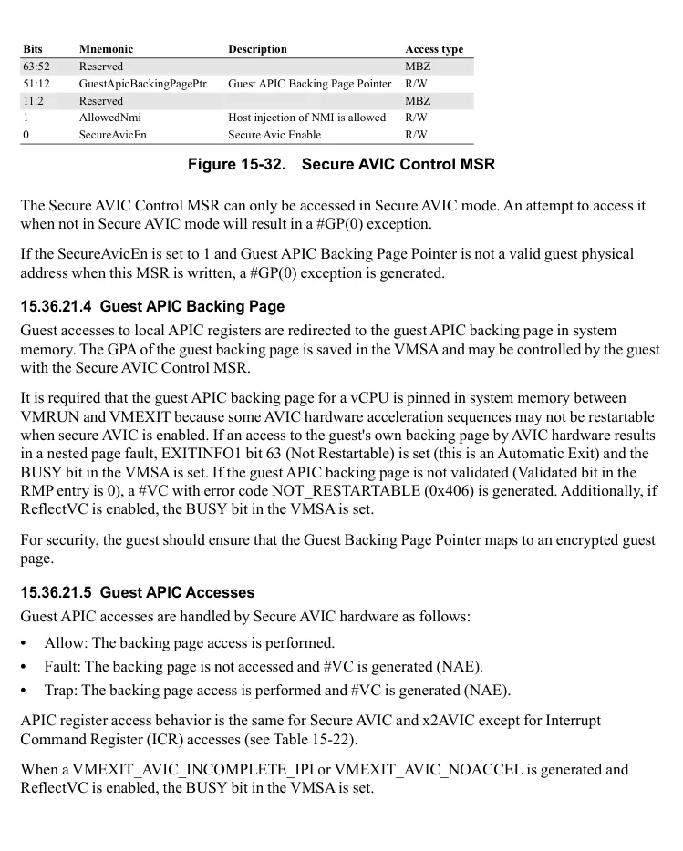

</details>


<!-- PDF source page: 683 | printed page: 621 -->

x2APIC MSR intercepts in the MSRPM are ignored in Secure AVIC mode. x2APIC MSR accesses are not intercepted when Secure AVIC is enabled and are always intercepted when Secure AVIC is disabled.

**ICR, TPR and EOI Accesses.**

Secure AVIC hardware accelerates Self IPIs, specifically ICR MSR (830h) write with Destination Shorthand (DSH) field equal to self (01b) and SELF_IPI MSR (83Fh) write. It updates the IRR in the backing page, evaluates the new IRR, injects VINTR if allowed by interrupt masking and priority, and continues with guest code execution. ICR writes with DSH field equal to all including self (10b), all excluding self (11b), or target will trap with a non-automatic exit and an AVIC_INCOMPLETE_IPI exit code with Reason ID Unaccelerated IPI (5). In Secure AVIC mode, the Physical APIC ID and Logical APIC ID tables are not used.

Secure AVIC hardware additionally accelerates accesses to TPR and EOI APIC registers as described in APM volume 2. Secure AVIC acceleration of these registers is identical to the legacy AVIC acceleration.

<a id="15-36-22-segmented-rmp"></a>

### 15.36.22 Segmented RMP

The segmented RMP feature provides a way to allocate non-contiguous RMP memory for a more efficient RMP layout and reduces RMP access latency in NUMA systems.

An RMP segment corresponds to a range of system physical addresses and an RMP that covers some or all addresses in that segment. RMP segment size is programmable, which provides flexibility for various system configurations. The RMP Segment Table is used to specify the RMP base, and the size of memory covered by RMP for each segment.

1. 15. 36.22.1 Determining Support for Segmented RMP** Hardware support for Segmented RMP is indicated by CPUID Fn8000_001F_EAX[SegmentedRmp] (bit 23) = 1. When Segmented RMP is supported, CPUID Fn8000_0025_EAX and CPUID Fn8000_0025_EBX provide additional Segmented RMP information.

The segment size refers to the amount of system physical addresses mapped by one entry in the RMP Segment Table. (See Section 15.36.22.3, “RMP Segment Table,” on page 622.) The minimum and maximum RMP segment sizes are calculated from CPUID Fn8000_0025_EAX[MinRmpSegSize] (bits 5:0) and CPUID Fn8000_0025_EAX[MaxRmpSegSize] (bits 11:6), as 2^(MinRmpSegSize) and 2^(MaxRmpSegSize) Mbytes, respectively.

CPUID Fn8000_0025_EBX[NumCachedSegments] (bits 9:0) indicates the number of RMP segment definitions that are cached by the hardware. For best performance, the number of RMP segments should be less than or equal to the NumCachedSegments.

CPUID Fn8000_0025_EBX[NumSegReduction] (bit 10) indicates that the number of RMP segments defined by the RMP Segment Table is reduced. When NumSegReduction is equal to 0, up to 512 RMP segments can be defined. When NumSegReduction is equal to 1, up to NumCachedSegments segments can be defined.


<!-- PDF source page: 684 | printed page: 622 -->

1. 15. 36.22.2 Enabling Segmented RMP** The Segmented RMP Configuration MSR (C001_0136) is used to configure Segmented RMP. The Segmented RMP Configuration MSR fields are defined as follows:

**Figure 15-33. Segmented RMP Configuration Register**

<details>
<summary>Extracted figure labels</summary>

```text
63
32
Reserved
31
14 13
8
7
1
0
SegRmpEn
Reserved
RmpSegSize
Reserved
Bits
Mnemonic
Description
Access type
63:14
Reserved
MBZ
13:8
RmpSegSize
RMP Segment Size
R/W
7:1
Reserved
MBZ
0
SegRmpEn
Segmented RMP Enable
R/W
```

</details>

This register may be written when SecureNestedPagingEn in SYSCFG MSR is 0. An attempt to write it when SecureNestedPagingEn is 1 will result in a #GP(0) exception. When SecureNestedPagingEn is 1, this MSR is read-only.

RmpSegSize is used to determine RMP segment size, which is equal to 2^(RmpSegSize). When SegRmpEn is 1, RmpSegSize must be between MinRmpSegSize and MaxRmpSegSize, inclusive. An attempt to write RmpSegSize to a value not within the allowed range will result in a #GP(0) exception.

When Segmented RMP is enabled, the RMP_BASE MSR points to a 1 MB aligned memory region. The first 16 KB of this region is used for processor bookkeeping. The next 4 KB of this region contains the RMP Segment Table. This table must be populated before SecureNestedPagingEn is set to 1. After the AMD-SP has initialized the system for SNP, the RMP Segment Table can no longer be modified by software.

The RMP_BASE alignment is checked when SecureNestedPagingEn is set to 1. If SegRmpEn is 1 and the value of RMP_BASE is not 1MB aligned, a #GP(0) is generated.

1. 15. 36.22.3 RMP Segment Table** The RMP Segment Table (RST) specifies the RMP, and the amount of system memory covered by the RMP for each segment.

<details>
<summary>Rendered source page 684 (figures/tables)</summary>

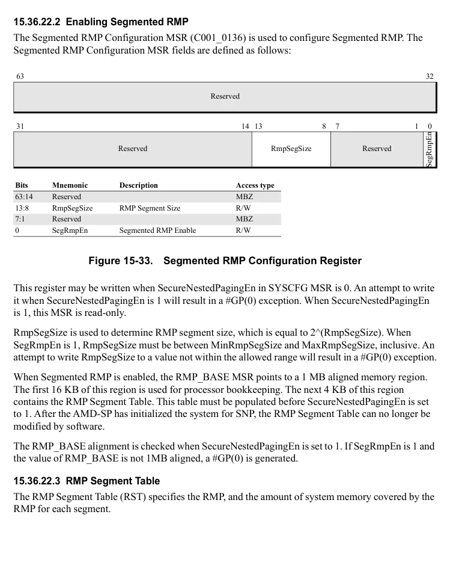

</details>


<!-- PDF source page: 685 | printed page: 623 -->

**Figure 15-34. RMP Segment Table Entry**

<details>
<summary>Extracted figure labels</summary>

```text
Each RST entry has the following format:
63
52 51
20 19
0
Reserved, MBZ
SegRmpBase
CoveredSize
```

</details>

The SegRmpBase specifies the pointer to the RMP for the RMP covered memory in this segment.

The CoveredSize filed indicates segment size covered by the RMP. Segment size covered by the RMP is expressed in Gbytes. If CoveredSize is equal to 0, then memory that corresponds to this segment is not covered by the RMP. If the covered segment size is greater than the RMP segment size, the entire segment is covered by the RMP. The size of the RMP for the segment is equal to 4MB × CoveredSize.

When NumSegReduction is equal to 0, if during the table walk the reserved bits in the corresponding RST entry are set, a #PF or VMEXIT_NPF reserved bit error is generated.

When NumSegReduction is equal to 1 and SecureNestedPagingEn changes from 0 to 1, a #GP(0) is generated if the RMPs for defined RST entries do not reside in valid physical address space.

When Segmented RMP is enabled, a page in system memory has an RMP entry if:

1. 1. There is an RST entry for the page address.

1. 2. CoveredSize in the RST entry is not equal to 0.

1. 3. The page address is covered by the RMP defined by the SegRmpBase and CoveredSize.

If a page does not have an RMP entry, it is a Hypervisor-Owned page. See GET_RMP_ENTRY_ADDR function in APM Volume 3 for more details on how RMP entry address is determined when Segmented RMP is enabled.

<a id="15-36-23-guest-intercept-control"></a>

### 15.36.23 Guest Intercept Control

The Guest Intercept Control feature allows a vCPU executing at a higher privilege VMPL to intercept and emulate specific events for a vCPU running at a lower privilege VMPL.

Guest Intercept Control support is indicated by CPUID Fn8000_001F[GuestInterceptCtl] (bit 22) = 1. SEV_FEATURES[GuestInterceptCtl], bit 13, may be used to enable the Guest Intercept Control feature in an SEV-SNP guest.

Guest-controlled intercepts for instructions, exceptions and interrupt events are defined by eight 4-byte intercept vectors in the VMSA, starting at offset 900h. These fields have the same layout as the host-controlled intercept vectors in the VMCB, starting at offset 0h. When the GuestInterceptCtl bit in SEV_FEATURES is set, an instruction, exception or interrupt event will be intecepted if either the corresponding host-controlled intercept or guest-controlled intercept is set. Note that the CPUID instruction and all IO port accesses are unconditionally intercepted in SEV-ES and SEV-SNP guests.

<details>
<summary>Rendered source page 685 (figures/tables)</summary>

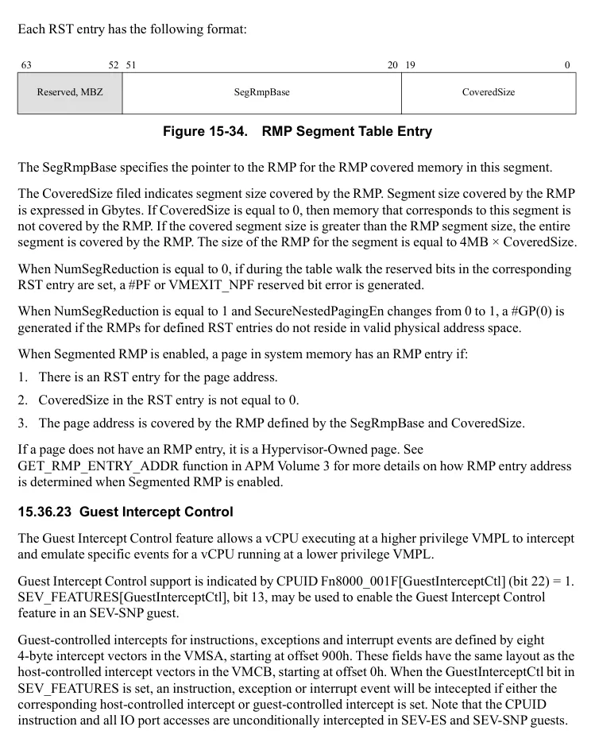

</details>


<!-- PDF source page: 686 | printed page: 624 -->

Guest-controlled MSR intercepts are defined for specific MSRs in four 8-byte intercept vectors in the VMSA, starting at offset 920h. (See Table B-2 on page 743.) For each MSR, two bits are defined for read and write access, where the lsb of the two bits is the read MSR intercept and the msb is the write MSR intercept. (See Appendix B.1, “Guest MSR Intercepts,” on page 753.) A RDMSR or WRMSR instruction will be intercepted if the corresponding intercept bit is set for the given MSR. Except where explicitly stated otherwise, if the MSR does not have defined intercept bits in these VMSA vectors, a RDMSR or WRMSR instruction will be unconditionally intercepted. Guest-controlled MSR intercepts are independent of host-controlled MSR intercepts defined in Section 15.11, “MSR Intercepts,” on page 518. A RDMSR or WRMSR instruction will be intercepted as indicated by either the corresponding host-controlled or guest-controlled intercept. Any undefined guest-controlled MSR intercept bits should be initialized to 1 during VM creation.

x2APIC MSRs are not subject to the guest intercept control feature in Secure AVIC mode.

<a id="15-37-speculation-control-virtualization"></a>

## 15.37 Speculation Control Virtualization

This section describes SVM support for speculation control virtualization.

<a id="15-37-1-spec-ctrl-virtualization"></a>

### 15.37.1 SPEC_CTRL Virtualization

A hypervisor may impose speculation controls on guest execution or a guest may impose its own speculation controls. Therefore, the processor implements the host and guest SPEC_CTRL register. Support for SPEC_CTRL virtualization is indicated by CPUID Fn8000_000A_EDX[SpecCtrl] (bit 20) = 1.

When in host mode, the host SPEC_CTRL value is in effect and writes update the host SPEC_CTRL register. On a VMRUN, the processor loads the guest SPEC_CTRL register value from the VMCB or VMSA. For most guests, processor behavior is controlled by the logical OR of the two registers. When the guest writes SPEC_CTRL, the guest register is updated. On a VMEXIT, the guest value is saved into the VMCB or VMSA and only the host SPEC_CTRL is in effect.

For SNP-active guests with BTB isolation enabled (see Section 15.36.17, “Side-Channel Protection,” on page 615), the host IBRS value, controlled by SPEC_CTRL[IBRS] or EFER[AIBRSE], does not affect the guest IBRS.

<a id="15-37-2-eraps-virtualization"></a>

### 15.37.2 ERAPS Virtualization

A hypervisor may control the return address predictor configuration in the guest if CPUID Fn8000_0021_EAX[ERAPS] (bit 24) = 1.

The ALLOW_LARGER_RAP bit in the VMCB (offset 58h, bit 40) controls the return address predictor size in the guest. If set to 0, the return address predictor size in the guest is 32. If ALLOW_LARGER_RAP is set to 1, the return address predictor size in the guest has the default value which is equal to CPUID Fn8000_0021_EBX[RapSize]. RapSize is always equal or greater than 32.


<!-- PDF source page: 687 | printed page: 625 -->

The CLEAR_RAP bit in the VMCB (offset 58h, bit 41) controls return address predictor clearing. If set to 1 on VMRUN, the processor clears the return address predictor before entering guest mode.

<a id="15-38-instruction-based-sampling-virtualization"></a>

## 15.38 Instruction-Based Sampling Virtualization

Hardware support for Instruction-Based Sampling (IBS) virtualization is reported by CPUID Fn8000_001F_EAX[IbsVirtGuestCtl] (bit 19) = 1 for SEV-ES and SEV-SNP guests, and by CPUID Fn8000_000A_EDX[IbsVirt] (bit 26) = 1 for all other guests. IBS virtualization is enabled when bit 12 in SEV_FEATURES in VMSA is set to 1 for SEV-ES and SEV-SNP guests, and when bit 2 at offset B8h in the VMCB is set to 1 for all other guests.

When a VMRUN is executed to an SEV-ES or SEV-SNP guest with IBS virtualization enabled, the IbsFetchCtl[IbsFetchEn] and IbsOpCtl[IbsOpEn] MSR bits must be 0. If either of these bits are not 0, the VMRUN will fail with a VMEXIT_INVALID error code. For all other guests, IbsFetchCtl[IbsFetchEn] and IbsOpCtl[IbsOpEn] MSR bits should be zero if IBS virtualization is enabled to prevent host IBS interrupts from leaking across a world switch.

When enabled, the following fields in the VMCB and VMSA state save area hold the guest fetch and op IBS register values:

- IBS_FETCH_CTL — IbsFetchCtl MSR
- IBS_FETCH_LINADDR — IbsFetchLinAd MSR
- IBS_OP_CTL — IbsOpCtl MSR
- IBS_OP_RIP — IbsOpRip MSR
- IBS_OP_DATA — IbsOpData1 MSR
- IBS_OP_DATA2 — IbsOpData2 MSR
- IBS_OP_DATA3 — IbsOpData3 MSR
- IBS_DC_LINADDR — IbsDcLinAd MSR
- BP_IBSTGT_RIP — IbsBrTarget MSR
- IC_IBS_EXTD_CTL — IbsFetchExtdCtl MSR

With IBS virtualization enabled, a guest is not able to read a physical address from either IbsFetchPhysAd MSR or IbsDcPhysAd MSR. Both registers return zero when read by the guest and the associated valid bits IbsFetchCtl[IbsPhyAddrValid] and IbsOpData3[IbsDcPhyAddrValid] respectively, return zero. Writes to IbsFetchPhysAd MSR and IbsDcPhysAd MSR within the guest are ignored.

IBS virtualization requires the use of AVIC (see section Section 15.29, “Advanced Virtual Interrupt Controller,” on page 563) or NMI virtualization (see Section 15.21.10, “NMI Virtualization,” on page 536) for delivery of a virtualized interrupt from the IBS hardware in the guest. Without virtualized interrupt delivery, an IBS interrupt occurring in the guest will not be delivered to either the guest or the hypervisor. When AVIC is enabled, the IBS LVT entry (Extended Interrupt 0 LVT) message type should be programmed to INTR or NMI.


<!-- PDF source page: 688 | printed page: 626 -->

<a id="15-39-performance-monitoring-counter-virtualization"></a>

## 15.39 Performance Monitoring Counter Virtualization

Hardware support for Performance Monitoring Counter (PMC) virtualization is reported by CPUID Fn8000_001F_EAX[PmcVirtGuestCtl] (bit 20) = 1 for SEV-ES and SEV-SNP guests and by CPUID Fn8000_000A_EDX[PmcVirt] (bit 8) = 1 for all other guests. PMC virtualization is enabled when bit 11 in SEV_FEATURES in VMSA is set to 1 for SEV-ES and SEV-SNP guests, and when bit 3 at offset B8h in the VMCB is set to 1 for all other guests. Enablement of this feature is additionally dependent on the value of ALLOWED_SEV_FEATURES_MASK in VMCB (see Section 15.36.20, “Allowed SEV Features”, on page N).

When enabled, the following fields are allocated in the VMCB and VMSA state save area hold the guest PMC register values:

- PERF_CTL*n* — PerfEvtSel*n* MSR, n = 0 to 5
- PERF_CTR*n* — PerfCtr*n* MSR, n = 0 to 5
- INSTR_RETIRED_CTR — IRPerfCount MSR
- PERF_CTR_GLOBAL_STS — PerfCntGlobalStatus MSR
- PERF_CNT_GLOBAL_CTL — PerfCntGlobalCtl MSR

If PMC virtualization is not enabled by the hypervisor in the VMCB and is enabled by an SEV-ES or SEV-SNP guest in VMSA, each PERF_CTR*n* bit 22 (PMC enable) and PERF_CNT_GLOBAL_CTL bits 5:0 (global PMC enable) in the VMSA must be 0. If any of these bits are not 0, the VMRUN will fail with a VMEXIT_INVALID_PMC error code.

PMC virtualization requires the use of AVIC (see section Section 15.29, “Advanced Virtual Interrupt Controller,” on page 562) or NMI virtualization (see Section 15.21.10, “NMI Virtualization,” on page 535) for delivery of a virtualized interrupt from the PMC hardware in the guest. Without virtualized interrupt delivery, a PMC interrupt occurring in the guest will not be delivered to either the guest or the hypervisor. When AVIC is enabled, the Performance Counter LVT entry message type should be programmed to INTR or NMI.
