<!-- PDF source page: 689 | printed page: 627 -->

<a id="16-advanced-programmable-interrupt-controller-apic"></a>

# 16 Advanced Programmable Interrupt Controller (APIC)

The Advanced Programmable Interrupt Controller (APIC) provides interrupt support on AMD64 architecture processors. The local APIC accepts interrupts from the system and delivers them to the local CPU core interrupt handler.

Support for APIC is indicated by CPUID Fn0000_0001_EDX[APIC] = 1. For information on using the CPUID instruction to obtain processor implementation information, see Section 3.3, “Processor Feature Identification,” on page 71.

The APIC block diagram is provided in Figure 16-1.

**Figure 16-1. Block Diagram of a Typical APIC Implementation**

<details>
<summary>Extracted figure labels</summary>

```text
CPU#2
CPU#N
CPU#1
CPU
Core
CPU
Core
CPU
Core
Interrupt
Handler
Interrupt
Handler
Interrupt
Handler
APIC Timer
PerfMonCntr
Local
APIC
Local
APIC
Local
APIC
ThermalSensor
Extended Intr
APIC Error
Interrupt Messages
Signaled
Message
Legacy
Interrupts
IOAPIC
PIC
I/O Interrupts
Interrupts
```

</details>

<details>
<summary>Rendered source page 689 (figures/tables)</summary>

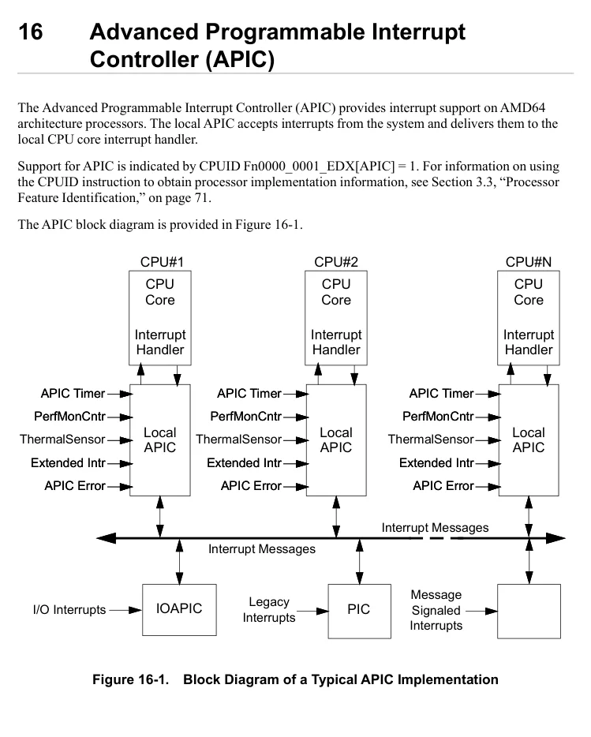

</details>


<!-- PDF source page: 690 | printed page: 628 -->

<a id="16-1-sources-of-interrupts-to-the-local-apic"></a>

## 16.1 Sources of Interrupts to the Local APIC

Each CPU core has an associated local APIC which receives interrupts from the following sources:

- I/O interrupts from the IOAPIC interrupt controller (including LINT0 and LINT1)
- Legacy interrupts (INTR and NMI) from the legacy interrupt controller
- Message Signalled Interrupts
- Interprocessor Interrupts (IPIs) from other local APICs. Interprocessor Interrupts are used to send interrupts or to execute system wide functions between CPU cores in the system, including the originating CPU core (self-interrupt).
- Locally generated interrupts within the local APIC. The local APIC receives local interrupts from the APIC timer, Performance Monitor Counters, thermal sensors, APIC errors and extended interrupts from implementation specific sources.

The sources of interrupts for the local APIC are provided in Table 16-1.

**Table 16-1. Interrupt Sources for Local APIC**

| Source | Description | Message Type to<br>Local APIC |
| --- | --- | --- |
| I/O interrupts | System interrupts from I/O devices or system hardware<br>received through the I/O APIC and sent to the local APIC as<br>interrupt messages. They may be edge-triggered or level-<br>sensitive. | Fixed, Lowest Priority, SMI,<br>NMI, INIT, STARTUP, Exter-<br>nal interrupt, LINT0, LINT1 |
| Legacy Interrupts | Legacy interrupts (INT and NMI) from the PIC and sent to<br>the local APIC as interrupt messages. | NMI, INT |
| Interprocessor (IPI) | Interprocessor interrupts. Used for interrupt forwarding,<br>system-wide functions, or software self-interrupts. | Fixed, lowest priority, SMI,<br>read request, NMI, INIT,<br>STARTUP, External interrupt |
| APIC Time | Local interrupt from the programmed APIC timer reaches<br>zero, under control of TIMER LVT. | Fixed |
| Performance Monitor<br>Counte | Local interrupt from the performance monitoring counter<br>when it overflows, under control of PERF CNT LVT.<br>_ _ | Fixed, SMI, or NMI |
| Thermal Senso | Local interrupt from internal thermal sensors when it has<br>tripped, under control of THERMAL LVT. | Fixed, SMI, or NMI |
| Extended<br>Interrupt[3:0] | Local Interrupts from programmable internal CPU core<br>sources, under the control of the<br>EXTENDED INTERRUPT[3:0] LVT.<br>_ _ | Fixed, SMI, NMI, or<br>External interrupt |
| APIC Internal Erro | Local interrupt when an error is detected within the local<br>APIC, under control of ERROR LVT. | Fixed, SMI, or NMI |

<a id="16-2-interrupt-control"></a>

## 16.2 Interrupt Control

I/O, legacy, and interprocessor interrupts are sent via interrupt messages. The interrupt messages contain the following information:

<details>
<summary>Rendered source page 690 (figures/tables)</summary>

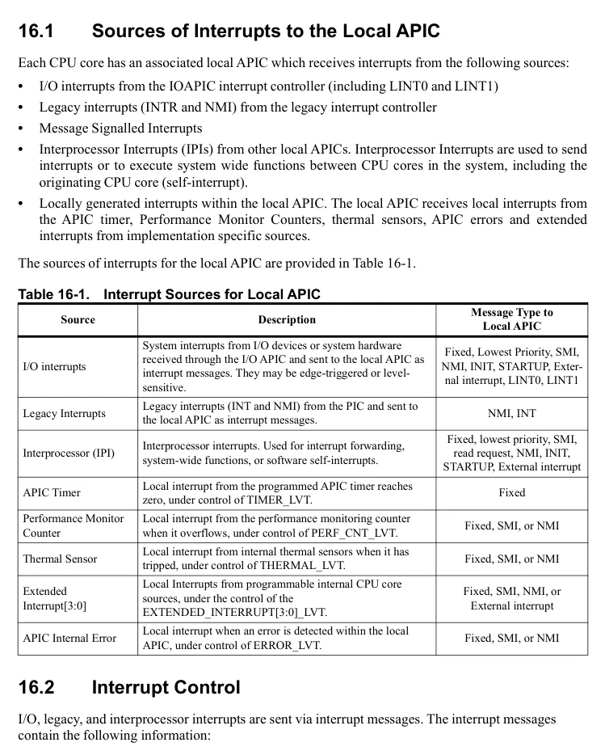

</details>


<!-- PDF source page: 691 | printed page: 629 -->

- Destination address of the local APIC.
- VECTOR[7:0] indicating interrupt priority of up to 256 interrupt vectors. This information is captured in the IRR register for Fixed and Lowest Priority interrupt message types.
- Trigger Mode indicating edge triggered or level-sensitive (which requires an EOI response to the source).
- Message Type[3:0] indicating the type of interrupt to be presented to the local APIC. For Fixed and Lowest Priority message types, the interrupt is processed through the target local APIC. For all other message types, the interrupt is sent directly to the destination CPU core. There is a 5-line interrupt interface to the CPU core for INTR, SMI, NMI, INIT and STARTUP interrupts. For locally-generated interrupts, control is provided by local vector tables or LVTs. Separate LVTs are provided for each interrupt source, allowing for a unique entry point for each source. The LVT contains the VECTOR[7:0], trigger mode and message type as well as other fields associated with the specific interrupt. The message type may be Fixed, SMI, NMI, or External interrupt. A Mask bit is also provided to mask the interrupt.

<a id="16-3-local-apic"></a>

## 16.3 Local APIC

<a id="16-3-1-local-apic-enable"></a>

### 16.3.1 Local APIC Enable

The local APIC is controlled by the APIC enable bit (AE) in the APIC Base Address Register (MSR 0000_001Bh). See Figure 16-2 on page 630.

When AE is set to 1, the local APIC is enabled and all interrupt types are accepted. When AE is cleared to 0, the local APIC is disabled, including all local vector table interrupts.

Software can disable the local APIC, using the APIC_SW_EN bit in the Spurious Interrupt Vector Register (APIC_F0). When this bit is cleared to zero, the local APIC is temporarily disabled:

- SMI, NMI, INIT, Startup, and Remote Read interrupts may be accepted.
- Pending interrupts in the ISR and IRR are held.
- Further fixed, lowest-priority, and ExtInt interrupts are not accepted.
- All LVT entry mask bits are set and cannot be cleared.


<!-- PDF source page: 692 | printed page: 630 -->

63 52 51 32

Reserved ABA[51:32]

31 12 11 10 9 8 7 0

Reserved

EXTD

BSC

ABA[31:12]

Reserved

AE

**Bits Mnemonic Description Access Type** 63:52 Reserved MBZ 51:12 ABA APIC Base Address R/W 11 AE APIC Enable R/W 10 EXTD x2APIC Mode Enable R/W 9 Reserved MBZ 8 BSC Boot Strap CPU Core RO 7:0 Reserved MBZ

**Figure 16-2. APIC Base Address Register (MSR 0000_001Bh)**

The fields within the APIC Base Address register are as follows:

- *Boot Strap CPU Core (BSC)*—Bit 8. The BSC bit indicates that this CPU core is the boot core of the BSP. Each CPU core that is not the boot core of the boot processor is an AP (Application Processor).
- *APIC Enable (AE)*—Bit 11. This is the APIC enable bit. The local APIC is enabled and all interruption types are accepted when AE is set to 1. Clearing AE to 0 disables the local APIC, and no local vector table interrupts are supported.
- *APIC Base Address (ABA)*—Bits 51:12. Specifies the base physical address for the APIC register set. The address is extended by 12 bits at the least-significant end to form the 52-bit physical base address. The reset value of the APIC base address is 0_0000_FEE0_0000h. This address is not affected by INIT.

Note that a given processor may implement a physical address less than 52 bits in length.

<a id="16-3-2-apic-registers"></a>

### 16.3.2 APIC Registers

The system programming interface of the local APIC is made up of the registers listed in Table 16-2 below. All APIC registers are memory-mapped into the 4-Kbyte APIC register space, and are accessed with memory reads and writes. The memory address is indicated as:

APIC Register address = APIC Base Address + Offset

where the APIC Base Address must point to an uncacheable memory region, and is located in APIC Base Address Register, MSR 0000_001Bh. See Figure 16-2.

<details>
<summary>Rendered source page 692 (figures/tables)</summary>

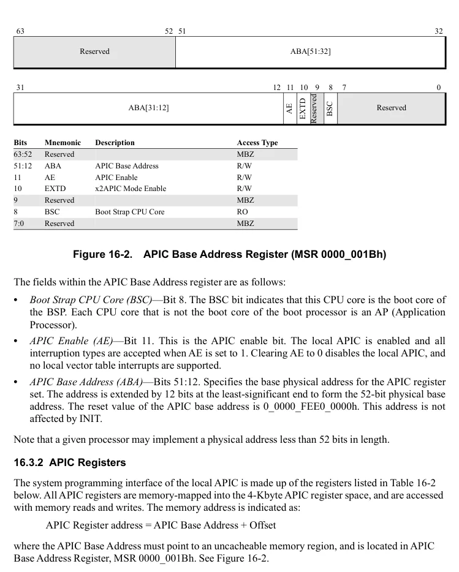

</details>


<!-- PDF source page: 693 | printed page: 631 -->

APIC registers are aligned to 16-byte offsets and must be accessed using naturally-aligned DWORD size read and writes. All other accesses cause undefined behavior.

The table includes the value of each register after reset and INIT.

**Table 16-2. APIC Registers**

| Offset | Name | Reset |
| --- | --- | --- |
| 20h | APIC ID Registe | ??000000h |
| 30h | APIC Version Registe | 80??0010h |
| 80h | Task Priority Register (TPR) | 00000000h |
| 90h | Arbitration Priority Register (APR) | 00000000h |
| A0h | Processor Priority Register (PPR) | 00000000h |
| B0h | End of Interrupt Register (EOI) | – |
| C0h | Remote Read Registe | 00000000h |
| D0h | Logical Destination Register (LDR) | 00000000h |
| E0h | Destination Format Register (DFR) | FFFFFFFF |
| F0h | Spurious Interrupt Vector Registe | 000000FFh |
| 100-170h | In-Service Register (ISR) | 00000000h |
| 180-1F0h | Trigger Mode Register (TMR) | 00000000h |
| 200-270h | Interrupt Request Register (IRR) | 00000000h |
| 280h | Error Status Register (ESR) | 00000000h |
| 300h | Interrupt Command Register Low (bits 31:0) | 00000000h |
| 310h | Interrupt Command Register High (bits 63:32) | 00000000h |
| 320h | Timer Local Vector Table Entry | 00010000h |
| 330h | Thermal Local Vector Table Entry | 00010000h |
| 340h | Performance Counter Local Vector Table Entry | 00010000h |
| 350h | Local Interrupt 0 Vector Table Entry | 00010000h |
| 360h | Local Interrupt 1 Vector Table Entry | 00010000h |
| 370h | Error Vector Table Entry | 00010000h |
| 380h | Timer Initial Count Registe | 00000000h |
| 390h | Timer Current Count Registe | 00000000h |
| 3E0h | Timer Divide Configuration Registe | 00000000h |
| 400h | Extended APIC Feature Registe | 00040007h |
| 410h | Extended APIC Control Registe | 00000000h |
| 420h | Specific End of Interrupt Register (SEOI) | – |
| 480-4F0h | Interrupt Enable Registers (IER) | FFFFFFFFh |
| 500-530h | Extended Interrupt [3:0] Local Vector Table Registers | 00000000h |

<details>
<summary>Rendered source page 693 (figures/tables)</summary>

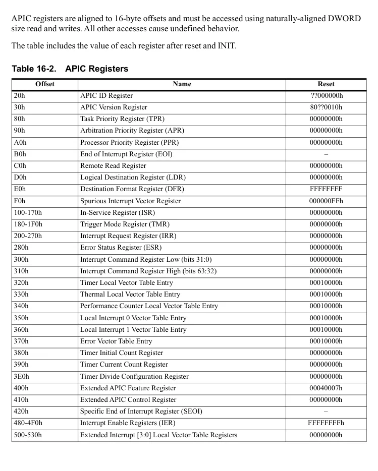

</details>


<!-- PDF source page: 694 | printed page: 632 -->

<a id="16-3-3-local-apic-id"></a>

### 16.3.3 Local APIC ID

Unique local APIC IDs are assigned to each CPU core in the system. The value is determined by hardware, based on the number of CPU cores on the processor and the node ID of the processor.

The APIC ID is located in the APIC ID register at APIC offset 20h. See Figure 16-3. It is model dependent, whether software can modify the APIC ID Register. The initial value of the APIC ID (after a reset) is the value returned in CPUID function 0000_0001h_EBX[31:24].

**Figure 16-3. APIC ID Register (APIC Offset 20h)**

<details>
<summary>Extracted figure labels</summary>

```text
31
24 23
0
AID
Reserved
Bits
Mnemonic
Description
Access type
31:24
AID
APIC ID
R/W
23:0
Reserved
MBZ
```

</details>

- *APIC ID (AID)*—Bits 31:24. The APIC ID field contains the unique APIC ID value assigned to this specific CPU core. A given implementation may use some bits to represent the CPU core and other bits represent the processor.

<a id="16-3-4-apic-version-register"></a>

### 16.3.4 APIC Version Register

A version register is provided to allow software to identify which APIC version is used. Bits 7:0 of the APIC Version Register indicate the version number of the APIC implementation.

The number of entries in the local vector table are specified in bits 23:16 of the register as the maximum number minus one.

Bit 31 indicates the presence of extended APIC registers which have an offset starting at 400h.

31 30 24 23 16 15 8 7 0

EAS

Reserved MLE Reserved VER

**Bits Mnemonic Description Access type** 31 EAS Extended APIC Register Space Present RO 30:24 Reserved MBZ 23:16 MLE Max LVT Entries RO 15:8 Reserved MBZ 7:0 VER Version RO

**Figure 16-4. APIC Version Register (APIC Offset 30h)**

<details>
<summary>Rendered source page 694 (figures/tables)</summary>

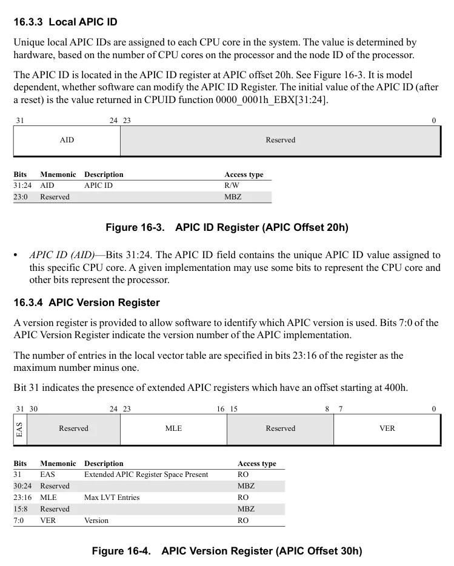

</details>


<!-- PDF source page: 695 | printed page: 633 -->

The fields within the APIC Version register are as follows:

- *Version (VER)*—Bits 7:0. The VER field indicates the version number of the APIC implementation. The local APIC implementation is identified with a value=1Xh (20h-FFh are reserved).
- *Max LVT Entries (MLE)*—Bits 23:16. The MLE field specifies the number of entries in the local vector table minus one.
- *Extended APIC Register Space Present (EAS)*—Bit 31. The EAS bit when set to 1 indicates the presence of an extended APIC register space, starting at offset 400h.

<a id="16-3-5-extended-apic-feature-register"></a>

### 16.3.5 Extended APIC Feature Register

The Extended APIC Feature Register indicates the number of extended Local Vector Table registers in the local APIC, whether the Interrupt Enable Registers are present, and whether the 8-bit Extended APIC ID and Specific End Of Interrupt (SEOI) Register are supported.

31 24 23 16 15 3 2 1 0

XAIDC

SNIC

Reserved XLC Reserved

INC

**Bits Mnemonic Description Access type** 31:24 Reserved MBZ 23:16 XLC Extended LVT Count RO 15:3 Reserved MBZ 2 XAIDC Extended APIC ID Capable RO 1 SNIC Specific End of Interrupt Capable RO 0 INC Interrupt Enable Register Capable RO

**Figure 16-5. Extended APIC Feature Register (APIC Offset 400h)**

- Extended LVT Count (XLC)—(Bits 23:16) Specifies the number of extended local vector table registers in the local APIC.
- Extended APIC ID Capability (XAIDC)—(Bit 2) Indicates that the processor is capable of supporting an 8-bit APIC ID.
- Specific End of Interrupt Capable—(Bit 1) Indicates that the Specific End Of Interrupt Register is present.
- Interrupt Enable Register Capable—(Bit 0) Read-only. Indicates that the Interrupt Enable Registers are present.

<a id="16-3-6-extended-apic-control-register"></a>

### 16.3.6 Extended APIC Control Register

This bit enables writes to the interrupt enable registers.

<details>
<summary>Rendered source page 695 (figures/tables)</summary>

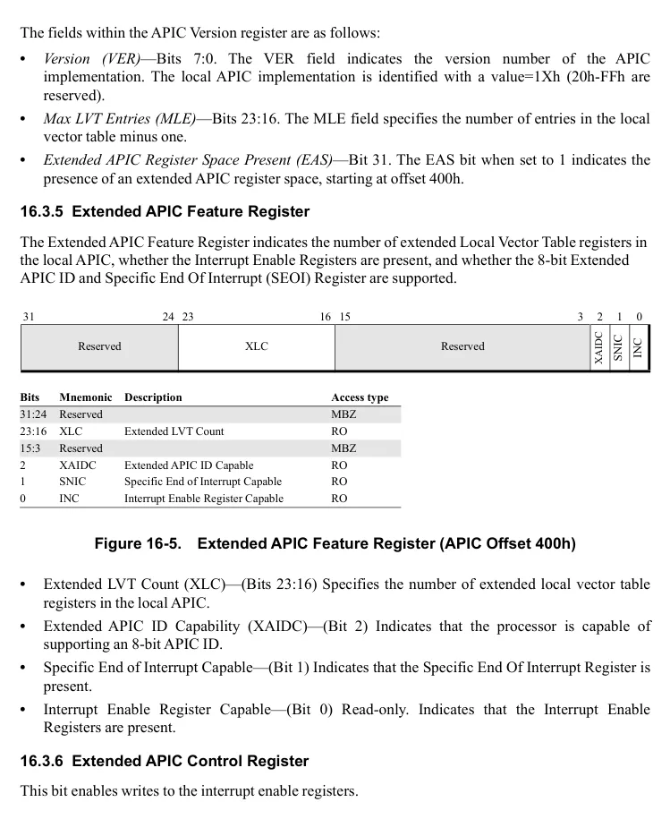

</details>


<!-- PDF source page: 696 | printed page: 634 -->

31 3 2 1 0

XAIDN

IERN

Reserved

SN

**Bits Mnemonic Description Access type** 31:3 Reserved MBZ 2 XAIDN Extended APIC ID Enable. R/W 1 SN Enable SEOI Generation R/W 0 IERN Enable Interrupt Enable Registers R/W

**Figure 16-6. Extended APIC Control Register (APIC Offset 410h)**

- Extended APIC ID Enable (XAIDN)—Bit 2. Setting XAIDN to 1 enables the upper four bits of the APIC ID field described in “APIC ID Register (APIC Offset 20h)” on page 632. Clearing this bit, specifies a 4-bit APIC ID using only the lower four bits of the APIC ID field of the APIC ID register.
- Enable SEOI Generation (SN)—Bit 1. Read-write. This bit enables Specific End of Interrupt (SEOI) generation when a write to the specific end of interrupt register is received.
- Enable Interrupt Enable Registers (IERN)—Bit 0. This bit enables writes to the interrupt enable registers.

<a id="16-4-local-interrupts"></a>

## 16.4 Local Interrupts

The local APIC handles the following local interrupts:

- APIC Timer
- Local Interrupt 0 (LINT0)
- Local Interrupt 1 (LINT1)
- Performance Monitor Counters
- Thermal Sensors
- APIC internal error
- Extended (Implementation dependent)

A separate entry in the local vector table is provided for each interrupt to allow software to specify:

- Whether the interrupt is masked or not.
- The delivery status of the interrupt.
- The message type.
- The unique address vector.
- For LINT0 and LINT1 interrupts, the trigger mode, remote IRR, and input pin polarity.

<details>
<summary>Rendered source page 696 (figures/tables)</summary>

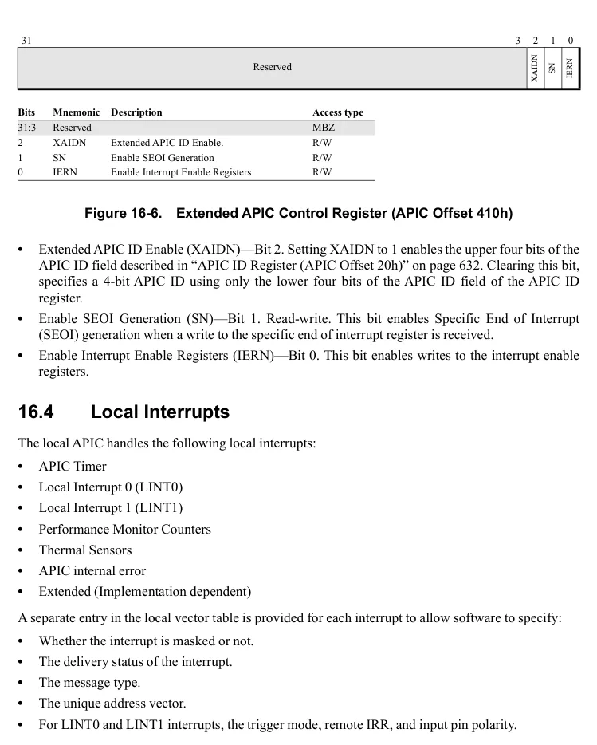

</details>


<!-- PDF source page: 697 | printed page: 635 -->

- For the APIC timer interrupt, the timer mode.

The general format of a Local Vector Table Register is shown in Figure 16-7.

31 18 17 16 15 14 13 12 11 10 8 7 0

Reserved

TMM

TGM

Reserved

MT VEC

RIR

DS

M

**Bits Mnemonic Description Access type** 31:18 Reserved MBZ 17 TMM Timer Mode R/W 16 M Mask R/W 15 TGM Trigger Mode R/W 14 RIR Remote IRR RO 13 Reserved MBZ 12 DS Delivery Status RO 11 Reserved MBZ 10:8 MT Message Type R/W 7:0 VEC Vector R/W

**Figure 16-7. General Local Vector Table Register Format**

The fields within the General Local Vector Table register are as follows:

- *Vector (VEC)*—Bits 7:0. The VEC field contains the vector that is sent for this interrupt source when the message type is fixed. It is ignored when the message type is NMI and is set to 00h when the message type is SMI. Valid values for the vector field are from 16 to 255. A value of 0 to 15 when the message type is fixed results in an illegal vector APIC error.
- *Message Type (MT)*—Bits 10:8. The MT field specifies the delivery mode sent to the CPU core interrupt handler. The legal values are:
- 000b = Fixed - The vector field specifies the interrupt delivered.
- 010b = SMI - An SMI interrupt is delivered. In this case, the vector field should be set to 00h.
- 100b = NMI - A NMI interrupt is delivered with the vector field being ignored.
- 111b = External interrupt is delivered.
- *Delivery Status (DS)*—Bit 12. The DS bit indicates the interrupt delivery status. The DS bit is set to 1 when the interrupt is pending at the CPU core interrupt handler. After a successful delivery of the interrupt, the associated bit in the IRR is set and this bit is cleared to zero. See Section 16.6.2, “Lowest Priority Messages and Arbitration,” on page 646 for details. The bit is cleared to 0 when the interrupt is idle.
- *Remote IRR (RIR)*—Bit 14. The RIR bit is set to 1 when the local APIC accepts an LINT0 or LINT1 interrupt with the trigger mode=1 (level sensitive). The bit is cleared to 0 when the interrupt completes, as indicated when an EOI is received.

<details>
<summary>Rendered source page 697 (figures/tables)</summary>

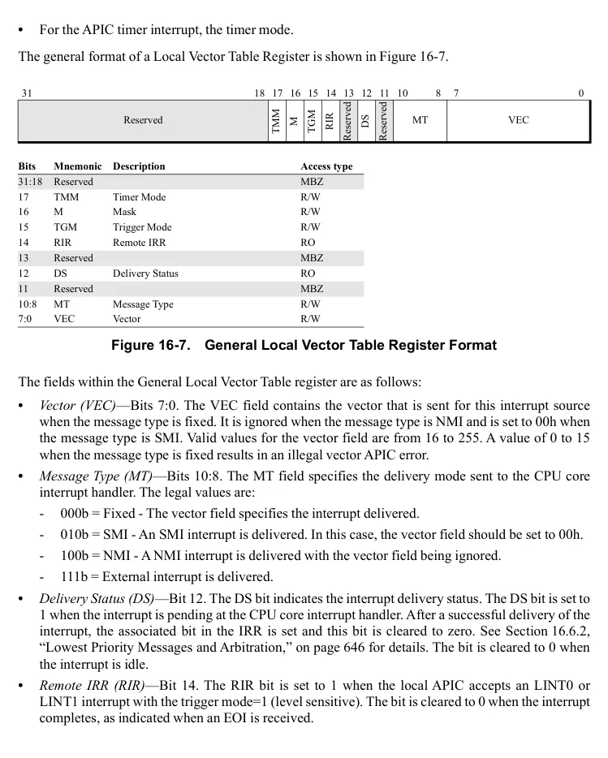

</details>


<!-- PDF source page: 698 | printed page: 636 -->

- *Trigger Mode (TGM)*—Bit 15. Specifies how interrupts to the local APIC are triggered. The TGM bit is set to 1 when the interrupt is level-sensitive. It is cleared to 0 when the interrupt is edge-triggered. When the message type is SMI or NMI, the trigger mode is edge triggered.
- *Mask (M)*—Bit 16. When the M bit is set to 1, reception of the interrupt is disabled. When the M bit is cleared to 0, reception of the interrupt is enabled.
- *Timer Mode (TMM)*—Bit 17. Specifies the timer mode for the APIC Timer interrupt. The TMM bit set to 1 indicates periodic timer interrupts. The TMM bit cleared to 0 indicates one-shot operation.

<a id="16-4-1-apic-timer-interrupt"></a>

### 16.4.1 APIC Timer Interrupt

The APIC timer is a programmable 32-bit counter used by software to time operations or events. The timer can operate in two modes, periodic and one-shot, under the control of bit 17 (Timer Mode) in APIC Timer Local Vector Table Register (see Figure 16-8). In both modes, the APIC timer is set to a programmable initial value and starts to decrement at a programmable clock rate. When the Initial Count Register is written to a non-zero value, the APIC timer is initialized to the value just written and starts decrementing. When the Initial Count Register is written to zero, the APIC timer is initialized to zero and stops decrementing. In one-shot mode, the APIC timer stops counting when the timer reaches zero. In periodic mode, the APIC timer is initialized again when it reaches zero, and it starts to decrement again. Whenever the timer value is decremented to zero, an APIC timer interrupt is generated under the control of bit 16 (Mask) in the APIC Timer Local Vector Table Register.

To avoid race conditions, software should initialize the Divide Configuration Register and the Timer Local Vector Table Register prior to writing the Initial Count Register to start the timer.

**Figure 16-8. APIC Timer Local Vector Table Register (APIC Offset 320h)**

<details>
<summary>Extracted figure labels</summary>

```text
31
18 17 16 15
13 12 11
8
7
0
TMM
Reserved
VEC
DS
M
```

</details>

Three APIC registers are defined for the APIC timer function:

- Current Count Register (CCR) is the actual APIC timer. Whenever the ICR is written to a non-zero value, or when the CCR reaches zero while in periodic mode, it is initialized to a start count loaded from the ICR and then decrements. The APIC timer interrupt is generated when the CCR value reaches zero. The counting rate is controlled by the DCR. See Figure 16-9.
- Initial Count Register (ICR) provides the initial value for the APIC timer. See Table 16-10.
- Divide Configuration Register (DCR) controls the counting rate of the APIC timer by dividing the CPU core clock by a programmable amount. See Figure 16-11. For the specific details on the implementation of the APIC timer base clock rate, see the *BIOS and Kernel Developer’s Guide (BKDG)* or *Processor Programming Reference Manual (PPR)* applicable to your product.

<details>
<summary>Rendered source page 698 (figures/tables)</summary>

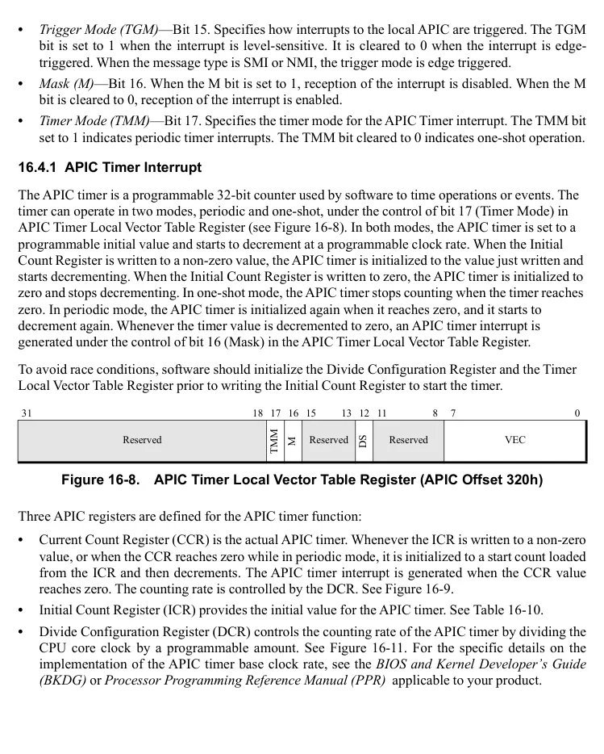

</details>


<!-- PDF source page: 699 | printed page: 637 -->

**Figure 16-9. Timer Current Count Register (APIC Offset 390h)**

<details>
<summary>Extracted figure labels</summary>

```text
31
0
APICTCC
Bits
Mnemonic
Description
Access type
31:0
APICTCC
APIC Timer Current Count
RO
```

</details>

- *APIC Timer Current Count (APICTCC)*—Bits 31:0. The APICTCC field contains the current value of the APIC timer.

**Figure 16-10. Timer Initial Count Register (APIC Offset 380h)**

<details>
<summary>Extracted figure labels</summary>

```text
31
0
APICTIC
Bits
Mnemonic
Description
Access type
31:0
APICTIC
APIC Timer Initial Count
R/W
```

</details>

- *APIC Timer Initial Count (APICTIC)*—Bits 31:0. The APICTIC field contains the value that is loaded into the APIC Timer Current Count Register when the APIC timer is initialized.

**Figure 16-11. Divide Configuration Register (APIC Offset 3E0h)**

<details>
<summary>Extracted figure labels</summary>

```text
31
4
3
2
1
0
Reserved
DV[2]
Reserved
DV[1:0]
Bits
Mnemonic
Description
Access type
31:4
Reserved
MBZ
3
DV[2]
Divide Value[2]
R/W
2
Reserved
,
MBZ
1:0
DV[1:0]
Divide Value[1:0]
R/W
```

</details>

- *Divide Value (DV)*—Bits 3, 1:0. The DV field specifies the value of the CPU core clock divisor. Table 16-3 lists the allowable values.

<details>
<summary>Rendered source page 699 (figures/tables)</summary>

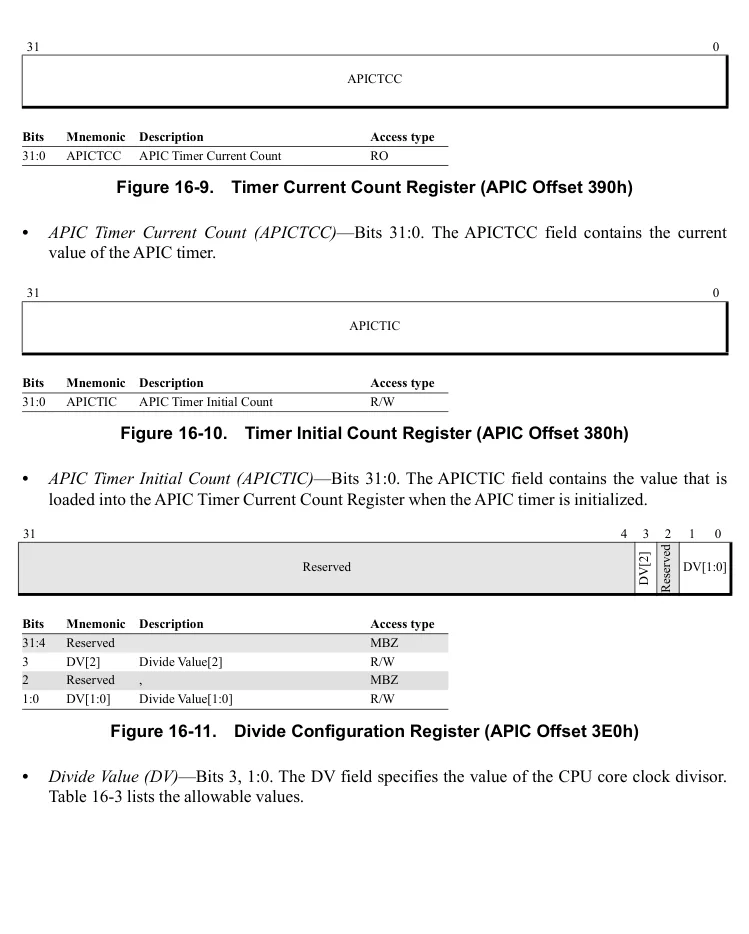

</details>


<!-- PDF source page: 700 | printed page: 638 -->

**Table 16-3. Divide Values**

| Bits 3, 1:0 | Resulting Timer Divide |
| --- | --- |
| 000 | Divide by 2 |
| 001 | Divide by 4 |
| 010 | Divide by 8 |
| 011 | Divide by 16 |
| 100 | Divide by 32 |
| 101 | Divide by 64 |
| 110 | Divide by 128 |
| 111 | Divide by 1 |

<a id="16-4-2-local-interrupts-lint0-and-lint1"></a>

### 16.4.2 Local Interrupts LINT0 and LINT1

When the target local APIC receives an interrupt message from an IOAPIC with the LINT0 or LINT1 message type, the appropriate local interrupt is generated under the control of bit 16 (Mask) in the APIC LINT0 or LINT1 Local Vector Table Register. See Figure 16-12.

**Figure 16-12. Local Interrupt 0/1 (LINT0/1) Local Vector Table Register (APIC Offset 350h/360h)**

<details>
<summary>Extracted figure labels</summary>

```text
31
17 16 15 14 13 12 11 10
8
7
0
Reserved
TGM
Reserved
MT
VEC
RIR
DS
M
```

</details>

In addition to the normal LVT control bits (mask, delivery status and vector offset), the LINT0/LINT1 interrupts provide the following controls:

- Trigger Mode - indicates whether the interrupt pin is edge triggered or level sensitive when the message type is fixed.

- Remote IRR - When the trigger mode indicates level, this flag is set when the local APIC accepts the interrupt, and is reset when the local APIC receives an EOI. When the flag is set, no additional local interrupt requests are sent to the local APIC, and they remain pending.

<a id="16-4-3-performance-monitor-counter-interrupts"></a>

### 16.4.3 Performance Monitor Counter Interrupts

When a performance monitor counter overflows, an APIC interrupt is generated under the control of bit 16 (Mask) in the APIC Performance Monitor Counter Local Vector Table Register. See Figure 16-13 on page 638.

**Figure 16-13. Performance Monitor Counter Local Vector Table Register (APIC Offset 340h)**

<details>
<summary>Extracted figure labels</summary>

```text
31
17 16 15
13 12 11 10
8
7
0
Reserved
MT
VEC
DS
M
```

</details>

<details>
<summary>Rendered source page 700 (figures/tables)</summary>

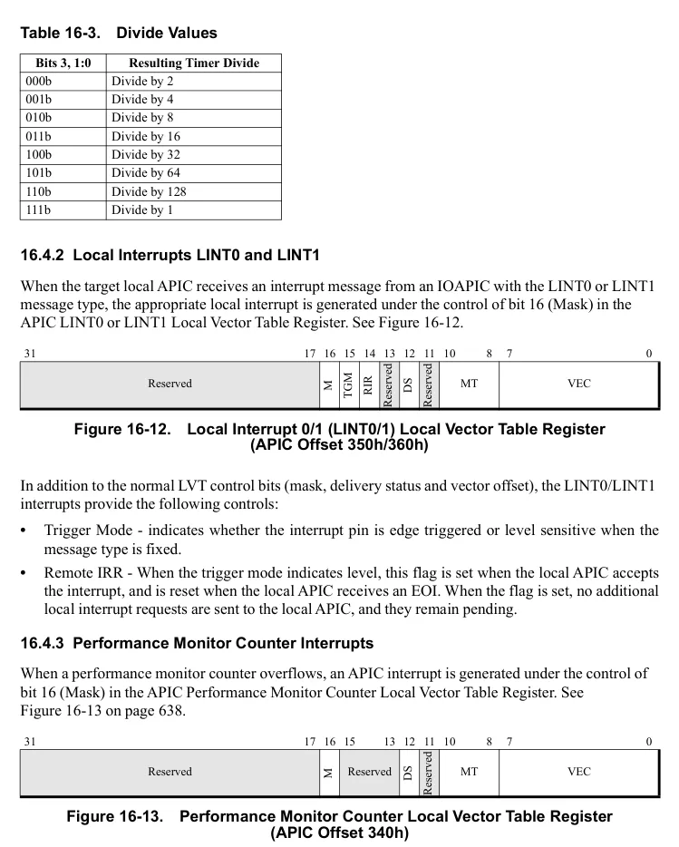

</details>


<!-- PDF source page: 701 | printed page: 639 -->

<a id="16-4-4-thermal-sensor-interrupts"></a>

### 16.4.4 Thermal Sensor Interrupts

When a thermal event occurs, an APIC interrupt is generated under the control of bit 16 (Mask) in the APIC Thermal Sensor Local Vector Table Register. See Figure 16-14. See the *BIOS and Kernel Developer’s Guide (BKDG)* or *Processor Programming Reference Manual (PPR)* applicable to your product for more information on thermal events. This interrupt may not be supported in all implementations.

**Figure 16-14. Thermal Sensor Local Vector Table Register (APIC Offset 330h)**

<details>
<summary>Extracted figure labels</summary>

```text
31
17 16 15
13 12 11 10
8
7
0
Reserved
Res
MT
VEC
DS
M
```

</details>

<a id="16-4-5-extended-interrupts"></a>

### 16.4.5 Extended Interrupts

The local interrupts are extended to include more LVT registers, to allow additional interrupt sources. The additional sources are model dependent and can include:

- Counter overflow from the Machine Check Miscellaneous Threshold Register. See “Machine-Check Miscellaneous-Error Information Register 0 (MC*i*_MISC0)” on page 311 for details.
- ECC Error Count Threshold in memory system.
- Instruction Sampling.

The LVT register used for each interrupt source is specified by the control register associated with the source.

The Extended LVT Count field (bits 23:16) of the Extended APIC Feature Register specifies the number of extended LVT registers. Currently there are four additional LVT registers defined, Extended Interrupt [3:0], Local Vector Table Register, located at APIC offsets 500h–530h. (See Section 16.7.1, “Specific End of Interrupt Register,” on page 652 and Figure 16-5 on page 633.)

<a id="16-4-6-apic-error-interrupts"></a>

### 16.4.6 APIC Error Interrupts

Errors that are detected while handling interrupts cause an APIC error interrupt to be generated under the control of bit 16 (Mask) in the APIC Error Local Vector Table Register. See Figure 16-15 on page 639.

**Figure 16-15. APIC Error Local Vector Table Register (APIC Offset 370h)**

<details>
<summary>Extracted figure labels</summary>

```text
31
17 16 15
13 12 11 10
8
7
0
Reserved
MT
VEC
DS
M
```

</details>

<details>
<summary>Rendered source page 701 (figures/tables)</summary>

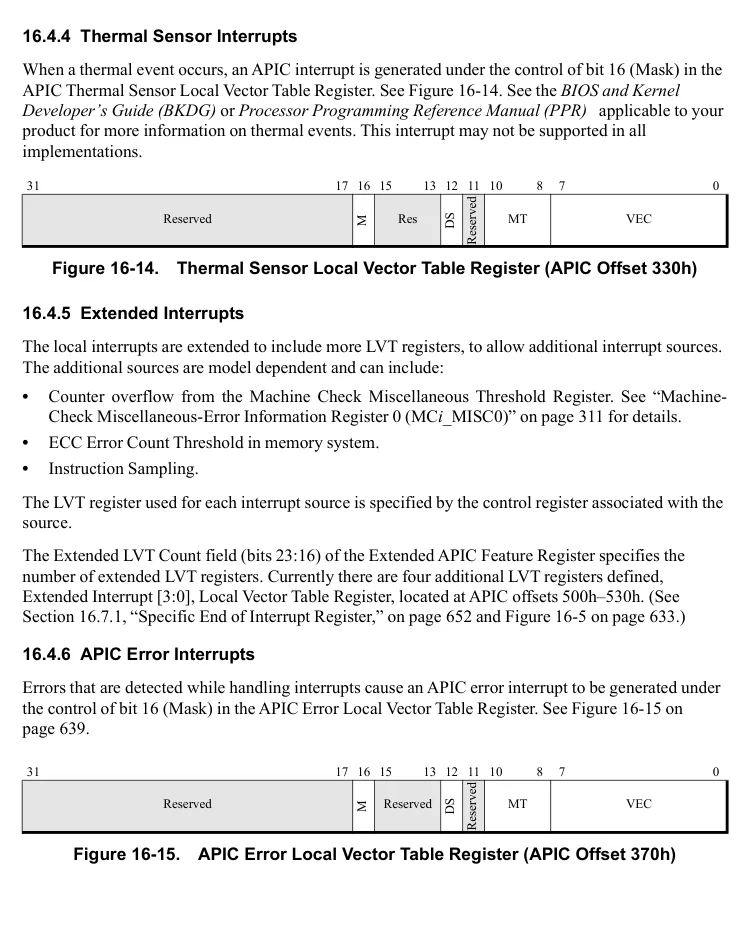

</details>


<!-- PDF source page: 702 | printed page: 640 -->

The error information is recorded in the APIC Error Status Registers. The APIC Error Status Register is a read-write register. Writes to the register cause the internal error state to be recorded in the register, clearing the original error. See Figure 16-16.

31 8 7 6 5 4 3 2 1 0

Reserved

RAE

SAE

Reserved

IRA

RIV

SIV

**Bits Mnemonic Description Access type** 31:8 Reserved MBZ 7 IRA Illegal Register Address R/W 6 RIV Received Illegal Vector R/W 5 SIV Sent Illegal Vector R/W 4 Reserved MBZ 3 RAE Receive Accept Error R/W 2 SAE Sent Accept Error R/W 1:0 Reserved MBZ

**Figure 16-16. APIC Error Status Register (APIC Offset 280h)**

The fields within the APIC Error Status register are as follows:

- *Sent Accept Error (SAE)*—Bit 2. The SAE bit when set to 1 indicates that a message sent by the local APIC was not accepted by any other APIC.
- *Receive Accept Error (RAE)*—Bit 3. The RAE bit when set to 1 indicates that a message received by the local APIC was not accepted by this or any other APIC
- *Sent Illegal Vector (SIV)*—Bit 5. The SIV bit when set to 1 indicates that the local APIC attempted to send a message with an illegal vector value.
- *Receive Illegal Vector (RIV)*—Bit 6. The RIV bit when set to 1 indicates that the local APIC has received a message with an illegal vector value.
- *Illegal Register Address (IRA)*—Bit 7. The IRA bit when set to 1 indicates that an access to an unimplemented register location within the local APIC register range (APIC Base Address + 4 Kbytes) was attempted.

<a id="16-4-7-spurious-interrupts"></a>

### 16.4.7 Spurious Interrupts

A timing issue exists between software and hardware that, though rare, results in spurious interrupts. In the event that the task priority is set to or above the level of the interrupt to be serviced while the interrupt is being acknowledged, the local APIC delivers a spurious interrupt to the CPU core instead, with the vector number specified by the Vector field of the Spurious Interrupt Register. The ISR is unaffected by the spurious interrupt, so the interrupt handler completes without sending an EOI back to the issuing local APIC.

<details>
<summary>Rendered source page 702 (figures/tables)</summary>

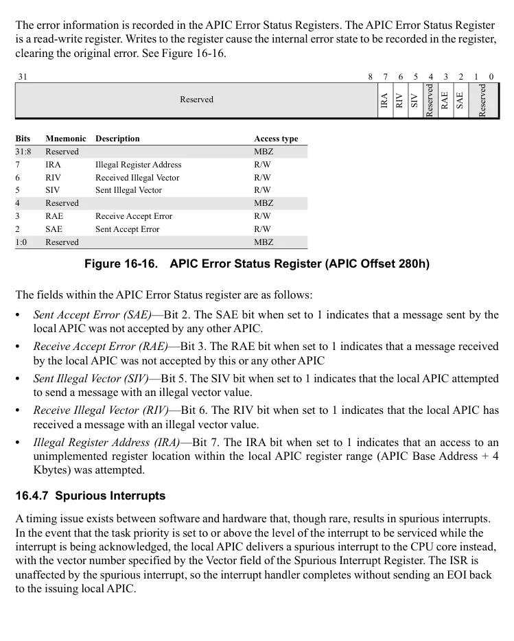

</details>


<!-- PDF source page: 703 | printed page: 641 -->

**Figure 16-17. Spurious Interrupt Register (APIC Offset F0h)**

<details>
<summary>Extracted figure labels</summary>

```text
31
10
9
8
7
0
FCC
ASE
Reserved
VEC
Bits
Mnemonic
Description
Access type
31:10
Reserved
MBZ
9
FCC
Focus CPU Core Checking
R/W
8
ASE
APIC Software Enable
R/W
7:0
VEC
Vector
R/W
```

</details>

The fields within the Spurious Interrupt register are as follows:

- *Vector (VEC)*—Bits 7:0. The VEC field contains the vector that is sent to the CPU core in the event of a spurious interrupt.
- *APIC Software Enable (ASE)*—Bit 8. The ASE bit when set to 0 disables the local APIC temporarily. When the local APIC is disabled, SMI, NMI, INIT, Startup, and Remote Read may be accepted; pending interrupts in the ISR and IRR are held, but further fixed, lowest-priority, and ExtInt interrupts are not accepted. All LVT entry mask bits are set and cannot be cleared. Setting the ASE bit to 1, enables the local APIC.
- *Focus CPU Core Checking (FCC)*—Bit 9. The FCC bit when set to 1 disables focus CPU core checking when the lowest-priority message type is used. A CPU core is the focus of an interrupt if it is already servicing that interrupt (ISR=1) or if it has a pending request for that interrupt (IRR=1). Clearing the FCC bit to 0 disables focus CPU core checking.

<a id="16-5-interprocessor-interrupts-ipi"></a>

## 16.5 Interprocessor Interrupts (IPI)

A local APIC can send interrupts to other local APICs (or itself) using software-initiated Interprocessor Interrupts (IPIs) using the Interrupt Command Register (ICR). Writing into the low order doubleword of the ICR causes the IPI to be sent.

The ICR can issue the following types of interrupt messages:

- basic interrupt message to another local APIC, including forwarding an interrupt that was received but not serviced
- basic interrupt message to the same local APIC (self-interrupt)
- system management interrupt (SMI)
- remote read message to another local APIC to read one of its APIC registers.
- non-maskable interrupt (NMI) delivered to another local APIC

<details>
<summary>Rendered source page 703 (figures/tables)</summary>

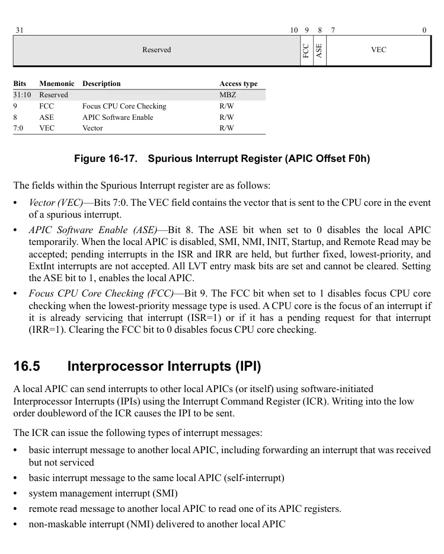

</details>


<!-- PDF source page: 704 | printed page: 642 -->

- initialization message (INIT) to a target local APIC to be reset to their INIT state and await a STARTUP IPI.
- startup message (SIPI) to the target local APICs, pointing to a start-up routine.

The format of the Interrupt Command Register is shown in Figure 16-18.

63 56 55 32

DES Reserved

31 20 19 18 17 16 15 14 13 12 11 10 8 7 0

Reserved

TGM

Reserved DSH RRS

MT VEC

DM

DS

L

**Bits Mnemonic Description Access type** 63:56 DES Destination R/W 55:20 Reserved MBZ 19:18 DSH Destination Shorthand R/W 17:16 RRS Remote Read Status RO 15 TGM Trigger Mode R/W 14 L Level R/W 13 Reserved MBZ 12 DS Delivery Status RO 11 DM Destination Mode R/W 10:8 MT Message Type R/W 7:0 VEC Vector R/W

**Figure 16-18. Interrupt Command Register (APIC Offset 300h–310h)**

The fields within the Interrupt Command register are as follows:

- *Vector (VEC)*—Bits 7:0. The function of this field varies with the Message Type field. The VEC field contains the vector that is sent for this interrupt source for fixed and lowest priority message types.
- *Message Type (MT)*—Bits 10:8. The MT field specifies the message type sent to the CPU core interrupt handler. The legal values are:
- 000b = Fixed - The IPI delivers an interrupt to the target local APIC specified in Destination field.
- 001b = Lowest Priority - The IPI delivers an interrupt to the local APIC executing at the lowest priority of all local APICs that match the destination logical ID specified in the Destination field. See Section 16.6.1, “Receiving System and IPI Interrupts,” on page 645.
- 010b = SMI - The IPI delivers an SMI interrupt to target local APIC(s). The trigger mode is edge-triggered and the Vector field must = 00h.

<details>
<summary>Rendered source page 704 (figures/tables)</summary>

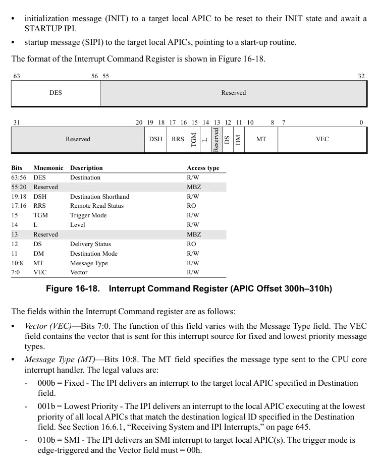

</details>


<!-- PDF source page: 705 | printed page: 643 -->

- 011b = Remote read - The IPI delivers a read request to read an APIC register in the target local APIC specified in Destination field. The trigger mode is edge triggered and the Vector field specifies the APIC offset of the APIC register to be read. The Remote Status field provides the current status of the remote read access after it has been issued. Data is returned from the target local APIC and captured in the Remote Read Register of the issuing local APIC. See Figure 16-19 on page 644.
- 100b = NMI - The IPI delivers a non-maskable interrupt to the target local APIC specified in the Destination field. The Vector field is ignored.
- 101b = INIT - The IPI delivers an INIT request to the target local APIC(s) specified in the Destination field, causing the CPU core to assume the INIT state. The trigger mode is edge-triggered, and the Vector field must =00h. In the INIT state, the target APIC is responsive only to the STARTUP IPI. All other interrupts (including SMI and NMI) are held pending until the STARTUP IPI has been accepted.
- 110b = STARTUP - The IPI delivers a start-up request (SIPI) to the target local APIC(s) specified in Destination field, causing the CPU core to start processing the platform firmware boot-strap routine whose address is specified by the Vector field.
- 111b = External interrupt - The IPI delivers an external interrupt to the target local APIC specified in Destination field. The interrupt can be delivered even if the APIC is disabled.

- *Destination Mode (DM)*—Bit 11. The DM bit when set to 1 specifies a logical destination which may be one or more local APICs with a common destination logical ID. When cleared to 0, the DM bit specifies a physical destination which indicates a single local APIC ID.
- *Delivery Status (DS)*—Bit 12. The DS bit indicates the interrupt delivery status. The DS bit is set to 1 when the local APIC has sent the IPI and is waiting for it to be accepted by another local APIC (the ICR is not idle). Clearing the DS bit indicates that the target local APIC is idle. Code may repeatedly write ICRL without polling the DS bit; all requested IPIs will be delivered.
- *Level (L)*—Bit 14. The L bit when set to 1 indicates assert. Clearing the L bit to 0 indicates deassert.
- *Trigger Mode (TGM)*—Bit 15. Specifies how IPIs to the local APIC are triggered. The TGM bit is set to 1 when the interrupt is level-sensitive. It is cleared to 0 when the interrupt is edge-triggered.
- *Remote Read Status (RRS)*—Bits 17:16. The RRS field indicates the current read status of a Remote Read from another local APIC. The encoding for this field is as follows:
- 00b = Read was invalid
- 01b = Delivery pending
- 10b = Delivery done and access was valid. Data available in Remote Read Register.
- 11b = Reserved
- *Destination Shorthand (DSH)*—Bits 19:18. The DSH field indicates whether a shorthand notation is used, and provides a quick way to specify a destination for a message. It replaces the Destination field, when the destination field is not required (DSH &gt; 00b), allowing software to use a single write to the low order ICR. The encoding are as follows:


<!-- PDF source page: 706 | printed page: 644 -->

- 00b = Destination - The Destination field is required to specify the destination.
- 01b = Self - The issuing APIC is the only destination.
- 10b = All including self - The IPI is sent to all local APICs including itself (destination field=FFh).
- 11b = All excluding self - The IPI is sent to all local APICs except itself (destination field=FFh). Note that if the lowest priority is used, the message could end up being reflected back to this local APIC. If DS=1xb, the destination mode is ignored and physical is automatically used.
- *Destination (DES)*—Bits 63:56. The DES field identifies the target local APIC(s) for the IPI and contains the destination encoding used when the Destination Shorthand field=00b. The field indicates the target local APIC when the destination mode=0 (physical), and the destination logical ID (as indicated by LDR and DFR) when the destination mode=1 (logical).

**Figure 16-19. Remote Read Register (APIC Offset C0h)**

<details>
<summary>Extracted figure labels</summary>

```text
31
0
RRD
Bits
Mnemonic
Description
Access type
31:0
RRD
Remote Read Data
RO
```

</details>

- *Remote Read Data (RRD)*—Bits 31:0. The RRD field contains the data resulting from a valid completion of a remote read interprocessor interrupt.

Not all combinations of ICR fields are valid. Only the combinations indicated in Table 16-4 are valid.

**Table 16-4. Valid ICR Field Combinations**

| Message Type | Trigger Mode | Level | Destination Shorthand |
| --- | --- | --- | --- |
| Fixed | Edge | x | x |
| Fixed | Level | Assert | x |
| Lowest Priority, SMI, NMI, INIT | Edge | x | Destination or all excluding self |
| Lowest Priority, SMI, NMI, INIT | Level | Assert | Destination or all excluding self |
| Startup | x | x | Destination or all excluding self |

> ***Note:** x indicates a don’t care.*

<details>
<summary>Rendered source page 706 (figures/tables)</summary>

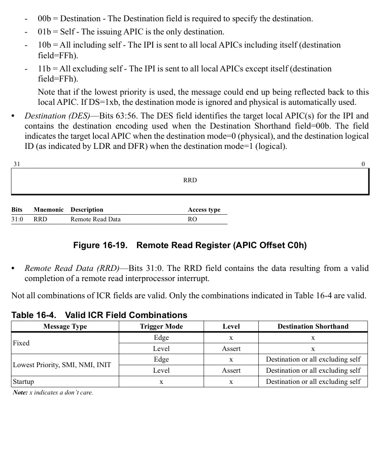

</details>


<!-- PDF source page: 707 | printed page: 645 -->

<a id="16-6-local-apic-handling-of-interrupts"></a>

## 16.6 Local APIC Handling of Interrupts

<a id="16-6-1-receiving-system-and-ipi-interrupts"></a>

### 16.6.1 Receiving System and IPI Interrupts

Each local APIC verifies the destination ID, the destination mode and the message type of an APIC interrupt to determine if it is the target of the interrupt.

The destination mode is either physical or logical. In physical destination mode, the value of the interrupt message destination field is compared with the unique APIC ID value of each local APIC to select the target local APIC. If the destination field of the Interrupt Command Register is set to FFh, the interrupt is broadcasted and accepted by all local APICs. In physical destination mode, the lowest priority message type is not supported.

In logical destination mode, all local APICs use the Logical Destination Register and the Destination Format Register to determine if the interrupt is directed to them. The value of the interrupt message destination field is compared with the value in the Logical Destination Register (see Figure 16-20) of all local APICs.

The logical APIC ID must be unique. Since the comparison with the interrupt message destination field is on a bit-basis, there are only 8 unique logical IDs (01h, 02h, 04h, 08h, 10h, 20h, 40h, and 80h). For flat mode, the logical ID must be one of these values (for a total of eight local APICs supported). In cluster mode, the value of the logical ID is constrained to be *xy*h, where 0 ≤ *x* ≤ Eh and *y* = either 1,2,4, or 8, for a total of (15 × 4) possible unique logical IDs.

**Figure 16-20. Logical Destination Register (APIC Offset D0h)**

<details>
<summary>Extracted figure labels</summary>

```text
31
24 23
0
DLID
Reserved
Bits
Mnemonic
Description
Access type
31:24
DLID
Destination Logical ID
R/W
23:0
Reserved
MBZ
```

</details>

- *Destination Logical ID (DLID)*—Bits 31:24. The DLID field contains the logical APIC ID assigned to this specific CPU core. The logical APIC ID must be unique.

Two interrupt models are defined for the logical destination mode, the flat model and the cluster model, under the control of the Destination Format Register. See Figure 16-21.

<details>
<summary>Rendered source page 707 (figures/tables)</summary>

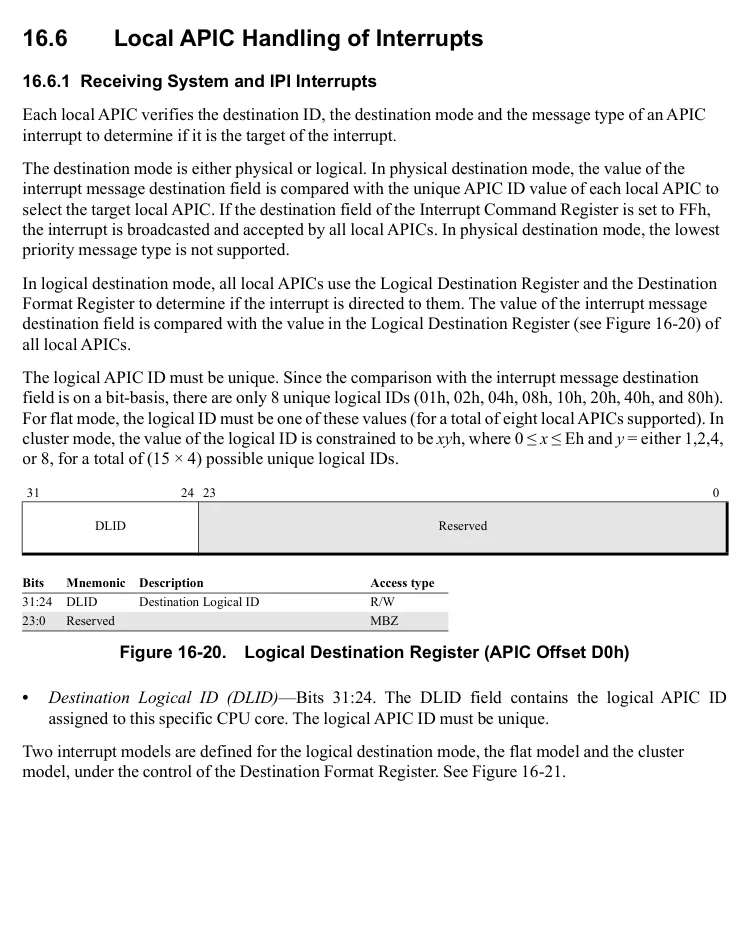

</details>


<!-- PDF source page: 708 | printed page: 646 -->

**Figure 16-21. Destination Format Register (APIC Offset E0h)**

<details>
<summary>Extracted figure labels</summary>

```text
31
28 27
0
MOD
Reserved
Bits
Mnemonic
Description
Access type
31:28
MOD
Model
R/W
27:0
Reserved
All ones
RO
```

</details>

- *Model (MOD)*—Bits 31:28. The MOD field controls which format to use when accepting interrupts in logical destination mode. The allowable values are 0h = cluster model and Fh = flat model.

With the flat model, up to eight unique logical APIC ID values can be provided by software by setting a different bit in the LDR. When the logical ID of the destination is compared with the LDR, if any bit position is set in both fields, this local APIC is a valid destination. A broadcast to all local APICs occurs when the LDR is set to all ones.

In the cluster model, bits 31:28 of the logical ID of the destination are compared with bits 31:28 of the LDR. If there is a match, then bits 27:24 are tested for matching ones, similar to the flat model. If bits 31:28 match, and any of bits 27:24 are set in both fields, this local APIC is a valid destination. The cluster model allows for 15 unique clusters to be defined, with each cluster having four unique logical APIC values to be addressed. In cluster logical destination mode, lowest priority message type is not supported.

In both the flat model and the cluster model, if the destination field = FFh, the interrupt is accepted by all local APICs.

<a id="16-6-2-lowest-priority-messages-and-arbitration"></a>

### 16.6.2 Lowest Priority Messages and Arbitration

In the case where the interrupt is valid for several local APICs in logical destination mode with a lowest priority message type, the interrupt is accepted by the local APIC with the lowest arbitration priority, as indicated by the *Arbitration Priority* field in the Arbitration Priority Register (APR). The value in the *Arbitration Priority* field indicates the current priority for a pending interrupt or task, or an interrupt being serviced by the CPU core. See Figure 16-22.

<details>
<summary>Rendered source page 708 (figures/tables)</summary>

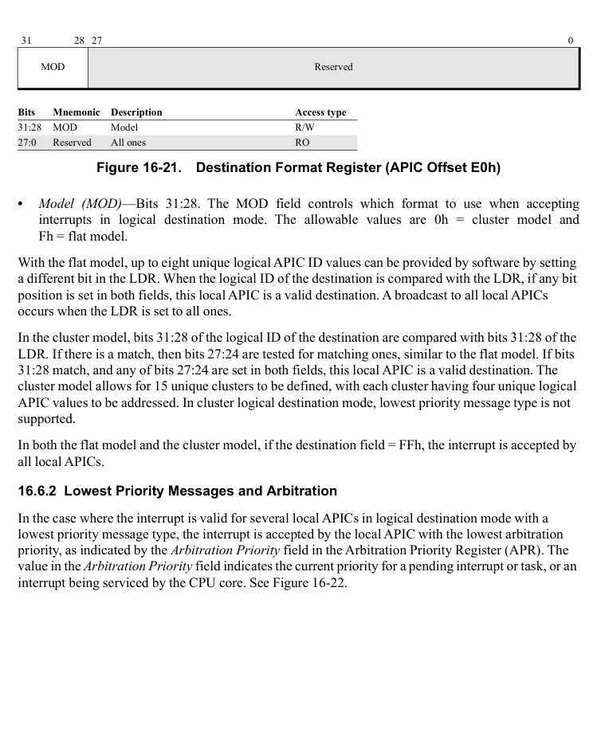

</details>


<!-- PDF source page: 709 | printed page: 647 -->

**Figure 16-22. Arbitration Priority Register (APIC Offset 90h)**

<details>
<summary>Extracted figure labels</summary>

```text
31
8
7
4
3
0
Reserved
AP
APS
Bits
Mnemonic
Description
Access type
31:8
Reserved
MBZ
7:4
AP
Arbitration Priority
RO
3:0
APS
Arbitration Priority Sub-class
RO
```

</details>

The fields within the Arbitration Priority register are as follows:

- *Arbitration Priority Sub-class (APS)*—Bits 3:0. The APS field indicates the current sub-priority to handle arbitrated interrupts to be serviced by the CPU core.
- *Arbitration Priority (AP)*—Bits 7:4. The AP field indicates the current priority to handle arbitrated interrupts to be serviced by the CPU core. The priority is used to arbitrate between CPU cores to determine which core accepts a lowest-priority interrupt request.

The value in the Arbitration Priority field is equal to the highest priority of the Task Priority field of the Task Priority Register (TPR), the highest bit set in the In-Service Register (ISR) vector, or the highest bit set in the Interrupt Request Register (IRR) vector. The value in the Arbitration Priority Sub-class field is equal to the Task Priority Sub-class if the APR is equal to the TPR, and zero otherwise.

If focus CPU core checking is enabled (Spurious Interrupt Register bit 9=0), the focus CPU core for an interrupt can always accept the interrupt. A CPU core is the focus of an interrupt if it is already servicing that interrupt (corresponding ISR bit is set) or if it already has a pending request for that interrupt (corresponding IRR bit is set). If there is no focus CPU core for an interrupt or if focus CPU core checking is disabled (Spurious Interrupt Register bit 9=1), all target local APICs identified as candidates for the interrupt arbitrate to determine which is executing with the lowest arbitration priority. If there is a tie for lowest priority, the local APIC with the highest APIC ID is selected.

<a id="16-6-3-accepting-system-and-ipi-interrupts"></a>

### 16.6.3 Accepting System and IPI Interrupts

If the local APIC accepting the interrupt determines that the message type for the interrupt request indicates SMI, NMI, INIT, STARTUP or ExtINT, it sends the interrupt directly to the CPU core for handling. If the message type is fixed or lowest priority, the accepting local APIC places the interrupt into an open slot in either the IRR or ISR registers. If there is no free slot, the interrupt is rejected and sent back to the sender with a retry request.

Three 256-bit acceptance registers support interrupts accepted by the local APIC. Bits 255:16 correspond to interrupt vectors 255:16 with 255 being the highest priority; bits 15:0 are reserved.

- Interrupt Request Register (IRR), which contains interrupt requests that have been accepted but have not been sent to the CPU core for interrupt handling. When a system interrupt is accepted, the associated bit corresponding to the interrupt vector is set in the IRR. When the CPU core requests a

<details>
<summary>Rendered source page 709 (figures/tables)</summary>

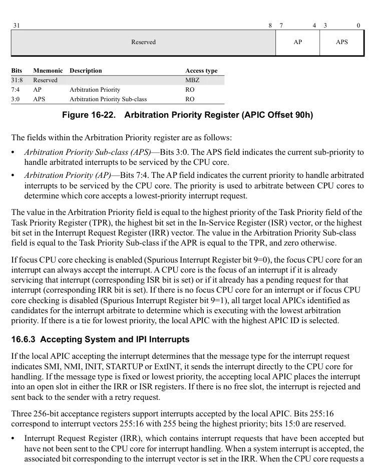

</details>


<!-- PDF source page: 710 | printed page: 648 -->

new interrupt, the local APIC selects the highest priority IRR interrupt and sends it to the CPU core. The local APIC then sets the corresponding bit in the ISR and resets the associated IRR bit. See Figure 16-23 on page 648. **•** In-Service Register (ISR) contains the bit map of the interrupts that have been sent to the CPU core and are still being serviced. When the CPU core writes to the EOI register indicating completion of the interrupt processing, the associated ISR bit is reset and a new interrupt is selected from the IRR register. If a higher priority interrupt is accepted by the local APIC while the CPU core is servicing another interrupt, the higher priority interrupt is sent directly to the CPU core (before the current interrupt finishes processing) and the associated IRR bit is set. The CPU core interrupts the current interrupt handler to service the higher priority interrupt. When the interrupt handler for the higher priority interrupt completes, the associated IRR bit is reset and the interrupt handler returns to complete the previous interrupt handler routine. If a second interrupt with the same interrupt vector number is received by the local APIC while the ISR bit is set, the local APIC sets the IRR bit. No more than two interrupts can be pending for the same interrupt vector number. Subsequent interrupt requests to the same interrupt vector number will be rejected. See Figure 16-24 on page 649. **•** Trigger Mode Register (TMR) indicates the trigger mode of the interrupt and determines whether an EOI message is sent to the I/O APIC for level-sensitive interrupts. When the interrupt is accepted by the local APIC and the IRR bit is set, the associated TMR bit is set for level-sensitive interrupts or reset for edge-triggered interrupts. At the end of the interrupt handler routine, when the EOI is received at the local APIC, an EOI message is sent to the I/O APIC if the associated TMR bit is set for a system interrupt. See Figure 16-25 on page 649.

**Figure 16-23. Interrupt Request Register (APIC Offset 200h–270h)**

<details>
<summary>Extracted figure labels</summary>

```text
255
16 15
0
IR
Reserved
Bits
Mnemonic
Description
Access type
255:16
IR
Interrupt Request bits
RO
15:0
Reserved
MBZ
```

</details>

- *Interrupt Request bits (IR)*—Bits 255:16. The corresponding request bit is set when an interrupt is accepted by the local APIC. The interrupt request registers provide a bit per interrupt to indicate that the corresponding interrupt has been accepted by the local APIC. Interrupts are mapped as follows:

**Register Interrupt Number**

IRR (APIC offset 200h) 31–16

IRR (APIC offset 210h) 63–32

IRR (APIC offset 220h) 95–64

IRR (APIC offset 230h) 127–96

<details>
<summary>Rendered source page 710 (figures/tables)</summary>

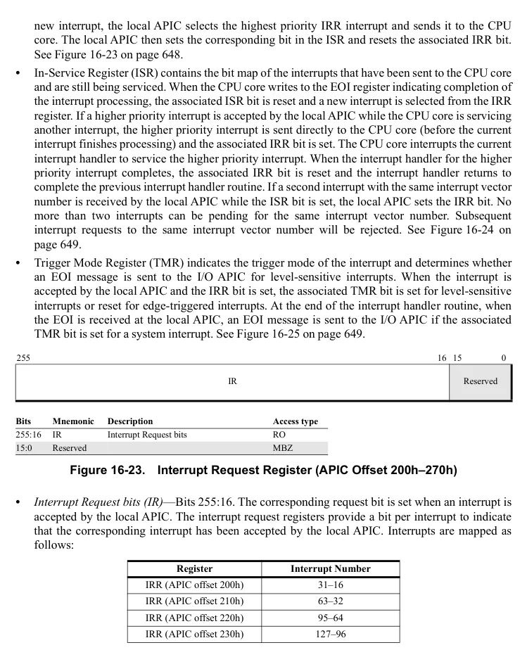

</details>


<!-- PDF source page: 711 | printed page: 649 -->

**Figure 16-24. In Service Register (APIC Offset 100h–170h)**

<details>
<summary>Extracted figure labels</summary>

```text
Register
Interrupt Number
IRR (APIC offset 240h)
159–128
IRR (APIC offset 250h)
191–160
IRR (APIC offset 260h)
223–192
IRR (APIC offset 270h)
255–224
255
16 15
0
IS
Reserved
Bits
Mnemonic
Description
Access type
255:16
IS
In Service bits
RO
15:0
Reserved
MBZ
```

</details>

- *In Service bits (IS)*—Bits 255:16. These bits are set when the corresponding interrupt is being serviced by the CPU core. The in-service registers provide a bit per interrupt to indicate that the corresponding interrupt is being serviced by the CPU core. Interrupts are mapped as follows:

**Figure 16-25. Trigger Mode Register (APIC Offset 180h–1F0h)**

<details>
<summary>Extracted figure labels</summary>

```text
Register
Interrupt Number
ISR (APIC offset 100h)
31–16
ISR (APIC offset 110h)
63–32
ISR (APIC offset 120h)
95–64
ISR (APIC offset 130h)
127–96
ISR (APIC offset 140h)
159–128
ISR (APIC offset 150h)
191–160
ISR (APIC offset 160h)
223–192
ISR (APIC offset 170h)
255–224
255
16 15
0
TM
Reserved
Bits
Mnemonic
Description
Access type
255:16
TM
Trigger Mode bits
RO
15:0
Reserved
MBZ
```

</details>

<details>
<summary>Rendered source page 711 (figures/tables)</summary>

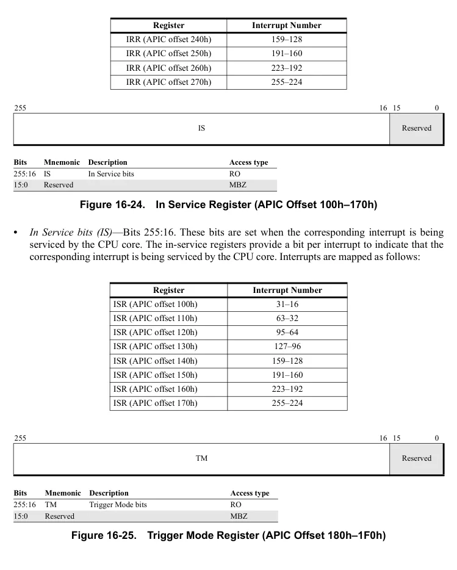

</details>


<!-- PDF source page: 712 | printed page: 650 -->

- *Trigger Mode bits (TM)*—Bits 255:16. These bits provide a bit per interrupt to indicate the assertion mode of each interrupt. Interrupts are mapped as follows:

**Register Interrupt Number**

TMR (APIC offset 180h) 31–16

TMR (APIC offset 190h) 63–32

TMR (APIC offset 1A0h) 95–64

TMR (APIC offset 1B0h) 127–96

TMR (APIC offset 1C0h) 159–128

TMR (APIC offset 1D0h) 191–160

TMR (APIC offset 1E0h) 223–192

TMR (APIC offset 1F0h) 255–224

<a id="16-6-4-selecting-and-handling-interrupts"></a>

### 16.6.4 Selecting and Handling Interrupts

Interrupts are selected by the local APIC for delivery to the CPU core interrupt handler on a priority determined by the interrupt vector number. Of the 15 priority levels, 15 is the highest and 1 is the lowest. The priority level for an interrupt is equal to the interrupt vector number divided by 16, rounded down to the nearest integer, with vectors 0Fh–00h reserved. Therefore, interrupt vectors 79h and 70h have the same priority level. The high-order hex digit indicates the priority level while the low-order hex digit indicates the priority within the same priority level.

Two registers are used to determine the priority threshold for selecting interrupts to be delivered to the CPU core, the Task Priority Register (TPR) and the Processor Priority Register (PPR). Software uses the TPR to set a priority threshold for interrupts to the CPU core, allowing the OS to block specific interrupts. See Figure 16-26 on page 650 for more details on the TPR.

The value in the *Task Priority* field is set by software to set a threshold priority at which the processor is to be interrupted. The value varies from 0 (all interrupts are allowed) to 15 (all interrupts with fixed delivery mode are inhibited). See Figure 16-26.

**Figure 16-26. Task Priority Register (APIC Offset 80h)**

<details>
<summary>Extracted figure labels</summary>

```text
31
8
7
4
3
0
Reserved
TP
TPS
Bits
Mnemonic
Description
Access type
31:8
Reserved
MBZ
7:4
TP
Task Priority
R/W
3:0
TPS
Task Priority Sub-class
R/W
```

</details>

The fields within the Task Priority register are as follows:

<details>
<summary>Rendered source page 712 (figures/tables)</summary>

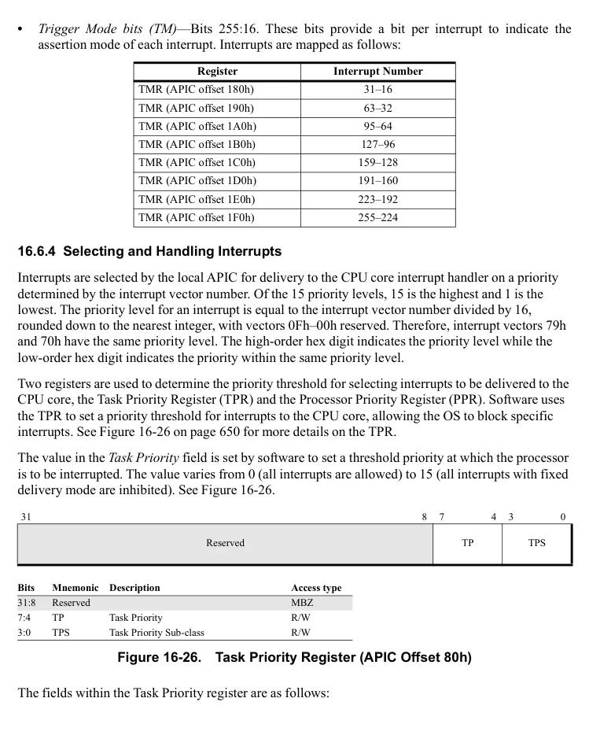

</details>


<!-- PDF source page: 713 | printed page: 651 -->

- *Task Priority Sub-class (TPS)*—Bits 3:0. The TPS field indicates the current sub-priority to be used when arbitrating lowest-priority messages. This field is written with zero when TPR is written using the architectural CR8 register.
- *Task Priority (TP)*—Bits 7:4. The TP field indicates the current priority to be used when a core is deciding when to handle interrupts. A value of zero allows all interrupts; a value of Fh disables all interrupts. TP is also used to arbitrate between CPU cores to determine which core accepts a lowest-priority interrupt request. This field can also be written using the architectural CR8 register.

The PPR is set by the CPU core and represents the current priority level at which the CPU core is executing. The PPR determines whether a pending interrupt in the local APIC can be selected for interrupt handling in the CPU core. The value set by hardware is either the interrupt priority level of the highest priority ISR bit set or the value in the TPR, whichever is higher. The PPR is equal to the TPR when the CPU core is not servicing a higher priority interrupt. See Figure 16-27 on page 651.

**Figure 16-27. Processor Priority Register (APIC Offset A0h)**

<details>
<summary>Extracted figure labels</summary>

```text
31
8
7
4
3
0
Reserved
PP
PPS
Bits
Mnemonic
Description
Access type
31:8
Reserved
MBZ
7:4
PP
Processor Priority
RO
3:0
PPS
Processor Priority Sub-class
RO
```

</details>

The fields within the Processor Priority register are as follows:

- *Processor Priority Sub-class (PPS)*—Bits 3:0. The PPS field is set to the Task Priority sub-class field of the Task Priority Register (TPR) if the PP field is equal to the Task Priority field of the TPR.
- *Processor Priority (PP)*—Bits 7:4. The PP field indicates the CPU core’s current priority for servicing a task or interrupt, and is used to determine if any pending interrupts should be serviced. It is the higher value of either the interrupt priority level of the highest priority ISR bit set or the value in the TPR.

Pending interrupts must have a higher priority level than the value in the PPR to be selected by the local APIC for interrupt handling in the core; otherwise, they remain pending in the IRR until the PPR is lowered below the pending interrupt priority level. No pending interrupts are selected by the local APIC when the TPR=15.

The local APIC selects the highest priority pending interrupt (highest priority IRR) when the CPU core is ready, and sends the interrupt (with the IRR vector) to the CPU core. The local APIC resets the highest priority IRR bit and sets the associated ISR bit.

<details>
<summary>Rendered source page 713 (figures/tables)</summary>

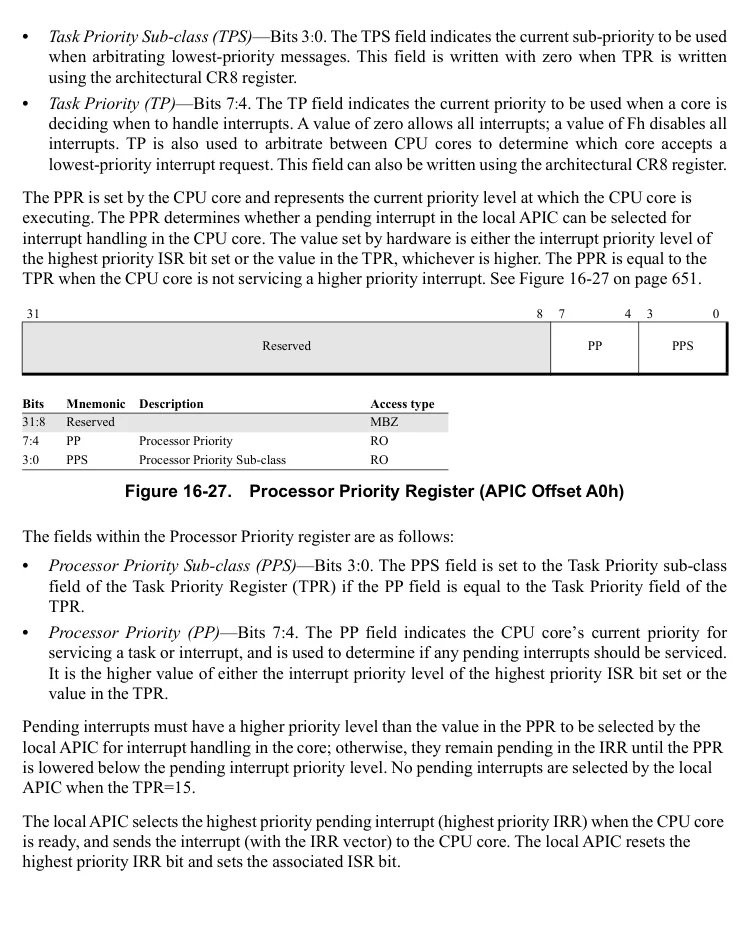

</details>


<!-- PDF source page: 714 | printed page: 652 -->

As part of the completion of the interrupt handling routine, software writes a value of zero to the End-of-Interrupt Register (EOI) in the local APIC, which causes the local APIC to reset the associated ISR bit. The EOI register is a write-only register.

If a higher priority interrupt is accepted by the local APIC while the CPU core is servicing another interrupt, the higher priority interrupt is sent directly to the CPU core (before the current interrupt finishes processing) and the associated ISR bit is set. The CPU core interrupts the current interrupt handler to service the higher priority interrupt. When the interrupt handler for the higher priority interrupt completes, the associated ISR bit is reset and the interrupt handler returns to complete the previous interrupt handler routine.

**Figure 16-28. End of Interrupt (APIC Offset B0h)**

<details>
<summary>Extracted figure labels</summary>

```text
31
0
EOI
Bits
Mnemonic
Description
Access type
31:0
EOI
End of Interrupt
WO
```

</details>

- *End of Interrupt (EOI)*—Bits 31:0. Write-only operation signals end of interrupt processing to source of interrupt.

<a id="16-7-svm-support-for-interrupts-and-the-local-apic"></a>

## 16.7 SVM Support for Interrupts and the Local APIC

The SVM hypervisor uses the Extended APIC Feature Register, Extended APIC Control Register, Specific End of Interrupt Register (SEOI), and Interrupt Enable Register (IER) to control virtualized interrupts. When guests have direct access to devices, interrupts arriving at the local APIC can usually be dismissed only by the guest that owns the device causing the interrupt. To prevent one guest from blocking other guests’ interrupts (by never processing their own), the VMM can mask pending interrupts in the local APIC, so they do not participate in the prioritization of other interrupts.

<a id="16-7-1-specific-end-of-interrupt-register"></a>

### 16.7.1 Specific End of Interrupt Register

Software issues a specific EOI (SEOI) by writing the vector number of the interrupt to the SEOI register in the local APIC. The SEOI register is located at offset 420h in the APIC space. The SEOI register format is shown in Figure 16-29.

31 8 7 0

Reserved VECTOR

<details>
<summary>Rendered source page 714 (figures/tables)</summary>

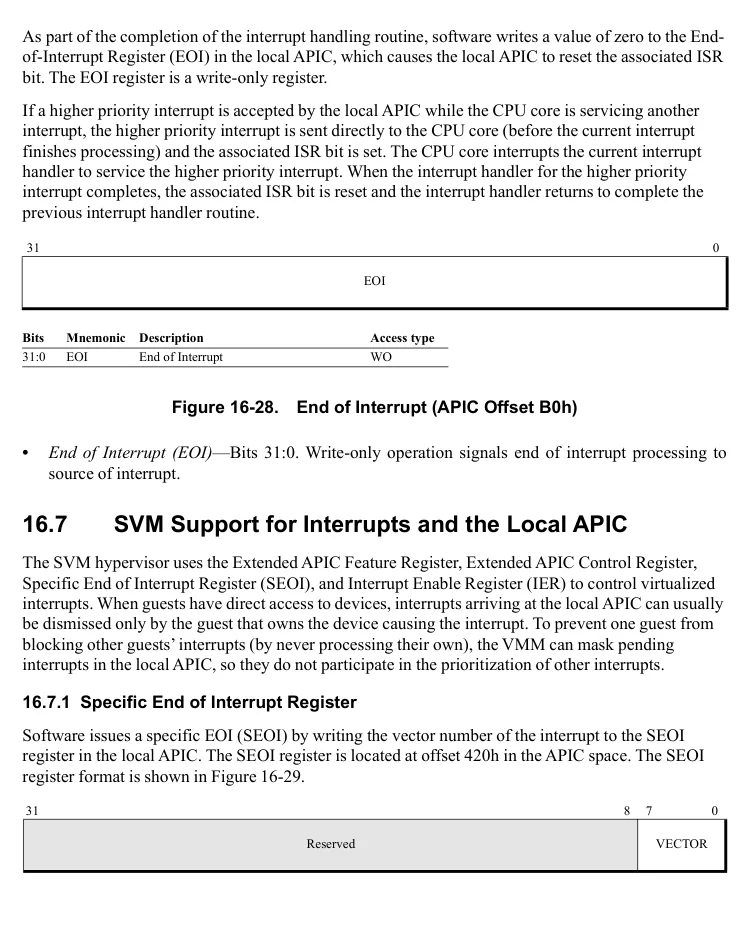

</details>


<!-- PDF source page: 715 | printed page: 653 -->

**Bits Mnemonic Description Access type** 31:8 Reserved MBZ 7:0 VECTOR Vector Number of Interrupt R/W

**Figure 16-29. Specific End of Interrupt (APIC Offset 420h)**

<a id="16-7-2-interrupt-enable-register"></a>

### 16.7.2 Interrupt Enable Register

The IER is made available to software by means of eight 32-bit registers in the local APIC; bit *i* of the 256-bit IER is located at bit position (*i* mod 32) in the local APIC register IER[*i* / 32]. The eight IER registers are located at offsets 480h, 490h, ...,4F0h in APIC space. The IER format is shown in Figure 16-30.

**Figure 16-30. Interrupt Enable Register (APIC Offset 480h–4F0h)**

<details>
<summary>Extracted figure labels</summary>

```text
255
16 15
0
IE
Reserved
Bits
Mnemonic
Description
Access type
255:16
IE
Interrupt Enable
R/W
15:0
Reserved
MBZ
```

</details>

*Interrupt Enable (IE)*—Bits 255:16. Interrupts are mapped as follows:

**Register Interrupt Number**

IER (APIC offset 480h) 31–16

IER (APIC offset 490h) 63–32

IER (APIC offset 4A0h) 95–64

IER (APIC offset 4B0h) 127–96

IER (APIC offset 4C0h) 159–128

IER (APIC offset 4D0h) 191–160

IER (APIC offset 4E0h) 223–192

IER (APIC offset 4F0h) 255–224

The IER and SEOI registers are located in the APIC Extended Space area. The presence of the APIC Extended Space area is indicated by bit 31 of the APIC Version Register (at offset 30h in APIC space).

The presence of the IER and SEOI functionality is identified by bits 0 and 1, respectively, of the APIC Extended Feature Register (located at offset 400h in APIC space). IER and SEOI are enabled by setting bits 0 and 1, respectively, of the APIC Extended Control Register (located at offset 410h).

<details>
<summary>Rendered source page 715 (figures/tables)</summary>

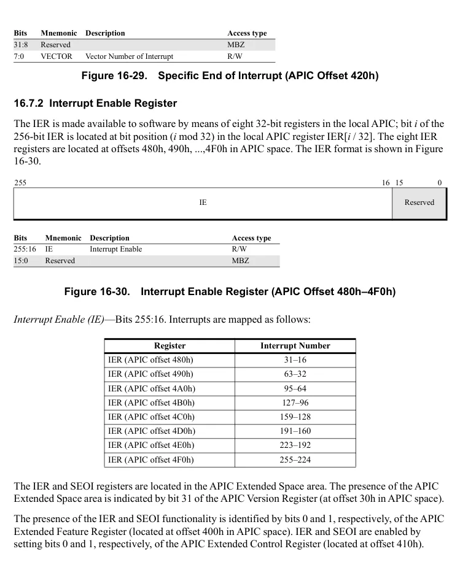

</details>


<!-- PDF source page: 716 | printed page: 654 -->

Only vectors that are enabled in IER participate in APIC's computation of the highest-priority pending interrupt. The reset value of IER is all ones.

<a id="16-8-x2apic-mode"></a>

## 16.8 x2APIC Mode

x2APIC mode is an extension to the local APIC architecture designed to support larger CPU topologies and to enhance delivery of interrupts. When enabled, x2APIC mode adds the following features:

- All APIC and x2APIC registers are accessed via an MSR-based interface.
- The Local APIC ID and Logical APIC ID registers are expanded to 32 bits.
- Logical and physical destinations are extended to 32 bits.
- A new self-IPI register simplifies sending IPIs to self.

In general, x2APIC mode maintains backwards compatibility with the key elements of the local APIC functionality previously described in Section 16. However, the following local APIC functionality is changed in x2APIC mode:

- The Destination Format Register (DFR) is no longer needed and is not supported.
- The two 32-bit Interrupt Command Registers (ICRs) are merged into a single 64-bit ICR.
- Local APIC Base (MSR 01Bh) bit 10, previously reserved, is used to enable x2APIC mode.

<a id="16-8-1-x2apic-terminology"></a>

### 16.8.1 x2APIC Terminology

Although x2APIC is an operational mode of the local APIC, the following sections use the term ‘x2APIC’ as a qualifier to more conveniently identify a given aspect of the local APIC when that mode is enabled. For example, the term ‘x2APIC programming interface’ may be used instead of ‘the programming interface when the local APIC is in x2APIC mode’.

<a id="16-9-detecting-and-enabling-x2apic-mode"></a>

## 16.9 Detecting and Enabling x2APIC Mode

System software can detect the presence of the x2APIC feature by executing the CPUID instruction. Support for x2APIC mode is indicated by CPUID Fn0000_0001_ECX[x2APIC] (bit 21) = 1.

If the feature is present, the local APIC is placed into x2APIC mode by setting bit 10 in the Local APIC Base register (MSR 01Bh). Before entering x2APIC mode, the local APIC must first be enabled (AE=1, EXTD=0). System software can then place the local APIC into x2APIC mode by executing a WRMSR with both AE=1 and EXTD=1. The format of the Local APIC Base register for x2APIC-capable processors is shown in Figure 16-31.


<!-- PDF source page: 717 | printed page: 655 -->

63 52 51 32

Reserved ABA[51:32]

31 12 11 10 9 8 7 0

Reserved

EXTD

BSC

Reserved

ABA[31:12]

AE

**Bits Mnemonic Description Access type** 63:52 Reserved MBZ 51:12 ABA APIC Base Address R/W 11 AE APIC Enable (xAPIC mode) R/W 10 EXTD X2APIC Mode Enable R/W 9 Reserved MBZ 8 BSC Boot Strap CPU Core RO [7:0] Reserved MBZ

**Figure 16-31. APIC Base Address Register (MSR 01Bh) support for x2APIC**

Not all combinations of the local APIC mode bits are valid. See Table 16-5. Attempting to set the combination of AE=0 and EXTD=1 is invalid and causes the WRMSR instruction to generate a #GP(0) exception.

**Table 16-5. Local APIC Operating Modes**

| AE (bit 11) | EXTD (bit 10) | Local APIC Mode |
| --- | --- | --- |
| 0 | 0 | local APIC disabled |
| 0 | 1 | Invalid |
| 1 | 0 | local APIC enabled in xAPIC mode |
| 1 | 1 | local APIC enabled in x2APIC mode |

Similarly, not all transitions between local APIC states are valid. The valid state transitions are illustrated in Figure 16-2. Once the local APIC has been placed into x2APIC mode, the only valid transition (other than reset) is to “APIC Disabled” mode by simultaneously clearing AE and EXTD to zero. Executing a WRMSR instruction to attempt a transition other than those specified in Figure 16-32 results in a #GP(0) exception.

<details>
<summary>Rendered source page 717 (figures/tables)</summary>

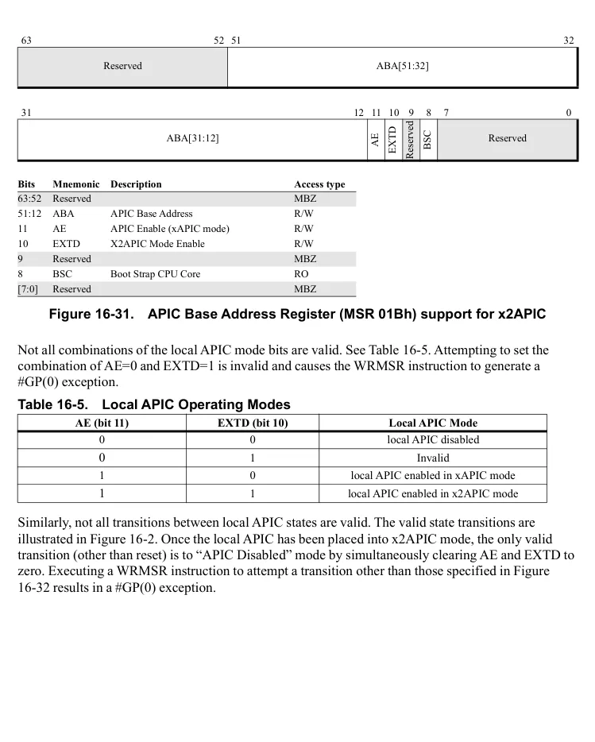

</details>


<!-- PDF source page: 718 | printed page: 656 -->

**Figure 16-32. APIC State Transitions**

<a id="16-9-1-enabling-x2apic-mode"></a>

### 16.9.1 Enabling x2APIC Mode

Starting from APIC Disabled mode, enabling x2APIC mode is a two-step process. First, a transition is made to APIC_Enabled mode by setting APIC_Base bit 11 (AE) to 1 with bit 10 (EXTD) left as zero. Next, the transition to x2APIC mode is made by setting both AE and EXTD to 1 simultaneously.

Most APIC registers previously written by software while in APIC_Enabled mode are not affected by the transition to x2APIC mode. The exceptions are:

- The Logical Destination Register (LDR) is not preserved.
- The upper half of the Interrupt Command Register (ICR High) is not preserved.
- A value previously written by software to the 8-bit APIC_ID register (MMIO offset 30h) is converted by hardware into the appropriate format and reflected into the 32-bit x2APIC_ID register (MSR 802h).

**Leaving x2APIC mode.** Once in x2APIC mode, the only valid mode transition (other than a reset) is to APIC_Disabled mode by using WRMSR to clear APIC_Base bit 11 (AE) bit 10 (EXTD) to 0 at the same time.

<details>
<summary>Rendered source page 718 (figures/tables)</summary>

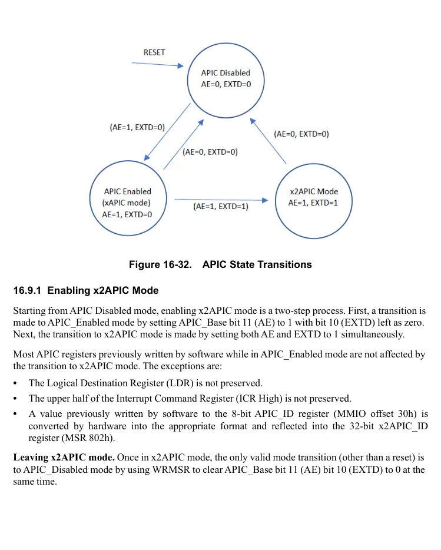

</details>


<!-- PDF source page: 719 | printed page: 657 -->

<a id="16-10-x2apic-initialization"></a>

## 16.10 x2APIC Initialization

A RESET clears the APIC Base Address Register AE bit and EXTD bit, disabling the local APIC. All local APIC registers are initialized to their reset values as described in section 16.3.2 “APIC Registers”.

An INIT does not modify the APIC Base Address Register AE and EXTD bits, thus the local APIC mode is not changed. All other APIC registers are initialized to their values as described in “Reset in x2APIC mode” above.

<a id="16-11-accessing-x2apic-register"></a>

## 16.11 Accessing x2APIC Register

The x2APIC system programming interface consists of the Model Specific Registers listed in Table 16-6 below. All APIC registers except the APIC Base Address Register are mapped into the architecturally dedicated MSR range 800h to 8FFh, and accessed using WRMSR and RDMSR instructions.

The RDMSR/WRMSR instructions read and write the MSR specified in the ECX register using the EDX:EAX register pair as the destination and source operand. Bits 31:0 of the APIC register are mapped into EAX[31:0]. For 64-bit x2APIC registers, the high-order bits (bits 63:32) are mapped to EDX[31:0]. A #GP(0) exception is generated if an unimplemented APIC register is specified in ECX. When not in x2APIC mode, attempts to access the APIC register set using the MSR interface results in the WRMSR or RDMSR instruction generating a #GP(0) exception. See APM volume 3 for more information on the WRMSR and RDMSR instructions.

In x2APIC mode, the legacy MMIO access to the APIC register set is disabled. Attempts to use the legacy MMIO access mechanism may result in an unintended memory access or a memory-related exception such as #GP or #PF.

<a id="16-11-1-x2apic-register-address-space"></a>

### 16.11.1 x2APIC Register Address Space

The x2APIC registers are mapped into the MSR address range 800h through 8FFh. This address range is reserved for accessing the APIC register set in x2APIC mode.

The legacy APIC registers are mapped to this MSR address space using on the following formula:

x2APIC MSR address = 800h + ((APIC MMIO offset) &gt;&gt; 4)

The following registers are exceptions to the above formula:

- The two 32-bit Interrupt Command Registers in APIC mode (MMIO offsets 300h and 310h) are merged into a single 64-bit x2APIC register at MSR address 830h.
- The x2APIC Self_IPI register is added at MSR address 83Fh
- The Destination Format Register (DFR) at MMIO offset E0h and the Remote Read Register (RRR) at MMIO offset C0h are not supported in x2APIC mode. Accordingly, MSR addresses 80Eh and 80Ch are not used and are reserved.


<!-- PDF source page: 720 | printed page: 658 -->

The system programming interface of the local APIC in x2APIC mode is made up of the MSRs listed in Table 16-6 below.

**Table 16-6. x2APIC Register**

**MSR Address (x2APIC mode) MMIO Offset (xAPIC mode) Register Name Read/ Write Notes**

| MSR Address<br>(x2APIC mode) | MMIO Offset<br>(xAPIC mode) | Register Name | Read/<br>Write | Notes |
| --- | --- | --- | --- | --- |
| 802h | 20h | x2APIC ID Register [31:0] | RO | Expanded to 32-bits in x2APIC mode |
| 803h | 30h | APIC Version Registe | RO |  |
| 808h | 80h | Task Priority Register (TPR) | R/W |  |
| 809h | 90h | Arbitration Priority Register (APR) | RO |  |
| 80Ah | A0h | Processor Priority Register (PPR) | RO |  |
| 80Bh | B0h | End of Interrupt Register (EOI) | WO | #GP(0) if non-zero value is written |
| - | C0h | Remote Read Registe | - | Eliminated in x2APIC mode |
| 80Dh | D0h | Logical Destination Register (LDR) | RO | Expanded to 32-bits in x2APIC mode |
| - | E0h | Destination Format Registe | - | Eliminated in x2APIC mode |
| 80Fh | F0h | Spurious Interrupt Vector Registe | R/W |  |
| 810-817h | 100-170h | In-Service Register (ISR) | RO |  |
| 818-81Fh | 180-1F0h | Trigger Mode Register (TMR) | RO |  |
| 820-827h | 200-270h | Interrupt Request Register (IRR) | RO |  |
| 828h | 280h | Error Status Register (ESR) | R/W | #GP(0) if non-zero value is written |
| 830h | 300h | Interrupt Command Register (bits<br>63:0) | R/W |  |
| 832h | 320h | Timer Local Vector Table Entry | R/W |  |
| 833h | 330h | Thermal Local Vector Table Entry | R/W |  |
| 834h | 340h | Perf Counter Local Vector Table Entry | R/W |  |
| 835h | 350h | Local Interrupt 0 Vector Table Entry | R/W |  |
| 836h | 360h | Local Interrupt 1 Vector Table Entry | R/W |  |
| 837h | 370h | Error Vector Table Entry | R/W |  |
| 838h | 380h | Timer Initial Count Registe | R/W |  |
| 839h | 390h | Timer Current Count Registe | RO |  |
| 83Eh | 3E0h | Timer Divide Configuration Registe | R/W |  |
| 83Fh | — | Self IPI Registe | WO | See Figure 16-6 |
| 840h | 400h | Extended APIC Feature Registe | RO |  |
| 841h | 410h | Extended APIC Control Registe | R/W |  |
| 842h | 420h | Specific End of Interrupt Register<br>(SEOI) | R/W |  |
| 848-84Fh | 480-4F0h | Interrupt Enable Registers (IER) | R/W |  |
| 850-853h | 500-530h | Extended Interrupt [3:0] Local Vector<br>Table Registers | R/W |  |

<details>
<summary>Rendered source page 720 (figures/tables)</summary>

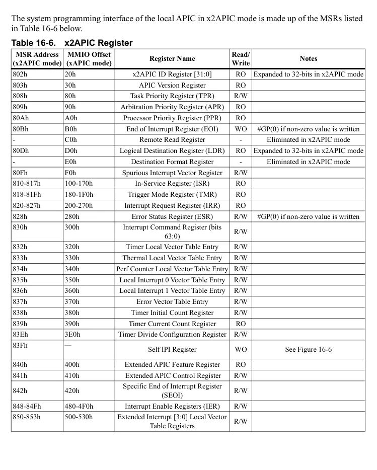

</details>


<!-- PDF source page: 721 | printed page: 659 -->

MSR addresses in the range 800h through 8FFh that are not listed in Table 16-2 are unimplemented and reserved. A #GP(0) exception is generated if a WRMSR or an RDMSR instruction attempts to access an unimplemented MSR in the x2APIC address range.

<a id="16-11-2-wrmsr-rdmsr-serialization-for-x2apic-register"></a>

### 16.11.2 WRMSR / RDMSR serialization for x2APIC Register

The WRMSR instruction is used to write the APIC register set in x2APIC mode. Normally WRMSR is a serializing instruction, however when accessing x2APIC registers, the serializing aspect of WRMSR is relaxed to allow for more efficient access to those registers. Consequently, a WRMSR write to an x2APIC register may complete before older store operations are complete and have become globally visible. When strong ordering of an x2APIC write access is required with respect to preceding memory operations, software can insert a serializing instruction (such as MFENCE) before the WRMSR instruction.

The RDMSR instruction is not a serializing instruction and remains non-serializing when reading x2APIC MSRs. However, WRMSR and RDMSR instructions targeting the x2APIC MSRs are always executed in program order with respect to each other.

<a id="16-11-3-reserved-bit-checking-in-x2apic-mode"></a>

### 16.11.3 Reserved Bit Checking in x2APIC Mode

When writing x2APIC MSRs, the WRMSR instruction checks for reserved bits. Attempting to write a ‘1’ to a reserved bit causes a #GP(0) exception. For x2APIC MSRs, WRMSR reserved bit checks are summarized as follows:

**Legacy APIC registers.** Reserved bit checks for existing APIC registers are the same as described for each register in non-x2APIC mode. For details, see the APIC register descriptions in sections 16.3 through section 16.6 above. Except for the Interrupt Command Register, attempting to write a ‘1’ into bits 63:32 of the legacy APIC registers causes a #GP(0) exception.

**Interrupt Command Register (ICR).** See the description of the 64-bit ICR register in section 16.13.

**Error Status Register (ESR).** A WRMSR of a non-zero value causes a #GP(0) exception.

**SELF IPI register.** See the description of the 32-bit SELF IPI register in Section 16.15 on page 662.

The RDMSR instruction returns a zero for any reserved bit.

<a id="16-12-x2apic-id"></a>

## 16.12 x2APIC_ID

Unique local APIC IDs are assigned to each logical processor in the system. In x2APIC mode, the APIC ID is expanded to 32 bits and is referred to as the ‘x2APIC_ID’. It is assigned by hardware at reset time based on the processor topology of the system. The x2APIC_ID is a concatenation of several fields such as socket ID, core ID and thread ID.

Because the number of sockets, cores and threads may differ for each SOC, the format of x2APIC ID is model-dependent. Some fields may not be present, depending on the processor model and the


<!-- PDF source page: 722 | printed page: 660 -->

processor topology. The presence, size and position of each field is discoverable using the CPUID instruction (see “Cache and Processor Topology” on page 212).

**Figure 16-33. x2APIC_ID Register (MSR 802h)**

<details>
<summary>Extracted figure labels</summary>

```text
31
0
x2APIC_ID
Bits
Mnemonic
Description
Access type
31:0
x2APIC_ID
x2APIC ID
RO
```

</details>

System software can read x2APIC_ID using either of the following mechanisms:

**RDMSR.** An RDMSR of MSR 0802h returns the x2APIC_ID in EAX[31:0]. The x2APIC_ID is a read-only register. Attempting to write MSR 802h or attempting to read this MSR when not in x2APIC mode causes a #GP(0) exception. See 16.11 “Accessing x2APIC Registers”.

**CPUID.** The x2APIC ID is reported by CPUID functions Fn0000_000B (Extended Topology Enumeration) and CPUID Fn8000_001E (Extended APIC ID) as follows:

- Fn0000_000B_EDX[31:0]_x0 reports the full 32-bit ID, independent of APIC mode (i.e. even with APIC disabled)
- Fn8000_001E_EAX[31:0] conditionally reports APIC ID. There are 3 cases:
- 32-bit x2APIC_ID, in x2APIC mode.
- 8-bit APIC ID (upper 24 bits are 0), in xAPIC mode.
- 0, if the APIC is disabled.

The above CPUID functions also report the presence, width and location of the sub-fields comprising the x2APIC ID. See APM Volume 3 Appendix E, “Obtaining Processor Information Via the CPUID Instruction” for detailed information.

<a id="16-13-x2apic-interrupt-command-register-icr-operations"></a>

## 16.13 x2APIC Interrupt Command Register (ICR) Operations

In legacy APIC mode, two 32-bit registers (ICR Low and ICR High) are used by system software to send Inter-Processor Interrupts (IPIs) to other local APICs. The x2APIC architecture combines these two registers into a single 64-bit Interrupt Command Register located at MSR address 830h. Thus in x2APIC mode sending an IPI requires only a single WRMSR to the ICR as opposed to two MMIO accesses in xAPIC mode.

The upper half of the x2APIC ICR (bits 63:32) contains the Destination ID (DEST) field, which is expanded to 32 bits in x2APIC mode. A DEST value of FFFF_FFFFh is used to broadcast IPIs to all local APICs.

<details>
<summary>Rendered source page 722 (figures/tables)</summary>

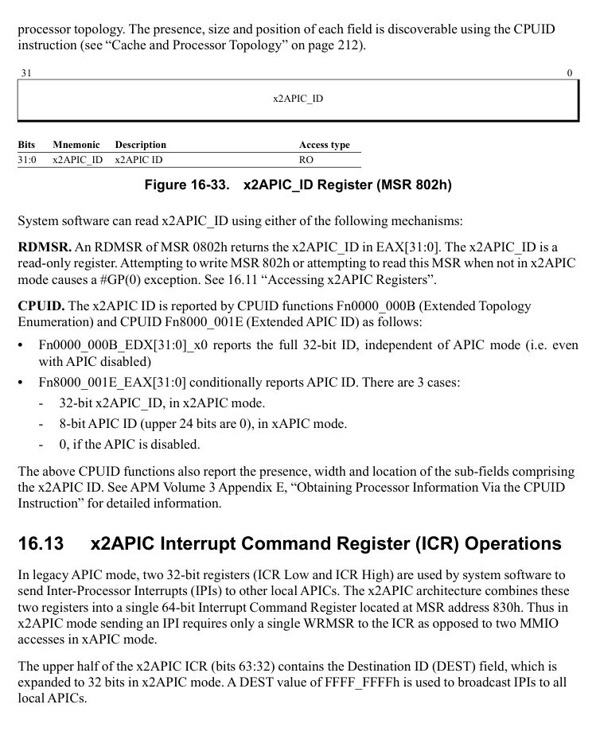

</details>


<!-- PDF source page: 723 | printed page: 661 -->

The lower half of the x2APIC ICR (bits 31:0) is identical to the APIC Interrupt Command Register Low[31:0] (see Fig 16-18 on page 582), with the following exceptions:

- The Remote Read Status field (bits 17:16) is eliminated and must be zero.
- Message Type field (bits 10:8). Encodings 1, 3 and 7 are eliminated and the encodings are reserved.
- The Delivery Status field (bit 12) is eliminated and must be zero.

The format of the x2APIC ICR register is shown in Figure 16-34.

63 0

DEST

31 20 19 18 17 16 15 14 13 12 11 10 8 7 0

Reserved

TGM

DSH

Reserved

MT VEC

DM

L

**Bits Mnemonic Description Access type** 63:32 DEST Destination R/W 55:20 Reserved MBZ 19:18 DSH Destination Shorthand R/W 17:16 Reserved MBZ 15 TMG Trigger Mode R/W 14 L Level R/W 13:12 Reserved MBZ 11 DM Destination Mode R/W 10:8 MT Message Type R/W 7:0 VEC Vector R/W

**Figure 16-34. Interrupt Command Register (MSR 830h)**

<a id="16-14-logical-destination-register"></a>

## 16.14 Logical Destination Register

When an IPI is sent using logical destination mode, all local APICs in the system use the Logical Destination Register to determine if the interrupt message is directed to them (see 16.6.1 Receiving System and IPI Interrupts). In x2APIC mode, the Logical Destination Register (LDR) is expanded to 32 bits and contains the ‘logical x2APIC_ID’. System hardware initializes LDR with the 32-bit logical x2APIC_ID whenever x2APIC mode is enabled. The LDR is a read-only register located at MSR address 080Dh. The format of the Logical Destination Registers is shown in Figure 16-35.

<details>
<summary>Rendered source page 723 (figures/tables)</summary>

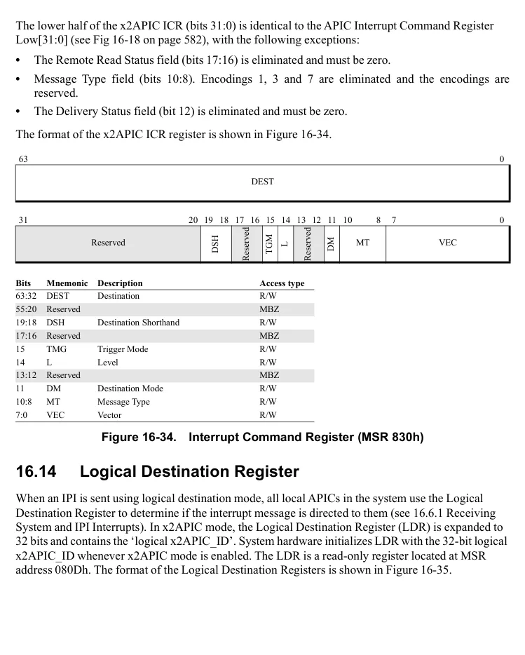

</details>


<!-- PDF source page: 724 | printed page: 662 -->

**Figure 16-35. Logical Destination (MSR 80Dh)**

<details>
<summary>Extracted figure labels</summary>

```text
31
0
Logical x2APIC_ID
Bits
Mnemonic
Description
Access type
31:0
x2Logical_ID Logical x2APICID Identifier
RO
```

</details>

The logical x2APIC_ID consists of two 16-bit sub-fields: cluster_ID and logical_ID.

- LDR[31:16] cluster_ id. Identifies the cluster of which this processor is a member.
- LDR[15:0] logical_id. A bit vector uniquely identifying this processor within the cluster.

In logical destination mode, a given logical processor is addressed by its unique cluster ID and logical_ID combination. The use of a bit vector for logical_ID allows an interrupt message to be routed to multiple processors within the addressed cluster.

The partitioning of logical x2APIC_ID provides for a possible 65,535 (216-1) clusters, with each cluster having up to 16 logical processors. The legacy “flat logical” addressing is not supported in x2APIC mode.

Upon receiving an interrupt message in logical destination format, each x2APIC compares bits 31:16 of the message destination with LDR[31:16] (cluster_id). If there is a match, then bits 15:0 of the destination and LDR[15:0] are tested for matching ones. If bits[31:16] (cluster_id) match and any bit in 15:0 (logical_id) match, this x2APIC is a valid destination.

A DEST value of FFFF_FFFFh in the ICR is used to broadcast IPIs to all local APICs.

The two sub-fields comprising logical x2APIC_ID are derived from the value of local x2APIC_ID. The 16-bit logical_ID sub-field is initialized by setting a single bit, ‘n’, where n= the 4 least significant bits of local x2APIC_ID. The 16-bit cluster_id is derived from the remaining bits of the x2APIC_ID. Specifically, logical_id[15:0] = 1 &lt;&lt; x2APIC_ID[3:0] and cluster_id[15:0] = x2APIC_ID[19:4].

<a id="16-15-self-ipi-register"></a>

## 16.15 Self_IPI Register

The Self_IPI register (MSR 83Fh) provides a performance-optimized interface for system software to send interrupt messages to the local APIC. This register is write-only and attempts to read it cause a #GP(0) exception. The format of the Self_IPI registers is shown in Figure 16-36.

<details>
<summary>Rendered source page 724 (figures/tables)</summary>

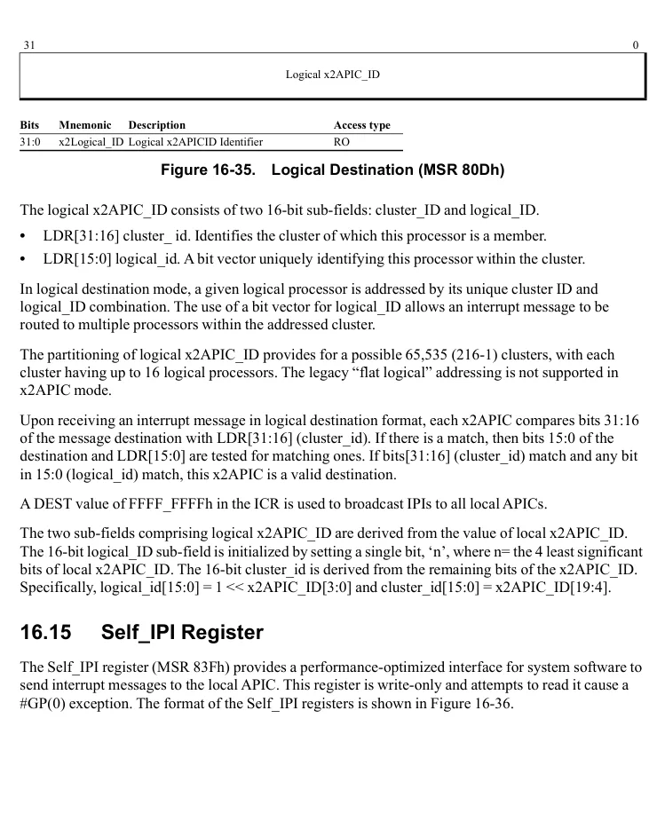

</details>


<!-- PDF source page: 725 | printed page: 663 -->

**Figure 16-36. Self_IPI Register (MSR 83Fh)**

<details>
<summary>Extracted figure labels</summary>

```text
31
8
7
0
Reserved
VEC
Bits
Mnemonic
Description
Access type
31:8
Reserved
MBZ
7:0
VEC
Interrupt Vector
WO
```

</details>

The Self_IPI register contains a single field: an interrupt vector. Writing to this register causes a to-self IPI to be generated, equivalent to a to-self IPI generated by writing the Interrupt Command Register (ICR, MSR 830h) with the following settings:

- Destination shorthand = self
- Trigger Mode = edge-triggered
- Message Type = fixed
- Vector = interrupt vector as specified in the Self_IPI register

The x2APIC’s response to a self-IPI sent via the Self_IPI register is architecturally identical to one sent via the ICR. In particular, the operation of the Interrupt Response Register (IRR), In-Service Register (ISR) and Trigger Mode Register (TMR) is the same. See “Accepting System and IPI Interrupts” on page 647 for IRR, ISR and TMR details.

The Interrupt Request Register (IRR) contains interrupt requests that have been accepted by the processor core. Completion of the WRMSR to the Self_IPI register ensures that the resulting IPI has been entered into the IRR, and that the associated TMR bit is cleared (as expected for edge-triggered interrupts).

<details>
<summary>Rendered source page 725 (figures/tables)</summary>

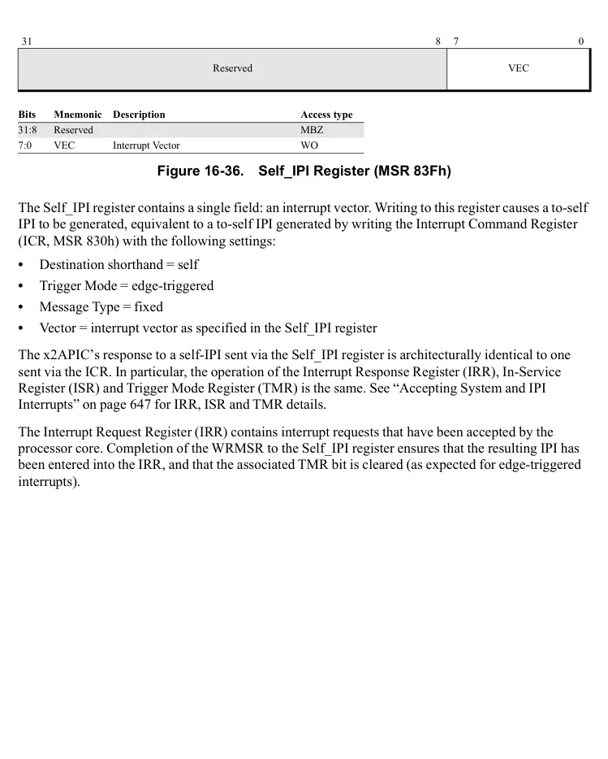

</details>
