<!-- PDF source page: 726 | printed page: 664 -->

<a id="17-hardware-performance-monitoring-and-control"></a>

# 17 Hardware Performance Monitoring and Control

The AMD64 architecture provides several mechanisms by which software can monitor and control processor performance to optimize power use. The following lists the facilities that are described in the sections that follow:

- The P-state control interface allows dynamic control of performance states. See Section 17.1 which follows immediately below.
- Core performance boost (CPB) dynamically increases core clock rate beyond that defined for the P0 power state to achieve higher performance while maintaining power consumption below a preset level. See Section 17.2 on page 666.
- The effective frequency interface provides a measure of the actual core clock rate over a specified period of time. See Section 17.3 on page 667.
- The processor power reporting interface allows system software to measure average processor core power over a given time period. See Section 17.5 on page 669.
- Collaborative Processor Performance Control (CPPC) provides a mechanism for improving performance and power efficiency in collaboration with Operating System Power Management software. See Section 17.6 on page 671.

<a id="17-1-p-state-control"></a>

## 17.1 P-State Control

P-states are operational performance states (states in which the processor is executing instructions, that is, running software) characterized by a unique frequency of operation for a CPU core. The P-state control interface supports dynamic P-state changes in up to 16 P-states, called P-states 0 through 15 or P0 though P15. P0 is the highest power, highest performance P-state; each ascending P-state number represents a lower-power, lower-performance state.

Core P-states are controlled by software. Each CPU core contains one set of P-state control registers. Software controls the P-states of each CPU core independently; however, hardware may include interdependencies that affect the P-state achieved by each core.

Hardware provides the highest P-state value in the PstateMaxVal field of the P-State Current Limit Register. P-states may be limited to a lower performance value under certain conditions. The current P-state limit is dynamic and is specified in the CurPstateLimit field of the P-State Current Limit Register.

Software requests a core P-state change by writing a 4-bit index corresponding to the desired core P-state number to the P-State Control Register of the appropriate core. For example, to request the P3 state for core 0, software writes 3h to the core 0’s PstateCmd field in MSR C001_0062h. If the P-state value is greater than the value in PstateMaxVal, the value written is clipped to that value.


<!-- PDF source page: 727 | printed page: 665 -->

As the current P-state limit changes, the P-state for the CPU core is either set to the software-requested P-state value or the new current P-state limit, whichever is the higher P-state value.

The current P-state value can be read using the P-State Status Register. The P-State Current Limit Register and the P-State Status Register are read-only registers. Writes to these registers cause a #GP exception. Support for hardware P-state control is indicated by CPUID Fn8000_0007_EDX[HwPstate] = 1. Figure 17-1 below shows the format of the P-State Current Limit register.

**Figure 17-1. P-State Current Limit Register (MSR C001_0061h)**

<details>
<summary>Extracted figure labels</summary>

```text
63
8 7
4 3
0
Reserved
PstateMaxVal
CurPstateLimit
Bits
Mnemonic
Description
Access type
63:8
Reserved
MBZ
7:4
PstateMaxVal
P-state maximum value
RO
3:0
CurPstateLimit
Current P-state limit
RO
```

</details>

The fields within the P-State Current Limit register are:

- *Current P-State Limit (CurPstateLimit)*—Bits 3:0. Provides the current P-state limit, which is the lowest P-state value (highest-performance state) that is currently supported by the hardware. This is a dynamic value controlled by hardware. Reset value is implementation specific.
- *P-State Maximum Value (PstateMaxVal)*—Bits 7:4. Specifies the highest P-state value (lowest performance state) supported by the hardware. Attempts to change the current P-state number to a higher value by writes to the P-State Control Register are clipped to the value of this field. Reset value is implementation specific.

**Figure 17-2. P-State Control Register (MSR C001_0062h)**

<details>
<summary>Extracted figure labels</summary>

```text
63
4 3
0
Reserved
PstateCmd
Bits
Mnemonic
Description
Access type
63:4
Reserved
MBZ
3:0
PstateCmd
P-state change command
R/W
```

</details>

*P-State Change Command (PstateCmd*)—Bits 3:0. Writes to this field cause the CPU core to change to the indicated P-state number, which may be clipped by the PstateMaxVal field of the P-State Cur-rent Limit Register. Reset value is implementation specific.

<details>
<summary>Rendered source page 727 (figures/tables)</summary>

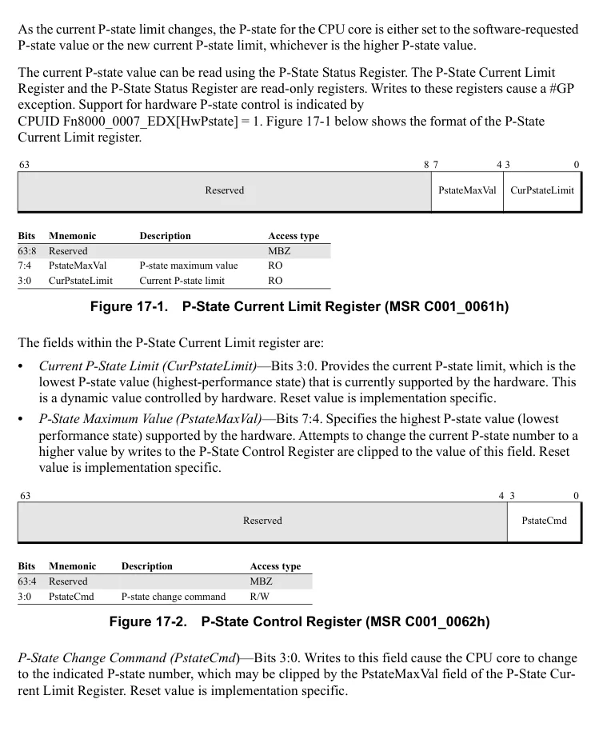

</details>


<!-- PDF source page: 728 | printed page: 666 -->

**Figure 17-3. P-State Status Register (MSR C001_0063h)**

<details>
<summary>Extracted figure labels</summary>

```text
63
4
3
0
Reserved
CurPstate
Bits
Mnemonic
Description
Access type
63:4
Reserved
MBZ
3:0
CurPstate
Current P-state
RO
```

</details>

*Current P-State (CurPstate)*—Bits 3:0. This field provides the current P-state of the CPU core regard-less of the source of the P-state change, including writes to the P-State Control Register: 0 = P-state 0, 1 = P-state 1, etc. The value of this field is updated when the frequency transitions to a new value associated with the P-state. Reset value is implementation specific.

<a id="17-2-core-performance-boost"></a>

## 17.2 Core Performance Boost

Core performance boost (CPB) dynamically monitors processor activity to create an estimate of power consumption. If the estimated processor consumption is below an internally defined power limit and software has requested P0 on a given core, hardware may transition the core to a frequency and voltage beyond those defined for P0. If the estimated power consumption exceeds the defined power limit, some or all cores are limited to the frequency and voltage defined by P0. CPB ensures that average power consumption over a thermally significant time period remains at or below the defined power limit.

CPB can be disabled using the CPBDis field of the Hardware Configuration Register (HWCR MSR) on the appropriate core. When CPB is disabled, hardware limits the frequency and voltage of the core to those defined by P0.

Support for core performance boost is indicated by CPUID Fn8000_0007_EDX[CPB] = 1. See Section 3.3, “Processor Feature Identification,” on page 71 for more information on using the CPUID instruction.

<details>
<summary>Rendered source page 728 (figures/tables)</summary>

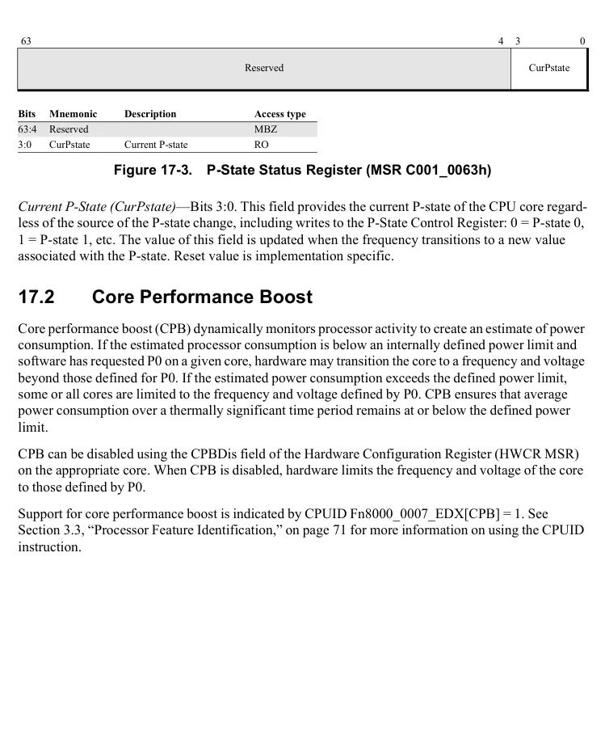

</details>


<!-- PDF source page: 729 | printed page: 667 -->

**Figure 17-4. Core Performance Boost (MSR C001_0015h)**

<details>
<summary>Extracted figure labels</summary>

```text
63
25
0
CPBDis
Reserved
Bits
Mnemonic
Description
Access type
63:26
Reserved
MBZ
25
CPBDis
Core Performance Boost Disable
R/W
24:0
Reserved
MBZ
```

</details>

*Core Performance Boost Disable (CpbDis)*—Bit 25. Specifies whether core performance boost is enabled or disabled. 0 = Enabled. 1 = Disabled.

<a id="17-3-determining-processor-effective-frequency"></a>

## 17.3 Determining Processor Effective Frequency

The Max Performance Frequency Clock Count (MPERF) and the Actual Performance Frequency Clock Count (APERF) registers constitute the effective frequency interface. This interface provides a means for software to calculate an average, or effective, frequency of a core over a known window of time. This provides software a measure of actual performance rather than forcing software to assume that the current frequency of the core is the frequency of the last P-state requested.

To calculate an effective clock frequency of a given processor core, on that processor do the following:

1. 1. Read both MPERF and APERF and save their initial values.
- MPERF_INIT = MPERF and APERF_INIT = APERF

1. 2. Wait an appropriate amount of time.

1. 3. Read both MPERF and APERF again.

1. 4. Effective frequency = {(APERF - APERF_INIT) / (MPERF - MPERF_INIT)} * P0 frequency.

The amount of time that elapses between steps 1 and 3 is determined by software. This allows software to define the time window over which the processor frequency is averaged. Software should disable interrupts or any other events that may occur between the read of MPERF and the read of APERF in step 1 and again when the two MSRs are read in step 3. Step 4 provides the equation for the calculation of the effective frequency value. Software determines the P0 frequency using ACPI defined data structures.

The effective frequency interface only counts clock cycles while the core is in the ACPI defined C0 state.

Only the ratio between MPERF and APERF is architecturally defined. Software should not assume any specific definition of the MPERF or APERF registers. If an overflow of either the MPERF or

<details>
<summary>Rendered source page 729 (figures/tables)</summary>

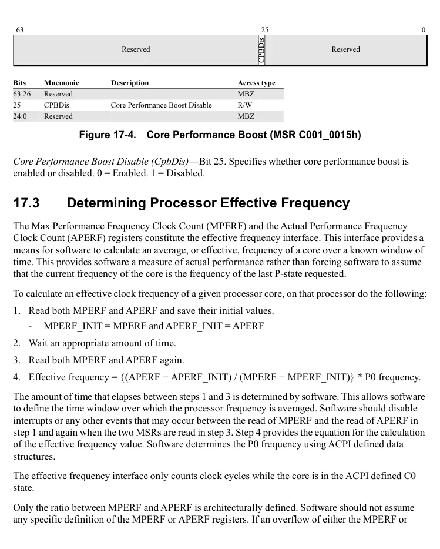

</details>


<!-- PDF source page: 730 | printed page: 668 -->

APERF register occurs between the read of MPERF in step 1 and the read of APERF in step 3, the effective frequency calculated in step 4 is invalid.

Hardware support for the effective frequency interface is indicated by CPUID Fn0000_0006_ECX[EffFreq]. See Section 3.3, “Processor Feature Identification,” on page 71 for more information on using the CPUID instruction.

<a id="17-3-1-actual-performance-frequency-clock-count-aperf"></a>

### 17.3.1 Actual Performance Frequency Clock Count (APERF)

Specifies the numerator of the effective frequency ratio.

**Figure 17-5. Actual Performance Frequency Count (MSR0000_00E8h)**

<details>
<summary>Extracted figure labels</summary>

```text
63
0
APERF
Bits
Mnemonic
Description
Access Type
63:0
APERF
Actual Performance Frequency Clock Count
R/W
```

</details>

<a id="17-3-2-maximum-performance-frequency-clock-count-mperf"></a>

### 17.3.2 Maximum Performance Frequency Clock Count (MPERF)

Specifies the denominator of the effective frequency ratio. The value read is scaled by the TSCRatio value (MSR C000_0104h) for guest reads, but the underlying counters are not affected. Reads in host mode or writes to MPERF are not affected.

**Figure 17-6. Max Performance Frequency Count (MSR0000_00E7h)**

<details>
<summary>Extracted figure labels</summary>

```text
63
0
MPERF
Bits
Mnemonic
Description
Access Type
63:0
MPERF
Max Performance Frequency Clock Count
R/W
```

</details>

<details>
<summary>Rendered source page 730 (figures/tables)</summary>

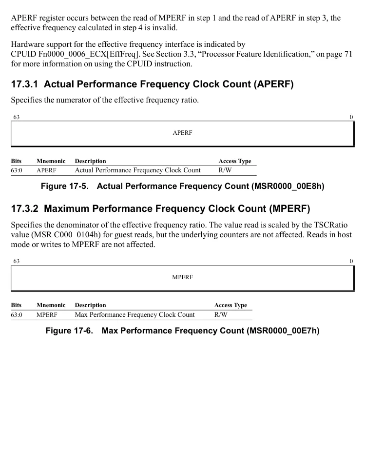

</details>


<!-- PDF source page: 731 | printed page: 669 -->

<a id="17-3-3-aperf-read-only-aperfreadonly"></a>

### 17.3.3 APERF Read-only (AperfReadOnly)

Specifies the numerator of the effective frequency ratio.

**Figure 17-7. APREF Read Only (MSR C000_00E8h)**

<details>
<summary>Extracted figure labels</summary>

```text
63
0
APERF_RD_ONLY
Bits
Mnemonic
Description
Access Type
63:0
APERF_RD_ONLY APREF Read Only
RO
```

</details>

<a id="17-3-4-mperf-read-only-mperfreadonly"></a>

### 17.3.4 MPERF Read-only (MperfReadOnly)

Read-only version of MPERF. The value read is scaled by the TSCRatio value (MSR C000_0104h) for guest reads.

**Figure 17-8. MPERF Read Only (MSR C000_00E7h)**

<details>
<summary>Extracted figure labels</summary>

```text
63
0
MPERF_RD_ONLY
Bits
Mnemonic
Description
Access Type
63:0
MPERF_RD_ONLY
MPERF Read Only
RO
```

</details>

<a id="17-4-processor-feedback-interface"></a>

## 17.4 Processor Feedback Interface

The Processor Feedback Interface is deprecated. Some processor products may support this feature. To determine support on a given processor, software can test the feature bit CPUID Fn8000_0007_EDX[ProcFeedbackInterface]. For more information, consult the *BIOS and Kernel Developer’s Guide (BKDG)* or *Processor Programming Reference Manual (PPR)* applicable to your product.

<a id="17-5-processor-core-power-reporting"></a>

## 17.5 Processor Core Power Reporting

The processor power reporting interface allows system software to estimate the average power consumed by a processor core over a software-determined time period. Computing the average power involves reading a “core power accumulator” register at the beginning and end of the measurement interval, taking the difference and then dividing by the length of the time interval.

Support for the processor power reporting interface is indicated by CPUID Fn8000_0007_EDX[ProcPowerReporting] = 1.

<details>
<summary>Rendered source page 731 (figures/tables)</summary>

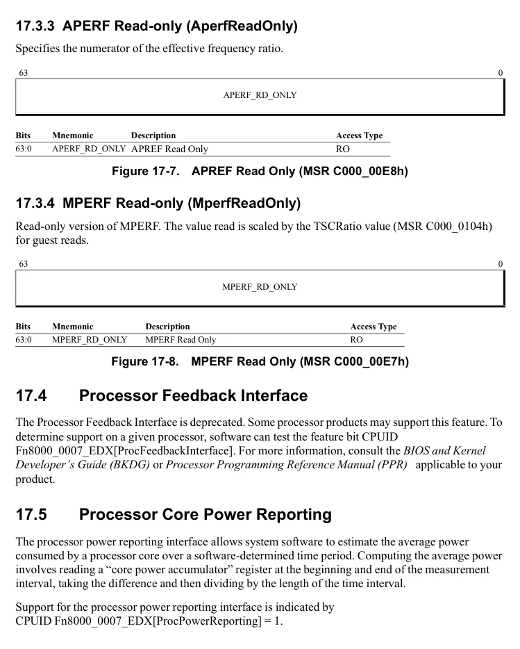

</details>


<!-- PDF source page: 732 | printed page: 670 -->

<a id="17-5-1-processor-facilities"></a>

### 17.5.1 Processor Facilities

Estimating core average power involves the use of several processor facilities. Processors that support the processor power reporting interface define the following three facilities:

- CpuSwPwrAcc MSR
- MaxCpuSwPwrAcc MSR
- CpuPwrSampleTimeRatio (CPUID Fn8000_0007_ECX)

A fourth facility, available on all processors, is the time-stamp counter (TSC). The TSC is a free-running counter that increments on every processor clock cycle. The current value o f this counter is read using the RDTSC instruction.

The contents of the CpuSwPwrAcc register represents the cumulative *energy* consumed by the core. Each hardware-determined sample period (Tsample) a value that represents the energy consumed since the previous sample is added to the contents of this register. Tsample is on the order of a few microseconds. The exact value is immaterial because the CpuPwrSampleTimeRatio register provides the ratio of Tsample to the TSC period.

CpuSwPwrAcc is cleared to zero at power-on and is never reset. Therefore, it is possible for this counter to overflow and roll over to zero. To account for this, the interface provides the MaxCpuSwPwrAcc register. When read, this register provides a value that represents the maximum energy that the CpuSwPwrAcc register can report.

<a id="17-5-2-software-algorithm"></a>

### 17.5.2 Software Algorithm

The following algorithm should be used to calculate the average power consumed by a processor core during the measurement interval T*M*. To obtain a stable average power value, T*M* should be on the order of several milliseconds.

- Determine the value of the ratio of Tsample to the TSC period (CpuPwrSampleTimeRatio) by executing CPUID Fn8000_0007. Call this value *N*. *N* = CPUID Fn8000_0007_ECX[31:0].
- Read the full range of the cumulative energy value from the register MaxCpuSwPwrAcc. *Jmax* = value returned from RDMSR MaxCpuSwPwrAcc.
- At time *x*, read CpuSwPwrAcc and the TSC *Jx* = value returned by RDMSR CpuSwPwrAcc *Tx* = value returned by RDTSC
- At time *y*, read CpuSwPwrAcc and the TSC again *Jy* = value returned by RDMSR CpuSwPwrAcc *Ty* = value returned by RDTSC

Calculate the average power consumption for the processor core over the measurement interval T*M =* (*Ty* – *Tx*).


<!-- PDF source page: 733 | printed page: 671 -->

- If (*Jy* &lt; *Jx*), rollover has occurred; set *Jdelta* = (*Jy* + *Jmax*) – *Jx* else *Jdelta* = *Jy* – *Jx*
- PwrCPUave = *N  *Jdelta* / (*Ty* - *Tx*)

Units of result is milliwatts.

<a id="17-6-collaborative-processor-performance-control"></a>

## 17.6 Collaborative Processor Performance Control

AMD’s Collaborative Processor Performance Control (CPPC) feature is an implementation of the Collaborative Processor Performance Control standard, first introduced in the Advanced Configuration and Power Interface (ACPI) Specification Revision 5.0. CPPC provides a framework for managing the performance and power efficiency of SOCs in collaboration with Operating System Power Management (OSPM) software.

The CPPC feature provides a mechanism for the OSPM to manage the performance of a logical processor utilizing a continuous and abstract performance scale. CPPC implements a set of MSRs to enumerate the abstract performance scale, to request processor performance levels using that scale, and to provide feedback to the OSPM.

<a id="17-6-1-detecting-support-for-cppc"></a>

### 17.6.1 Detecting Support for CPPC

Support for CPPC is indicated by CPUID Fn8000_0008_EBX[CPPC](bit 27)=1.

<a id="17-6-2-cppc-model-specific-registers"></a>

### 17.6.2 CPPC Model Specific Registers

Various aspects of the CPPC are managed though the model-specific registers listed in Table 17-1 below. These MSRs are used by the OSPM to obtain CPPC capabilities, control CPPC operations and obtain feedback on delivered performance.

**Table 17-1. CPPC-related MSRs**

| Register Name | MSR Address | Reference | Description |
| --- | --- | --- | --- |
| CPPC CAPABILITY 1<br>_ _ | C001 02B0h | Figure 17-10 | Specifies the CPPC performance ranges and thresholds. |
| CPPC ENABLE | C001 02B1h | Figure 17-9 | Enables CPPC. |
| CPPC CAPABILITY 2<br>_ _ | C001 02B2h | Figure 17-11 | Reports the constrained maximum performance level. |
| CPPC REQUEST | C001 02B3h | Figure 17-12 | Conveys OSPM requests and hints to the CPPC hardware. |
| CPPC STATUS | C001 02B4h | Figure 17-13 | Reports excursions to the minimum performance level. |

<a id="17-6-3-enabling-cppc"></a>

### 17.6.3 Enabling CPPC

Software may enable Collaborative Processor Performance Control by setting CPPC_ENABLE[CPPC_En] (bit 0) = 1. Enabling CPPC on any one logical processor in a package enables it for all processors within that package.

<details>
<summary>Rendered source page 733 (figures/tables)</summary>

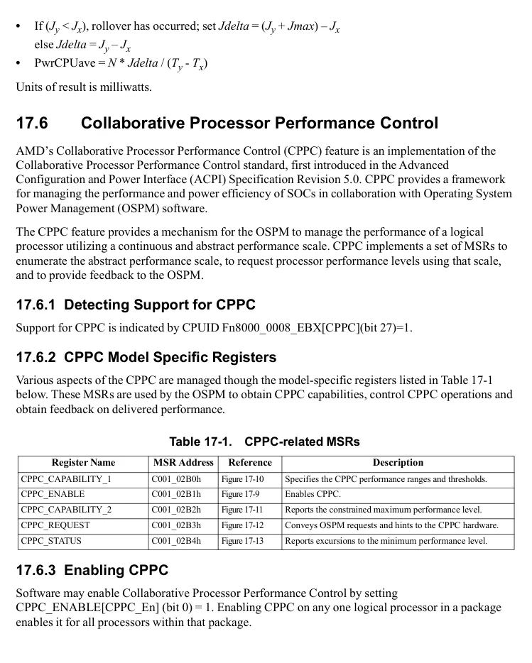

</details>


<!-- PDF source page: 734 | printed page: 672 -->

When CPPC is enabled, the hardware calculates the processor’s performance capabilities and initializes the performance level fields in the CPPC capability registers.

The processor ignores the P-state control interface (described in “P-State Control” on page 664) when CPPC is enabled.

**Figure 17-9. CPPC_ENABLE**

<details>
<summary>Extracted figure labels</summary>

```text
17.6.3.1 CPPC_ENABLE
63
1 0
CPPC_En
Reserved
Bits
Mnemonic
Description
Access Type
63:1
Reserved
MBZ
0
CPPC_En
CPPC enable
R/W1
```

</details>

The CPPC_ENABLE register fields are further described below:

- *CPPC_En (CPPC Enable)*—Bit 0, read/write once. Software sets this bit to enable Collaborative Processor Performance Control. Once CPPC is enabled the processor ignores further writes to this register. CPPC_En can only be cleared by reset.

<a id="17-6-4-cppc-performance-levels-and-capabilities"></a>

### 17.6.4 CPPC Performance Levels and Capabilities

The OSPM can read the CPPC_CAPABILITY_1 and CPPC_CAPABILITY_2 MSRs to determine the performance levels and thresholds supported by the processor. These values are reported on a continuous scale of abstract values ranging from 00h (minimum) to FFh (maximum).

Prior to enabling CPPC, the CPPC_CAPABILTY_1 and CPPC_CAPABILITY_2 registers are initialized to zero. When CPPC is enabled, the hardware calculates the processors’ performance capabilities and stores the appropriate values in both CPPC capability registers.

The reported performance levels directly map to processor frequency; however, this mapping is specific to a processor family and implementation.

The CPPC_CAPABILITY_1 and CPPC_CAPABILITY_2 registers are implemented on a per-logical processor basis. Each logical processor contains an independent set of CPPC capability registers.

1. 17. 6.4.1 CPPC_CAPABILITY_1**

The CPPC_CAPABILITY_1 register reports the processor performance levels and thresholds.

63 32

Reserved

<details>
<summary>Rendered source page 734 (figures/tables)</summary>

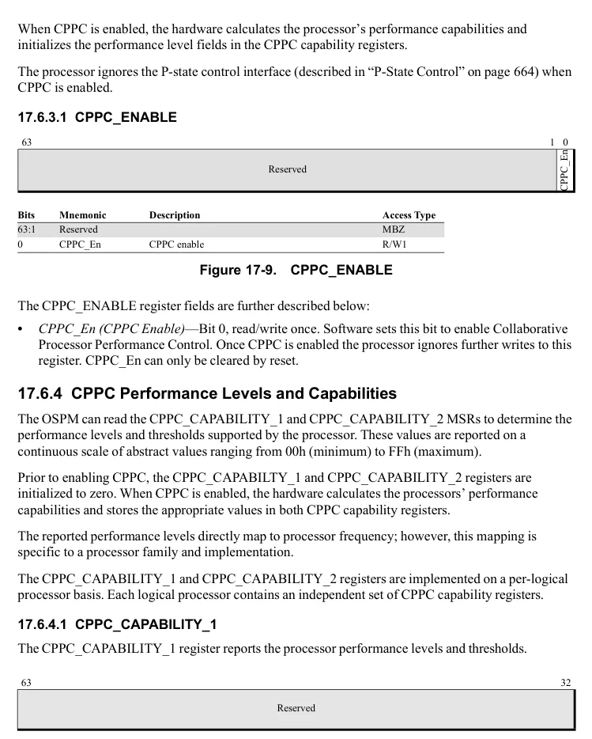

</details>


<!-- PDF source page: 735 | printed page: 673 -->

31 24 23 16 15 8 7 0

HighestPerf NominalPerf LowNonLinPerf LowestPerf

**Bits Mnemonic Description Access Type** 63:32 Reserved RAZ

31:24 HighestPerf Highest Performance - The absolute maximum perfor-mance an individual processor may reach. RO

23:16 NominalPerf Nominal (Guaranteed) Performance - The maximum sustained performance level of the processor. RO

**Figure 17-10. CPPC_CAPABILITY_1**

<details>
<summary>Extracted figure labels</summary>

```text
15:8
LowNonLinPerf
Lowest Non-Linear Performance is the lowest perfor-
mance level at which nonlinear power savings are
achieved.
RO
7:0
LowestPerf
Lowest performance is the absolute lowest performance
level of the processor.
RO
```

</details>

The CPPC_CAPABILITY_1 register fields are further described below:

- *HighestPerf[7:0] (Highest Performance)—*Bits 31:24. Reports the maximum performance an individual processor can reach under ideal conditions. This performance level is not guaranteed due to system thermal and power constraints and may not be sustainable for long durations. The Highest Performance level may require that other processors be in a lower performance state.
- *NominalPerf[7:0] (Nominal Performance)—*Bits 23:16. Reports the maximum sustained performance level of the processor, assuming ideal operating conditions. In the absence of an unexpected system power or thermal constraint, the processor can maintain the nominal performance level continuously. All processors can sustain the Nominal Performance state simultaneously.
- *LowNonLinPerf[7:0] (Lowest Non-Linear Performance)—*Bits 15:8. Reports the most energy efficient performance level (in terms of performance per watt). Above this threshold, lower performance levels generally result in increased energy efficiency. Reducing performance below this threshold does not result in total energy savings for a given computation, although it reduces instantaneous power consumption.
- *LowestPerf[7:0] (Lowest Performance)—*Bits 7:0. Reports the lowest performance level of the processor.

<details>
<summary>Rendered source page 735 (figures/tables)</summary>

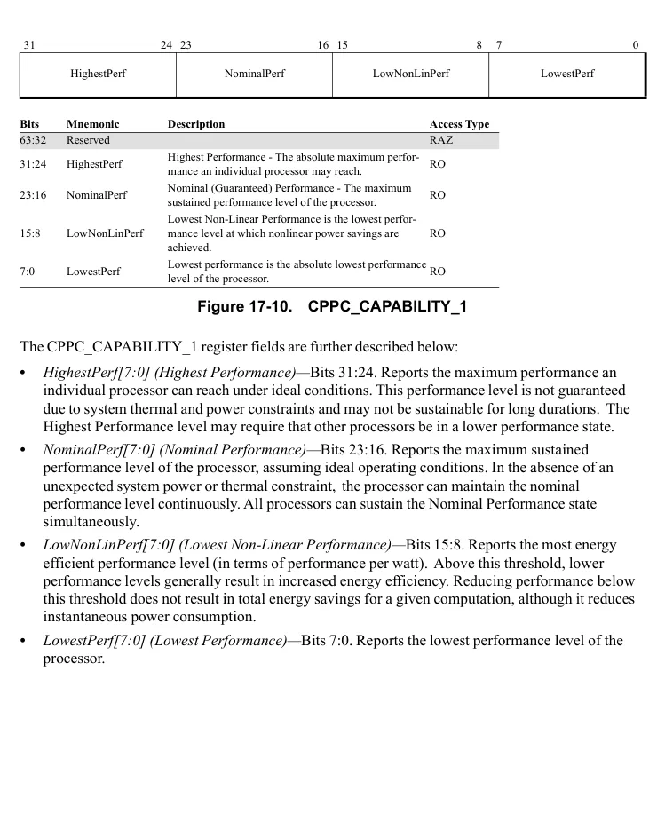

</details>


<!-- PDF source page: 736 | printed page: 674 -->

1. 17. 6.4.2 CPPC_CAPABILITY_2**

The CPPC_CAPABILITY_2 register reports the constrained maximum performance level of the processor.

**Figure 17-11. CPPC_CAPABILITY_2**

<details>
<summary>Extracted figure labels</summary>

```text
63
32
Reserved
31
8
7
0
Reserved
MaxPerf
Bits
Mnemonic
Description
Access Type
63:8
Reserved
RAZ
7:0
MaxPerf
Constrained Maximum Performance
RO
```

</details>

The CPPC_CAPABILITY_2 register fields are further described below: **•* MaxPerf[7:0] (Constrained Maximum Performance)—*Bits 7:0. Reports the current maximum performance level considering all known external constraints (i.e., power limits, thermal limits, AC/DC power source, etc.).

<a id="17-6-5-using-cppc-to-manage-processor-performance"></a>

### 17.6.5 Using CPPC to Manage Processor Performance

The OSPM controls CPPC operation by specifying processor performance goals and hints using the CPPC_REQUEST register. The values written to CPPC_REQUEST use the abstract, continuous performance scale described in Section 17.6.4 on page 672.

CPPC supports two modes of operation – *directed* and *autonomous*. In the directed mode of operation, the OSPM requests explicit performance targets by writing the CPPC_REQUEST[DesPerf] field. The CPPC hardware translates these requests into actual performance and power states (core frequency, data fabric and memory clocks, etc). DesPerf may be set to any performance value between CPPC_REQUEST[MinPerf,MaxPerf], inclusive.

The effective performance delivered by the CPPC hardware is guided by hints provided by the OSPM. These hints include minimum and maximum performance limits, plus a preference towards energy efficiency or performance. The OSPM programs these hints into the MinPerf, MaxPerf, and EnergyPerfPref fields of the CPPC_REQUEST register.

Autonomous mode is selected by writing zero to CPPC_REQUEST[DesPerf]. In autonomous mode, the hardware independently selects a performance level appropriate to the current workload. As with the directed mode, the OSPM provides hints to guide the hardware’s performance level selection,

<details>
<summary>Rendered source page 736 (figures/tables)</summary>

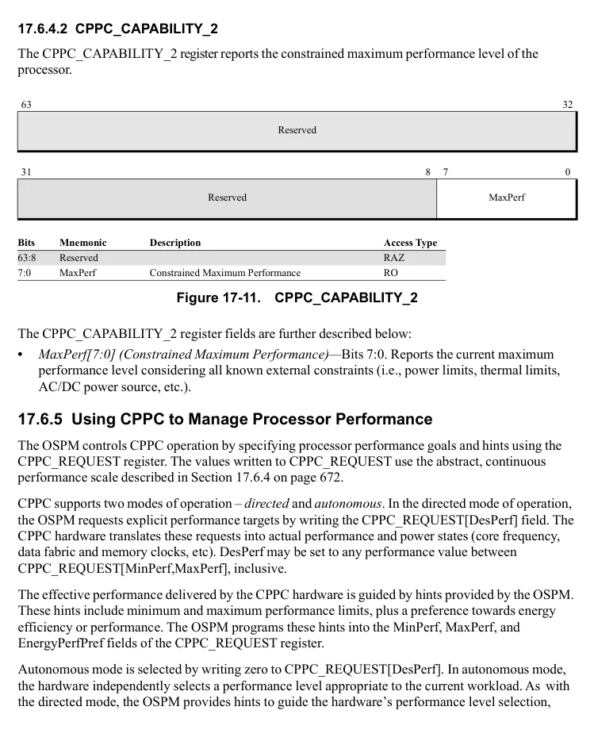

</details>


<!-- PDF source page: 737 | printed page: 675 -->

including minimum and maximum performance limits and a preference for optimizing for energy efficiency versus performance.

1. 17. 6.5.1 CPPC_REQUEST**

The CPPC_REQUEST register is used by the OSPM to convey performance requests and hints to the CPPC hardware.

63 32

Reserved

31 24 23 16 15 8 7 0

EnergyPerfPref DesPerf MinPerf MaxPerf

**Bits Mnemonic Description Access Type** 63:32 Reserved MBZ 31:24 EnergyPerfPref Energy Performance Preference RW 23:16 DesPerf Desired Performance RW 15:8 MinPerf Minimum Performance RW 7:0 MaxPerf Maximum Performance RW

**Figure 17-12. CPPC_REQUEST**

The CPPC_REQUEST register fields are further described below:

- *EnergyPerfPref[7:0] (Energy Performance Preference hint)—*Bits 31:24. Provides a hint to the hardware if software wants to bias the processor towards performance (00h) or towards energy efficiency (FFh).
- *DesPerf[7:0] (Desired Performance hint)—*Bits 23:16. The OSPM programs this field with a non-zero value to convey a desired performance level to the hardware. The Desired Performance hint may be set to any performance value in the range [MinPerf, MaxPerf], inclusive. When programmed to zero, autonomous mode is selected, and hardware autonomously determines the performance level appropriate for the current workload.
- *MinPerf[7:0] (Minimum Performance hint)—*Bits 15:8. The OSPM programs this field to limit the minimum performance that is expected to be supplied by the hardware. Excursions below the minimum are possible due to unexpected system thermal or power constraints. MinPerf may be set to any performance value in the range CPPC_CAPABILITY_1[LowestPerf, HighestPerf], inclusive but must be set to a value less than or equal to MaxPerf.
- *MaxPerf[7:0] (Maximum Performance hint)—*Bits 7:0. The OSPM programs this field to limit the maximum performance for the purpose of energy efficiency or thermal control. Excursions above the maximum are possible due to hardware coordination between processor cores and other

<details>
<summary>Rendered source page 737 (figures/tables)</summary>

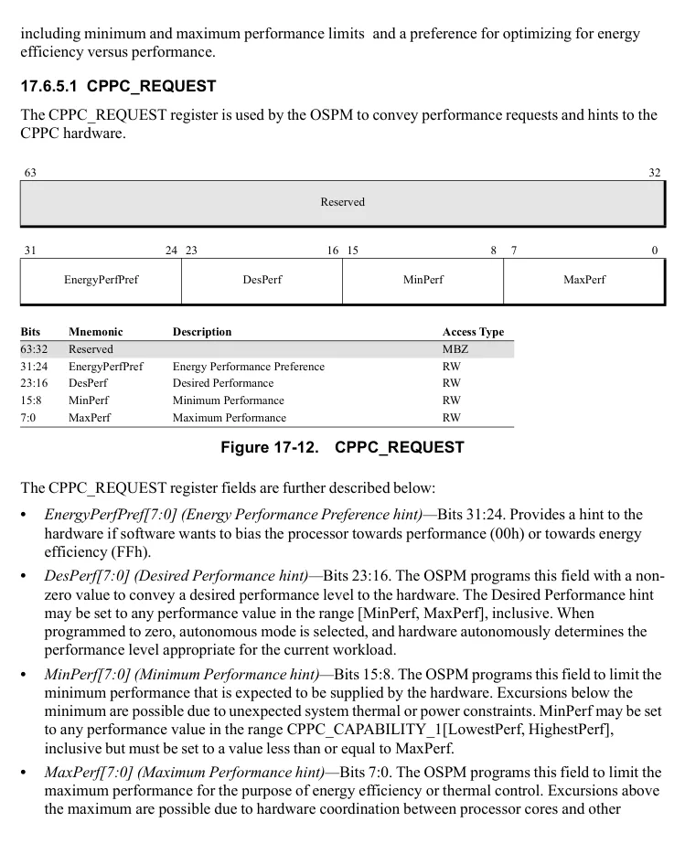

</details>


<!-- PDF source page: 738 | printed page: 676 -->

components in the package. Maximum performance may be set to any performance value in the range CPPC_CAPABILITY_1[LowestPerf, HighestPerf] inclusive.

<a id="17-6-6-cppc-feedback-mechanisms"></a>

### 17.6.6 CPPC Feedback Mechanisms

The CPPC hardware provides performance feedback to the OSPM via the CPPC_STATUS MSR. The bits within the CPPC_STATUS register are sticky, and when set will remain set until software clears them. Software must clear these bits to enable notifications for subsequent events.

The processor sets CPPC_STATUS[MinEx] to signal that an excursion to less than minimum performance has occurred. This indicates that an unpredicted power or thermal event has occurred, and the processor has limited delivered performance to less than CPPC_REQUEST[MinPerf].

1. 17. 6.6.1 CPPC_STATUS**

The CPPC_STATUS register conveys performance feedback to the OSPM.

**Figure 17-13. CPPC_STATUS**

<details>
<summary>Extracted figure labels</summary>

```text
63
32
Reserved
31
2
1
0
Reserved
MinEx
Reserved
Bits
Mnemonic
Description
Access Type
63:2
Reserved
MBZ
1
MinEx
Minimum Excursion has occurred
R/W
0
Reserved
MBZ
```

</details>

The CPPC_STATUS register fields are further described below:

- *MinEx (Minimum Excursion)—*Bit 1. The processor sets this bit when Delivered Performance has been constrained to less than CPPC_REQUEST[MinPerf]. Software must clear this bit to enable further notifications of minimum performance excursions.

1. 17. 6.6.2 Frequency Metrics**

The AMD64 architecture provides a mechanism by which the OSPM can determine the effective frequency of a logical processor.

The Maximum Performance Frequency Clock Count (MPERF) and the Actual Performance Frequency Clock Count (APERF) registers constitute the effective frequency interface. This interface provides a means for software to calculate an average, or effective, frequency of a core over a known

<details>
<summary>Rendered source page 738 (figures/tables)</summary>

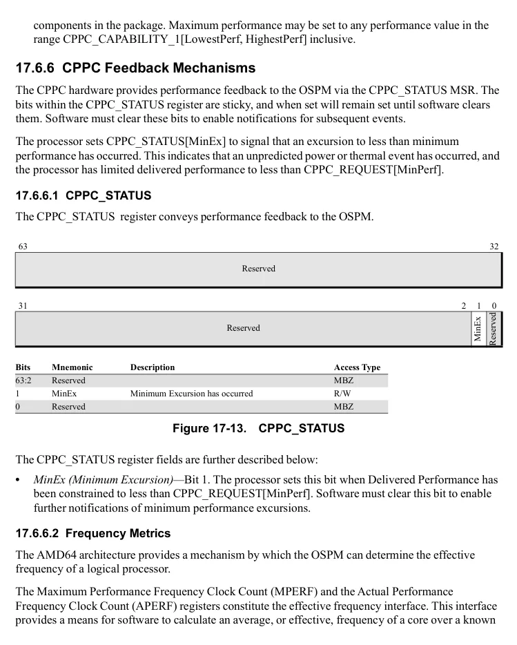

</details>


<!-- PDF source page: 739 | printed page: 677 -->

window of time. See Section 17.3, “Determining Processor Effective Frequency,” on page 667 for more information.
