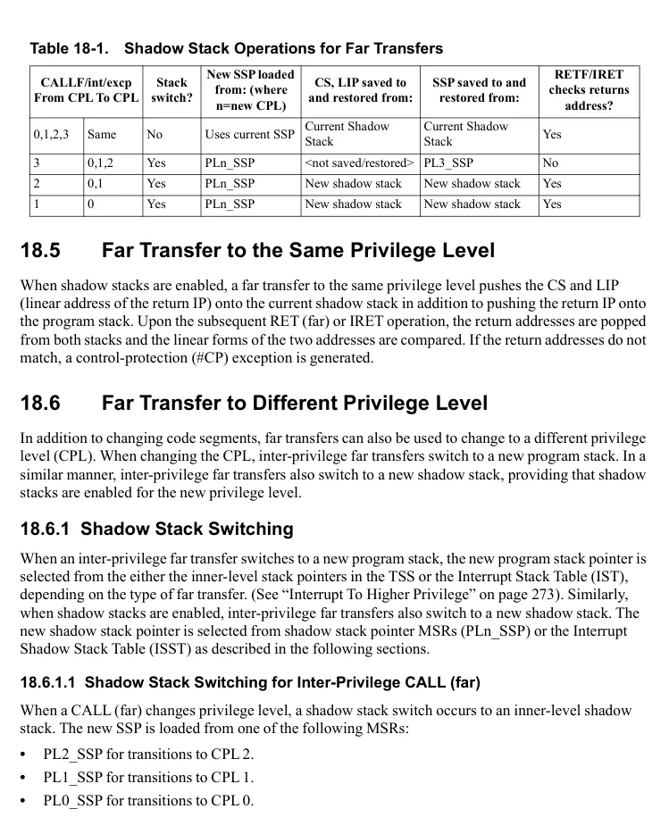
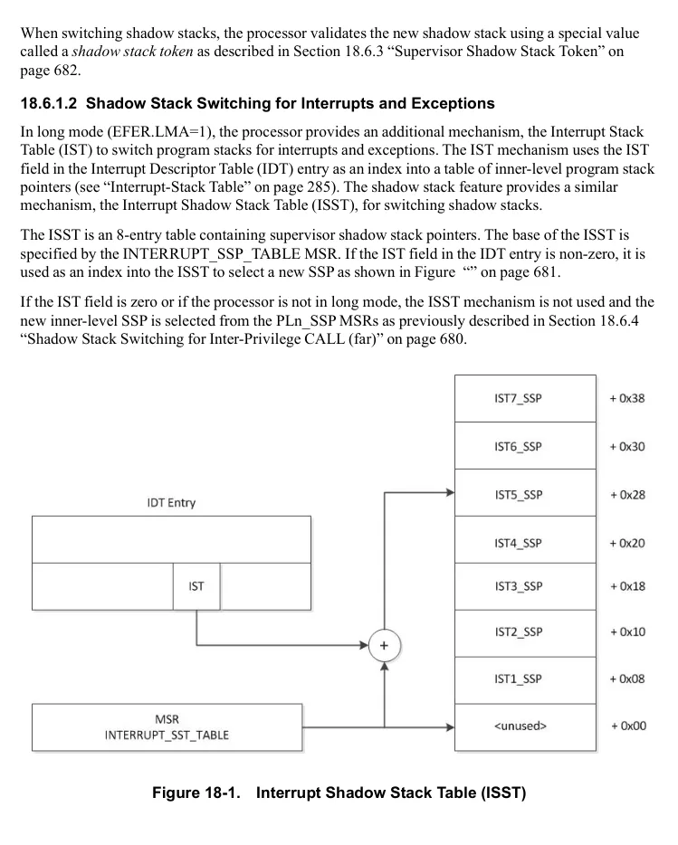
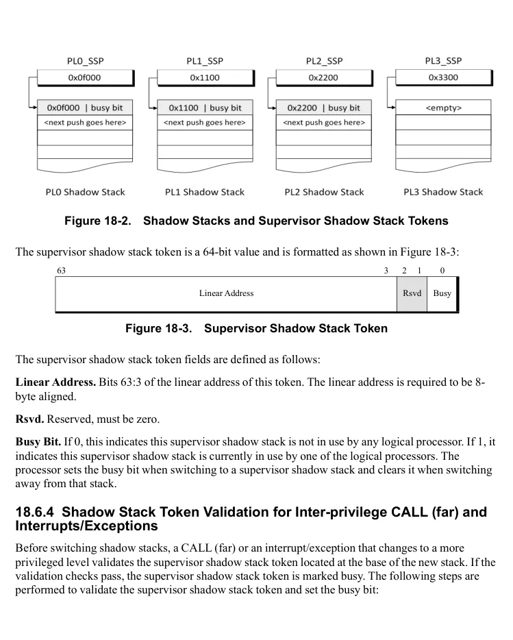
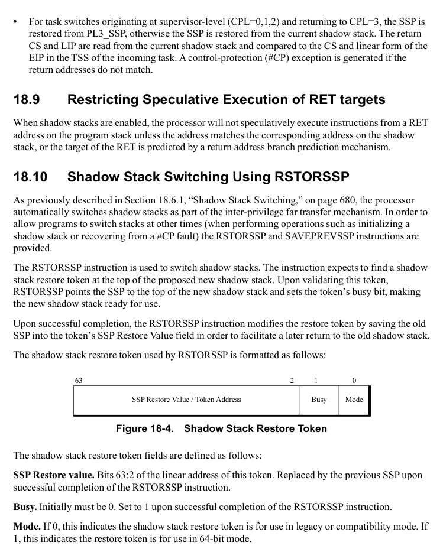
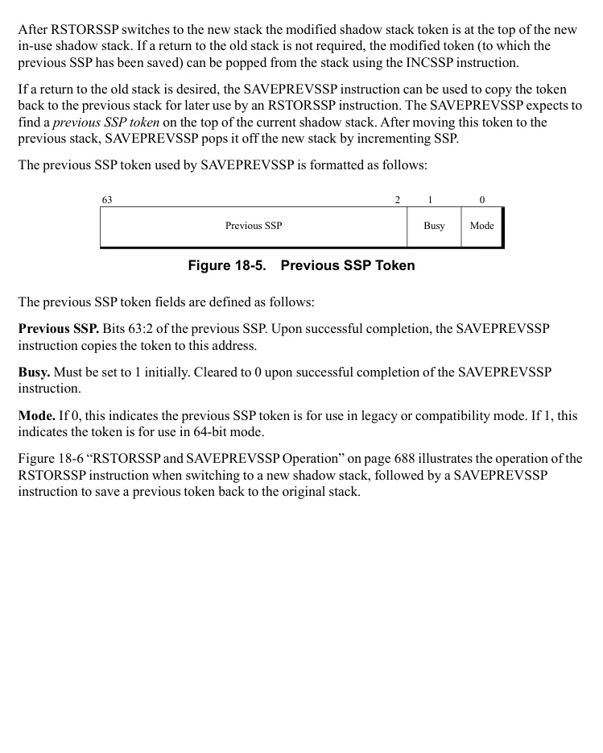
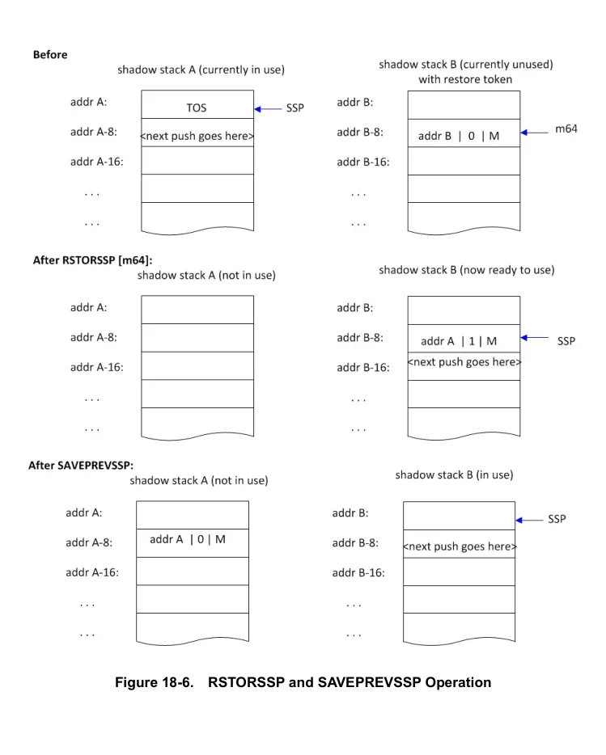
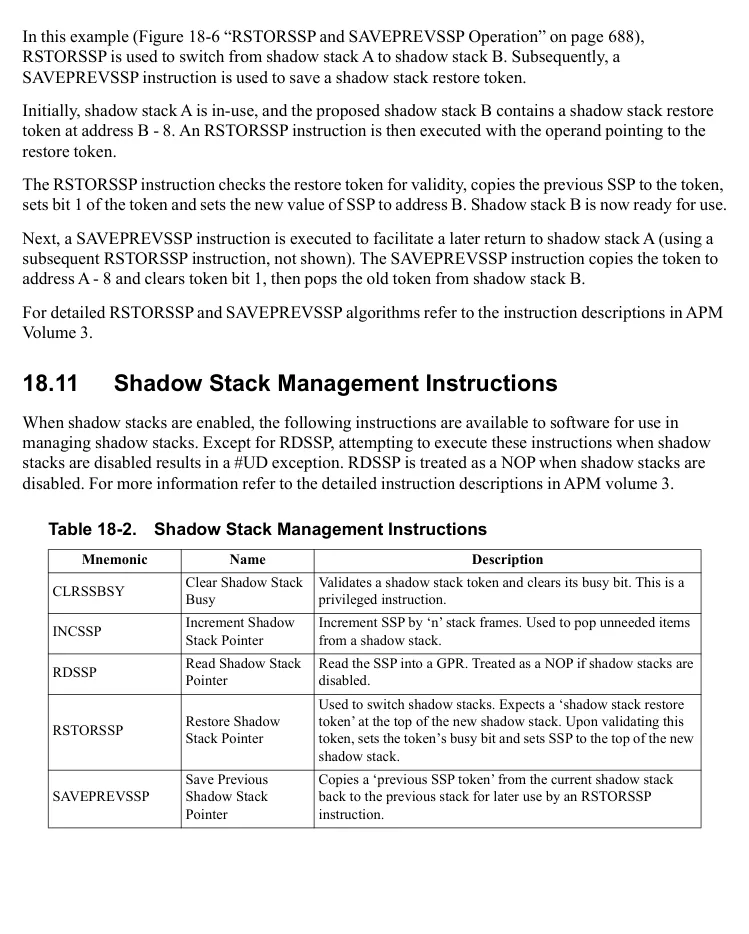
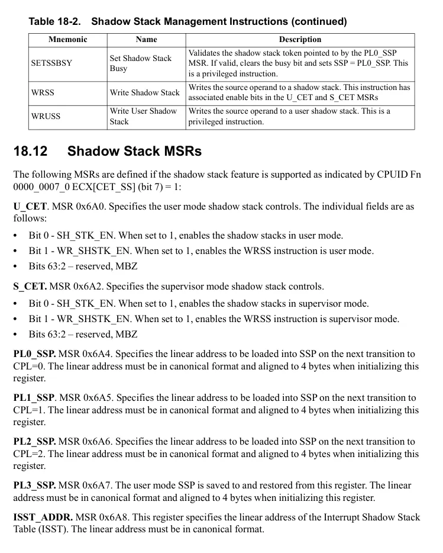

<!-- PDF source page: 740 | printed page: 678 -->

<a id="18-shadow-stacks"></a>

# 18 Shadow Stacks

The shadow stack mechanism facilitates protection against a common form of computer exploit known as Return Oriented Programming (ROP). ROP exploits utilize intentionally corrupted stack frames to divert normal processor control flow into short fragments of existing executable code, which ultimately end with a RET instruction. These fragments are then chained together using return addresses previously written to the stack by the attacker.

The shadow stack mechanism protects against ROP exploits by ensuring that return addresses read from the stack by RET and IRET instructions originated from a CALL instruction or similar control transfer.

In the following sections, the term ‘program stack’ is used to distinguish the stack pointed to by the SP register and manipulated by instructions (such as PUSH, POP, ENTER, LEAVE) from the shadow stack.

<a id="18-1-shadow-stack-overview"></a>

## 18.1 Shadow Stack Overview

A shadow stack is a separate, protected stack that is conceptually parallel to the program stack and used only by control-transfer and return instructions. When shadow stacks are enabled, most control transfers that save a return address (such as CALL, INTn, exceptions and interrupts) write the return address to the shadow stack in addition to the program stack. Upon the subsequent RET or IRET operation, the processor reads the return address from both stacks and checks that they match. A control-protection exception (#CP) is raised if the return addresses do not match.

The shadow stack is implemented in regions of memory marked with the “shadow stack” attribute in the page tables (see “Page-Protection Checks” on page 161). Pages with the shadow stack attribute are writeable only by control transfer operations that save a return address and by the shadow stack management instructions. Shadow stack pages are not writeable by ordinary data-access instructions and thus protected from tampering.

<a id="18-1-1-detecting-and-enabling-shadow-stack-support"></a>

### 18.1.1 Detecting and Enabling Shadow Stack Support

Support for the shadow stack feature is indicated by CPUID Fn0000_0007_ECX_x0[CET_SS](bit 7)=1. This bit also indicates the shadow stack MSRs are present.

The shadow stack feature is enabled by setting CR4.CET (bit 23) = 1 (see “CR4 Register” on page 46). The shadow stack feature is operational when in protected mode (CR0.PE=1) with paging enabled (CR0.PG=1). Shadow stacks are disabled in virtual x86 mode (rFLAGS.VM=1).

Once the feature is enabled, shadow stack operation can be separately enabled in user mode and in supervisor mode using control bits in the S_CET and U_CET MSRs (see “Shadow Stack MSRs” on page 690).


<!-- PDF source page: 741 | printed page: 679 -->

<a id="18-2-the-shadow-stack-pointer"></a>

## 18.2 The Shadow Stack Pointer

On processors implementing the shadow stack feature, the Shadow Stack Pointer (SSP) register contains the address of the current top of the shadow stack. The width of the shadow stack is 64 bits in 64-bit mode and 32 bits in legacy and compatibility modes. The address size of SSP is 64 bits in 64-bit mode and 32 bits in legacy and compatibility modes.

The SSP register cannot be encoded as a source or destination register by regular instructions and thus is not directly accessible to software as a general operand, nor as an address operand. The SSP register is directly accessible only by using the shadow stack management instructions (see “Shadow Stack Management Instructions” on page 689).

<a id="18-3-shadow-stack-operation-for-call-near-and-ret-near"></a>

## 18.3 Shadow Stack Operation for CALL (near) and RET (near)

When shadow stacks are enabled, the CALL (near) instruction pushes the return address onto the shadow stack, in addition to pushing it onto the program stack. On the subsequent near RET/RETn instruction, the return addresses are read from both stacks and compared. If the return addresses do not match, a control-protection (#CP) exception is generated.

A CALL (near) with a displacement of 0 (CALL +0) does not push the return address onto the shadow stack since the “CALL +0” idiom does not actually branch to another code sequence, and is typically not followed by a return instruction.

One form of the return instruction, RETn, pops ‘n’ additional parameters from the program stack before returning to the caller. Since the shadow stack does not store any data items, RETn does not pop additional parameters from the shadow stack.

<a id="18-4-shadow-stack-operation-for-far-transfers"></a>

## 18.4 Shadow Stack Operation for Far Transfers

The term ‘far transfer’ in the following discussion encompasses the following types of control transfers:

- Explicit CALL (far) to a procedure in another code segment
- Exceptions and interrupts that transfer to a handler in another code segment
- RET (far) and IRET instructions

A far transfer may also change the CPL. The exact operation of the shadow stack depends on the type of far transfer involved, the associated CPL change (if any) and whether the shadow stack capability is enabled for the target CPL. Shadow stack operations for far transfers are described in the following sections and summarized in Table 18-1. (See AMD Architecture Programmers Manual Volume 3 for detailed instruction algorithms for CALL (far), RET (far), IRET and INTn.)


<!-- PDF source page: 742 | printed page: 680 -->

**Table 18-1. Shadow Stack Operations for Far Transfers**

| CALLF/int/excp<br>From CPL To CPL / 0,1,2,3 | CALLF/int/excp<br>From CPL To CPL / Same | Stack<br>switch? / No | New SSP loaded<br>from: (where<br>n=new CPL) / Uses current SSP | CS, LIP saved to<br>and restored from: / Current Shadow<br>Stack | SSP saved to and<br>restored from: / Current Shadow<br>Stack | RETF/IRET<br>checks returns<br>address? / Yes |
| --- | --- | --- | --- | --- | --- | --- |
| 3 | 0,1,2 | Yes | PLn SSP | not saved/restored | PL3 SSP | No |
| 2 | 0,1 | Yes | PLn SSP | New shadow stack | New shadow stack | Yes |
| 1 | 0 | Yes | PLn SSP | New shadow stack | New shadow stack | Yes |

<a id="18-5-far-transfer-to-the-same-privilege-level"></a>

## 18.5 Far Transfer to the Same Privilege Level

When shadow stacks are enabled, a far transfer to the same privilege level pushes the CS and LIP (linear address of the return IP) onto the current shadow stack in addition to pushing the return IP onto the program stack. Upon the subsequent RET (far) or IRET operation, the return addresses are popped from both stacks and the linear forms of the two addresses are compared. If the return addresses do not match, a control-protection (#CP) exception is generated.

<a id="18-6-far-transfer-to-different-privilege-level"></a>

## 18.6 Far Transfer to Different Privilege Level

In addition to changing code segments, far transfers can also be used to change to a different privilege level (CPL). When changing the CPL, inter-privilege far transfers switch to a new program stack. In a similar manner, inter-privilege far transfers also switch to a new shadow stack, providing that shadow stacks are enabled for the new privilege level.

<a id="18-6-1-shadow-stack-switching"></a>

### 18.6.1 Shadow Stack Switching

When an inter-privilege far transfer switches to a new program stack, the new program stack pointer is selected from the either the inner-level stack pointers in the TSS or the Interrupt Stack Table (IST), depending on the type of far transfer. (See “Interrupt To Higher Privilege” on page 273). Similarly, when shadow stacks are enabled, inter-privilege far transfers also switch to a new shadow stack. The new shadow stack pointer is selected from shadow stack pointer MSRs (PLn_SSP) or the Interrupt Shadow Stack Table (ISST) as described in the following sections.

1. 18. 6.1.1 Shadow Stack Switching for Inter-Privilege CALL (far)**

When a CALL (far) changes privilege level, a shadow stack switch occurs to an inner-level shadow stack. The new SSP is loaded from one of the following MSRs:

- PL2_SSP for transitions to CPL 2.
- PL1_SSP for transitions to CPL 1.
- PL0_SSP for transitions to CPL 0.

<details>
<summary>Rendered source page 742 (figures/tables)</summary>



</details>


<!-- PDF source page: 743 | printed page: 681 -->

When switching shadow stacks, the processor validates the new shadow stack using a special value called a *shadow stack token* as described in Section 18.6.3 “Supervisor Shadow Stack Token” on page 682.

1. 18. 6.1.2 Shadow Stack Switching for Interrupts and Exceptions**

In long mode (EFER.LMA=1), the processor provides an additional mechanism, the Interrupt Stack Table (IST) to switch program stacks for interrupts and exceptions. The IST mechanism uses the IST field in the Interrupt Descriptor Table (IDT) entry as an index into a table of inner-level program stack pointers (see “Interrupt-Stack Table” on page 285). The shadow stack feature provides a similar mechanism, the Interrupt Shadow Stack Table (ISST), for switching shadow stacks.

The ISST is an 8-entry table containing supervisor shadow stack pointers. The base of the ISST is specified by the INTERRUPT_SSP_TABLE MSR. If the IST field in the IDT entry is non-zero, it is used as an index into the ISST to select a new SSP as shown in Figure “” on page 681.

If the IST field is zero or if the processor is not in long mode, the ISST mechanism is not used and the new inner-level SSP is selected from the PLn_SSP MSRs as previously described in Section 18.6.4 “Shadow Stack Switching for Inter-Privilege CALL (far)” on page 680.

**Figure 18-1. Interrupt Shadow Stack Table (ISST)**

<details>
<summary>Rendered source page 743 (figures/tables)</summary>



</details>


<!-- PDF source page: 744 | printed page: 682 -->

<a id="18-6-2-handling-cs-lip-and-ssp-on-privilege-transistions"></a>

### 18.6.2 Handling CS, LIP and SSP on Privilege Transistions

When changing to a new code segment, the shadow stack behavior for saving and restoring CS, LIP and SSP depends on the CPL of the originating far transfer.

**Transitions from CPL=3**

Inter-privilege far transfers originating at CPL=3 save the current user-level SSP to PL3_SSP rather than to the supervisor shadow stack. Upon the subsequent RETF/IRET back to CPL=3, the user-level SSP is restored from PL3_SSP and the return CS and LIP are not verified.

**Transitions from CPL=1 and CPL=2**

Far transfers originating at CPL=1 or CPL=2 to an inner (more privileged) level save the current CS, LIP and SSP to the inner level shadow stack after switching shadow stacks as described in section Section 18.6.1, “Shadow Stack Switching,” on page 680. Upon the subsequent RET(far)/IRET, the SSP is restored (Section 18.6.1, “Shadow Stack Switching,” on page 680) from the inner-level shadow stack and the CS and LIP popped from the shadow stack are verified against the values read from the program stack. If the return addresses do not match, a control-protection (#CP) exception is generated.

<a id="18-6-3-supervisor-shadow-stack-token"></a>

### 18.6.3 Supervisor Shadow Stack Token

When switching shadow stacks, the processor validates the new shadow stack by checking a *supervisor shadow stack token* located at the base of the stack.

When initially creating a shadow stack for use at privilege levels 0, 1 and 2, system software must place a supervisor shadow stack token at the base of each stack. System software must also store a pointer to each shadow stack in the appropriate shadow stack base register, PLn_SSP (n=0,1,2,3) using the WRMSR instruction.

The relationship of the shadow stacks, supervisor shadow stack tokens, and the PLn_SSP registers are shown in Figure 18.6.3 “Shadow Stacks and Supervisor Shadow Stack Tokens” on page 683. The three supervisor shadow stacks (PL0, PL1 and PL2) have shadow stack tokens stored at the base of the stack. Tokens are not used for PL3 shadow stacks.


<!-- PDF source page: 745 | printed page: 683 -->

**Figure 18-2. Shadow Stacks and Supervisor Shadow Stack Tokens**

The supervisor shadow stack token is a 64-bit value and is formatted as shown in Figure 18-3:

**Figure 18-3. Supervisor Shadow Stack Token**

<details>
<summary>Extracted figure labels</summary>

```text
63
3
2
1
0
Linear Address
Rsvd
Busy
```

</details>

The supervisor shadow stack token fields are defined as follows:

**Linear Address.** Bits 63:3 of the linear address of this token. The linear address is required to be 8-byte aligned.

**Rsvd.** Reserved, must be zero.

**Busy Bit.** If 0, this indicates this supervisor shadow stack is not in use by any logical processor. If 1, it indicates this supervisor shadow stack is currently in use by one of the logical processors. The processor sets the busy bit when switching to a supervisor shadow stack and clears it when switching away from that stack.

<a id="18-6-4-shadow-stack-token-validation-for-inter-privilege-call-far-and-interrupts-exceptions"></a>

### 18.6.4 Shadow Stack Token Validation for Inter-privilege CALL (far) and Interrupts/Exceptions

Before switching shadow stacks, a CALL (far) or an interrupt/exception that changes to a more privileged level validates the supervisor shadow stack token located at the base of the new stack. If the validation checks pass, the supervisor shadow stack token is marked busy. The following steps are performed to validate the supervisor shadow stack token and set the busy bit:

<details>
<summary>Rendered source page 745 (figures/tables)</summary>



</details>


<!-- PDF source page: 746 | printed page: 684 -->

1. 1. Check that the incoming SSP is 8-byte aligned, otherwise a #GP exception is generated. The incoming SSP is located in PLn_SSP (where ‘n’ is the new privilege level: 0, 1, 2), or the ISST for interrupts/exceptions (see Section 18.6.1, “Shadow Stack Switching,” on page 680).

&lt;Steps 2-6 are performed atomically.&gt;

1. 2. Fetch the 8-byte shadow stack token using the address specified by the incoming SSP (using a locked load with shadow stack access rights).

1. 3. Check that the shadow stack token reserved bits and the busy bit are 0.

1. 4. Check that the address specified in the shadow stack token matches the incoming SSP.

1. 5. If checks 3 and 4 pass, set the supervisor shadow stack token busy bit (using a store, unlock).

1. 6. If checks 3 or 4 fail, the shadow stack token is not modified and a #GP exception is generated.

<a id="18-6-5-shadow-stack-token-validation-for-inter-privilege-ret-and-iret"></a>

### 18.6.5 Shadow Stack Token Validation for Inter-privilege RET and IRET

RET (far) and IRET to lower privilege levels validate the shadow stack token located on the current supervisor shadow stack before switching shadow stacks. If the token is valid, the token’s busy bit is cleared. The processor performs the following steps to validate the token:

1. 1. Check that the return SSP (located on the current shadow stack) is 4-byte aligned, else a #CP exception is generated.

&lt;Steps 2-7 are performed atomically.&gt;

1. 2. Fetch the 8-byte shadow stack token from the current shadow stack at SSP+24 (using a locked load with shadow stack access rights).

1. 3. Check that the busy bit is 1.

1. 4. Check that the reserved bits are 0.

1. 5. Check that the address specified in the shadow stack token matches the SSP.

1. 6. If checks 3 through 5 pass, the shadow stack token busy bit is cleared.

1. 7. If any of checks 3 through 5 fail, the shadow stack token is not modified. A fault is not generated.

<a id="18-7-shadow-stack-operation-for-syscall-and-sysret"></a>

## 18.7 Shadow Stack Operation for SYSCALL and SYSRET

SYSCALL and SYSRET are low-latency system call and return instructions designed for use by system and application software implementing a flat-memory model. These instructions do not use the program stack to store return addresses, and therefore do not use the shadow stack to validate return addresses. However, SYSCALL and SYSRET modify SSP as described below. The Shadow stack operations described for SYSCALL and SYSRET also apply to SYSENTER and SYSEXIT respectively, although the latter are available only in legacy mode.

The SYSCALL instruction is used by application software executing at CPL=3. When shadow stacks are enabled at CPL=3, SYSCALL saves the current SSP to PL3_SSP. SYSCALL changes to CPL=0


<!-- PDF source page: 747 | printed page: 685 -->

before entering the operating system and if shadow stacks are enabled at CPL=0, then SSP is cleared to 0.

Unlike other inter-privilege far transfers, SYSCALL does not automatically perform a switch to a supervisor shadow stack. If shadow stacks are enabled at CPL=0, prior to executing a CALL instruction or similar transfer of control that pushes a return address to the shadow stack, software at the OS entry point must ensure that a supervisor shadow stack is available for use. System software can use SETSSBSY to set up a supervisor shadow stack.

The operating system uses the SYSRET instruction to return to the application running at CPL=3. If shadow stacks are enabled at CPL=3, SYSRET restores SSP from PL3_SSP. Prior to using SYSRET to return to the application, system software can use the CLRSSBSY to tear down the supervisor shadow stack. Because CLRSSYBSY clears the SSP to 0, system software must ensure that any subsequent interrupt or exception that may occur in CPL=0 prior to the SYSRET is configured to use the ISST stack-switching mechanism. Otherwise taking an interrupt or exception with SSP=0 will likely result in a fault due to SSP wrap-around.

<a id="18-8-shadow-stack-operation-for-task-switches"></a>

## 18.8 Shadow Stack Operation for Task Switches

The legacy x86 task-switch mechanism transfers program control to a new task when any of the following control transfers occur:

- A CALL or JMP instruction references a task gate or TSS descriptor.
- A software-interrupt instruction (INTn), exception or external interrupt references a task gate.
- An IRET is executed when the EFLAGS.NT bit is set to 1.

Shadow stack operations for legacy x86 task switches are summarized in this section. Because the x86 task management feature is supported by the AMD64 architecture only in legacy mode (EFER.LMA=0), the shadow stack operations described below only apply to legacy mode. (See “Switching Tasks” on page 380 for more information on task switching).

When switching to a new task with shadow stacks enabled, the new task must use a 32-bit TSS. The SSP for the new task is located at TSS offset 104. Since the SSP is 4 bytes in legacy mode, the TSS must be at least 108 bytes in size. The SSP must be aligned to an 8-byte boundary and point to a supervisor shadow stack token.

If the task switch is initiated by a CALL/JMP/INTn instruction, or an interrupt or exception:

- For task switches originating at CPL=3, and if shadow stacks are enabled at that CPL, the current SSP is saved to PL3_SSP. Otherwise, for task switches originating at supervisor-level (CPL=0,1,2) the current SSP is saved onto the new shadow stack along with current CS and LIP. If shadow stacks are enabled at the CPL of the new task, the busy bit is set in the supervisor shadow stack token pointed to by the SSP of the incoming task.

If the task switch is initiated by an IRET instruction:


<!-- PDF source page: 748 | printed page: 686 -->

- For task switches originating at supervisor-level (CPL=0,1,2) and returning to CPL=3, the SSP is restored from PL3_SSP, otherwise the SSP is restored from the current shadow stack. The return CS and LIP are read from the current shadow stack and compared to the CS and linear form of the EIP in the TSS of the incoming task. A control-protection (#CP) exception is generated if the return addresses do not match.

<a id="18-9-restricting-speculative-execution-of-ret-targets"></a>

## 18.9 Restricting Speculative Execution of RET targets

When shadow stacks are enabled, the processor will not speculatively execute instructions from a RET address on the program stack unless the address matches the corresponding address on the shadow stack, or the target of the RET is predicted by a return address branch prediction mechanism.

<a id="18-10-shadow-stack-switching-using-rstorssp"></a>

## 18.10 Shadow Stack Switching Using RSTORSSP

As previously described in Section 18.6.1, “Shadow Stack Switching,” on page 680, the processor automatically switches shadow stacks as part of the inter-privilege far transfer mechanism. In order to allow programs to switch stacks at other times (when performing operations such as initializing a shadow stack or recovering from a #CP fault) the RSTORSSP and SAVEPREVSSP instructions are provided.

The RSTORSSP instruction is used to switch shadow stacks. The instruction expects to find a shadow stack restore token at the top of the proposed new shadow stack. Upon validating this token, RSTORSSP points the SSP to the top of the new shadow stack and sets the token’s busy bit, making the new shadow stack ready for use.

Upon successful completion, the RSTORSSP instruction modifies the restore token by saving the old SSP into the token’s SSP Restore Value field in order to facilitate a later return to the old shadow stack.

The shadow stack restore token used by RSTORSSP is formatted as follows:

**Figure 18-4. Shadow Stack Restore Token**

<details>
<summary>Extracted figure labels</summary>

```text
63
2
1
0
SSP Restore Value / Token Address
Busy
Mode
```

</details>

The shadow stack restore token fields are defined as follows:

**SSP Restore value.** Bits 63:2 of the linear address of this token. Replaced by the previous SSP upon successful completion of the RSTORSSP instruction.

**Busy.** Initially must be 0. Set to 1 upon successful completion of the RSTORSSP instruction.

**Mode.** If 0, this indicates the shadow stack restore token is for use in legacy or compatibility mode. If 1, this indicates the restore token is for use in 64-bit mode.

<details>
<summary>Rendered source page 748 (figures/tables)</summary>



</details>


<!-- PDF source page: 749 | printed page: 687 -->

After RSTORSSP switches to the new stack the modified shadow stack token is at the top of the new in-use shadow stack. If a return to the old stack is not required, the modified token (to which the previous SSP has been saved) can be popped from the stack using the INCSSP instruction.

If a return to the old stack is desired, the SAVEPREVSSP instruction can be used to copy the token back to the previous stack for later use by an RSTORSSP instruction. The SAVEPREVSSP expects to find a *previous SSP token* on the top of the current shadow stack. After moving this token to the previous stack, SAVEPREVSSP pops it off the new stack by incrementing SSP.

The previous SSP token used by SAVEPREVSSP is formatted as follows:

**Figure 18-5. Previous SSP Token**

<details>
<summary>Extracted figure labels</summary>

```text
63
2
1
0
Previous SSP
Busy
Mode
```

</details>

The previous SSP token fields are defined as follows:

**Previous SSP.** Bits 63:2 of the previous SSP. Upon successful completion, the SAVEPREVSSP instruction copies the token to this address.

**Busy.** Must be set to 1 initially. Cleared to 0 upon successful completion of the SAVEPREVSSP instruction.

**Mode.** If 0, this indicates the previous SSP token is for use in legacy or compatibility mode. If 1, this indicates the token is for use in 64-bit mode.

Figure 18-6 “RSTORSSP and SAVEPREVSSP Operation” on page 688 illustrates the operation of the RSTORSSP instruction when switching to a new shadow stack, followed by a SAVEPREVSSP instruction to save a previous token back to the original stack.

<details>
<summary>Rendered source page 749 (figures/tables)</summary>



</details>


<!-- PDF source page: 750 | printed page: 688 -->

**Figure 18-6. RSTORSSP and SAVEPREVSSP Operation**

<details>
<summary>Rendered source page 750 (figures/tables)</summary>



</details>


<!-- PDF source page: 751 | printed page: 689 -->

In this example (Figure 18-6 “RSTORSSP and SAVEPREVSSP Operation” on page 688), RSTORSSP is used to switch from shadow stack A to shadow stack B. Subsequently, a SAVEPREVSSP instruction is used to save a shadow stack restore token.

Initially, shadow stack A is in-use, and the proposed shadow stack B contains a shadow stack restore token at address B - 8. An RSTORSSP instruction is then executed with the operand pointing to the restore token.

The RSTORSSP instruction checks the restore token for validity, copies the previous SSP to the token, sets bit 1 of the token and sets the new value of SSP to address B. Shadow stack B is now ready for use.

Next, a SAVEPREVSSP instruction is executed to facilitate a later return to shadow stack A (using a subsequent RSTORSSP instruction, not shown). The SAVEPREVSSP instruction copies the token to address A - 8 and clears token bit 1, then pops the old token from shadow stack B.

For detailed RSTORSSP and SAVEPREVSSP algorithms refer to the instruction descriptions in APM Volume 3.

<a id="18-11-shadow-stack-management-instructions"></a>

## 18.11 Shadow Stack Management Instructions

When shadow stacks are enabled, the following instructions are available to software for use in managing shadow stacks. Except for RDSSP, attempting to execute these instructions when shadow stacks are disabled results in a #UD exception. RDSSP is treated as a NOP when shadow stacks are disabled. For more information refer to the detailed instruction descriptions in APM volume 3.

**Table 18-2. Shadow Stack Management Instructions**

| Mnemonic | Name | Description |
| --- | --- | --- |
| CLRSSBSY | Clear Shadow Stack<br>Busy | Validates a shadow stack token and clears its busy bit. This is a<br>privileged instruction. |
| INCSSP | Increment Shadow<br>Stack Pointe | Increment SSP by ‘n’ stack frames. Used to pop unneeded items<br>from a shadow stack. |
| RDSSP | Read Shadow Stack<br>Pointe | Read the SSP into a GPR. Treated as a NOP if shadow stacks are<br>disabled. |
| RSTORSSP | Restore Shadow<br>Stack Pointe | Used to switch shadow stacks. Expects a ‘shadow stack restore<br>token’ at the top of the new shadow stack. Upon validating this<br>token, sets the token’s busy bit and sets SSP to the top of the new<br>shadow stack. |
| SAVEPREVSSP | Save Previous<br>Shadow Stack<br>Pointe | Copies a ‘previous SSP token’ from the current shadow stack<br>back to the previous stack for later use by an RSTORSSP<br>instruction. |

<details>
<summary>Rendered source page 751 (figures/tables)</summary>



</details>


<!-- PDF source page: 752 | printed page: 690 -->

**Table 18-2. Shadow Stack Management Instructions (continued)**

| Mnemonic | Name | Description |
| --- | --- | --- |
| SETSSBSY | Set Shadow Stack<br>Busy | Validates the shadow stack token pointed to by the PL0 SSP<br>MSR. If valid, clears the busy bit and sets SSP = PL0 SSP. This<br>is a privileged instruction. |
| WRSS | Write Shadow Stack | Writes the source operand to a shadow stack. This instruction has<br>associated enable bits in the U CET and S CET MSRs<br>_ _ |
| WRUSS | Write User Shadow<br>Stack | Writes the source operand to a user shadow stack. This is a<br>privileged instruction. |

<a id="18-12-shadow-stack-msrs"></a>

## 18.12 Shadow Stack MSRs

The following MSRs are defined if the shadow stack feature is supported as indicated by CPUID Fn 0000_0007_0 ECX[CET_SS] (bit 7) = 1:

**U_CET**. MSR 0x6A0. Specifies the user mode shadow stack controls. The individual fields are as follows:

- Bit 0 - SH_STK_EN. When set to 1, enables the shadow stacks in user mode.
- Bit 1 - WR_SHSTK_EN. When set to 1, enables the WRSS instruction is user mode.
- Bits 63:2 – reserved, MBZ

**S_CET.** MSR 0x6A2. Specifies the supervisor mode shadow stack controls.

- Bit 0 - SH_STK_EN. When set to 1, enables the shadow stacks in supervisor mode.
- Bit 1 - WR_SHSTK_EN. When set to 1, enables the WRSS instruction is supervisor mode.
- Bits 63:2 – reserved, MBZ

**PL0_SSP.** MSR 0x6A4. Specifies the linear address to be loaded into SSP on the next transition to CPL=0. The linear address must be in canonical format and aligned to 4 bytes when initializing this register.

**PL1_SSP**. MSR 0x6A5. Specifies the linear address to be loaded into SSP on the next transition to CPL=1. The linear address must be in canonical format and aligned to 4 bytes when initializing this register.

**PL2_SSP.** MSR 0x6A6. Specifies the linear address to be loaded into SSP on the next transition to CPL=2. The linear address must be in canonical format and aligned to 4 bytes when initializing this register.

**PL3_SSP.** MSR 0x6A7. The user mode SSP is saved to and restored from this register. The linear address must be in canonical format and aligned to 4 bytes when initializing this register.

**ISST_ADDR.** MSR 0x6A8. This register specifies the linear address of the Interrupt Shadow Stack Table (ISST). The linear address must be in canonical format.

<details>
<summary>Rendered source page 752 (figures/tables)</summary>



</details>


<!-- PDF source page: 753 | printed page: 691 -->

<a id="18-13-xsave-xrstor"></a>

## 18.13 XSAVE/XRSTOR

The XSAVE/XRSTOR instructions can be used to manage the shadow stack registers as processor extended state components 11 (CET_U state) and 12 (CET_S state) as described below:

- **CET_U state.** The shadow stack user controls are identified as state component 11 in XSS MSR and consist of the two 64-bit MSRs U_CET and PL3_SSP. Bytes 7:0 in the XSAVE area are used for U_CET and bytes 15:8 are used for PL3_SSP. The XSAVE area size and offset for the CET_U state are available using CPUID Fn0000_000D_ECX_x0B (ECX=11).
- **CET_S state.** The shadow stack supervisor controls are identified as state component 12 in XSS MSR and consist of the three 64-bit MSRs PL0_SSP, PL1_SSP and PL2_SSP. Bytes 7:0 in the XSAVE area are used for PL0_SSP, bytes 15:8 are used for PL2_SSP and bytes 23:16 are used for PL3_SSP. The XSAVE area size and offset for the CET_S state are available using CPUID Fn0000_000D_ECX_x0C (ECX=12).

When restoring CET_U and CET_S state, XRSTOR checks for reserved bits and canonicality as described in Section 18.11 “Shadow Stack Management Instructions” on page 689.
