<!-- PDF source page: 754 | printed page: 692 -->

<a id="19-platform-quality-of-service-pqos-extension"></a>

# 19 Platform Quality of Service (PQOS) Extension

The AMD PQOS Extension provides system software (operating system, hypervisor, or similar software) with mechanisms to monitor usage of shared platform resources such as L3 cache by a logical processor, thread, application, or guest OS. The PQOS extension also provides system software with the ability to set and enforce limits on usage of certain shared platform resources.

In shared environments, such as those found in cloud computing installations, multiple threads, or applications contending for a shared resource can cause significant impact to collocated workloads. For example, contention for a resource such as the last-level cache may cause violation of service-level objectives. Contention for shared resources may also cause latency spikes that violate runtime objectives of latency-sensitive tasks. The PQOS extension can be used to minimize the effects of contention for shared resources from co-located workloads.

<a id="19-1-pqos-extension-overview"></a>

## 19.1 PQOS Extension Overview

The PQOS extension provides for the *monitoring* of the usage of certain shared resources and, separately, for the *enforcement* of limits on the use of shared resources.

The monitoring and enforcement functions of PQOS are not necessarily applied across the entire system, but in general apply to a QOS Domain, which corresponds to a level in the processor hardware hierarchy containing a shared resource. In some implementations, the QOS Domain is a Core-Complex and the shared resource whose usage is monitored or regulated by PQOS is the last-level cache.

Platform QOS features are implemented on a logical processor basis. Therefore, multiple threads (logical processors) in a single CPU core have independent PQOS resource monitoring and enforcement configurations.

The set of resources that may be monitored, and the set for which limits can be enforced, are implementation-dependent and enumerated by a CPUID function on a feature and sub-feature basis, as described in the following sections.

The PQOS extension consists of two separate but related features—PQOS Monitoring (PQM) and PQOS Enforcement (PQE)*.*

The PQM feature provides mechanisms for monitoring the usage of shared resources. The set of resources that can be monitored and the specific usage metrics that may be tracked for those resources are implementation-dependent and enumerated by CPUID (see Section 19.2.1).


<!-- PDF source page: 755 | printed page: 693 -->

PQM can be used to monitor usage of the following resources:

- L3 cache occupancy (see Section 19.3.2)
- L3 cache bandwidth (see Section 19.3.3)

The ability to set and enforce limits on usage of shared resources is provided by the PQE feature. The set of resources for which limits can be enforced is implementation-dependent and enumerated by CPUID (see Section 19.4.1). PQE can be used to enforce limits on the usage of the following resources:

- L3 cache allocation (see Section 19.4.2 and Section 19.4.3)
- L3 cache bandwidth (see Section 19.4.4, Section 19.4.5, Section 19.4.6, and Section 19.4.7)

<a id="19-1-1-detecting-support-for-pqos"></a>

### 19.1.1 Detecting Support for PQOS

Overall support for the PQOS extension is indicated by CPUID Fn0000_0007_EBX[PQE, PQM] as described in Table 19-1.

**Table 19-1. CPUID Fn000_0007_EBX_x0 Extended Feature Identifiers**

| EBX Bit | Name | Description |
| --- | --- | --- |
| 12 | PQM | PQOS Monitoring Feature |
| 15 | PQE | PQOS Enforcement Feature |

- PQM, EBX bit 12. This bit also indicates the PQM-related MSRs are present. (See “PQM MSRs” on page 696).
- PQE, EBX bit 15. This bit also indicates that certain PQE-related MSRs are present. (See “PQOS Enforcement (PQE)” on page 708).

1. 19. 1.1.1 PQOS Versions**

Identifying the attributes and capabilities of the PQOS extension is generally performed using CPUID functions. However, some early implementations also use a *PQOS version* number in addition to CPUID. Table 19-2 identifies the PQOS Version associated with a product of a specific Family/Model.

**Table 19-2. PQOS Versions**

| Family | Model | Version |
| --- | --- | --- |
| 17h | 30h–90h | V1.0 |
| 19h | 00h–0Fh | V2.0 |
| 19h | 20h–5Fh | V2.0 |
| All others | 20h–5Fh | In later implementations, only CPUID is needed to<br>identify PQOS capabilities and PQOS Version is not<br>used. |

<details>
<summary>Rendered source page 755 (figures/tables)</summary>

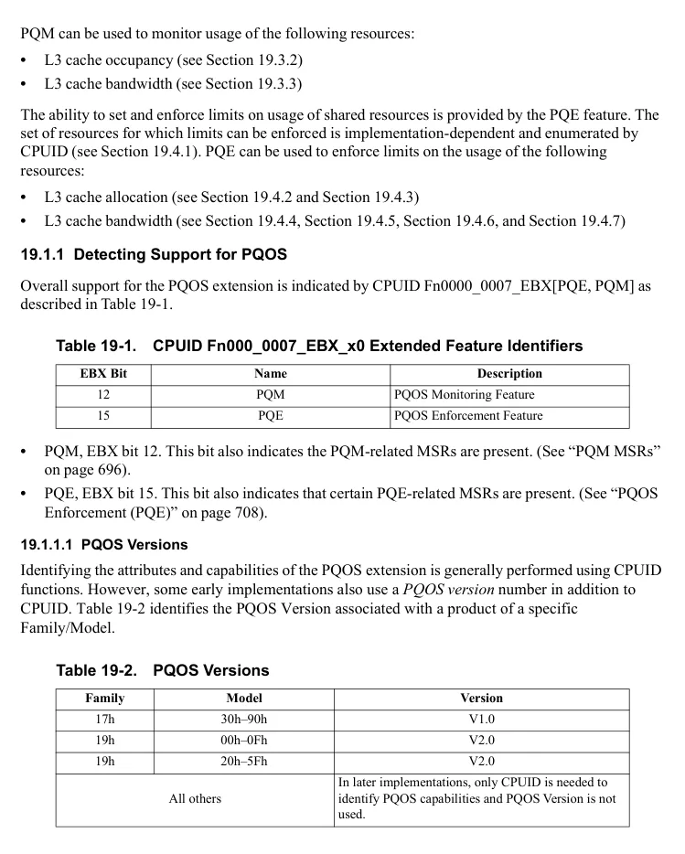

</details>


<!-- PDF source page: 756 | printed page: 694 -->

<a id="19-1-2-identifying-pqm-and-pqe-capabilities"></a>

### 19.1.2 Identifying PQM and PQE Capabilities

The PQM and PQE features operate on specific shared platform resources, such as the L3 cache. The set of shared resources supported by PQM and PQE are implementation-dependent and identified by CPUID functions Fn0000_000F and Fn0000_0010 respectively. Each of these CPUID functions provide a base leaf (ECX=0) which identifies the shared resource types supported by PQM and PQE and one or more sub-leaves (ECX=1,2,3…) that report additional attributes and capabilities for each shared resource as described in Section 19.2.1 and Section 19.4.1. A complete description of these CPUID functions can be found in Appendix E of APM volume 3.

<a id="19-2-pqos-monitoring-pqm-overview"></a>

## 19.2 PQOS Monitoring (PQM) Overview

The ability to monitor resource usage of shared resources is provided by the PQM feature. Monitoring is accomplished by assigning a software-defined Resource Management Identifier (RMID) to a logical processor and at some later time reading the usage metrics of a particular monitored resource by that RMID.

<a id="19-2-1-detecting-pqm-monitoring-resources-and-capabilities"></a>

### 19.2.1 Detecting PQM Monitoring Resources and Capabilities

Once overall support for PQM has been established, support for specific PQM sub-features may be determined using CPUID functions Fn00000_000F and Fn8000_0020.

The PQM feature operates on specific shared platform resources, such as the L3 cache. The set of shared resources supported by PQM is implementation dependent and identified by CPUID functions Fn0000_000F. The base leaf (ECX=0) identifies the overall resource types supported by PQM. Each supported resource is identified by a bit in EDX as shown in Table 19-3. This CPUID leaf also reports the largest RMID supported for any resource monitored by PQM.

**Table 19-3. CPUID Fn0000_000F_x0 PQM Capabilities**

| Bits | Name | Description |
| --- | --- | --- |
| EDX Bits |  |  |
| 0 | – | Reserved |
| 1 | L3CacheMon | L3 monitoring capability |
| 31:2 | – | Reserved |
| EBX Bits | – | Reserved |
| 31:0 | Max RMID | Largest RMID supported for any PQM resource |

Additional PQM capabilities associated with each resource are returned by executing CPUID Fn0000_000F with ECX equal to that resource’s bit number. For example, CPUID Fn0000_000F_x1 (ECX=1) returns L3-specific monitoring capabilities. See Table 19-4 for details.

CPUID Fn0000_000F_x1 returns the following information about the L3 Cache Monitoring feature:

<details>
<summary>Rendered source page 756 (figures/tables)</summary>

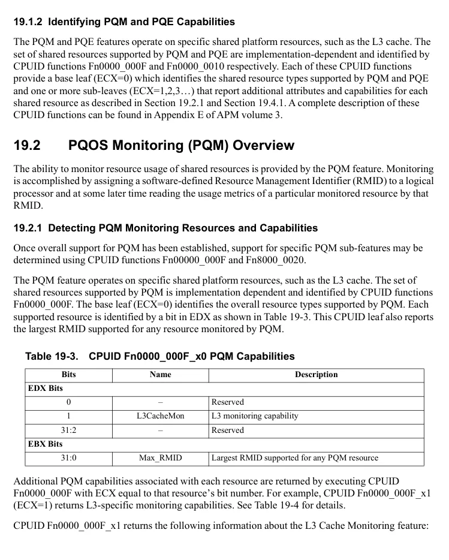

</details>


<!-- PDF source page: 757 | printed page: 695 -->

- If EAX is non-zero, it indicates the size of the L3 monitoring counter, offset from 24 bits. If EAX is 0, the counter size is determined by the PQOS version number as described in Table 19-7 on page 700.
- EBX identifies the counter scaling factor. The QM_CTR value must be multiplied by this scaling factor to obtain the cache occupancy or bandwidth used in bytes.
- ECX identifies the largest RMID for L3 monitoring. Writing a larger value to the RMID field in the QM_EVTSEL register results in a #GP(0) exception.
- EDX identifies the specific L3 usage events that can be monitored. See Table 19-4. This bit vector also identifies the valid EvtID selections for use in the QM_EVTSEL registers.

**Table 19-4. CPUID Fn0000_000F_EDX_x1 PQM Event Identifiers**

| EDX bits | PQM event identifie | Description |
| --- | --- | --- |
| 0 | L3 Occupancy | L3 cache occupancy |
| 1 | L3 total bandwidth | L3 Cache Bandwidth Monitoring Event 0<br>At reset, this event tracks Total L3 Bandwidth. However, if<br>BMEC is supported, the specific types of L3 bandwidth<br>sources to be tracked are configurable. See Section 19.3.3.2<br>below. |
| 2 | L3 local bandwidth | L3 Cache Bandwidth Monitoring Event 1<br>At reset, this event tracks Local L3 Bandwidth. However, if<br>BMEC is supported, the specific types of L3 bandwidth<br>sources to be tracked are configurable. See Section 19.3.3.2<br>below. |
| 31:3 | – | Reserved |

Extended L3 Cache Monitoring capabilities are enumerated by Fn8000_0020_EBX_x0 as described in Table 19-5.

**Table 19-5. Fn8000_0020_EBX_x0 PQM Extended Feature Identifiers**

| EBX Bits | Name | Description |
| --- | --- | --- |
| 1 | L3MBE | Memory Bandwidth Enforcement. See Section 19.4.5. |
| 2 | L3SMBE | Slow Memory Bandwidth Enforcement. See Section 19.4.6. |
| 3 | BMEC | Bandwidth Monitor Event Configuration (BMEC).See<br>Section 19.3.3.2. |
| 5 | ABMC | Assignable Bandwidth Monitoring Counters (ABMC). See<br>Section 19.3.3.3. |
| 6 | SDCIAE | SDCI Allocation Enforcement. See Section 19.4.7. |

<details>
<summary>Rendered source page 757 (figures/tables)</summary>

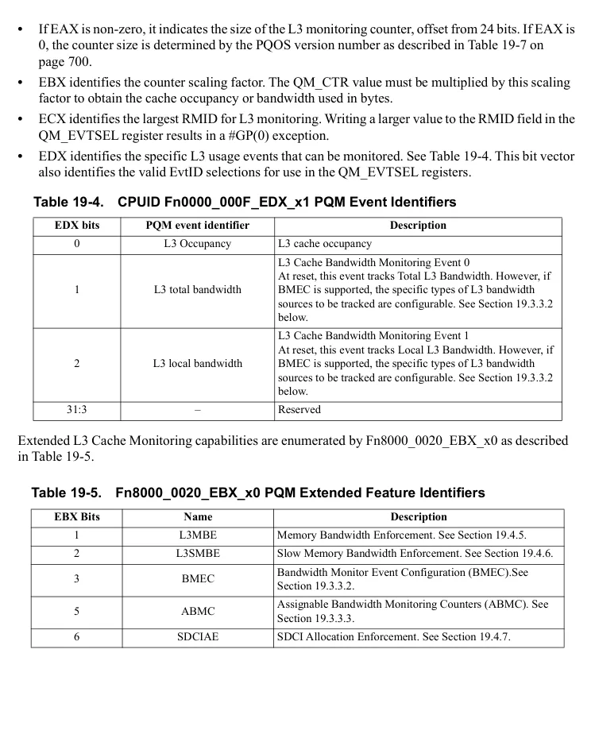

</details>


<!-- PDF source page: 758 | printed page: 696 -->

<a id="19-3-l3-cache-monitoring"></a>

## 19.3 L3 Cache Monitoring

System software obtains the usage metrics for a particular resource by writing the RMID and Event Identifier (EvtID) to the QM_EVTSEL register and then reading the usage count from the QM_CTR register. See Section 19.3.1 for details on the PQM MSRs.

Each PQM usage metric is assigned an EvtID. The EvtID selects which of the monitored metrics is reported for the specified RMID. The EvtID is one more than the event identifier as reported in EDX by CPUID Fn0000_000F_x1. For example, the event identifier for L3 Cache Occupancy Monitoring is bit 0, thus its EvtID is 1.

The association of an RMID with a processor is performed by writing an RMID to the PQR_ASSOC MSR. Each logical processor can be assigned a unique RMID, or the same RMID can be assigned to multiple logical processors to track a multi-threaded application’s shared resource usage. The monitoring hardware tracks and reports usage of shared resources (such as the L3 cache occupancy) on a per-RMID basis.

Software may associate multiple processors with the same RMID at the same time. If the processors are located within the same QOS Domain, the resource usage by all these processors is accumulated and the total is reported by the monitoring hardware.

For PQOS Version 1.0 and 2.0, as identified by Family/Model, the QM_EVTSEL register is shared by all the processors in a QOS Domain. It is software’s responsibility to ensure that no other process changes the QM_EVTSEL register between the time it is written and the time the QM_CTR read occurs. For later implementations, each processor in the QOS Domain has a private QM_EVTSEL and QM_CTR register pair, therefore software does not require synchronization between processors in the QOS Domain to use the register pair.

Writing a value larger than the MAX_RMID (CPUID Fn0000_000F_EBX_x0[MAX_RMID] to the QM_EVTSEL register will result in a #GP(0) exception. Writing to the QM_EVTSEL register an undefined EvtID or an RMID value greater than the largest RMID supported for that specific resource will cause the subsequent read of the QM_CTR to return 1 in the E (error) field.

<a id="19-3-1-pqm-msrs"></a>

### 19.3.1 PQM MSRs

The following MSRs are used by the PQM feature:

- PQR_ASSOC, MSR C8Fh. This MSR is used to assign an RMID to a logical processor.
- QM_EVTSEL, MSR C8Dh. This MSR is used to request a selected usage metric for a given RMID be returned to the QM_CTR MSR.
- QM_CTR, MSR C8Eh. This MSR is used to report the requested usage metric.

Each of these MSRs are described in detail below.

1. 19. 3.1.1 PQR_ASSOC**

This MSR is used by system software to assign an RMID or a COS to a logical processor.


<!-- PDF source page: 759 | printed page: 697 -->

63 36 35 32

Reserved COS

31 12 11 0

Reserved RMID

**Bits Mnemonic Description Access type** 63:36 – Reserved MBZ 35:32 COS Class of Service R/W 31:12 – Reserved MBZ 11:0 RMID Resource Monitor Identifier R/W

**Figure 19-1. PQR_ASSOC**

- COS[4:0] (Class of Service) – bits 35:32, read/write. System software uses the COS field to assign an arbitrary, numeric Class of Service value to this logical processor. Based on the COS, the PQOS hardware can enforce limits on usage of shared resources. At reset, the COS value is cleared to 0. The size of the COS field is implementation dependent. Software must use CPUID Fn0000_0010_EDX_x1[Max_COS](bits 15:0) to determine the largest COS value supported by the processor. An attempt to write a larger value than Max_COS results in a #GP(0) exception.
- RMID[11:0] (Resource Monitoring Identifier) – bits 11:0, read/write. The RMID field specifies an identifier that the PQOS hardware will use to tag usage of monitored events. Software subsequently uses the RMID value to retrieve the usage data for a particular monitored event. At reset, the RMID value is cleared to 0. The size of the RMID field is implementation dependent. Software must use CPUID Fn0000_000F_EBX_x0[Max_RMID](bits 31:0) to determine the maximum RMID value supported by the processor. An attempt to write a larger value than Max_RMID results in a #GP(0) exception.

1. 19. 3.1.2 QM_EVTSEL**

This MSR is used to request a selected usage metric for a given RMID be returned to the QM_CTR MSR.

<details>
<summary>Rendered source page 759 (figures/tables)</summary>

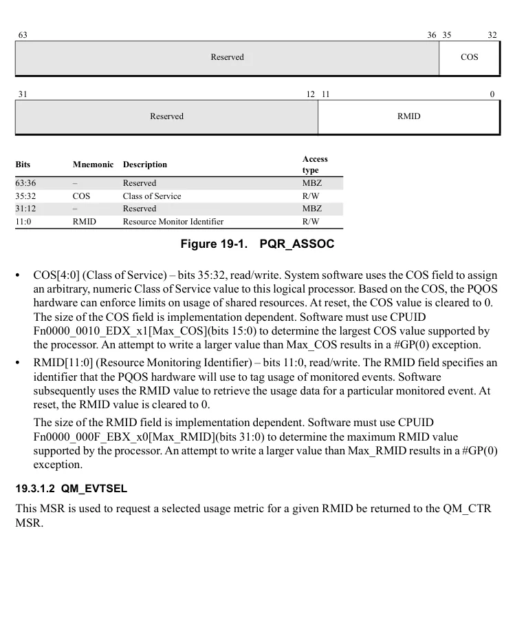

</details>


<!-- PDF source page: 760 | printed page: 698 -->

63 44 43 32

Reserved RMID

31 30 8 7 0

ExtEvtID

Reserved EvtID

**Bits Mnemonic Description Access type** 63:44 – Reserved MBZ 43:32 RMID Resource Monitoring Identifier R/W 31 ExtEvtID Extended Event Identifier R/W (*see note*) 30:8 – Reserved MBZ 7:0 EvtID Event Identifier R/W

**Figure 19-2. QM_EVTSEL**

The fields within the QM_EVTSEL register are:

- RMID[11:0] (Resource Monitoring Identifier) – bits 43:32, read/write. To read the usage of a particular monitored resource/event by an RMID, the corresponding EvtID and RMID are written to the QM_EVTSEL register, and the resulting usage is then read from the QM_CTR register. The width of the RMID field matches the width of the QM_ASSOC.RMID field.
- ExtEvtID (Extended Event Identifier) – bit 31. When set, the EvtID field refers to Extended Event Identifiers as shown in Table 19-6. ***Note:** This bit is MBZ unless L3_QOS_EXT_CFG.ABMC_En is set.*

- EvtID[7:0] (Event Identifier) – bits 7:0, read/write. This field specifies the PQM resource or event for which usage will be returned in the QM_CTR register. EvtID encodings are defined in Table 19-6.

<details>
<summary>Rendered source page 760 (figures/tables)</summary>

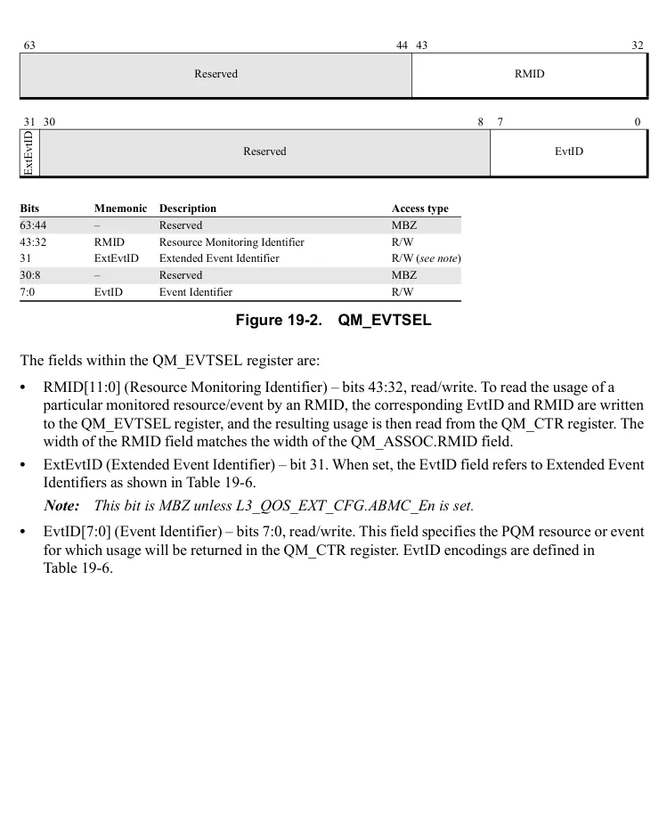

</details>


<!-- PDF source page: 761 | printed page: 699 -->

**Table 19-6. QM_EVTSEL.EvtID Encodings**

| ExtendedEvtID | Value | Name | Description |
| --- | --- | --- | --- |
| 0 | 1 | L3OccMon | L3 cache monitoring event. |
| 0 | 2 | L3BWMonEVT0 | L3 cache bandwidth monitoring event 0. At reset, this<br>event tracks TOTAL L3 memory bandwidth. However, if<br>BMEC is supported the types of bandwidth tracked by this<br>event can be configured. |
| 0 | 3 | L3BWMonEVT1 | L3 cache bandwidth monitoring event 1. At reset, this<br>event tracks LOCAL L3 memory bandwidth. However, if<br>BMEC is supported, the types of bandwidth tracked by<br>this event can be configured. |
| 1 | 1 | L3CacheABMC | Assignable Bandwidth Monitoring Counter (ABMC)<br>access. |

1. 19. 3.1.3 QM_CTR**

QM_CTR is used to report the usage metric selected by the QM_EVTSEL register.

63 62 CNT_LENCNT_LEN-1 0

E U Reserved COUNT

**Bits Mnemonic Description Access type** 63 E Error on access to counter RO 62 U Count for this event is currently unavailable RO 61:CNT_LEN – Reserved, read as zero RAZ CNT_LEN-1:0 CNT Count of monitored resource or event RO

**Figure 19-3. QM_CTR**

The fields within the QM_CTR register are:

- E (Error) – bit 63, read only. The E bit is set if an error occurs upon access to the counter, such as an illegal EvtID or RMID.

- U (Undefined) – bit 62, read only. The U bit is set if the count for this EvtID is not currently avail-able. The monitoring hardware may set the U bit at any time to indicate that the requested event count for the specified RMID is not currently available. This is generally a temporary condition and subsequent reads may succeed.

- CNT (Count) – bits CNT_LEN-1:0, read only. The CNT field reports the usage data for moni-tored resources and events. To read the usage of a particular monitored resource/event by an RMID, the corresponding EvtID and RMID are written to the QM_EVTSEL register, and the resulting usage data is then read from the QM_CTR register. The value in the count field must be

<details>
<summary>Rendered source page 761 (figures/tables)</summary>

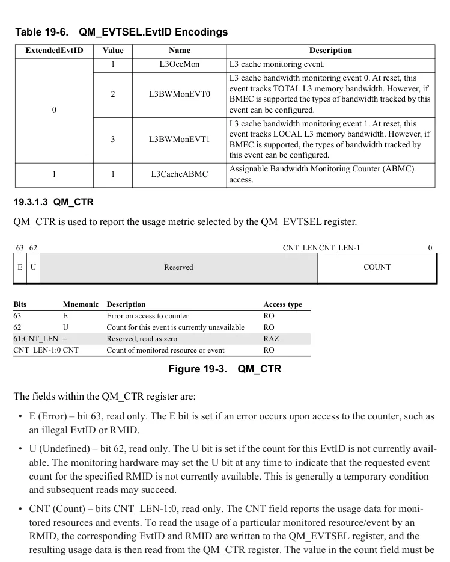

</details>


<!-- PDF source page: 762 | printed page: 700 -->

scaled by multiplying by the scale factor reported by CPUID Fn0000_000F_EBX_x1[Scaling-Factor]. **•** The size of the CNT field (CNT_LEN) is implementation-dependent and is identified by CPUID Fn0000_000F_EAX_x1[CounterSize]. If CounterSize is non-zero, the width of the CNT field in bits is (CounterSize + 24). For example, if the value of CounterSize is 20, then the CNT field is 44 bits wide. If CounterSize is 0, use the PQOS Version (see Table 19-2 on page 693) and the following table to identify the counter size.

**Table 19-7. Counter Size when Fn0000_000F_EAX_x1[CounterSize] = 0**

| PQOS Version | Counter Size (Bits) |
| --- | --- |
| V1.0 | 62 |
| V2.0 | 44 |

<a id="19-3-2-monitoring-l3-occupancy"></a>

### 19.3.2 Monitoring L3 Occupancy

Monitoring L3 cache occupancy is accomplished by first assigning a RMID to a given logical processor or group of processors. Then, at some later time, the L3 cache occupancy metric may be read by writing the RMID and the L3 Occupancy identifier (EvtID =1) to the QM_EVTSEL register and reading the resulting value from the QM_CTR register. The monitoring hardware may not keep a precise count of the L3 cache occupancy associated with a given RMID; the L3 cache occupancy value returned is an approximation.

The value returned in QM_CTR must be multiplied by the L3 Cache Scaling Factor to obtain the approximate number of bytes in the L3 cache currently associated with the supplied RMID. The L3 Cache Scaling Factor is returned by CPUID Fn0000_000F_EBX_x1[ScalingFactor](bits 31:0).

The QOS Domain for L3 occupancy monitoring is an L3 cache and all the processors which share that cache. When using L3 occupancy monitoring, L3 cache lines are tagged with the current RMID value in the PQR_ASSOC register of the processor which installed the cache line. When the QM_CTR is read for that RMID, the monitoring hardware reports an approximation of the amount of the L3 cache contents currently associated with that RMID in the L3 QOS Domain of the processor performing the read.

If two processors in the same L3 QOS Domain are running with different RMIDs and both processors access a given cache line, that line may be associated with either of the RMIDs. Subsequently, the line may remain associated with the RMID with which it was first associated, or its RMID association may change over time, depending on cache access patterns.

Similarly, if the RMID of a processor is changed but that processor continues to access cache lines which have been associated with the previous RMID, those cache lines may continue to be reported as belonging to the first RMID for an indefinite period.

If software changes the of association of RMIDs with processors such that an RMID is no longer in use by any processor, the L3 occupancy count for that unused RMID will not immediately drop to zero. Lines which were installed in the L3 cache and associated with that RMID may remain in the cache until they are replaced through normal cache replacement mechanisms or software explicitly

<details>
<summary>Rendered source page 762 (figures/tables)</summary>

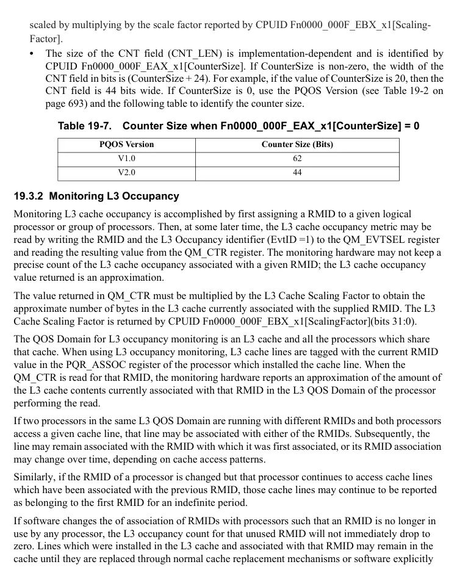

</details>


<!-- PDF source page: 763 | printed page: 701 -->

flushes the lines using CLFLUSH, WBINVD, or INVD instructions.

> ***Note:** L3 cache occupancy as reported by the monitoring hardware is an approximation. Software must not assume that an L3 occupancy measurement of zero is an indication that no lines remain in the cache which were installed by processors running for a given RMID. The L3 cache occupancy monitor should never be used to determine whether cache flushing may be skipped in situations which would ordinarily require cache flushing for functional correctness.*

After writing the corresponding EvtID and RMID into the QM_EVTSEL register, L3 occupancy data is reported via the QM_CTR register. The QM_CTR E bit will be set if system software has specified an illegal RMID or an undefined or unsupported EvtID in QM_EVTSEL. If the E bit is set, the rest of the QM_CTR value should be ignored.

The U bit may be set on any QM_CTR read. Subsequent reads issued to the same RMID and EvtID may have the U bit cleared. The U bit is set when the monitoring hardware does not have an accurate count for the selected event.

<a id="19-3-3-monitoring-l3-memory-bandwidth-mbm"></a>

### 19.3.3 Monitoring L3 Memory Bandwidth (MBM)

The L3 MB mechanism counts requests made by the L3 cache to the lower-level caches and memory (not including I/O). Processors supporting L3 memory bandwidth monitoring are identified by Fn0000_000F_EDX_x1 bit 1 [L3BWMonEvt0] and bit 2 [L3BWMonEvt1] being set. The corresponding Event IDs are EvtID=2 and EvtID=3 respectively.

By default, L3BWMonEvt0 (EvtID 2) tracks total L3 memory bandwidth and L3BWMonEvt1 (EvtId 3) tracks local L3 memory bandwidth. If Bandwidth Monitoring Event Configuration (BMEC) is not implemented, the types of L3 transactions counted for EvtID2 and EvtID3 are fixed. See Section 19.3.3.1. However, if BMEC is supported, the type of bandwidth transactions tracked by these events is configurable. See Section 19.3.3.2.

If Assignable Bandwidth Monitoring Counters (ABMC) are implemented, software can specify which RMIDs are tracked by the implemented MBM hardware counters. See Section 19.3.3.3.

System software reads MBM bandwidth counters using the QM_EVTSEL and QM_CTR registers as described in the following sections.

For all bandwidth monitoring modes, the value returned in QM_CTR must be multiplied by the scaling factor, CPUID Fn0000_000F_EBX_x1[ScalingFactor](bits 31:0), to obtain the number of bytes used by the selected bandwidth source.

To obtain a bandwidth, software should read the Time Stamp Counter (TSC) and the L3 Cache Bandwidth count, wait some period of time, and then read the TSC and the L3 Cache Bandwidth count again. To obtain the rate, software should then divide the difference between the count values by the sampling period.

In PQOS Version 2.0 or higher, the MBM hardware will set the U bit on the first QM_CTR read when it begins tracking an RMID that it was not previously tracking. The U bit will be zero for all subsequent reads from that RMID while it is still tracked by the hardware. Therefore, a QM_CTR


<!-- PDF source page: 764 | printed page: 702 -->

read with the U bit set when that RMID is in use by a processor can be considered 0 when calculating the difference with a subsequent read. The U bit will not be set when a counter rolls over. For these implementations, if the U bit is clear on QM_CTR read for a given RMID and event, the MBM hardware has been counting the event for that RMID continuously without interruption since the previous QM_CTR read for that RMID and that event.

A given implementation may have insufficient hardware to simultaneously track the bandwidth for all RMID values that the hardware supports. If an attempt is made to read a Bandwidth Count for an RMID that has been impacted by these hardware limitations, the U bit of the QM_CTR will be set when the counter is read. Subsequent QM_CTR reads for that RMID and Event may return a value with the U bit clear. Potential causes of the U bit being set include (but are not limited to):

- RMID is not currently tracked by the hardware.
- RMID was not tracked by the hardware at some time since it was last read.
- RMID has not been read since it started being tracked by the hardware.

For bandwidth monitoring events which continually increment the counter, when the maximum count is reached the counter will roll over and continue counting. It is the software’s responsibility to read the count often enough to avoid having the count roll over twice between reads. The initial counter size is 24 bits and retrieving the value at 1Hz or faster is sufficient to ensure at most one rollover per sampling period.

1. 19. 3.3.1 Legacy L3 Cache Bandwidth Monitoring**

In early implementations where BMEC is not supported, the types of L3 transactions counted by the hardware for EvtID 2 and EvtID 3 are fixed. EvtID 2 tracks total L3 memory bandwidth and EvtID 3 tracks local L3 memory bandwidth. The precise transactions counted by each EvtID depends on the PQOS version. Table 19-8specifies which transactions are counted by a given EvtID for implementations that do not support BMEC. These implementations are identified by the PQOS Version as determined by the Family/Model of the product (see Table 19-2 on page 693).

**Table 19-8. Transaction Types and EvtIDs**

| Transaction Type | V1.0 EvtIDs | V2.0 EvtIDs |
| --- | --- | --- |
| Read to Local NUMA Domain | 2,3 | 2,3 |
| Read to Non-Local NUMA Domain | 2 | 2 |
| Non-Temporal Write to Local NUMA Domain | N/A | 2,3 |
| Non-Temporal Write to Non-Local NUMA Domain | N/A | 2 |

System software reads the total and local bandwidth using the QM_EVTSEL and QM_CTR registers. The bandwidth metric can be read by setting the following fields in QM_EVTSEL: [ExtendedEvtID]=0, [EvtID]={2,3}, and setting [RMID] to the desired RMID. Reading QM_CTR will then return the contents of the specified event. The E bit will be set if an illegal RMID was specified in QM_EVTSEL.

<details>
<summary>Rendered source page 764 (figures/tables)</summary>

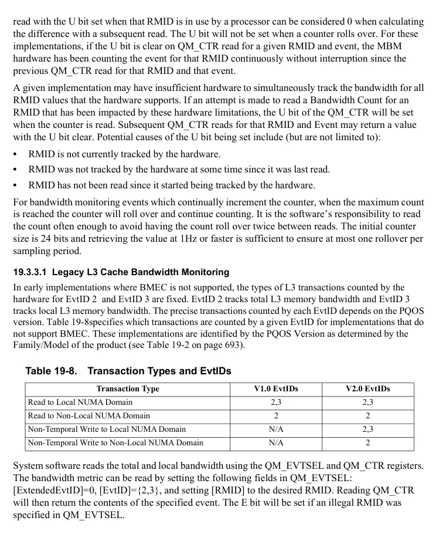

</details>


<!-- PDF source page: 765 | printed page: 703 -->

1. 19. 3.3.2 Bandwidth Monitoring Event Configuration (BMEC)**

The BMEC feature allows software to configure the specific types of L3 transactions that are counted for L3 bandwidth monitoring.

The BMEC feature implements a set of *n* MSRs (QOS_EVT_CFG_n) which specify the transaction types to be counted for each L3 bandwidth monitoring event. QOS_EVT_CFG_n configures the L3CacheBwMonEvt&lt;n&gt; encoding of QM_EVTSEL.EvtID. For example, L3BWMonEVT1 (corresponding to EvtID=3) may be configured using the QOS_EVT_CFG_1 register. The format of the QOS_EVT_CFG_n MSRs is shown in Figure 19-4 on page 704.

Table 19-9 summarizes the BMEC Events and their associated names, EvtIDs, configuration MSRs, and default settings.

**Table 19-9. BMEC Events and Corresponding Attributes**

| BMEC event | BMEC name | EvtID | Configuration MSR | Default (reset) Configuration |
| --- | --- | --- | --- | --- |
| L3BWMonEVT0 | L3BW Total | 2 | QOS EVT CFG 0<br>_ _ _<br>MSR C000 0400h | Tracks Total L3 Bandwidth |
| L3BWMonEVT1 | L3BWLocal | 3 | QOS EVT CFG 1<br>_ _ _<br>MSR C000 0401h | Tracks Local L3 Bandwidth |

**Detecting Support for BMEC**

Support for BMEC is indicated by CPUID Fn8000_0020_EBX_x0[BMEC] (bit 3) =1.

The number of BMEC configuration registers and the types of transactions that can be counted are implementation dependent and identified by CPUID.

- CPUID Fn8000_0020_EBX_x3[EVT_NUM](bits 7:0) identifies the number of QOS_EVT_CFG_n registers available for BMEC use.
- CPUID Fn8000_0020_ECX_x3 identifies the types of L3 transactions that can be counted.

For implementations that support at least two BMEC configuration registers (EVT_NUM &gt;= 2), QOS_EVT_CFG_0 is reset to a value such that L3CacheBwMonEvt0 reports Total L3 System Memory Bandwidth and QOS_EVT_CFG_1 is reset to a value such that L3CacheBwMonEvt1 reports L3 System Memory Bandwidth to the Local NUMA domain. See Figure 19-4 for the specific reset values.

**BMEC MSRs**

The BMEC feature implements a set of *n* configuration registers, QOS_EVT_CFG_n, where &lt;n&gt; is the BMEC event number (EvtID). The BMEC configuration registers are used to specify the Bandwidth Types to be counted for each BMEC EvtID. The MSR address of QOS_EVT_CFG_n is C000_0400h + n.

The BMEC configuration registers contain a bit for each Bandwidth (BW) Type that can be used to configure the BMEC EvtID (see Figure 19-4). The Bandwidth Types that can be tracked are implementation dependent and enumerated by CPUID Fn8000_0020_ECX_x3. Bit locations that are

<details>
<summary>Rendered source page 765 (figures/tables)</summary>

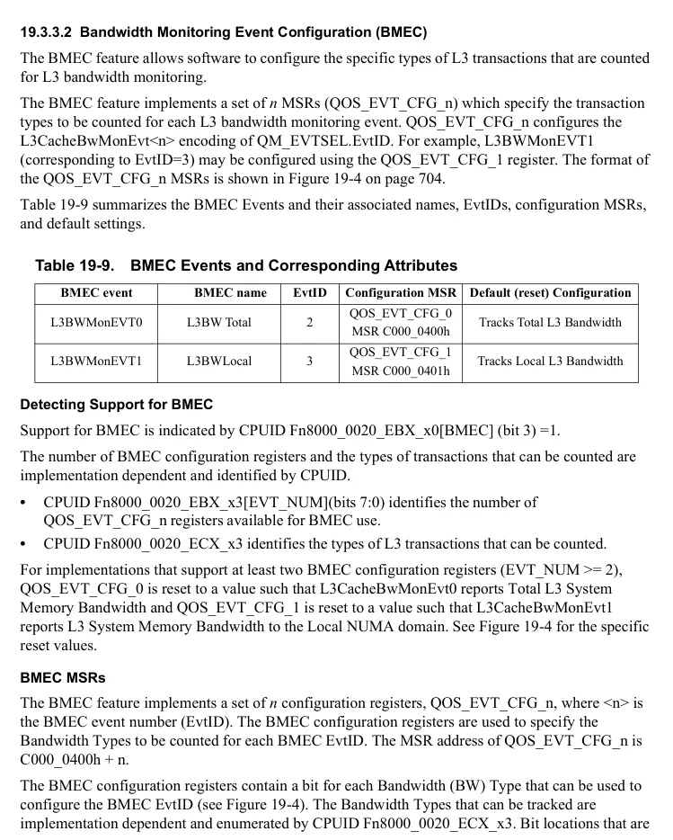

</details>


<!-- PDF source page: 766 | printed page: 704 -->

0 in the CPUID field indicate that the corresponding bit positions in QOS_EVT_CFG_n are reserved and MBZ.

63 7 6 0

Reserved BW Types (as defined below)

**Bits Mnemonic Description Access type** 63:7 – Reserved MBZ 6 VictimBW Dirty victim writes to all types of memory RW 5 RmtSlowFill Reads issued to remote memory the system identi-fies as “Slow Memory” RW

4 LclSlowFill Reads issued to local memory the system identi-fies as “Slow Memory” RW

3 RmtNTWr Non-temporal writes issued to remote memory RW 2 LclNTWr Non-temporal writes issued to local memory RW 1 RmtFill Reads issued to remote DRAM memory RW 0 LclFill Reads issued to local DRAM memory RW

> ***Notes:** QOS_EVT_CFG_0 is reset to a value such that L3CacheBwMonEvt0 (EvtID=2) reports Total L3 memory bandwidth. QOS_EVT_CFG_1 is reset to a value such that L3CacheBwMonEvt1 (EvtID=3) reports Local L3 memory bandwidth.*

**Figure 19-4. QOS_EVT_CFG_n**

The fields in the QOS_EVT_CFG_n registers are further described below:

- BwType (Bandwidth Types) – bits 6:0, read/write. This field is a bit map specifying the types of L3 bandwidth events to be tracked. The Bandwidth Types that can be tracked are implementation dependent and software must use CPUID Fn8000_0020_ECX_x3 to determine if a particular Bandwidth Type is supported. Bit locations that are 0 in the CPUID field indicate that the corre-sponding bit positions in QOS_EVT_CFG_n are reserved and MBZ.

1. 19. 3.3.3 Assignable Bandwidth Monitoring (ABMC)**

The ABMC feature implements a set of *n* counters to monitor L3 bandwidth in the QOS Domain. Each of these counters can be assigned by system software to a particular source RMID (or COS, if supported) to track the memory bandwidth used by that source.

ABMC gives system software full control over the bandwidth monitoring resources in the QOS Domain. When enabled, the bandwidth monitoring hardware will only track memory bandwidth used by the sources and Bandwidth Types configured through the L3_QOS_ABMC_CFG_n MSRs. Bandwidth data may still be accessed by specifying an RMID and EvtID, but may also be accessed by specifying an ABMC CtrId. (See “Reading the ABMC Counters” on page 708 for more details)

**Detecting Support for ABMC**

Support for ABMC is identified by CPUID Fn8000_0020_EBX_x0[ABMC] (bit 5) being set. If

<details>
<summary>Rendered source page 766 (figures/tables)</summary>

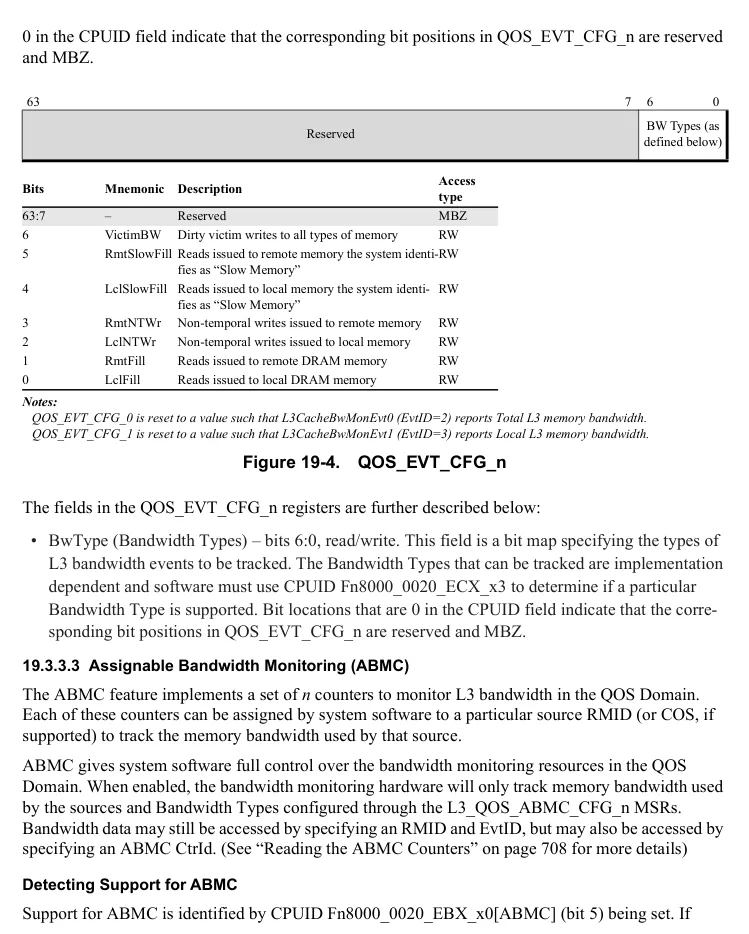

</details>


<!-- PDF source page: 767 | printed page: 705 -->

ABMC is supported, the feature’s attributes and capabilities are enumerated by CPUID Fn8000_0020_x5 as detailed in Appendix E of APM volume 3, and summarized below:

- EAX returns the size of the assignable counters and the presence of a counter overflow bit.
- EBX returns the number of ABMC counters supported.
- ECX identifies the capability to associate individual assignable counters with a COS (Class of Service) rather than an RMID.

The types of L3 transactions that ABMC can track are configurable and identified by CPUID Fn8000_0020_ECX_x3. See “QOS_EVT_CFG_n” on page 704 for a list of transaction types and corresponding encodings.

**AMBC MSRs**

The ABMC feature implements a pair of MSRs, L3_QOS_ABMC_CFG (MSR C000_03FDh) and L3_QOS_ABMC_DSC (MSR C000_3FEh). Each logical processor implements a separate copy of these registers.

Attempts to read or write these MSRs when ABMC is not enabled will result in a #GP(0) exception.

Individual assignable bandwidth counters are configured by writing to L3_QOS_ABMC_CFG MSR and specifying the Counter ID, Bandwidth Source, and Bandwidth Types.

Reading L3_QOS_ABMC_DSC returns the configuration of the counter specified by L3_QOS_ABMC_CFG [CtrID].

63 62 6 1 53 52 48 47 46 4 4 4 3 32

IsCOS

CfgEn

CtrEn

Reserved CtrID

Reserved BwSrc (RMID or COS)

31 0

BwType

**Bits Mnemonic Description Access Type Reset Value**

63 CfgEn Configuration Enable R/W 0 62 CtrEn Counter Enable R/W 0 61:53 – Reserved MBZ 0 52:48 CtrID Counter Identifier R/W 0 47 IsCOS BwSrc field is a COS (not an RMID) R/W 0 46:44 – Reserved MBZ 0 43:32 BwSrc Bandwidth Source (RMID or COS) R/W 0

31:0 BwType Bandwidth types to track for this counter R/W See BwType below

**Figure 19-5. L3_QOS_ABMC_CFG**

<details>
<summary>Rendered source page 767 (figures/tables)</summary>

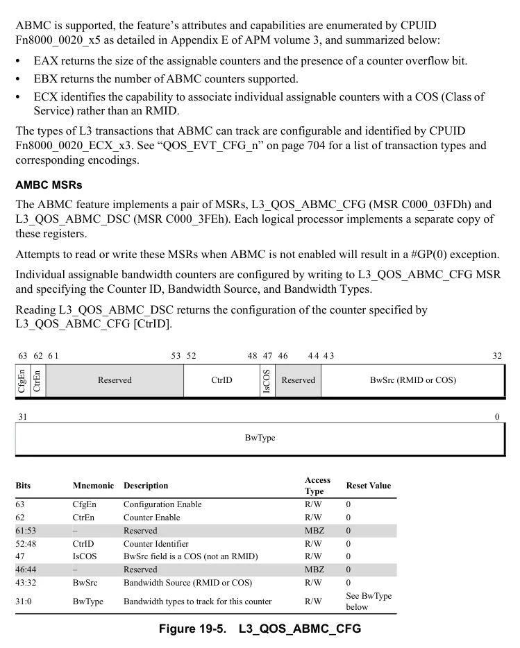

</details>


<!-- PDF source page: 768 | printed page: 706 -->

The fields shown in Figure 19-5 are further described below:

- CfgEn (Configuration Enable) – bit 63. When set, indicates a WRMSR to this register should configure the assignable counter selected by the CtrID field. If this bit is not set on a write, no configuration is performed.
- CtrEn (Counter Enable) – bit 62. When set, the selected counter will begin tracking the bandwidth types specified in the BwType field.
- CtrID (Counter ID) – bits 52:48. Identifies the assignable counter to configure.
- IsCOS (BwSrc is a COS) – bit 47. When set, indicates that the BwSrc field is a COS (Class of Service) as opposed to an RMID.
- BwSrc (Bandwidth Source) – bits 43:32. Specifies an RMID (or COS if IsCOS=1) to monitor with this counter. The size of this field is LOG2(CPUID Fn0000_000F_EBX_x0[MAX_RMID]+1).
- BwType (Bandwidth Types – bits 31:0. This field is a bit map specifying the types of L3 bandwidth events to be tracked by this assignable counter. This field uses the Bandwidth Type encodings used in CPUID Fn8000_0020_ECX_x3[BandwidthTypes]. Upon reset, the bit for each supported Bandwidth Type enumerated by the above CPUID function is set to 1.

63 62 6 1 53 52 48 47 46 4 4 4 3 32

CfgErr

IsCOS

CtrEn

Reserved CtrID

Reserved Bw Src (RMID or COS)

31 0

BwType

**Bits Mnemonic Description Access Type Reset Value**

63 CfgErr Configuration Error R 0 62 CtrEn Counter Enable R 0 61:53 – Reserved R 0 52:48 CtrID Counter Identifier R 0 47 IsCOS BwSrc field is a COS (not an RMID) R 0 46:44 – Reserved R 0 43:32 BwSrc Bandwidth Source (RMID or COS) R 0

31:0 BwType Bandwidth types to track for this counter R See BwType below

**Figure 19-6. L3_QOS_ABMC_DSC**

The fields shown in Figure 19-6 are further described below:

- CfgErr (Configuration Error) – bit 63. When set, indicates that the last configuration specified in L3_QOS_ABMC_CFG was invalid and consequently the specified counter was not enabled.

<details>
<summary>Rendered source page 768 (figures/tables)</summary>

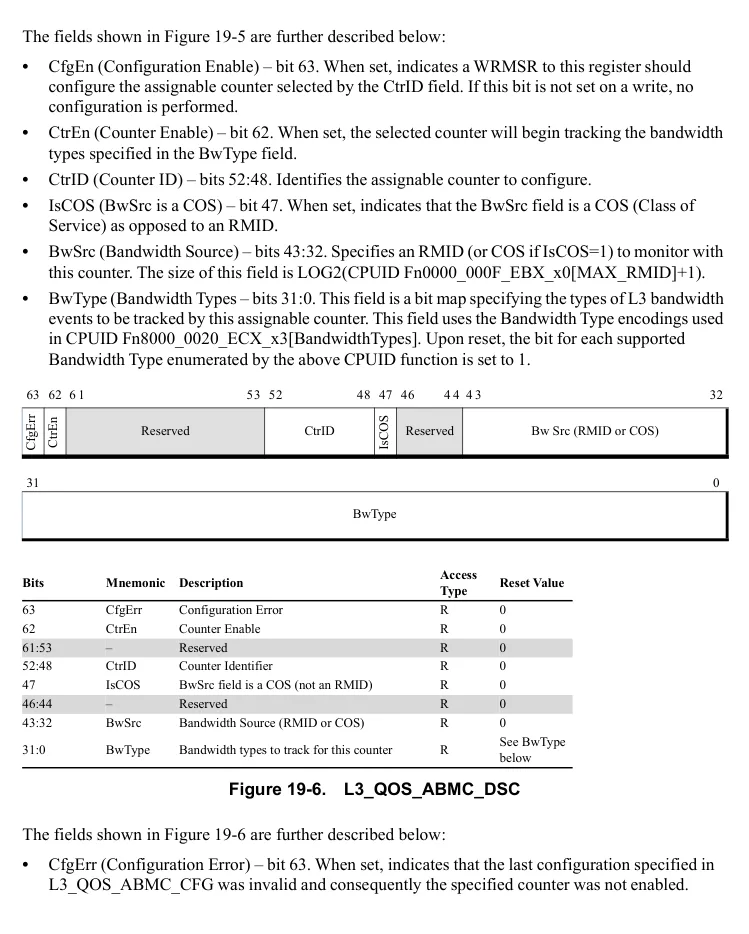

</details>


<!-- PDF source page: 769 | printed page: 707 -->

- CtrEn (Counter Enable) – bit 62. When set, indicates the selected counter is actively tracking the bandwidth types specified in the BwType field. When cleared, the selected counter is also zero.
- CtrID (Counter ID) – bits 52:48. Identifies the assignable counter for which configuration is reported.
- IsCOS (BwSrc is a COS) – bit 47. When set, indicates that the BwSrc field is a COS (Class of Service) as opposed to an RMID.
- BwSrc (Bandwidth Source) – bits 43:32. Returns the RMID (or COS if IsCOS=1) being monitored with this counter. The size of this field is LOG2(CPUID Fn0000_000F_EBX_x0[MAX_RMID]+1).
- BwType (Bandwidth Types – bits 31:0. This field is a bit map which identifies the types of L3 bandwidth events to be tracked by the specified counter. The BwType field uses the same event encodings used in CPUID Fn8000_0020_ECX_x3[BandwidthMonitoringEvents].

**L3 _QOS_EXT_CFG MSR**

If support for ABMC is identified (CPUID Fn8000_0020_EBX_x0[ABMC](bit 5)=1), then the L3_QOS_EXT_CFG MSR, (MSR address C000_03FFh) is also supported. The format of this register is shown in Figure 19-7.

**Figure 19-7. L3_QOS_EXT_CFG**

<details>
<summary>Extracted figure labels</summary>

```text
63
2
1
0
SDCIAE_En
ABMC_En
Reserved
Bits
Mnemonic
Description
Access
Type
63:2
–
Reserved
RAZ
1
SDCIAE_En SDCI Allocation Enforcement Enable
R/W
0
ABMC_En
ABMC Enable
R/W
```

</details>

**Enabling ABMC**

ABMC is enabled by setting L3_QOS_EXT_CFG.ABMC_En=1 (see Figure 19-7). When the state of ABMC_En is changed, it must be changed to the updated value on all logical processors in the QOS Domain.

Upon transitions of the ABMC_En the following actions take place:

- All ABMC assignable bandwidth counters are reset to 0.
- The L3 default mode bandwidth counters are reset to 0.
- The L3_QOS_ABMC_CFG MSR is reset to 0.

<details>
<summary>Rendered source page 769 (figures/tables)</summary>

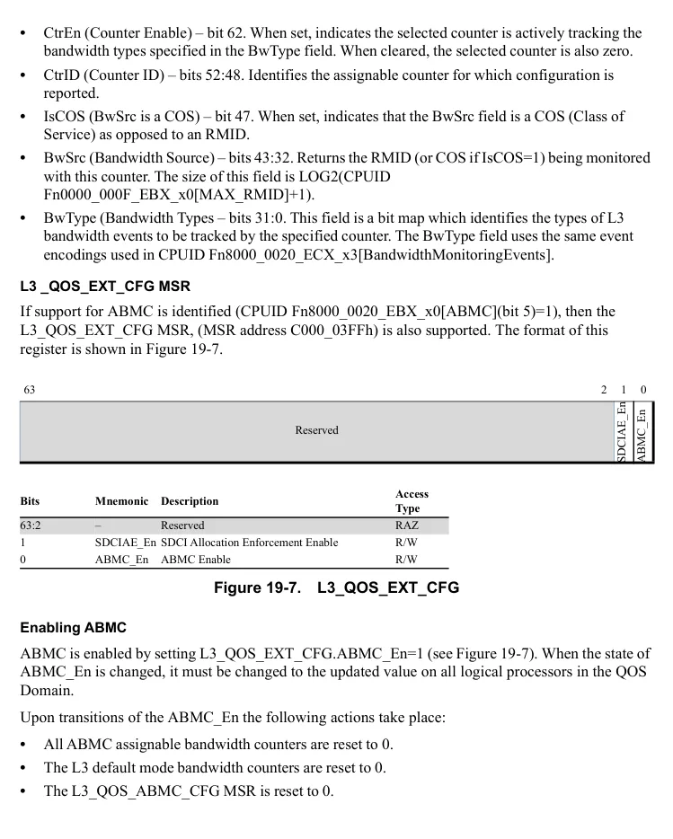

</details>


<!-- PDF source page: 770 | printed page: 708 -->

**Configuring ABMC**

After enabling ABMC, system software can configure a counter by writing the QOS_ABMC_CFG register and specifying the Counter ID, Bandwidth Source, and Bandwidth Types fields and setting the Configuration Enable bit. The value of the specified Counter ID is cleared to zero upon configuration. Writing QOS_ABMC_CFG with CfgEn clear will not change the configuration of the counter. Reading QOS_ABMC_CFG will return the last value written (see Figure 19-5 on page 705).

Each logical processor has a separate copy of QOS_ABMC_CFG. The contents of this register are not persistent through PC6 events and will be reset in that case. Attempts to access L3_QOS_ABMC_CFG when ABMC is not enabled (L3_QOS_EXT_CFG.ABMC_En == 0) result in a #GP(0) exception.

Reading L3_QOS_ABMC_DSC will return the configuration of the counter specified by QOS_ABMC_CFG[CtrID] (see Figure 19-6 on page 706).

**Reading the ABMC Counters**

System software reads the assignable counters using the QM_EVTSEL and QM_CTR registers.

The contents of a specific counter can be read by setting the following fields in QM_EVTSEL: [ExtendedEvtID]=1, [EvtID]=L3CacheABMC and setting [RMID] to the desired counter ID. Reading QM_CTR will then return the contents of the specified counter. The E bit will be set if the counter configuration was invalid, or if an invalid counter ID was set in the QM_EVTSEL[RMID] field.

Alternatively, the contents of a counter may be read by specifying an RMID and setting the [EvtID] to L3BWMonEvt*n* where *n*= {0,1}. If an assignable bandwidth counter is monitoring that RMID with a BwType bitmask that matches a QOS_EVT_CFG_n, that counter’s value will be returned when reading QM_CTR. However, if multiple counters have the same configuration, QM_CTR will return the value of the counter with the lowest CtrID.

The value returned in QM_CTR must be multiplied by the scaling factor, Fn0000_000F_EBX_x1[ScalingFactor](31:0), to obtain the number of bytes used by the selected bandwidth source.

<a id="19-4-pqos-enforcement-pqe"></a>

## 19.4 PQOS Enforcement (PQE)

The PQE feature provides the ability to set and enforce limits on the usage of shared resources by a thread or a group of threads. For example, PQE can be used to specify the amount of L3 cache that is available to a thread.

Enforcement is accomplished by assigning a numerical Class of Service (COS) to a thread and specifying allocations or limits on the usage of a shared resource for that COS. The current COS for a given processor is specified in PQR_ASSOC register, MSR C8Fh (see Figure 19-1 on page 697). If multiple threads share the same COS, those threads will competitively share the controlled resource.

PQE implements several sub-features which are described in detail in the following sections:


<!-- PDF source page: 771 | printed page: 709 -->

- CAT – L3 Cache allocation.
- CDP – L3 Cache allocation, based on code vs. data access.
- L3 bandwidth allocation.
- L3 slow memory bandwidth allocation.
- SDCI allocation enforcement.

For each resource controlled by PQE, a set of Model-Specific Registers is defined which system software can use to specify the allocation limits for each COS.

<a id="19-4-1-identifying-support-for-pqe"></a>

### 19.4.1 Identifying support for PQE

Support for PQE is identified by CPUID Fn0000_0007_EBX_x0[PQE]=1. If PQE is supported, the set of resources for which limits can be set and enforced is reported by CPUID function Fn0000_0010. Each supported resource is identified by a bit in EBX, as shown in Table 19-10.

**Table 19-10. CPUID Fn0000_00010_EDX_x0 PQE Resources**

| EDX Bits | Name | Description |
| --- | --- | --- |
| 0 | – | Reserved |
| 1 | L3Alloc | L3 Cache Allocation Enforcement |
| 31:2 | – | Reserved |

Once support for a PQE resource has been determined as above, CPUID Fn0000_0010 with ECX = {resource bit number} may be used to determine the PQE enforcement capabilities for that resource. For example, Fn0000_00010_x1 (ECX=1) returns the following information about the L3 Cache Monitoring feature:

- EAX identifies CBM_LEN, the length of the L3 cache capacity bitmasks (CBMs).
- EBX identifies the L3 Cache Allocation Sharing Mask.

- ECX identifies the presence of specific L3 Cache Enforcement features, such as Code-Data Prioritization (CDP) support.
- EDX identifies COS_MAX, the maximum COS supported for L3 Cache Allocation Enforcement.

A complete description of these CPUID functions can be found in Appendix E of APM volume 3.

<a id="19-4-2-l3-cache-allocation-enforcement-cat"></a>

### 19.4.2 L3 Cache Allocation Enforcement (CAT)

The L3 CAT feature enables system software to limit the fractional portion of the L3 cache used by threads for each COS.

Limits for L3 cache allocation are specified by a set of L3_MASK_n registers, where *n* is the COS associated with that MSR. There is one L3_MASK register for each COS implemented for the L3 cache resource. This set of registers starts at MSR address C90h and continues through address C90h + (n-1). The maximum COS value supported by the L3 resource is reported by CPUID Fn0000_0010_EDX_x1[MAX_COS](bits 15:0). COS values are zero-based, thus the number of

<details>
<summary>Rendered source page 771 (figures/tables)</summary>

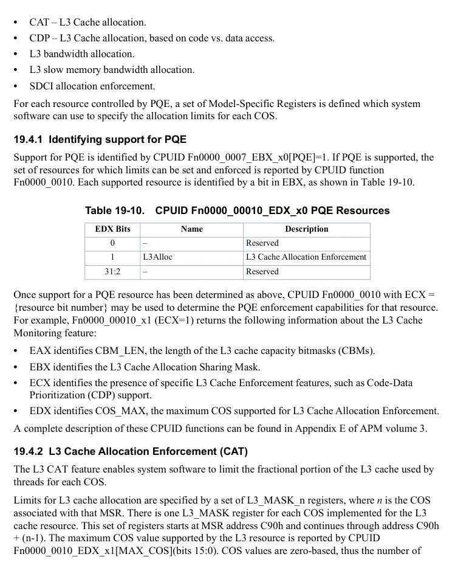

</details>


<!-- PDF source page: 772 | printed page: 710 -->

classes supported is (MAX_COS+1).

Each of the L3_MASK_n registers contain a bitmask where each bit represents a fixed portion of the L3 cache into which COS &lt;n&gt; is allowed to allocate. The length of the bit mask is implementation-dependent and returned by CPUID Fn0000_0010_EAX_x1[CBM_LEN](bits 4:0). The length is zero based, thus CBM_LEN=15 would indicate that the cache is partitioned into 16 sections for L3 allocation purposes.

Once the L3_MASK_n registers are configured with the desired L3 cache allocations, threads can be assigned a COS using the PQR_ASSOC register as described in Section 19.3.1 “PQM MSRs” on page 696.

1. 19. 4.2.1 L3_MASK_n MSRs**

The format of the L3_MASK_n registers is shown in Figure 19-8 below.

**Figure 19-8. L3_MASK_n**

<details>
<summary>Extracted figure labels</summary>

```text
63
CMB_LEN+1 CMB_LEN
0
Reserved
MASK
Bits
Mnemonic
Description
Access
Type
63:CBM_LEN+1
–
Reserved, read as zero
RAZ
CBM_LEN:0
MASK
L3 Cache Allocation Mask
R/W
```

</details>

1. 19. 4.2.2 Using L3 CAT**

System software sets bits in the L3_MASK_n registers to indicate the portions of the L3 cache that may be used by a given COS &lt;n&gt;. For example, if CBM_LEN for a given implementation is 15, then each set bit in the L3_MASK_n represents 1/16 of the cache which may be used by processors running with COS = &lt;n&gt;.

If two or more different Classes of Service have set bits in the same position in their respective L3_MASK_n registers, that portion of the cache is competitively shared by logical processors running with those COS values.

After configuring the L3_Mask_n registers with the desired L3 allocations, system software can set PQR_ASSOC[COS] to specify the Class of Service for the currently active thread. If the value written to PQR_ASSOC[COS] exceeds CPUID Fn0000_00010_EDX_x1[MAX_COS], a #GP(0) exception is signaled.

Some products may implement L3 Cache Allocation Enforcement by allocating some number of ways of the L3 cache for each set bit in the L3_MASK register, but this will not necessarily be true for all implementations and software should not rely on that interpretation. However, because this is one possible implementation, it is possible that use of CAT will reduce the effective associativity available to processes running using an L3_MASK which does not have all the bits set.

<details>
<summary>Rendered source page 772 (figures/tables)</summary>

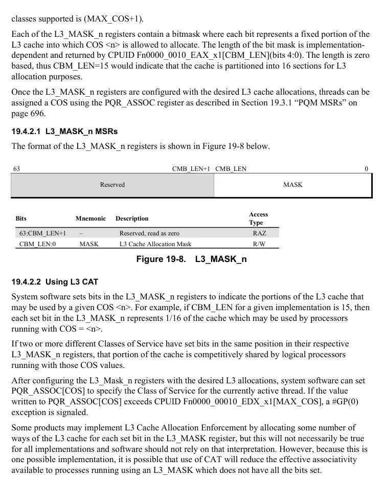

</details>


<!-- PDF source page: 773 | printed page: 711 -->

The bits which are set in the various L3_MASK_n registers do not have to be contiguous and may overlap in any desired combination. If an L3_MASK_n register is programmed with all bits clear, that COS will be prevented from allocating any lines in the L3 cache. At reset, the L3_MASK register bitmap bits are all set, allowing all processors to use the entire L3 cache accessible to them.

The L3 Cache Allocation mechanism controls only the allocations into the L3 cache. Once a line is installed into the cache, any COS is allowed to “hit” on that line.

When a given cache line is accessed by processors running with different COS values in the same QOS Domain, only a single copy of the line will be allocated in the shared cache at a given time. Depending on the access pattern, this line may be installed in the L3 cache partition belonging to either COS. Depending on subsequent access patterns, that cache line may later be evicted and then installed into the partition belonging to the other COS. Software should not assume that the line will always be associated with the last COS that accessed the line.

Depending on the implementation, some portions of the L3 Cache may be shared by other system functions or used for some other purpose not under the control of the PQOS feature set. The L3 Cache Allocation Sharing Mask returned by CPUID Fn0000_0010_EBX_x1[L3ShareAllocMask] is a bitmask that represents portions of the L3 that may be shared by those functions. When software sets a bit in an L3_MASK_n register at the same position as a bit in the L3ShareAllocMask, processors executing with the corresponding COS will competitively share that portion of the cache with the other function. An L3ShareAllocMask with all bits cleared indicates that no other entity in the system is competing with the processors for use of the L3 cache.

<a id="19-4-3-code-and-data-prioritization-cdp"></a>

### 19.4.3 Code and Data Prioritization (CDP)

The L3 CDP feature is an extension of the previously-described L3 CAT feature (See Section 19.4.2). When enabled, CDP allows system software to specify different L3 cache allocations for instructions versus data.

1. 19. 4.3.1 Detecting Support for CDP**

Presence of the L3 CDP feature is indicated by CPUID Fn0000_0010_ECX_x1[CDP](bit 2) being set. The L3 CAT information returned by Fn0000_0010_{EAX, EBX, EDX}_x1 also applies to the L3 CDP feature, except for MAX_COS. When CDP is enabled, the maximum COS value is half the value given by CPUID Fn0000_0010_EDX_x1[MAX_COS] + 1.

1. 19. 4.3.2 CDP Model-Specific Registers**

If CDP is supported, software can enable the CDP feature by setting the CDP_En bit in L3_QOS_CFG1 (MSR C81h). See Figure 19-9.


<!-- PDF source page: 774 | printed page: 712 -->

**Figure 19-9. L3_QOS_CFG1**

When CDP is enabled, the L3_MASK_n registers operate in pairs, and each pair is associated with a single COS. The lower-numbered register in the pair is used to specify the cache allocation mask for data accesses and the upper register of the pair is used to specify the mask for instruction fetches. For a given COS, the data allocation mask will be specified in MSR C90 + (2*COS) while the instruction allocation mask will be specified by MSR C90 + (2*COS+1). See Table 19-11 below.

<details>
<summary>Extracted figure labels</summary>

```text
63
0
CDP_En
Reserved
Bits
Mnemonic
Description
Access
Type
63:1
–
Reserved, read as zero
RAZ
0
CDP_En
CDP Enable
R/W
```

</details>

Note that enabling CDP reduces the effective number of unique COS values by half. Specifying a COS outside of the valid range will result in undefined behavior.

The interpretation of the L3_MASK registers is the same with CAT; the difference is that with CDP enabled, the mask to be applied is selected based on whether the line is accessed as an instruction or data fetch. Similar to the behavior with CDP disabled, if a line is accessed as both code and data, then the line may be allocated using either mask register and be counted against that allocation limit. Also similar to the case with CDP disabled, software may not assume that cache lines will necessarily be associated with the code or data mask register with which they were most recently accessed.

**Table 19-11. CAT vs. CDP L3 Mask Register Usage**

| Mask Register / L3 Mask 0<br>_ _ | MSR Address / C90h | CAT Usage / COS 0 | CDP Usage / COS 0 | CDP Usage / data |
| --- | --- | --- | --- | --- |
| L3 Mask 1<br>_ _ | C91h | COS 1 |  | code |
| L3 Mask 2<br>_ _ | C92h | COS 2 | COS 1 | data |
| L3 Mask 3<br>_ _ | C93h | COS 3 |  | code |
| . | . | . | . | .<br>. |
| . | . | . | . |  |
| L3 Mask n<br>_ _ | C90+n | COS n | COS n/2 | data |
| L3 Mask n+1<br>_ _ | C90+n+1 | COS n+1 |  | code |

Software should observe the following sequence when enabling or disabling CDP mode:

1. 1. Ensure that all bits of the QOS Allocation mask for each COS (L3_MASK_&lt;COS&gt;[MASK] are set.

1. 2. Ensure that the QOS Bandwidth enforcement limit for each COS is set to “No Limit”. (L3QOS_BW_CONTROL_&lt;COS&gt;[U] = 1)

<details>
<summary>Rendered source page 774 (figures/tables)</summary>

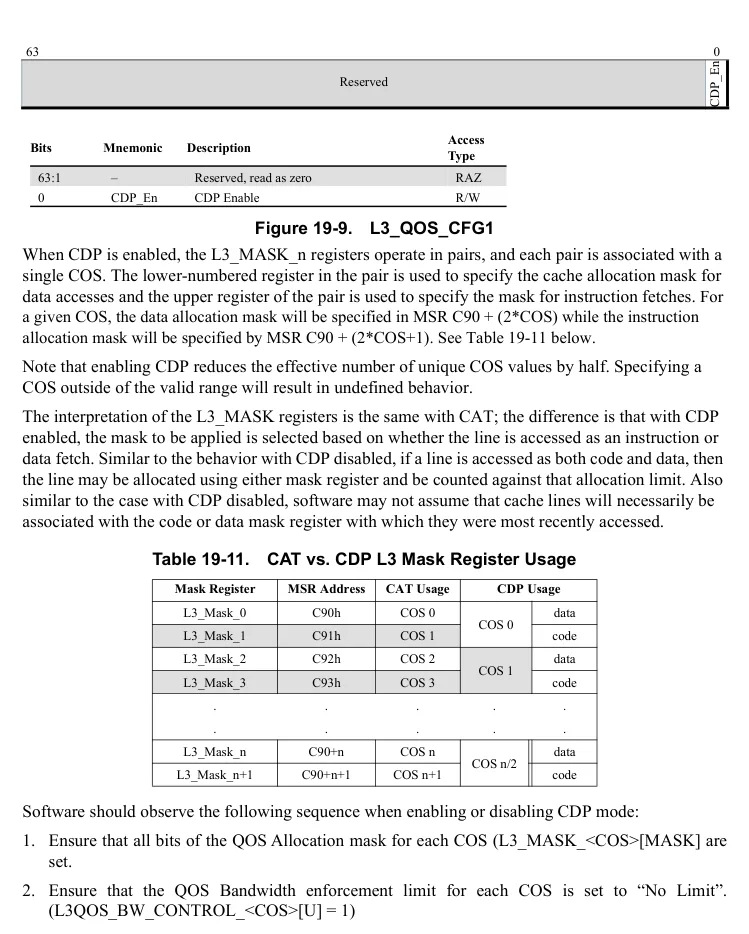

</details>


<!-- PDF source page: 775 | printed page: 713 -->

1. 3. Ensure that all logical processors in the QOS Domain are associated (PQR_ASSOC[COS] with valid COS numbers for when CDP is enabled. Specifically, the COS number must be less than half of COS_MAX. Using COS numbers outside that range will result in undefined behavior.

1. 4. Write the desired state of CDP_En to the L3_QOS_CFG1 MSR on each logical processor in the QOS Domain. In some implementations, a single L3_QOS_CFG1 MSR may be shared between multiple logical processors.

For optimal QOS behavior in the new operating mode, software should flush the caches in the QOS Domain once the new configuration has been enabled to clear out any residual allocations from the previous configuration.

<a id="19-4-4-amd-bandwidth-enforcement"></a>

### 19.4.4 AMD Bandwidth Enforcement

The AMD Bandwidth Enforcement feature provides a set of sub-features to control threads which may be over-utilizing bandwidth relative to their priority with respect to other workloads co-located in the QOS Domain. When support for PQE is identified (see Section 19.4.1 “Identifying support for PQE” on page 709) CPUID Fn8000_0008_EBX_x0[BE](bit 6) returns an indication that AMD Bandwidth Enforcement is supported.

The sub-features supported under AMD Bandwidth Enforcement are further enumerated by CPUID function 0x8000_0020_EBX_x0. The supported sub-features include:

- L3 BE - L3 External Bandwidth Allocation Enforcement (see Section 19.4.5 “L3 External Bandwidth Enforcement (L3BE)” on page 713)
- L3 SMBE - L3 External Slow Memory Bandwidth Allocation Enforcement (see Section 19.4.6 “L3 Slow Memory Bandwidth Enforcement (L3SMBE)” on page 715)
- L3 SDCIAE – L3 Smart Data Cache Injection Allocation Enforcement (see Section 19.4.7 “L3 Smart Data Cache Injection Allocation Enforcement (SDCIAE)” on page 716)

<a id="19-4-5-l3-external-bandwidth-enforcement-l3be"></a>

### 19.4.5 L3 External Bandwidth Enforcement (L3BE)

L3BE allows system software to specify memory bandwidth limits used by a thread (or a group of threads) assigned to a given Class of Service.

Support for L3BE is indicated by CPUID Fn8000_0020_EBX_x0[L3BE](bit 1)=1. If L3BE is supported, the feature’s attributes and capabilities are enumerated by ID Fn8000_0020_x1 as summarized below:

- EAX[31:0](BW_LEN) returns the size of the bandwidth specifier field in the L3QOS_BW_Control_n MSRs.
- EDX[31:0](COS_MAX) returns the maximum COS number supported by the L3BE feature.

1. 19. 4.5.1 L3BE MSRs**

Bandwidth limits are specified using the L3QOS_BW_CONTROL_n, MSRs, where &lt;n&gt; is the corresponding COS number. This set of registers starts at MSR address C000_0200h and continues through C000_0200h + n. The format of the L3QOS_BW_CONTROL_n registers is shown in Figure


<!-- PDF source page: 776 | printed page: 714 -->

19-10.

<a id="section"></a>

#### .

.

63 BW_LEN BW_LEN-1 0

Reserved U BW

**Bits Mnemonic Description Access Type** 63:BW_LEN+1 – Reserved, read as zero RAZ BW-LEN U Unlimited bandwidth R/W BW-LEN-1:0 BW L3 cache external bandwidth limit R/W

**Figure 19-10. L3QOS_BW_CONTROL_n**

The fields within a L3QOS_BW_CONTROL_n register are:

- U (Unlimited) – bit &lt;BW_LEN&gt;. When set, indicates that threads belonging to this COS are unlimited in bandwidth and the contents of the BW field are ignored. At reset, the U bit for all L3QOS_BW_CONTROL_n MSRs are set.
- BW (Bandwidth) – bits BW_LEN-1:0. Specifies a limit on the total L3 external bandwidth, expressed in 1/8 GB/s increments, for all threads running under COS &lt;n&gt;.

1. 19. 4.5.2 Using L3BE**

System software can control usage of L3 external bandwidth using the L3QOS_BW_CONTROL MSRs to specify bandwidth limits for a given COS. There is one L3QOS_BW_CONTROL for each COS as identified by CPUID Fn8000_0020_EDX_x1[COS_MAX](bits 31:0).

At reset, the “U” (Unlimited) bit of all L3QOS_BW_CONTROL registers is set, allowing maximum bandwidth usage by all processors.

The value programmed in the L3QOS_BW_CONTROL_n register specifies a limit on the total L3 external bandwidth consumed by all threads running with COS=&lt;n&gt; within the L3 cache QOS Domain. Software may program a bandwidth limit for COS &lt;n&gt; in L3QOS_BW_CONTROL[BW]_n, or it may specify “no limit” by setting the “U” bit. Unlike cache allocation (which specifies a fraction of the cache), this limit is not a relative bandwidth, but an absolute number expressed in 1/8 GB/s increments. The format of the L3QOS_BW_CONTROL_n registers are described in Figure 19-10 on page 714.

Bandwidth limits are upper bounds on the bandwidth the processors in a given domain and COS may consume, but do not ensure that the specified bandwidth will necessarily be available to those processors. Cases where the processors in a given COS may not be able to reach their allocated bandwidth include (but are not limited to):

1. 1. The specified limit may be greater than the maximum system bandwidth.

<details>
<summary>Rendered source page 776 (figures/tables)</summary>

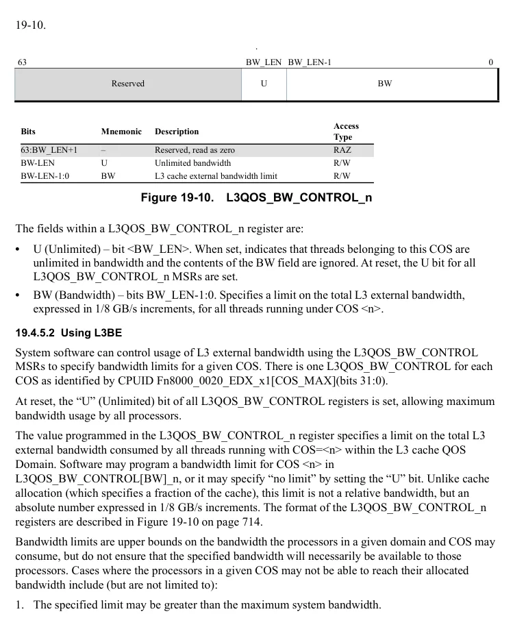

</details>


<!-- PDF source page: 777 | printed page: 715 -->

1. 2. The sum of the limits applied to all classes of service in the domain may exceed the maximum bandwidth the system can deliver to that COS domain.

1. 3. Multiple COS domains which share the same memory channels may demand more total bandwidth than the shared memory can supply.

1. 4. I/O or other system entities may consume a large fraction of system bandwidth and result in less bandwidth being available to the various processor COS domains.

1. 5. Large amounts of write traffic may affect the memory system’s ability to deliver read bandwidth.

In the case where total available L3 external bandwidth has been over-subscribed (that is, not all classes of service can reach their bandwidth limits), the hardware makes no attempt to allocate the available L3 bandwidth in proportion to the limits specified for each COS domain or the limits specified for each COS within a given domain. That is (in case 2 above), if COS *x* has limit A, and COS *y* has limit 2*A, and the total bandwidth which the system can deliver to that COS is only 2*A, the system will only limit COS *x* to A; it will not attempt to give (2/3)*A to COS *x* and (4/3)*A to COS *y* (maintaining the ratio of their limits).

1. 19. 4.5.3 CDP Interaction with L3BE**

When CDP is enabled, the mapping of COS to its associated L3QOS_BW_CONTROL register is changed. For a given COS, the bandwidth limits are specified by MSR C000_0200h + (2*COS). For example, if CDP is enabled, the L3 bandwidth limit for threads associated with COS 3 are specified in L3QOS_BW_CONTROL_6.

Note that enabling CDP reduces the effective number of unique COS values by half. Specifying a COS outside of the valid range will result in undefined behavior.

<a id="19-4-6-l3-slow-memory-bandwidth-enforcement-l3smbe"></a>

### 19.4.6 L3 Slow Memory Bandwidth Enforcement (L3SMBE)

L3SMBE allows the system software to limit bandwidth to slow memory available to threads inside the QOS Domain. Support for L3SMBE is indicated by CPUID Fn8000_0020_EBX_x0[L3SMBE](bit 2)=1. If L3SMBE is supported, the feature’s attributes and capabilities are enumerated by ID Fn8000_0020_x2 as summarized below:

- EAX[31:0](BW_LEN) returns the size of the bandwidth specifier field in the L3QOS_SMBW_Control_n MSRs.
- EDX[31:0](COS_MAX) returns the maximum COS number for the L3SMBE feature.

1. 19. 4.6.1 L3SMBE MSRs**

Similar to the L3BE feature (see Section 19.4.5), L3SMBE bandwidth limits are specified in the L3QOS_SMBW_CONTROL_n, MSRs, where &lt;n&gt; is the corresponding COS number. This set of registers starts at MSR address C000_0280h and continues through C000_0280h + n. The format of the L3QOS_SMBW_CONTROL_n registers is shown in Figure 19-11.


<!-- PDF source page: 778 | printed page: 716 -->

63 SMBW_LEN SMBW_LEN-1 0

Reserved U SMBW

**Bits Mnemonic Description Access Type** 63:SMBW_LEN+1 – Reserved, read as zero RAZ SMBW_LEN U Unlimited bandwidth R/W SWBW_LEN-1:0 SMBW L3 cache slow memory bandwidth limit R/W

**Figure 19-11. L3QOS_SMBW_CONTROL_n**

The fields within an L3QOS_SMBW_CONTROL_n register are:

- U (Unlimited) – bit &lt;SMBW_LEN&gt;. When set, indicates that threads belonging to this COS are unlimited in bandwidth and the contents of the SMBW field are ignored. At reset, the U bit for all L3QOS_SMBW_CONTROL_n MSRs are set.
- SMBW (Bandwidth) – bits SMBW_LEN-131. Specifies a limit on the slow memory bandwidth, expressed in 1/8 GB/s increments, for all threads running under COS &lt;n&gt;.

1. 19. 4.6.2 Using L3SMBE**

System software can control usage of L3 slow memory bandwidth using the L3QOS_SMBW_CONTROL MSRs to specify bandwidth limits for a given COS. There is one such register for each COS as identified by CPUID Fn8000_0020_EDX_x2[COS_MAX](bits 31:0). L3SMBE usage details and operation are the same as L3BE, except that it controls a subset of bandwidth resources related to slow memory. See Section 19.4.5.2 “Using L3BE” on page 714 for usage notes.

1. 19. 4.6.3 CDP Interaction with L3SMBE**

Similar to the L3BE feature, the mapping of a COS to its associated L3QOS_SMBW_CONTROL register is changed if CDP is enabled. For a given COS, the slow memory bandwidth limits are specified by MSR C000_0280h + (2*COS). For example, if CDP is enabled, the slow memory bandwidth limit for threads associated with COS 3 are specified in L3QOS_SMBW_CONTROL_6. Note that enabling CDP reduces the effective number of unique COS values by half. Specifying a COS outside of the valid range will result in undefined behavior.

<a id="19-4-7-l3-smart-data-cache-injection-allocation-enforcement-sdciae"></a>

### 19.4.7 L3 Smart Data Cache Injection Allocation Enforcement (SDCIAE)

Smart Data Cache Injection (SDCI) is a mechanism that enables direct insertion of data from I/O devices into the L3 cache. By directly caching data from I/O devices rather than first storing the I/O data in DRAM, SDCI reduces demands on DRAM bandwidth and reduces latency to the processor consuming the I/O data.

The SDCIAE (SDCI Allocation Enforcement) PQE feature allows system software to limit the

<details>
<summary>Rendered source page 778 (figures/tables)</summary>

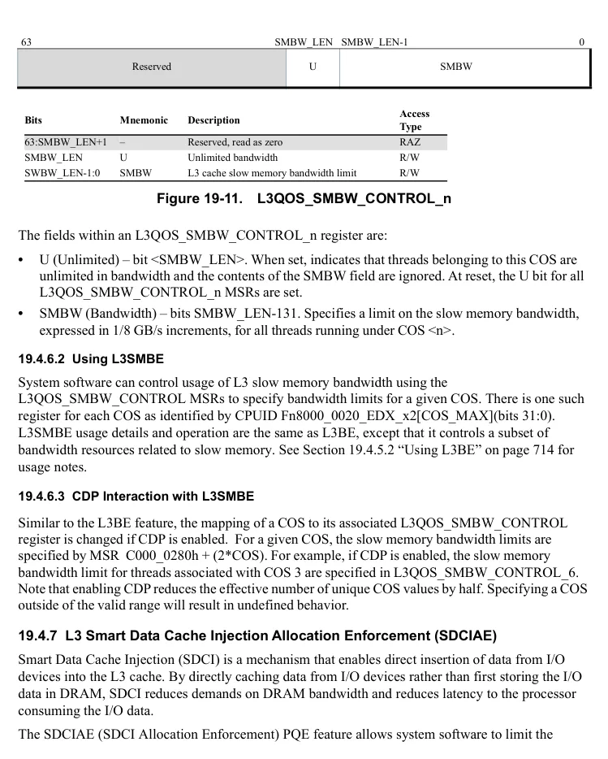

</details>


<!-- PDF source page: 779 | printed page: 717 -->

portion of the L3 cache used for SDCI.

When enabled, SDCIAE forces all SDCI lines to be placed into the L3 cache partitions identified by the highest-supported L3_MASK_n register as reported by CPUID Fn0000_0010_EDX_x1[MAX_COS](bits 15:0). For example, if MAX_COS=15, SDCI lines will be allocated into the L3 cache partitions determined by the bitmask in the L3_MASK_15 register.

Support for SDCIAE is indicated by CPUID Fn8000_0020_EBX_x0[SDCIAE](bit 6)=1.

SDCIAE is enabled by setting L3_QOS_EXT_CFG.SDCIAE_En=1 (see Figure 19-7 on page 707). When the state of SDCIAE_En is changed, it must be changed to the updated value on all logical processors in the QOS Domain.
