<!-- PDF source page: 780 | printed page: 718 -->

# Appendix A MSR Cross-Reference

This appendix lists the MSRs that are defined in the AMD64 architecture. The AMD64 architecture supports some of the same MSRs as previous versions of the x86 architecture and implementations thereof. Where possible, the AMD64 architecture supports the same MSRs, for the same functions, as these previous architectures and implementations.

The first section lists the MSRs according to their MSR address, and it gives a cross reference for additional information. The remaining sections list the MSRs by their functional group. Those sections also give a brief description of the register and specify the register reset value.

Some MSRs are implementation-specific For information about these MSRs, see the documentation for specific implementations of the AMD64 architecture.

## A.1 MSR Cross-Reference by MSR Address

Table A-1 lists the MSRs in the AMD64 architecture in order of MSR address.

**Table A-1. MSRs of the AMD64 Architecture**

| MSR Address | MSR Name | Functional Group | Cross-Reference |
| --- | --- | --- | --- |
| 0010h | TSC | Performance | “Time-Stamp Counter” on page 423 |
| 001Bh | APIC BASE | System Software | “Local APIC Enable” on page 629 |
| 0048h | SPEC CTRL | Speculation Control | “Speculation Control Registers” on page 66 |
| 0049h | PRED CMD | Speculation Control | “Speculation Control Registers” on page 66 |
| 00E7h | MPERF | Performance | “Determining Processor Effective Frequency” on page 667 |
| 00E8h | APERF | Performance | “Determining Processor Effective Frequency” on page 667 |
| 00FEh | MTRRcap | Memory Typing | “Identifying MTRR Features” on page 224 |
| 0174h | SYSENTER CS | System Software | “SYSENTER and SYSEXIT MSRs” on page 176 |
| 0175h | SYSENTER ESP | System Software |  |
| 0176h | SYSENTER EIP | System Software |  |
| 0179h | MCG CAP | Machine Check | “Machine-Check Global-Capabilities Register” on page 301 |
| 017Ah | MCG STATUS | Machine Check | “Machine-Check Global-Status Register” on page 302 |
| 017Bh | MCG CTL | Machine Check | “Machine-Check Global-Control Register” on page 303 |

Rendered source page 780 (figures/tables)

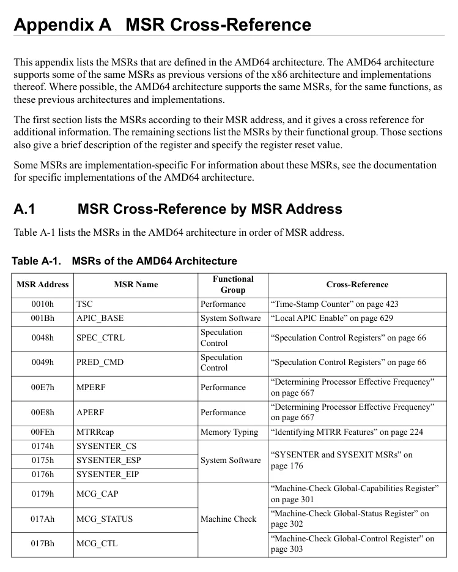

<!-- PDF source page: 781 | printed page: 719 -->

**Table A-1. MSRs of the AMD64 Architecture (continued)**

| MSR Address | MSR Name | Functional Group | Cross-Reference |
| --- | --- | --- | --- |
| 01D9h | DebugCtl | Software Debug | “Debug-Control MSR (DebugCtl)” on page 397 |
| 01DBh | LastBranchFromIP | Software Debug | “Control-Transfer Recording MSRs” on page 399 |
| 01DCh | LastBranchToIP | Software Debug |  |
| 01DDh | LastIntFromIP | Software Debug |  |
| 01DEh | LastIntToIP | Software Debug |  |
| 0200h | MTRRphysBase0 | Memory Typing | “Variable-Range MTRRs” on page 221 |
| 0201h | MTRRphysMask0 | Memory Typing |  |
| 0202h | MTRRphysBase1 | Memory Typing |  |
| 0203h | MTRRphysMask1 | Memory Typing |  |
| 0204h | MTRRphysBase2 | Memory Typing |  |
| 0205h | MTRRphysMask2 | Memory Typing |  |
| 0206h | MTRRphysBase3 | Memory Typing |  |
| 0207h | MTRRphysMask3 | Memory Typing |  |
| 0208h | MTRRphysBase4 | Memory Typing |  |
| 0209h | MTRRphysMask4 | Memory Typing |  |
| 020Ah | MTRRphysBase5 | Memory Typing |  |
| 020Bh | MTRRphysMask5 | Memory Typing |  |
| 020Ch | MTRRphysBase6 | Memory Typing |  |
| 020Dh | MTRRphysMask6 | Memory Typing |  |
| 020Eh | MTRRphysBase7 | Memory Typing |  |
| 020Fh | MTRRphysMask7 | Memory Typing |  |
| 0250h | MTRRfix64K 00000 | Memory Typing | “Fixed-Range MTRRs” on page 219 |
| 0258h | MTRRfix16K 80000 | Memory Typing |  |
| 0259h | MTRRfix16K A0000 | Memory Typing |  |
| 0268h | MTRRfix4K C0000 | Memory Typing |  |
| 0269h | MTRRfix4K C8000 | Memory Typing |  |
| 026Ah | MTRRfix4K D0000 | Memory Typing |  |
| 026Bh | MTRRfix4K D8000 | Memory Typing |  |
| 026Ch | MTRRfix4K E0000 | Memory Typing |  |
| 026Dh | MTRRfix4K E8000 | Memory Typing |  |
| 026Eh | MTRRfix4K F0000 | Memory Typing |  |
| 026Fh | MTRRfix4K F8000 | Memory Typing |  |
| 0277h | PAT | Memory Typing | “PAT Register” on page 227 |
| 02FFh | MTRRdefType | Memory Typing | “Default-Range MTRRs” on page 223 |

Rendered source page 781 (figures/tables)

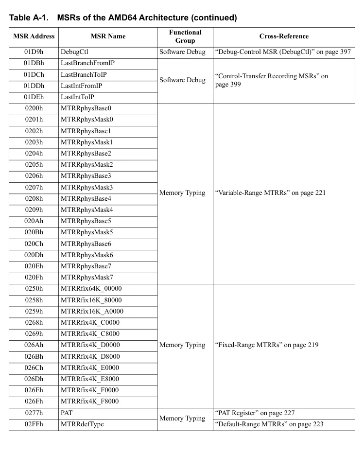

<!-- PDF source page: 782 | printed page: 720 -->

**Table A-1. MSRs of the AMD64 Architecture (continued)**

| MSR Address | MSR Name | Functional Group | Cross-Reference |
| --- | --- | --- | --- |
| 0400h | MC0 CTL | Machine Check | See the documentation for particular implementations of the architecture. |
| 0404h | MC1 CTL | Machine Check |  |
| 0408h | MC2 CTL | Machine Check |  |
| 040Ch | MC3 CTL | Machine Check |  |
| 0410h | MC4 CTL | Machine Check |  |
| 0414h | MC5 CTL | Machine Check |  |
| 0401h | MC0 STATUS | Machine Check | “Machine-Check Status Registers” on page 308 |
| 0405h | MC1 STATUS | Machine Check |  |
| 0409h | MC2 STATUS | Machine Check |  |
| 040Dh | MC3 STATUS | Machine Check |  |
| 0411h | MC4 STATUS | Machine Check |  |
| 0415h | MC5 STATUS | Machine Check |  |
| 0402h | MC0 ADDR | Machine Check | “Machine-Check Address Registers” on page 311 |
| 0406h | MC1 ADDR | Machine Check |  |
| 040Ah | MC2 ADDR | Machine Check |  |
| 040Eh | MC3 ADDR | Machine Check |  |
| 0412h | MC4 ADDR | Machine Check |  |
| 0416h | MC5 ADDR | Machine Check |  |
| 0403h | MC0 MISC | Machine Check | “Machine-Check Miscellaneous-Error Information Register 0 (MCi MISC0)” on page 311 |
| 0407h | MC1 MISC | Machine Check |  |
| 040Bh | MC2 MISC | Machine Check |  |
| 040Fh | MC3 MISC | Machine Check |  |
| 0413h | MC4 MISC | Machine Check |  |
| 0417h | MC5 MISC | Machine Check |  |
| 06A0h | U CET | Shadow Stack | “Shadow Stack MSRs” on page 735 |
| 06A2h | S CET | Shadow Stack |  |
| 06A4h | PL0 SSP | Shadow Stack |  |
| 06A5h | PL1 SSP | Shadow Stack |  |
| 06A6h | PL2 SSP | Shadow Stack |  |
| 06A7h | PL3 SSP | Shadow Stack |  |
| 06A8h | ISST ADDR | Shadow Stack |  |

Rendered source page 782 (figures/tables)

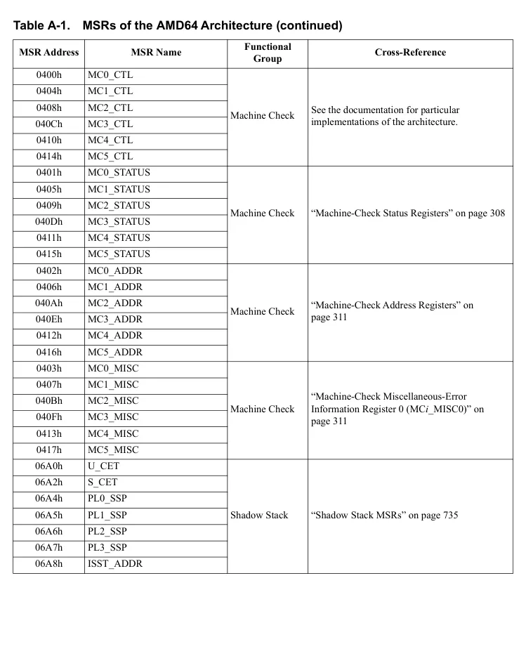

<!-- PDF source page: 783 | printed page: 721 -->

**Table A-1. MSRs of the AMD64 Architecture (continued)**

| MSR Address | MSR Name | Functional Group | Cross-Reference |
| --- | --- | --- | --- |
| 0C81h | L3 QOS CFG1 _ _ | Quality of Service | “Platform Quality of Service (PQOS) Extension” on page 692 |
| 0C8Dh | QM EVTSEL | Quality of Service |  |
| 0C8Eh | QM CTR | Quality of Service |  |
| 0C8Fh | PQR ASSOC | Quality of Service |  |
| 0C90h | L3 MASK 0 _ _ | Quality of Service |  |
| 0C90+n | L3 MASK+n | Quality of Service |  |
| 0DA0h | XSS | - | XSAVES and XSTRORS instructions in APM volume 4 |
| C000 0080h | EFER | System Software | “Extended Feature Enable Register (EFER)” on page 55 |
| C000 0081h | STAR | System Software | “SYSCALL and SYSRET MSRs” on page 175 |
| C000 0082h | LSTAR | System Software |  |
| C000 0083h | CSTAR | System Software |  |
| C000 0084h | SF MASK | System Software |  |
| C000 00E7h | MPerfReadOnly | Performance | “MPERF Read-only (MperfReadOnly)” on page 669 |
| C000 00E8h | APerfReadOnly | Performance | “APERF Read-only (AperfReadOnly)” on page 669 |
| C000 00E9h | IRPerfCount | Performance | “Instructions Retired Performance counter” on page 421 |
| C000 0100h | FS.Base | System Software | “FS and GS Registers in 64-Bit Mode” on page 80 |
| C000 0101h | GS.Base | System Software |  |
| C000 0102h | KernelGSbase | System Software | “SWAPGS Instruction” on page 176 |
| C000 0103h | TSC AUX | System Software | “RDTSCP Instruction” on page 179 |
| C000 0104h | TSC Ratio | SVM | “TSC Ratio MSR (C000 0104h)” on page 585 |
| C000 0108h | PrefetchControl | — | Controls enabling / disabling hardware prefetchers. See the appropriate BIOS and Kernel Developer’s Guide or Processor Programming Reference Manual for details. |
| C000 010Eh | LastBranchStackSelect | Software Debug | “Last Branch Record Stack” on page 410 |
| C000 010Fh | DebugExtnCtl | Software Debug | “Debug-Extension-Control MSR (DebugExtnCtl)” on page 399 |
| C000 0200h | L3QOS BW CONTROL 0 _ _ _ | Quality of Service | “Platform Quality of Service (PQOS) Extension” on page 692 |
| C000 0200h+n | L3QOS BW CONTROL n _ _ _ | Quality of Service |  |
| C000 0280h | L3QOS SMBW CONTROL 0 _ _ _ | Quality of Service |  |
| C000 0280h+n | L3QOS SMBW CONTROL n _ _ _ | Quality of Service |  |
| C000 0300h | PerfCntrGlobalStatus | Performance | “Core Performance Counter Status Registers” on page 417 |

Rendered source page 783 (figures/tables)

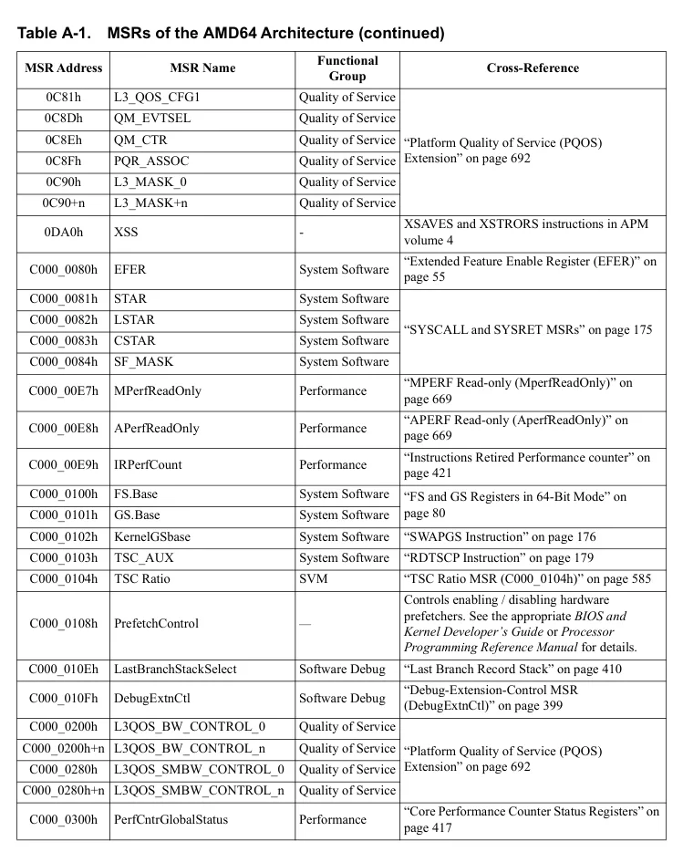

<!-- PDF source page: 784 | printed page: 722 -->

**Table A-1. MSRs of the AMD64 Architecture (continued)**

| MSR Address | MSR Name | Functional Group | Cross-Reference |
| --- | --- | --- | --- |
| C000 0301h | PerfCntrGobalCtl | Performance | “Core Performance Global Control Register” on page 416 |
| C000 0302h | PerfCntrGlobalStatusCl | Performance | “Performance Counter Global Status Clear Register” on page 419 |
| C000 0303h | PerfCntrGlobalStatusSet | Performance | “Performance Counter Global Status Set Register” on page 418 |
| C000 03FDh | L3 QOS ABMC CFG _ _ _ | Quality of Service | “Platform Quality of Service (PQOS) Extension” on page 692 |
| C000 03FEh | L3 QOS ABMC DSC _ _ _ | Quality of Service |  |
| C000 03FEh | L3 QOS EXT CFG _ _ _ | Quality of Service |  |
| C000 0400h | L3 EVT CFG 0 _ _ _ | Quality of Service |  |
| C000 0401h | L3 EVT CFG 1 _ _ _ | Quality of Service |  |
| C000 0408h | MC4 MISC1 | Machine Check | “Machine-Check Miscellaneous-Error Information Register 0 (MCi MISC0)” on page 311 |
| C000 0409h | MC4 MISC2 | Machine Check |  |
| C000 040Ah | MC4 MISC3 | Machine Check |  |
| C000 0410h | MCA INTR CFG _ _ | Machine Check | MCA related interrupt configuration. See the appropriate BIOS and Kernel Developer’s Guide or Processor Programming Reference Manual for details. |
| C000 2000h + i*10h | MCA CTL | Machine Check | See the documentation for particular implementations of the architecture. |
| C000 2001h + i*10h | MCA STATUS | Machine Check | “Machine-Check Status Registers” on page 308 |
| C000 2002h + i*10h | MCA ADDR | Machine Check | “Machine-Check Address Registers” on page 311 |
| C000 2003h + i*10h | MCA MISC0 | Machine Check | “Machine-Check Miscellaneous-Error Information Register 0 (MCi MISC0)” on page 311 |
| C000 2004h + i*10h | MCA CONFIG | Machine Check | “MCA Configuration Register” on page 315 |
| C000 2005h + i*10h | MCA IPID | Machine Check | “MCA IP Identification” on page 317 |
| C000 2006h + i*10h | MCA SYND | Machine Check | “MCA Syndrome Register” on page 318 |

Rendered source page 784 (figures/tables)

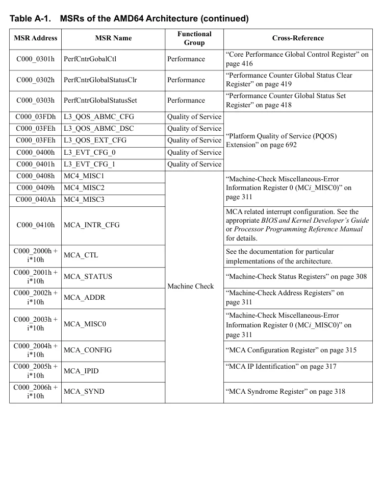

<!-- PDF source page: 785 | printed page: 723 -->

**Table A-1. MSRs of the AMD64 Architecture (continued)**

| MSR Address | MSR Name | Functional Group | Cross-Reference |
| --- | --- | --- | --- |
| C000 2008h + i*10h | MCA DESTAT | Machine Check | “MCA Deferred Error Status Register” on page 318 |
| C000 2009h + i*10h | MCA DEADDR | Machine Check | “MCA Deferred Error Address Register” on page 319 |
| (C000 200Ah : C000 200Dh) + i*10h | MCA MISC[4-1] | Machine Check | “MCA Miscellaneous Registers 1 - 4” on page 319 |
| (C000 200Eh : C000 200Fh)+ i*10h | MCA SYND[2-1] | Machine Check | “MCA Syndrome Registers 1 - 2” on page 319 |
| C001 0000h | PerfEvtSel0 | Performance | “Core Performance Event-Select Registers” on page 413 |
| C001 0001h | PerfEvtSel1 | Performance |  |
| C001 0002h | PerfEvtSel2 | Performance |  |
| C001 0003h | PerfEvtSel3 | Performance |  |
| C001 0004h | PerfCtr0 | Performance | “Performance Counter MSRs” on page 411 |
| C001 0005h | PerfCtr1 | Performance |  |
| C001 0006h | PerfCtr2 | Performance |  |
| C001 0007h | PerfCtr3 | Performance |  |
| C001 0010h | SYSCFG | Memory Typing | “System Configuration Register (SYSCFG)” on page 60 |
| C001 0015h | HWCR | System Software | “Hardware Configuration Register (HWCR)” on page 71 |
| C001 0016h | IORRBase0 | Memory Typing | “IORRs” on page 234 |
| C001 0017h | IORRMask0 | Memory Typing |  |
| C001 0018h | IORRBase1 | Memory Typing |  |
| C001 0019h | IORRMask1 | Memory Typing |  |
| C001 001Ah | TOP MEM | Memory Typing | “Top of Memory” on page 236 |
| C001 001Dh | TOP MEM2 | Memory Typing |  |
| C001 0030h | Processor Name String _ _ | CPUID Name | See the appropriate BIOS and Kernel Developer’s Guide or Processor Programming Reference Manual for details. |
| C001 0031h | Processor Name String _ _ | CPUID Name |  |
| C001 0032h | Processor Name String _ _ | CPUID Name |  |
| C001 0033h | Processor Name String _ _ | CPUID Name |  |
| C001 0034h | Processor Name String _ _ | CPUID Name |  |
| C001 0035h | Processor Name String _ _ | CPUID Name |  |
| C001 0056h | SMI Trigger IO Cycle _ _ _ | SMM | See the appropriate BIOS and Kernel Developer’s Guide or Processor Programming Reference Manual for details. |

Rendered source page 785 (figures/tables)

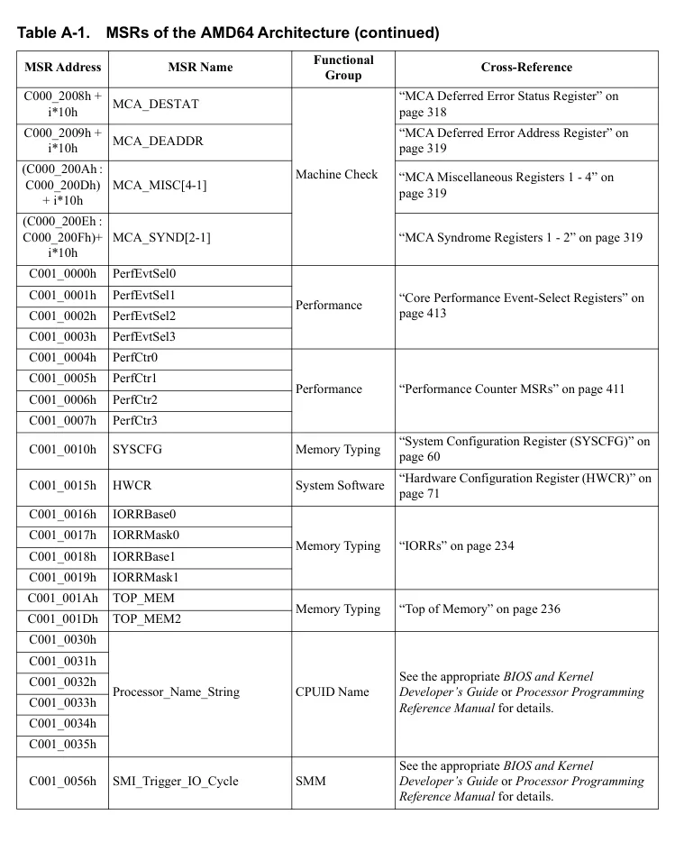

<!-- PDF source page: 786 | printed page: 724 -->

**Table A-1. MSRs of the AMD64 Architecture (continued)**

| MSR Address | MSR Name | Functional Group | Cross-Reference |
| --- | --- | --- | --- |
| C001 0061h | P-State Current Limit | SMM | “Hardware Performance Monitoring and Control” on page 664 |
| C001 0062h | P-State Control | SMM |  |
| C001 0063h | P-State Status | SMM |  |
| C001 0074h | CPU Watchdog Timer _ _ | Machine Check | “CPU Watchdog Timer Register” on page 304 |
| C001 0104h | TSC Ratio | SVM | “TSC Ratio MSR (C000 0104h)” on page 585 |
| C001 0111h | SMBASE | SMM | “SMBASE Register” on page 326 |
| C001 0112h | SMM ADDR | SMM | “SMRAM Protected Areas” on page 332 |
| C001 0113h | SMM MASK | SMM |  |
| C001 0114h | VM CR | SVM | “SVM Related MSRs” on page 583 |
| C001 0115h | IGNNE | SVM | “SVM Related MSRs” on page 583 |
| C001 0116h | SMM CTL | SVM | “SVM Related MSRs” on page 583 |
| C001 0117h | VM HSAVE PA _ _ | SVM | “SVM Related MSRs” on page 583 |
| C001 0118h | SVM KEY | SVM | “SVM-Lock” on page 586 |
| C001 0119h | SMM KEY | SMM | “SMM-Lock” on page 587 |
| C001 011Ah | Local SMI Status _ _ | SMM | See the appropriate BIOS and Kernel Developer’s Guide or Processor Programming Reference Manual for details. |
| C001 011Bh | Doorbell Registe | SVM | “Doorbell Register” on page 579 |
| C001 011Eh | VMPAGE FLUSH | SVM | “Secure Encrypted Virtualization” on page 588 |
| C001 011Fh | VIRT SPEC CTRL _ _ | Speculation Control | “Speculation Control Registers” on page 66 |
| C001 0130h | GHCB | SVM | “GHCB” on page 599 |
| C001 0131h | SEV STATUS | SVM | “SEV STATUS MSR” on page 593 |
| C001 0132h | RMP BASE | SVM | “Initializing the RMP” on page 604 |
| C001 0133h | RMP END | SVM | “Initializing the RMP” on page 604 |
| C001 0134h | GUEST TSC FREQ _ _ | SVM | “Secure TSC” on page 616 |
| C001 0135h | VIRTUAL TOM | SVM | “Virtual Top-of-Memory” on page 607 |
| C001 0136h | SEGMENTED RMP CFG _ _ | SVM | “Segmented RMP” on page 621 |
| C001 0137h | IDLE WAKEUP ICR _ _ | SVM | “Side-Channel Protection” on page 615 |
| C001 0138h | SECURE AVIC CTRL _ _ | SVM | “Secure AVIC Control MSR” on page 619 |
| C001 0140h | OSVW ID Length _ _ | OSVW | “OS-Visible Workarounds” on page 765 |
| C001 0141h | OSVW Status | OSVW |  |

Rendered source page 786 (figures/tables)

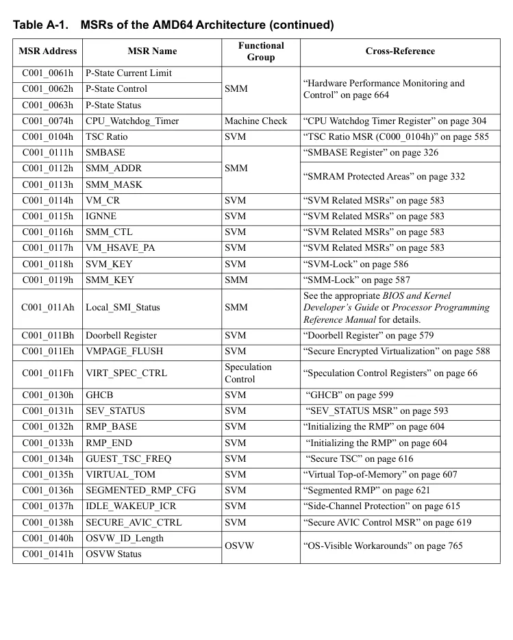

<!-- PDF source page: 787 | printed page: 725 -->

**Table A-1. MSRs of the AMD64 Architecture (continued)**

| MSR Address | MSR Name | Functional Group | Cross-Reference |
| --- | --- | --- | --- |
| C001 0200h | PerfEvtSel0 | Performance | “Core Performance Event-Select Registers” on page 413 |
| C001 0202h | PerfEvtSel1 | Performance |  |
| C001 0204h | PerfEvtSel2 | Performance |  |
| C001 0206h | PerfEvtSel3 | Performance |  |
| C001 0208h | PerfEvtSel4 | Performance |  |
| C001 020Ah | PerfEvtSel5 | Performance |  |
| C001 0201h | PerfCtr0 | Performance | “Performance Counter MSRs” on page 411 |
| C001 0203h | PerfCtr1 | Performance |  |
| C001 0205h | PerfCtr2 | Performance |  |
| C001 0207h | PerfCtr3 | Performance |  |
| C001 0209h | PerfCtr4 | Performance |  |
| C001 020Bh | PerfCtr5 | Performance |  |
| C001 0230h | L2I PerfEvtSel0 | Performance | “Performance-Monitoring MSRs” on page 731 |
| C001 0232h | L2I PerfEvtSel1 | Performance |  |
| C001 0234h | L2I PerfEvtSel2 | Performance |  |
| C001 0236h | L2I PerfEvtSel3 | Performance |  |
| C001 0231h | L2I PerfCtr0 | Performance |  |
| C001 0233h | L2I PerfCtr1 | Performance |  |
| C001 0235h | L2I PerfCtr2 | Performance |  |
| C001 0237h | L2I PerfCtr3 | Performance |  |
| C001 0240h | NB PerfEvtSel0 | Performance |  |
| C001 0242h | NB PerfEvtSel1 | Performance |  |
| C001 0244h | NB PerfEvtSel2 | Performance |  |
| C001 0246h | NB PerfEvtSel3 | Performance |  |
| C001 0241h | NB PerfCtr0 | Performance |  |
| C001 0243h | NB PerfCtr1 | Performance |  |
| C001 0245h | NB PerfCtr2 | Performance |  |
| C001 0247h | NB PerfCtr3 | Performance |  |
| C001 02B0h | CPPC CAPABILITY 1 _ _ | CPPC | “Collaborative Processor Performance Control” on page 671 |
| C001 02B1h | CPPC ENABLE | CPPC |  |
| C001 02B2h | CPPC CAPABILITY 2 _ _ | CPPC |  |
| C001 02B3h | CPPC REQUEST | CPPC |  |
| C001 02B4h | CPPC STATUS | CPPC |  |

Rendered source page 787 (figures/tables)

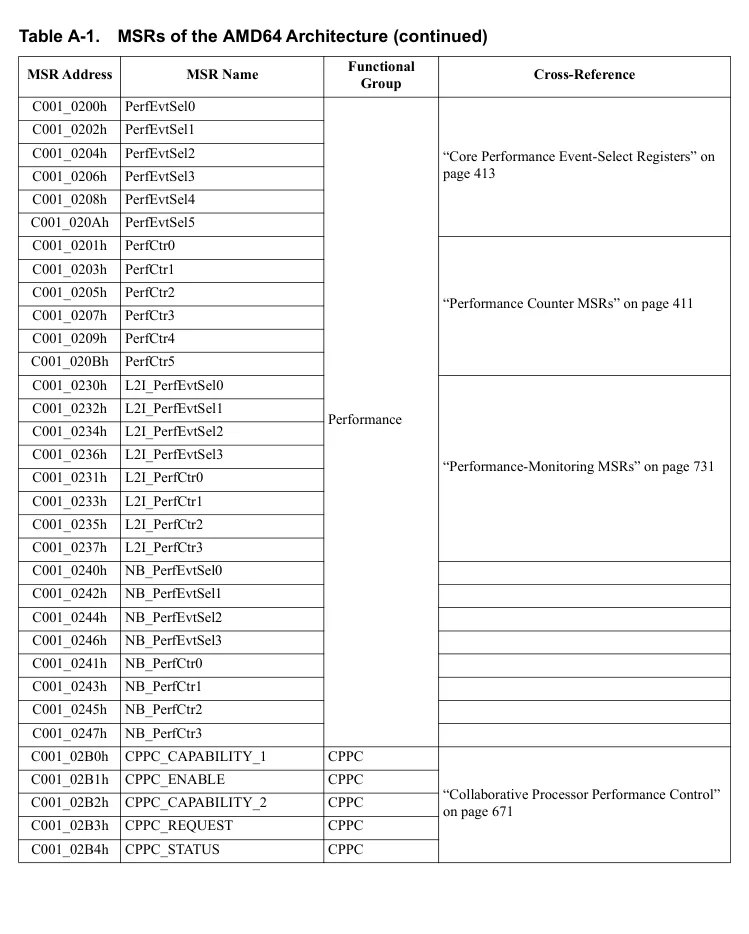

<!-- PDF source page: 788 | printed page: 726 -->

**Table A-1. MSRs of the AMD64 Architecture (continued)**

| MSR Address | MSR Name | Functional Group | Cross-Reference |
| --- | --- | --- | --- |
| C001 0300 + i*2h | LastBranchStackFromIp | Software Debug | “Control-Transfer Recording MSRs” on page 399 |
| C001 0301 + i*2h | LastBranchStackToIp | Software Debug |  |
| C001 1019h | DR1 ADDR MASK _ _ | Software Debug | “Debug Breakpoint Address Masking” on page 410 |
| C001 101Ah | DR2 ADDR MASK _ _ | Software Debug |  |
| C001 101Bh | DR3 ADDR MASK _ _ | Software Debug |  |
| C001 1027h | DR0 ADDR MASK _ _ | Software Debug |  |
| C001 1095h | L3RangeReserveBaseAdd | Memory Caches | “L3 Cache Range Reservation” on page 213 |
| C001 1096h | L3RangeReserveMaxAdd | Memory Caches |  |
| C001 109Ah | L3RangeReserveWayMask | Memory Caches |  |

## A.2 System-Software MSRs

Table A-2 lists the MSRs defined for general use by system software in controlling long mode and in allowing fast control transfers between applications and the operating system.

**Table A-2. System-Software MSR Cross-Reference**

| MSR Address | MSR Name | Description | Reset Value |
| --- | --- | --- | --- |
| 0000 001Bh | APIC BASE | See the appropriate BIOS and Kernel Developer’s Guide or Processor Programming Reference Manual for details. | 0000 0000 FEE0 0x00h _ _ _ |
| C000 0080h | EFER | Contains control bits that enable extended features supported by the processor, including long mode. | 0000 0000 0000 0000h _ _ _ |
| C000 0081h | STAR | In legacy mode, used to specify the target address of a SYSCALL instruction, as well as the CS and SS selectors of the called and returned procedures. | undefined |
| C000 0082h | LSTAR | In 64-bit mode, used to specify the target RIP of a SYSCALL instruction. | undefined |
| C000 0083h | CSTAR | In compatibility mode, used to specify the target RIP of a SYSCALL instruction. | undefined |
| C000 0084h | SF MASK | SYSCALL Flags Mask | undefined |
| C000 0100h | FS.Base | Contains the 64-bit base address in the hidden portion of the FS register (the base address from the FS descriptor). | 0000 0000 0000 0000h _ _ _ |
| C000 0101h | GS.Base | Contains the 64-bit base address in the hidden portion of the GS register (the base address from the GS descriptor). | 0000 0000 0000 0000h _ _ _ |

Rendered source page 788 (figures/tables)

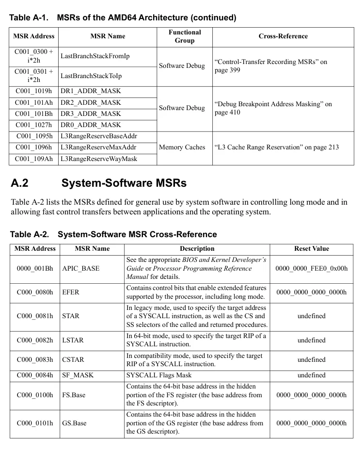

<!-- PDF source page: 789 | printed page: 727 -->

**Table A-2. System-Software MSR Cross-Reference (continued)**

| MSR Address | MSR Name | Description | Reset Value |
| --- | --- | --- | --- |
| C000 0102h | KernelGSbase | The SWAPGS instruction exchanges the value in KernelGSbase with the value in GS.base, providing a fast method for system software to load a pointer to system data-structures. | undefined |
| C000 0103h | TSC AUX | The RDTSCP instruction copies the value of this MSR into the ECX register. | 0000 0000 0000 0000h _ _ _ |
| C000 0104h | TSC RATIO | Specifies the TSCRatio value which is used to scale the TSC value read by a Guest. | 0000 0001 0000 0000h _ _ _ |
| 0174h | SYSENTER CS | In legacy mode, used to specify the CS selector of the procedure called by SYSENTER. | undefined |
| 0175h | SYSENTER ESP | In legacy mode, used to specify the stack pointer for the procedure called by SYSENTER. | undefined |
| 0176h | SYSENTER EIP | In legacy mode, used to specify the EIP of the procedure called by SYSENTER. | undefined |

## A.3 Memory-Typing MSRs

Table A-3 lists the MSRs used to control memory-typing and the page-attribute-table mechanism.

**Table A-3. Memory-Typing MSR Cross-Reference**

| MSR Address | MSR Name | Description | Reset Value |
| --- | --- | --- | --- |
| 00FEh | MTRRcap | A read-only register containing information describing the level of MTRR support provided by the processor. | 0000 0000 0000 0508h _ _ _ |
| 0200h | MTRRphysBase0 | Specifies the memory-range base address in physical-address space of a variable-range memory region. These registers also specify the memory type used for the memory region. | undefined |
| 0202h | MTRRphysBase1 | Specifies the memory-range base address in physical-address space of a variable-range memory region. These registers also specify the memory type used for the memory region. |  |
| 0204h | MTRRphysBase2 | Specifies the memory-range base address in physical-address space of a variable-range memory region. These registers also specify the memory type used for the memory region. |  |
| 0206h | MTRRphysBase3 | Specifies the memory-range base address in physical-address space of a variable-range memory region. These registers also specify the memory type used for the memory region. |  |
| 0208h | MTRRphysBase4 | Specifies the memory-range base address in physical-address space of a variable-range memory region. These registers also specify the memory type used for the memory region. |  |
| 020Ah | MTRRphysBase5 | Specifies the memory-range base address in physical-address space of a variable-range memory region. These registers also specify the memory type used for the memory region. |  |
| 020Ch | MTRRphysBase6 | Specifies the memory-range base address in physical-address space of a variable-range memory region. These registers also specify the memory type used for the memory region. |  |
| 020Eh | MTRRphysBase7 | Specifies the memory-range base address in physical-address space of a variable-range memory region. These registers also specify the memory type used for the memory region. |  |

Rendered source page 789 (figures/tables)

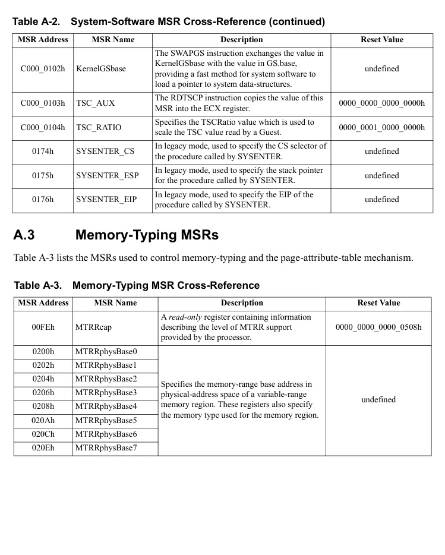

<!-- PDF source page: 790 | printed page: 728 -->

**Table A-3. Memory-Typing MSR Cross-Reference (continued)**

| MSR Address | MSR Name | Description | Reset Value |
| --- | --- | --- | --- |
| 0201h | MTRRphysMask0 | Specifies the size of a variable-range memory region. | Valid (bit 11) = 0 All Other Bits Undefined |
| 0203h | MTRRphysMask1 | Specifies the size of a variable-range memory region. |  |
| 0205h | MTRRphysMask2 | Specifies the size of a variable-range memory region. |  |
| 0207h | MTRRphysMask3 | Specifies the size of a variable-range memory region. |  |
| 0209h | MTRRphysMask4 | Specifies the size of a variable-range memory region. |  |
| 020Bh | MTRRphysMask5 | Specifies the size of a variable-range memory region. |  |
| 020Dh | MTRRphysMask6 | Specifies the size of a variable-range memory region. |  |
| 020Fh | MTRRphysMask7 | Specifies the size of a variable-range memory region. |  |
| 0250h | MTRRfix64K 00000 | Fixed-range MTRRs used to characterize the first 1 Mbyte of physical memory. Each 64-bit register contains eight type fields for characterizing a total of eight memory ranges. • MTRRfix64K n characterizes 64 Kbyte ranges. • MTRRfix16K n characterizes 16 Kbyte ranges. • MTRRfix4K n characterizes 4 Kbyte ranges. | undefined |
| 0258h | MTRRfix16K 80000 | Fixed-range MTRRs used to characterize the first 1 Mbyte of physical memory. Each 64-bit register contains eight type fields for characterizing a total of eight memory ranges. • MTRRfix64K n characterizes 64 Kbyte ranges. • MTRRfix16K n characterizes 16 Kbyte ranges. • MTRRfix4K n characterizes 4 Kbyte ranges. |  |
| 0259h | MTRRfix16K A0000 | Fixed-range MTRRs used to characterize the first 1 Mbyte of physical memory. Each 64-bit register contains eight type fields for characterizing a total of eight memory ranges. • MTRRfix64K n characterizes 64 Kbyte ranges. • MTRRfix16K n characterizes 16 Kbyte ranges. • MTRRfix4K n characterizes 4 Kbyte ranges. |  |
| 0268h | MTRRfix4K C0000 | Fixed-range MTRRs used to characterize the first 1 Mbyte of physical memory. Each 64-bit register contains eight type fields for characterizing a total of eight memory ranges. • MTRRfix64K n characterizes 64 Kbyte ranges. • MTRRfix16K n characterizes 16 Kbyte ranges. • MTRRfix4K n characterizes 4 Kbyte ranges. |  |
| 0269h | MTRRfix4K C8000 | Fixed-range MTRRs used to characterize the first 1 Mbyte of physical memory. Each 64-bit register contains eight type fields for characterizing a total of eight memory ranges. • MTRRfix64K n characterizes 64 Kbyte ranges. • MTRRfix16K n characterizes 16 Kbyte ranges. • MTRRfix4K n characterizes 4 Kbyte ranges. |  |
| 026Ah | MTRRfix4K D0000 | Fixed-range MTRRs used to characterize the first 1 Mbyte of physical memory. Each 64-bit register contains eight type fields for characterizing a total of eight memory ranges. • MTRRfix64K n characterizes 64 Kbyte ranges. • MTRRfix16K n characterizes 16 Kbyte ranges. • MTRRfix4K n characterizes 4 Kbyte ranges. |  |
| 026Bh | MTRRfix4K D8000 | Fixed-range MTRRs used to characterize the first 1 Mbyte of physical memory. Each 64-bit register contains eight type fields for characterizing a total of eight memory ranges. • MTRRfix64K n characterizes 64 Kbyte ranges. • MTRRfix16K n characterizes 16 Kbyte ranges. • MTRRfix4K n characterizes 4 Kbyte ranges. |  |
| 026Ch | MTRRfix4K E0000 | Fixed-range MTRRs used to characterize the first 1 Mbyte of physical memory. Each 64-bit register contains eight type fields for characterizing a total of eight memory ranges. • MTRRfix64K n characterizes 64 Kbyte ranges. • MTRRfix16K n characterizes 16 Kbyte ranges. • MTRRfix4K n characterizes 4 Kbyte ranges. |  |
| 026Dh | MTRRfix4K E8000 | Fixed-range MTRRs used to characterize the first 1 Mbyte of physical memory. Each 64-bit register contains eight type fields for characterizing a total of eight memory ranges. • MTRRfix64K n characterizes 64 Kbyte ranges. • MTRRfix16K n characterizes 16 Kbyte ranges. • MTRRfix4K n characterizes 4 Kbyte ranges. |  |
| 026Eh | MTRRfix4K F0000 | Fixed-range MTRRs used to characterize the first 1 Mbyte of physical memory. Each 64-bit register contains eight type fields for characterizing a total of eight memory ranges. • MTRRfix64K n characterizes 64 Kbyte ranges. • MTRRfix16K n characterizes 16 Kbyte ranges. • MTRRfix4K n characterizes 4 Kbyte ranges. |  |
| 026Fh | MTRRfix4K F8000 | Fixed-range MTRRs used to characterize the first 1 Mbyte of physical memory. Each 64-bit register contains eight type fields for characterizing a total of eight memory ranges. • MTRRfix64K n characterizes 64 Kbyte ranges. • MTRRfix16K n characterizes 16 Kbyte ranges. • MTRRfix4K n characterizes 4 Kbyte ranges. |  |
| 0277h | PAT | Used to extend the page-table entry format, allowing memory-type characterization on a physical-page basis. | 0007 0406 0007 0406h _ _ _ |
| 02FFh | MTRRdefType | Sets the default memory-type for physical addresses not within ranges established by fixed-range and variable-range MTRRs. | 0000 0000 0000 0000h _ _ _ |
| C001 0010h | SYSCFG | Contains control bits for enabling and configuring system bus features. | 0000 0000 0002 0601h _ _ _ |
| C001 0016h | IORRBase0 | Specifies the memory-range base address in physical-address space of a variable-range I/O region. | undefined |
| C001 0018h | IORRBase1 | Specifies the memory-range base address in physical-address space of a variable-range I/O region. |  |
| C001 0017h | IORRMask0 | Specifies the size of a variable-range I/O region. | Valid (bit 11) = 0 All Other Bits Undefined |
| C001 0019h | IORRMask1 | Specifies the size of a variable-range I/O region. |  |
| C001 001Ah | TOP MEM | Sets the boundary between system memory and memory-mapped I/O for addresses below 4 Gbytes. | 0000 0000 0400 0000h _ _ _ |
| C001 001Dh | TOP MEM2 | Sets the boundary between system memory and memory-mapped I/O for addresses above 4 Gbytes. | undefined |

Rendered source page 790 (figures/tables)

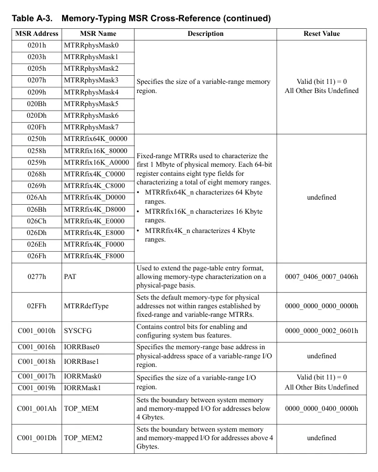

<!-- PDF source page: 791 | printed page: 729 -->

## A.4 Machine-Check MSRs

Table A-4 lists the MSRs used in support of the machine-check mechanism.

**Table A-4. Machine-Check MSR Cross-Reference**

| MSR Address | MSR Name | Description | Reset Value |
| --- | --- | --- | --- |
| 0179h | MCG CAP | A read-only register that specifies the machine-check mechanism capabilities supported by the processor. | 0000 0000 0000 010xh _ _ _ |
| 017Ah | MCG STATUS | Provides basic information about the processor state immediately after the occurrence of a machine-check error. | undefined |
| 017Bh | MCG CTL | Controls global reporting of machine-check errors from various sources. | 0000 0000 0000 0000h _ _ _ |
| 0400h + 4i for 0 <=i <=31 | MCi CTL | Control for error reporting banks, per implementation. | 0000 0000 0000 0000h _ _ _ |
| 0401h + 4i | MCi STATUS[5:0] | Status registers for each error-reporting register bank, used to report machine-check error information for the specified register bank. | undefined |
| 0402h + 4i | MCi ADDR[5:0] | Reports the instruction memory-address or data memory-address responsible for the machine-check error for the specified register bank. | undefined |
| 0403h + 4i | MCi MISC[5:0] | Reports miscellaneous information about the machine-check error for the specified register bank. | c00x xxxx xx00 0000 _ _ _ |
| C000 0408h | MC4 MISC1 | Reports miscellaneous information about the machine-check error for the specified register bank. | c00x xxxx 0000 0000 _ _ _ |
| C000 0409h | MC4 MISC2 | Reports miscellaneous information about the machine-check error for the specified register bank. |  |
| C000 040Ah | MC4 MISC3 | Reports miscellaneous information about the machine-check error for the specified register bank. |  |
| C000 0410h | MCA INTR CFG _ _ | MCA interrupt configuration. | 0000 0000 0000 0000h _ _ _ |
| C000 2000h + i*10h | MCA CTL | Control for error reporting banks per implementation. | 0000 0000 0000 0000h _ _ _ |
| C000 2001h + i*10h | MCA STATUS | Status registers for each error-reporting register bank, used to report machine-check error information for the specified register bank. | undefined |
| C000 2002h + i*10h | MCA ADDR | Reports the instruction memory-address or data memory-address responsible for the machine-check error for the specified register bank. | undefined |
| C000 2003h + i*10h | MCA MISC0 | Reports miscellaneous information about the machine-check error for the specified register bank. | c00x xxxx xx00 0000 _ _ _ |

Rendered source page 791 (figures/tables)

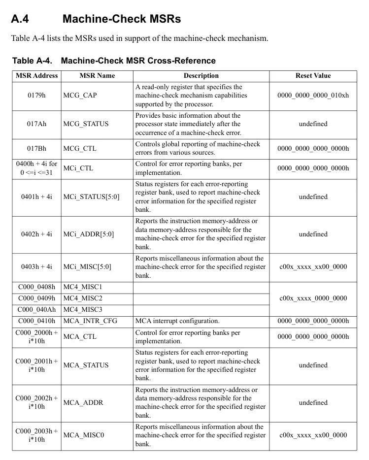

<!-- PDF source page: 792 | printed page: 730 -->

**Table A-4. Machine-Check MSR Cross-Reference (continued)**

| MSR Address | MSR Name | Description | Reset Value |
| --- | --- | --- | --- |
| C000 2004h + i*10h | MCA CONFIG | Controls configuration information of each MCA bank. | See the appropriate BIOS and Kernel Developer’s Guide or Processor Programming Reference Manual. |
| C000 2005h + i*10h | MCA IPID | Holds information to identify the MCA bank type. | See the appropriate BIOS and Kernel Developer’s Guide or Processor Programming Reference Manual. |
| C000 2006h + i*10h | MCA SYND | Holds syndrome associated with the error. | See the appropriate BIOS and Kernel Developer’s Guide or Processor Programming Reference Manual. |
| C000 2008h + i*10h | MCA DESTAT | Holds status information for deferred errors. | See the appropriate BIOS and Kernel Developer’s Guide or Processor Programming Reference Manual. |
| C000 2009h + i*10h | MCA DEADDR | Provides the address associated with the deferred error. | See the appropriate BIOS and Kernel Developer’s Guide or Processor Programming Reference Manual. |
| (C000 200Ah: C000 200Dh) + i*10h | MCA MISC[4:1] | Reports miscellaneous-error information. | See the appropriate BIOS and Kernel Developer’s Guide or Processor Programming Reference Manual. |
| (C000 200Eh: C000 200Fh) + i*10h | MCA SYND[2:1] | Stores information associated with the error in MCA STATUS or MCA DESTAT. _ _ | See the appropriate BIOS and Kernel Developer’s Guide or Processor Programming Reference Manual. |
| i - indicates the register bank numbe | MCA SYND[2:1] | Stores information associated with the error in MCA STATUS or MCA DESTAT. _ _ |  |

## A.5 Software-Debug MSRs

Table A-5 lists the MSRs used in support of the software-debug architecture.

Rendered source page 792 (figures/tables)

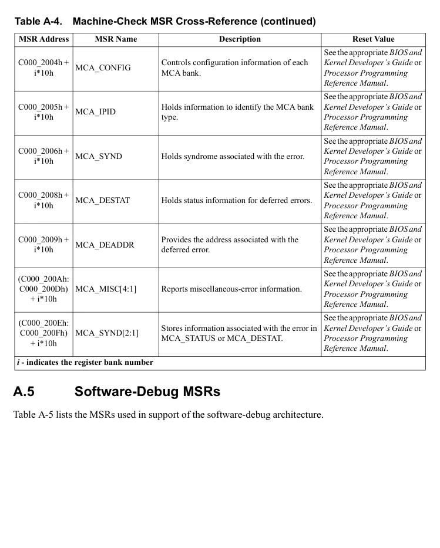

<!-- PDF source page: 793 | printed page: 731 -->

**Table A-5. Software-Debug MSR Cross-Reference**

| MSR Address | MSR Name | Description | Reset Value |
| --- | --- | --- | --- |
| 01D9h | DebugCtl | Provides debug controls for control-transfer recording and control-transfer single stepping, and external-breakpoint reporting and trace messages. | 0000 0000 0000 0000h _ _ _ |
| 01DBh | LastBranchFromIP | During control-transfer recording, this register is loaded with the segment offset of the control-transfer source. | undefined |
| 01DCh | LastBranchToIP | During control-transfer recording, this register is loaded with the segment offset of the control-transfer target. | undefined |
| 01DDh | LastIntFromIP | When an interrupt occurs during control- transfer recording, this register is loaded with LastBranchFromIP before LastBranchFromIP is updated. | undefined |
| 01DEh | LastIntToIP | When an interrupt occurs during control- transfer recording, this register is loaded with LastBranchToIP before LastBranchToIP is updated. | undefined |
| C000 1027h | DR0 ADDR MASK _ _ | Address mask for DR0 breakpoint [31:0] | 0000 0000 0000 0000h _ _ _ |
| C000 1019h | DR1 ADDR MASK _ _ | Address mask for DR1 breakpoint [31:0] | 0000 0000 0000 0000h _ _ _ |
| C000 101Ah | DR2 ADDR MASK _ _ | Address mask for DR2 breakpoint [31:0] | 0000 0000 0000 0000h _ _ _ |
| C000 101Bh | DR3 ADDR MASK _ _ | Address mask for DR3 breakpoint [31:0] | 0000 0000 0000 0000h _ _ _ |

## A.6 Performance-Monitoring MSRs

Table A-6 lists the MSRs used in support of performance monitoring, including the time-stamp counter.

**Table A-6. Performance-Monitoring MSR Cross-Reference**

| MSR Address | MSR Name | Description | Reset Value |
| --- | --- | --- | --- |
| 0010h | TSC | Counts processor-clock cycles. It is incremented once for each processor-clock cycle. | 0000 0000 0000 0000h _ _ _ |
| 00E7h | MPERF | Denominator of effective frequency ratio. | 0000 0000 0000 0000h _ _ _ |
| 00E8h | APERF | Numerator of effective frequency ratio. | 0000 0000 0000 0000h _ _ _ |
| C000 00E7h | MPerfReadOnly | Read only version of MPERF. | 0000 0000 0000 0000h _ _ _ |
| C000 00E8h | APerfReadOnly | Read only version of APERF. |  |
| C000 00E9h | IRPerfCount | Dedicated instructions retired performance counter. |  |

Rendered source page 793 (figures/tables)

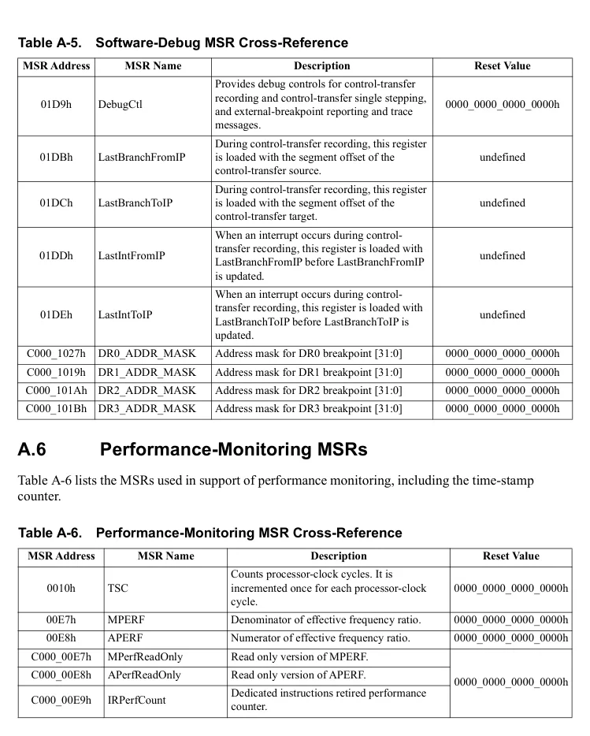

<!-- PDF source page: 794 | printed page: 732 -->

**Table A-6. Performance-Monitoring MSR Cross-Reference (continued)**

| MSR Address | MSR Name | Description | Reset Value |
| --- | --- | --- | --- |
| C001 0000h | PerfEvtSel0 | For the corresponding performance counter, this register specifies the events counted, and controls other aspects of counter operation. | 0000 0000 0000 0000h _ _ _ |
| C001 0001h | PerfEvtSel1 | For the corresponding performance counter, this register specifies the events counted, and controls other aspects of counter operation. |  |
| C001 0002h | PerfEvtSel2 | For the corresponding performance counter, this register specifies the events counted, and controls other aspects of counter operation. |  |
| C001 0003h | PerfEvtSel3 | For the corresponding performance counter, this register specifies the events counted, and controls other aspects of counter operation. |  |
| C001 0004h | PerfCtr0 | Used to count specific processor events, or the duration of events, as specified by the corresponding PerfEvtSeln register. | undefined |
| C001 0005h | PerfCtr1 | Used to count specific processor events, or the duration of events, as specified by the corresponding PerfEvtSeln register. |  |
| C001 0006h | PerfCtr2 | Used to count specific processor events, or the duration of events, as specified by the corresponding PerfEvtSeln register. |  |
| C001 0007h | PerfCtr3 | Used to count specific processor events, or the duration of events, as specified by the corresponding PerfEvtSeln register. |  |
| C001 0200h | PerfEvtSel0 | These MSR addresses are aliases for the base set of performance event-select registers PerfEvtSel[3:0]. | 0000 0000 0000 0000h _ _ _ |
| C001 0202h | PerfEvtSel1 | These MSR addresses are aliases for the base set of performance event-select registers PerfEvtSel[3:0]. |  |
| C001 0204h | PerfEvtSel2 | These MSR addresses are aliases for the base set of performance event-select registers PerfEvtSel[3:0]. |  |
| C001 0206h | PerfEvtSel3 | These MSR addresses are aliases for the base set of performance event-select registers PerfEvtSel[3:0]. |  |
| C001 0208h | PerfEvtSel4 | Extended core performance event-select registers. Support for these MSRs is indicated by CPUID Fn8000 0001 ECX[PerfCtrExtCore] = 1. _ _ |  |
| C001 020Ah | PerfEvtSel5 | Extended core performance event-select registers. Support for these MSRs is indicated by CPUID Fn8000 0001 ECX[PerfCtrExtCore] = 1. _ _ |  |
| C001 0201h | PerfCtr0 | These MSR addresses are aliases for the base set of performance-monitoring counter registers PerfCtr[3:0]. | undefined |
| C001 0203h | PerfCtr1 | These MSR addresses are aliases for the base set of performance-monitoring counter registers PerfCtr[3:0]. |  |
| C001 0205h | PerfCtr2 | These MSR addresses are aliases for the base set of performance-monitoring counter registers PerfCtr[3:0]. |  |
| C001 0207h | PerfCtr3 | These MSR addresses are aliases for the base set of performance-monitoring counter registers PerfCtr[3:0]. |  |
| C001 0209h | PerfCtr4 | Extended core performance counter registers. Support for these MSRs is indicated by CPUID Fn8000 0001 ECX[PerfCtrExtCore] = 1. _ _ |  |
| C001 020Bh | PerfCtr5 | Extended core performance counter registers. Support for these MSRs is indicated by CPUID Fn8000 0001 ECX[PerfCtrExtCore] = 1. _ _ |  |
| C001 0230h | L2I PerfEvtSel0 | Specifies the L2 cache events to be counted and controls other aspects of counter operation. Support for these MSRs is indicated by CPUID Fn8000 0001 ECX[PerfCtrExtL2I] = 1. _ _ | 0000 0000 0000 0000h _ _ _ |
| C001 0232h | L2I PerfEvtSel1 | Specifies the L2 cache events to be counted and controls other aspects of counter operation. Support for these MSRs is indicated by CPUID Fn8000 0001 ECX[PerfCtrExtL2I] = 1. _ _ |  |
| C001 0234h | L2I PerfEvtSel2 | Specifies the L2 cache events to be counted and controls other aspects of counter operation. Support for these MSRs is indicated by CPUID Fn8000 0001 ECX[PerfCtrExtL2I] = 1. _ _ |  |
| C001 0236h | L2I PerfEvtSel3 | Specifies the L2 cache events to be counted and controls other aspects of counter operation. Support for these MSRs is indicated by CPUID Fn8000 0001 ECX[PerfCtrExtL2I] = 1. _ _ |  |
| C001 0231h | L2I PerfCtr0 | Counts specific L2 cache events as specified by the corresponding L2I PerfEvtSeln Register. Support for these MSRs is indicated by CPUID Fn8000 0001 ECX[PerfCtrExtL2I] = 1. _ _ | undefined |
| C001 0233h | L2I PerfCtr1 | Counts specific L2 cache events as specified by the corresponding L2I PerfEvtSeln Register. Support for these MSRs is indicated by CPUID Fn8000 0001 ECX[PerfCtrExtL2I] = 1. _ _ |  |
| C001 0235h | L2I PerfCtr2 | Counts specific L2 cache events as specified by the corresponding L2I PerfEvtSeln Register. Support for these MSRs is indicated by CPUID Fn8000 0001 ECX[PerfCtrExtL2I] = 1. _ _ |  |
| C001 0237h | L2I PerfCtr3 | Counts specific L2 cache events as specified by the corresponding L2I PerfEvtSeln Register. Support for these MSRs is indicated by CPUID Fn8000 0001 ECX[PerfCtrExtL2I] = 1. _ _ |  |
| C001 0240h | NB PerfEvtSel0 | Specifies Northbridge events to be counted and controls other aspects of counter operation. Support for these MSRs is indicated by CPUID Fn8000 0001 ECX[PerfCtrExtNB] = 1. _ _ | 0000 0000 0000 0000h _ _ _ |
| C001 0242h | NB PerfEvtSel1 | Specifies Northbridge events to be counted and controls other aspects of counter operation. Support for these MSRs is indicated by CPUID Fn8000 0001 ECX[PerfCtrExtNB] = 1. _ _ |  |
| C001 0244h | NB PerfEvtSel2 | Specifies Northbridge events to be counted and controls other aspects of counter operation. Support for these MSRs is indicated by CPUID Fn8000 0001 ECX[PerfCtrExtNB] = 1. _ _ |  |
| C001 0246h | NB PerfEvtSel3 | Specifies Northbridge events to be counted and controls other aspects of counter operation. Support for these MSRs is indicated by CPUID Fn8000 0001 ECX[PerfCtrExtNB] = 1. _ _ |  |

Rendered source page 794 (figures/tables)

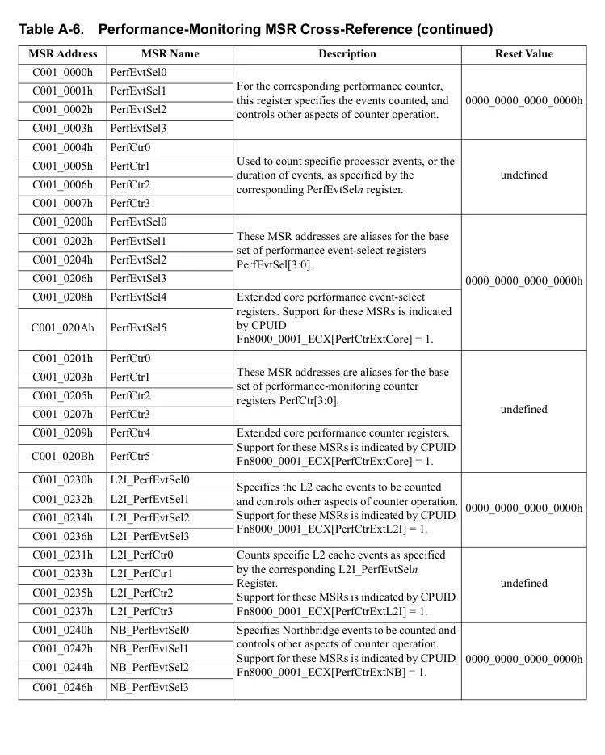

<!-- PDF source page: 795 | printed page: 733 -->

**Table A-6. Performance-Monitoring MSR Cross-Reference (continued)**

| MSR Address | MSR Name | Description | Reset Value |
| --- | --- | --- | --- |
| C001 0241h | NB PerfCtr0 | Counts specific Northbridge events as specified by the corresponding NB PerfEvtSeln Register. Support for these MSRs is indicated by CPUID Fn8000 0001 ECX[PerfCtrExtNB] = 1. _ _ | undefined |
| C001 0243h | NB PerfCtr1 | Counts specific Northbridge events as specified by the corresponding NB PerfEvtSeln Register. Support for these MSRs is indicated by CPUID Fn8000 0001 ECX[PerfCtrExtNB] = 1. _ _ |  |
| C001 0245h | NB PerfCtr2 | Counts specific Northbridge events as specified by the corresponding NB PerfEvtSeln Register. Support for these MSRs is indicated by CPUID Fn8000 0001 ECX[PerfCtrExtNB] = 1. _ _ |  |
| C001 0247h | NB PerfCtr3 | Counts specific Northbridge events as specified by the corresponding NB PerfEvtSeln Register. Support for these MSRs is indicated by CPUID Fn8000 0001 ECX[PerfCtrExtNB] = 1. _ _ |  |

## A.7 Secure Virtual Machine MSRs

Table A-7 lists the MSRs used in support of SVM functions.

**Table A-7. Secure Virtual Machine MSR Cross-Reference**

| MSR Address | MSR Name | Description | Reset Value |
| --- | --- | --- | --- |
| C000 0104h | TSC Ratio | Ratio for scaling TSC, MPERF, and MPerfReadOnly values read by guest. |  |
| C001 0114h | VM CR | Controls certain global aspects of SVM. | undefined |
| C001 0115h | IGNNE | Sets the state of the processor-internal IGNNE signal. |  |
| C001 0116h | SMM CTL | Provides software control over SMM signals. |  |
| C001 0117h | VM HSAVE PA _ _ | Holds the physical address of a block of memory where VMRUN saves host state, and from which #VMEXIT reloads host state. |  |
| C001 0118h | SVM KEY | Creates a password-protected mechanism to clear VM CR.LOCK. |  |
| C001 011Bh | Doorbell Registe | Sends a doorbell signal to the specified physical APIC. |  |
| C001 011Eh | VMPAGE FLUSH | “Secure Encrypted Virtualization” on page 588 |  |
| C001 0130h | GHCB | Guest-HV Communication Block address (see section 15.35.7) |  |
| C001 0131h | SEV STATUS | SEV active features indication (see section 15.35.10) |  |
| C001 0132h | RMP BASE | Base address of RMP (see 15.36.4) | 0000 0000 0000 0000h _ _ _ |
| C001 0133h | RMP END | Ending address of RMP (see 15.36.4) | 0000 0000 0000 1FFFh _ _ _ |
| C001 0134h | GUEST TSC FREQ _ _ | Guest TSC Frequency (see 15.36.18) | 0000 0000 0000 0000h _ _ _ |

Rendered source page 795 (figures/tables)

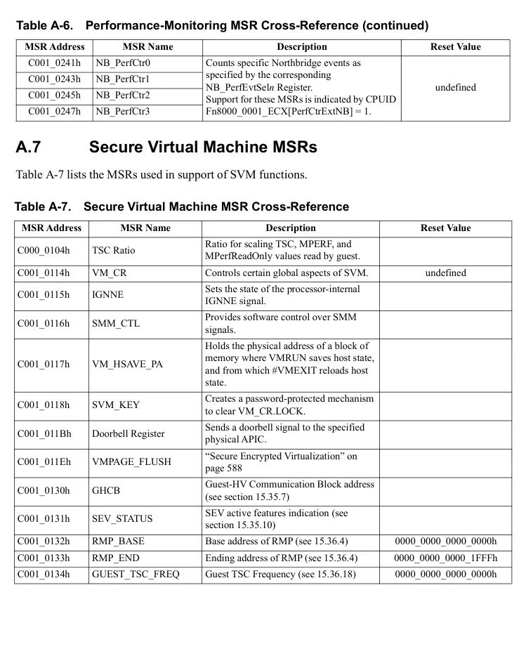

<!-- PDF source page: 796 | printed page: 734 -->

## A.8 System Management Mode MSRs

Table A-8 lists the MSRs used in support of SMM functions.

**Table A-8. System Management Mode MSR Cross-Reference**

| MSR Address | MSR Name | Description | Reset Value |
| --- | --- | --- | --- |
| C001 0056h | SMI Trigger IO Cycle _ _ _ | Specifies an I/O cycle that may be generated when a local SMI trigger event occurs. See the appropriate See the appropriate BIOS and Kernel Developer’s Guide or Processor Programming Reference Manual for details. | 0000 0000 0000 0000h _ _ _ |
| C001 0061h | P-State Current Limit | Specifies an I/O cycle that may be generated when a local SMI trigger event occurs. See the appropriate See the appropriate BIOS and Kernel Developer’s Guide or Processor Programming Reference Manual for details. |  |
| C001 0062h | P-State Control | Specifies an I/O cycle that may be generated when a local SMI trigger event occurs. See the appropriate See the appropriate BIOS and Kernel Developer’s Guide or Processor Programming Reference Manual for details. |  |
| C001 0063h | P-State Status | Specifies an I/O cycle that may be generated when a local SMI trigger event occurs. See the appropriate See the appropriate BIOS and Kernel Developer’s Guide or Processor Programming Reference Manual for details. |  |
| C001 0111h | SMBASE | Contains the SMRAM base address. | 0000 0000 0003 0000h _ _ _ |
| C001 0112h | SMM ADDR | Contains the base address of protected memory for the SMM Handler. | 0000 0000 0000 0000h _ _ _ |
| C001 0113h | SMM MASK | Contains a mask which determines the size of the protected area for the SMM handler. | 0000 0000 0000 0000h _ _ _ |
| C001 0119h | SMM KEY | Contains a mask which determines the size of the protected area for the SMM handler. |  |
| C001 011Ah | Local SMI Status _ _ | Contains status associated with SMI sources local to the CPU core. See the appropriate BIOS and Kernel Developer’s Guide or Processor Programming Reference Manual for details. | 0000 0000 0000 0000h _ _ _ |

## A.9 CPUID Name MSR Cross-Reference

Table A-9 lists the MSRs used to support CPUID namestring.

**Table A-9. CPUID Namestring MSR Cross Reference**

| MSR Address | MSR Name | Description | Reset Value |
| --- | --- | --- | --- |
| C001 0030h | Processor Name String _ _ | See appropriate BIOS and Kernel Developer’s Guide (BKDG) or Processor Programming Reference Manual (PPR) and Processor Revision Guide. | 0000 0000 0000 0000h _ _ _ |
| C001 0031h | Processor Name String _ _ | See appropriate BIOS and Kernel Developer’s Guide (BKDG) or Processor Programming Reference Manual (PPR) and Processor Revision Guide. |  |
| C001 0032h | Processor Name String _ _ | See appropriate BIOS and Kernel Developer’s Guide (BKDG) or Processor Programming Reference Manual (PPR) and Processor Revision Guide. |  |
| C001 0033h | Processor Name String _ _ | See appropriate BIOS and Kernel Developer’s Guide (BKDG) or Processor Programming Reference Manual (PPR) and Processor Revision Guide. |  |
| C001 0034h | Processor Name String _ _ | See appropriate BIOS and Kernel Developer’s Guide (BKDG) or Processor Programming Reference Manual (PPR) and Processor Revision Guide. |  |
| C001 0035h | Processor Name String _ _ | See appropriate BIOS and Kernel Developer’s Guide (BKDG) or Processor Programming Reference Manual (PPR) and Processor Revision Guide. |  |

Rendered source page 796 (figures/tables)

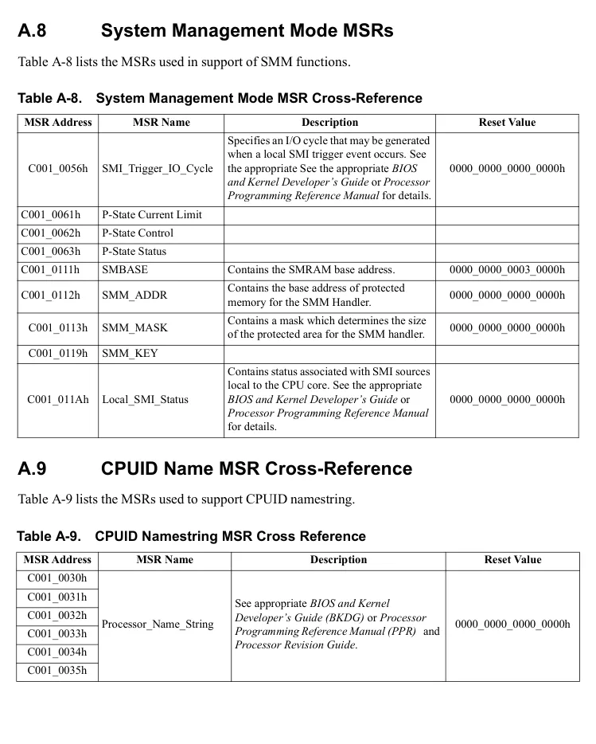

<!-- PDF source page: 797 | printed page: 735 -->

## A.10 Shadow Stack MSRs

Table A-10 lists the MSRs that support the shadow stack feature. These registers are defined if the shadow stack feature is present as indicated by CPUID Fn0000_0007_x0_ECX[CET_SS] (bit 7) =1.

**Table A-10. Shadow Stack MSR Cross Reference**

| MSR Address | MSR Name | Description | Reset Value |
| --- | --- | --- | --- |
| 06A0h | U CET | User-mode shadow stack controls | 0000 0000 0000 0000h _ _ _ |
| 06A2h | S CET | Supervisor-mode shadow stack controls |  |
| 06A4h | PL0 SSP | CPL 0 shadow stack pointe |  |
| 06A5h | PL1 SSP | CPL 1 shadow stack pointe |  |
| 06A6h | PL2 SSP | CPL 2 shadow stack pointe |  |
| 06A7h | PL3 SSP | CPL 3 shadow stack pointe |  |
| 06A8h | ISST ADDR | Contains the base address of the Interrupt SSP Table |  |

## A.11 Speculation Control MSRs

Table A-11 lists the MSRs that support speculation control. See “Speculation Control Registers” on page 66 for further details, including how to determine whether these registers are defined.

**Table A-11. Speculation Control MSRs**

| MSR Address | MSR Name | Description | Reset Value |
| --- | --- | --- | --- |
| 0048h | SPEC CTRL | Speculation Control | 0000 0000 0000 0000h _ _ _ |
| 0049h | PRED CMD | Prediction Control |  |
| C001 011Fh | VIRT SPEC CTRL _ _ | Virtual Speculation Control |  |

## A.12 Memory Cache MSRs

**Table A-12. Memory Cache MSRs**

| MSR Address | MSR Name | Description | Reset Value |
| --- | --- | --- | --- |
| C001 1095h | L3RangeReserveBaseAdd | L3 Range Reserve Base Address Registe |  |
| C001 1096h | L3RangeReserveMaxAdd | L3 Range Reserve Maximum Address Registe |  |
| C001 109Ah | L3RangeReserveWayMask | L3 Range Reserve Way Mask |  |

Rendered source page 797 (figures/tables)

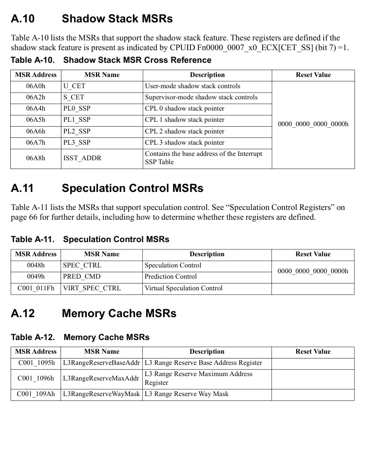

<!-- PDF source page: 798 | printed page: 736 -->

## A.13 Quality of Service MSRs

**Table A-13. Quality of Service MSRs**

| MSR Address | MSR Name | Description | Reset Value |
| --- | --- | --- | --- |
| 0C81h | L3 QOS CFG1 _ _ | CDP enable | 0 |
| 0C8Dh | QM EVTSEL | QOS event selection | 0 |
| 0C8Eh | QM CTR | QOS counte | 0 |
| 0C8Fh | PQR ASSOC | RMID association | 0 |
| 0C90h+n | L3 MASK n _ _ | L3 allocation mask | Bits CBM LEN:0 are set, all others cleared |
| C000 0200+n | L3QOS BW CONTROL n _ _ _ | L3 bandwidth control | U bit set, all other bits cleared |
| C000 0280+n | L3QOS SMBW CONTROL n _ _ _ | L3 slow memory bandwidth control | U bit set, all other bits cleared |
| C000 03FDh | L3 QOS ABMC CFG _ _ _ | ABMC configuration | See 19.3.3.3 |
| C000 03FEh | L3 QOS ABMC DSC _ _ _ | ABMC discovery | 0 |
| C000 03FFh | L3 QOS EXT CFG _ _ _ | ABMC, SDCI enables | 0 |
| C000 0400h | QOS EVT CFG 0 _ _ _ | BMEC configuration | See 19.3.3.2 |
| C000 0401h | QOS EVT CFG 1 _ _ _ | BMEC configuration | See 19.3.3.2 |

## A.14 Collaborative Processor Performance Control MSRs

**Table A-14. Collaborative Processor Performance Control MSRs**

| MSR Address | MSR Name | Description | Reset Value |
| --- | --- | --- | --- |
| C001 02B0h | CPPC CAPABILITY 1 _ _ | CPPC performance ranges | 0 |
| C001 02B1h | CPPC ENABLE | CPPC enable | 0 |
| C001 02B2h | CPPC CAPABILITY 2 _ _ | CPPC constrained max performance level | 0 |
| C001 02B3h | CPPC REQUEST | CPPC request | 0 |
| C001 02B4h | CPPC STATUS | CPPC status | 0 |

Rendered source page 798 (figures/tables)

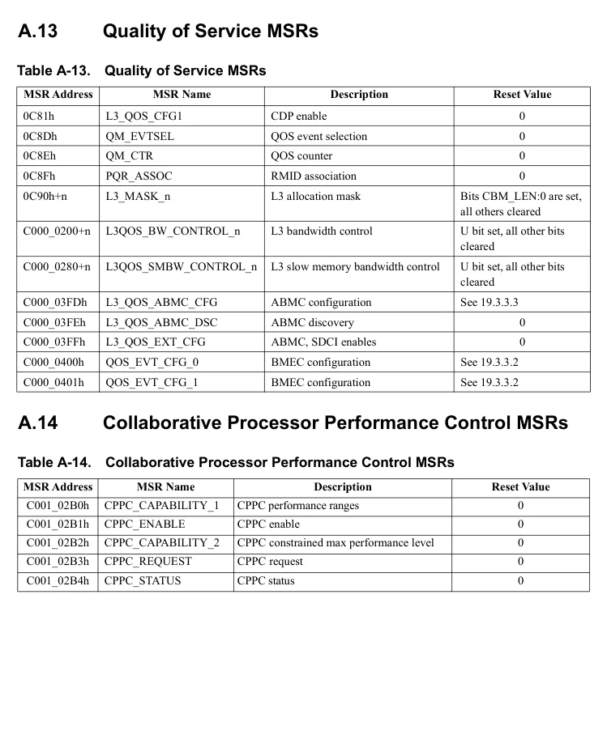

