<!-- PDF source page: 799 | printed page: 737 -->

# Appendix B VMCB Layout

The VMCB is divided into two areas—the first one contains various control bits including the intercept vectors and the second one contains saved guest state.

Table B-1 describes the layout of the control area of the VMCB, which starts at offset zero within the VMCB page. The control area is padded to a size of 1024 bytes. All unused bytes must be zero, as they are reserved for future expansion. It is recommended that software zero out any newly allocated VMCB.

**Table B-1. VMCB Layout, Control Area**

| Byte Offset | Bit(s) | Function |
| --- | --- | --- |
| 000h (vector 0) | 15:0 | Intercept reads of CR0–15, respectively |
| 000h (vector 0) | 31:16 | Intercept writes of CR0–15, respectively |
| 004h (vector 1) | 15:0 | Intercept reads of DR0–15, respectively |
| 004h (vector 1) | 31:16 | Intercept writes of DR0–15, respectively. |
| 008h (vector 2) | 31:0 | Intercept exception vectors 0–31, respectively |
| 00Ch (vector 3) | 0 | Intercept INTR (physical maskable interrupt) |
| 00Ch (vector 3) | 1 | Intercept NMI |
| 00Ch (vector 3) | 2 | Intercept SMI |
| 00Ch (vector 3) | 3 | Intercept INIT |
| 00Ch (vector 3) | 4 | Intercept VINTR (virtual maskable interrupt) |
| 00Ch (vector 3) | 5 | Intercept CR0 writes that change bits other than CR0.TS or CR0.MP |
| 00Ch (vector 3) | 6 | Intercept reads of IDTR |
| 00Ch (vector 3) | 7 | Intercept reads of GDTR |
| 00Ch (vector 3) | 8 | Intercept reads of LDTR |
| 00Ch (vector 3) | 9 | Intercept reads of TR |
| 00Ch (vector 3) | 10 | Intercept writes of IDTR |
| 00Ch (vector 3) | 11 | Intercept writes of GDTR |
| 00Ch (vector 3) | 12 | Intercept writes of LDTR |
| 00Ch (vector 3) | 13 | Intercept writes of TR |
| 00Ch (vector 3) | 14 | Intercept RDTSC instruction |
| 00Ch (vector 3) | 15 | Intercept RDPMC instruction |

Rendered source page 799 (figures/tables)

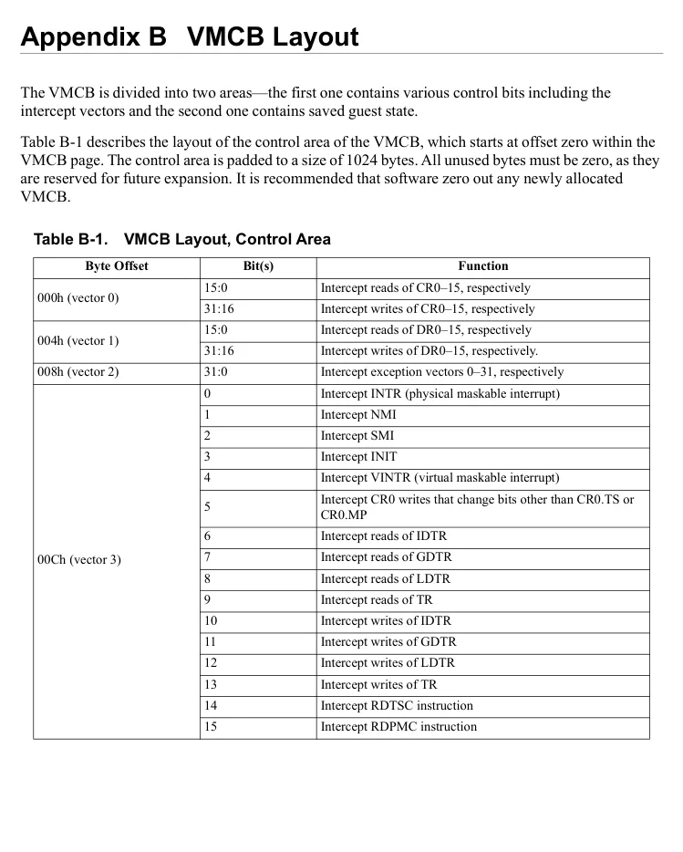

<!-- PDF source page: 800 | printed page: 738 -->

**Table B-1. VMCB Layout, Control Area (continued)**

| Byte Offset | Bit(s) | Function |
| --- | --- | --- |
| 00Ch (continued) | 16 | Intercept PUSHF instruction |
| 00Ch (continued) | 17 | Intercept POPF instruction |
| 00Ch (continued) | 18 | Intercept CPUID instruction |
| 00Ch (continued) | 19 | Intercept RSM instruction |
| 00Ch (continued) | 20 | Intercept IRET instruction |
| 00Ch (continued) | 21 | Intercept INTn instruction |
| 00Ch (continued) | 22 | Intercept INVD instruction |
| 00Ch (continued) | 23 | Intercept PAUSE instruction |
| 00Ch (continued) | 24 | Intercept HLT instruction |
| 00Ch (continued) | 25 | Intercept INVLPG instruction |
| 00Ch (continued) | 26 | Intercept INVLPGA instruction |
| 00Ch (continued) | 27 | IOIO PROT—Intercept IN/OUT accesses to selected ports |
| 00Ch (continued) | 28 | MSR PROT—intercept RDMSR or WRMSR accesses to selected MSRs |
| 00Ch (continued) | 29 | Intercept task switches |
| 00Ch (continued) | 30 | FERR FREEZE: intercept processor “freezing” during legacy FERR handling |
| 00Ch (continued) | 31 | Intercept shutdown events |

Rendered source page 800 (figures/tables)

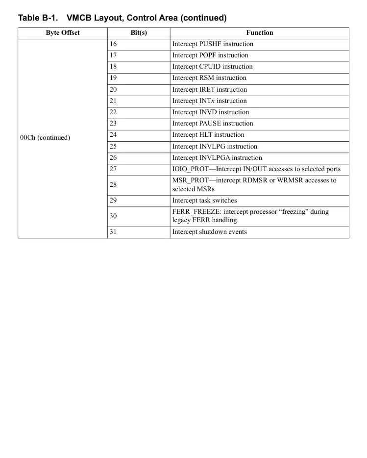

<!-- PDF source page: 801 | printed page: 739 -->

**Table B-1. VMCB Layout, Control Area (continued)**

| Byte Offset | Bit(s) | Function |
| --- | --- | --- |
| 010h (vector 4) | 0 | Intercept VMRUN instruction |
| 010h (vector 4) | 1 | Intercept VMMCALL instruction |
| 010h (vector 4) | 2 | Intercept VMLOAD instruction |
| 010h (vector 4) | 3 | Intercept VMSAVE instruction |
| 010h (vector 4) | 4 | Intercept STGI instruction |
| 010h (vector 4) | 5 | Intercept CLGI instruction |
| 010h (vector 4) | 6 | Intercept SKINIT instruction |
| 010h (vector 4) | 7 | Intercept RDTSCP instruction |
| 010h (vector 4) | 8 | Intercept ICEBP instruction |
| 010h (vector 4) | 9 | Intercept WBINVD and WBNOINVD instructions |
| 010h (vector 4) | 10 | Intercept MONITOR/MONITORX instruction |
| 010h (vector 4) | 11 | Intercept MWAIT/MWAITX instruction unconditionally |
| 010h (vector 4) | 12 | Intercept MWAIT/MWAITX instruction if monitor hardware is armed |
| 010h (vector 4) | 13 | Intercept XSETBV instruction |
| 010h (vector 4) | 14 | Intercept RDPRU instruction |
| 010h (vector 4) | 15 | Intercept writes of EFER (occurs after guest instruction finishes) |
| 010h (vector 4) | 31:16 | Intercept writes of CR0-15 (occurs after guest instruction finishes) |
| 014h (vector 5) | 0 | Intercept all INVLPGB instructions |
| 014h (vector 5) | 1 | Intercept only illegally specified INVLPGB instructions |
| 014h (vector 5) | 2 | Intercept INVPCID instruction |
| 014h (vector 5) | 3 | Intercept MCOMMIT instruction |
| 014h (vector 5) | 4 | Intercept TLBSYNC instruction. Presence of this bit is indicated by CPUID Fn8000 000A, EDX[24] = 1. |
| 014h (vector 5) | 5 | Intercept bus lock operations when Bus Lock Threshold Counter is 0 (occurs before guest instruction executes). |
| 014h (vector 5) | 6 | Intercept HLT instruction if a virtual interrupt is not pending. |
| 014h (vector 5) | 31:7 | RESERVED, SBZ |
| 018h–03Bh | RESERVED, SBZ | RESERVED, SBZ |
| 03Ch | 15:0 | PAUSE Filter Threshold |
| 03Eh | 15:0 | PAUSE Filter Count |
| 040h | 63:0 | IOPM BASE PA—Physical base address of IOPM (bits 11:0 _ _ are ignored) |
| 048h | 63:0 | MSRPM BASE PA—Physical base address of MSRPM _ _ (bits 11:0 are ignored) |
| 050h | 63:0 | TSC OFFSET—To be added in RDTSC and RDTSCP |

Rendered source page 801 (figures/tables)

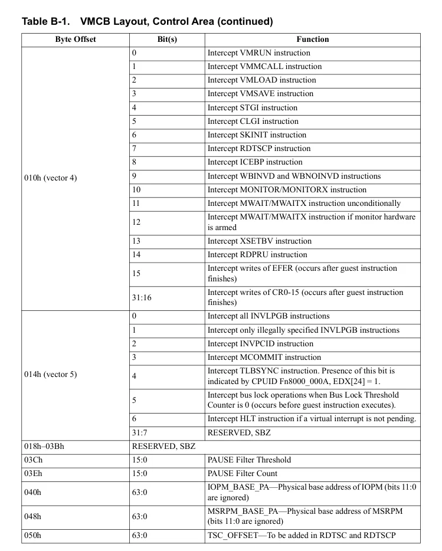

<!-- PDF source page: 802 | printed page: 740 -->

**Table B-1. VMCB Layout, Control Area (continued)**

| Byte Offset | Bit(s) | Function |
| --- | --- | --- |
| 058h | 31:0 | Guest ASID |
| 058h | 39:32 | TLB CONTROL 00h—Do nothing 01h—Flush entire TLB (all entries, all ASIDs) on VMRUN Should only be used by legacy hypervisors 03h—Flush this guest’s TLB entries 07h—Flush this guest’s non-global TLB entries NOTE: All other encodings are reserved. |
| 058h | 40 | ALLOW LARGER RAP _ _ 0—RAP size for the guest is 32 1—RAP size for the guest is equal to CPUID Fn8000 0021 EBX[RapSize] _ _ |
| 058h | 41 | CLEAR RAP 1—Clear RAP on VMRUN |
| 058h | 63:42 | RESERVED, SBZ |
| 060h | 7:0 | V TPR—The virtual TPR for the guest. Bits 3:0 are used for a 4-bit virtual TPR value; bits 7:4 are SBZ. NOTE: This value is written back to the VMCB at #VMEXIT. |
| 060h | 8 | V IRQ—If nonzero, virtual INTR is pending NOTE: This value is written back to the VMCB at #VMEXIT. This field is ignored on VMRUN when AVIC is enabled. |
| 060h | 9 | VGIF value (0 – Virtual interrupts are masked, 1 – Virtual Interrupts are unmasked) |
| 060h | 11 | V NMI - If nonzero, virtual NMI is pending |
| 060h | 12 | V NMI MASK - if nonzero, virtual NMI is masked _ _ |
| 060h | 15:13 | RESERVED, SBZ |
| 060h | 19:16 | V INTR PRIO—Priority for virtual interrupt _ _ NOTE: This field is ignored on VMRUN when AVIC is enabled.. |
| 060h | 20 | V IGN TPR—If nonzero, the current virtual interrupt _ _ ignores the (virtual) TPR NOTE: This field is ignored on VMRUN when AVIC is enabled.. |
| 060h | 23:21 | RESERVED, SBZ |
| 060h | 24 | V INTR MASKING—Virtualize masking of INTR _ _ interrupts ( “Virtualizing APIC.TPR” on page 533) |
| 060h | 25 | AMD Virtual GIF enabled for this guest (0 - Disabled, 1 - Enabled) |
| 060h | 26 | V NMI ENABLE - NMI Virtualization Enable (see “NMI _ _ Virtualization” on page 536) |
| 060h | 29:27 | Reserved, SBZ |
| 060h | 30 | x2AVIC Enable (see “x2AVIC” on page 582) |

Rendered source page 802 (figures/tables)

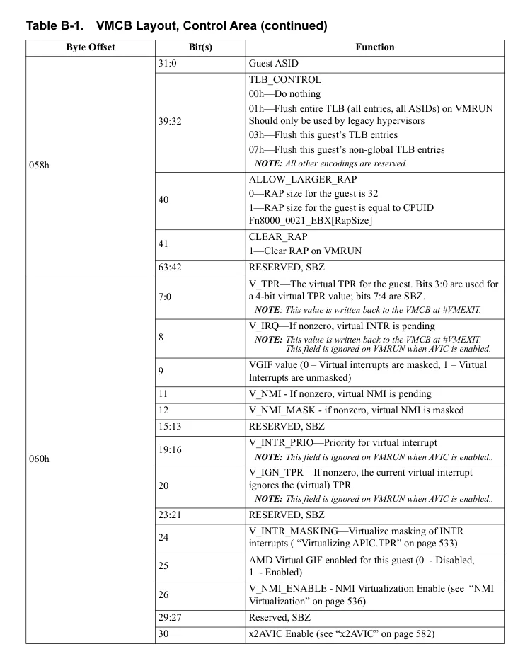

<!-- PDF source page: 803 | printed page: 741 -->

**Table B-1. VMCB Layout, Control Area (continued)**

| Byte Offset | Bit(s) | Function |
| --- | --- | --- |
| 060h (continued) | 31 | AVIC Enable |
| 060h (continued) | 39:32 | V INTR VECTOR—Vector to use for this interrupt _ _ NOTE: This field is ignored on VMRUN when AVIC is enabled.. |
| 060h (continued) | 63:40 | RESERVED, SBZ |
| 068h | 0 | INTERRUPT SHADOW - Guest is in an interrupt shadow |
| 068h | 1 | GUEST INTERRUPT MASK - Value of the RFLAGS.IF _ _ bit for SEV-ES guest Note: This value is written back to the VMCB on #VMEXIT. |
| 068h | 63:2 | RESERVED, SBZ |
| 070h | 63:0 | EXITCODE |
| 078h | 63:0 | EXITINFO1 |
| 080h | 63:0 | EXITINFO2 |
| 088h | 63:0 | EXITINTINFO |
| 090h | 0 | NP ENABLE—Enable nested paging. |
| 090h | 1 | Enable Secure Encrypted Virtualization |
| 090h | 2 | Enable Encrypted State for Secure Encrypted Virtualization |
| 090h | 3 | Guest Mode Execute Trap |
| 090h | 4 | SSSCheckEn - Enable supervisor shadow stack restrictions in nested page tables. Support for this feature is indicated by CPUID Fn8000 000A EDX[19] (SSSCheck) _ _ |
| 090h | 5 | Virtual Transparent Encryption. |
| 090h | 6 | Enable Read Only Guest Page Tables. See “Nested Table Walk” on page 550 |
| 090h | 7 | Enable INVLPGB/TLBSYNC. 0 - INVLPGB and TLBSYNC will result in #UD. 1 - INVLPGB and TLBSYNC can be executed in guest. Presence of this bit is indicated by CPUID bit 8000 000A, EDX[24] = 1. When in SEV-ES guest or this bit is not present, INVLPGB/TLBSYNC is always enabled in guest if supported by processor. |
| 090h | 63:8 | RESERVED, SBZ |
| 098h | 63:52 | RESERVED, SBZ |
| 098h | 51:0 | AVIC APIC BAR |
| 0A0h | 63:0 | Guest physical address of GHCB |
| 0A8h | 63:0 | EVENTINJ—Event injection ( “Event Injection” on page 531 for details) |
| 0B0h | 63:0 | N CR3—Nested page table CR3 to use for nested paging |

Rendered source page 803 (figures/tables)

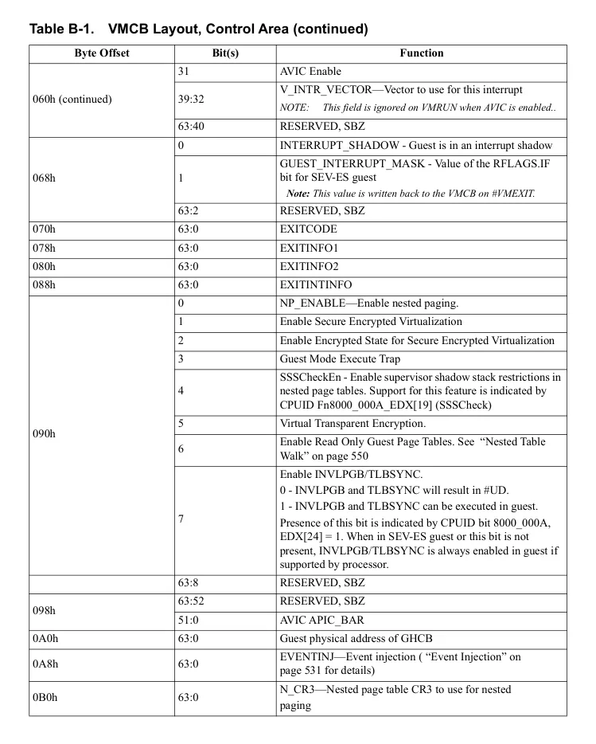

<!-- PDF source page: 804 | printed page: 742 -->

**Table B-1. VMCB Layout, Control Area (continued)**

| Byte Offset | Bit(s) | Function |
| --- | --- | --- |
| 0B8h | 0 | LBR Virtualization Enable |
| 0B8h | 1 | VMSAVE/VMLOAD Virtualization Enable |
| 0B8h | 2 | IBS Virtualization Enable |
| 0B8h | 3 | PMC Virtualization Enable |
| 0B8h | 63:4 | RESERVED, SBZ |
| 0C0h | 31:0 | VMCB Clean Bits. |
| 0C0h | 63:32 | RESERVED, SBZ |
| 0C8h | 63:0 | nRIP—Next sequential instruction pointe |
| 0D0h | 7:0 | Number of bytes fetched |
| 0D0h | 127:8 | Guest instruction bytes |
| 0E0h | 63:52 | RESERVED, SBZ |
| 0E0h | 51:0 | AVIC APIC BACKING PAGE Pointer _ _ |
| 0E8h–0EFh | RESERVED, SBZ | AVIC APIC BACKING PAGE Pointer _ _ |
| 0F0h | 63:52 | RESERVED, SBZ |
| 0F0h | 51:12 | AVIC LOGICAL TABLE Pointe |
| 0F0h | 11:0 | Reserved, SBZ |
| 0F8h | 63:52 | RESERVED, SBZ |
| 0F8h | 51:12 | AVIC PHYSICAL TABLE Pointer[51:12] |
| 0F8h | 11:0 | AVIC PHYSICAL MAX INDEX _ _ _ |
| 100h – 107h | RESERVED, SBZ | AVIC PHYSICAL MAX INDEX _ _ _ |
| 108h | 63:52 | RESERVED, SBZ |
| 108h | 51:12 | VMSA Pointer[51:12] |
| 108h | 11:0 | RESERVED, SBZ |
| 110h | 63:0 | VMGEXIT RAX |
| 118h | 7:0 | VMGEXIT CPL |
| 120h | 15:0 | Bus Lock Threshold Counte |
| 128h – 133h | RESERVED, SBZ | Bus Lock Threshold Counte |
| 134h | 0 | UPDATE IRR |
| 138h | 63 | ALLOWED SEV FEATURES EN _ _ _ |
| 138h | 62 | RESERVED, SBZ |
| 138h | 61:0 | ALLOWED SEV FEATURES MASK _ _ _ |
| 140h | 61:0 | GUEST SEV FEATURES _ _ |
| 148h | RESERVED, SBZ | GUEST SEV FEATURES _ _ |
| 150h | 255:0 | REQUESTED IRR |
| 170h – 3DFh | RESERVED, SBZ | REQUESTED IRR |
| 3E0h – 3FFh | Reserved for Host usage | REQUESTED IRR |

Rendered source page 804 (figures/tables)

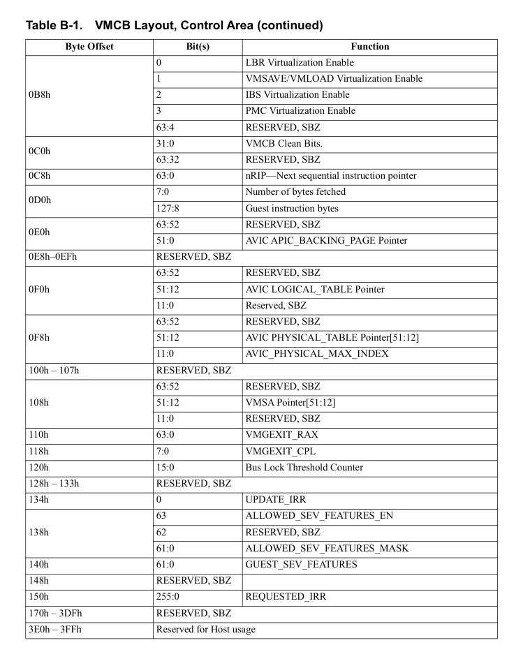

<!-- PDF source page: 805 | printed page: 743 -->

When SEV-ES is not enabled, the state-save area within the VMCB starts at offset 400h into the VMCB page; Table B-2 describes the fields within the state-save area; note that the table lists offsets *relative to the state-save area* (not the VMCB as a whole).

**Table B-2. VMCB Layout, State Save Area**

| Offset / 000h | Size / word | Contents / ES | Contents / selecto | Notes |
| --- | --- | --- | --- | --- |
| 002h | word |  | attri |  |
| 004h | dword |  | limit |  |
| 008h | qword |  | ase | Only lower 32 bits are implemented |
| 010h | word | CS | selecto |  |
| 012h | word | CS | attri |  |
| 014h | dword | CS | limit |  |
| 018h | qword | CS | ase | Only lower 32 bits are implemented |
| 020h | word | SS | selecto |  |
| 022h | word | SS | attri |  |
| 024h | dword | SS | limit |  |
| 028h | qword | SS | ase | Only lower 32 bits are implemented |
| 030h | word | DS | selecto |  |
| 032h | word | DS | attri |  |
| 034h | dword | DS | limit |  |
| 038h | qword | DS | ase | Only lower 32 bits are implemented |
| 040h | word | FS | selecto |  |
| 042h | word | FS | attri |  |
| 044h | dword | FS | limit |  |
| 048h | qword | FS | ase |  |
| 050h | word | GS | selecto |  |
| 052h | word | GS | attri |  |
| 054h | dword | GS | limit |  |
| 058h | qword | GS | ase |  |
| 060h | word | GDTR | selecto | RESERVED |
| 062h | word | GDTR | attri | RESERVED |
| 064h | dword | GDTR | limit | Only lower 16 bits are implemented |
| 068h | qword | GDTR | ase |  |
| 070h | word | LDTR | selecto |  |
| 072h | word | LDTR | attri |  |
| 074h | dword | LDTR | limit |  |
| 078h | qword | LDTR | ase |  |

Rendered source page 805 (figures/tables)

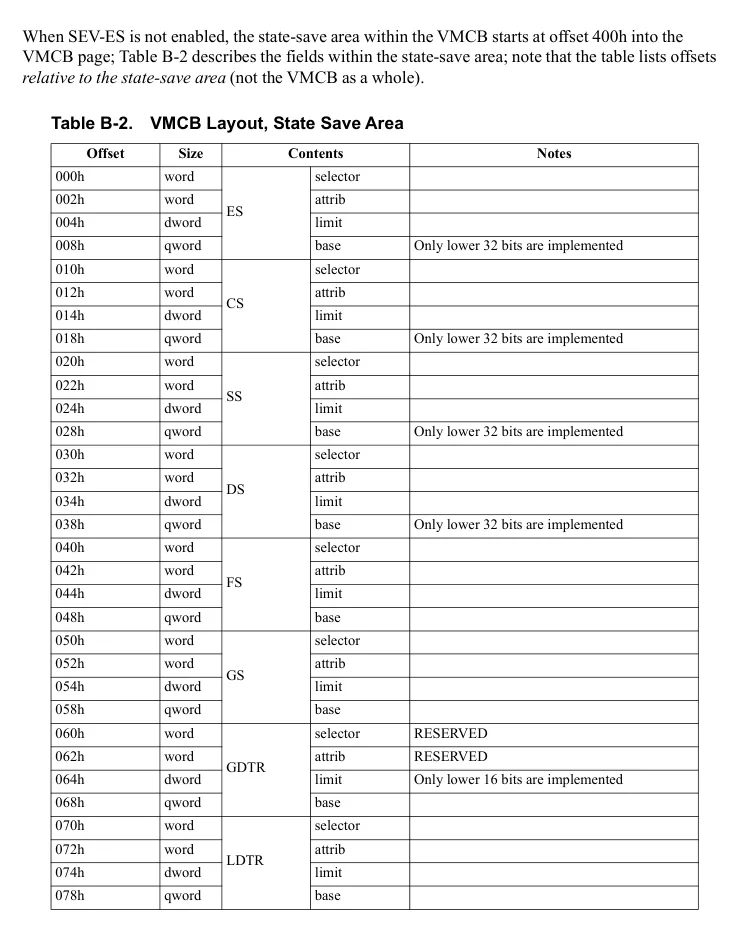

<!-- PDF source page: 806 | printed page: 744 -->

**Table B-2. VMCB Layout, State Save Area (continued)**

| Offset / 080h | Size / word | Contents / IDTR | Contents / selecto | Notes / RESERVED |
| --- | --- | --- | --- | --- |
| 082h | word |  | attri | RESERVED |
| 084h | dword |  | limit | Only lower 16 bits are implemented |
| 088h | qword |  | ase |  |
| 090h | word | TR | selecto |  |
| 092h | word | TR | attri |  |
| 094h | dword | TR | limit |  |
| 098h | qword | TR | ase |  |
| 0A0h–0CAh | qword | RESERVED |  |  |
| 0CBh | yte | CPL |  | If the guest is real-mode then the CPL is forced to 0; if the guest is virtual-mode then the CPL is forced to 3 |
| 0CCh | dword | RESERVED |  |  |
| 0D0h | qword | EFER |  |  |
| 0D8h–0DFh | qword | RESERVED |  |  |
| 0E0h | qword | PERF CTL0 |  |  |
| 0E8h | qword | PERF CTR0 |  |  |
| 0F0h | qword | PERF CTL1 |  |  |
| 0F8h | qword | PERF CTR1 |  |  |
| 100h | qword | PERF CTL2 |  |  |
| 108h | qword | PERF CTR2 |  |  |
| 110h | qword | PERF CTL3 |  |  |
| 118h | qword | PERF CTR3 |  |  |
| 120h | qword | PERF CTL4 |  |  |
| 128h | qword | PERF CTR4 |  |  |
| 130h | qword | PERF CTL5 |  |  |
| 138h | qword | PERF CTR5 |  |  |
| 148h | qword | CR4 |  |  |
| 150h | qword | CR3 |  |  |
| 158h | qword | CR0 |  |  |
| 160h | qword | DR7 |  |  |
| 168h | qword | DR6 |  |  |
| 170h | qword | RFLAGS |  |  |
| 178h | qword | RIP |  |  |
| 180h–1BFh | qword | RESERVED |  |  |
| 1C0h | qword | INSTR RETIRED CTR _ _ |  |  |
| 1C8h | qword | PERF CTR GLOBAL STS _ _ _ |  |  |

Rendered source page 806 (figures/tables)

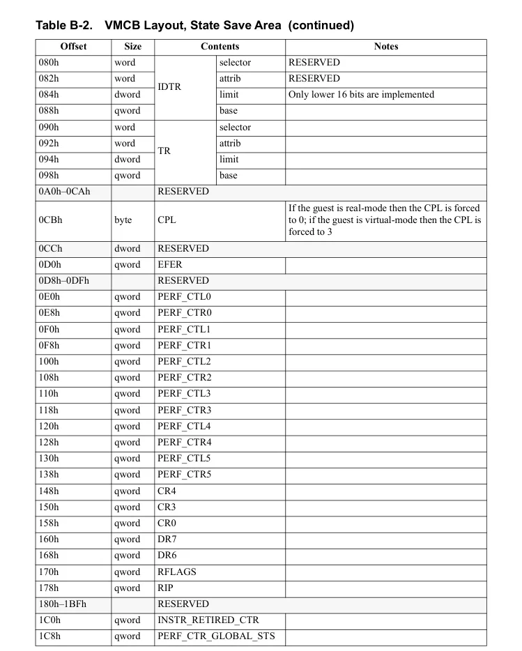

<!-- PDF source page: 807 | printed page: 745 -->

**Table B-2. VMCB Layout, State Save Area (continued)**

| Offset | Size | Contents | Notes |
| --- | --- | --- | --- |
| 1D0h | qword | PERF CTR GLOBAL CTL _ _ _ |  |
| 1D4h–1D7h | qword | RESERVED |  |
| 1D8h | qword | RSP |  |
| 1E0h | qword | S CET |  |
| 1E8h | qword | SSP |  |
| 1F0h | qword | ISST ADDR |  |
| 1F8h | qword | RAX |  |
| 200h | qword | STAR |  |
| 208h | qword | LSTAR |  |
| 210h | qword | CSTAR |  |
| 218h | qword | SFMASK |  |
| 220h | qword | KernelGsBase |  |
| 228h | qword | SYSENTER CS |  |
| 230h | qword | SYSENTER ESP |  |
| 238h | qword | SYSENTER EIP |  |
| 240h | qword | CR2 |  |
| 248h–267h | qword | RESERVED |  |
| 268h | qword | G PAT | Guest PAT—only used if nested paging enabled |
| 270h | qword | DBGCTL | Guest DebugCtl MSR—only used if hardware acceleration of LBR virtualization is supported and enabled by setting the LBR VIRTUALIZATION ENABLE bit of the _ _ VMCB control area. |
| 278h | qword | BR FROM | Guest LastBranchFromIP MSR—only used if hardware acceleration of LBR virtualization is supported and enabled. |
| 280h | qword | BR TO | Guest LastBranchToIP MSR—only used if hardware acceleration of LBR virtualization is supported and enabled. |
| 288h | qword | LASTEXCPFROM | Guest LastIntFromIP MSR—Only used if hardware acceleration of LBR virtualization is supported and enabled. |
| 290h | qword | LASTEXCPTO | Guest LastIntToIP MSR—Only used if hardware acceleration of LBR virtualization is supported and enabled. |

Rendered source page 807 (figures/tables)

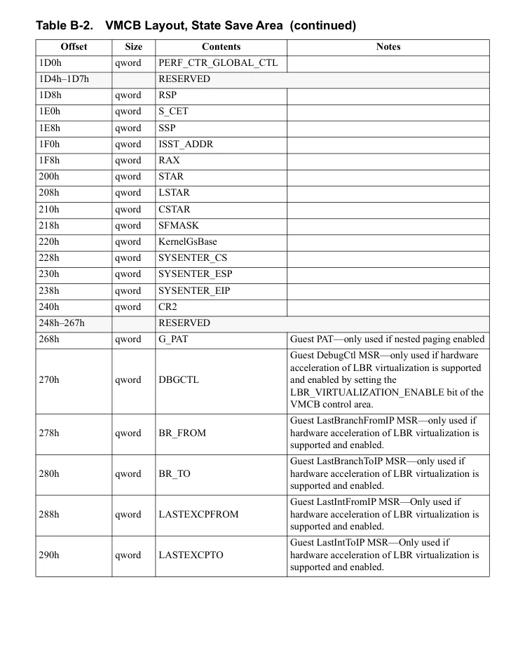

<!-- PDF source page: 808 | printed page: 746 -->

**Table B-2. VMCB Layout, State Save Area (continued)**

| Offset | Size | Contents | Notes |
| --- | --- | --- | --- |
| 298h | qword | DBGEXTNCTL | Guest DebugExtnCtl MSR—only used if hardware acceleration of LBR Stack virtualization is supported and enabled by setting the LBR VIRTUALIZATION ENABLE bit of the _ _ VMCB control area. |
| 2A0h–2DFh | 72 bytes | RESERVED |  |
| 2E0h | qword | SPEC CTRL |  |
| 2E8h–66Fh | 904 bytes | RESERVED |  |
| 670h–76Fh | 256 bytes | LBR STACK FROM _ _ LBR STACK TO _ _ | Guest LastBranchStackFromIp and LastBranchStackToIp MSRs in MSR address order — only used if hardware acceleration of LBR Stack virtualization is supported and enabled by setting the LBR VIRTUALIZATION ENABLE bit of the _ _ VMCB control area. |
| 770h | qword | LBR SELECT | Guest LastBranchStackSelect MSR - only used if hardware acceleration of LBR Stack virtualization is supported and enabled by setting the LBR VIRTUALIZATION ENABLE bit of the _ _ VMCB control area. |
| 778h | qword | IBS FETCH CTL _ _ | IBS Virtualization state (swap type C). |
| 780h | qword | IBS FETCH _ _ LINADDR |  |
| 788h | qword | IBS OP CTL _ _ |  |
| 790h | qword | IBS OP RIP _ _ |  |
| 798h | qword | IBS OP DATA _ _ |  |
| 7A0h | qword | IBS OP DATA2 _ _ |  |
| 7A8h | qword | IBS OP DATA3 _ _ |  |
| 7B0h | qword | IBS DC LINADDR _ _ |  |
| 7B8h | qword | BP IBSTGT RIP _ _ |  |
| 7C0h | qword | IC IBS EXTD CTL _ _ _ |  |
| 7C8h to ends of VMCB | qword | RESERVED |  |

When SEV-ES is enabled (Section 15.35 “Encrypted State (SEV-ES)” on page 595), the VMSA structure starts at offset 0h in the page indicated by the VMSA Pointer. The format of the VM save state for SEV-ES guests is described in the table below.

All state is categorized into 3 swap types based on how it is handled by hardware during a world switch:

Rendered source page 808 (figures/tables)

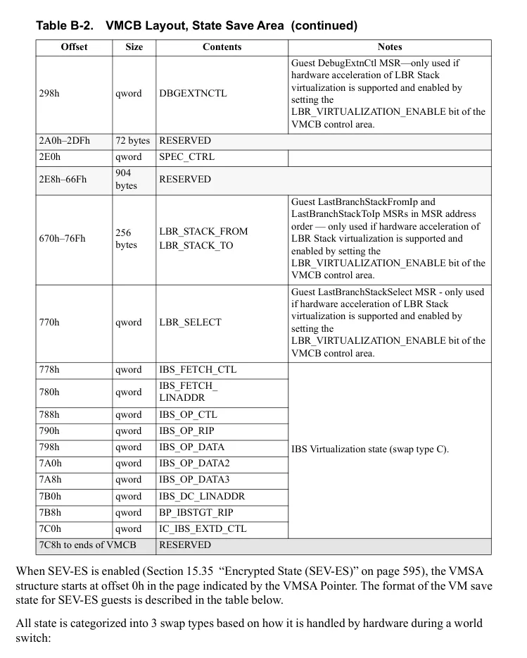

<!-- PDF source page: 809 | printed page: 747 -->

**Table B-3. Swap Types**

| Swap Type | Behavior in VMRUN | Behavior in AE VMEXIT |
| --- | --- | --- |
| A | Host state saved to host save area Guest state loaded from VMSA | Guest state saved to VMSA Host state loaded from host save area |
| B | Guest state loaded from VMSA (Host state not saved to host save area) | Guest state saved to VMSA Host state loaded from host save area |
| C | Guest state loaded from VMSA (Host state not saved to host save area) | Guest state saved to VMSA Host state initialized to default (reset) values |

The format of the host save area is identical to the guest save area described in the table below, except that it begins at offset 400h in the host save page (For example, the host TR value is stored at offset 490h relative to the start of the host save page.)

**Table B-4. VMSA Layout, State Save Area for SEV-ES**

| Offset | Size | Content | Swap Type | Notes |
| --- | --- | --- | --- | --- |
| 000h | 16 bytes | ES | A |  |
| 010h | 16 bytes | CS | A |  |
| 020h | 16 bytes | SS | A |  |
| 030h | 16 bytes | DS | A |  |
| 040h | 16 bytes | FS | B |  |
| 050h | 16 bytes | GS | B |  |
| 060h | 16 bytes | GDTR | A |  |
| 070h | 16 bytes | LDTR | B |  |
| 080h | 16 bytes | IDTR | A |  |
| 090h | 16 bytes | TR | B |  |
| 0A0h | qword | PL0 SSP | B |  |
| 0A8h | qword | PL1 SSP | B |  |
| 0B0h | qword | PL2 SSP | B |  |
| 0B8h | qword | PL3 SSP | B |  |
| 0C0h | qword | U CET | B |  |
| 0C8h | dword | RESERVED | – |  |
| 0CAh | yte | VMPL | – | Swapped for guest. Not used in host mode. |
| 0CBh | yte | CPL | A |  |
| 0CCh | dword | RESERVED | – |  |
| 0D0h | qword | EFER | A |  |
| 0D8h-0DFh | 8 bytes | RESERVED | – |  |
| 0E0h | qword | PERF CTL0 | C |  |

Rendered source page 809 (figures/tables)

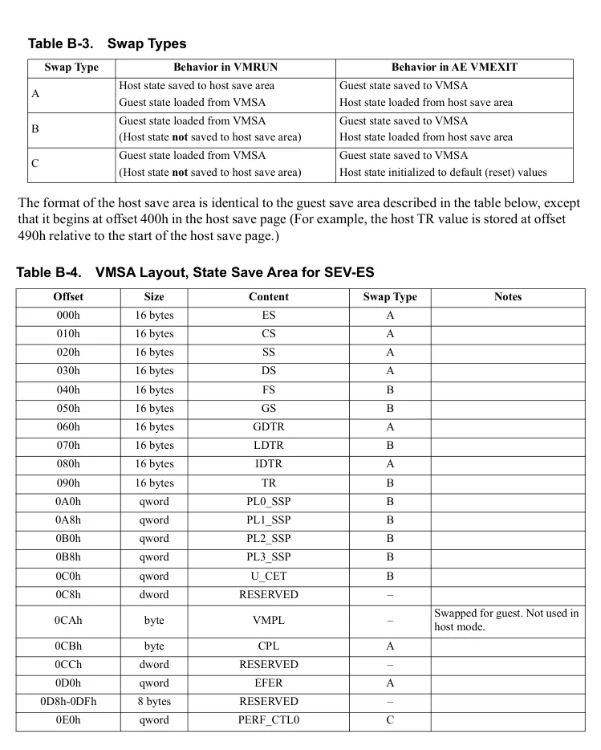

<!-- PDF source page: 810 | printed page: 748 -->

**Table B-4. VMSA Layout, State Save Area for SEV-ES (continued)**

| Offset | Size | Content | Swap Type | Notes |
| --- | --- | --- | --- | --- |
| 0E8h | qword | PERF CTR0 | C |  |
| 0F0h | qword | PERF CTL1 | C |  |
| 0F8h | qword | PERF CTR1 | C |  |
| 100h | qword | PERF CTL2 | C |  |
| 108h | qword | PERF CTR2 | C |  |
| 110h | qword | PERF CTL3 | C |  |
| 118h | qword | PERF CTR3 | C |  |
| 120h | qword | PERF CTL4 | C |  |
| 128h | qword | PERF CTR4 | C |  |
| 130h | qword | PERF CTL5 | C |  |
| 138h | qword | PERF CTR5 | C |  |
| 140h | qword | XSS | B |  |
| 148h | qword | CR4 | A |  |
| 150h | qword | CR3 | A |  |
| 158h | qword | CR0 | A |  |
| 160h | qword | DR7 | C |  |
| 168h | qword | DR6 | C |  |
| 170h | qword | RFLAGS | A |  |
| 178h | qword | RIP | A |  |
| 180h | qword | DR0 | B |  |
| 188h | qword | DR1 | B |  |
| 190h | qword | DR2 | B |  |
| 198h | qword | DR3 | B |  |
| 1A0h | qword | DR0 ADDR MASK _ _ | B |  |
| 1A8h | qword | DR1 ADDR MASK _ _ | B |  |
| 1B0h | qword | DR2 ADDR MASK _ _ | B |  |
| 1B8h | qword | DR3 ADDR MASK _ _ | B |  |
| 1C0h | qword | INSTR RETIRED CTR _ _ | A |  |
| 1C8h | qword | PERF CTR GLOBAL STS _ _ _ | A |  |
| 1D0h | dword | PERF CTR GLOBAL CTL _ _ _ | C |  |
| 1D4h-1D7h | 4 bytes | RESERVED | – |  |
| 1D8h | qword | RSP | A |  |
| 1E0h | qword | S CET | A |  |
| 1E8h | qword | SSP | A |  |
| 1F0h | qword | ISST ADDR | A |  |
| 1F8h | qword | RAX | A |  |

Rendered source page 810 (figures/tables)

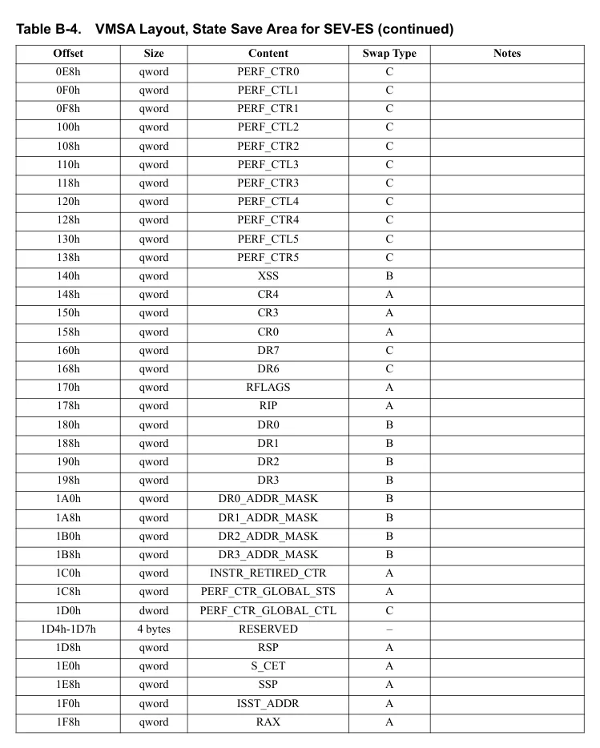

<!-- PDF source page: 811 | printed page: 749 -->

**Table B-4. VMSA Layout, State Save Area for SEV-ES (continued)**

| Offset | Size | Content | Swap Type | Notes |
| --- | --- | --- | --- | --- |
| 200h | qword | STAR | B |  |
| 208h | qword | LSTAR | B |  |
| 210h | qword | CSTAR | B |  |
| 218h | qword | SFMASK | B |  |
| 220h | qword | KernelGsBase | B |  |
| 228h | qword | SYSENTER CS | B |  |
| 230h | qword | SYSENTER ESP | B |  |
| 238h | qword | SYSENTER EIP | B |  |
| 240h | qword | CR2 | C |  |
| 248h-267h | 32 bytes | RESERVED | – |  |
| 268h | qword | G PAT | – | Swapped for guest, not used in host mode. |
| 270h | qword | DBGCTL | A |  |
| 278h | qword | BR FROM | A |  |
| 280h | qword | BR TO | A |  |
| 288h | qword | LASTEXCPFROM | A |  |
| 290h | qword | LASTEXCPTO | A |  |
| 298h | qword | DBGEXTNCFG | A |  |
| 2A0-2DFh | 72 bytes | RESERVED | – |  |
| 2E0h | qword | SPEC CTRL | A |  |
| 2E8h | dword | PKRU | B |  |
| 2ECh | dword | TSC AUX | B |  |
| 2F0h | qword | GUEST TSC SCALE _ _ | – |  |
| 2F8h | qword | GUEST TSC OFFSET _ _ | – |  |
| 300h | qword | REG PROT NONCE _ _ | – |  |
| 308h | qword | RCX | B |  |
| 310h | qword | RDX | B |  |
| 318h | qword | RBX | B |  |
| 320h | qword | SECURE AVIC CTL _ _ | – |  |
| 328h | qword | RBP | B |  |
| 330h | qword | RSI | B |  |
| 338h | qword | RDI | B |  |
| 340h | qword | R8 | B |  |
| 348h | qword | R9 | B |  |
| 350h | qword | R10 | B |  |
| 358h | qword | R11 | B |  |

Rendered source page 811 (figures/tables)

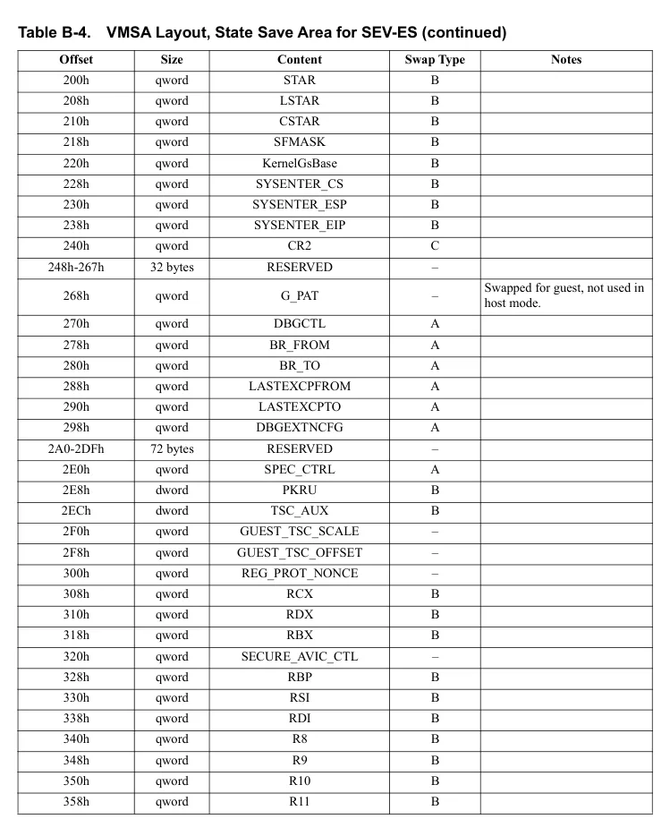

<!-- PDF source page: 812 | printed page: 750 -->

**Table B-4. VMSA Layout, State Save Area for SEV-ES (continued)**

| Offset | Size | Content | Swap Type | Notes |
| --- | --- | --- | --- | --- |
| 360h | qword | R12 | B |  |
| 368h | qword | R13 | B |  |
| 370h | qword | R14 | B |  |
| 378h | qword | R15 | B |  |
| 380h | 16 bytes | RESERVED | – |  |
| 390h | qword | GUEST EXITINFO1 | – | EXITINFO1 for AE exits |
| 398h | qword | GUEST EXITINFO2 | – | EXITINFO2 for AE exits |
| 3A0h | qword | GUEST EXITINTINFO | – | EXITINTINFO for AE exits |
| 3A8h | qword | GUEST NRIP | – | Next sequential instruction pointer for AE exits |
| 3B0h | qword | SEV FEATURES | – | Guest-controlled SEV feature selection • Bit 0: SNPActive • Bit 1: vTOM • Bit 2: ReflectVC • Bit 3: RestrictedInjection • Bit 4: AlternateInjection • Bit 5: DebugVirtualization • Bit 6: PreventHostIBS • Bit 7: BTBIsolation • Bit 8: VmplSSS • Bit 9: SecureTSC • Bit 10: VmgexitParameter • Bit 11: PmcVirtualization * • Bit 12: IbsVirtualization • Bit 13: GuestInterceptCtl * • Bit 14: VmsaRegProt • Bit 15: SmtProtection • Bit 16: SecureAvic * • Bit 20:17: Reserved, SBZ • Bit 21: IbpbOnEntry • Bits 63:22: Reserved, SBZ * - This feature may only be used if Allowed SEV Features is enabled and the Allowed SEV Features Mask permits the use of the feature. |

Rendered source page 812 (figures/tables)

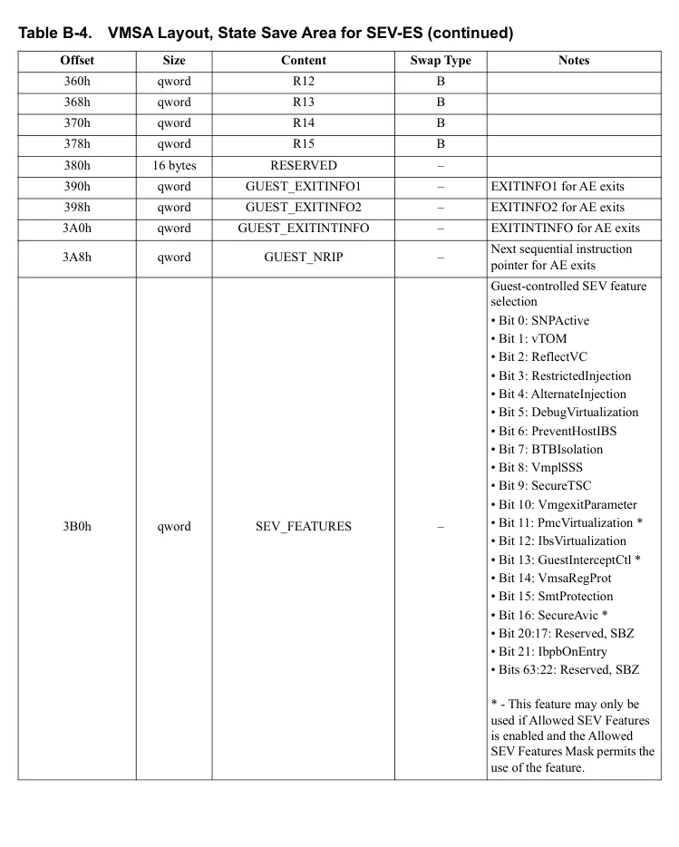

<!-- PDF source page: 813 | printed page: 751 -->

**Table B-4. VMSA Layout, State Save Area for SEV-ES (continued)**

| Offset | Size | Content | Swap Type | Notes |
| --- | --- | --- | --- | --- |
| 3B8h | qword | VINTR CTRL | – | • Bits 7:0: V TPR • Bit 8: V IRQ • Bit 9: VGIF • Bit 10: INT SHADOW • Bit 11: V NMI • Bit 12: V NMI MASK _ _ • Bits 15:13: Reserved, SBZ • Bits 19:16: V INTR PRIO _ _ • Bit 20: V IGN TPR _ _ • Bits 25:21: Reserved, SBZ • Bit 26: V NMI ENABLE _ _ • Bits 31:27: Reserved, SBZ • Bits 39:32: V INTR VECTOR _ _ • Bits 62:40: Reserved, SBZ • Bit 63: BUSY |
| 3C0h | qword | GUEST EXITCODE | – | EXITCODE for AE exits |
| 3C8h | qword | VIRTUAL TOM | – | Swapped for guest, not used in host mode. Only bits 51:21 are observed. |
| 3D0h | qword | TLB ID | – |  |
| 3D8h | qword | PCPU ID | – |  |
| 3E0h | qword | EVENTINJ | – | Same as the EVENTINJ field in the VMCB (Table B-1) at offset 0A8h. |
| 3E8h | qword | XCR0 | B |  |
| 3F0h-3FFh | 16 bytes | Reserved | – |  |
| 400h | qword | X87 DP | C | FP x87 data pointe |
| 408h | dword | MXCSR | C | FP MXCSR |
| 40Ch | word | X87 FTW | C | FP x87 tag word |
| 40Eh | word | X87 FSW | C | FP x87 status word |
| 410h | word | X87 FCW | C | FP control word |
| 412h | word | X87 FOP | C | FP x87 opcode |
| 414h | word | X87 DS | C | FP x87 DS |
| 416h | word | X87 CS | C | FP x87 CS |
| 418h | qword | X87 RIP | C | FP x87 RIP |
| 420h-46Fh | 80 bytes | FPREG X87 | C | X87 register state (stack order) |
| 470h-56Fh | 256 bytes | FPREG XMM | C | XMM register state |
| 570h-66Fh | 256 bytes | FPREG YMM | C | YMM HI register state |

Rendered source page 813 (figures/tables)

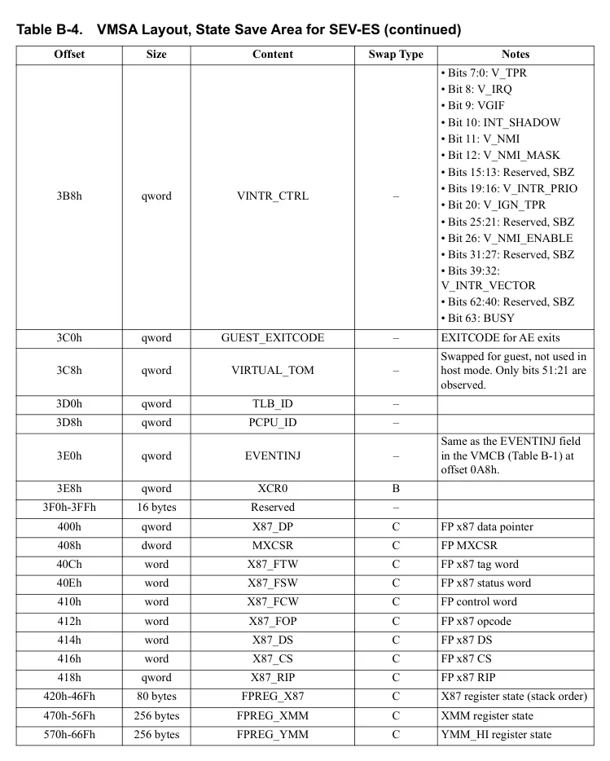

<!-- PDF source page: 814 | printed page: 752 -->

**Table B-4. VMSA Layout, State Save Area for SEV-ES (continued)**

| Offset | Size | Content | Swap Type | Notes |
| --- | --- | --- | --- | --- |
| 670h-76Fh | 256 bytes | LBR STACK FROM _ _ LBR STACK TO _ _ | C | LBR Stack state |
| 770h | qword | LBR SELECT | C | LastBranchStackSelect state |
| 778h | qword | IBS FETCH CTL _ _ | C | IBS Virtualization state |
| 780h | qword | IBS FETCH LINADDR _ _ | C |  |
| 788h | qword | IBS OP CTL _ _ | C |  |
| 790h | qword | IBS OP RIP _ _ | C |  |
| 798h | qword | IBS OP DATA _ _ | C |  |
| 7A0h | qword | IBS OP DATA2 _ _ | C |  |
| 7A8h | qword | IBS OP DATA3 _ _ | C |  |
| 7B0h | qword | IBS DC LINADDR _ _ | C |  |
| 7B8h | qword | BP IBSTGT RIP _ _ | C |  |
| 7C0h | qword | IC IBS EXTD CTL _ _ _ | C |  |
| 7C8h-8FFh | 312 bytes | RESERVED | – |  |
| 900h | dword | INTERCEPT VEC 0 _ _ | – | Guest Intercept Control See Section 15.36.23, “Guest Intercept Control,” on page 623. See Table B-5. See Table B-6. See Table B-7. See Table B-8. |
| 904h | dword | INTERCEPT VEC 1 _ _ | – |  |
| 908h | dword | INTERCEPT VEC 2 _ _ | – |  |
| 90Ch | dword | INTERCEPT VEC 3 _ _ | – |  |
| 910h | dword | INTERCEPT VEC 4 _ _ | – |  |
| 914h | dword | INTERCEPT VEC 5 _ _ | – |  |
| 918h | dword | INTERCEPT VEC 6 _ _ | – |  |
| 91Ch | dword | INTERCEPT VEC 7 _ _ | – |  |
| 920h | qword | INTERCEPT MSR VEC 0 _ _ _ | – |  |
| 928h | qword | INTERCEPT MSR VEC 1 _ _ _ | – |  |
| 930h | qword | INTERCEPT MSR VEC 2 _ _ _ | – |  |
| 938h | qword | INTERCEPT MSR VEC 3 _ _ _ | – |  |
| 940h-97Fh | 64 bytes | RESERVED | – |  |
| 980h-9BFh | 64 bytes | FPREG K | C | AVX512 K0-K7 opmask registers |
| 9C0h-BBFh | 512 bytes | FPREG ZMMHI | C | ZMM0-ZMM15 register state, upper half |
| BC0h-FBFh | 1024 bytes | FPREG HIZMM | C | ZMM16-ZMM31 register state |

Rendered source page 814 (figures/tables)

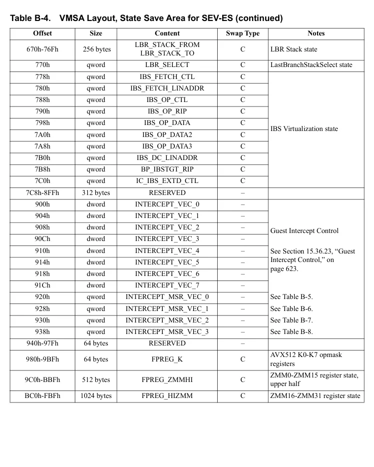

<!-- PDF source page: 815 | printed page: 753 -->

## B.1 Guest MSR Intercepts

The guest-controlled MSR intercept layout for VMSA fields INTERCEPT_MSR_VEC0-3 is shown in Table B-5, Table B-6, Table B-7, and Table B-8. See Section 15.36.23, “Guest Intercept Control,” on page 623.

**Table B-5. INTERCEPT_MSR_VEC0 Layout**

| RDMSR Intercept Bit | WRMSR Intercept Bit | MSR Name | MSR Address |
| --- | --- | --- | --- |
| 0 | 1 | FS BASE | C000 0100h |
| 2 | 3 | GS BASE | C000 0101h |
| 4 | 5 | KERNEL GS BASE _ _ | C000 0102h |
| 6 | 7 | EFER | C000 0080h |
| 8 | 9 | STAR | C000 0081h |
| 10 | 11 | LSTAR | C000 0082h |
| 12 | 13 | CSTAR | C000 0083h |
| 14 | 15 | SF MASK | C000 0084h |
| 16 | 17 | SYSENTER CS | 174h |
| 18 | 19 | SYSENTER RSP | 175h |
| 20 | 21 | SYSENTER RIP | 176h |
| 22 | 23 | CET U | 6A0h |
| 24 | 25 | CET S | 6A2h |
| 26 | 27 | PL0 SSP | 6A4h |
| 28 | 29 | PL1 SSP | 6A5h |
| 30 | 31 | PL2 SSP | 6A6h |
| 32 | 33 | PL3 SSP | 6A7h |
| 34 | 35 | IST SSP ADDR _ _ | 6A8h |
| 36 | 37 | XSS | DA0h |
| 38 | 39 | DBG CTL | 1D9h |
| 40 | 41 | LAST BR FROM IP _ _ _ | 1DBh |
| 42 | 43 | LAST BR TO IP _ _ _ | 1DCh |
| 44 | 45 | LAST INT FROM IP _ _ _ | 1DDh |
| 46 | 47 | LAST INT TO IP _ _ _ | 1DEh |
| 48 | 49 | LBR SELECT | C000 010Eh |
| 50 | 51 | DBGEXTNCFG | C000 010Fh |
| 52 | 53 | DR0 ADDR MASK _ _ | C001 1027h |
| 54 | 55 | DR1 ADDR MASK _ _ | C001 1019h |
| 56 | 57 | DR2 ADDR MASK _ _ | C001 101Ah |

Rendered source page 815 (figures/tables)

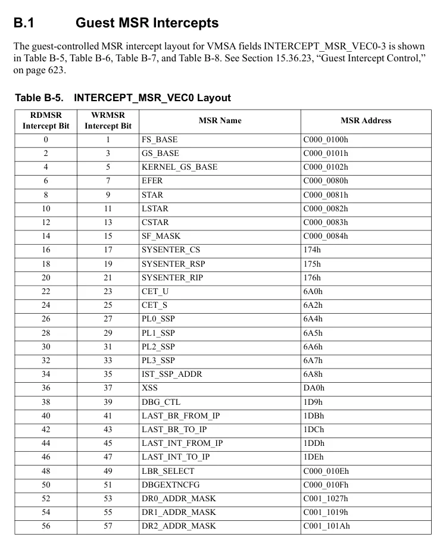

<!-- PDF source page: 816 | printed page: 754 -->

**Table B-5. INTERCEPT_MSR_VEC0 Layout (continued)**

| RDMSR Intercept Bit | WRMSR Intercept Bit | MSR Name | MSR Address |
| --- | --- | --- | --- |
| 58 | 59 | DR3 ADDR MASK _ _ | C001 101Bh |
| 60 | 61 | SPEC CTRL | 48h |
| 62 | 63 | PRED CMD | 49h |

**Table B-6. INTERCEPT_MSR_VEC1 Layout**

| RDMSR Intercept Bit | WRMSR Intercept Bit | MSR Name | MSR Address |
| --- | --- | --- | --- |
| 0 | 1 | PERF CTL0 | C001 0000h, C001 0200h _ _ |
| 2 | 3 | PERF CTR0 | C001 0004h, C001 0201h _ _ |
| 4 | 5 | PERF CTL1 | C001 0001h, C001 0202h _ _ |
| 6 | 7 | PERF CTR1 | C001 0005h, C001 0203h _ _ |
| 8 | 9 | PERF CTL2 | C001 0002h, C001 0204h _ _ |
| 10 | 11 | PERF CTR2 | C001 0006h, C001 0205h _ _ |
| 12 | 13 | PERF CTL3 | C001 0003h, C001 0206h _ _ |
| 14 | 15 | PERF CTR3 | C001 0007h, C001 0207h _ _ |
| 16 | 17 | PERF CTL4 | C001 0208h |
| 18 | 19 | PERF CTR4 | C001 0209h |
| 20 | 21 | PERF CTL5 | C001 020Ah |
| 22 | 23 | PERF CTR5 | C001 020Bh |
| 24 | 25 | Reserved |  |
| 26 | 27 | Reserved |  |
| 28 | 29 | Reserved |  |
| 30 | 31 | Reserved |  |
| 32 | 33 | INST RET CNT _ _ | C000 00E9h |
| 34 | 35 | IBS FETCH CTL _ _ | C001 1030h |
| 36 | 37 | IBS FETCH LIN ADDR _ _ _ | C001 1031h |
| 38 | 39 | IBS OP CTL _ _ | C001 1033h |
| 40 | 41 | IBS OP RIP _ _ | C001 1034h |
| 42 | 43 | IBS OP DATA _ _ | C001 1035h |
| 44 | 45 | IBS OP DATA2 _ _ | C001 1036h |
| 46 | 47 | IBS OP DATA3 _ _ | C001 1037h |
| 48 | 49 | IBS DC LINADDR _ _ | C001 1038h |
| 50 | 51 | IBS BR TGT RIP _ _ _ | C001 103Bh |
| 52 | 53 | IBS FETCH EXTD CTL _ _ _ | C001 103Ch |
| 54 | 55 | LAST BRANCH STACK FROM/TO _ _ _ | C001 0300h - C001 031Fh _ _ |

Rendered source page 816 (figures/tables)

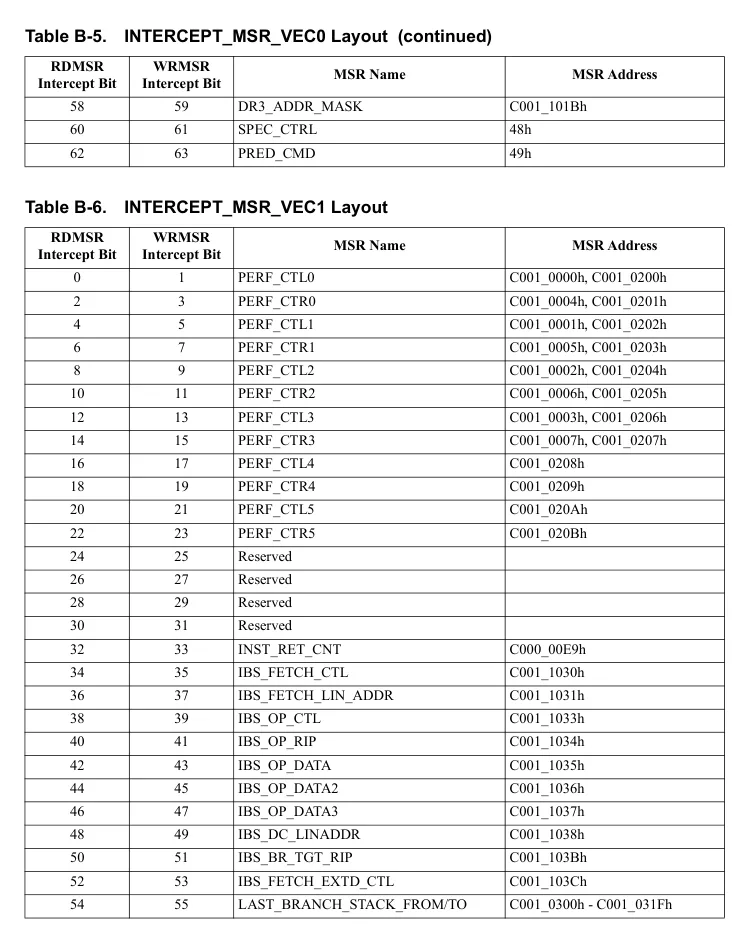

<!-- PDF source page: 817 | printed page: 755 -->

**Table B-6. INTERCEPT_MSR_VEC1 Layout (continued)**

| RDMSR Intercept Bit | WRMSR Intercept Bit | MSR Name | MSR Address |
| --- | --- | --- | --- |
| 56 | 57 | PERF GLOBAL STS _ _ | C000 0300h |
| 58 | 59 | PERF GLOBAL CTL _ _ | C000 0301h |
| 60 | 61 | PERF GLOBAL STS CLR _ _ _ | C000 0302h |
| 62 | 63 | PERF GLOBAL STS SET _ _ _ | C000 0303h |

**Table B-7. INTERCEPT_MSR_VEC2 Layout**

| RDMSR Intercept Bit | WRMSR Intercept Bit | MSR Name | MSR Address |
| --- | --- | --- | --- |
| 0 | 1 | PAT | 277h |
| 2 | 3 | TSC AUX | C000 0103h |
| 4 | 5 | GHCB | C001 0130h |
| 6 | 7 | GUEST TSC FREQ _ _ | C001 0134h |
| 8 | 9 | SEV STATUS | C001 0131h |
| 10 | 11 | VIRTUAL TOM | C001 0135h |
| 12 - 63 | 11 | Reserved |  |

**Table B-8. INTERCEPT_MSR_VEC3 Layout**

| RDMSR Intercept Bit | WRMSR Intercept Bit | MSR Name | MSR Address |
| --- | --- | --- | --- |
| 0 - 63 |  | Reserved |  |

Rendered source page 817 (figures/tables)

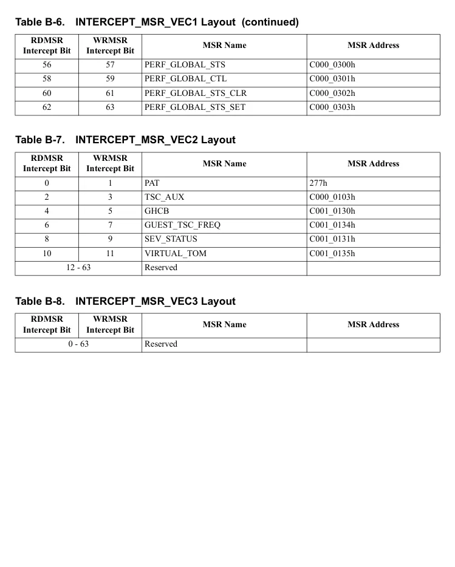

