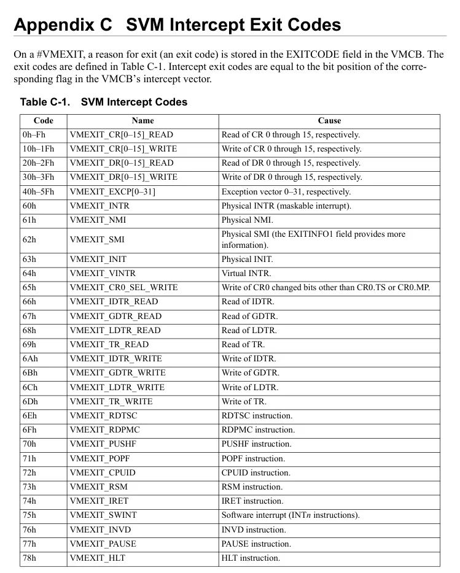
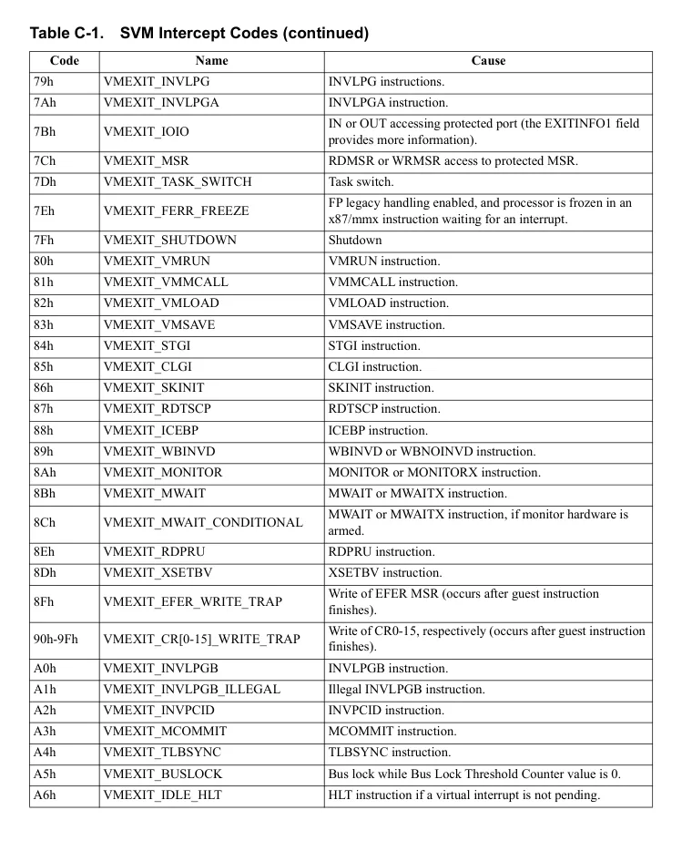
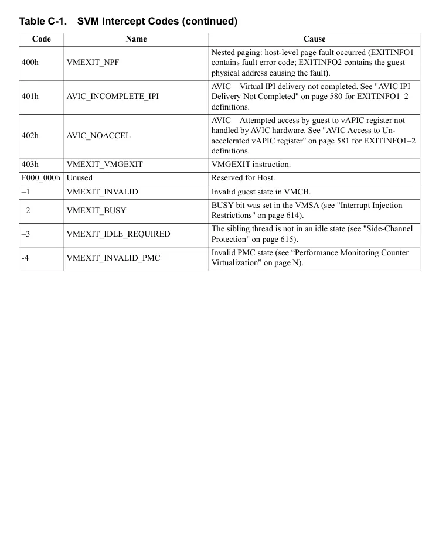

<!-- PDF source page: 818 | printed page: 756 -->

# Appendix C SVM Intercept Exit Codes

On a #VMEXIT, a reason for exit (an exit code) is stored in the EXITCODE field in the VMCB. The exit codes are defined in Table C-1. Intercept exit codes are equal to the bit position of the corre-sponding flag in the VMCB’s intercept vector.

**Table C-1. SVM Intercept Codes**

| Code | Name | Cause |
| --- | --- | --- |
| 0h–Fh | VMEXIT CR[0–15] READ _ _ | Read of CR 0 through 15, respectively. |
| 10h–1Fh | VMEXIT CR[0–15] WRITE _ _ | Write of CR 0 through 15, respectively. |
| 20h–2Fh | VMEXIT DR[0–15] READ _ _ | Read of DR 0 through 15, respectively. |
| 30h–3Fh | VMEXIT DR[0–15] WRITE _ _ | Write of DR 0 through 15, respectively. |
| 40h–5Fh | VMEXIT EXCP[0–31] | Exception vector 0–31, respectively. |
| 60h | VMEXIT INTR | Physical INTR (maskable interrupt). |
| 61h | VMEXIT NMI | Physical NMI. |
| 62h | VMEXIT SMI | Physical SMI (the EXITINFO1 field provides more information). |
| 63h | VMEXIT INIT | Physical INIT. |
| 64h | VMEXIT VINTR | Virtual INTR. |
| 65h | VMEXIT CR0 SEL WRITE _ _ _ | Write of CR0 changed bits other than CR0.TS or CR0.MP. |
| 66h | VMEXIT IDTR READ _ _ | Read of IDTR. |
| 67h | VMEXIT GDTR READ _ _ | Read of GDTR. |
| 68h | VMEXIT LDTR READ _ _ | Read of LDTR. |
| 69h | VMEXIT TR READ _ _ | Read of TR. |
| 6Ah | VMEXIT IDTR WRITE _ _ | Write of IDTR. |
| 6Bh | VMEXIT GDTR WRITE _ _ | Write of GDTR. |
| 6Ch | VMEXIT LDTR WRITE _ _ | Write of LDTR. |
| 6Dh | VMEXIT TR WRITE _ _ | Write of TR. |
| 6Eh | VMEXIT RDTSC | RDTSC instruction. |
| 6Fh | VMEXIT RDPMC | RDPMC instruction. |
| 70h | VMEXIT PUSHF | PUSHF instruction. |
| 71h | VMEXIT POPF | POPF instruction. |
| 72h | VMEXIT CPUID | CPUID instruction. |
| 73h | VMEXIT RSM | RSM instruction. |
| 74h | VMEXIT IRET | IRET instruction. |
| 75h | VMEXIT SWINT | Software interrupt (INTn instructions). |
| 76h | VMEXIT INVD | INVD instruction. |
| 77h | VMEXIT PAUSE | PAUSE instruction. |
| 78h | VMEXIT HLT | HLT instruction. |

Rendered source page 818 (figures/tables)

<!-- PDF source page: 819 | printed page: 757 -->

**Table C-1. SVM Intercept Codes (continued)**

| Code | Name | Cause |
| --- | --- | --- |
| 79h | VMEXIT INVLPG | INVLPG instructions. |
| 7Ah | VMEXIT INVLPGA | INVLPGA instruction. |
| 7Bh | VMEXIT IOIO | IN or OUT accessing protected port (the EXITINFO1 field provides more information). |
| 7Ch | VMEXIT MSR | RDMSR or WRMSR access to protected MSR. |
| 7Dh | VMEXIT TASK SWITCH _ _ | Task switch. |
| 7Eh | VMEXIT FERR FREEZE _ _ | FP legacy handling enabled, and processor is frozen in an x87/mmx instruction waiting for an interrupt. |
| 7Fh | VMEXIT SHUTDOWN | Shutdown |
| 80h | VMEXIT VMRUN | VMRUN instruction. |
| 81h | VMEXIT VMMCALL | VMMCALL instruction. |
| 82h | VMEXIT VMLOAD | VMLOAD instruction. |
| 83h | VMEXIT VMSAVE | VMSAVE instruction. |
| 84h | VMEXIT STGI | STGI instruction. |
| 85h | VMEXIT CLGI | CLGI instruction. |
| 86h | VMEXIT SKINIT | SKINIT instruction. |
| 87h | VMEXIT RDTSCP | RDTSCP instruction. |
| 88h | VMEXIT ICEBP | ICEBP instruction. |
| 89h | VMEXIT WBINVD | WBINVD or WBNOINVD instruction. |
| 8Ah | VMEXIT MONITOR | MONITOR or MONITORX instruction. |
| 8Bh | VMEXIT MWAIT | MWAIT or MWAITX instruction. |
| 8Ch | VMEXIT MWAIT CONDITIONAL _ _ | MWAIT or MWAITX instruction, if monitor hardware is armed. |
| 8Eh | VMEXIT RDPRU | RDPRU instruction. |
| 8Dh | VMEXIT XSETBV | XSETBV instruction. |
| 8Fh | VMEXIT EFER WRITE TRAP _ _ _ | Write of EFER MSR (occurs after guest instruction finishes). |
| 90h-9Fh | VMEXIT CR[0-15] WRITE TRAP _ _ _ | Write of CR0-15, respectively (occurs after guest instruction finishes). |
| A0h | VMEXIT INVLPGB | INVLPGB instruction. |
| A1h | VMEXIT INVLPGB ILLEGAL _ _ | Illegal INVLPGB instruction. |
| A2h | VMEXIT INVPCID | INVPCID instruction. |
| A3h | VMEXIT MCOMMIT | MCOMMIT instruction. |
| A4h | VMEXIT TLBSYNC | TLBSYNC instruction. |
| A5h | VMEXIT BUSLOCK | Bus lock while Bus Lock Threshold Counter value is 0. |
| A6h | VMEXIT IDLE HLT _ _ | HLT instruction if a virtual interrupt is not pending. |

Rendered source page 819 (figures/tables)

<!-- PDF source page: 820 | printed page: 758 -->

**Table C-1. SVM Intercept Codes (continued)**

| Code | Name | Cause |
| --- | --- | --- |
| 400h | VMEXIT NPF | Nested paging: host-level page fault occurred (EXITINFO1 contains fault error code; EXITINFO2 contains the guest physical address causing the fault). |
| 401h | AVIC INCOMPLETE IPI _ _ | AVIC—Virtual IPI delivery not completed. See "AVIC IPI Delivery Not Completed" on page 580 for EXITINFO1–2 definitions. |
| 402h | AVIC NOACCEL | AVIC—Attempted access by guest to vAPIC register not handled by AVIC hardware. See "AVIC Access to Un- accelerated vAPIC register" on page 581 for EXITINFO1–2 definitions. |
| 403h | VMEXIT VMGEXIT | VMGEXIT instruction. |
| F000 000h | Unused | Reserved for Host. |
| –1 | VMEXIT INVALID | Invalid guest state in VMCB. |
| –2 | VMEXIT BUSY | BUSY bit was set in the VMSA (see "Interrupt Injection Restrictions" on page 614). |
| –3 | VMEXIT IDLE REQUIRED _ _ | The sibling thread is not in an idle state (see "Side-Channel Protection" on page 615). |
| -4 | VMEXIT INVALID PMC _ _ | Invalid PMC state (see “Performance Monitoring Counter Virtualization” on page N). |

Rendered source page 820 (figures/tables)

