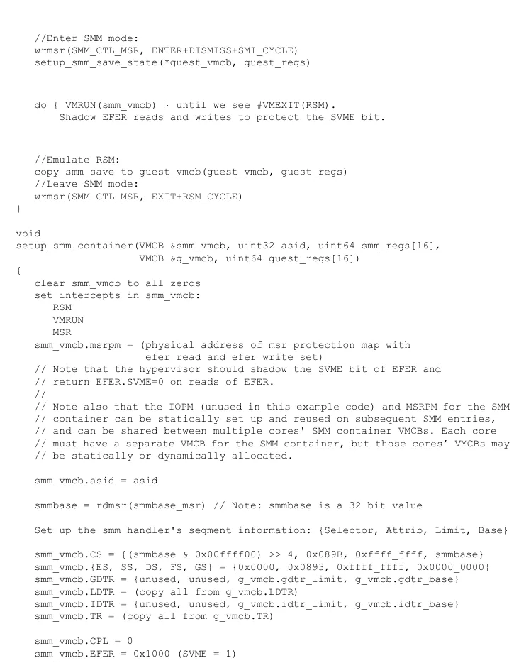
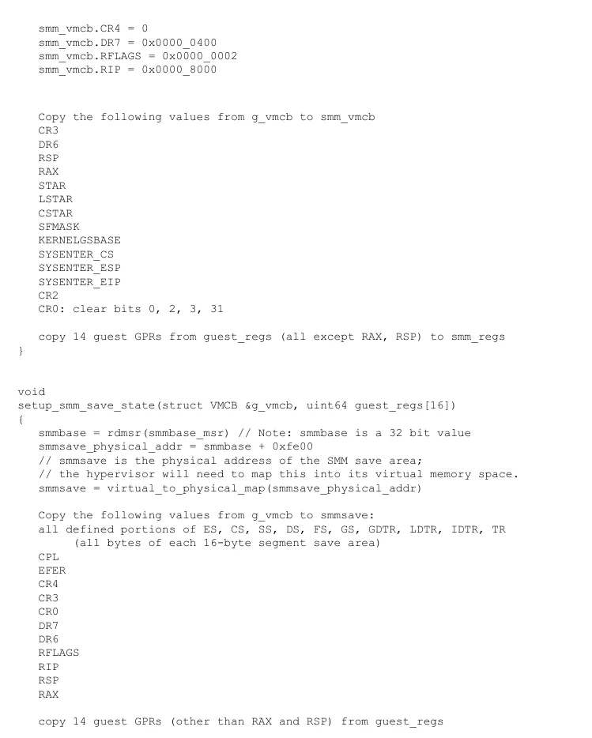
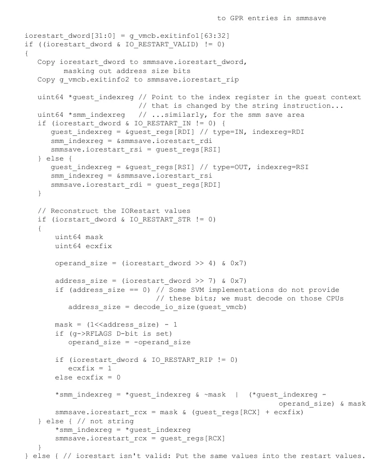
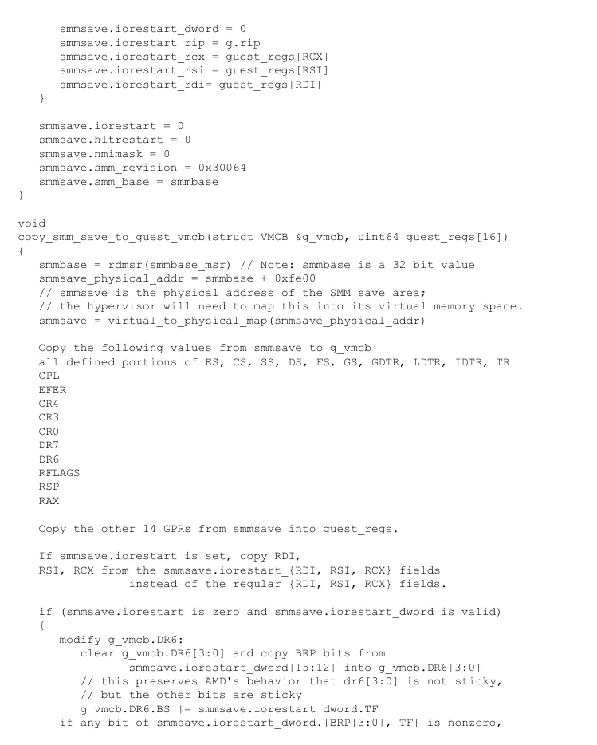
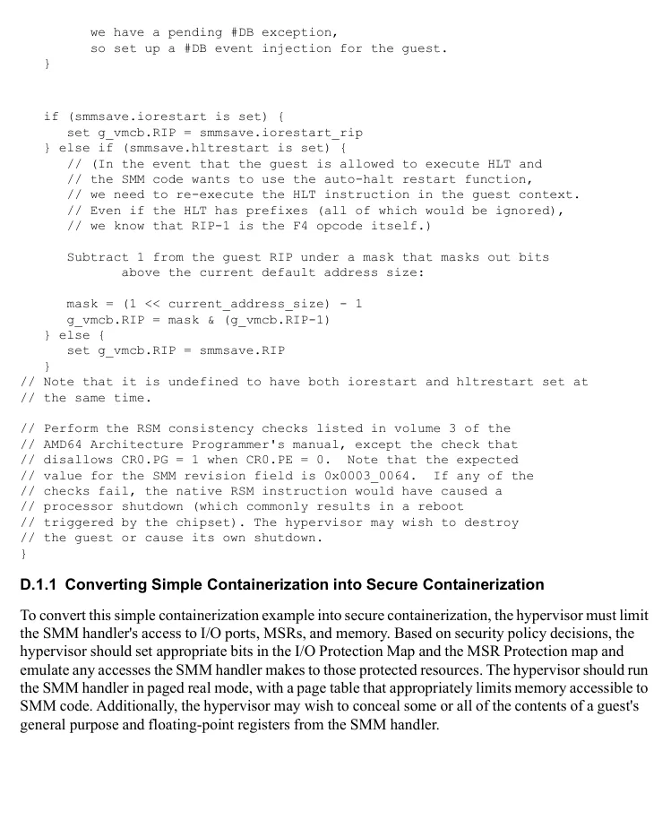

<!-- PDF source page: 821 | printed page: 759 -->

<a id="appendix-d-smm-containerization"></a>

# Appendix D SMM Containerization

To minimally participate in SMM activity, the VMM can implement simple containerization. This appendix provides example pseudocode to perform this simple containerization. VMMs that do not trust SMM code should implement secure containerization, which requires further extension of the code provided here.

<a id="d-1-smm-containerization-pseudocode"></a>

## D.1 SMM Containerization Pseudocode

This code emulates transitions to and from SMM:

- The process of entering SMM mode as a result of a system management interrupt (SMI)
- The RSM instruction, which returns the processor from SMM.

A hypervisor that containerizes SMM must set the SMM intercept bit in all guest VMCBs. When the hypervisor encounters a #VMEXIT(SMI), it should then emulate SMM entry and execute the SMM handler by means of VMRUN with the RSM intercept bit set. When the RSM instruction is intercepted, the hypervisor should emulate the RSM instruction and then resume normal execution.

In this code, the hypervisor sets up the `smm_vmcb` from scratch and assigns it the supplied address space identifier (ASID).

This example code sets up a container VMCB for the SMM handler and copies appropriate state information into the SMM save area. After calling `emulate_smm()`, the hypervisor should repeatedly VMRUN the SMM handler VMCB until the hypervisor encounters a #VMEXIT(RSM). Finally, the hypervisor should call `emulate_rsm()`.

```text
//emulate_smm( ):
// Inputs:
// smm_vmcb: the _virtual address_ of a VMCB that will be configured
// as an SMM container
// asid: the asid to use for the SMM handler; the hypervisor should
// ensure that no TLB entries for this ASID are present in the TLB
// smm_regs: an array of 64-bit values that will be filled with the
// GPRs (except RSP and RAX) for the SMM handler
// guest_vmcb: the _virtual address_ of the VMCB of the guest
// that was running when the intercepted SMI occurred
// guest_regs: an array of 64-bit values that contains the GPRs (except RSP
// and RAX) for the guest that was running when the intercepted
// SMI occurred
```

```text
void
emulate_smm(VMCB *smm_vmcb, uint32 asid, uint64 smm_regs[16],
VMCB *guest_vmcb, uint64 guest_regs[16])
{
setup_smm_container(*smm_vmcb, asid, smm_regs, *guest_vmcb, guest_regs)
```


<!-- PDF source page: 822 | printed page: 760 -->

```text
//Enter SMM mode:
wrmsr(SMM_CTL_MSR, ENTER+DISMISS+SMI_CYCLE)
setup_smm_save_state(*guest_vmcb, guest_regs)
```

```text
do { VMRUN(smm_vmcb) } until we see #VMEXIT(RSM).
Shadow EFER reads and writes to protect the SVME bit.
```

```text
//Emulate RSM:
copy_smm_save_to_guest_vmcb(guest_vmcb, guest_regs)
//Leave SMM mode:
wrmsr(SMM_CTL_MSR, EXIT+RSM_CYCLE)
}
```

```text
void
setup_smm_container(VMCB &smm_vmcb, uint32 asid, uint64 smm_regs[16],
VMCB &g_vmcb, uint64 guest_regs[16])
{
clear smm_vmcb to all zeros
set intercepts in smm_vmcb:
RSM
VMRUN
MSR
smm_vmcb.msrpm = (physical address of msr protection map with
efer read and efer write set)
// Note that the hypervisor should shadow the SVME bit of EFER and
// return EFER.SVME=0 on reads of EFER.
//
// Note also that the IOPM (unused in this example code) and MSRPM for the SMM
// container can be statically set up and reused on subsequent SMM entries,
// and can be shared between multiple cores' SMM container VMCBs. Each core
// must have a separate VMCB for the SMM container, but those cores’ VMCBs may
// be statically or dynamically allocated.
```

```text
smm_vmcb.asid = asid
```

```text
smmbase = rdmsr(smmbase_msr) // Note: smmbase is a 32 bit value
```

```text
Set up the smm handler's segment information: {Selector, Attrib, Limit, Base}
```

```text
smm_vmcb.CS = {(smmbase & 0x00ffff00) >> 4, 0x089B, 0xffff_ffff, smmbase}
smm_vmcb.{ES, SS, DS, FS, GS} = {0x0000, 0x0893, 0xffff_ffff, 0x0000_0000}
smm_vmcb.GDTR = {unused, unused, g_vmcb.gdtr_limit, g_vmcb.gdtr_base}
smm_vmcb.LDTR = (copy all from g_vmcb.LDTR)
smm_vmcb.IDTR = {unused, unused, g_vmcb.idtr_limit, g_vmcb.idtr_base}
smm_vmcb.TR = (copy all from g_vmcb.TR)
```

```text
smm_vmcb.CPL = 0
smm_vmcb.EFER = 0x1000 (SVME = 1)
```

<details>
<summary>Rendered source page 822 (figures/tables)</summary>



</details>


<!-- PDF source page: 823 | printed page: 761 -->

```text
smm_vmcb.CR4 = 0
smm_vmcb.DR7 = 0x0000_0400
smm_vmcb.RFLAGS = 0x0000_0002
smm_vmcb.RIP = 0x0000_8000
```

```text
Copy the following values from g_vmcb to smm_vmcb
CR3
DR6
RSP
RAX
STAR
LSTAR
CSTAR
SFMASK
KERNELGSBASE
SYSENTER_CS
SYSENTER_ESP
SYSENTER_EIP
CR2
CR0: clear bits 0, 2, 3, 31
```

```text
copy 14 guest GPRs from guest_regs (all except RAX, RSP) to smm_regs
}
```

```text
void
setup_smm_save_state(struct VMCB &g_vmcb, uint64 guest_regs[16])
{
smmbase = rdmsr(smmbase_msr) // Note: smmbase is a 32 bit value
smmsave_physical_addr = smmbase + 0xfe00
// smmsave is the physical address of the SMM save area;
// the hypervisor will need to map this into its virtual memory space.
smmsave = virtual_to_physical_map(smmsave_physical_addr)
```

```text
Copy the following values from g_vmcb to smmsave:
all defined portions of ES, CS, SS, DS, FS, GS, GDTR, LDTR, IDTR, TR
(all bytes of each 16-byte segment save area)
CPL
EFER
CR4
CR3
CR0
DR7
DR6
RFLAGS
RIP
RSP
RAX
```

```text
copy 14 guest GPRs (other than RAX and RSP) from guest_regs
```

<details>
<summary>Rendered source page 823 (figures/tables)</summary>



</details>


<!-- PDF source page: 824 | printed page: 762 -->

```text
to GPR entries in smmsave
```

```text
iorestart_dword[31:0] = g_vmcb.exitinfo1[63:32]
if ((iorestart_dword & IO_RESTART_VALID) != 0)
{
Copy iorestart_dword to smmsave.iorestart_dword,
masking out address size bits
Copy g_vmcb.exitinfo2 to smmsave.iorestart_rip
```

```text
uint64 *guest_indexreg // Point to the index register in the guest context
// that is changed by the string instruction...
uint64 *smm_indexreg // ...similarly, for the smm save area
if (iorestart_dword & IO_RESTART_IN != 0) {
guest_indexreg = &guest_regs[RDI] // type=IN, indexreg=RDI
smm_indexreg = &smmsave.iorestart_rdi
smmsave.iorestart_rsi = guest_regs[RSI]
} else {
guest_indexreg = &guest_regs[RSI] // type=OUT, indexreg=RSI
smm_indexreg = &smmsave.iorestart_rsi
smmsave.iorestart_rdi = guest_regs[RDI]
}
```

```text
// Reconstruct the IORestart values
if (iorstart_dword & IO_RESTART_STR != 0)
{
uint64 mask
uint64 ecxfix
```

```text
operand_size = (iorestart_dword >> 4) & 0x7)
```

```text
address_size = (iorestart_dword >> 7) & 0x7)
if (address_size == 0) // Some SVM implementations do not provide
// these bits; we must decode on those CPUs
address_size = decode_io_size(guest_vmcb)
```

```text
mask = (1<<address_size) - 1
if (g->RFLAGS D-bit is set)
operand_size = -operand_size
```

```text
if (iorestart_dword & IO_RESTART_RIP != 0)
ecxfix = 1
else ecxfix = 0
```

```text
*smm_indexreg = *guest_indexreg & ~mask | (*guest_indexreg -
operand_size) & mask
smmsave.iorestart_rcx = mask & (guest_regs[RCX] + ecxfix)
} else { // not string
*smm_indexreg = *guest_indexreg
smmsave.iorestart_rcx = guest_regs[RCX]
}
} else { // iorestart isn't valid: Put the same values into the restart values.
```

<details>
<summary>Rendered source page 824 (figures/tables)</summary>



</details>


<!-- PDF source page: 825 | printed page: 763 -->

```text
smmsave.iorestart_dword = 0
smmsave.iorestart_rip = g.rip
smmsave.iorestart_rcx = guest_regs[RCX]
smmsave.iorestart_rsi = guest_regs[RSI]
smmsave.iorestart_rdi= guest_regs[RDI]
}
```

```text
smmsave.iorestart = 0
smmsave.hltrestart = 0
smmsave.nmimask = 0
smmsave.smm_revision = 0x30064
smmsave.smm_base = smmbase
}
```

```text
void
copy_smm_save_to_guest_vmcb(struct VMCB &g_vmcb, uint64 guest_regs[16])
{
smmbase = rdmsr(smmbase_msr) // Note: smmbase is a 32 bit value
smmsave_physical_addr = smmbase + 0xfe00
// smmsave is the physical address of the SMM save area;
// the hypervisor will need to map this into its virtual memory space.
smmsave = virtual_to_physical_map(smmsave_physical_addr)
```

```text
Copy the following values from smmsave to g_vmcb
all defined portions of ES, CS, SS, DS, FS, GS, GDTR, LDTR, IDTR, TR
CPL
EFER
CR4
CR3
CR0
DR7
DR6
RFLAGS
RSP
RAX
```

```text
Copy the other 14 GPRs from smmsave into guest_regs.
If smmsave.iorestart is set, copy RDI,
RSI, RCX from the smmsave.iorestart_{RDI, RSI, RCX} fields
instead of the regular {RDI, RSI, RCX} fields.
```

```text
if (smmsave.iorestart is zero and smmsave.iorestart_dword is valid)
{
modify g_vmcb.DR6:
clear g_vmcb.DR6[3:0] and copy BRP bits from
smmsave.iorestart_dword[15:12] into g_vmcb.DR6[3:0]
// this preserves AMD's behavior that dr6[3:0] is not sticky,
// but the other bits are sticky
g_vmcb.DR6.BS |= smmsave.iorestart_dword.TF
if any bit of smmsave.iorestart_dword.{BRP[3:0], TF} is nonzero,
```

<details>
<summary>Rendered source page 825 (figures/tables)</summary>



</details>


<!-- PDF source page: 826 | printed page: 764 -->

```text
we have a pending #DB exception,
so set up a #DB event injection for the guest.
}
```

```text
if (smmsave.iorestart is set) {
set g_vmcb.RIP = smmsave.iorestart_rip
} else if (smmsave.hltrestart is set) {
// (In the event that the guest is allowed to execute HLT and
// the SMM code wants to use the auto-halt restart function,
// we need to re-execute the HLT instruction in the guest context.
// Even if the HLT has prefixes (all of which would be ignored),
// we know that RIP-1 is the F4 opcode itself.)
```

```text
Subtract 1 from the guest RIP under a mask that masks out bits
above the current default address size:
```

```text
mask = (1 << current_address_size) - 1
g_vmcb.RIP = mask & (g_vmcb.RIP-1)
} else {
set g_vmcb.RIP = smmsave.RIP
}
// Note that it is undefined to have both iorestart and hltrestart set at
// the same time.
```

```text
// Perform the RSM consistency checks listed in volume 3 of the
// AMD64 Architecture Programmer's manual, except the check that
// disallows CR0.PG = 1 when CR0.PE = 0. Note that the expected
// value for the SMM revision field is 0x0003_0064. If any of the
// checks fail, the native RSM instruction would have caused a
// processor shutdown (which commonly results in a reboot
// triggered by the chipset). The hypervisor may wish to destroy
// the guest or cause its own shutdown.
}
```

1. D. 1.1 Converting Simple Containerization into Secure Containerization**

To convert this simple containerization example into secure containerization, the hypervisor must limit the SMM handler's access to I/O ports, MSRs, and memory. Based on security policy decisions, the hypervisor should set appropriate bits in the I/O Protection Map and the MSR Protection map and emulate any accesses the SMM handler makes to those protected resources. The hypervisor should run the SMM handler in paged real mode, with a page table that appropriately limits memory accessible to SMM code. Additionally, the hypervisor may wish to conceal some or all of the contents of a guest's general purpose and floating-point registers from the SMM handler.

<details>
<summary>Rendered source page 826 (figures/tables)</summary>



</details>
