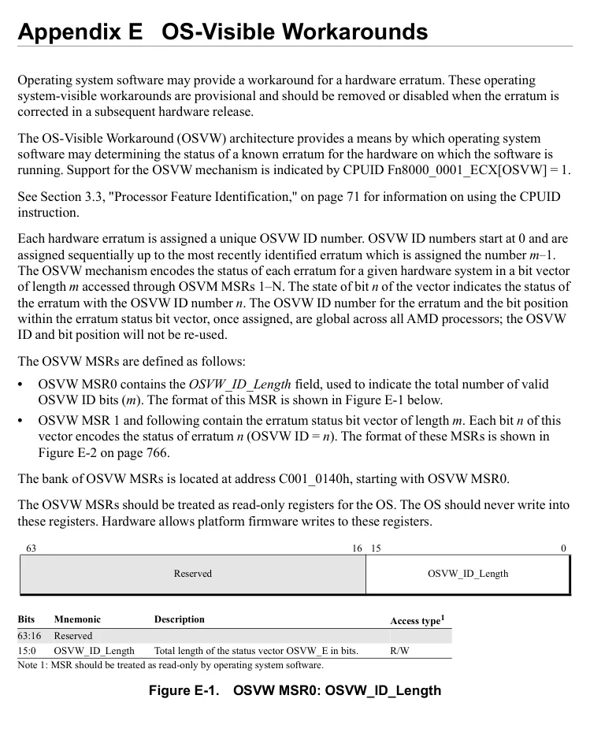
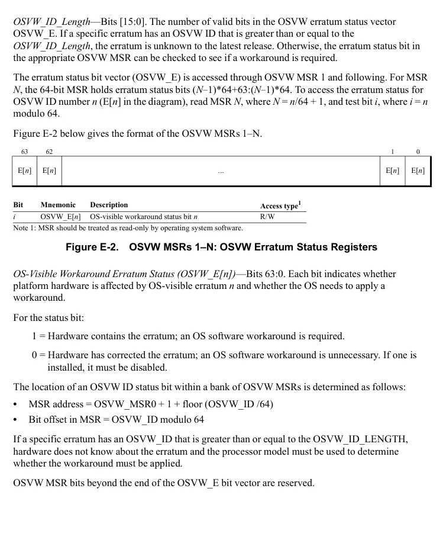

<!-- PDF source page: 827 | printed page: 765 -->

# Appendix E OS-Visible Workarounds

Operating system software may provide a workaround for a hardware erratum. These operating system-visible workarounds are provisional and should be removed or disabled when the erratum is corrected in a subsequent hardware release.

The OS-Visible Workaround (OSVW) architecture provides a means by which operating system software may determining the status of a known erratum for the hardware on which the software is running. Support for the OSVW mechanism is indicated by CPUID Fn8000_0001_ECX[OSVW] = 1.

See Section 3.3, "Processor Feature Identification," on page 71 for information on using the CPUID instruction.

Each hardware erratum is assigned a unique OSVW ID number. OSVW ID numbers start at 0 and are assigned sequentially up to the most recently identified erratum which is assigned the number *m*-1. The OSVW mechanism encodes the status of each erratum for a given hardware system in a bit vector of length *m* accessed through OSVM MSRs 1–N. The state of bit *n* of the vector indicates the status of the erratum with the OSVW ID number *n*. The OSVW ID number for the erratum and the bit position within the erratum status bit vector, once assigned, are global across all AMD processors; the OSVW ID and bit position will not be re-used.

The OSVW MSRs are defined as follows:

- OSVW MSR0 contains the *OSVW_ID_Length* field, used to indicate the total number of valid OSVW ID bits (*m*). The format of this MSR is shown in Figure E-1 below.
- OSVW MSR 1 and following contain the erratum status bit vector of length *m*. Each bit *n* of this vector encodes the status of erratum *n* (OSVW ID = *n*). The format of these MSRs is shown in Figure E-2 on page 766.

The bank of OSVW MSRs is located at address C001_0140h, starting with OSVW MSR0.

The OSVW MSRs should be treated as read-only registers for the OS. The OS should never write into these registers. Hardware allows platform firmware writes to these registers.

63 16 15 0

Reserved OSVW_ID_Length

**Bits Mnemonic Description Access type1**

63:16 Reserved 15:0 OSVW_ID_Length Total length of the status vector OSVW_E in bits. R/W Note 1: MSR should be treated as read-only by operating system software.

**Figure E-1. OSVW MSR0: OSVW_ID_Length**

Rendered source page 827 (figures/tables)

<!-- PDF source page: 828 | printed page: 766 -->

*OSVW_ID_Length*—Bits [15:0]. The number of valid bits in the OSVW erratum status vector OSVW_E. If a specific erratum has an OSVW ID that is greater than or equal to the *OSVW_ID_Length*, the erratum is unknown to the latest release. Otherwise, the erratum status bit in the appropriate OSVW MSR can be checked to see if a workaround is required.

The erratum status bit vector (OSVW_E) is accessed through OSVW MSR 1 and following. For MSR *N*, the 64-bit MSR holds erratum status bits (*N*-1)*64+63:(*N*-1)*64. To access the erratum status for OSVW ID number *n* (E[*n*] in the diagram), read MSR *N*, where *N* = *n*/64 + 1, and test bit *i*, where *i* = *n* modulo 64.

Figure E-2 below gives the format of the OSVW MSRs 1–N.

63 62 1 0

E[*n*] E[*n*] ... E[*n*] E[*n*]

**Bit Mnemonic Description Access type1**

*i* OSVW_E[*n*] OS-visible workaround status bit *n* R/W Note 1: MSR should be treated as read-only by operating system software.

**Figure E-2. OSVW MSRs 1–N: OSVW Erratum Status Registers**

*OS-Visible Workaround Erratum Status (OSVW_E[n])*—Bits 63:0. Each bit indicates whether platform hardware is affected by OS-visible erratum *n* and whether the OS needs to apply a workaround.

For the status bit:

1 = Hardware contains the erratum; an OS software workaround is required.

0 = Hardware has corrected the erratum; an OS software workaround is unnecessary. If one is installed, it must be disabled.

The location of an OSVW ID status bit within a bank of OSVW MSRs is determined as follows:

- MSR address = OSVW_MSR0 + 1 + floor (OSVW_ID /64)
- Bit offset in MSR = OSVW_ID modulo 64

If a specific erratum has an OSVW_ID that is greater than or equal to the OSVW_ID_LENGTH, hardware does not know about the erratum and the processor model must be used to determine whether the workaround must be applied.

OSVW MSR bits beyond the end of the OSVW_E bit vector are reserved.

Rendered source page 828 (figures/tables)

<!-- PDF source page: 829 | printed page: 767 -->

## E.1 Erratum Process Overview

Following is an overview of the AMD erratum process:

1. 1. When an OS-visible erratum is discovered, AMD assigns a unique OSVW ID to the erratum and publishes to OS vendors the starting range of affected processor models and suggested workarounds.

1. 2. AMD works with platform firmware vendors and OEMs in parallel to develop a firmware update to add the new erratum status bit to the OSVW_E erratum status bit vector for affected silicon revisions to report the new OSVW ID as requiring a workaround. The OSVW_ID_Length field in OSVW MSR0 is incremented by one.

1. 3. OS vendors schedule the workaround into their release schedules and eventually release it.

1. 4. The OS detection logic for the workaround first checks whether the processor OSVW MSRs 1–N record the erratum by comparing the OSVW ID of the erratum with the OSVW_ID_Length field in OSVW MSR0.

1. 5. If the erratum OSVW ID is greater than or equal to the OSVW_ID_Length, the current firmware does not know about this erratum. In this case, the OS software compares the processor model ID with the starting model ID that AMD supplied with the erratum to determine if the workaround should be applied.

1. 6. If the erratum OSVW ID is less than the OSVW_ID_Length, the firmare is aware of the erratum. In this case, the OS uses the state of the associated OSVW_E status bit to conditionally apply the workaround. If the associated status bit is set, the workaround is applied.

1. 7. Once AMD fixes the erratum in a future release, updated firmware ensures that the OSVW_E status bit associated with the erratum is cleared. When OS workaround detection logic runs on the new hardware, it will see that the bit corresponding to the OSVW ID is cleared and not apply the OS workaround for that erratum.
