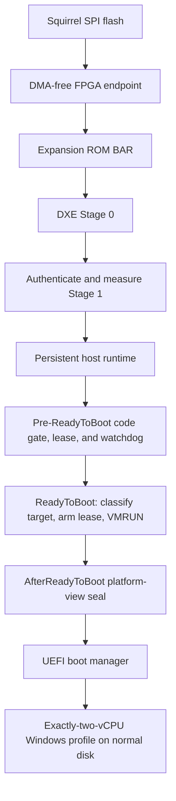
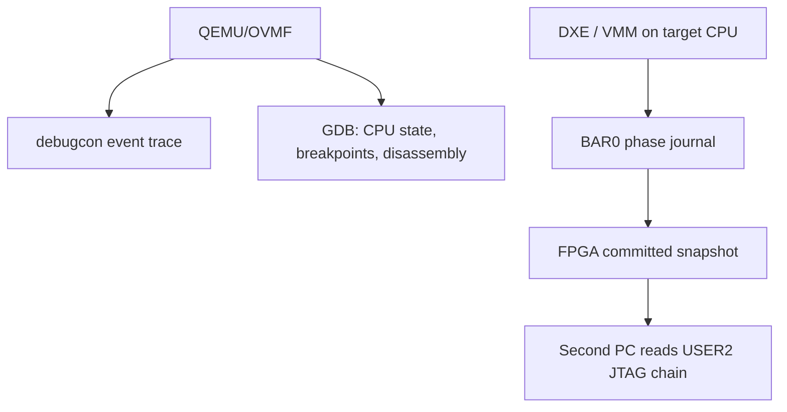

# PCIe EFI option-ROM classic AMD SVM bring-up roadmap

> The small, executable entry point is the
> [first-light plan](first-light-plan.md). This document is the specification for
> later walls, not the current checklist. The checked-in AMD PDF is the
> normative local architecture source; the chapter-split Markdown under `docs/`
> is a derivative navigation aid whose tables and diagrams must be verified
> against that PDF.

This roadmap is for one specific v1 end state:

1. the Squirrel enumerates as a PCIe endpoint;
2. platform firmware reads a UEFI image from its Expansion ROM BAR;
3. the option-ROM DXE driver authenticates/measures its payload and prepares a
   persistent classic AMD SVM L0 hypervisor;
4. a boot-policy and recovery interlock approves one exact Windows Boot Manager
   target before persistent launch is armed;
5. the hypervisor launches at `ReadyToBoot`, and an
   `EFI_EVENT_GROUP_AFTER_READY_TO_BOOT` callback seals the guest-visible
   platform before the selected boot option starts;
6. firmware, `bootmgfw.efi`, `winload.efi`, and Windows continue as the guest;
7. the first supported Windows 11 acceptance configuration exposes exactly two
   coherent vCPUs; every larger count is a separately qualified profile;
8. Windows remains on its normal NVMe or SATA disk; and
9. every accepted svmvisor bitstream has no requester, DMA, or arbitrary-TLP
   capability.

The PCIe card is the automatic delivery and diagnostic device. It is not the
Windows system disk and it does not fetch or modify host memory.

## Scope and naming

This document implements **classic AMD SVM with VMCBs and NPT**. It is not an
AMD SEV, SEV-ES, or SEV-SNP confidential-VM design. In this roadmap, do not use
`CVM` to mean confidential VM or imply an SNP security property. SME/C-bit
handling may affect physical-address construction, but it does not make the
guest confidential.

An SEV-SNP design is a separate architecture beginning at Milestone 0. It would
need AMD-SP initialization, RMP setup and AMD-Vi RMP enforcement before ordinary
SVM ownership, PSP-managed guest launch, VMSAs, GHCB/#VC support, page-state
transitions, guest validation, SNP AP creation, and attestation. It cannot be
retrofitted after the ReadyToBoot continuation or AMD-IOMMU milestones below.

The v1 use of **hidden** means absent from ordinary post-handoff Windows PCI/PnP
access. It does not mean undetectable to firmware, TPM measured-boot logs, an
administrator, timing analysis, or remote attestation. A correctly authenticated
and measured option ROM and Stage 1 intentionally leave trust evidence.

## Fixed architecture decisions

These are decisions, not open branches in the implementation plan:

- **Final transport:** a PCI UEFI Expansion ROM exposed by the Squirrel.
- **Final payload location:** entirely card-resident. Use an enlarged ROM when
  it fits; otherwise use a small ROM Stage 0 plus an authenticated, read-only
  Stage 1 stored in a separate region of the card's SPI flash.
- **Development transport:** raw EFI and an ESP-hosted Stage 1 are allowed only
  to shorten QEMU and early hardware iteration. They are not final acceptance.
- **Attempt persistence:** choose a power-loss-safe UEFI-variable design or a
  fixed-function card-local two-slot lease journal in Milestone 0. It is separate
  from the read-only payload region and never becomes an arbitrary SPI-programming
  or host-memory command channel.
- **Pre-ReadyToBoot code gate:** the option ROM must run before the target boot
  manager processes `DriverOrder`/`Driver####`, `SysPrepOrder`/`SysPrep####`,
  recovery options, or hotkeys. Before Stage 0 returns, it validates and enforces
  a sealed state-aware policy over every pre-boot code-launch variable, arms the
  direct whole-platform watchdog, and durably commits a
  `PREBOOT_POLICY_DURABLE` lease.
  A target that cannot prove this ordering and state-aware enforcement is unsupported for
  containment; a ReadyToBoot recheck cannot undo code that already ran.
- **Activation boundary:** a one-shot `ReadyToBoot` callback prepared during DXE.
  The callback first reads and resolves the now-valid `BootCurrent`, applies the
  recovery/update/security policy, binds the selected target by atomically
  advancing the durable lease, performs a named watchdog refresh/readback, and
  only then may execute `VMRUN`. During trusted bring-up, an unknown target may
  disarm safely and fall back native. In containment it fails closed; native boot
  requires physical `CARD_BYPASS` or authenticated maintenance authorization. A
  one-processor profile is allowed only for synthetic and EFI-only continuation
  tests.
- **Continuation model:** `VMRUN` resumes an assembly guest trampoline on the
  original firmware stack. The trampoline acknowledges the launch with
  `VMMCALL`, restores non-VMCB registers, and returns from the callback as the
  guest.
- **Guest-view boundary:** on a target proven to implement it,
  `EFI_EVENT_GROUP_AFTER_READY_TO_BOOT` is the handoff
  seal. After all ReadyToBoot notifications and before the boot/recovery option,
  it commits the coherent guest PCI/ACPI/SMBIOS/EFI/CPUID view and hides the card.
  The callback is a guest `VMMCALL` seal, never a second launch point. A target
  whose firmware cannot prove this event and ordering is unsupported.
- **EBS role:** the `ExitBootServices` event is a lifecycle marker issued from
  the already-running guest. It is not the launch point and is not a terminal
  takeover.
- **FPGA role:** completion-only endpoint, read-only ROM, writable diagnostic
  BAR0, LEDs, and a read-only JTAG snapshot. If the measured payload later
  requires it, one additional fixed read-only Stage 1 aperture is allowed only
  after repeating the no-requester threat, RTL, netlist, and resource gates.
- **USB role:** the update USB-C port is for FPGA programming and JTAG snapshot
  reads. FT601 is held inactive in v1.
- **Recovery:** a physical `CARD_BYPASS` input suppresses experimental launch and
  preserves a native path for external WinPE/WinRE, firmware servicing, and
  recovery. Windows Safe Mode is not this bypass.
- **Windows hypervisor policy:** Hyper-V, VBS, HVCI, Credential Guard, and AMD
  Secure Launch are unsupported in v1. If requested or active, `TRUSTED_LAB`
  disarms and continues natively; the containment profile resets/fails closed
  until physical bypass or independently authenticated maintenance is present.
  Nested AMD SVM is a separate project, not CPUID masking.
- **Initial trust level:** clean EFI applications, WinPE, and a cloned Windows
  installation only. Untrusted kernel code is forbidden until both AMD-IOMMU
  isolation and the later platform/SMM/I/O containment gate pass.

The selected control flow is:



The milestone dependency spine is deliberately strict:

```mermaid
flowchart LR
    M0["M0 scope/recovery/trust"] --> M1["M1-M2 endpoint/evidence"]
    M1 --> M3["M3 dispatch/authentication"]
    M3 --> M4["M4 host substrate/reset"]
    M4 --> M5["M5 AMD world switch"]
    M5 --> M6["M6 synthetic SVM/NPT"]
    M6 --> M7["M7 boot/recovery interlock"]
    M7 --> M8["M8 persistent EFI + handoff seal"]
    M8 --> M9["M9 SMP/APIC/time/deadline"]
    M9 --> M10["M10 trusted Windows 11"]
    M10 --> M11["M11 AMD-IOMMU isolation"]
    M11 --> M13T["M13-T signed trusted production"]
    M11 --> M12["M12 platform containment"]
    M12 --> M13C["M13-C signed contained production"]
```



The near-term boundary names are equally strict:

- Milestone 3 is **record-only physical first light**: automatic option-ROM DXE
  dispatch, evidence, and native continuation with no SVM or `VMRUN`.
- Milestone 6 is the first reversible, one-processor synthetic `VMRUN`.
- Milestone 8 is the first persistent EFI-only continuation and requires the
  watchdog, durable lease, and recovery interlock.
- Milestone 10 is trusted two-vCPU Windows functional bring-up, not hostile-code
  containment.
- Milestones 11 and 12 are the DMA and platform-containment walls that must both
  pass before any untrusted profile.

Passing one boundary never authorizes the next.

No downstream milestone may be used as evidence for an unmet prerequisite. In
particular, a Windows desktop is not evidence that the AMD world switch, boot
recovery, SMP, host deadline, or DMA/platform containment is correct.
Every production release passes M11. A trusted-guest M13-T release may branch
there; a guest-mutable/untrusted M13-C release additionally passes M12. The two
release manifests and claims are distinct.

This deliberately replaces the old terminal post-EBS smoke path. A stub that
hangs after `ExitBootServices()` proves bare-metal execution but cannot boot
Windows and is not on the critical path.

## What the three debug paths can and cannot do



- **QEMU debugcon and GDB** are the primary development tools. They identify the
  relocated DXE image, stop at assembly transitions, inspect registers and page
  tables, and diagnose deliberate exceptions.
- **Protected RAM** is the authoritative rich per-CPU record while it can be
  recovered. **BAR0** is the primary externally observable phase journal while
  the card remains powered. Software writes only fixed records and reads back the
  committed sequence before a dangerous transition.
- **JTAG** reads a small snapshot implemented in FPGA logic. It answers "what
  was the last committed phase?" while the target CPU is hung.
- **JTAG does not connect to the AMD CPU.** It cannot halt the CPU, inspect RIP,
  or recover registers that software did not first write to BAR0.
- Although the board specification mentions serial on the update port, the
  current Squirrel top/XDC exposes no UART TX/RX path. Do not count it as a log
  sink unless the schematic/pin route is verified and explicit UART RTL is added.
- The JTAG reader must not use the flash-programming sequence. `JPROGRAM`, a
  BSCAN-SPI proxy load, or FPGA reconfiguration destroys the evidence it is
  meant to read.

QEMU full-system emulation is always useful for the UEFI lifecycle, ROM dispatch,
assembly, page-table, and exception work. Actual nested SVM testing requires a
QEMU backend that proves it exposes SVM and NPT, normally AMD Linux/KVM with
nested virtualization and `-cpu host`. If the selected backend does not expose
them, fail the SVM profile before any MSR write and run first `VMRUN` on the
sacrificial AMD system. Do not assume WHPX or TCG provides a usable nested-SVM
environment without a capability probe.

## Permanent safety invariants

These apply to every milestone:

- Never flash or boot the current inherited PCILeech image as a convenient
  transport proof. Remove requester capability first.
- The sole user-logic PCIe transmit path may emit only `Cpl` or `CplD` for a
  tracked inbound read request. It may never emit requester Memory Read, Memory
  Write, I/O, Configuration, Atomic, or Message TLPs.
- Bus Master Enable may be visible in standard configuration space, but no logic
  may consume it to originate a transaction.
- BAR0 is a phase journal, not a command or executable-payload channel.
- FT601 RX, raw command parsing, static TLP generation, MSI, PME, ATS, PASID,
  PRI, and every requester/DMA path are permanently absent from accepted
  svmvisor endpoint bitstreams. No later milestone may waive this invariant.
- Do not call UEFI Boot or Runtime Services from the host, VM-exit handler, or
  copied persistent thunks.
- Do not enter persistent SVM until all memory, VMCBs, NPT, stacks, logs, and
  rollback-independent diagnostics have been allocated and validated.
- Before executing `VMRUN`, initialization failure may continue natively only in
  `TRUSTED_LAB` and only after durable `DISARMED` plus watchdog-cancel readback.
  In containment, the same failure resets/fail-stops unless physical bypass or
  independently authenticated maintenance authorizes native execution. If lease
  disarm or watchdog cancellation is ambiguous, reset; never guess. After any
  `VMRUN`, native return is allowed only through the reviewed synthetic-test
  devirtualization path. An unexpected exit before bootstrap ACK, or an
  unrecoverable failure after ACK, records a fatal snapshot and uses the already-
  proven reset/watchdog ladder; it does not improvise a native return.
- `VMRUN`/`#VMEXIT` are not complete context switches. Each vCPU has a separate
  host auxiliary-state VMCB, and every transition uses `VMLOAD`/`VMSAVE` for the
  hidden segment/task, GS-base, syscall-MSR, and SYSENTER state specified by the
  AMD APM.
- The execution VMCB always contains `EFER.SVME = 1`. SVM hiding uses an
  intercepted guest-visible EFER shadow with SVME reported clear; it never clears
  SVME in the execution VMCB.
- `#VMEXIT` clears GIF. The host keeps GIF clear throughout the bounded exit
  handler and re-enters with `VMRUN`, which enables GIF for guest execution.
  `STGI` is reserved for reviewed native teardown or a separately designed host
  event-delivery path; it is never issued immediately before persistent `VMRUN`.
- Every VMCB starts with all clean bits zero. Software clears the corresponding
  clean group whenever it changes VMCB state, and clears the entire field after
  VMCB relocation or execution on another physical core.
- `VMRUN` and `#VMEXIT` do not invalidate guest translations. Every NPT
  permission reduction, removal, or remap has an explicit ASID-scoped or global
  invalidation on every physical core that may cache it. `INVLPGA` is not treated
  as a GPA/NPT invalidation mechanism.
- VMCBs, auxiliary-state VMCBs, IOPM, MSRPM, NPT, and host page tables reside in
  proved WB memory. Guest RAM uses its proved effective type; MMIO and reserved
  apertures are never covered by a broad WB identity mapping.
- Every enabled processor eventually needs distinct execution and host
  auxiliary-state VMCBs, a `VM_HSAVE_PA` page, host stack, exit frame, ASID, and
  log. Nothing mutable is shared accidentally.
- NPT protection covers guest CPU accesses only. GPU, NVMe, NIC, and other
  device DMA remains a host-memory threat until AMD-IOMMU ownership is complete.
- Keep AMD-Vi enabled. Do not follow PCILeech guidance that disables the IOMMU.
- NPT plus AMD-Vi protects VMM memory from guest CPU access and device DMA; it
  does not by itself contain guest CPU I/O/MMIO side effects, SMM communication,
  firmware/chipset interfaces, or destructive device controls.
- Persistent launch requires an approved `BootCurrent` target, an armed
  watchdog/attempt lease, and a proven `CARD_BYPASS` recovery path. During
  trusted bring-up, missing or unknown boot intent, recovery/maintenance boot,
  or an active unsupported Windows hypervisor/security feature selects native
  boot. In the containment profile the same condition fails closed; only a
  physically latched bypass or authenticated maintenance request permits native
  execution, so guest-writable `BootNext`/recovery state cannot become an escape.
- Secure Boot and BitLocker are disabled only for early bring-up. Their signing,
  measured-boot, PCR, recovery-key, and 2026 certificate-policy feasibility is a
  Milestone 0 decision and Milestone 3 proof, not deferred final packaging.
- S3, hibernation/S4, sleep, Fast Startup, and crash-resume remain explicitly
  rejected until named save/restore tracks pass. Hyper-V, VBS, HVCI, Credential
  Guard, and AMD Secure Launch select native fallback only in `TRUSTED_LAB`; in
  containment they reset/fail closed until physical bypass or independently
  authenticated maintenance is present.
- A physical `CARD_BYPASS` switch must suppress experimental launch or serve a
  known benign image. On-disk WinRE and Windows Safe Mode are not substitutes.
- One enabled processor is permitted only for synthetic and EFI-only persistent
  tests. The first Windows 11 acceptance profile is exactly two coherent vCPUs;
  every larger count is separately qualified.

## Current repository facts that drive the order

- [`crates/dxe/src/main.rs`](../crates/dxe/src/main.rs) currently returns
  `Status::SUCCESS` and does no lifecycle work.
- [`crates/hypervisor/src/lib.rs`](../crates/hypervisor/src/lib.rs) is an empty
  `no_std` boundary.
- [`firmware/squirrel/config.psd1`](../firmware/squirrel/config.psd1) currently
  uses a 4 KiB ROM aperture and the inherited `10ee:0666`, class `020000`
  identity. The packaged ROM is already close to that limit.
- The current routed image uses about 91.25% of slice LUTs and 100% of Block RAM.
  It has no room for the planned journal and JTAG snapshot.
- Replacing only the ROM read leaf did not remove PCILeech. The generated
  [`pcileech_fifo.sv`](../target/fpga/PCIeSquirrel/src/pcileech_fifo.sv) routes
  FT601 commands into a raw PCIe TX path, and
  [`pcileech_pcie_cfg_a7.sv`](../target/fpga/PCIeSquirrel/src/pcileech_pcie_cfg_a7.sv)
  contains another programmable static-TLP source. Both feed the TX mux in
  [`pcileech_pcie_tlp_a7.sv`](../target/fpga/PCIeSquirrel/src/pcileech_pcie_tlp_a7.sv).
- The current update-port OpenOCD configuration loads a BSCAN-SPI proxy and
  programs flash. A separate, read-only JTAG snapshot command is required.
- The repository targets the Squirrel x1 board support. Marketing specifications
  for an R04 x4 board do not make this gateware x4.

Generated files under `target/` are evidence and upstream reference, not the new
source boundary. The minimal endpoint belongs under `firmware/squirrel/rtl/`.

## Observability ABI to build before physical option-ROM dispatch

### Stable phase codes

All sinks use the same numeric phase and detail values. Do not allocate, format
strings, or take a shared lock to record a phase.

| Phase | Meaning |
| --- | --- |
| `0x10` | DXE option-ROM entry reached |
| `0x11` | Owning PCI function and BAR0 found |
| `0x12` | BAR0 ABI/build ID verified |
| `0x13` | Phase commit read back successfully |
| `0x14` | Stage 1 authentication and TPM measurement verified |
| `0x18` | Read-only platform/SVM preflight passed |
| `0x20` | Persistent host regions allocated |
| `0x21` | Runtime payload copied and hash verified |
| `0x22` | Host CR3/GDT/IDT/TSS/stacks ready |
| `0x23` | VMCB/NPT/IOPM/MSRPM validated |
| `0x24` | AMD auxiliary-state world-switch contract passed |
| `0x25` | CPL3 NPT/cache/ASID/TLB suite passed |
| `0x26` | Boot-policy, lease-store, variable-mediation, and watchdog mechanisms validated |
| `0x27` | Pre-ReadyToBoot code namespace sealed; watchdog and preboot lease committed/read back |
| `0x28` | ReadyToBoot callback entered natively |
| `0x29` | Exact now-current boot target and security state approved |
| `0x2a` | Target-bound attempt lease and named watchdog refresh committed/read back |
| `0x30` | Native context captured |
| `0x31` | SVM enabled on this processor |
| `0x32` | First `VMRUN` executed |
| `0x33` | `VMMCALL_BOOTSTRAP_ACK` VM exit received |
| `0x34` | Guest context restored; callback returning |
| `0x35` | AfterReadyToBoot handoff-seal callback entered |
| `0x36` | Guest platform view committed |
| `0x37` | Card configuration and BARs hidden from guest |
| `0x38` | Late launch/seal outcome extended into the selected attestation PCR |
| `0x40` | ExitBootServices event callback entered in the guest; success still pending |
| `0x41` | SetVirtualAddressMap callback observed; call success still unproved |
| `0x42` | First post-SetVirtualAddressMap Runtime Service call succeeded |
| `0x43` | Direct watchdog converted to frozen host-owned OS mode and read back |
| `0x44` | Durable early attempt lease disarmed; OS watchdog and late-reset budget remain active |
| `0x45` | Authenticated production `BOOT_GOOD` accepted without clearing the late-reset budget |
| `0x46` | Clean OS exit recorded; matching next-boot hardware reset/power reason still required |
| `0x47` | Bounded same-target Windows-recovery sequence/counter updated |
| `0x60` | Guest INIT observed/emulated |
| `0x61` | Guest SIPI observed/emulated |
| `0x62` | AP host trampoline online |
| `0x63` | AP entered its guest VMCB |
| `0x64` | Non-guest-suppressible host deadline proved active |
| `0x70` | AMD-IOMMU host tables active |
| `0x71` | IOMMU isolation self-test passed |
| `0x72` | Platform/SMM/I/O containment gate passed |
| `0x73` | Untrusted-guest profile authorized |
| `0xe0`-`0xef` | Fatal class; detailed error identifies the cause |

Every event carries sequence, boot ID, CPU/APIC ID, TSC, and one 64-bit context
value. FPGA and ROM/software build IDs live in the fixed global registers and
are copied into the JTAG frame. Keep phase meanings stable after the first
physical run.

### BAR0 phase journal

Use a 4 KiB BAR0 mapped uncacheable in both the firmware and private host page
tables. All multibyte fields are little-endian. The exact v1 layout is:

| Offset | Size | Owner | Contents |
| --- | ---: | --- | --- |
| `0x000` | `4` | FPGA | `MAGIC = 0x4a4d5653` (`SVMJ` as bytes) |
| `0x004` | `4` | FPGA | ABI version in bits 15:0; capability bits in 31:16 |
| `0x008` | `8` | FPGA | truncated FPGA build ID |
| `0x010` | `8` | FPGA | truncated packaged-ROM/software build ID |
| `0x018` | `4` | FPGA | live hardware status |
| `0x01c` | `4` | FPGA | saturating ROM-read count |
| `0x020` | `4` | FPGA | saturating accepted BAR-write count |
| `0x024` | `4` | FPGA | sticky protocol/policy error bits |
| `0x028` | `4` | FPGA | ring head in bits 15:0; saturated count in 31:16 |
| `0x02c` | `4` | FPGA | last committed sequence |
| `0x030` | `0x010` | FPGA | reserved, reads zero |
| `0x040` | `0x024` | software staging | exact fields below plus commit word |
| `0x064` | `0x01c` | FPGA | reserved, reads zero |
| `0x080` | `0x020` | FPGA | last committed event record |
| `0x0a0` | `0x060` | FPGA | reserved, reads zero |
| `0x100` | `0x800` | FPGA | 64 fixed 32-byte committed event records |
| `0x900` | `0x700` | reserved | must read as zero until versioned use |

Each truncated build ID is the little-endian `u64` formed from bytes 0 through 7
of that artifact's canonical SHA-256 digest. The manifest retains the full hash.

The 32-byte event format is:

| Byte | Type | Field |
| ---: | --- | --- |
| `0x00` | `u32` | sequence |
| `0x04` | `u32` | boot ID |
| `0x08` | `u64` | TSC |
| `0x10` | `u64` | context |
| `0x18` | `u32` | CPU/APIC ID |
| `0x1c` | `u16` | phase |
| `0x1e` | `u16` | detail/error |

Staging uses the same values at offsets `0x040` through `0x05f`, followed by a
`u32 COMMIT_SEQ` at `0x060`. A commit is accepted only when `COMMIT_SEQ` equals
the staged sequence. The FPGA-generated last/ring records always use the field
order above.

Rules:

- Software writes aligned full DWORDs to staging and writes the commit sequence
  last. Partial byte enables and unaligned accesses are ignored and flagged.
- Only staging and `COMMIT_SEQ` accept writes. Writes to global status, last
  record, ring, sticky-error, or reserved offsets are ignored and latch
  `BAD_BAR_WRITE`.
- The FPGA atomically copies staging into the ring and last-record bank only on
  commit. Uncommitted staging must never appear in JTAG.
- Before a dangerous transition, software performs volatile UC writes, an
  ordering fence, and a readback of the committed sequence to flush posted PCIe
  writes. Polling is bounded to 1,024 reads; timeout returns an error and disarms
  a pre-launch transition rather than spinning forever.
- Journal storage and the last committed snapshot do not clear on link
  retrain, PERST, or a PCIe user-logic reset while the FPGA remains configured.
  Transaction pipelines do reset. Power loss or FPGA reconfiguration may erase
  the journal.
- Journal/snapshot storage has no reset input driven by PERST, PCIe
  `user_reset_out`, or link reset. Verify that separation in RTL simulation,
  reset-domain review, and post-synthesis connectivity.
- Warm-reset retention is an acceptance test, not an assumption. If a board
  forces reconfiguration, JTAG must be read before reset.
- BAR0/JTAG retention is not the persistent attempt lease. If a later fixed-
  function card-local NVRAM backend is selected, it accepts only the versioned
  lease/phase record through a bounded two-slot power-fail protocol; it exposes no
  arbitrary address, payload, flash-programming, requester, or DMA command.
- The reserved-RAM per-CPU log holds richer VMEXIT and fault data. BAR0 holds
  only bounded, high-value checkpoints.

### JTAG-readable FPGA snapshot

Instantiate one `BSCANE2` primitive with `JTAG_CHAIN=2` on USER2 (XC7 USER2 IR
`0x03`). USER1 remains available for the separate programming workflow. The
snapshot is exactly 512 bits: 16 little-endian DWORDs shifted DWORD 0 first and
least-significant bit first within each DWORD.

| DWORD | Contents |
| ---: | --- |
| 0 | `MAGIC = 0x50414e53` (`SNAP` as bytes) |
| 1 | schema version in bits 15:0; frame length `512` in bits 31:16 |
| 2-3 | truncated FPGA build ID |
| 4-5 | truncated packaged-ROM/software build ID |
| 6 | last committed boot ID |
| 7 | last committed sequence |
| 8 | phase in bits 15:0; detail in bits 31:16 |
| 9 | CPU/APIC ID |
| 10-11 | 64-bit context |
| 12 | hardware status |
| 13 | ROM-read count |
| 14 | accepted BAR-write count |
| 15 | CRC32 |

Hardware-status bits are versioned: bit 0 link-up, bits 6:1 LTSSM, bit 7 PERST
observed, bit 8 Memory Space Enable, bit 9 Bus Master Enable observed, bit 10 ROM
enable, bit 11 TX-policy violation, bit 12 bad BAR write, bit 13 bad byte enable
or alignment, and bits 31:14 zero in v1.

CRC uses CRC-32/ISO-HDLC (reflected polynomial `0xedb88320`, initial and final
XOR `0xffffffff`) over the 60 serialized little-endian bytes in DWORDs 0-14.
After FPGA configuration, build/schema fields are valid and all dynamic fields,
counters, and sticky bits are zero until hardware or a software commit updates
them.

Cross commits from the PCIe user-clock domain into two banks in the always-on
100 MHz board-clock domain. Fill the inactive bank, complete a request/acknowledge
toggle handshake, then atomically publish its bank-select bit; never expose a bank
being filled. `Capture-DR` latches the published bank and `Shift-DR` shifts that
immutable copy on `DRCK`. Do not reset either published bank with PCIe user reset.
The host reader still requires two consecutive identical, CRC-valid frames.

Software phase commits have publication priority. Link/PERST/config changes and
sticky BAR/TX-policy faults independently request an immediate hardware-status
publication even when software has never committed or has hung. Continuous
counters are coalesced/rate-limited so they cannot starve a phase or fault publish;
every published frame is a coherent point-in-time copy.

Add a read-only OpenOCD configuration and decoder for FTDI `0403:6011`, channel
0. TDI and UPDATE activity has no write effect on endpoint or snapshot state. The
reader must not source `jtagspi.cfg`, call `jtagspi_init`, load a proxy bitstream,
or issue `JPROGRAM`, `JSTART`, `CFG_IN`, FPGA reset, or another programming
instruction. A TAP reset is allowed and resets only the scan shift state.

JTAG snapshot acceptance test:

1. DXE commits a known phase and deliberately enters a CLI/`HLT` hard hang.
2. The target remains powered.
3. A second PC reads the exact build, sequence, phase, detail, and context.
4. An uncommitted staging update remains invisible.
5. Repeated JTAG reads do not change endpoint or target behavior.

Do not add Vivado ILA to the current design. The fixed snapshot gives the needed
first evidence with much lower resource cost.

### QEMU debugcon and GDB

Maintain two QEMU profiles:

- `ovmf-lifecycle`: Q35, OVMF, one vCPU, software emulation acceptable, automatic
  PCI `romfile=` dispatch, debugcon, and GDB;
- `nested-svm`: AMD KVM host only, one vCPU, host CPU passthrough, with a startup
  probe that proves SVM and NPT are visible before enabling the SVM tests.

The launcher must:

- accept explicit QEMU, OVMF CODE/VARS, ESP, EFI, ROM, and disk paths;
- copy the OVMF variable store for every run;
- capture port `0x402` debugcon records and QEMU stderr separately;
- support `-S -gdb tcp::1234` and a bounded host timeout;
- record the loaded DXE and copied-runtime base addresses before symbol loading;
- generate relocation-aware GDB `add-symbol-file` commands; and
- distinguish timeout, fatal phase, triple fault/reset, `isa-debug-exit`, and a
  normal boot.

Test `#UD`, `#GP`, `#PF`, and `#DF` deliberately. A reset with no preceding
fault record is a failed debug design.

## Payload and memory ownership contract

The final card does not have to fit the VMM into the present 4 KiB aperture.
Make the capacity decision before the VMM grows:

1. remove PCILeech and measure free Block RAM;
2. target a 64 KiB power-of-two Expansion ROM first;
3. measure the compressed Stage 0 plus runtime payload and routed headroom; and
4. if card-contained code exceeds the safe ROM budget, add a separately reviewed
   Stage 1 interface: a minimal ROM Stage 0 reads an authenticated payload from a
   read-only SPI-flash data region through a bounded, dedicated BAR/window that
   cannot address host memory or generate requester TLPs. BAR0 remains diagnostic
   only.

The 256 Mbit flash stores the FPGA bitstream today. It becomes payload storage
only after gateware explicitly exposes a separate region. Stage 0 must verify
Stage 1's signature, version, length, and anti-rollback policy before copying or
executing it. Prefer a signed PE/COFF Stage 1 authenticated through UEFI
`LoadImage`. If Stage 1 remains a raw runtime payload, Stage 0 must explicitly
extend its canonical digest and metadata through `EFI_TCG2_PROTOCOL` into PCR2
before executing any byte and before the firmware's PCR0-7 separator/ReadyToBoot
boundary. A private hash comparison without a TPM event is not measured boot.
Acceptance requires the firmware event log to identify the exact Stage 0 and
Stage 1 digests. Before the same separator, extend a canonical, versioned
effective-configuration event into PCR3 covering the latched `CARD_BYPASS`
state, trusted/containment mode, accepted maintenance-authorization identity,
prior-attempt recovery decision, allowlist/policy versions, and the complete
prebuilt guest-platform-view digest. The actual `BootCurrent` remains covered by
the firmware boot-variable/image events plus the durable attempt and handoff
seal because it is not authoritative until `ReadyToBoot`. This early PCR3 event
does **not** attest that `VMRUN`, ACK, or the handoff seal succeeded. The v1 late
outcome mechanism is an `EV_EVENT_TAG` in the active SHA-256 bank's PCR12, whose
native-UEFI role is data/highly volatile events; PCR0-7 receive no project extend
after their separator. Milestone 8 extends a canonical sealed outcome from
protected guest callback code. A nonce-bound quote and full log replay over the
early configuration plus PCR12 distinguish successful L0 launch/seal from an
explicitly measured native fallback. There is no FT601 payload command path. The
Stage 1 interface is not silently added to the Milestone 1 v1 endpoint; it must repeat
the completion-only threat, RTL, netlist, resource, signing, and measurement
gates.

Before `ReadyToBoot`, reserve and describe:

- host executable code pages, read-only after copy;
- host read/write data pages, NX;
- one guarded host stack and one emergency/IST stack per processor;
- one 4 KiB-aligned execution VMCB, one distinct 4 KiB-aligned host
  auxiliary-state VMCB, and one 4 KiB `VM_HSAVE_PA` page per processor, all in
  persistent WB memory; the reversible synthetic profile also keeps an immutable
  native-return auxiliary-state VMCB/snapshot that guest exits never overwrite;
- 12 KiB IOPM and 8 KiB MSRPM in WB memory with documented sharing/ownership;
- host page tables and nested page tables;
- per-CPU exit frames and fixed-record log rings;
- a small guest-shared bootstrap page; and
- a below-1-MiB AP trampoline reservation before the SMP milestone.

Use a versioned, page-aligned handoff header with ranges, hashes, attributes,
BAR0 physical address, ACPI MCFG/IVRS facts, CPU topology, phase state, and all
per-CPU object addresses. Do not place raw UEFI protocol pointers in anything
the host consumes.

Keep code lifetimes explicit:

- ReadyToBoot, AfterReadyToBoot, and EBS notification shims execute from
  firmware-owned BootServicesCode and are dead after their callbacks return;
- the VMM/VM-exit runtime executes only from host-owned persistent pages;
- guest-resume/bootstrap thunks occupy separate guest-mapped executable pages;
- only the virtual-address-change thunk and its context use the minimum required
  RuntimeServicesCode/RuntimeServicesData pages; the callback is an observation
  and pointer-conversion point, not a successful-call oracle; and
- no page is both writable and executable after preparation.

Do not assume `EfiReservedMemoryType` is executable. Copy while writable, set
and read back memory attributes, and make data/stacks NX. The private host CR3
maps BAR0 UC and maps only the host resources needed by the VM-exit path. Guest
NPT excludes host code, data, stacks, all VMCBs, NPT pages, logs, and the AP
trampoline from the first persistent launch. BAR0, Expansion ROM, Stage 1
apertures, and card ECAM disappear from the guest at the AfterReadyToBoot seal.

## Milestone 0 - scope, recovery, trust feasibility, and frozen AMD target

### Freeze the support contract

- Use a sacrificial AMD lab machine and a sector-verifiable clone containing the
  GPT, ESP, Windows, and WinRE partitions; cloning only `C:` is insufficient.
- Record the exact AMD processor family/model/stepping, board, BIOS/AGESA,
  microcode, AMD-SP firmware/TCB where reported, Squirrel variant, slot, PCI
  topology, storage mode, and Windows edition/build/LCU. Bind later acceptance to
  this fingerprint and the applicable AMD processor programming reference.
- State explicitly that v1 is classic AMD SVM/NPT. Define two profiles:
  - **trusted bring-up:** clean EFI/WinPE/cloned Windows; unsupported state may
    fail open to native boot;
  - **containment candidate:** no hostile code yet; policy failures fail closed
    and native maintenance needs physical or authenticated authorization.
- Declare SEV, SEV-ES, SEV-SNP, VMPL, and confidential-VM attestation out of
  scope. CPUID `0x8000001f` is an address/encryption-state input only.
- Declare Hyper-V, VBS, HVCI, Credential Guard, and AMD Secure Launch unsupported
  in v1. Choose and document the native-fallback policy; nested AMD SVM requires
  a separate roadmap.
- Declare S3, S4/hibernate, sleep, Fast Startup, and crash-resume rejected until
  dedicated save/restore tracks exist. Inventory Modern Standby, FADT low-power
  S0, `_PR3`, D3cold, root-port slot power, ASPM/L1SS, and firmware sideband
  controls that could remove the diagnostics card in S0.

### Prove independent recovery before experimental launch

- Archive and hash the factory image, but never treat a requester-capable
  PCILeech image as the target's known-good recovery image.
- Specify a tiny non-enumerating recovery bitstream that provides only a visible
  LED state and update/JTAG access, plus its pinned manifest and isolated
  programming fixture. Milestone 0 freezes this recovery design only; Milestone
  1 builds, audits, flashes, reads back, and physically proves it before any
  enumerating candidate. A normal powered riser is not isolation.
- Before any experimental flash, make `flash.ps1` fail closed: require a
  machine-readable manifest, recompute the selected image SHA-256, verify the
  XC7A35T target part, and require `completion_only_netlist_policy = PASS`.
  Recovery flashing uses a separate path pinned to the recovery-image hash.
- Assign one physical switch to `CARD_BYPASS`, document its sampled polarity,
  and make its boot-time state immutable until reset.
- Prepare current external WinPE/WinRE media and prove native boot first with the
  card physically absent. Record `reagentc /info`, export BCD, verify the recovery
  sequence, and force two real native boot failures. Specify the future
  card-present `CARD_BYPASS` test here, but do not claim it until Milestone 1 has
  implemented and physically proved the immutable latch and benign image.
- Export BitLocker status/protectors, verify the recovery key offline, and define
  the exact suspend/resume commands. On-disk WinRE and Windows Safe Mode remain
  guest paths and are not recovery from a pre-loader VMM hang.
- Inventory the ACPI FADT reset mechanism and platform fallbacks. Select a
  separately identified, reset-capable watchdog that remains host-owned and
  operational across EBS and SetVA; record its exact register/sideband mechanism,
  arm/refresh/release or OS-mode-rearm/readback sequence, access controls, reset
  reason, and maximum bound. A UEFI `SetWatchdogTimer` boot-services watchdog is
  insufficient by itself: firmware may reprogram it after ReadyToBoot and EBS
  disables the UEFI watchdog. If both interfaces share hardware, trap/mediate the
  firmware path or reject the target. Define the warm-reset/cold-reset ladder,
  persistent attempt counter, and evidence retention. Repeat reset proof with
  GIF clear and partial host state before persistent launch.
- Select the durable attempt-lease store now. The ordinary volatile BAR0 ring is
  insufficient. Either use a narrowly scoped, power-loss-safe UEFI-variable
  design whose post-launch clear path is independently authenticated, or add a
  fixed-function two-slot card-local NVRAM journal that accepts only versioned
  lease/phase records and can never program arbitrary flash or host memory. The
  latter repeats the completion-only threat, RTL, netlist, wear, power-cut, and
  resource gates before use.

### Prove trust and boot-policy feasibility early

- Inventory PK, KEK, `db`, `dbx`, current 2023 Secure Boot CAs, and the selected
  slot's option-ROM policy. Decide OEM/project-key enrollment versus leaving
  Secure Boot disabled; do not assume Microsoft will sign private/internal code.
- Build a size-realistic signed Stage 0/Stage 1 sample now. Account for signature
  size before freezing ROM capacity and prove the exact target firmware can
  authenticate it with Secure Boot enabled no later than Milestone 3.
- Capture the TCG event log and PCR baseline with and without the option ROM.
  Define PCR2 measurement for the exact Stage 1 digest, key revocation,
  anti-rollback, update authorization, and recovery behavior.
- Define the canonical PCR3 effective-configuration event and event-data schema.
  It covers every pre-ReadyToBoot branch that can choose native versus VMM
  execution, including physical bypass, mode, maintenance authorization, stale-
  lease recovery, policy/allowlist versions, and the guest-platform-view digest.
  Standard boot-variable/image measurements still cover the selected boot path.
- Reserve SHA-256 PCR12 for the v1 late outcome and define an `EV_EVENT_TAG`
  containing a fixed vendor tag/GUID, schema version/length, preboot/attempt ID,
  boot-target digest (zero only before target selection), effective-policy/
  configuration digest, build IDs, and exactly one outcome:
  `L0_LAUNCHED_ACKED_SEALED` or an enumerated authenticated native reason.
  Prove the TCG2 call path, event-log append, nonce-bound quote selection/replay,
  Windows PCR12 use, and BitLocker consequence on the frozen target. The target
  must permit the bounded call from the final relevant AfterReadyToBoot callback.
  PCR0-7 are not extended after their separator, and early PCR2/PCR3 alone must
  never be described as evidence that L0 actually launched or sealed.
- Feed both tagged outcomes through the exact Windows measured-boot log and
  Device Health Attestation parsing path, plus the project verifier. Unknown-tag
  rejection, silent truncation, wrong ordering, or a quote/log replay mismatch
  blocks any attestation claim even if Windows otherwise boots.
- Record the BitLocker PCR profile. Loading an expandable-card UEFI driver can
  move BitLocker away from PCR7 to the ordinary UEFI PCR 0/2/4/11 profile; card,
  ROM, Stage 1, slot, and measurement-order changes therefore require explicit
  recovery testing.
- Resolve `BootCurrent` to the exact `Boot####` device path and ESP/GPT identity;
  do not trust its description. Record `BootNext`, `BootOrder`, `OsIndications`,
  OS-recovery, and platform-recovery behavior. Define trusted-development and
  containment policies separately so guest-writable variables cannot authorize
  a native escape.
- Inventory and canonicalize the complete pre-ReadyToBoot code-launch namespace:
  `DriverOrder`/`Driver####`, `SysPrepOrder`/`SysPrep####`, `BootOrder`/
  `BootNext`/`Boot####`, `OsRecoveryOrder`/`OsRecovery####`,
  `PlatformRecovery####`, `Key####` hotkeys, and vendor recovery/key variables.
  Freeze which entries may execute, their serialized bytes, device paths,
  signers/digests, attributes, order, and physical/authenticated authorization.
  Select an actual target variable-policy/lock or equally complete early
  mediation mechanism. It must allow only policy-specified one-way firmware
  consumption such as deleting the authorized `BootNext`, clearing approved
  `OsIndications` recovery bits, and exact target-proven bookkeeping; it records
  and rehashes each transition while denying retargeting/new code. An allowlist
  with no state-aware enforcement is not a gate.
- Define the resident record-only DXE trace and rejection contract now. Execute
  it during Milestone 3 first light, after the Milestone 1 and 2 delivery gates,
  to prove the target signals
  `ReadyToBoot -> AfterReadyToBoot -> BeforeExitBootServices/ExitBootServices`
  in the required order. A Windows 11-capable machine is not assumed to provide
  `EFI_EVENT_GROUP_AFTER_READY_TO_BOOT`; the event was added in UEFI 2.9, and a
  reported firmware revision alone is not proof it is signaled correctly.
  Absence, duplication, or incompatible ordering blocks this architecture.
- In that Milestone 3 trace, prove candidate Stage 0 executes before the boot manager
  processes any Driver, SysPrep, recovery, or hotkey-launched image. Exercise one
  entry of each class and prove the pre-return lock, durable preboot lease, and
  direct watchdog are active before any approved image may run. If option-ROM
  dispatch is later than any such native code path, containment is unsupported.
- Inventory pending Windows/OEM firmware capsules, BIOS updates, Secure Boot
  database updates, and other maintenance-reboot indicators. Define a native
  maintenance authorization that cannot be forged or replayed by an untrusted
  guest: independently signed, monotonic/single-use, bound to the platform,
  requested operation, and expiry, or physically asserted through `CARD_BYPASS`.

### Record-only AMD capability and topology inventory

The completed executable inventory slice is the separate removable-media
[`svmvisor-m0b-probe`](m0b-probe.md). It is an EFI application and therefore
does not claim the resident firmware-event ordering required below. Its raw
evidence remains blocked and is bound by hash to, but never inserted into or
used to rewrite, the immutable five-file M0a bundle.

M0b USB collection is frozen after the schema-v6 promotion decision; missing
resident-event evidence belongs to the Milestone 3 first-light trace and is not
a reason to create schema v7.

The checked-in record-only sequence is now:

1. slice 1: BSP-scoped CPUID and conditional read-only `VM_CR`, UEFI roots, MP
   Services, and a collection-time memory map;
2. slice 2A: bounded ACPI 2.0 RSDP plus mandatory RSDT/XSDT directory, complete
   raw `APIC`/`MCFG`/`IVRS`/`FACP` captures, and an enabled MADT/MP-Services
   processor-ID comparison; and
3. slice 2B/schema v3: cardinality-bounded per-processor CPUID/`VM_CR`
   consistency using blocking, sequential MP Services dispatch. Slice 2A itself
   does not start APs; slice 2B starts enabled, healthy APs with an application
   callback that issues only read-only measurements. The generic record remains
   conservative about firmware dispatch and pre-dispatch `VM_CR` preservation.
   The [exact F7 audit](f7-mp-services-audit.md) separately establishes that the
   current target's cold-boot default is a parked-MWAIT memory-signal wake and
   requires timeout zero to avoid F7's AP-reset recovery path;
4. slice 3/schema v4, under the separately reviewed
   [PCI/MMIO read policy](m0b-iommu-read-policy.md): implemented, physically
   captured, finalized, verified, and promoted read-only live AMD-IOMMU
   inspection beginning from the same-run IVRS/IVHD-discovered BDF, capability
   offset, and MMIO base. It observed live capability and global run state
   (MMIO-enabled base-locked capability, live EFR agreement with the preferred
   IVRS images, globally disabled IOMMU) without proving ownership or
   requester/slot isolation; and
5. slice 4/schema v5, under the separately reviewed
   [system-register read policy](m0b-msr-read-policy.md): read-only
   per-processor observation of the allowlisted SMM, IORR,
   `TOP_MEM`/`TOM2`, SYS_CFG, HWCR, MTRR, and PAT registers through 41 new
   named `RDMSR` sites and the same blocking, timeout-zero dispatch, with no MSR
   writes. Its one authorized physical capture completed on 2026-08-09, but was
   preserved and rejected after exposing an incorrect
   `SMMMask[TMTypeDram]` decode and an equality contract that incorrectly
   required thread-scoped `SMM_BASE` to match. Corrected schema-v6 / collector
   0.6.0 software is locally release-gated. At `2026-08-09T04:02:42.5037164Z`, the user
   separately authorized replacement of the consumed schema-v5 payload and
   exactly one cumulative record-only schema-v6 cold boot on the bound BIOS F7
   machine. The boot completed on 2026-08-09 with 24/24 processor coverage,
   true consistency aggregates, 1,008 MSR reads, and zero writes. The immutable
   schema-v6 record was strictly finalized and dual-verified at
   `target/evidence/m0b-probe-20260809T151657-000000000`. Its raw SHA-256 is
   `c7c71ab7d3af18021326e9da4ff3d4eb9edb78e80d97ab9f87948a0cefc44384`
   and manifest SHA-256 is
   `58d957d92744e457ce9c39c48b5ecd2ff058f84492793deb909d7e590901c89b`.
   The authorization is consumed and permits no retry. Schema v4 remains
   canonical until a separate explicit promotion review.

The only current canonical target capture is the untouched physical schema-v4
bundle `target/evidence/m0b-probe-20260807T050309-000000000`, raw JSON SHA-256
`ade24113dfa6ddfee03ee82fafc2d03e81d6c1d89c03095881a77fbcfd70859d`
and manifest SHA-256
`1a8954379f99f25b47ff47a58e6a0bbfd440ba7d4220e133aab0d00eac70490c`.
It covers all 24 enabled processors with true identity, capability-CPUID, and
`VM_CR` consistency aggregates, and records the bounded live AMD-IOMMU
observation above. The previous schema-v3 canonical capture, schema-v2
capture, schema-v1 capture, and retries remain preserved historical evidence
but noncanonical. Promotion rewrites no raw record; every version remains
separately verifiable.

- Without modifying control state, record:
  - AMD vendor and SVM CPUID bits;
  - NPT, NRIPS, DecodeAssists, VMCB clean bits, FlushByAsid, physical-address
    width, SVM revision, ASID count, and every feature exposed or masked;
  - CPUID `0x8000001f`, inherited SME/SEV state, C-bit position, and the reduced
    physical-address mask used for VMCB, NPT, and AMD-IOMMU table addresses;
  - `VM_CR.SVMDIS/LOCK/R_INIT` and SMM lock state;
  - enabled/healthy processor count and processor-number/APIC-ID mapping from MP
    Services, ACPI, and the BIOS core configuration. Slice 2A compares only
    same-run enabled hardware-ID membership; slice 2B/schema v3 supplies the
    complete per-processor CPU consistency record;
  - firmware-described AMD-IOMMU units and IVRS/IVHD/IVMD entries, including
    IVHD DeviceID/BDF encoding, capability offset, MMIO base, PCI segment,
    requester/device coverage, and Type `11h`/`40h` extended-feature images;
  - in a later bounded live-register slice, begin from the enumerated IVRS/IVHD
    instances and then inspect only the PCI capability and MMIO registers in the
    [reviewed read policy](m0b-iommu-read-policy.md) to cross-check implementation
    capabilities and record current enable/lock and global run state. Register
    reads alone do not identify an owner or prove requester-specific DMA or
    interrupt remapping. Treat Type `11h`/`40h` images as rev. 3.11's preferred
    firmware feature description, but never as proof of live state or ownership.
    Never hardcode an IOMMU from a publication 48882 diagram;
  - root/downstream-port isolation, ACS/peer-to-peer paths, reset/DPC/window and
    slot-power controls; and
  - the UEFI memory map, MCFG, MTRRs, IORRs, TOM/TOM2, and every PCI/MMIO aperture
    needed to construct correct cacheable and uncacheable mappings.
- Slice 2A permits an ACPI physical read only if its complete checked range lies
  within one same-run `EfiACPIReclaimMemory` or `EfiACPIMemoryNVS` descriptor and
  below the CPUID-reported physical-address width. Its caps are 4 KiB per RSDP,
  1 MiB per SDT, 4 MiB cumulative ACPI bytes, 64 configuration-table entries,
  256 root entries and unique pointers, 512 MADT entries/256 processor entries,
  256 MCFG allocations, 256 IVRS blocks, and 4096 IVHD device entries.
- Slice 2A reads no PCI configuration or MMIO register. IVRS presence,
  firmware-reported addresses/device coverage, and IVHD feature images do not
  establish runtime enablement, ownership, DMA remapping, or requester/slot
  isolation. Every such claim remains false and qualification remains blocked.
- Prove a one-processor firmware configuration for synthetic and EFI-only tests,
  and a separate exactly-two-processor configuration for the first Windows 11
  profile. A BCD processor limit is not a hardware ownership gate.

### Pass gate

- The classic-SVM scope, trusted/containment profiles, unsupported Windows
  features, and exact AMD platform fingerprint are frozen.
- Recovery cabling, external media, card-absent native recovery, the electrical
  `CARD_BYPASS`/pinned-image design, BitLocker key, BCD/WinRE state, reset ladder,
  watchdog, attempt lease, and maintenance authorization are documented without
  relying on the experimental target OS. Card-present bypass proof remains the
  Milestone 1 gate.
- Size-realistic signing, option-ROM authentication, Stage 1 measurement,
  revocation/anti-rollback, and BitLocker recovery are feasible on the target.
- The record-only trace, namespace, and rejection contract are frozen. Milestone
  3 proves actual option-ROM dispatch and Stage 0 ordering; Milestone 7 proves
  state-aware enforcement and fault behavior.
- Target documentation plus a non-candidate probe establish a feasible direct
  watchdog that is independent of firmware's post-ReadyToBoot
  `SetWatchdogTimer`, EBS shutdown, and guest control, with a host-owned
  release/rearm/readback design. Milestones 4, 7, and 8 provide destructive and
  persistent proof. A target with only the UEFI boot-services watchdog fails.
- The target supports the required AMD SVM/NPT features and a feasible AMD-Vi
  containment path; no required unit is already locked to an incompatible owner.
- Memory-encryption state is disabled for bring-up or has an explicit, tested
  C-bit/address/cache design. Unknown state blocks authoritative host mappings
  and every `VMRUN`; it does not block record-only first-light dispatch. No SNP
  claim is made.
- The selected slot supports host ownership of the endpoint, parent controls,
  and power state, or persistent card telemetry is removed from scope.

## Milestone 1 - completion-only FPGA endpoint

This is the first endpoint implementation work and it precedes every experimental
svmvisor endpoint flash. The only earlier physical image allowed by this roadmap
is the non-enumerating, pinned recovery image built and audited here.

### Keep

- the Xilinx 7-series PCIe endpoint IP and minimum board clock/reset wrapper;
- required configuration-space behavior;
- one read-only Expansion ROM BAR;
- one 4 KiB writable BAR0;
- one completion builder for valid ROM/BAR reads;
- link/status counters, two LEDs, immutable `CARD_BYPASS` sampling, and update
  JTAG.

### Remove from the synthesized design

- `pcileech_com`, `pcileech_fifo`, and the programmable configuration/TLP path;
- FT601 RX/TX command and data FIFOs;
- raw requester and static-TLP sources and their TX mux inputs;
- RX-to-USB paths, DRP command writes, and PCILeech configuration shadow logic;
- MSI/PME and ATS/PASID/PRI interfaces; and
- BAR1 through BAR5 and every acquisition-oriented example block.

Sample and latch `CARD_BYPASS` before the mutable endpoint exposes its Expansion
ROM. Software, UEFI variables, BAR writes, Stage 0, Stage 1, and the VMM cannot
negate it until platform reset. When asserted, suppress the candidate ROM or
serve a pinned benign image that never enables SVM, reserves persistent host
memory, registers launch/lifecycle callbacks, or loads candidate Stage 1. A
hardware indication shows the latched state before boot-option processing.

Hold the FT601 in reset, make its data bus high impedance, and hold RD#, WR#,
and OE# inactive.

Place a policy guard immediately before the sole user AXI-stream TX connection
to the PCIe hard IP. It permits only well-formed `Cpl`/`CplD` packets that match
a tracked inbound read requester/tag. It drops any other packet and latches a
sticky `TX_POLICY_VIOLATION` visible in BAR0 and JTAG.

The completion builder, not the guard, is the authority. Its bounded request
queue records requester ID, tag, selected BAR, address/lower address, requested
length, byte enables, completion status, emitted length, and remaining bytes.
Only that queue may originate a completion. Stale, duplicate, excessive,
post-retirement, or mismatched completions are dropped and latched as policy
violations; the final guard is defense in depth.

Use an honest vendor-specific PCI class rather than inheriting an Ethernet class.
Keep PCIR vendor/device IDs identical to configuration space and implement
spec-compliant UEFI Driver Binding for only this function. If a particular
firmware refuses vendor-specific option ROMs, document that platform limitation;
do not silently impersonate a network adapter.

### Verification

- RTL assertions prove no spontaneous TX and that every user TX packet is a
  tracked completion.
- Negative tests inject requester Memory Read/Write and Message TLPs immediately
  before the guard; they are dropped and latch the policy fault.
- Inbound BAR writes produce no completion; valid reads return the requested byte
  lanes, requester ID, tag, lower address, completion boundary, and split length.
- Post-synthesis audit shows one guarded fan-in to user TX and zero forbidden
  modules or requester sources.
- Configuration writes toggle Bus Master Enable in both directions without
  changing observable TX behavior.
- BAR1-5 and endpoint-originated interrupts/messages are absent.
- Post-route Slice LUT and Block RAM Tile utilization are each at most 70%, WNS
  and WHS are nonnegative, `check_timing` has no unexpected findings, and CDC
  analysis has no critical findings. Any intentional BSCAN/DRCK asynchronous
  path has a narrow, reviewed constraint and the stable-frame/CRC protocol.

### Pass gate

- The minimal endpoint passes simulation, synthesis, implementation, timing,
  netlist audit, and the forbidden-packet negative tests.
- `CARD_BYPASS` is latched before candidate ROM exposure, has a visible hardware
  indication, and wins over candidate Stage 0/Stage 1, BAR writes, and software.
- With the completed endpoint physically present and bypass asserted, native
  installed Windows and current external WinPE/WinRE boot without candidate ROM
  or Stage 1 execution. This card-present proof precedes Milestone 3 dispatch.
- The non-enumerating recovery image and manifest-verified flash guard are built,
  audited, flashed, and read back on a power-only/lane-disconnected fixture,
  verified-PERST fixture, or sacrificial active-IOMMU-deny programmer before any
  Milestone 3 enumerating candidate. Its LED and update/JTAG recovery path work.
- No image derived from the full PCILeech TX/control stack is authorized for
  physical use.

## Milestone 2 - journal, JTAG snapshot, and reproducible builds

### Work

- Implement the BAR0 ABI, phase enums, detail enums, event record, and commit
  semantics above.
- Use distributed RAM for the small journal when that preserves Block RAM for
  the ROM; measure rather than assume the tradeoff.
- Implement the USER2 `BSCANE2` snapshot and read-only OpenOCD/decoder tools.
- Add build IDs to FPGA, EFI, ROM, Stage 1, BAR0, and the JTAG frame.
- Retain EFI, ROM, ROM-memory image, bitstream, map/disassembly, hashes, Vivado
  version, source/config hashes, utilization, timing, and a machine-readable
  manifest for every candidate.
- Extend RTL tests for reset retention, ring wrap, bad byte enables, incomplete
  staging, commit/readback, CRC, and asynchronous repeated JTAG captures.
- Test ROM reads before the first BAR commit, a TX-policy fault after the final
  software commit, concurrent counter changes during phase publication, and
  publication-priority starvation bounds.

### Pass gate

- A simulated hang leaves the exact committed phase in BAR0 and USER2.
- Flash-programming and snapshot-reading commands are separate and cannot be
  confused by default arguments.
- The fully integrated journal, dual-bank snapshot, final selected ROM size, and
  endpoint are rerouted and still satisfy the Milestone 1 utilization, timing,
  `check_timing`, and CDC thresholds.
- Rebuilding unchanged inputs produces byte-identifiable artifacts, or the
  manifest explicitly identifies every nondeterministic field.

## Milestone 3 - QEMU option-ROM ladder, then physical dispatch

Milestone 3 is first light and remains entirely record-only. Its physical pass
authorizes no SVM control write, `VMRUN`, persistent host, Windows-under-L0, or
untrusted code. See the [first-light plan](first-light-plan.md).

### QEMU ladder

1. Load raw `svmvisor-dxe.efi` in the OVMF shell. This proves PE/COFF entry only.
2. Use `loadpcirom -nc` as a wrapper diagnostic only.
3. Attach the ROM to an emulated PCI function with its `romfile=` property. This
   is the primary path because it exercises ROM-BAR probing and automatic
   dispatch.
4. Add a project-owned minimal QEMU device model named `svmvisor-pci-test` with
   the selected vendor/device/class identity, a 4 KiB BAR implementing the exact
   journal ABI, and `romfile=` support. Use this model rather than an unspecified
   mock.
5. Confirm wrong IDs, corrupt checksums, malformed PCIR data, unsupported
   subsystem, duplicate ReadyToBoot events, missing/out-of-order
   AfterReadyToBoot, hostile/unknown Driver/SysPrep/recovery/hotkey variables,
   unknown `BootCurrent`, and deliberate fatal paths fail at the expected layer.

Normal OVMF commonly executes option ROMs by policy. It does not prove that a
retail Secure Boot policy will accept the image.

### QEMU pass gate

- Automatic `romfile=` dispatch reaches DXE with matching configuration/PCIR IDs.
- The relocated DXE entry and copied-runtime entry each hit a named GDB
  breakpoint with correct symbols.
- A record-only trace proves `BootCurrent` is set before ReadyToBoot for a normal
  `Boot####` target, absent for the modeled recovery path, and that
  AfterReadyToBoot occurs before boot-option execution.
- The trace also proves Stage 0 seals the complete pre-ReadyToBoot code-launch
  namespace and commits the preboot lease/watchdog before any modeled Driver,
  SysPrep, recovery, or hotkey image can execute.
- The project-owned BAR0 model accepts/decodes the exact journal record and
  rejects a forbidden write.
- Deliberate `#UD` and `#PF`, malformed ROM, timeout, and normal continuation are
  distinguishable in captured evidence.
- This entire gate passes before a physical candidate is authorized.

### First physical dispatch

Only a candidate that passed both the Milestone 1 completion-only gate and the
Milestone 2 journal/JTAG gate may be flashed.

- On a power-only/lane-disconnected fixture, with verified PERST held asserted,
  or on a sacrificial IOMMU-denied programmer, flash and read back the pinned
  non-enumerating recovery image first. The previously configured image must not
  be able to train a PCIe link during this operation.
- Put the endpoint candidate in `CARD_BYPASS` for its first power-up and read
  USER2 from the second PC. Release bypass only after the FPGA build ID matches
  the authorized manifest. A later ROM dump proves payload bytes, not gateware
  identity.
- Verify link and enumeration, ROM BAR assignment, and BAR0 assignment.
- Dump the physical ROM and compare it byte-for-byte with the manifest artifact.
- Prove automatic cold-boot DXE entry without a shell command.
- Prove DXE entry and event registration occur before the platform's first
  ReadyToBoot signal. A platform that dispatches this option ROM too late is not
  supported by the selected activation design.
- More strictly, prove dispatch precedes processing of every Driver, SysPrep,
  recovery, and hotkey load option. Inject an otherwise valid unallowlisted entry
  in each class; it must not execute before the sealed-policy decision.
- With all callbacks still record-only, prove the exact target firmware signals
  ReadyToBoot, AfterReadyToBoot, BeforeExitBootServices/ExitBootServices, and
  virtual-address change in the expected order. The virtual-address callback is
  observation only; follow it with a real successful Runtime Service call.
- Boot the size-realistic signed Stage 0/Stage 1 candidate once with the target's
  intended Secure Boot trust policy enabled. Verify authentication, PCR/event-log
  entries for both stages, and expected BitLocker behavior before returning to
  the disabled-Secure-Boot development profile.
- Commit a known BAR0 phase and read it back through PCI I/O.
- Force a hard hang and read the matching phase through USER2 from the second PC.
- Stress ROM/BAR reads with Bus Master Enable both clear and set; require zero
  TX-policy violations, Squirrel-correlated AER, or canary changes.
- If dynamic IOMMU corroboration is used, boot a controlled Linux/VFIO or
  equivalent environment with AMD-IOMMU confirmed active and the Squirrel
  requester ID assigned no DMA mappings. Filter faults by the exact BDF/requester
  ID and baseline unrelated platform events. "No IOMMU faults" without that
  setup is not evidence of no requester traffic. A protocol analyzer is the
  strongest optional dynamic corroboration.
- Measure journal behavior over link retrain, warm reset, cold reset, and FPGA
  reconfiguration.

### Pass gate

- Automatic option-ROM dispatch, BAR0 commit/readback, and JTAG stop-location
  evidence all work on the target.
- Recovery and `CARD_BYPASS` work after a deliberately bad DXE image. A pending
  firmware-maintenance boot remains native and leaves an auditable reason.
- Exact boot-intent/event ordering and the signed/measured payload feasibility
  spike pass on the selected target; ordinary unsigned OVMF dispatch is not used
  as Secure Boot evidence.
- No inherited requester-capable bitstream was used to reach this gate.
- Completion of this gate authorizes no `EFER.SVME` write, `VMRUN`, persistent
  host installation, Windows-under-L0 run, or untrusted code.

## Milestone 4 - persistent host substrate, native baseline, and reset mechanics

### Work

- Define the versioned handoff ABI and allocate every selected host region during
  ordinary DXE.
- Copy only explicit linker sections for the persistent runtime and audited
  assembly thunks. Verify their hashes after copy.
- Build private host CR3, GDT, IDT, TSS/IST, guarded stacks, and a numeric fault
  recorder.
- Map BAR0 UC; map host code RX and host data/stacks RW+NX.
- Construct the authoritative system-physical map from the UEFI memory map,
  MCFG, IVRS, MTRRs, IORRs, TOM/TOM2, encryption mask, and discovered PCI/MMIO
  apertures. Split mappings at every RAM/MMIO/reserved/host-owned boundary.
- Switch into the private CPU environment and return while still in DXE. This is
  reversible and does not enable SVM.
- Deliberately test `#UD`, `#GP`, `#PF`, and `#DF` in QEMU; perform only bounded,
  recovery-safe variants on hardware.
- Implement host fatal records and the reset ladder before SVM. Prove watchdog,
  warm-reset, cold-reset, and next-boot `CARD_BYPASS` selection while executing on
  the private host CR3/stack and with ordinary maskable interrupts unavailable.
- Implement the exact persistent attempt state machine defined in Milestone 7,
  from `DISARMED` through `PREBOOT_ARMING`, target-bound launch, attested seal,
  runtime witness, `OS_WATCHDOG_ARMED`, and verified `EARLY_LEASE_DISARMED`.
  Implement the direct host-owned watchdog register path independently of UEFI
  `SetWatchdogTimer`. Use only the durable mechanism selected in Milestone 0;
  BAR/JTAG mirrors do not become durable by assertion. Stale or ambiguous states
  force native bypass only in trusted development after safe disarm and fail
  closed in containment.
- Register ReadyToBoot, AfterReadyToBoot, BeforeExitBootServices/
  ExitBootServices, and virtual-address-change events. At this milestone they
  record and return only. The runtime callback uses the minimum valid runtime
  thunk and a subsequent Runtime Service call is the success witness.
- Boot the clean Windows clone natively, with SVM disabled and automatic ROM
  dispatch, using the machine's normal processor count. Confirm storage,
  shutdown, cold boot, warm reboot, runtime clock/variables, WinRE, and forced
  crash/recovery behavior are unchanged.
- Capture a native differential baseline: selected AMD CPUID/MSRs, ACPI/SMBIOS,
  PCI topology, security/BitLocker/PCR state, processor/APIC topology, sleep and
  power capabilities, WHEA/AER, and the exact hashes/signers of the ESP
  `bootmgfw.efi` and each exercised `winload.efi`/`winresume.efi` artifact.
- Headless Binary Ninja analysis of `C:\Windows\System32\winload.efi` and the
  `C:\Windows\Boot\EFI\bootmgfw.efi` servicing copy may produce version-bound call/reference
  evidence, but it is never boot authorization by itself. Bind every analysis
  database/report to the input SHA-256, compare it with measured execution, and
  keep the active ESP `bootmgfw.efi` authoritative; the System32 servicing copy
  is not evidence that those bytes executed from the ESP.
- Exercise root-port Runtime D3/D3cold and every supported native power path.
  If the card loses power or BAR/JTAG state, protected RAM remains authoritative
  and persistent card telemetry is narrowed accordingly.

### Pass gate

- Disassembly proves persistent host code has no UEFI, allocator, formatter,
  panic, floating-point/SIMD, or reclaimable-image dependency.
- Every reversible context switch restores CR3, descriptors, stack, flags, and
  nonvolatile registers exactly.
- The watchdog/reset/attempt-lease ladder recovers deliberate hangs without
  depending on Windows, UEFI services from host mode, or an unproven native
  return after `VMRUN`.
- The exact UEFI event order, post-SetVA Runtime Service witness, native platform
  inventory, and card-power behavior are reproducible.
- Five cold and ten warm native Windows boots have monotonic phase evidence and
  no unexpected WHEA/AER event. Long reliability testing remains a final gate.

## Milestone 5 - AMD SVM architectural and world-switch contract

### Read-only capability gate

Before any SVM control write, validate on the current processor:

- AMD vendor, CPUID SVM, NPT, physical-address width, SVM revision, nonzero ASID
  capacity, and every required feature bit;
- NRIPS and DecodeAssists, or a reviewed instruction decoder for every accepted
  exit that requires next-RIP or MMIO operand semantics;
- VMCB clean-bit and FlushByAsid support and the selected fallback when absent;
- `VM_CR.SVMDIS/LOCK/R_INIT`, SMM lock state, and incoming-INIT policy;
- absence of an incompatible active hypervisor;
- inherited SME/C-bit state and the address mask used for every physical pointer;
- exact VMCB structure size, alignment, reserved zeros, offsets, and clean groups
  against AMD APM 3.44 and the processor-family programming reference; and
- the complete guest-visible feature matrix. CET, XSTATE/XCR0/XSS, PKRU,
  debug/PMU/LBR/IBS, speculation-control state, cache controls, and newer AMD
  state are exposed only when their save/restore/intercept behavior is implemented
  coherently; otherwise CPUID, MSRs, and control bits are masked together. If
  FRED is enumerated, mask CPUID/CR4/MSRs/event delivery coherently until the AMD
  FRED virtualization state and NMI rules are implemented.

Unsupported or locked machines record the reason and follow the current trusted
or containment policy without changing EFER or `VM_HSAVE_PA`.

### Complete auxiliary-state switch

`VMRUN` and `#VMEXIT` switch only the AMD-defined minimal state. Before the first
synthetic `VMRUN`, implement the remaining transition in reviewed assembly with
an execution VMCB, a host auxiliary-state VMCB, and an immutable native-return
auxiliary-state snapshot for the reversible test profile.

Initial native capture:

1. Save every guest GPR, original EFER, and all VMCB-represented firmware state.
   Seed guest RAX in `execution_vmcb.RAX`; it is not carried like the other live
   GPRs across AMD `VMRUN/#VMEXIT`.
2. Enable native/host `EFER.SVME`; `VMSAVE` and `VMLOAD` are not valid before
   SVM is enabled. Do not alter the separately captured guest-visible EFER value.
3. While the firmware auxiliary state is still active, execute `VMSAVE` into the
   native-return VMCB and initialize the execution VMCB's auxiliary save area
   from that snapshot.
4. Install the private host CR3, GDT, IDT, TSS/IST, stack, FS/GS policy, and
   syscall/SYSENTER state.
5. Execute `VMSAVE` into the per-CPU host auxiliary-state VMCB.
6. Program the per-CPU `VM_HSAVE_PA`, execute `CLGI`, set host RAX to the
   execution-VMCB physical address, `VMLOAD` it, restore guest GPRs other than
   RAX, leave host RAX holding that physical address, and execute `VMRUN`.
   Hardware loads guest RAX from `execution_vmcb.RAX`.

On every `#VMEXIT`, before Rust, TLS/GS-relative access, a normal host exception
path, or code that depends on TR/LDTR:

1. Save live guest GPRs other than RAX in the assembly exit frame without using
   guest auxiliary state. `#VMEXIT` has already saved guest RAX in
   `execution_vmcb.RAX` and restored host RAX; do not overwrite that VMCB field
   with the host value.
2. Put the execution-VMCB physical address in host RAX and execute `VMSAVE`.
3. Put the host-auxiliary-VMCB physical address in host RAX and execute `VMLOAD`.
4. Enter the bounded host handler with GIF still zero.

On persistent re-entry:

1. Commit emulated guest state, including guest RAX to
   `execution_vmcb.RAX`, and clear every affected VMCB clean group.
2. Put the host-auxiliary-VMCB physical address in host RAX and execute
   `VMSAVE`.
3. Put the execution-VMCB physical address in host RAX, execute `VMLOAD`, restore
   guest GPRs other than RAX, leave host RAX equal to that physical address, and
   execute `VMRUN`. Do not execute `STGI` first. The assembly contract preserves
   every pointer change needed by `VMSAVE`/`VMLOAD`; it never treats host RAX as
   live guest RAX.

The synthetic teardown path restores the original minimal native state and
`VMLOAD`s the immutable native-return auxiliary snapshot. It executes `STGI`
only after native CR3, descriptors, TSS, stack, handlers, control state, and
interrupt delivery are coherent.

### EFER, VMCB, GIF, and host-fault ownership

- Intercept both `RDMSR` and `WRMSR` for EFER. Initialize a guest-visible shadow
  from the captured firmware value with SVME clear. Emulate valid SCE/LME/NXE
  changes and derived state such as LMA, while the execution VMCB always merges
  the shadow into an EFER value with `SVME=1`.
- A zero execution-VMCB SVME bit is a fatal construction error, not a guest state
  to retry. Guest `VM_CR`, `VM_HSAVE_PA`, SVM instructions, and SKINIT remain
  intercepted under the v1 no-nested-SVM/no-Secure-Launch contract.
- Before any BSP `VM_CR.R_INIT` mutation, save the exact original `VM_CR`,
  preserve all other bits, and verify the write. Restore and read back that value
  on every pre-first-`VMRUN` fallback and on the Milestone 6 reversible synthetic
  teardown. If restore fails, reset/bypass. After the first persistent `VMRUN`,
  recovery remains reset-only.
- Set the entire VMCB clean field to zero for first execution. Clear the correct
  group after changing intercepts, ASID, NPT root, PAT, control registers,
  descriptors, CET, or another cached field. Clear all groups after VMCB
  relocation or assignment to another physical core.
- Install a valid private host environment and fatal-record paths before `CLGI`,
  but distinguish the fragile exit window. Until `VMLOAD host_aux` restores the
  host TR/LDTR and auxiliary state, every HSAVE-restored early-IDT gate uses
  `IST=0`; its assembly stub uses only the restored host RSP/CR3 and fixed-address
  scratch storage, never GS/TLS, task state, an allocator, or an ordinary host
  handler. It may record minimally and reset/fail-stop only. Normal host IST
  handlers become legal only after `VMLOAD host_aux`. Every later host fault has
  a bounded resume, inject, fail-stop, or reset result; no path spins indefinitely
  with GIF zero.
- Treat SMM as trusted pass-through in the trusted functional profile and record
  that it is outside VMM containment. Prove the target's actual SMI behavior and
  account for SMI-intercept limitations when SMM lock is set.
- Prove NMI, machine check, double fault, host page fault, incoming INIT, invalid
  VMCB, and reset handling before persistent launch. A reset promise does not
  pass until it works from the early assembly exit window.

### Pass gate

- A reversible auxiliary-state round trip preserves non-default FS/GS/TR/LDTR
  hidden state, `KernelGsBase`, STAR/LSTAR/CSTAR/SFMASK, and SYSENTER state.
- Guest EFER reads report SVME clear while the execution VMCB retains SVME set;
  permitted and invalid EFER writes produce the specified architectural result.
- BSP `VM_CR.R_INIT` write/readback, every pre-entry rollback, and reversible
  post-synthetic-`VMRUN` restoration preserve the exact original value.
- First-run, modified-state, VMCB-move, and core-assignment clean-bit tests pass.
- Static disassembly proves no `STGI` exists in a persistent re-entry path, that
  guest RAX is accessed only through `execution_vmcb.RAX`, and that no IST or
  high-level handler runs before `VMLOAD host_aux`.
- Every injected early-exit failure records evidence and reaches the proven reset
  ladder without executing UEFI services from host mode.

## Milestone 6 - NPT/cache/ASID correctness and synthetic `VMRUN`

### NPT, cache, and translation test ladder

1. Build NPT from the authoritative system-physical map. Map proved RAM WB and
   MMIO/reserved holes UC; split large mappings at every hole and host boundary.
2. Set the NPT user permission required for guest access and test real CPL3
   read, write, execute, NX, `CR0.WP`, accessed/dirty, and page-walk behavior.
3. Test 4 KiB and 2 MiB boundaries, guest page-table walks, final GPA translation,
   MMIO holes, and every protected host range.
4. Define guest PAT and MTRR behavior before Windows. Intercept or coherently
   emulate guest fixed/variable MTRRs, IORRs, TOM/TOM2, PAT, `INVD`, `WBINVD`,
   and cache-control transitions that can change effective memory type.
5. Test permission downgrade, unmap, and GPA remap while retaining an ASID. Set
   AMD VMCB `TLB_CONTROL=03h` for guest-ASID invalidation when `FlushByAsid` is
   enumerated and `01h` for full invalidation otherwise; `INVLPGA` alone is not
   a nested-translation flush. Hardware does not clear `TLB_CONTROL`, so software
   clears it immediately after the one intended `VMRUN`. `TLB_CONTROL` is
   explicitly uncached and has no VMCB clean-bit group; separate NPT-root or ASID
   edits still clear their own defined clean groups.
6. Before publishing a shared NPT change, pause/rendezvous every affected vCPU,
   invalidate every ASID on every physical core that may cache the old mapping,
   verify completion, and only then resume. Prove this before enabling SMP.
7. Prove ASID allocation, generation rollover, retirement, and no unsafe reuse.
8. Verify execution and auxiliary VMCBs, IOPM, MSRPM, host/NPT tables, and log
   metadata use the required WB/UC mappings and never inherit an encrypted-address
   bit in the wrong position.

### Synthetic guest

- Allocate the execution VMCB, host and native-return auxiliary VMCBs,
  `VM_HSAVE_PA`, IOPM, MSRPM, host stack, exit frame, nonzero ASID, and test NPT.
- Capture complete firmware guest state through the Milestone 5 veneer, including
  segment attributes, control/debug state, EFER shadow, PAT, RIP/RSP/RFLAGS, GPRs,
  and the AMD-defined auxiliary state.
- Enter a CPL3-capable assembly guest from ordinary DXE self-test mode.
- Exercise known CPUID, EFER read/write, `VMMCALL`, I/O, deliberate NPF,
  DecodeAssists/MMIO decode, same-ASID remap, and invalid-VMCB cases.
- Devirtualize only through the reviewed assembly path, restore original EFER,
  `VM_HSAVE_PA`, CR3, descriptors, auxiliary state, stack, registers, and finally
  GIF, then return to DXE.
- Unknown exits commit all defined VMCB exit fields and follow the reviewed
  synthetic teardown only after saved-context invariants validate. A destructive
  fail-stop profile remains QEMU-only until authorized for sacrificial hardware.

### Pass gate

- `VMRUN -> expected exits -> native DXE return` succeeds and the EFI environment
  continues with exact native auxiliary state restored.
- GDB/reserved-RAM evidence agrees on RIP, exit code/info, NRIP, GPRs, EFER
  shadow, clean bits, and all manually switched state.
- The CPL3 NPT/cache/TLB suite passes, including a same-ASID remap that can never
  observe the stale translation and a cross-core invalidation model test.
- Every exit-to-entry path keeps GIF zero in the host. Native timer/interrupt
  delivery succeeds after teardown, proving the one permitted `STGI` is correctly
  placed.
- Run in the nested-AMD-SVM QEMU/KVM profile when available, then on the
  one-processor sacrificial AMD configuration.

## Milestone 7 - Windows boot, recovery, trust, and attempt interlock

This gate builds and tests the bounded policy routine that Milestone 8 invokes
inside its native `ReadyToBoot` callback. It performs no launch and does not
preapprove a `BootCurrent` value before that callback.

### Pre-ReadyToBoot code-launch firewall

- On authenticated/measured Stage 0 entry, before returning to the firmware boot
  manager, parse and hash the complete `DriverOrder`/`Driver####`,
  `SysPrepOrder`/`SysPrep####`, `BootOrder`/`BootNext`/`Boot####`,
  `OsRecoveryOrder`/`OsRecovery####`, `PlatformRecovery####`, `Key####`, and
  vendor recovery/hotkey namespace. No active or reachable unallowlisted image,
  device path, order, or key binding may remain in the containment profile.
- Prove on the exact firmware that this check runs before any such image can be
  processed. Apply the selected state-aware variable policy or complete early
  `SetVariable` mediation, then re-read and compare the canonical digest. Permit
  only the exact one-way firmware transitions frozen in Milestone 0—such as
  authorized `BootNext` deletion or specified `OsIndications` clearing—and append
  each to the durable transition digest. Deny new/retargeting writes. A later
  ReadyToBoot comparison is only defense in depth; it cannot redeem native code
  that executed earlier.
- Before Stage 0 returns, durably commit `PREBOOT_ARMING` with the sealed
  namespace digest, effective-policy/PCR3 digest, sequence, mode, and
  authorization identity; arm/read back the EBS-persistent direct watchdog; then
  atomically advance the record to `PREBOOT_POLICY_DURABLE`. Any interruption in
  that three-step order, a boot-manager hang, or failure to reach ReadyToBoot
  selects stop/bypass on the next boot instead of repeating automatically.
- Keep the firmware's later, specification-required boot-option
  `SetWatchdogTimer` call distinct. It may retain its ordinary guest-visible
  semantics but must not reprogram, cancel, or extend the direct project
  watchdog. Shared hardware without complete mediation blocks this profile.
- `TRUSTED_LAB` may explicitly disarm and continue native after a rejected entry;
  before doing so it extends the PCR12 tagged native outcome with the enumerated
  reason, completes safe watchdog cancel and durable disarm, and verifies TCG2
  success. Failure resets rather than creating ambiguous evidence. Containment
  resets/fail-stops unless physical bypass or independently authenticated
  maintenance permits the exact pre-boot image. Hardware `CARD_BYPASS`, which
  suppresses candidate Stage 0, is distinguished by the earlier PCR2/PCR3 history.

### Exact boot-target authorization

- Store a signed, versioned allowlist containing the complete serialized
  `EFI_LOAD_OPTION` digest, attributes/category, resolved device path, GPT disk
  and ESP GUIDs, normalized EFI path, machine type, signer/digest policy, and
  allowed mode for every target. The `Boot####` number and display text are only
  diagnostics.
- Define and unit-test a bounded authorization routine that reads `BootCurrent`,
  parses the matching `Boot####`, resolves short-form paths, and recomputes the
  policy digest. Milestone 8 invokes that routine inside the native
  `ReadyToBoot` callback, because UEFI sets `BootCurrent` immediately before it
  signals that event; no earlier project hook may treat it as authoritative. The
  normal target must resolve to the selected ESP and
  `\EFI\Microsoft\Boot\bootmgfw.efi`.
- Treat absent `BootCurrent`, malformed/inactive/deleted options, unresolved or
  changed paths, OS/platform recovery, USB/PXE/shell, and maintenance entries as
  non-Windows intent. On-disk WinRE selected inside Windows Boot Manager remains
  a Windows guest path.
- In `TRUSTED_LAB`, unknown intent may disarm and continue natively once. In the
  containment profile it resets/fail-stops until physical `CARD_BYPASS` or an
  independently authenticated maintenance authorization is present. Every
  software-authorized native continuation first extends the exact target/reason
  outcome into PCR12, safely releases the direct watchdog, and durably disarms;
  TCG2 or state failure resets. Never let guest-writable `BootNext` or
  `OsIndications` authorize a native escape.
- If a boot option returns or ReadyToBoot/AfterReadyToBoot is signaled again after
  launch commitment, reset through the attempt policy; do not silently execute a
  fallback option under the existing L0.

### Persistent attempt lease and watchdog

- Before first persistent `VMRUN`, atomically advance the preboot record into a
  target-bound, redundant, power-loss-safe attempt record containing ABI/
  sequence/CRC, monotonic attempt ID, platform fingerprint, all build/policy IDs,
  selected boot-target digest, phase, failure/reset reason, and bypass state.
- Use the state machine
  `DISARMED -> PREBOOT_ARMING -> PREBOOT_POLICY_DURABLE -> ATTEMPT_DURABLE -> BOOTSTRAP_ACKED -> HANDOFF_SEALED -> OUTCOME_ATTESTED -> EBS_SEEN -> VIRTUAL_ADDRESS_SEEN -> RUNTIME_SERVICE_OK -> OS_WATCHDOG_ARMED -> EARLY_LEASE_DISARMED`.
  `BOOT_GOOD` is a later authenticated production reliability record, not the
  transition that makes early boot safe and never an instruction to cancel the
  OS-mode watchdog or erase the late-reset budget.
  Invalid or ambiguous records select bypass/stop, never an automatic retry.
- A prior attempt that did not reach the configured early-boot completion point
  latches bypass. Only physical re-arm, authenticated maintenance, or installation
  of a separately authenticated known-good image may clear it.
- Verify the already-armed direct whole-platform watchdog before first `VMRUN`.
  Prove it expires while the VMM is hung, remains active across EBS/SetVA, and
  cannot be disabled or extended by guest EFI or firmware's ordinary UEFI
  watchdog call. Only named transitions may refresh it; never add an
  unconditional kick.
- `VIRTUAL_ADDRESS_SEEN` is observation only and does not clear the pre-loader
  loop lease because it cannot prove `SetVirtualAddressMap` returned success.
  After the subsequent `RUNTIME_SERVICE_OK`, a candidate/production L0 must rearm
  the direct host-owned watchdog into the frozen OS mode and verify hardware
  readback; cancellation is allowed only for the separately authorized native or
  clean shutdown/reset lanes. Durably commit `OS_WATCHDOG_ARMED` and only then
  write/read back `EARLY_LEASE_DISARMED`. A power cut or failure at any boundary
  selects stop/bypass; never clear the early lease first.
- Persist a late-reset budget keyed by the exact image/policy/platform generation
  before clearing the early lease. The production default permits at most one
  automatic L0 retry after a direct-watchdog or otherwise unclean/unclassified
  reset with `EARLY_LEASE_DISARMED`; a second such reset latches bypass/stop until physical or
  independently authenticated maintenance installs or reauthorizes a known-good
  generation. `BOOT_GOOD` does not replenish this budget. A clean, host-observed
  shutdown/reboot is recorded separately and cannot be forged by merely writing
  the durable store.
- Keep Windows automatic recovery separate from that unclean-reset budget. An
  exact host-mediated, clean Windows reset before `BOOT_GOOD` may advance a
  durable same-target sequence through `WINDOWS_FAILURE_1`,
  `WINDOWS_FAILURE_2`, and one `WINRE_ALLOWED` L0 launch. The boot option,
  sealed platform/policy generation, and L0 requirement may not change; a direct-
  watchdog reset, mismatched reset reason, fourth launch, returned recovery
  option, or changed target aborts the sequence to bypass/stop. Authenticated
  `BOOT_GOOD` may close this Windows-recovery sequence but still cannot replenish
  the separate late-reset budget.
- Close the state machine only through a host-observed clean platform transition:
  `EARLY_LEASE_DISARMED -> CLEAN_OS_EXIT`, followed on the next Stage 0 by a
  matching hardware reset/power reason before returning to `DISARMED`. Keep the
  OS watchdog armed until shutdown/reset is irrevocable. A missing/mismatched
  reason consumes the late-reset budget. Before `BOOT_GOOD`, the matching clean
  transition must also advance the bounded Windows-recovery sequence; after
  `BOOT_GOOD`, it is an ordinary clean reboot. Neither path erases an already
  consumed late-reset count.

### Windows/security and maintenance preflight

- Revalidate Stage 0/Stage 1 signatures, anti-rollback version, TPM event-log
  digests, Secure Boot state, platform/policy fingerprint, and the exact active-
  ESP `bootmgfw.efi` allowlist. Never substitute the Windows servicing copy for
  the active ESP artifact. `winload.efi` is selected later by Windows Boot
  Manager from the OS volume; verify the actual loader afterward through Secure
  Boot/measured-boot evidence and the pinned Windows profile. Pre-execution
  enforcement would require a separately designed NTFS/BCD/BitLocker-aware
  reader or execution-trap mechanism and is not claimed here.
- Assert the documented BitLocker state and recovery readiness before every
  dangerous boot. During development, suspension must be verified after every
  restart rather than assumed.
- In `TRUSTED_LAB`, record Hyper-V, VBS, HVCI, Credential Guard, AMD Secure
  Launch, BCD resume objects, Fast Startup/hibernation configuration, hiberfile
  state, and prior resume indicators from the clean native baseline. This is a
  functional qualification assumption, not hostile-guest enforcement.
- In the containment profile, treat every BCD, registry, hiberfile, and OS-volume
  fact as guest-mutable, and potentially BitLocker-encrypted before launch. The
  profile fails closed unless an authenticated NTFS/BCD/BitLocker-aware reader or
  a first-execution/NPT-trap design enforces the pinned `winload.efi` path and
  rejects `winresume.efi`, hypervisor-loader, and unsupported security-feature
  paths. A prior baseline, CPUID hiding, or a guest-written attestation is not
  sufficient. Until that mechanism passes in Milestone 12, containment launch of
  mutable Windows is not authorized.
- Reject or route natively every pending firmware capsule, OEM BIOS/microcode
  update, Secure Boot database update, and other maintenance reboot. The
  containment profile requires physical or independently signed authorization.
- Before persistent launch, select and prove the actual guest-side guard for
  `UpdateCapsule`, `ResetSystem`, and trust-database mutation. A prebuilt
  guest-visible RuntimeServices/SystemTable shadow or audited guest thunk must be
  installed during DXE with correct CRC, memory type, pointer-conversion, and
  pass-through behavior. The host cannot merely hope to notice an arbitrary
  firmware call after it has begun, and it never calls the original service from
  VM-exit context.
- Replacing the public table pointer is not sufficient: firmware or guest code
  can retain an original function pointer or jump directly to its code. Inventory
  every original entry address, executable page, alias, and shared-page service;
  use a prebuilt NPT execution-trap/call-gate design or deny the affected page so
  direct and interior entry cannot bypass policy. Milestone 8 proves the trusted
  functional guard. Milestone 12 must prove a hostile guest cannot forge the gate
  or exploit temporary execution permission before `UNTRUSTED_GUEST` is allowed.
- Keep firmware delivery frozen during early Windows experiments. Any firmware,
  AGESA, microcode, trust-database, or Windows feature-release change invalidates
  the platform fingerprint and the affected gates.

### Pass gate

- In a pre-return DXE harness, inject valid, signed-but-unallowlisted and malformed
  Driver, SysPrep, OS/platform-recovery, vendor-recovery, and hotkey entries in
  every ordering combination. Stage 0 runs first; no canary image executes; the
  state-aware mediation and digest recheck detect every mutation. Authorized
  `BootNext` deletion and specified `OsIndications` clearing succeed once and are
  recorded; retargeting/recreation fails. Containment never converts a rejection
  into native execution.
- In unit/hosted tests and a record-only `ReadyToBoot` callback, exercise the
  intended Windows entry, duplicate descriptions with different paths, USB
  WinPE, EFI shell, inactive/deleted/malformed entries, unknown `BootNext`,
  absent `BootCurrent`, recovery options, and changed ESP/path/signers. Only the
  exact allowlisted target reaches the would-arm decision.
- Model every legal and illegal attempt-state transition. Interrupt power during
  each redundant-record update; recovery always selects one valid record, treats
  ambiguity as stop/bypass, and honors `CARD_BYPASS`.
- Inject hangs and power loss before/after `PREBOOT_ARMING`, watchdog arm/readback,
  `PREBOOT_POLICY_DURABLE`, ReadyToBoot entry, and target-bound lease readback,
  including a boot-manager path that never signals ReadyToBoot. Every next boot
  stops/bypasses rather than retrying automatically. Post-`VMRUN` hang points,
  OS-mode watchdog rearm, early-lease disarm, and late-reset-budget tests belong
  to Milestone 8.
- Native installed Windows, native external WinPE/WinRE, and the pinned benign
  card image work under `CARD_BYPASS`. On-disk WinRE under L0 belongs to
  Milestone 10.
- Static and hosted tests prove the prebuilt RuntimeServices/SystemTable guard
  has correct types, CRCs, mutation policy, and pointer-conversion plan. Active-
  L0 capsule and post-SetVA behavior belong to Milestone 8.

## Milestone 8 - persistent ReadyToBoot continuation and handoff seal

This milestone replaces the old terminal loader. It uses exactly one
firmware-enabled processor and an allowlisted, non-returning EFI lifecycle
harness that deliberately performs EBS, establishes the virtual map, calls
`SetVirtualAddressMap`, and then exercises Runtime Services. An EFI shell is an
optional pre-EBS continuation smoke test only and cannot satisfy this milestone.
This milestone does not boot Windows.

### Exact launch and seal contract

```text
ReadyToBoot callback (native, only launch point)
  -> verify PREBOOT_POLICY_DURABLE, direct-watchdog readback, state-aware namespace digest, one-shot state, and exactly one enabled processor
  -> read, resolve, and classify now-current BootCurrent plus security/maintenance state
  -> if approved, atomically bind/read back ATTEMPT_DURABLE and perform one named watchdog refresh
  -> capture original EFER/GPR/VMCB state; enable native EFER.SVME
  -> VMSAVE immutable native-return state and construct execution VMCB
  -> install private host CPU environment and save host auxiliary state
  -> set VM_HSAVE_PA; CLGI
  -> set host RAX=execution-VMCB PA; VMLOAD guest; VMRUN guest_resume
guest_resume
  -> VMMCALL_BOOTSTRAP_ACK
#VMEXIT assembly veneer
  -> save non-RAX guest GPRs; use execution_vmcb.RAX; VMSAVE guest; VMLOAD host
  -> validate/commit ACK; VMSAVE host; VMLOAD guest; VMRUN without STGI
guest_resume
  -> hardware loads guest RAX; restore other guest GPRs/original firmware stack
  -> ReadyToBoot callback returns as the guest
AfterReadyToBoot callback (guest, survey only)
  -> VMMCALL_HANDOFF_SEAL from fixed RIP/NRIP
host
  -> validate sealed facts; activate prebuilt guest platform view
  -> hide card; perform required ASID/NPT invalidation; resume guest
AfterReadyToBoot callback
  -> extend canonical SHA-256 PCR12 EV_EVENT_TAG via pre-resolved EFI_TCG2_PROTOCOL
  -> VMMCALL_OUTCOME_ATTESTED with fixed record; host validates and commits state
  -> returns; selected EFI boot option starts
```

Requirements:

- Guest RIP targets dedicated assembly trampolines, never copied Rust function
  bytes. Host and guest never share a stack.
- The guest-resume page is guest RX; the fixed bootstrap/seal record is the only
  bounded shared data. Host code/data, all VMCBs/HSAVE pages, page tables, stacks,
  logs, and AP trampoline are absent from guest NPT from first launch.
- Use the complete Milestone 5 auxiliary-state veneer and EFER shadow. The
  execution VMCB has `EFER.SVME=1`; guest reads report it clear. The persistent
  loop contains no `STGI`.
- Before changing BSP `VM_CR.R_INIT`, save its exact original `VM_CR`. Preserve
  every other bit, set `R_INIT`, apply the reviewed #SX policy, and verify
  readback before commitment so an external INIT cannot silently destroy BSP
  host ownership. Restore and read back the original value on every failure
  before the first `VMRUN` and on reversible synthetic teardown; failure forces
  reset/bypass. After a persistent `VMRUN`, recovery is reset-only.
- `VMMCALL_BOOTSTRAP_ACK` is the first expected exit. Validate attempt ID,
  bootstrap token, launch state, vCPU/APIC ID, expected RIP/NRIP, and one-shot
  sequence. Reject replay, wrong-CPU, wrong-RIP, and out-of-order calls.
- Before ACK, only the named exit and explicitly reviewed NMI/SMI behavior are
  legal. An unexpected exit records full state and uses the proven reset ladder.
  Restore guest IF only after ACK; GIF remains governed by AMD `VMRUN/#VMEXIT`.
- A duplicate ReadyToBoot after commitment, a returned boot option, or a second
  attempted launch consumes the lease and resets; it never launches twice.
- If firmware exposes more than one enabled processor in this EFI-only profile,
  record `SMP_NOT_READY` and apply the current trusted/containment launch policy.

### AfterReadyToBoot handoff seal

- Register the minimal callback before launch and prove the exact firmware's
  callback ordering. The guest callback allocates nothing, loads no image, and
  changes no variable/table/configuration. It performs one fixed-RIP
  `VMMCALL_HANDOFF_SEAL`; after the host resumes it, it makes only the pre-resolved
  bounded TCG2 outcome extension and one fixed-RIP
  `VMMCALL_OUTCOME_ATTESTED`. It is never a second launch point, and the host
  never invokes TCG2 or another UEFI service.
- Seal a versioned record containing attempt/sequence/token, the complete
  resolved boot-option digest, all Stage/FPGA/VMM/policy IDs, Secure Boot and
  trust-database digests, protected-range/NPT-policy digest, enabled CPU/APIC set,
  RSDP/XSDT/MADT/MCFG/IVRS identities, and the card BDF/IDs/class/BAR/ROM state.
- The host validates every sealed fact before `BOOTSTRAP_ACKED -> HANDOFF_SEALED`.
  EBS is illegal before that transition. Missing, duplicate, replayed,
  wrong-CPU/RIP/token, changed-target, or changed-platform seals reset.
- Extend the exact Milestone 0 tagged schema with
  `L0_LAUNCHED_ACKED_SEALED` into SHA-256 PCR12. Require TCG2 success and the
  second fixed call before `HANDOFF_SEALED -> OUTCOME_ATTESTED`; otherwise reset.
  A nonce-bound quote and full event-log replay distinguish this from the
  different tagged native-reason outcome used by software-authorized fallback.
- Construct all PCI/ACPI/SMBIOS/EFI/CPUID shadows during DXE. At the seal, the
  host only activates precomputed mappings/pointers, removes BAR0/ROM/Stage 1 and
  card ECAM from guest NPT, performs the required ASID/NPT flush, and switches the
  card policy to guest-hidden. Canonicalize the complete effective shadow/policy
  configuration, measure its digest before the firmware separator, and include
  that digest in the signed policy and handoff-seal record. The host activates
  only the byte-identical measured view; any change resets. No general allocation
  or firmware service occurs.
- At the seal, NPT-write-protect every sealed guest-visible page and deny changes
  to the sealed card/root-port/boot-policy surfaces. The lifecycle harness's
  fixed first-instruction marker revalidates the protected digest after the event
  group has completed and before further test execution.
- Prove this project callback is the final callback relevant to any sealed
  surface, or instrument every later callback and prove it neither reads nor
  mutates a sealed table, target, memory-map input, protocol state, card/root-port
  state, nor creates a DMA mapping. Any access, mutation, or new mapping resets;
  a firmware/AGESA change invalidates the proof. Event-callback ordering is
  platform-specific, and an incompatible firmware build is unsupported.

### Coherent guest platform and card ownership

- Save BAR0's assigned physical address and map it UC in host tables before
  launch. Reserved RAM is authoritative; BAR/JTAG telemetry is best-effort until
  root-port power retention is proven.
- Intercept the card's legacy CF8/CFC and every MCFG ECAM path. Return
  absent-device values and discard writes after the seal.
- Present a coherent absent endpoint and parent-port view. Prevent guest BAR or
  bridge-window relocation, Memory Space/Bus Master changes, ROM re-enable,
  reset/DPC, and power-state/slot-power operations that can affect host ownership.
- Activate a complete checksum-correct guest RSDP/XSDT and ACPI set, supported
  EFI configuration-table and guarded RuntimeServices/SystemTable view, SMBIOS
  records, processor topology, MCFG view, and CPUID/MSR contract. Never patch one
  table or service pointer in isolation; preserve required CRCs and virtual-
  address conversion semantics.
- Do not claim that CF8/ECAM/NPT hiding rewrites firmware's UEFI handle/protocol
  database. Before ReadyToBoot, close project-owned protocol opens and uninstall
  every project-owned public protocol/handle that is no longer required. After
  the seal, test `LocateHandleBuffer`/`HandleProtocol` and document residual
  firmware-owned PCI I/O, Driver Binding, Device Path, and Loaded Image handles.
  Their possible pre-EBS visibility is inside the deliberately bounded hidden
  definition; the enforceable claim is absence from ordinary post-EBS Windows
  PCI/PnP, not invisibility to trusted EFI code.
- The trusted functional profile may preserve physical IVRS/Windows AMD-IOMMU
  ownership. The later host-owned AMD-IOMMU profile activates an IVRS-free guest
  view and explicitly reports Windows Kernel DMA Protection unavailable. A future
  virtual AMD IOMMU is a separate feature.
- Treat guest attempts to access hidden BAR/configuration as bounded diagnostics,
  not host page faults. A shared/unvirtualizable parent port limits card telemetry
  to pre-boot and blocks the persistent-hidden profile.

### EBS, virtual-address, interrupt, and firmware lifecycle

- The guest EBS BootServicesCode shim performs one validated `VMMCALL_EBS`, calls
  no UEFI service, allocates nothing, and returns. The host records pending EBS
  only and revalidates sealed protected ranges/platform identities; it does not
  hide the card or reinterpret EBS as successful firmware exit.
- The virtual-address-change runtime thunk uses minimum correctly typed runtime
  pages, converts only its own pointers, emits one validated
  `VMMCALL_VIRTUAL_ADDRESS`, and returns. Receipt proves callback execution, not
  successful completion of `SetVirtualAddressMap`; require a later successful
  Runtime Service witness. An audited guest-side wrapper calls an allowed
  original service as guest code and only after `EFI_SUCCESS` emits one fixed-RIP
  `VMMCALL_RUNTIME_SERVICE_OK`; the host never invokes that service. Treat this
  witness as recovery/reliability evidence, not authorization for native escape
  in the containment profile.
- On `VMMCALL_RUNTIME_SERVICE_OK`, durably record that witness but do not clear
  the lease. For candidate/production L0, rearm the direct watchdog into the
  frozen host-owned OS mode, verify hardware readback, durably commit
  `OS_WATCHDOG_ARMED`, persist the generation-keyed late-reset budget, and only
  then commit/read back `EARLY_LEASE_DISARMED`. Do not cancel the watchdog on
  this path. With a UEFI-variable lease backend, an audited guest runtime thunk
  performs only the host-authorized fixed transition and reports completion;
  host exit code never calls Runtime Services. Any failure or power cut selects
  stop/bypass next boot.
- Refresh the OS-mode watchdog only from the protected host-deadline path; guest
  heartbeats and ordinary Runtime Services cannot kick, extend, or cancel it.
  Before each automatic launch, classify the direct reset reason and durable
  phase. A watchdog/unclean reset after `EARLY_LEASE_DISARMED` consumes the one
  production retry; the next such reset latches bypass/stop. An authenticated
  `BOOT_GOOD` is required by Milestone 13 for acceptance but never clears that
  counter or authorizes native execution.
- A clean, host-mediated Windows reset before `BOOT_GOOD` advances only the
  separately bounded same-target Windows-recovery sequence. Permit exactly two
  such failure reboots and one subsequent L0 launch in which Boot Manager may
  select on-disk WinRE; any additional/mismatched reset or returned recovery path
  latches bypass/stop. This exception never admits native execution and never
  converts a direct-watchdog/unclean reset into a Windows recovery reset.
- Trace the firmware boot manager's post-ReadyToBoot `SetWatchdogTimer` operation
  and successful EBS watchdog shutdown. Neither may alter the separate direct
  project watchdog. If they share registers or SMM ownership, complete mediation
  and readback are required before this target can pass.
- Let physical interrupts execute directly in the single-CPU EFI guest. The host
  keeps GIF zero during bounded exits and returns with `VMRUN`, never `STGI`.
  There is no claim of protected periodic host service until Milestone 9.
- Do not use floating-point/SIMD state in the host. Firmware Runtime Services run
  as guest code; VM-exit code never invokes them.
- SMM remains trusted in this functional profile. Repeated real SMI paths must
  preserve SVM, HSAVE/VMCB, host tables, sealed facts, and logging before SMP.
- Intercept/guard `UpdateCapsule` while L0 is active according to Milestone 7;
  firmware servicing runs only through the authorized native maintenance lane.

### Pass gate

- A tiny allowlisted EFI application publishes its first-instruction marker only
  after the trace
  `preboot lease/watchdog -> ReadyToBoot entered -> target-bound lease -> first VMRUN -> ACK -> ReadyToBoot return -> handoff seal/card hide -> PCR12 outcome`.
- The EFI application exercises CPUID, a deliberate `VMMCALL`, EBS, virtual-
  address change, and a Runtime Service call while the VMM remains active.
- The complete durable trace is
  `PREBOOT_POLICY_DURABLE -> ATTEMPT_DURABLE -> BOOTSTRAP_ACKED -> HANDOFF_SEALED -> OUTCOME_ATTESTED -> EBS_SEEN -> VIRTUAL_ADDRESS_SEEN -> RUNTIME_SERVICE_OK -> OS_WATCHDOG_ARMED -> EARLY_LEASE_DISARMED`;
  no transition is inferred from callback entry or an unverified return.
- Inject hangs before ACK, after ACK, before the handoff seal, before EBS, and
  between EBS and virtual-address change. Each resets within its bound, preserves
  the last durable phase, and selects stop/bypass rather than automatic retry.
- Cut power and inject failures before/after `RUNTIME_SERVICE_OK`, OS-watchdog
  rearm/readback, `OS_WATCHDOG_ARMED`, and `EARLY_LEASE_DISARMED`. The early
  lease is never clear before the OS watchdog and late-reset budget are durable.
  Long-running EFI test code receives only the explicitly bounded lab policy;
  production never proves progress by canceling the direct watchdog.
- Negative missing/duplicate/replayed seal and changed-platform tests reset before
  EBS and select bypass/stop on the next boot.
- Wrong PCR/bank, malformed schema, TCG2 failure, missing/duplicate outcome call,
  and quoted-PCR/event-log replay mismatch all fail the attempt. Power cuts
  before/after the PCR12 extend and `OUTCOME_ATTESTED` transition select
  stop/bypass rather than an ambiguous native continuation.
- A synthetic capsule/update request selects the native maintenance lane and
  cannot call the original `UpdateCapsule` service while L0 is active. The guard
  remains correct through virtual-address conversion while ordinary allowed
  Runtime Services and the `RUNTIME_SERVICE_OK` witness still work.
- Direct-address and cached-pointer calls to every sensitive original Runtime
  Service entry, including an interior/shared-page entry attempt, hit the
  execution guard and cannot bypass the trusted functional policy.
- Normal SMI activity and every tested callback preserve the world-switch and
  GIF invariants. No terminal loop, special post-EBS loader, manual Windows
  chainloader, or single-CPU Windows acceptance is involved.

## Milestone 9 - SMP, APIC, topology, time, and protected host deadline

Do not expose another enabled processor until this milestone's synthetic tests
pass. BCD `numproc`, affinity, or hiding an already firmware-enabled CPU is not
the ownership gate. This milestone still uses EFI guests; Windows begins in
Milestone 10.

### Prerequisites

- Inventory UEFI processor numbers, physical/x2APIC IDs, enabled/healthy state,
  and BSP role. Never assume IDs are dense or equal.
- Construct one coherent two-vCPU topology across UEFI MP Services, MADT, ACPI
  processor namespace/`_UID`, PPTT, SRAT/SLIT, processor power/performance SSDTs,
  SMBIOS, APIC IDs, and AMD CPUID topology leaves. Hiding an AP only in MADT is
  invalid.
- Before EBS, run read-only checks on every candidate AP through MP Services:
  SVM/NPT features, EFER, `VM_CR.SVMDIS/LOCK/R_INIT`, physical-address and
  encryption masks, world-switch feature state, and APIC identity. An incompatible
  AP blocks the two-vCPU profile unless every topology surface can be rebuilt
  coherently.
- While each candidate AP is still firmware-owned, run a same-AP preparation
  procedure through MP Services that first saves the exact original `VM_CR`,
  preserves every other bit, clears `VM_CR.R_INIT`, and reads back `R_INIT=0`.
  A locked or nonzero result blocks SMP: otherwise the later physical INIT can
  become `#SX` instead of entering the required INIT/SIPI startup state. Before
  any pre-`VMRUN` native fallback or reversible teardown, restore and read back
  the original same-AP value; failure forces reset/bypass, never native
  continuation with mutated AP state. The host trampoline may set `R_INIT=1`
  only after that AP reaches host ownership, after which recovery is reset-only.
- Reserve and NPT-protect a page-aligned host AP trampoline below 1 MiB before EBS.
- Allocate distinct execution and host auxiliary-state VMCBs, `VM_HSAVE_PA`,
  guarded/emergency stacks, exit frame, ASID, APIC/timer state, and log for one AP.
- Record the target board's actual firmware INIT/SIPI activity between
  ReadyToBoot, AfterReadyToBoot handoff seal, and EBS. SetVA is not an AP-ownership
  boundary.
- Implement bounded timeouts and a per-vCPU state machine.

Example state machine:

```text
FirmwareParked
  -> FirmwareFinalized
  -> GuestInitSeen / GuestWaitForSipi
  -> PhysicalInitSent
  -> PhysicalInitDeliveryComplete
  -> HostSipiSent
  -> HostOnline
  -> GuestRunning
```

### INIT/SIPI rules

- There is no generic outgoing "SIPI intercept" in SVM.
- For x2APIC, intercept AMD's architectural APIC-base MSR `0x1b` and x2APIC ICR
  `WRMSR 0x830` through MSRPM.
- Before two-CPU Windows, inventory every x2APIC MSR the target firmware and OS
  touch and define an explicit pass-through/emulate/deny policy for ID/version,
  TPR/PPR/EOI, logical destination, ISR/TMR/IRR, ESR, ICR, LVT/timer/divide, and
  self-IPI state; ICR-only support is not sufficient.
- For xAPIC, remove the local-APIC MMIO page from NPT and emulate ICR high/low,
  destination modes, shorthand, delivery mode, vector, and delivery status. The
  removed page traps every LAPIC register, so define the same access-size,
  alignment, pass-through/emulate/deny policy for ID/version, TPR/PPR/EOI,
  ISR/TMR/IRR, ESR, LDR/DFR, LVT/timer/divide, and self-IPI behavior. Require AMD
  DecodeAssists plus the reviewed decoder for operand size/register/addressing,
  locked, split, misaligned, unsupported-width, and page-boundary accesses. Never
  temporarily identity-map the physical LAPIC page.
- Firmware AP finalization before `HANDOFF_SEALED` follows only the measured,
  explicitly allowed target path. Guest INIT/SIPI after the seal is suppressed
  and virtualized.
- After synthetic and firmware-finalization tests pass, an explicit SMP build may
  relax the one-processor ReadyToBoot arm gate. The BSP launches first; physical
  APs remain in their measured firmware-owned state until the VMM state machine
  takes each one over.
- In that SMP build, arm APIC-base, x2APIC, and xAPIC interception in the BSP
  VMCB before its first `VMRUN`. Before the handoff seal, forward only the
  measured firmware-finalization sequence. After it, suppress every AP-directed
  INIT/SIPI except the controlled acquisition sequence below. Missing, duplicated,
  or out-of-order boundary evidence fail-stops SMP startup.
- A guest INIT never passes through uncontrolled. For an AP that is still
  `FirmwareFinalized` and has never owned host state, the VMM issues exactly one
  controlled physical INIT, polls the sender's ICR delivery status to completion,
  applies the exact target-family AMD Processor Programming Reference's INIT
  reassertion/SIPI requirement with a measured platform-specific bound, and records
  `PhysicalInitDeliveryComplete`. The BSP does not claim it can directly read the
  destination CPU's wait-for-SIPI state. It must never physically INIT that CPU
  after `HostOnline`.
- On the first guest SIPI, save the guest vector and send a physical SIPI to the
  host trampoline, never to the Windows vector.
- The AP trampoline enters real, protected, then long mode; selects per-CPU state
  by physical APIC ID; installs host CR3/GDT/IDT/stack; enables SVM; programs its
  own `VM_HSAVE_PA`; sets `VM_CR.R_INIT` and the reviewed #SX intercept policy;
  acknowledges host-ready through a bounded mailbox; constructs complete guest
  INIT/reset and SIPI state (CR0/CR3/CR4, EFER, RFLAGS, segment attributes/bases,
  `CS.selector = vector << 8`, `CS.base = vector << 12`, and `RIP = 0`); and
  enters that AP through the same `VMLOAD`/`VMSAVE`, EFER-shadow, clean-bit, GIF,
  and NPT rules as the BSP. An external INIT after `HostOnline` must VMEXIT or
  enter the reviewed host policy rather than destroy VMM-owned state.
- Duplicate SIPIs do not launch the trampoline twice. Later virtual INIT never
  physically resets a CPU that owns host state.

### Protected AMD host-deadline contract

AMD SVM provides no generic VMCB execution-time deadline. Select and document an
actual non-guest-suppressible host-entry mechanism before Windows, such as a
host-owned physical local-APIC timer with complete guest timer
virtualization/multiplexing, or a watchdog with a separately proved pretimeout
delivery path that enters the host. A reset-only watchdog remains mandatory
recovery but is not a host-service exit and cannot satisfy the AMD-IOMMU polling
contract. Do not write "periodic exit" without naming its source.

- Define a maximum host-service interval, vector/delivery ownership, save/restore
  rules, and behavior across HLT, interrupt masking, AP migration, warm reset, and
  guest APIC timer programming.
- Prove the guest cannot mask, reprogram, acknowledge, starve, or indefinitely
  defer the host deadline. Voluntary exits are not the liveness mechanism.
- For a physical local-APIC timer design, require `V_INTR_MASKING=1`, host
  `RFLAGS.IF=1` at `VMRUN`, a reviewed physical-INTR intercept/delivery policy
  that routes the reserved deadline vector into the host, and host ownership of
  physical CR8/TPR, vector, LVT, divide, initial/current count, and EOI state.
  Prove guest `CLI`, CR8/TPR changes, and APIC programming cannot suppress it.
- Keep the exit bounded and compatible with the GIF/world-switch veneer. It may
  service watchdog state and, later, AMD-IOMMU command/event progress without
  enabling host interrupt delivery in the fragile early-exit window.
- If no target mechanism satisfies these rules, trusted EFI experiments may
  continue but Windows and AMD-IOMMU containment remain blocked.

### Test ladder

1. Decode synthetic xAPIC and x2APIC ICR writes without suppressing them only in
   QEMU, an RTL/software model, or a shadow APIC page. Never forward a synthetic
   INIT/SIPI during this diagnostic step on physical hardware.
2. Suppress synthetic INIT/SIPI and prove no physical AP starts.
3. Bring one physical AP only to `HostOnline`.
4. Run a two-vCPU synthetic guest through INIT/SIPI, duplicate SIPI, fixed IPI,
   NMI, TLB-shootdown, EOI/TPR, timer, and halt/wake tests.
5. Run a two-vCPU EFI application through ReadyToBoot, handoff seal, EBS,
   virtual-address callback, and successful Runtime Service activity.
6. Run a guest that generates no voluntary exits and prove the protected deadline
   continues at its specified bound.
7. Stress fixed IPIs, NMI, timers, cross-core NPT invalidation, TSC/QPC-style
   monotonic sampling, halt/wake, and warm-reset state reconstruction.
8. The first supported Windows profile remains exactly two vCPUs. Add each
   larger CPU count only as a new synthetic, EFI, and Windows qualification;
   AVIC remains disabled until correctness is established, and Secure AVIC/SNP
   mechanisms are out of scope.

### Pass gate

- A two-vCPU EFI guest is stable and every physical CPU remains under VMM
  ownership after transfer.
- No guest EFI/Windows vector is ever used as a physical SIPI target.
- Every AP transition has a bounded phase record and timeout; duplicate and
  out-of-order INIT/SIPI cannot corrupt a host-owned CPU.
- Cross-vCPU time is monotonic within a bound derived from the native baseline,
  and cross-core NPT shootdowns cannot observe stale mappings.
- The named host deadline fires within its maximum interval while the guest
  deliberately provides no voluntary exit.

## Milestone 10 - first supported trusted Windows 11 lifecycle

This is the first Windows acceptance milestone. It requires the Milestone 9
two-vCPU profile and remains a trusted functional test; it is not malware-safe.
Windows and its assigned devices can still DMA into VMM memory until Milestone 11,
so use only the clean clone and known devices on the sacrificial target.

### Freeze the exact Windows profile

- Pin motherboard, firmware/AGESA, microcode, AMD CPU/topology, option-ROM and
  VMM policy IDs, Windows edition/feature release/build/LCU, BCD, and the hashes
  and signers of the exact ESP `bootmgfw.efi` plus every exercised
  `winload.efi`, `winresume.efi`, and WinRE image. A Windows update or independent
  boot-component servicing change creates a new unqualified profile.
- Expose exactly two coherent firmware-visible vCPUs in the first supported
  profile: two physical cores with SMT disabled, one processor group, no CPU
  hot-add, and no advertised processor the VMM does not own. Any other topology
  or count is a new profile and repeats the synthetic, EFI, and Windows gates.
- Record and assert Secure Boot/BitLocker state. Early runs may use Secure Boot
  off and a verified indefinitely suspended BitLocker protector, but recovery-key
  behavior and TPM evidence remain tested rather than ignored.
- Verify Hyper-V, VBS, HVCI, Credential Guard, and AMD Secure Launch are disabled
  and not requested by BCD, policy, firmware lock, or Windows security state.
- Enforce hibernation/S4, Fast Startup, sleep, S3, and crash-resume rejection.
  Do not merely document them as disabled; reject a resume attempt before relying
  on a cold-boot state adoption model.
- Keep guest code trusted. Kernel adversarial testing begins only after
  Milestones 11 and 12.

### Windows branch and lifecycle matrix

1. With `CARD_BYPASS`, boot native installed Windows and current external
   WinPE/WinRE. Confirm the bypass wins over stale lease, bad Stage 1, rejected
   signature, and malformed policy state.
2. Under L0, boot the exact normal Windows entry through
   `bootmgfw.efi -> winload.efi -> kernel`, first with a clean cold boot.
3. Inject one failure before
   `RUNTIME_SERVICE_OK`/`OS_WATCHDOG_ARMED`/`EARLY_LEASE_DISARMED`.
   It must leave a stale lease and select physical/authenticated recovery, not
   accumulate an automatic-repair count or retry L0.
4. After `EARLY_LEASE_DISARMED`, hang the VMM so only the host-owned OS watchdog
   can recover it. Prove the first unexpected late reset consumes the sole
   automatic retry and a second latches bypass/stop even if each boot previously
   emitted `BOOT_GOOD`; physical/authenticated reauthorization is required to
   reopen the budget.
5. Under L0, trigger on-disk WinRE through Windows Boot Manager, including two
   induced boot failures only after each attempt has reached
   `RUNTIME_SERVICE_OK -> OS_WATCHDOG_ARMED -> EARLY_LEASE_DISARMED`. Prove the
   host observes two clean, same-target Windows failure resets, advances
   `WINDOWS_FAILURE_1 -> WINDOWS_FAILURE_2 -> WINRE_ALLOWED`, and permits exactly
   one third L0 launch for on-disk WinRE without consuming or weakening the
   direct-watchdog late-reset budget. Prove a fourth/reset-mismatched attempt
   latches bypass/stop and that the maximum host-memory reservation still leaves
   adequate contiguous memory for the WinRE RAM disk.
6. Exercise BitLocker recovery UI on the cloned disk and unlock with the
   offline-verified key. Distinguish an expected PCR transition from a VMM fault.
7. Prove EBS, virtual-address callback, and a subsequent successful clock and
   variable Runtime Service call. The SetVA callback alone is not acceptance.
8. Exercise deterministic CPUID, EFER/MSR, I/O, NPF, APIC, timer, and cross-vCPU
   exits with a benign signed test driver. Guest-visible SVM and security state
   must match the frozen contract.
9. Stress storage and network MSI/MSI-X on both vCPUs, cross-processor DPC/IPI/TLB
   shootdown, halt/wake, timers, and TSC/QPC monotonicity.
10. Force a Windows bugcheck and collect the configured dump through the special
   dump stack; then prove bounded reset and clean next-boot state reconstruction.
11. Test shutdown, cold boot, warm reboot, failed boot-option return, and attempted
   resume. No stale VMCB, ASID, AP, lease, or platform-view state may survive.
12. Attempt a synthetic capsule update while L0 is active. The original firmware
    service must not execute; record the request and select authorized native
    maintenance for the next boot. Apply a real OEM update only under bypass,
    then invalidate and repeat affected platform gates.
13. Exercise Runtime D3/D3cold and root-port power policy. If host-owned card
    telemetry cannot remain powered, use reserved-RAM evidence and narrow the
    final claim rather than depending on BAR/JTAG.

### Pass gate

- Windows reaches the desktop with exactly two coherent vCPUs, both physical
  processors remain under VMM ownership, and no guest vector is used as a
  physical SIPI target.
- Trace order is
  `preboot policy/lease/watchdog -> ReadyToBoot entered -> target-bound lease -> VMRUN -> ACK -> AfterReadyToBoot seal/platform hide -> PCR12 OUTCOME_ATTESTED -> boot manager/loader -> EBS -> SetVA callback -> RUNTIME_SERVICE_OK -> OS_WATCHDOG_ARMED -> EARLY_LEASE_DISARMED -> authenticated BOOT_GOOD`.
- A post-runtime VMM hang resets within the OS-mode bound, and the persistent
  generation-keyed late-reset budget prevents an automatic L0 reboot loop.
- Two clean same-target Windows failure resets reach exactly one on-disk WinRE
  launch under L0; the independent recovery-sequence cap prevents a fourth
  automatic launch and never misclassifies a watchdog/unclean reset.
- On-disk WinRE, physical-bypass native Windows, and physical-bypass external
  recovery are three separately passing paths.
- Storage, network, runtime services, crash dump, shutdown, cold boot, and warm
  reboot work without unexpected VM exits, host faults, WHEA/AER errors,
  TX-policy violations, clock rollback, or watchdog expiry.
- Five cold and ten warm L0 boots pass before containment work. The full 20/50
  reliability and signed/BitLocker configuration repeat remains a final gate.
- `msinfo32`, Device Guard state, Kernel DMA Protection, Secure Boot, BitLocker,
  processor topology, and measured-boot output exactly match the declared trusted
  profile. This is a trusted functional result, not an untrusted-kernel result.

## Milestone 11 - VMM memory and DMA isolation with AMD-IOMMU ownership

This milestone runs only a clean, sector-restored, trusted Windows clone and
benign signed test drivers. It enables the eventual containment mechanisms but
does not authorize the containment profile, retain guest mutations between runs,
or satisfy the Milestone 12 OS-volume/platform gates.

### CPU and PCI isolation

- Adversarially verify the NPT exclusions and SVM-control intercepts that have
  been mandatory since Milestones 5-8; do not first activate them here.
- Permanently include the AP trampoline in the protected set and verify
  card/root-port policy through both ECAM and CF8/CFC paths.
- Bound every decoder, string I/O, MMIO, APIC, MSR, and instruction-emulation
  path. Unknown exits and unsupported widths/alignment fail closed.
- Repeat cross-core permission downgrade/remap and ASID rollover while both vCPUs
  are active. Neither vCPU may observe host memory or a stale NPT translation.

### AMD-IOMMU

- Revalidate every AMD-IOMMU unit, IVRS/IVHD/IVMD entry, requester ID, alias,
  reserved/exclusion range, interrupt-remapping source, enable/lock state, and
  firmware-owned mapping against the Milestone 0 fingerprint.
- Inventory ATS, PASID, PRI, SR-IOV, device translation caches, peer-to-peer/ACS
  paths, reset, and power transitions for every assigned device. Their absence
  from the Squirrel does not prove absence from NVMe/GPU/NIC devices.
- The v1 `ISOLATION_LAB` profile disables ATS, PASID, PRI, and SR-IOV for every
  assigned requester and alias before host-root activation and verifies readback.
  Quiesce bus mastering, issue the applicable AMD-IOMMU/device-table and device-
  ATC invalidations, wait for bounded completion, and only then switch or reuse
  translations. A requester whose translated-request capability or ATC cannot be
  disabled and invalidated is unsupported; silently leaving an ATS cache live is
  never permitted.
- For the `ISOLATION_LAB` profile, expose no physical guest IOMMU:
  activate the prebuilt checksum-correct guest ACPI/config-table view with IVRS
  omitted at the Milestone 8 handoff seal. A virtual AMD IOMMU is a future
  feature; never expose physical IVRS while denying its MMIO registers.
- Record the deliberate guest-visible consequence: Windows Kernel DMA Protection
  is unavailable in this profile. Do not call that state stealth-equivalent to
  the native security posture.
- Allocate host-owned device table, command/event buffers, interrupt-remapping
  state, and I/O page tables in protected memory during DXE, but do not switch
  the hardware root then. Preparation and activation are separate states. Never
  take ownership from a live Windows-managed IOMMU; Milestone 10's earlier
  Windows runs remain explicitly trusted bring-up runs.
- Before launch, interpose every `EFI_PCI_IO_PROTOCOL` DMA `Map`, `Unmap`,
  `AllocateBuffer`, and `FreeBuffer` path used by an authorized requester, plus
  any target `EFI_IOMMU_PROTOCOL` path. Freeze the handle/function set, trap
  cached/direct original entrypoints, and use a bounded fixed VMMCALL ABI so the
  host—not stale firmware roots—owns post-seal mappings. A target whose firmware
  DMA path cannot be completely enumerated and mediated is unsupported for this
  profile.
- Establish a complete live-mapping ledger before declaring that interposition
  active. Either prove the wrapper preceded the first mapping by every authorized
  requester, or—while still native DXE—quiesce, disconnect, reset, and reconnect
  each requester through the target's proved driver path so every earlier map is
  unmapped/drained and all rebuilt maps cross the wrapper. Track operation type,
  HostAddress, byte count, DeviceAddress, mapping token, common/bounce-buffer
  semantics, requester/alias, and lifetime. UEFI does not guarantee
  `DeviceAddress == HostAddress`; inability to eliminate or account for one old
  mapping blocks activation.
- Activate host AMD-IOMMU ownership atomically inside the Milestone 8 handoff-
  seal host exit, after sealed-view validation and before the selected boot
  option starts. Inventory every unit's enable/lock/root state; quiesce or disable
  all relevant bus-mastering requesters; install the prepared roots; invalidate
  device-table and IOTLB caches with bounded completion; then restore only
  authorized requesters. An already-owned, locked, or unquiesceable unit blocks
  the isolation profile.
- At root switch, reproduce every still-live ledger entry at its exact
  DeviceAddress-to-HostAddress translation before restoring that requester.
  Through EBS, identity-map proved non-VMM RAM for future authorized allocations
  only where the target mapping contract proves identity and it cannot alias a
  live nonidentity/bounce mapping. Exclude every VMM, VMCB, NPT, journal,
  host-IOMMU, AP-trampoline, and card-control page. Later tightening is optional;
  no transition may expose an allow-all or stale firmware root.
- After activation, NPT-deny guest CPU writes to AMD-IOMMU root/control registers
  and reject any non-mediated firmware root or mapping change. Revalidate the
  wrappers and mappings across EBS; direct/cached mapping calls cannot bypass
  them. SMM root changes remain a named Milestone 12 trust/containment gate.
- Prevent guest MMIO/config access from disabling or reprogramming the IOMMU,
  device tables, or interrupt-remapping state.
- Bound command completion and timeout handling. Event-log overflow is a sticky
  fatal diagnostic condition but must not disable translation or turn denial
  into allow.
- In v1, disable guest delivery of IOMMU event interrupts and consume the
  non-guest-suppressible host deadline already proved in Milestone 9. Poll command
  completion and the event ring within its specified maximum interval.
  Translation and denial remain active if logging saturates.
- Validate interrupt-remapping sources and destination policy, and constrain
  guest MSI/MSI-X programming so a forged message cannot target host-only state.
- Test allowed DMA with ordinary devices and deliberate denied DMA from an
  authorized, separately audited lab test device or an ordinary NVMe test path.
  The no-requester Squirrel is not a denied-DMA test source. Record faults without
  deadlocking the host.
- After host-root activation but before EBS, force storage/network firmware to
  allocate, map, DMA, unmap, and free new buffers. Verify the interposer updates
  only the host tables, the device remains functional, and every attempt to use
  a cached original mapping function or rewrite the old root is denied.
- Deliberately create a nonidentity/common-buffer mapping before the normal
  interposer-install point. Prove the chosen ledger path either adopts its exact
  DeviceAddress/bounce semantics across takeover or drains/resets it so the old
  address can no longer DMA before rebuilding a tracked replacement. Retaining
  an unexplained programmed DeviceAddress is a hard failure.
- Repeat initialization and invalidation across warm reset, forced crash, device
  reset, D3 transitions, and every supported shutdown path. No transient state
  may become identity/allow-all. Reverify ATS/PASID/PRI/SR-IOV disable state and
  flush device ATCs after every reset or power transition before bus mastering.

### Pass gate

- A benign kernel test driver cannot access host pages, SVM control state, BAR0,
  hidden card configuration, or AMD-IOMMU tables through guest CPU mappings.
- Authorized NVMe/GPU/NIC operation continues while DMA targeting VMM memory is
  denied and logged.
- Sustained denied-DMA flooding cannot disable translation, starve command/event
  service, exceed the Milestone 9 host-service bound, or turn overflow into allow.
- Interrupt-remapping, device reset/power, warm-reset, and crash paths preserve
  denial, and the IVRS-free guest reports the documented Windows security state.
- This gate proves VMM CPU/DMA memory isolation only. It does not authorize
  guest-mutable state or hostile kernel code; platform/SMM/I/O-MMIO and
  OS-volume enforcement remain Milestone 12. Restore the clean disk image before
  every M11 run.

## Milestone 12 - platform, SMM, and I/O-MMIO containment

AMD NPT and AMD-Vi do not mediate every guest-controlled platform side effect.
This milestone closes or explicitly excludes the remaining paths before hostile
kernel code is authorized.

### Platform control matrix

- Build a default-deny, exact-target matrix for every guest-accessible privileged
  instruction, AMD MSR, I/O port, MMIO page, PCI/PCIe capability, ACPI operation
  region, Runtime Service, and device-control path. Each entry names
  pass-through, virtualize, deny, side effects, synchronization, and test oracle.
- Include EFER, `VM_CR`, `VM_HSAVE_PA`, every SVM instruction, SKINIT, APIC,
  MTRRs/IORRs/TOM/TOM2/PAT/cache controls, debug/performance/LBR/IBS, speculation
  controls, CET/XSTATE, reset/watchdog, and power-management state.
- Include PCI configuration and device BARs, parent bridges, SPI/firmware flash,
  AMD-SP/PSP and chipset-management interfaces, ACPI EC/SMBus, TPM, HPET/IOAPIC,
  SMI trigger and SMM communication paths, GPIO/slot power, and device firmware.
- Guest firmware Runtime Services remain guest code behind NPT. Validate every
  pointer/range and intercept reset/capsule/trust-database operations according to
  policy; host exit code never calls a Runtime Service.
- A guest-visible table wrapper is not the containment boundary. Permanently
  NPT-execute-intercept every original sensitive Runtime Service entry page and
  alias, including cached pointers and interior/shared-page entry. For v1,
  emulate or deny capsule, reset, security-database, boot-policy, and sensitive
  variable mutations in the host; never grant a hostile guest temporary blanket
  execution of the original page. If allowed and denied services share code that
  cannot be safely decoded/emulated at exact entry, reject the containment
  profile on that firmware build.
- Enforce the OS-volume policy gap before authorizing containment Windows: use
  the authenticated NTFS/BCD/BitLocker-aware reader or first-execution/NPT trap
  selected in Milestone 7 to admit only pinned `winload.efi` paths and reject
  `winresume.efi`, hypervisor-loader, and unsupported VBS/HVCI/Secure-Launch
  state. Unknown or encrypted-but-uninspectable state fails closed.
- Audit the target's SMM communication buffers, fixed-buffer declarations,
  firmware attack-surface-reduction support, SMI command ports, and every Windows
  driver that can invoke SMM. SMM may remain a trusted component, but the guest
  must not use an unaudited communication path to modify VMM/card/IOMMU state.
- If SMM or platform firmware can access/alter host pages by design, state that
  root of trust explicitly. Do not claim containment against compromised SMM or
  firmware. If the intended threat model requires that protection, v1 is blocked.
- Enforce the trusted-versus-containment boot policy across `SetVariable` by
  name/GUID and direct-service aliases: guest writes to Driver/SysPrep/Boot/
  OS-recovery/platform-recovery/hotkey variables, capsules, and security settings
  cannot add or retarget preboot code or select native execution. Only the frozen
  one-way firmware-consumption transitions are allowed; hostile recreation of a
  consumed `BootNext`/`OsIndications` state is denied without physical/
  authenticated authorization.
- Prove the Milestone 9 host deadline and Milestone 11 AMD-IOMMU service remain
  live while the guest spins, masks interrupts, floods exits, floods denied DMA,
  and exercises allowed reset/power interfaces.

### Adversarial test ladder

1. Fuzz every bounded CPUID/MSR/I/O/MMIO/instruction decoder with sizes,
   alignment, prefixes, locked/split/page-crossing forms, invalid state, and
   high-rate repetition. Unknown state fails closed without corrupting the host.
2. From an authorized test kernel, attempt access to host/VMCB/NPT/IOMMU/card
   pages through CPU, DMA, PCI aliases, peer-to-peer paths, and reset/remap races.
3. Exercise every SMI/SMM communication and ACPI control path used by the target
   Windows build. Reject unknown buffers, ranges, commands, and reentrancy.
4. Attempt firmware flash, AMD-SP/chipset reconfiguration, TPM abuse, watchdog
   disable, platform reset, device-firmware update, root-port power loss, and
   destructive PCI configuration according to the explicit allowlist.
5. Attempt native escape with `BootNext`, `OsIndications`, recovery sequences,
   malformed BCD, capsule requests, crash/reboot loops, and stale lease records.
6. Call sensitive Runtime Services through shadow-table, original, cached, alias,
   and interior/shared-page addresses with malformed and race-prone arguments.
   None may bypass permanent execution mediation or reach firmware mutation.
7. Mutate BCD, registry security policy, hibernation state, `winresume.efi`, and
   hypervisor-loader artifacts from the prior guest, including an opaque
   BitLocker state. The next containment boot admits only independently verified
   pinned state and otherwise fails closed before hostile code.
8. Repeat crash dump, warm/cold reset, device reset/D3, denied-DMA flood, and a
   guest that offers no voluntary exits.

### Pass gate

- No authorized adversarial test can read/write VMM state, reprogram AMD-Vi,
  expose/control the hidden card, physically reset a host-owned CPU, disable the
  watchdog/deadline, modify protected firmware state, or obtain unauthorized
  native execution.
- Every allowed platform operation has a bounded completion and matches the
  frozen native differential baseline; every denied operation has a deterministic
  guest-visible result and durable diagnostic.
- SMM/firmware trust and residual exclusions are explicit. Passing this gate does
  not imply protection from a compromised AMD-SP, SMM, or platform firmware
  unless separately demonstrated.
- Only after this gate may the `UNTRUSTED_GUEST` profile and hostile kernel tests
  be authorized.

## Milestone 13 - signed card-only packaging, BitLocker, and reliability

### Work

- Freeze Stage 0/Stage 1 ABI, keys, hashes, minimum version, update format,
  anti-rollback, interrupted-update recovery, and known-good rollback behavior.
- Eliminate the ESP/manual-load dependency and cold boot exclusively from the
  Squirrel option ROM plus card-resident authenticated/measured payload.
- Realize the signing/trust design already proved in Milestones 0 and 3. Test the
  actual platform's final PK/KEK/db/dbx and 2023 option-ROM certificate policy;
  signing feasibility is not first discovered here.
- With the final bits frozen, enable the declared Secure Boot profile, verify the
  Stage 0/Stage 1 PCR2 events, PCR3 effective-configuration event, PCR12 tagged
  sealed/native outcomes, nonce-bound quote, and full event-log replay, then
  deliberately resume the BitLocker TPM protector.
  Document whether `CARD_BYPASS`, policy/mode changes, card movement, or image
  updates cause expected recovery and prove the retained key works.
- Keep physical `CARD_BYPASS`, the pinned benign image, current external recovery
  media, and authenticated native maintenance path. Repeat recovery after final
  DB/DBX state and after one real OEM firmware update.
- Enforce rejection of S3, sleep, S4/hibernate, Fast Startup, and crash-resume
  unless later save/restore milestones explicitly replace the prohibition.
- Keep FT601 inactive. A future outbound-only log stream is a separate reviewed
  feature and must never reintroduce a USB-to-PCIe command path.
- Freeze the production OS-mode watchdog interval, host-deadline refresh path,
  direct reset-reason decoding, generation-keyed late-reset record, and retry
  cap. Candidate/production L0 may not cancel this watchdog at
  `RUNTIME_SERVICE_OK`. Require an authenticated `BOOT_GOOD` for every accepted
  run, but never let it replenish the late-reset budget or authorize native
  execution. The default cap is one automatic retry; any different finite value
  is a new reviewed manifest, and only physical/authenticated maintenance may
  reopen a consumed budget.
- Freeze the distinct Windows-recovery sequence at two exact host-mediated clean
  failure resets plus one same-target L0/WinRE launch. Prove that `BOOT_GOOD`
  closes only this recovery sequence, direct-watchdog/unclean resets never enter
  it, and exhaustion cannot fall through to native execution or a fourth launch.
- Run at least 20 cold and 50 warm boots of the exact two-vCPU production profile
  with build IDs and decoded RAM/BAR/JTAG evidence. Repeat Windows/WinRE,
  pre- and post-runtime VMM hangs, late-reset-budget exhaustion, crash/reset,
  protected-deadline, power, and recovery tests with final Secure Boot and
  BitLocker state. Repeat the AMD-IOMMU suite for every M13 release.
  Repeat the Milestone 12 platform-containment suite only for M13-C; an M13-T
  manifest marks it not run and remains explicitly trusted-guest-only.
- Perform a final RTL, netlist, bitstream, payload, key, and build-provenance audit
  proving the production endpoint remains completion-only and artifacts are
  reproducible or every nondeterministic field is explained.

### Final pass gate

- Inserting the card and cold-booting automatically authenticates/measures the
  payload, approves the exact boot target, launches at ReadyToBoot, seals/hides
  the platform view before the boot option, and boots Windows without modifying
  the Windows disk or depending on an ESP loader.
- `CARD_BYPASS` boots native Windows and external recovery without candidate VMM
  execution; stale/corrupt attempts cannot create an automatic boot loop.
- Windows boots under classic AMD SVM with exactly two vCPUs, required devices
  are stable, AMD-IOMMU protects VMM memory, and the card is absent from ordinary
  post-handoff PnP. TPM/event-log visibility is expected and documented.
- Secure Boot, measured boot, BitLocker, WinRE, firmware maintenance, crash dump,
  mandatory authenticated `BOOT_GOOD`, OS-mode watchdog/reset and bounded late-
  retry policy, bounded two-failure/one-WinRE sequence, runtime services, power
  policy, and the 20/50 reliability suite all match the frozen manifest. A
  repeatable post-runtime VMM hang cannot hang forever or automatically relaunch
  the same L0 without bound.
- If the untrusted profile is claimed, Milestone 12 also passes on the exact
  production platform/build and the final platform-containment suite passes.
  Otherwise the M13-T release remains explicitly trusted-guest-only and makes no
  hostile-kernel, SMM, or general platform-side-effect containment claim.
- Every failed run preserves a useful last phase and attempt record in protected
  RAM and, when powered, BAR0/JTAG.

## Evidence retained for every run

Create one immutable run directory containing:

- build manifest and hashes for EFI, ROM, Stage 1, FPGA, and host tools;
- source revisions, feature flags, Vivado version, timing, utilization, and
  netlist-policy report;
- exact QEMU/OVMF command or AMD platform fingerprint: board/firmware/AGESA,
  microcode, AMD-SP version/TCB where available, CPU family/model/stepping,
  topology, slot, ACPI/SMBIOS, memory/cache map, and AMD-IOMMU inventory;
- Windows edition/feature release/build/LCU, BCD export, `reagentc /info`, ESP and
  WinRE layout, and hashes/signers of the exact executed boot manager, loader,
  resume, kernel, and recovery artifacts;
- complete Driver/SysPrep/Boot/OS-recovery/platform-recovery/hotkey namespace,
  sealed digest and allowed one-way transitions; resolved `BootCurrent`/
  `Boot####` bytes and classification; attempt ID/full lease history; direct-
  watchdog registers, preboot/OS-mode rearm and readback; UEFI watchdog activity;
  authenticated `BOOT_GOOD`; generation-keyed late-reset count/budget; clean-
  shutdown record; Windows-recovery sequence/counter; `CARD_BYPASS`; and direct
  reset reason;
- PK/KEK/db/dbx and Secure Boot state/digests, Stage 0/Stage 1 authentication,
  PCR2 code, PCR3 effective configuration, and PCR12 tagged native/sealed outcome
  events; nonce-bound quote and full TPM event-log/PCR replay; Windows parser/DHA
  result; BitLocker status/protectors/PCR profile; and recovery result;
- Hyper-V, VBS, HVCI, Credential Guard, AMD Secure Launch, sleep/hibernate/Fast
  Startup, Kernel DMA Protection, pending capsule/update, and power-state status;
- debugcon log and relocation-aware GDB command file;
- decoded BAR0 records and JTAG snapshot;
- reserved-RAM per-CPU log when recoverable;
- SVM capability/feature-exposure report, execution/auxiliary VMCB state, clean
  bits, EFER shadow/actual value, VMEXIT fields, ASID/TLB actions, and per-vCPU
  APIC/time/deadline records;
- ReadyToBoot/ACK/AfterReadyToBoot seal/EBS/SetVA/Runtime Service ordering and the
  sealed PCI/ACPI/SMBIOS/EFI/CPUID platform-view digests;
- AMD-IOMMU root/device/interrupt tables, preexisting/live DMA mapping ledger and
  DeviceAddress/HostAddress/bounce semantics, command/event and device-ATC
  invalidation evidence, aliases, allowed/denied DMA results, and platform-
  containment matrix/result;
- cold/warm/power-cycle/crash/WinRE/maintenance classification;
- pass/fail gate, first unexpected phase, and recovery action; and
- WHEA, AER, IOMMU, and TX-policy evidence.

Never overwrite the only evidence from a failed run with the next boot.

## Immediate implementation order

The [first-light plan](first-light-plan.md) is the current checklist. The order
below is the complete program and is grouped into non-transitive authorization
horizons. The record-only M0b prelude has completed its reviewed captures.
Cardinality-bounded per-processor CPUID/`VM_CR` consistency is
implemented, physically captured, finalized, and promoted; that schema-v3
bundle is preserved as historical evidence. The
[source-assisted F7 review](f7-mp-services-audit.md) records its exact-target
cold-boot MP Services boundary and timeout-zero policy. The separately reviewed
schema-v4 PCI/MMIO slice derives segment, BDF, capability offset, and MMIO base
from the same-run IVRS/MCFG record rather than hardcoding them; its physical
record-only capture, strict finalization, dual verification, and explicit
promotion are complete, and the schema-v4 bundle is now canonical. It observed
live AMD-IOMMU capability and global run state — the IOMMU was globally
disabled at the UEFI observation point — but not ownership or requester/slot
isolation. The separately reviewed schema-v5 system-register slice used 42
gated, PE-audited read-only `RDMSR` sites covering the SMM, IORR,
`TOP_MEM`/`TOM2`, SYS_CFG, HWCR, MTRR, and PAT state. Its single authorized
physical capture completed, but finalization stopped and the immutable result
was preserved under
`target/evidence/rejected-m0b-probe-20260809T003925-000000000`: the collector
decoded `SMMMask[TMTypeDram]` from bits 16:15 rather than 14:12, and the
contract incorrectly included thread-scoped `SMM_BASE` in exact configuration
equality. Corrected schema-v6 software passes the locked workspace tests, the
93-invocation verifier matrix, release builds, and the 42-site EFI instruction
gate. The separately authorized cold-boot capture completed, and its finalized
schema-v6 bundle passes both verifier copies. HWCR and core-scoped register equality remain conservative
evidence rather than an architectural validity invariant; only `SMM_BASE` is
excluded from the configuration-equality projection. The schema-v5
authorization is consumed; the later schema-v6 authorization is now also
consumed and permits no retry. The two inventory IDs
`smm-lock-and-ppr-specific-msrs` and
`mtrrs-iorrs-tom-tom2-and-mmio-apertures` are candidate-retired pending
explicit promotion. No inventory slice qualifies the target or authorizes SVM
enablement/`VMRUN`.

Before resuming the broader order below, review the finalized, dual-verified
schema-v6 candidate and make a separate explicit promotion decision. Promotion
does not authorize another boot, qualification, SVM enablement, or `VMRUN`.

The subsequent changes should occur in this order:

1. freeze the classic-AMD-SVM scope, exact target, trusted/containment policies,
   complete-disk recovery, `CARD_BYPASS`, and the acceptance contracts for the
   later watchdog/lease, boot namespace, boot-target, Secure Boot/measured-boot,
   BitLocker, and unsupported-Windows-feature gates;
2. make flashing manifest-gated and add the pinned non-enumerating recovery image;
3. create the first-party minimal Squirrel top level and remove both inherited
   requester/TLP-command paths;
4. add the sole guarded completion TX path plus negative RTL assertions;
5. implement BAR0 staging/commit/ring semantics and fixed phase definitions;
6. implement the USER2 JTAG snapshot and a non-programming reader/decoder;
7. route the minimal endpoint, require resource/timing headroom, and choose the
   64 KiB ROM or card-resident Stage 1 layout;
8. prove production-format Stage 0/Stage 1 authentication, PCR2 code, PCR3
   effective-configuration, PCR12 tagged-outcome measurement/quote compatibility,
   and the signature-size budget before freezing the ROM layout;
9. add the reproducible QEMU/OVMF debugcon and relocation-aware GDB harness;
10. prove raw EFI, automatic QEMU ROM dispatch, record-only UEFI event ordering,
    and only then physical record-only ROM dispatch with the completion-only
    image; this is first light and performs no SVM enablement or `VMRUN`;
11. build the persistent private host substrate, reset mechanics, attempt lease,
    exact-platform inventory, and native differential Windows baseline;
12. implement AMD `VMLOAD`/`VMSAVE` world switching, the EFER shadow, GIF
    discipline, clean-bit ownership, feature matrix, and early host-fault paths;
13. pass the CPL3 NPT/PAT/MTRR/cache/ASID/TLB correctness ladder;
14. implement the reversible, nonpersistent one-CPU synthetic `VMRUN` and native
    teardown; this is the first `VMRUN` boundary;
15. implement the Windows target-policy parser, durable lease/watchdog interlock,
    native recovery lanes, and record-only negative suite;
16. implement one-CPU EFI-only ReadyToBoot continuation, post-launch failure
    injections, AfterReadyToBoot guest-platform/card seal, PCR12 outcome, and
    verified OS-watchdog-rearm/early-lease-disarm/late-reset-budget and bounded
    Windows-recovery sequences; this is the first persistent `VMRUN` boundary;
17. implement two-vCPU APIC/topology/time ownership and a named protected AMD
    host deadline;
18. run the first supported trusted two-vCPU Windows 11 lifecycle matrix;
19. take AMD-IOMMU and interrupt-remapping ownership for every release, including
    the complete preexisting/live firmware DMA mapping ledger;
20. either branch to trusted M13-T, or complete the platform/SMM/I/O-MMIO and
    OS-volume containment gate before even considering a guest-mutable/hostile
    profile; and
21. realize the matching M13-T or M13-C signing, measured boot, BitLocker,
    card-only packaging, and reliability qualification.

No milestone authorizes a requester/DMA-capable Squirrel bitstream. Do not build
a terminal EBS loader, boot Windows with one vCPU, take AMD-Vi from a live
Windows owner, or run hostile code as shortcuts around this order.

## Reference map

### Project and FPGA

- [Repository boundary](../README.md)
- [Current first-light plan](first-light-plan.md)
- [Machine-readable development gate ledger](development-gate-ledger-v1.json)
- [DXE entry](../crates/dxe/src/main.rs)
- [Post-firmware hypervisor boundary](../crates/hypervisor/src/lib.rs)
- [Squirrel build and flash guide](../firmware/squirrel/README.md)
- [Squirrel configuration](../firmware/squirrel/config.psd1)
- [First-party option ROM RTL](../firmware/squirrel/rtl/svmvisor_option_rom.sv)
- [First-party completion engine](../firmware/squirrel/rtl/svmvisor_tlps128_bar_rdengine.sv)
- [Current flash-only OpenOCD configuration](../firmware/squirrel/openocd/flash_squirrel.cfg)

### UEFI lifecycle

- [EDK II PCI option-ROM dispatch](vendor/edk2/MdeModulePkg/Bus/Pci/PciBusDxe/PciOptionRomSupport.c)
- [EDK II image lifetime](vendor/edk2/MdeModulePkg/Core/Dxe/Image/Image.c)
- [EDK II ExitBootServices order](vendor/edk2/MdeModulePkg/Core/Dxe/DxeMain/DxeMain.c)
- [EDK II MP finalization](vendor/edk2/UefiCpuPkg/Library/MpInitLib/DxeMpLib.c)
- [UEFI MP Services protocol](vendor/edk2/MdePkg/Include/Protocol/MpService.h)
- [UEFI PCI bus support specification](https://uefi.org/specs/UEFI/2.11/14_Protocols_PCI_Bus_Support.html)
- [UEFI 2.11 Boot Manager and BootCurrent](https://uefi.org/specs/UEFI/2.11/03_Boot_Manager.html)
- [UEFI 2.11 ReadyToBoot/AfterReadyToBoot/EBS event groups](https://uefi.org/specs/UEFI/2.11/07_Services_Boot_Services.html)
- [UEFI System Table and Runtime Services](https://uefi.org/specs/UEFI/2.11/04_EFI_System_Table.html)
- [TCG PC Client Platform Firmware Profile 1.06](https://trustedcomputinggroup.org/wp-content/uploads/TCG-PC-Client-Platform-Firmware-Profile-Version-1.06-Revision-52_pub-3.pdf)

### AMD SVM, APIC, and IOMMU

- [AMD64 APM Volume 2, publication 24593 rev. 3.44 (March 2026)](https://docs.amd.com/v/u/en-US/24593_3.44_APM_Vol2)
- [Repository-local AMD64 APM Volume 2 rev. 3.44 PDF snapshot](24593_3.44_APM_Vol2.pdf)
  (`SHA-256 3D9DCB3F68222392D0EDE9970EFC95E31A047A247D54B454123D6981D278C48C`)
- [Repository-local rev. 3.44 extracted Markdown](datalab-output-24593_3.44_APM_Vol2.pdf.md)
  (`SHA-256 16057947A980125293ECF9392DE8122CBD66CFE6FA3FAB538CDAB853E2476ACB`)
  Copy these hash-pinned artifacts into each formal evidence bundle.
- [Local page-translation chapter](amd64_apm_vol2_markdown/chapters/05-page-translation-and-protection.md)
- [Local SVM chapter](amd64_apm_vol2_markdown/chapters/15-secure-virtual-machine.md)
- [Local VMCB layout appendix](amd64_apm_vol2_markdown/chapters/appendix-b-vmcb-layout.md)
- [Local SVM exit-code appendix](amd64_apm_vol2_markdown/chapters/appendix-c-svm-intercept-exit-codes.md)
- [Local APIC chapter](amd64_apm_vol2_markdown/chapters/16-advanced-programmable-interrupt-controller-apic.md)
- [AMD I/O Virtualization Technology specification, publication 48882 rev. 3.11](https://docs.amd.com/v/u/en-US/48882_3.11_IOMMU_PUB)
- [Repository-local AMD IOMMU publication 48882 rev. 3.11 PDF snapshot](48882-3.11.pdf)
  (`SHA-256 F7C375A15DB5ED63DE760356867211063D164A2ED59F2D38613DAEC95894CE22`)
- [Repository-local AMD PPR for Family 1Ah Model 44h B0, publication 57896 rev. 3.00 PDF snapshot](57896-3.00_PPR.pdf)
  (`SHA-256 643CAE09D0BDAE788AB090C0C4185168482B424E79F9FEECED3F14C6DE1817E5`)
  Normative for the model-specific SMM, `HWCR`, MTRR, IORR, and `TOP_MEM`/`TOM2`
  register space. The matching Family 1Ah Revision Guide is not yet pinned.
- [AMD Flexible Return and Event Delivery virtualization, publication 69191 rev. 1.10 (July 2026)](https://docs.amd.com/v/u/en-US/69191-PUB)
- [AMD SEV-SNP Firmware ABI, scope boundary only](https://www.amd.com/content/dam/amd/en/documents/developer/56860.pdf)
- [HelloAmdHvPkg research reference](https://github.com/tandasat/HelloAmdHvPkg)

### Windows boot, recovery, and security

- [Windows 11 release information](https://learn.microsoft.com/en-us/windows/release-health/windows11-release-information)
- [Windows 11 requirements](https://learn.microsoft.com/en-us/windows/whats-new/windows-11-requirements)
- [Windows Boot Configuration Data on UEFI](https://learn.microsoft.com/en-us/windows-hardware/manufacture/desktop/bcd-system-store-settings-for-uefi?view=windows-11)
- [Windows Recovery Environment technical reference](https://learn.microsoft.com/en-us/windows-hardware/manufacture/desktop/windows-recovery-environment--windows-re--technical-reference?view=windows-11)
- [WinRE boot-failure behavior](https://learn.microsoft.com/en-us/windows-hardware/manufacture/desktop/windows-re-troubleshooting-features?view=windows-11)
- [Windows firmware-update processing](https://learn.microsoft.com/en-us/windows-hardware/drivers/bringup/processing-updates)
- [Windows UEFI firmware-update platform](https://learn.microsoft.com/en-us/windows-hardware/drivers/bringup/windows-uefi-firmware-update-platform)
- [Windows 2026 Secure Boot certificate transition](https://support.microsoft.com/en-US/servicing/os/secure-boot/2025/06/windows-secure-boot-certificate-expiration-and-ca-updates)
- [Windows Secure Boot key guidance](https://learn.microsoft.com/en-us/windows-hardware/manufacture/desktop/windows-secure-boot-key-creation-and-management-guidance?view=windows-11)
- [Windows native-UEFI PCR allocation and BitLocker validation profiles](https://learn.microsoft.com/en-us/windows/security/operating-system-security/data-protection/bitlocker/configure)
- [Windows 11 BitLocker OEM behavior](https://learn.microsoft.com/en-us/windows-hardware/design/device-experiences/oem-bitlocker)
- [Windows Kernel DMA Protection requirements](https://learn.microsoft.com/en-us/windows-hardware/design/device-experiences/oem-kernel-dma-protection)
- [Windows Hyper-V/AMD-V ownership conflict](https://learn.microsoft.com/en-us/troubleshoot/windows-client/application-management/virtualization-apps-not-work-with-hyper-v)
- [Windows Credential Guard](https://learn.microsoft.com/en-us/windows/security/identity-protection/credential-guard/)
- [Windows System Guard Secure Launch](https://learn.microsoft.com/en-us/windows/security/hardware-security/system-guard-secure-launch-and-smm-protection)

### JTAG and nested test environment

- [AMD/Xilinx `BSCANE2` primitive](https://docs.amd.com/r/en-US/ug953-vivado-7series-libraries/BSCANE2)
- [Linux KVM nested guest documentation](https://docs.kernel.org/virt/kvm/x86/running-nested-guests.html)
- [QEMU CPU model documentation](https://www.qemu.org/docs/master/system/qemu-cpu-models.html)
